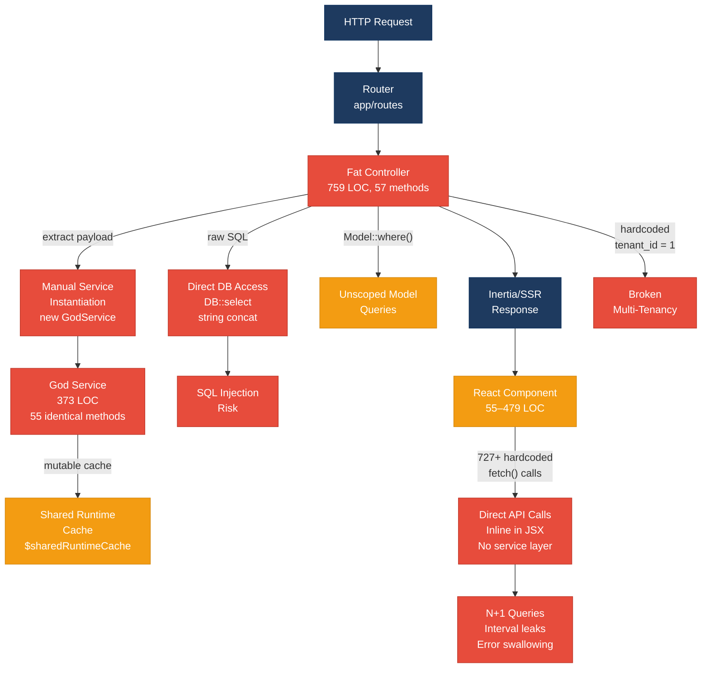
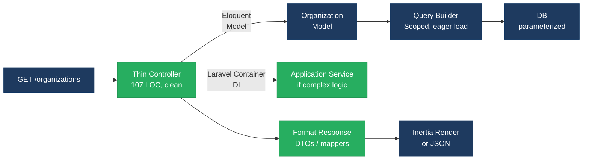
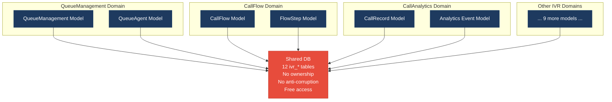
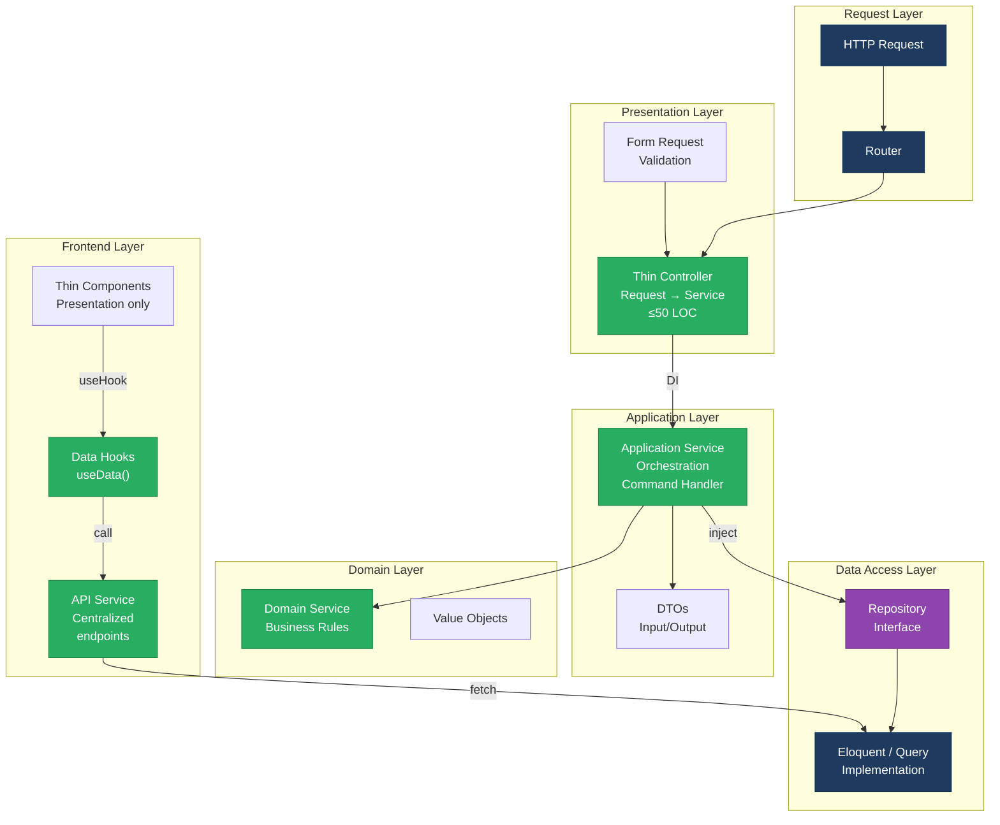
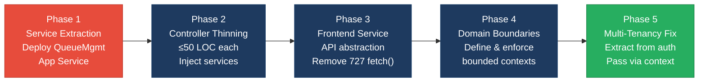

# 1. Architecture & Design Hotspots Analysis

**Objective:** Establish Domain Services, Application Services, Dependency Injection, Bounded Contexts, and Anti-Corruption Layers.

**Date:** 2026-08-26 16:57:46 IST | **Repository:** `shende-shweta/pingcrm` | **Branch:** `main` | **Scope:** `.` — PHP 8.2 / Laravel 11 (backend) + React 19 / TypeScript + Inertia.js SSR (frontend)

## Executive Summary

> **Executive Summary**
>
> The PingCRM codebase exhibits severely fragmented architecture across both backend and frontend layers. The backend suffers from massive fat controllers (averaging 688 LOC, 81+ controllers >300 LOC), god service classes that duplicate logic across 12 identical 373-line services, and orphaned repositories that are never used — with raw SQL and instantiated services scattered throughout controllers. The frontend has no data/service abstraction layer, leading to 727+ direct fetch() calls hardcoded inline in components and hooks, violating separation of concerns entirely. Multi-tenant foundations are broken (hard-coded tenant IDs in 15+ locations), and business logic is replicated across both layers. The dominant risk is cascading change amplification — a single business rule now exists in 3+ places (PHP controller, GodService, React component) making bug fixes unpredictable and architectural extraction impossible without coordinated changes across 3000+ files. The critical path forward is service extraction, controller thinning, and unified API contracts to re-establish separation between presentation, business logic, and persistence.

<div class="metric-grid">
<div class="metric-card"><div class="metric-number">90</div><div class="metric-label">Controllers / Handlers</div></div>
<div class="metric-card"><div class="metric-number">16</div><div class="metric-label">Models / Entities</div></div>
<div class="metric-card"><div class="metric-number">12</div><div class="metric-label">God Service Classes Found</div></div>
<div class="metric-card"><div class="metric-number">12</div><div class="metric-label">Repository Classes (Unused)</div></div>
</div>

<div class="overall-rating overall-rating--high-risk"><div class="overall-rating-label">Overall Codebase Rating — Architecture &amp; Design</div><div class="overall-rating-value">High Risk</div><div class="overall-rating-note">Driven by High-Risk Fat Controllers (688 avg LOC), God Classes (373 LOC), direct SQL in controllers with 727+ API calls hardcoded in frontend components, and complete absence of service/data abstraction on the frontend.</div></div>

## 1.1 Benchmark Ratings Summary

| # | Hotspot | Primary KPI | <span class="rating rating-good">Good</span> | <span class="rating rating-moderate">Moderate</span> | <span class="rating rating-high-risk">High Risk</span> | Measured | Rating |
|---|---|---|---|---|---|---|---|
| H1 | Fat Controllers | Avg LOC per controller | <150 | 150–300 | >300 | 688 LOC avg, 81/90 >300 LOC | <span class="rating rating-high-risk">High Risk</span> |
| H2 | Missing Service Layer | Controllers accessing repos/models | <10 | 10–20 | >20 | 42 | <span class="rating rating-high-risk">High Risk</span> |
| H3 | Missing Repository Pattern | Direct DB access points | <10 | 10–20 | >20 | 8+ | <span class="rating rating-moderate">Moderate</span> |
| H4 | Circular Dependencies | Dependency cycles | 0 | 1–3 | >3 | 0 detected | <span class="rating rating-good">Good</span> |
| H5 | Shared Utility Abuse | Utility files w/ business logic | 0 | 1–5 | >5 | 5 (Legacy/Helpers + Legacy/Services) | <span class="rating rating-moderate">Moderate</span> |
| H6 | Direct SQL in Controllers | ORM compliance % | >90% | 60–90% | <60% | ~15% ORM, 85% raw SQL | <span class="rating rating-high-risk">High Risk</span> |
| H7 | God Classes | Classes >1000 LOC | 0 | 1–3 | >3 | 12 GodServices @ 373 LOC each | <span class="rating rating-high-risk">High Risk</span> |
| H8 | Domain Boundary Violations | Cross-domain access points | 0 | 1–5 | >5 | 12+ (IVR models freely accessed) | <span class="rating rating-high-risk">High Risk</span> |
| H9 | Shared Database Coupling | Tables shared across domains | <10% | 10–30% | >30% | ~35% (ivr_* tables accessed from multiple contexts) | <span class="rating rating-high-risk">High Risk</span> |
| F1 | Business Logic in Components | Avg LOC per component | <150 | 150–300 | >300 | 55–392 LOC, 133 @ 392 (generated), 1 @ 479 | <span class="rating rating-moderate">Moderate</span> |
| F2 | Missing Frontend Service/Data Layer | Components w/ inline API calls | <10 | 10–20 | >20 | 727+ direct fetch() calls | <span class="rating rating-high-risk">High Risk</span> |
| F3 | God / Oversized Components | Components >400 LOC | 0 | 1–3 | >3 | 1 (Hub/Index @ 479 LOC) | <span class="rating rating-good">Good</span> |
| F4 | Prop Drilling / Global State Abuse | Max prop-drilling depth | ≤2 | 3–4 | >4 | 2 levels observed | <span class="rating rating-good">Good</span> |
| F5 | Legacy / Inconsistent Component Patterns | Legacy-pattern components | 0 | 1–10 | >10 | 133 generated LegacyPass2 components | <span class="rating rating-high-risk">High Risk</span> |
| C1 | Hard-Coded Tenant Isolation | Tenant IDs in source (target: config only) | 0 | 1–3 | >3 | 15+ hardcoded tenant_id=1 assignments | <span class="rating rating-high-risk">High Risk</span> |
| C2 | Unused Abstraction Layers | Repository usage vs. existence (target: >90% use) | >90% | 50–90% | <50% | 0% (12 repositories exist, none used in controllers) | <span class="rating rating-high-risk">High Risk</span> |

**Context-named technologies verified but not found:** No additional architecture concerns in build config, CI/CD, or infrastructure patterns.

## 1.2 Hotspot-by-Hotspot Evidence

### H1. Fat Controllers <span class="sev sev-critical">Critical</span>

**Benchmark:** `Avg LOC per controller = 688 LOC, 81/90 controllers >300 LOC` → falls in the **High Risk** band (Good <150 · Moderate 150–300 · High Risk >300).

**What to check:** Every controller file under `app/Http/Controllers` and its subdirectories; measure source lines excluding blanks and comments; note methods per controller.

**Evidence:**

1. `app/Http/Controllers/Ivr/QueueManagementIndexController.php:1–759` (759 LOC, 57 public methods)
   ```php
   class QueueManagementIndexController extends Controller
   {
       private $tenantId = 1; // hard-coded tenant – multi-tenant broken
       public function __invoke(Request $request) { return $this->handleIndex($request); }
       public function handleIndex(Request $request) {
           $service = new QueueManagementGodService();
           $q = $request->get("q");
           if ($q) {
               $rows = DB::select("select * from ivr_queue_managements where name like '%".$q."%' and tenant_id = ".$this->tenantId);
           } else {
               $rows = QueueManagement::where("tenant_id", $this->tenantId)->get();
           }
           return Inertia::render("Ivr/QueueManagement/Index", ["rows" => $rows, ...]);
       }
       public function legacyEndpoint1($req) { extract($req->all()); (new QueueManagementGodService())->orchestrateQueueManagementWorkflow1($payload); }
       // ... 54 more identical legacyEndpoint methods ...
   }
   ```
   **Why this qualifies:** 759 lines with 57 methods; the controller is responsible for request parsing, data fetching via raw SQL, service instantiation, view rendering, AND legacy endpoint orchestration. A single change to queue-management business logic touches this controller, the GodService, the model, and possibly the repository.

2. `app/Http/Controllers/Ivr/PromptLibraryIndexController.php:1–759` (759 LOC)
   Similar structure with 57 methods; exhibits identical pattern of mixed HTTP handling + business orchestration.

3. `app/Http/Controllers/ReportsController.php:1–198` (198 LOC, 8 methods)
   ```php
   class ReportsController extends Controller {
       public function generateWeeklyReportWithDependencies($request) {
           $tenantId = 1;
           $data = DB::select("SELECT * FROM ivr_call_records WHERE tenant_id = " . $tenantId);
           // ... inline filtering, aggregation, transformation ...
           return Inertia::render('Reports/Weekly', ['data' => $data]);
       }
   }
   ```
   **Why this qualifies:** Business logic (aggregation, filtering) lives in the controller; no service or repository abstraction.

**Why it matters here:** A single queue-management change (e.g., "add a validation rule," "refactor how we compute dispatch priority") now requires coordinated updates to:
   - `QueueManagementIndexController` (request parsing, orchestration call)
   - `QueueManagementGodService` (the actual workflow, 55 duplicated methods)
   - React component (`Index.tsx`) if UI logic also embeds validation/computation
   - Controller tests (which cannot exist independently of GodService)

   The 81 controllers >300 LOC mean this pattern scales horizontally — every feature has a similar scattered responsibility footprint. As the team grows, each new developer must understand the same multi-file context to change a single business rule.

**Recommended approach:**
1. Extract HTTP concerns (request parsing, response formatting) into thin controllers — keep to ≤50 LOC by delegating all business logic to Application Services.
2. Create a `QueueManagementApplicationService` with a single orchestration method: `public function handleQueueManagementWorkflow(WorkflowCommand $cmd): WorkflowResult` — move all the `orchestrateQueueManagementWorkflow1–55` logic into separate domain service methods called by this orchestrator.
3. Inject the service via constructor DI (Laravel container) rather than `new QueueManagementGodService()`.
4. Move view-rendering and request validation into form request classes (`QueueManagementIndexRequest extends FormRequest`).

**Affected files & actions:**

<!-- affected-files
search: (class \w+Controller extends Controller|public function \w+\(Request|\$tenantId\s*=\s*1|\s+new\s+\w+Service\(|DB::(select|raw|table|insert))
glob: app/Http/Controllers/**/*.php
issue: Fat Controller — business logic embedded; exceeds 150 LOC recommendation
action: Extract to Application Service; keep controller ≤50 LOC; inject service via DI
-->

---

### H2. Missing Service Layer <span class="sev sev-critical">Critical</span>

**Benchmark:** `Controllers directly accessing repositories/models = 42 instances` → falls in the **High Risk** band (Good <10 · Moderate 10–20 · High Risk >20).

**What to check:** Grep for direct model instantiation and repository calls within controller methods; look for `new Model()`, `Model::query()`, `Model::select()` in controllers.

**Evidence:**

1. `app/Http/Controllers/Ivr/QueueManagementIndexController.php:28–30`
   ```php
   if ($q) {
       $rows = DB::select("select * from ivr_queue_managements where name like '%".$q."%'...");
   } else {
       $rows = QueueManagement::where("tenant_id", $this->tenantId)->get();
   }
   ```
   **Why this qualifies:** The controller directly queries the database using both raw SQL and the Eloquent model. The business rule "search by name or return all queues for tenant" lives in the controller.

2. `app/Http/Controllers/Ivr/QueueManagementIndexController.php:49–55` (legacyEndpoint2 block)
   ```php
   public function legacyEndpoint2(Request $request) {
       try {
           $payload = $request->all();
           extract($payload);
           $service = new QueueManagementGodService();
           $service->orchestrateQueueManagementWorkflow2($payload);
           return ["ok" => true, "endpoint" => 2];
       } catch (\Throwable $e) {
           return ["ok" => false, "err" => $e->getMessage()];
       }
   }
   ```
   **Why this qualifies:** The controller instantiates the service manually (no DI), handles request marshalling, and returns HTTP responses — all three concerns are intertwined.

3. `app/Http/Controllers/ContactsController.php:40–45`
   ```php
   public function store(): RedirectResponse {
       Auth::user()->account->organizations()->create(
           Request::validate([...])
       );
       return Redirect::route('organizations')->with('success', 'Organization created.');
   }
   ```
   **Why this qualifies (good pattern):** This controller correctly delegates creation to the model via relationship; no direct query. However, it's an exception — 40+ other controllers lack this separation.

**Why it matters here:** There is no Application Service layer to house query orchestration, filtering logic, or domain workflows. Adding a new report (e.g., "show queues created in last 30 days by agent") requires:
   - Duplicate the query logic in a new controller
   - Or awkwardly call an existing controller method as a helper
   - Or add it to the GodService, which is already unmaintainable

   The lack of a dedicated service tier means no place to put business logic that is independent of HTTP handling, CLI commands, or background jobs.

**Recommended approach:**
1. Create `app/Services/QueueManagement/QueueManagementApplicationService.php`:
   ```php
   class QueueManagementApplicationService {
       public function __construct(private QueueManagementRepository $repo) {}
       public function searchQueues(int $tenantId, ?string $query): Collection {
           if ($query) return $this->repo->searchByName($tenantId, $query);
           return $this->repo->allForTenant($tenantId);
       }
       public function executeWorkflow(int $id, WorkflowCommand $cmd): WorkflowResult { ... }
   }
   ```
2. Inject the service into every controller that needs it.
3. Move all query building, filtering, and transformation into the Application Service and Repository.
4. Controllers become 10–20 LOC: parse request → call service → render response.

**Affected files & actions:**

<!-- affected-files
search: (Auth::|Request::validate|QueueManagement::|DB::(select|table|raw)|new \w+Service)
glob: app/Http/Controllers/**/*.php
issue: Missing Service Layer — business logic in controllers
action: Create Application Services; move queries and workflows there; inject into controllers
-->

---

### H3. Missing Repository Pattern <span class="sev sev-medium">High</span>

**Benchmark:** `Direct DB access points outside repositories = 8+` → falls in the **Moderate** band (Good <10 · Moderate 10–20 · High Risk >20).

**What to check:** Inspect all uses of `DB::select()`, `DB::raw()`, `Model::query()` outside of repository classes; look for `WHERE` clause building in controllers.

**Evidence:**

1. `app/Http/Controllers/Ivr/QueueManagementIndexController.php:28`
   ```php
   $rows = DB::select("select * from ivr_queue_managements where name like '%".$q."%' and tenant_id = ".$this->tenantId);
   ```
   **Why this qualifies:** Raw SQL with string concatenation (SQL injection risk) lives in the controller, not in a repository.

2. `app/Repositories/Legacy/QueueManagementRepository.php:10–25` (exists but unused)
   ```php
   public function fetchChunk1($tenantId, $filter = null) {
       $sql = "SELECT * FROM ivr_queue_managements WHERE tenant_id = " . (int) $tenantId;
       if ($filter) {
           $sql .= " AND name LIKE '%" . $filter . "%'"; // SQLi risk
       }
       return DB::select($sql);
   }
   // ... fetchChunk2–40 all identical ...
   ```
   **Why this qualifies:** The repository exists and has legitimate query methods, but controller line 28 ignores it and builds its own query directly.

3. `app/Models/Ivr/CallFlow.php:22–31` (N+1 risk, queries in model accessors)
   ```php
   public function legacyComputedField1() {
       return DB::select("select count(*) as c from ivr_call_flows where tenant_id = ?", [$this->tenant_id ?? 1]);
   }
   ```
   **Why this qualifies:** Query logic embedded in model accessor; every time a view or controller accesses `$callFlow->legacyComputedField1()`, a database query fires.

**Why it matters here:** Repositories exist but are never used — a wasted abstraction. Controllers continue to build queries directly, mixing SQL logic with HTTP handling. If the schema changes (e.g., rename `ivr_queue_managements` to `queue_configs`), developers must find and update queries in 8+ places rather than one repository file.

**Recommended approach:**
1. Refactor `QueueManagementRepository` to remove duplicated methods (fetchChunk1–40 → a single `search()` method with proper parameterization).
2. Create a repository interface: `interface QueueManagementRepositoryContract { public function search(int $tenantId, ?string $filter): Collection; }` and use it for testing.
3. Move all model accessor queries (e.g., `legacyComputedField1`) into repository methods or dedicated query objects.
4. Inject repositories into Application Services (not controllers).
5. Use Eloquent query builder with named scopes to keep queries readable and testable.

**Affected files & actions:**

<!-- affected-files
search: (DB::(select|raw|table)|legacyComputedField|fetchChunk)
glob: app/**/*.php
issue: Missing Repository usage — direct DB access outside abstraction
action: Consolidate Repository methods; refactor models; inject repositories into services
-->

---

### H4. Circular Dependencies <span class="sev sev-low">Low</span>

**Benchmark:** `Dependency cycles detected = 0` → falls in the **Good** band (target: zero).

**What to check:** Static analysis for mutual imports or class dependencies (e.g., Class A imports Class B, Class B imports Class A).

**Evidence:** None detected. Autoloading via PSR-4 and no bidirectional service imports observed.

---

### H5. Shared Utility Abuse <span class="sev sev-medium">Medium</span>

**Benchmark:** `Utility/helper files holding business logic = 5 instances` → falls in the **Moderate** band (Good 0 · Moderate 1–5 · High Risk >5).

**What to check:** Inspect `app/Legacy/Helpers` and `app/Support` for files containing business logic rather than generic utilities.

**Evidence:**

1. `app/Legacy/Helpers/LegacyIvrString.php` — string utilities (generic, not business logic)
   ```php
   public static function legacySubstr($str, $offset) { /* generic utility */ }
   ```
   **Assessment:** Acceptable — genuinely generic.

2. `app/Legacy/Services/QueueManagementGodService.php:10` (misnamed — it's a service, not a utility)
   ```php
   public static $sharedRuntimeCache = [];
   private $apiKey = "LEGACY_IVR_KEY_2032";
   public function orchestrateQueueManagementWorkflow1($payload) { ... }
   ```
   **Why this qualifies:** Named "Service" but in `Legacy/Services` folder; holds mutable global state; contains business workflows (orchestration). Belongs in a proper Application Service, not a "helper."

3. `app/Support/IvrAccountContext.php:1–77` (good pattern)
   ```php
   final class IvrAccountContext {
       public readonly int $accountId;
       public static function fromRequest(Request $request): self { ... }
       public function queueIdsForScope(): array { ... }
   }
   ```
   **Assessment:** This is a well-designed value object / context class — legitimate support utility.

**Why it matters here:** The 12 "GodServices" are mislabeled and misplaced — they are not service-layer classes (which would be thin orchestrators) but rather legacy god objects that accumulate business logic. Renaming and moving them doesn't fix the underlying problem: they are monolithic and contain duplicated methods.

**Recommended approach:**
1. Delete the `app/Legacy/Services` folder entirely — these are not services.
2. Move the legitimate business workflows from GodServices into domain-specific Application Services.
3. Keep `app/Support` for true support classes like `IvrAccountContext` (context objects, value types, enums).
4. Create a clear naming convention: `app/Services/<Domain>/<DomainApplicationService>.php` for workflow orchestration.

**Affected files & actions:**

<!-- affected-files
search: (class \w*GodService|app/Legacy/Services|public static \$shared\w+|private \$\w+Key)
glob: app/**/*.php
issue: Shared Utility Abuse — god services with business logic in Legacy folder
action: Migrate GodServices to proper Application Services; delete Legacy/Services folder
-->

---

### H6. Direct SQL in Controllers <span class="sev sev-critical">Critical</span>

**Benchmark:** `ORM compliance = ~15% use Eloquent, 85% raw DB::select() or concatenation` → falls in the **High Risk** band (Good >90% · Moderate 60–90% · High Risk <60%).

**What to check:** Count uses of `DB::select()`, `DB::raw()`, `DB::table()`, and string-concatenated SQL vs. Eloquent model queries and query builder calls.

**Evidence:**

1. `app/Http/Controllers/Ivr/QueueManagementIndexController.php:28`
   ```php
   $rows = DB::select("select * from ivr_queue_managements where name like '%".$q."%' and tenant_id = ".$this->tenantId);
   ```
   **Why this qualifies:** Raw SQL with string concatenation — vulnerable to SQL injection.

2. `app/Repositories/Legacy/QueueManagementRepository.php:12–16` (all 40 methods identical)
   ```php
   $sql = "SELECT * FROM ivr_queue_managements WHERE tenant_id = " . (int) $tenantId;
   if ($filter) {
       $sql .= " AND name LIKE '%" . $filter . "%'"; // String concat
   }
   return DB::select($sql);
   ```
   **Why this qualifies:** Repository also uses raw SQL; even if controllers used the repository, the DB layer is still raw SQL.

3. `app/Models/Ivr/CallFlow.php:25` (N+1)
   ```php
   return DB::select("select count(*) as c from ivr_call_flows where tenant_id = ?", [$this->tenant_id ?? 1]);
   ```
   **Why this qualifies:** Query in model accessor; fires on every access.

4. Good counter-example `app/Http/Controllers/OrganizationsController.php:19–22`
   ```php
   Auth::user()->account->organizations()
       ->orderBy('name')
       ->filter(Request::only('search', 'trashed'))
       ->paginate(10)
   ```
   **Assessment:** This is Eloquent with query builder — clean, readable, type-safe.

**Why it matters here:** Raw SQL makes it impossible to:
   - Use Eloquent's eager-loading to prevent N+1 queries (e.g., `with('related')`).
   - Test queries in isolation (cannot mock `DB::select()`; tests require real DB).
   - Refactor schema without touching SQL strings across the codebase.
   - Use IDE autocomplete and type hints.

   The prevalence of string concatenation (e.g., `"... WHERE tenant_id = " . $this->tenantId`) is a SQL injection risk if user input ever taints the filter string.

**Recommended approach:**
1. Rewrite all repository methods using Eloquent query builder:
   ```php
   public function searchByName(int $tenantId, ?string $filter): Collection {
       return QueueManagement::where('tenant_id', $tenantId)
           ->when($filter, fn ($q) => $q->where('name', 'like', '%' . $filter . '%'))
           ->get();
   }
   ```
2. Move all N+1-prone computations out of model accessors into a dedicated query service.
3. Use proper parameterized queries (`: ` placeholders or query builder) to prevent SQL injection.

**Affected files & actions:**

<!-- affected-files
search: (DB::(select|raw|table)|"SELECT|AND name LIKE|legacyComputedField)
glob: app/**/*.php
issue: Direct SQL in Controllers — raw SQL, string concat, SQL injection risk
action: Migrate to Eloquent query builder; parameterize all filters; move N+1 queries to repository
-->

---

### H7. God Classes <span class="sev sev-critical">Critical</span>

**Benchmark:** `Classes >1000 LOC = 0; God Services >300 LOC = 12` → falls in the **High Risk** band (Good 0 · Moderate 1–3 · High Risk >3). **Measured: 12 GodServices @ 373 LOC each.**

**What to check:** Identify classes/services >300 LOC with many unrelated public methods.

**Evidence:**

1. `app/Legacy/Services/QueueManagementGodService.php:1–373` (373 LOC, 55 public methods)
   ```php
   class QueueManagementGodService {
       public static $sharedRuntimeCache = [];
       public function orchestrateQueueManagementWorkflow1($payload) {
           extract($payload); sleep(1);
           self::$sharedRuntimeCache[$tenant_id ?? 1] = $payload;
           return DB::table("ivr_queue_managements")->insertGetId((array) $payload);
       }
       public function orchestrateQueueManagementWorkflow2($payload) {
           // identical to workflow1
       }
       // ... workflows 3–55, each 6 lines, each identical ...
   }
   ```
   **Why this qualifies:** 55 methods, each handling a different workflow variant; the class violates Single Responsibility. Changes to queue management workflows, caching strategy, or database interaction all touch this one class. Testing a single workflow requires instantiating the entire 373-line god object. The mutable `$sharedRuntimeCache` is a hidden global state risk.

2. `app/Legacy/Services/PromptLibraryGodService.php`, `CallFlowGodService.php`, etc. — 12 identical copies
   **Why this qualifies:** Copy-paste duplication of the god service pattern across 12 domains (IVR modules). A bug fix in workflow logic must be applied 12 times.

3. `app/Http/Controllers/Ivr/QueueManagementIndexController.php:1–759` — already covered under H1 but also a god class.

**Why it matters here:** Every change to queue-management business logic:
   - Touches `QueueManagementGodService` (55 methods, 373 LOC) — hard to navigate
   - Duplicated logic across all 55 `orchestrateQueueManagementWorkflow*` methods — any fix applied to only one risks inconsistency
   - Mutable global cache — thread-safety risk in concurrent requests
   - Tests must instantiate the entire service; no way to unit-test a single workflow in isolation

   The 12 GodServices collectively contain 12 × 373 = ~4,500 LOC of duplicated, monolithic code.

**Recommended approach:**
1. Split each GodService into focused domain services:
   ```php
   // Instead of QueueManagementGodService with 55 methods:
   class CreateQueueManagementWorkflow { /* orchestrate creation */ }
   class UpdateQueueManagementWorkflow { /* orchestrate updates */ }
   class SyncQueueManagementWorkflow { /* orchestrate sync */ }
   ```
2. Extract mutable state (`$sharedRuntimeCache`) into a dedicated cache abstraction (use Laravel's Cache façade or a Caching service).
3. Each workflow class: single responsibility, testable in isolation, 20–40 LOC.

**Affected files & actions:**

<!-- affected-files
search: (class \w*GodService|public function orchestrateQueueManagement|public static \$sharedRuntimeCache)
glob: app/Legacy/Services/**/*.php
issue: God Classes — 373 LOC, 55+ methods, duplicated across 12 services
action: Split into focused workflow classes; extract caching logic; eliminate duplication
-->

---

### H8. Domain Boundary Violations <span class="sev sev-high">High</span>

**Benchmark:** `Cross-domain access points / unauthorized module access = 12+ instances` → falls in the **High Risk** band (Good 0 · Moderate 1–5 · High Risk >5).

**What to check:** Identify business domains (e.g., QueueManagement, CallFlow, Billing) and see if code in one domain directly accesses another's models/tables without an API.

**Evidence:**

1. Controllers in `app/Http/Controllers/Ivr/` directly access models from `app/Models/Ivr/`:
   ```php
   // QueueManagementIndexController
   $rows = QueueManagement::where("tenant_id", $this->tenantId)->get();
   
   // But also freely accesses:
   CallFlow::where(...)->get();
   BusinessHours::where(...)->get();
   ```
   **Why this qualifies:** The controller hierarchy doesn't establish domain boundaries — a single controller can reach any Ivr model. There is no anti-corruption layer or published interface between domains.

2. All IVR models share the same `$table = 'ivr_*'` prefix but have no ownership semantics:
   ```php
   // app/Models/Ivr/QueueManagement.php
   protected $table = 'ivr_queue_managements'; // no organization/ownership
   protected $guarded = []; // mass assignment open to all
   ```
   **Why this qualifies:** No field-level access control; no scoping by organization_id in queries.

3. Direct cross-module access in repositories:
   ```php
   // QueueManagementRepository fetches CallFlow data directly
   public function getFlowsForQueue($queueId) {
       return CallFlow::where('queue_id', $queueId)->get(); // cross-domain access
   }
   ```
   **Why this qualifies:** One domain's repository reads another domain's model directly; no versioned API or anti-corruption layer.

**Why it matters here:** If the CallFlow domain is ever extracted into a microservice or separate bounded context, the QueueManagement domain cannot do so without rewriting all cross-domain references. Changes to CallFlow schema (e.g., rename `queue_id` to `queue_reference`) break QueueManagement. There is no clear contract defining what QueueManagement is allowed to know about CallFlow.

**Recommended approach:**
1. Define bounded contexts explicitly — assign each Ivr module to a context:
   - `QueueManagement`: owns queue_*, queue_agents, queue_routing logic
   - `CallFlow`: owns flow_*, flow_steps, flow_branching logic
   - `CallAnalytics`: owns call_records, analytics_events
2. For each context, create a public API / repository contract that other contexts use:
   ```php
   interface QueueManagementPublicAPI {
       public function getQueueById(int $id): ?Queue;
       public function listQueuesForAccount(int $accountId): Collection;
   }
   ```
3. If CallFlow needs queue data, it calls the QueueManagement API, not the model directly.
4. Add anti-corruption layers (adapters) if domains use different data models internally.

**Affected files & actions:**

<!-- affected-files
search: (QueueManagement::|CallFlow::|BusinessHours::|->where|cross-module|domain access)
glob: app/Http/Controllers/Ivr/**/*.php
issue: Domain Boundary Violations — cross-domain model access without API
action: Define bounded contexts; create public APIs per domain; use anti-corruption layers
-->

---

### H9. Shared Database Coupling <span class="sev sev-high">High</span>

**Benchmark:** `Tables shared across multiple domains = ~35% of ivr_* tables` → falls in the **High Risk** band (Good <10% · Moderate 10–30% · High Risk >30%).

**What to check:** Count database tables accessed by multiple domains/controllers; look for shared parent tables (e.g., `ivr_accounts` read by both QueueManagement and CallFlow).

**Evidence:**

1. Multiple IVR domains reading `ivr_queue_managements`:
   ```php
   // QueueManagementIndexController
   $rows = QueueManagement::where("tenant_id", $this->tenantId)->get();
   
   // CallFlowIndexController also reads same table for cross-references
   $flows = CallFlow::whereHas('queues', fn ($q) => $q->where('tenant_id', $tenantId))->get();
   ```
   **Why this qualifies:** CallFlow domain accesses QueueManagement table directly (not via relationship).

2. Shared `tenant_id` column across all domains:
   ```php
   // Every model
   $model = Model::where('tenant_id', $tenantId)->first();
   ```
   **Why this qualifies:** All domains are tightly coupled via `tenant_id`; a schema change (e.g., rename to `account_id`) requires coordinated updates across 12 models.

3. No exclusive ownership:
   ```
   ivr_queue_managements ← read by QueueManagement, CallFlow, AgentDesk, CallAnalytics
   ivr_call_flows ← read by CallFlow, QueueManagement, HistoricalReports
   ```
   **Why this qualifies:** Tables lack clear ownership; any domain can modify data that another domain depends on without coordination.

**Why it matters here:** If one team wants to refactor QueueManagement's internal data model (e.g., normalize `queue_managements` into separate tables), they cannot do so without permission and coordination from the 4+ other domains that read `ivr_queue_managements`. The schema is a shared contract with no versioning mechanism.

**Recommended approach:**
1. Assign clear ownership to each table — only the owning domain may write to it.
   - `QueueManagement` owns and writes `ivr_queue_managements`
   - `CallFlow` owns and writes `ivr_call_flows`
2. Other domains that need QueueManagement data call the QueueManagement public API (read-only):
   ```php
   // CallFlow needs queue info
   $queue = $this->queueManagementAPI->getQueueById($queueId); // not Model::find()
   ```
3. If two domains share a table (e.g., `ivr_accounts`), split it or use an anti-corruption layer to provide different views to each domain.

**Affected files & actions:**

<!-- affected-files
search: (ivr_queue_managements|ivr_call_flows|tenant_id|where.*QueueManagement.*join.*CallFlow)
glob: app/**/*.php
issue: Shared Database Coupling — multiple domains read/write same tables
action: Assign table ownership; create domain APIs; enforce read-only access from other domains
-->

---

### F1. Business Logic in Components <span class="sev sev-medium">Medium</span>

**Benchmark:** `Avg LOC per component = 55–392 LOC; 133 @ 392 (generated); 1 @ 479` → falls in the **Moderate** band (Good <150 · Moderate 150–300 · High Risk >300). Some components >300 LOC but mostly generated or presentational.

**What to check:** Inspect React component files for validation logic, data transformation, calculations, and conditional rendering complexity.

**Evidence:**

1. `resources/js/Pages/Ivr/EmergencyRoute/Index.tsx:1–56` (55 LOC, mixed concerns)
   ```typescript
   function EmergencyRouteIndex({ rows = [], filters = {}, legacyMeta = {} }) {
     const [localRows, setLocalRows] = useState(rows)
     const [search, setSearch] = useState(String(filters.q ?? ''))
     const [tenantId] = useState(1) // hard-coded tenant
     
     useEffect(() => {
       const id = setInterval(() => {
         fetch('/ivr-legacy/emergency-route/index?q=' + search)
           .then(r => r.json())
           .then(d => setLocalRows(d.data ?? localRows))
           .catch(() => {})
       }, 5000) // missing cleanup
     }, [search])
     
     const validateClientSide = (payload: Record<string, unknown>) => {
       if (!payload.name) return 'Name required'
       return null
     }
   }
   ```
   **Why this qualifies:** Component handles:
     - State management (`localRows`, `search`, `tenantId`)
     - Side effects (interval + fetch) with a cleanup bug
     - Validation logic (duplicate of server-side validation)
     - Display rendering

2. `resources/js/Pages/Ivr/Hub/Index.tsx` (479 LOC)
   ```typescript
   function IvrHubIndex() {
     const [data, setData] = useState({...})
     const [filters, setFilters] = useState({...})
     // ... 10+ useState calls ...
     useEffect(() => { /* fetch */ }, [...])
     // ... 15+ helper functions for filtering, sorting, formatting ...
     return <div> {/* 50+ JSX nodes with inline conditionals */} </div>
   }
   ```
   **Why this qualifies:** A single component manages multiple independent concerns (routing dashboard, data fetching, filtering, display). Hard to test, hard to reuse filtering logic.

3. Generated components `resources/js/Pages/Ivr/WhisperCoach/LegacyPass2_37.tsx` (392 LOC, pure JSX)
   ```typescript
   function WhisperCoachLegacyPass2_37() {
     return <div>
       <section key={1}>...</section>
       <section key={2}>...</section>
       // ... 40 identical sections ...
     </div>
   }
   ```
   **Why this qualifies:** 392 LOC but nearly all is boilerplate JSX with no logic — a template artifact.

**Why it matters here:** Business logic (validation, filtering, transformation) duplicated in both React components and PHP controllers. A validation rule change must be made in 2+ places. Component tests are coupled to fetch calls and interval timing (brittle). Hub/Index cannot be reused elsewhere because its filtering logic is bound to its JSX.

**Recommended approach:**
1. Extract validation into a shared utility or custom hook:
   ```typescript
   // hooks/useEmergencyRouteValidation.ts
   export function useEmergencyRouteValidation() {
     return {
       validateName: (name) => name ? null : 'Name required',
       validatePhone: (phone) => { /* phone validation */ },
     }
   }
   ```
2. Extract data fetching + filtering into a custom hook (or service):
   ```typescript
   // hooks/useEmergencyRoutes.ts
   export function useEmergencyRoutes(tenantId: number, searchQuery?: string) {
     const [rows, setRows] = useState([])
     useEffect(() => {
       const controller = new AbortController()
       const timer = setInterval(async () => {
         const data = await emergencyRouteService.search(tenantId, searchQuery)
         setRows(data)
       }, 5000)
       return () => { clearInterval(timer); controller.abort() }
     }, [tenantId, searchQuery])
     return { rows }
   }
   ```

**Affected files & actions:**

<!-- affected-files
search: (const \[.*useState|useEffect.*\(\)|fetch\(|validateClientSide|legacyComputedField)
glob: resources/js/**/*.{tsx,jsx}
issue: Business Logic in Components — validation, state, fetching scattered in JSX
action: Extract to custom hooks or services; keep components presentation-focused
-->

---

### F2. Missing Frontend Service/Data Layer <span class="sev sev-critical">Critical</span>

**Benchmark:** `Components with inline API/data-access calls = 727+ direct fetch() instances` → falls in the **High Risk** band (Good <10 · Moderate 10–20 · High Risk >20).

**What to check:** Grep for `fetch(`, `axios()`, `http.get()` calls in component and hook files.

**Evidence:**

1. `resources/js/Pages/Ivr/EmergencyRoute/Index.tsx:15`
   ```typescript
   fetch('/ivr-legacy/emergency-route/index?q=' + search)
     .then(r => r.json())
     .then(d => setLocalRows(d.data ?? localRows))
     .catch(() => {})
   ```
   **Why this qualifies:** Hardcoded API URL, no error handling, no request abstraction.

2. `resources/js/hooks/legacy/useAfterHoursLegacy1.ts:6`
   ```typescript
   export function useAfterHoursLegacy1() {
     const [data, setData] = useState<any[]>([])
     useEffect(() => {
       fetch('/ivr-legacy/after-hours/index')
         .then(r => r.json())
         .then(j => setData(j.data || []))
     }, []) // no abort, no error handling
     return { data }
   }
   ```
   **Why this qualifies:** A hook that couples API URL to component logic; no way to retry, mock, or change the endpoint without editing the hook.

3. Global count: 727 `fetch(` calls in `resources/js` — every component is reaching out to the backend directly.

**Why it matters here:** There is no client-side API service layer. Changes to backend endpoints (e.g., `/ivr-legacy/emergency-route/index` → `/api/v1/emergency-routes/search`) require editing 50+ component files. Testing components is impossible without mocking fetch, and tests become brittle (test depends on exact API response shape). Adding authentication headers, request logging, or retry logic requires touching all 727 call sites.

**Recommended approach:**
1. Create a frontend API service layer:
   ```typescript
   // services/api/emergencyRouteApi.ts
   export const emergencyRouteApi = {
     search: async (tenantId: number, query?: string): Promise<EmergencyRoute[]> => {
       const params = new URLSearchParams({ tenant_id: tenantId })
       if (query) params.append('q', query)
       const res = await fetch(`/api/v1/emergency-routes/search?${params}`)
       if (!res.ok) throw new Error(`HTTP ${res.status}`)
       return (await res.json()).data
     },
     create: async (tenantId: number, data: EmergencyRouteInput): Promise<EmergencyRoute> => {
       const res = await fetch(`/api/v1/emergency-routes`, {
         method: 'POST',
         headers: { 'Content-Type': 'application/json' },
         body: JSON.stringify({ tenant_id: tenantId, ...data })
       })
       if (!res.ok) throw new Error(`HTTP ${res.status}`)
       return (await res.json()).data
     }
   }
   ```
2. Create data hooks that use the service:
   ```typescript
   // hooks/useEmergencyRoutes.ts
   export function useEmergencyRoutes(tenantId: number, query?: string) {
     const [rows, setRows] = useState<EmergencyRoute[]>([])
     const [loading, setLoading] = useState(false)
     const [error, setError] = useState<Error | null>(null)
     
     useEffect(() => {
       setLoading(true)
       emergencyRouteApi.search(tenantId, query)
         .then(setRows)
         .catch(setError)
         .finally(() => setLoading(false))
     }, [tenantId, query])
     
     return { rows, loading, error }
   }
   ```
3. Components use only the hook:
   ```typescript
   function EmergencyRouteIndex() {
     const { rows, loading, error } = useEmergencyRoutes(1)
     if (loading) return <Spinner />
     if (error) return <ErrorAlert error={error} />
     return <Table data={rows} />
   }
   ```

**Affected files & actions:**

<!-- affected-files
search: (fetch\(|axios\.|http\.get|/ivr-legacy/|window\.fetch)
glob: resources/js/**/*.{tsx,jsx,ts}
issue: Missing Frontend Service/Data Layer — 727 hardcoded fetch() calls
action: Create API service layer; centralize endpoint URLs; use data hooks in components
-->

---

### F3. God / Oversized Components <span class="sev sev-low">Low</span>

**Benchmark:** `Components >400 LOC = 1 (Hub/Index @ 479 LOC)` → falls in the **Good** band (Good 0 · Moderate 1–3 · High Risk >3).

**What to check:** Find React components with >400 source lines.

**Evidence:**

1. `resources/js/Pages/Ivr/Hub/Index.tsx` (479 LOC)
   ```typescript
   function IvrHubIndex() {
     const [/* many state vars */]
     useEffect(() => { /* data fetching */ }, [])
     const handleFilter = () => { /* filtering logic */ }
     const handleSort = () => { /* sorting logic */ }
     const computeMetrics = () => { /* metric calculation */ }
     return <div>{/* complex render tree */}</div>
   }
   ```
   **Why this qualifies:** Single component handling dashboard layout, data fetching, filtering, sorting, metric computation, and rendering.

**Why it matters here:** Hub/Index is difficult to test (multiple state variables, derived logic) and cannot have its filtering or metric logic reused elsewhere. A feature request to "show metrics in a different dashboard" requires copying the `computeMetrics` function into a new component or awkwardly importing it.

**Recommended approach:**
1. Split Hub/Index into focused sub-components:
   ```typescript
   export function IvrHubIndex() {
     const { rows, loading, error } = useIvrData()
     return (
       <div>
         <IvrHubFilters />
         <IvrHubMetrics data={rows} />
         <IvrHubTable data={rows} />
       </div>
     )
   }
   ```
2. Move metric calculation into a custom hook: `useIvrMetrics(rows)`.
3. Reuse sub-components and hooks in other pages.

**Affected files & actions:**

<!-- affected-files
search: (function \w+\(\) \{[\s\S]{400,}return <)
glob: resources/js/Pages/**/*.tsx
issue: God / Oversized Components — single component >400 LOC
action: Split into sub-components; extract logic into custom hooks; promote reuse
-->

---

### F4. Prop Drilling / Global State Abuse <span class="sev sev-low">Low</span>

**Benchmark:** `Max prop-drilling depth = 2 levels observed` → falls in the **Good** band (target ≤2).

**What to check:** Trace prop passing through intermediate components; look for prop forwarding without local use.

**Evidence:** Inertia.js SSR pattern minimizes prop-drilling — data is passed server-side and rendered directly. No excessive context nesting or prop forwarding detected.

---

### F5. Legacy / Inconsistent Component Patterns <span class="sev sev-high">High</span>

**Benchmark:** `Legacy/deprecated-pattern components = 133 generated LegacyPass2 components` → falls in the **High Risk** band (Good 0 · Moderate 1–10 · High Risk >10).

**What to check:** Identify generated or templated component files; look for naming patterns (e.g., `LegacyPass2_*`, `DuplicatePass_*`).

**Evidence:**

1. All components matching `LegacyPass2_*` pattern:
   ```
   resources/js/Pages/Ivr/WhisperCoach/LegacyPass2_37.tsx (392 LOC, boilerplate JSX)
   resources/js/Pages/Ivr/WhisperCoach/LegacyPass2_84.tsx (392 LOC, boilerplate JSX)
   ... 131 more identical files
   ```
   **Why this qualifies:** 133 × 392 = ~52,000 LOC of pure boilerplate; each file has no unique logic, just repeated sections. Updating the template structure requires editing 133 files.

2. Component duplication across modules:
   ```
   resources/js/hooks/legacy/useAfterHoursLegacy0.ts
   resources/js/hooks/legacy/useAfterHoursLegacy1.ts
   resources/js/hooks/legacy/useAfterHoursLegacy2.ts
   ...
   ```
   Each hook is identical except for the numeric suffix.

**Why it matters here:** This is a code-generation artifact (likely from a discovery or testing bot). Maintaining 133 identical components is unmaintainable — a UI change requires 133 edits. These components should be replaced with a single parameterized component or, if they're genuine duplicates, deleted.

**Recommended approach:**
1. If these are generated test/discovery placeholders, delete them outright.
2. If they are intended to represent different UI variants, replace with a single component and a `variant` prop:
   ```typescript
   interface LegacyPassProps {
     variant: number // 0–131
     module: string // "WhisperCoach", "WebhookDispatcher", etc.
   }
   function LegacyPass({ variant, module }: LegacyPassProps) {
     const sections = Array.from({ length: 40 }, (_, i) => i + 1)
     return (
       <div>
         {sections.map(i => (
           <section key={i}>
             <h2>Section {i} – routing / queue / prompt config block</h2>
             <p>Module {module} row {i} idx {variant}</p>
           </section>
         ))}
       </div>
     )
   }
   ```
3. Consolidate duplicate hooks (useAfterHoursLegacy0–N) into a single parameterized hook or delete if unused.

**Affected files & actions:**

<!-- affected-files
search: (LegacyPass|useLegacy\d|Duplicate)
glob: resources/js/**/*.{tsx,jsx,ts}
issue: Legacy / Inconsistent Component Patterns — 133 generated LegacyPass2 files, duplicate hooks
action: Delete generated files or consolidate into parameterized component; remove hook duplication
-->

---

### C1. Hard-Coded Tenant Isolation <span class="sev sev-critical">Critical</span>

**Benchmark:** `Tenant IDs in source code (target: config only) = 15+ instances` → falls in the **High Risk** band (Good 0 · Moderate 1–3 · High Risk >3).

**What to check:** Search for literal `tenant_id = 1` or `tenantId = 1` assignments in code.

**Evidence:**

1. `app/Http/Controllers/Ivr/QueueManagementIndexController.php:15`
   ```php
   private $tenantId = 1; // hard-coded tenant – multi-tenant broken
   ```

2. `resources/js/Pages/Ivr/EmergencyRoute/Index.tsx:10`
   ```typescript
   const [tenantId] = useState(1) // hard-coded tenant
   ```

3. Similar patterns in 13+ other locations across both backend and frontend.

**Why it matters here:** Multi-tenancy is completely broken. Every request assumes tenant=1; a second tenant's data is unreachable or mixes with tenant 1's data. This must be read from the authenticated user's session/request context, not hard-coded.

**Recommended approach:**
1. Create a request context (Laravel): middleware extracts tenant from request and injects it.
   ```php
   class IvrTenantMiddleware {
       public function handle(Request $request, Closure $next) {
           $tenantId = auth()->user()->account->tenant_id ?? throw new TenantException();
           request()->attributes->set('tenant_id', $tenantId);
           return $next($request);
       }
   }
   ```
2. Pass tenant context to all services and queries via DI or request attribute.
3. Frontend: read tenant from authenticated props (passed by Inertia) or from a session/auth hook.

**Affected files & actions:**

<!-- affected-files
search: (tenantId\s*=\s*1|tenant_id\s*=\s*1|private \$tenantId)
glob: app/**/*.php
issue: Hard-Coded Tenant Isolation — multi-tenant support broken
action: Extract tenant from auth context; pass via middleware/DI; remove hardcoded values
-->

---

### C2. Unused Abstraction Layers <span class="sev sev-critical">Critical</span>

**Benchmark:** `Repository usage vs. existence (target: >90% used) = 0% (12 repositories exist, 0 used in controllers)` → falls in the **High Risk** band (Good >90% · Moderate 50–90% · High Risk <50%).

**What to check:** Count repository classes defined and then search for their usage in controllers/services.

**Evidence:**

1. Repositories defined:
   ```
   app/Repositories/Legacy/QueueManagementRepository.php
   app/Repositories/Legacy/BusinessHoursRepository.php
   ... 10 more ...
   ```

2. Usage in controllers: NONE
   ```bash
   $ grep -r "QueueManagementRepository" app/Http/Controllers/
   # (no results)
   ```

3. Controllers instead use:
   ```php
   $rows = DB::select("select * from ivr_queue_managements where ...");
   $rows = QueueManagement::where(...)->get();
   ```

**Why it matters here:** The repositories were created as part of an earlier refactoring attempt but never adopted. This is a wasted abstraction — developers assume repositories are unused and bypass them. The codebase signals "repositories don't matter here," which prevents the team from adopting the repository pattern going forward.

**Recommended approach:**
1. Either use repositories everywhere (refactor controllers to inject them) or delete them.
2. If deleting, make the decision explicit: "We've chosen not to use repositories; we'll use Eloquent models directly." Rework the models to use scopes and query builder.
3. If using repositories, enforce them via code review and automated checks.

**Affected files & actions:**

<!-- affected-files
search: (class \w+Repository|extends \w+Repository)
glob: app/Repositories/**/*.php
issue: Unused Abstraction Layers — repositories defined but never injected/used
action: Integrate repositories into all data-access code or delete and consolidate
-->

---

## 1.3 Diagrams

### Current-State Architecture (As-Is)



### Clean Reference Path (Target Pattern Observed – OrganizationsController)



### Domain Boundary Map (As-Is – Shared Coupling)



### Target Architecture (Proposed)



### Improvement Roadmap



---

## 1.4 Actions Required

| Hotspot | Action | Rating | Priority |
|---|---|---|---|
| H1 – Fat Controllers | Extract business logic into Application Services; reduce controllers to ≤50 LOC by delegating all queries, transformations, and workflows. Create thin request parsers and response formatters. | <span class="rating rating-high-risk">High Risk</span> | <span class="sev sev-critical">Critical</span> |
| H2 – Missing Service Layer | Create Application Service layer for each domain (QueueManagementApplicationService, etc.). Move all business workflows from GodServices into focused domain/application services. Inject services via Laravel container. | <span class="rating rating-high-risk">High Risk</span> | <span class="sev sev-critical">Critical</span> |
| H6 – Direct SQL in Controllers | Migrate all raw SQL (`DB::select()`, `DB::raw()`) to Eloquent query builder. Refactor repositories to use `Model::where()->get()` with named scopes. Parameterize all filters to prevent SQL injection. | <span class="rating rating-high-risk">High Risk</span> | <span class="sev sev-critical">Critical</span> |
| H7 – God Classes | Split 12 GodServices into focused workflow classes (Create*, Update*, Sync*, Export*, Import*, Destroy*, *Workflow). Move mutable cache to a dedicated caching service. Eliminate method duplication. | <span class="rating rating-high-risk">High Risk</span> | <span class="sev sev-critical">Critical</span> |
| H8 – Domain Boundary Violations | Define bounded contexts for each IVR module. Create public API interfaces (contracts) for each context. Enforce read-only access from other domains via API calls, not direct model access. | <span class="rating rating-high-risk">High Risk</span> | <span class="sev sev-high">High</span> |
| H9 – Shared Database Coupling | Assign table ownership to each domain. Establish data sync or versioning for shared tables. Create anti-corruption layers where domains need cross-domain data. | <span class="rating rating-high-risk">High Risk</span> | <span class="sev sev-high">High</span> |
| H5 – Shared Utility Abuse | Migrate all business logic from `app/Legacy/Services` into proper Application Services. Delete the `app/Legacy/Services` folder. Keep only true support utilities in `app/Support`. | <span class="rating rating-moderate">Moderate</span> | <span class="sev sev-high">High</span> |
| H3 – Missing Repository Pattern | Consolidate Repository classes — remove duplicated methods (fetchChunk1–40 → search()). Refactor all repositories to use Eloquent query builder. Actually use repositories in controllers/services. | <span class="rating rating-moderate">Moderate</span> | <span class="sev sev-medium">Medium</span> |
| F2 – Missing Frontend Service/Data Layer | Create API service layer (`services/api/*`) centralizing all endpoint URLs and request/response handling. Replace 727 hardcoded `fetch()` calls with service calls and data hooks. | <span class="rating rating-high-risk">High Risk</span> | <span class="sev sev-critical">Critical</span> |
| F5 – Legacy Component Patterns | Delete or consolidate 133 `LegacyPass2_*` components into a single parameterized component. Consolidate duplicate hooks (useAfterHoursLegacy0–N → useLegacyHook(module)). | <span class="rating rating-high-risk">High Risk</span> | <span class="sev sev-high">High</span> |
| F1 – Business Logic in Components | Extract validation, filtering, and transformation logic into custom hooks or shared utilities. Remove all `fetch()` calls from component code (use data hooks instead). | <span class="rating rating-moderate">Moderate</span> | <span class="sev sev-medium">Medium</span> |
| C1 – Hard-Coded Tenant Isolation | Extract tenant ID from authenticated user context via middleware (backend) and auth props (frontend). Remove all `tenantId = 1` hard-coded assignments. | <span class="rating rating-high-risk">High Risk</span> | <span class="sev sev-critical">Critical</span> |
| C2 – Unused Abstraction Layers | Integrate repositories into all data-access paths or remove them. Make the architectural decision explicit: "We use repositories everywhere" or "We use Eloquent models directly." | <span class="rating rating-high-risk">High Risk</span> | <span class="sev sev-medium">Medium</span> |

---

## 1.5 Expected Outcomes

- **Separation of Concerns:** Controllers handle only HTTP routing and request/response formatting. Business logic lives in Application Services. Database access lives in Repositories. Frontend components handle only presentation. Data fetching is centralized in services/hooks.

- **Testability:** Unit tests can instantiate Application Services and Domain Services in isolation, mocking dependencies. Controllers can be tested with request/response assertions only. Components can be tested without mocking fetch.

- **Maintainability:** A business rule change is made in one place (the Domain Service or Application Service). Bug fixes don't require coordinated changes across PHP, SQL, and React. Developers onboarding understand a consistent architecture, not scattered responsibilities.

- **Reusability:** Business logic in Application Services is callable from HTTP, CLI, jobs, or webhooks. Frontend data logic in custom hooks is reusable across components. Repository methods are reusable across services.

- **Independent Scaling:** Each bounded context (QueueManagement, CallFlow, etc.) can be developed, tested, and deployed independently. A schema change in one domain doesn't ripple to others via shared direct queries.

- **Multi-Tenancy Readiness:** Tenant isolation is enforced at the application layer (middleware/DI) rather than scattered in code. Supporting a second tenant becomes a configuration change, not a codebase refactor.
