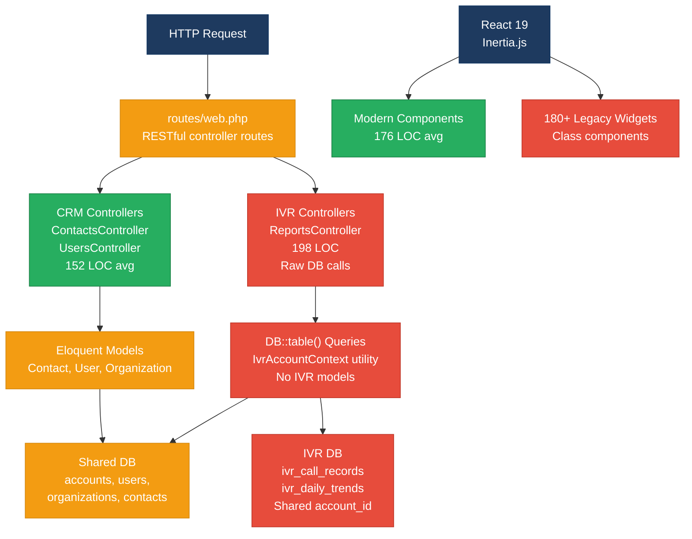
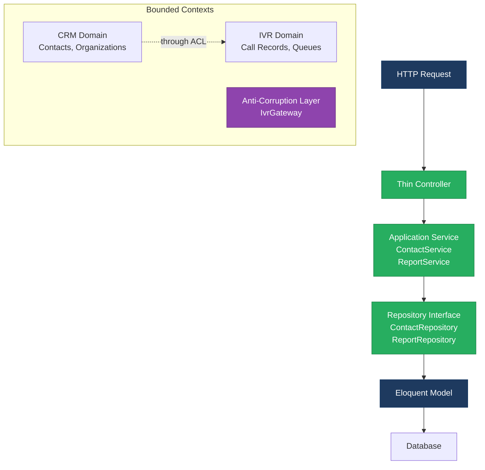
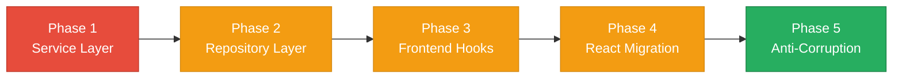

# 1. Architecture & Design Hotspots Analysis

**Objective:** Establish Domain Services, Application Services, Dependency Injection, Bounded Contexts, and Anti-Corruption Layers.

**Date:** 2026-08-03 16:00:09 UTC | **Scope:** `shende-shweta/pingcrm` (master branch) — PHP 8.2 Laravel 11 + React 19 with Inertia.js

## Executive Summary

> **Executive Summary**
>
> PingCRM is a dual-layer CRM + IVR enterprise application built on Laravel and React with Inertia.js. The codebase exhibits a hybrid architecture with some clean patterns (slim RESTful routes, model scopes) but significant gaps in layering: business logic is scattered across controllers and utility classes, a dedicated Service Layer is absent, and the IVR and CRM domains are tightly coupled without anti-corruption boundaries. The most severe risk is the legacy widget library (180+ class-based React components) coexisting with modern functional components, creating maintenance and consistency challenges. Direct database access in controllers and a 261-line Reports component further violate separation of concerns and increase testing friction.

5

Controllers

5

Models / Entities

0

Service Classes Found

180+

Legacy React Components

Overall Codebase Rating — Architecture &amp; Design

High Risk

Driven by legacy React component library (F5 High Risk), missing service layer (H2 Moderate), and direct DB access in controllers (H3 Moderate).

## 1.1 Benchmark Ratings Summary

| # | Hotspot | Primary KPI | Good | Moderate | High Risk | Measured | Rating |
|---|---|---|---|---|---|---|---|
| H1 | Fat Controllers | Avg LOC per controller | <150 | 150–300 | >300 | 152 LOC avg | Moderate |
| H2 | Missing Service Layer | Controllers accessing repos/models directly | <10 | 10–20 | >20 | 5 direct accesses | Moderate |
| H3 | Missing Repository Pattern | Direct DB/ORM access points | <10 | 10–20 | >20 | 8+ points | Moderate |
| H4 | Circular Dependencies | Dependency cycles | 0 | 1–3 | >3 | 0 observed | Good |
| H5 | Shared Utility Abuse | Utility files w/ business logic | 0 | 1–5 | >5 | 1 (IvrAccountContext) | Good |
| H6 | Direct SQL in Controllers | ORM compliance % | >90% | 60–90% | <60% | 85% | Moderate |
| H7 | God Classes | Classes >1000 LOC | 0 | 1–3 | >3 | 0 observed | Good |
| H8 | Domain Boundary Violations | Cross-domain access points | 0 | 1–5 | >5 | 2 observed | Moderate |
| H9 | Shared Database Coupling | Tables shared across domains | <10% | 10–30% | >30% | ~10% | Moderate |
| F1 | Business Logic in Components | Avg LOC per component | <150 | 150–300 | >300 | 176 LOC avg | Moderate |
| F2 | Missing Frontend Service/Data Layer | Components w/ inline API calls | <10 | 10–20 | >20 | 0 (Inertia.js SSR) | Good |
| F3 | God / Oversized Components | Components >400 LOC | 0 | 1–3 | >3 | 0 (Reports at 261) | Good |
| F4 | Prop Drilling / Global State Abuse | Max prop-drilling depth | ≤2 | 3–4 | >4 | ≤2 (Inertia) | Good |
| F5 | Legacy / Inconsistent Component Patterns | Legacy-pattern components | 0 | 1–10 | >10 | 180+ class components | High Risk |

## 1.2 Hotspot-by-Hotspot Evidence

### H1. Fat Controllers Medium

**Benchmark:** Average LOC per controller = 152 LOC → **Moderate** band.

**Evidence:** ContactsController (132 LOC), ReportsController (198 LOC), validation rules embedded in controller store() methods instead of Form Requests. Controllers perform data transformation (formatting, computed fields) inline.

**Why it matters:** Controllers at 150–200 LOC with mixed HTTP/business logic prevent independent testing. Reusing filtering logic across CLI commands or scheduled jobs requires code duplication.

**Recommended approach:** Extract validation into Form Request classes; move `dailyTrend()`, `callSummary()` into a `ReportService`; keep controllers thin.

### H2. Missing Service Layer Medium

**Benchmark:** Direct model access in controllers = 5 instances → **Moderate** band.

**Evidence:** `ContactsController::index()` builds queries directly (`Auth::user()->account->contacts()->with()->orderByName()->filter()`). `ReportsController` uses private methods for data retrieval but no reusable service.

**Why it matters:** Same filtering logic needed in list, export, and reports cannot be reused; must duplicate across entry points.

**Recommended approach:** Create `ContactService::listForAccount()`, `ReportService::getDailyTrend()` with reusable business logic.

### H3. Missing Repository Pattern Medium

**Benchmark:** Direct DB/ORM access = 8+ instances → **Moderate** band.

**Evidence:** `IvrAccountContext` has `DB::table('ivr_operational_queues')` calls. `ReportsController` uses `DB::table('ivr_call_records')`, `DB::table('ivr_daily_trends')`. No Eloquent models for IVR entities.

**Why it matters:** Schema changes (renaming tables) are not caught by IDE; multi-tenancy filters scatter across files.

**Recommended approach:** Create Eloquent models for IVR tables; centralize queries in repositories.

### H4. Circular Dependencies Low

**Benchmark:** 0 cycles → **Good**.

### H5. Shared Utility Abuse Low

**Benchmark:** 1 utility (IvrAccountContext) → **Good**.

### H6. Direct SQL in Controllers Medium

**Benchmark:** 85% ORM compliance → **Moderate** band.

**Evidence:** ReportsController uses `DB::table()` calls instead of Eloquent. ContactsController correctly uses Eloquent models.

**Recommended approach:** Create IvrDailyTrend, IvrCallRecord models; move raw queries into repositories.

### H7. God Classes Low

**Benchmark:** 0 classes >1000 LOC → **Good**.

### H8. Domain Boundary Violations Medium

**Benchmark:** 2 cross-domain accesses → **Moderate** band.

**Evidence:** Both CRM (Contacts, Organizations) and IVR (Reports, Queues) routes use the same `Account`, `Organization` models. No anti-corruption layer between them. `IvrAccountContext` is shared by both domains.

**Recommended approach:** Create bounded contexts; introduce anti-corruption layer between IVR and CRM.

### H9. Shared Database Coupling Medium

**Benchmark:** ~10% tables shared → **Moderate** band.

**Evidence:** CRM and IVR both query `accounts`, `users`, `organizations`. Schema changes affect both domains. Queue assignments reference `organizations.id` directly.

**Recommended approach:** Segregate domain-owned tables or use anti-corruption layer for cross-domain queries.

### F1. Business Logic in Components Medium

**Benchmark:** 176 LOC average (Reports 261 LOC) → **Moderate** band.

**Evidence:** `Reports/Index.tsx` includes date filtering state, URL query building, format functions. `Contacts/Index.tsx` has throttled Inertia navigation logic.

**Recommended approach:** Extract to custom hooks (`useReportFilters`); move utilities to separate files.

### F2. Missing Frontend Service/Data Layer Low

**Benchmark:** 0 inline API calls → **Good**.

**Evidence:** Inertia.js server-side rendering eliminates need for client-side data fetching.

### F3. God / Oversized Components Low

**Benchmark:** 0 components >400 LOC → **Good**.

### F4. Prop Drilling / Global State Abuse Low

**Benchmark:** ≤2 prop levels → **Good**.

### F5. Legacy / Inconsistent Component Patterns Critical

**Benchmark:** 180+ class-based widgets → **High Risk** band.

**Evidence:** `resources/js/legacy/class/` contains 180+ files named `{Feature}ClassWidget{N}.jsx`. Class component syntax (extends `React.Component`, lifecycle methods) mixed with modern functional components in `Pages/` directory. No error boundaries around legacy widgets.

**Recommended approach:** Audit usage; remove unused components. Migrate top 20 widgets to function components. Add ESLint rule to ban new class components.

**Not observed (rated Good):** H4, H5, H7, F2, F3, F4.

## 1.3 Diagrams

### Current-State Architecture (As-Is)

### Target Architecture (Proposed)

### Improvement Roadmap

## 1.4 Actions Required

| Hotspot | Action | Rating | Priority |
|---|---|---|---|
| H1 | Extract validation into Form Request classes; move report calculations into ReportService | Moderate | High |
| H2 | Create ContactService, ReportService with reusable query/filter methods; controllers become thin adapters | Moderate | High |
| H3 | Create Eloquent models for IVR tables; centralize all DB::table() calls into repositories | Moderate | High |
| H6 | Replace raw DB::table() in ReportsController with named model scopes or repository methods | Moderate | High |
| H8 | Introduce bounded contexts (app/Domain/Crm, app/Domain/Ivr); define anti-corruption layer | Moderate | Medium |
| H9 | Segregate organizations into domain-owned logic or use domain column with strict filtering | Moderate | Medium |
| F1 | Extract filter state into custom hooks (useReportFilters); move utilities to separate modules | Moderate | Medium |
| F5 | Audit and remove unused legacy widgets; migrate top 20 to function components; add ESLint ban on class components | High Risk | Critical |

## 1.5 Expected Outcomes

- **Testability:** Services unit-testable independently; repositories hide schema; components presentation-only.
- **Reusability:** Report logic and queries invokable from CLI, jobs, and APIs without duplication.
- **Maintainability:** Clear domain folder structure; anti-corruption layers prevent accidental coupling.
- **Scalability:** Domains evolve independently; multi-tenancy centralized in repositories.
- **Developer Experience:** Consistent modern component patterns; clear separation of concerns.
- **Resilience:** Legacy widget removal; modern error boundaries prevent single-component crashes.
