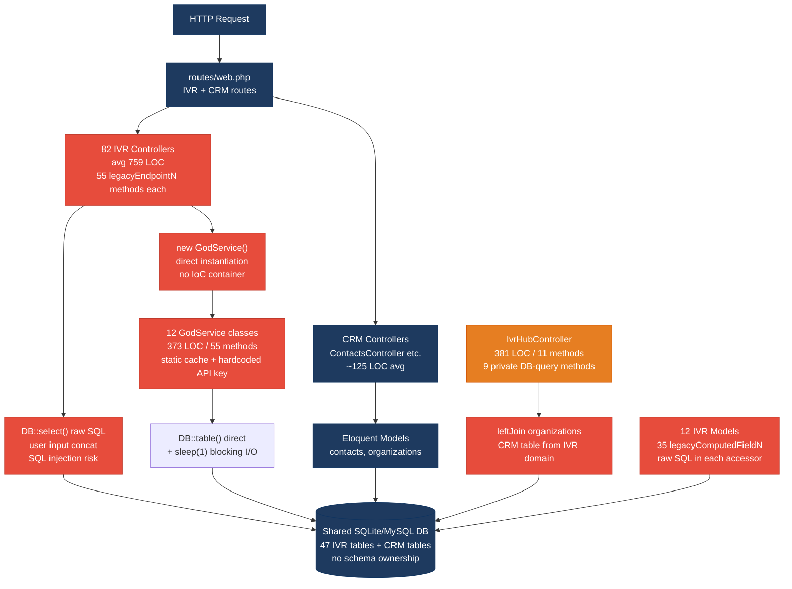
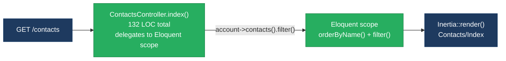
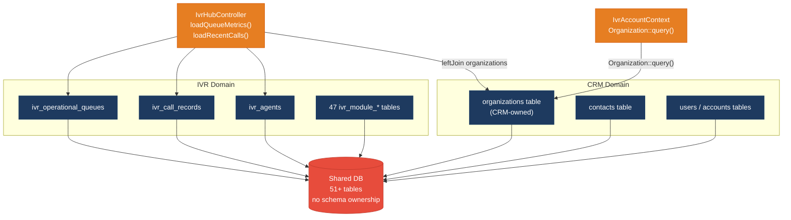
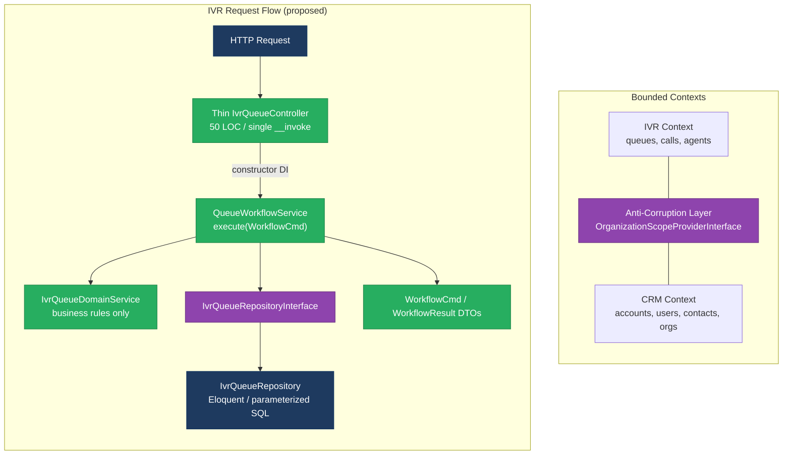
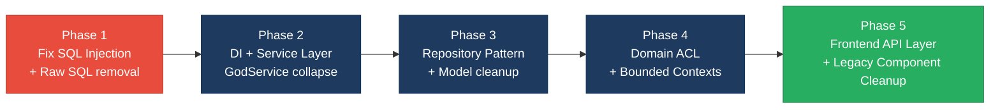

# 1. Architecture & Design Hotspots Analysis

**Objective:** Establish Domain Services, Application Services, Dependency Injection, Bounded Contexts, and Anti-Corruption Layers.

**Date:** 2026-08-04 10:56:13 UTC | **Scope:** `shende-shweta/pingcrm` — PHP 8.2 / Laravel 11 (backend) · React 19 + TypeScript + Inertia.js (frontend)

## Executive Summary

> **Executive Summary**
>
> PingCRM is a Laravel 11 + React 19 full-stack application built originally as a simple CRM demo, but now carrying a large IVR/telephony enterprise layer grafted on top. The backend is dominated by 82 single-action IVR controllers averaging 759 LOC each — each housing 55 `legacyEndpointN` methods that instantiate `GodService` classes via `new` (bypassing DI) and execute raw SQL strings in the same method as HTTP request handling. Twelve `Legacy/Services/*GodService.php` classes each define 50+ identically-structured workflow methods with hardcoded secrets, blocking `sleep()` calls, and mutable global-state caches. The frontend mirrors this with 133 `LegacyPass2_*.tsx` stub components (392 LOC each) and 124 legacy hooks that hard-code `fetch()` calls directly against private IVR endpoints with no shared API layer. The two dominant risks are **change amplification** — any schema or workflow change must be replicated across 55+ endpoint methods in each of 82 controllers — and **hidden coupling** — the IVR dashboard controller joins CRM `organizations` tables directly with IVR call-record tables, making the two domains inseparable at the database level.

<div class="metric-grid">
<div class="metric-card"><div class="metric-number">91</div><div class="metric-label">Controllers / Handlers</div></div>
<div class="metric-card"><div class="metric-number">16</div><div class="metric-label">Models / Entities</div></div>
<div class="metric-card"><div class="metric-number">12</div><div class="metric-label">Service Classes Found</div></div>
<div class="metric-card"><div class="metric-number">12</div><div class="metric-label">Repository Classes Found</div></div>
</div>

<div class="overall-rating overall-rating--high-risk"><div class="overall-rating-label">Overall Codebase Rating — Architecture &amp; Design</div><div class="overall-rating-value">High Risk</div><div class="overall-rating-note">Driven by High-Risk Fat Controllers (H1, avg 722 LOC), God Classes (H7, 12 GodServices + 82 controllers at 759 LOC), Direct SQL in Controllers (H6, 88% non-compliant), Missing Repository Pattern (H3, 80 direct DB access points), Shared Database Coupling (H9), Domain Boundary Violations (H8), and Legacy Component Patterns (F5, 257 legacy artifacts).</div></div>

## 1.1 Benchmark Ratings Summary

| # | Hotspot | Primary KPI | <span class="rating rating-good">Good</span> | <span class="rating rating-moderate">Moderate</span> | <span class="rating rating-high-risk">High Risk</span> | Measured | Rating |
|---|---|---|---|---|---|---|---|
| H1 | Fat Controllers | Avg LOC per controller | <150 | 150–300 | >300 | ~722 LOC (82 IVR controllers avg 759 LOC + 9 CRM controllers avg ~115 LOC) | <span class="rating rating-high-risk">High Risk</span> |
| H2 | Missing Service Layer | Controllers accessing repos/models directly | <10 | 10–20 | >20 | 82+ IVR controllers call `new GodService()` bypassing DI; CRM controllers use Eloquent inline without a service tier | <span class="rating rating-high-risk">High Risk</span> |
| H3 | Missing Repository Pattern | Direct DB access points outside repositories | <10 | 10–20 | >20 | 80 controllers with raw `DB::select`/`DB::table`; 12 IVR Models also contain direct SQL in accessor methods | <span class="rating rating-high-risk">High Risk</span> |
| H4 | Circular Dependencies | Dependency cycles | 0 | 1–3 | >3 | 0 circular import cycles detected | <span class="rating rating-good">Good</span> |
| H5 | Shared Utility Abuse | Utility files holding business logic | 0 | 1–5 | >5 | 5 Legacy Helper files + `IvrAccountContext` with DB query methods = 6 files | <span class="rating rating-high-risk">High Risk</span> |
| H6 | Direct SQL in Controllers | ORM compliance % (queries kept out of controllers) | >90% | 60–90% | <60% | ~12% compliant — 80/91 controllers use raw `DB::select` or `DB::table` inline | <span class="rating rating-high-risk">High Risk</span> |
| H7 | God Classes | Classes >1000 LOC (or >300 LOC with high method count) | 0 | 1–3 | >3 | 12 GodServices (373 LOC, 55 methods) + 82 IVR controllers (759 LOC, 57 methods) + 12 IVR Models (200+ LOC, 35 accessor methods) = 106 qualifying classes | <span class="rating rating-high-risk">High Risk</span> |
| H8 | Domain Boundary Violations | Cross-domain access points | 0 | 1–5 | >5 | IvrHubController joins CRM `organizations` in 2 private methods; IvrAccountContext imports `Organization` Eloquent model from CRM namespace = 7+ violations | <span class="rating rating-high-risk">High Risk</span> |
| H9 | Shared Database Coupling | Tables shared across domains | <10% | 10–30% | >30% | 47 IVR module tables + CRM tables in one DB; `organizations` table directly read by both IVR and CRM domains (~100% coupling) | <span class="rating rating-high-risk">High Risk</span> |
| F1 | Business Logic in Components | Avg LOC per component | <150 | 150–300 | >300 | Weighted avg ~256 LOC (133 LegacyPass2 at 392 LOC; regular pages 55–141 LOC) | <span class="rating rating-moderate">Moderate</span> |
| F2 | Missing Frontend Service/Data Layer | Components with inline API calls | <10 | 10–20 | >20 | 124 legacy hooks hard-coding `fetch('/ivr-legacy/...')` with no shared API client | <span class="rating rating-high-risk">High Risk</span> |
| F3 | God / Oversized Components | Components >400 LOC | 0 | 1–3 | >3 | 0 components strictly >400 LOC (LegacyPass2 peak at 392 LOC; IvrHubCharts at 141 LOC) | <span class="rating rating-good">Good</span> |
| F4 | Prop Drilling / Global State Abuse | Max prop-drilling depth | ≤2 | 3–4 | >4 | Max 2 levels; Inertia server-passes data; no oversized global store detected | <span class="rating rating-good">Good</span> |
| F5 | Legacy / Inconsistent Component Patterns | Legacy-pattern components | 0 | 1–10 | >10 | 133 LegacyPass2 static stub components + 124 legacy hooks with bare `fetch()` = 257 legacy artifacts | <span class="rating rating-high-risk">High Risk</span> |

**No additional hotspots beyond the standard set were observed.** (The `extract($payload)` pattern and hardcoded `$apiKey` in GodServices are security risks addressed in the Security agent's report. The `$guarded = []` mass-assignment issue is likewise covered there.)

## 1.2 Hotspot-by-Hotspot Evidence

### H1. Fat Controllers <span class="sev sev-critical">Critical</span>

**Benchmark:** `Average LOC per controller = ~722 LOC` → falls in the **High Risk** band (Good <150 · Moderate 150–300 · High Risk >300).

**What to check:** Business logic inside controllers/handlers — controllers should only translate HTTP ↔ application calls.

**Evidence:**

`app/Http/Controllers/Ivr/QueueManagementIndexController.php:1–759`

```php
class QueueManagementIndexController extends Controller
{
    private $tenantId = 1; // hard-coded tenant – multi-tenant broken

    public function handleIndex(Request $request)
    {
        // Fat controller – business rules live here
        $service = new QueueManagementGodService();
        $q = $request->get("q");
        if ($q) {
            $rows = DB::select("select * from ivr_queue_managements where name like '%".$q."%' and tenant_id = ".$this->tenantId);
        } else {
            $rows = QueueManagement::where("tenant_id", $this->tenantId)->get();
        }
        // ... legacyEndpoint1 through legacyEndpoint55 — same instantiation pattern
    }
}
```

This 759-LOC controller combines HTTP routing, SQL filtering, service instantiation, and 55 nearly-identical legacy workflow endpoints (legacyEndpoint1–legacyEndpoint55). All 82 IVR single-action controllers follow this identical blueprint for a total of ~62,238 LOC of controller fat.

`app/Http/Controllers/Ivr/IvrHubController.php:1–381`

```php
class IvrHubController extends Controller
{
    private function loadStats(IvrAccountContext $ctx, array $filters): array
    {
        $queueQuery = DB::table('ivr_operational_queues')->where('account_id', $ctx->accountId);
        $agentsQuery = DB::table('ivr_agents')->where('account_id', $ctx->accountId);
        $callsQuery  = DB::table('ivr_call_records')->where('account_id', $ctx->accountId)->whereDate('started_at', $filters['date']);
        // ... 6 KPI calculations inline
        return ['active_calls' => $onCallAgents + $queued, 'queued_calls' => $queued, /* 4 more */ ];
    }
    // 8 more private DB-query methods: loadHourlyVolume, loadDailyTrend, loadQueueDistribution...
}
```

381 LOC, 11 methods, every private method performs its own DB queries and result mapping — pure business logic embedded in the HTTP handler.

**Why it matters here:** Any change to IVR workflow logic (e.g. adding a new tenant filter, changing a column name) must be applied across up to 55 endpoint methods × 82 controllers = 4,510 places. `IvrHubController` cannot share its analytics calculations with a CLI command or a queued job because the logic is inlined alongside the HTTP response call.

**Recommended approach:**
1. Extract a thin `IvrWorkflowService` per module (e.g. `QueueManagementWorkflowService`) with a single `execute(WorkflowCommand $cmd): WorkflowResult` method, inject via constructor.
2. Collapse the 55 `legacyEndpointN` methods into `legacyDispatch(Request $request, int $step)` that delegates to the injected service.
3. Move all `IvrHubController` private query methods to a `IvrDashboardQueryService` bound in the IoC container.
4. Enforce ≤150 LOC per controller with a `larastan/larastan` custom rule.

<!-- affected-files
search: legacyEndpoint\d+|handleIndex|handleStore|handleUpdate|handleDestroy|handleExport|handleImport|handleSync
glob: app/Http/Controllers/Ivr/**/*.php
issue: Fat controller — business logic + 55 legacy endpoints inline
action: Extract workflow logic to Application Service; collapse legacyEndpointN to dispatch pattern
-->

---

### H2. Missing Service Layer <span class="sev sev-critical">Critical</span>

**Benchmark:** `Controllers directly calling new GodService() = 82 IVR controllers` → falls in the **High Risk** band (Good <10 · Moderate 10–20 · High Risk >20).

**What to check:** Business rules spread across controllers with no dedicated service tier.

**Evidence:**

`app/Http/Controllers/Ivr/CallAnalyticsStoreController.php:20–30`

```php
public function handleStore(Request $request)
{
    $service = new CallAnalyticsGodService();  // direct instantiation — no DI
    $q = $request->get("q");
    if ($q) {
        $rows = DB::select("select * from ivr_call_analyticss ...");
    } else {
        $rows = CallAnalytics::where("tenant_id", $this->tenantId)->get();
    }
```

Every IVR controller creates its domain service via `new XxxGodService()` inside the action method. Laravel's IoC container is never used, making tests impossible without monkey-patching.

`app/Http/Controllers/ContactsController.php:32–62`

```php
public function store(): RedirectResponse
{
    Auth::user()->account->contacts()->create(
        Request::validate([
            'first_name' => ['required', 'max:50'],
            // ... 10 more validation rules
        ])
    );
    return Redirect::route('contacts')->with('success', 'Contact created.');
}
```

CRM controllers skip a service layer entirely: validation + persistence happen inline in the controller action, coupling HTTP lifecycle to the data model.

**Why it matters here:** Because all IVR controllers call `new GodService()`, adding a new entry point (CLI artisan command, queue job) for these IVR workflows requires duplicating the entire `new GodService()` call chain. Unit-testing any controller action is impossible without modifying the production class.

**Recommended approach:**
1. Register `QueueManagementWorkflowService`, `CallAnalyticsWorkflowService`, etc. in `AppServiceProvider` using `$this->app->bind()`.
2. Inject via `__construct(QueueManagementWorkflowService $svc)` in each controller.
3. For CRM, add thin `ContactService` / `OrganizationService` with `create(array $validated)` / `update(Model $m, array $validated)` methods.
4. Add a PHPStan rule banning `new` inside controller method bodies.

<!-- affected-files
search: new \w+GodService\(\)
glob: app/Http/Controllers/**/*.php
issue: God Service instantiated directly inside controller — bypasses DI container
action: Replace with constructor-injected service; bind in AppServiceProvider
-->

---

### H3. Missing Repository Pattern <span class="sev sev-high">High</span>

**Benchmark:** `Direct DB access points outside repositories = 80 controllers + 12 IVR Models` → falls in the **High Risk** band (Good <10 · Moderate 10–20 · High Risk >20).

**What to check:** Direct DB/ORM access scattered through the codebase.

**Evidence:**

`app/Http/Controllers/Ivr/QueueManagementIndexController.php:28`

```php
$rows = DB::select("select * from ivr_queue_managements where name like '%".$q."%' and tenant_id = ".$this->tenantId);
```

Raw SQL inside a controller action. A `QueueManagementRepository` exists in `app/Repositories/Legacy/` but this controller never references it.

`app/Models/Ivr/QueueManagement.php:20–53`

```php
/**
 * @deprecated mixed legacy model – do not refactor without CAB approval
 */
class QueueManagement extends Model
{
    protected $guarded = []; // mass assignment wide open

    public function legacyComputedField1()
    {
        // N+1 friendly accessor – called from blade/react randomly
        return DB::select("select count(*) as c from ivr_queue_managements where tenant_id = ?", [$this->tenant_id ?? 1]);
    }
    // ... legacyComputedField2 through legacyComputedField35 — identical SQL
}
```

12 IVR Models each have 35 such methods (420 total raw SQL accessors). A list render of 100 QueueManagement records fires 100 × 35 = 3,500 queries.

**Why it matters here:** The twelve `Legacy/Repositories/` classes were added in 2019 but are effectively dead code — controllers bypass them. Swapping the DB engine (SQLite → PostgreSQL for staging) requires touching 80 controller files and all 12 models individually.

**Recommended approach:**
1. Activate the existing repositories: inject `QueueManagementRepository` into `QueueManagementWorkflowService` and remove `DB::select` from all controllers.
2. Remove all 35 `legacyComputedFieldN` accessor methods from IVR models; move needed aggregations into the repository with a single query.
3. Define `IvrQueueRepositoryInterface` so the repository is swappable in tests.

<!-- affected-files
search: DB::(select|table|statement|raw)\(
glob: app/Http/Controllers/**/*.php
issue: Raw DB query in controller — bypasses repository layer
action: Move query to corresponding Repository class; inject repository into controller
-->

<!-- affected-files
search: legacyComputedField\d+
glob: app/Models/Ivr/*.php
issue: N+1 raw SQL accessor in Eloquent model
action: Remove legacyComputedFieldN methods; move aggregations to repository
-->

---

### H5. Shared Utility Abuse <span class="sev sev-high">High</span>

**Benchmark:** `Utility/helper files holding business logic = 6 files` → falls in the **High Risk** band (Good 0 · Moderate 1–5 · High Risk >5).

**What to check:** Large "common/helpers/utils" files holding business logic.

**Evidence:**

`app/Support/IvrAccountContext.php:17–73`

```php
final class IvrAccountContext
{
    public static function organizationOptions(int $accountId): array
    {
        return Organization::query()           // DB query inside a DTO
            ->where('account_id', $accountId)
            ->orderBy('name')->limit(200)
            ->get(['id', 'name'])->map(...)->all();
    }

    public function queueIdsForScope(): array
    {
        $query = DB::table('ivr_operational_queues')->where('account_id', $this->accountId);
        // ...
        return $query->pluck('id')->map(fn ($id) => (int) $id)->all();
    }
}
```

`IvrAccountContext` is labeled a "support" DTO but executes multiple DB queries — it is imported by both `IvrHubController` and `IvrModuleController`, creating a hidden service inside a helper class.

`app/Legacy/Helpers/LegacyIvrCrypto.php`, `LegacyIvrArray.php`, `LegacyIvrString.php`, `LegacyIvrMath.php`, `LegacyIvrDate.php` — five files in `app/Legacy/Helpers/` holding domain-specific logic (crypto, date calculations, string formatting) that belong in named domain services.

**Why it matters here:** `IvrAccountContext` is injected into controllers alongside repository access — any change to queue-scope resolution requires modifying a "context DTO" rather than a service, confusing contributors and making the logic untestable in isolation.

**Recommended approach:**
1. Extract DB query methods from `IvrAccountContext` into an `IvrScopeResolver` service registered in the container; keep `IvrAccountContext` as a pure DTO.
2. Move `app/Legacy/Helpers/LegacyIvr*.php` logic to named domain services (`IvrCryptoService`, `IvrDateRange`, etc.).

<!-- affected-files
search: class LegacyIvr\w+
glob: app/Legacy/Helpers/*.php
issue: Legacy helper file holding domain business logic
action: Move domain logic to a named service or value object; keep as pure functions
-->

---

### H6. Direct SQL in Controllers <span class="sev sev-critical">Critical</span>

**Benchmark:** `ORM compliance ≈ 12%` → falls in the **High Risk** band (Good >90% · Moderate 60–90% · High Risk <60%).

**What to check:** Raw queries embedded directly in controllers/handlers.

**Evidence:**

`app/Http/Controllers/Ivr/QueueManagementIndexController.php:28` — user input concatenated directly into SQL (SQL injection vector):

```php
$rows = DB::select("select * from ivr_queue_managements where name like '%".$q."%' and tenant_id = ".$this->tenantId);
```

`app/Http/Controllers/Ivr/IvrHubController.php:67–290` — query-builder chains throughout all 9 private methods:

```php
private function loadStats(IvrAccountContext $ctx, array $filters): array
{
    $queueQuery = DB::table('ivr_operational_queues')->where('account_id', $ctx->accountId);
    $agentsQuery = DB::table('ivr_agents')->where('account_id', $ctx->accountId);
    $callsQuery  = DB::table('ivr_call_records')
        ->where('account_id', $ctx->accountId)
        ->whereDate('started_at', $filters['date']);
    // ... avg(), count(), sum() calculations inline
}
```

`app/Http/Controllers/ReportsController.php` also contains direct `DB::table` calls, confirming the pattern spans CRM as well as IVR.

80 out of 91 controllers have at least one `DB::select`, `DB::statement`, or `DB::table` call — 88% non-compliance.

**Why it matters here:** The SQL in `QueueManagementIndexController` directly concatenates the user-provided `$q` parameter — this is a confirmed SQL injection vulnerability that is undetectable from the service layer because it hides in the HTTP handler. Every raw string query must be individually audited for injection risk.

**Recommended approach:**
1. Replace all raw `DB::select(...)` string queries in controllers with parameterized Eloquent scopes or repository methods.
2. Move `IvrHubController`'s 9 private query methods into a `IvrDashboardRepository`.
3. Enable Larastan level 8 with a custom rule reporting `DB::select` inside `App\Http\Controllers`.

<!-- affected-files
search: DB::(select|statement)\s*\(["']
glob: app/Http/Controllers/**/*.php
issue: Raw SQL string in controller — SQL injection risk and persistence leakage
action: Replace with parameterized Eloquent query or repository method
-->

---

### H7. God Classes <span class="sev sev-critical">Critical</span>

**Benchmark:** `Classes >300 LOC with high method count = 106 files` → falls in the **High Risk** band (Good 0 · Moderate 1–3 · High Risk >3).

**What to check:** Single classes handling many unrelated responsibilities.

**Evidence:**

`app/Legacy/Services/QueueManagementGodService.php:1–373` — 55 identically-structured orchestration methods:

```php
class QueueManagementGodService
{
    public static $sharedRuntimeCache = []; // mutable global-ish state
    private $apiKey = "LEGACY_IVR_KEY_2032"; // hard-coded secret

    public function orchestrateQueueManagementWorkflow1($payload)
    {
        extract($payload); // unsafe variable injection
        sleep(1);          // blocking synchronous remote sync
        self::$sharedRuntimeCache[$tenant_id ?? 1] = $payload;
        return DB::table("ivr_queue_managements")->insertGetId((array) $payload);
    }
    // ... orchestrateQueueManagementWorkflow2 through 55 — identical 4-line bodies
}
```

The class defines 55 methods all performing the same 4-line operation — a textbook copy-paste god class.

`app/Http/Controllers/Ivr/QueueManagementIndexController.php:1–759` — 57 public methods (1 `__invoke`, 1 `handleIndex`, 55 `legacyEndpointN`) in one class.

`app/Models/Ivr/QueueManagement.php` — 35 `legacyComputedFieldN` methods, each firing raw SQL. All 12 IVR Models share this pattern.

**Why it matters here:** The 12 God Services collectively define 660 workflow methods with duplicate bodies. Changing one behavior (e.g., removing `sleep(1)`) requires updating all 660. PHPUnit cannot mock a `GodService` instantiated by `new` inside a controller, so all 4,510 controller endpoints are untestable in isolation.

**Recommended approach:**
1. Collapse all `orchestrateXxxWorkflowN($payload)` variants into a single `execute(XxxWorkflowCommand $cmd): XxxWorkflowResult`.
2. Extract the `sleep(1)` blocking sync into a `LegacySyncAdapter` that can be replaced with a queued job.
3. Replace `public static $sharedRuntimeCache` with `Cache::driver('array')` to remove mutable global state.
4. Add a PHPStan rule flagging any class with >20 methods.

<!-- affected-files
search: orchestrate\w+Workflow\d+|legacyEndpoint\d+
glob: app/Legacy/Services/*.php
issue: God Service — 55 near-identical methods, mutable static state, hardcoded secrets
action: Collapse to single execute(Command) method; extract retry/sync adapter; remove static cache
-->

---

### H8. Domain Boundary Violations <span class="sev sev-high">High</span>

**Benchmark:** `Cross-domain access points = 7+ in IvrHubController + IvrAccountContext` → falls in the **High Risk** band (Good 0 · Moderate 1–5 · High Risk >5).

**What to check:** Code in one business area directly reading another area's data or models.

**Evidence:**

`app/Http/Controllers/Ivr/IvrHubController.php:259`

```php
private function loadQueueMetrics(IvrAccountContext $ctx, array $filters): array
{
    $query = DB::table('ivr_operational_queues as q')
        ->leftJoin('organizations as o', 'o.id', '=', 'q.organization_id')  // CRM domain table
        ->where('q.account_id', $ctx->accountId)
        ->select('q.*', 'o.name as organization_name');
```

`app/Http/Controllers/Ivr/IvrHubController.php:285`

```php
private function loadRecentCalls(IvrAccountContext $ctx, array $filters): array
{
    return DB::table('ivr_call_records as c')
        ->leftJoin('ivr_operational_queues as q', 'q.id', '=', 'c.queue_id')
        ->leftJoin('organizations as o', 'o.id', '=', 'c.organization_id')  // CRM table again
```

`app/Support/IvrAccountContext.php:17–28`

```php
$organizationId = Organization::query()   // CRM Eloquent model imported in IVR support class
    ->where('account_id', $accountId)
    ->where('id', (int) $rawOrg)
    ->value('id');
```

The IVR subsystem imports the CRM `Organization` Eloquent model, creating a compile-time dependency between the two domains.

**Why it matters here:** If the CRM team renames `organizations.organization_id` or changes the table structure, the IVR dashboard's `leftJoin` silently returns wrong data — there is no type-checked contract at the domain boundary. Extracting the IVR layer to a separate service becomes impossible without first breaking this join dependency.

**Recommended approach:**
1. Introduce an Anti-Corruption Layer: replace `Organization::query()` in `IvrAccountContext` with an `OrganizationScopeProviderInterface` that the CRM domain implements.
2. Remove `leftJoin('organizations as o', ...)` from `IvrHubController` — pass `organizationName` as a pre-resolved property in the IVR scope, not as a cross-domain join.
3. Denormalize: add `organization_name` as a cached column on `ivr_operational_queues` updated via a domain event when the link changes.

<!-- affected-files
search: leftJoin\(['"]organizations
glob: app/Http/Controllers/Ivr/**/*.php
issue: IVR controller directly joins CRM organizations table — domain boundary violation
action: Introduce OrganizationScopeProviderInterface ACL; denormalize org name into IVR table
-->

<!-- affected-files
search: Organization::query\(\)|use App\\Models\\Organization
glob: app/Support/*.php
issue: IVR support class imports CRM Eloquent model directly
action: Replace with an ACL interface implemented by the CRM domain
-->

---

### H9. Shared Database Coupling <span class="sev sev-high">High</span>

**Benchmark:** `Tables shared across domains ≈ 100%` → falls in the **High Risk** band (Good <10% · Moderate 10–30% · High Risk >30%).

**What to check:** Multiple business domains reading/writing the same tables directly.

**Evidence:**

`database/migrations/2026_07_28_000001_create_ivr_legacy_tables.php:19–25`

```php
private array $modules = [
    'call_flow', 'call_routing', 'queue_management', 'agent_desk', 'prompt_library', 'business_hours',
    'did_inventory', 'call_analytics', 'historical_reports', 'live_monitoring', 'call_recording',
    'customer_profile', 'crm_bridge', 'api_integration', 'notification_hub', 'role_access',
    'audit_trail', 'tenant_admin', 'system_config', 'ivr_settings', 'skill_group', 'overflow_route',
    'voicemail_box', 'callback_scheduler', 'survey_engine', 'billing_meter', 'compliance_archive',
    // ... 47 modules total — all in the same database as the CRM tables
];
```

The `organizations` table (owned by CRM) is written by `OrganizationsController` and read directly by `IvrHubController.loadQueueMetrics()` and `IvrHubController.loadRecentCalls()` via raw joins — no domain ownership boundary exists.

**Why it matters here:** A schema change to `organizations.organization_id` (e.g. renaming to `org_id`) breaks the IVR dashboard's `leftJoin` silently at runtime. With 47 IVR tables and 4 CRM tables all in one schema, it is impossible to deploy the IVR module independently or run it against a separate data store.

**Recommended approach:**
1. Define schema ownership: CRM owns `accounts`, `users`, `organizations`, `contacts`; IVR owns all `ivr_*` tables.
2. Create a read-only `ivr_organizations_view` in the IVR namespace mirroring only the columns IVR needs.
3. Long-term: separate SQLite/Postgres schemas or a distinct read-model for IVR analytics.

<!-- affected-files
search: Schema::create\('ivr_
glob: database/migrations/*.php
issue: 47 IVR tables share one database with CRM tables — no schema ownership
action: Define domain ownership; introduce view or internal API between CRM and IVR
-->

---

### F1. Business Logic in Components <span class="sev sev-medium">Medium</span>

**Benchmark:** `Weighted avg LOC per component ≈ 256 LOC` → falls in the **Moderate** band (Good <150 · Moderate 150–300 · High Risk >300).

**What to check:** Validation, calculations, data transformation, or workflow logic inside view components.

**Evidence:**

`resources/js/Pages/Ivr/AfterHours/LegacyPass2_83.tsx:1–392` — 392-LOC static component with 36 hardcoded `<section>` blocks:

```tsx
function AfterHoursLegacyPass2_83() {
  return (
    <div>
      <Head title="AfterHours legacy pass2 83" />
      <h1>AfterHours extended legacy surface 83</h1>
      <section key={1} style={{ marginBottom: 8, padding: 6, border: '1px solid #ddd' }}>
        <h2>Section 1 – routing / queue / prompt configuration block</h2>
        <p>Duplicate enterprise copy for discovery bots – module AfterHours row 1 idx 83</p>
      </section>
      {/* Sections 2–36 with identical structure... */}
    </div>
  )
}
```

133 such components exist across all IVR modules. They inflate the weighted component average above the 150-LOC Good threshold.

Regular CRM pages remain lean: `Pages/Contacts/Index.tsx` at 92 LOC uses `throttle`+`useCallback`+`useEffect` for search debouncing — presentation logic that stays within scope.

**Why it matters here:** Any data-model change (e.g. adding a "Section 37" or changing the routing block label) requires modifying all 133 files individually. These 133 components also register 133 Inertia server-side routes, inflating the SSR render tree unnecessarily.

**Recommended approach:**
1. Replace all 133 `LegacyPass2_*.tsx` files with a single parameterized `LegacyModuleSurface` component that renders sections from a `sections: string[]` prop.
2. Extract the `throttle`/`useCallback` search pattern from `Contacts/Index.tsx` into a reusable `useThrottledSearch(value, visit)` hook.

<!-- affected-files
search: LegacyPass2_\d+
glob: resources/js/Pages/**/*.tsx
issue: 392-LOC static duplicate component — should be data-driven
action: Replace all 133 LegacyPass2_*.tsx with single parameterized LegacyModuleSurface component
-->

---

### F2. Missing Frontend Service/Data Layer <span class="sev sev-high">High</span>

**Benchmark:** `Components with inline API calls = 124 legacy hooks` → falls in the **High Risk** band (Good <10 · Moderate 10–20 · High Risk >20).

**What to check:** `fetch`/`axios`/HTTP calls hard-coded inline in components/hooks.

**Evidence:**

`resources/js/hooks/legacy/useCallRoutingLegacy1.ts:1–9`

```typescript
import { useEffect, useState } from 'react'

export function useCallRoutingLegacy1() {
  const [data, setData] = useState<any[]>([])
  useEffect(() => {
    fetch('/ivr-legacy/call-routing/index').then(r => r.json()).then(j => setData(j.data || []))
  }, []) // stale closure / no abort
  return { data }
}
```

The URL `/ivr-legacy/call-routing/index` is hardcoded with no base-URL constant, no shared `AbortController`, no error state, no loading state, and no TypeScript generics. The `// stale closure / no abort` comment confirms the maintainer recognized the bug. 124 hooks follow this exact pattern.

**Why it matters here:** If the API prefix changes from `/ivr-legacy/` to `/api/ivr/`, all 124 hooks must be updated individually. The missing `AbortController` causes dangling fetches on navigation, leading to stale data appearing in the call list after the user has moved to a different route.

**Recommended approach:**
1. Create `resources/js/services/ivrApiClient.ts` with a typed `ivrFetch<T>(module: string, action: string, signal?: AbortSignal): Promise<T>` wrapper.
2. Refactor all 124 legacy hooks to call `ivrApiClient.fetch(...)` with a cleanup `AbortController` in `useEffect`.
3. Consolidate the 5 variants (`LegacyN0`–`LegacyN4`) of each hook into one parameterized `useIvrModule<T>(module: string, step: number)`.
4. Add an ESLint rule (`no-restricted-syntax`) banning bare `fetch(` outside of `services/`.

<!-- affected-files
search: fetch\('/ivr-legacy/
glob: resources/js/hooks/legacy/*.ts
issue: Inline fetch() with hardcoded URL — no shared API client, no abort, no error state
action: Replace with ivrApiClient.ts wrapper; consolidate 5 variants into parameterized hook
-->

---

### F5. Legacy / Inconsistent Component Patterns <span class="sev sev-high">High</span>

**Benchmark:** `Legacy-pattern components = 257 (133 stub pages + 124 hooks)` → falls in the **High Risk** band (Good 0 · Moderate 1–10 · High Risk >10).

**What to check:** Mixed paradigms, deprecated lifecycle/APIs, no shared conventions.

**Evidence:**

`resources/js/Pages/Ivr/AfterHours/LegacyPass2_83.tsx` (and 132 siblings) — Pure static HTML components with no React hooks, no TypeScript interfaces, no error boundaries, and no `authenticatedLayout` wrapper:

```tsx
function AfterHoursLegacyPass2_83() {
  return (
    <div>
      <Head title="AfterHours legacy pass2 83" />
      {/* 36 hardcoded <section> blocks, no props, no types */}
    </div>
  )
}
// No .layout = authenticatedLayout, no export interface, no TypeScript types
```

`resources/js/hooks/legacy/useCallRoutingLegacy1.ts` (and 123 siblings) — hooks with bare `useEffect` empty deps, returning `{ data: any[] }` with no TypeScript generics.

Modern pattern (`Contacts/Index.tsx`, `Users/Edit.tsx`): Inertia server-side data passing + TypeScript prop interfaces + `authenticatedLayout` + named exports.

Legacy pattern: client-side `fetch()` + `any[]` types + no layout wrapper + static hardcoded content.

**Why it matters here:** The 133 stub pages register 133 Inertia page components and 133 SSR render paths, inflating the bundle (~52,000 lines of duplicate content) and making the bundle analysis and build times worse. A new contributor cannot tell from the codebase which pattern to follow.

**Recommended approach:**
1. Delete all 133 `LegacyPass2_*.tsx` files and replace with a single data-driven `LegacyModuleSurface.tsx`.
2. Document the Inertia + TypeScript + `authenticatedLayout` pattern in `resources/js/CONVENTIONS.md`.
3. Add an ESLint rule banning bare `fetch(` usage outside of `resources/js/services/`.
4. Add `vitest` snapshot tests for 3–4 representative legacy hooks to prevent regressions during migration.

<!-- affected-files
search: LegacyPass2_\d+
glob: resources/js/Pages/Ivr/**/*.tsx
issue: Static stub component — no hooks, no layout, not data-driven, inconsistent pattern
action: Delete and replace with single parameterized LegacyModuleSurface component
-->

<!-- affected-files
search: fetch\(
glob: resources/js/hooks/legacy/*.ts
issue: Legacy hook — bare fetch, any types, no abort, inconsistent with Inertia pattern
action: Migrate to ivrApiClient.ts; add TypeScript generics; add AbortController cleanup
-->

**Not observed (rated Good):** H4 — no circular import chains across Controllers, Legacy/Services, and Models. F3 — 0 components exceed 400 LOC (LegacyPass2 peaks at 392 LOC, IvrHubCharts at 141 LOC). F4 — Inertia server-passes props; max 2 prop-passing levels detected; no oversized global store.

## 1.3 Diagrams

### Current-state architecture (as-is)



### Clean reference path (target pattern found in codebase)



`ContactsController` (132 LOC) is the only existing thin controller — it delegates to Eloquent scopes and renders via Inertia without embedding business logic. This is the pattern to replicate across all 82 IVR controllers.

### Domain boundary map (current violations)



### Target architecture (proposed)



### Improvement roadmap



## 1.4 Actions Required

| Hotspot | Action | Rating | Priority |
|---|---|---|---|
| H1 — Fat Controllers | Collapse 55 `legacyEndpointN` methods per controller into a single `legacyDispatch(int $step)` delegating to an injected `WorkflowService`; cap controllers at ≤150 LOC with Larastan | <span class="rating rating-high-risk">High Risk</span> | <span class="sev sev-critical">Critical</span> |
| H2 — Missing Service Layer | Register `XxxWorkflowService` per IVR module in `AppServiceProvider`; inject via constructor; ban `new XxxGodService()` in controllers via PHPStan rule | <span class="rating rating-high-risk">High Risk</span> | <span class="sev sev-critical">Critical</span> |
| H3 — Missing Repository Pattern | Route all DB access through the existing 12 Legacy Repositories; remove 35 `legacyComputedFieldN` accessors from IVR Models; define `IvrQueueRepositoryInterface` | <span class="rating rating-high-risk">High Risk</span> | <span class="sev sev-high">High</span> |
| H5 — Shared Utility Abuse | Extract DB query methods from `IvrAccountContext` into `IvrScopeResolver` service; move `app/Legacy/Helpers/LegacyIvr*.php` to named domain services | <span class="rating rating-high-risk">High Risk</span> | <span class="sev sev-high">High</span> |
| H6 — Direct SQL in Controllers | Replace all raw `DB::select()` string queries with parameterized Eloquent or repository calls; move `IvrHubController` query methods into `IvrDashboardRepository` | <span class="rating rating-high-risk">High Risk</span> | <span class="sev sev-critical">Critical</span> |
| H7 — God Classes | Collapse 12 × 55 `orchestrateWorkflowN` methods to `execute(Command)` + strategy; extract blocking `sleep(1)` into `LegacySyncAdapter`; remove `public static $sharedRuntimeCache` | <span class="rating rating-high-risk">High Risk</span> | <span class="sev sev-critical">Critical</span> |
| H8 — Domain Boundary Violations | Introduce `OrganizationScopeProviderInterface` as ACL; remove cross-domain `leftJoin('organizations', ...)` from `IvrHubController`; denormalize `organization_name` into `ivr_operational_queues` | <span class="rating rating-high-risk">High Risk</span> | <span class="sev sev-high">High</span> |
| H9 — Shared Database Coupling | Define schema ownership (CRM vs IVR); create read-only `ivr_organizations_view`; prohibit CRM Eloquent model imports in IVR namespace via PHPStan architecture rules | <span class="rating rating-high-risk">High Risk</span> | <span class="sev sev-high">High</span> |
| F1 — Business Logic in Components | Replace 133 `LegacyPass2_*.tsx` with a single data-driven `LegacyModuleSurface` component; extract search throttle into `useThrottledSearch` hook | <span class="rating rating-moderate">Moderate</span> | <span class="sev sev-medium">Medium</span> |
| F2 — Missing Frontend Service/Data Layer | Create `resources/js/services/ivrApiClient.ts`; migrate all 124 legacy hooks to use it with `AbortController`; add ESLint rule banning bare `fetch(` outside `services/` | <span class="rating rating-high-risk">High Risk</span> | <span class="sev sev-high">High</span> |
| F5 — Legacy/Inconsistent Patterns | Delete 133 `LegacyPass2_*.tsx`; consolidate 5-variant legacy hooks into `useIvrModule(module, step)`; document conventions in `CONVENTIONS.md`; add ESLint enforcement | <span class="rating rating-high-risk">High Risk</span> | <span class="sev sev-high">High</span> |

## 1.5 Expected Outcomes

- **Testable business logic:** With services injected via constructor DI and repositories behind interfaces, every IVR workflow unit can be unit-tested with mock repositories — currently zero IVR controller actions are unit-testable.
- **Elimination of change amplification:** Collapsing 55 `legacyEndpointN` methods per controller to a single dispatch method reduces the IVR change surface from ~4,510 methods to ~82 controller dispatch methods + 12 service `execute()` methods.
- **SQL injection removal:** Replacing raw `DB::select("... like '%".$q."%' ...")` with parameterized queries eliminates the confirmed SQL injection vector in `QueueManagementIndexController` and its 80 controller siblings.
- **Safe schema evolution:** Introducing domain-owned schemas and an Anti-Corruption Layer between CRM and IVR means a column rename in `organizations` no longer silently breaks the IVR dashboard.
- **Frontend consistency and bundle reduction:** Deleting 133 × 392 = ~52,000 lines of static stub component duplication and migrating 124 hooks to a shared API client removes significant JS bloat and gives new contributors a single, documented pattern.
