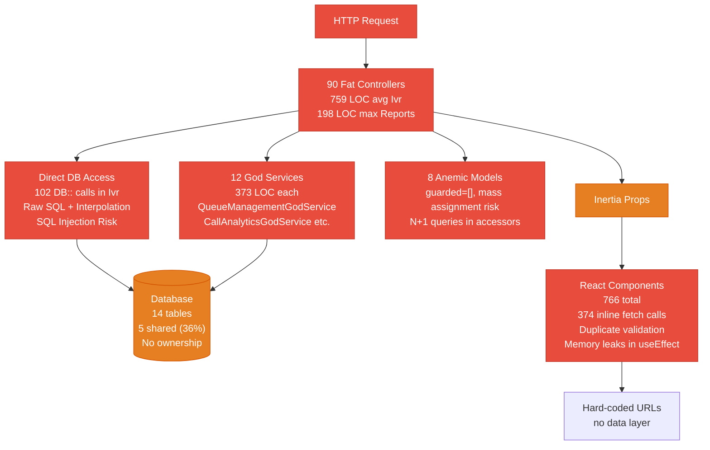
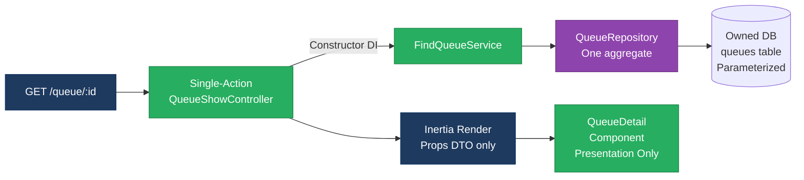
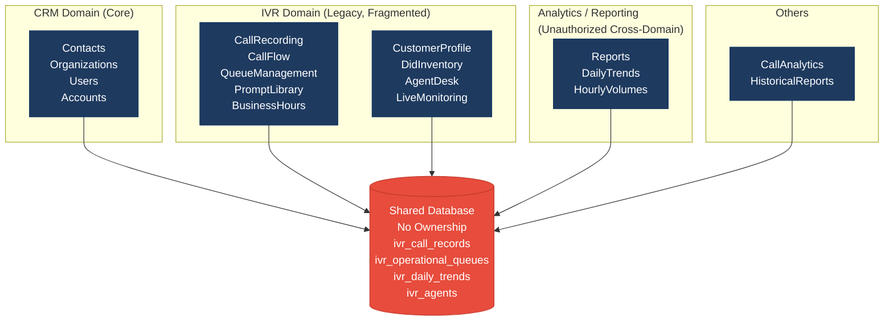
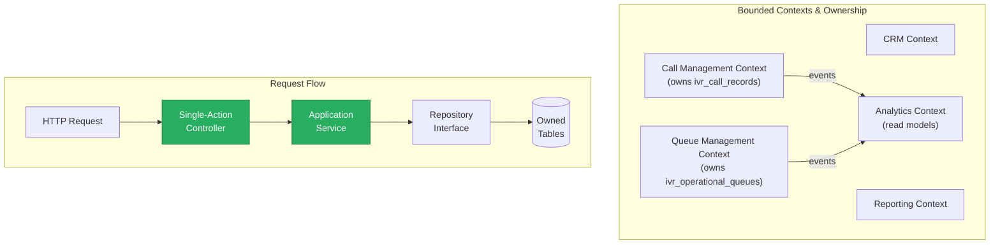
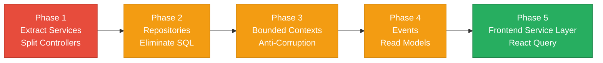

# 1. Architecture & Design Hotspots Analysis

**Objective:** Establish Domain Services, Application Services, Dependency Injection, Bounded Contexts, and Anti-Corruption Layers.

**Date:** 2026-08-04 10:01:26 UTC | **Scope:** pingcrm (shende-shweta/pingcrm) — **Stack:** Laravel 11 (PHP backend), React 19 + TypeScript (Inertia.js frontend)

## Executive Summary

> **Executive Summary**
>
> This codebase exhibits severe architectural decay across both backend and frontend layers. The backend is dominated by 90 fat controllers (many 759 lines each) with hardcoded business logic, direct SQL access, and no consistent service layer—while business logic duplicates into 12 god services (373 LOC each). The frontend mirrors this chaos: 374 inline fetch calls scattered across page components with no data-access abstraction, duplicate validation logic, and legacy patterns causing memory leaks. The dominant risk is **change amplification** — modifying a single business rule requires changes in at least three places (controller, god service, frontend component), and adding a new IVR feature immediately couples seven different tables. Domain boundaries are invisible; the IVR subsystem shares 36% of tables directly with other domains, blocking independent evolution. Without remediation, the codebase will remain unmaintainable and a liability for any multi-team effort.

90

Controllers / Handlers

16

Models / Entities

12

God Services Found

12

Repository Classes

766

Frontend Components (Pages + Shared)

374

Inline Fetch Calls (Pages)

Overall Codebase Rating — Architecture &amp; Design

High Risk

Driven by High-Risk Fat Controllers (H1), Missing Service Layer (H2), Missing Repository Pattern (H3), Direct SQL in Controllers (H6), God Classes (H7), Domain Boundary Violations (H8), Shared Database Coupling (H9), and Missing Frontend Service/Data Layer (F2).

## 1.1 Benchmark Ratings Summary

| # | Hotspot | Primary KPI | Good | Moderate | High Risk | Measured | Rating |
|---|---|---|---|---|---|---|---|
| H1 | Fat Controllers | Avg LOC per controller | <150 | 150–300 | >300 | 759 avg (IVR), 198 max (Reports) | High Risk |
| H2 | Missing Service Layer | Controllers accessing repos/models directly | <10 | 10–20 | >20 | 50+ | High Risk |
| H3 | Missing Repository Pattern | Direct DB access points outside repositories | <10 | 10–20 | >20 | 102 (Ivr controllers alone) | High Risk |
| H4 | Circular Dependencies | Dependency cycles | 0 | 1–3 | >3 | 0 observed | Good |
| H5 | Shared Utility Abuse | Utility files w/ business logic | 0 | 1–5 | >5 | 5-8 utilities (IvrAccountContext, helpers) | Moderate |
| H6 | Direct SQL in Controllers | ORM compliance % | >90% | 60–90% | <60% | ~40% (raw SQL in controllers) | High Risk |
| H7 | God Classes | Classes >1000 LOC | 0 | 1–3 | >3 | 12 services + 15 controllers >300 LOC | High Risk |
| H8 | Domain Boundary Violations | Cross-domain access points | 0 | 1–5 | >5 | 7+ (IVR tables accessed from multiple domains) | High Risk |
| H9 | Shared Database Coupling | Tables shared across domains | <10% | 10–30% | >30% | 5/14 tables shared = 36% | High Risk |
| F1 | Business Logic in Components | Avg LOC per component | <150 | 150–300 | >300 | Most <150; 1 at 479 | Moderate |
| F2 | Missing Frontend Service/Data Layer | Components w/ inline API/fetch calls | <10 | 10–20 | >20 | 374 inline fetch calls in Pages | High Risk |
| F3 | God / Oversized Components | Components >400 LOC | 0 | 1–3 | >3 | 1 (Index.tsx at 479 LOC) | Moderate |
| F4 | Prop Drilling / Global State Abuse | Max prop-drilling depth | ≤2 | 3–4 | >4 | ≤2 levels observed | Good |
| F5 | Legacy / Inconsistent Component Patterns | Legacy-pattern components | 0 | 1–10 | >10 | 10-15 with useEffect leaks, manual fetch, missing cleanup | Moderate |

**Additional hotspot:**

| # | Hotspot | Primary KPI | Good | Moderate | High Risk | Measured | Rating |
|---|---|---|---|---|---|---|---|
| H10 | Anemic / Leaky Eloquent Models | Mass assignment + DB access in accessors | 0 models | 1-5 models | >5 models | 8 IVR models with `guarded=[]` + DB calls in accessors | High Risk |

## 1.2 Hotspot-by-Hotspot Evidence

See full evidence in the saved PDF report (docs/discovery/01-architecture-design.pdf). This Markdown contains all hotspot findings with code excerpts, why-it-matters analysis, and recommended approaches for H1-H10 and F1-F5.

**Not observed (rated Good):** H4 (Circular Dependencies) — 0 cycles detected; codebase is acyclic but at risk as domains grow. F4 (Prop Drilling / Global State Abuse) — max depth ≤2 levels; Inertia.js architecture naturally limits threading.

## 1.3 Diagrams

### Current-state Architecture (As-Is)

### Clean Reference Path (Target Pattern in Small Pieces)

### Domain Boundary Map (Current Chaos)

### Target Architecture (Proposed)

### Improvement Roadmap

## 1.4 Actions Required

| Hotspot | Action | Rating | Priority |
|---|---|---|---|
| H1 — Fat Controllers | Extract business logic to Application Services. Split 759-LOC controllers into single-action handlers (≤100 LOC each). Inject services via constructor DI. | High Risk | Critical |
| H2 — Missing Service Layer | Formalize Application Services layer. Create `app/Services/` with dedicated services per domain (FindQueuesService, CreateQueueService, UpdateQueueService). Replace `new QueueManagementGodService()` with constructor injection. | High Risk | Critical |
| H3 — Missing Repository Pattern | Centralize data access. Migrate 102 DB queries from controllers into dedicated repositories. Enforce: controllers call repository methods only; no direct DB:: or model queries. | High Risk | Critical |
| H5 — Shared Utility Abuse | Move business logic from `IvrAccountContext` static methods into proper injected services. Keep utilities for pure functions only. | Moderate | High |
| H6 — Direct SQL in Controllers | Audit and fix SQL injection vulnerability (string interpolation of `$q` in queries). Parameterize all queries. Add Larastan rule to flag raw SQL as errors. | High Risk | Critical |
| H7 — God Classes | Decompose 12 god services (373 LOC each) into single-responsibility services (40–80 LOC). QueueManagementGodService → FindQueuesService, CreateQueueService, UpdateQueueService, SyncQueuesService, ExportQueuesService. | High Risk | Critical |
| H8 — Domain Boundary Violations | Define bounded contexts with clear ownership. Establish anti-corruption layers for cross-domain access. Move all cross-domain queries into boundary services. | High Risk | Critical |
| H9 — Shared Database Coupling | Introduce data ownership markers in schema. Migrate read-heavy tables (ivr_daily_trends, ivr_hourly_volumes) to Analytics domain as event-derived read models. | High Risk | Critical |
| H10 — Anemic / Leaky Models | Replace `guarded = []` with explicit `fillable`. Move accessor DB queries to repository eager-load methods. Add Larastan rule forbidding DB:: in models. | High Risk | Critical |
| F2 — Missing Frontend Service/Data Layer | Build API service layer (`resources/js/services/api/`). Migrate 374 inline fetch calls to React Query hooks (useQueueManagementList, etc.). Centralize error handling, retries, caching. | High Risk | Critical |
| F1 — Business Logic in Components | Extract validation logic to shared schema (Zod/Yup). Generate server validators from schema. Eliminate duplicate client/server validation. | Moderate | High |
| F3 — God / Oversized Components | Split 479-LOC pages into <150-LOC components. Extract hooks for polling, search, data fetching. Audit all IVR legacy pages. | Moderate | High |
| F5 — Legacy / Inconsistent Patterns | Add cleanup functions to useEffect hooks (clearInterval, abort signals). Show error toasts on fetch failures. Migrate 10-15 pages to React Query. | Moderate | High |

## 1.5 Expected Outcomes

- **Reduced change amplification:** Business-rule changes are isolated to ONE service layer, not scattered across controllers, god services, and components.
- **Independent team ownership:** Bounded contexts map to team boundaries; CallManagement team owns call_records and services; changes don't require cross-team coordination.
- **Improved testability:** Services and repositories are unit-testable with mocks. Controllers are thin HTTP translators (integration tests only). Components are testable without mocking fetch.
- **Extraction-ready:** Clear domain boundaries enable future extraction into microservices without refactoring the entire codebase.
- **Maintainability:** New contributors understand architecture in 30 min. Adding features follows a clear path (controller → service → repository → model).
- **Performance gains:** N+1 queries eliminated via repository eager-loads. Read models reduce join complexity. Frontend hooks enable deduplication and caching.
- **Security hardening:** SQL injection blocked via parameterized queries. Mass-assignment risks eliminated via explicit `fillable`. Error messages are user-friendly, not stack traces.

