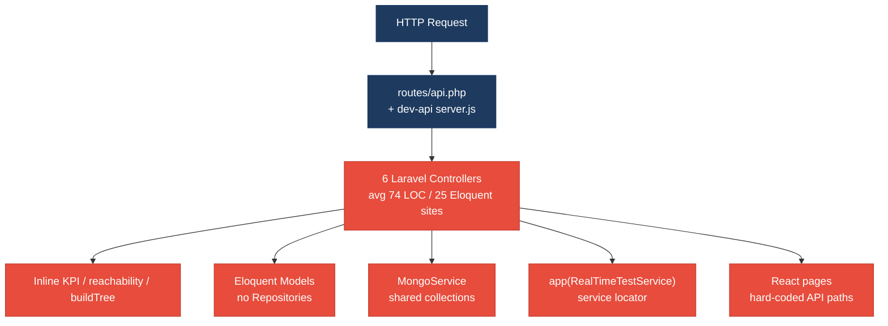
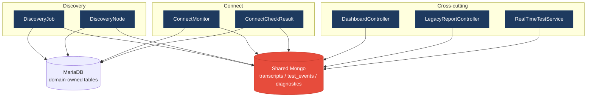
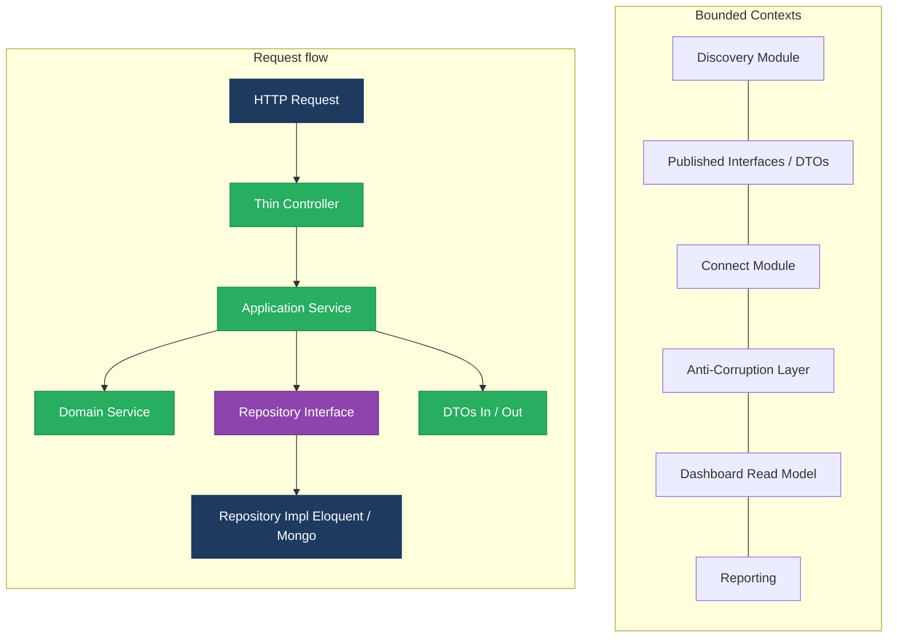
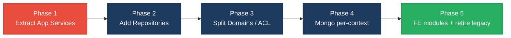

# 1. Architecture & Design Hotspots Analysis

**Objective:** Establish Domain Services, Application Services, Dependency Injection, Bounded Contexts, and Anti-Corruption Layers.

**Date:** Wednesday Jul 29, 2026 | **Scope:** `shende-shweta/FSDKC` (branch `main`) — PHP Laravel 12 / PHP 8.3 backend (`backend/`), React 19 + Vite + TanStack Query + Zustand SPA (`frontend/`), Express 4 Node dev API (`dev-api/`), MariaDB + MongoDB

## Executive Summary

> **Executive Summary**
>
> Klearcom is a small but architecturally under-layered voice/telecom QA monolith: **26 PHP**, **15 frontend `src`**, and **6 Express** source files were analyzed across backend, frontend, and the parallel `dev-api` runtime. Controllers stay short on LOC (avg ~74), yet **25 Eloquent call sites** sit in HTTP controllers and **zero repository classes** exist — CRUD, KPI math, IVR tree building, and reachability formulas live in controllers and a dual-domain `RealTimeTestService`. Declared `Modules/Discovery` and `Modules/Connect` folders contain only `AGENTS.md` (no code ownership), while MariaDB tables are domain-split but MongoDB `transcripts` / `test_events` / `call_diagnostics` are shared with a string `module` discriminator. The React SPA has a thin `api/client.ts` but hard-codes paths in six pages/components, plus a forbidden class-component poller and no error boundaries. Overall rating is **High Risk**, driven by missing service/repository discipline, cross-domain coupling, shared Mongo collections, and undeployed bounded contexts.

<div class="metric-grid">
<div class="metric-card"><div class="metric-number">6</div><div class="metric-label">Controllers / Handlers</div></div>
<div class="metric-card"><div class="metric-number">4</div><div class="metric-label">Models / Entities</div></div>
<div class="metric-card"><div class="metric-number">2</div><div class="metric-label">Service Classes Found</div></div>
<div class="metric-card"><div class="metric-number">0</div><div class="metric-label">Repository Classes Found</div></div>
</div>

<div class="overall-rating overall-rating--high-risk"><div class="overall-rating-label">Overall Codebase Rating — Architecture &amp; Design</div><div class="overall-rating-value">High Risk</div><div class="overall-rating-note">Driven by High-Risk Missing Service Layer (H2), Missing Repository Pattern (H3), Direct SQL/ORM in Controllers (H6), Domain Boundary Violations (H8), Shared Database Coupling (H9), and undeployed bounded contexts (H10).</div></div>

**Layers covered:** Backend Laravel (`backend/app`, 26 PHP files) · Frontend React SPA (`frontend/src`, 15 files) · Express parallel API (`dev-api/src`, 6 files) · Docker schema (`docker/mariadb/init.sql`, Mongo init). No mobile/CLI worker packages beyond `artisan`/console stubs.

## 1.1 Benchmark Ratings Summary

| # | Hotspot | Primary KPI | <span class="rating rating-good">Good</span> | <span class="rating rating-moderate">Moderate</span> | <span class="rating rating-high-risk">High Risk</span> | Measured | Rating |
|---|---|---|---|---|---|---|---|
| H1 | Fat Controllers | Avg LOC per controller | <150 | 150–300 | >300 | 74 LOC avg (6 Laravel API controllers; largest 102) | <span class="rating rating-good">Good</span> |
| H2 | Missing Service Layer | Controllers accessing repos/models | <10 | 10–20 | >20 | 25 Eloquent call sites in controllers | <span class="rating rating-high-risk">High Risk</span> |
| H3 | Missing Repository Pattern | Direct DB access points | <10 | 10–20 | >20 | 32 Eloquent sites outside Models/; 0 repositories | <span class="rating rating-high-risk">High Risk</span> |
| H4 | Circular Dependencies | Dependency cycles | 0 | 1–3 | >3 | 0 cycles observed | <span class="rating rating-good">Good</span> |
| H5 | Shared Utility Abuse | Utility files w/ business logic | 0 | 1–5 | >5 | 2 (`LegacyDataMapper`, `store.js` `buildTree`) | <span class="rating rating-moderate">Moderate</span> |
| H6 | Direct SQL in Controllers | ORM compliance % | >90% | 60–90% | <60% | ~22% (7/32 Eloquent sites outside controllers) | <span class="rating rating-high-risk">High Risk</span> |
| H7 | God Classes | Classes >1000 LOC | 0 | 1–3 | >3 | 0 (largest PHP 165 LOC; Express `server.js` 276) | <span class="rating rating-good">Good</span> |
| H8 | Domain Boundary Violations | Cross-domain access points | 0 | 1–5 | >5 | 8+ (Dashboard, LegacyReport, RealTimeTestService, Mongo shared, FE widget, dual runtime) | <span class="rating rating-high-risk">High Risk</span> |
| H9 | Shared Database Coupling | Tables shared across domains | <10% | 10–30% | >30% | ~38% (3/8 stores: Mongo transcripts, test_events, diagnostics) | <span class="rating rating-high-risk">High Risk</span> |
| F1 | Business Logic in Components | Avg LOC per component | <150 | 150–300 | >300 | 75 LOC avg (10 TSX/JSX files) | <span class="rating rating-good">Good</span> |
| F2 | Missing Frontend Service/Data Layer | Components w/ inline API calls | <10 | 10–20 | >20 | 6 components/pages + 1 hook with hardcoded paths | <span class="rating rating-good">Good</span> |
| F3 | God / Oversized Components | Components >400 LOC | 0 | 1–3 | >3 | 0 (largest `ConnectPage.tsx` 222 LOC) | <span class="rating rating-good">Good</span> |
| F4 | Prop Drilling / Global State Abuse | Max prop-drilling depth | ≤2 | 3–4 | >4 | ≤2 levels; Zustand `uiStore` 15 LOC | <span class="rating rating-good">Good</span> |
| F5 | Legacy / Inconsistent Component Patterns | Legacy-pattern components | 0 | 1–10 | >10 | 2 (`LegacyMonitorPoller` class; `LegacyDashboardWidget` uncaught throw) + no ErrorBoundary | <span class="rating rating-moderate">Moderate</span> |
| H10 | Undeployed bounded contexts (additional) | Declared modules with zero implementation files | 0 | 1 | >1 | 2 (`Modules/Discovery`, `Modules/Connect` — AGENTS.md only) | <span class="rating rating-high-risk">High Risk</span> |
| H11 | Dual-runtime domain duplication (additional) | Duplicated domain algorithms across Laravel + Express | 0 | 1–2 | >2 | 3 (reachability ×3, buildTree ×3, dashboard KPIs ×2) | <span class="rating rating-high-risk">High Risk</span> |

## 1.2 Hotspot-by-Hotspot Evidence

### H1. Fat Controllers <span class="sev sev-low">Low</span>

**Benchmark:** `Avg LOC per controller = 74` → falls in the **Good** band (Good <150 · Moderate 150–300 · High Risk >300).

**What to check:** Business logic inside controllers/handlers; controllers should only translate HTTP ↔ application calls.

**Evidence:** Six Laravel API controllers total 446 LOC (avg 74). None exceed 150 LOC or 10 public methods. Residual logic still appears (rated under H2/H6), but the primary LOC KPI is healthy:

1. `backend/app/Http/Controllers/Api/ConnectController.php:1-102` — 102 LOC, 5 actions; largest controller.
2. `backend/app/Http/Controllers/Api/DiscoveryController.php:1-102` — 102 LOC including private `buildTree`.
3. Clean-ish thin path: `backend/app/Http/Controllers/Api/MongoController.php:16-40` — delegates to `MongoService` only.

```php
// backend/app/Http/Controllers/Api/MongoController.php:16-19
public function status(): JsonResponse
{
    return response()->json($this->mongo->health());
}
```

**Why it matters here:** Short controllers mask the real problem — business rules are dense per line (reachability math, tree recursion) rather than spread across thousands of LOC. Size alone will not catch the next feature spike into `LegacyReportController`.

**Recommended approach:** Keep controllers under 150 LOC; extract `buildTree`, reachability, and KPI aggregation into application services before adding Reporting/Alerting endpoints.

<!-- affected-files
search: class \w+Controller extends
glob: backend/app/Http/Controllers/**/*.php
issue: Laravel API controller (monitor LOC / business logic density)
action: Keep thin; move workflows into application services when logic grows
-->

### H2. Missing Service Layer <span class="sev sev-critical">Critical</span>

**Benchmark:** `Controllers accessing repos/models = 25` → falls in the **High Risk** band (Good <10 · Moderate 10–20 · High Risk >20).

**What to check:** Business rules spread across controllers/utilities with no dedicated service tier for HTTP workflows.

**Evidence:** Only `MongoService` and `RealTimeTestService` exist; CRUD/KPI/reporting bypass them. 25 Eloquent call sites in controllers across 4 files:

1. `DashboardController` — full KPI aggregation with no service DI:

```php
// backend/app/Http/Controllers/Api/DashboardController.php:14-18
$discoveryTotal = DiscoveryJob::count();
$discoveryCompleted = DiscoveryJob::where('status', 'completed')->count();
$connectMonitors = ConnectMonitor::count();
$avgReachability = ConnectMonitor::avg('reachability_pct') ?? 0;
$alerts = ConnectMonitor::where('status', 'alert')->count();
```

2. `ConnectController::checks` — reachability formula inline (duplicated in service + Express):

```php
// backend/app/Http/Controllers/Api/ConnectController.php:66-75
$recentChecks = ConnectCheckResult::where('connect_monitor_id', $id)
    ->orderByDesc('checked_at')
    ->limit(20)
    ->get();
$successRate = $recentChecks->count() > 0
    ? ($recentChecks->where('reachable', true)->count() / $recentChecks->count()) * 100
    : 100;
$computedStatus = $successRate < 90 ? 'alert' : 'active';
```

3. `LegacyReportController` — filtering, DB, KPI math, and mapping in one action (`carrierSummary`, lines 19–54).
4. Express mirror with zero service layer: `dev-api/src/server.js:58-80` dashboard KPIs computed in the route handler against `store`.

**Why it matters here:** Any new entry point (CLI job, webhook, second UI) must re-copy KPI and reachability logic — already visible as Laravel ↔ Express duplication. Controllers cannot be unit-tested without Eloquent.

**Recommended approach:** Introduce `DashboardService`, `ConnectApplicationService`, `DiscoveryApplicationService`, and `CarrierReportService`; leave controllers as validate → service → JSON. Move `buildTree` into a Discovery domain service shared by `DiscoveryController` and `LegacyReportController`.

<!-- affected-files
search: (DiscoveryJob|DiscoveryNode|ConnectMonitor|ConnectCheckResult)::
glob: backend/app/Http/Controllers/**/*.php
issue: Controller directly accesses Eloquent models (missing application service)
action: Extract workflow into Application Service; controller only validates and responds
-->

### H3. Missing Repository Pattern <span class="sev sev-critical">Critical</span>

**Benchmark:** `Direct DB/ORM access points outside repositories = 32` → falls in the **High Risk** band (Good <10 · Moderate 10–20 · High Risk >20).

**What to check:** Direct DB/ORM access scattered through the codebase; persistence not abstracted.

**Evidence:** No `backend/app/Repositories/` directory. Eloquent is called from controllers (25) and `RealTimeTestService` (7). Mongo access is centralized in `MongoService` (partial good pattern) but without an interface/repository contract.

```php
// backend/app/Services/RealTimeTestService.php:108-123
ConnectCheckResult::create([
    'connect_monitor_id' => $monitorId,
    'reachable' => $reachable,
    // ...
]);
$recent = ConnectCheckResult::where('connect_monitor_id', $monitorId)->orderByDesc('checked_at')->limit(20)->get();
$rate = $recent->count() > 0 ? ($recent->where('reachable', true)->count() / $recent->count()) * 100 : 100;
$monitor->update([
    'reachability_pct' => round($rate, 2),
    'status' => $rate < 90 ? 'alert' : 'active',
```

`AppServiceProvider::register` is empty — no repository bindings.

**Why it matters here:** Swapping MariaDB for another store, or testing reachability without a DB, requires mocking Eloquent facades everywhere. Schema lives in `docker/mariadb/init.sql` (no Laravel migrations), so persistence churn already has no single ownership layer.

**Recommended approach:** Add `ConnectMonitorRepository`, `DiscoveryJobRepository`, `DiscoveryNodeRepository`, `ConnectCheckResultRepository` interfaces + Eloquent impls; bind in `AppServiceProvider`. Keep `MongoService` behind `TranscriptRepository` / `TestEventRepository` interfaces.

<!-- affected-files
search: (DiscoveryJob|DiscoveryNode|ConnectMonitor|ConnectCheckResult)::
glob: backend/app/**/*.php
issue: Direct Eloquent access with no repository abstraction
action: Route persistence through repository interfaces bound in AppServiceProvider
-->

### H4. Circular Dependencies <span class="sev sev-low">Low</span>

**Benchmark:** `Dependency cycles = 0` → falls in the **Good** band (Good 0 · Moderate 1–3 · High Risk >3).

**What to check:** Modules/packages importing each other.

**Evidence:** Not observed — import graph is acyclic: Controllers → Services/Models; `RealTimeTestService` → `MongoService` + Models; Models only reference sibling models for Eloquent relations. No PHP package cycle and no frontend circular imports detected among `pages` / `components` / `hooks` / `api`.

### H5. Shared Utility Abuse <span class="sev sev-medium">Medium</span>

**Benchmark:** `Utility files holding business logic = 2` → falls in the **Moderate** band (Good 0 · Moderate 1–5 · High Risk >5).

**What to check:** Large common/helpers/utils holding business logic.

**Evidence:**

1. `backend/app/Legacy/LegacyDataMapper.php` — report mapping via unsafe `extract()`:

```php
// backend/app/Legacy/LegacyDataMapper.php:10-19
public function mapReportRow(array $row): array
{
    extract($row, EXTR_SKIP);
    return [
        'label' => $name ?? 'Unknown',
        'metric' => $reachability_pct ?? 0,
        'region' => $country_code ?? 'N/A',
        'source' => 'legacy_extract_mapper',
    ];
}
```

2. `dev-api/src/store.js:64-75` — `buildTree` domain algorithm living in the in-memory "DB" module (also duplicated in two PHP controllers).

**Why it matters here:** `LegacyDataMapper` + `extract($request->all())` in `LegacyReportController` couples reporting to a tech-debt utility AGENTS.md already forbids. `store.js` mixing persistence seed data with tree algorithms blocks a clean Express service extraction.

**Recommended approach:** Replace `LegacyDataMapper` with explicit DTO mapping; move `buildTree` into a shared Discovery domain package (or PHP service + TS util under `frontend/src/modules/Discovery`).

<!-- affected-files
search: extract\(|function buildTree
glob: **/*.{php,js}
issue: Utility/mapper holds domain logic or unsafe extract()
action: Move to domain/application service; use explicit field mapping
-->

### H6. Direct SQL in Controllers <span class="sev sev-high">High</span>

**Benchmark:** `ORM compliance % ≈ 22%` → falls in the **High Risk** band (Good >90% · Moderate 60–90% · High Risk <60%).

**What to check:** Raw queries / ORM usage embedded in controllers vs repositories.

**Evidence:** No raw `DB::` SQL strings, but Eloquent query builders are embedded throughout controllers. Of 32 Eloquent access sites outside `Models/`, only 7 live in `RealTimeTestService` (~22% kept out of HTTP layer).

```php
// backend/app/Http/Controllers/Api/LegacyReportController.php:24-37
$monitors = ConnectMonitor::query()
    ->when(isset($country_code), fn ($q) => $q->where('country_code', $country_code))
    ->when(isset($carrier), fn ($q) => $q->where('carrier', $carrier))
    ->orderByDesc('reachability_pct')
    ->get();
foreach ($monitors as $monitor) {
    $recent = ConnectCheckResult::where('connect_monitor_id', $monitor->id)
        ->orderByDesc('checked_at')
        ->limit(20)
        ->get();
```

```php
// backend/app/Http/Controllers/Api/DiscoveryController.php:57-63
$job = DiscoveryJob::findOrFail($id);
$nodes = DiscoveryNode::where('discovery_job_id', $id)->get();
return response()->json([
    'job_id' => $job->id,
    'job_name' => $job->name,
    'tree' => $this->buildTree($nodes),
]);
```

**Why it matters here:** Schema changes in `docker/mariadb/init.sql` force controller edits; N+1 risk in `LegacyReportController`'s per-monitor check query will surface as soon as monitor count grows.

**Recommended approach:** Move all Eloquent out of controllers into repositories; keep query composition (`when` filters, eager loads) behind repository methods like `ConnectMonitorRepository::filteredByCarrier()`.

<!-- affected-files
search: (ConnectMonitor|ConnectCheckResult|DiscoveryJob|DiscoveryNode)::(query|where|find|findOrFail|create|count|avg|orderBy|orderByDesc|with|distinct)
glob: backend/app/Http/Controllers/**/*.php
issue: Eloquent/query builder used directly in controller
action: Move queries into repository methods
-->

### H7. God Classes <span class="sev sev-low">Low</span>

**Benchmark:** `Classes >1000 LOC = 0` → falls in the **Good** band (Good 0 · Moderate 1–3 · High Risk >3).

**What to check:** Single classes/files handling many unrelated responsibilities by size.

**Evidence:** Not observed for the >1000 LOC KPI. Largest files: `MongoService.php` 165, `RealTimeTestService.php` 141, `dev-api/src/server.js` 276, `ConnectPage.tsx` 222. Note: `RealTimeTestService` still mixes Discovery + Connect responsibilities (cohesion issue covered under H8/H10), but it does not meet the LOC threshold for this hotspot.

### H8. Domain Boundary Violations <span class="sev sev-high">High</span>

**Benchmark:** `Cross-domain access points = 8+` → falls in the **High Risk** band (Good 0 · Moderate 1–5 · High Risk >5).

**What to check:** Code in one business area directly reading/writing another area's data or models.

**Evidence:** Product domains are Discovery and Connect (per root `AGENTS.md`), but multiple files cross both:

1. `DashboardController` aggregates both domains' tables in one action.
2. `LegacyReportController` imports all four models and builds Connect carrier reports + Discovery IVR depth reports.
3. `RealTimeTestService` owns `runDiscoveryTest` and `runConnectTest` in one class.
4. `MongoService` stores both modules' transcripts/events in shared collections via a `module` string.
5. Frontend `LegacyDashboardWidget.tsx` fetches `/dashboard/kpis`, `/discovery/jobs`, and `/connect/monitors` together.
6. Express `server.js` + `realtime.js` mirror the same cross-cutting pattern.
7. Duplicated `buildTree` in DiscoveryController and LegacyReportController (Discovery logic leaked into Legacy reporting).
8. Reachability formula shared across ConnectController, RealTimeTestService, and `dev-api/src/realtime.js`.

```php
// backend/app/Http/Controllers/Api/LegacyReportController.php:7-10
use App\Models\ConnectCheckResult;
use App\Models\ConnectMonitor;
use App\Models\DiscoveryJob;
use App\Models\DiscoveryNode;
```

```tsx
// frontend/src/pages/LegacyDashboardWidget.tsx:19-22
Promise.all([
  api.get<DashboardKpis>('/dashboard/kpis'),
  api.get<{ data: DiscoveryJob[] }>('/discovery/jobs'),
  api.get<{ data: ConnectMonitor[] }>('/connect/monitors'),
])
```

**Why it matters here:** Module AGENTS.md files claim separate data stores and APIs, but runtime code has no enforcement — extracting Connect as a service would require rewriting Dashboard, Legacy reporting, MongoService, RealTimeTestService, and the FE widget together.

**Recommended approach:** Split `RealTimeTestService` into `DiscoveryTestRunner` / `ConnectTestRunner`; make Dashboard call published read models/APIs per context; put Legacy reporting behind an ACL that consumes Connect/Discovery DTOs only.

<!-- affected-files
search: (DiscoveryJob|DiscoveryNode|ConnectMonitor|ConnectCheckResult)
glob: backend/app/{Http/Controllers,Services,Legacy}/**/*.php
issue: Cross-domain model access / mixed Discovery+Connect responsibilities
action: Enforce bounded context ownership; cross-context via interfaces/DTOs/ACL only
-->

### H9. Shared Database Coupling <span class="sev sev-high">High</span>

**Benchmark:** `Tables shared across domains ≈ 38%` → falls in the **High Risk** band (Good <10% · Moderate 10–30% · High Risk >30%).

**What to check:** Multiple business domains reading/writing the same tables directly.

**Evidence:** MariaDB tables in `docker/mariadb/init.sql` are domain-owned (`discovery_jobs`/`discovery_nodes` vs `connect_monitors`/`connect_check_results`). MongoDB collections are shared:

| Store | Ownership |
|---|---|
| `discovery_jobs`, `discovery_nodes` | Discovery |
| `connect_monitors`, `connect_check_results` | Connect |
| `users` | Shared platform |
| Mongo `transcripts` | Shared (module discriminator) |
| Mongo `test_events` | Shared |
| Mongo `call_diagnostics` | Shared |

```php
// backend/app/Services/MongoService.php:22-28
$db = $this->client->selectDatabase('klearcom');
$this->transcripts = $db->selectCollection('transcripts');
$this->testEvents = $db->selectCollection('test_events');
$this->diagnostics = $db->selectCollection('call_diagnostics');
```

Both controllers write the same collections:

```php
// DiscoveryController.php:50-51 / ConnectController.php:52-53
'transcripts' => $this->mongo->getTranscripts('discovery'|'connect', $id),
'diagnostics' => $this->mongo->getDiagnostics('discovery'|'connect', $id),
```

Shared fraction: 3 Mongo collections / 8 total relational+document stores ≈ 38%.

**Why it matters here:** Indexing, retention, or PII rules for Discovery transcripts cannot evolve independently of Connect; a bad `module` filter leaks the other domain's documents through `MongoController::transcripts`.

**Recommended approach:** Split Mongo collections per context (`discovery_transcripts`, `connect_transcripts`, …) or wrap with per-module repository ACLs that forbid cross-module queries; stop accepting free-form `module` query params without an allow-list.

<!-- affected-files
search: selectCollection\(|getTranscripts\(|storeTranscript\(|module
glob: backend/app/Services/MongoService.php
issue: Shared Mongo collections across Discovery and Connect
action: Per-context collections or ACL-enforced repository APIs
-->

### H10. Undeployed bounded contexts (additional) <span class="sev sev-critical">Critical</span>

**Benchmark:** `Declared modules with zero implementation files = 2` → falls in the **High Risk** band (Good 0 · Moderate 1 · High Risk >1). Custom KPI: count of `Modules/*` packages that document a bounded context but contain no PHP/TS implementation.

**What to check:** Whether documented Discovery/Connect modules actually own code.

**Evidence:** Backend `backend/app/Modules/Discovery/AGENTS.md` and `Modules/Connect/AGENTS.md` plus frontend `frontend/src/modules/*/AGENTS.md` describe APIs and data stores, but all runtime code remains flat under `Http/Controllers`, `Services`, `Models`, and `pages/`. `AppServiceProvider` registers nothing domain-specific.

**Why it matters here:** New contributors follow AGENTS.md into empty folders, then add more flat controllers — the "module" convention cannot prevent H8/H9 regressions.

**Recommended approach:** Physically move Discovery/Connect controllers, models, services, and FE pages under each module namespace/package; autoload PSR-4 per module; ban cross-module Eloquent imports via PHPStan or architecture tests.

<!-- affected-files
search: .
glob: **/Modules/**/AGENTS.md
issue: Bounded context documented but not implemented as a code package
action: Relocate domain code under module packages and enforce import boundaries
-->

### H11. Dual-runtime domain duplication (additional) <span class="sev sev-high">High</span>

**Benchmark:** `Duplicated domain algorithms across Laravel + Express = 3` → falls in the **High Risk** band (Good 0 · Moderate 1–2 · High Risk >2). Custom KPI: count of distinct domain algorithms independently reimplemented in both stacks.

**What to check:** Parallel Laravel and `dev-api` runtimes carrying the same business rules.

**Evidence:**

1. Reachability success-rate formula — `ConnectController.php:71-73`, `RealTimeTestService.php:117-122`, `dev-api/src/realtime.js:147-152`.
2. IVR `buildTree` — `DiscoveryController.php:87-101`, `LegacyReportController.php:78-92`, `dev-api/src/store.js:64-75`.
3. Dashboard KPI aggregation — `DashboardController.php:14-36`, `dev-api/src/server.js:58-79`.

**Why it matters here:** Local `npm run dev` (Express) and Docker Laravel can diverge silently on alert thresholds (`successRate < 90`) or KPI rounding — already slightly different (`Math.round(...*10)/10` vs `round(..., 1)`).

**Recommended approach:** Treat Express as a thin facade over shared contracts, or generate OpenAPI + shared golden tests for reachability/KPI/tree; eventually retire duplicate domain logic from one runtime.

<!-- affected-files
search: successRate|buildTree|ivr_availability_pct|reachability
glob: **/*.{php,js}
issue: Domain algorithm duplicated across Laravel and Express runtimes
action: Single source of truth + contract tests; remove duplicate implementations
-->

### F1. Business Logic in Components <span class="sev sev-low">Low</span>

**Benchmark:** `Avg LOC per component = 75` → falls in the **Good** band (Good <150 · Moderate 150–300 · High Risk >300).

**What to check:** Validation, calculations, data transformation, or workflow logic inside view components.

**Evidence:** Ten TSX/JSX files average 75 LOC. Pages orchestrate queries/mutations but heavy math stays server-side. Outliers `ConnectPage.tsx` (222) and `DiscoveryPage.tsx` (176) combine form + tables + transcripts but remain presentation-heavy.

```tsx
// frontend/src/pages/DiscoveryPage.tsx:46-52
const handleStart = async (jobId: number) => {
  setSelectedId(jobId);
  await startDiscovery(jobId);
  queryClient.invalidateQueries({ queryKey: ['discovery'] });
  queryClient.invalidateQueries({ queryKey: ['mongodb'] });
  queryClient.invalidateQueries({ queryKey: ['dashboard'] });
};
```

**Why it matters here:** Duplicated invalidate/query patterns between Discovery and Connect pages will drift as features grow; extract shared hooks before pages cross 300 LOC.

**Recommended approach:** Extract `useDiscoveryJobs` / `useConnectMonitors` hooks and shared form/table sections under `frontend/src/modules/*`.

<!-- affected-files
search: useQuery|useMutation|useState
glob: frontend/src/pages/*.{tsx,jsx}
issue: Page component mixes data orchestration and presentation
action: Extract module hooks/composables; keep pages presentation-focused
-->

### F2. Missing Frontend Service/Data Layer <span class="sev sev-low">Low</span>

**Benchmark:** `Components with inline API/data-access calls = 6` → falls in the **Good** band (Good <10 · Moderate 10–20 · High Risk >20).

**What to check:** `fetch`/HTTP calls and API URLs hard-coded inline in components instead of module clients.

**Evidence:** A shared `frontend/src/api/client.ts` exists (good), but paths are still hard-coded in pages/components — no `discoveryApi` / `connectApi` modules. Count of components/pages with inline paths: `ConnectPage`, `DiscoveryPage`, `DashboardPage`, `LegacyDashboardWidget`, `MongoStatus`, `LegacyMonitorPoller` (plus hook `useRealtimeTest`).

```tsx
// frontend/src/pages/ConnectPage.tsx:22-37
queryFn: () => api.get<{ data: ConnectMonitor[] }>('/connect/monitors'),
// ...
queryFn: () => api.get<{ data: Transcript[] }>(`/mongodb/transcripts?module=connect&reference_id=${selectedId}`),
```

```ts
// frontend/src/hooks/useRealtimeTest.ts:29-31
const path = module === 'discovery'
  ? `/discovery/jobs/${resourceId}/stream?session_id=${sessionId}`
  : `/connect/monitors/${resourceId}/stream?session_id=${sessionId}`;
```

**Why it matters here:** Path renames require edits across pages + hook; module AGENTS.md claim FE integration lives in pages rather than a stable API module.

**Recommended approach:** Add `frontend/src/api/discovery.ts`, `connect.ts`, `dashboard.ts`, `mongodb.ts` wrapping paths; pages call those only. Count is currently Good — do this before the component count exceeds 10.

<!-- affected-files
search: api\.(get|post)\(|getStreamUrl\(|EventSource
glob: frontend/src/**/*.{tsx,ts,jsx}
issue: Hard-coded API path in UI layer
action: Move paths into module API clients under frontend/src/api/
-->

### F3. God / Oversized Components <span class="sev sev-low">Low</span>

**Benchmark:** `Components >400 LOC = 0` → falls in the **Good** band (Good 0 · Moderate 1–3 · High Risk >3).

**What to check:** Single components with huge render + many state vars + side effects.

**Evidence:** Not observed — no component exceeds 400 LOC. Largest: `ConnectPage.tsx` 222, `DiscoveryPage.tsx` 176. Both already multi-section (form + feed + table + transcripts) and should be split prophylactically, but they do not meet the F3 size band.

### F4. Prop Drilling / Global State Abuse <span class="sev sev-low">Low</span>

**Benchmark:** `Max prop-drilling depth ≤ 2; Zustand store 15 LOC` → falls in the **Good** band (Good ≤2 · Moderate 3–4 · High Risk >4).

**What to check:** Props threaded through many layers, or one giant global store.

**Evidence:** Not observed as abuse. `uiStore` only holds two selected IDs. Props: `LiveTestFeed` ← events/progress (1 hop); `IvrTree` ← nodes → `TreeNode` children (2 hops). No deep drilling.

```ts
// frontend/src/store/uiStore.ts:10-15
export const useUiStore = create<UiState>((set) => ({
  selectedDiscoveryId: null,
  selectedMonitorId: null,
  setSelectedDiscoveryId: (id) => set({ selectedDiscoveryId: id }),
  setSelectedMonitorId: (id) => set({ selectedMonitorId: id }),
}));
```

### F5. Legacy / Inconsistent Component Patterns <span class="sev sev-medium">Medium</span>

**Benchmark:** `Legacy-pattern components = 2 (+ missing ErrorBoundary)` → falls in the **Moderate** band (Good 0 · Moderate 1–10 · High Risk >10).

**What to check:** Mixed paradigms, missing error boundaries, deprecated lifecycle/APIs, inconsistent conventions.

**Evidence:**

1. `LegacyMonitorPoller.jsx` — class component with `componentDidMount` interval and **no** `componentWillUnmount` (violates AGENTS.md "Functional React components only"):

```jsx
// frontend/src/components/LegacyMonitorPoller.jsx:22-33
componentDidMount() {
  this.intervalId = setInterval(() => {
    api.get(`/connect/monitors/${this.props.monitorId}/checks`)
      .then((res) => { /* ... */ });
  }, 3000);
  // Intentionally no componentWillUnmount — interval leak
}
```

2. `LegacyDashboardWidget.tsx:48` — `throw new Error(error)` with no Error Boundary in `main.tsx` / `App.tsx`.
3. Mix of `.jsx` and `.tsx`; no shared ErrorBoundary component anywhere under `frontend/src`.

**Why it matters here:** Interval leaks and uncaught throws will crash the SPA as soon as these legacy widgets are mounted on the dashboard route.

**Recommended approach:** Rewrite `LegacyMonitorPoller` as a hook-based function component with cleanup; add `ErrorBoundary` around routes in `App.tsx`; delete or quarantine legacy widgets behind a feature flag.

<!-- affected-files
search: extends Component|componentDidMount|throw new Error\(
glob: frontend/src/**/*.{tsx,jsx}
issue: Legacy class component / uncaught throw / missing ErrorBoundary pattern
action: Convert to function components with cleanup; wrap routes in ErrorBoundary
-->

## 1.3 Diagrams

### Current-state architecture (as-is)



### Clean reference path (target pattern found in codebase)


### Domain boundary map (business domains found vs. shared data)



### Target architecture (proposed)



### Improvement roadmap



## 1.4 Actions Required

| Hotspot | Action | Rating | Priority |
|---|---|---|---|
| H2 Missing Service Layer | Extract `DashboardService`, `ConnectApplicationService`, `DiscoveryApplicationService`, `CarrierReportService`; remove Eloquent and KPI/tree math from controllers | <span class="rating rating-high-risk">High Risk</span> | <span class="sev sev-critical">Critical</span> |
| H3 Missing Repository Pattern | Create repository interfaces + Eloquent/Mongo implementations; bind in `AppServiceProvider`; stop calling models from controllers/services directly | <span class="rating rating-high-risk">High Risk</span> | <span class="sev sev-critical">Critical</span> |
| H5 Shared Utility Abuse | Replace `LegacyDataMapper` `extract()` with explicit DTOs; move `buildTree` out of `store.js` into a Discovery domain helper | <span class="rating rating-moderate">Moderate</span> | <span class="sev sev-medium">Medium</span> |
| H6 Direct SQL in Controllers | Relocate all Eloquent query builders from controllers into repositories (target >90% ORM compliance) | <span class="rating rating-high-risk">High Risk</span> | <span class="sev sev-high">High</span> |
| H8 Domain Boundary Violations | Split `RealTimeTestService`; confine Dashboard/Legacy to read-model/ACL APIs; ban cross-context Eloquent imports | <span class="rating rating-high-risk">High Risk</span> | <span class="sev sev-high">High</span> |
| H9 Shared Database Coupling | Split or ACL Mongo `transcripts`/`test_events`/`diagnostics` per Discovery vs Connect; allow-list `module` param | <span class="rating rating-high-risk">High Risk</span> | <span class="sev sev-high">High</span> |
| H10 Undeployed bounded contexts | Move code into `Modules/Discovery` and `Modules/Connect` packages; enforce import boundaries | <span class="rating rating-high-risk">High Risk</span> | <span class="sev sev-critical">Critical</span> |
| H11 Dual-runtime domain duplication | Deduplicate reachability, `buildTree`, and dashboard KPIs across Laravel and Express; add contract tests | <span class="rating rating-high-risk">High Risk</span> | <span class="sev sev-high">High</span> |
| F5 Legacy / Inconsistent Component Patterns | Convert `LegacyMonitorPoller` to a function component with cleanup; add route-level `ErrorBoundary`; remove uncaught throws | <span class="rating rating-moderate">Moderate</span> | <span class="sev sev-medium">Medium</span> |

## 1.5 Expected Outcomes

- Controllers become thin HTTP adapters; Discovery/Connect workflows are reusable from HTTP, SSE, and future CLI/jobs via application services.
- Repository interfaces enable isolated unit tests and a controlled MariaDB/Mongo swap without rewriting controllers.
- Real bounded-context packages plus ACLs stop silent cross-domain breakage when one product module evolves.
- Per-context Mongo collections (or enforced ACLs) let transcript retention and indexing evolve independently for Discovery vs Connect.
- Frontend legacy patterns and dual-runtime duplicates shrink change amplification between Laravel, Express, and the React SPA.
