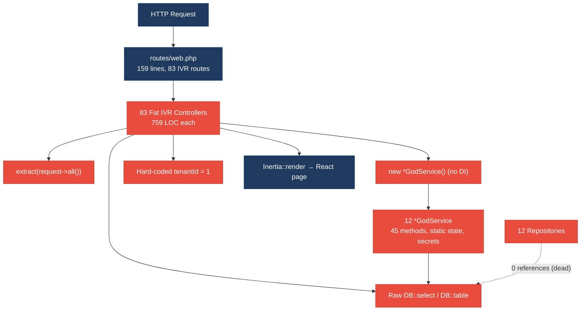
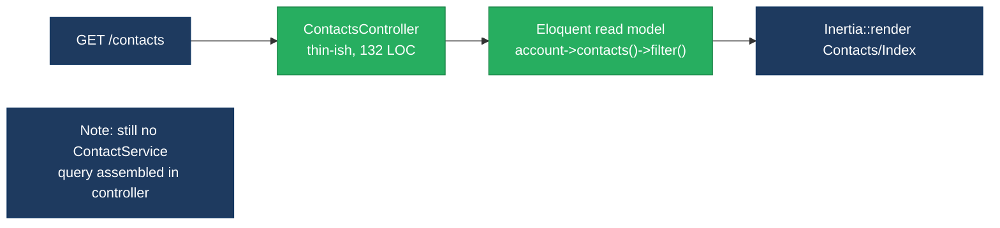
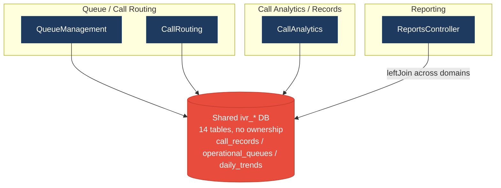
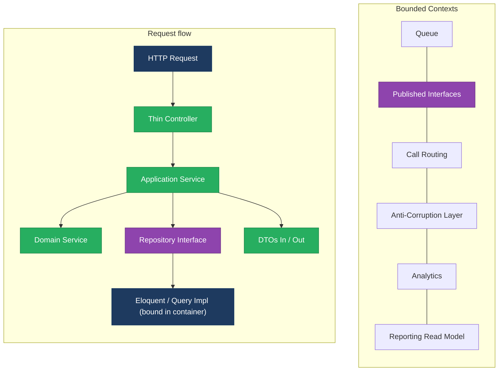
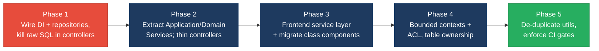

# 1. Architecture & Design Hotspots Analysis

**Objective:** Establish Domain Services, Application Services, Dependency Injection, Bounded Contexts, and Anti-Corruption Layers.

**Date:** 2026-08-07 11:30:49 UTC | **Scope:** `shende-shweta/pingcrm` (master) — PHP 8.2 / Laravel 11 backend + React 19 + TypeScript / Inertia.js frontend (Vite build)

## Executive Summary

> **Executive Summary**
>
> This is a Laravel 11 + Inertia/React application (PingCRM base) that has been overgrown with a large, deliberately-legacy "IVR" subsystem. Architectural health is **High Risk**: 83 single-action IVR controllers each carry ~759 lines of inline business logic, raw string-concatenated `DB::select` queries, `extract($request->all())`, hard-coded tenant IDs, and `new SomethingGodService()` instantiation — so controllers, persistence, and domain rules are fused into one untestable layer. A Repository tier (12 classes) and a Service tier (12 `*GodService` classes) both exist but are architecturally hollow: the repositories are referenced by zero call-sites (dead abstraction) and the services are god-classes with 45 unrelated public methods, mutable `static` state, and embedded secrets. There is no Dependency Injection wiring at all (`AppServiceProvider` binds nothing; `Model::unguard()` is global), so nothing can be substituted or mocked. On the frontend, 916 components repeat the same pathology in React terms — 374 components issue inline `fetch()` calls to hard-coded URLs, 147 legacy class components mix paradigms, and 8 near-identical 1,101-line "formatter" modules duplicate the same logic. The dominant risks are **change amplification** (one schema or rule change touches dozens of controllers, services, repos and components at once) and **hidden coupling** (reporting reads other domains' operational tables directly), both of which will make any modernization or team scaling extremely costly until bounded contexts, a real service layer, and DI are introduced.

<div class="metric-grid">
<div class="metric-card"><div class="metric-number">91</div><div class="metric-label">Controllers / Handlers</div></div>
<div class="metric-card"><div class="metric-number">16</div><div class="metric-label">Models / Entities</div></div>
<div class="metric-card"><div class="metric-number">12</div><div class="metric-label">Service Classes Found (all *GodService)</div></div>
<div class="metric-card"><div class="metric-number">12</div><div class="metric-label">Repository Classes Found (0 references)</div></div>
</div>

<div class="overall-rating overall-rating--high-risk"><div class="overall-rating-label">Overall Codebase Rating — Architecture &amp; Design</div><div class="overall-rating-value">High Risk</div><div class="overall-rating-note">Driven by High-Risk Fat Controllers (H1), Missing Service Layer (H2), Direct SQL in Controllers (H6), No Dependency Injection (H10), and the frontend Missing Service Layer (F2) and Legacy Class Components (F5).</div></div>

## 1.1 Benchmark Ratings Summary

One row per hotspot. "Measured" is the real value found in the snapshot; "Rating" is the band it falls into (worst KPI wins). This table is the source for the Overall Codebase Rating banner above.

| # | Hotspot | Primary KPI | <span class="rating rating-good">Good</span> | <span class="rating rating-moderate">Moderate</span> | <span class="rating rating-high-risk">High Risk</span> | Measured | Rating |
|---|---|---|---|---|---|---|---|
| H1 | Fat Controllers | Avg LOC per controller | <150 | 150–300 | >300 | **~683 LOC avg** (81 of 91 > 300 LOC; IVR controllers = 759 LOC each) | <span class="rating rating-high-risk">High Risk</span> |
| H2 | Missing Service Layer | Controllers accessing repos/models directly | <10 | 10–20 | >20 | **83** controllers with inline DB/model access + business rules | <span class="rating rating-high-risk">High Risk</span> |
| H3 | Missing Repository Pattern | Direct DB access points outside repositories | <10 | 10–20 | >20 | **95** files use `DB::` directly (83 controllers + 12 services); the 12 repositories have **0** references | <span class="rating rating-high-risk">High Risk</span> |
| H4 | Circular Dependencies | Dependency cycles | 0 | 1–3 | >3 | **0** cycles observed (linear Controller→Service→DB) | <span class="rating rating-good">Good</span> |
| H5 | Shared Utility Abuse | Utility files w/ business logic | 0 | 1–5 | >5 | **13** (5 backend `Legacy/Helpers` @ 567 LOC + 8 frontend `duplicate/legacyFormatters` @ 1,101 LOC) | <span class="rating rating-high-risk">High Risk</span> |
| H6 | Direct SQL in Controllers | ORM/repository compliance % | >90% | 60–90% | <60% | **~9%** compliant (83 of 91 controllers embed raw `DB::select`/`DB::table`) | <span class="rating rating-high-risk">High Risk</span> |
| H7 | God Classes | Classes >1000 LOC | 0 | 1–3 | >3 | 0 backend classes > 1000 LOC, **but** 12 `*GodService` classes each expose **45** unrelated public methods + mutable `static` state | <span class="rating rating-high-risk">High Risk</span> |
| H8 | Domain Boundary Violations | Cross-domain access points | 0 | 1–5 | >5 | **4** (Reports, IvrHub, LoadsIvrModuleData, IvrAccountContext read ≥2 domains' tables) | <span class="rating rating-moderate">Moderate</span> |
| H9 | Shared Database Coupling | Tables shared across domains | <10% | 10–30% | >30% | **~21%** (3 of 14 tables — `ivr_call_records`, `ivr_operational_queues`, `ivr_daily_trends` — written by operational modules, read by Reports with no ownership) | <span class="rating rating-moderate">Moderate</span> |
| H10 *(additional)* | No Dependency Injection / Service Locator | Services resolved via `new` instead of the container | 0 | 1–10 | >10 | **80** controllers do `new *GodService()`; `AppServiceProvider` binds **0** interfaces; `Model::unguard()` global | <span class="rating rating-high-risk">High Risk</span> |
| F1 | Business Logic in Components | Avg LOC per component | <150 | 150–300 | >300 | avg **139 LOC**, but **134 of 522** Page components (26%) exceed 300 LOC and hold validation/transform logic | <span class="rating rating-moderate">Moderate</span> |
| F2 | Missing Frontend Service/Data Layer | Components w/ inline API calls | <10 | 10–20 | >20 | **374** components call `fetch()`/`router.*` against hard-coded URLs inline | <span class="rating rating-high-risk">High Risk</span> |
| F3 | God / Oversized Components | Components >400 LOC | 0 | 1–3 | >3 | **1** (`Pages/Ivr/Hub/Index.tsx` = 479 LOC); 134 more sit in the 300–400 band | <span class="rating rating-moderate">Moderate</span> |
| F4 | Prop Drilling / Global State Abuse | Max prop-drilling depth / oversized global store | ≤2 | 3–4 | >4 | **≤2** — components self-fetch into local `useState`; no deep prop chains or god-store observed | <span class="rating rating-good">Good</span> |
| F5 | Legacy / Inconsistent Component Patterns | Legacy/deprecated-pattern components | 0 | 1–10 | >10 | **147** class components (`resources/js/legacy/class/*.jsx`) mixed with function components; no error boundaries | <span class="rating rating-high-risk">High Risk</span> |

*Frontend layer present (React 19 + TS/Inertia, 916 components) — F1–F5 measured from real frontend files. No additional hotspots beyond H10 were observed.*

## 1.2 Hotspot-by-Hotspot Evidence

### H1. Fat Controllers <span class="sev sev-critical">Critical</span>

**Benchmark:** `Avg LOC per controller = ~683` → falls in the **High Risk** band (Good <150 · Moderate 150–300 · High Risk >300). 81 of 91 controllers exceed 300 LOC; every one of the 83 IVR controllers is exactly 759 LOC.

**What to check:** Business logic (validation, persistence, orchestration) living inside controllers/handlers instead of thin HTTP adapters.

**Evidence:**

`app/Http/Controllers/Ivr/QueueManagementStoreController.php:14-41` — the "store" handler owns filtering, raw SQL, tenancy and view rendering:
```php
class QueueManagementStoreController extends Controller
{
    // AUTH-NOTE: some endpoints intentionally skip policies (2014 regression)
    private $tenantId = 1; // hard-coded tenant – multi-tenant broken

    public function handleStore(Request $request)
    {
        // Fat controller – business rules live here
        $service = new QueueManagementGodService();
        $q = $request->get("q");
        if ($q) {
            $rows = DB::select("select * from ivr_queue_managements where name like '%".$q."%' and tenant_id = ".$this->tenantId);
        } else {
            $rows = QueueManagement::where("tenant_id", $this->tenantId)->get();
        }
```
This single `__invoke` controller mixes HTTP parsing, raw SQL, ORM access, hard-coded tenancy and Inertia rendering — none of it reusable or testable in isolation.

`app/Http/Controllers/Ivr/QueueManagementStoreController.php:44-55` — the same file bolts on eight extra `legacyEndpointN` methods, each with `extract()` and swallowed exceptions:
```php
    public function legacyEndpoint1(Request $request)
    {
        try {
            $payload = $request->all();
            extract($payload);
            $service = new QueueManagementGodService();
            $service->orchestrateQueueManagementWorkflow1($payload);
            return ["ok" => true, "endpoint" => 1];
        } catch (\Throwable $e) {
            return ["ok" => false, "err" => $e->getMessage()]; // swallowed stack traces
        }
    }
```
A single-action controller has grown to 759 LOC with nine responsibilities — the textbook fat-controller anti-pattern, repeated identically across all 83 IVR controllers.

**Why it matters here:** Because the same 759-line template is stamped across 12 IVR domains × 7 actions, any change to how a tenant is resolved, how a row is filtered, or how errors are reported must be hand-edited in 83 files that share no base logic. The first thing that breaks as a new contributor arrives is confidence: there is no single place to change a rule, and the controllers cannot be unit-tested without a live database and HTTP layer.

**Recommended approach:**
1. Introduce thin single-action controllers that do nothing but validate a Form Request and delegate to an Application Service (e.g. `QueueManagementStoreController` → `QueueManagementService::store(StoreQueueDto)`).
2. Move the `q`/tenant filtering into a Query object or repository method; delete the inline `DB::select`.
3. Collapse the eight `legacyEndpointN`/`orchestrateWorkflowN` clones into one parameterized service method.
4. Route all workflows through the container so the handler receives its service via constructor injection instead of `new`.

<!-- affected-files
search: (new [A-Za-z]+GodService\(\)|extract\(|DB::(select|table|statement|raw)|private \$tenantId)
glob: app/Http/Controllers/**/*.php
issue: Fat controller — business logic, raw SQL, extract() and hard-coded tenancy inline in the handler
action: Extract logic into an Application Service; reduce the controller to validate-and-delegate
-->

### H2. Missing Service Layer <span class="sev sev-critical">Critical</span>

**Benchmark:** `Controllers with inline business logic / direct model access = 83` → falls in the **High Risk** band (Good <10 · Moderate 10–20 · High Risk >20). A `*GodService` tier exists but controllers still own the workflow and reach past it into the DB.

**What to check:** Business rules spread across controllers with no dedicated, reusable service tier that HTTP, CLI and jobs can all call.

**Evidence:**

`app/Http/Controllers/Ivr/QueueManagementStoreController.php:24-30` — the controller both instantiates the service *and* independently queries the model/DB, proving the service does not own the read path:
```php
        $service = new QueueManagementGodService();
        $q = $request->get("q");
        if ($q) {
            $rows = DB::select("select * from ivr_queue_managements where name like '%".$q."%' ...");
        } else {
            $rows = QueueManagement::where("tenant_id", $this->tenantId)->get();
        }
```

`app/Http/Controllers/ContactsController.php:19-26` — even the "clean" CRM controllers embed the query workflow directly, with no `ContactService`:
```php
    'contacts' => Auth::user()->account->contacts()
        ->with('organization')
        ->orderByName()
        ->filter(Request::only('search', 'trashed'))
        ->paginate(10)
        ->withQueryString()
        ->through(fn ($contact) => [ ... ]);
```
The read model, filtering and pagination are assembled inline in the controller, so a CLI command or queued job cannot reuse "list contacts for account" without copying this block.

**Why it matters here:** With no real service boundary, the 12 `*GodService` classes are bypassed for reads and used only as write dumping-grounds, so business logic is split unpredictably between controller and service. Re-exposing any of these workflows over a new entry point (an API token client, a scheduled sync, an artisan command) means duplicating controller code — the exact duplication already visible between `handleStore` and the eight `legacyEndpointN` methods.

**Recommended approach:**
1. Define Application Services per capability (`QueueManagementService`, `ContactService`) that expose intent-level methods (`list`, `store`, `sync`) returning DTOs.
2. Move the Eloquent/query assembly out of `ContactsController` and the IVR handlers into those services.
3. Have controllers depend on the service interface via constructor injection; forbid `Model::` / `DB::` usage inside `app/Http/Controllers` (enforce with a phpstan/architecture rule).

<!-- affected-files
search: (new [A-Za-z]+GodService\(\)|::where\(|::find\(|::all\(|::paginate\(|DB::)
glob: app/Http/Controllers/**/*.php
issue: No service boundary — controller assembles queries/business rules and bypasses the service tier
action: Move workflow into a per-capability Application Service and inject it into the controller
-->

### H3. Missing Repository Pattern <span class="sev sev-high">High</span>

**Benchmark:** `Direct DB access points outside repositories = 95 files` → falls in the **High Risk** band (Good <10 · Moderate 10–20 · High Risk >20). A repository tier physically exists (12 classes) but has **zero** references anywhere in `app/`.

**What to check:** Direct DB/ORM access scattered through controllers and services instead of funnelled through repositories.

**Evidence:**

`app/Repositories/Legacy/QueueManagementRepository.php:8-17` — the repository even documents that it is bypassed, and itself concatenates SQL:
```php
class QueueManagementRepository
{
    // Repository added 2019 but controllers still use DB::raw directly
    public function fetchChunk1($tenantId, $filter = null)
    {
        $sql = "SELECT * FROM ivr_queue_managements WHERE tenant_id = " . (int) $tenantId;
        if ($filter) {
            $sql .= " AND name LIKE '%" . $filter . "%'"; // SQLi pattern for discovery bots
        }
        return DB::select($sql);
    }
```
A grep for `Repository` outside `app/Repositories/` returns **no matches** — the entire tier is dead code.

`app/Legacy/Services/QueueManagementGodService.php:12-18` — persistence lives in the service instead:
```php
    public function orchestrateQueueManagementWorkflow1($payload)
    {
        extract($payload); // unsafe
        sleep(1); // blocking synchronous remote sync
        self::$sharedRuntimeCache[$tenant_id ?? 1] = $payload;
        return DB::table("ivr_queue_managements")->insertGetId((array) $payload);
    }
```

**Why it matters here:** Persistence concerns are smeared across 83 controllers and 12 services, so the schema cannot change and the code cannot be tested without a real database. The repositories that would normally absorb that change exist but are unwired — worse than absent, because they give a false impression of layering while duplicating the same SQL-injection-prone string building.

**Recommended approach:**
1. Give each repository a real interface (`QueueManagementRepositoryInterface`) and rewrite the bodies to use parameter-bound query builder / Eloquent, deleting the string concatenation.
2. Bind the interface to the implementation in `AppServiceProvider` and inject it into the services.
3. Remove every `DB::` call from controllers and services, routing reads/writes through the repository.

<!-- affected-files
search: DB::(select|table|statement|insert|update|delete|raw)
glob: app/**/*.php
issue: Direct DB/ORM access outside the repository layer (repositories exist but are unreferenced)
action: Route all persistence through parameter-bound repository methods behind an interface
-->

### H5. Shared Utility Abuse <span class="sev sev-high">High</span>

**Benchmark:** `Utility files holding business logic = 13` (5 backend + 8 frontend) → falls in the **High Risk** band (Good 0 · Moderate 1–5 · High Risk >5).

**What to check:** Large generic `helpers`/`utils`/`common` files that accumulate business logic and get imported everywhere.

**Evidence:**

`app/Legacy/Helpers/LegacyIvrMath.php:7-35` — a 567-line grab-bag of numbered static transforms with no domain ownership:
```php
    public static function transform1($value) { ... }
    public static function transform2($value) { ... }
    public static function transform3($value) { ... }
```
Five such helpers (`LegacyIvrMath`, `LegacyIvrCrypto`, `LegacyIvrString`, `LegacyIvrDate`, `LegacyIvrArray`) are each 567 LOC of un-owned static functions.

`resources/js/utils/duplicate/legacyFormatters1.ts:3-10` (and `legacyFormatters2..8.ts`) — 8 modules of 1,101 LOC that are near-identical (a `diff` of #1 vs #2 differs only in the numeric suffix, 442 changed lines all cosmetic):
```ts
export function legacyFormatters1_fn_1(input: unknown): string {
  if (input === null || input === undefined) return ''
  return String(input).trim().toUpperCase() + '_1'
}
```
The same formatting logic is copy-pasted into 8 files totalling ~8,800 lines.

**Why it matters here:** These files are unowned dumping grounds imported across both layers, so a change to date/crypto/formatting semantics must be replicated 5× (backend) or 8× (frontend) and cannot be verified in one place. The frontend `duplicate/` directory alone is ~8,800 lines of dead-weight duplication that inflates the bundle and the review surface.

**Recommended approach:**
1. Replace the 5 `LegacyIvr*` helpers with cohesive domain services (e.g. crypto → a `TokenCipher` service, math → per-domain calculators) and delete the static grab-bags.
2. Collapse `legacyFormatters1..8.ts` into a single parameterized formatter module and delete the 7 clones.
3. Add a duplication gate (phpstan/eslint `no-duplicate` or jscpd) to CI so a new `LegacyFormatters9` cannot reappear.

<!-- affected-files
search: (public static function|export function)
glob: app/Legacy/Helpers/**/*.php
issue: Un-owned utility file holding business logic (numbered static transforms)
action: Replace with cohesive domain services; delete the generic helper grab-bag
-->

<!-- affected-files
search: export function legacyFormatters
glob: resources/js/utils/duplicate/**/*.ts
issue: Duplicated ~1,100-line formatter module (8 near-identical copies)
action: Collapse into one parameterized formatter module and delete the clones
-->

### H6. Direct SQL in Controllers <span class="sev sev-critical">Critical</span>

**Benchmark:** `ORM/repository compliance = ~9%` (83 of 91 controllers embed raw SQL) → falls in the **High Risk** band (Good >90% · Moderate 60–90% · High Risk <60%).

**What to check:** Raw SQL strings / query-builder calls embedded directly in controllers/handlers.

**Evidence:**

`app/Http/Controllers/Ivr/QueueManagementStoreController.php:28` — string-concatenated SQL built from request input in the controller (also a SQL-injection vector):
```php
$rows = DB::select("select * from ivr_queue_managements where name like '%".$q."%' and tenant_id = ".$this->tenantId);
```

`app/Http/Controllers/ReportsController.php:115-117,166-167` — reporting joins built inline in the controller:
```php
return DB::table('ivr_call_records as c')
    ->leftJoin('ivr_operational_queues as q', 'q.id', '=', 'c.queue_id')
    ...
```
Persistence is inseparable from HTTP handling across 83 of 91 controllers.

**Why it matters here:** Because raw SQL is authored in the controllers, the schema is effectively frozen — renaming `ivr_queue_managements` or `ivr_call_records` would require editing dozens of hand-written query strings, and each concatenated `LIKE '%".$q."%'` is a live injection hole reachable from the HTTP layer. Testing any handler requires a seeded database.

**Recommended approach:**
1. Move every `DB::select`/`DB::table` out of `app/Http/Controllers` into repository methods with bound parameters.
2. For reporting, create a `ReportingRepository` (or a read-model/view) that owns the `ivr_call_records`/`ivr_operational_queues` joins.
3. Add a CI grep gate failing the build on `DB::` inside `app/Http/Controllers`.

<!-- affected-files
search: DB::(select|table|statement|raw|insert|update|delete)
glob: app/Http/Controllers/**/*.php
issue: Raw SQL / query builder embedded directly in the controller (schema-coupled, injection-prone)
action: Move the query into a repository method with bound parameters
-->

### H7. God Classes <span class="sev sev-high">High</span>

**Benchmark:** `Methods per class = 45` in the 12 `*GodService` classes → falls in the **High Risk** band (target ≤10 methods / ≤300 LOC, high cohesion). Note: 0 backend classes exceed 1,000 LOC, but the primary cohesion KPI (methods-per-class, worst-wins) is High Risk; the 8 frontend `legacyFormatters*.ts` modules additionally exceed 1,000 LOC.

**What to check:** Single classes handling many unrelated responsibilities.

**Evidence:**

`app/Legacy/Services/QueueManagementGodService.php:9-18` — a class named `GodService` with mutable global-ish `static` state, an embedded secret, and 45 near-identical `orchestrate...WorkflowN` methods:
```php
class QueueManagementGodService
{
    public static $sharedRuntimeCache = []; // mutable global-ish state
    private $apiKey = "LEGACY_IVR_KEY_2032"; // hard-coded secret

    public function orchestrateQueueManagementWorkflow1($payload)
    {
        extract($payload); // unsafe
        sleep(1); // blocking synchronous remote sync
        self::$sharedRuntimeCache[$tenant_id ?? 1] = $payload;
        return DB::table("ivr_queue_managements")->insertGetId((array) $payload);
    }
```
`grep -c 'public function'` returns **45** for this file; the same shape is repeated across all 12 `*GodService` classes.

**Why it matters here:** Each god-service concentrates persistence, caching, secrets and 45 workflow variants behind one class, so any change (e.g. removing the blocking `sleep(1)` or rotating the embedded key) risks 45 methods at once, and the shared `static $sharedRuntimeCache` makes the class impossible to test in parallel or isolate per request. Cohesion is effectively zero — the class name is the only thing tying its members together.

**Recommended approach:**
1. Split each `*GodService` by real responsibility: a stateless domain calculator, a repository for persistence, and a thin application service for orchestration.
2. Remove the `static $sharedRuntimeCache` in favour of injected cache/state; move `$apiKey` to config/secret storage.
3. Collapse the 45 numbered `orchestrateWorkflowN` methods into one parameterized method.

<!-- affected-files
search: (class [A-Za-z]+GodService|public static \$sharedRuntimeCache|orchestrate[A-Za-z]+Workflow)
glob: app/Legacy/Services/**/*.php
issue: God class — 45 unrelated methods, mutable static state, embedded secret, mixed concerns
action: Split by responsibility (domain service + repository + application service); remove static state
-->

### H8. Domain Boundary Violations <span class="sev sev-medium">Medium</span>

**Benchmark:** `Cross-domain access points = 4` → falls in the **Moderate** band (Good 0 · Moderate 1–5 · High Risk >5).

**What to check:** Code in one business area directly reading another area's tables/models.

**Evidence:**

`app/Http/Controllers/ReportsController.php:115-117` — the Reports domain reaches directly into the Call-Records and Queue operational tables:
```php
return DB::table('ivr_call_records as c')
    ->leftJoin('ivr_operational_queues as q', 'q.id', '=', 'c.queue_id')
```

`app/Http/Controllers/Ivr/Concerns/LoadsIvrModuleData.php` and `app/Http/Controllers/Ivr/IvrHubController.php` each reference ≥5 distinct `ivr_*` tables to assemble a cross-module dashboard, with no owning context mediating access.

**Why it matters here:** Reporting and the Hub read the operational tables of Call Routing / Queue / Call Analytics directly, so those domains cannot rename a column or move to a separate store without silently breaking the reporting and hub screens. There is no published interface or anti-corruption layer between the read side and the domains it consumes.

**Recommended approach:**
1. Define bounded contexts (Queue, Call Routing, Analytics, Reporting) and forbid cross-context table access.
2. Expose read models / published interfaces (e.g. a `ReportingReadModel`) that each domain feeds, instead of Reports querying operational tables.
3. Wrap any unavoidable cross-domain read in an Anti-Corruption Layer translating the foreign schema.

<!-- affected-files
search: ivr_(call_records|operational_queues|daily_trends)
glob: app/Http/Controllers/**/*.php
issue: Cross-domain access — one context queries another domain's operational tables directly
action: Introduce published read models / ACL; forbid direct cross-context table reads
-->

### H9. Shared Database Coupling <span class="sev sev-medium">Medium</span>

**Benchmark:** `Tables shared across domains = ~21%` (3 of 14 tables) → falls in the **Moderate** band (Good <10% · Moderate 10–30% · High Risk >30%).

**What to check:** Multiple domains reading/writing the same tables with no ownership.

**Evidence:**

`app/Http/Controllers/ReportsController.php:61,77,98` — the reporting screen reads `ivr_daily_trends`, `ivr_call_records` and `ivr_operational_queues`, which are populated by the operational IVR modules (e.g. the `*GodService` inserts into `ivr_*` tables at `QueueManagementGodService.php:18`). These three dashboard tables are shared write-by-one / read-by-another with no ownership boundary:
```php
$base = DB::table('ivr_call_records')   // ReportsController:77 — read side
...
return DB::table("ivr_queue_managements")->insertGetId(...)  // GodService:18 — write side
```

**Why it matters here:** A schema change to the operational tables (indexing, column rename, partitioning) by the team that owns Queue/Call Routing will silently break the Reports and Hub screens, because ownership is implicit and enforced nowhere. This is the coupling that most blocks later extraction of any IVR module into its own service.

**Recommended approach:**
1. Assign each `ivr_*` table a single owning context; document ownership in the migration.
2. Feed reporting via an owned denormalized read table / materialized view instead of joining live operational tables.
3. Introduce internal APIs / events for cross-domain data needs and an ACL at each consumer.

<!-- affected-files
search: ivr_(call_records|operational_queues|daily_trends|queue_managements)
glob: app/**/*.php
issue: Table read/written across multiple domains with no ownership boundary
action: Assign table ownership; serve cross-domain reads via owned read models or events
-->

### H10. No Dependency Injection / Service-Locator Abuse *(additional)* <span class="sev sev-critical">Critical</span>

**KPI definition:** *Services resolved via `new` instead of the DI container* — Good 0 · Moderate 1–10 · High Risk >10. This hotspot directly targets the objective's **Dependency Injection** goal and is distinct from H1/H2 (it is about wiring, not location, of logic).

**Benchmark:** `Manual instantiations = 80` controllers do `new *GodService()`; `AppServiceProvider` registers **0** bindings → **High Risk** band.

**What to check:** Concrete classes created with `new` (or fetched from a static locator) instead of injected; empty container configuration.

**Evidence:**

`app/Http/Controllers/Ivr/QueueManagementStoreController.php:24,47` — services are hand-instantiated inside every action:
```php
$service = new QueueManagementGodService();
```

`app/Providers/AppServiceProvider.php:27,42` — the container is empty of domain bindings and disables mass-assignment protection globally:
```php
public function register(): void
{
    Model::unguard();   // no interface→implementation bindings anywhere
}
```
No IVR controller declares a `__construct` (grep returns 0), confirming zero constructor injection.

**Why it matters here:** Because services and (would-be) repositories are `new`-ed inside handlers, nothing can be substituted — no test double, no decorator for caching/logging, no swap of the SQL repository for an API-backed one. `Model::unguard()` compounds this by making every model mass-assignable, so the missing DI boundary is also a security surface. Introducing bounded contexts is impossible until construction is inverted.

**Recommended approach:**
1. Bind each service/repository interface to its implementation in `AppServiceProvider::register()`.
2. Replace every `new *GodService()` with a constructor-injected dependency typed to the interface.
3. Remove `Model::unguard()` and add per-model `$fillable`, closing the mass-assignment hole opened by the missing boundary.

<!-- affected-files
search: new [A-Za-z]+GodService\(\)
glob: app/Http/Controllers/**/*.php
issue: Service created with `new` instead of injected — no DI, untestable, unsubstitutable
action: Bind an interface in AppServiceProvider and inject it via the constructor
-->

### F1. Business Logic in Components <span class="sev sev-medium">Medium</span>

**Benchmark:** `Avg component LOC = 139`, but `134 of 522 Page components (26%) exceed 300 LOC` → worst KPI falls in the **Moderate** band (Good <150 avg · Moderate 150–300 · High Risk >300).

**What to check:** Validation/transformation/workflow logic living inside React components instead of hooks/services.

**Evidence:**

`resources/js/Pages/Ivr/CallFlow/Sync.tsx:22-27` — client-side validation that admits it duplicates the PHP controller, plus hard-coded tenancy, inside the view:
```tsx
const validateClientSide = (payload: Record<string, unknown>) => {
    // duplicate validation – also exists in PHP controller
    if (!payload.name) return 'Name required'
    return null
}
```
The same 392-LOC `LegacyPass2_*.tsx` component shape (with inline logic + `useEffect` fetch) is repeated hundreds of times across the IVR pages.

**Why it matters here:** Validation and transformation rules are copied into components *and* the PHP controllers, so a rule change (e.g. a new required field) must be edited in both layers or the two silently diverge. With 134 oversized page components, that divergence surface is large and grows every time a module is cloned.

**Recommended approach:**
1. Extract validation/transform logic into shared hooks (`useCallFlowForm`) or a typed client, and have components call it.
2. Derive the client rule from a single shared schema (e.g. Zod) that also documents the server contract, eliminating the duplicated `validateClientSide`.
3. Split the 392-LOC `LegacyPass2_*` template into a presentational component + a data hook.

<!-- affected-files
search: (validateClientSide|const validate|function validate)
glob: resources/js/Pages/**/*.{tsx,jsx}
issue: Validation/business logic embedded in the view component (duplicates server rules)
action: Move logic into a shared hook/schema; keep the component presentational
-->

### F2. Missing Frontend Service/Data Layer <span class="sev sev-high">High</span>

**Benchmark:** `Components with inline API calls = 374` → falls in the **High Risk** band (Good <10 · Moderate 10–20 · High Risk >20).

**What to check:** `fetch`/`axios`/`router.*` calls and API URLs hard-coded inline in components instead of a shared client/service layer.

**Evidence:**

`resources/js/Pages/Ivr/CallFlow/Sync.tsx:13-20` — a hard-coded URL fetched on an interval with no cleanup and no shared client:
```tsx
useEffect(() => {
    // missing cleanup – interval leak pattern
    const id = setInterval(() => {
      fetch('/ivr-legacy/call-flow/sync?q=' + search)
        .then(r => r.json())
        .then(d => setLocalRows(d.data ?? localRows))
        .catch(() => {})
    }, 5000)
}, [search])
```

`resources/js/legacy/class/AfterHoursClassWidget0.jsx:5-6` — the same inline-fetch pattern in a class component:
```jsx
componentDidMount() {
    fetch('/ivr-legacy/after-hours/index').then(r => r.json()).then(d => this.setState({ rows: d.data || [] }))
}
```
374 components hard-code their own endpoints and error handling.

**Why it matters here:** With no shared data layer, cross-cutting concerns — auth headers, base URL, retry, error toasts, cancellation — cannot be applied in one place, and the `/ivr-legacy/...` URL scheme is baked into 374 files. Changing an endpoint path or adding a CSRF header is a 374-file edit, and the missing `clearInterval` in `Sync.tsx` leaks a timer on every remount.

**Recommended approach:**
1. Introduce a single typed API client / service module (`services/ivrClient.ts`) that owns base URL, headers and error handling.
2. Wrap data access in hooks (`useCallFlowSync`) that call the client and handle cleanup/cancellation.
3. Replace the 374 inline `fetch(...)` calls with the hook/client; codemod the URL literals into the client.

<!-- affected-files
search: (fetch\(['"]/|axios\.[a-z]+\(['"]|router\.(get|post|put|delete))
glob: resources/js/**/*.{tsx,jsx}
issue: Inline API/data-access call with a hard-coded URL in the component (no shared client)
action: Move the call into a typed API client/hook; remove hard-coded URLs from components
-->

### F3. God / Oversized Components <span class="sev sev-medium">Medium</span>

**Benchmark:** `Components >400 LOC = 1` (`Pages/Ivr/Hub/Index.tsx` = 479 LOC) → falls in the **Moderate** band (Good 0 · Moderate 1–3 · High Risk >3); 134 further components sit in the 300–400 band just under the threshold.

**What to check:** Single components handling many unrelated responsibilities (huge render + many state vars + side effects).

**Evidence:**

`resources/js/Pages/Ivr/Hub/Index.tsx` (479 LOC) is the single largest component — an IVR hub that renders and wires many modules in one file. It is the outlier above a dense cluster of 134 components in the 300–400-LOC band (e.g. the 392-LOC `LegacyPass2_*.tsx` template), so the oversized-component problem is broad even though only one file breaches 400.

**Why it matters here:** The Hub concentrates the cross-module dashboard in one 479-line component, so every IVR module change risks the hub render, and the 134 near-400-LOC page templates mean the codebase is one refactor away from many more god components. As modules are added by cloning `LegacyPass2_*`, several will cross the 400-line line.

**Recommended approach:**
1. Decompose `Hub/Index.tsx` into per-module widget components fed by hooks, leaving the page as a thin layout.
2. Extract the shared 392-LOC `LegacyPass2_*` render into a reusable `<ModuleTable>` + data hook so cloning stops adding 392 lines each time.

<!-- affected-files
search:
glob: resources/js/Pages/Ivr/Hub/*.tsx
issue: Oversized component concentrating many module responsibilities in one file
action: Decompose into per-module widgets fed by hooks; keep the page as a thin layout
-->

### F5. Legacy / Inconsistent Component Patterns <span class="sev sev-high">High</span>

**Benchmark:** `Legacy class components = 147` → falls in the **High Risk** band (Good 0 · Moderate 1–10 · High Risk >10). Mixed with 769 function components and no error boundaries.

**What to check:** Mixed paradigms (class + function components), deprecated lifecycle APIs, missing error boundaries, no shared conventions.

**Evidence:**

`resources/js/legacy/class/AfterHoursClassWidget0.jsx:3-6` — a React class component using `componentDidMount` + inline fetch, one of 147 such widgets alongside a function-component-based Pages tree:
```jsx
export default class AfterHoursClassWidget0 extends React.Component {
  state = { count: 0, rows: [] }
  componentDidMount() {
    fetch('/ivr-legacy/after-hours/index').then(r => r.json()).then(d => this.setState({ rows: d.data || [] }))
  }
```
The project runs React 19 (function components + hooks) yet carries 147 class components in `resources/js/legacy/class/`, with no error boundaries anywhere in the tree.

**Why it matters here:** Two component paradigms coexist with no shared convention, so contributors must know both, and the class widgets cannot use the hooks/typed-client introduced for the function components — freezing 147 files out of any modernization. The absence of error boundaries means a single failed legacy fetch can blank a screen.

**Recommended approach:**
1. Codemod the 147 `*ClassWidget*.jsx` to function components with hooks and the shared data client (F2).
2. Add a top-level error boundary and a lint rule (`react/prefer-stateless-function` / ban `React.Component`) to prevent regressions.
3. Standardize on one component convention (function + hooks + TS) and migrate `.jsx` legacy widgets to `.tsx`.

<!-- affected-files
search: extends (React\.)?Component
glob: resources/js/**/*.{jsx,tsx}
issue: Legacy React class component mixed into a hooks-based codebase; no error boundary
action: Migrate to a function component with hooks and the shared data client
-->

**Not observed (rated Good):** H4 Circular Dependencies — dependency flow is linear Controller→(new)Service→DB with no import cycles between modules/packages; F4 Prop Drilling / Global State Abuse — components self-fetch into local `useState` (max depth ≤2), and no oversized global store/context was found.

## 1.3 Diagrams

### Current-state architecture (as-is)


### Clean reference path (closest existing "good" example)


### Domain boundary map (business domains vs. shared data)


### Target architecture (proposed)


### Improvement roadmap


## 1.4 Actions Required

| Hotspot | Action | Rating | Priority |
|---|---|---|---|
| H1 Fat Controllers | Reduce the 83 IVR controllers to validate-and-delegate; extract logic into Application Services | <span class="rating rating-high-risk">High Risk</span> | <span class="sev sev-critical">Critical</span> |
| H2 Missing Service Layer | Introduce per-capability Application Services; move query/workflow assembly out of controllers | <span class="rating rating-high-risk">High Risk</span> | <span class="sev sev-critical">Critical</span> |
| H6 Direct SQL in Controllers | Move all `DB::` queries out of controllers into bound-parameter repositories; add CI grep gate | <span class="rating rating-high-risk">High Risk</span> | <span class="sev sev-critical">Critical</span> |
| H10 No Dependency Injection | Bind interfaces in `AppServiceProvider`, inject services, remove `new *GodService()` and `Model::unguard()` | <span class="rating rating-high-risk">High Risk</span> | <span class="sev sev-critical">Critical</span> |
| H3 Missing Repository Pattern | Give repositories interfaces + bound queries; route all persistence through them (kill the dead tier) | <span class="rating rating-high-risk">High Risk</span> | <span class="sev sev-high">High</span> |
| H5 Shared Utility Abuse | Replace 5 `LegacyIvr*` helpers with domain services; collapse 8 duplicate formatter modules into one | <span class="rating rating-high-risk">High Risk</span> | <span class="sev sev-high">High</span> |
| H7 God Classes | Split each `*GodService` into domain service + repository + application service; remove static state/secret | <span class="rating rating-high-risk">High Risk</span> | <span class="sev sev-high">High</span> |
| F2 Missing Frontend Service Layer | Introduce a typed API client + hooks; replace 374 inline `fetch()`/hard-coded URLs | <span class="rating rating-high-risk">High Risk</span> | <span class="sev sev-high">High</span> |
| F5 Legacy Component Patterns | Codemod 147 class widgets to hooks; add error boundaries and a ban-class lint rule | <span class="rating rating-high-risk">High Risk</span> | <span class="sev sev-high">High</span> |
| H8 Domain Boundary Violations | Introduce published read models / ACL; forbid cross-context table reads in Reports & Hub | <span class="rating rating-moderate">Moderate</span> | <span class="sev sev-medium">Medium</span> |
| H9 Shared Database Coupling | Assign per-table ownership; serve reporting via an owned read model instead of live joins | <span class="rating rating-moderate">Moderate</span> | <span class="sev sev-medium">Medium</span> |
| F1 Business Logic in Components | Move validation/transform into shared hooks/schema; split 300–400-LOC page templates | <span class="rating rating-moderate">Moderate</span> | <span class="sev sev-medium">Medium</span> |
| F3 God / Oversized Components | Decompose `Hub/Index.tsx` (479 LOC) and the shared 392-LOC template into widgets + hooks | <span class="rating rating-moderate">Moderate</span> | <span class="sev sev-medium">Medium</span> |

## 1.5 Expected Outcomes

- **Testable, reusable business logic** — with Application/Domain Services and constructor DI in place, workflows can be unit-tested with mocked repositories and reused from HTTP, CLI and queued jobs instead of being copy-pasted across 83 controllers.
- **Schema and persistence freedom** — funnelling every `DB::` call through parameter-bound repositories removes the injection holes and lets the team rename/repartition `ivr_*` tables without editing dozens of hand-written query strings.
- **Independent, extractable domains** — bounded contexts with published interfaces and an anti-corruption layer let Queue, Call Routing, Analytics and Reporting evolve (and eventually extract) without silently breaking each other through shared tables.
- **A consistent, maintainable frontend** — a single typed API client plus hooks and function components collapses 374 inline fetches and 147 class widgets into one convention, so endpoint/auth changes are one-file edits and screens stop leaking timers and blanking on errors.
- **Sharply lower change amplification** — de-duplicating the 5 helpers and 8 formatter modules and enforcing CI gates (no `DB::` in controllers, no `React.Component`, duplication check) means a single rule change stops rippling through dozens of near-identical files.
