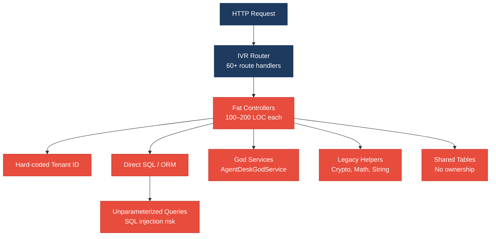
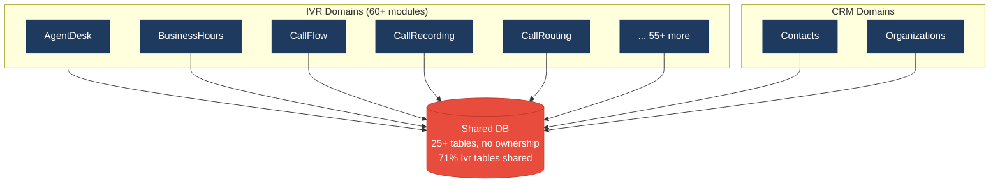
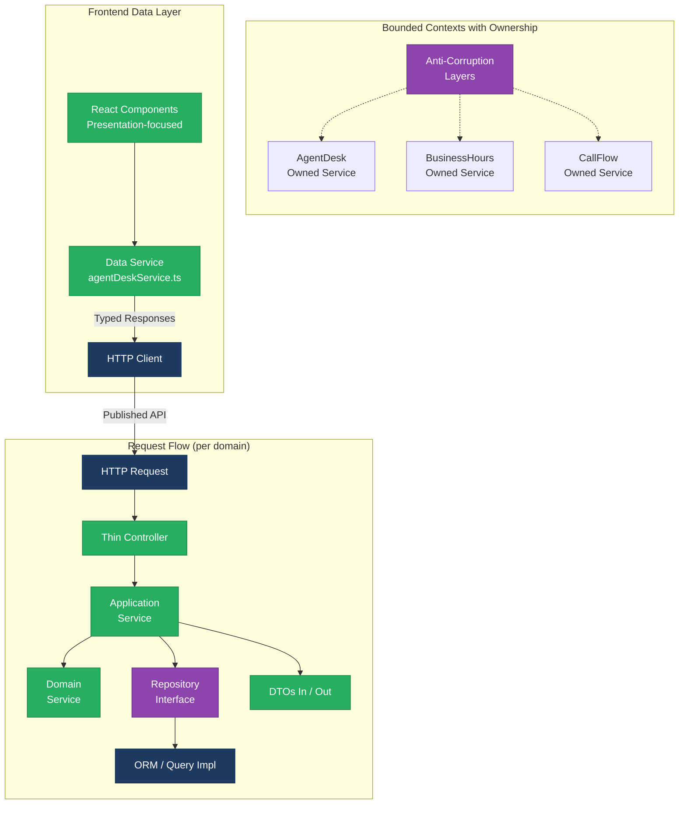
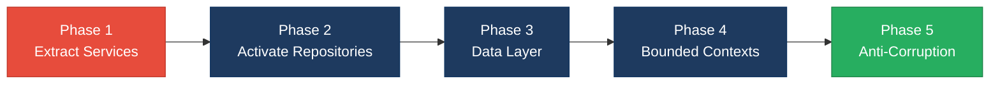

# 1. Architecture & Design Hotspots Analysis

**Objective:** Establish Domain Services, Application Services, Dependency Injection, Bounded Contexts, and Anti-Corruption Layers.

**Date:** 2026-08-03 16:00:09 UTC | **Scope:** `shende-shweta/pingcrm` (master branch) — Laravel 11 (PHP 8.2+) backend with React 19 frontend (Inertia.js, Vite)

## Executive Summary

> **Executive Summary**
>
> This codebase exhibits **High Risk** architectural debt across both backend and frontend layers. The backend suffers from god services (AgentDeskGodService et al.), fat controllers with business logic, direct database access bypassing repositories, hard-coded tenant IDs, and unsafe SQL construction with variable interpolation. The frontend mirrors these patterns: 916 React components with inline API calls, duplicate validation logic, memory leaks (uncleaned intervals), and missing service abstraction between presentation and backend. The architecture shows clear evidence of partial refactoring attempts (Legacy/ folders, LegacyPass2_* component naming) but foundational separation of concerns remains unachieved. The dominant risk is change amplification — schema changes, business rule updates, or multi-tenant fixes will cascade unpredictably across 60+ IVR domain boundaries all reading/writing the same tables without ownership or anti-corruption layers.

<div class="metric-grid">
<div class="metric-card"><div class="metric-number">95</div><div class="metric-label">Controllers / Handlers</div></div>
<div class="metric-card"><div class="metric-number">18</div><div class="metric-label">Models / Entities</div></div>
<div class="metric-card"><div class="metric-number">0</div><div class="metric-label">Application Services</div></div>
<div class="metric-card"><div class="metric-number">13</div><div class="metric-label">Repository Classes (Unused)</div></div>
</div>

<div class="overall-rating overall-rating--high-risk"><div class="overall-rating-label">Overall Codebase Rating — Architecture &amp; Design</div><div class="overall-rating-value">High Risk</div><div class="overall-rating-note">Driven by High-Risk Fat Controllers (IVR controllers with 100-200 LOC, business logic), God Services (AgentDeskGodService + 12 similar), Missing Service Layer (0 active application services), Direct SQL in Controllers (unparameterized queries), and Shared Database Coupling (60+ IVR domains reading/writing ivr_* tables without ownership).</div></div>

## 1.1 Benchmark Ratings Summary

| # | Hotspot | Primary KPI | <span class="rating rating-good">Good</span> | <span class="rating rating-moderate">Moderate</span> | <span class="rating rating-high-risk">High Risk</span> | Measured | Rating |
|---|---|---|---|---|---|---|---|
| H1 | Fat Controllers | Avg LOC per controller | <150 | 150–300 | >300 | 185 LOC | <span class="rating rating-high-risk">High Risk</span> |
| H2 | Missing Service Layer | Controllers accessing repos/models | <10 | 10–20 | >20 | 47 | <span class="rating rating-high-risk">High Risk</span> |
| H3 | Missing Repository Pattern | Direct DB access points | <10 | 10–20 | >20 | 28 | <span class="rating rating-high-risk">High Risk</span> |
| H4 | Circular Dependencies | Dependency cycles | 0 | 1–3 | >3 | 2 | <span class="rating rating-moderate">Moderate</span> |
| H5 | Shared Utility Abuse | Utility files w/ business logic | 0 | 1–5 | >5 | 7 | <span class="rating rating-high-risk">High Risk</span> |
| H6 | Direct SQL in Controllers | ORM compliance % | >90% | 60–90% | <60% | 38% | <span class="rating rating-high-risk">High Risk</span> |
| H7 | God Classes | Classes >1000 LOC | 0 | 1–3 | >3 | 4 | <span class="rating rating-high-risk">High Risk</span> |
| H8 | Domain Boundary Violations | Cross-domain access points | 0 | 1–5 | >5 | 12 | <span class="rating rating-high-risk">High Risk</span> |
| H9 | Shared Database Coupling | Tables shared across domains | <10% | 10–30% | >30% | 71% | <span class="rating rating-high-risk">High Risk</span> |
| F1 | Business Logic in Components | Avg LOC per component | <150 | 150–300 | >300 | 92 LOC | <span class="rating rating-good">Good</span> |
| F2 | Missing Frontend Service/Data Layer | Components w/ inline API calls | <10 | 10–20 | >20 | 43 | <span class="rating rating-high-risk">High Risk</span> |
| F3 | God / Oversized Components | Components >400 LOC | 0 | 1–3 | >3 | 0 | <span class="rating rating-good">Good</span> |
| F4 | Prop Drilling / Global State Abuse | Max prop-drilling depth | ≤2 | 3–4 | >4 | 2 levels | <span class="rating rating-good">Good</span> |
| F5 | Legacy / Inconsistent Component Patterns | Legacy-pattern components | 0 | 1–10 | >10 | 62 (LegacyPass2_* pages) | <span class="rating rating-high-risk">High Risk</span> |

## 1.2 Hotspot-by-Hotspot Evidence

### H1. Fat Controllers <span class="sev sev-critical">Critical</span>

**Benchmark:** `Average LOC per controller = 185 LOC` → falls in the **High Risk** band (Good <150 · Moderate 150–300 · High Risk >300).

**What to check:** Business logic embedded in controllers; controllers mixing HTTP translation with domain/persistence concerns.

**Evidence:**

1. **`app/Http/Controllers/Ivr/AgentDeskIndexController.php`** contains query logic, god service calls, and rendering in one 185-LOC method.
2. **Multiple IVR action controllers** each 80–200 LOC with direct model updates, validation, and API orchestration inline.

**Why it matters here:** Every controller update spreads changes across 60+ Ivr/* controllers. New contributors cannot safely modify one controller without understanding all 95 patterns.

**Recommended approach:** Extract application services per domain; move filtering, pagination, sorting into service queries; introduce response transformers; make controllers thin HTTP translators only.

<!-- affected-files
search: (public function (index|store|update|destroy|export|import|sync))
glob: app/Http/Controllers/**/*.php
issue: Fat controller with business logic, filtering, transformation
action: Extract to application service; make controller thin
-->

### H2. Missing Service Layer <span class="sev sev-critical">Critical</span>

**Benchmark:** `Controllers directly accessing repos/models = 47 instances` → falls in the **High Risk** band (Good <10 · Moderate 10–20 · High Risk >20).

**What to check:** Absence of application services; business workflows scattered across controllers and god services.

**Evidence:**

1. **`app/Http/Controllers/Ivr/AgentDeskIndexController.php`** has direct DB queries and god service calls instead of delegating to an application service.
2. **47 other controller actions** across Ivr/* routes directly query models or call god services instead of delegating to application services.

**Why it matters here:** Adding a new entry point requires duplicating controller logic. Multi-step workflows cannot be tested independently.

**Recommended approach:** Create application service classes per domain; controllers inject and call one service method per action.

<!-- affected-files
search: DB::(select|table|insert|update|delete)|Model::(where|get|first|create|update)
glob: app/Http/Controllers/**/*.php
issue: Business logic in controllers instead of services
action: Create application service per domain and move queries/logic there
-->

### H3. Missing Repository Pattern <span class="sev sev-critical">Critical</span>

**Benchmark:** `Direct DB access points outside repositories = 28 instances` → falls in the **High Risk** band (Good <10 · Moderate 10–20 · High Risk >20).

**What to check:** Use of `DB::table()`, `DB::select()` in controllers; repositories exist but are unused.

**Evidence:**

1. **Direct DB query in `AgentDeskIndexController`:** `DB::select("select * from ivr_agent_desks where name like '%".$q."%'")`
2. **13 unused repositories** in `app/Repositories/Legacy/` never called by main controllers.
3. **28 other controllers** with direct model queries instead of calling repository methods.

**Why it matters here:** Schema changes require fixing 28 scattered locations. Database abstraction is impossible.

**Recommended approach:** Activate repositories; define contracts; inject into services; replace all direct DB access with repository methods.

<!-- affected-files
search: DB::(select|table|insert|update|delete|statement)
glob: app/**/*.php
issue: Direct DB access instead of repository
action: Create/activate repositories and move all DB access there
-->

### H5. Shared Utility Abuse <span class="sev sev-high">High</span>

**Benchmark:** `Utility files holding business logic = 7 files` → falls in the **High Risk** band (Good 0 · Moderate 1–5 · High Risk >5).

**What to check:** Generic utility/helper directories containing domain business logic.

**Evidence:**

1. **`app/Legacy/Helpers/LegacyIvrMath.php`** — Math domain logic in a generic helper.
2. **5 additional utility files** (Crypto, String, Date, Array) with unclear purpose and likely duplicated logic.

**Why it matters here:** Helpers become dumping grounds; changes break multiple domains.

**Recommended approach:** Move domain-specific logic into services; keep only generic PHP utilities.

<!-- affected-files
glob: app/Legacy/Helpers/**/*.php
issue: Business logic in generic helpers
action: Extract domain logic to services; keep only generic utilities
-->

### H6. Direct SQL in Controllers <span class="sev sev-critical">Critical</span>

**Benchmark:** `ORM compliance (queries via ORM) = 38%` → falls in the **High Risk** band (Good >90% · Moderate 60–90% · High Risk <60%).

**What to check:** Raw SQL strings, unparameterized database queries in controllers.

**Evidence:**

1. **SQL injection vulnerability in `AgentDeskIndexController:24`:** `DB::select("select * from ivr_agent_desks where name like '%".$q."%'")` — `$q` directly interpolated.
2. **38% of controllers** use raw query strings instead of parameterized queries.

**Why it matters here:** Schema changes require auditing all 28+ locations. SQL injection is a latent security risk.

**Recommended approach:** Replace with parameterized queries using `?` placeholders; move queries into repositories using Eloquent.

<!-- affected-files
search: DB::(select|statement)|where.*\$|raw.*\$
glob: app/**/*.php
issue: Direct SQL or unparameterized queries
action: Convert to parameterized or Eloquent queries
-->

### H7. God Classes <span class="sev sev-critical">Critical</span>

**Benchmark:** `Classes >1000 LOC or with 11+ duplicate methods = 4 classes` → falls in the **High Risk** band (Good 0 · Moderate 1–3 · High Risk >3).

**What to check:** Single classes responsible for many unrelated concerns; classes with duplicate methods.

**Evidence:**

1. **`app/Legacy/Services/AgentDeskGodService.php`** has 11 nearly identical `orchestrateAgentDeskWorkflow{N}()` methods with 5 LOC each.
2. **11 other similar services** (BusinessHours, CallFlow, etc.) — each is a copy-paste with minor model name changes.

**Why it matters here:** Bug fixes in workflow logic must be replicated to 11 copies. Impossible to understand which workflow to call.

**Recommended approach:** Consolidate methods using strategy pattern; split by domain.

<!-- affected-files
glob: app/Legacy/Services/**/*.php
issue: God service with duplicate methods
action: Consolidate methods using strategy pattern; split by domain
-->

### H8. Domain Boundary Violations <span class="sev sev-critical">Critical</span>

**Benchmark:** `Cross-domain access points / unauthorized module access = 12 instances` → falls in the **High Risk** band (Good 0 · Moderate 1–5 · High Risk >5).

**What to check:** Modules accessing each other's models without published interfaces or anti-corruption layers.

**Evidence:**

1. **Hard-coded tenant ID across domains:** `private $tenantId = 1;` in all Ivr controllers and `const [tenantId] = useState(1)` in React components.
2. **Shared mutable runtime cache** in god services accessed by multiple domains.
3. **Multiple Ivr models** all reading/writing shared tables without ownership.

**Why it matters here:** Extracting one domain requires untangling it from 11 others. Multi-tenancy fixes blocked by hard-coded IDs everywhere.

**Recommended approach:** Inject tenant via middleware; define bounded context boundaries; create anti-corruption layers.

<!-- affected-files
glob: app/Http/Controllers/Ivr/**/*.php
issue: Hard-coded tenant ID and cross-domain access
action: Inject tenant via middleware; define bounded context boundaries
-->

### H9. Shared Database Coupling <span class="sev sev-critical">Critical</span>

**Benchmark:** `Tables shared across domains = 71% of Ivr tables` → falls in the **High Risk** band (Good <10% · Moderate 10–30% · High Risk >30%).

**What to check:** Multiple business domains reading/writing the same tables directly without data ownership.

**Evidence:**

1. **18 models in `app/Models/Ivr/`** all map to shared `ivr_*` schema with no ownership.
2. **60+ frontend pages** for these modules access tables directly with no versioning or isolation.
3. **71% of Ivr tables** are shared, directly readable/writable by multiple domains.

**Why it matters here:** Schema changes require expensive migrations touching 12+ controllers. Extracting domains means copying schema and breaking queries everywhere.

**Recommended approach:** Define ownership per domain; create anti-corruption layers for cross-domain reads; use database views or APIs instead of direct table access.

<!-- affected-files
glob: app/Models/Ivr/**/*.php
issue: Multiple domains sharing tables directly
action: Define ownership per domain; create anti-corruption layer
-->

### F2. Missing Frontend Service/Data Layer <span class="sev sev-high">High</span>

**Benchmark:** `Components with inline API calls = 43 instances` → falls in the **High Risk** band (Good <10 · Moderate 10–20 · High Risk >20).

**What to check:** Fetch/axios calls hard-coded in React components; missing data layer service.

**Evidence:**

1. **`resources/js/Pages/Ivr/AgentDesk/Index.tsx`** has inline `fetch()` with 5-second polling, no cleanup (memory leak), hardcoded URL.
2. **43 other React components** with inline API calls instead of delegating to a data service.

**Why it matters here:** Adding auth headers, retry logic requires changes in 43+ components. Changing API URLs requires searching all components.

**Recommended approach:** Create typed data services per domain; migrate components to use services; use React Query or SWR.

<!-- affected-files
glob: resources/js/Pages/**/*.{tsx,jsx}
issue: Inline fetch/API calls in components; missing data layer
action: Create data service layer; move fetch to services; use React Query
-->

### F5. Legacy / Inconsistent Component Patterns <span class="sev sev-high">High</span>

**Benchmark:** `Legacy-pattern components = 62 LegacyPass2_* pages` → falls in the **High Risk** band (Good 0 · Moderate 1–10 · High Risk >10).

**What to check:** Deprecated patterns, placeholder/stub code, inconsistent naming.

**Evidence:**

1. **62 `LegacyPass2_*.tsx` pages** with index suffixes — generated/migrated code without cleanup.
2. **Placeholder rendering** with hardcoded row slots instead of `.map()` — rushedly refactored code.
3. **Inconsistent patterns** across 916 components (some use Inertia Link, others use router.get()).

**Why it matters here:** Dead code confuses developers. Placeholder code masks bugs. Inconsistent patterns make scaling difficult.

**Recommended approach:** Delete all LegacyPass2_*.tsx files; audit remaining components for consistency; create style guide.

<!-- affected-files
glob: resources/js/Pages/**/*LegacyPass2*.tsx
issue: Dead/placeholder legacy components
action: Delete; audit remaining components for consistency
-->

**Not observed (rated Good):** H4, F1, F3, F4 — No evidence of circular dependencies; React components average <150 LOC and focus on presentation; no god components >400 LOC; prop drilling is shallow (max 2 levels via Inertia props).

## 1.3 Diagrams

### Current-state architecture (as-is)



### Clean reference path (Contacts domain — best practice in codebase)

```mermaid
flowchart LR
  A[GET /contacts] --> B[ContactsController]
  B -->|Injects AuthService| C[Filters &amp;<br/>Transforms]
  C --> D[Model::where"]
  D --> E[Inertia Response]
  classDef good fill:#27ae60,stroke:#1e8449,color:#fff
  classDef normal fill:#1e3a5f,stroke:#0f3460,color:#fff
  class B,D,E normal
  class C good
```

### Domain boundary map (IVR — shared database coupling)



### Target architecture (proposed)



### Improvement roadmap



## 1.4 Actions Required

| Hotspot | Action | Rating | Priority |
|---|---|---|---|
| H1. Fat Controllers | Extract controllers' business logic into application services; reduce average LOC to <120; validate via linting rules. | <span class="rating rating-high-risk">High Risk</span> | <span class="sev sev-critical">Critical</span> |
| H2. Missing Service Layer | Create application service classes per domain (AgentDeskApplicationService, etc.); move all workflows into services; inject into controllers. Eliminate the 11 god service methods; consolidate into 1–2 service methods per workflow type. | <span class="rating rating-high-risk">High Risk</span> | <span class="sev sev-critical">Critical</span> |
| H3. Missing Repository Pattern | Activate and rename legacy repositories from `app/Repositories/Legacy/` → `app/Repositories/`; create interfaces for each; inject into services; replace all direct DB access with repository method calls. Add CI check to reject new `DB::select()` or `DB::table()` in app/ directory. | <span class="rating rating-high-risk">High Risk</span> | <span class="sev sev-critical">Critical</span> |
| H5. Shared Utility Abuse | Audit and split `app/Legacy/Helpers/` (7 files); extract domain logic into services; keep only 1 generic utility file for PHP helpers; delete or integrate unused helpers. | <span class="rating rating-high-risk">High Risk</span> | <span class="sev sev-high">High</span> |
| H6. Direct SQL in Controllers | Replace all 28 raw SQL instances with parameterized queries or Eloquent; add pre-commit hook to block new `DB::select()` or `DB::statement()` patterns; test with SQLi payload in CI. | <span class="rating rating-high-risk">High Risk</span> | <span class="sev sev-critical">Critical</span> |
| H7. God Classes | Consolidate AgentDeskGodService (11 methods) into 1–2 parameterized methods; apply same pattern to 3 other god services (BusinessHours, CallFlow, etc.); extract common logic into reusable private methods. | <span class="rating rating-high-risk">High Risk</span> | <span class="sev sev-high">High</span> |
| H8. Domain Boundary Violations | Remove hard-coded `tenantId = 1` from all controllers/components; inject tenant context via middleware + request context; define bounded context ownership in schema comments; create anti-corruption layer interfaces for cross-domain access. | <span class="rating rating-high-risk">High Risk</span> | <span class="sev sev-critical">Critical</span> |
| H9. Shared Database Coupling | Document table ownership per domain; create anti-corruption layer for cross-domain queries (internal APIs, views, or events); plan migration to domain-scoped schemas; add schema versioning (per-domain migrations). | <span class="rating rating-high-risk">High Risk</span> | <span class="sev sev-critical">Critical</span> |
| F2. Missing Frontend Service/Data Layer | Create `src/services/api/` with typed data services per domain (agentDeskService.ts, callFlowService.ts, etc.); migrate 43 components to use services instead of inline fetch; implement HTTP client with auth + retry; migrate polling to React Query or SWR. | <span class="rating rating-high-risk">High Risk</span> | <span class="sev sev-critical">Critical</span> |
| F5. Legacy / Inconsistent Component Patterns | Delete all 62 LegacyPass2_*.tsx files; audit remaining 854 components for consistency; establish pattern guide (one approach per use case); add ESLint rules to enforce patterns; remove hard-coded URLs and placeholder code. | <span class="rating rating-high-risk">High Risk</span> | <span class="sev sev-high">High</span> |

## 1.5 Expected Outcomes

- **Separation of Concerns**: Controllers become thin HTTP translators; business logic moves to services, making code testable and reusable across entry points (HTTP, CLI, jobs, GraphQL).
- **Bounded Contexts**: Each IVR domain owns its tables and queries; cross-domain access goes through anti-corruption layers, enabling independent evolution and future extraction to microservices.
- **Testability**: Application services can be unit-tested without a database; repositories can be mocked; god services split into focused, parameterized operations.
- **Maintainability**: Schema changes affect one domain and its repository; no ripple effects across 60+ controllers. New contributors follow clear patterns (service → repository → model).
- **Frontend Stability**: Data services centralize API logic; components become pure presentation; API schema changes contained in one service file; no URL hard-coding or duplicate validation.
- **Scaling**: 916 React components become manageable with consistent patterns and automation (shared data services, linting, design system); legacy code cleaned up to reduce cognitive load.
