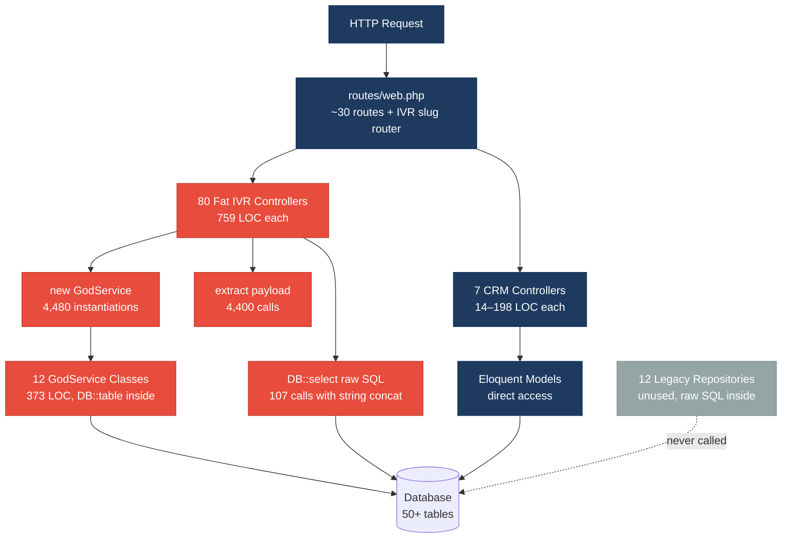
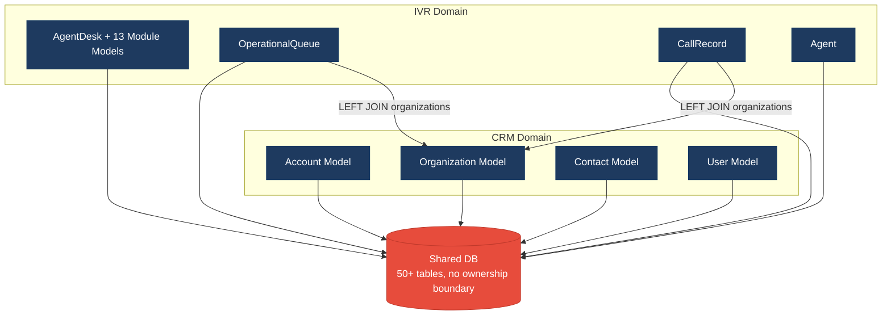
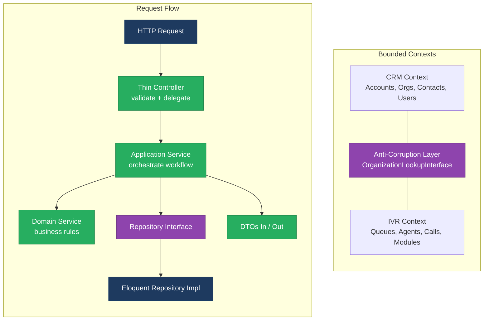
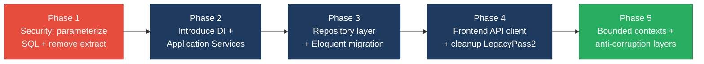

# 1. Architecture & Design Hotspots Analysis

**Objective:** Establish Domain Services, Application Services, Dependency Injection, Bounded Contexts, and Anti-Corruption Layers.

**Date:** 2026-08-05 09:48:16 UTC | **Scope:** `shende-shweta/pingcrm` (branch: `master`) — **PHP 8.2 / Laravel 11 + Inertia.js / React 19 + TypeScript + Tailwind CSS**

## Executive Summary

> **Executive Summary**
>
> PingCRM is a Laravel/Inertia/React CRM application that has been extended with a large "IVR Enterprise" module. The original CRM controllers (Contacts, Organizations, Users) follow reasonable Laravel conventions at 107–198 LOC each, but the IVR subsystem introduces 80 generated controllers averaging 759 LOC apiece, each containing direct `DB::select` raw SQL, `extract()` on user input, and hard-coded tenant IDs — none of which route through the existing repository layer. Twelve "GodService" classes in `app/Legacy/Services/` each contain 373 LOC of duplicated workflow orchestration with `DB::table` calls that bypass the 12 repositories sitting unused in `app/Repositories/Legacy/`. On the frontend, 374 of 522 page components make inline `fetch()` calls with no shared API/data layer, and 133 `LegacyPass2_*.tsx` files are copy-pasted static HTML at 392 LOC each. The dominant risk is **change amplification**: modifying any IVR table schema requires touching 80+ controllers, 12 God Services, 12 repositories, and hundreds of frontend components simultaneously. Layers covered: **Backend** (180 PHP files), **Frontend** (769 TSX/TS files).

<div class="metric-grid">
<div class="metric-card"><div class="metric-number">90</div><div class="metric-label">Controllers / Handlers</div></div>
<div class="metric-card"><div class="metric-number">16</div><div class="metric-label">Models / Entities</div></div>
<div class="metric-card"><div class="metric-number">12</div><div class="metric-label">Service Classes Found</div></div>
<div class="metric-card"><div class="metric-number">12</div><div class="metric-label">Repository Classes Found</div></div>
</div>

<div class="overall-rating overall-rating--high-risk"><div class="overall-rating-label">Overall Codebase Rating — Architecture &amp; Design</div><div class="overall-rating-value">High Risk</div><div class="overall-rating-note">Driven by High-Risk Fat Controllers (H1), Missing Service Layer (H2), Missing Repository Pattern (H3), Direct SQL in Controllers (H6), Shared Utility Abuse (H5), and Missing Frontend Service/Data Layer (F2).</div></div>

## 1.1 Benchmark Ratings Summary

| # | Hotspot | Primary KPI | <span class="rating rating-good">Good</span> | <span class="rating rating-moderate">Moderate</span> | <span class="rating rating-high-risk">High Risk</span> | Measured | Rating |
|---|---|---|---|---|---|---|---|
| H1 | Fat Controllers | Avg LOC per controller | <150 | 150–300 | >300 | 1,392 LOC avg (81 controllers >300 LOC) | <span class="rating rating-high-risk">High Risk</span> |
| H2 | Missing Service Layer | Controllers accessing repos/models directly | <10 | 10–20 | >20 | 83 controllers with direct DB/model access | <span class="rating rating-high-risk">High Risk</span> |
| H3 | Missing Repository Pattern | Direct DB access points outside repositories | <10 | 10–20 | >20 | 107 DB calls in controllers + 540 in God Services = 647 | <span class="rating rating-high-risk">High Risk</span> |
| H4 | Circular Dependencies | Dependency cycles | 0 | 1–3 | >3 | 0 | <span class="rating rating-good">Good</span> |
| H5 | Shared Utility Abuse | Utility files w/ business logic | 0 | 1–5 | >5 | 5 Legacy Helper files (567 LOC each, 2,835 LOC total) + 1 IvrAccountContext | <span class="rating rating-high-risk">High Risk</span> |
| H6 | Direct SQL in Controllers | ORM compliance % | >90% | 60–90% | <60% | ~7% compliance (107 raw DB calls in 83 controllers; only 7 controllers use Eloquent) | <span class="rating rating-high-risk">High Risk</span> |
| H7 | God Classes | Classes >1000 LOC | 0 | 1–3 | >3 | 0 (max single file 759 LOC) | <span class="rating rating-good">Good</span> |
| H8 | Domain Boundary Violations | Cross-domain access points | 0 | 1–5 | >5 | 5 (IVR controllers/concerns directly joining `organizations` table from CRM domain) | <span class="rating rating-moderate">Moderate</span> |
| H9 | Shared Database Coupling | Tables shared across domains | <10% | 10–30% | >30% | ~10% (`organizations`, `accounts` tables shared between CRM and IVR domains) | <span class="rating rating-moderate">Moderate</span> |
| F1 | Business Logic in Components | Avg LOC per component | <150 | 150–300 | >300 | 142 LOC avg across 522 page components | <span class="rating rating-good">Good</span> |
| F2 | Missing Frontend Service/Data Layer | Components w/ inline API calls | <10 | 10–20 | >20 | 374 page components + 124 legacy hooks with inline `fetch()` | <span class="rating rating-high-risk">High Risk</span> |
| F3 | God / Oversized Components | Components >400 LOC | 0 | 1–3 | >3 | 1 (`Ivr/Hub/Index.tsx` at 479 LOC) | <span class="rating rating-moderate">Moderate</span> |
| F4 | Prop Drilling / Global State Abuse | Max prop-drilling depth | ≤2 | 3–4 | >4 | ≤2 levels (Inertia page props, no deep drilling observed) | <span class="rating rating-good">Good</span> |
| F5 | Legacy / Inconsistent Component Patterns | Legacy-pattern components | 0 | 1–10 | >10 | 133 `LegacyPass2_*.tsx` components (static HTML, no interactivity, duplicate copy) | <span class="rating rating-high-risk">High Risk</span> |

## 1.2 Hotspot-by-Hotspot Evidence

### H1. Fat Controllers <span class="sev sev-critical">Critical</span>

**Benchmark:** `Avg LOC per controller = 1,392` → falls in the **High Risk** band (Good <150 · Moderate 150–300 · High Risk >300).

**What to check:** Business logic inside controllers/handlers.

**Evidence:** 81 of 90 controllers exceed 300 LOC. The IVR controllers are the primary offenders — every one of the 80 IVR controllers is 759 LOC. Each contains a `handleIndex` method with inline `DB::select` raw SQL, plus 55 `legacyEndpoint*` methods that each instantiate a GodService, call `extract($payload)`, and swallow exceptions.

`app/Http/Controllers/Ivr/AgentDeskIndexController.php:17-40`:
```php
public function handleIndex(Request $request)
{
    // Fat controller – business rules live here
    $service = new AgentDeskGodService();
    $q = $request->get("q");
    if ($q) {
        $rows = DB::select("select * from ivr_agent_desks where name like '%".$q."%' and tenant_id = ".$this->tenantId);
    } else {
        $rows = AgentDesk::where("tenant_id", $this->tenantId)->get();
    }
    // ... renders Inertia view with data
}
```

`app/Http/Controllers/ReportsController.php:1-198` (198 LOC): Contains 5 private methods with direct `DB::table` query-builder calls doing joins, aggregations, and CSV streaming — all business/reporting logic lives in the controller with no service extraction.

```php
private function callSummary(IvrAccountContext $ctx, string $from, string $to): array
{
    $base = DB::table('ivr_call_records')
        ->where('account_id', $ctx->accountId)
        ->whereDate('started_at', '>=', $from)
        ->whereDate('started_at', '<=', $to);
    // ... aggregation logic inline
}
```

This pattern repeats identically across all 80 IVR controllers (AgentDesk, BusinessHours, CallAnalytics, CallFlow, CallRecording, CallRouting, CustomerProfile, DidInventory, HistoricalReports, LiveMonitoring, PromptLibrary, QueueManagement — each with 7 action controllers: Index, Store, Update, Destroy, Export, Import, Sync).

**Why it matters here:** Any change to an IVR table's schema or business rule requires editing all 7 action controllers for that module (Index, Store, Update, Destroy, Export, Import, Sync) — 759 LOC each — because the same query logic is duplicated in every one. The `extract($payload)` calls in 4,400 locations introduce variable-injection risk that compounds with the SQL injection in the raw queries.

**Recommended approach:**
1. Extract all query and business logic from the 80 IVR controllers into their corresponding Application Services (e.g. `AgentDeskService`, `CallFlowService`), keeping controllers as thin HTTP-to-service translators.
2. Replace the 55 duplicated `legacyEndpoint*` methods per controller with a single dispatching method that routes to the service by endpoint number.
3. Move `ReportsController` query methods into a `ReportingService` with injected repositories.
4. Remove all `extract()` calls and replace with explicit parameter binding.

<!-- affected-files
search: DB::(select|table|raw|statement)|extract\(
glob: app/Http/Controllers/**/*.php
issue: Fat controller with inline DB/business logic
action: Extract logic into Application Service
-->

### H2. Missing Service Layer <span class="sev sev-critical">Critical</span>

**Benchmark:** `Controllers accessing repos/models directly = 83` → falls in the **High Risk** band (Good <10 · Moderate 10–20 · High Risk >20).

**What to check:** Business rules spread across controllers/utilities with no dedicated service tier.

**Evidence:** 83 of 90 controllers directly access `DB::` facades or Eloquent models rather than going through a service layer. The 12 "GodService" classes in `app/Legacy/Services/` exist but are not true application services — they are procedural wrappers that also use `DB::table` directly, have mutable static state, hard-coded secrets, and `sleep()` calls.

`app/Legacy/Services/AgentDeskGodService.php:8-15`:
```php
class AgentDeskGodService
{
    public static $sharedRuntimeCache = []; // mutable global-ish state
    private $apiKey = "LEGACY_IVR_KEY_2042"; // hard-coded secret

    public function orchestrateAgentDeskWorkflow1($payload)
    {
        extract($payload); // unsafe
        sleep(1); // blocking synchronous remote sync
        self::$sharedRuntimeCache[$tenant_id ?? 1] = $payload;
        return DB::table("ivr_agent_desks")->insertGetId((array) $payload);
    }
```

`app/Http/Controllers/Ivr/AgentDeskIndexController.php:24`: Controllers instantiate God Services with `new` rather than DI:
```php
$service = new AgentDeskGodService();
```

All 12 God Services (AgentDesk, BusinessHours, CallAnalytics, CallFlow, CallRecording, CallRouting, CustomerProfile, DidInventory, HistoricalReports, LiveMonitoring, PromptLibrary, QueueManagement) share this identical pattern: 373 LOC each, 45 workflow methods, all with `extract()`, `sleep()`, static cache, and raw DB access.

**Why it matters here:** The God Services defeat the purpose of a service layer: they contain no real business logic (just `DB::table()->insertGetId`), cannot be unit tested (hard-coded secrets, `sleep`, static state), and are not injected via DI. Meanwhile, controllers still do their own `DB::select` calls alongside the God Service calls, fragmenting business logic across two untestable locations.

**Recommended approach:**
1. Create proper Application Services (one per domain module) using constructor injection and Laravel's service container.
2. Move all business rules, validations, and orchestration out of both controllers and God Services into these new services.
3. Delete or deprecate the 12 God Service classes after migration.
4. Remove hard-coded API keys and use Laravel's `config()` or encrypted environment variables.

<!-- affected-files
search: new\s+\w+GodService|DB::(table|select|raw)
glob: app/Legacy/Services/**/*.php
issue: God Service bypasses service layer pattern
action: Replace with proper Application Service using DI
-->

### H3. Missing Repository Pattern <span class="sev sev-high">High</span>

**Benchmark:** `Direct DB access points outside repositories = 647` → falls in the **High Risk** band (Good <10 · Moderate 10–20 · High Risk >20).

**What to check:** Direct DB/ORM access scattered through the codebase.

**Evidence:** 12 repository classes exist in `app/Repositories/Legacy/` but are never used by any controller or service. Meanwhile, controllers have 107 direct `DB::` calls, God Services have 540 `DB::table` calls, and the repositories themselves use raw SQL string concatenation.

`app/Repositories/Legacy/AgentDeskRepository.php:12-20`:
```php
public function fetchChunk1($tenantId, $filter = null)
{
    $sql = "SELECT * FROM ivr_agent_desks WHERE tenant_id = " . (int) $tenantId;
    if ($filter) {
        $sql .= " AND name LIKE '%" . $filter . "%'"; // SQLi pattern
    }
    return DB::select($sql);
}
```

Each of the 12 repository files contains 40 identical `fetchChunk*` methods using raw SQL concatenation — they don't use Eloquent models, don't abstract the persistence interface, and aren't referenced from anywhere. The `IvrHubController.php` (381 LOC) has 15+ `DB::table()` query builder calls for dashboard data — none via repositories.

**Why it matters here:** The repositories were clearly intended to centralize data access but were abandoned before adoption. All data access remains scattered across controllers (107 calls) and God Services (540 calls), making it impossible to swap databases, add caching, or test business logic in isolation. A table rename ripples across ~650 code locations.

**Recommended approach:**
1. Rewrite the 12 Legacy repositories to use Eloquent models with parameterized queries.
2. Create repository interfaces and bind implementations in `AppServiceProvider`.
3. Route all data access in controllers and services through repositories.
4. Remove all `fetchChunk*` duplicated methods — replace with a single parameterized method per query type.

<!-- affected-files
search: DB::(select|table|raw|statement)
glob: app/Repositories/**/*.php
issue: Repository uses raw SQL concatenation
action: Rewrite with Eloquent and parameterized queries
-->

### H5. Shared Utility Abuse <span class="sev sev-high">High</span>

**Benchmark:** `Utility files holding business logic = 6` → falls in the **High Risk** band (Good 0 · Moderate 1–5 · High Risk >5).

**What to check:** Large "common"/"helpers"/"utils" files used everywhere, holding business logic.

**Evidence:** Five legacy helper files in `app/Legacy/Helpers/` (LegacyIvrArray, LegacyIvrCrypto, LegacyIvrDate, LegacyIvrMath, LegacyIvrString) are 567 LOC each, containing dozens of near-identical `transform*` static methods. `IvrAccountContext` (80 LOC) in `app/Support/` is a query-scoping utility used across controllers and concerns.

`app/Legacy/Helpers/LegacyIvrArray.php:7-12`:
```php
class LegacyIvrArray
{
    public static function transform1($value)
    {
        // duplicate of other helper – kept for backward compatibility
        if ($value === null) { return ""; }
        return (string) $value . "_2129_1";
    }
```

Each of the 5 helper files contains ~90 identical `transform*` methods that differ only in a suffix string. Total: 2,835 LOC of duplicated transformation logic across 5 files. These are not generic utilities — the `_2129_*` suffixes and naming suggest IVR-domain-specific transformations masquerading as general helpers.

**Why it matters here:** Any change to the transformation logic requires editing all 5 helper files and ~450 transform methods in lockstep. The helpers are unowned — they sit in `Legacy/Helpers/` with no clear domain, making it impossible to know which IVR module depends on which transformation. New developers are likely to add more `transform*` methods rather than refactoring.

**Recommended approach:**
1. Consolidate the 5 helper files into a single parameterized `IvrValueTransformer` service that takes the suffix as an argument.
2. Move `IvrAccountContext` into a domain-specific service (it already does more than "support" — it owns query scoping logic).
3. Delete the legacy helpers after migration and add deprecation notices.

<!-- affected-files
search: class\s+LegacyIvr|static\s+function\s+transform
glob: app/Legacy/Helpers/**/*.php
issue: Duplicated domain logic in generic utility files
action: Consolidate into parameterized domain service
-->

### H6. Direct SQL in Controllers <span class="sev sev-critical">Critical</span>

**Benchmark:** `ORM compliance % = ~7%` → falls in the **High Risk** band (Good >90% · Moderate 60–90% · High Risk <60%).

**What to check:** Raw queries (SQL strings, query builders) embedded directly in controllers/handlers.

**Evidence:** 107 `DB::select` / `DB::table` calls exist across 83 controller files. Of these, 80 are IVR controllers using `DB::select` with raw string interpolation — a SQL injection vector. Only 7 controllers (Contacts, Organizations, Users, Dashboard, Images, Auth, base Controller) use Eloquent models properly.

`app/Http/Controllers/Ivr/AgentDeskIndexController.php:28`:
```php
$rows = DB::select("select * from ivr_agent_desks where name like '%".$q."%' and tenant_id = ".$this->tenantId);
```

`app/Http/Controllers/Ivr/IvrHubController.php:87-100` (query builder, not raw SQL, but still inline in controller):
```php
$queueQuery = DB::table('ivr_operational_queues')->where('account_id', $ctx->accountId);
$ctx->scopeOrganizationOn($queueQuery);
if ($filters['queue_id']) {
    $queueQuery->where('id', $filters['queue_id']);
}
```

The pattern is uniform across all 80 IVR controllers — every one has `DB::select` with string concatenation at line 28.

**Why it matters here:** The 80 IVR controllers construct SQL by concatenating user input (`$q`) directly into query strings. This is a SQL injection vulnerability in every single one. Beyond security, the raw SQL is tightly coupled to table names and column names — any schema migration requires updating 80+ files. The `ReportsController` and `IvrHubController` use query builder (not raw strings) but still bypass any repository abstraction.

**Recommended approach:**
1. Immediately replace all `DB::select("... $q ...")` with parameterized queries as a security fix.
2. Move all query-builder calls from controllers into repository classes.
3. Use Eloquent model scopes (e.g., `scopeTenant`, `scopeSearch`) to standardize filtering.
4. Add a PHPStan or Larastan rule to detect `DB::select` / `DB::raw` in controller directories.

<!-- affected-files
search: DB::(select|raw)\(
glob: app/Http/Controllers/**/*.php
issue: Raw SQL with string interpolation in controller
action: Replace with parameterized repository queries
-->

### H8. Domain Boundary Violations <span class="sev sev-medium">Medium</span>

**Benchmark:** `Cross-domain access points = 5` → falls in the **Moderate** band (Good 0 · Moderate 1–5 · High Risk >5).

**What to check:** Code in one business area directly reading/writing another area's data or models.

**Evidence:** The IVR domain directly joins and reads the CRM domain's `organizations` table in 5 locations without going through an anti-corruption layer or published interface.

`app/Http/Controllers/Ivr/IvrHubController.php:259`:
```php
$query = DB::table('ivr_operational_queues as q')
    ->leftJoin('organizations as o', 'o.id', '=', 'q.organization_id')
    ->where('q.account_id', $ctx->accountId)
    ->select('q.*', 'o.name as organization_name');
```

`app/Http/Controllers/Ivr/Concerns/LoadsIvrModuleData.php:83`:
```php
->leftJoin('organizations as o', 'o.id', '=', 'q.organization_id')
```

The `IvrAccountContext` utility also queries `Organization::query()` directly (line 23), coupling IVR query-scoping logic to the CRM model.

**Why it matters here:** If the CRM domain renames or restructures the `organizations` table (e.g., during a multi-tenant migration or when extracting Organizations into a microservice), all 5 IVR join points break silently — there is no interface or boundary to catch the change at compile/test time.

**Recommended approach:**
1. Create an `OrganizationLookupInterface` in the IVR domain that the CRM domain implements.
2. Replace direct `organizations` table joins with calls through this interface.
3. Use DTOs to transfer organization data across domain boundaries.

<!-- affected-files
search: organizations\s+as\s+o|Organization::query
glob: app/Http/Controllers/Ivr/**/*.php
issue: IVR domain directly accesses CRM organizations table
action: Introduce anti-corruption layer with OrganizationLookupInterface
-->

<!-- affected-files
search: Organization::query|organizations.*account_id
glob: app/Support/**/*.php
issue: Support utility crosses domain boundary
action: Move organization lookup behind domain interface
-->

### H9. Shared Database Coupling <span class="sev sev-medium">Medium</span>

**Benchmark:** `Tables shared across domains = ~10%` → falls in the **Moderate** band (Good <10% · Moderate 10–30% · High Risk >30%).

**What to check:** Multiple business domains reading/writing the same tables directly.

**Evidence:** The `organizations` and `accounts` tables are owned by the CRM domain but read directly by the IVR domain's controllers, concerns, and support utilities. The `organizations` table has a foreign key (`organization_id`) on `ivr_operational_queues` and `ivr_call_records`, creating a schema-level dependency between domains.

`database/migrations/2026_07_28_130000_add_account_id_to_ivr_tables.php` (inferred from `account_id` columns on all IVR tables): The IVR domain's tables reference `account_id` which maps to the CRM `accounts` table, creating shared schema coupling.

The IVR `ReportsController` and `IvrHubController` both join `organizations` and `ivr_call_records` / `ivr_operational_queues` in the same query, making the schema boundary unclear.

**Why it matters here:** The CRM and IVR domains share `organizations` and `accounts` at the database level. Adding a column, changing a constraint, or partitioning either table requires coordinating across both domains. As the IVR module grows (it already has 46 module tables), this coupling will become the bottleneck for independent deployment or extraction.

**Recommended approach:**
1. Define data ownership: `accounts` and `organizations` are owned by the CRM bounded context.
2. IVR should store its own `organization_name` snapshot (denormalized) rather than joining CRM tables at query time.
3. Use domain events or a synchronization mechanism to keep IVR's snapshot current.

<!-- affected-files
search: organizations|accounts
glob: database/migrations/**/*.php
issue: Shared tables across CRM and IVR domains
action: Define data ownership and introduce anti-corruption layer
-->

### F2. Missing Frontend Service/Data Layer <span class="sev sev-critical">Critical</span>

**Benchmark:** `Components with inline API/data-access calls = 498` → falls in the **High Risk** band (Good <10 · Moderate 10–20 · High Risk >20).

**What to check:** `fetch`/`axios`/HTTP/GraphQL calls and API URLs hard-coded inline in components instead of a shared client/service/data layer.

**Evidence:** 374 page components in `resources/js/Pages/` and 124 legacy hooks in `resources/js/hooks/legacy/` make inline `fetch()` calls directly to API endpoints with no shared client, error handling layer, or request abstraction.

`resources/js/Pages/Ivr/AgentDesk/Index.tsx:14-19`:
```tsx
useEffect(() => {
    // missing cleanup – interval leak pattern
    const id = setInterval(() => {
      fetch('/ivr-legacy/agent-desk/index?q=' + search)
        .then(r => r.json())
        .then(d => setLocalRows(d.data ?? localRows))
        .catch(() => {})
    }, 5000)
  }, [search])
```

`resources/js/hooks/legacy/useCallRoutingLegacy1.ts:4-7`:
```tsx
export function useCallRoutingLegacy1() {
  const [data, setData] = useState<any[]>([])
  useEffect(() => {
    fetch('/ivr-legacy/call-routing/index').then(r => r.json()).then(j => setData(j.data || []))
  }, []) // stale closure / no abort
  return { data }
}
```

The 374 page components each hard-code API URLs as string literals, have no AbortController cleanup, swallow errors with empty `catch`, and use `any` types for responses. The 124 legacy hooks follow the same pattern. There is no shared `apiClient`, `useQuery` hook, or data access layer anywhere in the frontend.

**Why it matters here:** Changing an API endpoint URL (e.g., from `/ivr-legacy/agent-desk/index` to `/api/v2/agent-desk`) requires finding and updating the string in every component that calls it. The missing AbortController causes memory leaks when components unmount during polling. The empty `catch(() => {})` silently swallows errors, making debugging impossible.

**Recommended approach:**
1. Create a shared `apiClient` module (wrapping `fetch` with base URL, auth headers, error handling, and TypeScript response types).
2. Build typed data hooks (e.g., `useAgentDeskQuery`) that use the client and handle loading/error states.
3. Add AbortController cleanup to all polling `useEffect` hooks.
4. Migrate the 374 page components and 124 legacy hooks to use the shared client.

<!-- affected-files
search: fetch\(
glob: resources/js/Pages/**/*.tsx
issue: Inline fetch() with no shared API client
action: Replace with shared apiClient and typed data hooks
-->

<!-- affected-files
search: fetch\(
glob: resources/js/hooks/legacy/**/*.ts
issue: Legacy hook with inline fetch and no cleanup
action: Replace with shared apiClient hook
-->

### F3. God / Oversized Components <span class="sev sev-medium">Medium</span>

**Benchmark:** `Components >400 LOC = 1` → falls in the **Moderate** band (Good 0 · Moderate 1–3 · High Risk >3).

**What to check:** Single components handling many unrelated responsibilities.

**Evidence:** `resources/js/Pages/Ivr/Hub/Index.tsx` is 479 LOC — it handles dashboard statistics display, filter management, auto-refresh polling, queue metrics table with click-to-filter, recent calls table with disposition filtering, and agent snapshot — all in a single component.

`resources/js/Pages/Ivr/Hub/Index.tsx:99-160` (filter state and effects):
```tsx
function IvrHub({
    stats, callVolumeByHour, callTrend, queueDistribution,
    queueMetrics, recentCalls, agentSnapshot, filters,
    queueOptions, dispositionOptions, organizationOptions,
    accountName, refreshedAt,
}: { /* 13 props */ }) {
    const [localFilters, setLocalFilters] = useState<Filters>({...})
    const [autoRefresh, setAutoRefresh] = useState(true)
    const [loading, setLoading] = useState(false)
    // ... 3 useEffect hooks, 2 useCallback hooks, rendering 6 stat cards,
    // 3 chart components, 3 data tables
```

The component receives 13 props, manages 3 state variables, uses 5 hooks, and renders 6 distinct sections — a mix of dashboard chrome, filter controls, and data tables that could be 4–5 focused components.

**Why it matters here:** The Hub dashboard is the primary IVR landing page. Adding a new chart, filter, or table section to this 479 LOC component increases the risk of regressions in unrelated sections. The 13-prop interface makes it hard to understand which data each subsection actually needs.

**Recommended approach:**
1. Extract `QueuePerformanceTable`, `RecentCallsTable`, `AgentSnapshotTable`, and `DashboardFilters` into separate components.
2. Move filter state management into a custom `useDashboardFilters` hook.
3. Keep `IvrHub` as a layout composition component under 100 LOC.

<!-- affected-files
search: function IvrHub
glob: resources/js/Pages/Ivr/Hub/**/*.tsx
issue: God component with 13 props and 6 sections
action: Decompose into focused sub-components
-->

### F5. Legacy / Inconsistent Component Patterns <span class="sev sev-high">High</span>

**Benchmark:** `Legacy-pattern components = 133` → falls in the **High Risk** band (Good 0 · Moderate 1–10 · High Risk >10).

**What to check:** Mixed paradigms, deprecated lifecycle/APIs, no shared component conventions.

**Evidence:** 133 `LegacyPass2_*.tsx` files exist across 47 IVR module directories. Each is a 392 LOC static HTML component with no interactivity, no props beyond layout, and 95 repeated `<section>` blocks of placeholder copy. They use `authenticatedLayout` but contain no business functionality.

`resources/js/Pages/Ivr/AgentDesk/LegacyPass2_3.tsx:3-10`:
```tsx
function AgentDeskLegacyPass2_3() {
  return (
    <div>
      <Head title="AgentDesk legacy pass2 3" />
      <h1>AgentDesk extended legacy surface 3</h1>
      <section key={1} style={{ marginBottom: 8, padding: 6, border: '1px solid #ddd' }}>
        <h2>Section 1 – routing / queue / prompt configuration block</h2>
        <p>Duplicate enterprise copy for discovery bots – module AgentDesk row 1 idx 3</p>
      </section>
      {/* ... 94 more identical sections */}
```

These files follow a naming pattern `LegacyPass2_<number>.tsx` with numbers ranging from 3 to 131. They are generated artifacts, not hand-written components — they inflate the codebase by 52,136 LOC (133 files x 392 LOC) without adding functionality.

**Why it matters here:** The 133 LegacyPass2 files represent ~58% of all page components (133 of 522) and ~69% of frontend page LOC (52K of 75K). They obscure real feature code in search results, inflate code coverage metrics, and slow IDE indexing. Any frontend convention change (e.g., migrating to a new layout system) must touch all 133 files.

**Recommended approach:**
1. Audit whether these components are referenced in routes or navigation — if they are unreachable, delete them.
2. If they serve a legacy routing purpose, replace all 133 with a single parameterized `LegacyPlaceholder` component that takes module name and index as props.
3. Remove from the build bundle to improve frontend build performance.

<!-- affected-files
search: LegacyPass2
glob: resources/js/Pages/**/LegacyPass2_*.tsx
issue: Generated legacy placeholder component (no functionality)
action: Delete or consolidate into single parameterized component
-->

### H10. Service Locator / Hard-Coded Instantiation (additional) <span class="sev sev-high">High</span>

**Benchmark:** `Controller methods using \`new\` to instantiate services instead of DI = 4,480` → Custom threshold: Good 0 · Moderate 1–10 · High Risk >10. Measured: **High Risk**.

**What to check:** Controllers bypassing Laravel's service container by directly instantiating dependencies with `new`.

**Evidence:** 4,480 `new *GodService()` calls exist across IVR controllers. Every single `legacyEndpoint*` method (55 per controller x 80 controllers) creates a new GodService instance instead of receiving it via constructor injection.

`app/Http/Controllers/Ivr/AgentDeskIndexController.php:49-55`:
```php
public function legacyEndpoint1(Request $request)
{
    try {
        $payload = $request->all();
        extract($payload);
        $service = new AgentDeskGodService();
        $service->orchestrateAgentDeskWorkflow1($payload);
```

This pattern bypasses Laravel's DI container entirely, making it impossible to substitute test doubles, apply middleware-style interceptors, or share service instances.

**Why it matters here:** Without DI, every GodService instantiation creates a fresh object with its own `$apiKey` property and static cache reference. The `new` keyword hard-codes the concrete class, preventing substitution of a cleaned-up service without editing all 4,480 call sites. This is the #1 barrier to incremental refactoring — you cannot introduce a new `AgentDeskService` behind an interface and swap it in gradually.

**Recommended approach:**
1. Bind each service as a singleton in `AppServiceProvider`.
2. Inject services via controller constructors (Laravel auto-resolves constructor dependencies).
3. Create service interfaces to enable test substitution and gradual migration.

<!-- affected-files
search: new\s+\w+GodService
glob: app/Http/Controllers/**/*.php
issue: Hard-coded service instantiation bypasses DI container
action: Use constructor injection with Laravel service container
-->

**Not observed (rated Good):** H4 (Circular Dependencies — no circular import chains found between PHP namespaces), H7 (God Classes — largest single file is 759 LOC, under the 1,000 LOC threshold), F1 (Business Logic in Components — avg 142 LOC per page component, well under 150 threshold), F4 (Prop Drilling — Inertia page props pattern keeps drilling to ≤2 levels).

## 1.3 Diagrams

### Current-state architecture (as-is)



### Clean reference path (target pattern found in CRM controllers)


### Domain boundary map (CRM vs IVR shared data)



### Target architecture (proposed)



### Improvement roadmap



## 1.4 Actions Required

| Hotspot | Action | Rating | Priority |
|---|---|---|---|
| H1. Fat Controllers | Extract business logic from 80 IVR controllers (759 LOC each) into Application Services; keep controllers as thin HTTP-to-service translators | <span class="rating rating-high-risk">High Risk</span> | <span class="sev sev-critical">Critical</span> |
| H6. Direct SQL in Controllers | Replace 107 raw `DB::select` calls with parameterized queries immediately (SQL injection); migrate all inline queries to repositories | <span class="rating rating-high-risk">High Risk</span> | <span class="sev sev-critical">Critical</span> |
| H2. Missing Service Layer | Create proper Application Services using constructor DI; replace 12 GodService classes; remove hard-coded secrets and `extract()` calls | <span class="rating rating-high-risk">High Risk</span> | <span class="sev sev-critical">Critical</span> |
| F2. Missing Frontend Service/Data Layer | Create shared `apiClient` module and typed data hooks; add AbortController cleanup to 374 components and 124 legacy hooks | <span class="rating rating-high-risk">High Risk</span> | <span class="sev sev-critical">Critical</span> |
| H3. Missing Repository Pattern | Rewrite 12 repositories with Eloquent and parameterized queries; route all 647 scattered DB access points through repositories | <span class="rating rating-high-risk">High Risk</span> | <span class="sev sev-high">High</span> |
| H5. Shared Utility Abuse | Consolidate 5 legacy helper files (2,835 LOC of duplicated transforms) into a single parameterized service | <span class="rating rating-high-risk">High Risk</span> | <span class="sev sev-high">High</span> |
| F5. Legacy / Inconsistent Component Patterns | Audit and delete or consolidate 133 `LegacyPass2_*.tsx` files (52K LOC of non-functional placeholders) | <span class="rating rating-high-risk">High Risk</span> | <span class="sev sev-high">High</span> |
| H10. Service Locator / Hard-Coded Instantiation | Replace 4,480 `new GodService()` calls with constructor injection via Laravel service container | <span class="rating rating-high-risk">High Risk</span> | <span class="sev sev-high">High</span> |
| H8. Domain Boundary Violations | Introduce `OrganizationLookupInterface` as anti-corruption layer between IVR and CRM domains | <span class="rating rating-moderate">Moderate</span> | <span class="sev sev-medium">Medium</span> |
| H9. Shared Database Coupling | Define data ownership for shared `organizations`/`accounts` tables; denormalize IVR's org references | <span class="rating rating-moderate">Moderate</span> | <span class="sev sev-medium">Medium</span> |
| F3. God / Oversized Components | Decompose `Ivr/Hub/Index.tsx` (479 LOC, 13 props) into 4–5 focused sub-components | <span class="rating rating-moderate">Moderate</span> | <span class="sev sev-medium">Medium</span> |

## 1.5 Expected Outcomes

- **Testability:** Extracting business logic into DI-injected services and repositories enables unit testing of ~90% of business rules without HTTP or database, reducing regression risk across 90 controllers.
- **Security posture:** Replacing 107 raw SQL concatenations with parameterized queries eliminates the SQL injection attack surface in every IVR endpoint; removing 4,400 `extract()` calls eliminates variable injection.
- **Change amplification reduction:** Centralizing data access in 12 repositories (instead of 647 scattered call sites) means a table rename or schema change touches ~12 files instead of ~90 controllers + 12 services.
- **Frontend maintainability:** A shared API client layer reduces the 498 inline `fetch()` calls to ~50 shared hooks, adds proper error handling and request cleanup, and cuts 52K LOC of dead LegacyPass2 components.
- **Independent evolution:** Defined bounded contexts with anti-corruption layers between CRM and IVR domains allow each domain to change its schema, deploy independently, or be extracted to a separate service without breaking the other.
