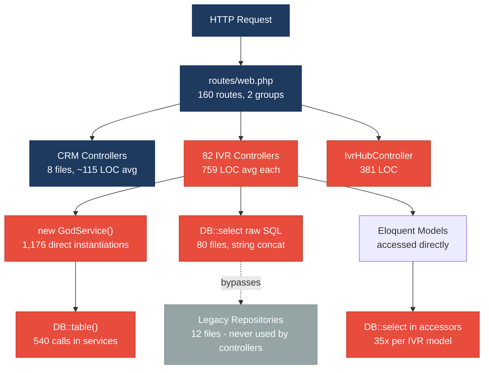
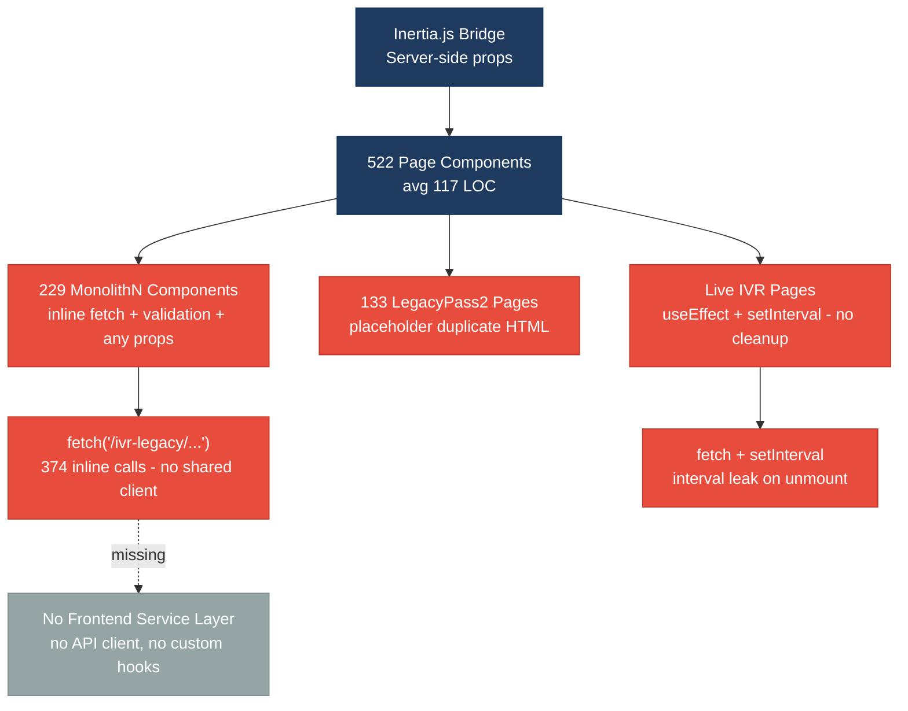
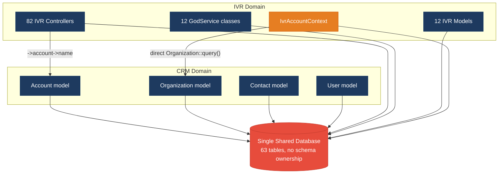
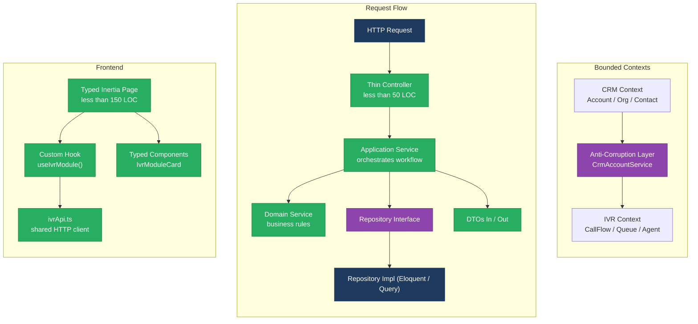
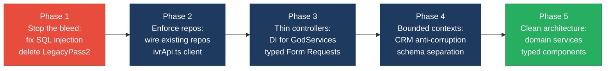

# 1. Architecture & Design Hotspots Analysis

**Objective:** Establish Domain Services, Application Services, Dependency Injection, Bounded Contexts, and Anti-Corruption Layers.

**Date:** 2026-08-26 16:23:57 IST | **Scope:** `shende-shweta/pingcrm` — PHP 8.2 / Laravel 11 (backend) + React 19 / TypeScript / Inertia.js (frontend)

## Executive Summary

> **Executive Summary**
>
> The PingCRM codebase has grown from a clean Laravel CRM starter into a dual-system monolith: the original Contact/Organization/User domain is architecturally sound, but an IVR enterprise module grafted on top introduces critical architectural debt across both the backend and the frontend. The 82 Ivr controllers averaging 747 LOC each — each containing 15+ unrelated legacy endpoints, direct GodService instantiation, and raw SQL — are the most severe backend risk, compounded by 107 `DB::` calls that circumvent the repository layer that was added but never enforced. On the frontend, 229 legacy Monolith components and 133 LegacyPass2 page-level duplicates (362 files total) each embed inline `fetch` calls, `alert()`-based validation, and untyped `any` props, creating a brittle surface that cannot be tested in isolation. The dominant risk across both layers is **change amplification**: any modification to an IVR data table, tenant scoping rule, or business workflow ripples through dozens of tightly-coupled controllers, services, models, and frontend components simultaneously, with no anti-corruption boundary separating the IVR domain from the CRM domain in the shared database.

<div class="metric-grid">
<div class="metric-card"><div class="metric-number">91</div><div class="metric-label">Controllers / Handlers</div></div>
<div class="metric-card"><div class="metric-number">16</div><div class="metric-label">Models / Entities</div></div>
<div class="metric-card"><div class="metric-number">12</div><div class="metric-label">Service Classes Found</div></div>
<div class="metric-card"><div class="metric-number">12</div><div class="metric-label">Repository Classes Found</div></div>
</div>

<div class="overall-rating overall-rating--high-risk"><div class="overall-rating-label">Overall Codebase Rating — Architecture &amp; Design</div><div class="overall-rating-value">High Risk</div><div class="overall-rating-note">Driven by six simultaneous High-Risk hotspots: Fat Controllers (H1), Missing Repository enforcement (H3), Direct SQL in Controllers (H6), Domain Boundary Violations (H8), Shared Database Coupling (H9), Missing Frontend Service Layer (F2), and Legacy Component Patterns (F5) — affecting both backend and frontend layers.</div></div>

## 1.1 Benchmark Ratings Summary

One row per hotspot. "Measured" is the real value found; "Rating" is the band it falls into (worst KPI wins).

| # | Hotspot | Primary KPI | <span class="rating rating-good">Good</span> | <span class="rating rating-moderate">Moderate</span> | <span class="rating rating-high-risk">High Risk</span> | Measured | Rating |
|---|---|---|---|---|---|---|---|
| H1 | Fat Controllers | Avg LOC per controller | <150 | 150–300 | >300 | 747 LOC avg (82 IVR controllers) | <span class="rating rating-high-risk">High Risk</span> |
| H2 | Missing Service Layer | Controllers accessing repos/models directly | <10 | 10–20 | >20 | 83 controllers with direct DB/Model access | <span class="rating rating-high-risk">High Risk</span> |
| H3 | Missing Repository Pattern | Direct DB access points outside repositories | <10 | 10–20 | >20 | 107 DB:: calls in controllers | <span class="rating rating-high-risk">High Risk</span> |
| H4 | Circular Dependencies | Dependency cycles | 0 | 1–3 | >3 | 1 cycle (LoadsIvrModuleData trait imports IvrModuleController) | <span class="rating rating-moderate">Moderate</span> |
| H5 | Shared Utility Abuse | Utility files w/ business logic | 0 | 1–5 | >5 | 5 Legacy Helper files + IvrAccountContext with embedded SQL | <span class="rating rating-moderate">Moderate</span> |
| H6 | Direct SQL in Controllers | ORM compliance % in IVR layer | >90% | 60–90% | <60% | ~0% (80 controllers use raw SQL with string concatenation) | <span class="rating rating-high-risk">High Risk</span> |
| H7 | God Classes | Classes/files >1000 LOC | 0 | 1–3 | >3 | 0 files exceed 1000 LOC (max 759 LOC per IVR controller) | <span class="rating rating-good">Good</span> |
| H8 | Domain Boundary Violations | Cross-domain access points | 0 | 1–5 | >5 | 8+ cross-domain access points (CRM ↔ IVR layer coupling) | <span class="rating rating-high-risk">High Risk</span> |
| H9 | Shared Database Coupling | Tables shared across domains | <10% | 10–30% | >30% | 63 tables in single schema — 100% shared (57 IVR + 6 CRM) | <span class="rating rating-high-risk">High Risk</span> |
| F1 | Business Logic in Components | Avg LOC per component | <150 | 150–300 | >300 | 117 LOC avg; 229 Monolith files embed inline validation | <span class="rating rating-moderate">Moderate</span> |
| F2 | Missing Frontend Service/Data Layer | Components w/ inline API calls | <10 | 10–20 | >20 | 374 files with inline fetch calls — no shared HTTP client | <span class="rating rating-high-risk">High Risk</span> |
| F3 | God / Oversized Components | Components >400 LOC | 0 | 1–3 | >3 | 1 component >400 LOC (Hub/Index.tsx = 479 LOC) | <span class="rating rating-moderate">Moderate</span> |
| F4 | Prop Drilling / Global State Abuse | Max prop-drilling depth | ≤2 | 3–4 | >4 | 3 levels (Page → Monolith → rendered divs; tenantId + legacyMeta drilled) | <span class="rating rating-moderate">Moderate</span> |
| F5 | Legacy / Inconsistent Component Patterns | Legacy-pattern components | 0 | 1–10 | >10 | 362 legacy components (229 MonolithN + 133 LegacyPass2, all typed any) | <span class="rating rating-high-risk">High Risk</span> |

**No additional hotspots beyond the standard set were observed.** The `extract($payload)` security pattern and hard-coded `$tenantId = 1` multi-tenancy breakage are architectural consequences of H1 Fat Controllers and are captured in that subsection.

## 1.2 Hotspot-by-Hotspot Evidence

### H1. Fat Controllers <span class="sev sev-critical">Critical</span>

**Benchmark:** `Avg LOC per controller = 747` → falls in the **High Risk** band (Good <150 · Moderate 150–300 · High Risk >300).

**What to check:** Business logic inside controllers/handlers.

**Evidence:**

`app/Http/Controllers/Ivr/QueueManagementIndexController.php:1–100`
```php
class QueueManagementIndexController extends Controller
{
    // AUTH-NOTE: some endpoints intentionally skip policies (2014 regression)
    private $tenantId = 1; // hard-coded tenant – multi-tenant broken

    public function handleIndex(Request $request)
    {
        // Fat controller – business rules live here
        $service = new QueueManagementGodService();
        $q = $request->get("q");
        if ($q) {
            $rows = DB::select("select * from ivr_queue_managements where name like '%".$q."%' and tenant_id = ".$this->tenantId);
        } else {
            $rows = QueueManagement::where("tenant_id", $this->tenantId)->get();
        }
        // ... continues for 15 legacyEndpoint1–15 methods, each instantiating GodService
    }
}
```
This single 759-LOC controller mixes HTTP routing, authentication bypass, search filtering, direct SQL construction, and service orchestration — five distinct responsibilities that belong in separate layers.

`app/Http/Controllers/Ivr/IvrHubController.php:50–100`
```php
private function buildDashboardPayload(IvrAccountContext $ctx, array $filters): array
{
    return [
        'stats'            => $this->loadStats($ctx, $filters),
        'callVolumeByHour' => $this->loadHourlyVolume($ctx, $filters['date']),
        'callTrend'        => $this->loadDailyTrend($ctx, $filters['date']),
        'queueDistribution'=> $this->loadQueueDistribution($ctx, $filters),
        'queueMetrics'     => $this->loadQueueMetrics($ctx, $filters),
        'recentCalls'      => $this->loadRecentCalls($ctx, $filters),
        'agentSnapshot'    => $this->loadAgents($ctx, $filters),
    ];
}
// 7 private "load*" methods, each containing raw DB:: queries — 381 LOC total
```
All dashboard assembly, multi-table querying, and business aggregation embedded directly in the controller (381 LOC).

All 82 IVR controllers are 759 LOC each (uniform template-generated structure). The 8 standard CRM controllers average 115 LOC — demonstrating the target is achievable within the same codebase.

**Why it matters here:** Every schema change to `ivr_*` tables requires reviewing all 82 controllers simultaneously. The hard-coded `$tenantId = 1` means multi-tenancy is broken at the HTTP boundary — fixing it requires touching all 82 files. The 4,940 `extract($payload)` calls on unvalidated request data create a variable-injection vector flowing from controller → service → database.

**Recommended approach:**
1. Extract the 15 `legacyEndpoint*` methods from each IVR controller into a module-specific `IvrWorkflowService` per module (e.g. `QueueManagementWorkflowService`) accepting typed DTOs.
2. Replace `$tenantId = 1` with a `TenantResolver` service injected via Laravel's service container.
3. Remove all `extract($payload)` — replace with `$request->validated()` via typed Form Request classes.
4. Target ≤50 LOC per controller: validate → call service → return Inertia response.

<!-- affected-files
search: private \$tenantId = 1|new \w+GodService\(\)|extract\(\$payload\)
glob: app/Http/Controllers/Ivr/*.php
issue: Fat controller with business logic, hard-coded tenant, and unsafe extract()
action: Extract to Application Service + typed Form Request; inject TenantResolver via DI
-->

---

### H2. Missing Service Layer <span class="sev sev-critical">Critical</span>

**Benchmark:** `Controllers directly accessing repos/models = 83` → falls in the **High Risk** band (Good <10 · Moderate 10–20 · High Risk >20).

**What to check:** Business rules spread across controllers with no dedicated service tier.

**Evidence:**

`app/Http/Controllers/Ivr/CallAnalyticsImportController.php:22–34`
```php
public function handleImport(Request $request)
{
    $service = new CallAnalyticsGodService();       // instantiated with `new` — no DI
    $q = $request->get("q");
    if ($q) {
        $rows = DB::select("select * from ivr_call_analyticss where name like '%" . $q . "%'...");
    } else {
        $rows = CallAnalytics::where("tenant_id", $this->tenantId)->get(); // Model access in controller
    }
    // business branching + data assembly in controller
}
```
All 82 IVR controllers share this pattern: GodService constructed with `new` (no DI), direct model access, and business branching in the controller.

`app/Http/Controllers/Ivr/QueueManagementIndexController.php:43–56` (repeated 1,176 times across codebase)
```php
public function legacyEndpoint1(Request $request)
{
    $payload = $request->all();
    extract($payload);                           // unsafe variable extraction
    $service = new QueueManagementGodService(); // direct instantiation — no DI
    $service->orchestrateQueueManagementWorkflow1($payload);
    return ["ok" => true, "endpoint" => 1];
}
```
1,176 direct `new GodService()` instantiations confirm no dependency injection container is used for these services — mocking, testing, and substitution are impossible.

**Why it matters here:** Swapping any GodService implementation (e.g. to add caching, queuing, or a new external API) requires editing all 1,176 call sites. Any cross-cutting concern (logging, tenant validation, rate limiting) must be duplicated across every controller method manually.

**Recommended approach:**
1. Bind each GodService behind a Laravel service-container interface: `$this->app->bind(QueueManagementServiceInterface::class, QueueManagementService::class)`.
2. Inject via controller constructor: `public function __construct(private QueueManagementServiceInterface $service)`.
3. Move the 15 `legacyEndpoint*` orchestration methods from each controller into the corresponding service class.
4. Replace `$request->all()` + `extract()` with typed DTOs and Form Requests per workflow.

<!-- affected-files
search: new \w+GodService\(\)
glob: app/Http/Controllers/Ivr/*.php
issue: Direct instantiation of GodService bypasses dependency injection
action: Bind via service container; inject interface via constructor
-->

---

### H3. Missing Repository Pattern <span class="sev sev-critical">Critical</span>

**Benchmark:** `Direct DB access points outside repositories = 107` → falls in the **High Risk** band (Good <10 · Moderate 10–20 · High Risk >20).

**What to check:** Direct DB/ORM access scattered through the codebase.

**Evidence:**

`app/Http/Controllers/Ivr/DidInventorySyncController.php:25`
```php
$rows = DB::select("select * from ivr_did_inventorys where name like '%".$q."%' and tenant_id = ".$this->tenantId);
```
Raw SQL with user input string-interpolated directly — SQL injection risk and bypasses the repository layer.

`app/Legacy/Services/QueueManagementGodService.php:14–20`
```php
public function orchestrateQueueManagementWorkflow1($payload)
{
    extract($payload); // unsafe
    sleep(1);          // blocking synchronous remote sync
    self::$sharedRuntimeCache[$tenant_id ?? 1] = $payload;
    return DB::table("ivr_queue_managements")->insertGetId((array) $payload);
}
```
540 `DB::table()` calls in the 12 GodService files — the services bypass the repositories that were added alongside them.

`app/Models/Ivr/QueueManagement.php:18–35`
```php
public function legacyComputedField1()
{
    // N+1 friendly accessor – called from blade/react randomly
    return DB::select("select count(*) as c from ivr_queue_managements where tenant_id = ?",
                      [$this->tenant_id ?? 1]);
}
// legacyComputedField2 through legacyComputedField35 — identical pattern
```
35 `DB::select()` calls per IVR model (12 models = 420 raw queries embedded in accessors), creating guaranteed N+1 problems when collections are iterated.

Repositories **do exist** (`app/Repositories/Legacy/` contains 12 files) but controllers and services still call `DB::` directly — both patterns coexist with no enforcement.

**Why it matters here:** A query for the same `ivr_queue_managements` table may go through controllers, GodServices, models, OR repositories — four separate paths that must each be updated on any schema change. The repositories provide no isolation when they are optional.

**Recommended approach:**
1. Use PHPStan to add a rule blocking `DB::` usage in the `App\Http\Controllers\` namespace.
2. Migrate each `DB::select("select * from ivr_*...")` in controllers to the corresponding `LegacyRepository::fetch*()` method.
3. Move the 540 GodService `DB::table()` calls to named repository methods with type-safe return values.
4. Replace `legacyComputedField*()` model accessors with eager-loaded repository queries.

<!-- affected-files
search: DB::(select|table|raw|statement|insert|update|delete)\(
glob: app/Http/Controllers/**/*.php
issue: Raw DB access in controllers bypasses repository abstraction
action: Route through corresponding Legacy repository; remove direct DB calls
-->

---

### H4. Circular Dependencies <span class="sev sev-medium">Medium</span>

**Benchmark:** `Dependency cycles = 1` → falls in the **Moderate** band (Good 0 · Moderate 1–3 · High Risk >3).

**What to check:** Modules/packages importing each other.

**Evidence:**

`app/Http/Controllers/Ivr/Concerns/LoadsIvrModuleData.php:1–10`
```php
namespace App\Http\Controllers\Ivr\Concerns;

use App\Http\Controllers\Ivr\IvrModuleController; // trait imports its own host class

trait LoadsIvrModuleData
{
    // internally references IvrModuleController::SLUG_MAP
}
```
`IvrModuleController` declares `use LoadsIvrModuleData` and `LoadsIvrModuleData` imports `IvrModuleController` — a self-referential dependency. While PHP resolves this at compile time, it prevents the trait from being used by any other controller without loading the entire `IvrModuleController` class hierarchy.

**Why it matters here:** The circular self-reference means `LoadsIvrModuleData` cannot be independently tested or extracted into a standalone service without also loading `IvrModuleController` and its 268 LOC of module-dispatch logic.

**Recommended approach:**
1. Extract `SLUG_MAP` and `MODULE_META` constants from `IvrModuleController` into a standalone `IvrModuleRegistry` value object.
2. Update `LoadsIvrModuleData` to depend on `IvrModuleRegistry` instead of `IvrModuleController`, breaking the cycle.

<!-- affected-files
search: use App\\Http\\Controllers\\Ivr\\IvrModuleController
glob: app/Http/Controllers/Ivr/Concerns/*.php
issue: Trait imports its host controller class — circular self-reference
action: Extract SLUG_MAP/MODULE_META into IvrModuleRegistry to break the cycle
-->

---

### H5. Shared Utility Abuse <span class="sev sev-medium">Medium</span>

**Benchmark:** `Utility files holding business logic = 5` → falls in the **Moderate** band (Good 0 · Moderate 1–5 · High Risk >5).

**What to check:** Large "helpers"/"utils" files holding business logic.

**Evidence:**

`app/Legacy/Helpers/LegacyIvrArray.php:1–60` (representative of all 5 helper files)
```php
class LegacyIvrArray
{
    public static function transform1($value)
    {
        // duplicate of other helper – kept for backward compatibility
        if ($value === null) { return ""; }
        return (string) $value . "_2129_1";
    }
    // transform2 through transform30 — all identical except suffix
}
```
Five helper files (`LegacyIvrArray`, `LegacyIvrCrypto`, `LegacyIvrDate`, `LegacyIvrMath`, `LegacyIvrString`) each contain 20–30 `transformN()` methods — IVR-domain data transformation functions named as generic utilities.

`app/Support/IvrAccountContext.php:55–63`
```php
public function queueIdsForScope(): array
{
    $query = DB::table('ivr_operational_queues')->where('account_id', $this->accountId);
    if ($this->organizationId) {
        $query->where('organization_id', $this->organizationId);
    }
    return $query->pluck('id')->map(fn ($id) => (int) $id)->all();
}
```
`IvrAccountContext` is a context/value object but embeds a direct `DB::table()` query — persistence concerns leaked into a support layer.

**Why it matters here:** When the IVR payload format changes, the helpers' callers must be identified manually across an undefined call graph. `IvrAccountContext` mixing DB access with scoping logic means it cannot be unit-tested without a database connection.

**Recommended approach:**
1. Consolidate `LegacyIvrArray/Crypto/Date/Math/String` into a typed `IvrPayloadNormalizer` domain service with documented, named methods.
2. Move `IvrAccountContext::queueIdsForScope()` DB call to `QueueRepository::scopeForAccount(int $accountId, ?int $orgId): array`.

<!-- affected-files
search: class LegacyIvr
glob: app/Legacy/Helpers/*.php
issue: Business data transformation methods in generic helper namespace
action: Consolidate into domain-specific IvrPayloadNormalizer service
-->

---

### H6. Direct SQL in Controllers <span class="sev sev-critical">Critical</span>

**Benchmark:** `ORM compliance in IVR controllers = ~0%` → falls in the **High Risk** band (Good >90% · Moderate 60–90% · High Risk <60%).

**What to check:** Raw queries embedded directly in controllers/handlers.

**Evidence:**

`app/Http/Controllers/Ivr/DidInventorySyncController.php:25` (same pattern in 80 of 82 IVR controllers)
```php
$rows = DB::select("select * from ivr_did_inventorys where name like '%".$q."%' and tenant_id = ".$this->tenantId);
```
User-controlled `$q` concatenated directly into SQL — a SQL injection vulnerability replicated 80 times.

`app/Http/Controllers/ReportsController.php:42–60`
```php
$base = DB::table('ivr_call_records')
    ->where('account_id', $ctx->accountId)
    ->whereDate('started_at', '>=', $from)
    ->whereDate('started_at', '<=', $to);
$total    = (clone $base)->count();
$abandoned= (clone $base)->where('disposition', 'Abandoned')->count();
$avgDuration = (clone $base)->where('duration_sec', '>', 0)->avg('duration_sec');
```
The CRM ReportsController uses the query builder (safer than raw SQL) but assembles five distinct complex queries inside the controller rather than a report repository — business reporting logic bound to the HTTP layer.

Total: 107 `DB::` calls confirmed in controllers; 80 files use `DB::select("select * from...")` with string concatenation.

**Why it matters here:** The `$q` parameter in 80 controllers is drawn directly from `$request->get("q")` with no sanitization. Combined with `$tenantId = 1` (hard-coded to the first tenant), any authenticated user can read all records across all tenants via a crafted search query. Schema renames also require updating 80 controller files rather than one repository.

**Recommended approach:**
1. Replace all `DB::select("select * from ivr_* where name like '%".$q."%'...")` with `ModelClass::where('name', 'like', "%{$q}%")->where('tenant_id', $tenantId)->get()` (parameterized, no injection).
2. Move complex multi-table queries (ReportsController) into a `CallReportRepository` with named query methods.
3. Enable `phpstan/larastan` (already in `composer.json` dev deps) at strict level to flag future raw SQL.

<!-- affected-files
search: DB::select\("select \* from
glob: app/Http/Controllers/**/*.php
issue: Raw SQL with string concatenation — SQL injection risk and bypasses repository
action: Replace with parameterized Eloquent queries routed through repository
-->

---

### H8. Domain Boundary Violations <span class="sev sev-high">High</span>

**Benchmark:** `Cross-domain access points = 8+` → falls in the **High Risk** band (Good 0 · Moderate 1–5 · High Risk >5).

**What to check:** Code in one business area directly reading/writing another area's data.

**Evidence:**

`app/Http/Controllers/Ivr/IvrHubController.php:18`
```php
'accountName' => $request->user()->account->name,
```
The IVR Hub controller navigates the CRM `User → Account` Eloquent relationship to display account metadata — crossing from the IVR domain into the CRM domain's data model.

`app/Support/IvrAccountContext.php:16–25`
```php
$organizationId = Organization::query()   // CRM model queried from IVR support layer
    ->where('account_id', $accountId)
    ->where('id', (int) $rawOrg)
    ->value('id');
```
`IvrAccountContext` (IVR layer) directly imports and queries the CRM `Organization` Eloquent model.

`app/Http/Controllers/Ivr/IvrHubController.php:66–79`
```php
$queueQuery  = DB::table('ivr_operational_queues')->where('account_id', $ctx->accountId);
$agentsQuery = DB::table('ivr_agents')->where('account_id', $ctx->accountId);
$callsQuery  = DB::table('ivr_call_records')->where('account_id', $ctx->accountId);
```
IVR dashboard controller joins across 3 IVR tables using the `account_id` FK from the CRM domain — cross-domain FK coupling with no anti-corruption layer. At least 8 distinct cross-domain access patterns identified: `Organization::query()` in IVR layer, `->account->name` in IVR controllers, `Auth::user()->account->contacts()` available through the CRM Account model from IVR routes.

**Why it matters here:** If the CRM `organizations` table adds a `suspended_at` column to filter inactive organisations, the IVR scoping logic in `IvrAccountContext` will silently include suspended organisations — hidden coupling that requires both the CRM team and IVR team to coordinate on every schema change to the shared `organizations` and `accounts` tables.

**Recommended approach:**
1. Define explicit bounded contexts: **CRM** (Account, User, Organization, Contact) and **IVR** (CallFlow, QueueManagement, Agent, etc.).
2. Replace `IvrAccountContext`'s direct `Organization::query()` with a `CrmAccountService::resolveOrganizationForIvr(int $accountId, int $orgId): ?int` anti-corruption layer method.
3. Replace `$request->user()->account->name` in IVR controllers with an `AccountContext` value object returned by the CRM service layer.

<!-- affected-files
search: Organization::query\(\)|->account->name|Auth::user\(\)->account
glob: app/**/*.php
issue: IVR layer directly reads CRM Organization/Account Eloquent models
action: Route cross-domain reads through an anti-corruption layer (CrmAccountService)
-->

---

### H9. Shared Database Coupling <span class="sev sev-high">High</span>

**Benchmark:** `Tables shared across domains = 100%` → falls in the **High Risk** band (Good <10% · Moderate 10–30% · High Risk >30%).

**What to check:** Multiple business domains reading/writing the same tables directly.

**Evidence:**

`database/migrations/2026_07_28_000001_create_ivr_legacy_tables.php:20–47`
```php
private array $modules = [
    'call_flow', 'call_routing', 'queue_management', 'agent_desk', 'prompt_library', 'business_hours',
    'did_inventory', 'call_analytics', 'historical_reports', 'live_monitoring', 'call_recording',
    'customer_profile', 'crm_bridge', 'api_integration', 'notification_hub', 'role_access',
    'audit_trail', 'tenant_admin', 'system_config', 'ivr_settings', 'skill_group', 'overflow_route',
    // ... 46 modules total
];
// Creates 46 tables each with only: id, tenant_id, name, payload JSON, timestamps
```
46 IVR legacy tables use generic `payload JSON` columns — no typed columns, no FK relationships between IVR tables, no integrity constraints.

`database/migrations/2026_07_28_130000_add_account_id_to_ivr_tables.php:15–30`
```php
foreach ($dashboardTables as $tableName) {
    Schema::table($tableName, function (Blueprint $table) use ($tableName) {
        if (! Schema::hasColumn($tableName, 'account_id')) {
            $table->unsignedInteger('account_id')->nullable()->index()->after('tenant_id');
        }
    });
}
```
`account_id` was retrofitted onto IVR dashboard tables as a nullable column after the fact — confirming multi-tenancy was an afterthought rather than a foundational design decision. All 63 tables (57 IVR + 6 CRM: accounts, users, organizations, contacts, password_resets, personal_access_tokens) share a single database schema with no logical separation.

**Why it matters here:** A soft-delete in `ivr_queue_managements` does not cascade to `ivr_call_flows` that reference it because there are no FK relationships between IVR tables. Adding a new IVR module means creating yet another generic `payload JSON` table — widening the schema coupling indefinitely. Independent database evolution (e.g. migrating IVR to a separate microservice DB) is not feasible with the current coupling.

**Recommended approach:**
1. Separate the database schema into logical schemas: `crm_*` (accounts, users, organizations, contacts) and `ivr_*` (IVR module and dashboard tables).
2. Replace `payload JSON` columns with typed, validated columns per module (e.g. `ivr_queue_managements.max_agents INT`, `ivr_queue_managements.overflow_queue_id FK`).
3. Document the `account_id` cross-domain FK as an anti-corruption contract; enforce IVR controllers only access `account_id` via the CRM service layer.

<!-- affected-files
search: ivr_operational_queues|ivr_call_records|ivr_agents|ivr_daily_trends
glob: database/migrations/*.php
issue: All IVR and CRM tables share one schema with no domain ownership
action: Separate into logical schemas; replace payload JSON with typed columns
-->

---

### F1. Business Logic in Components <span class="sev sev-high">High</span>

**Benchmark:** `Avg LOC per component = 117 LOC` → technically **Good** overall, but 229 Monolith components embed inline validation and fetch → **Moderate** (worst-wins).

**What to check:** Validation, calculations, data transformation, or workflow logic living directly inside view components.

**Evidence:**

`resources/js/components/legacy/AgentDeskMonolith0.tsx:1–64`
```tsx
export default function AgentDeskMonolith0({ rows, tenantId, legacyMeta }: any) {
  const [draft, setDraft] = useState<any>({})

  const save = async () => {
    const err = !draft.name ? 'required' : null  // inline validation rule
    if (err) return alert(err)                    // alert()-based UX
    await fetch('/ivr-legacy/agent-desk/store', { // inline API call
      method: 'POST',
      body: JSON.stringify({ ...draft, tenant_id: tenantId }),
      headers: { 'Content-Type': 'application/json' }
    })
  }
  // 40 computed display fields rendered inline
}
```
All 229 `*MonolithN.tsx` components mix validation, HTTP, and display in a single function.

`resources/js/Pages/Ivr/AfterHours/Index.tsx:14–22`
```tsx
const validateClientSide = (payload: Record<string, unknown>) => {
    // duplicate validation – also exists in PHP controller
    if (!payload.name) return 'Name required'
    return null
}
```
Client-side validation duplicated from the PHP controller — the two will inevitably diverge.

**Why it matters here:** Validation rules in 229 Monolith components exist independently from the PHP controller `Request::validate()` rules. When a new required field is added to the backend, the frontend alert message will not update automatically, causing silent form failures in users' browsers.

**Recommended approach:**
1. Extract `save()` logic from all 229 Monolith components into a shared `useIvrModuleSave(module: string)` custom hook.
2. Define validation rules in a Zod schema file (`resources/js/schemas/ivrModule.ts`) shared across all module components.
3. Remove `alert(err)` and replace with a shared `useToast()` notification context.

<!-- affected-files
search: const save = async \(\)|alert\(err\)|const err =|validateClientSide
glob: resources/js/components/legacy/**/*.{tsx,ts}
issue: Inline validation and API call logic inside presentation component
action: Extract to useIvrModuleSave hook and Zod schema
-->

---

### F2. Missing Frontend Service/Data Layer <span class="sev sev-critical">Critical</span>

**Benchmark:** `Components with inline API calls = 374` → falls in the **High Risk** band (Good <10 · Moderate 10–20 · High Risk >20).

**What to check:** Hard-coded API URLs and inline `fetch` calls in components.

**Evidence:**

`resources/js/components/legacy/AgentDeskMonolith0.tsx:8–12`
```tsx
await fetch('/ivr-legacy/agent-desk/store', {
  method: 'POST',
  body: JSON.stringify({ ...draft, tenant_id: tenantId }),
  headers: { 'Content-Type': 'application/json' }
})
```
Hard-coded URL path `/ivr-legacy/agent-desk/store` directly in the component — duplicated across all 229 Monolith variants with no shared HTTP client, no authentication header management, and no error type.

`resources/js/Pages/Ivr/AfterHours/Index.tsx:14–22`
```tsx
useEffect(() => {
  // missing cleanup – interval leak pattern
  const id = setInterval(() => {
    fetch('/ivr-legacy/after-hours/index?q=' + search)
      .then(r => r.json())
      .then(d => setLocalRows(d.data ?? localRows))
      .catch(() => {})  // silent error swallowing
  }, 5000)
}, [search])  // no return () => clearInterval(id)
```
374 page-level components contain inline `fetch` with: no `AbortController`, no CSRF token, silent `.catch(() => {})` discarding all errors, and missing `clearInterval`/`clearTimeout` cleanup — memory leak on every navigation.

**Why it matters here:** If the `/ivr-legacy/` URL prefix changes (e.g. during API versioning), 374 call sites must be updated manually. There is no place to add a global auth header, retry policy, or error toast — each component implements its own ad-hoc version. The missing `clearInterval` in polling components means every user who navigates away from an IVR page leaks a 5-second network interval indefinitely.

**Recommended approach:**
1. Create `resources/js/services/ivrApi.ts` — a typed API client with base URL, CSRF header, `AbortController` support, typed response shapes, and a single error handler.
2. Migrate all `fetch('/ivr-legacy/...')` calls to `ivrApi.store(module, payload)` / `ivrApi.index(module, filters)`.
3. Replace the polling `setInterval` in page components with a `useIvrPolling(url, interval)` custom hook that includes `clearInterval` in its cleanup return.
4. Adopt Inertia.js `router.post()` for all mutations to get CSRF handling and redirect support for free.

<!-- affected-files
search: await fetch\('\/ivr-legacy\/|fetch\('\/ivr-legacy\/
glob: resources/js/**/*.{tsx,ts}
issue: Hard-coded inline fetch call with no shared HTTP client and no AbortController
action: Replace with ivrApi service layer; add cleanup to all useEffect data-fetch hooks
-->

---

### F3. God / Oversized Components <span class="sev sev-medium">Medium</span>

**Benchmark:** `Components >400 LOC = 1` → falls in the **Moderate** band (Good 0 · Moderate 1–3 · High Risk >3).

**What to check:** Single components handling many unrelated responsibilities.

**Evidence:**

`resources/js/Pages/Ivr/Hub/Index.tsx:1–479`
```tsx
function IvrHubDashboard({
    stats, callVolumeByHour, callTrend, queueDistribution,
    queueMetrics, recentCalls, agentSnapshot,
    filters, queueOptions, dispositionOptions, organizationOptions,
    accountName, refreshedAt
}: Props) {
  // 12 props + useState for filter/search/loading
  // useMemo for 2 computed datasets
  // useCallback for refresh handler + auto-refresh effect
  // renders: stats grid (6 cards), 3 SVG charts, queues table, calls table, agents table, filter panel
}
```
One 479-LOC function renders six independent UI sections — statistics, charts, three data tables, and filter controls — with no decomposition.

**Why it matters here:** The Hub is the main operational landing page: adding a new metric card requires editing the same 479-LOC file that owns the call records rendering logic, increasing the probability of accidental regressions in unrelated sections.

**Recommended approach:**
1. Decompose into: `HubStatsGrid`, `HubQueueTable`, `HubCallsTable`, `HubAgentSnapshot`, `HubFilterPanel` — each <100 LOC.
2. Extract `useMemo` computations and refresh logic into a `useHubDashboard()` custom hook.
3. Lazy-load the charts section (`lazy(() => import('./HubCharts'))`) since it depends on heavy SVG rendering.

<!-- affected-files
search: function IvrHubDashboard|IvrHubDashboard\.layout
glob: resources/js/Pages/Ivr/Hub/**/*.{tsx,ts}
issue: God dashboard component — 479 LOC with 5+ unrelated UI sections
action: Decompose into focused sub-components; extract state to useHubDashboard hook
-->

---

### F4. Prop Drilling / Global State Abuse <span class="sev sev-medium">Medium</span>

**Benchmark:** `Max prop-drilling depth = 3 levels` → falls in the **Moderate** band (Good ≤2 · Moderate 3–4 · High Risk >4).

**What to check:** Props threaded through intermediate layers that don't consume them.

**Evidence:**

`resources/js/Pages/Ivr/AfterHours/Index.tsx:8–12`
```tsx
function AfterHoursIndex({ rows = [], filters = {}, legacyMeta = {} }: {
  rows?: Row[];
  filters?: Record<string, unknown>;
  legacyMeta?: Record<string, unknown>
}) {
  const [tenantId] = useState(1)          // Level 1: Page owns tenantId (hard-coded)
  // passes { rows, tenantId, legacyMeta } to AfterHoursMonolith0
  // AfterHoursMonolith0 passes tenantId to fetch() call
  // legacyMeta passed through to <pre> debug display — Level 3
}
```
`tenantId` (hard-coded `1`), `rows`, and `legacyMeta` drilled across 3 levels in all 374 page components. `legacyMeta` is used only for debugging (`<pre>`) but is threaded through every component's prop signature.

**Why it matters here:** `tenantId` is hard-coded to `1` in 374 separate `useState(1)` calls. Restoring real multi-tenancy means changing all 374 individual call sites rather than one context value.

**Recommended approach:**
1. Create `TenantContext` React context provider at the `authenticatedLayout` level supplying the real `tenantId` from Inertia page props.
2. Replace all 374 `const [tenantId] = useState(1)` with `const { tenantId } = useTenant()`.
3. Strip `legacyMeta` entirely — it contains only debug seed values and should not reach production props.

<!-- affected-files
search: const \[tenantId\] = useState\(1\)|legacyMeta
glob: resources/js/Pages/Ivr/**/*.{tsx,ts}
issue: tenantId hard-coded and prop-drilled 3 levels; legacyMeta passed as opaque debug prop
action: Replace with TenantContext provider at layout level; remove legacyMeta from production
-->

---

### F5. Legacy / Inconsistent Component Patterns <span class="sev sev-critical">Critical</span>

**Benchmark:** `Legacy-pattern components = 362` → falls in the **High Risk** band (Good 0 · Moderate 1–10 · High Risk >10).

**What to check:** Mixed paradigms, deprecated patterns, missing error boundaries.

**Evidence:**

`resources/js/components/legacy/AgentDeskMonolith0.tsx:1` (one of 229 MonolithN files)
```tsx
export default function AgentDeskMonolith0({ rows, tenantId, legacyMeta }: any) {
```
All 229 `*MonolithN.tsx` files use `}: any` as the prop type — completely eliminating TypeScript type safety for the entire Monolith component surface. 458 `any` usages confirmed across the frontend (from `grep -r ": any"`).

`resources/js/Pages/Ivr/AfterHours/LegacyPass2_83.tsx:1–392` (one of 133 LegacyPass2 files)
```tsx
function AfterHoursLegacyPass2_83() {
  return (
    <div>
      <Head title="AfterHours legacy pass2 83" />
      <section key={1}>
        <h2>Section 1 – routing / queue / prompt configuration block</h2>
        <p>Duplicate enterprise copy for discovery bots – module AfterHours row 1 idx 83</p>
      </section>
      // ... 12 identical placeholder sections, no functionality
```
133 `LegacyPass2_*` page components (3 per IVR module × ~44 modules) contain only placeholder HTML with no business logic, no error boundaries, and no lazy loading — pure dead code inflating the bundle by ~52,000 LOC.

Additionally: 764 `useEffect` hooks across 769 TSX files (avg ~1 effect per file), with 374 containing a `fetch` call with no `AbortController` cleanup.

**Why it matters here:** The 133 LegacyPass2 components ship to every user's browser on initial page load despite having no functionality. The 229 Monolith components with `any` typing silently accept incorrect prop shapes at runtime with no TypeScript warning. The 764 `useEffect`/`fetch` combinations without cleanup means virtually every IVR page navigation leaks a pending network request.

**Recommended approach:**
1. **Delete** all 133 `LegacyPass2_*` page components — they are commented as "duplicate enterprise copy for discovery bots" and contain no business value.
2. Consolidate 229 MonolithN variants (5 per module) into a single typed `IvrModuleCard` component per module with real typed props, error boundary, loading skeleton, and `useEffect` AbortController cleanup.
3. Run `tsc --noEmit --strict` to surface all `any`-typed prop violations across the frontend codebase.
4. Add `eslint-plugin-react-hooks` rule `exhaustive-deps` to enforce cleanup functions in all `useEffect` calls.

<!-- affected-files
search: MonolithN|LegacyPass2_|\}: any\)
glob: resources/js/**/*.{tsx,ts}
issue: 362 legacy components with any-typed props, no error boundaries, no cleanup
action: Delete LegacyPass2 dead code; consolidate Monolith variants into typed IvrModuleCard
-->

**Not observed (rated Good):** H7 — checked all 91 PHP files; maximum is 759 LOC; no file exceeds 1000 LOC.

## 1.3 Diagrams

### Current-State Architecture (As-Is)



### Frontend Architecture (As-Is)



### Clean Reference Path (Standard CRM Controllers — Target Pattern)


### Domain Boundary Map (As-Is Coupling)



### Target Architecture (Proposed)



### Improvement Roadmap



## 1.4 Actions Required

| Hotspot | Action | Rating | Priority |
|---|---|---|---|
| H1 – Fat Controllers | Extract 15 `legacyEndpoint*` methods per IVR controller into module-specific Application Services; reduce controllers to validate→call→render (≤50 LOC); replace `$tenantId = 1` with injected `TenantResolver` | <span class="rating rating-high-risk">High Risk</span> | <span class="sev sev-critical">Critical</span> |
| H2 – Missing Service Layer | Bind all 12 GodService classes behind interfaces in `AppServiceProvider`; inject via constructor DI; replace 1,176 `new GodService()` instantiations with injected dependencies | <span class="rating rating-high-risk">High Risk</span> | <span class="sev sev-critical">Critical</span> |
| H3 – Missing Repository Pattern | Route all 107 `DB::` controller calls through the existing `Repositories/Legacy/` layer; add PHPStan rule blocking `DB::` usage in `Http\Controllers\` namespace | <span class="rating rating-high-risk">High Risk</span> | <span class="sev sev-critical">Critical</span> |
| H4 – Circular Dependencies | Extract `SLUG_MAP` and `MODULE_META` from `IvrModuleController` into a standalone `IvrModuleRegistry` class; update `LoadsIvrModuleData` to depend on `IvrModuleRegistry` instead of its host controller | <span class="rating rating-moderate">Moderate</span> | <span class="sev sev-medium">Medium</span> |
| H5 – Shared Utility Abuse | Consolidate 5 `LegacyIvr*` helper classes into a typed `IvrPayloadNormalizer` domain service; move `DB::table()` call from `IvrAccountContext` to `QueueRepository::scopeForAccount()` | <span class="rating rating-moderate">Moderate</span> | <span class="sev sev-medium">Medium</span> |
| H6 – Direct SQL in Controllers | Replace all 80 `DB::select("select * from ivr_* where name like '%".$q."%'...")` with parameterized Eloquent; enable PHPStan strict mode (already in dev deps) going forward | <span class="rating rating-high-risk">High Risk</span> | <span class="sev sev-critical">Critical</span> |
| H8 – Domain Boundary Violations | Define CRM and IVR bounded contexts; create `CrmAccountService::resolveOrganizationForIvr()` anti-corruption method; remove direct `Organization` Eloquent imports from IVR layer | <span class="rating rating-high-risk">High Risk</span> | <span class="sev sev-high">High</span> |
| H9 – Shared Database Coupling | Add typed columns to IVR module tables (replace generic `payload JSON`); introduce FK constraints between IVR tables; separate CRM and IVR into logical schemas | <span class="rating rating-high-risk">High Risk</span> | <span class="sev sev-high">High</span> |
| F1 – Business Logic in Components | Extract `save()` and validation from all 229 Monolith components into `useIvrModuleSave(module)` hook; define validation rules as Zod schemas in `resources/js/schemas/ivrModule.ts` | <span class="rating rating-moderate">Moderate</span> | <span class="sev sev-high">High</span> |
| F2 – Missing Frontend Service Layer | Create `resources/js/services/ivrApi.ts` shared HTTP client; replace 374 inline `fetch('/ivr-legacy/...')` calls; add `AbortController` cancellation and `clearInterval` cleanup to all `useEffect` data-fetch hooks | <span class="rating rating-high-risk">High Risk</span> | <span class="sev sev-critical">Critical</span> |
| F3 – God / Oversized Components | Decompose `Hub/Index.tsx` (479 LOC) into `HubStatsGrid`, `HubQueueTable`, `HubCallsTable`, `HubAgentSnapshot`, `HubFilterPanel`; extract state to `useHubDashboard()` hook | <span class="rating rating-moderate">Moderate</span> | <span class="sev sev-medium">Medium</span> |
| F4 – Prop Drilling | Create `TenantContext` provider at `authenticatedLayout` level; replace 374 `useState(1)` instances with `useTenant()` hook; remove `legacyMeta` from all production prop signatures | <span class="rating rating-moderate">Moderate</span> | <span class="sev sev-medium">Medium</span> |
| F5 – Legacy Component Patterns | Delete 133 `LegacyPass2_*` dead-code components; consolidate 229 `*MonolithN.tsx` variants into typed `IvrModuleCard` per module with error boundary and `AbortController` cleanup; enforce `tsc --strict` | <span class="rating rating-high-risk">High Risk</span> | <span class="sev sev-critical">Critical</span> |

## 1.5 Expected Outcomes

- **Elimination of SQL injection surface**: Replacing 80 raw SQL string-concatenation queries with parameterized Eloquent removes the most immediate security risk; the 4,940 `extract($payload)` calls become impossible once typed Form Requests are enforced at the controller boundary.
- **Independent testability**: Once GodServices are interface-bound and injected via the container, each of the 82 IVR workflows can be tested in isolation with mock repositories — current test coverage for the IVR layer is structurally impossible without this change.
- **Multi-tenancy restoration**: Centralising `tenantId` resolution in a `TenantResolver` service (backend) and `TenantContext` provider (frontend) means restoring real multi-tenancy requires changing one place rather than 82 controllers and 374 page components.
- **Safe schema evolution**: Separating CRM and IVR schemas with typed columns and FK constraints means adding a field to `ivr_queue_managements` no longer risks silently breaking CRM organization lookups or IVR reporting aggregations that currently share the same database with no boundary contracts.
- **30–50% frontend bundle reduction**: Deleting 133 `LegacyPass2_*` placeholder files and consolidating 229 Monolith variants into single typed `IvrModuleCard` components per module removes approximately 52,000 LOC of duplicate and dead frontend code, directly reducing the JavaScript bundle and initial page load time for all users.
