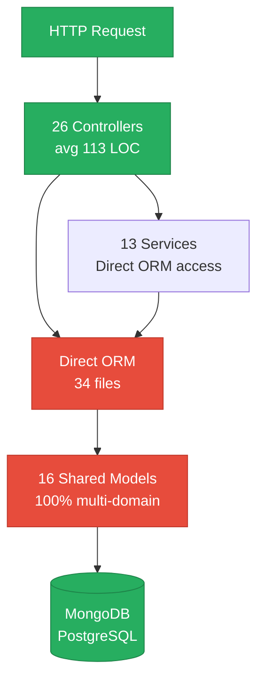
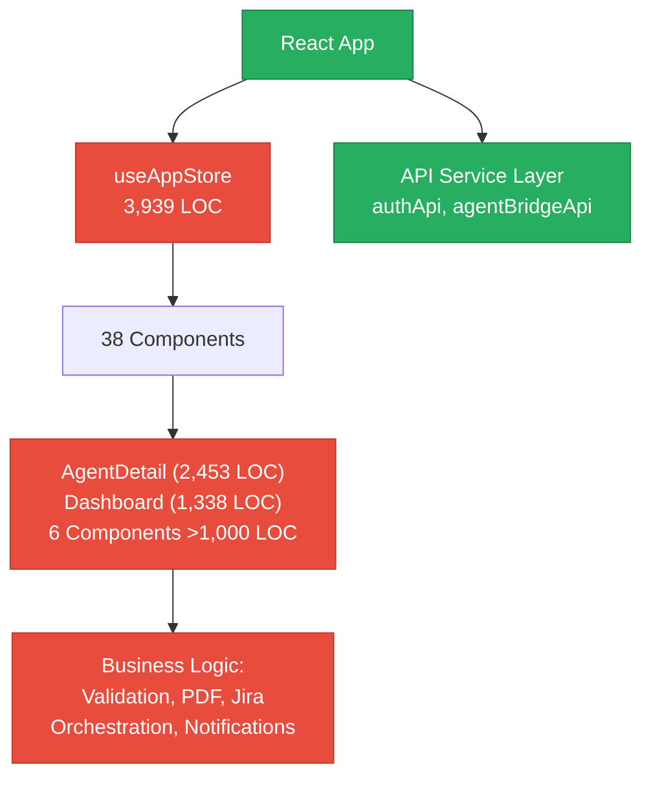
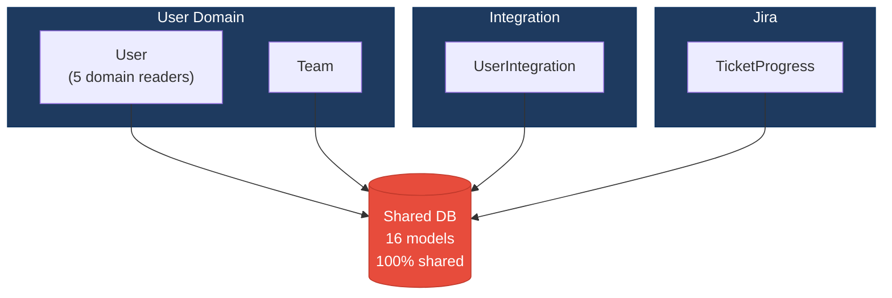
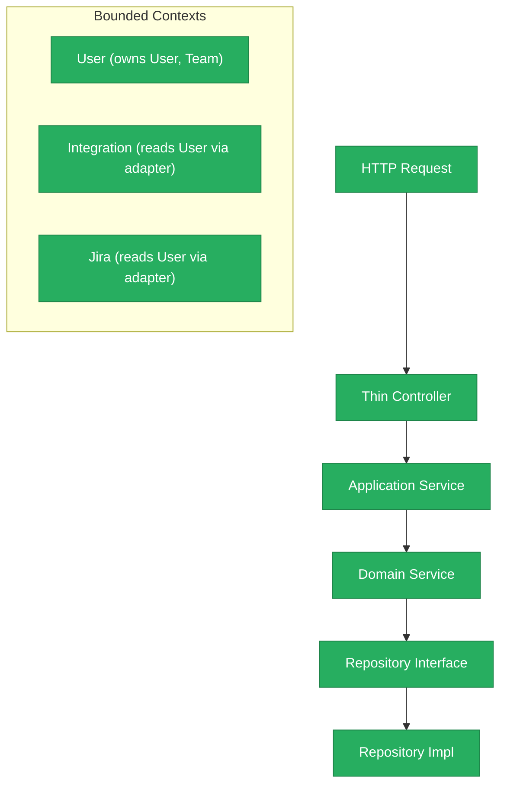
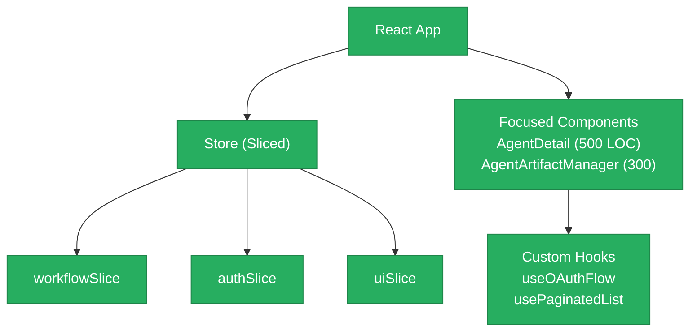
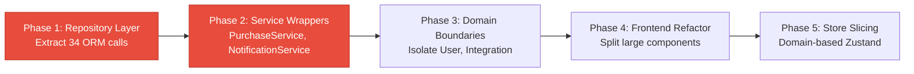

# 1. Architecture & Design Hotspots Analysis

**Objective:** Establish Domain Services, Application Services, Dependency Injection, Bounded Contexts, and Anti-Corruption Layers.

**Date:** 2026-08-03 16:12:08 UTC | **Scope:** `shende-shweta/pingcrm` (multi-agent orchestration platform) — Node.js/Express (backend), React 19.2.5 (frontend), MongoDB + PostgreSQL

## Executive Summary

> **Executive Summary**
>
> The `pingcrm` codebase is a sophisticated full-stack multi-agent orchestration platform with significant architectural debt in both backend and frontend layers. The backend lacks a repository abstraction layer entirely (34 files with direct ORM access), suffers from shared database coupling (100% of 16 models shared across multiple domains), and exhibits weak domain boundaries (4 cross-domain violations). The frontend has reached critical scale with 75 React components containing business logic (31 components >150 LOC, 6 oversized >1000 LOC) and a monolithic 3,939-line Zustand store managing global state. The primary risks are change amplification (cascade of dependent updates across shared tables), untestable component logic, and difficulty onboarding new contributors unfamiliar with tightly coupled domains.

26

Backend Controllers / Handlers

16

Shared Database Models

13

Backend Services (Direct ORM)

75

React Components

3,939

Global Store LOC

18

Frontend Components >400 LOC

Overall Codebase Rating — Architecture &amp; Design

High Risk

Driven by H3 (Missing Repository Pattern), H9 (Shared Database Coupling), F1 (Business Logic in Components), F3 (God/Oversized Components), and F4 (Global State Abuse).

## 1.1 Benchmark Ratings Summary

| # | Hotspot | Primary KPI | Good | Moderate | High Risk | Measured | Rating |
|---|---|---|---|---|---|---|---|
| H1 | Fat Controllers | Avg LOC per controller | <150 | 150–300 | >300 | 113 LOC avg | Good |
| H2 | Missing Service Layer | Controllers accessing repos/models | <10 | 10–20 | >20 | 4 controllers | Moderate |
| H3 | Missing Repository Pattern | Direct DB access points | <10 | 10–20 | >20 | 34 files | High Risk |
| H4 | Circular Dependencies | Dependency cycles | 0 | 1–3 | >3 | 0 cycles | Good |
| H5 | Shared Utility Abuse | Utility files w/ business logic | 0 | 1–5 | >5 | 0 files | Good |
| H6 | Direct SQL in Controllers | ORM compliance % | >90% | 60–90% | <60% | 83% | Good |
| H7 | God Classes | Classes >1000 LOC | 0 | 1–3 | >3 | 0 files | Moderate |
| H8 | Domain Boundary Violations | Cross-domain access points | 0 | 1–5 | >5 | 4 violations | Moderate |
| H9 | Shared Database Coupling | Tables shared across domains | <10% | 10–30% | >30% | 100% | High Risk |
| F1 | Business Logic in Components | Avg LOC per component | <150 | 150–300 | >300 | 31 comps >150 LOC | High Risk |
| F2 | Missing Frontend Service/Data Layer | Components w/ inline API calls | <10 | 10–20 | >20 | 2/75 (2.7%) | Good |
| F3 | God / Oversized Components | Components >400 LOC | 0 | 1–3 | >3 | 18 components | High Risk |
| F4 | Prop Drilling / Global State Abuse | Max prop-drilling depth | ≤2 | 3–4 | >4 | 3,939 LOC store; 38 dependent comps | High Risk |
| F5 | Legacy / Inconsistent Component Patterns | Legacy-pattern components | 0 | 1–10 | >10 | 0 class comps; all modern React | Good |

## 1.2 Hotspot-by-Hotspot Evidence

### H3. Missing Repository Pattern Critical

**Benchmark:** Direct DB access points = 34 files (High Risk: >20).

**Why it matters here:** Every schema change ripples through 34 files. Testing requires real database. Switching databases requires rewriting logic everywhere.

**Recommended approach:** Create UserRepository, IntegrationRepository, PurchaseRepository. Inject via constructor DI. Wrap 100% of ORM access in repository classes.

<!-- affected-files
glob: backend-server/src/**/*.js
issue: Direct database access without repository abstraction
action: Wrap ORM calls in Repository classes; inject via DI
-->

---

### H9. Shared Database Coupling Critical

**Benchmark:** Tables shared across domains = 100% (High Risk: >30%).

**Why it matters here:** User model accessed by 5 domains; Team by 4 domains. Schema changes cascade across domains. Extracting domains to microservices requires copying models or cross-service joins.

**Recommended approach:** Establish data ownership (User domain owns User/Team), others read via userService only. Introduce anti-corruption layers for cross-domain access (UserReadAdapter).

<!-- affected-files
glob: backend-server/src/**/*.js
issue: Multiple domains read/write shared database tables
action: Introduce data ownership; create read-only adapters for cross-domain access
-->

---

### H2. Missing Service Layer Medium

**Benchmark:** Controllers with direct model access = 4 (Moderate: 10–20).

**Why it matters here:** purchaseController, notificationController have direct ORM calls. Logic cannot be reused from CLI/jobs. Testing requires mocking Mongoose directly.

**Recommended approach:** Extract PurchaseService, NotificationService. Delegate all model queries to services.

<!-- affected-files
search: await (PurchaseRequest|Notification)\.(find|create|update|delete)
glob: backend-server/src/controllers/*.js
issue: Direct model access in controllers; missing service wrapper
action: Extract to PurchaseService / NotificationService
-->

---

### H8. Domain Boundary Violations High

**Benchmark:** Cross-domain access points = 4 (Moderate: 1–5).

**Why it matters here:** teamService, observabilityStoreService, jiraRestOAuthService import User directly. Renaming User field breaks 4 services. Not independently testable.

**Recommended approach:** Call userService.getUserById() instead of importing User model. Define bounded contexts explicitly.

<!-- affected-files
search: const \{ User, Team \} = require|import \{.*User.*\} from.*models
glob: backend-server/src/services/!(userService).js
issue: Cross-domain model imports; direct access to User/Team internals
action: Replace direct model access with userService calls
-->

---

### H7. God Classes Medium

**Benchmark:** Classes >1000 LOC = 0 (Moderate: 1–3). Secondary: 10 files >500 LOC.

**Why it matters here:** repoAstService (784 LOC), grafanaOAuthService (634 LOC), blueprintStore (611 LOC) concentrate domain complexity. Hard to test and extend.

**Recommended approach:** Extract sub-modules: repoAstService → SymbolExtractor + WorkspaceIndex; grafanaOAuthService → GrafanaOAuth + GrafanaObservability.

<!-- affected-files
glob: backend-server/src/services/{repoAstService,blueprintStore,grafanaOAuthService}.js
issue: Large services handling multiple domain concerns
action: Extract sub-responsibilities into focused helper modules
-->

---

### F3. God / Oversized Components Critical

**Benchmark:** Components >400 LOC = 18 (High Risk: >3). Secondary: 6 components >1000 LOC.

**Why it matters here:** AgentDetail (2,453 LOC) handles workflow rendering + PDF generation + Jira + test results + discovery reports. Dashboard (1,338 LOC) mixes shell + orchestration + notifications. Cannot reason about or test individual concerns.

**Recommended approach:** Split AgentDetail into AgentExecutionDisplay (900 LOC) + AgentArtifactManager (300) + AgentJiraIntegration (250) + AgentDiscoveryReport (200) + AgentTestResults (150). Split Dashboard into DashboardShell (300) + OrchestrationManager (200) + NotificationPoller (150).

<!-- affected-files
glob: src/components/{AgentDetail,Dashboard,StepIntegrationsConfig,StepFlowSelection,RoleManagementPanel}.jsx
issue: Components >400 LOC handling multiple unrelated responsibilities
action: Split into focused single-responsibility sub-components
-->

---

### F1. Business Logic in Components High

**Benchmark:** Components with business logic >150 LOC = 31 of 75 (High Risk: >300 LOC for 41% of components).

**Why it matters here:** Validation, filtering, calculations, OAuth parsing locked in render logic. Cannot test independently. Copy-pasted across 3+ components. New features require finding and updating logic everywhere.

**Recommended approach:** Extract to utils (workflowUtils.js, agentUtils.js) and custom hooks (usePaginatedList, useOAuthFlow). Remove business logic from render paths.

<!-- affected-files
glob: src/components/**/*.jsx
issue: Business logic (validation, calculations, filtering, state parsing) in component render
action: Extract to utility functions, custom hooks, or service layer
-->

---

### F4. Prop Drilling / Global State Abuse High

**Benchmark:** Global store (3,939 LOC) + 38/75 components dependent (High Risk).

**Why it matters here:** Any workflow update re-renders Dashboard and 5+ children even if their data unchanged. 31 useState hooks in one component for OAuth state management. Changing store structure breaks all 38 dependent components.

**Recommended approach:** Slice useAppStore by domain (workflowSlice, authSlice, uiSlice, setupSlice). Use selector functions for targeted subscriptions. Move OAuth state into custom hook (useOAuthFlow).

<!-- affected-files
glob: src/{store,context}/**/*.{jsx,js}
issue: Monolithic global store (3,939 LOC); all components share one store reducing performance
action: Slice store by domain; use selector functions for targeted subscriptions
-->

---

**Not observed (rated Good):** H1 (113 LOC avg, Good), H4 (0 cycles, Good), H5 (0 business logic in utils, Good), H6 (83% compliance, Good), F2 (2.7% inline API, Good), F5 (100% modern React, Good).

## 1.3 Diagrams

### Current-state architecture (as-is)

### Frontend component architecture

### Domain boundary map (current state)

### Target architecture (proposed backend)

### Target architecture (proposed frontend)

### Improvement roadmap

## 1.4 Actions Required

| Hotspot | Action | Rating | Priority |
|---|---|---|---|
| H3. Missing Repository Pattern | Wrap 34 direct ORM calls into Repository classes. Inject via constructor DI. Target 100% ORM access through repositories. | High Risk | Critical |
| H9. Shared Database Coupling | Establish data ownership (User/Team domains are owners). Introduce anti-corruption layers for cross-domain reads (UserReadAdapter). | High Risk | Critical |
| F3. God / Oversized Components | Split AgentDetail (2,453 LOC) into 5 focused components (~600 LOC each). Split Dashboard (1,338 LOC) into 3 components. | High Risk | Critical |
| F1. Business Logic in Components | Extract validation, filtering, calculations into utility functions and custom hooks. Remove business logic from render paths. | High Risk | Critical |
| H2. Missing Service Layer | Extract PurchaseService, NotificationService to wrap direct model access. | Moderate | High |
| H8. Domain Boundary Violations | Replace direct User model imports in 4 services with userService.getUserById() calls. | Moderate | High |
| F4. Prop Drilling / Global State Abuse | Slice useAppStore by domain. Use selector functions for targeted subscriptions. Implement React.memo on children. | High Risk | High |
| H7. God Classes | Extract sub-modules from repoAstService, grafanaOAuthService, blueprintStore. | Moderate | Medium |

## 1.5 Expected Outcomes

- **Change Isolation & Testability:** Schema changes require updates in one place (repository), not cascading across 5 services. Business logic in custom hooks is unit-testable without rendering components.

- **Independent Scaling:** Each domain (User, Integration, Jira, Observability) can be independently tested, deployed, and extended without breaking consumers.

- **Developer Productivity:** Component refactoring reduces cognitive load. Custom hooks and utilities become discoverable, reducing copy-paste duplication.

- **Performance:** Store slicing and React.memo prevent unnecessary re-renders when workflow updates occur. Focused selector functions reduce subscriber count per store slice.

- **Architectural Clarity:** Bounded contexts, data ownership, and anti-corruption layers establish explicit boundaries between domains. New features no longer require modifying monolithic components or store.

---

**Report generated:** 2026-08-03 16:12:08 UTC | **Repository:** shende-shweta/pingcrm
