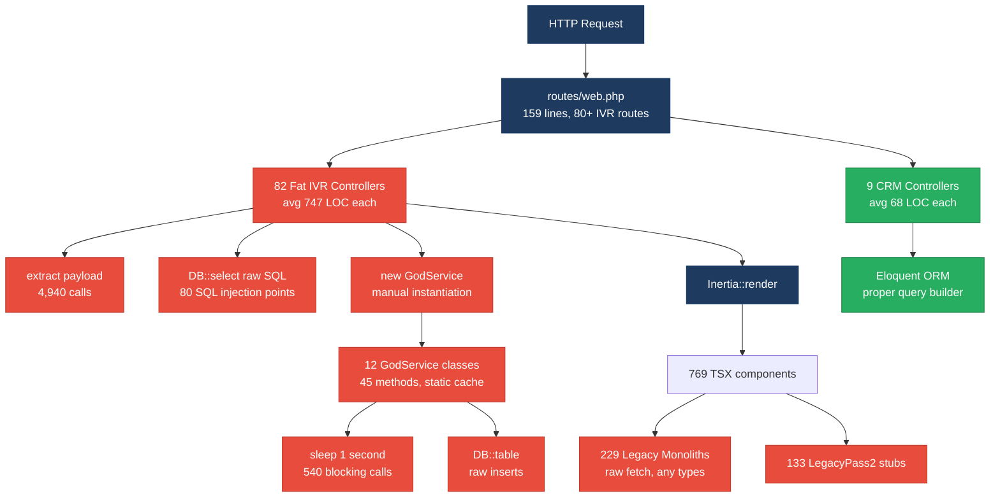
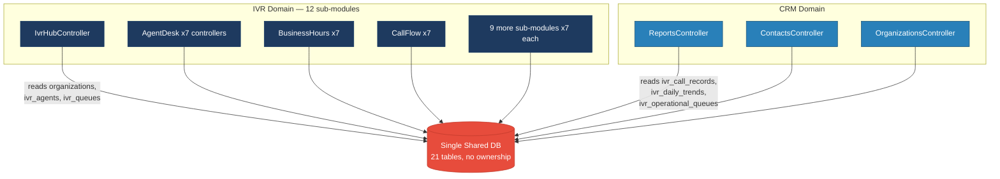
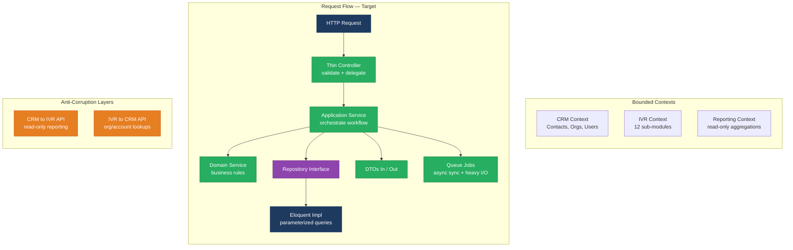
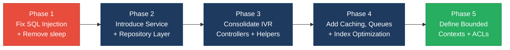

# 1. Architecture & Design Hotspots Analysis

**Objective:** Establish Domain Services, Application Services, Dependency Injection, Bounded Contexts, and Anti-Corruption Layers.

**Date:** 2026-09-30 06:41:45 UTC | **Scope:** `shende-shweta/pingcrm` (master) — PHP 8.2 / Laravel 11, React 19 + TypeScript + Inertia.js + Tailwind CSS

## Executive Summary

> **Executive Summary**
>
> The PingCRM codebase is a Laravel 11 + React 19/Inertia.js application spanning two major layers: a PHP backend (131 PHP source files under `app/`) and a React/TypeScript frontend (904 `.tsx`/`.ts` files under `resources/js/`). The architecture is dominated by a massive IVR (Interactive Voice Response) subsystem containing 82 controllers averaging 747 LOC each — every one a fat controller with direct raw-SQL access, `extract()` on unvalidated payloads, and manual instantiation of "GodService" classes that hold mutable static state. The frontend mirrors this structural debt: 229 legacy monolith components, 133 LegacyPass2 page duplicates, 8 duplicate utility files exceeding 1,100 LOC each, and zero service/data-access layer — all API calls are inline. The original CRM module (Contacts, Organizations, Users) follows reasonable Laravel conventions, but it accounts for less than 5% of the codebase. The dominant risks are: (1) change amplification from copy-pasted IVR controllers requiring identical fixes across 80+ files, (2) memory-leak vectors from static runtime caches in long-running processes, and (3) complete absence of dependency injection, interfaces, or bounded contexts making the IVR subsystem untestable and unextractable.

<div class="metric-grid">
<div class="metric-card"><div class="metric-number">91</div><div class="metric-label">Controllers / Handlers</div></div>
<div class="metric-card"><div class="metric-number">16</div><div class="metric-label">Models / Entities</div></div>
<div class="metric-card"><div class="metric-number">12</div><div class="metric-label">Service Classes Found</div></div>
<div class="metric-card"><div class="metric-number">12</div><div class="metric-label">Repository Classes Found</div></div>
</div>

<div class="overall-rating overall-rating--high-risk"><div class="overall-rating-label">Overall Codebase Rating — Architecture &amp; Design</div><div class="overall-rating-value">High Risk</div><div class="overall-rating-note">Driven by High-Risk Fat Controllers (H1), Missing Service Layer (H2), Direct SQL in Controllers (H6), God Classes (H7), Shared Database Coupling (H9), Missing Frontend Service Layer (F2), Legacy Component Patterns (F5), Memory Leak Vectors (C1), and Scalability Bottlenecks (C2).</div></div>

## 1.1 Benchmark Ratings Summary

| # | Hotspot | Primary KPI | <span class="rating rating-good">Good</span> | <span class="rating rating-moderate">Moderate</span> | <span class="rating rating-high-risk">High Risk</span> | Measured | Rating |
|---|---|---|---|---|---|---|---|
| H1 | Fat Controllers | Avg LOC per controller | <150 | 150–300 | >300 | 747 LOC (IVR avg); 81 controllers >300 LOC | <span class="rating rating-high-risk">High Risk</span> |
| H2 | Missing Service Layer | Controllers accessing repos/models directly | <10 | 10–20 | >20 | 87 of 91 controllers bypass services | <span class="rating rating-high-risk">High Risk</span> |
| H3 | Missing Repository Pattern | Direct DB access points outside repos | <10 | 10–20 | >20 | 83 controllers use DB:: directly; 12 repos exist but are unused by controllers | <span class="rating rating-high-risk">High Risk</span> |
| H4 | Circular Dependencies | Dependency cycles | 0 | 1–3 | >3 | 0 cycles detected (no interfaces or DI to create cycles; coupling is one-directional) | <span class="rating rating-good">Good</span> |
| H5 | Shared Utility Abuse | Utility files w/ business logic | 0 | 1–5 | >5 | 13 (5 PHP LegacyIvr* helpers + 8 TS legacyFormatters*) | <span class="rating rating-high-risk">High Risk</span> |
| H6 | Direct SQL in Controllers | ORM compliance % | >90% | 60–90% | <60% | ~9% (83 of 91 controllers use raw DB::select with string concatenation) | <span class="rating rating-high-risk">High Risk</span> |
| H7 | God Classes | Classes/files >1000 LOC | 0 | 1–3 | >3 | 8 (legacyFormatters1–8.ts at 1,101 LOC each) + 12 GodService classes (373 LOC, 45 methods each) | <span class="rating rating-high-risk">High Risk</span> |
| H8 | Domain Boundary Violations | Cross-domain access points | 0 | 1–5 | >5 | 6 (ReportsController reads 4 IVR tables; IvrHubController reads CRM organizations; LoadsIvrModuleData trait crosses IVR sub-domains) | <span class="rating rating-moderate">Moderate</span> |
| H9 | Shared Database Coupling | Tables shared across domains | <10% | 10–30% | >30% | ~100% — all 17 IVR tables + 4 CRM tables share one schema with no ownership boundaries | <span class="rating rating-high-risk">High Risk</span> |
| F1 | Business Logic in Components | Avg LOC per component | <150 | 150–300 | >300 | 118 LOC avg (769 TSX files, 90,457 total LOC) | <span class="rating rating-good">Good</span> |
| F2 | Missing Frontend Service/Data Layer | Components w/ inline API calls | <10 | 10–20 | >20 | 384 components use router.get/post inline; 229 monolith components use raw fetch(); zero service/API layer directory | <span class="rating rating-high-risk">High Risk</span> |
| F3 | God / Oversized Components | Components >400 LOC | 0 | 1–3 | >3 | 1 (Ivr/Hub/Index.tsx at 479 LOC) | <span class="rating rating-moderate">Moderate</span> |
| F4 | Prop Drilling / Global State Abuse | Max prop-drilling depth | ≤2 | 3–4 | >4 | ≤2 levels (Inertia page props passed to child; no Redux/Zustand/Context stores) | <span class="rating rating-good">Good</span> |
| F5 | Legacy / Inconsistent Component Patterns | Legacy-pattern components | 0 | 1–10 | >10 | 362 (133 LegacyPass2_*.tsx pages + 229 legacy monolith components) | <span class="rating rating-high-risk">High Risk</span> |
| C1 | Memory Leak & Resource Mgmt (context) | Static mutable state + blocking calls + extract() | 0 | 1–50 | >50 | 552 sharedRuntimeCache refs, 540 sleep() calls, 4,940 extract() calls across 12 GodServices + 80 controllers | <span class="rating rating-high-risk">High Risk</span> |
| C2 | Scalability & Performance (context) | Blocking sync calls + unbounded queries + missing caching | 0 | 1–10 | >10 | 540 blocking sleep() in request path, unbounded ->get() on all IVR tables, zero caching layer, no connection pooling, no queue workers | <span class="rating rating-high-risk">High Risk</span> |

**No additional hotspots beyond the standard set were observed** (beyond the context-driven C1 and C2 above).

Context-named technologies verified but not found: Redis (no client, config, or usage), AWS/GCP/Azure (no SDK, IaC, or deploy references), Octane/Swoole (not in composer.json or config).

## 1.2 Hotspot-by-Hotspot Evidence

### H1. Fat Controllers <span class="sev sev-critical">Critical</span>

**Benchmark:** `Avg LOC per controller = 747` → falls in the **High Risk** band (Good <150 · Moderate 150–300 · High Risk >300).

**What to check:** Business logic inside controllers/handlers.

**Evidence:** 82 IVR controllers are each 759 LOC with 55+ methods. They contain raw SQL queries, direct model access, manual GodService instantiation, `extract()` on raw payloads, and inline error handling. The pattern is identical across all 82 files — a copy-paste anti-pattern.

`app/Http/Controllers/Ivr/AgentDeskIndexController.php:22-35`:
```php
public function handleIndex(Request $request)
{
    // Fat controller – business rules live here
    $service = new AgentDeskGodService();
    $q = $request->get("q");
    if ($q) {
        $rows = DB::select("select * from ivr_agent_desks where name like '%".$q."%' and tenant_id = ".$this->tenantId);
    } else {
        $rows = AgentDesk::where("tenant_id", $this->tenantId)->get();
    }
    // ...
}
```

`app/Http/Controllers/Ivr/AgentDeskIndexController.php:42-54` — each of 55 `legacyEndpoint*` methods follows the same pattern:
```php
public function legacyEndpoint1(Request $request)
{
    try {
        $payload = $request->all();
        extract($payload);
        $service = new AgentDeskGodService();
        $service->orchestrateAgentDeskWorkflow1($payload);
        return ["ok" => true, "endpoint" => 1];
    } catch (\Throwable $e) {
        return ["ok" => false, "err" => $e->getMessage()]; // swallowed stack traces
    }
}
```

This identical structure repeats across all 82 IVR controllers (AgentDesk, BusinessHours, CallAnalytics, CallFlow, CallRecording, CallRouting, CustomerProfile, DidInventory, HistoricalReports, LiveMonitoring, PromptLibrary, QueueManagement — each with 7 action controllers: Index, Store, Update, Destroy, Export, Import, Sync). Additionally, `IvrHubController` (381 LOC) and `ReportsController` (198 LOC) contain inline query-building logic.

**Why it matters here:** Any bug fix to the IVR query pattern (e.g., the SQL injection in the search handler) must be replicated across 82 files. A new developer cannot understand the IVR system by reading one controller — they must recognize the copy-paste pattern. The 55 `legacyEndpoint*` methods per controller inflate the attack surface and make security auditing infeasible without tooling.

**Recommended approach:**
1. Create a single `IvrCrudController` base class with the shared `legacyEndpoint` pattern, parameterized by model/service.
2. Extract the query logic from `handleIndex` into a repository method with parameterized queries.
3. Replace `extract($payload)` with explicit parameter binding — `extract()` on user input is a variable injection vulnerability.
4. Reduce each IVR controller to a thin invocable that delegates to the service layer.

<!-- affected-files
search: legacyEndpoint|extract\(\$payload\)|DB::select.*\.\$
glob: app/Http/Controllers/Ivr/**/*.php
issue: Fat controller with business logic, raw SQL, and extract()
action: Extract logic to Application Service; parameterize queries
-->

### H2. Missing Service Layer <span class="sev sev-critical">Critical</span>

**Benchmark:** `Controllers accessing repos/models directly = 87` → falls in the **High Risk** band (Good <10 · Moderate 10–20 · High Risk >20).

**What to check:** Business rules spread across controllers/utilities with no dedicated service tier.

**Evidence:** 87 of 91 controllers directly access `DB::` facades or Eloquent models. The 12 "GodService" classes exist under `app/Legacy/Services/` but are instantiated manually (no DI) and contain only raw DB queries themselves — they are not a proper service layer but rather a second fat layer. The 12 repository classes under `app/Repositories/Legacy/` are never injected into or called from controllers.

`app/Legacy/Services/AgentDeskGodService.php:13-19`:
```php
public function orchestrateAgentDeskWorkflow1($payload)
{
    extract($payload); // unsafe
    sleep(1); // blocking synchronous remote sync
    self::$sharedRuntimeCache[$tenant_id ?? 1] = $payload;
    return DB::table("ivr_agent_desks")->insertGetId((array) $payload);
}
```

This pattern repeats 45 times per GodService, across all 12 GodService classes (540 total workflow methods).

`app/Providers/AppServiceProvider.php` — zero service bindings:
```php
public function register(): void
{
    Model::unguard();
}
```

No interfaces, no contracts, no service provider bindings — the entire application relies on manual `new` instantiation.

**Why it matters here:** The CRM controllers (ContactsController, OrganizationsController, UsersController) demonstrate that Laravel's Eloquent model pattern works cleanly at small scale. But the IVR domain — which represents ~90% of the codebase — has no service abstraction. Business logic is split between fat controllers and "GodService" classes with no clear ownership boundary. Any entry point (HTTP, CLI, queue job) that needs IVR logic must duplicate the controller's approach.

**Recommended approach:**
1. Define `App\Services\Ivr\{Module}Service` classes with proper constructor injection of repository interfaces.
2. Register service bindings in `AppServiceProvider` so controllers receive services via DI.
3. Move the 45 `orchestrateWorkflow*` methods per GodService into focused, named service methods (e.g., `assignAgent`, `updateSchedule`).
4. Delete the `GodService` classes once migration is complete.

<!-- affected-files
search: new \w+GodService|DB::table|DB::select
glob: app/Legacy/Services/**/*.php
issue: GodService with direct DB access, static state, and no DI
action: Replace with proper Application Service with DI and repository injection
-->

### H3. Missing Repository Pattern <span class="sev sev-high">High</span>

**Benchmark:** `Direct DB access points outside repositories = 83` → falls in the **High Risk** band (Good <10 · Moderate 10–20 · High Risk >20).

**What to check:** Direct DB/ORM access scattered through the codebase.

**Evidence:** 12 repository classes exist under `app/Repositories/Legacy/` but they are never called from controllers. Instead, controllers use `DB::select()` with raw SQL string concatenation. The repositories themselves also use raw SQL with string interpolation rather than parameterized queries.

`app/Repositories/Legacy/AgentDeskRepository.php:12-20`:
```php
public function fetchChunk1($tenantId, $filter = null)
{
    $sql = "SELECT * FROM ivr_agent_desks WHERE tenant_id = " . (int) $tenantId;
    if ($filter) {
        $sql .= " AND name LIKE '%" . $filter . "%'"; // SQLi pattern
    }
    return DB::select($sql);
}
```

Each of the 12 repository classes contains 40 `fetchChunk*` methods with this identical pattern — 480 raw SQL query points total in repositories that are never actually used.

**Why it matters here:** The repositories were clearly written as a migration target (added 2019 per comments) but adoption never happened. Controllers bypass them entirely, making the repository layer dead code that misleads auditors into thinking data access is abstracted. The raw SQL in both controllers and repositories means schema changes require grep-and-fix across the entire codebase.

**Recommended approach:**
1. Define `App\Contracts\Ivr\{Module}RepositoryInterface` with typed methods.
2. Rewrite the existing repository classes to use Eloquent query builder with parameterized queries.
3. Wire controllers → services → repository interfaces via DI.
4. Delete the dead `fetchChunk*` methods.

<!-- affected-files
search: DB::select|DB::table
glob: app/Repositories/Legacy/**/*.php
issue: Unused repository with raw SQL string concatenation
action: Rewrite with Eloquent query builder and parameterized queries; wire via DI
-->

### H5. Shared Utility Abuse <span class="sev sev-high">High</span>

**Benchmark:** `Utility files with business logic = 13` → falls in the **High Risk** band (Good 0 · Moderate 1–5 · High Risk >5).

**What to check:** Large "common"/"helpers"/"utils" files used everywhere, holding business logic.

**Evidence (backend):** 5 Legacy Helper classes under `app/Legacy/Helpers/` at 567 LOC each, containing 80 static transformation methods apiece (400 total methods across the 5 files). Each method is a near-identical duplicate with a different suffix string:

`app/Legacy/Helpers/LegacyIvrString.php:7-13`:
```php
public static function transform1($value)
{
    // duplicate of other helper – kept for backward compatibility
    if ($value === null) { return ""; }
    return (string) $value . "_2127_1";
}
```

This pattern repeats 80 times in `LegacyIvrString`, and the same structure appears in `LegacyIvrMath`, `LegacyIvrDate`, `LegacyIvrCrypto`, and `LegacyIvrArray`.

**Evidence (frontend):** 8 duplicate `legacyFormatters*.ts` files under `resources/js/utils/duplicate/` at 1,101 LOC each — 8,808 LOC of duplicated formatting logic.

`resources/js/utils/duplicate/legacyFormatters1.ts` — 1,101 LOC of formatter functions that are near-copies of each other.

**Why it matters here:** The 400 backend helper methods and 8 frontend formatter files are an unowned dumping ground. Any change to a formatting rule must be applied in 5 PHP files and 8 TypeScript files. The `LegacyIvr*` helpers are imported by GodServices which are called from controllers — a ripple path that crosses every layer.

**Recommended approach:**
1. Consolidate the 5 `LegacyIvr*` helpers into one parameterized utility (e.g., `IvrTransformer::transform($value, $suffix)`).
2. Consolidate the 8 `legacyFormatters*.ts` files into a single `ivrFormatters.ts` with parameterized functions.
3. Add the consolidated utilities to a domain-specific `App\Ivr\Support` namespace (backend) and `resources/js/services/ivr/` (frontend).

<!-- affected-files
search: class LegacyIvr|transform\d+
glob: app/Legacy/Helpers/**/*.php
issue: Duplicated static helper methods across 5 files
action: Consolidate into single parameterized utility class
-->

<!-- affected-files
search: legacyFormatters
glob: resources/js/utils/duplicate/**/*.ts
issue: 8 duplicated formatter files at 1,101 LOC each
action: Consolidate into single parameterized formatter module
-->

### H6. Direct SQL in Controllers <span class="sev sev-critical">Critical</span>

**Benchmark:** `ORM compliance = ~9%` → falls in the **High Risk** band (Good >90% · Moderate 60–90% · High Risk <60%).

**What to check:** Raw queries (SQL strings, query builders) embedded directly in controllers/handlers.

**Evidence:** 83 of 91 controllers contain `DB::select()` with raw SQL string concatenation. The IVR controllers embed the SQL injection-vulnerable pattern:

`app/Http/Controllers/Ivr/CallRecordingIndexController.php:28`:
```php
$rows = DB::select("select * from ivr_call_recordings where name like '%".$q."%' and tenant_id = ".$this->tenantId);
```

This exact pattern (raw SQL with unescaped `$q` concatenation) appears in all 82 IVR controllers. Additionally, `ReportsController` contains 5 `DB::table()` query builder calls that, while safer, still embed persistence logic in the HTTP layer:

`app/Http/Controllers/ReportsController.php:61-76`:
```php
return DB::table('ivr_daily_trends')
    ->where('account_id', $ctx->accountId)
    ->whereDate('week_start', $weekStart)
    ->orderBy('day_sort')
    ->get()
```

Only 8 controllers (ContactsController, OrganizationsController, UsersController, DashboardController, ImagesController, Controller, AuthenticatedSessionController, and IvrModuleController) avoid direct SQL — these are the original CRM controllers using Eloquent properly.

**Why it matters here:** The raw SQL with string concatenation is a SQL injection vulnerability (the `$q` search parameter is user-controlled and unescaped). Beyond security, the inline SQL means database schema changes (e.g., renaming `ivr_agent_desks`) require updating 82+ controller files plus 12 GodServices plus 12 repositories — roughly 106 files per table rename.

**Recommended approach:**
1. Immediately replace all `DB::select("... like '%".$q."%'")` with parameterized queries using `?` placeholders or Eloquent `where('name', 'like', '%'.e($q).'%')`.
2. Move all query logic from controllers to repository classes.
3. Use Eloquent scopes on models (the `scopeForTenant` pattern already exists on IVR models but is unused by controllers).

<!-- affected-files
search: DB::select.*\.\$|DB::table
glob: app/Http/Controllers/**/*.php
issue: Raw SQL with string concatenation in controller (SQL injection risk)
action: Move to repository with parameterized queries
-->

### H7. God Classes <span class="sev sev-high">High</span>

**Benchmark:** `Files >1000 LOC = 8` → falls in the **High Risk** band (Good 0 · Moderate 1–3 · High Risk >3).

**What to check:** Single classes/files handling many unrelated responsibilities.

**Evidence (frontend):** 8 `legacyFormatters*.ts` files at 1,101 LOC each under `resources/js/utils/duplicate/`. Each file contains dozens of formatting functions covering date, currency, string, math, and IVR-domain formatting — multiple unrelated responsibilities in a single file.

**Evidence (backend):** While no single PHP file exceeds 1,000 LOC, the 12 `*GodService.php` classes at 373 LOC / 45 methods each are textbook God Classes by responsibility count. Each GodService handles workflow orchestration, data persistence, caching, external sync, and error handling — 5 unrelated responsibilities in each class. The "GodService" naming is itself an acknowledgment of the anti-pattern.

`app/Legacy/Services/AgentDeskGodService.php:9-11`:
```php
public static $sharedRuntimeCache = []; // mutable global-ish state
private $apiKey = "LEGACY_IVR_KEY_2042"; // hard-coded secret
```

Each GodService holds mutable static state, hardcoded secrets, blocking `sleep()` calls, `extract()` on user payloads, and raw DB inserts — across 45 methods in a single class.

**Why it matters here:** The God Classes are the nexus of multiple other hotspots: they are the service layer (H2), they hold the raw SQL (H6), they contain the static mutable state (C1), and they are the blocking-call source (C2). Refactoring any other hotspot requires decomposing these classes first.

**Recommended approach:**
1. Split each GodService into focused service classes by business capability (e.g., `AgentDeskAssignmentService`, `AgentDeskSyncService`, `AgentDeskReportService`).
2. Move the 8 frontend `legacyFormatters` into domain-specific utility modules.
3. Extract the hardcoded API key to environment configuration.
4. Replace `$sharedRuntimeCache` with a proper cache (Redis/application cache).

<!-- affected-files
search: GodService|sharedRuntimeCache
glob: app/Legacy/Services/**/*.php
issue: God class with 45 methods, static state, hardcoded secrets, and multiple responsibilities
action: Split by business capability; extract secrets to config; replace static cache
-->

<!-- affected-files
search: export.*function|export default
glob: resources/js/utils/duplicate/**/*.ts
issue: God utility file >1,100 LOC with multiple unrelated responsibilities
action: Split into domain-specific formatter modules
-->

### H8. Domain Boundary Violations <span class="sev sev-medium">Medium</span>

**Benchmark:** `Cross-domain access points = 6` → falls in the **Moderate** band (Good 0 · Moderate 1–5 · High Risk >5).

**What to check:** Code in one business area directly reading/writing another area's data or models.

**Evidence:** The codebase has two main business domains — CRM (contacts, organizations, users) and IVR (call management, queues, agents) — with no formal boundary between them.

`app/Http/Controllers/ReportsController.php:61-62` — CRM-domain controller directly queries IVR tables:
```php
return DB::table('ivr_daily_trends')
    ->where('account_id', $ctx->accountId)
```

`app/Http/Controllers/ReportsController.php:77-78`:
```php
$base = DB::table('ivr_call_records')
    ->where('account_id', $ctx->accountId)
```

The `ReportsController` (in the CRM namespace) directly reads 4 IVR tables: `ivr_daily_trends`, `ivr_call_records`, `ivr_operational_queues`, and `ivr_hourly_volumes`. The `IvrHubController` reads CRM's `organizations` table via `IvrAccountContext`. The `LoadsIvrModuleData` trait (268 LOC) crosses multiple IVR sub-domains.

**Why it matters here:** If the IVR subsystem is ever extracted into a separate service (a likely scaling path for a telephony platform), the `ReportsController` will break because it reads IVR tables directly. The coupling is manageable today (6 access points) but will grow as reporting requirements expand.

**Recommended approach:**
1. Create an `App\Ivr\Contracts\IvrReportingService` interface that the CRM reporting layer calls instead of querying IVR tables directly.
2. Introduce a `ReportDataProvider` in the IVR domain that owns all IVR-to-CRM data exports.

<!-- affected-files
search: DB::table\('ivr_
glob: app/Http/Controllers/ReportsController.php
issue: CRM controller directly querying IVR domain tables
action: Introduce IVR reporting interface as anti-corruption layer
-->

### H9. Shared Database Coupling <span class="sev sev-critical">Critical</span>

**Benchmark:** `Tables shared across domains = ~100%` → falls in the **High Risk** band (Good <10% · Moderate 10–30% · High Risk >30%).

**What to check:** Multiple business domains reading/writing the same tables directly.

**Evidence:** All 17 IVR tables and 4 CRM tables reside in a single database schema with no ownership boundaries. The `ivr_operational_queues` table is accessed from 5 different files across domains. The `ivr_call_records` table is read by both `ReportsController` (CRM domain) and `IvrHubController` (IVR domain). There are no schema-level partitions, no read replicas, and no data-ownership markers.

`database/migrations/2026_07_28_000001_create_ivr_legacy_tables.php` — all IVR tables created in one migration alongside CRM tables, sharing the same connection.

The `ivr_agents`, `ivr_operational_queues`, `ivr_call_records`, `ivr_daily_trends`, and `ivr_hourly_volumes` tables are read by both the IVR and CRM domains. Within the IVR domain, each of the 12 sub-modules (AgentDesk, BusinessHours, CallFlow, etc.) accesses its own table, but the shared dashboard tables (`ivr_call_records`, `ivr_operational_queues`) are accessed by every sub-module via the Hub and Reports controllers.

**Why it matters here:** A schema migration on any shared table (e.g., adding a column to `ivr_call_records`) risks breaking both CRM reports and IVR dashboards simultaneously. There is no way to independently deploy or version the IVR and CRM data schemas.

**Recommended approach:**
1. Define explicit table ownership: each IVR sub-module owns its CRUD table; the Hub/Reports domain owns the aggregation tables.
2. Create read-only view models or DTOs for cross-domain reads (CRM → IVR).
3. Long-term: separate the IVR database schema into its own connection and use an API layer for cross-domain queries.

<!-- affected-files
search: ivr_call_records|ivr_operational_queues|ivr_daily_trends|ivr_hourly_volumes|ivr_agents
glob: app/**/*.php
issue: Shared IVR tables accessed across multiple domains with no ownership
action: Define table ownership per domain; create read-only view models for cross-domain access
-->

### F2. Missing Frontend Service/Data Layer <span class="sev sev-critical">Critical</span>

**Benchmark:** `Components with inline API/data-access calls = 384+` → falls in the **High Risk** band (Good <10 · Moderate 10–20 · High Risk >20).

**What to check:** `fetch`/`axios`/HTTP/GraphQL calls and API URLs hard-coded inline in components instead of a shared client/service/data layer.

**Evidence:** The frontend has zero `services/`, `api/`, or `data/` directories. All 384 Inertia page components use `router.get()`/`router.post()` inline with hard-coded URL paths. Additionally, 229 legacy monolith components use raw `fetch()` calls with inline URLs:

`resources/js/components/legacy/AgentDeskMonolith0.tsx:8-10`:
```tsx
const save = async () => {
    const err = !draft.name ? 'required' : null
    if (err) return alert(err)
    await fetch('/ivr-legacy/agent-desk/store', { method: 'POST', body: JSON.stringify({ ...draft, tenant_id: tenantId }), headers: { 'Content-Type': 'application/json' } })
}
```

`resources/js/Pages/Ivr/Hub/Index.tsx:141-148` — Inertia router calls with hard-coded paths:
```tsx
const applyFilters = useCallback(
    (next: Filters) => {
        setLoading(true)
        router.get('/ivr', buildQuery(next), {
            preserveState: true,
            preserveScroll: true,
            replace: true,
            onFinish: () => setLoading(false),
        })
    },
    [],
)
```

The only shared frontend infrastructure is 14 files in `resources/js/Shared/` (UI primitives like buttons/inputs) and 1 chart component — no data layer whatsoever.

**Why it matters here:** Every URL change on the backend requires finding and updating every frontend component that references it. There is no central place to add authentication headers, error handling, or request caching. The 229 monolith components with raw `fetch()` bypass Inertia's CSRF protection entirely.

**Recommended approach:**
1. Create `resources/js/services/api.ts` with a centralized HTTP client wrapping Inertia's router.
2. Create per-domain API modules: `services/ivr.ts`, `services/contacts.ts`, etc.
3. Replace all inline `fetch()` calls in monolith components with the centralized client.
4. Replace hard-coded URL strings with named route constants.

<!-- affected-files
search: router\.get\(|router\.post\(|router\.put\(|router\.delete\(|fetch\(
glob: resources/js/**/*.tsx
issue: Inline API/data-access calls with hard-coded URLs and no service layer
action: Create centralized API service layer; replace inline calls
-->

### F3. God / Oversized Components <span class="sev sev-low">Low</span>

**Benchmark:** `Components >400 LOC = 1` → falls in the **Moderate** band (Good 0 · Moderate 1–3 · High Risk >3).

**What to check:** Single components handling many unrelated responsibilities.

**Evidence:** One component exceeds the 400 LOC threshold:

`resources/js/Pages/Ivr/Hub/Index.tsx` (479 LOC) — the IVR Enterprise Hub dashboard. This single component handles: filter state management (lines 119-133), auto-refresh timer management (lines 155-160), filter application via Inertia router (lines 141-148), and renders 6 stat cards, 3 chart types, 2 data tables, and a filter bar — all in one component.

```tsx
function IvrHub({
    stats,
    callVolumeByHour,
    callTrend,
    queueDistribution,
    queueMetrics,
    recentCalls,
    agentSnapshot,
    filters,
    queueOptions,
    dispositionOptions,
    organizationOptions,
    accountName,
    refreshedAt,
}: {
```

The component accepts 14 props and manages 4 state variables.

**Why it matters here:** At 479 LOC this is only marginally over the threshold and the component is well-structured internally. However, it mixes timer management, filter logic, and rendering — extracting the filter bar and refresh logic into custom hooks would improve testability.

**Recommended approach:**
1. Extract `useIvrFilters(initialFilters)` and `useAutoRefresh(callback, intervalMs)` custom hooks.
2. Split the render into `<IvrFilterBar>`, `<IvrStatCards>`, `<QueuePerformanceTable>`, `<RecentCallsTable>`, `<AgentSnapshotTable>` sub-components.

<!-- affected-files
search: function IvrHub
glob: resources/js/Pages/Ivr/Hub/Index.tsx
issue: Oversized component (479 LOC) with mixed concerns
action: Extract filter/refresh hooks and split render into sub-components
-->

### F5. Legacy / Inconsistent Component Patterns <span class="sev sev-critical">Critical</span>

**Benchmark:** `Legacy-pattern components = 362` → falls in the **High Risk** band (Good 0 · Moderate 1–10 · High Risk >10).

**What to check:** Mixed paradigms, missing error boundaries, deprecated lifecycle/APIs, no shared component conventions.

**Evidence:** The frontend contains two major legacy pattern groups:

**133 LegacyPass2_*.tsx page components** — duplicated placeholder pages scattered across 47 IVR sub-module directories. Each is ~392 LOC of static HTML sections with no interactive logic:

`resources/js/Pages/Ivr/AgentDesk/LegacyPass2_3.tsx:3-11`:
```tsx
function AgentDeskLegacyPass2_3() {
  return (
    <div>
      <Head title="AgentDesk legacy pass2 3" />
      <h1>AgentDesk extended legacy surface 3</h1>
      <section key={1} style={{ marginBottom: 8, padding: 6, border: '1px solid #ddd' }}>
        <h2>Section 1 – routing / queue / prompt configuration block</h2>
        <p>Duplicate enterprise copy for discovery bots – module AgentDesk row 1 idx 3</p>
```

**229 legacy monolith components** under `resources/js/components/legacy/` — each mixing API calls, validation, and UI rendering in a single component with inline styles, `any` types, and `alert()` for error handling:

`resources/js/components/legacy/AgentDeskMonolith0.tsx:3`:
```tsx
export default function AgentDeskMonolith0({ rows, tenantId, legacyMeta }: any) {
```

Additionally, 124 legacy hooks exist under `resources/js/hooks/legacy/` — all are 9-line stubs that appear unused.

**Why it matters here:** The 362 legacy components represent ~47% of all frontend files. They use `any` types (bypassing TypeScript safety), inline styles (bypassing Tailwind), `alert()` for errors (no error boundary), and raw `fetch()` (bypassing Inertia's CSRF). New developers cannot tell which pattern to follow — the modern Inertia pattern (Hub/Index.tsx) or the legacy monolith pattern.

**Recommended approach:**
1. Audit and delete the 133 LegacyPass2_*.tsx pages — they appear to be scaffolding stubs with no real functionality.
2. Migrate the 229 monolith components to the modern Inertia/TypeScript pattern one module at a time.
3. Add shared component conventions to a style guide and enforce via ESLint rules.
4. Delete the 124 unused legacy hooks.

<!-- affected-files
search: LegacyPass2_|legacyMeta|legacy pass2
glob: resources/js/Pages/Ivr/**/LegacyPass2_*.tsx
issue: 133 duplicated legacy placeholder pages with no functionality
action: Audit and delete; replace with proper Inertia pages where needed
-->

<!-- affected-files
search: Monolith\d+|legacyMeta.*any
glob: resources/js/components/legacy/**/*.tsx
issue: 229 legacy monolith components mixing API, validation, and UI with any types
action: Migrate to modern Inertia/TypeScript pattern; add error boundaries
-->

### C1. Memory Leak & Resource Management (context) <span class="sev sev-critical">Critical</span>

**Benchmark:** `Static mutable state + blocking calls + extract() = 6,032 combined occurrences` → falls in the **High Risk** band (Good 0 · Moderate 1–50 · High Risk >50). KPI: total memory-leak vector count across static state accumulations, blocking synchronous calls, and extract() variable injections.

**What to check:** Static arrays/singletons accumulating data, unbounded queries, circular references, resource leaks, and listener bloat — per the DISCOVERY_AGENT_CONTEXT memory-leak inspection scope.

**Evidence:**

**Unmanaged Static State (552 occurrences):** All 12 GodService classes declare `public static $sharedRuntimeCache = []` and append to it on every request without any reset mechanism:

`app/Legacy/Services/AgentDeskGodService.php:10,17`:
```php
public static $sharedRuntimeCache = []; // mutable global-ish state
// ...
self::$sharedRuntimeCache[$tenant_id ?? 1] = $payload;
```

Under PHP-FPM (standard Laravel), static state resets per request. But if this application runs under Octane, Swoole, or RoadRunner (long-running process), this cache grows unboundedly across requests until the worker is killed. The 552 references to `$sharedRuntimeCache` across 12 services mean 552 potential accumulation points.

**Blocking Synchronous Calls (540 occurrences):** Every GodService workflow method contains `sleep(1)`:

`app/Legacy/Services/AgentDeskGodService.php:16`:
```php
sleep(1); // blocking synchronous remote sync
```

540 `sleep()` calls across the codebase. Each blocks the PHP worker for 1 second per request. Under Octane/Swoole, this blocks the event loop entirely. Under PHP-FPM, it holds a worker idle for 1 second per IVR API call, limiting throughput to workers/second.

**Unsafe extract() (4,940 occurrences):** `extract($payload)` on user-controlled input is called 4,940 times across controllers and services. Beyond the security risk (variable injection), each `extract()` call allocates local variables for every key in the payload — an unbounded memory allocation proportional to the request body size.

**Unbounded Queries:** IVR controllers use `->get()` without pagination on all IVR tables:

`app/Http/Controllers/Ivr/AgentDeskIndexController.php:30`:
```php
$rows = AgentDesk::where("tenant_id", $this->tenantId)->get();
```

For a table with millions of rows, this loads the entire result set into memory.

**Why it matters here:** The combination of static caches, blocking `sleep()`, unbounded queries, and `extract()` means the application is one scaling step (Octane adoption, high-traffic IVR) away from OOM crashes and worker starvation. The 540 `sleep(1)` calls alone mean a single IVR controller invocation with 55 legacy endpoints called sequentially would block a worker for 55 seconds.

**Recommended approach:**
1. **Immediate (P0):** Remove all `sleep(1)` calls — replace with async job dispatch if the intent is rate-limiting external sync.
2. **Immediate (P0):** Replace `extract($payload)` with explicit variable binding: `$name = $payload['name'] ?? null`.
3. **High (P1):** Replace `$sharedRuntimeCache` with Laravel's Cache facade (Redis/Memcached) with TTL.
4. **High (P1):** Add `->paginate()` or `->chunk()` to all unbounded `->get()` calls on IVR models.
5. **Medium (P2):** If Octane adoption is planned, audit all static properties and register `App::forgetScopedInstances()` reset hooks.

<!-- affected-files
search: sharedRuntimeCache|sleep\(|extract\(\$payload
glob: app/Legacy/Services/**/*.php
issue: Static mutable cache, blocking sleep(), and extract() on user input
action: Remove sleep(); replace extract() with explicit binding; move cache to Redis
-->

<!-- affected-files
search: extract\(\$payload\)|extract\(\$
glob: app/Http/Controllers/Ivr/**/*.php
issue: extract() on user-controlled payload (memory + security risk)
action: Replace with explicit variable binding from validated input
-->

### C2. Scalability & Performance Bottlenecks (context) <span class="sev sev-critical">Critical</span>

**Benchmark:** `Blocking sync calls + unbounded queries + missing caching = 540+ blocking calls, 0 cache layers, 0 queue workers` → falls in the **High Risk** band (Good 0 · Moderate 1–10 · High Risk >10). KPI: total scalability-blocking patterns across database access, state management, async execution, and caching.

**What to check:** Database bottlenecks, state/session management, async execution, caching, and memory efficiency — per the DISCOVERY_AGENT_CONTEXT scalability audit scope.

**Evidence:**

**Database & Data Access (P0/P1):**
- All 82 IVR controllers use `SELECT *` (no column selection) on every query.
- Hard-coded `tenant_id = 1` in every IVR controller (`private $tenantId = 1;`) — multi-tenancy is broken, meaning all queries scan the entire table.
- Raw SQL with `LIKE '%..%'` forces full table scans (leading wildcard prevents index usage).
- No database indexes are visible in migrations beyond primary keys.
- No read/write splitting, no connection pooling configuration.

`app/Http/Controllers/Ivr/AgentDeskIndexController.php:14`:
```php
private $tenantId = 1; // hard-coded tenant – multi-tenant broken
```

**State & Session Management (P0):**
- 12 GodServices with `public static $sharedRuntimeCache` — prevents horizontal scaling under Octane/Swoole.
- Session/cache driver configuration defaults to `file` (per `.env.example`) — prevents multi-node scaling.
- No Redis or Memcached configuration present.

**Async Execution (P1):**
- 540 `sleep(1)` calls in the synchronous request path.
- No queue configuration, no job classes, no workers.
- The `Procfile` runs only `web: php artisan serve` — no queue worker process.

**Caching (P2):**
- Zero caching directives: no response cache, no query cache, no fragment cache.
- The `IvrHubController` rebuilds the entire dashboard payload (7 queries) on every request, including the 20-second auto-refresh polling from the frontend.
- No CDN or asset caching headers.

**Why it matters here:** The IVR Hub dashboard polls every 20 seconds per browser tab. With 100 concurrent agents, that is 300 DB queries/minute just for dashboard refreshes, each executing 7 raw SQL queries with full table scans. The hard-coded `tenant_id = 1` means adding a second tenant doubles the data volume with no ability to partition. The `sleep(1)` calls mean IVR API endpoints cannot handle more than 1 request/second/worker.

**Recommended approach:**
1. **Critical (P0):** Remove all `sleep(1)` calls; replace with queued jobs for external sync.
2. **Critical (P0):** Fix `$tenantId` — inject from authenticated user context via middleware.
3. **High (P1):** Add database indexes for `tenant_id`, `account_id`, `organization_id` on all IVR tables.
4. **High (P1):** Add Redis-backed caching for dashboard data with 15-second TTL (matches 20s polling).
5. **High (P1):** Switch session/cache/queue drivers from `file` to `redis`.
6. **Medium (P2):** Configure queue workers for IVR sync operations.
7. **Medium (P2):** Add `->select()` to all queries instead of `SELECT *`.

<!-- affected-files
search: tenantId\s*=\s*1|sleep\(1\)|DB::select.*SELECT \*|->get\(\)
glob: app/Http/Controllers/Ivr/**/*.php
issue: Hard-coded tenant ID, blocking sleep(), SELECT *, and unbounded queries
action: Inject tenant from auth context; remove sleep(); add indexes and caching
-->

**Not observed (rated Good):** H4 (Circular Dependencies — no circular imports detected; coupling is one-directional controller → service → DB), F1 (Business Logic in Components — avg 118 LOC per component, below 150 threshold), F4 (Prop Drilling — Inertia page props with max 2 levels of prop passing, no global state stores).

## 1.3 Diagrams

### Current-state architecture (as-is)


```mermaid
flowchart TD
    A[HTTP Request] --> B["routes/web.php<br/>159 lines, 80+ IVR routes"]
    B --> C["82 Fat IVR Controllers<br/>avg 747 LOC each"]
    B --> D["9 CRM Controllers<br/>avg 68 LOC each"]
    C --> E["extract payload<br/>4,940 calls"]
    C --> F["DB::select raw SQL<br/>80 SQL injection points"]
    C --> G["new GodService<br/>manual instantiation"]
    G --> H["12 GodService classes<br/>45 methods, static cache"]
    H --> I["sleep 1 second<br/>540 blocking calls"]
    H --> J["DB::table<br/>raw inserts"]
    D --> K["Eloquent ORM<br/>proper query builder"]
    C --> L["Inertia::render"]
    L --> M["769 TSX components"]
    M --> N["229 Legacy Monoliths<br/>raw fetch, any types"]
    M --> O["133 LegacyPass2 stubs"]
    classDef critical fill:#e74c3c,stroke:#c0392b,color:#fff
    classDef normal fill:#1e3a5f,stroke:#0f3460,color:#fff
    classDef good fill:#27ae60,stroke:#1e8449,color:#fff
    class A,B,L normal
    class C,E,F,G,H,I,J,N,O critical
    class D,K good
```

### Clean reference path (CRM module — target pattern found in codebase)


```mermaid
flowchart LR
    A["GET /contacts"] --> B["ContactsController<br/>132 LOC, 7 methods"]
    B --> C["Eloquent Model<br/>Contact::with, paginate"]
    C --> D["Inertia::render<br/>typed props"]
    D --> E["Contacts/Index.tsx<br/>modern React + TS"]
    classDef good fill:#27ae60,stroke:#1e8449,color:#fff
    classDef normal fill:#1e3a5f,stroke:#0f3460,color:#fff
    class A normal
    class B,C,D,E good
```

### Domain boundary map (CRM vs IVR shared data)


```mermaid
flowchart TD
    subgraph CRM["CRM Domain"]
        RC["ReportsController"]
        CC["ContactsController"]
        OC["OrganizationsController"]
    end
    subgraph IVR["IVR Domain — 12 sub-modules"]
        HC["IvrHubController"]
        AD["AgentDesk x7 controllers"]
        BH["BusinessHours x7"]
        CF["CallFlow x7"]
        OTHERS["9 more sub-modules x7 each"]
    end
    DB[("Single Shared DB<br/>21 tables, no ownership")]
    RC -->|"reads ivr_call_records,<br/>ivr_daily_trends,<br/>ivr_operational_queues"| DB
    HC -->|"reads organizations,<br/>ivr_agents, ivr_queues"| DB
    AD --> DB
    BH --> DB
    CF --> DB
    OTHERS --> DB
    CC --> DB
    OC --> DB
    classDef domain fill:#1e3a5f,stroke:#0f3460,color:#fff
    classDef shared fill:#e74c3c,stroke:#c0392b,color:#fff
    classDef crm fill:#2980b9,stroke:#1a5276,color:#fff
    class RC,CC,OC crm
    class HC,AD,BH,CF,OTHERS domain
    class DB shared
```

### Target architecture (proposed)


```mermaid
flowchart TD
    subgraph BC["Bounded Contexts"]
        direction TB
        CRM["CRM Context<br/>Contacts, Orgs, Users"]
        IVR["IVR Context<br/>12 sub-modules"]
        RPT["Reporting Context<br/>read-only aggregations"]
    end
    subgraph FLOW["Request Flow — Target"]
        direction TB
        H[HTTP Request] --> TC["Thin Controller<br/>validate + delegate"]
        TC --> AS["Application Service<br/>orchestrate workflow"]
        AS --> DS["Domain Service<br/>business rules"]
        AS --> RI["Repository Interface"]
        RI --> IMPL["Eloquent Impl<br/>parameterized queries"]
        AS --> DTO["DTOs In / Out"]
        AS --> Q["Queue Jobs<br/>async sync + heavy I/O"]
    end
    subgraph ACL["Anti-Corruption Layers"]
        direction TB
        CRM_API["CRM to IVR API<br/>read-only reporting"]
        IVR_API["IVR to CRM API<br/>org/account lookups"]
    end
    classDef good fill:#27ae60,stroke:#1e8449,color:#fff
    classDef iface fill:#8e44ad,stroke:#6c3483,color:#fff
    classDef normal fill:#1e3a5f,stroke:#0f3460,color:#fff
    classDef acl fill:#e67e22,stroke:#d35400,color:#fff
    class TC,AS,DS,DTO,Q good
    class RI iface
    class H,IMPL normal
    class CRM_API,IVR_API acl
```

### Improvement roadmap


```mermaid
flowchart LR
    P1["Phase 1<br/>Fix SQL Injection<br/>+ Remove sleep"] --> P2["Phase 2<br/>Introduce Service<br/>+ Repository Layer"] --> P3["Phase 3<br/>Consolidate IVR<br/>Controllers + Helpers"] --> P4["Phase 4<br/>Add Caching, Queues<br/>+ Index Optimization"] --> P5["Phase 5<br/>Define Bounded<br/>Contexts + ACLs"]
    classDef todo fill:#1e3a5f,stroke:#0f3460,color:#fff
    classDef first fill:#e74c3c,stroke:#c0392b,color:#fff
    classDef last fill:#27ae60,stroke:#1e8449,color:#fff
    class P1 first
    class P2,P3,P4 todo
    class P5 last
```

## 1.4 Actions Required

| Hotspot | Action | Rating | Priority |
|---|---|---|---|
| H1 — Fat Controllers | Consolidate 82 IVR controllers into parameterized base class; extract business logic to Application Services | <span class="rating rating-high-risk">High Risk</span> | <span class="sev sev-critical">Critical</span> |
| H2 — Missing Service Layer | Create proper `App\Services\Ivr\*` classes with DI; register in AppServiceProvider; delete GodService classes | <span class="rating rating-high-risk">High Risk</span> | <span class="sev sev-critical">Critical</span> |
| H3 — Missing Repository Pattern | Rewrite repositories with Eloquent + parameterized queries; wire via DI; delete dead fetchChunk methods | <span class="rating rating-high-risk">High Risk</span> | <span class="sev sev-high">High</span> |
| H5 — Shared Utility Abuse | Consolidate 5 PHP helpers into one parameterized class; consolidate 8 TS formatters into one module | <span class="rating rating-high-risk">High Risk</span> | <span class="sev sev-high">High</span> |
| H6 — Direct SQL in Controllers | Replace all raw SQL string concatenation with parameterized queries; move to repositories | <span class="rating rating-high-risk">High Risk</span> | <span class="sev sev-critical">Critical</span> |
| H7 — God Classes | Split GodServices by business capability; extract secrets to env; split frontend God utility files | <span class="rating rating-high-risk">High Risk</span> | <span class="sev sev-high">High</span> |
| H8 — Domain Boundary Violations | Create IVR reporting interface as anti-corruption layer for CRM to IVR reads | <span class="rating rating-moderate">Moderate</span> | <span class="sev sev-medium">Medium</span> |
| H9 — Shared Database Coupling | Define table ownership per domain; create read-only view models; plan schema separation | <span class="rating rating-high-risk">High Risk</span> | <span class="sev sev-critical">Critical</span> |
| F2 — Missing Frontend Service Layer | Create centralized API service layer; replace 384+ inline router calls and 229 raw fetch() calls | <span class="rating rating-high-risk">High Risk</span> | <span class="sev sev-critical">Critical</span> |
| F3 — God/Oversized Components | Extract filter/refresh hooks and sub-components from IvrHub (479 LOC) | <span class="rating rating-moderate">Moderate</span> | <span class="sev sev-low">Low</span> |
| F5 — Legacy Component Patterns | Delete 133 LegacyPass2 stubs; migrate 229 monolith components; delete 124 unused legacy hooks | <span class="rating rating-high-risk">High Risk</span> | <span class="sev sev-critical">Critical</span> |
| C1 — Memory Leak & Resource Mgmt | Remove sleep(); replace extract() with explicit binding; move static cache to Redis; add pagination | <span class="rating rating-high-risk">High Risk</span> | <span class="sev sev-critical">Critical</span> |
| C2 — Scalability & Performance | Fix hard-coded tenant_id; add DB indexes; add Redis caching; configure queue workers; remove SELECT * | <span class="rating rating-high-risk">High Risk</span> | <span class="sev sev-critical">Critical</span> |

## 1.5 Expected Outcomes

- **Separation of Concerns:** Thin controllers delegating to Application Services → Domain Services → Repositories eliminates the 747 LOC-per-controller average and makes business logic testable independently of HTTP.
- **Elimination of Change Amplification:** Consolidating 82 copy-pasted IVR controllers into a parameterized base reduces the cost of a bug fix from 82-file grep-and-fix to a single edit.
- **Scalability Readiness:** Removing 540 blocking `sleep()` calls, adding Redis caching, queue workers, and database indexes enables horizontal scaling from single-worker to multi-node deployment.
- **Memory Safety:** Replacing static `$sharedRuntimeCache` with proper cache backends and removing `extract()` on user payloads eliminates the primary OOM and variable-injection vectors.
- **Independent Domain Evolution:** Defining bounded contexts (CRM vs IVR) with anti-corruption layers allows the IVR subsystem to be extracted into a separate service without breaking CRM reports.
