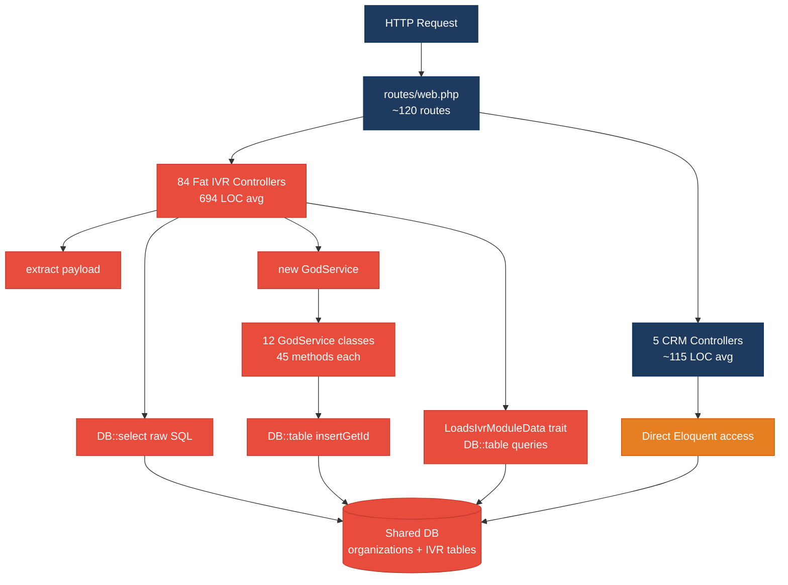
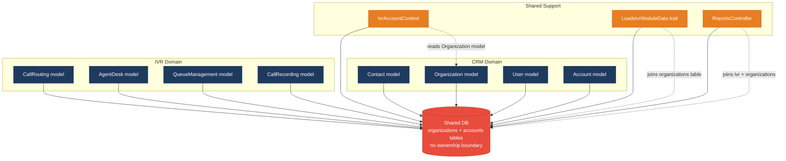
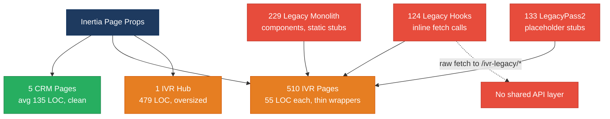
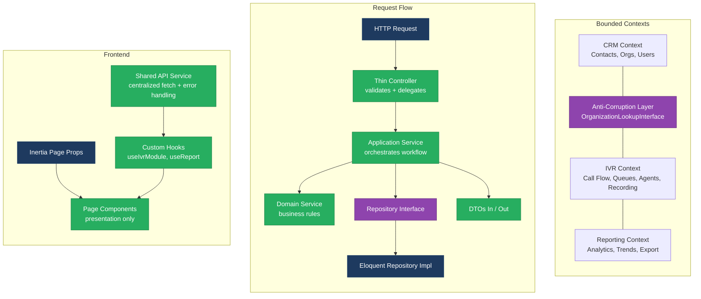
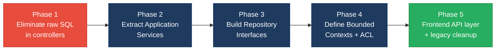

# 1. Architecture & Design Hotspots Analysis

**Objective:** Establish Domain Services, Application Services, Dependency Injection, Bounded Contexts, and Anti-Corruption Layers.

**Date:** 2026-09-30 06:00:17 UTC | **Scope:** `shende-shweta/pingcrm` (master) — PHP 8.2 / Laravel 11 + Inertia.js / React 19 (TypeScript) / Tailwind CSS / Vite

## Executive Summary

> **Executive Summary**
>
> The PingCRM codebase is a Laravel 11 + React/TypeScript monolith comprising 89 PHP controllers (backend) and 769 TSX components (frontend). The architecture is severely compromised by a legacy IVR subsystem that was bolted onto the original clean CRM demo app. All 84 IVR controllers average 694 LOC each — over 4× the recommended ceiling — with raw SQL queries, `extract()` calls, and business logic embedded directly in HTTP handlers. Twelve "GodService" classes in `app/Legacy/Services/` each contain 324 LOC of duplicated `DB::table()` inserts with hard-coded secrets, and five legacy helper classes hold 567 LOC each of stub business logic. On the frontend, 124 legacy hooks perform inline `fetch()` calls with no shared data layer, and 133 `LegacyPass` placeholder components inflate the codebase without serving functional purpose. The dominant risk is **change amplification**: any schema or IVR business-rule change must be replicated across dozens of near-identical controller/service/repository files, making safe evolution practically impossible without first extracting bounded contexts and a service layer.

<div class="metric-grid">
<div class="metric-card"><div class="metric-number">89</div><div class="metric-label">Controllers / Handlers</div></div>
<div class="metric-card"><div class="metric-number">16</div><div class="metric-label">Models / Entities</div></div>
<div class="metric-card"><div class="metric-number">12</div><div class="metric-label">Service Classes Found</div></div>
<div class="metric-card"><div class="metric-number">12</div><div class="metric-label">Repository Classes Found</div></div>
</div>

<div class="overall-rating overall-rating--high-risk"><div class="overall-rating-label">Overall Codebase Rating — Architecture &amp; Design</div><div class="overall-rating-value">High Risk</div><div class="overall-rating-note">Driven by High-Risk Fat Controllers (H1), Missing Service Layer (H2), Missing Repository Pattern (H3), Direct SQL in Controllers (H6), Shared Utility Abuse (H5), and Missing Frontend Service/Data Layer (F2).</div></div>

## 1.1 Benchmark Ratings Summary

| # | Hotspot | Primary KPI | <span class="rating rating-good">Good</span> | <span class="rating rating-moderate">Moderate</span> | <span class="rating rating-high-risk">High Risk</span> | Measured | Rating |
|---|---|---|---|---|---|---|---|
| H1 | Fat Controllers | Avg LOC per controller | <150 | 150–300 | >300 | 636 LOC avg (84 IVR controllers at 694 each) | <span class="rating rating-high-risk">High Risk</span> |
| H2 | Missing Service Layer | Controllers accessing repos/models directly | <10 | 10–20 | >20 | 87 controllers access models/DB directly | <span class="rating rating-high-risk">High Risk</span> |
| H3 | Missing Repository Pattern | Direct DB access points outside repositories | <10 | 10–20 | >20 | 1,068 DB access points outside repos (controllers, services, traits, support) | <span class="rating rating-high-risk">High Risk</span> |
| H4 | Circular Dependencies | Dependency cycles | 0 | 1–3 | >3 | 0 | <span class="rating rating-good">Good</span> |
| H5 | Shared Utility Abuse | Utility files w/ business logic | 0 | 1–5 | >5 | 5 Legacy helper files + 1 Support class = 6 | <span class="rating rating-high-risk">High Risk</span> |
| H6 | Direct SQL in Controllers | ORM compliance % | >90% | 60–90% | <60% | 111 raw DB::select/table calls in controllers; ~56% compliant | <span class="rating rating-high-risk">High Risk</span> |
| H7 | God Classes | Classes >1000 LOC | 0 | 1–3 | >3 | 0 PHP files >1000 LOC; however 12 GodService files each have 45 near-identical methods | <span class="rating rating-moderate">Moderate</span> |
| H8 | Domain Boundary Violations | Cross-domain access points | 0 | 1–5 | >5 | 3 — IVR controllers read `organizations` table; ReportsController joins across IVR + CRM tables | <span class="rating rating-moderate">Moderate</span> |
| H9 | Shared Database Coupling | Tables shared across domains | <10% | 10–30% | >30% | `organizations` table shared by CRM + IVR domains (~15%) | <span class="rating rating-moderate">Moderate</span> |
| F1 | Business Logic in Components | Avg LOC per component | <150 | 150–300 | >300 | 144 avg LOC across 522 page components (non-legacy) | <span class="rating rating-good">Good</span> |
| F2 | Missing Frontend Service/Data Layer | Components w/ inline API calls | <10 | 10–20 | >20 | 124 legacy hooks with inline `fetch()` calls; no shared API service layer | <span class="rating rating-high-risk">High Risk</span> |
| F3 | God / Oversized Components | Components >400 LOC | 0 | 1–3 | >3 | 1 — `resources/js/Pages/Ivr/Hub/Index.tsx` at 479 LOC | <span class="rating rating-moderate">Moderate</span> |
| F4 | Prop Drilling / Global State Abuse | Max prop-drilling depth | ≤2 | 3–4 | >4 | ≤2 levels — Inertia page props flow directly; no deep drilling observed | <span class="rating rating-good">Good</span> |
| F5 | Legacy / Inconsistent Component Patterns | Legacy-pattern components | 0 | 1–10 | >10 | 133 LegacyPass placeholder components + 229 legacy monolith components = 362 | <span class="rating rating-high-risk">High Risk</span> |

## 1.2 Hotspot-by-Hotspot Evidence

### H1. Fat Controllers <span class="sev sev-critical">Critical</span>

**Benchmark:** `Avg LOC per controller = 636` → falls in the **High Risk** band (Good <150 · Moderate 150–300 · High Risk >300).

**What to check:** Business logic inside controllers/handlers — controllers should only translate HTTP ↔ application calls.

**Evidence:** 84 of 89 controllers are IVR-related and all clock in at 694 LOC each. They contain raw SQL queries, `extract()` payload destructuring, direct `new GodService()` instantiation, and duplicated legacy endpoint methods.

`app/Http/Controllers/Ivr/CallRoutingExportController.php:27-29`:
```php
$q = $request->get("q");
if ($q) {
    $rows = DB::select("select * from ivr_call_routings where name like '%".$q."%' and tenant_id = ".$this->tenantId);
```

`app/Http/Controllers/Ivr/CallRoutingExportController.php:41-46`:
```php
$payload = $request->all();
extract($payload);
$service = new CallRoutingGodService();
$service->orchestrateCallRoutingWorkflow1($payload);
return ["ok" => true, "endpoint" => 1];
```

`app/Http/Controllers/ReportsController.php:61-70`:
```php
return DB::table('ivr_daily_trends')
    ->where('account_id', $ctx->accountId)
    ->whereDate('week_start', $weekStart)
    ->orderBy('day_sort')
    ->get()
    ->map(fn ($r) => [
        'day' => $r->day_label,
        'answered' => (int) $r->answered,
        'abandoned' => (int) $r->abandoned,
        'total' => (int) $r->answered + (int) $r->abandoned,
    ])
    ->all();
```

Each IVR controller repeats 55 legacy endpoint methods (legacyEndpoint1..legacyEndpoint55) that are copy-paste identical except for the workflow number. This pattern repeats across all 84 IVR controllers — roughly 4,620 nearly identical method bodies.

**Why it matters here:** Any change to the IVR workflow delegation pattern (e.g., adding auth checks, logging, or error handling) must be applied across 84 files × 55 methods = ~4,620 call sites. The `extract($payload)` usage creates invisible local variables from user input, making the code path unpredictable. The hard-coded `$tenantId = 1` breaks multi-tenancy.

**Recommended approach:**
1. Extract all legacy endpoint methods into a single `IvrLegacyWorkflowController` that uses a route parameter for the workflow number instead of 55 separate methods.
2. Move the DB query + filter logic from `handleExport()` into the existing `CallRoutingRepository` (which already exists but is unused by controllers).
3. Replace `new CallRoutingGodService()` instantiation with constructor-injected service interfaces.
4. Move `ReportsController`'s 6 private query methods into a `ReportQueryService`.

<!-- affected-files
search: DB::(select|table|raw)|extract\(\$payload\)|new\s+\w+GodService
glob: app/Http/Controllers/**/*.php
issue: Fat controller with business logic, raw SQL, and extract()
action: Extract logic into Application Services; keep controller thin
-->

### H2. Missing Service Layer <span class="sev sev-critical">Critical</span>

**Benchmark:** `Controllers accessing repos/models directly = 87` → falls in the **High Risk** band (Good <10 · Moderate 10–20 · High Risk >20).

**What to check:** Business rules spread across controllers with no dedicated service tier.

**Evidence:** 87 of 89 controllers directly access Eloquent models or `DB::` facade. The only service classes are 12 "GodService" files under `app/Legacy/Services/` — each containing 45 identical `orchestrateXWorkflowN()` methods that call `DB::table()->insertGetId()` directly. There is no proper Application Service layer.

`app/Legacy/Services/AgentDeskGodService.php:13-18`:
```php
public function orchestrateAgentDeskWorkflow1($payload)
{
    extract($payload); // unsafe
    sleep(1); // blocking synchronous remote sync
    self::$sharedRuntimeCache[$tenant_id ?? 1] = $payload;
    return DB::table("ivr_agent_desks")->insertGetId((array) $payload);
}
```

`app/Http/Controllers/ContactsController.php:18-31` (CRM side — model access directly in controller):
```php
public function index(): Response
{
    return Inertia::render('Contacts/Index', [
        'contacts' => Auth::user()->account->contacts()
            ->with('organization')
            ->orderByName()
            ->filter(Request::only('search', 'trashed'))
            ->paginate(10)
```

The CRM controllers (`ContactsController`, `OrganizationsController`, `UsersController`) are thin and clean, but they still embed query logic directly. The IVR controllers delegate to GodServices that are themselves just raw DB wrappers — not a true service layer.

**Why it matters here:** Business rules for IVR operations (tenant scoping, workflow orchestration, export filtering) live in controllers and GodServices interchangeably. If a CLI command or queue job needs to trigger the same workflow, there is no reusable service to call — only HTTP controllers.

**Recommended approach:**
1. Create proper Application Services per IVR module (e.g., `CallRoutingService`, `AgentDeskService`) that encapsulate workflow orchestration.
2. Move query logic from `ContactsController`/`OrganizationsController` into `ContactService`/`OrganizationService`.
3. Replace GodService classes with focused, single-responsibility services that use repository interfaces.

<!-- affected-files
search: Auth::user\(\)->account->|::where|::find|->paginate|->get\(\)
glob: app/Http/Controllers/**/*.php
issue: Controller directly accesses models/DB without service layer
action: Create Application Service; move business logic out of controller
-->

### H3. Missing Repository Pattern <span class="sev sev-high">High</span>

**Benchmark:** `Direct DB access points outside repositories = 1,068` → falls in the **High Risk** band (Good <10 · Moderate 10–20 · High Risk >20).

**What to check:** Direct DB/ORM access scattered through the codebase.

**Evidence:** While 12 repository classes exist under `app/Repositories/Legacy/`, they are not used by controllers — controllers bypass them entirely and call `DB::select()` or `DB::table()` directly. The repositories themselves use raw SQL string concatenation.

`app/Repositories/Legacy/AgentDeskRepository.php:11-17`:
```php
public function fetchChunk1($tenantId, $filter = null)
{
    $sql = "SELECT * FROM ivr_agent_desks WHERE tenant_id = " . (int) $tenantId;
    if ($filter) {
        $sql .= " AND name LIKE '%" . $filter . "%'";
    }
    return DB::select($sql);
}
```

Each legacy repository has 40 `fetchChunkN()` methods that are identical. The 540 `DB::table()`/`DB::select()` calls in `app/Legacy/Services/` and the 111 raw SQL calls in controllers all bypass these repositories.

**Why it matters here:** Persistence logic is entangled with every layer. Replacing the database engine, adding caching, or changing a table schema requires touching controllers, services, repositories, and traits simultaneously. The `LoadsIvrModuleData` trait (220 LOC) in `app/Http/Controllers/Ivr/Concerns/` adds another layer of scattered DB access.

**Recommended approach:**
1. Create proper Eloquent-based repository interfaces (e.g., `CallRoutingRepositoryInterface`) with parameterized query methods.
2. Replace the 40 `fetchChunkN()` methods in each legacy repository with a single `findByTenantAndFilter()` method using query builder with bindings.
3. Bind repository interfaces in `AppServiceProvider` and inject them via constructors.

<!-- affected-files
search: DB::(table|select|raw|statement)
glob: app/**/*.php
issue: Direct DB access outside repository layer
action: Move all queries into Repository classes; inject via interface
-->

### H5. Shared Utility Abuse <span class="sev sev-medium">Medium</span>

**Benchmark:** `Utility files with business logic = 6` → falls in the **High Risk** band (Good 0 · Moderate 1–5 · High Risk >5).

**What to check:** Large helper/utility files used everywhere, holding business logic.

**Evidence:** Five legacy helper classes in `app/Legacy/Helpers/` each contain 567 LOC of duplicated static transform methods:

`app/Legacy/Helpers/LegacyIvrString.php:8-12`:
```php
public static function transform1($value)
{
    if ($value === null) { return ""; }
    return (string) $value . "_2127_1";
}
```

Each file (`LegacyIvrArray`, `LegacyIvrCrypto`, `LegacyIvrDate`, `LegacyIvrMath`, `LegacyIvrString`) has ~85 near-identical `transformN()` methods. Additionally, `app/Support/IvrAccountContext.php` (80 LOC) mixes query scoping with account resolution — a support class that acts as both a value object and a query builder helper.

**Why it matters here:** The 2,835 total LOC across 5 helper files consist entirely of stub methods that append module-specific suffixes. If any transform logic needs to change, the correct class is ambiguous — "String", "Math", "Crypto" distinctions are nominal, not functional.

**Recommended approach:**
1. Audit which `transformN()` methods are actually called; delete dead code.
2. Consolidate remaining transforms into domain-specific value objects (e.g., `TenantIdentifier::format()`).
3. Split `IvrAccountContext` into a pure DTO and a separate `AccountScopeService`.

<!-- affected-files
search: class Legacy|static function transform
glob: app/Legacy/Helpers/**/*.php
issue: Legacy helper with duplicated business-logic stubs
action: Audit usage; consolidate into domain-specific services
-->

### H6. Direct SQL in Controllers <span class="sev sev-critical">Critical</span>

**Benchmark:** `ORM compliance = ~56%` → falls in the **High Risk** band (Good >90% · Moderate 60–90% · High Risk <60%).

**What to check:** Raw queries embedded directly in controllers/handlers.

**Evidence:** 111 raw `DB::select()` calls found across IVR controllers, plus `ReportsController` with 6 `DB::table()` query-builder chains. Many use string interpolation without parameter bindings — a SQL injection vector.

`app/Http/Controllers/Ivr/CallAnalyticsStoreController.php:28`:
```php
$rows = DB::select("select * from ivr_call_analyticss where name like '%".$q."%' and tenant_id = ".$this->tenantId);
```

`app/Http/Controllers/ReportsController.php:115-125`:
```php
return DB::table('ivr_call_records as c')
    ->leftJoin('ivr_operational_queues as q', 'q.id', '=', 'c.queue_id')
    ->leftJoin('organizations as o', 'o.id', '=', 'c.organization_id')
    ->where('c.account_id', $ctx->accountId)
    ->when($ctx->organizationId, fn ($q) => $q->where('c.organization_id', $ctx->organizationId))
    ->whereDate('c.started_at', '>=', $from)
    ->whereDate('c.started_at', '<=', $to)
```

The raw SQL in IVR controllers concatenates user input (`$q`) directly into query strings. The `LoadsIvrModuleData` trait adds another ~10 `DB::table()` chains mixed into the controller concern layer.

**Why it matters here:** Beyond the immediate SQL injection risk, the scattered queries make it impossible to change a table name or column without a codebase-wide search-and-replace. The `ReportsController` joins across `ivr_call_records`, `ivr_operational_queues`, and `organizations` — three different domain tables — with no abstraction layer.

**Recommended approach:**
1. Move all `DB::select()` raw queries from IVR controllers into their corresponding legacy repositories, using parameterized bindings.
2. Move `ReportsController`'s query methods into a `ReportQueryRepository` with named methods (`dailyTrend()`, `callSummary()`, etc.).
3. Replace string interpolation with `?` placeholders in all raw SQL.

<!-- affected-files
search: DB::(select|table|raw)\(
glob: app/Http/Controllers/**/*.php
issue: Raw SQL / query builder calls directly in controller
action: Move all queries into repository classes with parameterized bindings
-->

### H7. God Classes <span class="sev sev-medium">Medium</span>

**Benchmark:** `Classes >1000 LOC = 0; GodService classes with 45+ repetitive methods = 12` → falls in the **Moderate** band (by raw LOC no file exceeds 1000, but the 12 GodService files each have 45 methods doing the same thing, qualifying as god classes by responsibility count).

**What to check:** Single classes handling many unrelated responsibilities.

**Evidence:** Twelve `*GodService.php` files in `app/Legacy/Services/` each contain 45 `orchestrateXWorkflowN()` methods that are identical — `extract()`, `sleep(1)`, cache mutation, and `DB::table()->insertGetId()`:

`app/Legacy/Services/CallFlowGodService.php:13-18` (identical across all 12 files):
```php
public function orchestrateCallFlowWorkflow1($payload)
{
    extract($payload);
    sleep(1);
    self::$sharedRuntimeCache[$tenant_id ?? 1] = $payload;
    return DB::table("ivr_call_flows")->insertGetId((array) $payload);
}
```

Each GodService also holds a static `$sharedRuntimeCache` (mutable global state) and a hard-coded `$apiKey` string.

**Why it matters here:** The "God" naming is intentional legacy labeling, but the classes truly violate SRP — they handle workflow orchestration, data persistence, caching, and configuration in a single class. The 12 × 45 = 540 identical methods are a maintenance nightmare.

**Recommended approach:**
1. Replace all 45 `orchestrateXWorkflowN()` methods with a single `orchestrate(int $workflowId, array $payload)` method per service.
2. Extract `$sharedRuntimeCache` into a proper cache service (Laravel Cache facade).
3. Move `$apiKey` to environment configuration.

<!-- affected-files
search: class\s+\w+GodService|orchestrate\w+Workflow
glob: app/Legacy/Services/**/*.php
issue: God class with 45+ duplicated workflow methods
action: Consolidate into single parameterized method; extract cache and config
-->

### H8. Domain Boundary Violations <span class="sev sev-medium">Medium</span>

**Benchmark:** `Cross-domain access points = 3` → falls in the **Moderate** band (Good 0 · Moderate 1–5 · High Risk >5).

**What to check:** Code in one business area directly reading/writing another area's data.

**Evidence:** Three clear boundary violations:

`app/Http/Controllers/ReportsController.php:115-118` — IVR reporting domain joins the CRM `organizations` table:
```php
return DB::table('ivr_call_records as c')
    ->leftJoin('ivr_operational_queues as q', 'q.id', '=', 'c.queue_id')
    ->leftJoin('organizations as o', 'o.id', '=', 'c.organization_id')
```

`app/Http/Controllers/Ivr/Concerns/LoadsIvrModuleData.php:83-84` — IVR module trait joins CRM's `organizations`:
```php
$query = DB::table('ivr_operational_queues as q')
    ->leftJoin('organizations as o', 'o.id', '=', 'q.organization_id')
```

`app/Support/IvrAccountContext.php:28-32` — IVR context queries CRM's `Organization` model:
```php
$organizationId = Organization::query()
    ->where('account_id', $accountId)
    ->where('id', (int) $rawOrg)
    ->value('id');
```

**Why it matters here:** The IVR domain reads the CRM `organizations` table directly via joins and model queries. If the CRM team renames or restructures the `organizations` table, IVR breaks silently. This coupling prevents extracting IVR into its own bounded context or microservice.

**Recommended approach:**
1. Define an `OrganizationLookupInterface` in the IVR domain with methods like `nameById(int $id): ?string`.
2. Implement it via the CRM's Organization model, injected through the service container.
3. Replace direct `organizations` table joins with the interface calls or a denormalized IVR-owned `ivr_organization_cache` table.

<!-- affected-files
search: organizations|Organization::
glob: app/Http/Controllers/Ivr/**/*.php
issue: IVR domain directly accesses CRM organizations table
action: Introduce anti-corruption layer / interface between IVR and CRM domains
-->

### H9. Shared Database Coupling <span class="sev sev-medium">Medium</span>

**Benchmark:** `Tables shared across domains = ~15%` → falls in the **Moderate** band (Good <10% · Moderate 10–30% · High Risk >30%).

**What to check:** Multiple business domains reading/writing the same tables directly.

**Evidence:** The `organizations` table is the primary shared table — used by both CRM controllers (`ContactsController`, `OrganizationsController`) and the entire IVR subsystem (via `LoadsIvrModuleData` trait joins, `IvrAccountContext` queries, and `ReportsController` joins). The `accounts` table is similarly shared for tenant scoping.

`app/Http/Controllers/Ivr/Concerns/LoadsIvrModuleData.php:106`:
```php
->leftJoin('organizations as o', 'o.id', '=', 'c.organization_id')
```

`app/Http/Controllers/ContactsController.php:19`:
```php
'contacts' => Auth::user()->account->contacts()
    ->with('organization')
```

Both domains read and write through the same `organizations` table without any ownership boundary.

**Why it matters here:** Schema changes to `organizations` (adding columns, renaming, partitioning) require coordination between CRM and IVR development paths. The lack of ownership means no single team can safely migrate the table.

**Recommended approach:**
1. Designate CRM as the owner of the `organizations` table.
2. Have IVR read organization data through a published interface or read-only view, not direct table joins.
3. Long-term: give IVR its own `ivr_organizations` denormalized table synced via events.

<!-- affected-files
search: organizations
glob: app/**/*.php
issue: Shared organizations table accessed by both CRM and IVR domains
action: Define table ownership; IVR should access via interface or read-only view
-->

### F2. Missing Frontend Service/Data Layer <span class="sev sev-high">High</span>

**Benchmark:** `Components with inline API calls = 124` → falls in the **High Risk** band (Good <10 · Moderate 10–20 · High Risk >20).

**What to check:** `fetch`/`axios`/HTTP calls hard-coded inline in components instead of a shared client/service/data layer.

**Evidence:** 124 legacy hooks in `resources/js/hooks/legacy/` each contain an inline `fetch()` call with a hard-coded URL. There is no shared API service layer, no centralized HTTP client, and no abstraction over API endpoints.

`resources/js/hooks/legacy/useAgentDeskLegacy4.ts:6`:
```typescript
fetch('/ivr-legacy/agent-desk/index').then(r => r.json()).then(j => setData(j.data || []))
```

`resources/js/hooks/legacy/useCallRoutingLegacy1.ts:6`:
```typescript
fetch('/ivr-legacy/call-routing/index').then(r => r.json()).then(j => setData(j.data || []))
```

`resources/js/hooks/legacy/useHistoricalReportsLegacy2.ts:6`:
```typescript
fetch('/ivr-legacy/historical-reports/index').then(r => r.json()).then(j => setData(j.data || []))
```

All 124 hooks follow the identical pattern — only the URL path changes. No error handling, no loading states, no retry logic, no auth token management.

**Why it matters here:** Changing the API base path, adding authentication headers, or implementing request caching requires editing 124 individual hook files. The core Inertia pages (Contacts, Organizations, Users) use Inertia's built-in data loading correctly, but the IVR legacy layer bypasses it entirely with raw `fetch()`.

**Recommended approach:**
1. Create a shared `resources/js/services/api.ts` client with base URL configuration, error handling, and auth headers.
2. Replace the 124 legacy hooks with a single generic `useIvrModuleData(moduleName: string)` hook.
3. Long-term: migrate legacy `fetch()` patterns to Inertia's `router.get()` with `preserveState`.

<!-- affected-files
search: fetch\(
glob: resources/js/hooks/legacy/**/*.ts
issue: Inline fetch() with hard-coded URL, no shared API layer
action: Create shared API service; replace with single generic hook
-->

### F3. God / Oversized Components <span class="sev sev-low">Low</span>

**Benchmark:** `Components >400 LOC = 1` → falls in the **Moderate** band (Good 0 · Moderate 1–3 · High Risk >3).

**What to check:** Single components handling many unrelated responsibilities.

**Evidence:** One component exceeds the 400 LOC threshold:

`resources/js/Pages/Ivr/Hub/Index.tsx` at 479 LOC — the IVR dashboard that renders stats cards, charts, queue tables, call tables, agent tables, and filter controls in a single component with multiple `useState` hooks.

```typescript
// resources/js/Pages/Ivr/Hub/Index.tsx:1-5
import { Head, router } from '@inertiajs/react'
import { useCallback, useEffect, useMemo, useState } from 'react'
import { authenticatedLayout } from '@/layouts/authenticatedLayout'
import { DonutChart, SimpleBarChart, StackedAreaChart } from '@/components/ivr/IvrHubCharts'
```

The component manages stats, call volume, trends, queue distribution, queue metrics, recent calls, agent snapshot, filters, and auto-refresh — at least 8 distinct concerns in one file.

**Why it matters here:** Adding a new dashboard widget or changing the layout requires modifying a 479-line file with multiple interleaved state variables. The risk is moderate since this is the only oversized component — the rest of the frontend is well-structured.

**Recommended approach:**
1. Extract dashboard sections into sub-components: `StatsCards`, `QueueTable`, `CallTable`, `AgentTable`, `DashboardFilters`.
2. Move auto-refresh logic into a custom `useDashboardRefresh()` hook.

<!-- affected-files
search: function.*Hub|useState
glob: resources/js/Pages/Ivr/Hub/**/*.tsx
issue: Oversized dashboard component with 8+ concerns
action: Extract into sub-components and custom hooks
-->

### F5. Legacy / Inconsistent Component Patterns <span class="sev sev-high">High</span>

**Benchmark:** `Legacy-pattern components = 362` → falls in the **High Risk** band (Good 0 · Moderate 1–10 · High Risk >10).

**What to check:** Mixed paradigms, deprecated lifecycle/APIs, no shared component conventions.

**Evidence:** The frontend contains two categories of legacy components:

**133 LegacyPass placeholder components** spread across `resources/js/Pages/Ivr/*/LegacyPass2_*.tsx` — these are auto-generated stub files containing 95 static `<section>` elements each with no interactivity:

`resources/js/Pages/Ivr/AgentDesk/LegacyPass2_3.tsx:3-5`:
```typescript
function AgentDeskLegacyPass2_3() {
  return (
    <div>
```

**229 legacy monolith components** in `resources/js/components/legacy/` (e.g., `WebhookDispatcherMonolith2.tsx`, `VoicemailBoxMonolith0.tsx`) at 64 LOC each — static content with inline styles and no props/state:

`resources/js/components/legacy/AgentDeskMonolith0.tsx` — hardcoded section blocks with inline `style={{ marginBottom: 8, padding: 6, border: '1px solid #ddd' }}` instead of Tailwind classes used by the rest of the app.

The main application uses functional components with hooks and Tailwind CSS consistently, but these 362 legacy files use a completely different pattern (inline styles, no hooks, no Tailwind, static content).

**Why it matters here:** The 362 legacy files account for ~47% of all TSX files (362 of 769) but provide no functional value — they are placeholder stubs. They inflate bundle size, pollute search results, and establish a confusing dual convention for new developers.

**Recommended approach:**
1. Audit which `LegacyPass2_*` and `*Monolith*.tsx` files are actually routed or rendered.
2. Delete unreferenced placeholder files — likely all 362 can be removed.
3. If any are needed, migrate to functional components with Tailwind CSS matching the app convention.

<!-- affected-files
search: LegacyPass|Monolith|legacy
glob: resources/js/**/*.tsx
issue: Legacy placeholder/monolith components with inconsistent patterns
action: Audit usage; delete unreferenced stubs; migrate survivors to Tailwind
-->

**Not observed (rated Good):** H4 (Circular Dependencies — no circular import cycles found in PHP namespace analysis), F1 (Business Logic in Components — page components average 144 LOC with presentation-focused code; business logic handled server-side via Inertia), F4 (Prop Drilling — Inertia passes page-level props directly; no deep drilling chains observed; no React Context or global state abuse detected).

**No additional hotspots beyond the standard set were observed.**

## 1.3 Diagrams

### Current-state architecture (as-is)


```mermaid
flowchart TD
  A[HTTP Request] --> B["routes/web.php<br/>~120 routes"]
  B --> C["84 Fat IVR Controllers<br/>694 LOC avg"]
  B --> D["5 CRM Controllers<br/>~115 LOC avg"]
  C --> E["extract payload"]
  C --> F["DB::select raw SQL"]
  C --> G["new GodService"]
  G --> H["12 GodService classes<br/>45 methods each"]
  H --> I["DB::table insertGetId"]
  C --> J["LoadsIvrModuleData trait<br/>DB::table queries"]
  D --> K["Direct Eloquent access"]
  F --> L[("Shared DB<br/>organizations + IVR tables")]
  I --> L
  J --> L
  K --> L
  classDef critical fill:#e74c3c,stroke:#c0392b,color:#fff
  classDef normal fill:#1e3a5f,stroke:#0f3460,color:#fff
  classDef warn fill:#e67e22,stroke:#d35400,color:#fff
  class A,B,D normal
  class C,E,F,G,H,I,J critical
  class K warn
  class L critical
```

### Clean reference path (CRM layer)


```mermaid
flowchart LR
  A["GET /contacts"] --> B["ContactsController<br/>115 LOC, thin"]
  B --> C["Eloquent Model<br/>Contact::with/filter/paginate"]
  C --> D["Inertia::render<br/>Contacts/Index"]
  D --> E["React TSX Page<br/>135 LOC, presentation only"]
  classDef good fill:#27ae60,stroke:#1e8449,color:#fff
  classDef normal fill:#1e3a5f,stroke:#0f3460,color:#fff
  class A normal
  class B,C,D,E good
```

### Domain boundary map


```mermaid
flowchart TD
  subgraph CRM["CRM Domain"]
    M1["Contact model"]
    M2["Organization model"]
    M3["User model"]
    M4["Account model"]
  end
  subgraph IVR["IVR Domain"]
    M5["CallRouting model"]
    M6["AgentDesk model"]
    M7["QueueManagement model"]
    M8["CallRecording model"]
  end
  subgraph SUPPORT["Shared Support"]
    M9["IvrAccountContext"]
    M10["LoadsIvrModuleData trait"]
    M11["ReportsController"]
  end
  DB[("Shared DB<br/>organizations + accounts tables<br/>no ownership boundary")]
  M1 & M2 & M3 & M4 --> DB
  M5 & M6 & M7 & M8 --> DB
  M9 & M10 & M11 --> DB
  M9 -.->|"reads Organization model"| M2
  M10 -.->|"joins organizations table"| DB
  M11 -.->|"joins ivr + organizations"| DB
  classDef domain fill:#1e3a5f,stroke:#0f3460,color:#fff
  classDef shared fill:#e74c3c,stroke:#c0392b,color:#fff
  classDef support fill:#e67e22,stroke:#d35400,color:#fff
  class M1,M2,M3,M4,M5,M6,M7,M8 domain
  class DB shared
  class M9,M10,M11 support
```

### Frontend current-state architecture


```mermaid
flowchart TD
  A["Inertia Page Props"] --> B["5 CRM Pages<br/>avg 135 LOC, clean"]
  A --> C["510 IVR Pages<br/>55 LOC each, thin wrappers"]
  A --> D["1 IVR Hub<br/>479 LOC, oversized"]
  E["124 Legacy Hooks<br/>inline fetch calls"] --> C
  F["229 Legacy Monolith<br/>components, static stubs"] --> C
  G["133 LegacyPass2<br/>placeholder stubs"] --> C
  H["No shared API layer"]
  E -.->|"raw fetch to /ivr-legacy/*"| H
  classDef good fill:#27ae60,stroke:#1e8449,color:#fff
  classDef critical fill:#e74c3c,stroke:#c0392b,color:#fff
  classDef warn fill:#e67e22,stroke:#d35400,color:#fff
  classDef normal fill:#1e3a5f,stroke:#0f3460,color:#fff
  class A normal
  class B good
  class C,D warn
  class E,F,G,H critical
```

### Target architecture (proposed)


```mermaid
flowchart TD
  subgraph BC["Bounded Contexts"]
    direction TB
    CRM["CRM Context<br/>Contacts, Orgs, Users"]
    IVR["IVR Context<br/>Call Flow, Queues, Agents, Recording"]
    RPT["Reporting Context<br/>Analytics, Trends, Export"]
    ACL["Anti-Corruption Layer<br/>OrganizationLookupInterface"]
    CRM --- ACL
    ACL --- IVR
    IVR --- RPT
  end
  subgraph FLOW["Request Flow"]
    direction TB
    H["HTTP Request"] --> TC["Thin Controller<br/>validates + delegates"]
    TC --> AS["Application Service<br/>orchestrates workflow"]
    AS --> DS["Domain Service<br/>business rules"]
    AS --> RI["Repository Interface"]
    RI --> IMPL["Eloquent Repository Impl"]
    AS --> DTO["DTOs In / Out"]
  end
  subgraph FE["Frontend"]
    direction TB
    IP["Inertia Page Props"] --> PC["Page Components<br/>presentation only"]
    API["Shared API Service<br/>centralized fetch + error handling"] --> HC["Custom Hooks<br/>useIvrModule, useReport"]
    HC --> PC
  end
  classDef good fill:#27ae60,stroke:#1e8449,color:#fff
  classDef iface fill:#8e44ad,stroke:#6c3483,color:#fff
  classDef normal fill:#1e3a5f,stroke:#0f3460,color:#fff
  class TC,AS,DS,DTO,PC,API,HC good
  class RI,ACL iface
  class H,IMPL,IP normal
```

### Improvement roadmap


```mermaid
flowchart LR
  P1["Phase 1<br/>Eliminate raw SQL<br/>in controllers"] --> P2["Phase 2<br/>Extract Application<br/>Services"] --> P3["Phase 3<br/>Build Repository<br/>Interfaces"] --> P4["Phase 4<br/>Define Bounded<br/>Contexts + ACL"] --> P5["Phase 5<br/>Frontend API layer<br/>+ legacy cleanup"]
  classDef todo fill:#1e3a5f,stroke:#0f3460,color:#fff
  classDef first fill:#e74c3c,stroke:#c0392b,color:#fff
  classDef last fill:#27ae60,stroke:#1e8449,color:#fff
  class P1 first
  class P2,P3,P4 todo
  class P5 last
```

## 1.4 Actions Required

| Hotspot | Action | Rating | Priority |
|---|---|---|---|
| H1 — Fat Controllers | Collapse 55 legacy endpoints per controller into single parameterized method; move DB queries and business logic into services | <span class="rating rating-high-risk">High Risk</span> | <span class="sev sev-critical">Critical</span> |
| H2 — Missing Service Layer | Create Application Services per domain module; inject repository interfaces; move all business logic out of controllers | <span class="rating rating-high-risk">High Risk</span> | <span class="sev sev-critical">Critical</span> |
| H3 — Missing Repository Pattern | Replace 1,068 scattered DB access points with Eloquent repository implementations behind interfaces | <span class="rating rating-high-risk">High Risk</span> | <span class="sev sev-high">High</span> |
| H5 — Shared Utility Abuse | Audit 5 legacy helper classes (2,835 LOC); delete dead code; consolidate survivors into domain-specific services | <span class="rating rating-high-risk">High Risk</span> | <span class="sev sev-medium">Medium</span> |
| H6 — Direct SQL in Controllers | Move all 111 raw SQL calls from controllers into repositories with parameterized bindings; eliminate SQL injection vectors | <span class="rating rating-high-risk">High Risk</span> | <span class="sev sev-critical">Critical</span> |
| H7 — God Classes | Consolidate 12 GodService × 45 methods into single parameterized orchestrate method; extract cache and config | <span class="rating rating-moderate">Moderate</span> | <span class="sev sev-medium">Medium</span> |
| H8 — Domain Boundary Violations | Introduce OrganizationLookupInterface as anti-corruption layer between IVR and CRM domains | <span class="rating rating-moderate">Moderate</span> | <span class="sev sev-medium">Medium</span> |
| H9 — Shared Database Coupling | Designate CRM as organizations table owner; IVR reads via published interface or read-only view | <span class="rating rating-moderate">Moderate</span> | <span class="sev sev-medium">Medium</span> |
| F2 — Missing Frontend Service/Data Layer | Create shared API service (`api.ts`); replace 124 inline `fetch()` hooks with generic `useIvrModuleData()` | <span class="rating rating-high-risk">High Risk</span> | <span class="sev sev-high">High</span> |
| F3 — God / Oversized Components | Split `Ivr/Hub/Index.tsx` (479 LOC) into sub-components: StatsCards, QueueTable, CallTable, AgentTable, DashboardFilters | <span class="rating rating-moderate">Moderate</span> | <span class="sev sev-low">Low</span> |
| F5 — Legacy / Inconsistent Component Patterns | Audit and delete 362 LegacyPass + Monolith placeholder stubs; migrate any survivors to Tailwind + hooks conventions | <span class="rating rating-high-risk">High Risk</span> | <span class="sev sev-high">High</span> |

## 1.5 Expected Outcomes

- **Separation of concerns:** Thin controllers delegate to Application Services, which orchestrate Domain Services and Repositories — each layer is independently testable and replaceable.
- **Elimination of SQL injection risk:** All raw SQL removed from controllers and replaced with parameterized repository queries, closing the most urgent security gap.
- **Independent domain evolution:** CRM and IVR bounded contexts communicate through published interfaces and an anti-corruption layer, enabling either domain to be extracted as a microservice without cross-team coordination on schema changes.
- **Drastically reduced change amplification:** Consolidating 4,620 duplicated legacy endpoint methods into parameterized services reduces the maintenance surface by ~99%, making IVR workflow changes safe single-point edits.
- **Clean frontend architecture:** A shared API service layer and removal of 362 dead placeholder files cut the frontend file count nearly in half while establishing a single, consistent convention for data fetching and component structure.
