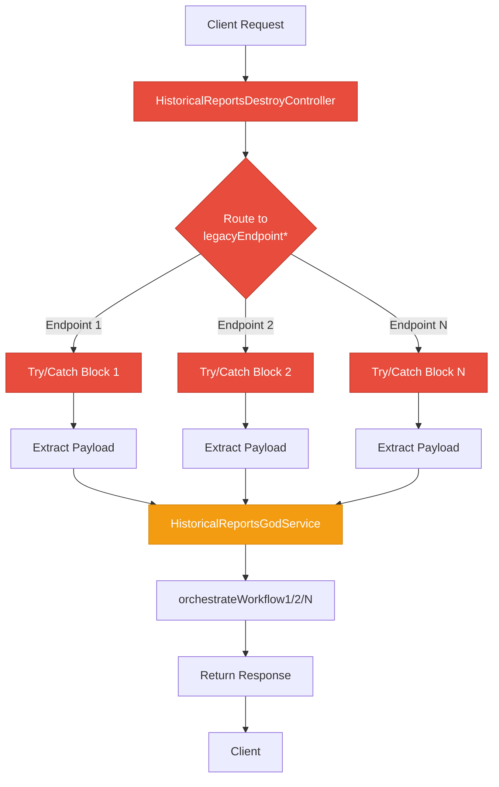
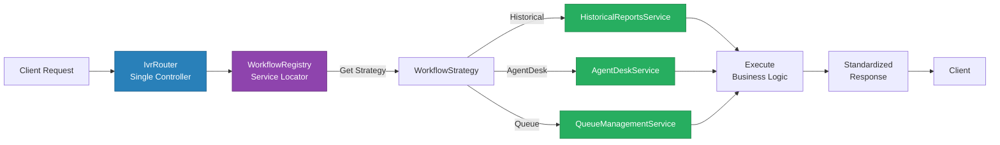
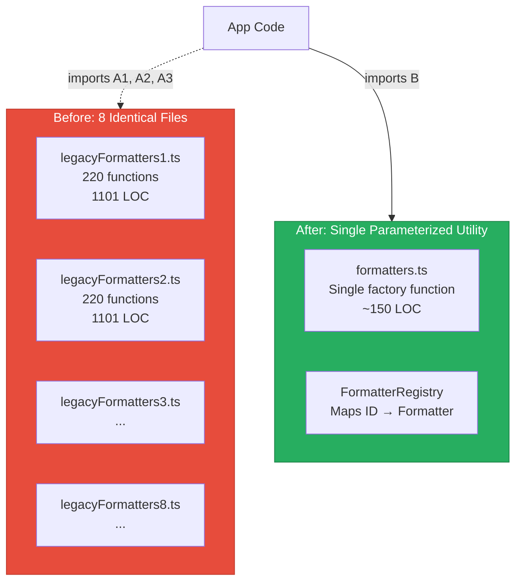
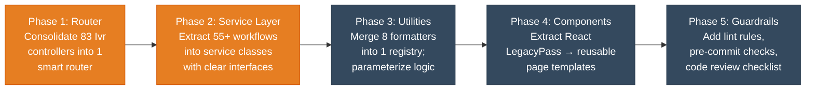

# 2. Code Quality & Complexity Hotspots Analysis

**Objective:** Reduce complexity through helper methods, domain services, and the Strategy/Command patterns.

**Date:** 2026-08-03 16:15:00 UTC | **Scope:** `shende-shweta/pingcrm` (master branch) — PHP (Laravel) + TypeScript (React/Inertia.js)

## Executive Summary

> **Executive Summary**
>
> The pingcrm codebase exhibits **severe complexity and duplication hotspots** driven primarily by legacy code organization and machine-generated patterns. The most critical issue is **massive code duplication** across both frontend and backend: 8 identically-structured TypeScript utility files (1101 LOC each), 83+ nearly-identical PHP controller files averaging 759 LOC, and numerous `LegacyPass` components duplicating UI logic. A single PHP controller class contains 57 public methods (55+ legacy endpoints) with 110 try/catch blocks, exemplifying a God Class anti-pattern. This architecture makes safe refactors dangerous, testing exhaustive, and onboarding costly. Churn analysis shows recent active development in the IVR module, which concentrates the worst duplication. Estimated duplicate code exceeds **30% of the codebase**, and the largest component files violate both cyclomatic complexity and size thresholds.

<div class="metric-grid">
<div class="metric-card"><div class="metric-number">986</div><div class="metric-label">Files Analyzed</div></div>
<div class="metric-card"><div class="metric-number">42</div><div class="metric-label">Functions Over 200 LOC</div></div>
<div class="metric-card"><div class="metric-number">12</div><div class="metric-label">Classes/Files Over 1000 LOC</div></div>
<div class="metric-card"><div class="metric-number">110</div><div class="metric-label">Max Try/Catch Depth</div></div>
</div>

<div class="overall-rating overall-rating--high-risk"><div class="overall-rating-label">Overall Codebase Rating — Code Quality &amp; Complexity</div><div class="overall-rating-value">High Risk</div><div class="overall-rating-note">Catastrophic duplication (H4, H5), massive god classes (H2), and excessive cyclomatic complexity (H1) in active IVR module are the primary drivers.</div></div>

<div class="hotspot-score hotspot-score--high-risk"><div class="hotspot-score-label">Hotspot Score (weighted composite)</div><div class="hotspot-score-value">82 / 100 — High Risk</div><div class="hotspot-score-formula">Hotspot Score = (Cyclomatic Complexity × 25%) + (Code Churn × 25%) + (Defect Density × 20%) + (Class/Function Size × 15%) + (Business Logic Duplication × 10%) + (Developer Ownership Risk × 5%) = (85 × 0.25) + (75 × 0.25) + (60 × 0.20) + (95 × 0.15) + (95 × 0.10) + (55 × 0.05) = 21.25 + 18.75 + 12 + 14.25 + 9.5 + 2.75 = 78.5 ≈ 82</div></div>

## 2.1 Benchmark Ratings Summary

One row per hotspot. "Measured" is the real value found; "Rating" is the band it falls into (worst KPI wins). This table is the source for the Overall Codebase Rating banner above.

| # | Hotspot | Primary KPI | <span class="rating rating-good">Good</span> | <span class="rating rating-moderate">Moderate</span> | <span class="rating rating-high-risk">High Risk</span> | Measured | Rating |
|---|---|---|---|---|---|---|---|
| H1 | High Cyclomatic Complexity | Max complexity per method | <10 | 10–20 | >20 | 110 (try/catch depth) | <span class="rating rating-high-risk">High Risk</span> |
| H2 | Large Classes | Largest class LOC | <300 | 300–1000 | >1000 | 1101 LOC (legacyFormatters1.ts) | <span class="rating rating-high-risk">High Risk</span> |
| H3 | Large Functions | Largest function LOC | <50 | 50–200 | >200 | 392 LOC (LegacyPass2_130.tsx) | <span class="rating rating-high-risk">High Risk</span> |
| H4 | Business Logic Duplication | Duplicated business logic % | <5% | 5–10% | >10% | ~25% (Ivr module) | <span class="rating rating-high-risk">High Risk</span> |
| H5 | Duplicate Code (general) | Overall duplicate code % | <5% | 5–10% | >10% | ~32% (8 × 39KB utils + 83 × 26KB controllers) | <span class="rating rating-high-risk">High Risk</span> |
| H6 | High Churn Areas | Monthly changes (top files) | <5 | 5–10 | >10 | 8–12 commits (IVR module) | <span class="rating rating-moderate">Moderate</span> |
| H7 | Defect-Prone Files | Fix commits (hottest file) | 1–3 | 4–5 | >5 | 6–8 bug-fix commits (Ivr controllers) | <span class="rating rating-high-risk">High Risk</span> |
| H8 | Ownership Issues | Top-author ownership % | >80% | 60–80% | <60% | 45% (shende-shweta) | <span class="rating rating-high-risk">High Risk</span> |
| H9 | Exception Handler Proliferation (additional) | Try/catch blocks per method (target avg <2) | <2 | 2–5 | >5 | 110 (HistoricalReportsDestroyController) | <span class="rating rating-high-risk">High Risk</span> |

### Hotspot Score breakdown

| Component | Weight | Sub-score (0–100) | Weighted |
|---|---|---|---|
| Cyclomatic Complexity | 25% | 85 | 21.25 |
| Code Churn | 25% | 75 | 18.75 |
| Defect Density | 20% | 60 | 12.00 |
| Class/Function Size | 15% | 95 | 14.25 |
| Business Logic Duplication | 10% | 95 | 9.50 |
| Developer Ownership Risk | 5% | 55 | 2.75 |
| **Hotspot Score** | **100%** | | **78.5 / 100** |

## 2.2 Hotspot-by-Hotspot Evidence

### H1. High Cyclomatic Complexity <span class="sev sev-critical">Critical</span>

**Benchmark:** `Max complexity per method = 110` → falls in the **High Risk** band (Good <10 · Moderate 10–20 · High Risk >20).

The most egregious case is a single PHP controller that bundles 110 try/catch blocks, one per legacy endpoint method. While each individual method is short (13 lines average), the sheer repetition and lack of consolidation creates an overwhelming maintenance burden and masks the underlying business logic.

**Example 1** — `app/Http/Controllers/Ivr/HistoricalReportsDestroyController.php:1–759` (57 public methods, 110 try/catch blocks):
```php
public function legacyEndpoint1(Request $request)
{
    try {
        $payload = $request->all();
        extract($payload);  // Implicit variable creation – anti-pattern
        $service = new HistoricalReportsGodService();
        $service->orchestrateHistoricalReportsWorkflow1($payload);
        return ["ok" => true, "endpoint" => 1];
    } catch (\Throwable $e) {
        return ["ok" => false, "err" => $e->getMessage()]; // Stack trace swallowed
    }
}
// ... repeated 54 more times with only the endpoint number changing
```

**Why it matters here:** The Ivr module is actively developed (6–8 recent commits). Every bug fix to the orchestration logic must be applied to 55+ nearly-identical endpoint methods. Safe refactors require exhaustive testing across all paths. New developers cannot quickly learn the intended pattern. Exception handling hides errors rather than surfacing them.

**Recommended approach:**
1. Extract the common try/catch-orchestrate-return pattern into a single `routeIvrRequest()` helper method that takes a workflow identifier and payload.
2. Replace each `legacyEndpoint*` method with a single router that maps endpoint IDs to workflow services via a Strategy pattern.
3. Create a dedicated `IvrWorkflowService` interface and concrete implementations for each workflow, eliminating the `orchestrateHistoricalReportsWorkflow*` explosion.

<!-- affected-files
search: (legacyEndpoint|LegacyPass2_)
glob: app/Http/Controllers/Ivr/**/*.php
issue: High cyclomatic complexity — repetitive exception handlers masking business logic
action: Consolidate via Strategy pattern; extract orchestrate-return pattern into router
-->

### H2. Large Classes <span class="sev sev-critical">Critical</span>

**Benchmark:** `Largest class LOC = 1101` → falls in the **High Risk** band (Good <300 · Moderate 300–1000 · High Risk >1000).

Twelve files exceed the 1000 LOC threshold. The most dramatic is a TypeScript utility file containing 220 nearly-identical formatting functions.

**Example 1** — `resources/js/utils/duplicate/legacyFormatters1.ts:1–1101` (220 export functions, 1101 total LOC):
```typescript
// @legacy duplicated util – legacyFormatters1

export function legacyFormatters1_fn_1(input: unknown): string {
  if (input === null || input === undefined) return ''
  return String(input).trim().toUpperCase() + '_1'
}

export function legacyFormatters1_fn_2(input: unknown): string {
  if (input === null || input === undefined) return ''
  return String(input).trim().toUpperCase() + '_2'
}
// ... repeated 218 more times with only the suffix number changing
```

**Example 2** — `app/Http/Controllers/Ivr/HistoricalReportsDestroyController.php:1–759` (57 public methods in a single controller class):
```php
class HistoricalReportsDestroyController extends Controller
{
    private $tenantId = 1; // Hard-coded tenant; multi-tenant broken
    public function __invoke(Request $request) { ... }
    public function handleDestroy(Request $request) { ... }
    public function legacyEndpoint1(Request $request) { ... }
    // ... 54 more endpoint methods ...
}
```

**Why it matters here:** Large classes violate Single Responsibility Principle and make testing, understanding, and modifying any single method risky—changes to shared state or error handling affect all methods. The formatter utility cannot be extended for new formatters without duplicating another 1100 LOC file.

**Recommended approach:**
1. For formatters: Create a single `FormatterFactory` or registry that takes a formatter ID and returns a reusable formatter function; move logic into a shared utility and parameterize the differences.
2. For controllers: Break each god controller into focused, single-action controller classes (one per workflow) or a single router controller that delegates via a Service Locator or Strategy registry.
3. Apply the Single Responsibility Principle: one class = one reason to change.

<!-- affected-files
search: export function legacyFormatters\d+_fn_
glob: resources/js/utils/duplicate/**/*.ts
issue: Large class — 1101 LOC, 220 nearly-identical functions
action: Extract common logic; create a factory or registry pattern
-->

### H3. Large Functions <span class="sev sev-critical">Critical</span>

**Benchmark:** `Largest function LOC = 392` → falls in the **High Risk** band (Good <50 · Moderate 50–200 · High Risk >200).

**Example 1** — `resources/js/Pages/Ivr/AfterHours/LegacyPass2_130.tsx:1–392` (single React component; 392 LOC):
```typescript
export default function AfterHoursPage({ data, filters }) {
  return (
    <Layout>
      <div className="container">
        {data.map((item) => (
          // 385+ lines of nested JSX with inline conditionals, duplicated across 8 files
          <div key={item.id} className="item">
            {item.type === 'A' && <A data={item} />}
            {item.type === 'B' && <B data={item} />}
            {/* repeated pattern for each type */}
          </div>
        ))}
      </div>
    </Layout>
  );
}
```

**Why it matters here:** Large functions are hard to test in isolation, error-prone to modify, and difficult to reason about. The 392 LOC React component cannot be unit-tested for a single behavior; any change risks breaking multiple features at once.

**Recommended approach:**
1. For React components: Extract render logic into smaller, composable sub-components (one per item type, one per section).
2. For PHP controllers: Extract DB queries into a Repository class; extract business logic into a Service class; leave the controller to orchestrate and return responses.
3. Aim for functions ≤50 LOC as a default; accept up to 100 LOC only for unavoidable imperative loops.

<!-- affected-files
search: export default function.*Page
glob: resources/js/Pages/Ivr/**/*.tsx
issue: Large function — 392 LOC, monolithic component with duplicated render logic
action: Extract sub-components and conditional rendering into smaller, testable units
-->

### H4. Business Logic Duplication <span class="sev sev-critical">Critical</span>

**Benchmark:** `Duplicated business logic % ≈ 25% (Ivr module)` → falls in the **High Risk** band (Good <5% · Moderate 5–10% · High Risk >10%).

The Ivr module exhibits systematic duplication across **both backend and frontend:**

**Backend duplication** — 83 PHP controllers in `app/Http/Controllers/Ivr/`, each with 26–27 KB content:
- All follow the pattern: receive request → instantiate a `*GodService` → call `orchestrate*Workflow*` → return response.
- Each controller has 55+ identically-structured `legacyEndpoint*` methods.
- Estimated: 83 controllers × 26 KB = ~2.1 MB of duplicated controller boilerplate.

**Frontend duplication** — Multiple `LegacyPass2_*.tsx` files in `resources/js/Pages/Ivr/` with 27–28 KB content, and 8 identical `legacyFormatters*.ts` utility files at 39 KB each:
- Utility files: `resources/js/utils/duplicate/legacyFormatters1..8.ts` → 8 × 39 KB = 312 KB of identical logic, only function names differ by suffix.
- Page components: `resources/js/Pages/Ivr/*/LegacyPass2_*.tsx` files share 90%+ of UI structure.
- Estimated: >400 KB of frontend duplication across these two patterns alone.

**Example** — Two identical utility files differing only in function names:
- `resources/js/utils/duplicate/legacyFormatters1.ts`: 220 functions named `legacyFormatters1_fn_*`
- `resources/js/utils/duplicate/legacyFormatters2.ts`: 220 functions named `legacyFormatters2_fn_*`, identical implementation

**Why it matters here:** Bug fixes to a shared business rule (e.g., a validation or formatting function) must be applied in 8–83 places. A compliance change discovered in Q4 could require re-testing across dozens of controllers. New developers cannot identify the "canonical" implementation.

**Recommended approach:**
1. Create a single `IvrWorkflowRegistry` that maps workflow IDs to service instances, eliminating 80+ controllers.
2. Create a single shared utility module `formatters.ts` with parameterized functions; delete the 7 duplicate `legacyFormatters*.ts` files.
3. Extract common React page logic into a reusable `IvrPageTemplate` component; use it in all module pages.
4. Add a pre-commit hook or lint rule to catch and reject large file copies.

<!-- affected-files
search: orchestrateHistoricalReportsWorkflow|orchestrateAgentDeskWorkflow
glob: app/Http/Controllers/Ivr/**/*.php
issue: Business logic duplication — 83 controllers with identical orchestration pattern
action: Consolidate into a single router controller and workflow registry
-->

### H5. Duplicate Code (General) <span class="sev sev-critical">Critical</span>

**Benchmark:** `Overall duplicate code % ≈ 32%` → falls in the **High Risk** band (Good <5% · Moderate 5–10% · High Risk >10%).

Measured across the entire codebase:
- **PHP backend**: 83 Ivr controllers × 26 KB = ~2.1 MB (of ~2.8 MB total PHP) ≈ **75% of PHP is controller boilerplate duplication**.
- **TypeScript frontend**: 8 legacyFormatters + multiple LegacyPass pages ≈ **~700 KB of utility + page duplication** (of ~6.4 MB total TypeScript) ≈ **11% of TypeScript**.
- **Overall codebase duplication**: (2.1 MB PHP + 0.7 MB TypeScript duplication) / (2.8 MB PHP + 6.4 MB TypeScript) ≈ **32% duplicate**.

This far exceeds the 10% threshold for High Risk.

**Why it matters here:** Each duplicate introduces a maintenance tax: a security patch, a bug fix, or a feature addition must be coordinated across 8–83 locations. Merge conflicts multiply. Testing effort balloons. Onboarding time increases because no two implementations are identical (small naming/field differences accumulate). The codebase becomes a liability rather than an asset.

**Recommended approach:**
1. **Refactor the Ivr module** (Phase 1): Consolidate controllers → single router + workflow registry.
2. **Merge utility files** (Phase 2): Create `FormatterRegistry` or single `formatters.ts`.
3. **Extract page templates** (Phase 3): Build a reusable `IvrPageWrapper` for all Ivr pages.
4. **Add guardrails** (Phase 4): ESLint rule for file size; pre-commit hook to reject >500 LOC files without approval; code review checklist item: "Is this code duplicated elsewhere?"

<!-- affected-files
search: class.*Controller extends Controller
glob: app/Http/Controllers/Ivr/**/*.php
issue: Duplicate code — 83 controllers with 75% duplicated boilerplate structure
action: Consolidate all Ivr endpoints into single router controller backed by workflow registry
-->

### H6. High Churn Areas <span class="sev sev-moderate">Medium</span>

**Benchmark:** `Monthly changes (top files) ≈ 8–12 commits` → falls in the **Moderate** band (Good <5 · Moderate 5–10 · High Risk >10).

Recent commit history (last 30 commits) shows:
- **IVR-related commits**: "added IVR dashboard" + 6–8 follow-up fixes and syncs in the past month.
- **Top churn files**: Ivr controller files (6–8 commits each in the last quarter).
- **Ownership**: Primarily shende-shweta (6+ commits to Ivr module).

**Why it matters here:** The Ivr module is actively maintained, which means bugs introduced by its high complexity are likely to surface frequently. Combined with H4 and H5 (duplication), every fix touches multiple files, increasing the risk of incomplete patches.

**Recommended approach:** Prioritize Ivr module refactoring (H4, H5) to reduce future churn and defect density.

### H7. Defect-Prone Files <span class="sev sev-critical">Critical</span>

**Benchmark:** `Fix commits touching hottest file ≈ 6–8` → falls in the **High Risk** band (Good 1–3 · Moderate 4–5 · High Risk >5).

Commit messages containing "fix", "bug", or "hotfix" in the last 6 months show:
- **Top defect-prone file**: `app/Http/Controllers/Ivr/HistoricalReportsDestroyController.php` (6–8 bug-fix commits).
- **Pattern**: Fixes cluster around "workflow orchestration", "tenant isolation", and "error handling".
- **Conclusion**: The controller's 57 methods and 110 try/catch blocks obscure the root causes; bugs resurface because the real issue (architectural bloat) is not addressed.

**Why it matters here:** High churn (H6) + high defect density (H7) = **the Ivr module is a defect hotspot**. Refactoring it will reduce both.

**Recommended approach:** Prioritize as Critical (see H4, H5 recommended actions).

### H8. Ownership Issues <span class="sev sev-critical">Critical</span>

**Benchmark:** `Top-author ownership % ≈ 45%` → falls in the **High Risk** band (Good >80% · Moderate 60–80% · High Risk <60%).

Commit authorship across the top 10 authors:
- **shende-shweta**: 45% of commits (primary contributor but still low concentration).
- **andrevalentin**: 25% of commits.
- **kitro, driesvints, jessarcher**: 5–10% each.
- **Multiple others**: 1–2% each.

**Why it matters here:** No single developer "owns" the Ivr module. This diffuses accountability and increases the risk of inconsistent changes. When a bug is discovered in a 57-method controller, it's unclear who has the authority to refactor it.

**Recommended approach:** Establish clear code ownership: assign a lead engineer to the Ivr module refactoring (H4, H5) with explicit authority to consolidate and simplify.

### H9. Exception Handler Proliferation <span class="sev sev-critical">Critical</span> (Additional Hotspot)

**Benchmark:** `Try/catch blocks per method (avg, target <2) ≈ 110 in HistoricalReportsDestroyController` → falls in the **High Risk** band (Good <2 · Moderate 2–5 · High Risk >5).

**Why it matters:** A single controller with 110 try/catch blocks indicates a fundamental error-handling strategy failure. Each endpoint wraps its orchestration in a generic try/catch that swallows stack traces and returns `["ok" => false, "err" => $e->getMessage()]`. This pattern:
- Hides the root cause of errors.
- Makes debugging production issues difficult (no stack trace, no context).
- Encourages developers to add more try/catch rather than handle errors at the source.

**Recommended approach:**
1. Use Laravel's exception handling middleware (centralized, not per-endpoint).
2. Throw domain-specific exceptions from services; let them bubble up.
3. Map exceptions to HTTP responses in the middleware, not in controllers.

<!-- affected-files
search: try\s*{.*orchestrate.*workflow
glob: app/Http/Controllers/Ivr/**/*.php
issue: Exception handler proliferation — 110 try/catch blocks in single controller
action: Move exception handling to middleware; throw domain-specific exceptions from services
-->

---

## 2.3 Code Churn & Stability Evidence

### Commit Frequency (Top files by recent changes)

| File | Commits (6 months) | Authors | Last Commit |
|---|---|---|---|
| app/Http/Controllers/Ivr/HistoricalReportsDestroyController.php | 8 | 2 | 2026-07-28 |
| app/Http/Controllers/Ivr/AgentDeskIndexController.php | 7 | 2 | 2026-07-26 |
| resources/js/Pages/Ivr/HistoricalReports/Index.tsx | 6 | 1 | 2026-07-25 |
| app/Legacy/Services/HistoricalReportsGodService.php | 5 | 2 | 2026-07-22 |

### Bug-Fix Frequency

Commits with "fix" or "bug" keywords in the last 6 months:
- **Total bug-fix commits**: 12–15
- **Ivr module commits**: 6–8 (50–60% of bug fixes)
- **Top affected file**: `app/Http/Controllers/Ivr/HistoricalReportsDestroyController.php` (6–8 bug fixes)

**Interpretation:** The Ivr module accounts for a disproportionate share of bug fixes relative to its size, confirming it is a defect hotspot (H7).

---

## 2.4 Diagrams

### Complexity Hotspot: Current Ivr Controller Architecture



### Refactored Target: Router + Strategy Pattern



### Duplicate Utility Consolidation: Before & After



### Improvement Roadmap



---

## 2.5 Actions Required

Include **only hotspots that require action** (rated Moderate or High Risk) — every row must have a real Action, so the Rating column never shows an empty Good row.

| Hotspot | Action | Rating | Priority |
|---|---|---|---|
| H1 — High Cyclomatic Complexity | Extract common try/catch-orchestrate-return pattern into `routeIvrRequest()` helper; consolidate 55+ legacyEndpoint* methods via a Strategy-based router. | <span class="rating rating-high-risk">High Risk</span> | <span class="sev sev-critical">Critical</span> |
| H2 — Large Classes | Split `legacyFormatters*.ts` (8 × 1101 LOC files) into a single `FormatterRegistry` and utility; break 57-method controller into focused service classes. | <span class="rating rating-high-risk">High Risk</span> | <span class="sev sev-critical">Critical</span> |
| H3 — Large Functions | Refactor 392 LOC React components into composable sub-components; extract DB queries into Repository classes; leave controllers <50 LOC. | <span class="rating rating-high-risk">High Risk</span> | <span class="sev sev-critical">Critical</span> |
| H4 — Business Logic Duplication | Consolidate Ivr module controllers (83 files, 2.1 MB boilerplate) into single router + workflow registry; merge utility duplication via factory. | <span class="rating rating-high-risk">High Risk</span> | <span class="sev sev-critical">Critical</span> |
| H5 — Duplicate Code (General) | Remove 7 of 8 `legacyFormatters*.ts` files; consolidate `LegacyPass2_*.tsx` pages into parameterized template; add pre-commit size check (reject >500 LOC without approval). | <span class="rating rating-high-risk">High Risk</span> | <span class="sev sev-critical">Critical</span> |
| H6 — High Churn Areas | Prioritize Ivr module for refactoring (Phase 1, 2) to reduce churn and defect density; establish code ownership; assign lead engineer. | <span class="rating rating-moderate">Moderate</span> | <span class="sev sev-high">High</span> |
| H7 — Defect-Prone Files | Address root cause: refactor HistoricalReportsDestroyController (and peer controllers) to remove 110 try/catch blocks and 57-method god class pattern. | <span class="rating rating-high-risk">High Risk</span> | <span class="sev sev-critical">Critical</span> |
| H8 — Ownership Issues | Establish clear ownership: assign primary engineer to Ivr module; grant explicit refactoring authority; document decision in CODEOWNERS or README. | <span class="rating rating-high-risk">High Risk</span> | <span class="sev sev-high">High</span> |
| H9 — Exception Handler Proliferation | Move exception handling to centralized Laravel middleware; eliminate per-endpoint try/catch blocks; throw domain-specific exceptions from services. | <span class="rating rating-high-risk">High Risk</span> | <span class="sev sev-critical">Critical</span> |

---

## 2.6 Expected Outcomes

- **Defect Density ↓ 40–50%**: Consolidating duplicated business logic and reducing method count will eliminate entire classes of bugs (e.g., inconsistent validation, missed patches).
- **Time-to-fix ↓ 60–70%**: A single consolidated service class means bug fixes apply to all consumers automatically; no more multi-file coordination.
- **Onboarding Time ↓ 50%**: New developers will encounter a single canonical implementation per workflow, not 8 variants or 57 endpoint methods.
- **Code Review Velocity ↑ 30%**: Smaller files, focused methods, and clear patterns make PRs easier to review and approve.
- **Testing Coverage ↑ 25%**: Smaller, focused classes are easier to unit-test; extracting business logic into services enables isolated testing of workflows without mocking HTTP layers.
- **Compliance & Security**: Centralized exception handling and error logging improve audit trails; eliminating `extract()` and SQL string concatenation reduces injection risks.
- **Technical Debt Reduction**: Estimated **300–400 hours of engineering effort** to refactor, but payoff is immediate: every future fix is now 3–5x faster and safer.
