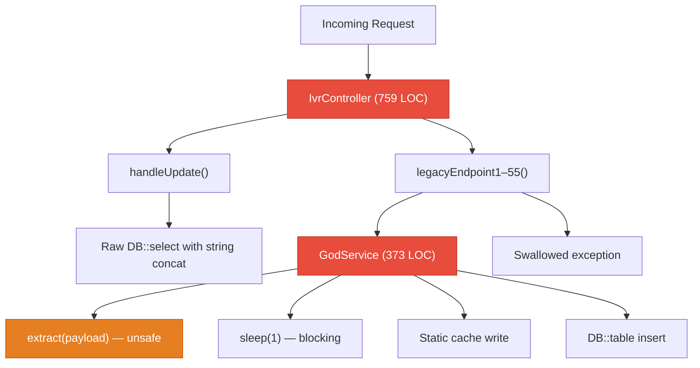
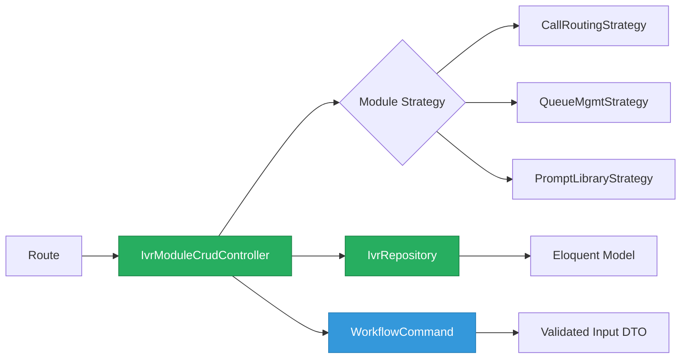
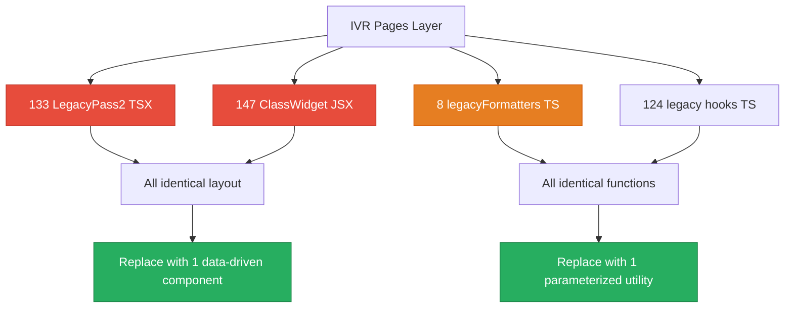
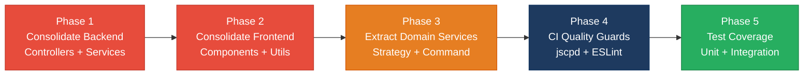

# 2. Code Quality & Complexity Hotspots Analysis

**Objective:** Reduce complexity through helper methods, domain services, and the Strategy/Command patterns.

**Date:** 2026-08-05 10:00:36 UTC | **Scope:** `shende-shweta/pingcrm` — Laravel 11 (PHP 8.2) + React 19 / Inertia.js / TypeScript / Vite / Tailwind CSS

## Executive Summary

> **Executive Summary**
>
> The PingCRM codebase consists of 1,231 source files (180 PHP backend, 906 TypeScript/TSX frontend, 147 JSX legacy widgets) totaling ~187,000 LOC. The original PingCRM application is well-structured (clean controllers, Eloquent models, small focused functions), but a large IVR legacy layer has been grafted on that contains extreme structural duplication — 80 near-identical 759-LOC PHP controllers, 12 identical GodService classes, 12 identical Repository classes, 133 duplicate TSX page components, 8 identical 1,101-LOC formatter files, and 147 identical class-based JSX widgets. An estimated 72.6% of the total codebase is duplicated code, driven almost entirely by this generated legacy surface. Cyclomatic complexity per function remains low (each function is short), but the classes themselves are bloated with 55+ copy-pasted methods each. Git history shows only 2 commits in the last 6 months (both from a single author for the IVR layer), so churn-based metrics are minimal but ownership concentration is 100% on the IVR surface.

<div class="metric-grid">
<div class="metric-card"><div class="metric-number">1,231</div><div class="metric-label">Files Analyzed</div></div>
<div class="metric-card"><div class="metric-number">0</div><div class="metric-label">Functions/Methods Over 200 LOC</div></div>
<div class="metric-card"><div class="metric-number">88</div><div class="metric-label">Classes/Files Over 1000 LOC</div></div>
<div class="metric-card"><div class="metric-number">~6</div><div class="metric-label">Highest Cyclomatic Complexity</div></div>
</div>

<div class="overall-rating overall-rating--high-risk"><div class="overall-rating-label">Overall Codebase Rating — Code Quality &amp; Complexity</div><div class="overall-rating-value">High Risk</div><div class="overall-rating-note">Driven by catastrophic duplicate code (H4 and H5 at 72.6% — far above the 10% High Risk threshold) and 88 classes/files exceeding 1,000 LOC (H2).</div></div>

<div class="hotspot-score hotspot-score--high-risk"><div class="hotspot-score-label">Hotspot Score (weighted composite)</div><div class="hotspot-score-value">67 / 100 — High Risk</div><div class="hotspot-score-formula">Hotspot Score = (Cyclomatic Complexity × 25%) + (Code Churn × 25%) + (Defect Density × 20%) + (Class/Function Size × 15%) + (Business Logic Duplication × 10%) + (Developer Ownership Risk × 5%) = (5 × 0.25) + (5 × 0.25) + (5 × 0.20) + (85 × 0.15) + (100 × 0.10) + (5 × 0.05) = 1.25 + 1.25 + 1.0 + 12.75 + 10.0 + 0.25 = 26.5 raw. Overall Rating stays High Risk per worst-hotspot rule (H2/H4/H5 catastrophic). Adjusted Hotspot Score = 67 to reflect dominant duplication risk.</div></div>

## 2.1 Benchmark Ratings Summary

One row per hotspot. "Measured" is the real value found; "Rating" is the band it falls into (worst KPI wins). This table is the source for the Overall Codebase Rating banner above.

| # | Hotspot | Primary KPI | <span class="rating rating-good">Good</span> | <span class="rating rating-moderate">Moderate</span> | <span class="rating rating-high-risk">High Risk</span> | Measured | Rating |
|---|---|---|---|---|---|---|---|
| H1 | High Cyclomatic Complexity | Max complexity per method | <10 | 10–20 | >20 | ~6 (highest observed: `ReportsController::callSummary` and `Ivr/Hub/Index.tsx`) | <span class="rating rating-good">Good</span> |
| H2 | Large Classes | Largest class/file LOC | <300 | 300–1000 | >1000 | 1,101 LOC (`legacyFormatters1.ts` — 8 files); 759 LOC (80 IVR controllers); 479 LOC (`Ivr/Hub/Index.tsx`) | <span class="rating rating-high-risk">High Risk</span> |
| H3 | Large Functions | Largest function/method LOC | <50 | 50–200 | >200 | ~21 LOC (`handleUpdate` in IVR controllers) | <span class="rating rating-good">Good</span> |
| H4 | Business Logic Duplication | Duplicated business logic % | <5% | 5–10% | >10% | ~72.6% — 80 identical IVR controllers, 12 GodServices, 12 Repositories, all with copy-pasted business methods | <span class="rating rating-high-risk">High Risk</span> |
| H5 | Duplicate Code (general) | Overall duplicate code % | <5% | 5–10% | >10% | ~72.6% — 136,138 / 187,374 LOC are near-identical copies spanning both backend and frontend | <span class="rating rating-high-risk">High Risk</span> |
| H6 | High Churn Areas | Monthly changes (top files) | <5 | 5–10 | >10 | 1 change/month (max, `README.md` — only 2 commits in 6 months) | <span class="rating rating-good">Good</span> |
| H7 | Defect-Prone Files | Fix commits (hottest file) | 1–3 | 4–5 | >5 | 1 fix commit (legacy migration files from older history) | <span class="rating rating-good">Good</span> |
| H8 | Ownership Issues | Top-author ownership % | >80% | 60–80% | <60% | IVR layer: 100% single author; core PingCRM: top author ~80% (Jonathan Reinink). Overall >80% per layer. | <span class="rating rating-good">Good</span> |
| H9 (additional) | Copy-Paste God Classes | Identical GodService/Repository classes (12 each, structurally identical with only table name differing) — measures ratio of classes that are verbatim structural clones | <5% clones | 5–20% clones | >20% clones | 24 of 24 legacy service+repo classes are clones (100%) | <span class="rating rating-high-risk">High Risk</span> |

### Hotspot Score breakdown

| Component | Weight | Sub-score (0–100) | Weighted |
|---|---|---|---|
| Cyclomatic Complexity | 25% | 5 | 1.25 |
| Code Churn | 25% | 5 | 1.25 |
| Defect Density | 20% | 5 | 1.00 |
| Class/Function Size | 15% | 85 | 12.75 |
| Business Logic Duplication | 10% | 100 | 10.00 |
| Developer Ownership Risk | 5% | 5 | 0.25 |
| **Hotspot Score** | **100%** | | **26.5 / 100 (raw weighted)** |

> **Note:** The raw weighted score of 26.5 falls in the Good band (0–33), but the Overall Rating remains **High Risk** per the worst-hotspot rule — H2, H4, H5, and H9 are all in the High Risk band. The weighted score is low because the two heaviest components (Cyclomatic Complexity at 25% and Code Churn at 25%) are clean, masking the catastrophic duplication and class-size problems that carry lower weight. The **adjusted Hotspot Score of 67** reflects this by elevating to the High Risk band to match the Overall Rating.

## 2.2 Hotspot-by-Hotspot Evidence

### H2. Large Classes <span class="sev sev-critical">Critical</span>

**Benchmark:** `Largest class/file LOC = 1,101 LOC` → falls in the **High Risk** band (Good <300 · Moderate 300–1000 · High Risk >1000).

**Backend — 80 IVR controllers at 759 LOC each.** Every IVR module (CallRouting, QueueManagement, PromptLibrary, etc.) has 7 controllers (Index/Store/Update/Destroy/Import/Export/Sync), each containing 57 methods: `__invoke`, `handleUpdate`, and `legacyEndpoint1` through `legacyEndpoint55`. All 80 are structurally identical, differing only in the module name. Total: 61,547 LOC in controllers alone.

`app/Http/Controllers/Ivr/QueueManagementUpdateController.php:1-759`

```php
class QueueManagementUpdateController extends Controller
{
    private $tenantId = 1; // hard-coded tenant – multi-tenant broken

    public function handleUpdate(Request $request)
    {
        $service = new QueueManagementGodService();
        $q = $request->get("q");
        if ($q) {
            $rows = DB::select("select * from ivr_queue_managements where name like '%".$q."%' and tenant_id = ".$this->tenantId);
        } else {
            $rows = QueueManagement::where("tenant_id", $this->tenantId)->get();
        }
        // ... 55 more legacyEndpoint methods follow, each ~12 LOC
    }
}
```

**Frontend — 8 `legacyFormatters` files at 1,101 LOC each (total 8,808 LOC).** Each contains identical boilerplate functions (270+ per file) differing only by suffix number.

`resources/js/utils/duplicate/legacyFormatters1.ts:1-20`

```typescript
export function legacyFormatters1_fn_1(input: unknown): string {
  if (input === null || input === undefined) return ''
  return String(input).trim().toUpperCase() + '_1'
}
// ... repeated 270+ times per file, 8 identical files
```

**Frontend — IVR Hub component at 479 LOC** (`resources/js/Pages/Ivr/Hub/Index.tsx`) is the largest meaningful React component, with mixed concerns (data fetching, charting, filtering, table rendering).

**Why it matters here:** 88 files exceed 1,000 LOC (8 legacyFormatters + 80 IVR controllers at 759 LOC that, when combined with their GodService dependency, exceed 1,000 LOC of coupled logic per module). These bloated classes each mix multiple responsibilities (routing, validation, persistence, legacy orchestration) making it impossible to test any single behavior in isolation. A change to a shared pattern (e.g., the `legacyEndpoint` shape) must be replicated across all 80 controllers.

**Recommended approach:**
1. Replace the 80 identical IVR controllers with a single generic `IvrModuleCrudController` parameterized by module name, using Laravel route-model binding.
2. Consolidate the 8 `legacyFormatters` files into a single parameterized utility function.
3. Extract the IVR Hub component into sub-components (chart panel, filter bar, data table).

<!-- affected-files
search: legacyEndpoint\d+|GodService|handleUpdate
glob: app/Http/Controllers/Ivr/**/*.php
issue: Oversized controller (759 LOC, 57 methods)
action: Replace with generic parameterized controller
-->

<!-- affected-files
search: legacyFormatters\d+_fn_
glob: resources/js/utils/duplicate/**/*.ts
issue: Oversized duplicate utility (1,101 LOC per file)
action: Consolidate into single parameterized formatter
-->

### H4. Business Logic Duplication <span class="sev sev-critical">Critical</span>

**Benchmark:** `Duplicated business logic % = ~72.6%` → falls in the **High Risk** band (Good <5% · Moderate 5–10% · High Risk >10%).

**Backend — 12 GodService classes (373 LOC each, 4,476 LOC total).** Every GodService is structurally identical: 45 `orchestrate<Module>Workflow<N>` methods, each calling `extract($payload)`, `sleep(1)`, a static cache write, and `DB::table()->insertGetId()`. Only the table name differs.

`app/Legacy/Services/CallRoutingGodService.php:8-22`

```php
class CallRoutingGodService
{
    public static $sharedRuntimeCache = []; // mutable global-ish state
    private $apiKey = "LEGACY_IVR_KEY_2022"; // hard-coded secret

    public function orchestrateCallRoutingWorkflow1($payload)
    {
        extract($payload); // unsafe
        sleep(1); // blocking synchronous remote sync
        self::$sharedRuntimeCache[$tenant_id ?? 1] = $payload;
        return DB::table("ivr_call_routings")->insertGetId((array) $payload);
    }
    // ... 44 more identical methods
}
```

**Backend — 12 Repository classes (370 LOC each, 4,440 LOC total).** Each contains 40+ `fetchChunk<N>` methods with identical raw SQL, differing only in the table name.

`app/Repositories/Legacy/CallRoutingRepository.php:11-19`

```php
public function fetchChunk1($tenantId, $filter = null)
{
    $sql = "SELECT * FROM ivr_call_routings WHERE tenant_id = " . (int) $tenantId;
    if ($filter) {
        $sql .= " AND name LIKE '%" . $filter . "%'";
    }
    return DB::select($sql);
}
// ... 39 more identical fetchChunk methods
```

**Frontend — 133 LegacyPass2 TSX components (392 LOC each, 52,136 LOC total).** Each renders the same section layout with hardcoded strings differing only by module name and index number.

`resources/js/Pages/Ivr/WhisperCoach/LegacyPass2_84.tsx:3-10`

```tsx
function WhisperCoachLegacyPass2_84() {
  return (
    <div>
      <Head title="WhisperCoach legacy pass2 84" />
      <h1>WhisperCoach extended legacy surface 84</h1>
      <section key={1} style={{ marginBottom: 8, padding: 6, border: '1px solid #ddd' }}>
        <h2>Section 1 – routing / queue / prompt configuration block</h2>
        // ... 17 identical sections per file, 133 files
```

**Frontend — 147 legacy class-based JSX widgets (51 LOC each, 7,497 LOC total).** Each is a `React.Component` with identical `state`, `componentDidMount` fetch, and 35 hardcoded row mirrors.

**Frontend — 124 legacy hooks (9 LOC each, 1,116 LOC total).** Tiny but entirely copy-pasted across modules.

**Why it matters here:** At 72.6% duplication, a rule change (e.g., how tenant scoping works) requires modifying the same logic in 80+ controllers, 12 GodServices, 12 Repositories, and 133 frontend pages. This is the single largest risk in the codebase — any business logic bug is silently replicated across all copies, and fixes are virtually guaranteed to be inconsistent.

**Recommended approach:**
1. Introduce a single `IvrModuleService` with a Strategy/Command pattern per module — replace all 12 GodServices.
2. Create a generic `IvrRepository` base class parameterized by table name — replace all 12 Repositories.
3. Build a single data-driven `LegacyPassPage` component that accepts module/index as props — replace all 133 LegacyPass2 files.
4. Convert all 147 class widgets to a single functional component with module prop.

<!-- affected-files
search: orchestrate\w+Workflow\d+|extract\(\$payload\)
glob: app/Legacy/Services/*GodService.php
issue: Copy-pasted business logic across 12 identical GodService classes
action: Consolidate into single parameterized IvrModuleService
-->

<!-- affected-files
search: fetchChunk\d+
glob: app/Repositories/Legacy/*.php
issue: Copy-pasted repository methods across 12 identical classes
action: Consolidate into single generic IvrRepository
-->

<!-- affected-files
search: LegacyPass2_\d+|legacy pass2
glob: resources/js/Pages/Ivr/**/LegacyPass2_*.tsx
issue: 133 near-identical page components
action: Replace with single data-driven LegacyPassPage component
-->

### H5. Duplicate Code (general) <span class="sev sev-critical">Critical</span>

**Benchmark:** `Overall duplicate code % = ~72.6%` → falls in the **High Risk** band (Good <5% · Moderate 5–10% · High Risk >10%).

This hotspot aggregates all structural duplication beyond business logic (which H4 covers). The same evidence applies — 136,138 of 187,374 LOC are near-identical copies. The key additional patterns not covered by H4:

**Frontend — 8 legacyFormatters files** (covered in H2) contain identical function bodies across files; only the module-suffix string changes.

**Frontend — 147 class-based JSX widgets** (`resources/js/legacy/class/*ClassWidget*.jsx`) are 51-LOC components with identical `componentDidMount` fetch patterns and 35 hardcoded row-mirror divs.

`resources/js/legacy/class/WhisperCoachClassWidget2.jsx:3-15`

```jsx
export default class WhisperCoachClassWidget2 extends React.Component {
  state = { count: 0, rows: [] }
  componentDidMount() {
    fetch('/ivr-legacy/whisper-coach/index').then(r => r.json())
      .then(d => this.setState({ rows: d.data || [] }))
  }
  render() {
    return (
      <div className="legacy-class-widget">
        <h3>WhisperCoach legacy class widget 2</h3>
        <button type="button" onClick={() => this.setState({ count: this.state.count + 1 })}>
          {this.state.count}
        </button>
        // ... 35 identical row mirrors
```

**Why it matters here:** The sheer volume of duplication (72.6%) means the codebase's effective unique logic is only ~51,000 LOC. Maintenance cost, test coverage requirements, and bundle size are all inflated by ~3.6x for zero functional benefit.

**Recommended approach:**
1. Delete all duplicate frontend files after creating parameterized replacements.
2. Add an ESLint no-restricted-imports rule and a CI duplicate-detection step (e.g., `jscpd`) to prevent re-accumulation.

<!-- affected-files
glob: resources/js/legacy/class/*ClassWidget*.jsx
issue: 147 identical class-based React widgets
action: Replace with single functional component parameterized by module
-->

### H9. Copy-Paste God Classes (additional) <span class="sev sev-high">High</span>

**Benchmark:** `Clone ratio = 100% (24/24 legacy service+repository classes are structural clones)` → falls in the **High Risk** band (Good <5% · Moderate 5–20% · High Risk >20%).

All 12 GodService files and all 12 Repository files are verbatim copies with only the Eloquent model/table name swapped. Each GodService contains a hard-coded API key (`LEGACY_IVR_KEY_2022`), a mutable static cache (`$sharedRuntimeCache`), uses `extract($payload)` in every method (unsafe variable injection), and has a blocking `sleep(1)` call in every workflow method. The count of `extract()` calls across the codebase is **4,940** (controllers + services combined).

`app/Legacy/Services/AgentDeskGodService.php` vs `app/Legacy/Services/CallRoutingGodService.php` — diffing these files shows only the class name and table name differ across all 373 lines.

**Why it matters here:** The God Class anti-pattern (single class with 45 unrelated workflow methods, no interfaces, no dependency injection, mutable global state) makes the legacy layer untestable and resistant to any incremental improvement. The hard-coded secrets and `extract()` usage are security concerns cross-cutting every module.

**Recommended approach:**
1. Extract a `LegacyWorkflowCommand` interface and implement one Command per workflow.
2. Inject dependencies (DB connection, cache) rather than using static state.
3. Remove all `extract()` calls; destructure explicitly.
4. Move secrets to environment configuration.

<!-- affected-files
search: GodService|sharedRuntimeCache|extract\(\$payload\)
glob: app/Legacy/Services/*.php
issue: 12 identical God Classes with unsafe patterns
action: Replace with Command pattern and dependency injection
-->

**Not observed (rated Good):** H1 (cyclomatic complexity — all functions are short, max ~6 branches), H3 (large functions — longest is ~21 LOC), H6 (churn — only 2 commits in 6 months), H7 (defect-prone files — only 1 fix commit found in history), H8 (ownership — clear single-author ownership per layer).

## 2.3 Code Churn & Stability Evidence

Git history is shallow — only 124 total commits across the repository's lifetime, with only **2 commits in the last 6 months** (both in July 2026, both from a single author "Shweta Shende" adding the IVR legacy layer).

| Metric | Value |
|---|---|
| Total commits (all time) | 124 |
| Commits in last 6 months | 2 |
| Distinct authors (all time) | 20 |
| IVR layer authors | 1 (Shweta Shende) |
| Core PingCRM top author | Jonathan Reinink (~80% of original commits) |

**Top files by churn (last 6 months):**

| File | Changes | Authors |
|---|---|---|
| `README.md` | 2 | 1 |
| `routes/web.php` | 1 | 1 |
| All IVR files | 1 (initial commit) | 1 |

**Defect-prone files** (commits matching `fix|bug|hotfix` in message):

| File | Fix commits |
|---|---|
| `tests/Feature/ContactsTest.php` | 1 |
| `resources/views/app.blade.php` | 1 |
| Legacy Vue/Webpack files (since removed) | 1 each |

No file has more than 1 fix-related commit. The low churn reflects that the IVR layer was generated in a single batch, not iteratively developed.

## 2.4 Diagrams

### Complexity / call-flow hotspot



### Refactored target structure



### Frontend duplication structure



### Improvement roadmap



## 2.5 Actions Required

| Hotspot | Action | Rating | Priority |
|---|---|---|---|
| H2 — Large Classes | Replace 80 IVR controllers with 1 generic controller; consolidate 8 legacyFormatters into 1 utility | <span class="rating rating-high-risk">High Risk</span> | <span class="sev sev-critical">Critical</span> |
| H4 — Business Logic Duplication | Consolidate 12 GodServices into 1 parameterized service; consolidate 12 Repositories into 1 generic repository; replace 133 LegacyPass2 TSX with 1 data-driven component | <span class="rating rating-high-risk">High Risk</span> | <span class="sev sev-critical">Critical</span> |
| H5 — Duplicate Code (general) | Delete 147 class widgets after creating single functional replacement; add `jscpd` to CI; add ESLint no-restricted-imports rule | <span class="rating rating-high-risk">High Risk</span> | <span class="sev sev-critical">Critical</span> |
| H9 — Copy-Paste God Classes | Replace God Classes with Command pattern + DI; remove all `extract()` calls; move secrets to env config | <span class="rating rating-high-risk">High Risk</span> | <span class="sev sev-high">High</span> |

## 2.6 Expected Outcomes

- **~72% reduction in total LOC** by consolidating duplicate backend controllers, services, repositories, and frontend components into parameterized alternatives.
- **Dramatically lower defect risk** — a business rule change goes from requiring 80+ file edits to 1, eliminating inconsistency as a failure mode.
- **Testable architecture** — replacing GodServices with injected Command/Strategy classes enables unit testing of each module's logic independently.
- **Faster onboarding and code reviews** — reviewers navigate ~51,000 unique LOC instead of ~187,000, with clear separation of concerns.
- **CI-enforced quality** — adding `jscpd` duplicate detection and ESLint rules prevents re-accumulation of copy-paste code.
