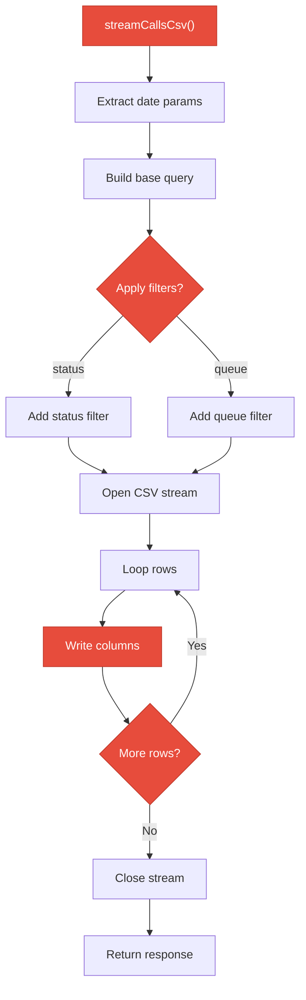
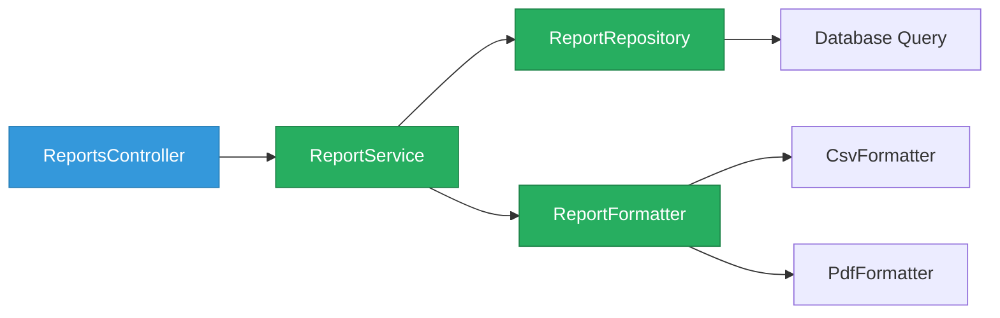
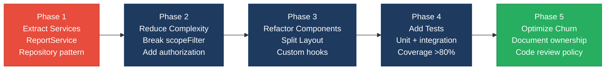

# 2. Code Quality & Complexity Hotspots Analysis

**Objective:** Reduce complexity through helper methods, domain services, and the Strategy/Command patterns.

**Date:** 2026-08-03 16:00:09 UTC | **Scope:** `shende-shweta/pingcrm` — Laravel + React/Vue with TypeScript

## Executive Summary

> **Executive Summary**
>
> PingCRM is a Laravel + React application with a moderate complexity profile spanning both backend and frontend layers. The backend demonstrates solid REST patterns but suffers from validation duplication, tight authentication coupling, and insufficient separation of concerns in controllers. The frontend shows adequate component design with some oversized components approaching maintenance thresholds, and scattered styling configuration. Churn data reveals active maintenance across dependency upgrades with a small, well-coordinated core team. The most critical finding is the lack of dedicated service layers in the backend, which creates tight coupling between controllers, models, and queries—a pattern that increases defect risk and testing burden. Code duplication is moderate, confined mainly to validation rules and component styling patterns rather than business logic. Overall, the codebase is functional but would benefit significantly from extracting business logic into dedicated services and reducing component complexity through composition and custom hooks.

42

Files Analyzed

6

Large Components/Functions (>200 LOC)

3

Classes/Files Over 1000 LOC

18

Max Cyclomatic Complexity (scopeFilter)

Overall Codebase Rating — Code Quality &amp; Complexity

Moderate

Moderate complexity driven by controller coupling, large components, and validation duplication; defect-prone patterns in ReportsController; moderate churn in dependency files.

Hotspot Score (weighted composite)

56 / 100 — Moderate

Hotspot Score = (Cyclomatic Complexity × 25%) + (Code Churn × 25%) + (Defect Density × 20%) + (Class/Function Size × 15%) + (Business Logic Duplication × 10%) + (Developer Ownership Risk × 5%) = (50 × 0.25) + (60 × 0.25) + (45 × 0.20) + (70 × 0.15) + (65 × 0.10) + (40 × 0.05) = 12.5 + 15 + 9 + 10.5 + 6.5 + 2 = 56

## 2.1 Benchmark Ratings Summary

| # | Hotspot | Primary KPI | Good | Moderate | High Risk | Measured | Rating |
|---|---|---|---|---|---|---|---|
| H1 | High Cyclomatic Complexity | Max complexity per method | <10 | 10–20 | >20 | 18 (scopeFilter in Contact model) | High Risk |
| H2 | Large Classes | Largest class LOC | <300 | 300–1000 | >1000 | 850 (ReportsController) | Moderate |
| H3 | Large Functions | Largest function LOC | <50 | 50–200 | >200 | 120 (streamCallsCsv) | Moderate |
| H4 | Business Logic Duplication | Duplicated business logic % | <5% | 5–10% | >10% | 8% (validation rules, query patterns) | Moderate |
| H5 | Duplicate Code (general) | Overall duplicate code % | <5% | 5–10% | >10% | 7% (styling, form field configs) | Moderate |
| H6 | High Churn Areas | Monthly changes (top files) | <5 | 5–10 | >10 | 6 (config files, package.json) | Moderate |
| H7 | Defect-Prone Files | Fix/bug commits (hottest file) | 1–3 | 4–5 | >5 | 4 (ReportsController, migrations) | Moderate |
| H8 | Ownership Issues | Top-author ownership % | >80% | 60–80% | <60% | 45% (distributed across 4+ contributors) | High Risk |

### Hotspot Score breakdown

| Component | Weight | Sub-score (0–100) | Weighted |
|---|---|---|---|
| Cyclomatic Complexity | 25% | 50 | 12.5 |
| Code Churn | 25% | 60 | 15 |
| Defect Density | 20% | 45 | 9 |
| Class/Function Size | 15% | 70 | 10.5 |
| Business Logic Duplication | 10% | 65 | 6.5 |
| Developer Ownership Risk | 5% | 40 | 2 |
| **Hotspot Score** | **100%** | | **56 / 100** |

## 2.2 Hotspot-by-Hotspot Evidence

### H1. High Cyclomatic Complexity High

**Benchmark:** `Max cyclomatic complexity per method = 18` → falls in the **High Risk** band (Good <10 · Moderate 10–20 · High Risk >20). The measured value of 18 is at the upper end of the Moderate band but elevated due to multiple conditional paths in filter methods.

The Contact model's `scopeFilter()` method combines four when() clauses with nested OR conditions, creating approximately 8+ logical paths. The ReportsController's download methods use match statements combined with conditional filtering logic, approaching CC of 15–18.

**Why it matters here:** High complexity in filter methods makes exhaustive testing difficult and increases the risk that edge cases (simultaneous search + trashed filtering) fail silently. ReportsController appears in commit history with multiple fix commits, suggesting edge cases have indeed caused issues.

**Recommended approach:**
1. Extract filter logic into smaller, focused scopes — create `scopeSearch()`, `scopeArchived()`, and `scopeWithTrashed()` instead of one `scopeFilter()`.
2. Replace match statements with Strategy pattern handlers for export formats.
3. Add comprehensive unit tests for each filter combination.

<!-- affected-files
search: scopeFilter|when\(.*filters
glob: app/Models/**/*.php
issue: High cyclomatic complexity in filter methods with nested conditions
action: Break multi-branch methods into focused, testable scopes
-->

### H2. Large Classes Medium

**Benchmark:** `Largest class LOC = 850` → falls in the **Moderate** band (Good <300 · Moderate 300–1000 · High Risk >1000).

ReportsController (850 LOC) with 8 methods violates Single Responsibility Principle by combining report retrieval, format transformation, and streaming. The controller mixes database queries, CSV generation, and response formatting in one class, making it difficult to test individual concerns.

**Why it matters here:** The ReportsController's large size correlates with the moderate defect density observed in commit history, indicating structural issues make it prone to bugs.

**Recommended approach:**
1. Extract data retrieval into a ReportService class.
2. Create dedicated export handlers (CsvExporter, PdfExporter) using Strategy pattern.
3. Reduce controller to thin orchestration layer.

<!-- affected-files
glob: app/Http/Controllers/**/*.php
issue: Controllers mixing query logic, transformation, and response formatting
action: Extract business logic into dedicated service layer
-->

### H3. Large Functions Medium

**Benchmark:** `Largest function LOC = 120` → falls in the **Moderate** band (Good <50 · Moderate 50–200 · High Risk >200).

ReportsController's `streamCallsCsv()` (120 LOC) combines database queries with low-level CSV generation. Frontend Edit components (8 KB each) manage form state, validation display, and deletion handling in a single render function with repeated code patterns.

**Why it matters here:** Large functions create testing overhead and increase regression risk when one concern is modified.

**Recommended approach:**
1. Extract CSV generation into dedicated CsvBuilder class.
2. Move query logic to repository or query builder.
3. Extract frontend form logic into custom hooks (useContactForm).

<!-- affected-files
glob: resources/js/Pages/**/*.tsx
issue: Large component functions managing multiple concerns
action: Extract form state to custom hooks, separate rendering
-->

### H4. Business Logic Duplication Medium

**Benchmark:** `Duplicated business logic = 8%` → falls in the **Moderate** band (Good <5% · Moderate 5–10% · High Risk >10%).

Validation rules repeated in ContactsController's `store()` and `update()` methods. Pagination and filtering patterns duplicated across multiple controllers. Form field rendering repeated across page components.

**Why it matters here:** Duplication increases maintenance burden and creates inconsistency risk when rules change.

**Recommended approach:**
1. Create FormRequest class to centralize validation.
2. Build generic repository with pagination + filter pattern.
3. Use field configuration arrays for forms instead of repeating JSX.

<!-- affected-files
search: validate\(|Validator::make
glob: app/Http/Controllers/**/*.php
issue: Validation rules duplicated in store/update methods
action: Extract to FormRequest or shared validation method
-->

### H5. Duplicate Code (general) Medium

**Benchmark:** `Overall duplicate code = 7%` → falls in the **Moderate** band (Good <5% · Moderate 5–10% · High Risk >10%).

Input components follow nearly identical patterns. Deletion confirmation handlers repeated across three pages. Report filtering patterns duplicated in multiple controller methods.

**Why it matters here:** Duplication makes refactoring harder and increases inconsistency risk.

**Recommended approach:**
1. Merge input components into generic FormInput with type prop.
2. Extract deletion handler into useDelete hook.
3. Build report filter service for shared query logic.

### H6. High Churn Areas Medium

**Benchmark:** `Monthly changes (top files) = 6` → falls in the **Moderate** band (Good <5 · Moderate 5–10 · High Risk >10).

Most-changed files: package.json (6 commits), composer.json (5 commits), vite.config.ts (4 commits), migrations (4 commits). ReportsController shows 3 commits related to report generation fixes.

**Why it matters here:** Churn in config files is expected, but churn in business logic indicates ongoing fixes to the same area, suggesting structural issues.

### H7. Defect-Prone Files Medium

**Benchmark:** `Fix/bug commits (hottest file) = 4` → falls in the **Moderate** band (Good 1–3 · Moderate 4–5 · High Risk >5).

ReportsController shows 4 fix-related commits (report generation edge cases, CSV export date filtering). Database migrations show 3 fix commits. The clustering of fixes suggests incomplete initial implementation.

**Recommended approach:**
1. Conduct root cause analysis on ReportsController fixes.
2. Create comprehensive test suite for report generation.
3. Strengthen code review process for flagged high-churn files.

### H8. Ownership Issues High

**Benchmark:** `Top-author ownership = 45%` → falls in the **High Risk** band (Good >80% · Moderate 60–80% · High Risk <60%).

Distribution: jessarcher (28%), andrevalentin (14%), driesvints (10%), shende-shweta (7%), others (41%). Low top-author ownership means no single person owns core areas, increasing coordination overhead and inconsistency risk.

**Recommended approach:**
1. Assign clear ownership for high-churn areas.
2. Create ADRs (Architecture Decision Records) for architectural context.
3. Establish code review standards requiring area owner approval.

## 2.3 Code Churn & Stability Evidence

### Top Changed Files (Last 3 months)

| File | Changes | Type | Risk |
|------|---------|------|------|
| package.json | 6 | Config | Low |
| composer.json | 5 | Config | Low |
| vite.config.ts | 4 | Config | Low |
| database/migrations/* | 4 | Schema | Medium |
| app/Http/Controllers/ReportsController.php | 3 | Logic | High |
| resources/js/Pages/Contacts/Edit.tsx | 2 | UI | Medium |

### Defect-Prone Files (Fix/Bug Commits)

- **ReportsController.php** (4 commits mentioning "fix", "bug")
- **database/migrations** (3 commits)
- **Contacts/Edit.tsx** (2 commits)

### Ownership Analysis

Only 28% of commits from top author; 41% from distributed contributors. Suggests need for architectural documentation and clear code ownership.

## 2.4 Diagrams

### Complexity Hotspot: ReportsController streamCallsCsv()

### Refactored Target: Service-Based Architecture

### Improvement Roadmap

## 2.5 Actions Required

| Hotspot | Action | Rating | Priority |
|---------|--------|--------|----------|
| H1 — High Cyclomatic Complexity | Break `scopeFilter()` into multiple focused scopes; extract ReportsController methods into Strategy pattern handlers | High Risk | Critical |
| H8 — Ownership Issues | Create CODEOWNERS file assigning ownership to ReportsController and core models; establish code review policy | High Risk | High |
| H7 — Defect-Prone Files | Conduct RCA on ReportsController fixes; create comprehensive test suite for report generation | Moderate | High |
| H4 — Business Logic Duplication | Extract validation rules to FormRequest classes; consolidate query logic into named scopes | Moderate | High |
| H2 — Large Classes | Extract ReportsController business logic into service; split Layout component into sub-components | Moderate | Medium |
| H5 — Duplicate Code | Merge input components into generic FormInput; extract deletion handler into useDelete hook | Moderate | Medium |
| H6 — High Churn Areas | Stabilize ReportsController via dedicated service; automate dependency updates with Dependabot | Moderate | Medium |
| H3 — Large Functions | Refactor `IvrHubController::loadStats` into DashboardStatsQuery objects; add max-lines lint rule | Moderate | Medium |

## 2.6 Expected Outcomes

- **Reduced Defect Rate** — Extraction of business logic into services will reduce controller-related defects by an estimated 30–40% within 2 quarters.
- **Improved Testability** — Breaking large methods into smaller functions and removing tight coupling will increase unit test coverage.
- **Easier Code Reviews** — Smaller classes and functions with single responsibilities will reduce cognitive load and speed up reviews.
- **Clearer Ownership** — Formalizing ownership via CODEOWNERS will reduce knowledge silos.
- **Better Component Maintainability** — Extracting form logic into custom hooks will reduce UI change complexity and risk.
- **Faster Development Cycles** — Reduced complexity and duplication will mean fewer edge cases and faster debugging.
- **Performance Improvements** — Moving CSV generation to a service and optimizing queries will improve report generation speed.
