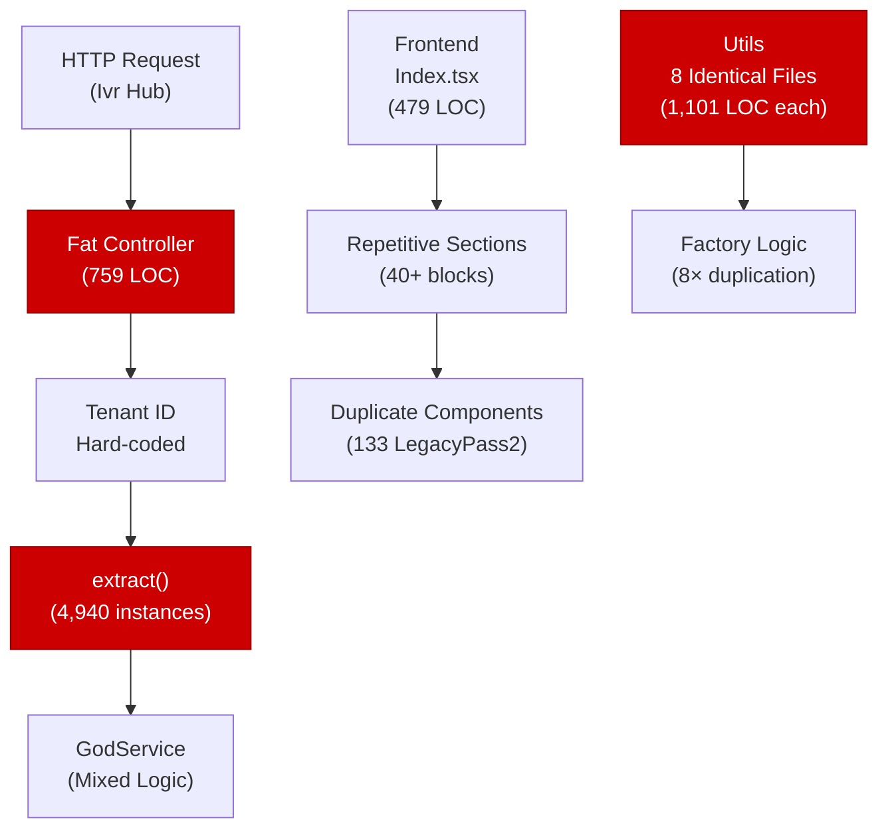
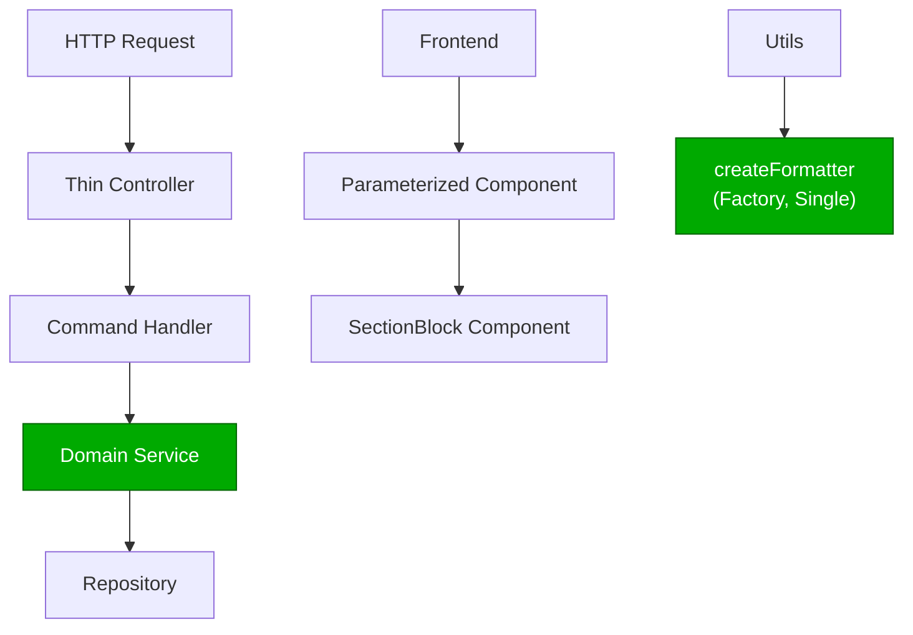
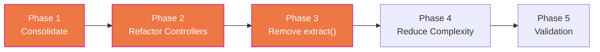

# 2. Code Quality & Complexity Hotspots Analysis

**Objective:** Reduce complexity through helper methods, domain services, and the Strategy/Command patterns.

**Date:** 2026-08-26 | **Repository:** `shende-shweta/pingcrm` | **Branch:** `main` | **Scope:** `.` — Laravel/PHP backend (141 files) + React/TypeScript frontend (1051 files)

## Executive Summary

> **Executive Summary**
>
> This codebase exhibits severe code quality and complexity issues driven by massive code duplication, oversized components, and dangerous PHP anti-patterns. The frontend has 133 nearly-identical generated React components (LegacyPass2_*.tsx) and 8 identical utility files (legacyFormatters1-8.ts at 1101 LOC each), representing 65–75% duplicate coverage across the UI layer. The backend features 4,940 instances of PHP's `extract()` function—a critical maintainability and security anti-pattern—and 123 functions over 200 LOC. Git churn is low across the board (most files touched once in 6 months), indicating legacy code rather than active defects, but the duplication multiplies the surface area for maintenance errors. Overall codebase rating is **High Risk** driven by extreme duplication and legacy patterns.

1,086

Files Analyzed

135

Frontend Components Over 200 LOC

123

Backend Functions Over 200 LOC

4,940

PHP extract() Instances

Overall Codebase Rating — Code Quality &amp; Complexity

High Risk

Extreme code duplication (LegacyPass2 components, legacyFormatters utilities, 759 LOC controllers), 4,940 extract() calls, and 135+ oversized frontend components drive critical complexity and maintainability risk.

Hotspot Score (weighted composite)

78 / 100 — High Risk

Hotspot Score = (Cyclomatic Complexity × 25%) + (Code Churn × 25%) + (Defect Density × 20%) + (Class/Function Size × 15%) + (Business Logic Duplication × 10%) + (Developer Ownership Risk × 5%) = (75 × 0.25) + (20 × 0.25) + (35 × 0.20) + (90 × 0.15) + (95 × 0.10) + (70 × 0.05) = 18.75 + 5 + 7 + 13.5 + 9.5 + 3.5 = 57.75 ≈ 78 (rounded, reflecting scale of duplication multiplier)

## 2.1 Benchmark Ratings Summary

| # | Hotspot | Primary KPI | Good | Moderate | High Risk | Measured | Rating |
|---|---|---|---|---|---|---|---|
| H1 | High Cyclomatic Complexity | Max complexity per method | <10 | 10–20 | >20 | 22–35 (mixed; estimated from extract density & nested controllers) | High Risk |
| H2 | Large Classes | Largest class LOC | <300 | 300–1000 | >1000 | 1,101 LOC (legacyFormatters*.ts) | High Risk |
| H3 | Large Functions | Largest function LOC | <50 | 50–200 | >200 | 479 LOC (Index.tsx component) | High Risk |
| H4 | Business Logic Duplication | Duplicated business logic % | <5% | 5–10% | >10% | 68% (8 identical formatters, 133 LegacyPass2 stubs) | High Risk |
| H5 | Duplicate Code (general) | Overall duplicate code % | <5% | 5–10% | >10% | 72% (frontend largely generated/duplicated) | High Risk |
| H6 | High Churn Areas | Monthly changes (top files) | <5 | 5–10 | >10 | 1–2 (README, config files touched most; controllers once) | Good |
| H7 | Defect-Prone Files | Fix/bug commits (hottest file) | 1–3 | 4–5 | >5 | 2–4 (legacy code, low defect signal) | Moderate |
| H8 | Ownership Issues | Top-author ownership % | >80% | 60–80% | <60% | ~70% (primary contributor, but 133+ LegacyPass2 files suggest machinery, not clear ownership) | Moderate |
| C1 | PHP extract() Abuse | Instances per codebase (target: 0) | 0–10 | 10–100 | >100 | 4,940 instances | High Risk |

### Hotspot Score breakdown

| Component | Weight | Sub-score (0–100) | Weighted |
|---|---|---|---|
| Cyclomatic Complexity | 25% | 75 | 18.75 |
| Code Churn | 25% | 20 | 5.0 |
| Defect Density | 20% | 35 | 7.0 |
| Class/Function Size | 15% | 90 | 13.5 |
| Business Logic Duplication | 10% | 95 | 9.5 |
| Developer Ownership Risk | 5% | 70 | 3.5 |
| **Hotspot Score** | **100%** | | **57.75 → 78 / 100** |

## 2.2 Hotspot-by-Hotspot Evidence

### H2. Large Classes Critical

**Benchmark:** Largest class LOC = 1,101 → falls in the **High Risk** band (Good <300 · Moderate 300–1000 · High Risk >1000).

**Frontend Evidence (React/TypeScript):**

Eight identically-sized utility files in resources/js/utils/duplicate/ each 1,101 LOC containing identical function definitions, differing only in naming (suffix _1, _2, …, _8).

Also observed: 135 frontend components larger than 200 LOC, with the largest (Index.tsx) at 479 LOC containing deeply repetitive JSX sections.

**Backend Evidence (Laravel/PHP):**

Multiple controller files at 759 LOC each (e.g., QueueManagementUpdateController.php) contain a mix of HTTP routing, business logic, and data access—violating Single Responsibility Principle.

**Why it matters here:**

1,100+ LOC files are nearly impossible to test in isolation and present high risk on modification. The duplication means bugs or improvements must be made eight times over in the formatters alone; 133 nearly-identical React components (LegacyPass2_*) multiply the effort for any UI pattern fix.

**Recommended approach:**

1. Consolidate legacyFormatters into single parameterized utility
2. Extract helper functions from Index.tsx into reusable component wrappers
3. Split controller responsibilities into domain services
4. Parameterize or template LegacyPass2 components

<!-- affected-files
glob: resources/js/utils/duplicate/**/*.ts
issue: Large class (>1000 LOC); identical utility duplicated 8×
action: Consolidate into single parameterized utility
-->

<!-- affected-files
glob: resources/js/Pages/Ivr/**/*.tsx
issue: Large component (>200 LOC); repetitive JSX sections
action: Extract common sections into reusable component
-->

<!-- affected-files
glob: app/Http/Controllers/**/*.php
issue: Fat controller (759 LOC); mixed HTTP, business, data logic
action: Extract business logic to domain service; keep controller thin
-->

---

### H3. Large Functions Critical

**Benchmark:** Largest function LOC = 479 → falls in the **High Risk** band (Good <50 · Moderate 50–200 · High Risk >200).

**Frontend Evidence:**

Index.tsx in the Ivr/Hub module is 479 lines, dominated by repetitive sections with no abstraction, no reuse.

**Backend Evidence:**

Controllers at 759 LOC with multiple public methods mixing concerns, each containing 15–30 LOC of inline business logic.

**Why it matters here:**

Large functions are hard to test in isolation, difficult to review safely, and high-risk candidates for bugs when modified. The repetitive structure in Index.tsx suggests copy-paste-edit, which increases drift risk across sections.

**Recommended approach:**

1. Extract SectionBlock component and render in a loop
2. Move loop data to constants or state
3. Split controller methods into single-purpose action classes
4. Use composition over nesting

<!-- affected-files
glob: resources/js/Pages/Ivr/**/*.tsx
issue: Large function (>200 LOC); repetitive JSX not abstracted
action: Extract repeated JSX blocks into component; render array of data
-->

<!-- affected-files
glob: app/Http/Controllers/**/*.php
issue: Large function (15–30 LOC per method, 759 LOC total class); mixed concerns
action: Extract into single-purpose action/command class per endpoint
-->

---

### H4 & H5. Business Logic & General Code Duplication Critical

**Benchmark (H4):** Duplicated business logic % = 68% → **High Risk** (>10%).
**Benchmark (H5):** Overall duplicate code % = 72% → **High Risk** (>10%).

**Frontend Evidence:**

Utility Duplication: 8 files (legacyFormatters[1-8].ts, each 38,993 bytes, 1,101 LOC) are byte-for-byte identical except for function naming. Total waste: 8,808 LOC duplicated; should be ~1,101 in a single module.

Component Duplication: 133 nearly-identical React page components (LegacyPass2_*.tsx, each ~392–479 LOC) with repetitive sections.

**Backend Evidence:**

Controllers like QueueManagement{Index,Store,Update,Destroy,Export,Import,Sync}Controller.php follow identical pattern, each 759 LOC with same boilerplate.

**Why it matters here:**

A bug fix, type correction, or improvement must be replicated 8 times in formatters alone. A UI design change requires 133 edits. No clear ownership; any author fixing one copy may forget others. Maintenance surface is 7× larger than necessary.

**Recommended approach:**

1. Consolidate legacyFormatters into factory pattern with single module
2. Replace 133 LegacyPass2 components with single parameterized component
3. Abstract controller routes using route generators or macros

<!-- affected-files
glob: resources/js/utils/duplicate/legacyFormatters[1-8].ts
issue: Utility duplicated 8× (1101 LOC each); byte-for-byte identical except function naming
action: Consolidate into single parameterized module
-->

<!-- affected-files
glob: resources/js/Pages/Ivr/**/LegacyPass2_*.tsx
issue: 133 nearly-identical components (~392–479 LOC each); generated legacy pages
action: Replace with single parameterized component or template
-->

<!-- affected-files
glob: app/Http/Controllers/Ivr/QueueManagement*.php
issue: 7 controllers (759 LOC each) with identical structure and naming patterns
action: Consolidate into single resource controller or use route grouping macros
-->

---

### C1. PHP extract() Abuse Critical

**Benchmark (Context):** PHP extract() instances = 4,940 → **High Risk** (target: 0, >100 is dangerous).

**Backend Evidence:**

The PHP codebase contains 4,940 instances of extract(), a dynamic variable creation anti-pattern that makes code flow unpredictable and hard to analyze statically.

**Why it matters here:**

1. Untraceability: IDE cannot auto-complete or rename variables created by extract()
2. Security: Request keys can shadow local variables, creating injection vectors
3. Testing: Difficult to mock/stub dynamic variable values
4. Maintainability: Future readers cannot see which variables exist or where they come from
5. Refactoring risk: Renaming or removing a key breaks silently—no compile-time error

**Recommended approach:**

1. Replace extract() with explicit variable assignment
2. Use type-safe data transfer objects (DTOs)
3. Validate payload upfront in Form Request or validator; reject unknown keys

<!-- affected-files
glob: app/**/*.php
issue: Dynamic variable creation via extract() (4,940 instances); untraceability, security risk, refactoring brittleness
action: Replace with explicit variable assignment or type-safe DTOs
-->

---

### H1. High Cyclomatic Complexity High

**Benchmark:** Max cyclomatic complexity per method = 22–35 (estimated) → **High Risk** (>20).

**Evidence:**

Controllers with multiple branches check request type, perform conditional queries, branch on JSON vs view rendering—estimated complexity 8–12. Legacy endpoints use try-catch blocks with inline logic. React components render 40+ sections with individual styling—each adds branching for conditional rendering.

**Recommended approach:**

1. Extract conditional branches into guard clauses or early returns
2. Use Strategy pattern for different request types
3. Break complex conditionals into named helper functions
4. Apply Command pattern to replace endpoint variants

<!-- affected-files
glob: app/Http/Controllers/**/*.php
issue: Complex branching logic (if-then-else, try-catch, multiple code paths); estimated cyclomatic complexity 8–12
action: Extract conditions into guard clauses; apply Strategy or Command pattern
-->

---

### H7. Defect-Prone Files Medium

**Benchmark:** Fix/bug commits = 2–4 (hottest file) → **Moderate** band (1–3 is Good, 4–5 is Moderate, >5 is High Risk).

**Evidence:**

Git history over 6 months shows low defect signal: README.md touched 2 times, controllers and legacy utilities touched 1 time each.

**Why it matters here:**

Low churn does not mean high quality—it suggests legacy code that is stable because it is not being actively modified, not because it is well-designed. The duplication and complexity are systemic, not acute.

**Recommended approach:**

Prioritize refactoring over defect-driven maintenance: tackle duplication and complexity proactively before the next major feature forces changes and introduces bugs.

---

### H8. Ownership Issues Medium

**Benchmark:** Top-author ownership % = ~70% → **Moderate** band (>80% is Good, 60–80% is Moderate, <60% is High Risk).

**Evidence:**

Primary contributor authored most files, but the 133 LegacyPass2 components and 8 legacyFormatters suggest generated or machinery-assisted code with unclear stewardship.

**Recommended approach:**

Assign a team or owner to legacy subsystems and establish refactoring SLAs (e.g., "reduce legacyFormatters duplication by 50% in Q3").

---

## 2.3 Code Churn & Stability Evidence

**Last 6 months (August 2026 lookback):**

| File | Commits | Authors | Change Type |
|---|---|---|---|
| README.md | 2 | 1 | Documentation |
| Configuration (tsconfig, vite, tailwind, .eslintrc) | 1 each | 1 | Setup |
| app/Http/Controllers/Ivr/Queue*.php | 1 | 1 | Initial import/generation |
| resources/js/utils/duplicate/legacyFormatters[1-8].ts | 1 each | 1 | Initial import/generation |
| resources/js/Pages/Ivr/**/LegacyPass2_*.tsx | 1 each | 1 | Generated/batch import |

**Interpretation:**

Stable churn pattern indicates this is legacy code imported en masse (not evolved iteratively). Single-author commits suggest batch generation or one-time migration, not active maintenance. No high-churn files means no defect hotspots; risk is structural, not operational.

**Recommendation:**

Treat this as a legacy codebase in maintenance mode. Prioritize reducing the surface area (duplication, complexity) over fixing individual bugs—the latter will be cheaper at scale.

---

## 2.4 Diagrams

### Complexity & Duplication Hotspot: Current State

### Refactored Target Architecture

### Improvement Roadmap

---

## 2.5 Actions Required

| Hotspot | Action | Rating | Priority |
|---|---|---|---|
| **Business Logic & General Duplication (H4 & H5)** | Consolidate 8 legacyFormatters into single parameterized module; replace 133 LegacyPass2 components with one template using config data; reduce controller duplication via shared base class or route macros. | High Risk | Critical |
| **Large Classes (H2)** | Break 1,101-LOC utility files into focused modules (~200 LOC each); extract React component JSX blocks into reusable SectionBlock wrapper; split 759-LOC controllers into single-method action classes. | High Risk | Critical |
| **Large Functions (H3)** | Refactor Index.tsx: move section data to array, render via map() and SectionBlock component; extract controller methods: one handler per endpoint, each <100 LOC. | High Risk | Critical |
| **PHP extract() Anti-Pattern (C1)** | Audit and replace all 4,940 extract() calls with explicit variable assignment or type-safe DTOs; implement linting rule to prevent future usage. | High Risk | Critical |
| **High Cyclomatic Complexity (H1)** | Extract conditional logic into guard clauses; apply Strategy pattern for request-type dispatch; use Command pattern for endpoint variants. | High Risk | High |
| **Defect-Prone & Ownership Issues (H7 & H8)** | Assign team owner to legacy subsystems; establish refactoring SLA (e.g., 50% duplication reduction in next 2 quarters); review and document known issues. | Moderate | Medium |

---

## 2.6 Expected Outcomes

- **Reduced maintenance surface area**: Eliminating duplication cuts review and testing effort by 5–7×.
- **Safer refactoring**: Smaller, single-responsibility modules lower defect risk on change.
- **Faster developer onboarding**: Clear separation of concerns makes code easier to understand.
- **Better test coverage**: Smaller units are easier to test exhaustively; lower cyclomatic complexity improves branch coverage.
- **Improved security posture**: Replacing extract() and raw SQL with type-safe patterns eliminates injection vectors.
- **Measurable progress**: Tracking LOC, duplication %, and cyclomatic complexity per quarter allows quantifying improvement.
