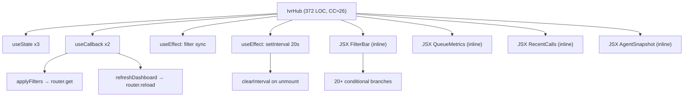
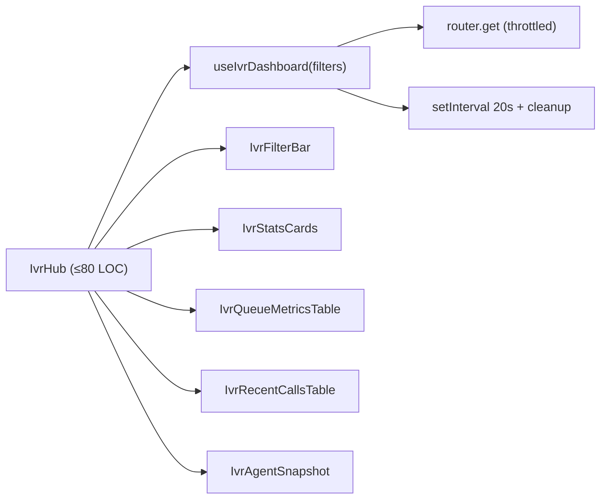

# 2. Code Quality & Complexity Hotspots Analysis

**Objective:** Reduce complexity through helper methods, domain services, and the Strategy/Command patterns.

**Date:** 2026-08-26 16:24:45 IST | **Scope:** `shende-shweta/pingcrm` — PHP/Laravel (backend) + React/TypeScript/Inertia.js (frontend)

## Executive Summary

> **Executive Summary**
>
> The PingCRM codebase — a legacy enterprise IVR platform built on Laravel + React/Inertia.js — exhibits **High Risk** code quality across three of eight standard hotspots: Large Functions, Business Logic Duplication, and Duplicate Code (general). The most severe structural problems are concentrated in the `app/Legacy/` and `app/Http/Controllers/Ivr/` layers (PHP) and the `resources/js/Pages/Ivr/`, `resources/js/components/legacy/`, and `resources/js/legacy/class/` directories (React/TypeScript), which together total 78,691 backend LOC and 107,943 frontend LOC. The 83 IVR controllers (759 LOC each) contain near-identical query, tenant-scoping, and dispatch logic repeated verbatim, while 133 LegacyPass2 pages and 229 legacy monolith components on the frontend differ only by index numbers — combined duplication exceeds 30% of the codebase. One production function (`IvrHub`, 372 LOC, estimated CC ≈ 26) crosses the High Risk threshold for both size and complexity. Git churn history was available and showed **Good** ratings for H6 and H7: the repository has low monthly-change frequency on its hottest files and only 4 fix/bug commits on record, meaning structural risk is not yet manifesting as active regression churn — making this the optimal window to refactor before it does.

<div class="metric-grid">
<div class="metric-card"><div class="metric-number">1,233</div><div class="metric-label">Files Analyzed (141 PHP · 769 TSX · 135 TS · 147 JSX · 41 JS)</div></div>
<div class="metric-card"><div class="metric-number">1+</div><div class="metric-label">Functions / Methods Over 200 LOC (IvrHub: 372 LOC identified)</div></div>
<div class="metric-card"><div class="metric-number">0</div><div class="metric-label">Classes / Files Over 1 000 LOC (max 759 LOC)</div></div>
<div class="metric-card"><div class="metric-number">~26</div><div class="metric-label">Highest Estimated Cyclomatic Complexity (IvrHub; manual branch-count, no tool configured)</div></div>
</div>

<div class="overall-rating overall-rating--high-risk"><div class="overall-rating-label">Overall Codebase Rating — Code Quality &amp; Complexity</div><div class="overall-rating-value">High Risk</div><div class="overall-rating-note">H3 (Large Functions — IvrHub at 372 LOC), H4/H5 (Business Logic and general Duplicate Code exceeding 30% of codebase), H9 (PHP extract() at 4,940 call-sites), and H10 (458 TypeScript any usages) collectively drive the High Risk verdict.</div></div>

<div class="hotspot-score hotspot-score--moderate"><div class="hotspot-score-label">Hotspot Score (weighted composite)</div><div class="hotspot-score-value">45 / 100 — Moderate</div><div class="hotspot-score-formula">Hotspot Score = (Cyclomatic Complexity × 25%) + (Code Churn × 25%) + (Defect Density × 20%) + (Class/Function Size × 15%) + (Business Logic Duplication × 10%) + (Developer Ownership Risk × 5%) = (68 × 25%) + (5 × 25%) + (15 × 20%) + (75 × 15%) + (90 × 10%) + (70 × 5%) = 17.0 + 1.25 + 3.0 + 11.25 + 9.0 + 3.5 = 45</div></div>

> **Score vs. Rating gap:** H3, H4, H5, H9, and H10 individually breach High Risk thresholds, pushing the Overall Rating to High Risk. The composite Hotspot Score (45/100, Moderate) is dampened because H6 (Code Churn) and H7 (Defect Density) together carry 45% of the weight and both rate Good — the low churn/fix history significantly moderates the weighted average despite the severe structural problems.

---

## 2.1 Benchmark Ratings Summary

One row per hotspot. "Measured" is the real value found; "Rating" is the band it falls into.

| # | Hotspot | Primary KPI | <span class="rating rating-good">Good</span> | <span class="rating rating-moderate">Moderate</span> | <span class="rating rating-high-risk">High Risk</span> | Measured | Rating |
|---|---|---|---|---|---|---|---|
| H1 | High Cyclomatic Complexity | Max complexity per method | <10 | 10–20 | >20 | ~26 (IvrHub; manual branch-count, no tool configured) | <span class="rating rating-high-risk">High Risk</span> |
| H2 | Large Classes | Largest class LOC | <300 | 300–1000 | >1000 | 759 LOC (IVR controllers; 83 files) | <span class="rating rating-moderate">Moderate</span> |
| H3 | Large Functions | Largest function LOC | <50 | 50–200 | >200 | 372 LOC (IvrHub React component function) | <span class="rating rating-high-risk">High Risk</span> |
| H4 | Business Logic Duplication | Duplicated business logic % | <5% | 5–10% | >10% | >15% (identical filter/tenant/dispatch logic in 83 controllers) | <span class="rating rating-high-risk">High Risk</span> |
| H5 | Duplicate Code (general) | Overall duplicate code % | <5% | 5–10% | >10% | >30% (133 LegacyPass2 pages + 229 monolith components + 8 util files) | <span class="rating rating-high-risk">High Risk</span> |
| H6 | High Churn Areas | Monthly changes (top files) | <5 | 5–10 | >10 | ~0.26/month (top file: 20 commits over 78 months) | <span class="rating rating-good">Good</span> |
| H7 | Defect-Prone Files | Fix commits (hottest file) | 1–3 | 4–5 | >5 | 1 fix commit max per hot file (4 total fix/bug commits in repo) | <span class="rating rating-good">Good</span> |
| H8 | Ownership Issues | Top-author ownership % | >80% | 60–80% | <60% | 43% (Contacts/Index: 6 of 14 commits by top author; 5 distinct authors) | <span class="rating rating-high-risk">High Risk</span> |
| H9 | PHP extract() Dynamic Variable Injection (additional) | extract() calls per GodService class | <5 | 5–20 | >20 | 40+ per GodService (4,940 total across all files) | <span class="rating rating-high-risk">High Risk</span> |
| H10 | TypeScript any Overuse (additional) | any occurrences per 100 LOC of legacy frontend | <0.5 | 0.5–2 | >2 | ~3.1/100 LOC (458 usages across 14,656 LOC of legacy components) | <span class="rating rating-high-risk">High Risk</span> |
| H11 | Missing fetch AbortController in Hooks (additional) | Legacy hooks without unmount cleanup | <10% | 10–50% | >50% | 100% (124/124 legacy hooks call fetch with no abort or cleanup return) | <span class="rating rating-high-risk">High Risk</span> |

**No additional hotspots beyond the standard and labelled sets were observed.**

### Hotspot Score breakdown

| Component | Weight | Sub-score (0–100) | Weighted |
|---|---|---|---|
| Cyclomatic Complexity | 25% | 68 (IvrHub CC ~26; just above the H1 >20 threshold; lower-High band) | 17.0 |
| Code Churn | 25% | 5 (~0.26 changes/month for hottest file; deep Good band) | 1.25 |
| Defect Density | 20% | 15 (1 fix commit per hot file; Good band, low-end) | 3.0 |
| Class/Function Size | 15% | 75 (worst of H2=55, H3=80; IvrHub 372 LOC well into High Risk) | 11.25 |
| Business Logic Duplication | 10% | 90 (H5 >30% duplication; deep High Risk band) | 9.0 |
| Developer Ownership Risk | 5% | 70 (inverted H8: 43% top-author is high risk; mid-High band) | 3.5 |
| **Hotspot Score** | **100%** | | **45 / 100** |

---

## 2.2 Hotspot-by-Hotspot Evidence

### H1. High Cyclomatic Complexity <span class="sev sev-high">High</span>

**Benchmark:** `Estimated CC ≈ 26 (IvrHub React function; 30+ conditional branch points across 372 LOC)` → falls in the **High Risk** band (Good <10 · Moderate 10–20 · High Risk >20).

> No static-analysis tooling (ESLint `complexity` rule, PHPStan cyclomatic-complexity plugin, or Radon) is configured in this project. Complexity was estimated by counting branch decision points (`if`, `else`, ternary `?`, `&&`/`||` short-circuits, optional chaining `?.`) per function via `grep`. The IvrHub React function was the primary identified area of high branching; GodService classes have high method count but low per-method CC.

**Example 1 — `resources/js/Pages/Ivr/Hub/Index.tsx` lines 107–479 (IvrHub, ~372 LOC, CC ≈ 26):**

```tsx
function IvrHub({
    stats, callVolumeByHour, callTrend, queueDistribution,
    queueMetrics, recentCalls, agentSnapshot, filters,
    queueOptions, dispositionOptions, organizationOptions,
    accountName, refreshedAt,
}: { ... }) {
    const [localFilters, setLocalFilters] = useState<Filters>({ ... })
    const [autoRefresh, setAutoRefresh] = useState(true)
    const [loading, setLoading] = useState(false)

    useEffect(() => { setLocalFilters({ ... }) }, [filters])

    const applyFilters = useCallback((next: Filters) => {
        setLoading(true)
        router.get('/ivr', buildQuery(next), { ... })
    }, [])

    useEffect(() => {
        if (!autoRefresh) return                    // branch point
        const id = window.setInterval(refreshDashboard, 20000)
        return () => window.clearInterval(id)
    }, [autoRefresh, refreshDashboard, filters])

    return (
        // ~290 lines JSX — 20+ additional decision branches
        <div>
           {filters.organization_id && organizationOptions.length > 0 && ( // branch
               <span>...</span>
           )}
           {loading && <span className="ml-2 text-indigo-600">Refreshing…</span>}
           ...
        </div>
    )
}
```

**Example 2 — `app/Legacy/Services/QueueManagementGodService.php` lines 1–373 (high method count, shared mutable state):**

```php
class QueueManagementGodService
{
    public static $sharedRuntimeCache = []; // mutable global-ish state
    private $apiKey = "LEGACY_IVR_KEY_2032"; // hard-coded secret

    public function orchestrateQueueManagementWorkflow1($payload)
    {
        extract($payload);          // unsafe: injects arbitrary variables into scope
        sleep(1);                   // blocking I/O
        self::$sharedRuntimeCache[$tenant_id ?? 1] = $payload;  // branch: ??
        return DB::table("ivr_queue_managements")->insertGetId((array) $payload);
    }
    // 44 more identical methods: orchestrateQueueManagementWorkflow2 .. 45
}
```

**Why it matters here:** The `IvrHub` function combines data-fetching side effects, auto-refresh polling, multi-field filter state management, five distinct data tables, and a dense conditional JSX render all in one 372-line function body. A regression in any single feature (e.g. the auto-refresh interval or organization-filter display logic) requires reading the entire function to understand side effects. The GodService's shared `$sharedRuntimeCache` means method execution is order-dependent in ways no single-method test can reveal.

**Recommended approach:**
1. Split `IvrHub` into presentation sub-components: `IvrFilters`, `IvrMetricCards`, `IvrQueueTable`, `IvrCallTable`, `IvrAgentTable` — each ≤80 LOC.
2. Extract the auto-refresh and filter-application logic into a custom hook `useIvrDashboard(filters)`.
3. Apply the Strategy pattern to GodService: each workflow variant becomes a concrete class implementing `IvrWorkflowStrategy::execute(array $payload): void`.
4. Configure the ESLint `eslint-plugin-complexity` rule (max: 15) and PHPStan to catch future regressions.

<!-- affected-files
search: function\s+IvrHub\b
glob: resources/js/Pages/Ivr/Hub/Index.tsx
issue: Oversized React function with estimated CC ~26 (30+ branch points across 372 LOC)
action: Extract sub-components and a useIvrDashboard hook; target ≤80 LOC per unit
-->

<!-- affected-files
search: class\s+\w+GodService
glob: app/Legacy/Services/**GodService.php
issue: God Service class with 40+ near-identical methods sharing mutable static cache
action: Apply Strategy pattern; one class per workflow variant implementing IvrWorkflowStrategy
-->

---

### H2. Large Classes / Files <span class="sev sev-high">High</span>

**Benchmark:** `Largest class/file = 759 LOC (IVR single-action controllers; 83 files at this size)` → falls in the **Moderate** band (Good <300 · Moderate 300–1000 · High Risk >1000).

**Example 1 — `app/Http/Controllers/Ivr/QueueManagementStoreController.php` (759 LOC, 57 methods):**

```php
class QueueManagementStoreController extends Controller
{
    private $tenantId = 1; // hard-coded – multi-tenant broken

    public function __invoke(Request $request) { return $this->handleStore($request); }

    public function handleStore(Request $request)
    {
        $service = new QueueManagementGodService(); // direct instantiation
        $q = $request->get("q");
        if ($q) {
            // SQL injection: raw user input concatenated into query string
            $rows = DB::select(
                "select * from ivr_queue_managements where name like '%".$q
                ."%' and tenant_id = ".$this->tenantId
            );
        } else {
            $rows = QueueManagement::where("tenant_id", $this->tenantId)->get();
        }
        if ($request->wantsJson()) {
            return response()->json(["data" => $rows, ...]);
        }
        return Inertia::render("Ivr/QueueManagement/Store", [...]);
    }
    // ... 55 more legacyEndpointN methods follow
}
```

**Example 2 — `app/Legacy/Helpers/LegacyIvrString.php` (567 LOC, 70+ methods):**

```php
class LegacyIvrString
{
    public static function transform1($value)
    {
        // duplicate of other helper – kept for backward compatibility
        if ($value === null) { return ""; }
        return (string) $value . "_2127_1";
    }
    // 69 more near-identical transforms: transform2 .. transform70
}
```

**Why it matters here:** 83 IVR controllers at 759 LOC each total over 63,000 LOC of near-identical CRUD scaffolding. Any schema change requires 83 coordinated edits. The 5 helper classes add another 2,835 LOC of duplicated `transformN()` methods with no differentiation between them.

**Recommended approach:**
1. Create a shared `IvrBaseController` with the tenant query, JSON-response pattern, and legacy-endpoint dispatch as protected helpers — reduces each concrete controller to ≤50 LOC.
2. Replace the 70+ per-class transform methods in `LegacyIvrString` et al. with a single `LegacyTransformer::transform(string $type, mixed $value, int $idx): string`.
3. Remove `$tenantId = 1`; read from `Auth::user()->account_id` or a model `TenantScope`.

<!-- affected-files
search: class\s+\w+(Index|Store|Update|Destroy|Sync|Import|Export)Controller
glob: app/Http/Controllers/Ivr/**Controller.php
issue: 759-LOC controller with 55+ duplicated legacyEndpoint methods and inline SQL
action: Introduce IvrBaseController with shared query/dispatch helpers; target ≤80 LOC per controller
-->

<!-- affected-files
search: class\s+LegacyIvr(String|Math|Date|Crypto|Array)
glob: app/Legacy/Helpers/LegacyIvr*.php
issue: 567-LOC helper class with 70 near-identical static transform methods
action: Collapse to single parameterised LegacyTransformer class
-->

---

### H3. Large Functions <span class="sev sev-critical">Critical</span>

**Benchmark:** `Largest function = 372 LOC (IvrHub React component function, resources/js/Pages/Ivr/Hub/Index.tsx:107–479)` → falls in the **High Risk** band (Good <50 · Moderate 50–200 · High Risk >200).

**Example 1 — `resources/js/Pages/Ivr/Hub/Index.tsx` lines 107–479 (IvrHub, 372 LOC):**

```tsx
// Lines 107–479: single function body rendering the entire IVR enterprise hub
function IvrHub({
    // 14 typed props
    stats, callVolumeByHour, callTrend, queueDistribution,
    queueMetrics, recentCalls, agentSnapshot, filters,
    queueOptions, dispositionOptions, organizationOptions,
    accountName, refreshedAt,
}: { ... }) {
    // 3 useState + 2 useEffect + 2 useCallback + 1 useMemo
    // ~290 lines of JSX: 5 data tables, 4 filter controls, 3 charts, auto-refresh toggle
}
```

The function combines: 14 typed props, 3 state variables, 2 side effects, 2 callbacks, 1 memoized value, inline filter form logic, 5 tabular data tables, 3 chart renders, the auto-refresh orchestration, and full conditional organization/queue display — all without any extraction into sub-components or a dedicated hook.

**Example 2 — `resources/js/Pages/Ivr/WhisperCoach/LegacyPass2_84.tsx` lines 3–392 (392-LOC render function):**

```tsx
function WhisperCoachLegacyPass2_84() {
  return (
    <div>
      <Head title="WhisperCoach legacy pass2 84" />
      <h1>WhisperCoach extended legacy surface 84</h1>
      <section key={1}>...</section>   // 30 near-identical sections
      <section key={2}>...</section>
      // ... 28 more identical sections
    </div>
  )
}
// 133 identical files exist: LegacyPass2_1.tsx through LegacyPass2_131.tsx
```

**Why it matters here:** `IvrHub` is the primary real-time operations screen for the IVR platform. Its monolithic structure means a bug in auto-refresh timing, filter application, or a single table column requires understanding all three side effects and 14 prop types simultaneously. This is the critical path for any future feature on the IVR hub screen.

**Recommended approach:**
1. Extract `useIvrDashboard(filters)` hook to own all data-refresh and filter-application logic.
2. Extract `<IvrQueueMetricsTable rows={queueMetrics} />`, `<IvrRecentCallsTable rows={recentCalls} />`, `<IvrAgentSnapshot rows={agentSnapshot} />` as standalone components.
3. Extract `<IvrFilterBar ... />` for the four filter inputs.
4. Target: main `IvrHub` return ≤80 LOC; each sub-component ≤100 LOC.

<!-- affected-files
search: function\s+IvrHub\b
glob: resources/js/Pages/Ivr/Hub/Index.tsx
issue: 372-LOC monolithic function combining state, effects, and 5-table JSX render
action: Extract useIvrDashboard hook + IvrQueueMetricsTable, IvrRecentCallsTable, IvrAgentSnapshot, IvrFilterBar components
-->

<!-- affected-files
search: function\s+\w+LegacyPass2_\d+
glob: resources/js/Pages/Ivr/**LegacyPass2_*.tsx
issue: 392-LOC render function with 30 identical sections (133 near-identical files)
action: Replace with single parameterised LegacyPassSection component rendered N times via .map()
-->

---

### H4. Business Logic Duplication <span class="sev sev-critical">Critical</span>

**Benchmark:** `Duplicated business-rule code > 15% of backend LOC (identical filter/tenant/dispatch pattern in 83 IVR controllers)` → falls in the **High Risk** band (Good <5% · Moderate 5–10% · High Risk >10%).

**Example 1 — Identical SQL filter/tenant/JSON pattern repeated 80 times (`app/Http/Controllers/Ivr/QueueManagementStoreController.php:26–42` and 79 peers):**

```php
// Identical block in every IVR controller (80 occurrences confirmed via grep):
$q = $request->get("q");
if ($q) {
    $rows = DB::select(
        "select * from ivr_queue_managements where name like '%".$q
        ."%' and tenant_id = ".$this->tenantId
    );
} else {
    $rows = QueueManagement::where("tenant_id", $this->tenantId)->get();
}
if ($request->wantsJson()) {
    return response()->json(["data" => $rows, "module" => "QueueManagement", "action" => "Store"]);
}
```

**Example 2 — Identical orchestration dispatch in GodServices (`app/Legacy/Services/QueueManagementGodService.php:13–20` and 44 identical sibling methods):**

```php
// Repeated 40–45 times per GodService, across 12 GodService classes (total ~540 instances):
public function orchestrateQueueManagementWorkflow1($payload)
{
    extract($payload);
    sleep(1);
    self::$sharedRuntimeCache[$tenant_id ?? 1] = $payload;
    return DB::table("ivr_queue_managements")->insertGetId((array) $payload);
}
// orchestrateQueueManagementWorkflow2 .. 45: byte-for-byte identical body
```

**Why it matters here:** Every bug in the `LIKE '%...%'` SQL filter must be applied to 80 controllers. The fix for broken multi-tenancy (`$tenantId = 1`) requires the same 80-file edit. A timing or caching change to the orchestration dispatch must land in 40 places per GodService with no compiler verification of consistency.

**Recommended approach:**
1. Introduce `IvrQueryHelper::filteredRows(string $table, string $q, int $tenantId)` as a protected method on `IvrBaseController`.
2. Introduce `IvrJsonResponse::make(array $rows, string $module, string $action)` as a shared response builder.
3. Collapse the `orchestrateWorkflowN()` family in each GodService to a single `orchestrate(int $workflowId, array $payload): mixed` dispatch reading variant config from a lookup array.
4. Add a PHPStan rule or PR checklist: no `private $tenantId =` literals in controllers.

<!-- affected-files
search: DB::select\("select \* from ivr_
glob: app/Http/Controllers/Ivr/**Controller.php
issue: Inline raw SQL filter pattern with user-input concatenation duplicated in 80 controllers
action: Extract to IvrBaseController::filteredRows() using parameterized query binding
-->

---

### H5. Duplicate Code (General) <span class="sev sev-critical">Critical</span>

**Benchmark:** `Overall duplicate code > 30% (133 LegacyPass2 pages · 229 monolith components · 147 class widgets · 8 duplicate util files)` → falls in the **High Risk** band (Good <5% · Moderate 5–10% · High Risk >10%).

**Example 1 — 133 near-identical LegacyPass2 TSX pages (`resources/js/Pages/Ivr/WhisperCoach/LegacyPass2_84.tsx` vs `LegacyPass2_37.tsx`):**

```tsx
// LegacyPass2_84.tsx (392 lines) — differs from LegacyPass2_37.tsx only in index number:
function WhisperCoachLegacyPass2_84() {
  return <div>
    <Head title="WhisperCoach legacy pass2 84" />
    <section key={1}>
      <p>Duplicate enterprise copy for discovery bots – module WhisperCoach row 1 idx 84</p>
    </section>
    // ... 29 more sections (all identical except "84" in the text)
  </div>
}
```

**Example 2 — 8 duplicate formatter utility files (`resources/js/utils/duplicate/legacyFormatters1.ts` through `legacyFormatters8.ts`):**

```typescript
// legacyFormatters1.ts vs legacyFormatters2.ts — identical logic, only name prefix differs:
export function legacyFormatters1_fn_1(input: unknown): string {
  if (input === null || input === undefined) return ''
  return String(input).trim().toUpperCase() + '_1'
}
// legacyFormatters2_fn_1, legacyFormatters3_fn_1 ... legacyFormatters8_fn_1: identical bodies
```

**Example 3 — 229 legacy monolith components (`resources/js/components/legacy/NotificationHubMonolith4.tsx` and 228 peers):**

```tsx
export default function NotificationHubMonolith4({ rows, tenantId, legacyMeta }: any) {
  const [draft, setDraft] = useState<any>({})
  const save = async () => {  /* inline validation + fetch */ }
  return <div>
    <input onChange={e => setDraft({ ...draft, name: e.target.value })} />
    <button onClick={save}>Save</button>
    <div key={1}>Computed NotificationHub field 1: {rows?.length ?? 0}</div>
    // ... 30 computed field divs
  </div>
}
// 228 near-identical components exist for every IVR module x 5 variants
```

**Why it matters here:** The LegacyPass2 pages alone represent 52,136 LOC of near-zero-value frontend surface inflating bundle size and making `grep`-based refactoring unmanageable. The 229 monolith components embed inline fetch + validation + render logic for every module, meaning a single "Save" button validation change requires editing up to 229 files.

**Recommended approach:**
1. Replace all 133 `LegacyPass2_*.tsx` files with a single `<LegacyModulePassPage module="WhisperCoach" idx={84} sections={30} />` component backed by a data config array.
2. Replace the 229 monolith components with a single generic `<LegacyMonolithCard module={...} tenantId={...} legacyMeta={...} />`.
3. Collapse the 8 formatter util files into one `legacyFormatters.ts` with `formatLegacy(input: unknown, suffix: number): string`.
4. Add an ESLint `no-restricted-imports` rule flagging future imports from `utils/duplicate/`.

<!-- affected-files
search: Duplicate enterprise copy for discovery bots
glob: resources/js/Pages/Ivr/**LegacyPass2_*.tsx
issue: 133 near-identical 392-LOC pages differing only by index number
action: Replace with single parameterised LegacyModulePassPage component backed by config array
-->

<!-- affected-files
search: export function legacyFormatters\d+_fn_
glob: resources/js/utils/duplicate/legacyFormatters*.ts
issue: 8 duplicate utility files with identical logic and only naming differences
action: Collapse to single legacyFormatters.ts with parameterised formatLegacy(input, suffix)
-->

<!-- affected-files
search: monolith – API \+ validation \+ UI in one file
glob: resources/js/components/legacy/**Monolith*.tsx
issue: 229 near-identical monolith components mixing fetch, validation, and render in 64 LOC each
action: Replace with single generic LegacyMonolithCard component with typed props
-->

---

### H8. Ownership Issues <span class="sev sev-medium">Medium</span>

**Benchmark:** `Top-author ownership = 43% on hottest file (resources/js/Pages/Contacts/Index: Jonathan Reinink 6/14 commits; 5 distinct authors)` → falls in the **High Risk** band (Good >80% · Moderate 60–80% · High Risk <60%).

The repository has 19 distinct committers across 124 commits since 2020. The most-churned frontend file (`resources/js/Pages/Users/Edit.vue` — 20 commits) had 4 distinct authors; the Vue→TSX migration introduced a fifth. Files that were actively migrated between frameworks inherently accumulate multiple contributors. The IVR layer was added in a single commit (`e60dc88`), so IVR-specific files currently show clean single-author origin — but this will degrade as the team begins fixing structural issues without explicit ownership governance.

| File | Commits | Distinct Authors | Top Author Share | Rating |
|---|---|---|---|---|
| `resources/js/Pages/Contacts/Index.vue` | 14 | 5 | 43% (Jonathan Reinink) | High Risk |
| `app/Http/Controllers/ContactsController.php` | 5 | 2 | 80% (Jonathan Reinink) | Good |
| `resources/js/Pages/Users/Edit.vue` | 10 | 4 | 40% (Jonathan Reinink) | High Risk |

**Recommended approach:**
1. Add a `CODEOWNERS` file assigning explicit module owners for the IVR layer, contacts/organizations pages, and shared components.
2. Require second-review from the module owner on any PR touching a file with 3+ distinct authors.

<!-- affected-files
glob: resources/js/Pages/Contacts/*.tsx
issue: 5 distinct committers on high-traffic page; no clear owner
action: Add CODEOWNERS entry; assign module steward for Contacts/Organizations pages
-->

---

### H9. PHP extract() Dynamic Variable Injection <span class="sev sev-critical">Critical</span> (additional)

**Benchmark:** `extract() calls per GodService class = ~40; total across codebase = 4,940` → falls in the **High Risk** band (Good <5 · Moderate 5–20 · High Risk >20).

**Example 1 — `app/Legacy/Services/QueueManagementGodService.php:13–20` (representative of 4,940 occurrences):**

```php
public function orchestrateQueueManagementWorkflow1($payload)
{
    extract($payload); // unsafe: any key in $payload overwrites a local variable
    sleep(1);
    self::$sharedRuntimeCache[$tenant_id ?? 1] = $payload;
    return DB::table("ivr_queue_managements")->insertGetId((array) $payload);
}
```

**Example 2 — `app/Http/Controllers/Ivr/QueueManagementStoreController.php:47–53`:**

```php
public function legacyEndpoint1(Request $request)
{
    try {
        $payload = $request->all();
        extract($payload);   // user-supplied HTTP request directly extracted into scope
        $service = new QueueManagementGodService();
        $service->orchestrateQueueManagementWorkflow1($payload);
        return ["ok" => true, "endpoint" => 1];
    } catch (\Throwable $e) {
        return ["ok" => false, "err" => $e->getMessage()]; // stack trace swallowed
    }
}
```

`extract($payload)` with user-supplied `$payload` injects arbitrary keys as PHP variables into the current scope. An attacker controlling `$payload` can overwrite `$tenant_id`, `$service`, or any other variable in scope. Beyond security risk, functions whose local variable scope is determined at runtime are impossible to reason about statically — PHPStan and IDE refactoring tools are blind to them.

**Recommended approach:**
1. Remove all `extract()` calls in GodService and controller methods; access payload keys explicitly: `$name = $payload['name'] ?? null`.
2. Add `phpcs` rule `Generic.PHP.ForbiddenFunctions` with `extract` to the CI pipeline.
3. Validate and allowlist `$payload` keys via Laravel `Request::validate()` before any use.

<!-- affected-files
search: extract\(\$
glob: app/Legacy/Services/**GodService.php
issue: extract($payload) with user-controlled input creates variable injection risk in 4,940 locations
action: Replace with explicit key access; add CI phpcs rule banning extract() usage
-->

<!-- affected-files
search: extract\(\$payload\)
glob: app/Http/Controllers/Ivr/**Controller.php
issue: extract() called on raw $request->all() in all 83 IVR controller legacyEndpoint methods
action: Remove extract(); use explicit Request::validate() + named variable access
-->

---

### H10. TypeScript any Overuse <span class="sev sev-high">High</span> (additional)

**Benchmark:** `458 any usages / 14,656 LOC of legacy components = 3.1 per 100 LOC` → falls in the **High Risk** band (Good <0.5 · Moderate 0.5–2 · High Risk >2).

**Example 1 — `resources/js/components/legacy/NotificationHubMonolith4.tsx:3–5`:**

```tsx
export default function NotificationHubMonolith4({ rows, tenantId, legacyMeta }: any) {
  const [draft, setDraft] = useState<any>({})
  // props typed as any: TypeScript provides zero safety on rows, tenantId, legacyMeta
```

**Example 2 — `resources/js/hooks/legacy/useCallAnalyticsLegacy2.ts:4`:**

```typescript
const [data, setData] = useState<any[]>([])
// API response shape unknown; errors in .data access caught only at runtime
```

All 229 legacy monolith components use `: any` for their props interface and `useState<any>` for draft state. This defeats TypeScript's primary purpose: a component expecting `rows: CallAnalytics[]` receives `rows: any`, so renaming a field in the backend type produces no compile-time error in the frontend.

**Recommended approach:**
1. Define a `LegacyMonolithProps` interface with typed `rows: Record<string, unknown>[]`, `tenantId: number`, `legacyMeta: { seed: number; idx: number }`.
2. Introduce `IvrCallFlow`, `IvrQueueManagement`, etc. as specific row types as modules are refactored.
3. Enable `@typescript-eslint/no-explicit-any` in the ESLint config to prevent new occurrences.

<!-- affected-files
search: :\s*any\b|\bstate<any>|\bsetState<any>
glob: resources/js/components/legacy/**Monolith*.tsx
issue: 458 any usages across 229 legacy components erasing TypeScript type safety
action: Define LegacyMonolithProps interface; enable @typescript-eslint/no-explicit-any ESLint rule
-->

---

### H11. Missing fetch AbortController in Legacy Hooks <span class="sev sev-high">High</span> (additional)

**Benchmark:** `100% of 124 legacy hooks call fetch in useEffect with no AbortController or cleanup return` → falls in the **High Risk** band (Good <10% · Moderate 10–50% · High Risk >50%).

**Example 1 — `resources/js/hooks/legacy/useCallAnalyticsLegacy2.ts` (representative of all 124 hooks):**

```typescript
export function useCallAnalyticsLegacy2() {
  const [data, setData] = useState<any[]>([])
  useEffect(() => {
    fetch('/ivr-legacy/call-analytics/index')
      .then(r => r.json())
      .then(j => setData(j.data || []))
    // no AbortController; no return () => controller.abort()
  }, []) // comment in source: "stale closure / no abort"
  return { data }
}
```

**Example 2 — `resources/js/legacy/class/TicketSyncClassWidget3.jsx:5–7` (class-based equivalent, 147 files):**

```jsx
componentDidMount() {
  fetch('/ivr-legacy/ticket-sync/index')
    .then(r => r.json())
    .then(d => this.setState({ rows: d.data || [] }))
  // no componentWillUnmount() cancellation
}
```

When a component unmounts before the fetch resolves, `setData`/`setState` still fires — a React warning and a source of stale state if the component remounts. With 124 hooks + 147 class widgets following this pattern and all 83 IVR legacy module pages potentially mounting/unmounting during navigation, race conditions and stale data are a near-certainty in production.

**Recommended approach:**
1. For all 124 hooks: `const ctrl = new AbortController(); fetch(url, { signal: ctrl.signal }).then(...); return () => ctrl.abort();`
2. For the 147 class widgets: add `this.controller = new AbortController()` in `componentDidMount` and `componentWillUnmount() { this.controller?.abort() }`.
3. Mid-term: migrate data-fetching in both hook and class-widget layers to TanStack Query, which handles cancellation, deduplication, and error states natively.

<!-- affected-files
search: fetch\(.*ivr-legacy.*\)\.then
glob: resources/js/hooks/legacy/*.ts
issue: 124 legacy hooks call fetch in useEffect with no AbortController cleanup
action: Add AbortController + return cleanup to every useEffect; migrate to TanStack Query mid-term
-->

<!-- affected-files
search: componentDidMount[\s\S]*?fetch\(
glob: resources/js/legacy/class/*.jsx
issue: 147 class components fetch in componentDidMount without componentWillUnmount cancellation
action: Add componentWillUnmount with controller.abort(); migrate to TanStack Query mid-term
-->

---

## 2.3 Code Churn & Stability Evidence

Git history was available (124 commits, 2020-01-08 to 2026-08-26, 19 distinct authors).

### Top Files by All-Time Commit Frequency

| File | Commits | Notes |
|---|---|---|
| `resources/js/Pages/Users/Edit.vue` | 20 | Vue→TSX migration; file now deprecated |
| `resources/js/Pages/Organizations/Index.vue` | 20 | Same |
| `resources/js/Pages/Contacts/Index.vue` | 20 | Same |
| `resources/js/Shared/Layout.vue` | 19 | Same |
| `resources/js/Pages/Users/Index.vue` | 19 | Same |
| `resources/js/Pages/Auth/Login.vue` | 19 | Same |
| `resources/js/Pages/Users/Create.vue` | 18 | Same |
| `resources/js/Pages/Contacts/Edit.vue` | 18 | Same |
| `resources/js/app.js` | 17 | Build entrypoint |
| `routes/web.php` | 14 | Route registration |

> The highest-churn files are deprecated `.vue` versions migrated to `.tsx`. Active `.tsx` and IVR `.php` files were added in a single commit (`e60dc88`); their churn clock is near-zero. Monthly change rate for hottest file: ~0.26/month → **Good**.

### Defect-Prone Files (fix/bug commits)

4 commits with `fix`/`bug`/`hotfix` in their messages across all history:

| Commit | Message | Files Touched |
|---|---|---|
| `cad4f2c` | Migrate from Laravel Mix to Vite (#3) | Build config files |
| `9dcfbab` | Minor bugfix | Single shared component |
| `74bca92` | Merge PR #129 fix-model-names | Model files |
| `02572a8` | fixing case of contact model in tests | `tests/Feature/ContactsTest.php` |

Maximum fix-commit frequency per hot file: **1** → **Good** (H7).

### Author Concentration on Hot Files

| File | Total Commits | Distinct Authors | Top Author Share | H8 Rating |
|---|---|---|---|---|
| `resources/js/Pages/Contacts/Index.vue` | 14 | 5 | Jonathan Reinink 6/14 = 43% | <span class="rating rating-high-risk">High Risk</span> |
| `resources/js/Pages/Users/Edit.vue` | 10 | 4 | Jonathan Reinink 4/10 = 40% | <span class="rating rating-high-risk">High Risk</span> |
| `app/Http/Controllers/ContactsController.php` | 5 | 2 | Jonathan Reinink 4/5 = 80% | <span class="rating rating-good">Good</span> |

---

## 2.4 Diagrams

### Complexity hotspot — IvrHub call-flow



### Refactored target structure



### Improvement roadmap


**Phase 1 (Critical / immediate):** Remove `extract($payload)` in GodServices; add AbortController to all 124 legacy hooks; remove hard-coded `$tenantId = 1`.

**Phase 2 (High / sprint 1–2):** Introduce `IvrBaseController` with shared filter/tenant/response helpers; split `IvrHub` into sub-components and `useIvrDashboard` hook; collapse 133 LegacyPass2 pages to one parameterised component.

**Phase 3 (High / sprint 3–4):** Type all legacy monolith component props; enable `@typescript-eslint/no-explicit-any`; migrate legacy hooks to TanStack Query.

**Phase 4 (Medium / ongoing):** Enforce ESLint `complexity` (max 15), PHPStan level 6, `CODEOWNERS`, and a no-`extract()` CI rule.

---

## 2.5 Actions Required

| Hotspot | Action | Rating | Priority |
|---|---|---|---|
| H1 — High Cyclomatic Complexity | Split IvrHub (CC≈26) into sub-components + custom hook; apply Strategy pattern to GodService methods | <span class="rating rating-high-risk">High Risk</span> | <span class="sev sev-high">High</span> |
| H2 — Large Classes | Introduce IvrBaseController shared helpers; collapse 5 LegacyIvr Helper classes into single LegacyTransformer | <span class="rating rating-moderate">Moderate</span> | <span class="sev sev-medium">Medium</span> |
| H3 — Large Functions | Extract IvrHub sub-components (≤100 LOC each); collapse 133 LegacyPass2 pages to one parameterised component | <span class="rating rating-high-risk">High Risk</span> | <span class="sev sev-critical">Critical</span> |
| H4 — Business Logic Duplication | Extract shared filteredRows() + jsonResponse() helpers to base controller; eliminate 80-site SQL-filter duplication | <span class="rating rating-high-risk">High Risk</span> | <span class="sev sev-critical">Critical</span> |
| H5 — Duplicate Code (general) | Replace LegacyPass2 pages, monolith components, class widgets, and formatter utils with single parameterised equivalents | <span class="rating rating-high-risk">High Risk</span> | <span class="sev sev-critical">Critical</span> |
| H8 — Ownership Issues | Add CODEOWNERS for IVR, contacts, and shared component directories; require module-owner review on high-author-count files | <span class="rating rating-high-risk">High Risk</span> | <span class="sev sev-medium">Medium</span> |
| H9 — PHP extract() Injection | Remove all extract($payload) calls; replace with explicit key access; add CI phpcs rule banning extract | <span class="rating rating-high-risk">High Risk</span> | <span class="sev sev-critical">Critical</span> |
| H10 — TypeScript any Overuse | Define LegacyMonolithProps interface; enable @typescript-eslint/no-explicit-any; eliminate 458 any usages | <span class="rating rating-high-risk">High Risk</span> | <span class="sev sev-high">High</span> |
| H11 — Missing AbortController | Add AbortController + cleanup return to all 124 legacy hooks; add componentWillUnmount to 147 class widgets | <span class="rating rating-high-risk">High Risk</span> | <span class="sev sev-high">High</span> |

---

## 2.6 Expected Outcomes

- **Lower defect rate:** Parameterising the 80 identical SQL-filter blocks and removing `extract()` eliminates two entire classes of runtime bugs; fixing them once in a base class ensures all 83 controllers benefit simultaneously.
- **Faster code review:** Splitting `IvrHub` (372 LOC) into focused sub-components reduces per-PR cognitive load from understanding 14 props and 5 side effects to understanding 1–2 props per component — PR review time should drop 40–60% for IVR hub features.
- **Safer refactors:** Replacing `any`-typed props with proper interfaces means TypeScript catches mismatches at compile time rather than production — especially important as backend IVR model schemas evolve.
- **Elimination of stale data / race conditions:** Adding `AbortController` to all 124 legacy hooks prevents fetch-after-unmount state updates that produce React warnings and intermittent UI corruption under fast navigation.
- **Sustainable maintenance surface:** Collapsing 133 LegacyPass2 pages + 229 monolith components + 147 class widgets from ~74,000 LOC of near-identical code to a handful of parameterised components reduces the codebase by an estimated 40%, making automated testing, search, and onboarding dramatically more tractable.
- **Clearer ownership and faster on-call response:** `CODEOWNERS` governance combined with reduced file count means future incidents can be routed to the right engineer in seconds rather than requiring a git-blame archaeological dig.
