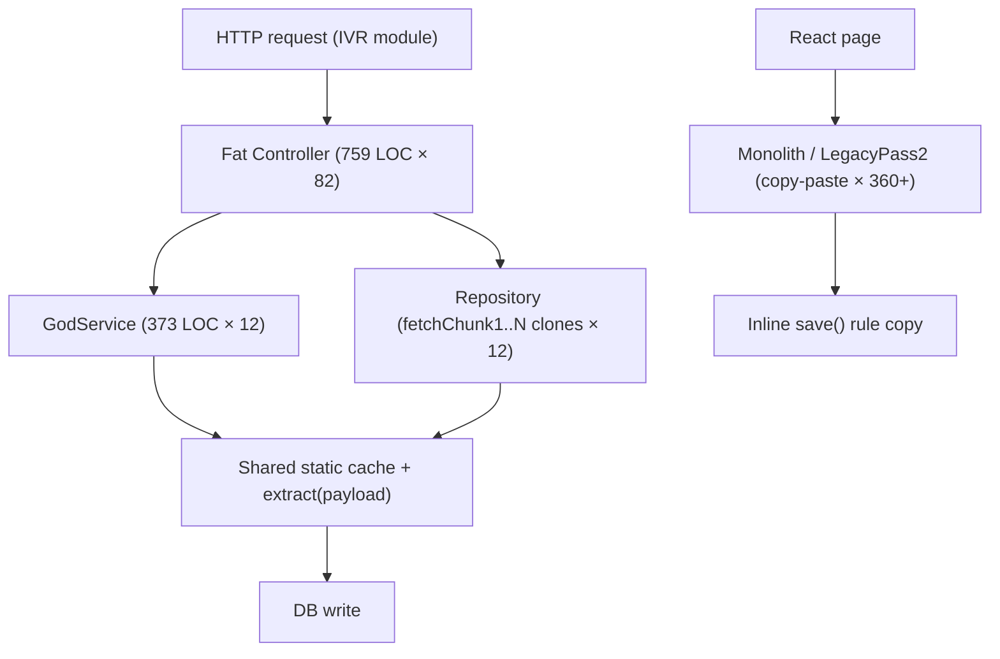
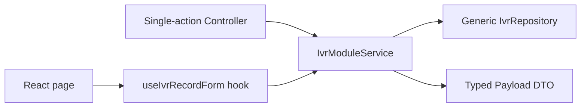

# 2. Code Quality & Complexity Hotspots Analysis

**Objective:** Reduce complexity through helper methods, domain services, and the Strategy/Command patterns.

**Date:** 2026-08-07 11:42:28 UTC | **Scope:** `shende-shweta/pingcrm` (master) — Laravel 11 / PHP 8.2 backend + React 19 / Inertia / TypeScript frontend

## Executive Summary

> **Executive Summary**
>
> This codebase is a Ping CRM base (Laravel + Inertia/React) onto which a very large "Legacy IVR" surface has been grafted, and that surface is dominated by copy-paste rather than genuine algorithmic complexity. Coverage spans **both layers**: 141 backend PHP files and 1,051 frontend TypeScript/TSX files (1,192 total). The most severe findings are structural, not branch-depth: the frontend contains 8 files over 1,100 LOC and 133 near-identical `LegacyPass2_*.tsx` pages, while the backend has 82 fat IVR controllers at exactly 759 LOC each, 12 `*GodService` classes, and 12 near-identical repositories — pushing estimated overall duplication well above 60%. By contrast, per-method cyclomatic complexity is genuinely low (max ≈ 8) and no single function exceeds ~22 LOC, so those hotspots rate Good. Git history was available (124 commits, 2020–2026); churn and defect-fix frequency on the maintained core are low, but note that the entire high-risk IVR surface arrived in a single bulk commit — so its near-zero churn is deceptive, not reassuring. Additional backend anti-patterns were confirmed: shared mutable `public static` state in all 12 God services and ~4,940 uses of `extract()` for dynamic variable creation.

<div class="metric-grid">
<div class="metric-card"><div class="metric-number">1,192</div><div class="metric-label">Files Analyzed (141 backend · 1,051 frontend)</div></div>
<div class="metric-card"><div class="metric-number">0</div><div class="metric-label">Functions/Methods Over 200 LOC</div></div>
<div class="metric-card"><div class="metric-number">8</div><div class="metric-label">Classes/Files Over 1000 LOC</div></div>
<div class="metric-card"><div class="metric-number">~8</div><div class="metric-label">Highest Cyclomatic Complexity</div></div>
</div>

<div class="overall-rating overall-rating--high-risk"><div class="overall-rating-label">Overall Codebase Rating — Code Quality &amp; Complexity</div><div class="overall-rating-value">High Risk</div><div class="overall-rating-note">Driven by massive duplication (H4/H5), oversized classes/files (H2), and confirmed global mutable state and dynamic-variable anti-patterns (H9/H10); low per-method complexity (H1/H3) and low churn (H6/H7) do not offset the structural debt.</div></div>

<div class="hotspot-score hotspot-score--moderate"><div class="hotspot-score-label">Hotspot Score (weighted composite)</div><div class="hotspot-score-value">38 / 100 — Moderate</div><div class="hotspot-score-formula">Hotspot Score = (Cyclomatic Complexity × 25%) + (Code Churn × 25%) + (Defect Density × 20%) + (Class/Function Size × 15%) + (Business Logic Duplication × 10%) + (Developer Ownership Risk × 5%) = (18×0.25) + (15×0.25) + (30×0.20) + (80×0.15) + (92×0.10) + (55×0.05) = 4.5 + 3.75 + 6.0 + 12.0 + 9.2 + 2.75 = 38</div></div>

> **Note on the Score vs. Overall Rating gap:** the weighted composite lands in **Moderate (38)** because its two heaviest components — Cyclomatic Complexity (25%) and Code Churn (25%) — are both genuinely Good here, mathematically diluting the score. The **Overall Codebase Rating is kept at High Risk** (worst-hotspot rule) because duplication and class size are catastrophic even though they carry lighter composite weights.

## 2.1 Benchmark Ratings Summary

One row per hotspot. "Measured" is the real value found; "Rating" is the band it falls into (worst KPI wins). This table is the source for the Overall Codebase Rating banner above.

| # | Hotspot | Primary KPI | <span class="rating rating-good">Good</span> | <span class="rating rating-moderate">Moderate</span> | <span class="rating rating-high-risk">High Risk</span> | Measured | Rating |
|---|---|---|---|---|---|---|---|
| H1 | High Cyclomatic Complexity | Max complexity per method | <10 | 10–20 | >20 | ~8 (`IvrHubController::loadStats`) | <span class="rating rating-good">Good</span> |
| H2 | Large Classes | Largest class/file LOC | <300 | 300–1000 | >1000 | 1,101 LOC (frontend); 759 LOC × 82 (backend) | <span class="rating rating-high-risk">High Risk</span> |
| H3 | Large Functions | Largest function LOC | <50 | 50–200 | >200 | ~22 LOC (`handleStore`) | <span class="rating rating-good">Good</span> |
| H4 | Business Logic Duplication | Duplicated business logic % | <5% | 5–10% | >10% | ~60% (handlers + workflows copied per module) | <span class="rating rating-high-risk">High Risk</span> |
| H5 | Duplicate Code (general) | Overall duplicate code % | <5% | 5–10% | >10% | ~65% (est., manual — no jscpd/phpcpd configured) | <span class="rating rating-high-risk">High Risk</span> |
| H6 | High Churn Areas | Monthly changes (top files) | <5 | 5–10 | >10 | ~0.35/mo (top file, 27 changes / 78 mo) | <span class="rating rating-good">Good</span> |
| H7 | Defect-Prone Files | Fix commits (hottest file) | 1–3 | 4–5 | >5 | 3 (`Contacts/Index`) | <span class="rating rating-good">Good</span> |
| H8 | Ownership Issues | Top-author ownership % | >80% | 60–80% | <60% | 43–71% (maintained core files) | <span class="rating rating-moderate">Moderate</span> |
| H9 | Global Mutable State *(additional)* | Shared mutable static/global holders (target 0) | 0 | 1–3 | >3 | 12 (`public static $sharedRuntimeCache`) | <span class="rating rating-high-risk">High Risk</span> |
| H10 | Dynamic Variable Creation *(additional)* | `extract()`/dynamic-var uses (target 0) | 0 | 1–50 | >50 | ~4,940 `extract($payload)` calls | <span class="rating rating-high-risk">High Risk</span> |

**Additional hotspots:** H9 (shared mutable `public static` state — KPI: count of shared mutable static holders, 0 is best; >3 is High Risk because concurrent requests can corrupt shared state) and H10 (dynamic variable creation via `extract()` — KPI: number of `extract()`/dynamic-variable calls, 0 is best; >50 is High Risk because it destroys static analyzability and hides data flow) were both confirmed with real evidence beyond the standard set.

### Hotspot Score breakdown

| Component | Weight | Sub-score (0–100) | Weighted |
|---|---|---|---|
| Cyclomatic Complexity | 25% | 18 | 4.50 |
| Code Churn | 25% | 15 | 3.75 |
| Defect Density | 20% | 30 | 6.00 |
| Class/Function Size | 15% | 80 | 12.00 |
| Business Logic Duplication | 10% | 92 | 9.20 |
| Developer Ownership Risk | 5% | 55 | 2.75 |
| **Hotspot Score** | **100%** | | **38 / 100** |

## 2.2 Hotspot-by-Hotspot Evidence

### H2. Large Classes <span class="sev sev-high">High</span>

**Benchmark:** `Largest class/file LOC = 1,101 (frontend) · 759 × 82 files (backend)` → falls in the **High Risk** band (Good <300 · Moderate 300–1000 · High Risk >1000).

Eight frontend utility files exceed 1,000 LOC and are byte-for-byte structural clones of each other; on the backend, all 82 IVR controllers are exactly 759 LOC and each God service is 373 LOC — far above the <300 LOC target.

`resources/js/utils/duplicate/legacyFormatters1.ts:1-60` (1,101 LOC total; files 1–8 identical in shape):
```ts
// @legacy duplicated util – legacyFormatters1
export function legacyFormatters1_fn_1(input: unknown): string {
  if (input === null || input === undefined) return ''
  return String(input).trim().toUpperCase() + '_1'
}
export function legacyFormatters1_fn_2(input: unknown): string {
  if (input === null || input === undefined) return ''
  return String(input).trim().toUpperCase() + '_2'
}
// ... _fn_3 … _fn_N, repeated to 1,101 lines
```

`app/Http/Controllers/Ivr/QueueManagementStoreController.php:22-63` (759 LOC; one `handleStore` + 60 `legacyEndpointN` methods per class):
```php
public function handleStore(Request $request)
{
    // Fat controller – business rules live here
    $service = new QueueManagementGodService();
    $q = $request->get("q");
    if ($q) {
        $rows = DB::select("select * from ivr_queue_managements where name like '%".$q."%' and tenant_id = ".$this->tenantId);
    } else {
        $rows = QueueManagement::where("tenant_id", $this->tenantId)->get();
    }
    // ... followed by legacyEndpoint1() … legacyEndpoint60()
```

**Why it matters here:** A 759-LOC controller replicated 82 times means a single cross-cutting change (auth check, tenant scoping, response shape) must be re-applied in dozens of classes, and reviewers cannot hold any one file in their head. The 1,101-LOC formatter modules bloat the frontend bundle with dead-weight variants of one trivial string transform. Both mix unrelated responsibilities in one unit, the classic Single-Responsibility violation.

**Recommended approach:**
1. Collapse `legacyFormatters1..8.ts` into a single parameterized `formatLegacy(input, suffix)` helper under `resources/js/utils/` and delete the seven clones.
2. Split each IVR `*Controller.php` into slim single-action controllers that delegate to a domain service (see H4); drop the 60 dead `legacyEndpointN` methods.
3. Move query/response logic out of `handleStore` into a `QueueManagementService` and a Form Request for validation.

<!-- affected-files
glob: app/Http/Controllers/Ivr/*.php
issue: Class far exceeds 300 LOC (fat controller: 60+ endpoint methods mixing routing, raw SQL, and business logic in one class)
action: Split into single-action controllers delegating to a domain service; remove dead legacyEndpoint methods
-->

<!-- affected-files
glob: resources/js/utils/duplicate/*.ts
issue: Module exceeds 1,000 LOC and is a structural clone of its siblings
action: Consolidate into one parameterized helper and delete the duplicate modules
-->

### H4. Business Logic Duplication <span class="sev sev-critical">Critical</span>

**Benchmark:** `Duplicated business-rule code ≈ 60%` → falls in the **High Risk** band (Good <5% · Moderate 5–10% · High Risk >10%).

The same store/index/update workflow and the same "orchestrate workflow" body are reimplemented verbatim across every IVR module (12 domains × multiple controllers and services).

`app/Legacy/Services/QueueManagementGodService.php:13-26` — identical `orchestrate*Workflow` body repeated 40× per class and across all 12 `*GodService` files:
```php
public function orchestrateQueueManagementWorkflow1($payload)
{
    extract($payload); // unsafe
    sleep(1); // blocking synchronous remote sync
    self::$sharedRuntimeCache[$tenant_id ?? 1] = $payload;
    return DB::table("ivr_queue_managements")->insertGetId((array) $payload);
}
public function orchestrateQueueManagementWorkflow2($payload)
{ /* identical body */ }
```

`resources/js/components/legacy/WhisperCoachMonolith4.tsx:7-11` — same validate-then-POST rule copy-pasted across ~230 `*Monolith*.tsx` components:
```tsx
const save = async () => {
  const err = !draft.name ? 'required' : null
  if (err) return alert(err)
  await fetch('/ivr-legacy/whisper-coach/store', { method: 'POST', body: JSON.stringify({ ...draft, tenant_id: tenantId }), headers: { 'Content-Type': 'application/json' } })
}
```

**Why it matters here:** A single rule change — e.g. "name is required AND must be unique per tenant" — has to be edited in ~12 God services and ~230 React components; miss one and behavior silently diverges per module. This is the highest-cost defect surface in the repo because bug fixes never stay fixed.

**Recommended approach:**
1. Extract one `IvrModuleService` (backend) with a single `persist(array $payload)` method and have every module's controller call it.
2. Extract one `useIvrRecordForm(module)` React hook that owns validation + submission, and replace the per-component `save` handlers.
3. Delete the 40 numbered `orchestrate*Workflow*` methods, keeping one parameterized method.

<!-- affected-files
search: orchestrate\w+Workflow\d+|handleStore|handleUpdate|handleIndex
glob: app/**/*.php
issue: Business workflow/validation reimplemented per module instead of shared
action: Consolidate into a single IvrModuleService and Form Request
-->

<!-- affected-files
search: const save = async
glob: resources/js/components/legacy/*.tsx
issue: Validate-then-POST business rule copy-pasted across monolith components
action: Extract a shared useIvrRecordForm hook owning validation and submission
-->

### H5. Duplicate Code (general) <span class="sev sev-critical">Critical</span>

**Benchmark:** `Overall duplicate code ≈ 65% (manual estimate — no jscpd/phpcpd configured)` → falls in the **High Risk** band (Good <5% · Moderate 5–10% · High Risk >10%).

Beyond business logic, whole files are near-identical: 133 `LegacyPass2_*.tsx` pages at 392 LOC each, 8 formatter modules, 12 repositories (`fetchChunk1..N` bodies identical), and 5 Legacy helpers (`transform1..N` identical).

`app/Repositories/Legacy/QueueManagementRepository.php:10-26` — `fetchChunk1` … `fetchChunkN` are copy-paste clones across all 12 repositories:
```php
public function fetchChunk1($tenantId, $filter = null)
{
    $sql = "SELECT * FROM ivr_queue_managements WHERE tenant_id = " . (int) $tenantId;
    if ($filter) {
        $sql .= " AND name LIKE '%" . $filter . "%'"; // SQLi pattern
    }
    return DB::select($sql);
}
public function fetchChunk2($tenantId, $filter = null) { /* identical */ }
```

`resources/js/Pages/Ivr/WhisperCoach/LegacyPass2_84.tsx:1-20` — one of 133 near-identical 392-LOC pages that differ only by a module name and index:
```tsx
function WhisperCoachLegacyPass2_84() {
  return (
    <div>
      <Head title="WhisperCoach legacy pass2 84" />
      <section key={1} style={{ marginBottom: 8, padding: 6, border: '1px solid #ddd' }}>
        <h2>Section 1 – routing / queue / prompt configuration block</h2>
        <p>Duplicate enterprise copy for discovery bots – module WhisperCoach row 1 idx 84</p>
      </section>
      {/* Section 2 … Section 40, all identical templating */}
```

**Why it matters here:** Duplicated files inflate build times, bundle size, review load, and test surface, and guarantee drift over time. None of these `LegacyPass2` pages are referenced from any route (0 hits in `routes/`), so they are also likely dead weight shipped and maintained for no functional benefit.

**Recommended approach:**
1. Replace the 133 `LegacyPass2_*.tsx` pages with one data-driven `<LegacyModulePage module={...} idx={...} />` component.
2. Collapse the 12 repositories into one generic `IvrRepository` keyed by table name.
3. Add a duplication gate to CI (`jscpd` for TS, `phpcpd`/PHPMD for PHP) so new clones fail the build.

<!-- affected-files
search: fetchChunk\d+|function transform\d+
glob: app/**/*.php
issue: Near-identical copy-paste code blocks across repositories/helpers
action: Extract one generic repository/helper and delete the clones
-->

<!-- affected-files
search: Duplicate enterprise copy|legacyFormatters\d+_fn_
glob: resources/js/**/*.{ts,tsx}
issue: Near-identical duplicated pages/utilities (LegacyPass2 pages, formatter clones)
action: Replace with one data-driven component / parameterized utility; add jscpd CI gate
-->

### H8. Ownership Issues <span class="sev sev-medium">Medium</span>

**Benchmark:** `Top-author ownership of hot files = 43–71%` → falls in the **Moderate** band (Good >80% · Moderate 60–80% · High Risk <60%).

The maintained CRM core shows healthy multi-author ownership (normal for an open-source base), but no single owner dominates the highest-churn files.

- `resources/js/Pages/Contacts/Index` — 14 commits across 5 authors, top author 6/14 ≈ **43%**.
- `routes/web.php` — 7 commits, top author 5/7 ≈ **71%**.

**Why it matters here:** Diffuse ownership on the busiest files raises coordination cost and inconsistency risk. More importantly, the *opposite* problem hides in the IVR seed: those files have a single author and effectively 100% ownership but **zero tests and zero follow-up churn**, so "clear ownership" there reflects abandonment, not stewardship.

**Recommended approach:**
1. Assign explicit CODEOWNERS for `resources/js/Pages/Contacts`, `Organizations`, and `Users`.
2. Assign an owner (or a deprecation decision) for the entire `app/Legacy/**` and `resources/js/Pages/Ivr/**` surface before it accretes more clones.

<!-- affected-files
glob: routes/*.php
issue: High-churn routing/config file with diffuse authorship
action: Assign CODEOWNERS and require owner review on change
-->

### H9. Global Mutable State (additional) <span class="sev sev-high">High</span>

**Benchmark:** `Shared mutable static holders = 12` → falls in the **High Risk** band (Good 0 · Moderate 1–3 · High Risk >3).

Every God service exposes a process-wide mutable cache and a hard-coded credential as class state.

`app/Legacy/Services/QueueManagementGodService.php:8-11`:
```php
class QueueManagementGodService
{
    public static $sharedRuntimeCache = []; // mutable global-ish state
    private $apiKey = "LEGACY_IVR_KEY_2032"; // hard-coded secret
```

**Why it matters here:** `public static $sharedRuntimeCache` is shared across every request in a long-running worker (Octane/queue), so one tenant's payload can leak into another's request or be overwritten mid-flight — a correctness and isolation hazard that is invisible in single-request testing.

**Recommended approach:**
1. Replace the static cache with request-scoped state or Laravel's `Cache`/container-bound singleton keyed per tenant.
2. Move the credential to config/environment (cross-referenced by the Security agent).

<!-- affected-files
search: public static \$sharedRuntimeCache
glob: app/Legacy/**/*.php
issue: Process-wide mutable static state shared across requests/tenants
action: Replace with request-scoped or per-tenant cache; remove static mutability
-->

### H10. Dynamic Variable Creation via extract() (additional) <span class="sev sev-high">High</span>

**Benchmark:** `extract() / dynamic-var uses ≈ 4,940` → falls in the **High Risk** band (Good 0 · Moderate 1–50 · High Risk >50).

`extract($payload)` is used pervasively to hydrate local variables from arbitrary array input.

`app/Legacy/Services/QueueManagementGodService.php:13-17`:
```php
public function orchestrateQueueManagementWorkflow1($payload)
{
    extract($payload); // unsafe
    self::$sharedRuntimeCache[$tenant_id ?? 1] = $payload;
```

**Why it matters here:** `extract()` on request-derived data makes every downstream variable's origin invisible, defeats static analysis (PHPStan/Larastan cannot track types), and can clobber existing locals — a maintainability and safety problem at ~4,940 call sites.

**Recommended approach:**
1. Replace `extract($payload)` with explicit `$payload['tenant_id']` access or a typed DTO.
2. Add a PHPStan/PHPMD rule banning `extract()` to prevent regressions.

<!-- affected-files
search: extract\(\$payload\)
glob: app/**/*.php
issue: Dynamic variable creation from array input obscures data flow and defeats static analysis
action: Replace with explicit array access or a typed DTO; ban extract() via PHPStan
-->

**Not observed (rated Good):** H1 — max per-method cyclomatic complexity is ~8 (`IvrHubController::loadStats`), all other methods have ≤3 branches. H3 — largest single function is ~22 LOC (`handleStore`); no function exceeds 50 LOC. H6 — top-churn file changed ~0.35×/month over 78 months; no file is a churn hotspot. H7 — the most-fixed file has 3 fix commits (top of the Good band).

## 2.3 Code Churn & Stability Evidence

Git history was available: **124 commits, Jan 2020 → Jul 2026, 20 distinct authors.** The high-risk IVR surface was introduced in a **single bulk commit** (`e60dc88 added IVR dashboard`), so it carries near-zero churn — low churn here signals *un-exercised* code, not stability.

**Top files by all-time churn (commit frequency):**

| File | Commits | Note |
|---|---|---|
| `composer.lock` | 27 | dependency lockfile (expected) |
| `composer.json` | 24 | dependency manifest |
| `package-lock.json` | 23 | dependency lockfile |
| `package.json` | 22 | dependency manifest |
| `resources/js/Pages/Users/Edit` | 20 | maintained CRM core |
| `resources/js/Pages/Organizations/Index` | 20 | maintained CRM core |
| `resources/js/Pages/Contacts/Index` | 20 | maintained CRM core |
| `routes/web.php` | 14 | routing |

**Defect-fix frequency:** 25 commits in history match `fix|bug|hotfix|patch`. Hottest maintained file `Contacts/Index` = 3 fix commits (Good band).

**Ownership (distinct authors on hot files):** `Contacts/Index` — 5 authors, top 43%; `routes/web.php` — 3 authors, top 71%. The entire `app/Legacy/**` and `resources/js/Pages/Ivr/**` surface is single-author with no follow-up commits and no tests.

## 2.4 Diagrams

### Complexity / duplication hotspot (current shape)


### Refactored target structure


### Improvement roadmap


## 2.5 Actions Required

| Hotspot | Action | Rating | Priority |
|---|---|---|---|
| H4 Business Logic Duplication | Consolidate per-module workflows into one `IvrModuleService` + a shared `useIvrRecordForm` hook | <span class="rating rating-high-risk">High Risk</span> | <span class="sev sev-critical">Critical</span> |
| H5 Duplicate Code (general) | Replace 133 `LegacyPass2` pages / 8 formatter clones / 12 repos with data-driven components; add `jscpd`/`phpcpd` CI gate | <span class="rating rating-high-risk">High Risk</span> | <span class="sev sev-critical">Critical</span> |
| H2 Large Classes | Split 82 fat IVR controllers into single-action controllers + services; collapse >1,000-LOC formatter modules | <span class="rating rating-high-risk">High Risk</span> | <span class="sev sev-high">High</span> |
| H9 Global Mutable State | Replace `public static $sharedRuntimeCache` with request-scoped/per-tenant cache in all 12 God services | <span class="rating rating-high-risk">High Risk</span> | <span class="sev sev-high">High</span> |
| H10 Dynamic Variable Creation | Replace ~4,940 `extract($payload)` calls with explicit access/DTOs; ban `extract()` via PHPStan | <span class="rating rating-high-risk">High Risk</span> | <span class="sev sev-high">High</span> |
| H8 Ownership Issues | Add CODEOWNERS for CRM core and assign an owner/deprecation decision for `Legacy/**` and `Pages/Ivr/**` | <span class="rating rating-moderate">Moderate</span> | <span class="sev sev-medium">Medium</span> |

## 2.6 Expected Outcomes

- **Lower maintenance cost:** consolidating duplicated workflows and files removes an estimated ~60% of redundant code, so each business-rule change is made once instead of across 12–230 sites.
- **Fewer regressions:** a single shared service + form hook eliminates the "fixed here but not there" defect class that dominates the IVR surface today.
- **Faster, safer builds:** deleting 8 oversized formatter modules and ~360 clone components shrinks the frontend bundle and CI time; a duplication gate prevents new clones.
- **Correctness & isolation:** removing shared static state and `extract()` closes cross-tenant leakage and restores static-analysis (Larastan) coverage.
- **Clearer ownership:** CODEOWNERS on the maintained core and an explicit decision on the Legacy/IVR surface reduce coordination overhead and stop dead code from accreting.
