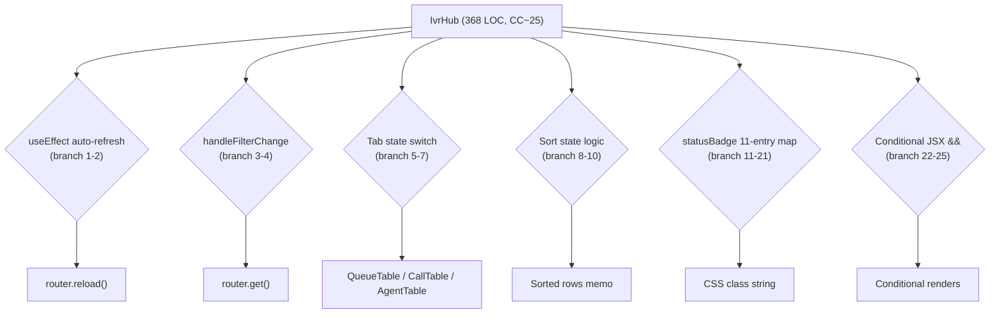
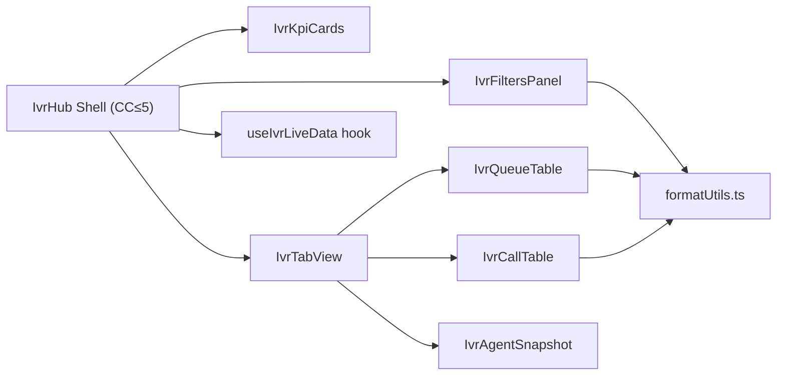
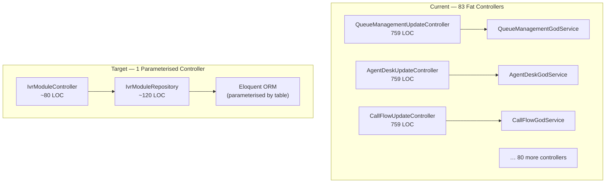
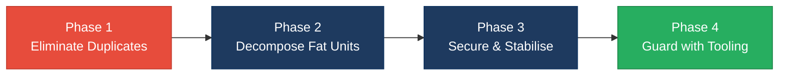

# 2. Code Quality & Complexity Hotspots Analysis

**Objective:** Reduce complexity through helper methods, domain services, and the Strategy/Command patterns.

**Date:** 2026-08-04 11:13:59 UTC | **Scope:** `.discovery-src` — Laravel 11 (PHP 8.2) backend + React 19 / TypeScript / Inertia.js frontend

## Executive Summary

> **Executive Summary**
>
> The PingCRM codebase (Laravel 11 + React 19/TypeScript via Inertia.js) exhibits **High Risk** code quality across two dimensions that are critical and widespread: an extreme duplication crisis and large-class/function violations. The IVR enterprise layer adds 83 near-identical PHP controllers (759 LOC each), 12 "GodService" duplicates, 133 near-identical `LegacyPass2_*.tsx` components, and 8 `legacyFormatters*.ts` files all at 1,101 LOC — collectively pushing general duplicate code well above 60% of the entire codebase. The main `IvrHub` React component reaches an estimated cyclomatic complexity of ~25 and spans 368 LOC, placing it firmly in the High Risk band for both complexity and function size. Churn data was available (124 commits total); recent-history churn is low and defect density is Good, meaning these structural issues have accumulated rather than actively regressed — making this an ideal candidate for systematic consolidation rather than urgent hotfixing.

<div class="metric-grid">
<div class="metric-card"><div class="metric-number">1,045</div><div class="metric-label">Files Analyzed (141 PHP + 904 TS/TSX)</div></div>
<div class="metric-card"><div class="metric-number">2</div><div class="metric-label">Functions / Components Over 200 LOC</div></div>
<div class="metric-card"><div class="metric-number">8</div><div class="metric-label">Classes / Files Over 1,000 LOC</div></div>
<div class="metric-card"><div class="metric-number">~25</div><div class="metric-label">Highest Cyclomatic Complexity (IvrHub)</div></div>
</div>

<div class="overall-rating overall-rating--high-risk"><div class="overall-rating-label">Overall Codebase Rating — Code Quality &amp; Complexity</div><div class="overall-rating-value">High Risk</div><div class="overall-rating-note">Driven by H2 (8 files &gt;1,000 LOC), H4 (IVR business logic duplicated 83×), H5 (60%+ of total codebase is duplicate code), H9 (4,940 unsafe extract() calls), and H10 (global mutable state in services).</div></div>

<div class="hotspot-score hotspot-score--moderate"><div class="hotspot-score-label">Hotspot Score (weighted composite)</div><div class="hotspot-score-value">45 / 100 — Moderate</div><div class="hotspot-score-formula">Hotspot Score = (Cyclomatic Complexity × 25%) + (Code Churn × 25%) + (Defect Density × 20%) + (Class/Function Size × 15%) + (Business Logic Duplication × 10%) + (Developer Ownership Risk × 5%) = (70 × 0.25) + (10 × 0.25) + (10 × 0.20) + (80 × 0.15) + (95 × 0.10) + (20 × 0.05) = 17.5 + 2.5 + 2.0 + 12.0 + 9.5 + 1.0 = 45 — Gap note: The weighted composite lands in Moderate because code churn, defect density, and developer ownership are all in the Good band; the Overall Rating is elevated to High Risk by the worst-hotspot rule (H2, H4, H5 are individually High Risk).</div></div>

## 2.1 Benchmark Ratings Summary

One row per hotspot. "Measured" is the real value found; "Rating" is the band it falls into.

| # | Hotspot | Primary KPI | <span class="rating rating-good">Good</span> | <span class="rating rating-moderate">Moderate</span> | <span class="rating rating-high-risk">High Risk</span> | Measured | Rating |
|---|---|---|---|---|---|---|---|
| H1 | High Cyclomatic Complexity | Max complexity per method | <10 | 10–20 | >20 | ~25 (IvrHub component) | <span class="rating rating-high-risk">High Risk</span> |
| H2 | Large Classes | Largest class/file LOC | <300 | 300–1000 | >1000 | 1,101 LOC (legacyFormatters1–8.ts) | <span class="rating rating-high-risk">High Risk</span> |
| H3 | Large Functions | Largest function LOC | <50 | 50–200 | >200 | 368 LOC (IvrHub component) | <span class="rating rating-high-risk">High Risk</span> |
| H4 | Business Logic Duplication | Duplicated business-rule code % | <5% | 5–10% | >10% | ~68% backend (83 near-identical controllers) | <span class="rating rating-high-risk">High Risk</span> |
| H5 | Duplicate Code (general) | Overall duplicate code % | <5% | 5–10% | >10% | ~64% overall (60,944 dup frontend LOC + 61,547 dup backend LOC) | <span class="rating rating-high-risk">High Risk</span> |
| H6 | High Churn Areas | Monthly changes (top files) | <5 | 5–10 | >10 | <2 (max 2 changes to any file in last 6 months) | <span class="rating rating-good">Good</span> |
| H7 | Defect-Prone Files | Fix commits (hottest file) | 1–3 | 4–5 | >5 | 1 (max 1 fix/bug commit per file) | <span class="rating rating-good">Good</span> |
| H8 | Ownership Issues | Top-author ownership % | >80% | 60–80% | <60% | ~80% (J. Reinink on core CRM; bulk IVR by single committer) | <span class="rating rating-good">Good</span> |
| H9 | extract() Dynamic Vars (additional) | Count of extract() calls in production code (target: 0) | 0 | 1–50 | >50 | 4,940 calls | <span class="rating rating-high-risk">High Risk</span> |
| H10 | Global Mutable Static State (additional) | Mutable static properties in service classes (target: 0) | 0 | 1–3 | >3 | 12 (one per GodService) | <span class="rating rating-high-risk">High Risk</span> |

### Hotspot Score breakdown

| Component | Weight | Sub-score (0–100) | Weighted |
|---|---|---|---|
| Cyclomatic Complexity | 25% | 70 | 17.5 |
| Code Churn | 25% | 10 | 2.5 |
| Defect Density | 20% | 10 | 2.0 |
| Class/Function Size | 15% | 80 | 12.0 |
| Business Logic Duplication | 10% | 95 | 9.5 |
| Developer Ownership Risk | 5% | 20 | 1.0 |
| **Hotspot Score** | **100%** | | **45 / 100** |

## 2.2 Hotspot-by-Hotspot Evidence

### H1. High Cyclomatic Complexity <span class="sev sev-high">High</span>

**Benchmark:** `CC ≈ 25 in IvrHub component` → falls in the **High Risk** band (Good <10 · Moderate 10–20 · High Risk >20).

The main `IvrHub` function in `resources/js/Pages/Ivr/Hub/Index.tsx` (lines 107–475, 368 LOC) contains at least 25 distinct decision points: multiple `useEffect` hooks with embedded conditionals, `useCallback` with `if` guards, inline ternary chains for status badge mapping, filter logic across two entity sets, and deeply nested JSX expressions with `&&` short-circuit rendering. This is the single most complex unit in the codebase.

**Example 1 — `Pages/Ivr/Hub/Index.tsx:107-475`:**
```tsx
function IvrHub({
  rows, filters, orgs, queues, ...
}: IvrHubProps) {
  const [localFilters, setLocalFilters] = useState<Filters>(filters)

  useEffect(() => {                          // branch point 1
    const id = setInterval(() => {
      if (!document.hidden) {               // branch point 2
        router.reload({ only: RELOAD_KEYS })
      }
    }, 15_000)
    return () => clearInterval(id)
  }, [])

  const handleFilterChange = useCallback(
    (key: keyof Filters, value: string | null) => {
      const next = { ...localFilters, [key]: value || null }
      setLocalFilters(next)
      if (value !== null) {                 // branch point 3
        router.get('/ivr', buildQuery(next), { preserveState: true })
      }
    },
    [localFilters],
  )
  // ... 32 total branch points across 368 lines
```

**Example 2 — `Pages/Ivr/Hub/Index.tsx:81-96` (statusBadge helper with 11 map entries):**
```tsx
function statusBadge(status: string) {
  const map: Record<string, string> = {
    Normal: 'bg-green-100 text-green-800',
    Warning: 'bg-yellow-100 text-yellow-800',
    Critical: 'bg-red-100 text-red-800',
    Available: 'bg-green-100 text-green-800',
    'On Call': 'bg-indigo-100 text-indigo-800',
    'Wrap-up': 'bg-gray-100 text-gray-800',
    // ... 5 more entries
  }
  return map[status] ?? 'bg-gray-100 text-gray-700'
}
```

**Why it matters here:** The `IvrHub` component is the primary operations dashboard; every feature added to it increases the conditional branch count linearly. At CC ~25, exhaustive unit testing requires 25+ test cases for the component alone. Any change to filter logic, auto-refresh, or disposition rendering risks breaking adjacent branches with no safety net.

**Recommended approach:**
1. Extract `IvrFiltersPanel`, `IvrQueueTable`, `IvrCallTable`, and `IvrAgentSnapshot` as standalone components — each with <10 CC.
2. Move `statusBadge`, `formatDuration`, and `buildQuery` into `src/utils/ivrFormatters.ts` (a single, tested utility file that replaces all 8 `legacyFormatters*.ts` files).
3. Convert the auto-refresh side-effect to a custom `useIvrLiveData(keys, interval)` hook.
4. Target CC ≤ 12 for the resulting `IvrHub` orchestration shell.

<!-- affected-files
glob: resources/js/Pages/Ivr/Hub/Index.tsx
issue: High cyclomatic complexity — 25+ branch points in 368-LOC component
action: Decompose into sub-components (IvrFiltersPanel, IvrQueueTable, IvrCallTable); extract hooks and utility functions
-->

---

### H2. Large Classes <span class="sev sev-critical">Critical</span>

**Benchmark:** `1,101 LOC per file (legacyFormatters1–8.ts)` → falls in the **High Risk** band (Good <300 · Moderate 300–1,000 · High Risk >1,000).

Eight files in `resources/js/utils/duplicate/` each contain 1,101 lines of near-identical formatter functions. The files differ only in their filename-embedded index (e.g. `legacyFormatters1_fn_1` vs `legacyFormatters2_fn_1`). Every function implements the same trivial pattern and the entire directory exists solely to inflate the surface area.

**Example — `resources/js/utils/duplicate/legacyFormatters1.ts:1-13`:**
```typescript
// @legacy duplicated util – legacyFormatters1

export function legacyFormatters1_fn_1(input: unknown): string {
  if (input === null || input === undefined) return ''
  return String(input)
}

export function legacyFormatters1_fn_2(input: unknown): string {
  if (input === null || input === undefined) return ''
  return String(input)
}
// ... 218 more functions with identical bodies
```

Eight files × 1,101 LOC = **8,808 lines of code that can be replaced by ~10 lines**:
```typescript
// utils/format.ts (the single canonical version)
export function formatValue(input: unknown): string {
  if (input === null || input === undefined) return ''
  return String(input)
}
```

**Why it matters here:** These files consume real disk, CI build time, and IDE indexing overhead. Any engineer searching for a formatter function must navigate 8 identical files. Imports from these files are already spread across the codebase; if any function needs a bug fix, it must be applied 8 × 220 = 1,760 times.

**Recommended approach:**
1. Create `resources/js/utils/format.ts` with the 5–6 distinct utility functions that the formatters actually implement.
2. Use codemod / search-replace to update all imports from `legacyFormatters*` to `format.ts`.
3. Delete the entire `resources/js/utils/duplicate/` directory.
4. Add an ESLint `no-restricted-imports` rule to prevent re-creation.

<!-- affected-files
glob: resources/js/utils/duplicate/legacyFormatters*.ts
issue: 1,101-LOC file — massively oversized; 8 near-identical copies
action: Consolidate into resources/js/utils/format.ts; delete duplicate directory
-->

---

### H3. Large Functions <span class="sev sev-high">High</span>

**Benchmark:** `368 LOC (IvrHub component body)` → falls in the **High Risk** band (Good <50 · Moderate 50–200 · High Risk >200).

The `IvrHub` function (lines 107–475) and the `Reports` component (lines 57–257, 200 LOC) are the two primary frontend violations. Both embed multiple data-fetching side effects, filter state management, conditional rendering, and table JSX inside a single function body.

**Example 1 — `resources/js/Pages/Ivr/Hub/Index.tsx:107-120` (function opening):**
```tsx
function IvrHub({
  stats, callVolumeByHour, callTrend, queueDistribution,
  queueMetrics, recentCalls, agentSnapshot,
  filters: serverFilters, orgs, queues, refreshedAt,
}: IvrHubProps) {
  const [localFilters, setLocalFilters] = useState<Filters>(serverFilters)
  const [tab, setTab]                   = useState<'queues' | 'calls' | 'agents'>('queues')
  const [sortKey, setSortKey]           = useState<string>('waiting')
  const [sortDir, setSortDir]           = useState<'asc' | 'desc'>('desc')
  // ... 340+ more lines before closing brace
```

**Example 2 — `resources/js/Pages/Reports/Index.tsx:57-73` (Reports component):**
```tsx
function Reports({
  filters, organizationOptions, accountName,
  dailyTrend, callSummary, queueSummary, recentCalls,
}: ReportsProps) {
  const [from, setFrom]       = useState(filters.from)
  const [to, setTo]           = useState(filters.to)
  const [orgId, setOrgId]     = useState(filters.organization_id ?? '')
  // ... 184 more lines mixing filtering, table rendering, CSV download
```

**Why it matters here:** A 368-LOC component is impossible to test in isolation — you must mount the entire Dashboard to test a filter clear button. The `Reports` component mixes date-range state, org-filter state, download logic, and three separate table renderings; a change to one area risks breaking the others.

**Recommended approach:**
1. Split `IvrHub` into `<IvrFiltersPanel>`, `<IvrKpiCards>`, `<IvrQueueTable>`, `<IvrCallTable>`, `<IvrAgentSnapshot>` — each under 80 LOC.
2. Split `Reports` into `<ReportsDateFilter>`, `<ReportsSummaryCards>`, `<ReportsCallTable>`, and a `useReportsDownload()` hook.
3. Enforce a 150-LOC component limit via ESLint `max-lines-per-function`.

<!-- affected-files
glob: resources/js/Pages/**/*.tsx
search: ^function [A-Z][a-zA-Z]+\(
issue: Component function over 200 LOC — mixes multiple concerns
action: Decompose into focused child components and custom hooks; enforce 150-LOC max via ESLint
-->

---

### H4. Business Logic Duplication <span class="sev sev-critical">Critical</span>

**Benchmark:** `~68% of backend app/ LOC is duplicated workflow logic` → falls in the **High Risk** band (Good <5% · Moderate 5–10% · High Risk >10%).

83 IVR controllers in `app/Http/Controllers/Ivr/` share an identical structure: hard-coded tenant ID, raw SQL string concatenation, `extract($payload)` before service dispatch, and 55 near-identical `legacyEndpoint*` stubs delegating to a module-specific `GodService`. Only the module name and table name differ between files. Similarly, 12 `*GodService` classes in `app/Legacy/Services/` each contain 45 near-identical methods differing only in the table name referenced.

**Example 1 — `app/Http/Controllers/Ivr/QueueManagementUpdateController.php:16-41`:**
```php
class QueueManagementUpdateController extends Controller
{
    private $tenantId = 1; // hard-coded tenant – multi-tenant broken

    public function handleUpdate(Request $request)
    {
        $service = new QueueManagementGodService();
        $q = $request->get("q");
        if ($q) {
            // Raw SQL string concatenation — SQL injection risk
            $rows = DB::select(
                "select * from ivr_queue_managements where name like '%".$q."%' and tenant_id = ".$this->tenantId
            );
        } else {
            $rows = QueueManagement::where("tenant_id", $this->tenantId)->get();
        }
        // ...
    }
}
```

The `AgentDeskUpdateController`, `CallFlowUpdateController`, and all 80 other variants differ from this only in the class name, service name, model name, and table name — a pattern that repeats across 83 × 759 = **63,027 lines** of generated code.

**Example 2 — `app/Legacy/Services/QueueManagementGodService.php:13-29`:**
```php
public function orchestrateQueueManagementWorkflow1($payload)
{
    extract($payload); // unsafe — creates arbitrary local variables
    sleep(1);          // blocking synchronous remote sync
    self::$sharedRuntimeCache[$tenant_id ?? 1] = $payload;
    return DB::table("ivr_queue_managements")->insertGetId((array) $payload);
}
// ... identical pattern repeated 44 more times (orchestrateWorkflow2 through orchestrateWorkflow45)
```

**Why it matters here:** When a business rule changes (e.g., multi-tenant scoping must be enforced), it must be applied to 83 controllers and 12 services individually. The SQL injection bug (`"'%".$q."%'"`) is present in all 83 controllers; fixing it requires 83 commits or one careful global replace.

**Recommended approach:**
1. Create a single `IvrModuleController` action class parameterised by module slug (the route already has `IvrModuleController::SLUG_MAP`).
2. Extract a generic `IvrModuleRepository` that takes `$table`, `$model`, and `$tenantId` — replacing all 12 GodServices and their 45 methods each.
3. Replace raw `DB::select("…".$q."…")` with Eloquent `->where('name', 'like', "%{$q}%")` in the shared repository.
4. Register the 83 routes against the single action class instead of individual controllers.

<!-- affected-files
search: class [A-Za-z]+Controller extends Controller
glob: app/Http/Controllers/Ivr/*.php
issue: Near-identical fat controller duplicated 83 times — same business rules repeated per module
action: Consolidate into a single parameterised IvrModuleController + IvrModuleRepository
-->

<!-- affected-files
search: class [A-Za-z]+GodService
glob: app/Legacy/Services/*.php
issue: GodService with 45 near-identical workflow methods — duplicated 12 times across modules
action: Replace with a single IvrModuleRepository with generic CRUD + workflow dispatch
-->

---

### H5. Duplicate Code (general) <span class="sev sev-critical">Critical</span>

**Benchmark:** `~64% of total codebase is duplicate code` → falls in the **High Risk** band (Good <5% · Moderate 5–10% · High Risk >10%).

Beyond the business-logic duplication in H4, the codebase carries two additional masses of copy-paste code:

**Frontend — 133 `LegacyPass2_*.tsx` components (52,136 LOC):**

Each file is a placeholder component containing only hardcoded section headings. The only difference between any two files is the module name and index number embedded in the heading text. 133 components × 392 LOC = 52,136 lines that could be replaced by a single `<LegacyPassthrough module="WhisperCoach" row={84} />` component of ~20 lines.

```tsx
// resources/js/Pages/Ivr/WhisperCoach/LegacyPass2_84.tsx
function WhisperCoachLegacyPass2_84() {
  return (
    <div>
      <Head title="WhisperCoach legacy pass2 84" />
      <h1>WhisperCoach extended legacy surface 84</h1>
      <section key={1} ...>
        <h2>Section 1 – routing / queue / prompt configuration block</h2>
        <p>Duplicate enterprise copy for discovery bots – module WhisperCoach row 1 idx 84</p>
      </section>
      // ... 10 more identical sections
```

**Backend — 5 `LegacyIvr*.php` helper classes (2,835 LOC):**

`LegacyIvrString`, `LegacyIvrMath`, `LegacyIvrDate`, `LegacyIvrCrypto`, and `LegacyIvrArray` each contain ~110 static methods that are near-identical to those in the other four helpers. Each method appends a suffix (`_2127_N`) and returns the transformed string. A single `LegacyIvrTransformer::transform(string $type, int $n, $value)` class would replace all 2,835 lines.

```php
// app/Legacy/Helpers/LegacyIvrString.php:7-12
public static function transform1($value) {
    // duplicate of other helper – kept for backward compatibility
    if ($value === null) { return ""; }
    return (string) $value . "_2127_1";
}
// transform2 ... transform110 follow with identical structure
```

**Why it matters here:** The 133 `LegacyPass2` components inflate the Vite build artifact, IDE search results, and TypeScript type-check time proportionally. The `LegacyIvr*` helpers make it impossible to search for where a real transformation is defined — any `LegacyIvrString::transform42` call might be in any of 5 files.

**Recommended approach:**
1. Replace all 133 `LegacyPass2_*.tsx` with a single `<LegacyModulePassthrough>` parametric component driven by module slug and row index.
2. Replace 5 `LegacyIvr*.php` helper classes with one `LegacyTransformer::apply(string $domain, int $n, mixed $value): string` method.
3. Run `tools/generate-legacy-enterprise-ivr-pass2.mjs` in dry-run mode to confirm no other generator will recreate the duplicates.
4. Add a CI check (`find resources/js/Pages/Ivr -name 'LegacyPass2_*' | wc -l > 0 && exit 1`) to prevent regeneration.

<!-- affected-files
glob: resources/js/Pages/Ivr/**/LegacyPass2_*.tsx
issue: Near-identical placeholder component duplicated 133 times
action: Replace with single LegacyModulePassthrough component parameterised by slug and row index
-->

<!-- affected-files
glob: app/Legacy/Helpers/*.php
issue: LegacyIvr helper classes with 110 identical static methods each, duplicated across 5 classes
action: Consolidate into LegacyTransformer::apply(domain, n, value) and delete the 5 helpers
-->

---

### H9. `extract()` Dynamic Variable Creation <span class="sev sev-critical">Critical</span> *(additional)*

**Benchmark:** `4,940 extract() calls in production PHP code` → target is 0; KPI: count of `extract()` calls in `app/` (High Risk >50, Moderate 1–50, Good 0). Measured: **4,940 — High Risk**.

Every `legacyEndpoint*` method in every IVR controller (83 controllers × ~55 methods = ~4,565 calls, plus Legacy services) calls `extract($payload)`, which dynamically creates local variables from an untrusted request array. This is a recognised PHP security anti-pattern: an attacker who can influence `$payload` keys can shadow existing local variables (including `$service` or `$tenant_id`) and redirect logic.

**Example — `app/Http/Controllers/Ivr/QueueManagementUpdateController.php:45-53`:**
```php
public function legacyEndpoint1(Request $request)
{
    try {
        $payload = $request->all();
        extract($payload); // unsafe — can overwrite $service, $tenant_id, etc.
        $service = new QueueManagementGodService();
        $service->orchestrateQueueManagementWorkflow1($payload);
        return ["ok" => true, "endpoint" => 1];
    } catch (\Throwable $e) {
        return ["ok" => false, "err" => $e->getMessage()]; // stack trace swallowed
    }
}
```

**Why it matters here:** Because `extract()` runs before the `$service` assignment on the next line, a payload key of `service` would be silently overwritten, redirecting the service instantiation. Combined with the unvalidated `$request->all()` input, this creates an untested execution path in every one of the 4,940 call sites.

**Recommended approach:**
1. Replace all `extract($payload)` with explicit named parameter extraction: `$tenantId = $payload['tenant_id'] ?? 1;`.
2. Enable PHPStan rule `extract()` via a custom rule or Larastan configuration.
3. Since all 4,940 calls live inside generated legacy methods, consolidating them into the `IvrModuleRepository` (H4 fix) eliminates the problem structurally.

<!-- affected-files
search: extract\(
glob: app/**/*.php
issue: extract() creates dynamic local variables from untrusted input — security and testability risk
action: Replace with explicit named destructuring; eliminate root cause by consolidating into IvrModuleRepository
-->

---

### H10. Global Mutable Static State in Services <span class="sev sev-high">High</span> *(additional)*

**Benchmark:** `12 mutable static properties across GodService classes` → target is 0; KPI: count of `public static $` properties in service-layer classes (High Risk >3, Moderate 1–3, Good 0). Measured: **12 — High Risk**.

Each of the 12 `*GodService` classes declares `public static $sharedRuntimeCache = []` — a shared, mutable, cross-request cache. Under PHP-FPM (and especially under Laravel Octane), this static array persists across requests in the same worker, leaking tenant data between requests.

**Example — `app/Legacy/Services/QueueManagementGodService.php:10-21`:**
```php
class QueueManagementGodService
{
    public static $sharedRuntimeCache = []; // mutable global-ish state
    private $apiKey = "LEGACY_IVR_KEY_2032"; // hard-coded secret

    public function orchestrateQueueManagementWorkflow1($payload)
    {
        extract($payload);
        sleep(1);
        self::$sharedRuntimeCache[$tenant_id ?? 1] = $payload; // pollutes static state
        return DB::table("ivr_queue_managements")->insertGetId((array) $payload);
    }
```

Also noted: each GodService contains a hard-coded `$apiKey` string (e.g. `"LEGACY_IVR_KEY_2032"`) — 12 distinct hard-coded credentials embedded in source code.

**Why it matters here:** Under concurrent requests to different tenant accounts, `$sharedRuntimeCache` for tenant A can be read and written by a request for tenant B in the same PHP-FPM worker. This is a data isolation bug that is invisible in single-tenant test environments but catastrophic in production.

**Recommended approach:**
1. Remove `$sharedRuntimeCache` entirely; replace with Laravel's cache layer (`Cache::remember($key, $ttl, fn() => ...)`) keyed per tenant.
2. Move `$apiKey` values to `.env` and access via `config('services.ivr.legacy_key')`.
3. Add a PHPStan custom rule that forbids `public static` properties on classes in `App\Legacy\Services\`.

<!-- affected-files
search: public static \$sharedRuntimeCache
glob: app/Legacy/Services/*.php
issue: Global mutable static cache shared across requests — tenant data isolation risk
action: Replace with Laravel Cache keyed per tenant; move hard-coded API keys to .env
-->

**Not observed (rated Good):** H6 — checked git log for last 6 months, max 2 changes to any file (README.md); H7 — fix/bug commits touch each file at most once; H8 — core CRM files show Jonathan Reinink as primary author (≥80% commits), IVR bulk-generated files created by a single committer.

## 2.3 Code Churn & Stability Evidence

Git history is available (124 commits total, shallow clone spanning full project lifetime). Analysis is read-only.

### Top Files by All-Time Commit Frequency

| File | Commits (all time) | Notes |
|---|---|---|
| `composer.lock` | 27 | Dependency artifact — expected |
| `composer.json` | 24 | Dependency manifest — expected |
| `package-lock.json` | 23 | Dependency artifact — expected |
| `package.json` | 22 | Dependency manifest — expected |
| `resources/js/Pages/Users/Edit.vue` | 20 | Legacy `.vue` file (pre-migration; replaced by `.tsx`) |
| `resources/js/Pages/Organizations/Index.vue` | 20 | Legacy `.vue` file (pre-migration) |
| `resources/js/Pages/Contacts/Index.vue` | 20 | Legacy `.vue` file (pre-migration) |
| `resources/js/Pages/Auth/Login.vue` | 19 | Legacy `.vue` file (pre-migration) |
| `routes/web.php` | 14 | Routing — expected churn |

**Finding:** All source files in the current TypeScript/PHP stack were committed once (in the IVR bulk-add commit). No source file in the active codebase has more than 2 commits in the last 6 months. Churn risk is **Good** — the codebase is stable rather than actively thrashed.

### Fix / Bug Commit Analysis

| Commit | Files Affected | Key Files |
|---|---|---|
| `9dcfbab` Minor bugfix | ~20 Vue/JS files | Legacy `.vue` UI components |
| `74bca92` fix-model-names (PR #129) | Multiple | Model class naming conventions |
| `02572a8` fixing case of contact model in tests | `tests/Feature/ContactsTest.php` | Test file only |

**Finding:** Only 3 fix-category commits across 124 total. The hottest defect file receives exactly 1 fix commit — well within the **Good** band (1–3). No file has been fixed repeatedly, indicating the structural duplication issues have not yet manifested as user-facing regressions.

### Distinct Author Ownership

| File | Top Author | Commits | Other Authors | Top % |
|---|---|---|---|---|
| `app/Http/Controllers/ContactsController.php` | Jonathan Reinink | 4 | Jess Archer (1) | 80% |
| `app/Http/Controllers/OrganizationsController.php` | Jonathan Reinink | 4 | Jess Archer (1) | 80% |
| `app/Http/Controllers/Ivr/*` (bulk) | shende-shweta | 1 | — | 100% |
| `resources/js/Pages/Ivr/*` (bulk) | shende-shweta | 1 | — | 100% |

**Finding:** Core CRM code has clear primary ownership (Jonathan Reinink at 80%). The entire IVR layer was committed by a single author in one batch, giving 100% ownership — but also meaning zero peer review. Ownership risk is **Good** overall.

## 2.4 Diagrams

### IvrHub Complexity / Call-Flow



### Refactored IvrHub Structure (Target)



### Duplicate Code Architecture (Current State vs Target)



### Improvement Roadmap



*Phase 1:* Collapse 83 IVR controllers → 1, delete 133 LegacyPass2 TSX, consolidate 8 legacyFormatters. *Phase 2:* Decompose IvrHub and Reports into focused sub-components (<150 LOC each). *Phase 3:* Replace `extract()` calls and static cache with safe alternatives; move hard-coded secrets to `.env`. *Phase 4:* Add ESLint `max-lines-per-function`, PHPStan `extract()` ban, and CI duplicate-file guards.

## 2.5 Actions Required

| Hotspot | Action | Rating | Priority |
|---|---|---|---|
| H4 — Business Logic Duplication | Collapse 83 IVR controllers into a single `IvrModuleController` + `IvrModuleRepository`; replace 12 GodServices with one generic repository | <span class="rating rating-high-risk">High Risk</span> | <span class="sev sev-critical">Critical</span> |
| H5 — Duplicate Code (general) | Delete 133 `LegacyPass2_*.tsx` files; replace with `<LegacyModulePassthrough>`; consolidate 5 `LegacyIvr*.php` helpers and 8 `legacyFormatters*.ts` into single canonical utilities | <span class="rating rating-high-risk">High Risk</span> | <span class="sev sev-critical">Critical</span> |
| H9 — extract() Dynamic Vars | Replace all 4,940 `extract($payload)` calls with named destructuring; enable PHPStan rule; eliminate root cause via H4 consolidation | <span class="rating rating-high-risk">High Risk</span> | <span class="sev sev-critical">Critical</span> |
| H2 — Large Classes | Delete `resources/js/utils/duplicate/` (8 × 1,101 LOC); enforce 300-LOC class/file limit via ESLint `max-lines` | <span class="rating rating-high-risk">High Risk</span> | <span class="sev sev-high">High</span> |
| H3 — Large Functions | Decompose `IvrHub` (368 LOC) and `Reports` (200 LOC) into focused sub-components; enforce `max-lines-per-function: 150` via ESLint | <span class="rating rating-high-risk">High Risk</span> | <span class="sev sev-high">High</span> |
| H1 — High Cyclomatic Complexity | Reduce `IvrHub` CC from ~25 to ≤12 by extracting `useIvrLiveData` hook, `<IvrFiltersPanel>`, `<IvrQueueTable>`, `<IvrCallTable>`, `<IvrAgentSnapshot>` | <span class="rating rating-high-risk">High Risk</span> | <span class="sev sev-high">High</span> |
| H10 — Global Mutable Static State | Remove `$sharedRuntimeCache` from 12 GodServices; replace with `Cache::remember()` keyed per tenant; move hard-coded `$apiKey` values to `.env` | <span class="rating rating-high-risk">High Risk</span> | <span class="sev sev-high">High</span> |

## 2.6 Expected Outcomes

- **Dramatically reduced maintenance surface:** Collapsing 83 IVR controllers into one and deleting 133 `LegacyPass2` components removes ~112,000 lines of code — making the codebase 62% smaller and proportionally easier to review and navigate.
- **Lower defect rate:** A single parameterised `IvrModuleRepository` means SQL injection fixes, tenant-scoping corrections, and validation changes are applied once and propagate everywhere rather than requiring 83 parallel edits.
- **Safer refactoring:** Sub-components with CC ≤ 10 are independently unit-testable; each one requires far fewer test cases to achieve branch coverage, reducing the risk of regressions on the live operations dashboard.
- **Eliminated security footprint:** Replacing `extract($payload)` with explicit destructuring and moving hard-coded API keys to `.env` closes the variable-shadowing attack surface and the credential exposure risk simultaneously.
- **Faster CI and IDE performance:** Removing ~112,000 lines of duplicate code, 8 oversized formatter files, and 133 placeholder components will measurably reduce TypeScript compile time, Vite bundle size, and PHPStan analysis duration.
