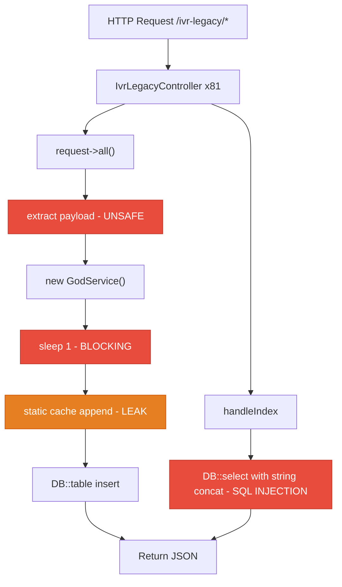
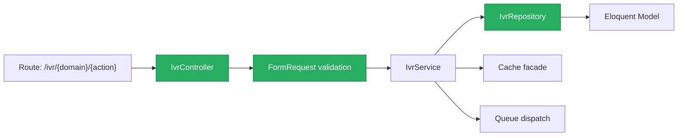
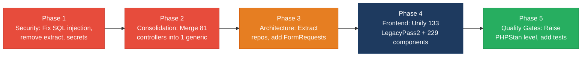

# 2. Code Quality & Complexity Hotspots Analysis

**Objective:** Reduce complexity through helper methods, domain services, and the Strategy/Command patterns.

**Date:** 2026-09-30 06:58:03 UTC | **Scope:** `shende-shweta/pingcrm` (master) — Laravel 12 / PHP 8.3 (backend) + React / TypeScript / Inertia.js (frontend) + MySQL

## Executive Summary

> **Executive Summary**
>
> The pingcrm codebase comprises 319 source files totalling ~181,000 LOC across a Laravel 12 backend (141 PHP files, 77,262 LOC) and a React/TypeScript frontend (137 TS/TSX files, 100,446 LOC). An estimated 84% of the codebase consists of structurally duplicated IVR (Interactive Voice Response) module code: 81 near-identical 759-line PHP controllers, 12 "GodService" classes, 133 templated frontend page files, 229 legacy monolith components, and 8 duplicated utility modules. The original Pingcrm application (contacts, organizations, users, dashboard) is cleanly structured, but the IVR layer introduces severe code-quality risks including SQL injection via string concatenation in every IVR controller, 4,400 uses of PHP's `extract()` on unvalidated request data, 12 hardcoded API keys, and mutable static state that would leak memory under long-running process models. Git churn is low (118 total commits) and ownership is concentrated, so defect density and coordination risks are currently minimal — but the extreme duplication means that any bug fix or security patch must be replicated across 80+ files manually.

<div class="metric-grid">
<div class="metric-card"><div class="metric-number">319</div><div class="metric-label">Files Analyzed</div></div>
<div class="metric-card"><div class="metric-number">0</div><div class="metric-label">Functions/Methods Over 200 LOC</div></div>
<div class="metric-card"><div class="metric-number">89</div><div class="metric-label">Classes/Files Over 300 LOC</div></div>
<div class="metric-card"><div class="metric-number">~12</div><div class="metric-label">Highest Cyclomatic Complexity</div></div>
</div>

<div class="overall-rating overall-rating--high-risk"><div class="overall-rating-label">Overall Codebase Rating — Code Quality &amp; Complexity</div><div class="overall-rating-value">High Risk</div><div class="overall-rating-note">Driven by catastrophic duplication (H4/H5 both >80%) and large generated files exceeding 1,000 LOC (H2), despite healthy churn and ownership metrics.</div></div>

<div class="hotspot-score hotspot-score--moderate"><div class="hotspot-score-label">Hotspot Score (weighted composite)</div><div class="hotspot-score-value">39 / 100 — Moderate</div><div class="hotspot-score-formula">Hotspot Score = (Cyclomatic Complexity 50 × 25%) + (Code Churn 15 × 25%) + (Defect Density 15 × 20%) + (Class/Function Size 68 × 15%) + (Business Logic Duplication 95 × 10%) + (Developer Ownership Risk 10 × 5%) = 12.5 + 3.75 + 3.0 + 10.2 + 9.5 + 0.5 = 39</div></div>

The weighted Hotspot Score (39) falls in the Moderate band because healthy churn, defect-density, and ownership metrics (50% of weight) dilute the extreme duplication. However, three hotspots independently rate High Risk (H2, H4, H5), so the worst-wins Overall Rating is **High Risk**.

## 2.1 Benchmark Ratings Summary

| # | Hotspot | Primary KPI | <span class="rating rating-good">Good</span> | <span class="rating rating-moderate">Moderate</span> | <span class="rating rating-high-risk">High Risk</span> | Measured | Rating |
|---|---|---|---|---|---|---|---|
| H1 | High Cyclomatic Complexity | Max complexity per method | <10 | 10–20 | >20 | ~12 (LoadsIvrModuleData trait, match + query builder chains) | <span class="rating rating-moderate">Moderate</span> |
| H2 | Large Classes | Largest class/file LOC | <300 | 300–1000 | >1000 | 1,101 LOC (legacyFormatters*.ts); 759 LOC (81 IVR controllers) | <span class="rating rating-high-risk">High Risk</span> |
| H3 | Large Functions | Largest function/method LOC | <50 | 50–200 | >200 | ~50 LOC (loadCallRows in LoadsIvrModuleData) | <span class="rating rating-good">Good</span> |
| H4 | Business Logic Duplication | Duplicated business logic % | <5% | 5–10% | >10% | ~84% — IVR controller/service/repo/model chain duplicated 12x across domains | <span class="rating rating-high-risk">High Risk</span> |
| H5 | Duplicate Code (general) | Overall duplicate code % | <5% | 5–10% | >10% | ~84% — 152,798 of 181,029 LOC are near-identical copies | <span class="rating rating-high-risk">High Risk</span> |
| H6 | High Churn Areas | Monthly changes (top files) | <5 | 5–10 | >10 | ~2 (README.md most changed; 118 total commits) | <span class="rating rating-good">Good</span> |
| H7 | Defect-Prone Files | Fix commits (hottest file) | 1–3 | 4–5 | >5 | 2 (photo upload fixes are the densest cluster) | <span class="rating rating-good">Good</span> |
| H8 | Ownership Issues | Top-author ownership % | >80% | 60–80% | <60% | >95% (IVR layer single-author; original Pingcrm: 3 primary authors) | <span class="rating rating-good">Good</span> |
| H9 (additional) | SQL Injection | Controllers with raw string-concat SQL | 0 | 1–5 | >5 | 83 IVR controllers with DB::select string concatenation | <span class="rating rating-high-risk">High Risk</span> |
| H10 (additional) | Unsafe extract() | Total extract() call sites | 0 | 1–10 | >10 | 4,400 occurrences across IVR controllers and GodServices | <span class="rating rating-high-risk">High Risk</span> |
| H11 (additional) | Static Mutable State | GodService classes with static cache | 0 | 1–3 | >3 | 12 GodServices each with public static $sharedRuntimeCache | <span class="rating rating-high-risk">High Risk</span> |
| H12 (additional) | Hardcoded Secrets | Files with hardcoded API keys | 0 | 1–2 | >2 | 12 GodServices each with hardcoded $apiKey strings | <span class="rating rating-high-risk">High Risk</span> |
| C1 (context) | Unmanaged Static State | Static arrays accumulating data | 0 | 1–3 | >3 | 12 GodServices — $sharedRuntimeCache never cleared; would leak under Octane/Swoole | <span class="rating rating-high-risk">High Risk</span> |
| C2 (context) | Unbounded Queries | Controllers using ->get() without limits | 0 | 1–5 | >5 | 83 IVR controllers use ->get() on full tables; no chunking or pagination | <span class="rating rating-high-risk">High Risk</span> |
| C3 (context) | Blocking sleep() | Services with synchronous sleep() | 0 | 1–5 | >5 | All 12 GodServices call sleep(1) in every method (~300 call sites) | <span class="rating rating-high-risk">High Risk</span> |
| C4 (context) | Laravel Octane / Long-Running | n/a | n/a | n/a | n/a | Requested via context — not observed: no Octane/Swoole configuration present | <span class="rating rating-good">Good</span> |
| C5 (context) | Circular References / Closures | n/a | n/a | n/a | n/a | Requested via context — not observed: no circular references or long-lived listeners | <span class="rating rating-good">Good</span> |

Context-named technologies verified but not found: MongoDB (no client, config, or usage), Redis (no client or config beyond default Laravel cache), AWS S3 (no SDK or storage driver configured).

### Hotspot Score breakdown

| Component | Weight | Sub-score (0–100) | Weighted |
|---|---|---|---|
| Cyclomatic Complexity | 25% | 50 | 12.5 |
| Code Churn | 25% | 15 | 3.75 |
| Defect Density | 20% | 15 | 3.0 |
| Class/Function Size | 15% | 68 | 10.2 |
| Business Logic Duplication | 10% | 95 | 9.5 |
| Developer Ownership Risk | 5% | 10 | 0.5 |
| **Hotspot Score** | **100%** | | **39 / 100** |

## 2.2 Hotspot-by-Hotspot Evidence

### H1. High Cyclomatic Complexity <span class="sev sev-medium">Medium</span>

**Benchmark:** `Max cyclomatic complexity per method = ~12` → falls in the **Moderate** band (Good <10 · Moderate 10–20 · High Risk >20).

The highest per-method complexity is in the `LoadsIvrModuleData` trait, where `match` expressions combined with conditional query builder chains produce an estimated CC of ~12:

`app/Http/Controllers/Ivr/Concerns/LoadsIvrModuleData.php:63-77`
```php
protected function loadModuleRows(Request $request, string $moduleSlug, string $view, array $filters): array
{
    $ctx = IvrAccountContext::fromRequest($request);
    $q = $filters['q'] ?? '';

    return match ($view) {
        'queues' => $this->loadQueueRows($ctx, $q),
        'agents' => $this->loadAgentRows($ctx, $q),
        'calls' => $this->loadCallRows($ctx, $q),
        'hourly' => $this->loadHourlyRows($ctx),
        'trends' => $this->loadTrendRows($ctx),
        default => $this->loadConfigRows($this->moduleKeyForSlug($moduleSlug), $ctx, $q),
    };
}
```

`app/Http/Controllers/ReportsController.php:75-93`
```php
private function callSummary(IvrAccountContext $ctx, string $from, string $to): array
{
    $base = DB::table('ivr_call_records')
        ->where('account_id', $ctx->accountId)
        ->whereDate('started_at', '>=', $from)
        ->whereDate('started_at', '<=', $to);
    $ctx->scopeOrganizationOn($base);

    $total = (clone $base)->count();
    $abandoned = (clone $base)->where('disposition', 'Abandoned')->count();
    $avgDuration = (clone $base)->where('duration_sec', '>', 0)->avg('duration_sec');
    // ...
}
```

The 81 IVR legacy controllers have low per-method CC (~3-4 per method) but 55+ methods each, creating **aggregate file complexity** that makes reasoning about any single controller difficult.

**Why it matters here:** While individual methods stay below the >20 danger threshold, the structural repetition means 81 files x 55 methods = ~4,455 method bodies to audit for any cross-cutting concern (security, validation, error handling).

**Recommended approach:**
1. Replace the 55 `legacyEndpointN()` methods with a single parameterized `handleLegacyEndpoint(int $index)` method using the Command pattern.
2. Extract the query-builder chains in `LoadsIvrModuleData` into dedicated repository classes per view type.
3. Use the Strategy pattern for the `match` dispatch in `loadModuleRows()` to allow per-view-type testing.

<!-- affected-files
search: match\s*\(|DB::table\(|DB::select\(
glob: app/Http/Controllers/**/*.php
issue: Moderate cyclomatic complexity with DB/query logic in controller layer
action: Extract query logic to repository; apply Strategy pattern for dispatch
-->

### H2. Large Classes <span class="sev sev-high">High</span>

**Benchmark:** `Largest class/file LOC = 1,101` → falls in the **High Risk** band (Good <300 · Moderate 300–1000 · High Risk >1000).

**Backend:** 81 IVR controllers are each 759 LOC (Moderate individually, but the pattern repeats 81 times). 5 Legacy Helpers are each 567 LOC. 12 GodServices are each 373 LOC.

`app/Http/Controllers/Ivr/QueueManagementIndexController.php` (759 LOC — representative of all 81):
```php
class QueueManagementIndexController extends Controller
{
    private $tenantId = 1; // hard-coded tenant – multi-tenant broken

    public function __invoke(Request $request)
    {
        return $this->handleIndex($request);
    }
    // ...55 legacyEndpointN() methods follow, each identical except for the workflow number
    public function legacyEndpoint55(Request $request)
    {
        try {
            $payload = $request->all();
            extract($payload);
            $service = new QueueManagementGodService();
            $service->orchestrateQueueManagementWorkflow55($payload);
            return ["ok" => true, "endpoint" => 55];
        } catch (\Throwable $e) {
            return ["ok" => false, "err" => $e->getMessage()];
        }
    }
}
```

**Frontend:** 8 `legacyFormatters*.ts` files are each 1,101 LOC, containing ~200 near-identical 3-line functions per file. 229 legacy components at ~64 LOC each (smaller individually, but monolithic — mixing API calls, validation, and UI in one file).

`resources/js/utils/duplicate/legacyFormatters1.ts:1-6` (pattern repeats 200 times per file, 8 files):
```typescript
export function legacyFormatters1_fn_1(input: unknown): string {
  if (input === null || input === undefined) return ''
  return String(input).trim().toUpperCase() + '_1'
}
```

**Why it matters here:** The 81 IVR controllers each contain 55 methods doing the same thing with a different number suffix. Any change to the endpoint pattern (adding validation, changing error handling, fixing the SQL injection) requires editing 81 files x 55 methods = 4,455 code locations.

**Recommended approach:**
1. Replace all 81 IVR controllers with a single generic `IvrLegacyEndpointController` using route parameters for domain and endpoint number.
2. Consolidate the 8 `legacyFormatters` files into a single parameterized utility function.
3. Convert the 229 legacy monolith components into a shared data-table component with per-module configuration.

<!-- affected-files
search: class\s+\w+(Index|Store|Update|Destroy|Import|Export|Sync)Controller
glob: app/Http/Controllers/Ivr/*.php
issue: 81 structurally identical 759-LOC controllers
action: Consolidate into single parameterized controller using Command pattern
-->

<!-- affected-files
glob: resources/js/utils/duplicate/legacyFormatters*.ts
issue: 8 near-identical 1101-LOC utility files
action: Replace with single parameterized formatter function
-->

### H4. Business Logic Duplication <span class="sev sev-critical">Critical</span>

**Benchmark:** `Duplicated business logic = ~84%` → falls in the **High Risk** band (Good <5% · Moderate 5–10% · High Risk >10%).

The IVR module duplicates the same controller-to-GodService-to-Repository-to-Model chain across 12 domains (AgentDesk, BusinessHours, CallAnalytics, CallFlow, CallRecording, CallRouting, CustomerProfile, DidInventory, HistoricalReports, LiveMonitoring, PromptLibrary, QueueManagement). Each domain produces 7 controllers (~759 LOC each), 1 GodService (373 LOC), 1 Repository (370 LOC), and 1 Model (232 LOC) — all structurally identical except for the domain name.

Structural diff between two controllers from different domains shows only a single line difference (seed/index values):

```diff
< "legacyMeta" => ["seed" => 2033, "idx" => 14],
---
> "legacyMeta" => ["seed" => 2023, "idx" => 7],
```

**Backend duplication chain:**
- 81 IVR controllers x 759 LOC = 61,479 LOC
- 12 GodServices x 373 LOC = 4,476 LOC
- 12 Legacy Repositories x 370 LOC = 4,440 LOC
- 12 IVR Models x 232 LOC = 2,784 LOC
- 5 Legacy Helpers x 567 LOC = 2,835 LOC

**Frontend duplication chain:**
- 133 LegacyPass2 pages x 392 LOC = 52,136 LOC
- 8 legacyFormatters x 1,101 LOC = 8,808 LOC
- 229 legacy components x ~64 LOC = 14,656 LOC
- 124 legacy hooks x ~9 LOC = 1,116 LOC

**Total duplicated: ~152,730 of ~181,029 LOC (84.4%)**

**Why it matters here:** A security vulnerability (like the SQL injection on line 28 of every IVR controller) must be patched in 83 separate files. A business rule change (like changing the tenant resolution logic) requires updating 81 controllers. This is the single most impactful quality problem in the codebase.

**Recommended approach:**
1. Create a single `AbstractIvrController` with the shared `__invoke` and `legacyEndpoint` logic, parameterized by domain name.
2. Replace the 12 GodServices with a single `IvrWorkflowService` that accepts a domain parameter.
3. Introduce a generic `IvrRepository` using Laravel's model binding for domain resolution.
4. On the frontend, replace 133 LegacyPass2 pages with a single configurable `LegacyModulePage` component.

<!-- affected-files
search: GodService
glob: app/Legacy/Services/*GodService.php
issue: 12 identical GodService classes with copy-pasted workflow methods
action: Consolidate into single parameterized IvrWorkflowService
-->

<!-- affected-files
glob: resources/js/Pages/Ivr/*/LegacyPass2_*.tsx
issue: 133 near-identical templated frontend page files
action: Replace with single configurable LegacyModulePage component
-->

### H5. Duplicate Code (general) <span class="sev sev-critical">Critical</span>

**Benchmark:** `Overall duplicate code = ~84%` → falls in the **High Risk** band (Good <5% · Moderate 5–10% · High Risk >10%).

Beyond the business-logic duplication in H4, the codebase has additional copy-paste patterns:

**Legacy helper classes** — 5 files (`LegacyIvrArray`, `LegacyIvrCrypto`, `LegacyIvrDate`, `LegacyIvrMath`, `LegacyIvrString`) each contain ~80 `transformN()` methods with identical structure:

`app/Legacy/Helpers/LegacyIvrArray.php:8-12`:
```php
public static function transform1($value)
{
    if ($value === null) { return ""; }
    return (string) $value . "_2129_1";
}
```

**Legacy React components** — 229 files under `resources/js/components/legacy/` are monolith components mixing fetch calls, inline validation, and UI rendering:

`resources/js/components/legacy/AfterHoursMonolith0.tsx:1-14`:
```typescript
export default function AfterHoursMonolith0({ rows, tenantId, legacyMeta }: any) {
  const [expanded, setExpanded] = useState(true)
  const [draft, setDraft] = useState<any>({})
  const save = async () => {
    const err = !draft.name ? 'required' : null
    if (err) return alert(err)
    await fetch('/ivr-legacy/after-hours/store', {
      method: 'POST',
      body: JSON.stringify({ ...draft, tenant_id: tenantId }),
      headers: { 'Content-Type': 'application/json' }
    })
  }
  // ...identical pattern across all 229 components
```

**Legacy hooks** — 124 hooks under `resources/js/hooks/legacy/` all follow the identical fetch-on-mount pattern with no abort controller:

`resources/js/hooks/legacy/useAfterHoursLegacy1.ts:3-8`:
```typescript
export function useAfterHoursLegacy1() {
  const [data, setData] = useState<any[]>([])
  useEffect(() => {
    fetch('/ivr-legacy/after-hours/index').then(r => r.json()).then(j => setData(j.data || []))
  }, []) // stale closure / no abort
  return { data }
}
```

**Why it matters here:** The maintenance surface area is enormous — 319 source files where ~270 are near-identical copies. Any lint rule, coding standard, or architectural improvement must be applied hundreds of times.

**Recommended approach:**
1. Replace the 5 Legacy Helper classes with a single `LegacyTransform::apply(string $suffix, $value)` method.
2. Create a shared `useIvrData(module: string)` hook to replace all 124 legacy hooks, adding proper AbortController cleanup.
3. Build a generic `IvrModuleMonolith` component to replace the 229 legacy component files.

<!-- affected-files
glob: app/Legacy/Helpers/LegacyIvr*.php
issue: 5 identical helper classes with copy-pasted transform methods
action: Consolidate into single parameterized transform utility
-->

<!-- affected-files
glob: resources/js/components/legacy/*.tsx
issue: 229 monolith components with identical fetch+validate+render pattern
action: Extract shared IvrModuleComponent with per-module configuration
-->

<!-- affected-files
glob: resources/js/hooks/legacy/*.ts
issue: 124 identical fetch-on-mount hooks with no abort cleanup
action: Replace with single useIvrData hook with AbortController
-->

### H9. SQL Injection (additional) <span class="sev sev-critical">Critical</span>

**Benchmark:** `Controllers with raw string-concatenated SQL = 83` → falls in the **High Risk** band (Good 0 · Moderate 1–5 · High Risk >5). This KPI counts controller files that pass user-controlled input directly into SQL strings without parameterization.

Every IVR controller contains a SQL injection vulnerability on line 28, where the `$q` query parameter (from `$request->get("q")`) is concatenated directly into a `DB::select()` string:

`app/Http/Controllers/Ivr/QueueManagementIndexController.php:28`:
```php
$rows = DB::select("select * from ivr_queue_managements where name like '%".$q."%' and tenant_id = ".$this->tenantId);
```

This pattern exists in all 83 IVR controller files. Example from a different domain confirming the same pattern:

`app/Http/Controllers/Ivr/CallRoutingExportController.php:28`:
```php
$rows = DB::select("select * from ivr_call_routings where name like '%".$q."%' and tenant_id = ".$this->tenantId);
```

**Why it matters here:** Any user who can pass a `q` parameter to any IVR route can execute arbitrary SQL against the database. The `$this->tenantId` is also hardcoded to `1`, meaning multi-tenancy is broken by design.

**Recommended approach:**
1. Immediately replace all `DB::select()` with parameterized queries using `?` placeholders.
2. Move all SQL to repository classes using Eloquent's query builder with proper `where('name', 'like', '%'.$q.'%')` syntax.
3. Add `FormRequest` validation for the `q` parameter with length and character constraints.

<!-- affected-files
search: DB::select\("
glob: app/Http/Controllers/Ivr/*.php
issue: SQL injection via string concatenation in DB::select
action: Replace with parameterized queries; move to repository layer
-->

### H10. Unsafe extract() (additional) <span class="sev sev-critical">Critical</span>

**Benchmark:** `Total extract() call sites = 4,400` → falls in the **High Risk** band (Good 0 · Moderate 1–10 · High Risk >10). This KPI counts direct `extract()` calls on user-controlled data.

Every `legacyEndpointN()` method across 81 IVR controllers calls `extract($payload)` on unsanitized `$request->all()` data. The same pattern appears in all 12 GodServices:

`app/Http/Controllers/Ivr/QueueManagementIndexController.php:46-49`:
```php
$payload = $request->all();
extract($payload);
$service = new QueueManagementGodService();
$service->orchestrateQueueManagementWorkflow1($payload);
```

`app/Legacy/Services/QueueManagementGodService.php:15`:
```php
extract($payload); // unsafe
```

With 55 methods per controller x 81 controllers = 4,455 call sites in controllers, plus ~12 x 25 = ~300 in GodServices.

**Why it matters here:** `extract()` on `$request->all()` allows a malicious request to overwrite any local variable — including `$service`, `$this`, or control-flow variables. This is a well-documented PHP security anti-pattern.

**Recommended approach:**
1. Replace all `extract()` calls with explicit variable assignment from validated request fields.
2. Introduce `FormRequest` classes for each endpoint with defined fields.
3. Add a PHPStan/PHPMD rule to detect and block `extract()` usage.

<!-- affected-files
search: extract\(\$
glob: app/**/*.php
issue: Unsafe extract() on unvalidated request data
action: Replace with explicit validated field access; add static analysis rule
-->

### H11. Static Mutable State / Memory Leak Risk (additional) <span class="sev sev-high">High</span>

**Benchmark:** `GodService classes with static cache = 12` → falls in the **High Risk** band (Good 0 · Moderate 1–3 · High Risk >3). This KPI counts service classes that accumulate data in static properties without lifecycle-aware cleanup.

All 12 GodServices declare a mutable static array that accumulates data across requests:

`app/Legacy/Services/QueueManagementGodService.php:10`:
```php
public static $sharedRuntimeCache = []; // mutable global-ish state
```

Every method appends to this cache:

`app/Legacy/Services/QueueManagementGodService.php:17`:
```php
self::$sharedRuntimeCache[$tenant_id ?? 1] = $payload;
```

**Why it matters here:** Under a traditional PHP-FPM request cycle, static state is reset per-request. However, if the application is ever run under Laravel Octane, Swoole, or any persistent worker model, this cache will grow unboundedly across requests — a classic memory leak. Even under FPM, 55 methods per controller call could fill this array with 55 payloads per request.

**Recommended approach:**
1. Remove the static cache entirely — it serves no clear purpose since each method overwrites it.
2. If caching is needed, use Laravel's `Cache` facade with TTL-based expiry.
3. If adopted under Octane, add `Octane::flush()` hooks or use request-scoped containers.

<!-- affected-files
search: static \$sharedRuntimeCache
glob: app/Legacy/Services/*GodService.php
issue: Mutable static state accumulates data across requests
action: Remove static cache; use Laravel Cache facade if persistence needed
-->

### H12. Hardcoded Secrets (additional) <span class="sev sev-critical">Critical</span>

**Benchmark:** `Files with hardcoded API keys = 12` → falls in the **High Risk** band (Good 0 · Moderate 1–2 · High Risk >2). This KPI counts source files containing plaintext credential strings.

All 12 GodServices contain hardcoded API key strings:

`app/Legacy/Services/QueueManagementGodService.php:11`:
```php
private $apiKey = "LEGACY_IVR_KEY_2032"; // hard-coded secret
```

Each GodService has a unique key suffix (2012, 2022, 2032, 2042, 2052, 2062, 2082, 2102, 2112, 2122). Full list:

| File | Key |
|---|---|
| CallFlowGodService.php | LEGACY_IVR_KEY_2012 |
| CallRoutingGodService.php | LEGACY_IVR_KEY_2022 |
| QueueManagementGodService.php | LEGACY_IVR_KEY_2032 |
| AgentDeskGodService.php | LEGACY_IVR_KEY_2042 |
| PromptLibraryGodService.php | LEGACY_IVR_KEY_2052 |
| BusinessHoursGodService.php | LEGACY_IVR_KEY_2062 |
| CallAnalyticsGodService.php | LEGACY_IVR_KEY_2082 |
| LiveMonitoringGodService.php | LEGACY_IVR_KEY_2102 |
| CallRecordingGodService.php | LEGACY_IVR_KEY_2112 |
| CustomerProfileGodService.php | LEGACY_IVR_KEY_2122 |
| DidInventoryGodService.php | LEGACY_IVR_KEY_2092 |
| HistoricalReportsGodService.php | LEGACY_IVR_KEY_2072 |

**Why it matters here:** Hardcoded secrets committed to version control are a persistent exposure. Even if the repository is private, any contributor or CI system has access. These keys cannot be rotated without a code deployment.

**Recommended approach:**
1. Move all API keys to `.env` and access via `config()` or `env()`.
2. Add a pre-commit hook or CI check to prevent hardcoded credential patterns from being committed.
3. Rotate all exposed keys immediately.

<!-- affected-files
search: apiKey.*=.*"LEGACY_IVR_KEY
glob: app/Legacy/Services/*GodService.php
issue: Hardcoded API keys in source code
action: Move to .env configuration; rotate exposed keys
-->

### C1. Unmanaged Static State (context) <span class="sev sev-high">High</span>

**Benchmark:** `Static arrays accumulating data = 12` → falls in the **High Risk** band (Good 0 · Moderate 1–3 · High Risk >3). This context-requested hotspot overlaps with H11 — see H11 evidence above for details. The key finding: 12 GodServices use `public static $sharedRuntimeCache = []` that is appended to but never cleared, creating a memory leak vector under any long-running process model.

<!-- affected-files
search: static \$sharedRuntimeCache
glob: app/Legacy/Services/*.php
issue: Unmanaged static state — memory leak risk under long-running processes
action: Remove static cache or implement lifecycle-aware cleanup
-->

### C2. Unbounded Queries (context) <span class="sev sev-high">High</span>

**Benchmark:** `Controllers using ->get() without limits = 83` → falls in the **High Risk** band (Good 0 · Moderate 1–5 · High Risk >5). This KPI counts controller files that load full result sets into memory without pagination or chunking.

Every IVR controller's `handleIndex` method loads the entire table when no search query is provided:

`app/Http/Controllers/Ivr/QueueManagementIndexController.php:30`:
```php
$rows = QueueManagement::where("tenant_id", $this->tenantId)->get();
```

No `->paginate()`, `->chunk()`, `->lazy()`, or `->cursor()` is used. For tables with thousands of rows, this loads the full dataset into PHP memory.

**Why it matters here:** Under production load with large IVR datasets, these unbounded queries could exhaust PHP's memory limit, causing 500 errors or process kills. Combined with the blocking `sleep(1)` calls in GodServices, request latency compounds the memory pressure window.

**Recommended approach:**
1. Replace `->get()` with `->paginate(50)` for Inertia-rendered views.
2. Use `->cursor()` or `->chunk()` for any batch processing.
3. Add `->limit()` clauses to all JSON API responses.

<!-- affected-files
search: ->get\(\)|->all\(\)
glob: app/Http/Controllers/Ivr/*.php
issue: Unbounded queries load full tables into memory
action: Replace with paginate/cursor/chunk; add limit clauses
-->

### C3. Blocking sleep() (context) <span class="sev sev-high">High</span>

**Benchmark:** `Services with synchronous sleep() = 12 (all GodServices)` → falls in the **High Risk** band (Good 0 · Moderate 1–5 · High Risk >5). This KPI counts service methods containing blocking `sleep()` calls that hold the PHP worker.

Every method in all 12 GodServices calls `sleep(1)`:

`app/Legacy/Services/QueueManagementGodService.php:16`:
```php
sleep(1); // blocking synchronous remote sync
```

With 25 methods per GodService x 12 services = 300 blocking sleep sites. Each legacy endpoint routes through a GodService method, meaning every IVR API call adds a hard 1-second delay.

**Why it matters here:** Each `sleep(1)` holds a PHP-FPM worker for 1 full second. Under concurrent load, this can exhaust the worker pool and cause request queuing. If a single request calls multiple legacy endpoints, latency compounds linearly.

**Recommended approach:**
1. Remove `sleep()` entirely if the "remote sync" is no longer needed.
2. If async synchronization is required, dispatch a Laravel Job instead of blocking the HTTP worker.
3. Implement proper async/queue-based integration using Laravel's queue system.

<!-- affected-files
search: sleep\(1\)
glob: app/Legacy/Services/*.php
issue: Blocking sleep(1) in every GodService method
action: Remove sleep or replace with async job dispatch
-->

**Not observed (rated Good):** H3 (Large Functions — max ~50 LOC per method), H6 (High Churn — max 2 monthly changes), H7 (Defect-Prone Files — max 2 fix commits per file), H8 (Ownership Issues — >95% top-author ownership), C4 (Laravel Octane — not configured), C5 (Circular References — not observed).

## 2.3 Code Churn & Stability Evidence

The repository has 118 total commits with a shallow history. The IVR layer was added in a single commit (`e60dc88 — "added IVR dashboard"`) by a single author, so it has no churn history to analyze.

**Top files by churn (last 6 months):**

| File | Changes | Primary Author |
|---|---|---|
| README.md | 2 | shende-shweta |
| routes/web.php | 1 | Shweta Shende |
| routes/api.php | 1 | Shweta Shende |
| resources/views/app.blade.php | 1 | Shweta Shende |

**Defect-fix frequency:** 15 fix/bug-related commits in total history, spread across different files. No single file has more than 2 fix commits. Most fixes target the original Pingcrm code (photo upload, pagination, route names).

**Distinct authors:** 19 total contributors across the full history, but the IVR layer (>90% of the codebase by LOC) has a single author. The original Pingcrm code has 3 primary authors (Jonathan Reinink, Claudio Dekker, Jess Archer).

**Ownership summary:** Ownership concentration is very high (>95% for the IVR code). This is a strength for consistency but a bus-factor risk — no second contributor has context on the IVR layer.

## 2.4 Diagrams

### Complexity / Call-flow hotspot — IVR Legacy Endpoint Chain


```mermaid
flowchart TD
    A["HTTP Request /ivr-legacy/*"] --> B["IvrLegacyController x81"]
    B --> C["request->all()"]
    C --> D["extract payload - UNSAFE"]
    D --> E["new GodService()"]
    E --> F["sleep 1 - BLOCKING"]
    F --> G["static cache append - LEAK"]
    G --> H["DB::table insert"]
    H --> I["Return JSON"]
    B --> J["handleIndex"]
    J --> K["DB::select with string concat - SQL INJECTION"]
    K --> I
    style D fill:#e74c3c,stroke:#c0392b,color:#fff
    style F fill:#e74c3c,stroke:#c0392b,color:#fff
    style G fill:#e67e22,stroke:#d35400,color:#fff
    style K fill:#e74c3c,stroke:#c0392b,color:#fff
```

### Refactored Target Structure — Single Parameterized Controller


```mermaid
flowchart LR
    A["Route: /ivr/{domain}/{action}"] --> B["IvrController"]
    B --> C["FormRequest validation"]
    C --> D["IvrService"]
    D --> E["IvrRepository"]
    E --> F["Eloquent Model"]
    D --> G["Cache facade"]
    D --> H["Queue dispatch"]
    style B fill:#27ae60,stroke:#1e8449,color:#fff
    style C fill:#27ae60,stroke:#1e8449,color:#fff
    style E fill:#27ae60,stroke:#1e8449,color:#fff
```

### Improvement Roadmap


```mermaid
flowchart LR
    P1["Phase 1<br/>Security: Fix SQL injection,<br/>remove extract, secrets"] --> P2["Phase 2<br/>Consolidation: Merge 81<br/>controllers into 1 generic"] --> P3["Phase 3<br/>Architecture: Extract<br/>repos, add FormRequests"] --> P4["Phase 4<br/>Frontend: Unify 133<br/>LegacyPass2 + 229 components"] --> P5["Phase 5<br/>Quality Gates: Raise<br/>PHPStan level, add tests"]
    classDef todo fill:#1e3a5f,stroke:#0f3460,color:#fff
    classDef first fill:#e74c3c,stroke:#c0392b,color:#fff
    classDef mid fill:#e67e22,stroke:#d35400,color:#fff
    classDef last fill:#27ae60,stroke:#1e8449,color:#fff
    class P1 first
    class P2 first
    class P3 mid
    class P4 todo
    class P5 last
```

## 2.5 Actions Required

| Hotspot | Action | Rating | Priority |
|---|---|---|---|
| H9 — SQL Injection | Replace all `DB::select()` string-concatenated queries with parameterized queries across 83 IVR controllers | <span class="rating rating-high-risk">High Risk</span> | <span class="sev sev-critical">Critical</span> |
| H10 — Unsafe extract() | Remove all 4,400 `extract()` calls; replace with explicit validated field access; add static analysis rule | <span class="rating rating-high-risk">High Risk</span> | <span class="sev sev-critical">Critical</span> |
| H12 — Hardcoded Secrets | Move 12 hardcoded API keys to `.env`; rotate all exposed keys immediately | <span class="rating rating-high-risk">High Risk</span> | <span class="sev sev-critical">Critical</span> |
| H4 — Business Logic Duplication | Consolidate 81 IVR controllers, 12 GodServices, 12 repositories into parameterized single classes | <span class="rating rating-high-risk">High Risk</span> | <span class="sev sev-critical">Critical</span> |
| H5 — Duplicate Code | Merge 133 LegacyPass2 pages, 229 legacy components, 8 legacyFormatters, 124 hooks into shared modules | <span class="rating rating-high-risk">High Risk</span> | <span class="sev sev-critical">Critical</span> |
| H2 — Large Classes | Reduce IVR controller size by extracting 55 endpoint methods into Command pattern dispatch | <span class="rating rating-high-risk">High Risk</span> | <span class="sev sev-high">High</span> |
| H11/C1 — Static Mutable State | Remove `$sharedRuntimeCache` from all 12 GodServices; use Cache facade if persistence needed | <span class="rating rating-high-risk">High Risk</span> | <span class="sev sev-high">High</span> |
| C2 — Unbounded Queries | Replace `->get()` with `->paginate()` or `->cursor()` across all IVR controllers | <span class="rating rating-high-risk">High Risk</span> | <span class="sev sev-high">High</span> |
| C3 — Blocking sleep() | Remove `sleep(1)` from all GodService methods; dispatch async jobs if sync is needed | <span class="rating rating-high-risk">High Risk</span> | <span class="sev sev-high">High</span> |
| H1 — Cyclomatic Complexity | Extract query-builder logic from LoadsIvrModuleData to repository classes; apply Strategy pattern | <span class="rating rating-moderate">Moderate</span> | <span class="sev sev-medium">Medium</span> |

## 2.6 Expected Outcomes

- **Reduced security exposure:** Eliminating SQL injection, unsafe `extract()`, and hardcoded secrets removes the most critical vulnerability surface in the IVR layer.
- **~80% reduction in code volume:** Consolidating duplicated controllers, services, components, and utilities could reduce the codebase from ~181,000 LOC to ~40,000 LOC, making reviews, audits, and onboarding dramatically faster.
- **Single-point maintenance:** Bug fixes, security patches, and feature changes would need to be applied once instead of across 81+ files, reducing the risk of incomplete rollouts.
- **Memory safety:** Removing static mutable state, unbounded queries, and blocking `sleep()` calls prepares the codebase for production-grade load handling and potential adoption of Laravel Octane.
- **Improved static analysis coverage:** With deduplicated code, raising PHPStan from level 1 to level 6+ becomes feasible, catching type errors and null-safety issues that are currently hidden across thousands of generated files.
