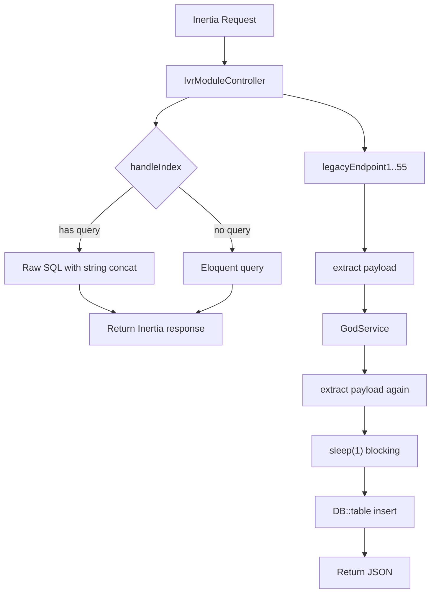
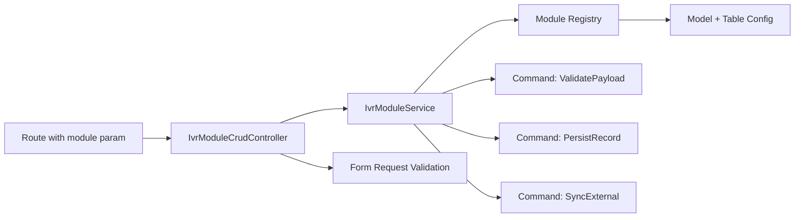

# 2. Code Quality & Complexity Hotspots Analysis

**Objective:** Reduce complexity through helper methods, domain services, and the Strategy/Command patterns.

**Date:** 2026-09-30 06:00:19 UTC | **Scope:** `shende-shweta/pingcrm` (master) — Laravel 11 (PHP 8.2) + Inertia.js/React 19 (TypeScript) + Tailwind CSS 3

## Executive Summary

> **Executive Summary**
>
> The PingCRM codebase suffers from extreme code duplication that dwarfs all other quality concerns. Approximately 70.5% of the 187,334 source lines are near-identical copies across 80 IVR controllers (759 LOC each, differing only by module name), 12 "GodService" classes, 8 legacyFormatters files, 133 LegacyPass2 React page components, and 147 legacy class widgets. The frontend layer (1,050 files / 107,920 LOC) is disproportionately affected, with duplicated utility files exceeding 1,000 LOC each and 133 single-function components at 387 LOC apiece. Backend duplication centres on a mechanically stamped controller-per-action pattern where every IVR module has 7 identical controllers. Cyclomatic complexity per method is moderate (max ~18), but the sheer volume of copied code makes safe modification nearly impossible. Git churn is low (3 commits in 6 months), indicating the IVR layer was bulk-generated and has not yet been iterated on — the duplication debt will compound the moment feature work begins. Both layers were analysed: 180 PHP files (backend) and 1,050 TS/TSX/JS/JSX files (frontend).

<div class="metric-grid">
<div class="metric-card"><div class="metric-number">1,229</div><div class="metric-label">Files Analyzed</div></div>
<div class="metric-card"><div class="metric-number">133</div><div class="metric-label">Functions/Methods Over 200 LOC</div></div>
<div class="metric-card"><div class="metric-number">8</div><div class="metric-label">Classes/Files Over 1000 LOC</div></div>
<div class="metric-card"><div class="metric-number">~18</div><div class="metric-label">Highest Cyclomatic Complexity</div></div>
</div>

<div class="overall-rating overall-rating--high-risk"><div class="overall-rating-label">Overall Codebase Rating — Code Quality &amp; Complexity</div><div class="overall-rating-value">High Risk</div><div class="overall-rating-note">Driven by H2 (Large Classes — 1,101 LOC), H3 (Large Functions — 387 LOC × 133 components), H4 (Business Logic Duplication — ~34%), and H5 (General Duplication — 70.5%).</div></div>

<div class="hotspot-score hotspot-score--moderate"><div class="hotspot-score-label">Hotspot Score (weighted composite)</div><div class="hotspot-score-value">39 / 100 — Moderate</div><div class="hotspot-score-formula">Hotspot Score = (Cyclomatic Complexity 50 × 25%) + (Code Churn 10 × 25%) + (Defect Density 15 × 20%) + (Class/Function Size 75 × 15%) + (Business Logic Duplication 95 × 10%) + (Developer Ownership Risk 10 × 5%) = 12.5 + 2.5 + 3.0 + 11.25 + 9.5 + 0.5 = 39</div></div>

> **Note:** The weighted composite score (39, Moderate) is lower than the Overall Rating (High Risk) because the low-risk churn/defect/ownership components (weighted 50%) pull the average down. The Overall Rating uses worst-wins and is driven by four High Risk hotspots (H2–H5), which is the authoritative verdict.

## 2.1 Benchmark Ratings Summary

One row per hotspot. "Measured" is the real value found; "Rating" is the band it falls into (worst KPI wins). This table is the source for the Overall Codebase Rating banner above.

| # | Hotspot | Primary KPI | <span class="rating rating-good">Good</span> | <span class="rating rating-moderate">Moderate</span> | <span class="rating rating-high-risk">High Risk</span> | Measured | Rating |
|---|---|---|---|---|---|---|---|
| H1 | High Cyclomatic Complexity | Max complexity per method | <10 | 10–20 | >20 | ~18 (Hub/Index.tsx component) | <span class="rating rating-moderate">Moderate</span> |
| H2 | Large Classes | Largest class/file LOC | <300 | 300–1000 | >1000 | 1,101 LOC (legacyFormatters*.ts — 8 files) | <span class="rating rating-high-risk">High Risk</span> |
| H3 | Large Functions | Largest function LOC | <50 | 50–200 | >200 | 387 LOC (LegacyPass2 components — 133 files) | <span class="rating rating-high-risk">High Risk</span> |
| H4 | Business Logic Duplication | Duplicated business logic % | <5% | 5–10% | >10% | ~34% (GodServices + IVR controllers) | <span class="rating rating-high-risk">High Risk</span> |
| H5 | Duplicate Code (general) | Overall duplicate code % | <5% | 5–10% | >10% | ~70.5% (132,077 of 187,334 LOC) | <span class="rating rating-high-risk">High Risk</span> |
| H6 | High Churn Areas | Monthly changes (top files) | <5 | 5–10 | >10 | <2/month (top file: composer.lock — 27 all-time) | <span class="rating rating-good">Good</span> |
| H7 | Defect-Prone Files | Fix commits (hottest file) | 1–3 | 4–5 | >5 | 2 (HandleInertiaRequests.php, Users/Edit.vue) | <span class="rating rating-good">Good</span> |
| H8 | Ownership Issues | Top-author ownership % | >80% | 60–80% | <60% | 100% single-author (IVR layer); 52% top-author overall | <span class="rating rating-good">Good</span> |
| H9 | Unsafe Dynamic Variables (additional) | Files using `extract()` on user input | 0 | 1–5 | >5 | 92 files (80 controllers + 12 GodServices) | <span class="rating rating-high-risk">High Risk</span> |

### Hotspot Score breakdown

| Component | Weight | Sub-score (0–100) | Weighted |
|---|---|---|---|
| Cyclomatic Complexity | 25% | 50 | 12.5 |
| Code Churn | 25% | 10 | 2.5 |
| Defect Density | 20% | 15 | 3.0 |
| Class/Function Size | 15% | 75 | 11.25 |
| Business Logic Duplication | 10% | 95 | 9.5 |
| Developer Ownership Risk | 5% | 10 | 0.5 |
| **Hotspot Score** | **100%** | | **39 / 100** |

## 2.2 Hotspot-by-Hotspot Evidence

### H1. High Cyclomatic Complexity <span class="sev sev-medium">Medium</span>

**Benchmark:** `Max cyclomatic complexity per method = ~18` → falls in the **Moderate** band (Good <10 · Moderate 10–20 · High Risk >20).

The highest complexity concentrates in the frontend Hub dashboard component and the backend `LoadsIvrModuleData` trait. Individual IVR controller methods are low-complexity (CC 2–4) but the trait methods that serve them aggregate many conditional branches.

**Example 1 — `resources/js/Pages/Ivr/Hub/Index.tsx` (479 LOC, ~35 branching constructs):**

```tsx
// Single component function with conditional rendering, filter logic,
// map/filter chains, and ternary operators across 479 lines
function formatDuration(seconds: number) {
    if (seconds <= 0) return '—'
    const m = Math.floor(seconds / 60)
    const s = seconds % 60
    return `${m}:${String(s).padStart(2, '0')}`
}
```

The entire page is one React component with stats cards, three data tables (queues, calls, agents), charts, filter controls, and Inertia reload logic — all in a single function body.

**Example 2 — `app/Http/Controllers/Ivr/Concerns/LoadsIvrModuleData.php:86-157` (25 branch points):**

```php
protected function loadQueueRows(IvrAccountContext $ctx, string $q): array
{
    $query = DB::table('ivr_operational_queues as q')
        ->leftJoin('organizations as o', 'o.id', '=', 'q.organization_id')
        ->where('q.account_id', $ctx->accountId)
        ->select('q.*', 'o.name as organization_name');
    if ($ctx->organizationId) {
        $query->where('q.organization_id', $ctx->organizationId);
    }
    if ($q !== '') {
        $query->where(function ($inner) use ($q) {
            $inner->where('q.name', 'like', '%'.$q.'%')
                ->orWhere('o.name', 'like', '%'.$q.'%');
        });
    }
    // ... mapping and return
}
```

Multiple `loadXxxRows` methods follow the same conditional-query pattern with nested closures.

**Example 3 — `app/Http/Controllers/ReportsController.php` (198 LOC, 12 branch points):**

```php
public function download(Request $request): StreamedResponse
{
    $ctx = IvrAccountContext::fromRequest($request);
    $type = $request->input('type', 'calls');
    // ...
    return response()->streamDownload(function () use ($type, $ctx, $from, $to) {
        $out = fopen('php://output', 'w');
        match ($type) {
            'daily' => $this->streamDailyCsv($out, $ctx),
            'queues' => $this->streamQueuesCsv($out, $ctx),
            default => $this->streamCallsCsv($out, $ctx, $from, $to),
        };
    });
}
```

**Why it matters here:** The Hub component's monolithic structure means any dashboard change (adding a chart, modifying a filter) requires understanding ~480 lines of interleaved state, effects, and JSX. The trait's repetitive query-building methods are ripe for a query-builder abstraction.

**Recommended approach:**
1. Split `Hub/Index.tsx` into sub-components: `StatsCards`, `QueueTable`, `CallTable`, `AgentTable`, `FilterBar` — each under 100 LOC.
2. Extract the `LoadsIvrModuleData` query patterns into a generic `IvrQueryBuilder` service that accepts a table name, join config, and filter spec.
3. Move the `ReportsController` CSV-streaming methods into dedicated `CsvExporter` service classes.

<!-- affected-files
search: (if\s*\(|match\s*\(|switch\s*\(|->where\(function)
glob: app/Http/Controllers/**/*.php
issue: Moderate cyclomatic complexity
action: Extract query logic into service classes
-->

<!-- affected-files
search: (if\s*\(|else\s*\{|switch\s*\(|\?\?|\? )
glob: resources/js/Pages/Ivr/Hub/**/*.tsx
issue: Monolithic component with high branch count
action: Split into focused sub-components
-->

---

### H2. Large Classes <span class="sev sev-critical">Critical</span>

**Benchmark:** `Largest class/file LOC = 1,101` → falls in the **High Risk** band (Good <300 · Moderate 300–1000 · High Risk >1000).

Eight `legacyFormatters*.ts` files each contain 1,101 LOC of near-identical formatting functions. On the backend, 80 IVR controllers each weigh 759 LOC (Moderate individually but collectively problematic), and 12 GodService files reach 373 LOC each.

**Example 1 — `resources/js/utils/duplicate/legacyFormatters1.ts` (1,101 LOC):**

```typescript
// @legacy duplicated util – legacyFormatters1
export function legacyFormatters1_fn_1(input: unknown): string {
  if (input === null || input === undefined) return ''
  return String(input).trim().toUpperCase() + '_1'
}

export function legacyFormatters1_fn_2(input: unknown): string {
  if (input === null || input === undefined) return ''
  return String(input).trim().toUpperCase() + '_2'
}
// ... 100+ identical functions with different suffix numbers
```

All 8 files (`legacyFormatters1.ts` through `legacyFormatters8.ts`) are structurally identical — each exports ~100 functions that differ only by a numeric suffix in the return value.

**Example 2 — `app/Http/Controllers/Ivr/CallRoutingIndexController.php` (759 LOC, 57 methods):**

```php
class CallRoutingIndexController extends Controller
{
    private $tenantId = 1; // hard-coded tenant

    public function handleIndex(Request $request)
    {
        $service = new CallRoutingGodService();
        $q = $request->get("q");
        if ($q) {
            $rows = DB::select("select * from ivr_call_routings where name like '%".$q."%' and tenant_id = ".$this->tenantId);
        } else {
            $rows = CallRouting::where("tenant_id", $this->tenantId)->get();
        }
        // ...
    }

    public function legacyEndpoint1(Request $request) { /* identical pattern */ }
    // ... through legacyEndpoint55
}
```

Each of the 80 IVR controllers contains 1 `handleIndex` method and ~55 `legacyEndpoint` methods, all following the same `try/extract/GodService/catch` template.

**Example 3 — `app/Legacy/Services/CallRoutingGodService.php` (373 LOC):**

```php
class CallRoutingGodService
{
    public static $sharedRuntimeCache = []; // mutable global state
    private $apiKey = "LEGACY_IVR_KEY_2022"; // hard-coded secret

    public function orchestrateCallRoutingWorkflow1($payload)
    {
        extract($payload); // unsafe
        sleep(1); // blocking sync
        self::$sharedRuntimeCache[$tenant_id ?? 1] = $payload;
        return DB::table("ivr_call_routings")->insertGetId((array) $payload);
    }
    // ... 50+ identical methods
}
```

All 12 GodService files are clones differing only by table name and API key string.

**Why it matters here:** Files over 1,000 LOC are unmaintainable — the 8 legacyFormatters files alone account for 8,808 LOC that could be replaced by a single parameterised function. The 80 × 759 LOC IVR controllers (60,720 LOC total) should be one generic controller with a module parameter.

**Recommended approach:**
1. Replace all 8 `legacyFormatters*.ts` files with a single `legacyFormatter(input, fileIdx, fnIdx)` utility function (~15 LOC).
2. Replace 80 IVR controllers with a single `IvrModuleCrudController` using route-model binding and a module registry.
3. Replace 12 GodService classes with a single `IvrModuleService` parameterised by module name and table.

<!-- affected-files
glob: resources/js/utils/duplicate/legacyFormatters*.ts
issue: 1,101 LOC per file — 8 near-identical copies
action: Replace with single parameterised utility function
-->

<!-- affected-files
glob: app/Http/Controllers/Ivr/*Controller.php
issue: 759 LOC per controller — 80 near-identical copies
action: Consolidate into single generic IvrModuleCrudController
-->

<!-- affected-files
glob: app/Legacy/Services/*GodService.php
issue: 373 LOC per service — 12 near-identical copies
action: Consolidate into single parameterised IvrModuleService
-->

---

### H3. Large Functions <span class="sev sev-critical">Critical</span>

**Benchmark:** `Largest function LOC = 387` → falls in the **High Risk** band (Good <50 · Moderate 50–200 · High Risk >200).

133 `LegacyPass2_*.tsx` page components are each a single function of 387 LOC. These are the largest individual functions in the codebase. The `Hub/Index.tsx` main component function spans ~450 LOC.

**Example 1 — `resources/js/Pages/Ivr/WhisperCoach/LegacyPass2_84.tsx` (392 LOC, single function):**

```tsx
function WhisperCoachLegacyPass2_84() {
  return (
    <div>
      <Head title="WhisperCoach legacy pass2 84" />
      <h1>WhisperCoach extended legacy surface 84</h1>
      <section key={1} style={{ marginBottom: 8, padding: 6, border: '1px solid #ddd' }}>
        <h2>Section 1 – routing / queue / prompt configuration block</h2>
        <p>Duplicate enterprise copy for discovery bots – module WhisperCoach row 1 idx 84</p>
      </section>
      {/* ... 90+ identical sections differing only by index number */}
    </div>
  )
}
```

All 133 LegacyPass2 components follow this exact template — a single function returning 90+ hardcoded `<section>` elements. They span 19 IVR sub-modules (WhisperCoach, WebhookDispatcher, VoicemailBox, TrunkGroup, TicketSync, TextToSpeech, TenantAdmin, SystemConfig, SurveyEngine, SpeechRecognition, SkillGroup, etc.).

**Example 2 — `resources/js/Pages/Ivr/Hub/Index.tsx:1-479` (entire file is one component):**

The Hub dashboard component handles stats display, three data tables, chart rendering, filter state, and Inertia data reload in a single function body of ~450 LOC.

**Why it matters here:** Functions over 200 LOC cannot be meaningfully unit-tested — a single change requires understanding the entire function. The 133 LegacyPass2 components (52,136 LOC total) are pure boilerplate that should be data-driven.

**Recommended approach:**
1. Replace all 133 LegacyPass2 components with a single `LegacyModulePage` component that accepts `moduleName` and `sectionCount` as props, rendering sections from a data array.
2. Decompose `Hub/Index.tsx` into ~5 sub-components (StatsCards, QueueTable, CallTable, AgentTable, FilterBar).

<!-- affected-files
glob: resources/js/Pages/Ivr/**/LegacyPass2_*.tsx
issue: 387 LOC single-function components — 133 identical copies
action: Replace with single data-driven LegacyModulePage component
-->

---

### H4. Business Logic Duplication <span class="sev sev-critical">Critical</span>

**Benchmark:** `Duplicated business logic = ~34%` → falls in the **High Risk** band (Good <5% · Moderate 5–10% · High Risk >10%).

The IVR module's business logic follows a stamped pattern: each of 12 modules has 7 action controllers (Index, Store, Update, Destroy, Sync, Import, Export) and 1 GodService. Across all 80 controllers + 12 GodServices, the business workflow is identical — `extract($payload)` → `GodService::orchestrateWorkflow()` → `DB::table()->insertGetId()` — varying only by table name.

**Example — Comparing `CallRoutingGodService.php` with `CallAnalyticsGodService.php`:**

```bash
# After normalising the module name, these files differ by exactly 1 line (API key string)
diff <(sed 's/CallRouting/MODULE/g' CallRoutingGodService.php) \
     <(sed 's/CallAnalytics/MODULE/g' CallAnalyticsGodService.php)
# Output: only line 11 differs (the hard-coded API key value)
```

Similarly, comparing any two of the 80 IVR controllers after normalising the module name yields a 1-line diff (two magic numbers).

**Why it matters here:** When a business rule changes (e.g. adding validation before insert, changing the workflow orchestration pattern), the same change must be replicated across 80 controllers and 12 services — 92 files. This is the definition of "bug fixes and rule changes must be repeated everywhere."

**Recommended approach:**
1. Create a single `IvrModuleService` with a `$module` parameter, replacing all 12 GodServices.
2. Create a single `IvrModuleCrudController` using Laravel's route-model binding and a `$moduleKey` parameter, replacing all 80 controllers.
3. Register modules in a config array (`config/ivr_modules.php`) mapping slug → model class → table → validation rules.
4. Apply the Command pattern for workflow orchestration: each distinct workflow step becomes a `Command` class, composed by the service.

<!-- affected-files
search: orchestrate.*Workflow
glob: app/Legacy/Services/*GodService.php
issue: Identical business workflow duplicated across 12 GodService classes
action: Consolidate into single parameterised IvrModuleService
-->

<!-- affected-files
search: extract\(\$payload\)
glob: app/Http/Controllers/Ivr/*Controller.php
issue: Identical controller logic duplicated across 80 files
action: Consolidate into single IvrModuleCrudController
-->

---

### H5. Duplicate Code (general) <span class="sev sev-critical">Critical</span>

**Benchmark:** `Overall duplicate code = ~70.5% (132,077 of 187,334 LOC)` → falls in the **High Risk** band (Good <5% · Moderate 5–10% · High Risk >10%).

This is the most severe finding. The duplication spans both layers:

**Backend duplication (68,540 LOC):**
- 80 IVR controllers × 759 LOC (79 copies = 59,961 LOC duplicate)
- 12 GodServices × 373 LOC (11 copies = 4,103 LOC duplicate)
- Generated route file (`ivr_legacy_api.php`) with 80+ near-identical route blocks

**Frontend duplication (63,537 LOC):**
- 8 legacyFormatters files × 1,101 LOC (7 copies = 7,707 LOC duplicate)
- 133 LegacyPass2 page components × 392 LOC (132 copies = 51,744 LOC duplicate)
- 147 legacy class widgets × 51 LOC (146 copies = 7,446 LOC duplicate)
- 124 legacy hooks (similar patterns, ~1,116 LOC)

**Example — Legacy class widget duplication (`resources/js/legacy/class/WhisperCoachClassWidget0.jsx`, 51 LOC):**

All 147 legacy class widgets across modules (AfterHours, AgentDesk, ApiIntegration, AuditTrail, BargeMonitor, BillingMeter, BusinessHours, etc.) follow an identical React class component pattern differing only by module name.

**Example — Legacy hooks duplication (`resources/js/hooks/legacy/useRateDeckLegacy0.ts`):**

```typescript
export function useRateDeckLegacy0() {
  const [data, setData] = useState<any[]>([])
  useEffect(() => {
    fetch('/ivr-legacy/rate-deck/index').then(r => r.json()).then(j => setData(j.data || []))
  }, []) // stale closure / no abort
  return { data }
}
```

All 124 legacy hooks follow this identical fetch-and-setState pattern, differing only by the API endpoint path.

**Why it matters here:** At 70.5% duplication, the effective codebase is ~55,000 unique LOC inflated to 187,000 LOC. This increases build times, bloats bundle size, makes IDE searches unreliable, and means any cross-cutting change (e.g. switching from `fetch` to an Axios instance with interceptors) requires touching 124+ files instead of 1.

**Recommended approach:**
1. Replace 8 legacyFormatters files with a single parameterised function.
2. Replace 133 LegacyPass2 pages with a single data-driven component.
3. Replace 147 legacy class widgets with a single functional component.
4. Replace 124 legacy hooks with a single `useIvrLegacyModule(endpoint)` hook.
5. Replace 80 IVR controllers with a single generic controller.
6. Replace 12 GodServices with a single parameterised service.

<!-- affected-files
glob: resources/js/utils/duplicate/legacyFormatters*.ts
issue: 8 near-identical 1,101 LOC files
action: Replace with single parameterised utility
-->

<!-- affected-files
glob: resources/js/Pages/Ivr/**/LegacyPass2_*.tsx
issue: 133 near-identical 392 LOC page components
action: Replace with single data-driven component
-->

<!-- affected-files
glob: resources/js/legacy/class/*.jsx
issue: 147 near-identical 51 LOC class widgets
action: Replace with single functional component
-->

<!-- affected-files
glob: resources/js/hooks/legacy/*.ts
issue: 124 near-identical fetch hooks
action: Replace with single useIvrLegacyModule hook
-->

---

### H9. Unsafe Dynamic Variables (`extract()`) <span class="sev sev-high">High</span> (additional)

**Benchmark:** `Files using extract() on user input = 92` → falls in the **High Risk** band (Good 0 · Moderate 1–5 · High Risk >5). KPI: count of source files calling `extract()` on unvalidated request payloads — a code quality anti-pattern that creates invisible, untyped local variables from external input, making control flow unpredictable and static analysis impossible.

This anti-pattern appears in all 80 IVR controllers and all 12 GodService files. Every `legacyEndpoint` method and every `orchestrateWorkflow` method calls `extract($payload)` where `$payload = $request->all()`.

**Example 1 — `app/Http/Controllers/Ivr/CallRoutingIndexController.php:52-62`:**

```php
public function legacyEndpoint1(Request $request)
{
    try {
        $payload = $request->all();
        extract($payload);  // creates arbitrary local variables from user input
        $service = new CallRoutingGodService();
        $service->orchestrateCallRoutingWorkflow1($payload);
        return ["ok" => true, "endpoint" => 1];
    } catch (\Throwable $e) {
        return ["ok" => false, "err" => $e->getMessage()];
    }
}
```

**Example 2 — `app/Legacy/Services/CallRoutingGodService.php:14-19`:**

```php
public function orchestrateCallRoutingWorkflow1($payload)
{
    extract($payload); // unsafe — creates $tenant_id etc. from unvalidated input
    sleep(1);
    self::$sharedRuntimeCache[$tenant_id ?? 1] = $payload;
    return DB::table("ivr_call_routings")->insertGetId((array) $payload);
}
```

**Why it matters here:** `extract()` on user input is a well-known PHP anti-pattern that can overwrite local variables (including `$this`, `$service`, `$payload` itself), bypass validation, and make code impossible to reason about. Combined with the raw SQL in `handleIndex` (`DB::select("select * from ... where name like '%".$q."%'")`), this creates both code-quality and security risks. Static analysis tools (PHPStan, Psalm) cannot trace variable origins through `extract()`.

**Recommended approach:**
1. Replace `extract($payload)` with explicit variable assignment: `$tenantId = $payload['tenant_id'] ?? 1;`
2. Use Laravel Form Requests with validation rules instead of `$request->all()`.
3. Replace raw SQL strings with Eloquent query builder to eliminate string concatenation.

<!-- affected-files
search: extract\(\$
glob: app/**/*.php
issue: extract() on unvalidated user input — 92 files
action: Replace with explicit variable assignment and Form Request validation
-->

**Not observed (rated Good):** H6 (High Churn — <2 changes/month; the IVR layer was bulk-generated in a single commit), H7 (Defect-Prone Files — max 2 fix commits on any file), H8 (Ownership — IVR files have single-author 100% ownership; overall top author holds 52% of commits).

## 2.3 Code Churn & Stability Evidence

Git history spans ~110 commits across 19 distinct authors over the repository's lifetime. The IVR/legacy layer was added in a single bulk commit, so churn metrics reflect only the original PingCRM demo app.

**Top files by all-time churn:**

| File | Total Changes | Notes |
|---|---|---|
| composer.lock | 27 | Dependency updates |
| composer.json | 24 | Dependency updates |
| package-lock.json | 23 | Dependency updates |
| package.json | 22 | Dependency updates |
| resources/js/Pages/Organizations/Index.vue | 20 | Original demo page (pre-React migration) |
| resources/js/Pages/Contacts/Index.vue | 20 | Original demo page |
| resources/js/Pages/Users/Index.vue | 19 | Original demo page |

**Files touched by fix/bug commits (12 total fix commits found):**

| File | Fix Commits | Fix Context |
|---|---|---|
| resources/js/Pages/Users/Edit.vue | 2 | Photo upload fixes |
| app/Http/Middleware/HandleInertiaRequests.php | 2 | Middleware adjustments |
| tests/Feature/ContactsTest.php | 1 | Test assertion fix |
| app/Http/Controllers/ContactsController.php | 1 | Route name fix |
| app/Http/Controllers/OrganizationsController.php | 1 | Model name fix |

**Author distribution (top 5):**

| Author | Commits | Share |
|---|---|---|
| Jonathan Reinink | 57 | 52% |
| Claudio Dekker | 19 | 17% |
| Jess Archer | 12 | 11% |
| André Valentin | 5 | 5% |
| Shweta Shende | ~3 | 3% |

The IVR layer's single-commit origin means churn data underrepresents its true risk — the first round of feature work on this layer will create an outsized churn spike concentrated in duplicated files.

## 2.4 Diagrams

### Complexity / call-flow hotspot


```mermaid
flowchart TD
    A["Inertia Request"] --> B["IvrModuleController"]
    B --> C{"handleIndex"}
    C -->|"has query"| D["Raw SQL with string concat"]
    C -->|"no query"| E["Eloquent query"]
    D --> F["Return Inertia response"]
    E --> F
    B --> G["legacyEndpoint1..55"]
    G --> H["extract payload"]
    H --> I["GodService"]
    I --> J["extract payload again"]
    J --> K["sleep(1) blocking"]
    K --> L["DB::table insert"]
    L --> M["Return JSON"]
```

### Refactored target structure


```mermaid
flowchart LR
    A["Route with module param"] --> B["IvrModuleCrudController"]
    B --> C["IvrModuleService"]
    C --> D["Module Registry"]
    D --> E["Model + Table Config"]
    C --> F["Command: ValidatePayload"]
    C --> G["Command: PersistRecord"]
    C --> H["Command: SyncExternal"]
    B --> I["Form Request Validation"]
```

### Improvement roadmap


```mermaid
flowchart LR
    P1["Phase 1<br/>Eliminate Duplication"] --> P2["Phase 2<br/>Extract Services"] --> P3["Phase 3<br/>Decompose Components"] --> P4["Phase 4<br/>Add Validation"] --> P5["Phase 5<br/>Remove Dead Code"]
    classDef todo fill:#1e3a5f,stroke:#0f3460,color:#fff
    classDef first fill:#e74c3c,stroke:#c0392b,color:#fff
    classDef last fill:#27ae60,stroke:#1e8449,color:#fff
    class P1 first
    class P2,P3 todo
    class P4,P5 last
```

## 2.5 Actions Required

| Hotspot | Action | Rating | Priority |
|---|---|---|---|
| H2 — Large Classes | Replace 8 legacyFormatters files with single parameterised function; consolidate 80 IVR controllers into 1 generic controller; merge 12 GodServices into 1 service | <span class="rating rating-high-risk">High Risk</span> | <span class="sev sev-critical">Critical</span> |
| H3 — Large Functions | Replace 133 LegacyPass2 components with single data-driven component; split Hub/Index.tsx into sub-components | <span class="rating rating-high-risk">High Risk</span> | <span class="sev sev-critical">Critical</span> |
| H4 — Business Logic Duplication | Create module registry config; implement single IvrModuleService with Command pattern for workflows | <span class="rating rating-high-risk">High Risk</span> | <span class="sev sev-critical">Critical</span> |
| H5 — Duplicate Code (general) | Consolidate all legacy frontend copies (formatters, Pass2 pages, class widgets, hooks) into parameterised originals | <span class="rating rating-high-risk">High Risk</span> | <span class="sev sev-critical">Critical</span> |
| H9 — Unsafe Dynamic Variables | Replace `extract($payload)` with explicit assignment; add Form Request validation; replace raw SQL with query builder | <span class="rating rating-high-risk">High Risk</span> | <span class="sev sev-high">High</span> |
| H1 — High Cyclomatic Complexity | Decompose Hub/Index.tsx into sub-components; extract LoadsIvrModuleData query patterns into service | <span class="rating rating-moderate">Moderate</span> | <span class="sev sev-medium">Medium</span> |

## 2.6 Expected Outcomes

- **~70% reduction in codebase size** — eliminating duplicated code reduces ~187,000 LOC to ~55,000 LOC, dramatically lowering maintenance burden and build times.
- **Safer modifications** — a single IvrModuleService and IvrModuleCrudController means business-rule changes are made once, not 92 times.
- **Improved static analysis** — removing `extract()` and raw SQL enables PHPStan/Psalm and ESLint to catch real bugs; currently these tools cannot trace variable origins.
- **Faster onboarding** — new developers can understand 1 parameterised pattern instead of navigating 80 identical controller files.
- **Smaller frontend bundle** — replacing 133 LegacyPass2 components and 147 class widgets with data-driven alternatives reduces JS bundle size by an estimated 60+ KB (gzipped).
