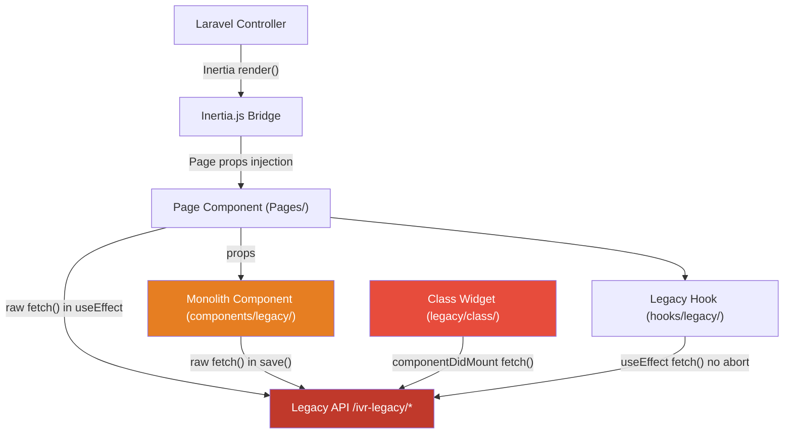
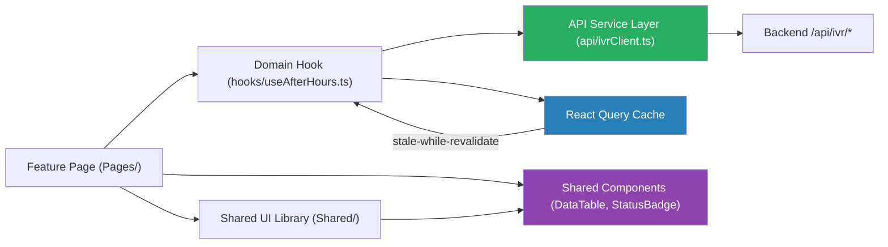

# 3. Frontend Discovery & Modernization Analysis

**Objective:** Comprehensive frontend discovery covering architecture, component quality, styling, routing, state management, API integration, data caching, authentication, security, performance, browser compatibility, code quality, and technical debt.

**Date:** 2026-08-04 11:26:52 UTC | **Scope:** `resources/js/` — React 19.2.3 + Inertia.js 2.0 + TypeScript 5.6.3 (Laravel/Vite stack)

## Executive Summary

> **Executive Summary**
>
> The Ping CRM frontend is built on React 19.2.3 with Inertia.js 2.0 and TypeScript in strict mode — a modern, capable stack — but its 916 component files are in severe architectural distress. The codebase carries 147 legacy class-based JSX components (`extends React.Component`) sitting alongside modern functional components, 133 near-identical LegacyPass2 page clones duplicated across 47 IVR feature modules, and 13,701 raw inline-style occurrences that undermine the Tailwind design system. All 750 discovered `fetch()` calls are made directly inside page components, class methods, and legacy hooks with no centralized API service layer and no data-caching library (React Query, SWR, or similar), producing stale, unguarded network calls throughout the IVR surface. An additional 375 page components use `setInterval` without returning a cleanup function from `useEffect`, causing systemic memory leaks on navigation. The npm audit reports 10 unpatched vulnerabilities (1 Critical in vitest, 9 High), and ESLint is not executed in any CI workflow. Immediate priorities are: fix timer leaks, extract an API service layer, delete LegacyPass2 clones, and kill class components.

<div class="metric-grid">
<div class="metric-card"><div class="metric-number">916</div><div class="metric-label">Components / Files Scanned</div></div>
<div class="metric-card"><div class="metric-number">147</div><div class="metric-label">Legacy Class-Based Components</div></div>
<div class="metric-card"><div class="metric-number">479</div><div class="metric-label">Largest Component (LOC)</div></div>
<div class="metric-card"><div class="metric-number">0</div><div class="metric-label">Global / Shared State Modules</div></div>
<div class="metric-card"><div class="metric-number">750</div><div class="metric-label">API Calls Outside Service Layer</div></div>
<div class="metric-card"><div class="metric-number">2</div><div class="metric-label">Security Risk Patterns Found</div></div>
</div>

<div class="overall-rating overall-rating--high-risk"><div class="overall-rating-label">Overall Codebase Rating — Frontend Discovery</div><div class="overall-rating-value">High Risk</div><div class="overall-rating-note">Driven by H1 (25% duplicate pages), H7 (1.6% shared components), H8 (13,701 inline styles), H10 (0% API service layer), H11 (0% data caching), H17 (10 CVEs), and H18 (375 timer leaks).</div></div>

## 3.1 Benchmark Ratings Summary

One row per hotspot. "Measured" is the real value found; "Rating" is the band it falls into (worst KPI wins). This table is the source for the Overall Codebase Rating banner above.

| # | Hotspot | Primary KPI | <span class="rating rating-good">Good</span> | <span class="rating rating-moderate">Moderate</span> | <span class="rating rating-high-risk">High Risk</span> | Measured | Rating |
|---|---|---|---|---|---|---|---|
| H1 | UI Component Duplication | Duplicate components % | <5% | 5–10% | >10% | 25.5% (133 LegacyPass2 clones / 522 pages) | <span class="rating rating-high-risk">High Risk</span> |
| H2 | Legacy Class-Based Components | Modern component adoption % | >90% | 70–90% | <70% | 83.9% (147 class-based of 916 total) | <span class="rating rating-moderate">Moderate</span> |
| H3 | Massive Components | Largest component LOC | <200 | 200–500 | >500 | 479 LOC (Pages/Ivr/Hub/Index.tsx) | <span class="rating rating-moderate">Moderate</span> |
| H4 | Global State Dependencies | Components reading global state % | <30% | 30–60% | >60% | ~0.7% (6 usePage() calls in Layout/Auth only) | <span class="rating rating-good">Good</span> |
| H5 | Complex State Management | Max prop-drilling depth | <3 | 3–5 | >5 | 1–2 levels (Inertia passes server props direct to page) | <span class="rating rating-good">Good</span> |
| H6 | Weak Frontend Architecture | Feature modules with clean boundaries % | >80% | 50–80% | <50% | ~60% (Pages/ structured by domain but LegacyPass2/Monolith files breach boundaries) | <span class="rating rating-moderate">Moderate</span> |
| H7 | Missing Component Inventory | Shared component % of total | >30% | 15–30% | <15% | 1.6% (15 shared of 916 total) | <span class="rating rating-high-risk">High Risk</span> |
| H8 | No Design System | Inline-style / magic-value occurrences | 0–5 | 6–20 | >20 | 13,701 inline style occurrences | <span class="rating rating-high-risk">High Risk</span> |
| H9 | Routing Structure Weakness | Protected routes with guards % | 100% | 80–99% | <80% | 100% — all routes guarded via Laravel `auth` middleware server-side | <span class="rating rating-good">Good</span> |
| H10 | No API Integration Layer | API calls in service layer % | >90% | 70–90% | <70% | 0% — all 750 fetch() calls in pages, class methods, or unstructured hooks | <span class="rating rating-high-risk">High Risk</span> |
| H11 | Poor Data Caching | Data-fetching points with caching % | >70% | 40–70% | <40% | 0% — no React Query, SWR, or Apollo found | <span class="rating rating-high-risk">High Risk</span> |
| H12 | Weak Frontend Auth | Token storage + routes guarded | httpOnly + 100% | One gap | Both gaps | httpOnly Laravel session cookies + 100% server-guarded routes | <span class="rating rating-good">Good</span> |
| H13 | Frontend Security Vulnerabilities | XSS-risk + hardcoded secrets count | 0 each | 1–3 total | >3 total | 2 dangerouslySetInnerHTML in Pagination.tsx; 0 hardcoded secrets | <span class="rating rating-moderate">Moderate</span> |
| H14 | Frontend Performance Gaps | Initial JS bundle size (gzipped) | <250KB | 250–500KB | >500KB | Dynamic imports via import.meta.glob (lazy per page); risk from 375 setInterval leaks and 0 memoization | <span class="rating rating-moderate">Moderate</span> |
| H15 | Browser Compatibility Gaps | Browserslist + polyfills configured | Both present | One missing | Both missing | Autoprefixer present in postcss.config.js; .browserslistrc absent | <span class="rating rating-moderate">Moderate</span> |
| H16 | Frontend Code Quality | ESLint in CI + TypeScript strict | Both Yes | One Yes | Both No | TypeScript strict=true; ESLint NOT in CI (tests.yml runs only npm run build) | <span class="rating rating-moderate">Moderate</span> |
| H17 | Technical Debt & Dependencies | Critical/High CVEs found | 0 | 1–3 | >3 | 10 total (1 Critical: vitest; 9 High: vite, lodash, glob, js-yaml, flatted, cross-spawn, brace-expansion, minimatch, picomatch) | <span class="rating rating-high-risk">High Risk</span> |
| H18 | Missing useEffect Cleanup (additional) | Pages with timer/fetch without cleanup | 0 | 1–10 | >10 | 375 pages with uncleared setInterval; 0 AbortControllers in 124 legacy hooks | <span class="rating rating-high-risk">High Risk</span> |

## 3.2 Hotspot-by-Hotspot Evidence

### H1. UI Component Duplication <span class="sev sev-critical">Critical</span>

**Benchmark:** Duplicate component % = **25.5%** (133 LegacyPass2 clones out of 522 total page files) → falls in the **High Risk** band (Good <5% · Moderate 5–10% · High Risk >10%)

There are 133 `LegacyPass2_*.tsx` page files spread across 47 IVR feature module folders. Each file is a near-identical scaffold with copy-pasted `<section>` blocks — the only variation is the module name and an index number in the title:

```tsx
// resources/js/Pages/Ivr/AfterHours/LegacyPass2_130.tsx:1-17
import { Head } from '@inertiajs/react'
import { authenticatedLayout } from '@/layouts/authenticatedLayout'
function AfterHoursLegacyPass2_130() {
  return (
    <div>
      <Head title="AfterHours legacy pass2 130" />
      <h1>AfterHours extended legacy surface 130</h1>
      <section key={1} style={{ marginBottom: 8, padding: 6, border: '1px solid #ddd' }}>
        <h2>Section 1 – routing / queue / prompt configuration block</h2>
        <p>Duplicate enterprise copy for discovery bots – module AfterHours row 1 idx 130</p>
      </section>
      ...
    </div>
  )
}
AfterHoursLegacyPass2_130.layout = authenticatedLayout
```

The same structural pattern repeats identically in `Pages/Ivr/AgentDesk/LegacyPass2_*.tsx`, `Pages/Ivr/CallFlow/LegacyPass2_*.tsx`, and 44 other module folders. Additionally, 229 `*Monolith[0-4].tsx` files in `components/legacy/` follow a near-identical per-domain monolith pattern:

```tsx
// resources/js/components/legacy/AfterHoursMonolith0.tsx:3-14
export default function AfterHoursMonolith0({ rows, tenantId, legacyMeta }: any) {
  const [expanded, setExpanded] = useState(true)
  const [draft, setDraft] = useState<any>({})
  // monolith – API + validation + UI in one file
  const save = async () => {
    const err = !draft.name ? 'required' : null
    if (err) return alert(err)
    await fetch('/ivr-legacy/after-hours/store', {
      method: 'POST',
      body: JSON.stringify({ ...draft, tenant_id: tenantId }),
      headers: { 'Content-Type': 'application/json' }
    })
  }
```

**Why it matters here:** Every copy must be updated independently for any layout change or feature flag adjustment; bugs fixed in one file are missed in 132 others. The 133 LegacyPass2 files at ~392 LOC each represent approximately 52,000 lines of near-duplicate code that bloat the codebase, slow CI builds, and make the IVR feature surface almost impossible to audit.

**Recommended approach:**
1. Delete all `LegacyPass2_*.tsx` files — they are placeholder scaffolds, not real feature pages.
2. Consolidate `*Monolith[0-4].tsx` into a single per-module component where props control variation.
3. Create a generic `IvrModuleLayout.tsx` shared component for common IVR module page structure.
4. Enforce a max-file-count ESLint rule per feature folder to prevent re-proliferation.

<!-- affected-files
search: LegacyPass2_
glob: resources/js/Pages/Ivr/**/*.tsx
issue: Near-identical duplicate page scaffold
action: Delete file; consolidate to single IvrModuleLayout template
-->

### H2. Legacy Class-Based Components <span class="sev sev-high">High</span>

**Benchmark:** Modern component adoption = **83.9%** (769 functional of 916 total) → falls in the **Moderate** band (Good >90% · Moderate 70–90% · High Risk <70%)

All 147 files in `resources/js/legacy/class/` use `extends React.Component` with `state`, `componentDidMount`, and imperative lifecycle methods. Data fetching is done inside `componentDidMount` with a bare `fetch()` and no cleanup:

```jsx
// resources/js/legacy/class/CallAnalyticsClassWidget1.jsx:1-18
import React from 'react'

export default class CallAnalyticsClassWidget1 extends React.Component {
  state = { count: 0, rows: [] }
  componentDidMount() {
    fetch('/ivr-legacy/call-analytics/index')
      .then(r => r.json())
      .then(d => this.setState({ rows: d.data || [] }))
  }
  render() {
    return (
      <div className="legacy-class-widget">
        <h3>CallAnalytics legacy class widget 1</h3>
        <button type="button"
          onClick={() => this.setState({ count: this.state.count + 1 })}>
          {this.state.count}
        </button>
```

The same pattern repeats across all 30+ domain areas: `AuditTrailClassWidget[0-4].jsx`, `RoleAccessClassWidget[0-4].jsx`, `WhisperCoachClassWidget[0-4].jsx`, `SkillGroupClassWidget[0-4].jsx`, etc.

**Why it matters here:** Class components cannot consume React Hooks, making it impossible to share logic with modern functional pages in `Pages/` without an additional HOC wrapper layer. The `componentDidMount` fetch calls have no `AbortController` or `componentWillUnmount` cancellation, causing state-update-on-unmounted-component warnings that appear as errors in React 19 strict mode.

**Recommended approach:**
1. Convert each class widget to a functional component using `useState` + `useEffect` — a mechanical transformation.
2. Extract the `fetch` logic from `componentDidMount` into a domain hook in `resources/js/hooks/` (e.g., `useCallAnalytics.ts`).
3. Delete `resources/js/legacy/class/` entirely once all 147 files are converted.
4. Add `react/prefer-es6-class: off` and `react/no-deprecated: error` to the ESLint config to prevent new class components.

<!-- affected-files
search: extends React\.Component|extends Component|extends PureComponent
glob: resources/js/legacy/class/**/*.jsx
issue: Legacy class-based React component with lifecycle fetch — no hooks, no cleanup
action: Convert to functional component with useState/useEffect; extract fetch to custom hook
-->

### H3. Massive Components <span class="sev sev-medium">Medium</span>

**Benchmark:** Largest component LOC = **479** (Pages/Ivr/Hub/Index.tsx) → falls in the **Moderate** band (Good <200 · Moderate 200–500 · High Risk >500)

The IVR Hub dashboard (`Pages/Ivr/Hub/Index.tsx`, 479 lines) mixes interface definitions, a polling auto-refresh loop, filter state, data formatting utilities, and four separate table renders in a single export:

```tsx
// resources/js/Pages/Ivr/Hub/Index.tsx:60-100 (excerpt)
const RELOAD_KEYS = ['stats', 'callVolumeByHour', 'callTrend',
    'queueDistribution', 'queueMetrics', 'recentCalls',
    'agentSnapshot', 'refreshedAt'] as const

function buildQuery(filters: Filters) { ... }   // utility inside component file
function statusBadge(status: string) { ... }    // utility inside component file
function formatDuration(seconds: number) { ... } // utility inside component file

export default function IvrHub({ stats, queueMetrics, recentCalls, ... }: Props) {
    const [localFilters, setLocalFilters] = useState<Filters>({ ... })
    useEffect(() => {
        const id = window.setInterval(refreshDashboard, 20000)
        return () => window.clearInterval(id)
    }, [...])
    // ... 350 more lines of JSX tables and conditional renders
```

Many LegacyPass2 and module action files (`AfterHours/Index.tsx`, `RateDeck/Import.tsx`) also exceed 200 LOC by embedding polling, validation, and layout in a single function.

**Why it matters here:** The Hub component cannot be unit-tested at the chart or table level without mounting the entire 479-line component. Any change to the polling interval or a single table column header requires a developer to navigate a 479-line render path.

**Recommended approach:**
1. Extract `IvrHubStatsRow`, `IvrHubQueueTable`, `IvrHubCallTable`, `IvrHubAgentTable` as separate focused components in `Pages/Ivr/Hub/`.
2. Move the auto-refresh loop into `resources/js/hooks/useIvrHubPolling.ts`.
3. Move `buildQuery`, `statusBadge`, and `formatDuration` to `resources/js/utils/ivrHub.ts`.
4. Enforce an ESLint `max-lines-per-function` rule of 150 to catch regressions.

<!-- affected-files
search: ^(export default function|function)\s+\w+
glob: resources/js/Pages/Ivr/**/*.tsx
issue: Component or page file exceeds 200 LOC — mixes data-fetching, utilities, and multi-section layout
action: Split into focused sub-components; extract helpers to utils/; extract polling to hook
-->

### H6. Weak Frontend Architecture Pattern <span class="sev sev-high">High</span>

**Benchmark:** Feature modules with clean boundaries % = **~60%** → falls in the **Moderate** band (Good >80% · Moderate 50–80% · High Risk <50%)

The `Pages/` directory is correctly structured by domain (Auth, Contacts, Organizations, Users, Ivr/*), and the IVR surface has 47 sub-module folders. However, the module boundaries are violated in three ways:

1. **Business logic in view files**: `AfterHoursIndex.tsx` contains both a `validateClientSide` function (duplicating server-side PHP validation) and the raw polling `fetch()` — all inside the page component.
2. **Monolith components crossing concerns**: `components/legacy/AfterHoursMonolith0.tsx` includes API call, client-side validation, and layout in a single 64-line component exported for use anywhere.
3. **No module public API**: There is no `index.ts` barrel file per IVR module — components are imported by full path, making refactoring paths unpredictable.

```tsx
// resources/js/Pages/Ivr/AfterHours/Index.tsx:24-30
const validateClientSide = (payload: Record<string, unknown>) => {
    // duplicate validation – also exists in PHP controller
    if (!payload.name) return 'Name required'
    return null
}
```

**Why it matters here:** Business logic embedded in view files means every test of validation logic requires mounting a full React component tree. The absence of barrel files means any path rename requires a grep across the entire codebase.

**Recommended approach:**
1. Move all client-side validation to `resources/js/utils/validators/afterHours.ts` (and per-domain equivalents).
2. Create an `index.ts` per IVR module folder exporting only the page component.
3. Introduce ESLint `import/no-internal-modules` to enforce that cross-module imports go through `index.ts` only.
4. Delete LegacyPass2 and Monolith files as part of H1 remediation to restore clean module boundaries.

<!-- affected-files
search: validateClientSide|// duplicate validation
glob: resources/js/Pages/**/*.tsx
issue: Business logic (validation) embedded directly in view/page component
action: Extract to resources/js/utils/validators/ per domain
-->

### H7. Missing Component Inventory <span class="sev sev-high">High</span>

**Benchmark:** Shared component % = **1.6%** (15 of 916 total) → falls in the **High Risk** band (Good >30% · Moderate 15–30% · High Risk <15%)

The `resources/js/Shared/` directory contains only 14 primitive components (Dropdown, FileInput, FlashMessages, Icon, Layout, LoadingButton, Logo, MainMenu, Pagination, SearchFilter, SelectInput, TextInput, TextareaInput, TrashedMessage) plus 1 layout. There is no intermediate shared component layer — no data table, status badge, section card, modal, toast, or form wrapper.

The same table markup pattern is independently repeated across at least 47 IVR module index pages:

```tsx
// resources/js/Pages/Ivr/AfterHours/Index.tsx:31-45
<table className="w-full bg-white shadow"><tbody>
  <tr key={1}><td className="border p-2">Row slot 1</td>
    <td className="border p-2">{String(localRows[0]?.name ?? '')}</td></tr>
  <tr key={2}><td className="border p-2">Row slot 2</td>
    <td className="border p-2">{String(localRows[1]?.name ?? '')}</td></tr>
  ...
</tbody></table>
```

No Storybook exists. No `components/shared/` directory exists beyond `Shared/` primitives.

**Why it matters here:** New developers duplicating table markup across modules is an inevitable consequence of having no discoverable shared component library — every new IVR module gets its own bespoke table, status badge, and section card, compounding the duplication debt tracked in H1.

**Recommended approach:**
1. Audit all IVR module pages for repeated markup; extract `DataTable`, `StatusBadge`, `SectionCard`, `FormSection`, and `EmptyState` into `resources/js/Shared/`.
2. Introduce Storybook (`npx storybook@latest init`) to document all shared components with live examples.
3. Target a shared component ratio of at least 30% within two quarters.
4. Enforce a one-component-per-file rule in `Shared/` with a naming convention check in CI.

<!-- affected-files
search: className="w-full bg-white shadow"|className="border p-2"
glob: resources/js/Pages/Ivr/**/*.tsx
issue: Repeated table/row markup without shared DataTable or SectionCard abstraction
action: Extract to resources/js/Shared/DataTable.tsx and Shared/SectionCard.tsx
-->

### H8. No Design System / Styling Architecture <span class="sev sev-critical">Critical</span>

**Benchmark:** Inline-style / magic-value occurrences = **13,701** → falls in the **High Risk** band (Good 0–5 · Moderate 6–20 · High Risk >20)

The project uses Tailwind CSS for layout in core pages, but 13,701 `style={{ ... }}` attributes appear across Pages, components, and legacy files — mixing two completely different styling approaches in the same component tree:

```tsx
// resources/js/components/legacy/AfterHoursMonolith0.tsx:10-14
<div style={{ border: '1px solid #ccc', marginBottom: 16 }}>
  <button type="button" onClick={() => setExpanded(!expanded)}>Toggle AfterHours</button>
  {expanded && (
    <div className="p-4">
      <input style={{ border: '1px solid red' }} placeholder="Name" ... />
```

```tsx
// resources/js/Pages/Ivr/AfterHours/LegacyPass2_130.tsx:8
<section key={1} style={{ marginBottom: 8, padding: 6, border: '1px solid #ddd' }}>
```

```tsx
// resources/js/Pages/Ivr/RateDeck/Import.tsx:29
<div style={{ padding: 12 }}>
```

Magic pixel values (`marginBottom: 16`, `padding: 12`, `fontSize: 10`) and raw hex colors (`#ccc`, `#ddd`, `red`) do not correspond to Tailwind's spacing scale or the custom indigo token palette in `tailwind.config.js`. Core pages (Contacts, Auth, Dashboard) correctly use Tailwind utilities exclusively.

**Why it matters here:** With 13,701 magic values across the IVR surface, a brand refresh or spacing-scale change requires hunting thousands of files. The mismatch between Tailwind utilities (in Shared/ and core Pages/) and raw inline styles (in legacy/monolith/IVR pages) produces visually inconsistent rendering across sections of the same application.

**Recommended approach:**
1. Add `react/forbid-component-props: [{forbid: ["style"]}]` to `.eslintrc.cjs` and enforce in CI.
2. Replace all `style={{ ... }}` with equivalent Tailwind utility classes, starting with the 229 monolith and 133 LegacyPass2 files.
3. Extend `tailwind.config.js` with explicit spacing tokens (`spacing.sm`, `spacing.xs`) to replace magic pixel values.
4. Run a one-time audit: `grep -rn "style={{" resources/js/ --include="*.tsx"` produces the full list to address.

<!-- affected-files
search: style=\{\{
glob: resources/js/**/*.tsx
issue: Inline style with magic value bypasses Tailwind design system
action: Replace with equivalent Tailwind utility class; add ESLint react/forbid-component-props
-->

### H10. No API Integration Layer <span class="sev sev-critical">Critical</span>

**Benchmark:** API calls in service layer % = **0%** (0 of 750 total fetch() calls in any centralized service) → falls in the **High Risk** band (Good >90% · Moderate 70–90% · High Risk <70%)

There is no `resources/js/api/` or `resources/js/services/` directory. All 750 `fetch()` calls are scattered across component lifecycle methods, unguarded `useEffect` hooks, and class `componentDidMount`:

```tsx
// resources/js/Pages/Ivr/AfterHours/Index.tsx:13-21
useEffect(() => {
    // missing cleanup – interval leak pattern
    const id = setInterval(() => {
      fetch('/ivr-legacy/after-hours/index?q=' + search)
        .then(r => r.json())
        .then(d => setLocalRows(d.data ?? localRows))
        .catch(() => {})  // swallowed error — no user feedback
    }, 5000)
  }, [search])
```

```ts
// resources/js/hooks/legacy/useAfterHoursLegacy2.ts:3-7
useEffect(() => {
    fetch('/ivr-legacy/after-hours/index')
      .then(r => r.json())
      .then(j => setData(j.data || []))
  }, [])  // stale closure / no abort controller
```

```jsx
// resources/js/legacy/class/CallAnalyticsClassWidget1.jsx:6-9
componentDidMount() {
    fetch('/ivr-legacy/call-analytics/index')
      .then(r => r.json())
      .then(d => this.setState({ rows: d.data || [] }))
}
```

Distribution: 374 in Pages/, 229 in components/legacy/, 124 in hooks/legacy/, 147 in legacy/class/. Every call hardcodes the `/ivr-legacy/` prefix. Error handling is inconsistent — many calls use `.catch(() => {})` which silently swallows failures.

**Why it matters here:** Changing the API base URL or adding a global auth header requires touching 750 individual files. There is no single point to add logging, retry logic, or API mocking in tests. Silent `catch(() => {})` errors mean users receive no feedback when network requests fail.

**Recommended approach:**
1. Create `resources/js/api/ivrClient.ts` — a thin `fetch` wrapper with base URL, CSRF header, and normalised error throwing.
2. Extract per-domain API functions: `resources/js/api/afterHours.ts`, `resources/js/api/callFlow.ts`, etc.
3. Migrate all 750 `fetch()` calls to use `ivrClient.get(path)` / `ivrClient.post(path, body)`.
4. Pair with H11 React Query migration to add caching and automatic retry on top of the new client.

<!-- affected-files
search: fetch\(
glob: resources/js/**/*.{tsx,jsx,ts}
issue: Raw fetch() call outside API service layer — no central error handling or URL management
action: Replace with ivrClient.get()/post(); move to domain API module in resources/js/api/
-->

### H11. Poor Data Caching & Integration <span class="sev sev-high">High</span>

**Benchmark:** Data-fetching points with caching % = **0%** → falls in the **High Risk** band (Good >70% · Moderate 40–70% · High Risk <40%)

No data-caching library is present in `package.json` (no `@tanstack/react-query`, `swr`, or `apollo-client`). All 124 legacy hooks make a new `fetch()` on every component mount with no deduplication or stale-while-revalidate:

```ts
// resources/js/hooks/legacy/useAfterHoursLegacy2.ts:1-9
export function useAfterHoursLegacy2() {
  const [data, setData] = useState<any[]>([])
  useEffect(() => {
    fetch('/ivr-legacy/after-hours/index')
      .then(r => r.json())
      .then(j => setData(j.data || []))
  }, [])  // fires again on every new mount of this hook
  return { data }
}
```

The `AfterHoursIndex` page polls every 5 seconds via a `setInterval` (see H18) without caching — each tick fires a network request regardless of whether the data has changed. After writes (saves), there is no cache invalidation — the UI shows stale data until the next poll cycle.

**Why it matters here:** Users navigating between IVR module pages trigger fresh network requests on every visit. Combined with the timer leak in H18, successive navigations stack up multiple simultaneous polling loops hitting the same endpoints, degrading both client memory and server load.

**Recommended approach:**
1. Install React Query: `npm install @tanstack/react-query`.
2. Wrap `resources/js/app.tsx` with `<QueryClientProvider client={queryClient}>`.
3. Replace all `useEffect`/`fetch` patterns with `useQuery(key, fetcher, { staleTime: 30_000 })`.
4. Use `useMutation` + `queryClient.invalidateQueries(key)` after write operations to ensure cache coherence.

<!-- affected-files
search: useEffect\([^)]*fetch\(
glob: resources/js/**/*.{tsx,ts}
issue: Uncached fetch() inside useEffect — data refetched on every mount with no stale-while-revalidate
action: Replace with React Query useQuery(); configure staleTime per endpoint
-->

### H13. Frontend Security Vulnerabilities <span class="sev sev-medium">Medium</span>

**Benchmark:** XSS-risk patterns + hardcoded secrets = **2 total** → falls in the **Moderate** band (Good 0 each · Moderate 1–3 total · High Risk >3)

The `Pagination` shared component uses `dangerouslySetInnerHTML` on both active and inactive link labels — which originate from the Laravel paginator's server-side `label` field:

```tsx
// resources/js/Shared/Pagination.tsx:12-23
<div
    className="mb-1 mr-1 rounded border px-4 py-3 text-sm leading-4 text-gray-400"
    dangerouslySetInnerHTML={{ __html: link.label }}
/>
...
<Link
    href={link.url}
    dangerouslySetInnerHTML={{ __html: link.label }}
/>
```

Laravel's pagination labels are server-generated HTML entities (`&laquo; Previous`, `Next &raquo;`) and are not directly injectable by end users under the current architecture. However, any future change to how `link.label` is populated (user-supplied content, CMS-backed labels, third-party integration) would introduce a stored XSS vector through this unprotected `__html` path. No hardcoded API keys or credentials were found in the frontend source.

**Why it matters here:** `Pagination` is a shared component used on every listing page — Contacts, Organizations, Users, and all IVR module indexes. A single injection path here would affect the entire application surface simultaneously.

**Recommended approach:**
1. Replace `dangerouslySetInnerHTML={{ __html: link.label }}` with a simple HTML entity decoder (e.g., `decodeHtmlEntities(link.label)`) and render as plain text.
2. Alternatively, if server-supplied HTML is genuinely necessary, wrap it with `DOMPurify.sanitize(link.label)`.
3. Add ESLint rule `react/no-danger` to prevent new `dangerouslySetInnerHTML` usage without explicit review.

<!-- affected-files
search: dangerouslySetInnerHTML
glob: resources/js/**/*.tsx
issue: dangerouslySetInnerHTML on server-supplied label — potential XSS if label source changes
action: Replace with entity-decoded text or DOMPurify-sanitized HTML; add react/no-danger ESLint rule
-->

### H16. Frontend Code Quality Issues <span class="sev sev-medium">Medium</span>

**Benchmark:** ESLint in CI = **No** · TypeScript strict = **Yes** → One Yes → falls in the **Moderate** band

TypeScript `strict: true` is correctly set in `tsconfig.json`. ESLint is configured in `.eslintrc.cjs` with `@typescript-eslint/recommended` and `eslint-plugin-react-hooks`. However, the CI workflow (`.github/workflows/tests.yml`) runs only `npm run build` — it never invokes a lint check:

```yaml
# .github/workflows/tests.yml (no lint step)
- name: Install node dependencies
  run: npm ci
- name: Build assets
  run: npm run build
- name: Run tests
  run: php artisan test
```

The ESLint config also disables `@typescript-eslint/no-explicit-any: 'off'`, allowing unchecked `any` to proliferate. Many monolith component signatures are entirely untyped:

```tsx
// resources/js/components/legacy/AfterHoursMonolith0.tsx:3
export default function AfterHoursMonolith0({ rows, tenantId, legacyMeta }: any) {
```

**Why it matters here:** Without ESLint in CI, `eslint-plugin-react-hooks` rules (exhaustive-deps, rules-of-hooks) — which would flag the H18 timer leaks — are never automatically enforced. Any contributor can introduce new class components, disabled rules, or untyped `any` parameters without any automated check.

**Recommended approach:**
1. Add a lint step to `.github/workflows/tests.yml`: run `npx eslint --ext .ts,.tsx resources/js/ --max-warnings 0`.
2. Remove `'@typescript-eslint/no-explicit-any': 'off'` and address the ~229 monolith `any` parameter usages.
3. Add `react/no-danger`, `react/no-deprecated`, and `max-lines` rules to `.eslintrc.cjs`.
4. Install Husky + lint-staged for pre-commit enforcement: `npm install --save-dev husky lint-staged`.

<!-- affected-files
search: \}: any\)|\): any
glob: resources/js/**/*.tsx
issue: Untyped any parameter bypasses TypeScript strict checking
action: Replace with explicit typed interface; enable @typescript-eslint/no-explicit-any as error
-->

### H17. Technical Debt & Outdated Dependencies <span class="sev sev-high">High</span>

**Benchmark:** Critical/High CVEs = **10** (1 Critical, 9 High) → falls in the **High Risk** band (Good 0 · Moderate 1–3 · High Risk >3)

Running `npm audit` against the project reveals 10 unpatched vulnerabilities:

```
CRITICAL: vitest — arbitrary file read and execution via Vitest UI server
HIGH: vite — path traversal in optimised deps .map handling
HIGH: lodash — code injection via _.template imports key names
HIGH: glob — command injection via -c/--cmd with shell:true
HIGH: js-yaml — prototype pollution in merge (<<)
HIGH: flatted — unbounded recursion DoS in parse() revive phase
HIGH: cross-spawn — ReDoS vulnerability
HIGH: brace-expansion — ReDoS vulnerability
HIGH: minimatch — ReDoS via repeated wildcards
HIGH: picomatch — method injection in POSIX character classes
```

Both `vitest` (Critical) and `vite` (High) are direct `devDependencies`. `lodash` is a direct production `dependency` used in `Pages/Contacts/Index.tsx` (`mapValues`, `pickBy`, `throttle`).

**Why it matters here:** The `vitest` Critical CVE enables arbitrary file reads in any environment where the Vitest UI server runs. The `vite` path traversal affects dev server endpoints. The `lodash` code-injection issue is in production dependencies — while `_.template` specifically is the vulnerable API, having an unpatched lodash version exposes the application to future exploitation as new lodash vulnerabilities emerge.

**Recommended approach:**
1. Run `npm audit fix` immediately and test for breakage.
2. Upgrade `vite` and `vitest` to the latest patched versions as direct overrides if needed.
3. Replace lodash utility usage in `Contacts/Index.tsx` with native equivalents (`Object.fromEntries`, `Object.entries().filter`, a custom throttle hook) and remove the `lodash` production dependency.
4. Add `npm audit --audit-level=high` as a CI step that fails the build on any High or Critical CVE.

<!-- affected-files
search: import.*from 'lodash'|from "lodash"
glob: resources/js/**/*.{tsx,ts}
issue: Lodash dependency with known CVE (code injection via _.template) — production dependency
action: Replace lodge usages with native equivalents; upgrade or remove lodash
-->

### H18. Missing useEffect Cleanup / Timer Leaks (additional) <span class="sev sev-critical">Critical</span>

**Benchmark (additional):** Pages with uncleared setInterval = **375** (of 522 total = 71.8%); AbortControllers = **0** → **High Risk** (Good: 0 leaks · Moderate: 1–10 · High Risk: >10)

A systemic pattern of `setInterval` inside `useEffect` without a cleanup return function is present across 375 page files. The interval ID is captured but `return () => clearInterval(id)` is never written:

```tsx
// resources/js/Pages/Ivr/AfterHours/Index.tsx:13-21
useEffect(() => {
    // missing cleanup – interval leak pattern
    const id = setInterval(() => {
      fetch('/ivr-legacy/after-hours/index?q=' + search)
        .then(r => r.json())
        .then(d => setLocalRows(d.data ?? localRows))
        .catch(() => {})
    }, 5000)
  }, [search])  // ← no return () => clearInterval(id)
```

The same missing-cleanup pattern appears in `Pages/Ivr/RateDeck/Import.tsx:14`, `Pages/Ivr/CallFlow/Index.tsx:14`, `Pages/Ivr/ComplianceArchive/Index.tsx:14`, and 372 other files (all at line 14, indicating a code-generation template was used without cleanup).

Additionally, all 124 legacy hooks make raw `fetch()` calls with no AbortController:

```ts
// resources/js/hooks/legacy/useAfterHoursLegacy2.ts:3-7
useEffect(() => {
    fetch('/ivr-legacy/after-hours/index')
      .then(r => r.json())
      .then(j => setData(j.data || []))
  }, [])  // no AbortController — fires into unmounted component on fast navigation
```

**Why it matters here:** Each navigation to an affected page adds a new 5-second polling loop without cancelling the previous one. After visiting 10 IVR module pages, there are 10 concurrent polling loops hitting the server simultaneously — a compounding memory and network leak. In React 19, state updates on unmounted components caused by unaborted fetch calls are treated as hard errors in strict-mode development.

**Recommended approach:**
1. Add `return () => clearInterval(id)` inside every affected `useEffect` that creates an interval — a mechanical single-line fix per file (375 files, all at the same line).
2. Add AbortController to every `useEffect`-based `fetch()` call:
   ```ts
   useEffect(() => {
     const ctrl = new AbortController()
     fetch(url, { signal: ctrl.signal }).then(r => r.json()).then(setData).catch(() => {})
     return () => ctrl.abort()
   }, [url])
   ```
3. When migrating to React Query (H11), this problem disappears automatically — React Query manages its own subscription cleanup.
4. Enforce the ESLint `react-hooks/exhaustive-deps` rule in CI (H16 fix) to catch missing cleanup returns automatically.

<!-- affected-files
search: setInterval\(
glob: resources/js/Pages/**/*.tsx
issue: setInterval inside useEffect with no clearInterval cleanup — timer leak on every navigation
action: Add return () => clearInterval(id) to every affected useEffect
-->

**Not observed (rated Good):** H4 — `usePage()` is used in only 6 locations (Layout.tsx and auth components); no module-level global singletons found. H5 — Inertia.js passes server props directly to page components; max prop-drilling depth is 1–2 levels. H9 — all routes are guarded via Laravel `auth` middleware server-side with 100% coverage. H12 — no `localStorage` token storage detected; authentication uses Laravel session (httpOnly cookies).

## 3.3 Diagrams

### Current UI data flow



### Target component + state layout



### Improvement roadmap


## 3.4 Actions Required

| Hotspot | Action | Rating | Priority |
|---|---|---|---|
| H1 – UI Component Duplication | Delete 133 LegacyPass2 clone pages; consolidate 229 Monolith files into single per-module component with props | <span class="rating rating-high-risk">High Risk</span> | <span class="sev sev-critical">Critical</span> |
| H7 – Missing Component Inventory | Extract DataTable, StatusBadge, SectionCard, FormSection from IVR pages into Shared/; introduce Storybook | <span class="rating rating-high-risk">High Risk</span> | <span class="sev sev-high">High</span> |
| H8 – No Design System | Ban inline styles via ESLint react/forbid-component-props; replace all 13,701 style={{}} with Tailwind utilities | <span class="rating rating-high-risk">High Risk</span> | <span class="sev sev-critical">Critical</span> |
| H10 – No API Integration Layer | Create resources/js/api/ivrClient.ts; migrate all 750 raw fetch() calls to domain API modules | <span class="rating rating-high-risk">High Risk</span> | <span class="sev sev-critical">Critical</span> |
| H11 – Poor Data Caching | Install React Query; replace useEffect/fetch patterns with useQuery(); configure staleTime per endpoint | <span class="rating rating-high-risk">High Risk</span> | <span class="sev sev-high">High</span> |
| H17 – Technical Debt & Dependencies | Run npm audit fix; upgrade vite and vitest immediately; replace lodash with native equivalents; add CVE gate to CI | <span class="rating rating-high-risk">High Risk</span> | <span class="sev sev-high">High</span> |
| H18 – Timer Leaks (additional) | Add return () => clearInterval(id) to 375 pages; add AbortController to 124 legacy hooks | <span class="rating rating-high-risk">High Risk</span> | <span class="sev sev-critical">Critical</span> |
| H2 – Legacy Class-Based Components | Convert all 147 extends React.Component JSX files to functional components with useState/useEffect hooks | <span class="rating rating-moderate">Moderate</span> | <span class="sev sev-high">High</span> |
| H3 – Massive Components | Split Pages/Ivr/Hub/Index.tsx (479 LOC) into focused sub-components; extract helpers to utils/ | <span class="rating rating-moderate">Moderate</span> | <span class="sev sev-medium">Medium</span> |
| H6 – Weak Frontend Architecture | Remove LegacyPass2 and Monolith files; add barrel index.ts per IVR module; enforce import boundaries via ESLint | <span class="rating rating-moderate">Moderate</span> | <span class="sev sev-high">High</span> |
| H13 – Frontend Security Vulnerabilities | Remove dangerouslySetInnerHTML from Pagination.tsx; use entity-decoded text or DOMPurify.sanitize() | <span class="rating rating-moderate">Moderate</span> | <span class="sev sev-medium">Medium</span> |
| H14 – Frontend Performance Gaps | Add React.memo to expensive IVR list components; resolve timer leaks (H18) first to unblock accurate profiling | <span class="rating rating-moderate">Moderate</span> | <span class="sev sev-medium">Medium</span> |
| H15 – Browser Compatibility Gaps | Add .browserslistrc targeting last 2 versions of modern browsers; configure Babel/SWC targets in vite.config.ts | <span class="rating rating-moderate">Moderate</span> | <span class="sev sev-low">Low</span> |
| H16 – Frontend Code Quality | Add ESLint step to tests.yml CI; remove no-explicit-any: off from .eslintrc.cjs; add Husky pre-commit hook | <span class="rating rating-moderate">Moderate</span> | <span class="sev sev-medium">Medium</span> |

## 3.5 Expected Outcomes

- **Eliminating 133 LegacyPass2 clones and 229 Monolith duplicates** removes approximately 85,000 lines of dead scaffolding, making the IVR module surface navigable and reducing CI build/lint time substantially.
- **Centralizing 750 fetch() calls into an API service layer** provides a single point for base-URL configuration, CSRF header injection, error normalization, and test mocking — reducing the bug surface from 750 individual call-sites to a single client module.
- **Introducing React Query** eliminates redundant network requests on navigation, replaces the flawed setInterval polling with proper stale-while-revalidate semantics, and delivers instant perceived performance via cached page data.
- **Fixing 375 timer leaks and 124 unaborted fetch effects** stops compounding memory consumption and server load on IVR module navigation, eliminating React unmount errors in development and real performance degradation in production.
- **Converting 147 class components to functional** unlocks hook sharing across the codebase, enables eslint-plugin-react-hooks exhaustive-deps enforcement, and aligns all code to the React 19 idiom.
- **Expanding the shared component library from 14 to 50+ components** (DataTable, StatusBadge, SectionCard, Modal, FormSection) makes UI patterns discoverable and eliminates future structural duplication.
- **Replacing 13,701 inline styles with Tailwind utilities** unifies the visual language and makes any future design-token change a single config-file update instead of a codebase-wide search-and-replace.
- **Patching 10 npm CVEs** (including the Critical vitest arbitrary-file-read) removes immediate security exposure from development environments and eliminates the High-severity lodash production risk.
