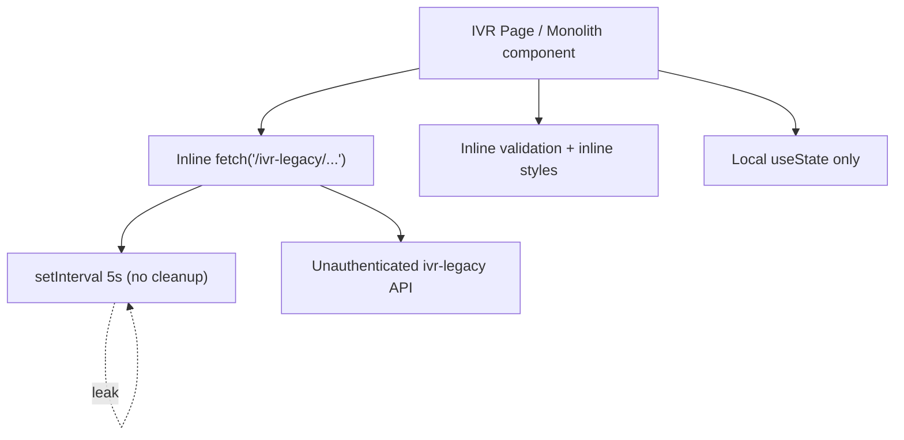
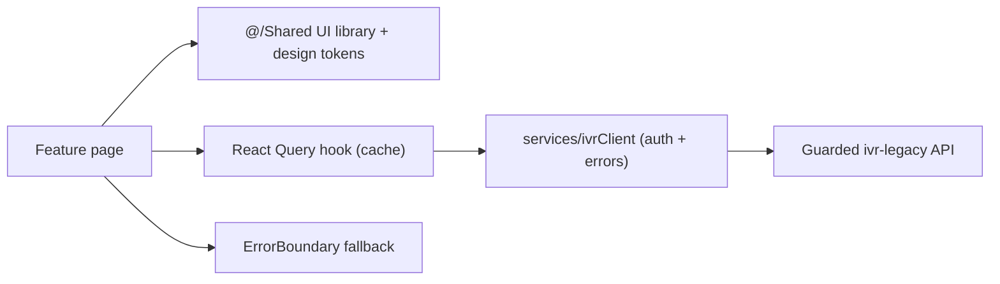
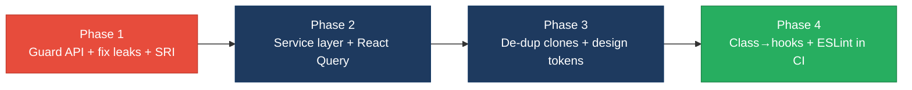

# 3. Frontend Discovery & Modernization Analysis

**Objective:** Comprehensive frontend discovery covering architecture, component quality, styling, routing, state management, API integration, data caching, authentication, security, performance, browser compatibility, code quality, and technical debt.

**Date:** 2026-08-07 11:49:16 UTC | **Scope:** `resources/js/` — React 19.2.3 + TypeScript 5.6.3 (strict) + Inertia.js 2 SPA on a Laravel 11 / Vite 7 backend

## Executive Summary

> **Executive Summary**
>
> This is the React/Inertia.js single-page frontend of a PingCRM-derived CRM that has been heavily extended with a synthetic "IVR" telephony surface. The core PingCRM slice (Pages/Contacts, Organizations, Users, Auth, Reports and the 14-component `Shared/` library) is clean, idiomatic React 19 with TypeScript strict mode on. The IVR extension, however, is a large modernization liability: 916 component files, of which ~517 are near-identical duplicates (133 `LegacyPass2_*` page clones, 229 `*Monolith*` components, 147 class-based `.jsx` widgets, 8 byte-identical formatter utilities). The most severe findings are the total absence of an API/service layer — all 874 `fetch()` calls are made inline inside components against an **unauthenticated** `ivr-legacy/*` route group — plus 375 files that start a 5-second `setInterval` poll with no cleanup (a systemic memory/network leak), 13,701 inline-`style` occurrences with zero design tokens, and a High-severity lodash CVE in a dependency that the frontend does not even import. TypeScript strict is enabled and ESLint is configured, but ESLint is not run in CI, and there are no error boundaries anywhere in the tree.

<div class="metric-grid">
<div class="metric-card"><div class="metric-number">916</div><div class="metric-label">Components / Files Scanned</div></div>
<div class="metric-card"><div class="metric-number">147</div><div class="metric-label">Legacy Class-Based Components</div></div>
<div class="metric-card"><div class="metric-number">0</div><div class="metric-label">Components Over 500 LOC</div></div>
<div class="metric-card"><div class="metric-number">0</div><div class="metric-label">Global / Shared State Modules</div></div>
<div class="metric-card"><div class="metric-number">874</div><div class="metric-label">API Calls Outside Service Layer</div></div>
<div class="metric-card"><div class="metric-number">5+</div><div class="metric-label">Security Risk Patterns Found</div></div>
</div>

<div class="overall-rating overall-rating--high-risk"><div class="overall-rating-label">Overall Codebase Rating — Frontend Discovery</div><div class="overall-rating-value">High Risk</div><div class="overall-rating-note">Driven by massive component duplication (H1), no API/service layer against an unguarded data API (H10/H12), no caching (H11), no design system (H8), weak architecture/inventory (H6/H7), security patterns (H13), and a systemic interval-leak (H18).</div></div>

## 3.1 Benchmark Ratings Summary

One row per hotspot. "Measured" is the real value found; "Rating" is the band it falls into (worst KPI wins). This table is the source for the Overall Codebase Rating banner above.

| # | Hotspot | Primary KPI | <span class="rating rating-good">Good</span> | <span class="rating rating-moderate">Moderate</span> | <span class="rating rating-high-risk">High Risk</span> | Measured | Rating |
|---|---|---|---|---|---|---|---|
| H1 | UI Component Duplication | Duplicate components % | <5% | 5–10% | >10% | ~517 / 916 ≈ **56%** near-identical | <span class="rating rating-high-risk">High Risk</span> |
| H2 | Legacy Class-Based Components | Modern component adoption % | >90% | 70–90% | <70% | **84.0%** (147 class `.jsx`) | <span class="rating rating-moderate">Moderate</span> |
| H3 | Massive Components | Largest component LOC | <200 | 200–500 | >500 | **479 LOC** (134 files >300) | <span class="rating rating-moderate">Moderate</span> |
| H4 | Global State Dependencies | Components reading global state % | <30% | 30–60% | >60% | **~0%** (no global store) | <span class="rating rating-good">Good</span> |
| H5 | Complex State Management | Max prop-drilling depth | <3 | 3–5 | >5 | **≤2** (Inertia page props) | <span class="rating rating-good">Good</span> |
| H6 | Weak Frontend Architecture | Feature modules with clean boundaries % | >80% | 50–80% | <50% | **<20%** (API+UI+logic mixed) | <span class="rating rating-high-risk">High Risk</span> |
| H7 | Missing Component Inventory | Shared component % of total | >30% | 15–30% | <15% | **1.5%** (14 / 916, no Storybook) | <span class="rating rating-high-risk">High Risk</span> |
| H8 | No Design System | Inline-style / magic-value occurrences | 0–5 | 6–20 | >20 | **13,701** inline styles, 0 tokens | <span class="rating rating-high-risk">High Risk</span> |
| H9 | Routing Structure Weakness | Protected routes with guards % | 100% | 80–99% | <80% | **100%** page routes guarded | <span class="rating rating-good">Good</span> |
| H10 | No API Integration Layer | API calls in service layer % | >90% | 70–90% | <70% | **0%** (874 inline `fetch`) | <span class="rating rating-high-risk">High Risk</span> |
| H11 | Poor Data Caching | Data-fetching points with caching % | >70% | 40–70% | <40% | **0%** (no query cache) | <span class="rating rating-high-risk">High Risk</span> |
| H12 | Weak Frontend Auth | Token storage + routes guarded | httpOnly + 100% | One gap | Both gaps | httpOnly cookie ✓ / **data API unguarded** | <span class="rating rating-moderate">Moderate</span> |
| H13 | Frontend Security Vulnerabilities | XSS-risk + hardcoded secrets count | 0 each | 1–3 total | >3 total | **5+** (2 innerHTML, 2 no-SRI, seeded pw) | <span class="rating rating-high-risk">High Risk</span> |
| H14 | Frontend Performance Gaps | Memoization / render optimization | good | some gaps | none + leaks | **0** memo, 375 interval leaks | <span class="rating rating-moderate">Moderate</span> |
| H15 | Browser Compatibility Gaps | Browserslist + polyfills configured | Both present | One missing | Both missing | polyfills ✓ / **no browserslist** | <span class="rating rating-moderate">Moderate</span> |
| H16 | Frontend Code Quality | ESLint in CI + TypeScript strict | Both Yes | One Yes | Both No | strict ✓ / **ESLint not in CI** | <span class="rating rating-moderate">Moderate</span> |
| H17 | Technical Debt & Dependencies | Critical/High CVEs found | 0 | 1–3 | >3 | **1 High** (lodash) + dead deps | <span class="rating rating-moderate">Moderate</span> |
| H18 | *(additional)* useEffect Cleanup / Leaks | Effects with timers lacking cleanup | 0 | 1–10 | >10 | **375** `setInterval` w/o cleanup | <span class="rating rating-high-risk">High Risk</span> |
| H19 | *(additional)* Missing Error Boundaries | Error boundaries present | ≥1 per area | 1 global | 0 | **0** boundaries app-wide | <span class="rating rating-moderate">Moderate</span> |

**Additional hotspots:** two beyond the standard set were observed and are folded into the ratings above — **H18** (effect cleanup: 375 timer effects with no teardown; threshold Good 0 · Moderate 1–10 · High Risk >10) and **H19** (error resilience: any uncaught render error blanks the whole SPA; threshold Good ≥1 boundary per area · Moderate 1 global · High Risk 0).

## 3.2 Hotspot-by-Hotspot Evidence

### H1. UI Component Duplication <span class="sev sev-critical">Critical</span>

**Benchmark:** duplicate components = ~517 / 916 ≈ **56%** → falls in the **High Risk** band (Good <5% · Moderate 5–10% · High Risk >10%).

The IVR surface is generated boilerplate cloned across ~46 feature modules. Three clone families dominate: 133 `LegacyPass2_*` page variants, 229 `*Monolith[0-4]` components (five near-identical copies per feature), and 8 formatter utility files whose bodies are byte-identical apart from a numeric suffix.

`resources/js/utils/duplicate/legacyFormatters1.ts:3-6` (identical body repeated in `legacyFormatters2..8.ts`, 1101 lines each):

```ts
export function legacyFormatters1_fn_1(input: unknown): string {
  if (input === null || input === undefined) return ''
  return String(input).trim().toUpperCase() + '_1'
}
```

`resources/js/components/legacy/WhisperCoachMonolith0.tsx` through `WhisperCoachMonolith4.tsx` — five 64-line copies differing only by suffix; the same 5-copy pattern exists for every IVR feature (`CallAnalyticsMonolith0-4`, `RateDeckMonolith0-4`, …). A fix to any shared behaviour must be applied dozens of times.

**Why it matters here:** style and behaviour drift silently between copies — a validation tweak or column fix lands in one `LegacyPass2` clone but not its 2–3 siblings, so the same screen behaves differently depending on which route rendered it. The 8 identical formatter files also inflate the bundle and the type-check surface for zero functional gain.

**Recommended approach:** (1) collapse `legacyFormatters1-8.ts` into a single parameterised `utils/formatters.ts`; (2) extract one generic `IvrFeatureIndex`/`IvrFeatureForm` component driven by a per-feature config object, deleting the `LegacyPass2_*` clones; (3) replace the `*Monolith0-4` families with one configurable component per feature; (4) add `jscpd` to CI to fail builds above a duplication threshold.

<!-- affected-files
search: legacyFormatters|Monolith[0-9]|LegacyPass2_
glob: resources/js/**/*.{ts,tsx}
issue: Near-identical duplicated component/utility clone
action: Consolidate into a single parameterised component/utility and delete clones
-->

### H2. Legacy Class-Based Components <span class="sev sev-high">High</span>

**Benchmark:** modern (functional) adoption = **84.0%** (147 class `.jsx` of 916) → falls in the **Moderate** band (Good >90% · Moderate 70–90% · High Risk <70%).

Every file under `resources/js/legacy/class/` is a pre-hooks React class component that fetches on `componentDidMount` and holds local `state`.

`resources/js/legacy/class/FraudScreenClassWidget1.jsx:3-6`:

```jsx
export default class FraudScreenClassWidget1 extends React.Component {
  state = { count: 0, rows: [] }
  componentDidMount() {
    fetch('/ivr-legacy/fraud-screen/index').then(r => r.json()).then(d => this.setState({ rows: d.data || [] }))
  }
```

This pattern repeats across 147 `*ClassWidget[0-4].jsx` files (5 per feature). Being `.jsx`, they also opt out of the strict TypeScript checking the rest of the codebase enforces.

**Why it matters here:** class components cannot share the polling/fetch logic that every widget re-implements, so the same `componentDidMount` fetch is copy-pasted 147 times; and because they are `.jsx` they escape the type safety guaranteeing prop shapes elsewhere. They are behind React 19 idioms and block adoption of concurrent-mode features.

**Recommended approach:** (1) convert each `*ClassWidget` to a function component; (2) lift the shared `componentDidMount` fetch into a single `useLegacyRows(endpoint)` hook; (3) rename to `.tsx` and type the props; (4) add `@typescript-eslint` rules banning new `.jsx` and `extends Component`.

<!-- affected-files
search: extends (React\.)?Component
glob: resources/js/**/*.{jsx,tsx}
issue: Legacy class-based component (pre-hooks, untyped .jsx)
action: Convert to a typed function component with a shared data hook
-->

### H3. Massive Components <span class="sev sev-medium">Medium</span>

**Benchmark:** largest component = **479 LOC** (`Pages/Ivr/Hub/Index.tsx`); 134 files exceed 300 LOC → falls in the **Moderate** band (Good <200 · Moderate 200–500 · High Risk >500).

No single file crosses 500 LOC, but the `LegacyPass2_*` pages and monoliths sit at a uniform 392 LOC of markup+state+fetch+validation with no decomposition. The size comes from unrolled repetition (e.g. 35 hand-written `Legacy row mirror` `<div>`s, 40+ `Computed … field` rows) rather than genuine logic, so the files are large *and* low-value.

`resources/js/components/legacy/CallAnalyticsMonolith0.tsx:5-18` mixes API call, validation and UI in one unit:

```tsx
const save = async () => {
  const err = !draft.name ? 'required' : null
  if (err) return alert(err)
  await fetch('/ivr-legacy/call-analytics/store', { method: 'POST', body: JSON.stringify({ ...draft, tenant_id: tenantId }), headers: { 'Content-Type': 'application/json' } })
}
```

**Why it matters here:** the useful logic (a `save` with one validation rule and a POST) is buried under ~380 lines of repeated presentational rows, so reviewers cannot see behaviour at a glance and cannot unit-test the `save` without mounting the whole tree.

**Recommended approach:** (1) replace the unrolled row lists with a single `.map()` over the data; (2) extract `save`/validation into a hook; (3) target <200 LOC per component; (4) add an ESLint `max-lines` rule for `resources/js/**`.

<!-- affected-files
search: Computed .* field|Legacy row mirror|Row slot
glob: resources/js/**/*.tsx
issue: Oversized component built from unrolled repeated markup
action: Replace repeated markup with data-driven map and extract logic to hooks
-->

### H6. Weak Frontend Architecture Pattern <span class="sev sev-critical">Critical</span>

**Benchmark:** feature modules with clean, non-circular boundaries ≈ **<20%** → falls in the **High Risk** band (Good >80% · Moderate 50–80% · High Risk <50%).

Business logic lives directly in view files. The monolith components self-describe the anti-pattern: `resources/js/components/legacy/CallAnalyticsMonolith0.tsx:5` carries the comment `// monolith – API + validation + UI in one file`. There is no module public API — pages, data access, validation and presentation are fused, and there is no `services/`/`api/` boundary at all. Tenant identity is hard-coded rather than injected (`Pages/Ivr/AfterHours/Index.tsx:10` → `const [tenantId] = useState(1) // hard-coded tenant`).

**Why it matters here:** because each IVR screen owns its own fetch, validation and markup, no feature can be tested or shipped independently, and cross-cutting changes (auth header, error handling, tenant resolution) cannot be made in one place. The hard-coded `tenantId = 1` means the multi-tenant IVR data layer is effectively wired to a single tenant from the UI.

**Recommended approach:** (1) adopt a feature-folder structure with an explicit `index.ts` public API per IVR module; (2) move all `fetch` into a `services/ivr/*` layer; (3) resolve `tenantId` from the authenticated Inertia `usePage().props.auth` context, not a literal; (4) enforce module boundaries with `eslint-plugin-import` `no-restricted-paths`.

<!-- affected-files
search: monolith – API \+ validation \+ UI|hard-coded tenant|useState\(1\)
glob: resources/js/**/*.tsx
issue: Business logic, data access and UI fused in the view layer
action: Split into service layer + presentational component with injected tenant
-->

### H7. Missing Component Inventory <span class="sev sev-high">High</span>

**Benchmark:** shared-component share = **1.5%** (14 files in `resources/js/Shared/` of 916) → falls in the **High Risk** band (Good >30% · Moderate 15–30% · High Risk <15%).

The genuine reusable library is the 14-file `resources/js/Shared/` set from upstream PingCRM (`TextInput`, `SelectInput`, `Dropdown`, `Pagination`, `LoadingButton`, `SearchFilter`, `Layout`, …). None of the ~900 IVR components consume it — they hand-roll raw `<input>`/`<button>` elements instead. There is no Storybook, no component catalogue, and no `ui/` index.

**Why it matters here:** because existing inputs and buttons are undiscoverable to whoever generated the IVR screens, every screen re-invents form controls with inline styles, which is the root cause of both the duplication (H1) and the styling sprawl (H8). New joiners have no map of the 916-file UI surface.

**Recommended approach:** (1) publish the `Shared/` set as a documented `@/ui` library with a Storybook; (2) codemod IVR raw `<input>`/`<button>` usages to `TextInput`/`LoadingButton`; (3) add a lint rule discouraging raw form controls outside `Shared/`; (4) maintain a component inventory doc.

<!-- affected-files
search: <input |<button |<select 
glob: resources/js/Pages/Ivr/**/*.tsx
issue: Raw form control instead of the Shared component library
action: Replace with @/Shared inputs/buttons and register in the inventory
-->

### H8. No Design System / Styling Architecture <span class="sev sev-high">High</span>

**Benchmark:** inline-style / magic-value occurrences = **13,701** `style={{…}}` across 739 files; **0** CSS custom properties in `resources/css/app.css` → falls in the **High Risk** band (Good 0–5 · Moderate 6–20 · High Risk >20).

Raw magic values are hardcoded directly in JSX rather than expressed as Tailwind classes or tokens. `resources/js/components/legacy/CallAnalyticsMonolith0.tsx:12-17`:

```tsx
<div style={{ border: '1px solid #ccc', marginBottom: 16 }}>
  <input style={{ border: '1px solid red' }} placeholder="Name" ... />
  <pre style={{ fontSize: 10 }}>{JSON.stringify(...)}</pre>
```

`Pages/Ivr/AfterHours/Index.tsx:29` opens with `<div style={{ padding: 12 }}>`. Tailwind is configured (`tailwind.config.js` extends an `indigo` palette) and used in the core pages, but the IVR surface bypasses it entirely with inline hex colours, pixel spacing and font sizes. `app.css` defines no design tokens (0 `--` variables).

**Why it matters here:** there is no single source of truth for colour or spacing — a brand change means hunting 13,701 inline literals — and the same `#ccc`/`1px solid red` values drift per component, producing visual inconsistency across the app.

**Recommended approach:** (1) introduce design tokens as Tailwind theme entries / CSS variables in `app.css`; (2) codemod inline `style={{…}}` literals to Tailwind utility classes; (3) forbid inline `style` in IVR components via `react/forbid-dom-props`; (4) route all colour/spacing through the token layer.

<!-- affected-files
search: style=\{\{
glob: resources/js/**/*.tsx
issue: Inline style with hardcoded magic color/spacing/font value
action: Replace with Tailwind utility classes backed by design tokens
-->

### H10. No API Integration Layer <span class="sev sev-critical">Critical</span>

**Benchmark:** API calls inside a service layer = **0%** (874 inline `fetch()` occurrences; no `services/` or `api/` directory) → falls in the **High Risk** band (Good >90% · Moderate 70–90% · High Risk <70%).

Every network call is a bare `fetch()` in a component render/effect, with the base path hardcoded, no auth header, and ad-hoc error handling. `Pages/Ivr/AfterHours/Index.tsx:15-19`:

```tsx
const id = setInterval(() => {
  fetch('/ivr-legacy/after-hours/index?q=' + search)
    .then(r => r.json())
    .then(d => setLocalRows(d.data ?? localRows))
    .catch(() => {})   // errors swallowed silently
}, 5000)
```

The same shape repeats 874 times; `/ivr-legacy/…/index` alone appears in dozens of files. There is no interceptor, no typed response, and no single place to add a CSRF or auth token.

**Why it matters here:** an API base-URL change, an auth-header addition, or consistent error UX would require editing hundreds of files. Errors are `.catch(() => {})`-swallowed, so failures are invisible to the user, and the API layer cannot be mocked in tests.

**Recommended approach:** (1) create `resources/js/services/ivrClient.ts` wrapping `fetch` with base URL, `X-CSRF-TOKEN`/auth header injection, JSON parsing and typed errors; (2) expose one function per endpoint; (3) codemod component `fetch` calls to the service; (4) surface errors through the existing `FlashMessages` component.

<!-- affected-files
search: fetch\(
glob: resources/js/**/*.{ts,tsx,jsx}
issue: Direct fetch() in component, no service layer / auth header / error handling
action: Move into a typed services/ivrClient wrapper with interceptors
-->

### H11. Poor Data Caching & Integration <span class="sev sev-high">High</span>

**Benchmark:** data-fetching points using a caching layer = **0%** (no React Query / SWR present) → falls in the **High Risk** band (Good >70% · Moderate 40–70% · High Risk <40%).

Data is re-fetched on every navigation and, worse, polled every 5 seconds via `setInterval` with no cache, no `staleTime`, and no de-duplication (`Pages/Ivr/AfterHours/Index.tsx:14-20`). There are no loading indicators (the effect swaps rows silently) and no optimistic updates after the `save`/`store` mutations in the monoliths. Client-side "search" filters already-fetched rows without refetching correctly, and mutations never invalidate the polled list.

**Why it matters here:** 375 screens each open a 5-second poll, generating continuous background traffic even when idle; users see stale data after saving (no invalidation) and no loading state, producing a janky UX and needless server load.

**Recommended approach:** (1) adopt React Query/SWR; (2) replace `setInterval` polls with `useQuery({ refetchInterval })` so requests de-duplicate and cache; (3) add `isLoading`/`isError` UI; (4) call `queryClient.invalidateQueries` after `store`/`update`/`destroy` mutations.

<!-- affected-files
search: setInterval\(|fetch\(
glob: resources/js/Pages/Ivr/**/*.tsx
issue: Uncached polling/refetch with no loading state or invalidation
action: Replace with React Query useQuery/useMutation with caching and invalidation
-->

### H12. Weak Frontend Auth & Route Guards <span class="sev sev-high">High</span>

**Benchmark:** token storage = httpOnly session cookie (✓, **0** `localStorage` usages) but the fetched data API is **not** guarded → falls in the **Moderate** band (Good httpOnly + 100% guarded · Moderate one gap · High Risk both gaps).

The good news: auth uses Laravel's httpOnly session cookie via Inertia (no tokens in `localStorage`), and every *page* route in `routes/web.php` is wrapped in `->middleware('auth')`. The gap: the `ivr-legacy/*` data API that all the component `fetch()` calls hit is defined in `routes/generated/ivr_legacy_api.php:6` **with no auth middleware**:

```php
Route::prefix("ivr-legacy")->group(function () {
    Route::match(['get','post'], 'call-analytics/store',  App\Http\Controllers\Ivr\CallAnalyticsStoreController::class);
    Route::match(['get','post'], 'call-analytics/destroy', App\Http\Controllers\Ivr\CallAnalyticsDestroyController::class);
```

Every IVR read *and write* endpoint is reachable unauthenticated, and state-changing actions (`store`/`update`/`destroy`) accept `GET`.

**Why it matters here:** the entire IVR data surface — including deletes — is exposed to any unauthenticated caller, and `GET`-triggered mutations are CSRF-able via a simple link/image tag. The guarded page shell gives a false sense of protection while the data behind it is open.

**Recommended approach:** (1) wrap the `ivr-legacy` group in `->middleware('auth')`; (2) restrict mutating routes to `POST`/`PUT`/`DELETE` only; (3) rely on the httpOnly cookie already in place and add CSRF verification; (4) centralise any UI role checks in a single `useAuth` hook.

<!-- affected-files
search: Route::(match|prefix)
glob: routes/generated/*.php
issue: IVR data API route group has no auth middleware; GET performs mutations
action: Add auth middleware and restrict mutations to POST/PUT/DELETE
-->

### H13. Frontend Security Vulnerabilities <span class="sev sev-critical">Critical</span>

**Benchmark:** XSS-risk + hardcoded-secret patterns = **5+** → falls in the **High Risk** band (Good 0 each · Moderate 1–3 total · High Risk >3 total).

Four distinct patterns:

1. `resources/js/Shared/Pagination.tsx:16,23` renders server labels via `dangerouslySetInnerHTML={{ __html: link.label }}` (×2) with no sanitisation.
2. `resources/js/Pages/Auth/Login.tsx:9` ships a seeded credential in source: `password: 'secret'` as the form default.
3. `resources/views/app.blade.php:9,12` load third-party polyfills from a CDN with **no** `integrity`/SRI:

```html
<script src="https://cdnjs.cloudflare.com/polyfill/v3/polyfill.min.js?features=smoothscroll,..." defer></script>
```

4. The unauthenticated, GET-mutating `ivr-legacy/*` API (see H12) is itself a security defect.

**Why it matters here:** the CDN polyfill without SRI is a live supply-chain risk (the polyfill-service ecosystem has been hijacked before to serve malware) — a compromised script runs with full DOM/session access. The seeded `password: 'secret'` leaks the demo login and, if the seeder runs in any deployed environment, a working credential. The `dangerouslySetInnerHTML` is lower-risk (labels are framework-generated) but still an unsanitised HTML sink.

**Recommended approach:** (1) add `integrity` + `crossorigin` SRI attributes to both CDN scripts, or self-host/bundle the polyfills; (2) remove the `password: 'secret'` default; (3) sanitise pagination labels with DOMPurify or render them as text; (4) close the unguarded API per H12.

<!-- affected-files
search: dangerouslySetInnerHTML|password: '|cdnjs\.cloudflare\.com
glob: resources/{js,views}/**/*.{tsx,php}
issue: XSS sink / seeded credential / CDN script without SRI
action: Sanitize HTML, remove seeded secret, add SRI or self-host scripts
-->

### H14. Frontend Performance Gaps <span class="sev sev-medium">Medium</span>

**Benchmark:** render optimization — **0** `React.memo`/`useMemo`/`useCallback` in the whole tree, **375** files opening uncleaned `setInterval` polls → falls in the **Moderate** band (production bundle not measurable without a build; the leak/memoization signals drive the rating).

There is no memoization anywhere, and every IVR index mounts a 5-second poll that is never cleared (see H18), so timers and their fetches accumulate across navigation. Page-level code splitting *is* present — `app.tsx` uses `import.meta.glob('./Pages/**/*.tsx')`, which Vite splits into per-page chunks — so initial load is not the primary concern; the runtime leak is.

**Why it matters here:** navigating through IVR modules leaves a growing pile of live intervals each re-fetching every 5s, degrading a long session's memory and network profile far more than initial bundle size does.

**Recommended approach:** (1) clear intervals in effect cleanup (H18) or move to React Query polling; (2) memoize the heavy mapped tables once decomposed; (3) after consolidating clones (H1), measure the gzipped bundle in CI with `rollup-plugin-visualizer` and set a budget.

<!-- affected-files
search: setInterval\(
glob: resources/js/**/*.tsx
issue: Uncleaned polling timer; no memoization on repeated renders
action: Add effect cleanup / React Query polling and memoize heavy lists
-->

### H15. Browser & Runtime Compatibility Gaps <span class="sev sev-medium">Medium</span>

**Benchmark:** polyfills present (✓, two CDN polyfill scripts in `app.blade.php`) but **no** `browserslist` / `.browserslistrc` and none in `package.json` → falls in the **Moderate** band (Good both · Moderate one missing · High Risk both).

Autoprefixer is configured in `postcss.config.js`, but with no browserslist target it falls back to defaults, so CSS prefixing and any Vite/esbuild transpile target are unpinned. Polyfills are loaded, but via un-SRI'd CDN (see H13) rather than bundled per target.

**Why it matters here:** without a declared browser matrix, Autoprefixer and the build target are undefined, so support for the audience's real browsers (older Safari, etc.) is accidental rather than guaranteed.

**Recommended approach:** (1) add a `.browserslistrc` matching the target audience; (2) let Autoprefixer and Vite read it; (3) bundle required polyfills locally instead of the CDN scripts.

<!-- affected-files
search: autoprefixer|polyfill
glob: {postcss.config.js,resources/views/app.blade.php}
issue: No browserslist target; polyfills loaded via un-SRI'd CDN
action: Add .browserslistrc and bundle polyfills; wire Autoprefixer to it
-->

### H16. Frontend Code Quality Issues <span class="sev sev-medium">Medium</span>

**Benchmark:** TypeScript `strict: true` (✓ in `tsconfig.json`, plus `noUnusedLocals`/`noUnusedParameters`) but ESLint is **not** run in CI → falls in the **Moderate** band (Good both yes · Moderate one yes · High Risk both no).

ESLint is configured (`.eslintrc.cjs` with `@typescript-eslint`, `react`, `react-hooks`), but `package.json` only exposes it as a manual `fix:eslint` script, and the three `.github/workflows/*.yml` jobs run **only** PHP tooling (Laravel Pint, PHPStan, PHPUnit) — no `npm run lint` step exists. `@typescript-eslint/no-explicit-any` is disabled, and the IVR components lean on `any` heavily (`{ rows, tenantId, legacyMeta }: any`). The `.jsx` legacy widgets sit outside the strict `tsconfig` `include` globs entirely.

**Why it matters here:** hook-rule and type violations (the missing-cleanup effects of H18 would be caught by `react-hooks/exhaustive-deps`) reach `master` undetected because nothing lints the frontend on push.

**Recommended approach:** (1) add an `npm run lint` (`eslint --ext .ts,.tsx,.jsx`) job to CI on push/PR; (2) re-enable `no-explicit-any` and type the IVR props; (3) bring `.jsx` files under the strict `tsconfig`; (4) fail CI on lint errors.

<!-- affected-files
search: : any|no-explicit-any
glob: resources/js/**/*.{ts,tsx}
issue: Untyped `any` props; ESLint not enforced in CI
action: Add ESLint CI job, re-enable no-explicit-any, type props
-->

### H17. Technical Debt & Outdated Dependencies <span class="sev sev-medium">Medium</span>

**Benchmark:** Critical/High CVEs = **1 High** (lodash) → falls in the **Moderate** band (Good 0 · Moderate 1–3 · High Risk >3).

`npm audit` reports one High-severity chain in **lodash** ([GHSA-r5fr-rjxr-66jc] code injection via `_.template`, plus prototype-pollution advisories) with *no fix available*. Notably, lodash is a **direct dependency the frontend never imports** (0 `from 'lodash'` in `resources/js`) — dead weight carrying a live CVE. `react-router-dom@5.2.0` is likewise installed but has **0** usages (routing is Inertia's) — it is four major versions behind and entirely dead. Tooling lags too: `prettier@2.8.8` (v3 current), `eslint@8.57` (v9 current). No `TODO`/`FIXME` markers were found.

**Why it matters here:** the two dead dependencies (lodash, react-router-dom) add attack surface and audit noise for zero functional value; the lodash advisory means every `npm audit` in CI will flag High until it is removed.

**Recommended approach:** (1) remove the unused `lodash` and `react-router-dom` dependencies — clearing the High CVE outright; (2) upgrade `prettier`→3 and `eslint`→9; (3) add a scheduled `npm audit` / Dependabot check.

<!-- affected-files
search: "lodash"|"react-router-dom"|"prettier"|"eslint"
glob: package.json
issue: Unused-but-vulnerable and outdated dependencies
action: Remove dead deps (lodash, react-router-dom); upgrade prettier/eslint
-->

### H18. useEffect Cleanup / Interval Leaks *(additional)* <span class="sev sev-critical">Critical</span>

**Benchmark:** timer effects lacking cleanup = **375** files → falls in the **High Risk** band (Good 0 · Moderate 1–10 · High Risk >10). KPI: a `useEffect` that starts `setInterval`/`setTimeout`/subscription must return a teardown; 374 of these even self-document the omission with a `// missing cleanup – interval leak pattern` comment.

`Pages/Ivr/AfterHours/Index.tsx:12-20`:

```tsx
useEffect(() => {
  // missing cleanup – interval leak pattern
  const id = setInterval(() => { fetch('/ivr-legacy/after-hours/index?q=' + search)... }, 5000)
}, [search])   // no return () => clearInterval(id)
```

The `id` is captured but never cleared, and the effect re-runs on every `search` keystroke, stacking a new 5-second poll each time.

**Why it matters here:** typing in the search box or navigating between the 375 IVR screens leaves an ever-growing set of live intervals, each re-fetching forever — a compounding memory and network leak that degrades any non-trivial session and can hammer the (unauthenticated) backend.

**Recommended approach:** (1) return `() => clearInterval(id)` from every such effect; (2) better, replace hand-rolled polling with React Query `refetchInterval` (H11); (3) enable `react-hooks/exhaustive-deps` and add the lint CI job (H16) to catch these mechanically.

<!-- affected-files
search: setInterval\(|missing cleanup
glob: resources/js/**/*.tsx
issue: useEffect starts a timer/poll with no cleanup return (leak)
action: Return clearInterval cleanup or migrate to React Query polling
-->

### H19. Missing Error Boundaries *(additional)* <span class="sev sev-high">High</span>

**Benchmark:** error boundaries present = **0** app-wide (`0` `componentDidCatch`/`getDerivedStateFromError`/`ErrorBoundary`) → falls in the **Moderate** band (Good ≥1 per area · Moderate 1 global · High Risk 0). Rated Moderate rather than High because Inertia isolates navigation, but any render throw still blanks the current page.

There is no error boundary anywhere in `resources/js`, while the IVR components freely index into optionally-undefined props (`rows?.[i]?.name`) and parse arbitrary JSON responses. A single throw during render unmounts the whole React root with no fallback UI.

**Why it matters here:** given 916 loosely-typed (`: any`) components fetching untyped API data, a malformed response or unexpected shape crashes the entire screen to a blank page instead of a recoverable error state.

**Recommended approach:** (1) add a top-level `ErrorBoundary` in `Shared/Layout.tsx` rendering a fallback + retry; (2) wrap each IVR feature area in its own boundary so one module's failure is contained; (3) log caught errors to the backend.

<!-- affected-files
search: usePage|createInertiaApp
glob: resources/js/{Shared/Layout.tsx,app.tsx}
issue: No error boundary; a render throw blanks the whole SPA
action: Add a global + per-feature ErrorBoundary with fallback UI
-->

**Not observed (rated Good):** H4 — no global mutable store, `window`/singleton or Context writes; state is local `useState` or Inertia page props. H5 — prop-drilling depth ≤2 because Inertia injects props at the page boundary; no deep drill chains. H9 — all `routes/web.php` page routes carry `->middleware('auth')`, routes are centralized server-side, and pages are code-split via `import.meta.glob` (the data-API auth gap is captured under H12, not here).

## 3.3 Diagrams

### Current UI data flow


### Target component + state layout


### Improvement roadmap


## 3.4 Actions Required

| Hotspot | Action | Rating | Priority |
|---|---|---|---|
| H10 No API Integration Layer | Move 874 inline `fetch` calls into a typed `services/ivrClient` with auth-header/error interceptors | <span class="rating rating-high-risk">High Risk</span> | <span class="sev sev-critical">Critical</span> |
| H12 Weak Frontend Auth | Add `auth` middleware to the `ivr-legacy` route group; restrict mutations to POST/PUT/DELETE | <span class="rating rating-moderate">Moderate</span> | <span class="sev sev-critical">Critical</span> |
| H13 Security Vulnerabilities | Add SRI to CDN scripts, remove seeded `password:'secret'`, sanitize pagination HTML | <span class="rating rating-high-risk">High Risk</span> | <span class="sev sev-critical">Critical</span> |
| H18 Interval Leaks | Return `clearInterval` cleanup in 375 effects (or migrate to React Query polling) | <span class="rating rating-high-risk">High Risk</span> | <span class="sev sev-critical">Critical</span> |
| H1 Component Duplication | Consolidate `LegacyPass2_*`, `*Monolith*` and `legacyFormatters1-8` into parameterised units | <span class="rating rating-high-risk">High Risk</span> | <span class="sev sev-high">High</span> |
| H6 Weak Architecture | Extract service layer + presentational components; inject `tenantId` from auth context | <span class="rating rating-high-risk">High Risk</span> | <span class="sev sev-high">High</span> |
| H7 Missing Inventory | Publish `Shared/` as `@/ui` + Storybook; migrate IVR raw controls onto it | <span class="rating rating-high-risk">High Risk</span> | <span class="sev sev-high">High</span> |
| H8 No Design System | Introduce design tokens; codemod 13,701 inline styles to Tailwind classes | <span class="rating rating-high-risk">High Risk</span> | <span class="sev sev-high">High</span> |
| H11 Poor Data Caching | Adopt React Query with `staleTime` and post-mutation invalidation | <span class="rating rating-high-risk">High Risk</span> | <span class="sev sev-high">High</span> |
| H2 Legacy Class Components | Convert 147 `*ClassWidget.jsx` to typed function components with a shared hook | <span class="rating rating-moderate">Moderate</span> | <span class="sev sev-high">High</span> |
| H19 Missing Error Boundaries | Add global + per-feature `ErrorBoundary` with fallback UI | <span class="rating rating-moderate">Moderate</span> | <span class="sev sev-high">High</span> |
| H16 Code Quality | Add ESLint CI job; re-enable `no-explicit-any`; bring `.jsx` under strict tsconfig | <span class="rating rating-moderate">Moderate</span> | <span class="sev sev-medium">Medium</span> |
| H17 Technical Debt | Remove unused vulnerable `lodash` + dead `react-router-dom`; upgrade prettier/eslint | <span class="rating rating-moderate">Moderate</span> | <span class="sev sev-medium">Medium</span> |
| H3 Massive Components | Replace unrolled markup with data maps; extract logic to hooks (`max-lines` rule) | <span class="rating rating-moderate">Moderate</span> | <span class="sev sev-medium">Medium</span> |
| H14 Performance Gaps | Fix interval leaks, memoize heavy tables, add a CI bundle budget | <span class="rating rating-moderate">Moderate</span> | <span class="sev sev-medium">Medium</span> |
| H15 Browser Compatibility | Add `.browserslistrc`; bundle polyfills locally; wire Autoprefixer | <span class="rating rating-moderate">Moderate</span> | <span class="sev sev-low">Low</span> |

## 3.5 Expected Outcomes

- **A centralized `services/ivrClient` layer** replaces 874 scattered `fetch` calls, giving one place for auth headers, CSRF, base URL, typed responses and consistent error UX — and making the API mockable in tests.
- **Guarding the `ivr-legacy` route group and removing GET mutations** closes an open, unauthenticated data-and-delete surface that currently sits behind an authenticated page shell.
- **Fixing the 375 interval leaks** (or moving to React Query polling) eliminates a compounding memory/network leak, stabilising long sessions and cutting idle backend traffic.
- **Adopting React Query** brings caching, loading/error states and post-mutation invalidation, ending stale-after-save UX and redundant refetching.
- **Consolidating ~517 duplicated clones** into parameterised components/utilities shrinks the tree, kills behaviour drift, and makes a single fix apply everywhere.
- **A documented `@/ui` library + design tokens** replaces 13,701 inline styles with a single source of truth for colour and spacing, restoring visual consistency and making rebrands one-line changes.
- **Converting 147 class widgets to typed hooks** and enforcing ESLint in CI with `strict` typing catches hook-rule and type errors (including the leaks) before they reach `master`.
- **Removing the unused, CVE-carrying `lodash` and dead `react-router-dom`** clears the one High-severity advisory and reduces attack surface and audit noise to zero.
- **Adding error boundaries** turns a full-page blank-out on any render throw into a contained, recoverable per-feature fallback.
