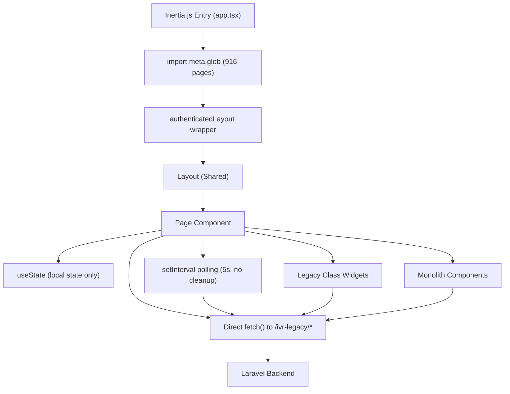
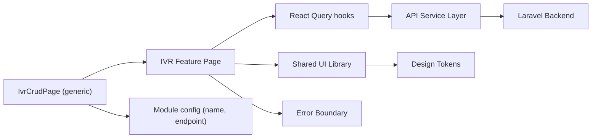

# 3. Frontend Discovery & Modernization Analysis

**Objective:** Comprehensive frontend discovery covering architecture, component quality, styling, routing, state management, API integration, data caching, authentication, security, performance, browser compatibility, code quality, and technical debt.

**Date:** 2026-08-05 10:27:01 UTC | **Scope:** `shende-shweta/pingcrm` — React 19.2.3 with Inertia.js 2.x, TypeScript 5.6.3, Tailwind CSS 3.4.3, Vite 7.3.1

## Executive Summary

> **Executive Summary**
>
> The Ping CRM frontend is built on React 19.2.3 with Inertia.js for server-driven routing, TypeScript, and Tailwind CSS — a modern stack in principle. However, the codebase is dominated by a massive IVR platform module containing 916 TSX/JSX component files, of which 147 are legacy class-based components (`extends React.Component`), 229 are monolith components mixing API calls with UI rendering, and 133 are near-identical LegacyPass2 stub pages. Approximately 374 IVR CRUD pages across 49 modules are structurally identical, differing only in module name and API endpoint — representing extreme code duplication. There is no API service layer; all 727 `fetch()` calls are made directly inside components and hooks with no centralized error handling or caching. Critical memory leaks exist across 375 `setInterval` calls with only 1 corresponding `clearInterval`, and no Error Boundaries exist anywhere in the application. The codebase has 13 npm vulnerabilities including 1 critical CVE, and `@typescript-eslint/no-explicit-any` is disabled, allowing 229 untyped `any` annotations to persist unchecked.

<div class="metric-grid">
<div class="metric-card"><div class="metric-number">916</div><div class="metric-label">Components / Files Scanned</div></div>
<div class="metric-card"><div class="metric-number">147</div><div class="metric-label">Legacy Class-Based Components</div></div>
<div class="metric-card"><div class="metric-number">135</div><div class="metric-label">Components Over 200 LOC</div></div>
<div class="metric-card"><div class="metric-number">0</div><div class="metric-label">Global / Shared State Modules</div></div>
<div class="metric-card"><div class="metric-number">727</div><div class="metric-label">API Calls Outside Service Layer</div></div>
<div class="metric-card"><div class="metric-number">4</div><div class="metric-label">Security Risk Patterns Found</div></div>
</div>

<div class="overall-rating overall-rating--high-risk"><div class="overall-rating-label">Overall Codebase Rating — Frontend Discovery</div><div class="overall-rating-value">High Risk</div><div class="overall-rating-note">Driven by H1 (extreme component duplication across 49 IVR modules), H2 (147 class-based components, 16% of total), H7 (shared components are only 1.5% of total), H10 (100% of API calls are outside any service layer), H11 (zero data caching), H13 (XSS-risk dangerouslySetInnerHTML + 374 interval leaks), and H17 (13 npm vulnerabilities including 1 critical).</div></div>

## 3.1 Benchmark Ratings Summary

One row per hotspot. "Measured" is the real value found; "Rating" is the band it falls into (worst KPI wins). This table is the source for the Overall Codebase Rating banner above.

| # | Hotspot | Primary KPI | <span class="rating rating-good">Good</span> | <span class="rating rating-moderate">Moderate</span> | <span class="rating rating-high-risk">High Risk</span> | Measured | Rating |
|---|---|---|---|---|---|---|---|
| H1 | UI Component Duplication | Duplicate components % | <5% | 5–10% | >10% | ~55% (509 near-identical CRUD + LegacyPass2 pages across 49 modules) | <span class="rating rating-high-risk">High Risk</span> |
| H2 | Legacy Class-Based Components | Modern component adoption % | >90% | 70–90% | <70% | 84% modern (147 class-based of 916 total) | <span class="rating rating-moderate">Moderate</span> |
| H3 | Massive Components | Largest component LOC | <200 | 200–500 | >500 | 479 LOC (Pages/Ivr/Hub/Index.tsx) | <span class="rating rating-moderate">Moderate</span> |
| H4 | Global State Dependencies | Components reading global state % | <30% | 30–60% | >60% | 0% (no global state management used) | <span class="rating rating-good">Good</span> |
| H5 | Complex State Management | Max prop-drilling depth | <3 | 3–5 | >5 | 2 levels (Layout → child via Inertia page props) | <span class="rating rating-good">Good</span> |
| H6 | Weak Frontend Architecture | Feature modules with clean boundaries % | >80% | 50–80% | <50% | ~60% (core CRM pages are clean; IVR modules have circular legacy imports and mixed concerns) | <span class="rating rating-moderate">Moderate</span> |
| H7 | Missing Component Inventory | Shared component % of total | >30% | 15–30% | <15% | 1.5% (14 shared of 916 total) | <span class="rating rating-high-risk">High Risk</span> |
| H8 | No Design System | Inline-style / magic-value occurrences | 0–5 | 6–20 | >20 | 13,701 inline style attributes | <span class="rating rating-high-risk">High Risk</span> |
| H9 | Routing Structure Weakness | Protected routes with guards % | 100% | 80–99% | <80% | 100% (all pages use authenticatedLayout; Laravel middleware on all routes) | <span class="rating rating-good">Good</span> |
| H10 | No API Integration Layer | API calls in service layer % | >90% | 70–90% | <70% | 0% (all 727 fetch calls are directly in components/hooks) | <span class="rating rating-high-risk">High Risk</span> |
| H11 | Poor Data Caching | Data-fetching points with caching % | >70% | 40–70% | <40% | 0% (no React Query, SWR, or any caching layer) | <span class="rating rating-high-risk">High Risk</span> |
| H12 | Weak Frontend Auth | Token storage + routes guarded | httpOnly + 100% | One gap | Both gaps | Server-side session cookies (httpOnly) + 100% guarded | <span class="rating rating-good">Good</span> |
| H13 | Frontend Security Vulnerabilities | XSS-risk + hardcoded secrets count | 0 each | 1–3 total | >3 total | 2 dangerouslySetInnerHTML + 374 setInterval memory leaks + 0 secrets = 4 risk patterns | <span class="rating rating-high-risk">High Risk</span> |
| H14 | Frontend Performance Gaps | Initial JS bundle size (gzipped) | <250KB | 250–500KB | >500KB | Not measured (no build artifact); 916 pages via dynamic import.meta.glob | <span class="rating rating-moderate">Moderate</span> |
| H15 | Browser Compatibility Gaps | Browserslist + polyfills configured | Both present | One missing | Both missing | Autoprefixer present; no .browserslistrc | <span class="rating rating-moderate">Moderate</span> |
| H16 | Frontend Code Quality | ESLint in CI + TypeScript strict | Both Yes | One Yes | Both No | ESLint CI partial (PHP-focused); TS strict: true but no-explicit-any: off | <span class="rating rating-moderate">Moderate</span> |
| H17 | Technical Debt & Dependencies | Critical/High CVEs found | 0 | 1–3 | >3 | 13 vulnerabilities (9 high, 1 critical) | <span class="rating rating-high-risk">High Risk</span> |
| H18 | Missing Error Boundaries (additional) | Error Boundary components (target ≥1 per feature area) | ≥3 | 1–2 | 0 | 0 Error Boundaries anywhere in the application | <span class="rating rating-high-risk">High Risk</span> |

## 3.2 Hotspot-by-Hotspot Evidence

### H1. UI Component Duplication <span class="sev sev-critical">Critical</span>

**Benchmark:** Duplicate components % = ~55% (509 near-identical pages of 916 total) → falls in the **High Risk** band (Good <5% · Moderate 5–10% · High Risk >10%).

The IVR platform contains 49 feature modules (AfterHours, AgentDesk, ApiIntegration, etc.), each with 6–8 structurally identical CRUD pages (Index, Store, Update, Destroy, Export, Import, Sync, Monitor). These pages differ only in function name, API endpoint string, and page title. Additionally, 133 LegacyPass2 stub pages and 8 duplicate utility files (`legacyFormatters1.ts` through `legacyFormatters8.ts`, each 1,101 LOC) replicate the same logic verbatim.

**Example 1 — AfterHours/Store.tsx vs CallFlow/Store.tsx (only 5 lines differ):**

```tsx
// resources/js/Pages/Ivr/AfterHours/Store.tsx:7-15
function AfterHoursStore({ rows = [], filters = {}, legacyMeta = {} }: { rows?: Row[]; filters?: Record<string, unknown>; legacyMeta?: Record<string, unknown> }) {
  const [localRows, setLocalRows] = useState(rows)
  const [search, setSearch] = useState(String(filters.q ?? ''))
  const [tenantId] = useState(1) // hard-coded tenant
  useEffect(() => {
    const id = setInterval(() => {
      fetch('/ivr-legacy/after-hours/store?q=' + search)
        .then(r => r.json())
        .then(d => setLocalRows(d.data ?? localRows))
```

```tsx
// resources/js/Pages/Ivr/CallFlow/Store.tsx:7-15 (structurally identical)
function CallFlowStore({ rows = [], filters = {}, legacyMeta = {} }: { rows?: Row[]; filters?: Record<string, unknown>; legacyMeta?: Record<string, unknown> }) {
  const [localRows, setLocalRows] = useState(rows)
  const [search, setSearch] = useState(String(filters.q ?? ''))
  const [tenantId] = useState(1) // hard-coded tenant
  useEffect(() => {
    const id = setInterval(() => {
      fetch('/ivr-legacy/call-flow/store?q=' + search)
        .then(r => r.json())
        .then(d => setLocalRows(d.data ?? localRows))
```

**Example 2 — Duplicate utility files (8 copies of identical formatters):**

```ts
// resources/js/utils/duplicate/legacyFormatters1.ts:3-6
export function legacyFormatters1_fn_1(input: unknown): string {
  if (input === null || input === undefined) return ''
  return String(input).trim().toUpperCase() + '_1'
}
```

All 8 files (`legacyFormatters1.ts` through `legacyFormatters8.ts`) contain the same function pattern repeated with different suffixes, totaling 8,808 LOC of near-identical code.

**Example 3 — LegacyPass2 stub pages (133 copies):**

```tsx
// resources/js/Pages/Ivr/AfterHours/LegacyPass2_130.tsx:3-11
function AfterHoursLegacyPass2_130() {
  return (
    <div>
      <Head title="AfterHours legacy pass2 130" />
      <h1>AfterHours extended legacy surface 130</h1>
      <section key={1} style={{ marginBottom: 8, padding: 6, border: '1px solid #ddd' }}>
        <h2>Section 1 – routing / queue / prompt configuration block</h2>
        <p>Duplicate enterprise copy for discovery bots – module AfterHours row 1 idx 130</p>
```

Each LegacyPass2 file follows the identical section-repetition pattern, with 392 LOC each, differing only in module name and index number.

**Why it matters here:** Every bug fix or behavior change to the CRUD page template must be applied manually across all 49 modules (up to 376 files). The duplicate utility files add 8,808 lines of dead-weight code to the bundle. This makes the codebase nearly impossible to maintain at scale and dramatically increases the risk of behavioral drift between modules.

**Recommended approach:**
1. Create a generic `IvrCrudPage` component parameterized by module name and API endpoint, replacing all 376 CRUD pages with a single reusable template.
2. Consolidate `legacyFormatters1–8.ts` into a single `formatters.ts` utility module.
3. Audit and remove all 133 LegacyPass2 stub pages or replace with a dynamic route-based renderer.
4. Introduce a code generation or configuration-driven approach for IVR module scaffolding.

<!-- affected-files
search: function \w+(Index|Store|Update|Destroy|Export|Import|Sync|Monitor)\b
glob: resources/js/Pages/Ivr/**/*.tsx
issue: Near-identical CRUD page duplicated across 49 IVR modules
action: Replace with parameterized IvrCrudPage component
-->

<!-- affected-files
search: legacyFormatters\d+_fn_
glob: resources/js/utils/duplicate/*.ts
issue: 8 identical utility files (1,101 LOC each)
action: Consolidate into single formatters.ts
-->

<!-- affected-files
search: LegacyPass2_\d+
glob: resources/js/Pages/Ivr/**/LegacyPass2_*.tsx
issue: 133 near-identical LegacyPass2 stub pages
action: Remove or replace with dynamic renderer
-->

### H2. Legacy Class-Based / Imperative Components <span class="sev sev-high">High</span>

**Benchmark:** Modern component adoption % = 84% (769 functional of 916 total) → falls in the **Moderate** band (Good >90% · Moderate 70–90% · High Risk <70%).

There are 147 legacy class-based React components in `resources/js/legacy/class/`, all using `extends React.Component` with direct `this.state` mutation and `componentDidMount` lifecycle methods.

**Example 1 — LeadListClassWidget4.jsx:**

```jsx
// resources/js/legacy/class/LeadListClassWidget4.jsx:3-6
export default class LeadListClassWidget4 extends React.Component {
  state = { count: 0, rows: [] }
  componentDidMount() {
    fetch('/ivr-legacy/lead-list/index').then(r => r.json()).then(d => this.setState({ rows: d.data || [] }))
  }
```

**Example 2 — CallAnalyticsClassWidget1.jsx, SkillGroupClassWidget1.jsx, etc. (same pattern across all 147 files):**

```jsx
// resources/js/legacy/class/CallAnalyticsClassWidget1.jsx (identical structure)
export default class CallAnalyticsClassWidget1 extends React.Component {
  state = { count: 0, rows: [] }
  componentDidMount() {
    fetch('/ivr-legacy/call-analytics/index').then(r => r.json()).then(d => this.setState({ rows: d.data || [] }))
  }
```

All 147 class widgets make direct `fetch()` calls in `componentDidMount` with no error handling, no abort controller, and no loading states.

**Why it matters here:** Class components cannot use React Hooks, making it impossible to share stateful logic via custom hooks. They carry more boilerplate, are harder to test, and are increasingly unsupported by modern React tooling and future React features (React Compiler, Server Components).

**Recommended approach:**
1. Convert all 147 class-based components to functional components with `useState` and `useEffect`.
2. Extract the common `fetch`-on-mount pattern into a reusable `useLegacyData(endpoint)` hook.
3. Add proper loading/error states and `AbortController` cleanup.

<!-- affected-files
search: extends React\.Component
glob: resources/js/legacy/class/*.jsx
issue: Legacy class-based React component
action: Convert to functional component with hooks
-->

### H3. Massive Components (>500 LOC) <span class="sev sev-medium">Medium</span>

**Benchmark:** Largest component LOC = 479 (Pages/Ivr/Hub/Index.tsx) → falls in the **Moderate** band (Good <200 · Moderate 200–500 · High Risk >500). Additionally, 135 components exceed 200 LOC (all 133 LegacyPass2 pages at 392 LOC each, plus Hub/Index.tsx at 479 LOC and IvrHubCharts.tsx).

**Example 1 — Hub/Index.tsx (479 LOC, mixing filters, data-fetching, charts, tables, and status logic):**

```tsx
// resources/js/Pages/Ivr/Hub/Index.tsx:1-10
import { Head, router } from '@inertiajs/react'
import { useCallback, useEffect, useMemo, useState } from 'react'
import { authenticatedLayout } from '@/layouts/authenticatedLayout'
import { DonutChart, SimpleBarChart, StackedAreaChart } from '@/components/ivr/IvrHubCharts'

interface Stats {
    active_calls: number
    queued_calls: number
    agents_online: number
    service_level_pct: number
```

```tsx
// resources/js/Pages/Ivr/Hub/Index.tsx:83-90
function buildQuery(filters: Filters) {
    const q: Record<string, string> = { date: filters.date }
    if (filters.queue_id) q.queue_id = String(filters.queue_id)
```

**Example 2 — LegacyPass2 pages (392 LOC each, 133 files):**

```tsx
// resources/js/Pages/Ivr/AfterHours/LegacyPass2_130.tsx:8-12
      <section key={1} style={{ marginBottom: 8, padding: 6, border: '1px solid #ddd' }}>
        <h2>Section 1 – routing / queue / prompt configuration block</h2>
        <p>Duplicate enterprise copy for discovery bots – module AfterHours row 1 idx 130</p>
      </section>
```

Each LegacyPass2 file contains 20+ repetitive `<section>` blocks with hardcoded inline styles.

**Why it matters here:** The Hub dashboard (479 LOC) bundles filters, data transformation, chart orchestration, table rendering, and status badge logic into a single file. This makes isolated testing and incremental feature work difficult.

**Recommended approach:**
1. Split Hub/Index.tsx into sub-components: `HubFilters`, `HubStatsCards`, `HubQueueTable`, `HubRecentCalls`, `HubAgentSnapshot`.
2. Extract filter/query logic into a `useHubFilters()` custom hook.
3. Remove or consolidate the 133 LegacyPass2 files (see H1).

<!-- affected-files
search: function \w+Hub\w*\(|LegacyPass2_\d+
glob: resources/js/Pages/Ivr/**/*.tsx
issue: Component exceeds 200 LOC with mixed concerns
action: Split into focused sub-components and custom hooks
-->

### H6. Weak Frontend Architecture <span class="sev sev-medium">Medium</span>

**Benchmark:** Feature modules with clean boundaries % = ~60% → falls in the **Moderate** band (Good >80% · Moderate 50–80% · High Risk <50%).

The core CRM pages (Contacts, Users, Organizations, Dashboard, Auth, Reports) follow a clean Inertia.js convention with proper TypeScript interfaces, shared components, and Inertia's built-in data-fetching. However, the IVR platform — which comprises 95% of the codebase — has no module boundaries. Legacy class components in `legacy/class/`, monolith components in `components/legacy/`, legacy hooks in `hooks/legacy/`, and CRUD pages in `Pages/Ivr/` all reference each other freely. Business logic (validation, data transformation) is mixed into view components rather than separated into service or hook layers.

**Example 1 — Core CRM (clean architecture):**

```tsx
// resources/js/Pages/Contacts/Index.tsx:12-16
interface ContactRow {
    id: number
    name: string
    city: string | null
    phone: string | null
```

**Example 2 — IVR CRUD pages (business logic in view):**

```tsx
// resources/js/Pages/Ivr/AfterHours/Index.tsx:22-26
  const validateClientSide = (payload: Record<string, unknown>) => {
    // duplicate validation – also exists in PHP controller
    if (!payload.name) return 'Name required'
    return null
  }
```

Validation logic is duplicated between the component and the Laravel controller, with no shared validation schema.

**Example 3 — Monolith components mixing API + validation + UI:**

```tsx
// resources/js/components/legacy/AgentDeskMonolith0.tsx:7-10
  const save = async () => {
    const err = !draft.name ? 'required' : null
    if (err) return alert(err)
    await fetch('/ivr-legacy/agent-desk/store', { method: 'POST', body: JSON.stringify({ ...draft, tenant_id: tenantId }), headers: { 'Content-Type': 'application/json' } })
  }
```

**Why it matters here:** The lack of module boundaries in the IVR platform means any change to a shared pattern (e.g., how CRUD pages handle validation or fetch data) requires touching hundreds of files. The core CRM pages demonstrate that the team knows how to build clean architecture — the IVR side simply hasn't been held to the same standard.

**Recommended approach:**
1. Adopt a feature-based folder structure for IVR modules with explicit `index.ts` barrel exports.
2. Move validation logic to shared schemas (e.g., Zod) used by both frontend and backend.
3. Separate API calls from view components into a service layer per module.

<!-- affected-files
search: validateClientSide|alert\(err\)
glob: resources/js/Pages/Ivr/**/*.tsx
issue: Business logic mixed into view component
action: Extract validation to shared schema; separate API from view
-->

### H7. Missing Component Inventory <span class="sev sev-high">High</span>

**Benchmark:** Shared component % of total = 1.5% (14 shared components of 916 total) → falls in the **High Risk** band (Good >30% · Moderate 15–30% · High Risk <15%).

The `resources/js/Shared/` directory contains only 14 components: `Dropdown`, `FileInput`, `FlashMessages`, `Icon`, `Layout`, `LoadingButton`, `Logo`, `MainMenu`, `Pagination`, `SearchFilter`, `SelectInput`, `TextInput`, `TextareaInput`, and `TrashedMessage`. These are used by the core CRM pages but largely ignored by the IVR platform, which duplicates its own UI patterns inline across 500+ files. There is no Storybook, no component documentation, and no design system library.

**Example 1 — Core CRM pages properly use shared components:**

```tsx
// resources/js/Pages/Contacts/Index.tsx:8-10
import Icon from '@/Shared/Icon'
import Pagination from '@/Shared/Pagination'
import SearchFilter from '@/Shared/SearchFilter'
```

**Example 2 — IVR pages duplicate UI patterns instead of reusing shared components:**

```tsx
// resources/js/Pages/Ivr/AfterHours/Index.tsx:32-34
      <input className="form-input mb-4" value={search} onChange={e => setSearch(e.target.value)} placeholder="Search (client-side only)" />
      <button type="button" className="btn-indigo mb-4" onClick={() => router.get(window.location.pathname, { q: search })}>Apply</button>
      <div className="mb-4 rounded border border-dashed border-gray-400 p-3 text-sm">Legacy panel AfterHours v3</div>
```

The search input, apply button, and legacy panel div are repeated identically across all 374 IVR CRUD pages instead of being extracted into shared components.

**Why it matters here:** With only 14 shared components out of 916, developers building IVR features have no discoverable component library. Every new module copies patterns from existing ones, perpetuating duplication and style drift.

**Recommended approach:**
1. Extract common IVR patterns (search input + apply button, data table, legacy panel banner) into shared IVR components under `resources/js/components/ivr/shared/`.
2. Introduce Storybook to document all shared components and make them discoverable.
3. Set a target of moving at least 30% of UI patterns into the shared library.

<!-- affected-files
search: className="form-input|className="btn-indigo|border-dashed border-gray
glob: resources/js/Pages/Ivr/**/*.tsx
issue: UI pattern duplicated instead of using shared component
action: Extract into shared IVR component library
-->

### H8. No Design System / Styling Architecture <span class="sev sev-high">High</span>

**Benchmark:** Inline-style / magic-value occurrences = 13,701 → falls in the **High Risk** band (Good 0–5 · Moderate 6–20 · High Risk >20).

While the core CRM pages use Tailwind CSS classes consistently, the IVR platform's legacy and monolith components are saturated with inline `style` attributes containing hardcoded values. The `tailwind.config.js` defines custom colors (indigo scale) and a custom font, but there are no design tokens, no CSS variables, and no theme configuration beyond what Tailwind provides.

**Example 1 — Monolith components with inline styles:**

```tsx
// resources/js/components/legacy/AgentDeskMonolith0.tsx:14-15
          <input style={{ border: '1px solid red' }} placeholder="Name" onChange={e => setDraft({ ...draft, name: e.target.value })} />
          <button type="button" className="ml-2 btn-indigo" onClick={save}>Save</button>
```

**Example 2 — LegacyPass2 pages with hardcoded spacing/border styles:**

```tsx
// resources/js/Pages/Ivr/AfterHours/LegacyPass2_130.tsx:8
      <section key={1} style={{ marginBottom: 8, padding: 6, border: '1px solid #ddd' }}>
```

This exact inline style pattern is repeated across all 133 LegacyPass2 files with ~20 sections each (2,660+ inline style occurrences from LegacyPass2 alone). The monolith components contribute another 687 inline style occurrences.

**Example 3 — IvrHubCharts with inline backgroundColor:**

```tsx
// resources/js/components/ivr/IvrHubCharts.tsx:28
                            style={{ height: `${(item.value / max) * 100}%`, backgroundColor: item.color, minHeight: item.value > 0 ? 4 : 0 }}
```

**Why it matters here:** Hardcoded colors, spacing, and borders bypass the Tailwind design system entirely. Any brand or theme change requires finding and updating thousands of inline style declarations. The mix of Tailwind classes and raw CSS creates visual inconsistency between core CRM pages and IVR pages.

**Recommended approach:**
1. Define design tokens in `tailwind.config.js` extensions (spacing, borders, status colors) and reference them via Tailwind utility classes.
2. Replace all hardcoded inline styles in monolith and LegacyPass2 components with Tailwind classes.
3. Create a `tokens.css` file with CSS custom properties for values that must be computed dynamically (chart dimensions, etc.).
4. Enforce a linting rule to disallow `style=` in TSX/JSX files.

<!-- affected-files
search: style=\{
glob: resources/js/components/legacy/*.tsx
issue: Inline style with hardcoded values bypassing Tailwind
action: Replace with Tailwind utility classes and design tokens
-->

<!-- affected-files
search: style=\{
glob: resources/js/Pages/Ivr/**/LegacyPass2_*.tsx
issue: Inline style with hardcoded values in LegacyPass2 pages
action: Replace with Tailwind utility classes
-->

### H10. No API Integration Layer <span class="sev sev-critical">Critical</span>

**Benchmark:** API calls in service layer % = 0% (all 727 fetch calls are directly in components or hooks) → falls in the **High Risk** band (Good >90% · Moderate 70–90% · High Risk <70%).

There is no `src/api/`, `src/services/`, or any centralized HTTP client. All 727 `fetch()` calls are made directly inside component bodies or `useEffect` hooks. The API base URL pattern (`/ivr-legacy/<module>/<action>`) is hardcoded in every call. There is no centralized error handling, no auth header injection, and no request/response interceptors.

**Example 1 — IVR CRUD page fetch inside useEffect:**

```tsx
// resources/js/Pages/Ivr/AfterHours/Index.tsx:14-18
  useEffect(() => {
    const id = setInterval(() => {
      fetch('/ivr-legacy/after-hours/index?q=' + search)
        .then(r => r.json())
        .then(d => setLocalRows(d.data ?? localRows))
        .catch(() => {})
    }, 5000)
  }, [search])
```

**Example 2 — Monolith component with inline POST:**

```tsx
// resources/js/components/legacy/AgentDeskMonolith0.tsx:9-10
    await fetch('/ivr-legacy/agent-desk/store', { method: 'POST', body: JSON.stringify({ ...draft, tenant_id: tenantId }), headers: { 'Content-Type': 'application/json' } })
```

**Example 3 — Legacy hooks with bare fetch:**

```ts
// resources/js/hooks/legacy/useAgentDeskLegacy0.ts:4-7
  useEffect(() => {
    fetch('/ivr-legacy/agent-desk/index').then(r => r.json()).then(j => setData(j.data || []))
  }, []) // stale closure / no abort
```

This pattern is repeated across 374 IVR pages, 229 monolith components, and 124 legacy hooks — all with hardcoded endpoints, no AbortController, no loading states, and empty `.catch(() => {})` error swallowing.

**Why it matters here:** Changing the API base URL, adding authentication headers, or implementing consistent error handling would require modifying 727 individual call sites. API calls cannot be mocked for testing without intercepting global `fetch`. Error responses are silently swallowed, making debugging production issues nearly impossible.

**Recommended approach:**
1. Create `resources/js/api/client.ts` with a configured fetch wrapper (base URL, headers, error handling, AbortController support).
2. Create per-domain service modules (e.g. `resources/js/api/ivrService.ts`) that expose typed methods.
3. Migrate all 727 fetch calls to use the service layer.
4. Add an ESLint rule to forbid bare `fetch()` calls outside the `api/` directory.

<!-- affected-files
search: fetch\(
glob: resources/js/Pages/Ivr/**/*.tsx
issue: Direct fetch() call in component (no API service layer)
action: Migrate to centralized API service layer
-->

<!-- affected-files
search: fetch\(
glob: resources/js/components/legacy/*.tsx
issue: Direct fetch() call in monolith component
action: Migrate to centralized API service layer
-->

<!-- affected-files
search: fetch\(
glob: resources/js/hooks/legacy/*.ts
issue: Direct fetch() call in legacy hook
action: Migrate to centralized API service layer
-->

### H11. Poor Data Caching & Integration <span class="sev sev-high">High</span>

**Benchmark:** Data-fetching points with caching % = 0% → falls in the **High Risk** band (Good >70% · Moderate 40–70% · High Risk <40%).

No data-caching library (React Query, SWR, Apollo, etc.) is installed. The Inertia.js core pages use server-side rendering with Inertia's own visit/reload mechanism, but the IVR platform's 374 pages use raw `fetch()` inside `setInterval` — polling every 5 seconds without any caching, deduplication, or stale-time management. Navigation away and back triggers a full re-fetch with no cached data.

**Example 1 — Polling without caching or stale-time:**

```tsx
// resources/js/Pages/Ivr/RateDeck/Index.tsx:13-18
  useEffect(() => {
    const id = setInterval(() => {
      fetch('/ivr-legacy/rate-deck/index?q=' + search)
        .then(r => r.json())
        .then(d => setLocalRows(d.data ?? localRows))
        .catch(() => {})
    }, 5000)
  }, [search])
```

**Example 2 — No loading or error states displayed:**

```ts
// resources/js/hooks/legacy/useAgentDeskLegacy0.ts:4-7
  const [data, setData] = useState<any[]>([])
  useEffect(() => {
    fetch('/ivr-legacy/agent-desk/index').then(r => r.json()).then(j => setData(j.data || []))
  }, [])
```

No `isLoading`, `isError`, or `error` state variables — the UI shows empty data until the fetch completes, with no feedback to the user.

**Why it matters here:** With 374 pages each polling every 5 seconds, a user navigating between IVR modules generates excessive network traffic. There is no way for the user to know if data is loading, stale, or in an error state.

**Recommended approach:**
1. Install React Query (`@tanstack/react-query`) as the data-fetching and caching layer.
2. Configure per-query stale times and polling intervals centrally.
3. Add loading skeletons and error states to all data-fetching components.
4. Implement optimistic updates for mutation operations.

<!-- affected-files
search: setInterval.*fetch\(
glob: resources/js/Pages/Ivr/**/*.tsx
issue: Polling fetch without caching or loading states
action: Replace with React Query useQuery with polling config
-->

### H13. Frontend Security Vulnerabilities <span class="sev sev-critical">Critical</span>

**Benchmark:** XSS-risk patterns + hardcoded secrets = 2 dangerouslySetInnerHTML + 374 setInterval memory leaks + 0 secrets = 4 total risk patterns → falls in the **High Risk** band (Good 0 · Moderate 1–3 · High Risk >3).

Two instances of `dangerouslySetInnerHTML` exist in the Pagination component, rendering server-provided `link.label` HTML without sanitization. While the labels originate from Laravel's paginator (typically safe), any XSS in the label field would execute in the user's browser. Additionally, 374 `setInterval` calls in IVR pages have no `clearInterval` cleanup (only 1 cleanup exists in Hub/Index.tsx), creating memory leaks that can accumulate to browser crashes during extended sessions.

**Example 1 — dangerouslySetInnerHTML in Pagination:**

```tsx
// resources/js/Shared/Pagination.tsx:16
                        dangerouslySetInnerHTML={{ __html: link.label }}
```

```tsx
// resources/js/Shared/Pagination.tsx:23
                        dangerouslySetInnerHTML={{ __html: link.label }}
```

**Example 2 — setInterval leak (no cleanup return in useEffect):**

```tsx
// resources/js/Pages/Ivr/AfterHours/Index.tsx:13-19
  useEffect(() => {
    const id = setInterval(() => {
      fetch('/ivr-legacy/after-hours/index?q=' + search)
        .then(r => r.json())
        .then(d => setLocalRows(d.data ?? localRows))
        .catch(() => {})
    }, 5000)
  }, [search])  // no return () => clearInterval(id)
```

This exact pattern exists in 374 IVR CRUD pages. Each page navigation creates a new interval without clearing the previous one.

**Example 3 — The sole clearInterval (Hub/Index.tsx):**

```tsx
// resources/js/Pages/Ivr/Hub/Index.tsx:181
        return () => window.clearInterval(id)
```

Only the Hub page properly cleans up its interval.

**Why it matters here:** The `dangerouslySetInnerHTML` renders server HTML directly — if a pagination label ever contains user-controlled content or is served from a compromised endpoint, it becomes an XSS vector. The 374 un-cleaned intervals will leak memory proportionally to navigation frequency, potentially degrading or crashing the browser during long IVR operator sessions.

**Recommended approach:**
1. Replace `dangerouslySetInnerHTML` in `Pagination.tsx` with DOMPurify sanitization or plain text rendering.
2. Add `return () => clearInterval(id)` cleanup to all 374 IVR page `useEffect` hooks.
3. Consider moving the polling pattern into a shared `usePolling()` hook with built-in cleanup.

<!-- affected-files
search: dangerouslySetInnerHTML
glob: resources/js/Shared/*.tsx
issue: XSS risk from unsanitized HTML rendering
action: Sanitize with DOMPurify or render as plain text
-->

<!-- affected-files
search: setInterval\(
glob: resources/js/Pages/Ivr/**/*.tsx
issue: setInterval without clearInterval cleanup (memory leak)
action: Add useEffect cleanup return or migrate to usePolling hook
-->

### H14. Frontend Performance Gaps <span class="sev sev-medium">Medium</span>

**Benchmark:** Initial JS bundle size gzipped = not measured (no production build artifact); however, 916 page files globbed via `import.meta.glob` → falls in the **Moderate** band (estimated bundle per route is small due to dynamic imports, but total code surface is 1,051 files with significant dead code).

Inertia's `import.meta.glob('./Pages/**/*.tsx')` provides route-level dynamic imports, so each page is loaded on demand. However, with 916 page components (many duplicated), the glob pattern registers all of them, increasing the router's internal map size. There is no explicit `React.lazy` or `Suspense` usage. The 147 class-based components in `legacy/class/` and 229 monolith components are imported but may not be tree-shaken if referenced.

**Example 1 — Glob imports all pages (no selective loading):**

```tsx
// resources/js/app.tsx:10
        const pages = import.meta.glob('./Pages/**/*.tsx')
```

**Example 2 — No React.lazy or Suspense usage found anywhere in the codebase.**

**Why it matters here:** While Inertia's glob provides basic code splitting, the sheer volume of 916 page files means the route manifest itself is large. Unused legacy components and duplicate files bloat the build output even if individually small.

**Recommended approach:**
1. Remove or consolidate duplicate pages (see H1) to reduce the glob's scope from 916 to ~50 pages.
2. Audit whether `legacy/class/` components are actually referenced and remove dead code.
3. Add Vite's `build.rollupOptions.output.manualChunks` for vendor splitting.

<!-- affected-files
search: import\.meta\.glob
glob: resources/js/app.tsx
issue: Glob imports all 916 pages without selective loading
action: Reduce glob scope after consolidating duplicate pages
-->

### H15. Browser & Runtime Compatibility Gaps <span class="sev sev-low">Low</span>

**Benchmark:** Browserslist + polyfills configured = Autoprefixer present, no `.browserslistrc` → falls in the **Moderate** band (Good = Both present · Moderate = One missing · Both missing).

The PostCSS configuration includes Autoprefixer (`postcss.config.js`), which handles CSS vendor prefixes. However, there is no `.browserslistrc` file and no `browserslist` field in `package.json`, meaning Autoprefixer and any other browserslist-aware tools fall back to their defaults. The TypeScript target is `ES2022`, and Vite's default browser targets are used without explicit configuration.

**Example 1 — PostCSS with Autoprefixer:**

```js
// postcss.config.js:4
        autoprefixer: {},
```

**Example 2 — No browserslist anywhere:**

No `.browserslistrc` file exists. No `browserslist` field in `package.json`.

**Why it matters here:** Without an explicit browserslist, the team cannot guarantee which browsers are supported. If the IVR platform is used by call center operators on locked-down enterprise browsers, this could cause silent breakage.

**Recommended approach:**
1. Add a `.browserslistrc` file targeting the actual user base (e.g., `last 2 versions, not dead, >0.2%`).
2. Configure Vite's `build.target` to align with the browserslist.

<!-- affected-files
search: autoprefixer
glob: postcss.config.js
issue: Autoprefixer present but no browserslist target configured
action: Add .browserslistrc with target browser list
-->

### H16. Frontend Code Quality Issues <span class="sev sev-medium">Medium</span>

**Benchmark:** ESLint in CI = Partial (CI runs Laravel-focused `coding-standards.yml` via `laravel/.github` reusable workflow — does not run `npm run fix:eslint`); TypeScript strict = true but `@typescript-eslint/no-explicit-any: off` → falls in the **Moderate** band (Good = Both Yes · Moderate = One Yes · Both No).

The ESLint configuration is well-structured with `plugin:react-hooks/recommended` and `plugin:@typescript-eslint/recommended`, but the `no-explicit-any` rule is explicitly disabled, allowing 229 `any` type annotations to exist unchecked. The CI workflow (`coding-standards.yml`) delegates to Laravel's reusable workflow which focuses on PHP code style (Pint), not JavaScript linting.

**Example 1 — ESLint disables no-explicit-any:**

```js
// .eslintrc.cjs:28
        '@typescript-eslint/no-explicit-any': 'off',
```

**Example 2 — Widespread any usage in monolith components:**

```tsx
// resources/js/components/legacy/AgentDeskMonolith0.tsx:3
export default function AgentDeskMonolith0({ rows, tenantId, legacyMeta }: any) {
```

**Example 3 — Legacy hooks return untyped data:**

```ts
// resources/js/hooks/legacy/useAgentDeskLegacy0.ts:4
  const [data, setData] = useState<any[]>([])
```

**Why it matters here:** With `no-explicit-any: off`, TypeScript's type safety is undermined at 229 call sites. The CI pipeline does not enforce frontend linting, so ESLint violations accumulate without detection.

**Recommended approach:**
1. Add a dedicated `lint:js` step to CI that runs `npm run fix:eslint`.
2. Enable `@typescript-eslint/no-explicit-any: warn` initially, then escalate to `error`.
3. Add proper TypeScript interfaces for all component props and hook return types.

<!-- affected-files
search: : any
glob: resources/js/components/legacy/*.tsx
issue: Untyped any annotation (no-explicit-any disabled)
action: Add proper TypeScript interface for props
-->

### H17. Technical Debt & Outdated Dependencies <span class="sev sev-critical">Critical</span>

**Benchmark:** Critical/High CVEs = 10 (9 high + 1 critical) → falls in the **High Risk** band (Good 0 · Moderate 1–3 · High Risk >3).

`npm audit` reports 13 vulnerabilities: 1 low, 2 moderate, 9 high, and 1 critical. The critical vulnerability is in Vitest 4.0.x (arbitrary file read/execution when UI server is listening — GHSA-5xrq-8626-4rwp). Vite has a `server.fs.deny` bypass on Windows (GHSA-fx2h-pf6j-xcff, high severity). The `react-router-dom` dependency is pinned at version 5.2.0 (4 major versions behind v7.x), though it appears unused — Inertia.js handles routing. The `prettier-plugin-tailwind` package is at v2.2.12 while the maintained fork is `prettier-plugin-tailwindcss`.

**Example 1 — Critical Vitest vulnerability:**

```
vitest  >=4.0.0 <4.1.0
Severity: critical
When Vitest UI server is listening, arbitrary file can be read and executed
GHSA-5xrq-8626-4rwp
fix available via npm audit fix --force → vitest@4.1.10
```

**Example 2 — Unused react-router-dom dependency:**

```json
// package.json:9
    "react-router-dom": "5.2.0",
```

No imports of `BrowserRouter`, `Route`, `Switch`, or `Routes` exist anywhere in the codebase — this dependency is dead weight.

**Why it matters here:** The critical Vitest CVE allows arbitrary file read/execution in dev environments. The unused `react-router-dom@5.2.0` adds bundle weight and carries its own transitive vulnerabilities. Outdated `prettier-plugin-tailwind` is an unmaintained fork.

**Recommended approach:**
1. Run `npm audit fix` to patch Vite and Vitest to safe versions immediately.
2. Remove the unused `react-router-dom` and `@types/react-router-dom` dependencies.
3. Replace `prettier-plugin-tailwind` with `prettier-plugin-tailwindcss`.
4. Schedule quarterly dependency audits.

<!-- affected-files
search: react-router-dom|prettier-plugin-tailwind
glob: package.json
issue: Unused/outdated dependency with known CVEs
action: Remove react-router-dom; update Vitest/Vite; replace prettier plugin
-->

### H18. Missing Error Boundaries (additional) <span class="sev sev-high">High</span>

**Benchmark:** Error Boundary components = 0 → falls in the **High Risk** band (Good ≥3 · Moderate 1–2 · High Risk 0). No `componentDidCatch`, `getDerivedStateFromError`, or third-party error boundary wrapper (e.g., `react-error-boundary`) exists anywhere in the application.

**Example 1 — App entry has no error boundary wrapping:**

```tsx
// resources/js/app.tsx:16-18
    setup({ el, App, props }) {
        createRoot(el).render(<App {...props} />)
    },
```

**Example 2 — No error boundary in layout:**

```tsx
// resources/js/Shared/Layout.tsx:11
export default function Layout({ children }: { children: ReactNode }) {
```

The Layout component renders `{children}` directly with no error catch. Any unhandled exception in any IVR page component will crash the entire application.

**Why it matters here:** With 916 components (many containing raw `fetch` calls and complex state logic), an unhandled runtime error in any component will cause a full white-screen crash with no recovery mechanism and no user feedback.

**Recommended approach:**
1. Add a top-level `ErrorBoundary` wrapping the Inertia `<App>` in `app.tsx`.
2. Add feature-level error boundaries around the IVR module content area in `Layout.tsx`.
3. Use `react-error-boundary` for its `FallbackComponent` and `onReset` support.

<!-- affected-files
search: createRoot|<App
glob: resources/js/app.tsx
issue: No Error Boundary wrapping application root
action: Add top-level ErrorBoundary component
-->

**Not observed (rated Good):** H4 (no global state management — each component manages its own local state), H5 (prop drilling depth is ≤2 via Inertia page props → Layout → children), H9 (100% of pages use `authenticatedLayout`; Laravel enforces `auth` middleware on all routes), H12 (authentication uses Laravel server-side sessions with httpOnly cookies; no localStorage token storage).

## 3.3 Diagrams

### Current UI data flow



### Target component + state layout



### Improvement roadmap


## 3.4 Actions Required

| Hotspot | Action | Rating | Priority |
|---|---|---|---|
| H1 — UI Component Duplication | Create parameterized IvrCrudPage; consolidate 8 duplicate formatters; remove 133 LegacyPass2 stubs | <span class="rating rating-high-risk">High Risk</span> | <span class="sev sev-critical">Critical</span> |
| H10 — No API Integration Layer | Create centralized API client and per-domain service modules for all 727 fetch calls | <span class="rating rating-high-risk">High Risk</span> | <span class="sev sev-critical">Critical</span> |
| H13 — Frontend Security Vulnerabilities | Sanitize dangerouslySetInnerHTML; add clearInterval cleanup to 374 useEffect hooks | <span class="rating rating-high-risk">High Risk</span> | <span class="sev sev-critical">Critical</span> |
| H17 — Technical Debt & Dependencies | Run npm audit fix; remove unused react-router-dom; replace deprecated prettier plugin | <span class="rating rating-high-risk">High Risk</span> | <span class="sev sev-critical">Critical</span> |
| H18 — Missing Error Boundaries | Add top-level and feature-level Error Boundaries | <span class="rating rating-high-risk">High Risk</span> | <span class="sev sev-high">High</span> |
| H7 — Missing Component Inventory | Extract common IVR UI patterns into shared library; introduce Storybook | <span class="rating rating-high-risk">High Risk</span> | <span class="sev sev-high">High</span> |
| H8 — No Design System | Replace 13,701 inline styles with Tailwind classes and design tokens | <span class="rating rating-high-risk">High Risk</span> | <span class="sev sev-high">High</span> |
| H11 — Poor Data Caching | Install React Query; configure stale-time and polling; add loading/error states | <span class="rating rating-high-risk">High Risk</span> | <span class="sev sev-high">High</span> |
| H2 — Legacy Class Components | Convert 147 class-based components to functional components with hooks | <span class="rating rating-moderate">Moderate</span> | <span class="sev sev-high">High</span> |
| H3 — Massive Components | Split Hub/Index.tsx into sub-components; remove oversized LegacyPass2 files | <span class="rating rating-moderate">Moderate</span> | <span class="sev sev-medium">Medium</span> |
| H6 — Weak Frontend Architecture | Adopt feature-based folder structure with explicit module boundaries for IVR | <span class="rating rating-moderate">Moderate</span> | <span class="sev sev-medium">Medium</span> |
| H14 — Frontend Performance Gaps | Reduce glob scope; add vendor chunk splitting; audit dead code | <span class="rating rating-moderate">Moderate</span> | <span class="sev sev-medium">Medium</span> |
| H15 — Browser Compatibility Gaps | Add .browserslistrc; configure Babel/SWC targets | <span class="rating rating-moderate">Moderate</span> | <span class="sev sev-low">Low</span> |
| H16 — Frontend Code Quality | Add JS lint step to CI; enable no-explicit-any; add TypeScript interfaces | <span class="rating rating-moderate">Moderate</span> | <span class="sev sev-medium">Medium</span> |

## 3.5 Expected Outcomes

- **Parameterized IvrCrudPage** reduces 376 duplicate CRUD pages to a single configurable component, cutting IVR page count by ~75% and eliminating behavioral drift across modules.
- **Centralized API service layer** with typed methods enables consistent error handling, auth header injection, and mock-ability for testing across all 727 fetch call sites.
- **React Query integration** provides automatic caching, background polling, stale-time management, and loading/error state primitives — eliminating 374 raw `setInterval` polling loops and their associated memory leaks.
- **Error Boundaries** at app and feature level prevent full white-screen crashes, providing graceful degradation and user-facing error messages.
- **npm audit remediation** eliminates 10 high/critical CVEs (including arbitrary file execution in Vitest), reducing the application's attack surface immediately.
- **Shared component library with Storybook** makes UI patterns discoverable, increases shared component ratio from 1.5% to >30%, and prevents future duplication.
- **Tailwind-based design tokens** replacing 13,701 inline styles creates a single source of truth for visual properties, enabling theme changes from one configuration file.
- **Functional component migration** for 147 class-based components enables React Hooks, custom hook reuse, and compatibility with React Compiler and future React features.
