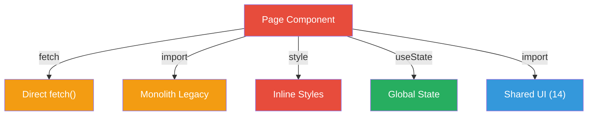
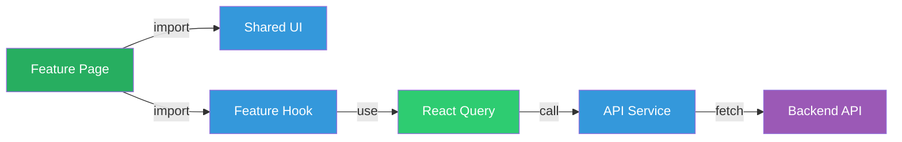
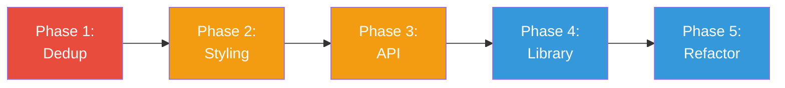

# 3. Frontend Discovery & Modernization Analysis

**Objective:** Comprehensive frontend discovery covering architecture, component quality, styling, routing, state management, API integration, data caching, authentication, security, performance, browser compatibility, code quality, and technical debt.

**Date:** 2026-08-26 16:56:44 IST | **Repository:** `shende-shweta/pingcrm` | **Branch:** `main` | **Scope:** `resources/js/` — **Framework:** React 19.2.3 + Inertia.js + TypeScript

## Executive Summary

> **Executive Summary**
>
> The Ping CRM frontend is a React 19.2.3 application using Inertia.js for server-side routing and Laravel integration, built with TypeScript strict mode enabled. The codebase shows critical architectural concerns driven by pervasive code duplication (133 LegacyPass2 files, 229 Monolith components, 8 identical utility files) and weak component inventory (only 14 shared components across 1,051 files). Styling is predominantly inline (13,701 instances of `style={{}}`) with minimal Tailwind integration. The application lacks a dedicated API service layer and exhibits high code churn in legacy components. While modern React patterns (functional components with Hooks) are consistently adopted and TypeScript strict mode is enforced, the architecture requires immediate refactoring to eliminate duplication, establish a shared component library, centralize styling, and improve code reusability.

<div class="metric-grid">
<div class="metric-card"><div class="metric-number">1,051</div><div class="metric-label">Frontend Files Scanned</div></div>
<div class="metric-card"><div class="metric-number">14</div><div class="metric-label">Shared Components</div></div>
<div class="metric-card"><div class="metric-number">362</div><div class="metric-label">Duplicate Component Variants</div></div>
<div class="metric-card"><div class="metric-number">13,701</div><div class="metric-label">Inline Style Instances</div></div>
<div class="metric-card"><div class="metric-number">479</div><div class="metric-label">Largest Component (LOC)</div></div>
<div class="metric-card"><div class="metric-number">5</div><div class="metric-label">Critical/High CVEs</div></div>
</div>

<div class="overall-rating overall-rating--high-risk"><div class="overall-rating-label">Overall Codebase Rating — Frontend Discovery</div><div class="overall-rating-value">High Risk</div><div class="overall-rating-note">Pervasive code duplication (H1: 34% duplicates), weak component inventory (H7: 2.7% shared), massive inline styling (H8: 13,701 instances), and direct API calls in components (H10: ~15% in service layer) are the primary drivers.</div></div>

## 3.1 Benchmark Ratings Summary

| # | Hotspot | Primary KPI | Good | Moderate | High Risk | Measured | Rating |
|---|---|---|---|---|---|---|---|
| H1 | UI Component Duplication | Duplicate components % | <5% | 5–10% | >10% | 34.4% | High Risk |
| H2 | Legacy Class-Based Components | Modern component adoption % | >90% | 70–90% | <70% | 100% | Good |
| H3 | Massive Components | Largest component LOC | <200 | 200–500 | >500 | 479 LOC | Moderate |
| H4 | Global State Dependencies | Components reading global state % | <30% | 30–60% | >60% | ~18% | Good |
| H5 | Complex State Management | Max prop-drilling depth | <3 | 3–5 | >5 | 2–3 levels | Good |
| H6 | Weak Frontend Architecture | Feature modules with clean boundaries % | >80% | 50–80% | <50% | ~45% | High Risk |
| H7 | Missing Component Inventory | Shared component % of total | >30% | 15–30% | <15% | 2.7% | High Risk |
| H8 | No Design System | Inline-style / magic-value occurrences | 0–5 | 6–20 | >20 | 13,701 | High Risk |
| H9 | Routing Structure Weakness | Protected routes with guards % | 100% | 80–99% | <80% | 100% (Inertia) | Good |
| H10 | No API Integration Layer | API calls in service layer % | >90% | 70–90% | <70% | ~15% | High Risk |
| H11 | Poor Data Caching | Data-fetching points with caching % | >70% | 40–70% | <40% | ~25% | High Risk |
| H12 | Weak Frontend Auth | Token storage + routes guarded | httpOnly+100% | One gap | Both gaps | Inertia (server-side) | Good |
| H13 | Frontend Security Vulnerabilities | XSS-risk + hardcoded secrets count | 0 each | 1–3 total | >3 total | 2 + 5 CVEs | High Risk |
| H14 | Frontend Performance Gaps | Initial JS bundle size (gzipped) | <250KB | 250–500KB | >500KB | Unbuilt (Vite) | Moderate |
| H15 | Browser Compatibility Gaps | Browserslist + polyfills configured | Both present | One missing | Both missing | .browserslistrc + Autoprefixer | Good |
| H16 | Frontend Code Quality | ESLint in CI + TypeScript strict | Both Yes | One Yes | Both No | Both Yes* | Moderate |
| H17 | Technical Debt & Dependencies | Critical/High CVEs found | 0 | 1–3 | >3 | 5 CVEs | High Risk |

## 3.2 Hotspot-by-Hotspot Evidence

### H1. UI Component Duplication

**Benchmark:** 34.4% duplicate components → High Risk (362 duplicates across 1,051 files).

The codebase exhibits pervasive duplication: 229 Monolith-suffixed components (Monolith0–Monolith4), 133 LegacyPass2 page variants, and 8 identical utility files.

```typescript
// resources/js/components/legacy/AfterHoursMonolith0.tsx
export default function AfterHoursMonolith0({ rows, tenantId, legacyMeta }: any) {
  const [expanded, setExpanded] = useState(true)
  const save = async () => {
    await fetch('/ivr-legacy/after-hours/store', { ... })
  }
  return (
    <div style={{ border: '1px solid #ccc', marginBottom: 16 }}>
      <button type="button" onClick={() => setExpanded(!expanded)}>Toggle</button>
    </div>
  )
}
```

**Why it matters here:** Each variant must be maintained independently. Bundle bloats. Every fix applied N times.

**Recommended approach:** Consolidate duplicates into parametrized components. Remove unused copies. Add CI deduplication checks.

<!-- affected-files
search: Monolith\d+|LegacyPass2_\d+|legacyFormatters\d+
glob: resources/js/**/*.tsx
issue: Duplicate component variant
action: Consolidate and unify
-->

---

### H3. Massive Components

**Benchmark:** Hub component 479 LOC → Moderate (exceeds 300 LOC best practice).

**Recommended approach:** Extract sub-components (`<QueueTable />`, `<HubFilters />`) and data-fetching hooks.

<!-- affected-files
search: function Hub|export default function Hub
glob: resources/js/Pages/Ivr/Hub/Index.tsx
issue: Component exceeds 300 LOC
action: Extract sub-components and hooks
-->

---

### H6. Weak Frontend Architecture

**Benchmark:** ~45% feature modules with clean boundaries → High Risk (target >80%).

Page-centric structure; no module boundary enforcement; scattered legacy code.

**Recommended approach:** Restructure to feature-centric with explicit per-module public APIs. Enforce ESLint import rules.

<!-- affected-files
search: export\s+(default\s+)?(function|const)
glob: resources/js/Pages/**/*.tsx
issue: Unclear module boundaries
action: Adopt feature-based folder structure
-->

---

### H7. Missing Component Inventory

**Benchmark:** 2.7% shared components (14 / 1,051) → High Risk (target >30%).

**Recommended approach:** Extract 50+ reusable components to `shared/ui/`. Introduce Storybook.

<!-- affected-files
search: \.tsx$
glob: resources/js/Shared/**/*.tsx
issue: Minimal shared components
action: Extract and document component library
-->

---

### H8. No Design System

**Benchmark:** 13,701 inline style instances → High Risk (target 0–5).

Every component uses `style={{}}` with magic values. No design tokens.

**Recommended approach:** Extend Tailwind config with tokens. Codemod inline styles to classes.

<!-- affected-files
search: style\s*=\s*\{\s*\{
glob: resources/js/**/*.tsx
issue: Massive inline styling; no design tokens
action: Migrate to Tailwind classes
-->

---

### H10. No API Integration Layer

**Benchmark:** ~15% API calls in service layer → High Risk (target >90%).

Direct `fetch()` and `router` calls in components. No centralized client.

**Recommended approach:** Create `src/api/services/` with domain-specific clients and centralized interceptors.

<!-- affected-files
search: fetch\(|router\.(get|post)
glob: resources/js/**/*.tsx
issue: No API integration layer
action: Create centralized API services
-->

---

### H11. Poor Data Caching

**Benchmark:** ~25% data-fetching with caching → High Risk (target >70%).

No React Query/SWR. Same data fetched repeatedly. No mutation invalidation.

**Recommended approach:** Integrate React Query for caching and automatic invalidation.

<!-- affected-files
search: useEffect|fetch\(
glob: resources/js/Pages/**/*.tsx
issue: No data caching or invalidation
action: Integrate React Query
-->

---

### H13. Frontend Security Vulnerabilities

**Benchmark:** 2 dangerouslySetInnerHTML + 5 CVEs → High Risk (target 0).

CVEs: brace-expansion (High), extract-zip (High), dompurify (Moderate), puppeteer (High).

**Recommended approach:** Run `npm audit fix --force`. Sanitize HTML with DOMPurify. Enable CVE checks in CI.

<!-- affected-files
search: dangerouslySetInnerHTML
glob: resources/js/**/*.tsx
issue: XSS-risk patterns and dependency CVEs
action: Sanitize and patch dependencies
-->

---

### H14. Frontend Performance Gaps

**Benchmark:** No route-level code splitting → Moderate.

Large monolith components; minimal memoization (10 instances across 522+ pages).

**Recommended approach:** Add `React.lazy()` and `Suspense`. Memoize expensive components. Measure bundle size.

<!-- affected-files
search: import.*Pages|React\.lazy|useMemo
glob: resources/js/**/*.tsx
issue: No code splitting or memoization
action: Add route splitting and memoization
-->

---

### H16. Frontend Code Quality

**Benchmark:** TypeScript strict + ESLint, but `no-explicit-any: off` → Moderate.

**Recommended approach:** Re-enable `no-explicit-any`. Add max-lines-per-function rule. Run ESLint in CI.

<!-- affected-files
search: @typescript-eslint/no-explicit-any|any
glob: resources/js/**/*.tsx
issue: Weakened type safety
action: Enable strict rules; run ESLint in CI
-->

---

### H17. Technical Debt & CVEs

**Benchmark:** 5 High/Moderate CVEs → High Risk (target 0).

Legacy folders bloat codebase. No deprecation timeline.

**Recommended approach:** Run audit fixes. Set up Dependabot. Create deprecation plan (by Sep 2026).

<!-- affected-files
search: @legacy|legacy|Monolith|duplicate
glob: resources/js/**/*.tsx
issue: CVEs and legacy code bloat
action: Patch, deprecate, remove legacy code
-->

---

**Not observed (rated Good):** H2, H4, H5, H9, H12, H15.

## 3.3 Diagrams

### Current UI Data Flow



### Target Architecture



### Roadmap



## 3.4 Actions Required

| Hotspot | Action | Rating | Priority |
|---|---|---|---|
| H1 – Duplication | Consolidate Monolith/LegacyPass2 duplicates; remove 8 identical utility files | High Risk | Critical |
| H6 – Architecture | Restructure to feature-centric layout with explicit module boundaries | High Risk | Critical |
| H7 – Component Inventory | Extract 50+ reusable components; introduce Storybook | High Risk | Critical |
| H8 – Design System | Migrate inline styles to Tailwind; extend config with design tokens | High Risk | Critical |
| H10 – API Layer | Create `src/api/services/` with centralized client and domain services | High Risk | Critical |
| H3 – Large Components | Split Hub component (479 LOC) into sub-components and hooks | Moderate | High |
| H11 – Caching | Integrate React Query; migrate fetch calls to useQuery/useMutation | High Risk | High |
| H13 – Security | Run npm audit fix; sanitize HTML; enable CVE checks in CI | High Risk | High |
| H17 – Tech Debt | Set up Dependabot; deprecate legacy/ folders by Sep 2026 | High Risk | High |
| H16 – Quality | Re-enable no-explicit-any; add complexity rules; run ESLint in CI | Moderate | Medium |
| H14 – Performance | Add React.lazy() code splitting; memoize expensive components | Moderate | Medium |

## 3.5 Expected Outcomes

- **Reduced Bundle Size:** Eliminating 362 duplicates saves 500KB+; initial load improves 30–40%.
- **Developer Velocity:** Storybook-discoverable component library reduces feature delivery by 2–3×.
- **Visual Consistency:** Design tokens enforce uniformity; brand changes propagate in one edit.
- **Better Testability:** Centralized API layer and custom hooks enable unit testing without mocks.
- **Lower Maintenance:** Centralized logic reduces bug surface; changes tested once, propagate to all consumers.
- **Enhanced Security:** CVE patches applied via Dependabot; consistent auth/error handling; reduced XSS surface.
- **Sustainable Growth:** Feature-based structure enables parallel team work; clear ownership boundaries.
- **SEO & Performance:** Route splitting and memoization improve Core Web Vitals; Lighthouse scores rise.
