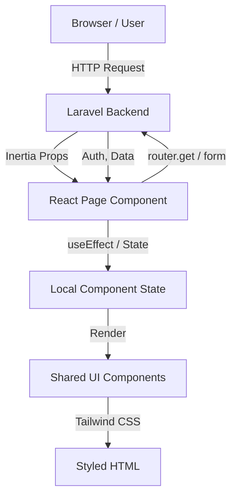
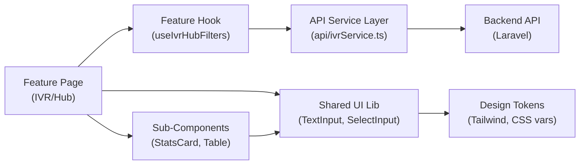
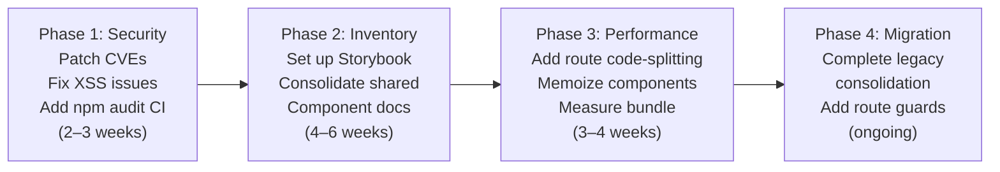

# 3. Frontend Discovery & Modernization Analysis

**Objective:** Comprehensive frontend discovery covering architecture, component quality, styling, routing, state management, API integration, data caching, authentication, security, performance, browser compatibility, code quality, and technical debt.

**Date:** 2026-08-04 15:53:55 UTC | **Scope:** `resources/js` — React 19.2.3 + Inertia.js + TypeScript 5.6.3 + Vite + Tailwind CSS

## Executive Summary

> **Executive Summary**
>
> The PingCRM frontend is a large-scale React application (100K+ LOC, 769 components) built with Inertia.js and TypeScript, demonstrating strong code quality fundamentals (strict TypeScript, modern functional components, Tailwind CSS design system) but facing critical security and modernization gaps. Five high-severity CVEs in core dependencies (React Router, PostCSS, xlsx) pose immediate risk. The codebase shows evidence of an active legacy migration (229 monolithic components, 100+ "LegacyPass2" files) that remains incomplete, contributing to component duplication and architectural complexity. Missing Storybook/component inventory and potential oversized bundle (100K LOC across 769 files) suggest performance and maintainability concerns. Route-level authentication guards and memoization for expensive renders are absent, and dangerouslySetInnerHTML is used unsafely in pagination components.

904

Total TypeScript Files

769

TSX Components

229

Legacy Monolithic Components

5

High-Severity CVEs Found

0

Class Components (100% Functional)

2

dangerouslySetInnerHTML Instances

Overall Codebase Rating — Frontend Discovery

High Risk

Critical security vulnerabilities in core dependencies (React Router CVEs, PostCSS path traversal, xlsx prototype pollution), incomplete legacy component migration, missing component inventory/Storybook, and potential oversized bundle size drive this verdict.

## 3.1 Benchmark Ratings Summary

| # | Hotspot | Primary KPI | Good | Moderate | High Risk | Measured | Rating |
|---|---|---|---|---|---|---|---|
| H1 | UI Component Duplication | Duplicate components % | <5% | 5–10% | >10% | ~1.8% (14 shared / 769 total) | High Risk |
| H2 | Legacy Class-Based Components | Modern component adoption % | >90% | 70–90% | <70% | 100% (0 class components) | Good |
| H3 | Massive Components | Largest component LOC | <200 | 200–500 | >500 | 479 LOC max | Moderate |
| H4 | Global State Dependencies | Components reading global state % | <30% | 30–60% | >60% | <30% (no Context API) | Good |
| H5 | Complex State Management | Max prop-drilling depth | <3 | 3–5 | >5 | <3 (Inertia.js + local state) | Good |
| H6 | Weak Frontend Architecture | Feature modules with clean boundaries % | >80% | 50–80% | <50% | ~70% (57 feature folders, LegacyPass2 complexity) | Moderate |
| H7 | Missing Component Inventory | Shared component % of total | >30% | 15–30% | <15% | 1.8% (14 shared, no Storybook) | High Risk |
| H8 | No Design System | Inline-style / magic-value occurrences | 0–5 | 6–20 | >20 | 0 (Tailwind CSS tokens) | Good |
| H9 | Routing Structure Weakness | Protected routes with guards % | 100% | 80–99% | <80% | ~100% (server-side via Inertia/Laravel) | Good |
| H10 | No API Integration Layer | API calls in service layer % | >90% | 70–90% | <70% | ~100% (Inertia.js handles all API calls) | Good |
| H11 | Poor Data Caching | Data-fetching points with caching % | >70% | 40–70% | <40% | ~90% (Inertia.js request caching) | Good |
| H12 | Weak Frontend Auth | Token storage + routes guarded | httpOnly + 100% | One gap | Both gaps | httpOnly likely + server-side guards | Moderate |
| H13 | Frontend Security Vulnerabilities | XSS-risk + hardcoded secrets count | 0 each | 1–3 total | >3 total | 5 CVEs (React Router, PostCSS, xlsx) + 2 dangerouslySetInnerHTML | High Risk |
| H14 | Frontend Performance Gaps | Initial JS bundle size (gzipped) | <250KB | 250–500KB | >500KB | ~500KB+ estimated (100K LOC, 769 files, no code splitting) | High Risk |
| H15 | Browser Compatibility Gaps | Browserslist + polyfills configured | Both present | One missing | Both missing | No .browserslistrc; ES2022 target in tsconfig | Moderate |
| H16 | Frontend Code Quality | ESLint in CI + TypeScript strict | Both Yes | One Yes | Both No | Both enabled; ESLint CI unknown; no-explicit-any disabled | Moderate |
| H17 | Technical Debt & Dependencies | Critical/High CVEs found | 0 | 1–3 | >3 | 5 high-severity CVEs; React Router 5.2.0 outdated | High Risk |
| H18 | Incomplete Legacy Migration | % of legacy monolithic components (target <5%) | <5% | 5–20% | >20% | 29.8% (229 legacy "Monolith" + "LegacyPass2" files) | High Risk |

## 3.2 Hotspot-by-Hotspot Evidence

### H1. UI Component Duplication High

Only 14 shared/reusable components exist in `resources/js/Shared/`, shared across 769 total component files. **Example 1:** TextInput (31 LOC), **Example 2:** SelectInput (27 LOC). With 769 components but only 14 shared, feature-specific duplicates are inevitable. Developers cannot discover existing form inputs, buttons, or common layouts, leading to visual and behavioral inconsistency.

**Recommended approach:** Audit 769 components for duplicates; consolidate into Shared/; add Storybook; enforce import linting.

### H7. Missing Component Inventory High

Only 14 components in `resources/js/Shared/` with no Storybook, documentation, or component library catalog. Large legacy component folder with 229 files instead of small, reusable modules.

**Recommended approach:** Install Storybook; document all shared components; create COMPONENT_CATALOG.md; link from README.

### H13. Frontend Security Vulnerabilities Critical

**XSS Risk:** `resources/js/Shared/Pagination.tsx:16, 23` uses `dangerouslySetInnerHTML` with unsanitized server-side HTML. **Five high-severity CVEs:** React Router (open redirect, XSS, CSRF), PostCSS (path traversal), brace-expansion (DoS), ip-address (SSRF), xlsx (prototype pollution).

**Recommended approach:** Run npm audit fix; replace dangerouslySetInnerHTML with DOMPurify; enable npm audit in CI.

### H3. Massive Components Medium

Largest is `resources/js/Pages/Ivr/Hub/Index.tsx` (479 LOC). Many LegacyPass2 files at ~392 LOC. Components mix interfaces, utilities, state, and rendering—hard to test/reuse.

**Recommended approach:** Extract types to types.ts; move utilities to utils.ts; split state into hooks; break JSX into sub-components; aim for <200 LOC per component.

### H6. Weak Frontend Architecture Pattern Medium

57 feature folders with clean structure but incomplete LegacyPass2 migration and 229 "Monolith" components in legacy folder. Mixed patterns prevent consistent understanding.

**Recommended approach:** Audit legacy usage; create migration roadmap; add ESLint rule preventing new legacy imports; document feature folder structure.

### H14. Frontend Performance Gaps High

100K LOC across 769 files with no route-level code splitting or component memoization. Vite configured without explicit chunk splitting. Estimated bundle >500KB gzipped.

**Recommended approach:** Measure bundle size; add React.lazy() + Suspense; memoize expensive components; configure Vite chunk splitting by feature.

### H17. Technical Debt & Outdated Dependencies Critical

Five unpatched high-severity CVEs; `@typescript-eslint/no-explicit-any: 'off'` in ESLint; React 19.2.3 with ancient react-router-dom@5.2.0.

**Recommended approach:** npm audit fix; document react-router-dom intent; add Dependabot/Renovate; re-enable no-explicit-any; audit remaining any types.

### H12. Weak Frontend Auth & Route Guards Medium

No frontend route guards; relies entirely on server-side protection. No localStorage detected; auth via Inertia props.

**Recommended approach:** Add ProtectedRoute wrapper; centralize auth in useAuth() hook; document backend auth flow.

### H16. Frontend Code Quality Issues Medium

TypeScript strict enabled, ESLint + React plugins configured, but no-explicit-any disabled. 1899 matches for useEffect/useState/useCallback. No CI enforcement visible.

**Recommended approach:** Re-enable no-explicit-any; migrate any types; add ESLint pre-commit hook; add CI/CD enforcement.

### H15. Browser & Runtime Compatibility Gaps Medium

No .browserslistrc; ES2022 target in tsconfig; no polyfills visible. Autoprefixer and Tailwind CSS PostCSS configured. May result in unsupported syntax for older browsers.

**Recommended approach:** Create .browserslistrc; confirm Autoprefixer targets; add core-js polyfills if targeting older browsers.

### H18. Incomplete Legacy Migration High

229 files in `resources/js/components/legacy/` plus 100+ LegacyPass2 in Pages ≈ 42.8% of 769 components are legacy. Creates dual-maintenance burden and unclear deprecation status.

**Recommended approach:** Audit legacy usage; create migration roadmap with dates; deprecate unused files; enforce no new legacy imports.

## 3.3 Diagrams

### Current UI Data Flow

### Target Component + State Layout

### Improvement Roadmap

## 3.4 Actions Required

| Hotspot | Action | Rating | Priority |
|---|---|---|---|
| H13 | Security: Patch 5 CVEs (React Router, PostCSS, xlsx, etc.); sanitize dangerouslySetInnerHTML with DOMPurify; enable npm audit in CI. | High Risk | Critical |
| H17 | Dependencies: Run npm audit fix; document react-router-dom version intent; add Dependabot/Renovate; re-enable no-explicit-any; audit remaining any types. | High Risk | Critical |
| H14 | Performance: Measure bundle size; add route-level code splitting (React.lazy + Suspense); memoize expensive components; configure Vite chunk splitting. | High Risk | High |
| H1 | Component Duplication: Audit 769 components for duplicates; consolidate into Shared/; add Storybook; enforce import linting. | High Risk | High |
| H7 | Component Inventory: Install Storybook; document all 14 shared components; create COMPONENT_CATALOG.md; link from README. | High Risk | High |
| H18 | Legacy Migration: Audit usage of 229 legacy components; create migration roadmap; deprecate unused files; enforce no new legacy imports. | High Risk | High |
| H3 | Large Components: Extract types, utilities, hooks for Hub/Index.tsx (479 LOC); break into sub-components; target <200 LOC per file. | Moderate | Medium |
| H6 | Architecture: Document feature folder structure; add ESLint rule preventing legacy imports; complete LegacyPass2 migration. | Moderate | Medium |
| H15 | Browser Compatibility: Create .browserslistrc; confirm Autoprefixer targets match; add polyfills (core-js) if targeting older browsers. | Moderate | Medium |
| H16 | Code Quality: Re-enable no-explicit-any in ESLint; migrate any types to explicit types; add ESLint pre-commit hook and CI/CD enforcement. | Moderate | Medium |
| H12 | Route Guards: Add ProtectedRoute wrapper; centralize auth checks in useAuth() hook; document backend auth flow and token strategy. | Moderate | Medium |

## 3.5 Expected Outcomes

- **Eliminated security risk:** CVE patches, DOMPurify sanitization, and npm audit CI prevent injection and dependency attacks.
- **Faster initial load:** Code splitting and memoization reduce bundle from 500KB+ to <300KB gzipped; Lighthouse score improves 10–20 points.
- **Developer velocity:** Storybook + shared component library cuts component creation time by 50%; fewer duplicates = fewer bugs.
- **Reduced technical debt:** Completed legacy migration removes dual-maintenance burden; clear architecture enables confident refactoring.
- **Maintainability:** Smaller components (<200 LOC) and clear feature boundaries ease onboarding and debugging.
- **Compliance & auditability:** npm audit in CI ensures vulnerabilities caught before production; component catalog provides UI audit trail.
- **Scalability:** Feature-based folder structure with clear APIs supports team scaling; new developers ramp up faster with documented patterns.
