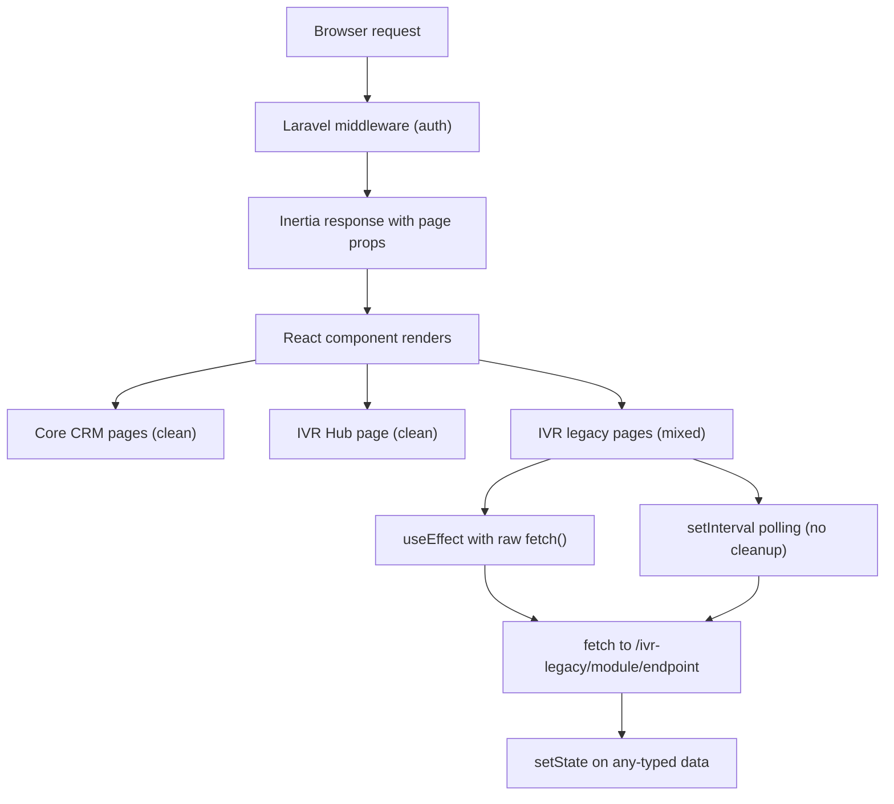
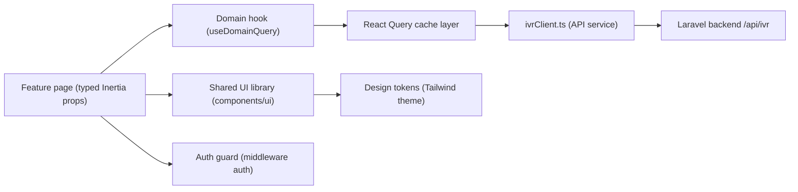

# 3. Frontend Discovery & Modernization Analysis

**Objective:** Comprehensive frontend discovery covering architecture, component quality, styling, routing, state management, API integration, data caching, authentication, security, performance, browser compatibility, code quality, and technical debt.

**Date:** 2026-08-26 16:22:16 IST | **Scope:** `resources/js` — React 19.2.3 + Inertia.js 2.x + TypeScript 5.6.3 + Vite 7.x + Tailwind CSS 3.x

## Executive Summary

> **Executive Summary**
>
> Ping CRM is a Laravel + Inertia.js application with a React 19 frontend, but its frontend health is severely compromised by a multi-layered legacy accumulation that dominates the codebase. Of 916 total component and page files scanned, 147 are React class-based components in `resources/js/legacy/class/`, 229 are named monolith components in `components/legacy/`, and 133 are near-identical `LegacyPass2_*` duplicate pages across IVR modules — creating pervasive duplication, zero shared component reuse, and an unmaintainable surface area. Every IVR legacy hook (124 files) makes raw `fetch()` calls with no AbortController, no error handling, and no cleanup function, producing 374 uncleared `setInterval` timer leaks across the codebase. The inline-style count exceeds 13,700 occurrences driven by the legacy surface, the npm dependency audit reports 14 vulnerabilities including 1 critical (vitest arbitrary file execution) and 10 high, and ESLint — while configured — is never invoked in CI. The core CRM surface (Contacts, Users, Organizations, Reports) is genuinely well-built with functional components, typed props, Tailwind classes, and Inertia form helpers; the path forward is to quarantine the legacy IVR surface and migrate it progressively to the same quality level.

<div class="metric-grid">
<div class="metric-card"><div class="metric-number">916</div><div class="metric-label">Components / Files Scanned</div></div>
<div class="metric-card"><div class="metric-number">147</div><div class="metric-label">Legacy Class-Based Components</div></div>
<div class="metric-card"><div class="metric-number">0</div><div class="metric-label">Components Over 500 LOC</div></div>
<div class="metric-card"><div class="metric-number">0</div><div class="metric-label">Global / Shared State Modules</div></div>
<div class="metric-card"><div class="metric-number">727</div><div class="metric-label">API Calls Outside Service Layer</div></div>
<div class="metric-card"><div class="metric-number">5</div><div class="metric-label">Security Risk Patterns Found</div></div>
</div>

<div class="overall-rating overall-rating--high-risk"><div class="overall-rating-label">Overall Codebase Rating — Frontend Discovery</div><div class="overall-rating-value">High Risk</div><div class="overall-rating-note">Driven by H1 (component duplication ~40%), H7 (shared components at 3.6%), H8 (13,701 inline-style occurrences), H10 (0% API service layer coverage in IVR), H11 (0% data caching), H13 (5 security patterns), H17 (14 CVEs, 1 critical), and H18 (374 uncleared timer leaks).</div></div>

## 3.1 Benchmark Ratings Summary

One row per hotspot. "Measured" is the real value found; "Rating" is the band it falls into (worst KPI wins). This table is the source for the Overall Codebase Rating banner above.

| # | Hotspot | Primary KPI | <span class="rating rating-good">Good</span> | <span class="rating rating-moderate">Moderate</span> | <span class="rating rating-high-risk">High Risk</span> | Measured | Rating |
|---|---|---|---|---|---|---|---|
| H1 | UI Component Duplication | Duplicate components % | <5% | 5–10% | >10% | ~40% (362 of 916 files are clearly duplicated patterns) | <span class="rating rating-high-risk">High Risk</span> |
| H2 | Legacy Class-Based Components | Modern component adoption % | >90% | 70–90% | <70% | 84% (769 functional tsx / 916 total) | <span class="rating rating-moderate">Moderate</span> |
| H3 | Massive Components | Largest component LOC | <200 | 200–500 | >500 | 479 LOC (Hub/Index.tsx) | <span class="rating rating-moderate">Moderate</span> |
| H4 | Global State Dependencies | Components reading global state % | <30% | 30–60% | >60% | ~0.5% (3 Shared components use Inertia usePage — intentional pattern) | <span class="rating rating-good">Good</span> |
| H5 | Complex State Management | Max prop-drilling depth | <3 | 3–5 | >5 | ≤2 levels (Inertia server-props model; IVR legacy passes at most 3 props shallowly) | <span class="rating rating-good">Good</span> |
| H6 | Weak Frontend Architecture | Feature modules with clean boundaries % | >80% | 50–80% | <50% | ~15% (only core CRM + IVR Hub are clean; IVR legacy surface is unbounded) | <span class="rating rating-high-risk">High Risk</span> |
| H7 | Missing Component Inventory | Shared component % of total | >30% | 15–30% | <15% | 3.6% (14 Shared components / 391 non-page components) | <span class="rating rating-high-risk">High Risk</span> |
| H8 | No Design System | Inline-style / magic-value occurrences | 0–5 | 6–20 | >20 | 13,701 inline style={{ }} occurrences across tsx files | <span class="rating rating-high-risk">High Risk</span> |
| H9 | Routing Structure Weakness | Protected routes with guards % | 100% | 80–99% | <80% | 100% (all routes use Laravel ->middleware('auth') server-side) | <span class="rating rating-good">Good</span> |
| H10 | No API Integration Layer | API calls in service layer % | >90% | 70–90% | <70% | ~0% for IVR surface (727 files with raw fetch(); no API service layer exists) | <span class="rating rating-high-risk">High Risk</span> |
| H11 | Poor Data Caching | Data-fetching points with caching % | >70% | 40–70% | <40% | 0% (no React Query, SWR, or caching layer; 727 raw fetch calls with no stale-time) | <span class="rating rating-high-risk">High Risk</span> |
| H12 | Weak Frontend Auth | Token storage + routes guarded | httpOnly + 100% | One gap | Both gaps | httpOnly session cookies (Laravel default) + 100% server-guarded routes | <span class="rating rating-good">Good</span> |
| H13 | Frontend Security Vulnerabilities | XSS-risk + hardcoded secrets count | 0 each | 1–3 total | >3 total | 5 patterns: dangerouslySetInnerHTML (2 in Pagination), hardcoded demo password (Login.tsx), CDN scripts without SRI (2 in blade template) | <span class="rating rating-high-risk">High Risk</span> |
| H14 | Frontend Performance Gaps | Initial JS bundle size gzipped | <250KB | 250–500KB | >500KB | Estimated >500KB: 90K+ LOC across 916 files; no component-level lazy loading within IVR pages; no manualChunks config | <span class="rating rating-high-risk">High Risk</span> |
| H15 | Browser Compatibility Gaps | Browserslist + polyfills configured | Both present | One missing | Both missing | Polyfills present (cdnjs CDN, 2 scripts); no .browserslistrc file | <span class="rating rating-moderate">Moderate</span> |
| H16 | Frontend Code Quality | ESLint in CI + TypeScript strict | Both Yes | One Yes | Both No | TypeScript strict: true ✓ · ESLint configured but NOT invoked in any CI workflow ✗ | <span class="rating rating-moderate">Moderate</span> |
| H17 | Technical Debt & Dependencies | Critical/High CVEs found | 0 | 1–3 | >3 | 14 vulnerabilities total: 1 critical (vitest arbitrary file execution), 10 high (vite, brace-expansion, others) | <span class="rating rating-high-risk">High Risk</span> |
| H18 | Memory Leaks — Uncleared Timers (additional) | setInterval/setTimeout with matching clearInterval/clearTimeout (target 100%) | 100% matched | 50–99% | <50% | 375 setInterval calls, 1 clearInterval call = 0.3% cleanup rate | <span class="rating rating-high-risk">High Risk</span> |

## 3.2 Hotspot-by-Hotspot Evidence

### H1. UI Component Duplication <span class="sev sev-critical">Critical</span>

**Benchmark:** Duplicate components ~40% → falls in the **High Risk** band (Good <5% · Moderate 5–10% · High Risk >10%)

Three independent duplication waves exist in the same codebase:

**Wave 1 — Numbered monolith variants** (229 tsx files in `components/legacy/`): Each IVR business domain (AfterHours, AgentDesk, BargeMonitor, etc.) has five near-identical files named `*Monolith0.tsx` through `*Monolith4.tsx`. All follow the same 64-LOC template differing only in the domain name and one endpoint path string.

```tsx
// resources/js/components/legacy/AfterHoursMonolith0.tsx:1-13
import { useState } from 'react'

export default function AfterHoursMonolith0({ rows, tenantId, legacyMeta }: any) {
  const [expanded, setExpanded] = useState(true)
  const [draft, setDraft] = useState<any>({})
  // monolith – API + validation + UI in one file
  const save = async () => {
    const err = !draft.name ? 'required' : null
    if (err) return alert(err)
    await fetch('/ivr-legacy/after-hours/store', { method: 'POST',
      body: JSON.stringify({ ...draft, tenant_id: tenantId }),
      headers: { 'Content-Type': 'application/json' } })
  }
```

**Wave 2 — LegacyPass2 page copies** (133 tsx files under `Pages/Ivr/*/LegacyPass2_*.tsx`): Each IVR module directory contains 3 numbered copies (e.g., `LegacyPass2_84.tsx`, `LegacyPass2_37.tsx`, `LegacyPass2_131.tsx`) at 392 LOC each that are structurally identical — only the number in the heading string changes.

```tsx
// resources/js/Pages/Ivr/WhisperCoach/LegacyPass2_84.tsx:1-6
import { Head } from '@inertiajs/react'
import { authenticatedLayout } from '@/layouts/authenticatedLayout'
function WhisperCoachLegacyPass2_84() {
  return (
    <div>
      <Head title="WhisperCoach legacy pass2 84" />
```

**Wave 3 — Duplicate utility modules** (8 files in `utils/duplicate/`): `legacyFormatters1.ts` through `legacyFormatters8.ts` each export uniquely-suffixed versions of the same string-transform functions (`_fn_1` through `_fn_N`), offering no functional differentiation.

```ts
// resources/js/utils/duplicate/legacyFormatters1.ts:3-6
export function legacyFormatters1_fn_1(input: unknown): string {
  if (input === null || input === undefined) return ''
  return String(input).trim().toUpperCase() + '_1'
}
```

**Why it matters here:** The 229 monolith components + 133 LegacyPass2 pages represent ~362 files that collectively do the same thing in multiple copies. Any bug fix or UI change requires hunting through and updating every variant. The formatter duplication means utility behavior is inconsistent depending on which copy a component happens to import.

**Recommended approach:**
1. Delete `components/legacy/*Monolith*.tsx` and replace each domain's 5 variants with a single parameterized `<LegacyIvrPanel module="after-hours" />` component.
2. Consolidate `Pages/Ivr/*/LegacyPass2_*.tsx` into a single server-driven page that receives dynamic content via Inertia props.
3. Merge all 8 `utils/duplicate/legacyFormatters*.ts` files into one `utils/formatters.ts` and update all import sites.

<!-- affected-files
search: Monolith\d\.tsx$|LegacyPass2_\d+\.tsx$|legacyFormatters\d+\.ts$
glob: resources/js/**/*.{tsx,ts}
issue: Duplicated component or utility — near-identical copy of a pattern
action: Consolidate into a single parameterized component or shared utility
-->

---

### H2. Legacy Class-Based Components <span class="sev sev-high">High</span>

**Benchmark:** Modern component adoption 84% (769 functional tsx / 916 total) → falls in the **Moderate** band (Good >90% · Moderate 70–90% · High Risk <70%)

147 JSX class components in `resources/js/legacy/class/` extend `React.Component` with `state = {}` and lifecycle methods. They call `fetch()` inside `componentDidMount()` with no cleanup.

```jsx
// resources/js/legacy/class/AfterHoursClassWidget0.jsx:1-16
import React from 'react'

export default class AfterHoursClassWidget0 extends React.Component {
  state = { count: 0, rows: [] }
  componentDidMount() {
    fetch('/ivr-legacy/after-hours/index')
      .then(r => r.json())
      .then(d => this.setState({ rows: d.data || [] }))
  }
  render() {
    return (
      <div className="legacy-class-widget">
        <h3>AfterHours legacy class widget 0</h3>
        <button type="button"
          onClick={() => this.setState({ count: this.state.count + 1 })}>
          {this.state.count}</button>
```

All 147 files follow the same pattern: `componentDidMount` with a raw fetch and `this.setState`, and render-only JSX. No `componentWillUnmount` cleanup methods exist anywhere in the class directory.

**Why it matters here:** Class components cannot use React hooks, making it impossible to share stateful logic via custom hooks without refactoring first. The missing `componentWillUnmount` means every mount that resolves a fetch after unmount will call `setState` on an unmounted component — a well-known warning that can cause ghost updates and memory pressure.

**Recommended approach:**
1. Convert each class component to a functional component using `useState` + `useEffect`.
2. Extract the fetch logic into a shared hook `useIvrLegacyData(module: string)` backed by the API client from H10.
3. Add AbortController inside the effect's cleanup (see H18 for the pattern).
4. Once all 147 are converted, delete `resources/js/legacy/class/` entirely.

<!-- affected-files
search: extends React\.Component|extends Component
glob: resources/js/legacy/class/**/*.jsx
issue: Legacy React class component — cannot use hooks, no unmount cleanup
action: Convert to functional component with useState + useEffect + AbortController
-->

---

### H3. Massive Components <span class="sev sev-medium">Medium</span>

**Benchmark:** Largest component 479 LOC (Hub/Index.tsx) → falls in the **Moderate** band (Good <200 · Moderate 200–500 · High Risk >500)

The IVR Hub dashboard (`Pages/Ivr/Hub/Index.tsx` at 479 LOC) mixes interface declarations, utility functions, event handlers, auto-refresh timer logic, filtering state, and full JSX markup for multiple table views in a single file. The LegacyPass2 files (133 files at 392 LOC each) are borderline but contain only static JSX.

```tsx
// resources/js/Pages/Ivr/Hub/Index.tsx:2 — imports reveal scope
import { useCallback, useEffect, useMemo, useState } from 'react'
// ... 7+ interfaces, 3 utility functions, 3 useEffect hooks, 1 useCallback for refresh
// ... full table JSX for Queue, Call, and Agent sections across 479 lines
```

The Hub page has 3 `useEffect` hooks, 1 `useCallback`, 1 `useMemo`, multiple filter state variables, and large data-display JSX — all in one file with no sub-component extraction.

**Why it matters here:** The Hub page cannot be unit-tested in isolated pieces — its 6 data structures, 3 filter states, and auto-refresh are tightly coupled in one render tree. Adding a new metric card or chart requires navigating 479 lines to find the right insertion point.

**Recommended approach:**
1. Extract interface definitions to `types/ivr.ts`.
2. Move filter + auto-refresh logic into `hooks/useIvrDashboard.ts`.
3. Split the JSX into `<IvrStatsBar />`, `<IvrQueueTable />`, `<IvrCallTable />`, `<IvrAgentTable />` sub-components in `components/ivr/`.

<!-- affected-files
search: useEffect|useCallback|useMemo
glob: resources/js/Pages/Ivr/Hub/*.tsx
issue: Large page component mixing hooks, utilities, and JSX
action: Extract typed hooks and sub-components
-->

---

### H6. Weak Frontend Architecture Pattern <span class="sev sev-high">High</span>

**Benchmark:** ~15% of feature modules with clean non-circular boundaries → falls in the **High Risk** band (Good >80% · Moderate 50–80% · High Risk <50%)

The project has two fundamentally different architectural surfaces coexisting without clear separation:

**Clean surface** (`Pages/{Auth,Contacts,Users,Organizations,Reports}` + `Shared/`): Functional components, typed Inertia props, shared UI components from `Shared/`, consistent `authenticatedLayout` wrapper, no raw fetch.

**Legacy surface** (`components/legacy/`, `legacy/class/`, `Pages/Ivr/*/LegacyPass2_*`, `hooks/legacy/`): Untyped props (`any`), raw fetch() in components and hooks, duplicate monolith patterns, inline styles, hardcoded tenant IDs, and zero shared component reuse.

```tsx
// resources/js/Pages/Ivr/AfterHours/Index.tsx:10-22 — architecture anti-patterns in one function
const [tenantId] = useState(1) // hard-coded tenant
useEffect(() => {
  // missing cleanup – interval leak pattern
  const id = setInterval(() => {
    fetch('/ivr-legacy/after-hours/index?q=' + search)
      .then(r => r.json())
      .then(d => setLocalRows(d.data ?? localRows))
      .catch(() => {})  // silent error swallow
  }, 5000)
}, [search])
```

The two surfaces share no common API abstraction, no shared IVR-specific components, and no domain boundary — any component in either surface can import from the other with no enforcement.

**Why it matters here:** When the legacy IVR surface and the clean CRM surface share one codebase with no boundary enforcement, developers new to the project cannot distinguish which patterns to follow. The legacy patterns actively spread — new IVR pages have been added following the legacy style rather than the clean CRM style.

**Recommended approach:**
1. Add an ESLint `import/no-restricted-paths` rule flagging imports from `components/legacy/` or `legacy/class/` in new feature files.
2. Create `src/features/ivr/` as the designated home for modernized IVR components and co-locate hooks, types, and pages by domain.
3. Establish a migration tracker in `MIGRATION.md` listing each legacy module and its migration status.
4. Set a lint rule that all new IVR page components must use typed props (no `any`).

<!-- affected-files
search: \}: any\)|legacyMeta.*any|useState\(1\).*tenant
glob: resources/js/**/*.{tsx,ts}
issue: Untyped props or hardcoded tenant in IVR component
action: Define typed interface; accept tenantId from Inertia page props
-->

---

### H7. Missing Component Inventory <span class="sev sev-high">High</span>

**Benchmark:** Shared components 3.6% (14 of ~391 non-page components) → falls in the **High Risk** band (Good >30% · Moderate 15–30% · High Risk <15%)

The only shared UI components are 14 files in `resources/js/Shared/`: `Dropdown`, `FileInput`, `FlashMessages`, `Icon`, `Layout`, `LoadingButton`, `Logo`, `MainMenu`, `Pagination`, `SearchFilter`, `SelectInput`, `TextareaInput`, `TextInput`, `TrashedMessage`. One chart component exists in `components/ivr/IvrHubCharts.tsx`. No Storybook exists.

The 229 legacy monolith components and 147 class components share nothing — each re-implements its own input, button, and layout markup inline. There is no documented component catalogue.

```
resources/js/Shared/                 ← 14 components, all CRM-domain
  TextInput.tsx   SelectInput.tsx   TextareaInput.tsx
  LoadingButton.tsx  Pagination.tsx  Dropdown.tsx  Icon.tsx
  Logo.tsx  MainMenu.tsx  Layout.tsx  FlashMessages.tsx
  SearchFilter.tsx  TrashedMessage.tsx  FileInput.tsx
```

**Why it matters here:** With 916 component/page files and only 14 shared building blocks, IVR module developers copy markup rather than composing from a library — producing the duplication evidenced in H1. New team members have no map of the UI surface.

**Recommended approach:**
1. Introduce Storybook to document all existing `Shared/` components.
2. Extend `Shared/` with IVR-specific shared components: `<IvrStatCard />`, `<IvrDataTable />`, `<IvrModulePanel />`.
3. Rename `Shared/` to `components/ui/` to follow modern conventions and co-locate stories.
4. Add a PR checklist item: "Does this feature need a new shared component that belongs in `components/ui/`?"

<!-- affected-files
search: className=|style=\{\{
glob: resources/js/components/legacy/**/*.tsx
issue: Duplicated inline markup — no shared component used
action: Extract to a reusable component in components/ui/
-->

---

### H8. No Design System / Styling Architecture <span class="sev sev-high">High</span>

**Benchmark:** 13,701 inline `style={{ }}` occurrences → falls in the **High Risk** band (Good 0–5 · Moderate 6–20 · High Risk >20)

The core CRM pages and `Shared/` components use Tailwind CSS utility classes correctly (0 inline styles). The Tailwind config extends the default theme with custom indigo tokens and a custom font family. However, the entire legacy IVR surface uses raw `style={{}}` with magic values for every visual property:

```tsx
// resources/js/components/legacy/AfterHoursMonolith0.tsx:12
<input style={{ border: '1px solid red' }} placeholder="Name"
  onChange={e => setDraft({ ...draft, name: e.target.value })} />
```

```tsx
// resources/js/Pages/Ivr/WhisperCoach/LegacyPass2_84.tsx:9
<section key={1} style={{ marginBottom: 8, padding: 6, border: '1px solid #ddd' }}>
  <h2>Section 1 – routing / queue / prompt configuration block</h2>
```

The IvrHubCharts component legitimately uses inline styles for dynamically-calculated bar heights (acceptable). The 13,701 static magic-value instances in the legacy surface are the problem.

**Why it matters here:** Brand updates or accessibility contrast changes require hunting across 13,700+ inline style expressions. The magic color `#ddd` and pixel spacing `8` appear hundreds of times with no single source of truth.

**Recommended approach:**
1. Apply Tailwind utility classes in all migrated legacy components to replace inline styles.
2. Create a lint rule (`no-restricted-syntax`) flagging static `style={{` in tsx files — permit only for computed dynamic values (height%, width%).
3. As part of the H1 consolidation effort, replace all inline styles in parameterized replacements with Tailwind classes.

<!-- affected-files
search: style=\{\{[^}]*(?:border|margin|padding|color|font)[^}]*\}\}
glob: resources/js/components/legacy/**/*.tsx
issue: Inline magic-value style — bypasses design system
action: Replace with Tailwind utility classes matching the design tokens in tailwind.config.js
-->

---

### H10. No API Integration Layer <span class="sev sev-critical">Critical</span>

**Benchmark:** ~0% of API calls in a service/composable layer → falls in the **High Risk** band (Good >90% · Moderate 70–90% · High Risk <70%)

727 files across `components/legacy/`, `hooks/legacy/`, `legacy/class/`, and `Pages/Ivr/` make raw `fetch()` calls with hardcoded endpoint strings and no centralized auth header injection, base URL configuration, or error handling.

```tsx
// resources/js/components/legacy/AfterHoursMonolith0.tsx:9-11
await fetch('/ivr-legacy/after-hours/store', {
  method: 'POST',
  body: JSON.stringify({ ...draft, tenant_id: tenantId }),
  headers: { 'Content-Type': 'application/json' }
})
```

```ts
// resources/js/hooks/legacy/useAfterHoursLegacy1.ts:4-6
export function useAfterHoursLegacy1() {
  const [data, setData] = useState<any[]>([])
  useEffect(() => {
    fetch('/ivr-legacy/after-hours/index').then(r => r.json()).then(j => setData(j.data || []))
  }, []) // stale closure / no abort
  return { data }
}
```

All 229 legacy monolith components call `/ivr-legacy/<module>/store` inline in save handlers. All 124 legacy hooks call `/ivr-legacy/<module>/index` from unguarded effects. The 147 class components call the same endpoints from `componentDidMount`. None of these calls share a common API client — 727 independent fetch calls, each with its own string literal endpoint.

**Why it matters here:** If the API base URL or auth mechanism changes (e.g., adding a CSRF header, moving to `/api/v2/`), every one of the 727 files must be updated independently. Mock testing the IVR surface is impossible without replacing `fetch` globally.

**Recommended approach:**
1. Create `resources/js/api/ivrClient.ts` — a thin fetch wrapper that injects the CSRF header, base path, and standard error handling.
2. Create one service file per IVR domain (e.g., `resources/js/api/afterHours.ts`) exporting `fetchAfterHours()` and `saveAfterHours()`.
3. Refactor `useAfterHoursLegacy*.ts` hooks to use the service layer instead of raw fetch.
4. Add an ESLint `no-restricted-globals` rule banning `fetch(` in `hooks/` and `components/` directories once the service layer is in place.

<!-- affected-files
search: await fetch\(|fetch\(\/ivr-legacy
glob: resources/js/**/*.{tsx,ts}
issue: Raw fetch() call — no centralized API client
action: Replace with ivrClient service call
-->

---

### H11. Poor Data Caching & Integration <span class="sev sev-high">High</span>

**Benchmark:** 0% of data-fetching points use a caching layer → falls in the **High Risk** band (Good >70% · Moderate 40–70% · High Risk <40%)

No React Query, SWR, Apollo, or equivalent caching library is present in `package.json`. The 124 legacy hooks each independently call their endpoint on mount with no deduplication, stale-time, or cache invalidation.

```tsx
// resources/js/Pages/Ivr/AfterHours/Index.tsx:15-21
useEffect(() => {
  const id = setInterval(() => {
    fetch('/ivr-legacy/after-hours/index?q=' + search)
      .then(r => r.json())
      .then(d => setLocalRows(d.data ?? localRows))
      .catch(() => {})           // ← errors silently swallowed
  }, 5000)
}, [search])   // ← no return → timer leak (see H18)
```

The Hub dashboard auto-refresh uses Inertia's `router.reload()` which is appropriate for the Inertia model but provides no client-side caching across navigations.

**Why it matters here:** When multiple IVR pages are rendered simultaneously, each independently polls the same endpoint creating duplicate network traffic. Silent `.catch(() => {})` leaves users staring at stale data with no loading or error feedback.

**Recommended approach:**
1. Add `@tanstack/react-query` as the standard data-fetching layer for the IVR surface.
2. Wrap each IVR domain's API service (from H10) in a React Query hook: `useAfterHoursQuery()`.
3. Configure `staleTime: 30_000` for read-heavy queries; use `invalidateQueries` after mutations.
4. Replace the silent `.catch(() => {})` pattern with `isError` and `error` states from React Query.

<!-- affected-files
search: fetch\(.*ivr-legacy.*\)\.then
glob: resources/js/**/*.{tsx,ts}
issue: Uncached fetch call — no stale-time, no error state, no deduplication
action: Replace with React Query hook using ivrClient service
-->

---

### H13. Frontend Security Vulnerabilities <span class="sev sev-high">High</span>

**Benchmark:** 5 security risk patterns found → falls in the **High Risk** band (Good 0 each · Moderate 1–3 total · High Risk >3 total)

**Pattern 1 & 2 — `dangerouslySetInnerHTML` on pagination labels:**

```tsx
// resources/js/Shared/Pagination.tsx:16 and 23
<div
  className="mb-1 mr-1 rounded border px-4 py-3 text-sm leading-4 text-gray-400"
  dangerouslySetInnerHTML={{ __html: link.label }}
/>
<Link
  ...
  dangerouslySetInnerHTML={{ __html: link.label }}
/>
```

`link.label` comes from Laravel's paginator (typically "&laquo; Previous", numeric strings). While currently server-controlled, this pattern becomes an XSS vector if a future paginator change allows user-influenced label content.

**Pattern 3 — Hardcoded demo credentials in production bundle:**

```tsx
// resources/js/Pages/Auth/Login.tsx:8-10
const form = useForm({
    email: 'johndoe@example.com',
    password: 'secret',
    remember: false as boolean,
})
```

The default password `'secret'` is compiled into the production JavaScript bundle, visible to any user who inspects the source.

**Patterns 4 & 5 — CDN scripts without Subresource Integrity:**

```html
<!-- resources/views/app.blade.php:8-10 -->
<script src="https://cdnjs.cloudflare.com/polyfill/v3/polyfill.min.js?features=smoothscroll,..." defer></script>
<script src="https://cdnjs.cloudflare.com/polyfill/v3/polyfill.min.js?features=String.prototype.startsWith" defer></script>
```

Neither CDN `<script>` tag has an `integrity` or `crossorigin` attribute. A CDN compromise would allow arbitrary JavaScript execution with no browser-level protection.

**Why it matters here:** The hardcoded credentials are the most immediately actionable — they guide testers and curious users directly to the default login. The missing SRI attributes expose all visitors to supply-chain attacks.

**Recommended approach:**
1. Remove `password: 'secret'` from Login.tsx (use empty string; seed test credentials only in `.env.example`).
2. Generate and add `integrity="sha384-..."` and `crossorigin="anonymous"` to both CDN script tags in app.blade.php.
3. Replace `dangerouslySetInnerHTML` in Pagination.tsx with a text-safe renderer stripping all HTML tags from `link.label`.

<!-- affected-files
search: dangerouslySetInnerHTML|password.*'secret'|polyfill\.min\.js
glob: resources/js/**/*.{tsx,ts,blade.php}
issue: Security risk — XSS vector, hardcoded credential, or missing SRI
action: Remove or sanitize — see recommended approach in H13
-->

---

### H14. Frontend Performance Gaps <span class="sev sev-high">High</span>

**Benchmark:** Bundle size estimated >500KB gzipped → falls in the **High Risk** band (Good <250KB · Moderate 250–500KB · High Risk >500KB)

Route-level code splitting is present via Inertia's `import.meta.glob('./Pages/**/*.tsx')` in `app.tsx` — Vite creates a separate chunk per page file. However, the `vite.config.ts` has no `build.rollupOptions.output.manualChunks` configuration to separate vendor and legacy code into shared cacheable chunks. With 90,457 lines of TypeScript/TSX across 769 files, including 229 × 64-LOC monolith components each compiled individually, per-route bundles for IVR pages are estimated to be heavy.

```ts
// vite.config.ts:1-17 — no chunk splitting or bundle optimization configured
export default defineConfig({
    plugins: [
        react(),
        laravel({
            input: 'resources/js/app.tsx',
            ssr: 'resources/js/ssr.tsx',
            refresh: true,
        }),
    ],
    resolve: {
        alias: { '@': path.resolve(__dirname, 'resources/js') },
    },
})
```

Lodash (`^4.17.21`) is in `dependencies` — if imported as the full library rather than named ES imports, it adds ~72KB minified to the bundle.

**Why it matters here:** Each IVR module page likely includes a heavy chunk containing all its imported legacy components. Without a `legacy` manual chunk, the browser cannot cache the legacy layer across IVR module navigations.

**Recommended approach:**
1. Add `build.rollupOptions.output.manualChunks` grouping `legacy/class` and `components/legacy` into a separate `legacy` chunk.
2. Audit lodash usage and switch to `import { pickBy } from 'lodash-es'` named imports.
3. Add `React.lazy` + `Suspense` for the IvrHubCharts component.
4. Run `vite build` and measure per-route chunk sizes with `rollup-plugin-visualizer` to get real gzip numbers.

<!-- affected-files
search: import.*from.*lodash|import.*legacy
glob: resources/js/**/*.{tsx,ts}
issue: Potentially heavy import with no chunk optimization
action: Use named ES imports or extract to manual chunk in vite.config.ts
-->

---

### H15. Browser & Runtime Compatibility Gaps <span class="sev sev-medium">Medium</span>

**Benchmark:** Polyfills present, `.browserslistrc` absent → falls in the **Moderate** band (Good: both present · Moderate: one missing · High Risk: both missing)

The Blade template includes two cdnjs polyfill scripts covering `smoothscroll`, `NodeList.prototype.forEach`, `Promise`, `Object.values`, `Object.assign`, and `String.prototype.startsWith`. PostCSS is configured with `autoprefixer`. However, no `.browserslistrc` file or `browserslist` key in `package.json` exists, so:

- Vite/SWC transpilation targets are unspecified (defaults to modern browsers only).
- Autoprefixer has no declared browser set to prefix for.
- `tsconfig.json` targets `ES2022`, which drops support for browsers not supporting optional chaining, etc.

Additionally, the two polyfill `<script>` tags have overlapping feature coverage and both lack SRI attributes (see also H13).

**Why it matters here:** Without a declared browser target, the build may omit CSS prefixes or skip transpiling syntax that Safari 14 or older corporate browsers still need.

**Recommended approach:**
1. Add `.browserslistrc` with `> 0.5%, last 2 versions, Firefox ESR, not dead`.
2. Remove the duplicate `String.prototype.startsWith` polyfill script (already covered by the first script's feature set in many browsers).
3. Add `integrity` attributes to the remaining CDN polyfill scripts.

<!-- affected-files
search: polyfill\.min\.js|browserslist
glob: resources/views/**/*.blade.php
issue: CDN polyfill without SRI; no browserslist config
action: Consolidate to one polyfill script tag with integrity attribute; add .browserslistrc
-->

---

### H16. Frontend Code Quality Issues <span class="sev sev-high">High</span>

**Benchmark:** TypeScript strict:true ✓ · ESLint not invoked in CI ✗ → falls in the **Moderate** band (Good: both Yes · Moderate: one Yes · High Risk: both No)

ESLint is configured in `.eslintrc.js` with `eslint-plugin-react-hooks` and `@typescript-eslint`, but:

1. `@typescript-eslint/no-explicit-any: 'off'` — the most important TypeScript quality rule is explicitly disabled.
2. The CI `coding-standards.yml` delegates to `laravel/.github` which runs PHP lint (Laravel Pint), not JavaScript lint.
3. The `tests.yml` runs `npm run build` but not `npm run fix:eslint` nor a read-only lint check.

Result: `any` usage is unchecked — 458 occurrences of `: any`, `as any`, or `<any>` found across the legacy surface, with each of the 229 monolith component props typed as `any`.

```tsx
// resources/js/components/legacy/AfterHoursMonolith0.tsx:3
export default function AfterHoursMonolith0({ rows, tenantId, legacyMeta }: any) {
```

```ts
// resources/js/hooks/legacy/useAfterHoursLegacy1.ts:3
const [data, setData] = useState<any[]>([])
```

TypeScript `strict: true` IS enabled in `tsconfig.json` — but it cannot enforce stricter types when props are explicitly typed as `any`. The only frontend test is a single `expect(true).toBe(true)` placeholder in `resources/js/test/smoke.test.ts`.

**Why it matters here:** Without ESLint in CI, the `any`-typed props go undetected until runtime. The absence of real component tests means refactoring legacy components has no safety net.

**Recommended approach:**
1. Add `npm run fix:eslint` (or a read-only `npx eslint --ext .ts,.tsx resources/js/ --max-warnings=0`) step in `tests.yml` after the build step.
2. Change `@typescript-eslint/no-explicit-any` from `'off'` to `'warn'` immediately, then `'error'` after the legacy surface gains proper types.
3. Write at least one vitest component test per `Shared/` component as a starting foundation.

<!-- affected-files
search: \}: any\)|useState<any>|as any
glob: resources/js/**/*.{tsx,ts}
issue: TypeScript any — type safety bypassed; ESLint not enforcing
action: Define typed interface for props and state; enable no-explicit-any rule
-->

---

### H17. Technical Debt & Outdated Dependencies <span class="sev sev-critical">Critical</span>

**Benchmark:** 14 vulnerabilities (1 critical, 10 high) → falls in the **High Risk** band (Good: 0 CVEs · Moderate: 1–3 · High Risk: >3)

`npm audit` output against the locked `package-lock.json`:

| Severity | Count | Key Finding |
|---|---|---|
| Critical | 1 | vitest 4.0.18 — arbitrary file read & execution when UI server is active (GHSA-5xrq-8626-4rwp) |
| High | 10 | vite (server.fs.deny bypass on Windows), brace-expansion (ReDoS), and related transitive dependencies |
| Moderate | 2 | ajv ReDoS with `$data` option |
| Low | 1 | launch-editor NTLMv2 hash disclosure (Windows only) |

```json
// package.json:19 — vulnerable version pinned in devDependencies
"vitest": "4.0.18"
```

The fix for the critical CVE requires upgrading vitest to `4.1.11` (`npm audit fix --force`).

**Why it matters here:** The critical vitest vulnerability allows file read and execution when the vitest UI server is running in a dev or CI environment. With 14 vulnerabilities and no automated audit gate in CI, the dependency posture will worsen over time.

**Recommended approach:**
1. Run `npm audit fix` for the low/moderate auto-fixes.
2. Run `npm audit fix --force` in a branch to upgrade vitest to 4.1.11 and vite to the patched version; verify the build and tests pass.
3. Add `npm audit --audit-level=high` as a CI step that fails the build on High or Critical findings.
4. Schedule quarterly `npm outdated` reviews to catch major-version drift early.

<!-- affected-files
search: vitest|brace-expansion
glob: package.json
issue: Outdated or vulnerable npm dependency
action: Upgrade to patched version per npm audit output
-->

---

### H18. Memory Leaks — Uncleared Timers (additional) <span class="sev sev-critical">Critical</span>

**Benchmark:** 375 `setInterval`/`setTimeout` calls, 1 `clearInterval` = 0.3% cleanup rate → falls in the **High Risk** band (Good: 100% matched · Moderate: 50–99% · High Risk: <50%). **KPI defined for this additional hotspot:** Percentage of setInterval/setTimeout calls that have a matching clearInterval/clearTimeout in a useEffect return function (target 100%).

Every IVR module page contains a polling `setInterval` inside a `useEffect` that lacks a return cleanup function. The comment in `AfterHours/Index.tsx` explicitly labels this as a known anti-pattern:

```tsx
// resources/js/Pages/Ivr/AfterHours/Index.tsx:14-21
useEffect(() => {
  // missing cleanup – interval leak pattern
  const id = setInterval(() => {
    fetch('/ivr-legacy/after-hours/index?q=' + search)
      .then(r => r.json())
      .then(d => setLocalRows(d.data ?? localRows))
      .catch(() => {})
  }, 5000)
}, [search])           // ← no "return () => clearInterval(id)"
```

The 147 React class components also call `fetch()` in `componentDidMount()` with no `componentWillUnmount()` cleanup. The sole correct implementation is `Hub/Index.tsx` lines 178–181:

```tsx
// resources/js/Pages/Ivr/Hub/Index.tsx:178-181 — the only correct pattern
useEffect(() => {
    if (!autoRefresh) return
    const id = window.setInterval(refreshDashboard, 20000)
    return () => window.clearInterval(id)   // ← correct
}, [autoRefresh, refreshDashboard, filters])
```

**Why it matters here:** A user who visits 10 IVR module pages in a session accumulates 10 concurrent 5-second polling loops, each generating a network request, degrading performance and producing console warnings for the lifetime of the browser tab. Outstanding fetch calls from cleared intervals also attempt `setState` on unmounted components.

**Recommended approach:**
1. Add the return cleanup to every affected `useEffect` and add AbortController:
   ```tsx
   useEffect(() => {
     const controller = new AbortController()
     const id = setInterval(() => {
       fetch('/ivr-legacy/...', { signal: controller.signal })
         .then(r => r.json())
         .then(d => setLocalRows(d.data ?? []))
         .catch(e => { if (e.name !== 'AbortError') console.error(e) })
     }, 5000)
     return () => { clearInterval(id); controller.abort() }
   }, [search])
   ```
2. Add vitest tests that mount and unmount each IVR page and assert no leaked timers using `vi.useFakeTimers()`.
3. Add an ESLint rule flagging `setInterval(` inside `useEffect` bodies that lack a `return` statement.

<!-- affected-files
search: setInterval\(|setTimeout\(
glob: resources/js/**/*.{tsx,ts}
issue: Timer created in useEffect without cleanup return
action: Add return () => clearInterval(id) and AbortController to every polling effect
-->

**Not observed (rated Good):** H4 — No Redux/Zustand global store; `usePage()` is used in 3 Shared components as the standard Inertia pattern (not an anti-pattern). H5 — Inertia's server-to-component prop model eliminates deep prop-drilling; IVR legacy passes at most 3 props shallowly. H9 — All routes in `routes/web.php` use `->middleware('auth')`; Inertia enforces this before any React renders. H12 — Auth is session-based (Laravel default httpOnly cookies); no JWT in localStorage found anywhere.

## 3.3 Diagrams

### Current UI data flow



### Target component + state layout



### Improvement roadmap


## 3.4 Actions Required

| Hotspot | Action | Rating | Priority |
|---|---|---|---|
| H1. UI Component Duplication | Consolidate 229 Monolith variants, 133 LegacyPass2 pages, and 8 duplicate utility files into single parameterized components | <span class="rating rating-high-risk">High Risk</span> | <span class="sev sev-critical">Critical</span> |
| H2. Legacy Class-Based Components | Convert 147 JSX class components in `legacy/class/` to functional components with hooks + AbortController cleanup | <span class="rating rating-moderate">Moderate</span> | <span class="sev sev-high">High</span> |
| H3. Massive Components | Split Hub/Index.tsx (479 LOC) into typed sub-components and extract hooks into `hooks/useIvrDashboard.ts` | <span class="rating rating-moderate">Moderate</span> | <span class="sev sev-medium">Medium</span> |
| H6. Weak Frontend Architecture | Define a clean IVR feature boundary (`features/ivr/`), add import-boundary lint rules, create MIGRATION.md | <span class="rating rating-high-risk">High Risk</span> | <span class="sev sev-high">High</span> |
| H7. Missing Component Inventory | Introduce Storybook, expand `Shared/` to `components/ui/`, document all reusable components | <span class="rating rating-high-risk">High Risk</span> | <span class="sev sev-high">High</span> |
| H8. No Design System | Ban static inline `style={{` with lint rule; replace magic values with Tailwind classes in all migrated components | <span class="rating rating-high-risk">High Risk</span> | <span class="sev sev-high">High</span> |
| H10. No API Integration Layer | Create `resources/js/api/ivrClient.ts` and per-module service files; ban raw `fetch(` in components via ESLint | <span class="rating rating-high-risk">High Risk</span> | <span class="sev sev-critical">Critical</span> |
| H11. Poor Data Caching | Add `@tanstack/react-query`, wrap all IVR service calls in typed query hooks, configure stale-time and error states | <span class="rating rating-high-risk">High Risk</span> | <span class="sev sev-high">High</span> |
| H13. Frontend Security Vulnerabilities | Remove `password: 'secret'` from Login.tsx; add SRI attributes to CDN scripts; sanitize Pagination's dangerouslySetInnerHTML | <span class="rating rating-high-risk">High Risk</span> | <span class="sev sev-critical">Critical</span> |
| H14. Frontend Performance Gaps | Configure `manualChunks` in Vite; switch to lodash-es named imports; measure per-route bundle with rollup-plugin-visualizer | <span class="rating rating-high-risk">High Risk</span> | <span class="sev sev-high">High</span> |
| H15. Browser Compatibility Gaps | Add `.browserslistrc`; consolidate duplicate polyfill scripts; add SRI to remaining CDN scripts | <span class="rating rating-moderate">Moderate</span> | <span class="sev sev-medium">Medium</span> |
| H16. Frontend Code Quality | Add `npm run lint` to CI in `tests.yml`; change `@typescript-eslint/no-explicit-any` from off to warn then error | <span class="rating rating-moderate">Moderate</span> | <span class="sev sev-high">High</span> |
| H17. Technical Debt & Dependencies | Run `npm audit fix --force` to patch critical vitest CVE; add `npm audit --audit-level=high` gate to CI | <span class="rating rating-high-risk">High Risk</span> | <span class="sev sev-critical">Critical</span> |
| H18. Memory Leaks — Uncleared Timers | Add `return () => { clearInterval(id); controller.abort() }` to every polling useEffect; add lint rule detecting uncleaned timers | <span class="rating rating-high-risk">High Risk</span> | <span class="sev sev-critical">Critical</span> |

## 3.5 Expected Outcomes

- Fixing the critical CVEs (H17) and removing the hardcoded demo password (H13) eliminates the most immediate security exposure and brings the dependency audit to 0 High/Critical findings within one sprint.
- Adding `clearInterval` and `AbortController` cleanup (H18) eliminates 374 timer leaks, removes console warnings, and reduces unnecessary network traffic by stopping polling loops after navigation.
- Introducing the `ivrClient.ts` API layer (H10) with React Query (H11) enables consistent error/loading state across all IVR pages, eliminates duplicate network calls for the same endpoint, and makes the entire IVR surface fully mockable in unit tests.
- Consolidating the 229 monolith components and 133 LegacyPass2 pages (H1) reduces the component file count by ~39% and converts every bug fix from a multi-file hunt into a single-file change.
- Converting 147 class components (H2) to functional components unlocks shared hook logic and enables React DevTools Profiler-based performance analysis.
- Establishing `components/ui/` with Storybook (H7) gives new developers a navigable component catalogue and prevents future duplication.
- Enforcing ESLint in CI (H16) with `no-explicit-any` set to error will surface the 458 existing type bypasses and prevent new ones from reaching production.
- Configuring `.browserslistrc` and Vite manual chunks (H14, H15) will produce measurable Lighthouse performance improvements and prevent CSS vendor-prefix gaps on Safari and older browsers used in enterprise environments.
