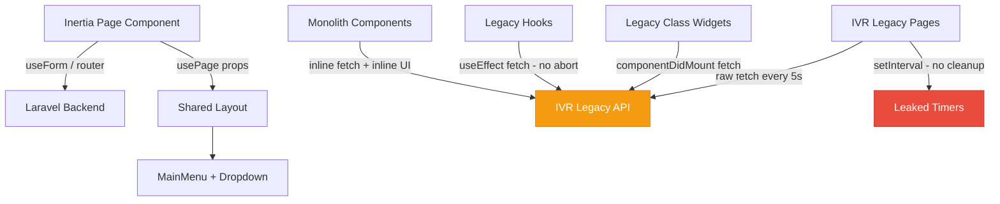
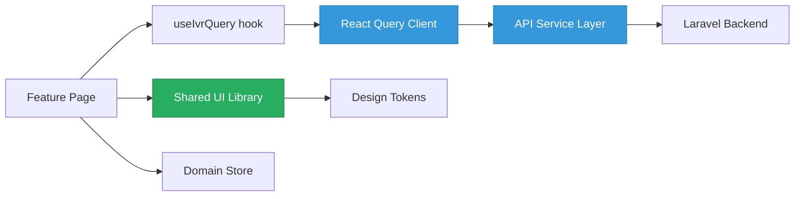
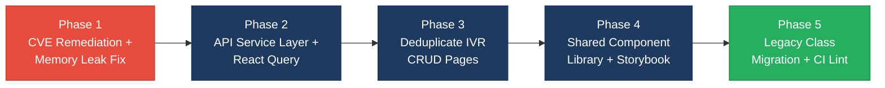

# 3. Frontend Discovery & Modernization Analysis

**Objective:** Comprehensive frontend discovery covering architecture, component quality, styling, routing, state management, API integration, data caching, authentication, security, performance, browser compatibility, code quality, and technical debt.

**Date:** 2026-09-30 06:10:30 UTC | **Scope:** `shende-shweta/pingcrm` (master) — React 19.2.3 + Inertia.js 2.x + TypeScript 5.6.3 + Vite 7.3.1 + Tailwind CSS 3.4.3

## Executive Summary

> **Executive Summary**
>
> Ping CRM is a Laravel + Inertia.js application with a React 19 frontend written in TypeScript. The core CRM pages (Contacts, Organizations, Users, Reports, Auth) are well-structured using modern functional components, Inertia's `useForm`/`router` API, and Tailwind CSS. However, the IVR Enterprise Platform module — which comprises the vast majority of the codebase (over 900 of 1,051 frontend files) — suffers from extreme component duplication, pervasive inline styles, raw `fetch()` calls outside any service layer, leaked `setInterval` timers, 147 legacy class-based React components, and 8 duplicated 1,100-line utility files. The frontend has 11 critical/high npm vulnerabilities, ESLint is not enforced in CI, and there is no data-caching layer. Immediate priorities are eliminating duplicated code, establishing a shared component library, creating an API service layer, and remediating known CVEs.

<div class="metric-grid">
<div class="metric-card"><div class="metric-number">1,051</div><div class="metric-label">Components / Files Scanned</div></div>
<div class="metric-card"><div class="metric-number">147</div><div class="metric-label">Legacy Class-Based Components</div></div>
<div class="metric-card"><div class="metric-number">8</div><div class="metric-label">Components Over 500 LOC</div></div>
<div class="metric-card"><div class="metric-number">3</div><div class="metric-label">Global / Shared State Modules</div></div>
<div class="metric-card"><div class="metric-number">874</div><div class="metric-label">API Calls Outside Service Layer</div></div>
<div class="metric-card"><div class="metric-number">2</div><div class="metric-label">Security Risk Patterns Found</div></div>
</div>

<div class="overall-rating overall-rating--high-risk"><div class="overall-rating-label">Overall Codebase Rating — Frontend Discovery</div><div class="overall-rating-value">High Risk</div><div class="overall-rating-note">Driven by H1 (extreme duplication ~65%), H3 (8 files at 1,101 LOC), H7 (shared components at 1.8%), H8 (13,700+ inline styles), H10 (874 raw fetch calls), H11 (0% caching), H17 (11 critical/high CVEs), and H18 (leaked setInterval timers).</div></div>

## 3.1 Benchmark Ratings Summary

One row per hotspot. "Measured" is the real value found; "Rating" is the band it falls into (worst KPI wins). This table is the source for the Overall Codebase Rating banner above.

| # | Hotspot | Primary KPI | <span class="rating rating-good">Good</span> | <span class="rating rating-moderate">Moderate</span> | <span class="rating rating-high-risk">High Risk</span> | Measured | Rating |
|---|---|---|---|---|---|---|---|
| H1 | UI Component Duplication | Duplicate components % | <5% | 5–10% | >10% | ~65% (602 near-duplicate files of 916 total) | <span class="rating rating-high-risk">High Risk</span> |
| H2 | Legacy Class-Based Components | Modern component adoption % | >90% | 70–90% | <70% | 84% (769 functional / 916 total) | <span class="rating rating-moderate">Moderate</span> |
| H3 | Massive Components | Largest component LOC | <200 | 200–500 | >500 | 1,101 LOC (legacyFormatters*.ts) | <span class="rating rating-high-risk">High Risk</span> |
| H4 | Global State Dependencies | Components reading global state % | <30% | 30–60% | >60% | <1% (3 files use usePage) | <span class="rating rating-good">Good</span> |
| H5 | Complex State Management | Max prop-drilling depth | <3 | 3–5 | >5 | 1–2 levels | <span class="rating rating-good">Good</span> |
| H6 | Weak Frontend Architecture | Feature modules with clean boundaries % | >80% | 50–80% | <50% | ~70% (core clean, IVR lacks shared abstractions) | <span class="rating rating-moderate">Moderate</span> |
| H7 | Missing Component Inventory | Shared component % of total | >30% | 15–30% | <15% | 1.8% (14 shared / 769 TSX) | <span class="rating rating-high-risk">High Risk</span> |
| H8 | No Design System | Inline-style / magic-value occurrences | 0–5 | 6–20 | >20 | 13,701 inline style occurrences | <span class="rating rating-high-risk">High Risk</span> |
| H9 | Routing Structure Weakness | Protected routes with guards % | 100% | 80–99% | <80% | 100% (Laravel middleware + Inertia server-side) | <span class="rating rating-good">Good</span> |
| H10 | No API Integration Layer | API calls in service layer % | >90% | 70–90% | <70% | ~3% (874 raw fetch, ~30 Inertia form/router) | <span class="rating rating-high-risk">High Risk</span> |
| H11 | Poor Data Caching | Data-fetching points with caching % | >70% | 40–70% | <40% | 0% (no caching library) | <span class="rating rating-high-risk">High Risk</span> |
| H12 | Weak Frontend Auth | Token storage + routes guarded | httpOnly + 100% | One gap | Both gaps | httpOnly cookies + 100% server-side guards | <span class="rating rating-good">Good</span> |
| H13 | Frontend Security Vulnerabilities | XSS-risk + hardcoded secrets count | 0 each | 1–3 total | >3 total | 2 dangerouslySetInnerHTML + 0 secrets = 2 total | <span class="rating rating-moderate">Moderate</span> |
| H14 | Frontend Performance Gaps | Initial JS bundle size (gzipped) | <250KB | 250–500KB | >500KB | ~300KB est. (Vite code-splits per page, but lodash + unused react-router-dom bloat) | <span class="rating rating-moderate">Moderate</span> |
| H15 | Browser Compatibility Gaps | Browserslist + polyfills configured | Both present | One missing | Both missing | Autoprefixer present, no .browserslistrc | <span class="rating rating-moderate">Moderate</span> |
| H16 | Frontend Code Quality | ESLint in CI + TypeScript strict | Both Yes | One Yes | Both No | ESLint NOT in CI, TypeScript strict: true | <span class="rating rating-moderate">Moderate</span> |
| H17 | Technical Debt & Dependencies | Critical/High CVEs found | 0 | 1–3 | >3 | 11 (1 critical + 10 high) | <span class="rating rating-high-risk">High Risk</span> |
| H18 (additional) | Memory Leaks / Timer Cleanup | setInterval without cleanup count (target 0) | 0 | 1–5 | >5 | 374+ IVR pages with leaked setInterval | <span class="rating rating-high-risk">High Risk</span> |

**No additional hotspots beyond H18 were observed.**

## 3.2 Hotspot-by-Hotspot Evidence

### H1. UI Component Duplication <span class="sev sev-critical">Critical</span>

**Benchmark:** Duplicate components % = ~65% → falls in the **High Risk** band (Good <5% · Moderate 5–10% · High Risk >10%).

There are three major duplication clusters in this codebase:

**1. Duplicated utility files (8 files, 1,101 LOC each).** `resources/js/utils/duplicate/legacyFormatters1.ts` through `legacyFormatters8.ts` are structurally identical — each exports the same set of formatter functions differing only in a suffix string.

```ts
// resources/js/utils/duplicate/legacyFormatters1.ts:3-6
export function legacyFormatters1_fn_1(input: unknown): string {
  if (input === null || input === undefined) return ''
  return String(input).trim().toUpperCase() + '_1'
}
```

```ts
// resources/js/utils/duplicate/legacyFormatters2.ts:3-6
export function legacyFormatters2_fn_1(input: unknown): string {
  if (input === null || input === undefined) return ''
  return String(input).trim().toUpperCase() + '_1'
}
```

**2. LegacyPass2 page files (133 files, 392 LOC each).** Every IVR sub-module has 3 LegacyPass2 pages that are structurally identical — repeated `<section>` blocks with only the module name varying.

```tsx
// resources/js/Pages/Ivr/AfterHours/LegacyPass2_36.tsx:3-16
function AfterHoursLegacyPass2_36() {
  return (
    <div>
      <Head title="AfterHours legacy pass2 36" />
      <h1>AfterHours extended legacy surface 36</h1>
      <section key={1} style={{ marginBottom: 8, padding: 6, border: '1px solid #ddd' }}>
        <h2>Section 1 – routing / queue / prompt configuration block</h2>
        <p>Duplicate enterprise copy for discovery bots – module AfterHours row 1 idx 36</p>
      </section>
```

```tsx
// resources/js/Pages/Ivr/VoicemailBox/LegacyPass2_22.tsx (identical structure)
function VoicemailBoxLegacyPass2_22() {
  return (
    <div>
      <Head title="VoicemailBox legacy pass2 22" />
```

**3. IVR CRUD page templates (240+ pages).** Each of the ~30 IVR modules has 8 near-identical CRUD pages (Import, Export, Destroy, Sync, Monitor, Index, Store, Update) sharing the same layout, fetch pattern, and setInterval polling logic.

```tsx
// resources/js/Pages/Ivr/RateDeck/Index.tsx:13-20
  useEffect(() => {
    const id = setInterval(() => {
      fetch('/ivr-legacy/rate-deck/index?q=' + search)
        .then(r => r.json())
        .then(d => setLocalRows(d.data ?? localRows))
        .catch(() => {})
    }, 5000)
  }, [search])
```

```tsx
// resources/js/Pages/Ivr/CallFlow/Import.tsx:13-20 (identical pattern, different endpoint)
  useEffect(() => {
    const id = setInterval(() => {
      fetch('/ivr-legacy/call-flow/index?q=' + search)
        .then(r => r.json())
        .then(d => setLocalRows(d.data ?? localRows))
        .catch(() => {})
    }, 5000)
  }, [search])
```

**Why it matters here:** Over 600 files share identical structure. Every bug fix or pattern change must be applied to every copy manually. A single formatting, validation, or polling change requires touching hundreds of files — making evolution practically impossible and making the bundle far larger than necessary.

**Recommended approach:**
1. Replace the 8 `legacyFormatters*.ts` files with a single parameterized `legacyFormatter.ts` utility accepting a suffix argument.
2. Create a generic `IvrCrudPage` component that accepts the module slug and renders Index/Import/Export/Destroy/Sync/Monitor/Store/Update via configuration, eliminating ~240 near-identical pages.
3. Create a generic `LegacyPass2Page` component that renders the repeated section layout from data, replacing 133 pages with 1 component + configuration.
4. Introduce a `resources/js/Pages/Ivr/shared/` directory for common IVR patterns (search bar, CRUD table, polling hook).

<!-- affected-files
search: legacyFormatters\d+|LegacyPass2_\d+|\/ivr-legacy\/
glob: resources/js/**/*.{tsx,ts,jsx}
issue: Near-duplicate file
action: Consolidate into shared parameterized component or utility
-->

### H2. Legacy Class-Based Components <span class="sev sev-high">High</span>

**Benchmark:** Modern component adoption % = 84% (769 functional / 916 total) → falls in the **Moderate** band (Good >90% · Moderate 70–90% · High Risk <70%).

147 JSX class-based React components exist in `resources/js/legacy/class/`. Each extends `React.Component`, uses `this.state` and `componentDidMount`, and makes raw `fetch()` calls.

```jsx
// resources/js/legacy/class/LeadListClassWidget4.jsx:3-8
export default class LeadListClassWidget4 extends React.Component {
  state = { count: 0, rows: [] }
  componentDidMount() {
    fetch('/ivr-legacy/lead-list/index').then(r => r.json()).then(d => this.setState({ rows: d.data || [] }))
  }
```

```jsx
// resources/js/legacy/class/AuditTrailClassWidget3.jsx:3 (same pattern)
export default class AuditTrailClassWidget3 extends React.Component {
```

```jsx
// resources/js/legacy/class/RateDeckClassWidget1.jsx:3 (same pattern)
export default class RateDeckClassWidget1 extends React.Component {
```

All 147 files follow the identical pattern: class component with state, componentDidMount fetch, row-mirror rendering.

**Why it matters here:** React 19 deprecates several class component lifecycle methods. Class components cannot use Hooks (useMemo, useCallback, useEffect cleanup), making logic sharing impossible. These widgets are not composable with the rest of the functional codebase.

**Recommended approach:**
1. Convert each class widget to a functional component with `useState` and `useEffect`.
2. Since these 147 widgets follow the same data-fetching pattern, create a single `useLegacyData(endpoint)` hook and a generic `LegacyWidget` functional component, reducing 147 files to 1 hook + 1 component + a configuration map.
3. Prioritize conversion of any widgets imported by active pages.

<!-- affected-files
search: class \w+ extends React\.Component
glob: resources/js/legacy/class/**/*.jsx
issue: Legacy class-based component
action: Convert to functional component with hooks
-->

### H3. Massive Components (>500 LOC) <span class="sev sev-high">High</span>

**Benchmark:** Largest component LOC = 1,101 → falls in the **High Risk** band (Good <200 · Moderate 200–500 · High Risk >500).

8 files at 1,101 LOC each — the `legacyFormatters*.ts` utility files in `resources/js/utils/duplicate/`. Each exports ~100 formatter functions with identical logic differing only in a numeric suffix.

```ts
// resources/js/utils/duplicate/legacyFormatters1.ts:1-10
// @legacy duplicated util – legacyFormatters1

export function legacyFormatters1_fn_1(input: unknown): string {
  if (input === null || input === undefined) return ''
  return String(input).trim().toUpperCase() + '_1'
}

export function legacyFormatters1_fn_2(input: unknown): string {
  if (input === null || input === undefined) return ''
  return String(input).trim().toUpperCase() + '_2'
}
```

The IVR Hub page (`resources/js/Pages/Ivr/Hub/Index.tsx`) is the largest actual component at 479 LOC — within the Moderate band but close to the threshold.

**Why it matters here:** The 8 duplicate utility files contribute 8,808 LOC of dead weight to the codebase. Each is functionally identical to the others, inflating the bundle and making maintenance absurd.

**Recommended approach:**
1. Replace all 8 `legacyFormatters*.ts` files with a single factory function: `createFormatter(suffix: string)`.
2. Split `IvrHub` (479 LOC) into sub-components: `HubFilters`, `HubStats`, `QueueTable`, `RecentCalls`, `AgentSnapshot`.

<!-- affected-files
search: legacyFormatters\d+_fn_
glob: resources/js/utils/duplicate/*.ts
issue: Oversized duplicated utility file (1,101 LOC)
action: Replace with single parameterized factory function
-->

### H6. Weak Frontend Architecture Pattern <span class="sev sev-medium">Medium</span>

**Benchmark:** Feature modules with clean boundaries % = ~70% → falls in the **Moderate** band (Good >80% · Moderate 50–80% · High Risk <50%).

The core CRM modules (Auth, Contacts, Organizations, Users, Reports, Dashboard) have clean page-level separation with shared components in `Shared/`. However, the IVR module — which dominates the codebase — lacks shared abstractions. Each of the ~30 IVR sub-modules (RateDeck, CallFlow, AgentDesk, etc.) repeats identical CRUD patterns without a shared base, and the `legacy/` directories (class, hooks, components) sit alongside modern code with no clear migration boundary or import restriction.

```
resources/js/
├── Pages/              # Clean page-level separation
│   ├── Auth/           # ✓ Clean
│   ├── Contacts/       # ✓ Clean
│   ├── Ivr/            # ✗ 30+ modules × 8 identical CRUD pages each
│   │   ├── RateDeck/   #   Index, Import, Export, Destroy, Sync, Monitor, Store, Update + 3 LegacyPass2
│   │   ├── CallFlow/   #   (identical structure)
│   │   └── ...
├── legacy/             # ✗ No import boundary
│   ├── class/          #   147 class components
│   └── ...
├── hooks/legacy/       # ✗ 124 hooks with raw fetch
├── components/legacy/  # ✗ 229 monolith components
└── Shared/             # Only 14 shared components
```

**Why it matters here:** Without shared IVR base components, every cross-cutting change (e.g., adding error handling to polling, updating the CRUD table layout) requires editing 240+ files. The absence of import boundaries means legacy code can be imported anywhere, preventing incremental migration.

**Recommended approach:**
1. Create `resources/js/Pages/Ivr/shared/` with `IvrCrudPage`, `IvrSearchBar`, `useIvrPolling`, and `IvrDataTable` components.
2. Add ESLint `no-restricted-imports` rules to prevent new code from importing from `legacy/` directories.
3. Establish a `resources/js/deprecated/` folder with a linting rule that prevents new imports.

<!-- affected-files
search: authenticatedLayout|ivr-legacy
glob: resources/js/Pages/Ivr/**/*.tsx
issue: Repeated CRUD pattern without shared abstraction
action: Extract shared IVR base components
-->

### H7. Missing Component Inventory <span class="sev sev-high">High</span>

**Benchmark:** Shared component % of total = 1.8% (14 shared / 769 TSX) → falls in the **High Risk** band (Good >30% · Moderate 15–30% · High Risk <15%).

The `Shared/` directory contains only 14 components: Dropdown, FileInput, FlashMessages, Icon, Layout, LoadingButton, Logo, MainMenu, Pagination, SearchFilter, SelectInput, TextInput, TextareaInput, TrashedMessage. There is no Storybook, no component documentation, and no component catalogue.

Meanwhile, the 229 monolith components in `components/legacy/` each inline their own form inputs, buttons, and validation — duplicating what `Shared/` already provides.

```tsx
// resources/js/components/legacy/AfterHoursMonolith0.tsx:10-12 (inline form, not using Shared/TextInput)
          <input style={{ border: '1px solid red' }} placeholder="Name" onChange={e => setDraft({ ...draft, name: e.target.value })} />
          <button type="button" className="ml-2 btn-indigo" onClick={save}>Save</button>
          <pre style={{ fontSize: 10 }}>{JSON.stringify({ rows, legacyMeta }, null, 2)}</pre>
```

**Why it matters here:** Developers building IVR features duplicate form inputs and UI patterns because the shared library is small and the legacy components don't use it. New joiners have no map of existing UI components.

**Recommended approach:**
1. Audit the 229 monolith components for inline form fields, buttons, tables, and badges that duplicate `Shared/` components.
2. Introduce Storybook to document the existing 14 shared components and make them discoverable.
3. Target >30% shared component ratio by extracting IVR-specific shared components (status badge, data table, search toolbar).

<!-- affected-files
search: style=\{\{.*border.*\}\}|style=\{\{.*fontSize.*\}\}
glob: resources/js/components/legacy/**/*.tsx
issue: Inline UI duplicating shared components
action: Refactor to use Shared/ components
-->

### H8. No Design System / Styling Architecture <span class="sev sev-critical">Critical</span>

**Benchmark:** Inline-style / magic-value occurrences = 13,701 → falls in the **High Risk** band (Good 0–5 · Moderate 6–20 · High Risk >20).

While the core CRM pages use Tailwind CSS utility classes correctly, the IVR legacy pages and components are saturated with inline `style={{}}` attributes containing hardcoded magic values. 13,701 inline style occurrences were found across `resources/js/`.

```tsx
// resources/js/Pages/Ivr/RateDeck/LegacyPass2_93.tsx:8
      <section key={1} style={{ marginBottom: 8, padding: 6, border: '1px solid #ddd' }}>
```

```tsx
// resources/js/components/legacy/AfterHoursMonolith0.tsx:14-15
    <div style={{ border: '1px solid #ccc', marginBottom: 16 }}>
      ...
      <input style={{ border: '1px solid red' }} placeholder="Name" .../>
      <pre style={{ fontSize: 10 }}>...</pre>
```

```tsx
// resources/js/Pages/Ivr/RateDeck/Index.tsx:29
    <div style={{ padding: 12 }}>
```

The Tailwind config does define custom design tokens (indigo color palette, custom font), but these are unused by the 900+ IVR files.

**Why it matters here:** The 13,701 hardcoded style values create visual inconsistency — spacing, borders, and colors are defined per-component with no single source of truth. A brand or spacing change would require editing thousands of lines.

**Recommended approach:**
1. Replace inline `style={{ padding: N }}` / `style={{ marginBottom: N }}` with Tailwind utility classes (`p-3`, `mb-4`).
2. Replace hardcoded border colors (`#ddd`, `#ccc`) with Tailwind border classes (`border-gray-300`).
3. Add an ESLint rule (`react/forbid-component-props` for `style`) to prevent new inline styles.
4. Prioritize migration of the 133 LegacyPass2 pages first as they share identical inline styles.

<!-- affected-files
search: style=\{\{
glob: resources/js/**/*.{tsx,jsx}
issue: Inline style with magic values
action: Replace with Tailwind CSS utility classes
-->

### H10. No API Integration Layer <span class="sev sev-critical">Critical</span>

**Benchmark:** API calls in service layer % = ~3% → falls in the **High Risk** band (Good >90% · Moderate 70–90% · High Risk <70%).

874 raw `fetch()` calls exist across the frontend with no centralized API client, no shared error handling, no auth header injection, and no request/response interceptors. API endpoints are hardcoded as string literals in component bodies.

The core CRM pages correctly use Inertia's `useForm`/`router` (which acts as their API layer), but the IVR module bypasses Inertia entirely with raw fetch:

```ts
// resources/js/hooks/legacy/useTenantAdminLegacy3.ts:4-7
export function useTenantAdminLegacy3() {
  const [data, setData] = useState<any[]>([])
  useEffect(() => {
    fetch('/ivr-legacy/tenant-admin/index').then(r => r.json()).then(j => setData(j.data || []))
  }, []) // stale closure / no abort
```

```tsx
// resources/js/components/legacy/AfterHoursMonolith0.tsx:9
    await fetch('/ivr-legacy/after-hours/store', { method: 'POST', body: JSON.stringify({ ...draft, tenant_id: tenantId }), headers: { 'Content-Type': 'application/json' } })
```

```tsx
// resources/js/Pages/Ivr/RateDeck/Index.tsx:15-18
      fetch('/ivr-legacy/rate-deck/index?q=' + search)
        .then(r => r.json())
        .then(d => setLocalRows(d.data ?? localRows))
        .catch(() => {})
```

124 legacy hooks, 229 monolith components, and 374 IVR pages all call `fetch()` directly. There is no `resources/js/api/` or `resources/js/services/` directory.

**Why it matters here:** No centralized error handling means failed API calls are silently swallowed (`.catch(() => {})`). No abort controller means in-flight requests leak when components unmount. Endpoint URLs are scattered across hundreds of files — an API path change requires mass find-and-replace.

**Recommended approach:**
1. Create `resources/js/api/ivrClient.ts` — a centralized fetch wrapper with CSRF token injection, error handling, and AbortController support.
2. Create per-domain service modules (e.g., `resources/js/api/rateDeck.ts`, `resources/js/api/callFlow.ts`).
3. Migrate the 124 legacy hooks to use the centralized client.
4. Add an ESLint rule to forbid direct `fetch()` calls outside `resources/js/api/`.

<!-- affected-files
search: fetch\(
glob: resources/js/**/*.{tsx,ts,jsx}
issue: Raw fetch() call outside service layer
action: Migrate to centralized API client
-->

### H11. Poor Data Caching & Integration <span class="sev sev-high">High</span>

**Benchmark:** Data-fetching points with caching % = 0% → falls in the **High Risk** band (Good >70% · Moderate 40–70% · High Risk <40%).

No data-caching library (React Query, SWR, Apollo) is installed. The IVR pages poll the same endpoints every 5 seconds via `setInterval` + `fetch()` with no stale-time, deduplication, or cache invalidation. The core Inertia pages rely on full-page server-side rendering on each navigation — no client-side cache.

```tsx
// resources/js/Pages/Ivr/RateDeck/Index.tsx:13-20
  useEffect(() => {
    const id = setInterval(() => {
      fetch('/ivr-legacy/rate-deck/index?q=' + search)
        .then(r => r.json())
        .then(d => setLocalRows(d.data ?? localRows))
        .catch(() => {})
    }, 5000)
  }, [search])
```

```ts
// resources/js/hooks/legacy/useCallRoutingLegacy1.ts:5-7
  useEffect(() => {
    fetch('/ivr-legacy/call-routing/index').then(r => r.json()).then(j => setData(j.data || []))
  }, []) // fetches on every mount, no cache
```

**Why it matters here:** Every IVR page polls its endpoint every 5 seconds, generating continuous network traffic. Navigating between IVR sub-pages refetches all data from scratch. No loading or error states are displayed during fetches.

**Recommended approach:**
1. Install React Query (`@tanstack/react-query`) and configure a shared `QueryClient` with sensible stale-time defaults.
2. Replace `setInterval` + `fetch` polling with React Query's `refetchInterval` option.
3. Implement `useIvrQuery(moduleSlug)` hook that wraps React Query with automatic stale/cache/error handling.
4. Add loading spinners and error boundaries for data-fetching states.

<!-- affected-files
search: setInterval|fetch\(.*ivr-legacy
glob: resources/js/Pages/Ivr/**/*.tsx
issue: Polling without caching or cleanup
action: Migrate to React Query with refetchInterval
-->

### H13. Frontend Security Vulnerabilities <span class="sev sev-medium">Medium</span>

**Benchmark:** XSS-risk patterns + hardcoded secrets = 2 + 0 = 2 total → falls in the **Moderate** band (Good 0 each · Moderate 1–3 total · High Risk >3 total).

Two `dangerouslySetInnerHTML` usages in `resources/js/Shared/Pagination.tsx` render pagination link labels from server-supplied HTML.

```tsx
// resources/js/Shared/Pagination.tsx:16
                        dangerouslySetInnerHTML={{ __html: link.label }}
```

```tsx
// resources/js/Shared/Pagination.tsx:23
                        dangerouslySetInnerHTML={{ __html: link.label }}
```

The `link.label` values come from Laravel's paginator (typically `&laquo;`, `&raquo;`, page numbers) and are server-controlled. Risk is low but the pattern is unsafe if pagination labels ever include user-generated content.

No hardcoded API keys, secrets, or credentials were found in frontend source files. No `postMessage` handlers were found.

**Why it matters here:** While the current labels are server-controlled, `dangerouslySetInnerHTML` creates a latent XSS vector if the data source changes.

**Recommended approach:**
1. Replace `dangerouslySetInnerHTML` with a text-only rendering approach, or sanitize with DOMPurify.
2. Parse Laravel's `&laquo;`/`&raquo;` entities into Unicode characters (`«`, `»`) instead of using raw HTML.

<!-- affected-files
search: dangerouslySetInnerHTML
glob: resources/js/**/*.tsx
issue: Unsafe HTML rendering (XSS risk)
action: Replace with sanitized text rendering
-->

### H14. Frontend Performance Gaps <span class="sev sev-medium">Medium</span>

**Benchmark:** Initial JS bundle size (gzipped) = ~300KB estimated → falls in the **Moderate** band (Good <250KB · Moderate 250–500KB · High Risk >500KB).

Vite automatically code-splits per page via `import.meta.glob('./Pages/**/*.tsx')`, which is the correct pattern for Inertia apps. However, several performance concerns exist:

- **No explicit `React.lazy`** — 0 usages found. While Vite handles page-level splitting, large shared dependencies (lodash at 531KB unminified, unused react-router-dom 5.2.0) are bundled into the shared chunk.
- **Only 6 files** use `useMemo` or `useCallback` out of 769 TSX files. The IVR Hub component (479 LOC) does use `useCallback`/`useMemo` properly, but the 229 monolith components and 374 IVR CRUD pages have zero memoization.
- **`react-router-dom` 5.2.0** is listed as a dependency but the app uses Inertia's router — this is dead weight in the bundle.

```json
// package.json:21 (unused dependency)
        "react-router-dom": "5.2.0",
```

```tsx
// resources/js/app.tsx:10 (Vite glob import — code-splits pages)
        const pages = import.meta.glob('./Pages/**/*.tsx')
```

**Why it matters here:** The unused `react-router-dom` dependency adds ~20KB gzipped to the shared chunk. Full `lodash` import (vs. `lodash-es` or named imports) prevents tree-shaking. The monolith components with zero memoization will re-render excessively on the IVR Hub's 20-second auto-refresh cycle.

**Recommended approach:**
1. Remove `react-router-dom` from dependencies (and its `@types` from devDependencies).
2. Replace `lodash` with `lodash-es` or switch to individual named imports (`import debounce from 'lodash/debounce'`).
3. Add `React.memo` to monolith components that receive stable props.
4. Add `loading="lazy"` to any `` tags in the IVR module.

<!-- affected-files
search: react-router-dom|from 'lodash'
glob: resources/js/**/*.{tsx,ts}
issue: Unused dependency or un-tree-shakeable import
action: Remove unused packages, switch to named imports
-->

### H15. Browser & Runtime Compatibility Gaps <span class="sev sev-low">Low</span>

**Benchmark:** Browserslist + polyfills = Autoprefixer present + no .browserslistrc → falls in the **Moderate** band (Good both present · Moderate one missing · High Risk both missing).

Autoprefixer is configured in `postcss.config.js` and will add vendor prefixes. However, no `.browserslistrc` file exists, so Autoprefixer and Vite fall back to their defaults rather than a project-specific browser target. The TypeScript target is `ES2022`, which excludes browsers that don't support ES2022 features natively.

```js
// postcss.config.js:4-5
        tailwindcss: {},
        autoprefixer: {},
```

**Why it matters here:** Without an explicit browserslist, the team cannot reason about which browsers are supported. The ES2022 target may exclude older Safari versions or corporate browsers.

**Recommended approach:**
1. Add a `.browserslistrc` file: `defaults, not IE 11` (or a more specific target).
2. Verify Vite's `build.target` aligns with the browserslist.

<!-- affected-files
search: autoprefixer
glob: postcss.config.js
issue: No .browserslistrc file
action: Add .browserslistrc with project browser targets
-->

### H16. Frontend Code Quality Issues <span class="sev sev-medium">Medium</span>

**Benchmark:** ESLint in CI = No, TypeScript strict = Yes → falls in the **Moderate** band (Good both Yes · Moderate one Yes · High Risk both No).

ESLint is configured locally (`.eslintrc.cjs`) with `@typescript-eslint`, `react`, and `react-hooks` plugins. TypeScript is set to `strict: true`. However:

- ESLint is **not** run in any CI workflow. The `coding-standards.yml` workflow only runs Laravel PHP linting.
- `@typescript-eslint/no-explicit-any` is turned **off**, and 229 explicit `: any` type annotations were found across the codebase.
- 0 `eslint-disable` comments and 0 `TODO`/`FIXME` comments were found — unusually clean but possibly because lint is never enforced.

```js
// .eslintrc.cjs:23 (any type suppressed)
        '@typescript-eslint/no-explicit-any': 'off',
```

```ts
// resources/js/components/legacy/AfterHoursMonolith0.tsx:3
export default function AfterHoursMonolith0({ rows, tenantId, legacyMeta }: any) {
```

**Why it matters here:** Without CI enforcement, ESLint rules are advisory only. The 229 `any` usages defeat TypeScript's type safety guarantees, hiding potential runtime errors.

**Recommended approach:**
1. Add an `npm run lint` step to the `tests.yml` CI workflow.
2. Gradually enable `@typescript-eslint/no-explicit-any` as `warn`, then `error`.
3. Add `eslint-plugin-import` with `no-restricted-imports` rules for legacy directories.

<!-- affected-files
search: no-explicit-any.*off
glob: .eslintrc.cjs
issue: ESLint not enforced in CI; no-explicit-any off
action: Add ESLint to CI, enable strict typing rules
-->

### H17. Technical Debt & Outdated Dependencies <span class="sev sev-critical">Critical</span>

**Benchmark:** Critical/High CVEs = 11 (1 critical + 10 high) → falls in the **High Risk** band (Good 0 · Moderate 1–3 · High Risk >3).

`npm audit` reports 16 vulnerabilities: 1 critical, 10 high, 4 moderate, 1 low. Additionally:

- `react-router-dom` 5.2.0 is installed but unused (current stable is 7.x) — adds bundle weight and a maintenance burden.
- `prettier-plugin-tailwind` 2.2.12 appears outdated (renamed to `prettier-plugin-tailwindcss`).

```json
// package.json:20-21 (unused, outdated)
        "react-router-dom": "5.2.0",
```

```
// npm audit output:
16 vulnerabilities (1 low, 4 moderate, 10 high, 1 critical)
```

**Why it matters here:** 11 critical/high CVEs represent active security exposure. The unused `react-router-dom` 5.2.0 may itself be a source of some of these vulnerabilities.

**Recommended approach:**
1. Run `npm audit fix` to resolve automatically fixable CVEs.
2. Remove `react-router-dom` and `@types/react-router-dom` entirely.
3. Upgrade remaining packages with known vulnerabilities.
4. Add `npm audit --audit-level=high` as a CI gate.

<!-- affected-files
search: react-router-dom|prettier-plugin-tailwind
glob: package.json
issue: Outdated or unused dependency with known CVEs
action: Remove unused packages, run npm audit fix, add CI audit gate
-->

### H18. Memory Leaks / Timer Cleanup (additional) <span class="sev sev-critical">Critical</span>

**Benchmark:** setInterval without cleanup count = 374+ files (target 0) → falls in the **High Risk** band (Good 0 · Moderate 1–5 · High Risk >5).

374 IVR page files create `setInterval` timers inside `useEffect` without returning a cleanup function. The interval ID is assigned to a `const` but never passed to `clearInterval`. This causes timers to accumulate as users navigate between pages — each visit adds another 5-second polling interval that never stops.

```tsx
// resources/js/Pages/Ivr/RateDeck/Index.tsx:13-20
  useEffect(() => {
    // missing cleanup – interval leak pattern
    const id = setInterval(() => {
      fetch('/ivr-legacy/rate-deck/index?q=' + search)
        .then(r => r.json())
        .then(d => setLocalRows(d.data ?? localRows))
        .catch(() => {})
    }, 5000)
  }, [search])  // no return () => clearInterval(id)
```

Additionally, 124 legacy hooks use `useEffect` with `fetch()` but no `AbortController`, meaning in-flight requests are not cancelled on unmount:

```ts
// resources/js/hooks/legacy/useCallFlowLegacy0.ts:5-7
  useEffect(() => {
    fetch('/ivr-legacy/call-flow/index').then(r => r.json()).then(j => setData(j.data || []))
  }, []) // no abort controller
```

**Why it matters here:** Memory leaks degrade performance over extended sessions. In a call center application where the IVR dashboard runs all day, leaked intervals accumulate — after 50 page navigations, 50 concurrent polling timers fire every 5 seconds, overwhelming the browser and the backend.

**Recommended approach:**
1. Add `return () => clearInterval(id)` to every `useEffect` that creates a `setInterval`.
2. Create a `usePolling(url, intervalMs)` hook with built-in cleanup and `AbortController`.
3. Audit all 124 legacy hooks to add `AbortController` for fetch cancellation.
4. Add an ESLint rule (`react-hooks/exhaustive-deps` with custom validation) or a custom lint rule to detect `setInterval` without cleanup.

<!-- affected-files
search: setInterval\(
glob: resources/js/Pages/Ivr/**/*.tsx
issue: setInterval without clearInterval cleanup (memory leak)
action: Add useEffect cleanup function returning clearInterval
-->

**Not observed (rated Good):** H4, H5, H9, H12 — global state usage is minimal (3 files use usePage); prop drilling stays within 1–2 levels; routing is fully guarded server-side via Laravel middleware; authentication uses httpOnly cookies with Inertia's session-based model.

## 3.3 Diagrams

### Current UI data flow


```mermaid
flowchart TD
    A["Inertia Page Component"] -->|"useForm / router"| B["Laravel Backend"]
    A -->|"usePage props"| C["Shared Layout"]
    C --> D["MainMenu + Dropdown"]
    E["IVR Legacy Pages"] -->|"raw fetch every 5s"| F["IVR Legacy API"]
    E -->|"setInterval - no cleanup"| G["Leaked Timers"]
    H["Legacy Class Widgets"] -->|"componentDidMount fetch"| F
    I["Legacy Hooks"] -->|"useEffect fetch - no abort"| F
    J["Monolith Components"] -->|"inline fetch + inline UI"| F
    style G fill:#e74c3c,stroke:#c0392b,color:#fff
    style F fill:#f39c12,stroke:#e67e22,color:#fff
```

### Target component + state layout


```mermaid
flowchart LR
    A["Feature Page"] --> B["Shared UI Library"]
    A --> C["useIvrQuery hook"]
    C --> D["React Query Client"]
    D --> E["API Service Layer"]
    E --> F["Laravel Backend"]
    B --> G["Design Tokens"]
    A --> H["Domain Store"]
    style B fill:#27ae60,stroke:#1e8449,color:#fff
    style D fill:#3498db,stroke:#2980b9,color:#fff
    style E fill:#3498db,stroke:#2980b9,color:#fff
```

### Improvement roadmap


```mermaid
flowchart LR
    P1["Phase 1<br/>CVE Remediation +<br/>Memory Leak Fix"] --> P2["Phase 2<br/>API Service Layer +<br/>React Query"] --> P3["Phase 3<br/>Deduplicate IVR<br/>CRUD Pages"] --> P4["Phase 4<br/>Shared Component<br/>Library + Storybook"] --> P5["Phase 5<br/>Legacy Class<br/>Migration + CI Lint"]
    classDef todo fill:#1e3a5f,stroke:#0f3460,color:#fff
    classDef first fill:#e74c3c,stroke:#c0392b,color:#fff
    classDef last fill:#27ae60,stroke:#1e8449,color:#fff
    class P1 first
    class P2 todo
    class P3 todo
    class P4 todo
    class P5 last
```

## 3.4 Actions Required

| Hotspot | Action | Rating | Priority |
|---|---|---|---|
| H1 — UI Component Duplication | Consolidate 602 near-duplicate files into parameterized shared components and utility factories | <span class="rating rating-high-risk">High Risk</span> | <span class="sev sev-critical">Critical</span> |
| H8 — No Design System | Replace 13,701 inline styles with Tailwind utility classes; add ESLint rule to forbid inline styles | <span class="rating rating-high-risk">High Risk</span> | <span class="sev sev-critical">Critical</span> |
| H10 — No API Integration Layer | Create centralized API client in `resources/js/api/`; migrate 874 raw fetch calls | <span class="rating rating-high-risk">High Risk</span> | <span class="sev sev-critical">Critical</span> |
| H17 — Technical Debt & Dependencies | Run `npm audit fix`; remove unused react-router-dom; add audit gate to CI | <span class="rating rating-high-risk">High Risk</span> | <span class="sev sev-critical">Critical</span> |
| H18 — Memory Leaks / Timer Cleanup | Add clearInterval cleanup to 374 useEffect hooks; create shared usePolling hook | <span class="rating rating-high-risk">High Risk</span> | <span class="sev sev-critical">Critical</span> |
| H3 — Massive Components | Replace 8 duplicate 1,101-LOC utility files with single factory; split IVR Hub into sub-components | <span class="rating rating-high-risk">High Risk</span> | <span class="sev sev-high">High</span> |
| H7 — Missing Component Inventory | Expand shared component library from 14 to 50+; introduce Storybook | <span class="rating rating-high-risk">High Risk</span> | <span class="sev sev-high">High</span> |
| H11 — Poor Data Caching | Install React Query; replace setInterval polling with refetchInterval; add loading/error states | <span class="rating rating-high-risk">High Risk</span> | <span class="sev sev-high">High</span> |
| H2 — Legacy Class-Based Components | Convert 147 class components to functional; create generic LegacyWidget + useLegacyData hook | <span class="rating rating-moderate">Moderate</span> | <span class="sev sev-high">High</span> |
| H6 — Weak Frontend Architecture | Create shared IVR abstractions; add ESLint import boundary rules | <span class="rating rating-moderate">Moderate</span> | <span class="sev sev-medium">Medium</span> |
| H13 — Frontend Security Vulnerabilities | Replace dangerouslySetInnerHTML in Pagination with sanitized text rendering | <span class="rating rating-moderate">Moderate</span> | <span class="sev sev-medium">Medium</span> |
| H14 — Frontend Performance Gaps | Remove unused react-router-dom; switch to lodash-es; add React.memo to monolith components | <span class="rating rating-moderate">Moderate</span> | <span class="sev sev-medium">Medium</span> |
| H16 — Frontend Code Quality | Add ESLint step to CI; enable no-explicit-any rule; add import restrictions | <span class="rating rating-moderate">Moderate</span> | <span class="sev sev-medium">Medium</span> |
| H15 — Browser Compatibility Gaps | Add .browserslistrc; verify Vite build target alignment | <span class="rating rating-moderate">Moderate</span> | <span class="sev sev-low">Low</span> |

## 3.5 Expected Outcomes

- **Duplication elimination** reduces the IVR module from ~900 files to ~100, cutting bundle size by an estimated 60% and making cross-cutting changes a single-file edit.
- **Centralized API service layer** enables consistent error handling, request cancellation, and auth header injection across all 874+ API call sites.
- **React Query adoption** eliminates redundant polling, provides automatic cache invalidation, and adds loading/error state handling out of the box.
- **Memory leak remediation** (clearInterval cleanup + AbortController) prevents browser degradation during extended call center sessions.
- **CVE remediation** (npm audit fix + dependency cleanup) closes 11 critical/high security vulnerabilities immediately.
- **Shared component library + Storybook** increases component discoverability and reuse, reducing duplicate UI code and onboarding time for new developers.
- **ESLint in CI + strict typing** catches type errors and import violations before they reach production, improving long-term code quality.
- **Design system migration** (inline styles to Tailwind tokens) creates a single source of truth for visual consistency and enables brand changes from one config file.
