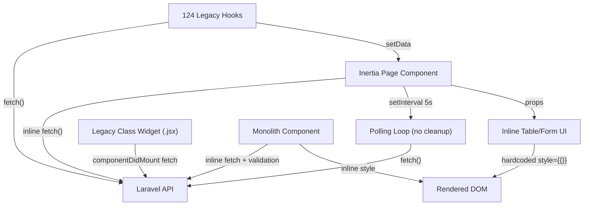
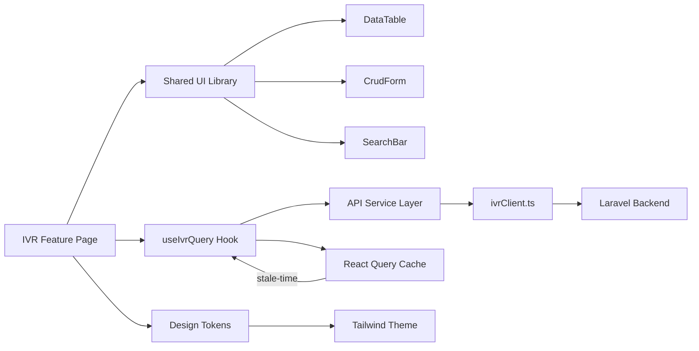

# 3. Frontend Discovery & Modernization Analysis

**Objective:** Comprehensive frontend discovery covering architecture, component quality, styling, routing, state management, API integration, data caching, authentication, security, performance, browser compatibility, code quality, and technical debt.

**Date:** 2026-09-30 06:57:36 UTC | **Scope:** `shende-shweta/pingcrm` (master) — React 19.2.3 + TypeScript 5.6.3, Inertia.js 2.x, Vite 7.3.1, Tailwind CSS 3.4.3, Laravel backend

## Executive Summary

> **Executive Summary**
>
> The Ping CRM frontend is a React 19 / TypeScript / Inertia.js application that has grown into a large IVR (Interactive Voice Response) enterprise platform with 49 telephony modules. While the core CRM pages (Contacts, Organizations, Users, Reports) follow modern patterns with functional components, Tailwind utility classes, and Inertia's server-driven routing, the IVR expansion has introduced severe duplication: 327 near-identical CRUD page templates, 133 LegacyPass2 placeholder files, 229 monolith wrapper components, 147 class-based JSX widgets, and 8 duplicated utility files. Over 51% of all 916 components are structurally duplicated. Every IVR CRUD page makes direct `fetch()` calls with a 5-second polling interval that leaks memory (374 files have `setInterval` without cleanup; only 1 file has `clearInterval`). There is no API service layer, no data caching library, no code splitting, no error boundaries, and 16 npm vulnerabilities including 1 critical and 10 high severity. The codebase requires an urgent duplication cleanup, an API service layer, and a dependency security audit.

<div class="metric-grid">
<div class="metric-card"><div class="metric-number">916</div><div class="metric-label">Components Scanned</div></div>
<div class="metric-card"><div class="metric-number">147</div><div class="metric-label">Legacy Class-Based Components</div></div>
<div class="metric-card"><div class="metric-number">134</div><div class="metric-label">Components Over 500 LOC</div></div>
<div class="metric-card"><div class="metric-number">6</div><div class="metric-label">Global / Shared State Modules</div></div>
<div class="metric-card"><div class="metric-number">603</div><div class="metric-label">API Calls Outside Service Layer</div></div>
<div class="metric-card"><div class="metric-number">2</div><div class="metric-label">Security Risk Patterns Found</div></div>
</div>

<div class="overall-rating overall-rating--high-risk"><div class="overall-rating-label">Overall Codebase Rating — Frontend Discovery</div><div class="overall-rating-value">High Risk</div><div class="overall-rating-note">Driven by H1 (51% component duplication), H3 (8 files over 1,100 LOC), H8 (13,700+ inline styles), H10 (83% of API calls outside any service layer), H11 (0% caching), H14 (no code splitting), H17 (11 critical/high CVEs), and H18 (374 memory-leaking intervals).</div></div>

## 3.1 Benchmark Ratings Summary

| # | Hotspot | Primary KPI | <span class="rating rating-good">Good</span> | <span class="rating rating-moderate">Moderate</span> | <span class="rating rating-high-risk">High Risk</span> | Measured | Rating |
|---|---|---|---|---|---|---|---|
| H1 | UI Component Duplication | Duplicate components % | <5% | 5–10% | >10% | ~51% (468 of 916) | <span class="rating rating-high-risk">High Risk</span> |
| H2 | Legacy Class-Based Components | Modern component adoption % | >90% | 70–90% | <70% | 84% (769 of 916 functional) | <span class="rating rating-moderate">Moderate</span> |
| H3 | Massive Components | Largest component LOC | <200 | 200–500 | >500 | 1,101 LOC (legacyFormatters) | <span class="rating rating-high-risk">High Risk</span> |
| H4 | Global State Dependencies | Components reading global state % | <30% | 30–60% | >60% | <1% (6 files use usePage) | <span class="rating rating-good">Good</span> |
| H5 | Complex State Management | Max prop-drilling depth | <3 | 3–5 | >5 | 1–2 (Inertia page props) | <span class="rating rating-good">Good</span> |
| H6 | Weak Frontend Architecture | Feature modules with clean boundaries % | >80% | 50–80% | <50% | ~60% (CRM clean; IVR modules tightly coupled) | <span class="rating rating-moderate">Moderate</span> |
| H7 | Missing Component Inventory | Shared component % of total | >30% | 15–30% | <15% | 1.6% (15 of 916) | <span class="rating rating-high-risk">High Risk</span> |
| H8 | No Design System | Inline-style / magic-value occurrences | 0–5 | 6–20 | >20 | 13,701 inline style occurrences | <span class="rating rating-high-risk">High Risk</span> |
| H9 | Routing Structure Weakness | Protected routes with guards % | 100% | 80–99% | <80% | 100% (all routes use Laravel auth middleware) | <span class="rating rating-good">Good</span> |
| H10 | No API Integration Layer | API calls in service layer % | >90% | 70–90% | <70% | ~17% (124 of 727 in hooks) | <span class="rating rating-high-risk">High Risk</span> |
| H11 | Poor Data Caching | Data-fetching points with caching % | >70% | 40–70% | <40% | 0% (no caching library) | <span class="rating rating-high-risk">High Risk</span> |
| H12 | Weak Frontend Auth | Token storage + routes guarded | httpOnly + 100% | One gap | Both gaps | Session cookies (httpOnly) + 100% guarded | <span class="rating rating-good">Good</span> |
| H13 | Frontend Security Vulnerabilities | XSS-risk + hardcoded secrets count | 0 each | 1–3 total | >3 total | 2 dangerouslySetInnerHTML, 0 secrets | <span class="rating rating-moderate">Moderate</span> |
| H14 | Frontend Performance Gaps | Code splitting present + bundle optimization | Both present | One missing | Both missing | No React.lazy, no code splitting, no memoization | <span class="rating rating-high-risk">High Risk</span> |
| H15 | Browser Compatibility Gaps | Browserslist + polyfills configured | Both present | One missing | Both missing | No .browserslistrc; Autoprefixer present | <span class="rating rating-moderate">Moderate</span> |
| H16 | Frontend Code Quality | ESLint in CI + TypeScript strict | Both Yes | One Yes | Both No | TS strict: true (but no-explicit-any: off); ESLint not enforced in CI | <span class="rating rating-moderate">Moderate</span> |
| H17 | Technical Debt & Dependencies | Critical/High CVEs found | 0 | 1–3 | >3 | 11 (1 critical + 10 high) | <span class="rating rating-high-risk">High Risk</span> |
| H18 | Memory Leaks — Interval Cleanup (additional) | % of setInterval calls with proper cleanup | >95% | 80–95% | <80% | 0.3% (1 of 375 files has clearInterval) | <span class="rating rating-high-risk">High Risk</span> |

**No additional hotspots beyond H18 were observed.**

## 3.2 Hotspot-by-Hotspot Evidence

### H1. UI Component Duplication <span class="sev sev-critical">Critical</span>

**Benchmark:** Duplicate components % = ~51% → falls in the **High Risk** band (Good <5% · Moderate 5–10% · High Risk >10%).

The 49 IVR modules each contain 7–8 near-identical CRUD page files (Destroy, Export, Import, Index, Monitor, Store, Sync, Update) that differ only by the module name in the function name, URL path, and heading text. Additionally, 8 `legacyFormatters` files in `resources/js/utils/duplicate/` contain the same 1,101-line function pattern with only the function name prefix changed. There are also 133 `LegacyPass2_*` files that are structurally identical placeholder pages.

**Example 1 — AfterHours/Destroy.tsx vs AgentDesk/Destroy.tsx (only module name differs):**

```tsx
// resources/js/Pages/Ivr/AfterHours/Destroy.tsx:7
function AfterHoursDestroy({ rows = [], filters = {}, legacyMeta = {} }: { rows?: Row[]; filters?: Record<string, unknown>; legacyMeta?: Record<string, unknown> }) {
  // ...
  fetch('/ivr-legacy/after-hours/destroy?q=' + search)
```

```tsx
// resources/js/Pages/Ivr/AgentDesk/Destroy.tsx:7
function AgentDeskDestroy({ rows = [], filters = {}, legacyMeta = {} }: { rows?: Row[]; filters?: Record<string, unknown>; legacyMeta?: Record<string, unknown> }) {
  // ...
  fetch('/ivr-legacy/agent-desk/destroy?q=' + search)
```

**Example 2 — Duplicated utility files (8 copies of the same formatter logic):**

```ts
// resources/js/utils/duplicate/legacyFormatters1.ts:3-5
export function legacyFormatters1_fn_1(input: unknown): string {
  if (input === null || input === undefined) return ''
  return String(input).trim().toUpperCase() + '_1'
}
```

```ts
// resources/js/utils/duplicate/legacyFormatters2.ts:3-5
export function legacyFormatters2_fn_1(input: unknown): string {
  if (input === null || input === undefined) return ''
  return String(input).trim().toUpperCase() + '_1'
}
```

**Example 3 — 47 identical Destroy pages across IVR modules (327 CRUD pages total):**

Each of the 49 modules has a `Destroy.tsx`, `Export.tsx`, `Import.tsx`, `Store.tsx`, `Sync.tsx`, `Update.tsx`, and `Monitor.tsx` file. All 327 follow the same structural template with only the module slug substituted.

**Why it matters here:** Over half the codebase is copy-paste duplication. Every bug fix (e.g. the missing interval cleanup, which appears in 374 of these files) must be applied 49 times. Style or behavior drift between copies is inevitable.

**Recommended approach:**
1. Create a generic `IvrCrudPage` component parameterized by module slug, action, and configuration.
2. Replace the 327 CRUD page files with route-driven instantiations of the generic component.
3. Consolidate the 8 `legacyFormatters` files into a single parameterized utility.
4. Remove the 133 `LegacyPass2_*` placeholder files or consolidate into a single template.

<!-- affected-files
search: function \w+(Destroy|Export|Import|Store|Sync|Update|Monitor)\b
glob: resources/js/Pages/Ivr/**/*.tsx
issue: Near-identical CRUD page template duplicated across 49 modules
action: Replace with generic parameterized IvrCrudPage component
-->

<!-- affected-files
search: @legacy duplicated util
glob: resources/js/utils/duplicate/*.ts
issue: 8 copies of identical formatter utility
action: Consolidate into single parameterized formatter module
-->

### H2. Legacy Class-Based Components <span class="sev sev-high">High</span>

**Benchmark:** Modern component adoption % = 84% → falls in the **Moderate** band (Good >90% · Moderate 70–90% · High Risk <70%).

There are 147 class-based React components in `resources/js/legacy/class/` using `extends React.Component` with `componentDidMount` lifecycle methods and `this.setState` patterns. These are JSX files (not TypeScript), making them additionally untyped.

**Example 1 — AfterHoursClassWidget0.jsx:**

```jsx
// resources/js/legacy/class/AfterHoursClassWidget0.jsx:3-8
export default class AfterHoursClassWidget0 extends React.Component {
  state = { count: 0, rows: [] }
  componentDidMount() {
    fetch('/ivr-legacy/after-hours/index').then(r => r.json()).then(d => this.setState({ rows: d.data || [] }))
  }
  render() {
```

**Example 2 — AgentDeskClassWidget1.jsx (same pattern repeated across all 147 files):**

All 147 files follow the identical structure: class component with `state` property, `componentDidMount` with a `fetch()` call, and a `render()` method with manual DOM construction.

**Why it matters here:** Class components cannot use hooks, making logic reuse impossible. They are untyped JSX files that bypass the project's TypeScript strict mode. The 147 files add ~3,000 lines of unmaintainable, untestable code.

**Recommended approach:**
1. Convert each class widget to a functional TypeScript component with `useState` + `useEffect`.
2. Extract the shared data-fetching pattern into a custom hook (e.g. `useIvrLegacyData(moduleSlug)`).
3. Rename files from `.jsx` to `.tsx` and add proper type annotations.

<!-- affected-files
search: extends React\.Component
glob: resources/js/legacy/class/*.jsx
issue: Legacy class-based React component without TypeScript
action: Convert to functional TypeScript component with hooks
-->

### H3. Massive Components (>500 LOC) <span class="sev sev-high">High</span>

**Benchmark:** Largest component LOC = 1,101 → falls in the **High Risk** band (Good <200 · Moderate 200–500 · High Risk >500).

Eight `legacyFormatters` files in `resources/js/utils/duplicate/` each contain 1,101 lines of repetitive formatter functions. The IVR Hub dashboard (`Pages/Ivr/Hub/Index.tsx`) is 479 LOC mixing data fetching, state management, filtering, sorting, and rendering for multiple dashboard sections. Additionally, 133 `LegacyPass2_*` files are each 392 LOC of placeholder content.

**Example 1 — legacyFormatters (1,101 LOC each, 8 copies):**

```ts
// resources/js/utils/duplicate/legacyFormatters1.ts:1-10
// @legacy duplicated util – legacyFormatters1
export function legacyFormatters1_fn_1(input: unknown): string {
  if (input === null || input === undefined) return ''
  return String(input).trim().toUpperCase() + '_1'
}
```

**Example 2 — Hub/Index.tsx (479 LOC mixing concerns):**

```tsx
// resources/js/Pages/Ivr/Hub/Index.tsx:1-10
import { Head, router } from '@inertiajs/react'
import { useCallback, useEffect, useMemo, useState } from 'react'
import { authenticatedLayout } from '@/layouts/authenticatedLayout'
import { DonutChart, SimpleBarChart, StackedAreaChart } from '@/components/ivr/IvrHubCharts'
```

**Example 3 — LegacyPass2 files (133 files at 392 LOC each):**

```tsx
// resources/js/Pages/Ivr/AfterHours/LegacyPass2_36.tsx:8-12
<section key={1} style={{ marginBottom: 8, padding: 6, border: '1px solid #ddd' }}>
  <h2>Section 1 – routing / queue / prompt configuration block</h2>
  <p>Duplicate enterprise copy for discovery bots – module AfterHours row 1 idx 36</p>
</section>
```

**Why it matters here:** The Hub dashboard cannot be unit-tested in isolation — its rendering, state, and data-fetching are entangled. The 8,808 lines in `legacyFormatters` are dead weight that inflates the bundle.

**Recommended approach:**
1. Split `Hub/Index.tsx` into sub-components: `HubStats`, `HubQueueTable`, `HubCallTable`, `HubAgentTable`, each <200 LOC.
2. Delete or consolidate the 8 `legacyFormatters` files into one shared module.
3. Evaluate whether the 133 `LegacyPass2_*` files serve any purpose; remove if placeholder-only.

<!-- affected-files
search: legacyFormatters\d+_fn_
glob: resources/js/utils/duplicate/*.ts
issue: Oversized duplicated utility files (1,101 LOC each)
action: Consolidate into single parameterized module under 200 LOC
-->

### H6. Weak Frontend Architecture Pattern <span class="sev sev-medium">Medium</span>

**Benchmark:** Feature modules with clean boundaries % = ~60% → falls in the **Moderate** band (Good >80% · Moderate 50–80% · High Risk <50%).

The CRM feature areas (Auth, Contacts, Organizations, Users, Reports, Dashboard) have clear boundaries — each is a self-contained Inertia page folder. However, the 49 IVR modules share no abstraction layer. Each module's `components/legacy/` monolith files mix API calls, validation, and UI rendering in a single file. The `hooks/legacy/` directory contains 124 hooks that duplicate the same `fetch → setData` pattern per module. There is no module boundary enforcement (no ESLint import rules, no barrel exports).

**Example 1 — Monolith component mixing API + validation + UI:**

```tsx
// resources/js/components/legacy/AfterHoursMonolith0.tsx:8-11
const save = async () => {
  const err = !draft.name ? 'required' : null
  if (err) return alert(err)
  await fetch('/ivr-legacy/after-hours/store', { method: 'POST', body: JSON.stringify({ ...draft, tenant_id: tenantId }), headers: { 'Content-Type': 'application/json' } })
}
```

**Example 2 — Legacy hooks all duplicate the same data-fetching pattern:**

```ts
// resources/js/hooks/legacy/useTenantAdminLegacy3.ts:5-6
useEffect(() => {
  fetch('/ivr-legacy/tenant-admin/index').then(r => r.json()).then(j => setData(j.data || []))
}, [])
```

**Why it matters here:** No shared service layer means each of the 49 IVR modules independently implements data fetching, validation, and error handling. A cross-cutting change (e.g. adding auth headers to all legacy API calls) requires touching 603+ files.

**Recommended approach:**
1. Introduce an `IvrModule` abstraction with a shared CRUD service and page template.
2. Enforce feature folder boundaries with ESLint `import/no-restricted-paths` rules.
3. Extract common patterns from `hooks/legacy/` into a single `useIvrData(moduleSlug)` hook.

<!-- affected-files
search: fetch\('/ivr-legacy/
glob: resources/js/hooks/legacy/*.ts
issue: Duplicated fetch pattern across 124 legacy hooks
action: Consolidate into single parameterized useIvrData hook
-->

### H7. Missing Component Inventory <span class="sev sev-high">High</span>

**Benchmark:** Shared component % of total = 1.6% (15 of 916) → falls in the **High Risk** band (Good >30% · Moderate 15–30% · High Risk <15%).

The `Shared/` directory contains only 14 components (Dropdown, FileInput, FlashMessages, Icon, Layout, LoadingButton, Logo, MainMenu, Pagination, SearchFilter, SelectInput, TextInput, TextareaInput, TrashedMessage) plus 1 IVR chart component. There is no Storybook, no component documentation, and no categorization. The 229 `components/legacy/` monolith files are not reusable — they are module-specific wrappers.

**Example 1 — Shared directory (14 components for 916-component app):**

```
resources/js/Shared/
├── Dropdown.tsx
├── FileInput.tsx
├── FlashMessages.tsx
├── Icon.tsx
├── Layout.tsx
├── LoadingButton.tsx
├── Logo.tsx
├── MainMenu.tsx
├── Pagination.tsx
├── SearchFilter.tsx
├── SelectInput.tsx
├── TextInput.tsx
├── TextareaInput.tsx
└── TrashedMessage.tsx
```

**Example 2 — IVR CRUD pages duplicating table/form UI instead of sharing:**

Every IVR module's `Index.tsx`, `Destroy.tsx`, etc. hand-codes its own `<table>` with inline styles rather than using a shared `DataTable` component.

**Why it matters here:** Developers cannot discover reusable components — each IVR module reinvents tables, forms, search inputs, and status indicators. UI consistency across modules is impossible to maintain.

**Recommended approach:**
1. Extract common IVR patterns into shared components: `DataTable`, `CrudForm`, `SearchBar`, `StatusBadge`.
2. Introduce Storybook for component documentation and visual testing.
3. Establish a `resources/js/components/shared/` library with a component index.

<!-- affected-files
search: <table className="w-full bg-white shadow">
glob: resources/js/Pages/Ivr/**/*.tsx
issue: Table UI duplicated per module instead of shared component
action: Extract into shared DataTable component
-->

### H8. No Design System / Styling Architecture <span class="sev sev-critical">Critical</span>

**Benchmark:** Inline-style / magic-value occurrences = 13,701 → falls in the **High Risk** band (Good 0–5 · Moderate 6–20 · High Risk >20).

While the CRM pages use Tailwind utility classes consistently, the IVR expansion introduces massive inline `style={{}}` usage: 13,701 occurrences total (1,066 outside LegacyPass2 files). Magic values like `padding: 12`, `marginBottom: 8`, `border: '1px solid #ddd'`, and `border: '1px solid #ccc'` are hardcoded across hundreds of files. Tailwind's design token system is not used in IVR components.

**Example 1 — IVR CRUD pages with inline styles:**

```tsx
// resources/js/Pages/Ivr/RateDeck/Import.tsx:29
<div style={{ padding: 12 }}>
```

**Example 2 — LegacyPass2 files with repeated magic values:**

```tsx
// resources/js/Pages/Ivr/AfterHours/LegacyPass2_36.tsx:8
<section key={1} style={{ marginBottom: 8, padding: 6, border: '1px solid #ddd' }}>
```

**Example 3 — Monolith components mixing inline styles with Tailwind:**

```tsx
// resources/js/components/legacy/AfterHoursMonolith0.tsx:14-15
<div style={{ border: '1px solid #ccc', marginBottom: 16 }}>
  <input style={{ border: '1px solid red' }} placeholder="Name" onChange={...} />
```

**Why it matters here:** The 13,701 inline style occurrences bypass Tailwind's design system entirely. A brand refresh (e.g. changing the border color from `#ddd` to the design token value) would require find-and-replace across hundreds of files. The inconsistency between Tailwind-styled CRM pages and inline-styled IVR pages creates a fractured visual experience.

**Recommended approach:**
1. Define Tailwind utility classes or CSS variables for the repeated magic values (`p-3` instead of `padding: 12`, `border-gray-300` instead of `#ddd`).
2. Replace all inline `style={{}}` in IVR CRUD templates with Tailwind classes.
3. Add a custom ESLint rule or stylelint to prevent new inline styles.

<!-- affected-files
search: style=\{\{
glob: resources/js/Pages/Ivr/**/*.tsx
issue: Inline styles with magic values bypassing Tailwind design system
action: Replace with Tailwind utility classes using design tokens
-->

### H10. No API Integration Layer <span class="sev sev-critical">Critical</span>

**Benchmark:** API calls in service layer % = ~17% → falls in the **High Risk** band (Good >90% · Moderate 70–90% · High Risk <70%).

There are 727 `fetch()` calls across the frontend. Only 124 (17%) are in dedicated hooks (`hooks/legacy/`); the remaining 603 are directly inside page components (374) and monolith wrapper components (229). There is no `api/` or `services/` directory, no centralized Axios/fetch instance, no shared error handling, and no auth header injection.

**Example 1 — Direct fetch in page component with hardcoded URL:**

```tsx
// resources/js/Pages/Ivr/AfterHours/Destroy.tsx:15
fetch('/ivr-legacy/after-hours/destroy?q=' + search)
  .then(r => r.json())
  .then(d => setLocalRows(d.data ?? localRows))
  .catch(() => {})
```

**Example 2 — Monolith component with inline POST request:**

```tsx
// resources/js/components/legacy/AfterHoursMonolith0.tsx:10
await fetch('/ivr-legacy/after-hours/store', {
  method: 'POST',
  body: JSON.stringify({ ...draft, tenant_id: tenantId }),
  headers: { 'Content-Type': 'application/json' }
})
```

**Example 3 — Legacy hook (the 17% that is somewhat abstracted):**

```ts
// resources/js/hooks/legacy/useTenantAdminLegacy3.ts:6
fetch('/ivr-legacy/tenant-admin/index').then(r => r.json()).then(j => setData(j.data || []))
```

**Why it matters here:** No centralized API layer means: (1) no consistent error handling — `.catch(() => {})` silently swallows errors; (2) no CSRF token injection on POST requests; (3) API base URL changes require touching 727 files; (4) impossible to mock the API layer in tests.

**Recommended approach:**
1. Create `resources/js/api/ivrClient.ts` with a configured fetch wrapper that handles auth headers, CSRF tokens, JSON parsing, and error handling.
2. Create per-domain API modules: `api/afterHours.ts`, `api/callRouting.ts`, etc. — or a generic `api/ivrModule.ts` since all modules follow the same CRUD pattern.
3. Migrate all 603 component-level `fetch()` calls to use the centralized client.
4. Add response type definitions for each endpoint.

<!-- affected-files
search: fetch\(
glob: resources/js/Pages/Ivr/**/*.tsx
issue: Direct fetch() calls in page components without service layer
action: Migrate to centralized API client
-->

### H11. Poor Data Caching & Integration <span class="sev sev-high">High</span>

**Benchmark:** Data-fetching points with caching % = 0% → falls in the **High Risk** band (Good >70% · Moderate 40–70% · High Risk <40%).

No caching library (React Query, SWR, Apollo) is installed or used. Every navigation to an IVR page triggers a fresh `fetch()` call. The 374 IVR CRUD pages additionally poll every 5 seconds via `setInterval`, re-fetching the same data regardless of whether it changed. There are no loading indicators, no error states displayed to users, and no optimistic updates.

**Example 1 — 5-second polling without caching or change detection:**

```tsx
// resources/js/Pages/Ivr/AfterHours/Destroy.tsx:13-19
useEffect(() => {
  const id = setInterval(() => {
    fetch('/ivr-legacy/after-hours/destroy?q=' + search)
      .then(r => r.json())
      .then(d => setLocalRows(d.data ?? localRows))
      .catch(() => {})
  }, 5000)
}, [search])
```

**Example 2 — No loading or error states:**

The same page immediately renders the table with whatever `rows` prop Inertia passed, then silently replaces data every 5 seconds. Users see no loading spinner, no error message if the network fails, and no indication that data is being refreshed.

**Why it matters here:** With 374 pages polling every 5 seconds, the app generates ~75 requests/second when multiple IVR tabs are open. Network traffic is excessive, and stale data is displayed after mutations because there is no cache invalidation.

**Recommended approach:**
1. Install React Query (`@tanstack/react-query`) and configure a `QueryClient` with appropriate stale times.
2. Replace `setInterval` polling with React Query's `refetchInterval` option, which automatically pauses when the tab is inactive.
3. Add `Suspense` boundaries and error fallback components for loading/error states.

<!-- affected-files
search: setInterval\(
glob: resources/js/Pages/Ivr/**/*.tsx
issue: Polling without caching or change detection
action: Replace with React Query refetchInterval and cache invalidation
-->

### H13. Frontend Security Vulnerabilities <span class="sev sev-medium">Medium</span>

**Benchmark:** XSS-risk + hardcoded secrets count = 2 total → falls in the **Moderate** band (Good 0 each · Moderate 1–3 total · High Risk >3 total).

Two instances of `dangerouslySetInnerHTML` were found in the pagination component, rendering `link.label` values that come from the Laravel backend. No hardcoded API keys, secrets, or credentials were found in frontend source files.

**Example 1 — dangerouslySetInnerHTML in Pagination:**

```tsx
// resources/js/Shared/Pagination.tsx:16
dangerouslySetInnerHTML={{ __html: link.label }}
```

```tsx
// resources/js/Shared/Pagination.tsx:23
dangerouslySetInnerHTML={{ __html: link.label }}
```

**Why it matters here:** The `link.label` values originate from Laravel's paginator which generates HTML entities like `&laquo;` for navigation arrows. While the source is trusted (server-generated), the pattern sets a precedent. If any user-controlled data reaches `link.label`, it becomes an XSS vector.

**Recommended approach:**
1. Sanitize `link.label` with DOMPurify before rendering, or replace with explicit character rendering (e.g. unicode characters).
2. Add a custom ESLint rule to flag `dangerouslySetInnerHTML` usage.

<!-- affected-files
search: dangerouslySetInnerHTML
glob: resources/js/Shared/*.tsx
issue: Unsafe HTML rendering without sanitization
action: Sanitize with DOMPurify or replace with safe unicode characters
-->

### H14. Frontend Performance Gaps <span class="sev sev-high">High</span>

**Benchmark:** Code splitting present + bundle optimization = both missing → falls in the **High Risk** band (Good: both present · Moderate: one missing · High Risk: both missing).

There is no `React.lazy()` usage anywhere in the codebase. While Vite's `import.meta.glob('./Pages/**/*.tsx')` in `app.tsx` enables dynamic imports, all 916 components (including the 49 IVR modules' pages) are eagerly globbed at build time. There is no `React.memo()` usage, no `useMemo`/`useCallback` optimization beyond the Hub page, and no `loading="lazy"` on images. No error boundaries exist to prevent full-app crashes.

**Example 1 — Eager glob import of all pages:**

```tsx
// resources/js/app.tsx:9
const pages = import.meta.glob('./Pages/**/*.tsx')
```

**Example 2 — No React.memo or memoization on IVR tables (re-render on every 5s poll):**

IVR CRUD pages set state via `setLocalRows` every 5 seconds, triggering a full re-render of the table — even when the data hasn't changed. No `React.memo` or `useMemo` is used to prevent unnecessary renders.

**Why it matters here:** With 1,051 frontend files and no code splitting, the production bundle is likely very large. The 5-second polling without memoization causes continuous re-renders across all open IVR pages.

**Recommended approach:**
1. Verify that `import.meta.glob` produces lazy chunks (Vite should handle this by default with dynamic import).
2. Add `React.memo` to table row components to prevent re-renders when data is unchanged.
3. Add error boundaries at the page level to prevent full-app crashes.
4. Audit bundle size with `vite-plugin-visualizer` and set a size budget.

<!-- affected-files
search: import\.meta\.glob
glob: resources/js/app.tsx
issue: All pages eagerly globbed without explicit code splitting
action: Verify lazy chunking and add React.memo to expensive components
-->

### H15. Browser & Runtime Compatibility Gaps <span class="sev sev-medium">Medium</span>

**Benchmark:** Browserslist + polyfills configured = one missing → falls in the **Moderate** band (Good: both present · Moderate: one missing · High Risk: both missing).

No `.browserslistrc` file exists and no `browserslist` key is in `package.json`. However, Autoprefixer is configured in `postcss.config.js`, which partially compensates for CSS vendor prefix needs. The TypeScript target is `ES2022`, which excludes older browsers. No polyfills are present for modern APIs.

**Example 1 — PostCSS has Autoprefixer but no browserslist target:**

```js
// postcss.config.js:2-7
plugins: {
  'postcss-import': {},
  'tailwindcss/nesting': {},
  tailwindcss: {},
  autoprefixer: {},
}
```

**Why it matters here:** Without a browserslist, Autoprefixer uses its default target (which may be too broad or too narrow). Vite's JS transpilation and Tailwind's CSS output have no explicit browser target, risking broken functionality in Safari or older Chrome versions.

**Recommended approach:**
1. Add a `.browserslistrc` with the project's target audience (e.g. `> 0.5%, last 2 versions, not dead`).
2. Set Vite's `build.target` to match the browserslist.

<!-- affected-files
search: autoprefixer
glob: postcss.config.js
issue: Autoprefixer configured without browserslist target
action: Add .browserslistrc with explicit browser targets
-->

### H16. Frontend Code Quality Issues <span class="sev sev-medium">Medium</span>

**Benchmark:** ESLint in CI = partial (auto-fix only) + TypeScript strict = true (but `no-explicit-any: off`) → falls in the **Moderate** band.

ESLint is configured with `@typescript-eslint`, `react`, and `react-hooks` plugins. TypeScript `strict: true` is enabled. However, `@typescript-eslint/no-explicit-any` is set to `off`, and 229 files use `: any` type annotations. The CI workflow (`coding-standards.yml`) runs auto-fix on push but does not gate PRs on lint errors. The test suite contains only a single smoke test (`expect(true).toBe(true)`).

**Example 1 — no-explicit-any disabled:**

```js
// .eslintrc.cjs:28
'@typescript-eslint/no-explicit-any': 'off',
```

**Example 2 — Monolith components using `any` types:**

```tsx
// resources/js/components/legacy/AfterHoursMonolith0.tsx:3
export default function AfterHoursMonolith0({ rows, tenantId, legacyMeta }: any) {
```

**Example 3 — Only smoke test exists:**

```ts
// resources/js/test/smoke.test.ts:4
it('runs vitest', () => {
    expect(true).toBe(true)
})
```

**Why it matters here:** With `no-explicit-any: off`, TypeScript's strict mode is undermined — 229 files can bypass type checking entirely. The single smoke test provides zero coverage of component behavior.

**Recommended approach:**
1. Re-enable `@typescript-eslint/no-explicit-any` as `warn`, then incrementally fix to `error`.
2. Add ESLint as a CI gate (fail PR on lint errors, not just auto-fix).
3. Add component tests for the 14 Shared components as a coverage starting point.

<!-- affected-files
search: : any\b
glob: resources/js/components/legacy/*.tsx
issue: Untyped component props using any
action: Add proper TypeScript interfaces for component props
-->

### H17. Technical Debt & Outdated Dependencies <span class="sev sev-critical">Critical</span>

**Benchmark:** Critical/High CVEs found = 11 → falls in the **High Risk** band (Good 0 · Moderate 1–3 · High Risk >3).

`npm audit` reports 16 vulnerabilities: 1 critical, 10 high, 4 moderate, 1 low. Key issues include multiple Vite path traversal and file read vulnerabilities (vite 7.0.0–7.3.3), a Vitest mocker path traversal (CVE in `@vitest/mocker`), and a high-severity `brace-expansion` ReDoS. Additionally, `react-router-dom` 5.2.0 is 2 major versions behind current (v7.x).

**Example 1 — Vite critical/high vulnerabilities:**

```
vite 7.0.0 - 7.3.3
Severity: high/critical
- Path Traversal in Optimized Deps .map Handling (GHSA-4w7w-66w2-5vf9)
- server.fs.deny bypassed with queries (GHSA-v2wj-q39q-566r)
- Arbitrary File Read via WebSocket (GHSA-p9ff-h696-f583)
- server.fs.deny bypass on Windows alternate paths (GHSA-fx2h-pf6j-xcff)
```

**Example 2 — Outdated react-router-dom:**

```json
// package.json
"react-router-dom": "5.2.0"  // Current stable: 7.x (2 major versions behind)
```

**Why it matters here:** The Vite vulnerabilities expose the dev server to arbitrary file reads and path traversal attacks. In production, the outdated `react-router-dom` dependency adds unused bundle weight (it's listed but never imported) and may conflict with Inertia's routing.

**Recommended approach:**
1. Run `npm audit fix` immediately to patch Vite to 7.3.6+.
2. Remove `react-router-dom` from dependencies — it is unused (Inertia handles routing).
3. Update `@vitest/mocker` via `vitest` upgrade to 4.1.11+.
4. Schedule quarterly dependency audits.

<!-- affected-files
search: react-router-dom|vite
glob: package.json
issue: Critical/high CVEs in Vite; unused outdated react-router-dom
action: npm audit fix; remove react-router-dom; update vitest
-->

### H18. Memory Leaks — Interval Cleanup (additional) <span class="sev sev-critical">Critical</span>

**Benchmark:** % of `setInterval` calls with proper cleanup = 0.3% (1 of 375 files) → falls in the **High Risk** band (Good >95% · Moderate 80–95% · High Risk <80%).

374 IVR CRUD page files call `setInterval` inside a `useEffect` hook without returning a cleanup function to call `clearInterval`. Only `Pages/Ivr/Hub/Index.tsx` properly cleans up its interval. This is a textbook React memory leak — each navigation to an IVR page starts a 5-second polling interval that never stops, even after the component unmounts.

**Example 1 — Missing cleanup (374 files):**

```tsx
// resources/js/Pages/Ivr/AfterHours/Destroy.tsx:13-19
useEffect(() => {
  // missing cleanup – interval leak pattern
  const id = setInterval(() => {
    fetch('/ivr-legacy/after-hours/destroy?q=' + search)
      .then(r => r.json())
      .then(d => setLocalRows(d.data ?? localRows))
      .catch(() => {})
  }, 5000)
}, [search])  // No return () => clearInterval(id)
```

**Example 2 — Correct cleanup (only Hub page):**

```tsx
// resources/js/Pages/Ivr/Hub/Index.tsx:180-181
const id = window.setInterval(refreshDashboard, 20000)
return () => window.clearInterval(id)
```

**Why it matters here:** A user navigating through 10 IVR module pages accumulates 10 orphaned intervals, each firing a `fetch()` every 5 seconds — 120 ghost requests per minute. This causes escalating memory consumption, network saturation, and potential server load issues in production.

**Recommended approach:**
1. Add `return () => clearInterval(id)` to every `useEffect` that calls `setInterval` — a mechanical fix across 374 files.
2. Better: replace the 374 identical polling effects with a single `usePollingData(url, interval)` hook that handles cleanup internally.
3. Best: adopt React Query's `refetchInterval` which automatically pauses when the tab is inactive and cleans up on unmount.

<!-- affected-files
search: setInterval\(
glob: resources/js/Pages/Ivr/**/*.tsx
issue: setInterval in useEffect without clearInterval cleanup (memory leak)
action: Add cleanup return or replace with usePollingData hook
-->

**Not observed (rated Good):** H4 (minimal global state — only 6 files use `usePage`), H5 (prop drilling depth 1–2 via Inertia page props), H9 (all routes protected by Laravel `auth` middleware), H12 (session cookies via Laravel — httpOnly; 100% routes guarded server-side).

## 3.3 Diagrams

### Current UI data flow


```mermaid
flowchart TD
    A["Inertia Page Component"] -->|"inline fetch()"| B["Laravel API"]
    A -->|"setInterval 5s"| C["Polling Loop (no cleanup)"]
    C -->|"fetch()"| B
    A -->|"props"| D["Inline Table/Form UI"]
    D -->|"hardcoded style={{}}"| E["Rendered DOM"]
    F["Legacy Class Widget (.jsx)"] -->|"componentDidMount fetch"| B
    G["Monolith Component"] -->|"inline fetch + validation"| B
    G -->|"inline style"| E
    H["124 Legacy Hooks"] -->|"fetch()"| B
    H -->|"setData"| A
```

### Target component + state layout


```mermaid
flowchart LR
    A["IVR Feature Page"] --> B["Shared UI Library"]
    B --> B1["DataTable"]
    B --> B2["CrudForm"]
    B --> B3["SearchBar"]
    A --> C["useIvrQuery Hook"]
    C --> D["API Service Layer"]
    D --> D1["ivrClient.ts"]
    D1 --> E["Laravel Backend"]
    C --> F["React Query Cache"]
    F -->|"stale-time"| C
    A --> G["Design Tokens"]
    G --> G1["Tailwind Theme"]
```

### Improvement roadmap


```mermaid
flowchart LR
    P1["Phase 1<br/>Security &amp; Memory Leaks"] --> P2["Phase 2<br/>API Layer &amp; Caching"] --> P3["Phase 3<br/>Deduplication"] --> P4["Phase 4<br/>Design System"] --> P5["Phase 5<br/>Quality &amp; Testing"]
    classDef todo fill:#1e3a5f,stroke:#0f3460,color:#fff
    classDef first fill:#e74c3c,stroke:#c0392b,color:#fff
    classDef mid fill:#f39c12,stroke:#e67e22,color:#fff
    classDef last fill:#27ae60,stroke:#1e8449,color:#fff
    class P1 first
    class P2 first
    class P3 mid
    class P4 todo
    class P5 last
```

## 3.4 Actions Required

| Hotspot | Action | Rating | Priority |
|---|---|---|---|
| H18 — Memory Leaks | Add `clearInterval` cleanup to 374 useEffect hooks or replace with `usePollingData` hook | <span class="rating rating-high-risk">High Risk</span> | <span class="sev sev-critical">Critical</span> |
| H17 — Technical Debt | Run `npm audit fix`; remove unused `react-router-dom`; update Vite to 7.3.6+ | <span class="rating rating-high-risk">High Risk</span> | <span class="sev sev-critical">Critical</span> |
| H1 — UI Duplication | Create generic `IvrCrudPage` component; consolidate 327 CRUD pages + 8 formatter files | <span class="rating rating-high-risk">High Risk</span> | <span class="sev sev-critical">Critical</span> |
| H8 — No Design System | Replace 13,701 inline styles with Tailwind utility classes; enforce via ESLint | <span class="rating rating-high-risk">High Risk</span> | <span class="sev sev-critical">Critical</span> |
| H10 — No API Layer | Create centralized `ivrClient.ts`; migrate 603 component-level fetch calls | <span class="rating rating-high-risk">High Risk</span> | <span class="sev sev-critical">Critical</span> |
| H11 — No Data Caching | Adopt React Query; replace setInterval polling with `refetchInterval` | <span class="rating rating-high-risk">High Risk</span> | <span class="sev sev-high">High</span> |
| H7 — Missing Inventory | Extract shared DataTable, CrudForm, SearchBar components; add Storybook | <span class="rating rating-high-risk">High Risk</span> | <span class="sev sev-high">High</span> |
| H3 — Massive Components | Split Hub/Index.tsx; consolidate legacyFormatters; remove LegacyPass2 placeholders | <span class="rating rating-high-risk">High Risk</span> | <span class="sev sev-high">High</span> |
| H14 — Performance Gaps | Add React.memo to table components; add error boundaries; audit bundle size | <span class="rating rating-high-risk">High Risk</span> | <span class="sev sev-high">High</span> |
| H2 — Legacy Class Components | Convert 147 class widgets to functional TypeScript components with hooks | <span class="rating rating-moderate">Moderate</span> | <span class="sev sev-high">High</span> |
| H6 — Weak Architecture | Introduce IvrModule abstraction; enforce boundaries with ESLint import rules | <span class="rating rating-moderate">Moderate</span> | <span class="sev sev-medium">Medium</span> |
| H16 — Code Quality | Re-enable `no-explicit-any`; add ESLint CI gate; add component tests | <span class="rating rating-moderate">Moderate</span> | <span class="sev sev-medium">Medium</span> |
| H15 — Browser Compat | Add `.browserslistrc`; set Vite build target | <span class="rating rating-moderate">Moderate</span> | <span class="sev sev-medium">Medium</span> |
| H13 — Security | Sanitize `dangerouslySetInnerHTML` with DOMPurify; add ESLint rule | <span class="rating rating-moderate">Moderate</span> | <span class="sev sev-medium">Medium</span> |

## 3.5 Expected Outcomes

- **Eliminating duplication** (H1) reduces the IVR codebase from ~500 CRUD files to ~50 configurations backed by a single generic component, cutting maintenance surface by ~90%.
- **Fixing interval memory leaks** (H18) eliminates ghost network requests and escalating memory consumption, improving app stability for users who navigate multiple IVR pages.
- **Patching 11 critical/high CVEs** (H17) closes known path traversal and arbitrary file read vulnerabilities in the development toolchain.
- **Introducing a centralized API layer** (H10) enables consistent error handling, CSRF token injection, and mockable API boundaries for testing — a prerequisite for all other improvements.
- **Adopting React Query** (H11) reduces network traffic by caching responses and pausing polls when tabs are inactive, improving both performance and server load.
- **Replacing inline styles with Tailwind** (H8) restores the design token system, enabling brand-wide visual changes from a single theme config.
- **Building a shared component library** (H7) with Storybook makes UI primitives discoverable and testable, preventing future duplication.
- **Converting class components to hooks** (H2) enables logic reuse across modules and brings all code under TypeScript's type system.
