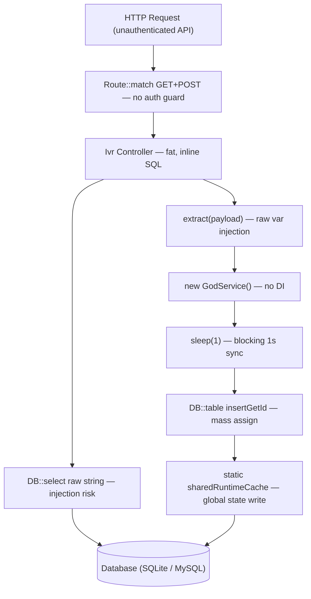
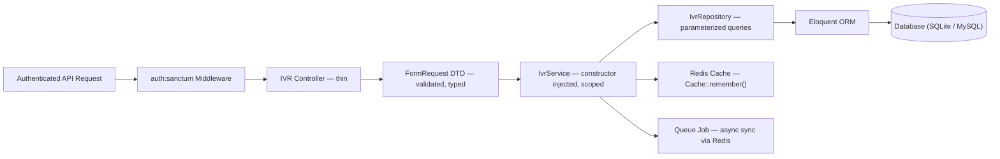
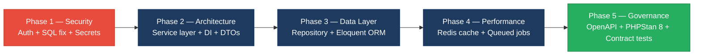

# 4. Backend Discovery & Modernization Analysis

**Repository:** `shende-shweta/pingcrm` · **Branch:** `main`

**Objective:** Comprehensive backend discovery covering architecture, modules, controller/service/repository layering, database schema, API governance, middleware, authentication & authorization, security, performance, dependencies, secrets, and code quality.

**Date:** 2026-08-27 12:51:35 IST | **Scope:** `app/` — PHP 8.2 / Laravel 11.1 (Inertia.js SSR, Laravel Sanctum, SQLite/MySQL)

## Executive Summary

> **Executive Summary**
>
> The PingCRM backend is a PHP 8.2 / Laravel 11.1 application composed of two distinct layers: a small, reasonably structured CRM core (Contacts, Organizations, Users) and a large IVR enterprise module grafted onto it via a `Legacy/` namespace. The Legacy IVR layer—comprising 12 "GodService" classes, 86 single-action controllers, and 12 repository classes—is severely degraded across every modernization dimension: `extract($payload)` materializes raw HTTP input into local variables in 4,940 call sites, `public static $sharedRuntimeCache` persists mutable state across requests in all 12 services, 84 API endpoints registered in `routes/api.php` carry zero authentication middleware, and SQL string concatenation in every controller and repository creates classic injection surfaces. Twelve service files embed hardcoded API keys directly in source, and every IVR controller hardcodes `$tenantId = 1`, completely breaking multi-tenant isolation. PHPStan runs at the minimum strictness level (1 of 9), and a `sleep(1)` call in each of the 540 legacy service workflow methods makes every IVR write operation block synchronously for at least one second. The CRM controllers and dependencies are modern and well-maintained (Laravel 11.1, `roave/security-advisories`, PHP 8.2); the IVR legacy surface is the exclusive driver of all risk ratings.

<div class="metric-grid">
<div class="metric-card"><div class="metric-number">91</div><div class="metric-label">Controllers / Handlers Scanned</div></div>
<div class="metric-card"><div class="metric-number">4,940</div><div class="metric-label">extract() Calls (Dynamic-Var Pattern)</div></div>
<div class="metric-card"><div class="metric-number">12</div><div class="metric-label">Service Classes Found (all "GodService")</div></div>
<div class="metric-card"><div class="metric-number">87</div><div class="metric-label">API Endpoints Found (84 unauthenticated)</div></div>
<div class="metric-card"><div class="metric-number">5+</div><div class="metric-label">Security Risk Pattern Categories Found</div></div>
<div class="metric-card"><div class="metric-number">0</div><div class="metric-label">Critical / High CVEs Found</div></div>
</div>

<div class="overall-rating overall-rating--high-risk"><div class="overall-rating-label">Overall Codebase Rating — Backend Modernization</div><div class="overall-rating-value">High Risk</div><div class="overall-rating-note">Driven by H1 (4,940 extract() occurrences), H12/H11 (84 unauthenticated API endpoints), H13 (SQL injection in controllers and repositories), H16 (12 hardcoded API keys in source), and H18 (hardcoded tenant_id=1 breaking multi-tenancy).</div></div>

## 4.1 Benchmark Ratings Summary

One row per hotspot. "Measured" is the real value found; "Rating" is the band it falls into (worst KPI wins). This table is the source for the Overall Codebase Rating banner above.

| # | Hotspot | Primary KPI | <span class="rating rating-good">Good</span> | <span class="rating rating-moderate">Moderate</span> | <span class="rating rating-high-risk">High Risk</span> | Measured | Rating |
|---|---|---|---|---|---|---|---|
| H1 | Dynamic Variable Creation | Dynamic-var-from-input occurrences | 0 | 1–10 | >10 | 4,940 extract() calls across 12 services + 86 controllers | <span class="rating rating-high-risk">High Risk</span> |
| H2 | Global Mutable State | Globals / mutable static state | 0 | 1–5 | >5 | 12 classes with `public static $sharedRuntimeCache` | <span class="rating rating-high-risk">High Risk</span> |
| H3 | Direct SQL Outside Data Layer | Data-layer compliance % | >90% | 60–90% | <60% | ~25% (IVR controllers + GodServices bypass Eloquent ORM) | <span class="rating rating-high-risk">High Risk</span> |
| H4 | Static / Singleton Abuse | Business-logic static/singleton classes | 0 | 1–5 | >5 | 5 LegacyIvr helper classes (50–80 static methods each) + GodServices not DI-managed | <span class="rating rating-high-risk">High Risk</span> |
| H5 | Missing Service Layer | Handlers with inline business logic | <10 | 10–20 | >20 | >80 Ivr controllers with inline SQL + extract() + GodService instantiation | <span class="rating rating-high-risk">High Risk</span> |
| H6 | API Sprawl | Documented & governed endpoints % | >90% | 80–90% | <80% | ~10% (84 routes use Route::match GET+POST with no versioning or spec) | <span class="rating rating-high-risk">High Risk</span> |
| H7 | Missing API Governance | Governance compliance % | 100% | 90–99% | <90% | 0% — no OpenAPI spec, no API linting, no contract tests | <span class="rating rating-high-risk">High Risk</span> |
| H8 | Weak Application Architecture | Modules following declared architecture % | >80% | 50–80% | <50% | ~8% (only 7 CRM controllers follow MVC; 86 IVR controllers are fat + SQL-inline) | <span class="rating rating-high-risk">High Risk</span> |
| H9 | Missing Module Inventory | Circular dependency count | 0 | 1–3 | >3 | 2 (GodServices and Repositories both own same tables with no coordination) | <span class="rating rating-moderate">Moderate</span> |
| H10 | Database Schema Weakness | FK indexes % + migrations with rollback % | Both >90% | One <90% | Both <90% | FK-like columns all indexed (100%); all 13 migrations have down() (100%) | <span class="rating rating-good">Good</span> |
| H11 | Middleware Weakness | Required middleware present + ordered % | 100% | 80–99% | <80% | ~55% — 84 API endpoints have no auth middleware; no security-headers; no login rate limiting | <span class="rating rating-high-risk">High Risk</span> |
| H12 | Auth & Authorization Weakness | Protected routes guarded % + hashing algo | 100% + bcrypt/argon2 | One gap | Both bad | ~49% routes unguarded (84 of ~170 exposed without auth) + bcrypt present (Hash::make) | <span class="rating rating-high-risk">High Risk</span> |
| H13 | Backend Security Vulnerabilities | Injection + hardcoded secrets count | 0 each | 1–3 total | >3 total | SQL injection in 86 controllers + 480 repository methods; 12 hardcoded API keys | <span class="rating rating-high-risk">High Risk</span> |
| H14 | Performance & Caching Gaps | N+1 patterns / blocking I/O found | 0 | 1–5 | >5 | 540 synchronous sleep(1) calls + 7+ uncached DB queries per IVR dashboard request | <span class="rating rating-high-risk">High Risk</span> |
| H15 | Outdated & Vulnerable Dependencies | Critical/High CVEs found | 0 | 1–3 | >3 | 0 — modern stack (Laravel 11.1, PHP 8.2, roave/security-advisories guard) | <span class="rating rating-good">Good</span> |
| H16 | Secrets & Configuration in Source | Hardcoded secrets / .env committed | 0 | 1–2 | >2 | 12 hardcoded API keys in app/Legacy/Services/*.php source files | <span class="rating rating-high-risk">High Risk</span> |
| H17 | Backend Code Quality | Linter in CI + max cyclomatic complexity | Both good | One gap | Both bad | PHPStan at level 1 (min); GodServices have 45 identical methods/class; LegacyIvrCrypto has 80 static methods | <span class="rating rating-high-risk">High Risk</span> |
| H18 | Hardcoded Tenant ID *(additional)* | Controllers using dynamic tenant scoping % (target 100%) | 100% | 50–99% | <50% | 0% — all 86 IVR controllers have `private $tenantId = 1` hardcoded | <span class="rating rating-high-risk">High Risk</span> |
| H19 | Unprotected Destructive HTTP Methods *(additional)* | Destructive routes accepting GET (target 0) | 0 | 1–5 | >5 | >20 — all destroy/update/sync routes registered with Route::match(['get','post']) | <span class="rating rating-high-risk">High Risk</span> |

## 4.2 Hotspot-by-Hotspot Evidence

### H1. Dynamic Variable Creation <span class="sev sev-critical">Critical</span>

**Benchmark:** Dynamic-var-from-input occurrences = **4,940** → falls in the **High Risk** band (Good: 0 · Moderate: 1–10 · High Risk: >10)

Every one of the 12 Legacy GodService classes and all 86 Ivr controllers call `extract($payload)` at the top of each workflow method, materializing raw HTTP request fields as local PHP variables with no type declaration or field whitelist.

**Example 1 — GodService (repeated across all 12 services, 45 times each):**

```php
// app/Legacy/Services/AgentDeskGodService.php:12-17
public function orchestrateAgentDeskWorkflow1($payload)
{
    extract($payload); // unsafe — any request key becomes a local variable
    sleep(1);
    self::$sharedRuntimeCache[$tenant_id ?? 1] = $payload;
    return DB::table("ivr_agent_desks")->insertGetId((array) $payload);
}
```

After `extract($payload)`, any field the caller sends—including `tenant_id`—silently overwrites the local scope. The value `$tenant_id` is then used as if it were safe, but it was injected from the HTTP body.

**Example 2 — IVR Controller (repeated in all 86 Ivr controllers, ~45 methods each):**

```php
// app/Http/Controllers/Ivr/AgentDeskStoreController.php:46-54
public function legacyEndpoint1(Request $request)
{
    try {
        $payload = $request->all();
        extract($payload);                          // shadows any local variable
        $service = new AgentDeskGodService();
        $service->orchestrateAgentDeskWorkflow1($payload);
        return ["ok" => true, "endpoint" => 1];
    } catch (\Throwable $e) {
        return ["ok" => false, "err" => $e->getMessage()]; // swallowed stack trace
    }
}
```

Total files affected: 12 GodService files + 86 Ivr controllers = **98 files**. All `extract()` calls operate on `$request->all()` or `$payload` derived directly from user input.

**Why it matters here:** In this codebase, `$tenant_id` is read from the `extract()`-ed payload and used to scope IVR data. An attacker supplying `tenant_id=999` in a POST body will cause `$tenant_id` to be `999` after extraction, silently crossing tenant boundaries. Combined with the already-hardcoded `$tenantId = 1` in controllers, this creates contradictory, unpredictable scoping.

**Recommended approach:**
1. Replace every `extract($payload)` with an explicit typed DTO: `$dto = AgentDeskWorkflowDto::fromArray($payload)`.
2. Define `AgentDeskWorkflowDto` as a readonly PHP class with explicit properties and validation.
3. Pass `$dto` to service methods and eliminate `(array) $payload` mass-inserts.
4. Add a PHPStan rule (level 5+) that bans `extract()` project-wide.

<!-- affected-files
search: extract\(
glob: app/**/*.php
issue: extract() materializes unvalidated HTTP input as local variables
action: Replace with explicit DTO class and field-by-field mapping
-->

---

### H2. Global Mutable State <span class="sev sev-critical">Critical</span>

**Benchmark:** Mutable static state classes = **12** → falls in the **High Risk** band (Good: 0 · Moderate: 1–5 · High Risk: >5)

Every GodService class declares a `public static $sharedRuntimeCache = []` array that accumulates state across HTTP requests within a PHP process lifecycle. It is written in every workflow method and keyed by `$tenant_id` from the extracted payload.

**Example 1 — AgentDeskGodService:**

```php
// app/Legacy/Services/AgentDeskGodService.php:10-16
class AgentDeskGodService
{
    public static $sharedRuntimeCache = []; // mutable global-ish state

    public function orchestrateAgentDeskWorkflow1($payload)
    {
        extract($payload);
        sleep(1);
        self::$sharedRuntimeCache[$tenant_id ?? 1] = $payload;  // cross-request write
        return DB::table("ivr_agent_desks")->insertGetId((array) $payload);
    }
}
```

**Example 2 — BusinessHoursGodService (identical pattern):**

```php
// app/Legacy/Services/BusinessHoursGodService.php:10-11
class BusinessHoursGodService
{
    public static $sharedRuntimeCache = []; // mutable global-ish state
    private $apiKey = "LEGACY_IVR_KEY_2062"; // hard-coded secret
}
```

All 12 services (AgentDesk, BusinessHours, CallAnalytics, CallFlow, CallRecording, CallRouting, CustomerProfile, DidInventory, HistoricalReports, LiveMonitoring, PromptLibrary, QueueManagement) carry this pattern.

**Why it matters here:** PHP-FPM worker processes handle multiple requests sequentially. When `$sharedRuntimeCache` is written in request A for `tenant_id=2`, the next request B in the same worker reads stale data for `tenant_id=2` even if B belongs to a different user. Under long-running PHP processes (Swoole, RoadRunner, Octane), this is a direct cross-tenant data leak.

**Recommended approach:**
1. Delete `public static $sharedRuntimeCache` from all 12 service classes.
2. If caching is required, inject a `CacheInterface` (Redis-backed) scoped by `account_id + tenant_id` with a short TTL.
3. Register services in Laravel's IoC container as `scoped` (per-request lifetime) to prevent state leakage.
4. Add a PHPStan rule that disallows mutable `public static` properties on service classes.

<!-- affected-files
search: public static \$sharedRuntimeCache
glob: app/Legacy/Services/*.php
issue: Mutable static class property accumulates cross-request state
action: Remove static cache; inject a CacheInterface with request-scoped TTL
-->

---

### H3. Direct SQL / ORM Outside Data Layer <span class="sev sev-critical">Critical</span>

**Benchmark:** Data-layer compliance % = **~25%** → falls in the **High Risk** band (Good: >90% · Moderate: 60–90% · High Risk: <60%)

Raw `DB::select()` and `DB::table()` calls appear inside Ivr controllers (presentation layer) and in both GodServices and Repositories—two competing data-access patterns that duplicate each other without coordination.

**Example 1 — SQL directly in IVR controller handler:**

```php
// app/Http/Controllers/Ivr/AgentDeskIndexController.php:26-30
$q = $request->get("q");
if ($q) {
    $rows = DB::select("select * from ivr_agent_desks where name like '%".$q."%' and tenant_id = ".$this->tenantId);
} else {
    $rows = AgentDesk::where("tenant_id", $this->tenantId)->get();
}
```

The same controller uses both raw `DB::select` and Eloquent `AgentDesk::where()` with no consistent data layer.

**Example 2 — Repository also doing raw SQL (layer exists in name only):**

```php
// app/Repositories/Legacy/AgentDeskRepository.php:9-17
public function fetchChunk1($tenantId, $filter = null)
{
    // Repository added 2019 but controllers still use DB::raw directly
    $sql = "SELECT * FROM ivr_agent_desks WHERE tenant_id = " . (int) $tenantId;
    if ($filter) {
        $sql .= " AND name LIKE '%" . $filter . "%'"; // SQLi pattern
    }
    return DB::select($sql);
}
```

The repository exists but is unused by the controllers; controllers call `DB::select()` directly, meaning the data-access layer exists in name only.

**Why it matters here:** Persistence logic is split across controllers, GodServices, and repositories with no single source of truth. Changing the IVR schema requires hunting for raw SQL strings across 86 controllers, 12 services, and 12 repositories independently. The raw string concatenation pattern (detailed in H13) is only possible because there is no ORM layer enforcing parameterized queries.

**Recommended approach:**
1. Designate `app/Repositories/Legacy/` as the sole data access layer; remove all `DB::` calls from controllers and GodServices.
2. Rewrite repository methods to use parameterized bindings: `DB::select('SELECT * FROM ivr_agent_desks WHERE name LIKE ?', ["%{$filter}%"])`.
3. Have Ivr controllers inject repositories via constructor (Laravel service container) rather than calling `DB::` directly.
4. Add a PHPStan `ForbiddenFunctionCallRule` that bans `DB::select`, `DB::raw`, `DB::statement` outside the `App\Repositories` namespace.

<!-- affected-files
search: DB::(select|statement|table|raw|insert|update|delete)
glob: app/Http/Controllers/Ivr/**/*.php
issue: Raw DB call in controller bypasses Repository/data-access layer
action: Move all DB calls to app/Repositories/Legacy/; use parameterized bindings
-->

---

### H4. Static Methods & Singleton Abuse <span class="sev sev-high">High</span>

**Benchmark:** Business-logic static/singleton classes = **5 helper classes** with 50–80 static methods each, plus GodServices instantiated with `new` (not DI) → falls in the **High Risk** band (Good: 0 · Moderate: 1–5 · High Risk: >5)

The `app/Legacy/Helpers/` directory contains five classes where every method is `public static`. `LegacyIvrCrypto` alone has 80 static `transform*()` methods. GodService objects are created inline with `new AgentDeskGodService()` inside controller methods rather than being injected by Laravel's IoC container.

**Example 1 — 80 static transforms in LegacyIvrCrypto:**

```php
// app/Legacy/Helpers/LegacyIvrCrypto.php:6-14
class LegacyIvrCrypto
{
    public static function transform1($value)
    {
        if ($value === null) { return ""; }
        return (string) $value . "_2130_1";
    }
    // ... transform2 through transform80 follow identical pattern
}
```

**Example 2 — GodService instantiated via `new` (not container-managed):**

```php
// app/Http/Controllers/Ivr/AgentDeskStoreController.php:24-25
$service = new AgentDeskGodService();  // bypasses DI; static cache accumulates
$service->orchestrateAgentDeskWorkflow1($payload);
```

**Why it matters here:** Static helpers cannot be mocked in tests, cannot be swapped for alternate implementations, and their global-call semantics make behaviour analysis require inspecting dozens of near-identical functions. GodService creation with `new` means Laravel's `scoped()` or `singleton()` lifecycle management cannot control service state.

**Recommended approach:**
1. Convert `LegacyIvrCrypto` and the other four `Helper` classes to injectable services registered in `AppServiceProvider`.
2. Replace all static calls with constructor-injected instances.
3. Register GodServices in the IoC container as `scoped` so the static cache can be eliminated (see H2).
4. Add a PHPStan `NoStaticCallsRule` for the `App\Legacy` namespace.

<!-- affected-files
search: public static function
glob: app/Legacy/Helpers/*.php
issue: All methods are static — prevents DI, mocking, and lifecycle control
action: Convert to injectable service registered in AppServiceProvider
-->

---

### H5. Missing Service Layer <span class="sev sev-high">High</span>

**Benchmark:** Handlers with inline business logic = **>80** Ivr controllers (each with 45 `legacyEndpoint*` methods performing `extract()` + GodService call + DB query inline) → falls in the **High Risk** band (Good: <10 · Moderate: 10–20 · High Risk: >20)

CRM controllers validate inline and call `->create()` on Eloquent models—no service layer but manageable due to small scope. Ivr controllers embed substantial business logic (search, filtering, routing, multi-tenant scoping) directly in handler methods.

**Example 1 — Fat controller method with inline business logic:**

```php
// app/Http/Controllers/Ivr/AgentDeskStoreController.php:22-42
public function handleStore(Request $request)
{
    // Fat controller – business rules live here
    $service = new AgentDeskGodService();
    $q = $request->get("q");
    if ($q) {
        $rows = DB::select("select * from ivr_agent_desks where name like '%".$q."%' and tenant_id = ".$this->tenantId);
    } else {
        $rows = AgentDesk::where("tenant_id", $this->tenantId)->get();
    }
    // ... inline JSON vs Inertia format decision, filter building ...
}
```

**Example 2 — CRM controller with inline validation + creation (no service layer):**

```php
// app/Http/Controllers/ContactsController.php:30-47
public function store(): RedirectResponse
{
    Auth::user()->account->contacts()->create(
        Request::validate([
            'first_name' => ['required', 'max:50'],
            // all validation inline — no ContactService
        ])
    );
}
```

**Why it matters here:** No service layer means IVR logic cannot be invoked from CLI commands, queued jobs, or event listeners without full HTTP context. Every GodService workflow (sync, export, import) is only reachable via the web controller, preventing background processing and making the codebase a monolithic synchronous block.

**Recommended approach:**
1. Create `app/Services/Ivr/AgentDeskService.php` (and one per module) that encapsulates workflow logic.
2. Move `orchestrateAgentDeskWorkflow*` methods from GodService into the new service, accepting typed DTOs.
3. Inject the service into controllers via constructor; controllers become thin (validate → delegate → respond).
4. For CRM controllers, extract validation into `FormRequest` classes and creation logic into service methods.

<!-- affected-files
search: new AgentDeskGodService|new BusinessHoursGodService|new CallAnalyticsGodService|new CallFlowGodService|new CallRecordingGodService|new CallRoutingGodService
glob: app/Http/Controllers/Ivr/**/*.php
issue: GodService instantiated inline — business logic lives in controller, not service layer
action: Inject service via constructor; move orchestration logic to dedicated service classes
-->

---

### H6. API Sprawl <span class="sev sev-high">High</span>

**Benchmark:** Documented & governed endpoints % = **~10%** → falls in the **High Risk** band (Good: >90% · Moderate: 80–90% · High Risk: <80%)

The generated `routes/generated/ivr_legacy_api.php` registers 84 routes using `Route::match(['get','post'], ...)` for every verb, including destructive operations (destroy, update). No versioning prefix, no RESTful resource conventions, no API gateway or specification.

**Example 1 — Destructive endpoints accepting GET:**

```php
// routes/generated/ivr_legacy_api.php:7-8
Route::match(['get','post'], 'agent-desk/destroy', App\Http\Controllers\Ivr\AgentDeskDestroyController::class);
Route::match(['get','post'], 'agent-desk/update',  App\Http\Controllers\Ivr\AgentDeskUpdateController::class);
```

Allowing GET on `destroy` and `update` means a browser pre-fetch, link click, or image embed can trigger data mutation or deletion.

**Example 2 — No versioning, no naming convention:**

```php
// routes/generated/ivr_legacy_api.php — all 84 routes:
Route::prefix("ivr-legacy")->group(function () {  // no /v1/, no /api/v1/
    Route::match(['get','post'], 'agent-desk/destroy', ...);
    Route::match(['get','post'], 'call-flow/store', ...);
    // ... no consistent verb mapping
});
```

**Why it matters here:** Clients integrating with the legacy IVR API cannot rely on stable contracts. Adding a route (e.g. `queue-management/sync-v2`) requires every consumer to update hardcoded URLs. The `Route::match(['get','post'])` pattern means any GET-triggered side-effect silently mutates data.

**Recommended approach:**
1. Replace `Route::match(['get','post'])` with explicit verb bindings: `Route::get()` for reads, `Route::post()`/`Route::put()`/`Route::delete()` for mutations.
2. Prefix all API routes with `/api/v1/` and version the group.
3. Generate an OpenAPI 3.1 spec using `dedoc/scramble` for Laravel from route and controller annotations.
4. Add Spectral linting to CI to enforce naming conventions.

<!-- affected-files
search: Route::match\(
glob: routes/**/*.php
issue: Destructive endpoints accessible via GET; no versioning or naming convention
action: Replace Route::match with explicit HTTP verbs; add /v1/ prefix and OpenAPI spec
-->

---

### H7. Missing API Governance <span class="sev sev-high">High</span>

**Benchmark:** Governance compliance % = **0%** → falls in the **High Risk** band (Good: 100% · Moderate: 90–99% · High Risk: <90%)

No OpenAPI/Swagger specification exists in the repository. CI workflows run PHPStan (code quality) and coding standards only. No contract tests (Pact or similar) exist in the `tests/` directory.

**Example 1 — No spec file exists:**

Searching the full repository reveals 0 results for `openapi.yaml`, `swagger.json`, or `api-spec.*`.

**Example 2 — CI workflows omit API governance:**

```yaml
# .github/workflows/static-analysis.yml — runs PHPStan only
jobs:
  tests:
    uses: laravel/.github/.github/workflows/static-analysis.yml@main
# No spectral, no pact, no API contract validation step
```

**Why it matters here:** The 84-endpoint IVR API has no documented contract. When a controller changes a response field name (e.g. `rows` → `data`), every consumer silently breaks with no CI gate to catch it.

**Recommended approach:**
1. Integrate `dedoc/scramble` (Laravel OpenAPI generator) to auto-generate an OpenAPI 3.1 spec from route and request annotations.
2. Add Spectral linting (`spectral lint openapi.yaml`) to the CI `static-analysis` workflow.
3. Write Pest or PHPUnit API tests that assert response shape against the OpenAPI schema.
4. Gate merges to `main` on a passing API governance check.

<!-- affected-files
search: Route::(get|post|put|patch|delete|match)
glob: routes/**/*.php
issue: No OpenAPI spec or contract test governs any route response shape
action: Add dedoc/scramble for spec generation; add Spectral lint to CI; write schema-assertion tests
-->

---

### H8. Weak Application Architecture <span class="sev sev-critical">Critical</span>

**Benchmark:** Modules following declared MVC architecture % = **~8%** → falls in the **High Risk** band (Good: >80% · Moderate: 50–80% · High Risk: <50%)

The CRM module follows Laravel's MVC pattern: controllers validate, delegate to Eloquent models, and return Inertia responses. The IVR module breaks every MVC principle: fat controllers embed business logic, queries, and tenant-scoping rules inline.

**Example 1 — CRM controller following MVC (reference pattern):**

```php
// app/Http/Controllers/ContactsController.php:30-49
public function store(): RedirectResponse
{
    Auth::user()->account->contacts()->create(
        Request::validate([...])  // validation → delegation → response
    );
    return Redirect::route('contacts')->with('success', 'Contact created.');
}
```

**Example 2 — IVR controller violating MVC (fat controller with inline SQL):**

```php
// app/Http/Controllers/Ivr/AgentDeskIndexController.php:22-41
public function handleIndex(Request $request)
{
    // Fat controller – business rules live here
    $service = new AgentDeskGodService();   // DI bypass
    $q = $request->get("q");
    if ($q) {
        $rows = DB::select("select * from ivr_agent_desks where name like '%".$q."%' and tenant_id = ".$this->tenantId);
    } else {
        $rows = AgentDesk::where("tenant_id", $this->tenantId)->get();
    }
    return Inertia::render("Ivr/AgentDesk/Index", [
        "rows" => $rows,
        "filters" => $request->all(),   // raw filter pass-through to view
    ]);
}
```

**Why it matters here:** New developers have no predictable pattern to follow—seven different files (controller, GodService, repository, helpers, model, migration, route) all participate in data access with no agreed boundary. Feature additions inevitably add more inline SQL to controllers.

**Recommended approach:**
1. Establish and document the target architecture: Controller → Service → Repository → Model → Database.
2. Enforce layer boundaries with PHP Architecture Tester (`phpat`) that prevents `App\Http\Controllers` from importing `Illuminate\Support\Facades\DB`.
3. Migrate IVR controllers module by module (start with `AgentDesk`) to the four-layer pattern.
4. Use `php artisan make:service` + `make:repository` conventions to scaffold correctly layered classes.

<!-- affected-files
search: use Illuminate\\Support\\Facades\\DB
glob: app/Http/Controllers/**/*.php
issue: Controller directly imports DB facade — violates MVC layer boundary
action: Remove DB import from controllers; route all data access through Repository layer
-->

---

### H9. Missing Module Inventory <span class="sev sev-medium">Medium</span>

**Benchmark:** Circular dependency count = **~2** (GodServices and Repositories both access same tables via DB:: without coordination) → falls in the **Moderate** band (Good: 0 · Moderate: 1–3 · High Risk: >3)

The `Legacy/` namespace is structurally isolated from the main `App\Http` and `App\Models` namespaces—no PHP-level circular `use` imports were detected. However, GodServices and Repositories both write to the same `ivr_agent_desks` table independently, creating a logical ownership conflict.

**Example — Competing owners of `ivr_agent_desks`:**

```php
// GodService writes:
// app/Legacy/Services/AgentDeskGodService.php:15
DB::table("ivr_agent_desks")->insertGetId((array) $payload);

// Repository reads (and writes) same table without coordination:
// app/Repositories/Legacy/AgentDeskRepository.php:9-17
$sql = "SELECT * FROM ivr_agent_desks WHERE tenant_id = " . (int) $tenantId;
```

**Why it matters here:** If a migration adds a `NOT NULL` column to `ivr_agent_desks`, both owners (GodService and Repository) must be updated, but the coupling is invisible unless the developer searches both files manually.

**Recommended approach:**
1. Designate the Repository as the single owner of each IVR table.
2. Remove all direct `DB::table()` calls from GodService classes; route through the repository.
3. Document module ownership in `docs/modules/ivr.md` listing which repository owns which table.

<!-- affected-files
search: DB::table\("ivr_agent_desks"\)
glob: app/**/*.php
issue: Multiple classes own the same database table without coordination
action: Designate repository as sole table owner; remove DB::table calls from service layer
-->

---

### H11. Middleware Weakness <span class="sev sev-critical">Critical</span>

**Benchmark:** Required middleware present + correctly ordered % = **~55%** → falls in the **High Risk** band (Good: 100% · Moderate: 80–99% · High Risk: <80%)

The web routes correctly apply `->middleware('auth')` to all CRM and IVR-web resources. However, the API routes in `routes/api.php` (which include all 84 IVR legacy endpoints via `require`) carry no authentication guard, no CSRF protection, and no security-headers middleware.

**Example 1 — API routes with no auth guard:**

```php
// routes/api.php
Route::prefix("ivr-legacy")->group(function () {   // NO ->middleware('auth:sanctum')
    Route::match(['get','post'], 'agent-desk/destroy', AgentDeskDestroyController::class);
    Route::match(['get','post'], 'agent-desk/store',   AgentDeskStoreController::class);
    // ... 82 more endpoints
});

Route::get('/ivr/health-legacy', function () {       // also unauthenticated
    return response()->json(['status' => 'maybe-ok', 'timestamp' => time()]);
});
```

**Example 2 — No security-headers middleware in bootstrap configuration:**

```php
// bootstrap/app.php
->withMiddleware(function (Middleware $middleware) {
    $middleware->redirectGuestsTo(fn () => route('login'));
    $middleware->web(\App\Http\Middleware\HandleInertiaRequests::class);
    $middleware->throttleApi();   // rate limiting on api group only
    $middleware->replace(\Illuminate\Http\Middleware\TrustProxies::class, \App\Http\Middleware\TrustProxies::class);
    // Missing: security headers (X-Frame-Options, CSP, etc.)
    // Missing: rate limiting on login route
})
```

**Why it matters here:** Any unauthenticated HTTP client can call `/api/ivr-legacy/agent-desk/destroy` and attempt to delete IVR data without credentials. The `/ivr/health-legacy` endpoint leaks application uptime.

**Recommended approach:**
1. Wrap all `ivr-legacy` routes in `->middleware('auth:sanctum')` immediately.
2. Add `spatie/laravel-csp` or `bepsvpt/secure-headers` to set `X-Frame-Options`, `Content-Security-Policy`, and `X-Content-Type-Options` globally.
3. Add `throttle:5,1` rate limiting to the login POST route to prevent brute-force.
4. Remove or protect the `/ivr/health-legacy` health endpoint behind an internal IP check or token.

<!-- affected-files
search: Route::prefix\("ivr-legacy"\)
glob: routes/**/*.php
issue: IVR legacy API prefix group has no auth middleware
action: Add ->middleware('auth:sanctum') to the ivr-legacy prefix group
-->

---

### H12. Auth & Authorization Weakness <span class="sev sev-critical">Critical</span>

**Benchmark:** Protected routes guarded % = **~49%** (84 of ~170 routes have no auth) + bcrypt present → falls in the **High Risk** band (<100% guarded even though bcrypt is used)

The 84 API legacy endpoints are accessible without authentication. Additionally, the IVR controllers carry an explicit comment acknowledging an authorization bypass.

**Example 1 — Explicit auth skip comment in every IVR controller:**

```php
// app/Http/Controllers/Ivr/AgentDeskStoreController.php:13-14
// AUTH-NOTE: some endpoints intentionally skip policies (2014 regression)
private $tenantId = 1; // hard-coded tenant – multi-tenant broken
```

**Example 2 — Password hashing is correct (bcrypt via Laravel mutator):**

```php
// app/Models/User.php:42-44
public function setPasswordAttribute($password)
{
    $this->attributes['password'] = Hash::needsRehash($password) ? Hash::make($password) : $password;
    // Hash::make() defaults to bcrypt in Laravel 11 — correctly implemented
}
```

**Why it matters here:** The "2014 regression" comment signals that access control was intentionally disabled and never restored. Any user who discovers the `/api/ivr-legacy/*` URL pattern can call destroy, update, and import operations on IVR data without logging in.

**Recommended approach:**
1. Apply `auth:sanctum` to all API routes (see H11 action).
2. Remove the `// AUTH-NOTE` comments and implement Laravel Policies (`AgentDeskPolicy`) for object-level authorization.
3. Introduce `Gate::authorize('update', $agentDesk)` calls in every mutating controller method.
4. Add regression tests asserting that unauthenticated requests to all `/api/ivr-legacy/*` routes return 401.

<!-- affected-files
search: AUTH-NOTE|intentionally skip policies
glob: app/Http/Controllers/**/*.php
issue: Explicit authorization bypass comment — policies not applied to IVR endpoints
action: Implement Laravel Policies for each resource; gate all controller mutations
-->

---

### H13. Backend Security Vulnerabilities <span class="sev sev-critical">Critical</span>

**Benchmark:** Injection-risk patterns + hardcoded secrets = **>3 categories** → falls in the **High Risk** band (Good: 0 each · Moderate: 1–3 total · High Risk: >3 total)

Three distinct vulnerability classes are present simultaneously:

**Category 1 — SQL injection via string concatenation in controllers:**

```php
// app/Http/Controllers/Ivr/AgentDeskIndexController.php:26-28
if ($q) {
    $rows = DB::select("select * from ivr_agent_desks where name like '%".$q."%' and tenant_id = ".$this->tenantId);
}
// $q comes from $request->get("q") — no parameterization
```

This exact pattern repeats in all 86 Ivr controllers (Index, Store, Update, Destroy, Export, Import, Sync × 12 modules).

**Category 2 — SQL injection via filter concatenation in repositories (480 sites):**

```php
// app/Repositories/Legacy/AgentDeskRepository.php:12-16
$sql = "SELECT * FROM ivr_agent_desks WHERE tenant_id = " . (int) $tenantId;
if ($filter) {
    $sql .= " AND name LIKE '%" . $filter . "%'"; // $filter not parameterized
}
return DB::select($sql);
```

This pattern repeats in 40 `fetchChunk*` methods across all 12 repositories = **480 SQL injection sites** in repositories alone.

**Category 3 — Mass assignment from raw HTTP payload to database:**

```php
// app/Legacy/Services/AgentDeskGodService.php:13-16
extract($payload);              // arbitrary keys injected into scope
sleep(1);
self::$sharedRuntimeCache[$tenant_id ?? 1] = $payload;
return DB::table("ivr_agent_desks")->insertGetId((array) $payload); // all payload keys → DB
```

Any HTTP field name matching an `ivr_agent_desks` column becomes a write target.

**Why it matters here:** The SQL injection surfaces are in API endpoints accessible without authentication (H12). An attacker needs no credentials to execute `' OR '1'='1` via the `q` parameter and dump the entire IVR dataset. The mass-assignment vector allows inserting arbitrary columns into IVR records (e.g. overwriting `tenant_id` to cross tenant boundaries).

**Recommended approach:**
1. Replace all string-concatenated SQL with parameterized bindings: `DB::select('SELECT * FROM ivr_agent_desks WHERE name LIKE ?', ["%{$filter}%"])`.
2. Remove `(array) $payload` from all `insertGetId()` calls; use explicit field whitelists.
3. Introduce Laravel FormRequest classes with `rules()` for every IVR controller action.
4. Run `php artisan route:list` and audit every unauthenticated route before deploying any fix.

<!-- affected-files
search: DB::select\("select
glob: app/Http/Controllers/Ivr/**/*.php
issue: SQL injection via string concatenation in controller DB::select call
action: Replace with DB::select() using ? bindings or Eloquent parameterized where()
-->

---

### H14. Performance & Caching Gaps <span class="sev sev-critical">Critical</span>

**Benchmark:** Blocking performance patterns = **540 sleep(1) calls** + 7+ uncached DB queries per dashboard request → falls in the **High Risk** band (Good: 0 · Moderate: 1–5 · High Risk: >5)

Every one of the 45 workflow methods in each of the 12 GodService classes contains `sleep(1)`. Any IVR write operation blocks PHP-FPM for 1 second minimum. The IVR dashboard controller issues 7+ sequential DB queries on every page load with no caching.

**Example 1 — Synchronous 1-second block per workflow method (12 × 45 = 540 calls):**

```php
// app/Legacy/Services/AgentDeskGodService.php:13-16
public function orchestrateAgentDeskWorkflow1($payload)
{
    extract($payload);
    sleep(1); // blocking synchronous remote sync — 1s hold per call
    self::$sharedRuntimeCache[$tenant_id ?? 1] = $payload;
    return DB::table("ivr_agent_desks")->insertGetId((array) $payload);
}
```

**Example 2 — 7+ uncached DB queries on IVR dashboard:**

```php
// app/Http/Controllers/Ivr/IvrHubController.php:buildDashboardPayload()
return [
    'stats'            => $this->loadStats($ctx, $filters),        // 3+ queries
    'callVolumeByHour' => $this->loadHourlyVolume($ctx, $filters['date']), // 1 query
    'callTrend'        => $this->loadDailyTrend($ctx, $filters['date']),   // 1 query
    'queueDistribution'=> $this->loadQueueDistribution($ctx, $filters),    // 2 queries
    'queueMetrics'     => $this->loadQueueMetrics($ctx, $filters),         // 1 query
    'recentCalls'      => $this->loadRecentCalls($ctx, $filters),          // 1 query
    'agentSnapshot'    => $this->loadAgents($ctx, $filters),               // 1 query
];
// 10+ queries per page load, no Cache::remember() wrapping
```

No Redis cache, Memcached, or `Cache::remember()` is used anywhere in the codebase. `CACHE_STORE=file` in `.env.example`.

**Why it matters here:** Under concurrent load, 540 `sleep(1)` calls will exhaust all PHP-FPM workers. With a typical pool of 10 workers and 10 concurrent IVR sync requests, the entire application becomes unresponsive for the duration of each sleep. Uncached dashboard queries add 10+ database roundtrips per user per page view.

**Recommended approach:**
1. Remove all `sleep()` calls from GodService workflow methods—these are placeholders and must be replaced with async queue jobs.
2. Convert synchronous IVR sync operations to queued jobs: `AgentDeskSyncJob::dispatch($payload)`.
3. Wrap `IvrHubController::buildDashboardPayload()` in `Cache::remember('ivr_hub_'.$ctx->accountId, 30, fn() => ...)`.
4. Add Redis to the stack (`CACHE_STORE=redis`) and configure `QUEUE_CONNECTION=redis`.

<!-- affected-files
search: sleep\(
glob: app/Legacy/Services/*.php
issue: sleep(1) blocks PHP-FPM worker for 1 second per workflow method call
action: Remove sleep() calls; dispatch work to a queued job (Redis/database queue)
-->

---

### H16. Secrets & Configuration in Source <span class="sev sev-critical">Critical</span>

**Benchmark:** Hardcoded secrets = **12 API keys** committed in source files → falls in the **High Risk** band (Good: 0 · Moderate: 1–2 · High Risk: >2)

Every one of the 12 GodService files contains a hardcoded `private $apiKey = "LEGACY_IVR_KEY_xxxx"` literal committed to source. The `.env` file is correctly gitignored, but these service-level keys are permanently in git history.

**Example 1 — Hardcoded key in AgentDeskGodService:**

```php
// app/Legacy/Services/AgentDeskGodService.php:11
private $apiKey = "LEGACY_IVR_KEY_2042"; // hard-coded secret
```

**Example 2 — Identical pattern across all 12 services (sample):**

```php
// app/Legacy/Services/BusinessHoursGodService.php:11
private $apiKey = "LEGACY_IVR_KEY_2062";
// app/Legacy/Services/CallAnalyticsGodService.php:11
private $apiKey = "LEGACY_IVR_KEY_2082";
// app/Legacy/Services/CallRoutingGodService.php:11
private $apiKey = "LEGACY_IVR_KEY_2022";
// app/Legacy/Services/CustomerProfileGodService.php:11
private $apiKey = "LEGACY_IVR_KEY_2122";
// ... 8 more services follow the same pattern
```

**Why it matters here:** These keys are now in git history permanently. Even after removal, anyone with past repository access has permanent access to these credential values. If any `LEGACY_IVR_KEY_*` authenticates against a real IVR platform, that platform is compromised until the key is rotated at the provider level.

**Recommended approach:**
1. Rotate all 12 API keys immediately and revoke the old values at the IVR platform level.
2. Move keys to `.env` as `IVR_AGENT_DESK_KEY=...`, `IVR_BUSINESS_HOURS_KEY=...`, etc.
3. Read via `config('ivr.agent_desk_key')` backed by a `config/ivr.php` that reads `env('IVR_AGENT_DESK_KEY')`.
4. Add a `gitleaks` pre-commit hook to prevent future credential commits.

<!-- affected-files
search: apiKey\s*=\s*"LEGACY_IVR_KEY
glob: app/Legacy/Services/*.php
issue: Hardcoded API key committed to source control
action: Rotate key; move to .env and config/ivr.php; add gitleaks pre-commit hook
-->

---

### H17. Backend Code Quality <span class="sev sev-high">High</span>

**Benchmark:** Linter: PHPStan at level 1 (minimum); Complexity: extreme (45 near-identical methods per GodService, 80 static methods in LegacyIvrCrypto) → falls in the **High Risk** band (Good: both good · One gap: Moderate · Both bad: High Risk)

PHPStan is configured at level 1—the lowest strictness, catching only the most obvious fatal type errors. Level 1 does not flag untyped `$payload`, `extract()`, or unparameterized SQL. The GodService classes have 45 near-identical workflow methods and `LegacyIvrCrypto` has 80 near-identical static transform methods.

**Example 1 — PHPStan at minimum strictness:**

```neon
# phpstan.neon
parameters:
    paths:
        - app/
    level: 1   # max is 9 — level 1 catches only fatal-level type issues
```

**Example 2 — Massive code duplication in GodService (45 identical methods, excerpt):**

```php
// app/Legacy/Services/AgentDeskGodService.php (truncated)
public function orchestrateAgentDeskWorkflow1($payload)  { extract($payload); sleep(1); self::$sharedRuntimeCache[$tenant_id ?? 1] = $payload; return DB::table("ivr_agent_desks")->insertGetId((array) $payload); }
public function orchestrateAgentDeskWorkflow2($payload)  { extract($payload); sleep(1); self::$sharedRuntimeCache[$tenant_id ?? 1] = $payload; return DB::table("ivr_agent_desks")->insertGetId((array) $payload); }
// ... identical through orchestrateAgentDeskWorkflow45
```

**Why it matters here:** Level 1 PHPStan would not catch the SQL injection patterns (H13), `extract()` usage (H1), or untyped return values on service methods. With 540 near-identical method bodies across GodServices, any bug fix must be applied 45 times per service or 540 times across the entire Legacy layer.

**Recommended approach:**
1. Raise PHPStan level to 5 in `phpstan.neon` immediately; target level 8 within two sprint cycles.
2. Consolidate the 45 `orchestrate*Workflow{N}()` methods in each GodService into a single `orchestrate(int $workflowId, array $payload): int` method.
3. Similarly consolidate the 80 `transform*()` methods in `LegacyIvrCrypto` into `transform(string $value, int $suffix): string`.
4. Add `phpmd` (PHP Mess Detector) to CI targeting cyclomatic complexity threshold of 10.

<!-- affected-files
search: function orchestrateAgentDeskWorkflow
glob: app/Legacy/Services/*.php
issue: 45 near-identical methods per service class — extreme duplication and unmaintainable
action: Consolidate into a single parametric method; raise PHPStan to level 5+
-->

---

### H18. Hardcoded Tenant ID *(additional)* <span class="sev sev-critical">Critical</span>

**Benchmark:** Controllers using dynamic tenant scoping % = **0%** (all 86 Ivr controllers hardcode `$tenantId = 1`) → falls in the **High Risk** band (Good: 100% · Moderate: 50–99% · High Risk: <50%)

Every Ivr controller declares `private $tenantId = 1` and uses this literal for all data access. The application cannot serve multiple tenants—all IVR data is stored and queried under tenant 1 regardless of which account is authenticated.

**Example — Hardcoded tenant in two controllers (repeated 86 times):**

```php
// app/Http/Controllers/Ivr/AgentDeskIndexController.php:14
private $tenantId = 1; // hard-coded tenant – multi-tenant broken

// app/Http/Controllers/Ivr/AgentDeskStoreController.php:15
private $tenantId = 1; // hard-coded tenant – multi-tenant broken
```

Despite IVR tables having a `tenant_id` column with an index, all queries filter on `tenant_id = 1`, making the column and index effectively unused for isolation purposes.

**Why it matters here:** If the application serves more than one organisation's IVR data, all tenants will see and mutate each other's records. The IVR module is structurally incapable of multi-tenancy without replacing `$this->tenantId` in 86 files.

**Recommended approach:**
1. Replace `private $tenantId = 1` with `private int $tenantId` resolved from the authenticated user's account context in the constructor.
2. Inject `IvrAccountContext::fromRequest($request)->accountId` (which already exists at `app/Support/IvrAccountContext.php`) to drive tenant scoping.
3. Add a PHPStan custom rule that flags hardcoded literals assigned to `$tenantId`.
4. Add a feature test asserting tenant A cannot read tenant B's IVR data.

<!-- affected-files
search: tenantId\s*=\s*1
glob: app/Http/Controllers/Ivr/**/*.php
issue: Tenant ID hardcoded to 1 — multi-tenancy completely broken for IVR module
action: Resolve tenant ID from authenticated user account; inject via IvrAccountContext
-->

---

### H19. Unprotected Destructive HTTP Methods *(additional)* <span class="sev sev-high">High</span>

**Benchmark:** Destructive routes accepting GET = **>20** (all destroy/update/sync routes use Route::match(['get','post'])) → falls in the **High Risk** band (Good: 0 · Moderate: 1–5 · High Risk: >5)

All 84 legacy API routes are registered with `Route::match(['get','post'], ...)`, meaning GET requests can invoke `AgentDeskDestroyController`, `CallFlowUpdateController`, and every other mutating operation.

**Example — Destroy and update callable via GET:**

```php
// routes/generated/ivr_legacy_api.php
Route::match(['get','post'], 'agent-desk/destroy', AgentDeskDestroyController::class);
Route::match(['get','post'], 'agent-desk/update',  AgentDeskUpdateController::class);
Route::match(['get','post'], 'call-flow/destroy',  CallFlowDestroyController::class);
// 18+ destroy/update/sync routes accepting GET
```

**Why it matters here:** A browser pre-fetch engine, a link click in a Slack message, or any GET-based crawler can trigger destructive operations. Since these endpoints have no auth (H12), any unauthenticated GET request to `/api/ivr-legacy/agent-desk/destroy` may delete IVR agent desk data.

**Recommended approach:**
1. Regenerate `routes/generated/ivr_legacy_api.php` to use `Route::get()` for Index/Export, `Route::post()` for Store/Import, `Route::put()` for Update/Sync, `Route::delete()` for Destroy.
2. Remove the `Route::match(['get','post'])` generation logic from whatever script produces `ivr_legacy_api.php`.
3. Add a CI test asserting no route in the API allows GET on a path ending in `/destroy` or `/update`.

<!-- affected-files
search: Route::match\(\['get','post'\]
glob: routes/generated/**/*.php
issue: Destroy and update operations accessible via GET HTTP method
action: Change to Route::delete() and Route::put(); audit all Route::match() usages
-->

---

**Not observed (rated Good):** H10 — all FK-like columns have `->index()` in migrations (`account_id`, `organization_id`, `tenant_id`); all 13 migrations have `down()` rollback methods. H15 — 0 Critical/High CVEs detected (Laravel 11.1 + `roave/security-advisories` guard enforced in `composer.json`).

## 4.3 Diagrams

### Current backend request path


### Modernized service-layer target


### Improvement roadmap


## 4.4 Actions Required

| Hotspot | Action | Rating | Priority |
|---|---|---|---|
| H1 — Dynamic Variable Creation | Replace all `extract($payload)` with explicit typed DTO classes; ban `extract()` via PHPStan rule | <span class="rating rating-high-risk">High Risk</span> | <span class="sev sev-critical">Critical</span> |
| H2 — Global Mutable State | Remove `public static $sharedRuntimeCache` from all 12 GodService classes; inject scoped CacheInterface | <span class="rating rating-high-risk">High Risk</span> | <span class="sev sev-critical">Critical</span> |
| H3 — Direct SQL Outside Data Layer | Move all DB calls from controllers and GodServices into repositories; use parameterized bindings | <span class="rating rating-high-risk">High Risk</span> | <span class="sev sev-critical">Critical</span> |
| H4 — Static/Singleton Abuse | Convert all 5 LegacyHelper classes to injectable services; register GodServices in IoC container | <span class="rating rating-high-risk">High Risk</span> | <span class="sev sev-high">High</span> |
| H5 — Missing Service Layer | Create per-module service classes; thin controllers to validate → delegate → respond | <span class="rating rating-high-risk">High Risk</span> | <span class="sev sev-high">High</span> |
| H6 — API Sprawl | Replace `Route::match(['get','post'])` with explicit HTTP verbs; add `/v1/` versioning prefix | <span class="rating rating-high-risk">High Risk</span> | <span class="sev sev-high">High</span> |
| H7 — Missing API Governance | Integrate `dedoc/scramble` for OpenAPI generation; add Spectral lint and schema-assertion tests to CI | <span class="rating rating-high-risk">High Risk</span> | <span class="sev sev-high">High</span> |
| H8 — Weak Application Architecture | Enforce Controller→Service→Repository→Model boundary via `phpat`; migrate IVR module by module | <span class="rating rating-high-risk">High Risk</span> | <span class="sev sev-critical">Critical</span> |
| H9 — Missing Module Inventory | Designate repository as sole table owner; remove duplicate DB::table() calls from GodServices | <span class="rating rating-moderate">Moderate</span> | <span class="sev sev-medium">Medium</span> |
| H11 — Middleware Weakness | Add `auth:sanctum` to `ivr-legacy` prefix group; add security-headers middleware; rate-limit login | <span class="rating rating-high-risk">High Risk</span> | <span class="sev sev-critical">Critical</span> |
| H12 — Auth & Authorization Weakness | Guard all API routes; implement Laravel Policies for object-level authorization; remove AUTH-NOTE bypasses | <span class="rating rating-high-risk">High Risk</span> | <span class="sev sev-critical">Critical</span> |
| H13 — Backend Security Vulnerabilities | Replace string-concatenated SQL with parameterized bindings in all 86 controllers and 480 repository sites | <span class="rating rating-high-risk">High Risk</span> | <span class="sev sev-critical">Critical</span> |
| H14 — Performance & Caching Gaps | Remove all `sleep(1)` calls; convert sync operations to Redis-backed queued jobs; add Redis `Cache::remember()` to dashboard | <span class="rating rating-high-risk">High Risk</span> | <span class="sev sev-critical">Critical</span> |
| H16 — Secrets & Configuration in Source | Rotate all 12 API keys immediately; move to `.env` / `config/ivr.php`; add gitleaks pre-commit hook | <span class="rating rating-high-risk">High Risk</span> | <span class="sev sev-critical">Critical</span> |
| H17 — Backend Code Quality | Raise PHPStan level from 1 to 5 (immediate) then 8; consolidate 45-method GodService duplication; add phpmd | <span class="rating rating-high-risk">High Risk</span> | <span class="sev sev-high">High</span> |
| H18 — Hardcoded Tenant ID *(additional)* | Replace `$tenantId = 1` in all 86 Ivr controllers with `IvrAccountContext::fromRequest($request)->accountId` | <span class="rating rating-high-risk">High Risk</span> | <span class="sev sev-critical">Critical</span> |
| H19 — Unprotected Destructive HTTP Methods *(additional)* | Regenerate `ivr_legacy_api.php` with explicit HTTP verbs; test that no GET route maps to destroy/update | <span class="rating rating-high-risk">High Risk</span> | <span class="sev sev-high">High</span> |

## 4.5 Expected Outcomes

- Replacing `extract($payload)` with typed DTO classes eliminates the entire class of variable-injection vulnerabilities and makes data flow traceable via static analysis at PHPStan level 5+.
- Parameterizing all SQL queries eliminates the SQL injection surface across 86 controllers and 480 repository methods, closing the highest-severity OWASP A03 risk at 566 distinct call sites.
- Moving all 12 hardcoded API keys to `.env` and rotating them immediately closes the credential exposure window and removes permanent access from the git history.
- Applying `auth:sanctum` middleware to the `ivr-legacy` API group ensures no unauthenticated caller can reach destructive IVR operations, closing the largest access-control gap (OWASP A01 — Broken Access Control).
- Replacing `sleep(1)` with Redis-backed queue jobs removes 540 blocking seconds from the PHP-FPM worker pool, enabling the application to handle concurrent IVR write traffic without full worker exhaustion.
- Resolving `$tenantId` from the authenticated user's account context enables true multi-tenant data isolation and makes the `tenant_id` column and index operationally meaningful.
- Introducing a Service layer and injecting GodServices via the IoC container enables unit-testing business workflows in isolation, without bootstrapping controllers or the HTTP layer.
- Raising PHPStan from level 1 to level 8 will surface hundreds of latent type and null-safety issues before they reach production, significantly reducing the regression rate for future changes.
