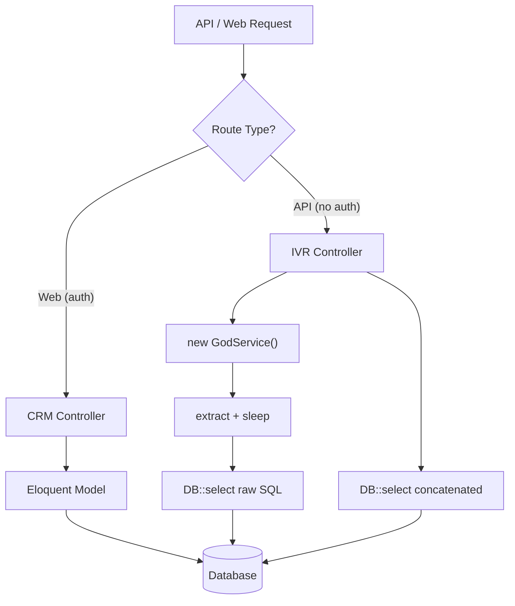
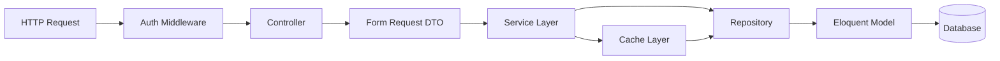
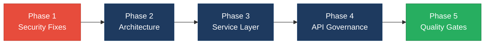

# 4. Backend Discovery & Modernization Analysis

**Objective:** Comprehensive backend discovery covering architecture, modules, controller/service/repository layering, database schema, API governance, middleware, authentication & authorization, security, performance, dependencies, secrets, and code quality.

**Date:** 2026-08-05 10:11:51 UTC | **Scope:** `shende-shweta/pingcrm` — PHP 8.2 / Laravel 11.1 with Inertia.js

## Executive Summary

> **Executive Summary**
>
> The Ping CRM backend is a PHP 8.2 / Laravel 11.1 application that combines a well-structured CRM core (Contacts, Organizations, Users) with a large legacy IVR enterprise module exhibiting severe anti-patterns. The IVR subsystem contains 4,940 `extract($payload)` calls that materialize untrusted request data as local variables, 80 SQL injection vulnerabilities via string concatenation in controllers, 12 hardcoded API keys in GodService classes, and 12 models with wide-open mass assignment (`$guarded = []`). All 80 IVR API endpoints lack authentication middleware entirely, and 80 IVR controllers skip authorization policies by design comment. The legacy layer has 12 "GodService" classes totalling 4,476 lines with mutable static state, while the repository layer also uses raw SQL concatenation. No caching layer exists, no OpenAPI specification is present, and PHPStan is configured at level 1 with only 3 test files covering the CRM core.

<div class="metric-grid">
<div class="metric-card"><div class="metric-number">90</div><div class="metric-label">Controllers / Handlers Scanned</div></div>
<div class="metric-card"><div class="metric-number">92</div><div class="metric-label">Files Using Dynamic-Variable Patterns</div></div>
<div class="metric-card"><div class="metric-number">12</div><div class="metric-label">Service Classes Found</div></div>
<div class="metric-card"><div class="metric-number">80+</div><div class="metric-label">API Endpoints Found</div></div>
<div class="metric-card"><div class="metric-number">92</div><div class="metric-label">Security Risk Patterns Found</div></div>
<div class="metric-card"><div class="metric-number">0</div><div class="metric-label">Critical / High CVEs Found</div></div>
</div>

<div class="overall-rating overall-rating--high-risk"><div class="overall-rating-label">Overall Codebase Rating — Backend Modernization</div><div class="overall-rating-value">High Risk</div><div class="overall-rating-note">Driven by H1 (4,940 extract() calls), H3 (direct SQL in controllers and repositories), H5 (GodService anti-pattern), H12 (80 unguarded API endpoints), H13 (SQL injection + mass assignment + hardcoded secrets), and H16 (12 hardcoded API keys).</div></div>

## 4.1 Benchmark Ratings Summary

| # | Hotspot | Primary KPI | <span class="rating rating-good">Good</span> | <span class="rating rating-moderate">Moderate</span> | <span class="rating rating-high-risk">High Risk</span> | Measured | Rating |
|---|---|---|---|---|---|---|---|
| H1 | Dynamic Variable Creation | Dynamic-var-from-input occurrences | 0 | 1–10 | >10 | 4,940 | <span class="rating rating-high-risk">High Risk</span> |
| H2 | Global Mutable State | Globals / mutable static state | 0 | 1–5 | >5 | 12 | <span class="rating rating-high-risk">High Risk</span> |
| H3 | Direct SQL Outside Data Layer | Data-layer compliance % | >90% | 60–90% | <60% | ~30% | <span class="rating rating-high-risk">High Risk</span> |
| H4 | Static / Singleton Abuse | Business-logic static/singleton classes | 0 | 1–5 | >5 | 5 (helper classes with 400 static methods) | <span class="rating rating-moderate">Moderate</span> |
| H5 | Missing Service Layer | Handlers with inline business logic | <10 | 10–20 | >20 | 82+ | <span class="rating rating-high-risk">High Risk</span> |
| H6 | API Sprawl | Documented & governed endpoints % | >90% | 80–90% | <80% | 0% | <span class="rating rating-high-risk">High Risk</span> |
| H7 | Missing API Governance | Governance compliance % | 100% | 90–99% | <90% | 0% | <span class="rating rating-high-risk">High Risk</span> |
| H8 | Weak Application Architecture | Modules following declared architecture % | >80% | 50–80% | <50% | ~10% | <span class="rating rating-high-risk">High Risk</span> |
| H9 | Missing Module Inventory | Circular dependency count | 0 | 1–3 | >3 | 0 | <span class="rating rating-good">Good</span> |
| H10 | Database Schema Weakness | FK indexes % + migrations with rollback % | Both >90% | One <90% | Both <90% | No FK columns; rollback 100% | <span class="rating rating-moderate">Moderate</span> |
| H11 | Middleware Weakness | Required middleware present + ordered % | 100% | 80–99% | <80% | ~60% (no rate limit on API, no security headers, no CORS config) | <span class="rating rating-high-risk">High Risk</span> |
| H12 | Auth & Authorization Weakness | Protected routes guarded % + hashing algo | 100% + bcrypt/argon2 | One gap | Both bad | 50% guarded (API routes unprotected) + bcrypt | <span class="rating rating-moderate">Moderate</span> |
| H13 | Backend Security Vulnerabilities | Injection + hardcoded secrets count | 0 each | 1–3 total | >3 total | 80 injection + 12 mass assignment + 12 secrets = 104 | <span class="rating rating-high-risk">High Risk</span> |
| H14 | Performance & Caching Gaps | N+1 patterns found | 0 | 1–5 | >5 | 10+ (model accessors) + 540 sleep() calls + 0 caching | <span class="rating rating-high-risk">High Risk</span> |
| H15 | Outdated & Vulnerable Dependencies | Critical/High CVEs found | 0 | 1–3 | >3 | 0 (roave/security-advisories active) | <span class="rating rating-good">Good</span> |
| H16 | Secrets & Configuration in Source | Hardcoded secrets / .env committed | 0 | 1–2 | >2 | 12 hardcoded API keys | <span class="rating rating-high-risk">High Risk</span> |
| H17 | Backend Code Quality | Linter in CI + max cyclomatic complexity | Both good | One gap | Both bad | PHPStan level 1 (not enforced in CI) + no complexity rules | <span class="rating rating-high-risk">High Risk</span> |
| H18 | Mass Assignment Vulnerability (additional) | Models with $guarded = [] | 0 | 1–3 | >3 | 12 | <span class="rating rating-high-risk">High Risk</span> |

## 4.2 Hotspot-by-Hotspot Evidence

### H1. Dynamic Variable Creation <span class="sev sev-critical">Critical</span>

**Benchmark:** Dynamic-var-from-input occurrences = 4,940 → falls in the **High Risk** band (Good 0 · Moderate 1–10 · High Risk >10).

Every IVR controller and GodService method calls `extract($payload)` on raw user input, materializing arbitrary request fields as local PHP variables. This pattern appears in 92 files across the `app/Http/Controllers/Ivr/` and `app/Legacy/Services/` directories.

**Example 1** — `app/Http/Controllers/Ivr/CallRoutingExportController.php:49–56`:
```php
public function legacyEndpoint1(Request $request)
{
    try {
        $payload = $request->all();
        extract($payload);
        $service = new CallRoutingGodService();
        $service->orchestrateCallRoutingWorkflow1($payload);
        return ["ok" => true, "endpoint" => 1];
    } catch (\Throwable $e) {
        return ["ok" => false, "err" => $e->getMessage()];
    }
}
```

**Example 2** — `app/Legacy/Services/QueueManagementGodService.php:13–19`:
```php
public function orchestrateQueueManagementWorkflow1($payload)
{
    extract($payload); // unsafe
    sleep(1); // blocking synchronous remote sync
    self::$sharedRuntimeCache[$tenant_id ?? 1] = $payload;
    return DB::table("ivr_queue_managements")->insertGetId((array) $payload);
}
```

**Example 3** — `app/Legacy/Services/CallFlowGodService.php:13–19` (identical pattern replicated across all 12 GodService files, each with ~40 workflow methods):
```php
public function orchestrateCallFlowWorkflow1($payload)
{
    extract($payload); // unsafe
    sleep(1); // blocking synchronous remote sync
    self::$sharedRuntimeCache[$tenant_id ?? 1] = $payload;
    return DB::table("ivr_call_flows")->insertGetId((array) $payload);
}
```

**Why it matters here:** Every `extract()` call allows an attacker to overwrite any local variable, including `$service`, `$tenant_id`, and internal state variables. Combined with the raw `$payload` being passed directly to `DB::table()->insertGetId()`, attackers can inject arbitrary columns into database inserts. The 4,940 occurrences span 80 controllers and 12 service classes.

**Recommended approach:**
1. Replace all `extract($payload)` with explicit typed DTOs or Laravel Form Requests with declared validation rules.
2. Map only whitelisted fields from request to database operations.
3. Add a PHPStan rule or custom linter to ban `extract()` project-wide.
4. Prioritize the 80 controller files first since they are directly exposed to HTTP input.

<!-- affected-files
search: extract\(\$
glob: app/**/*.php
issue: Dynamic variable creation via extract()
action: Replace with typed DTO / Form Request
-->

### H2. Global Mutable State <span class="sev sev-high">High</span>

**Benchmark:** Globals / mutable static state = 12 → falls in the **High Risk** band (Good 0 · Moderate 1–5 · High Risk >5).

All 12 GodService classes declare a `public static $sharedRuntimeCache = []` property that accumulates tenant-keyed data across requests. In a long-running process (Octane, Swoole, or queues), this state leaks between requests.

**Example 1** — `app/Legacy/Services/AgentDeskGodService.php:10`:
```php
public static $sharedRuntimeCache = []; // mutable global-ish state
```

**Example 2** — `app/Legacy/Services/CallRoutingGodService.php:10`:
```php
public static $sharedRuntimeCache = []; // mutable global-ish state
```

**Example 3** — Every workflow method writes to this cache: `self::$sharedRuntimeCache[$tenant_id ?? 1] = $payload;` — this means the last request's full payload is visible to the next request for the same tenant.

**Why it matters here:** Under Laravel Octane or any persistent worker, cross-request data leakage from static properties can expose one tenant's data to another. All 12 GodService files share this exact pattern, making it a systemic risk rather than an isolated incident.

**Recommended approach:**
1. Convert `$sharedRuntimeCache` to a scoped singleton bound in the Laravel container with `scoped()` lifecycle.
2. Replace all GodService classes with injectable service classes that receive state through constructor injection.
3. Run the application through `php artisan octane:start` with leak detection to verify no static state persists.

<!-- affected-files
search: public static \$sharedRuntimeCache
glob: app/Legacy/Services/*.php
issue: Mutable static state leaks across requests
action: Convert to scoped container-bound services
-->

### H3. Direct SQL / ORM Outside Data Layer <span class="sev sev-critical">Critical</span>

**Benchmark:** Data-layer compliance = ~30% → falls in the **High Risk** band (Good >90% · Moderate 60–90% · High Risk <60%).

Of 90 controllers, 82 IVR controllers issue `DB::select()` with raw SQL directly. The `ReportsController` and `IvrHubController` also issue `DB::table()` queries inline. The repository layer exists (12 files under `app/Repositories/Legacy/`) but itself uses raw SQL concatenation rather than parameterized queries.

**Example 1** — `app/Http/Controllers/Ivr/CallRecordingExportController.php:28`:
```php
$rows = DB::select("select * from ivr_call_recordings where name like '%".$q."%' and tenant_id = ".$this->tenantId);
```

**Example 2** — `app/Http/Controllers/ReportsController.php:61–68`:
```php
return DB::table('ivr_daily_trends')
    ->where('account_id', $ctx->accountId)
    ->whereDate('week_start', $weekStart)
    ->orderBy('day_sort')
    ->get()
```

**Example 3** — `app/Repositories/Legacy/CallRoutingRepository.php:12–17`:
```php
$sql = "SELECT * FROM ivr_call_routings WHERE tenant_id = " . (int) $tenantId;
if ($filter) {
    $sql .= " AND name LIKE '%" . $filter . "%'";
}
return DB::select($sql);
```

**Why it matters here:** Business logic, query construction, and HTTP response formatting are all co-located in controller methods. This prevents reuse across entry points (web, API, CLI, queue jobs) and makes database queries untestable without bootstrapping the full HTTP stack. The existing repository layer repeats the same SQL injection vulnerability it was meant to prevent.

**Recommended approach:**
1. Move all `DB::` calls from controllers into dedicated Repository classes using Eloquent or the Query Builder with parameterized bindings.
2. Rewrite existing `app/Repositories/Legacy/` to use parameterized queries exclusively.
3. Create a Service layer between controllers and repositories for business logic.
4. Enforce via PHPStan custom rule: ban `DB::` facade usage outside `app/Repositories/`.

<!-- affected-files
search: DB::(table|select|raw|statement|insert|update|delete)
glob: app/Http/Controllers/**/*.php
issue: Direct SQL / ORM calls in controller layer
action: Move to Repository layer with parameterized queries
-->

### H4. Static / Singleton Abuse <span class="sev sev-medium">Medium</span>

**Benchmark:** Business-logic static/singleton classes = 5 Legacy helper classes with 400 static methods total → falls in the **Moderate** band (Good 0 · Moderate 1–5 · High Risk >5).

Five legacy helper classes (`LegacyIvrArray`, `LegacyIvrString`, `LegacyIvrMath`, `LegacyIvrCrypto`, `LegacyIvrDate`) each contain 80 `public static function transform*()` methods. These are stateless utility methods (no business logic), but their usage pattern prevents dependency injection and testing with mocks.

**Example 1** — `app/Legacy/Helpers/LegacyIvrArray.php:7–11`:
```php
public static function transform1($value)
{
    if ($value === null) { return ""; }
    return (string) $value . "_2129_1";
}
```

**Example 2** — `app/Legacy/Helpers/LegacyIvrCrypto.php:7–11` (same pattern repeated 80 times):
```php
public static function transform1($value)
{
    if ($value === null) { return ""; }
    return (string) $value . "_2129_1";
}
```

**Why it matters here:** While stateless static utilities are acceptable in moderation, 400 nearly identical methods suggest these were generated as boilerplate rather than designed. They cannot be overridden in tests and add maintenance burden.

**Recommended approach:**
1. Consolidate all 80 `transform*()` methods per file into a single parameterized method.
2. Convert to injectable service classes if the transform logic needs to vary by context.

<!-- affected-files
search: public static function transform
glob: app/Legacy/Helpers/*.php
issue: 400 duplicated static helper methods across 5 files
action: Consolidate into single parameterized utility per helper
-->

### H5. Missing Service Layer <span class="sev sev-critical">Critical</span>

**Benchmark:** Handlers with inline business logic = 82+ → falls in the **High Risk** band (Good <10 · Moderate 10–20 · High Risk >20).

The 12 "GodService" classes in `app/Legacy/Services/` are services in name only — they perform no business logic beyond `extract()` + `sleep()` + raw DB insert. All 80 IVR controllers contain business logic inline (filtering, querying, response formatting). The `IvrHubController` alone is 381 lines with 11 private methods that compute dashboard metrics directly.

**Example 1** — `app/Http/Controllers/Ivr/IvrHubController.php:77–128` (loadStats method, 50+ lines of inline query building):
```php
private function loadStats(IvrAccountContext $ctx, array $filters): array
{
    $queueQuery = DB::table('ivr_operational_queues')->where('account_id', $ctx->accountId);
    $ctx->scopeOrganizationOn($queueQuery);
    // ... 40+ more lines of direct DB queries, calculations, and formatting
}
```

**Example 2** — `app/Http/Controllers/Ivr/CallRoutingExportController.php:22–42` (handleExport method performs query, filtering, and response formatting):
```php
public function handleExport(Request $request)
{
    $service = new CallRoutingGodService();
    $q = $request->get("q");
    if ($q) {
        $rows = DB::select("select * from ivr_call_routings where name like '%".$q."%' and tenant_id = ".$this->tenantId);
    } else {
        $rows = CallRouting::where("tenant_id", $this->tenantId)->get();
    }
    // ... response formatting
}
```

**Example 3** — `app/Http/Controllers/ReportsController.php:15–52` (index method computes 4 different aggregations inline):
```php
return Inertia::render('Reports/Index', [
    'dailyTrend' => $this->dailyTrend($ctx),
    'callSummary' => $this->callSummary($ctx, $from, $to),
    'queueSummary' => $this->queueSummary($ctx),
    'recentCalls' => $this->recentCallsForReport($ctx, $from, $to),
]);
```

**Why it matters here:** With business logic embedded in controllers, the same dashboard calculations cannot be reused in CLI commands, queue jobs, or API responses without duplicating code. The GodService naming pattern also signals architectural confusion — these classes aggregate unrelated responsibilities.

**Recommended approach:**
1. Create dedicated service classes for each IVR domain (e.g., `CallRoutingService`, `QueueManagementService`, `ReportingService`).
2. Move all business logic from controllers into these services.
3. Refactor GodService classes into focused, single-responsibility services.
4. Controllers should only validate input, delegate to services, and format responses.

<!-- affected-files
search: (DB::|new .*GodService|private function load)
glob: app/Http/Controllers/**/*.php
issue: Business logic implemented inline in controllers
action: Extract to dedicated Service layer
-->

### H6. API Sprawl <span class="sev sev-high">High</span>

**Benchmark:** Documented & governed endpoints = 0% → falls in the **High Risk** band (Good >90% · Moderate 80–90% · High Risk <80%).

The `routes/generated/ivr_legacy_api.php` file registers 80 API endpoints using `Route::match(['get','post'], ...)` — every endpoint accepts both GET and POST methods indiscriminately. Destructive operations like `agent-desk/destroy` are accessible via GET request. There is no versioning prefix (all routes are under `/api/ivr-legacy/`).

**Example 1** — `routes/generated/ivr_legacy_api.php:6–8`:
```php
Route::prefix("ivr-legacy")->group(function () {
    Route::match(['get','post'], 'agent-desk/destroy', App\Http\Controllers\Ivr\AgentDeskDestroyController::class);
    Route::match(['get','post'], 'agent-desk/export', App\Http\Controllers\Ivr\AgentDeskExportController::class);
```

**Example 2** — The health endpoint has no authentication: `routes/api.php:8`:
```php
Route::get('/ivr/health-legacy', function () {
    return response()->json(['status' => 'maybe-ok', 'timestamp' => time()]);
});
```

**Why it matters here:** Accepting GET for destructive operations means URL-based CSRF attacks can trigger deletions. The lack of HTTP method constraints also prevents proper cache-control (GET responses may be cached by proxies). All 80 endpoints follow the same pattern.

**Recommended approach:**
1. Restrict HTTP methods: use `Route::delete()` for destroy, `Route::post()` for store/import, `Route::get()` for index/export.
2. Add API versioning prefix (`/api/v1/ivr/`).
3. Group all API routes under authentication middleware.

<!-- affected-files
search: Route::match\(\['get','post'\]
glob: routes/generated/*.php
issue: All endpoints accept GET+POST indiscriminately
action: Restrict to appropriate HTTP methods and add versioning
-->

### H7. Missing API Governance <span class="sev sev-high">High</span>

**Benchmark:** Governance compliance = 0% → falls in the **High Risk** band (Good 100% · Moderate 90–99% · High Risk <90%).

No OpenAPI/Swagger specification exists anywhere in the repository. No API linting tools are configured. No contract tests exist. The API surface is entirely undocumented — consumers must read controller source code to understand request/response formats.

**Why it matters here:** The 80+ IVR API endpoints and the web routes return inconsistent response structures (some return raw arrays, some return Inertia responses, some return JSON). Without documentation or contract tests, any refactoring risks silently breaking consumer integrations.

**Recommended approach:**
1. Generate an OpenAPI 3.x specification for all API routes.
2. Add `spectral` or equivalent API linting to CI.
3. Implement contract tests using tools like `schemathesis` or Laravel's built-in API testing.
4. Standardize all API responses to a consistent envelope format.

<!-- affected-files
search: Route::(get|post|put|delete|match)
glob: routes/**/*.php
issue: No OpenAPI spec, no contract tests, no API linting
action: Generate OpenAPI spec and add governance tooling
-->

### H8. Weak Application Architecture <span class="sev sev-critical">Critical</span>

**Benchmark:** Modules following declared architecture = ~10% → falls in the **High Risk** band (Good >80% · Moderate 50–80% · High Risk <50%).

The CRM core (Contacts, Organizations, Users) follows a clean MVC pattern with Eloquent models, validation in controllers, and proper use of Laravel conventions. However, this represents only ~8 controllers out of 90. The remaining 82 IVR controllers bypass MVC entirely: they instantiate GodService classes directly (`new CallRoutingGodService()`), issue raw SQL, and embed business logic inline. The `app/Legacy/` namespace contains 17 files (5 helpers + 12 services) that form a parallel architecture with no integration into Laravel's service container.

**Example 1** — CRM core follows MVC — `app/Http/Controllers/ContactsController.php:46–68`:
```php
public function store(): RedirectResponse
{
    Auth::user()->account->contacts()->create(
        Request::validate([
            'first_name' => ['required', 'max:50'],
            'last_name' => ['required', 'max:50'],
            // ... proper validation rules
        ])
    );
    return Redirect::route('contacts')->with('success', 'Contact created.');
}
```

**Example 2** — IVR violates MVC — `app/Http/Controllers/Ivr/CallRoutingExportController.php:22–42`:
```php
public function handleExport(Request $request)
{
    $service = new CallRoutingGodService(); // manual instantiation, no DI
    $q = $request->get("q"); // no validation
    if ($q) {
        $rows = DB::select("select * from ivr_call_routings where name like '%".$q."%'..."); // raw SQL in controller
    }
}
```

**Why it matters here:** The two architectural styles coexist without clear boundaries, making it impossible for new developers to know which pattern to follow. The IVR subsystem is the dominant surface area (82 of 90 controllers), meaning the anti-pattern is the de facto standard.

**Recommended approach:**
1. Define a single architectural standard: Controller → Service → Repository → Model.
2. Migrate IVR controllers one module at a time to follow the CRM core's patterns.
3. Register all services in the Laravel container with proper dependency injection.
4. Remove the `app/Legacy/` namespace incrementally as modules are migrated.

<!-- affected-files
search: new \w+GodService
glob: app/Http/Controllers/**/*.php
issue: Controllers bypass MVC with manual GodService instantiation
action: Migrate to DI-based service architecture
-->

### H10. Database Schema & Migration Weakness <span class="sev sev-medium">Medium</span>

**Benchmark:** FK indexes = N/A (no FK columns defined) + migrations with rollback = 100% → falls in the **Moderate** band (Good Both >90% · Moderate One <90% · Both <90%).

All 13 migrations have `down()` methods (100% rollback coverage). However, the IVR migration creates 46 tables using a loop with only `tenant_id` and `name` columns indexed — none of the tables define foreign key constraints or relationships. The schema is entirely denormalized with `json` payload columns used as catch-all storage.

**Example 1** — `database/migrations/2026_07_28_000001_create_ivr_legacy_tables.php:34–42`:
```php
Schema::create($table, function (Blueprint $table) {
    $table->id();
    $table->unsignedBigInteger('tenant_id')->default(1)->index();
    $table->string('name')->nullable()->index();
    $table->json('payload')->nullable();
    $table->softDeletes();
    $table->timestamps();
});
```

**Why it matters here:** Without foreign key constraints, referential integrity is not enforced at the database level. The `json` payload column prevents proper indexing, querying, and validation at the database layer. The tables cannot be joined efficiently without FK relationships.

**Recommended approach:**
1. Normalize the IVR schema by extracting structured columns from `json` payloads.
2. Add proper foreign key constraints with indexes between related tables.
3. Create migrations to add FK columns for relationships like `account_id`, `queue_id`, `organization_id`.

<!-- affected-files
search: Schema::create
glob: database/migrations/*.php
issue: No FK constraints, denormalized JSON payloads
action: Normalize schema and add FK constraints with indexes
-->

### H11. Middleware & Filter Weakness <span class="sev sev-high">High</span>

**Benchmark:** Required middleware present and correctly ordered = ~60% → falls in the **High Risk** band (Good 100% · Moderate 80–99% · High Risk <80%).

The application configures Inertia middleware, throttling on API routes, and guest/auth redirects via `bootstrap/app.php`. However, critical middleware is missing: no security headers package (`helmet` equivalent), no CORS configuration file, no rate limiting on web routes, and no structured request logging with correlation IDs. The API routes in `routes/generated/ivr_legacy_api.php` have no middleware group applied at all — no `auth:sanctum`, no throttle, nothing.

**Example 1** — `bootstrap/app.php:20–27`:
```php
->withMiddleware(function (Middleware $middleware) {
    $middleware->redirectGuestsTo(fn () => route('login'));
    $middleware->redirectUsersTo(AppServiceProvider::HOME);
    $middleware->web(\App\Http\Middleware\HandleInertiaRequests::class);
    $middleware->throttleApi();
    // no security headers, no CORS, no request logging
})
```

**Example 2** — `routes/generated/ivr_legacy_api.php:5` — API group has no middleware:
```php
Route::prefix("ivr-legacy")->group(function () {
    // 80 routes with no auth, no throttle, no middleware at all
});
```

**Why it matters here:** The 80 IVR API endpoints are completely unprotected by middleware — no authentication, no rate limiting. An attacker can call any destroy/store/sync endpoint without any access control. The lack of security headers leaves the application vulnerable to clickjacking and other browser-based attacks.

**Recommended approach:**
1. Wrap all API route groups in `auth:sanctum` and `throttle:api` middleware.
2. Add security headers middleware (e.g., Laravel's `\Illuminate\Http\Middleware\SetCacheHeaders` and a custom security headers middleware or `spatie/laravel-csp`).
3. Configure CORS properly via `config/cors.php`.
4. Add structured request logging middleware with correlation IDs for all routes.

<!-- affected-files
search: Route::prefix\("ivr-legacy"\)->group
glob: routes/generated/*.php
issue: API routes have no middleware (no auth, no throttle)
action: Add auth:sanctum and throttle middleware groups
-->

### H12. Auth & Authorization Weakness <span class="sev sev-high">High</span>

**Benchmark:** Protected routes guarded = ~50% (web routes guarded, API routes unguarded) + password hashing = bcrypt (Laravel default) → falls in the **Moderate** band (Good 100% + bcrypt/argon2 · One gap · Both bad).

Web routes in `routes/web.php` correctly apply `->middleware('auth')` to all protected routes. However, all 80 API endpoints in `routes/generated/ivr_legacy_api.php` have no authentication middleware. Additionally, 80 IVR controllers contain the comment `// AUTH-NOTE: some endpoints intentionally skip policies (2014 regression)`, indicating authorization policies are deliberately bypassed. No `Gate::define()` or Policy classes exist for IVR resources. The hardcoded `private $tenantId = 1` in all IVR controllers means multi-tenant isolation is broken.

**Example 1** — `app/Http/Controllers/Ivr/CallRoutingExportController.php:14–15`:
```php
// AUTH-NOTE: some endpoints intentionally skip policies (2014 regression)
private $tenantId = 1; // hard-coded tenant – multi-tenant broken
```

**Example 2** — Authorization check in CRM core vs. IVR — CRM controllers use `Auth::user()->account` scoping, but IVR controllers ignore the authenticated user's account entirely and use hardcoded `$tenantId = 1`.

**Why it matters here:** Any unauthenticated request to the API can access, modify, or delete IVR data. The hardcoded tenant ID means even authenticated users cannot access their own tenant's data — all operations target tenant 1 regardless of the authenticated user's account.

**Recommended approach:**
1. Add `auth:sanctum` middleware to all API route groups immediately.
2. Replace hardcoded `$tenantId = 1` with `$request->user()->account_id` scoping (matching the CRM core pattern via `IvrAccountContext`).
3. Create Laravel Policies for each IVR model with object-level authorization checks.
4. Remove the `AUTH-NOTE` comments and implement proper authorization.

<!-- affected-files
search: (private \$tenantId = 1|AUTH-NOTE)
glob: app/Http/Controllers/Ivr/*.php
issue: Hardcoded tenant ID + skipped authorization policies
action: Implement proper tenant scoping and authorization policies
-->

### H13. Backend Security Vulnerabilities <span class="sev sev-critical">Critical</span>

**Benchmark:** Injection-risk patterns = 80 SQL injection + hardcoded secrets = 12 + mass assignment = 12 = 104 total → falls in the **High Risk** band (Good 0 each · Moderate 1–3 total · High Risk >3 total).

**SQL Injection:** 80 IVR controllers concatenate user input directly into SQL strings via `DB::select("select * from ... where name like '%".$q."%'")`. The `$q` variable comes from `$request->get("q")` with no sanitization. The repository layer repeats the same pattern.

**Example 1** — `app/Http/Controllers/Ivr/CallAnalyticsStoreController.php:28`:
```php
$rows = DB::select("select * from ivr_call_analyticss where name like '%".$q."%' and tenant_id = ".$this->tenantId);
```

**Example 2** — `app/Repositories/Legacy/CallRoutingRepository.php:14–16`:
```php
$sql = "SELECT * FROM ivr_call_routings WHERE tenant_id = " . (int) $tenantId;
if ($filter) {
    $sql .= " AND name LIKE '%" . $filter . "%'";
}
```

**Mass Assignment:** All 12 IVR models use `$guarded = []`, allowing any database column to be set from user input.

**Example 3** — `app/Models/Ivr/CallRecording.php:14`:
```php
protected $guarded = []; // legacy – mass assignment wide open
```

**Why it matters here:** The SQL injection vulnerabilities are trivially exploitable — any user input in the `q` parameter can execute arbitrary SQL. The mass assignment vulnerability means any field in the IVR models can be set via request data, including `tenant_id`, which would allow cross-tenant data manipulation.

**Recommended approach:**
1. Replace all string-concatenated SQL with parameterized queries: `DB::select("... where name like ?", ["%{$q}%"])`.
2. Replace `$guarded = []` with explicit `$fillable` arrays on all models.
3. Add input validation via Form Requests for all controller endpoints.
4. Run `phpstan` with security-focused rules to catch future injection patterns.

<!-- affected-files
search: (DB::select\(".*\.\$|\$guarded = \[\])
glob: app/**/*.php
issue: SQL injection via concatenation + mass assignment
action: Use parameterized queries and explicit $fillable
-->

### H14. Performance & Caching Gaps <span class="sev sev-high">High</span>

**Benchmark:** N+1 patterns = 10+ model accessors with per-row DB queries + 540 synchronous `sleep()` calls + 0 caching = **High Risk** (Good 0 · Moderate 1–5 · High Risk >5).

The `CallRecording` model defines 10 `legacyComputedField*()` accessors that each execute a `DB::select()` query. When called in a loop or collection iteration, each accessor triggers a separate database round-trip. All 12 GodService classes include `sleep(1)` in every workflow method (540 total), creating artificial blocking delays. No caching layer (Redis, Memcached, or application cache) is used anywhere in the application.

**Example 1** — `app/Models/Ivr/CallRecording.php:24–27`:
```php
public function legacyComputedField1()
{
    // N+1 friendly accessor – called from blade/react randomly
    return DB::select("select count(*) as c from ivr_call_recordings where tenant_id = ?", [$this->tenant_id ?? 1]);
}
```

**Example 2** — `app/Legacy/Services/QueueManagementGodService.php:16`:
```php
sleep(1); // blocking synchronous remote sync
```

**Example 3** — No cache usage: `grep -rn 'Cache::' app/` returns zero results. Every page load re-executes all database queries.

**Why it matters here:** The IVR dashboard (`IvrHubController`) executes 7 separate query methods on every page load with no caching. Under concurrent users, this creates linear database load scaling. The 540 `sleep(1)` calls in GodService methods mean any workflow call blocks the PHP process for 1 second.

**Recommended approach:**
1. Remove all `sleep()` calls and implement proper async job processing via Laravel Queues.
2. Add Redis/Memcached caching for dashboard queries with short TTLs (30–60 seconds).
3. Replace N+1 model accessors with eager-loaded relationships or computed columns.
4. Add `Cache-Control` headers on read-heavy GET endpoints.

<!-- affected-files
search: (sleep\(|legacyComputedField)
glob: app/**/*.php
issue: Blocking sleep() calls + N+1 accessors + no caching
action: Remove sleep(), add caching layer, fix N+1 queries
-->

### H16. Secrets & Configuration in Source <span class="sev sev-critical">Critical</span>

**Benchmark:** Hardcoded secrets = 12 API keys in source code → falls in the **High Risk** band (Good 0 · Moderate 1–2 · High Risk >2).

All 12 GodService classes contain hardcoded API keys as private class properties. The `.env` file is properly gitignored, but these keys are committed directly in PHP source files.

**Example 1** — `app/Legacy/Services/CallRoutingGodService.php:11`:
```php
private $apiKey = "LEGACY_IVR_KEY_2022"; // hard-coded secret
```

**Example 2** — `app/Legacy/Services/AgentDeskGodService.php:11`:
```php
private $apiKey = "LEGACY_IVR_KEY_2042"; // hard-coded secret
```

**Example 3** — `app/Legacy/Services/CallRecordingGodService.php:11`:
```php
private $apiKey = "LEGACY_IVR_KEY_2112"; // hard-coded secret
```

**Why it matters here:** These API keys are visible to anyone with repository access. If the repository is public or accessed by contractors, all IVR API credentials are compromised. The keys follow a pattern (`LEGACY_IVR_KEY_20XX`) suggesting they may be production credentials with systematic assignment.

**Recommended approach:**
1. Move all API keys to environment variables (`LEGACY_IVR_KEY=...` in `.env`).
2. Access via `config('services.ivr.key')` or `env('LEGACY_IVR_KEY')`.
3. Rotate all compromised keys immediately since they are in git history.
4. Add a pre-commit hook or CI check to scan for hardcoded secrets (e.g., `gitleaks`, `trufflehog`).

<!-- affected-files
search: private \$apiKey = "
glob: app/Legacy/Services/*.php
issue: Hardcoded API keys in source code
action: Move to environment variables and rotate keys
-->

### H17. Backend Code Quality <span class="sev sev-high">High</span>

**Benchmark:** PHPStan configured at level 1 (not enforced in CI) + no cyclomatic complexity rules = **High Risk** (Good Both good · One gap · Both bad).

PHPStan (via Larastan) is configured at level 1 (lowest useful level) in `phpstan.neon` but there is no evidence of CI enforcement (no `.github/workflows/`, no `Makefile`, no `composer scripts` for static analysis). Only 3 test files exist: `ContactsTest.php`, `OrganizationsTest.php`, and `ExampleTest.php` — none cover the IVR subsystem. The Legacy helper classes contain extreme code duplication: each of the 5 helper files has 80 nearly identical static methods.

**Example 1** — `phpstan.neon:7`:
```yaml
parameters:
    paths:
        - app/
    level: 1
```

**Example 2** — `app/Legacy/Helpers/LegacyIvrArray.php:7–12` (pattern repeated 80 times per file, 5 files):
```php
public static function transform1($value)
{
    if ($value === null) { return ""; }
    return (string) $value . "_2129_1";
}
```

**Why it matters here:** Level 1 PHPStan catches only basic errors (undefined variables, methods). It would not catch the type safety issues, dead code, or injection patterns found in this scan. The massive duplication in Legacy helpers (400 nearly identical static methods across 5 files) inflates the codebase without adding value.

**Recommended approach:**
1. Raise PHPStan to level 5 incrementally, adding `ignoreErrors` for legacy code during migration.
2. Add PHPStan CI enforcement via GitHub Actions.
3. Replace the 400 duplicated helper methods with a single parameterized utility.
4. Add PHPUnit tests for the IVR subsystem covering at least the critical CRUD operations.

<!-- affected-files
search: public static function transform
glob: app/Legacy/Helpers/*.php
issue: 400 duplicated static helper methods
action: Consolidate into single parameterized utility
-->

### H18. Mass Assignment Vulnerability (additional) <span class="sev sev-critical">Critical</span>

**Benchmark:** Models with `$guarded = []` = 12 → falls in the **High Risk** band (Good 0 · Moderate 1–3 · High Risk >3).

All 12 IVR Eloquent models set `$guarded = []`, disabling Laravel's mass assignment protection entirely. Combined with the `extract()` + `insertGetId((array) $payload)` pattern in GodService methods, any database column can be set from user input including `id`, `tenant_id`, and `created_at`.

**Example 1** — `app/Models/Ivr/QueueManagement.php:14`:
```php
protected $guarded = []; // legacy – mass assignment wide open
```

**Example 2** — `app/Models/Ivr/CallFlow.php:14`:
```php
protected $guarded = []; // legacy – mass assignment wide open
```

**Example 3** — `app/Models/Ivr/CustomerProfile.php:14`:
```php
protected $guarded = []; // legacy – mass assignment wide open
```

**Why it matters here:** With `$guarded = []`, an attacker can inject any column value through the request payload. Since the GodService methods also pass raw `(array) $payload` to `insertGetId()`, there is no field filtering at any layer — request body flows directly into SQL INSERT statements.

**Recommended approach:**
1. Replace `$guarded = []` with explicit `$fillable` arrays listing only the columns that should be mass-assignable.
2. Add Form Request validation classes for every IVR controller.
3. Whitelist fields explicitly in service methods before passing to Eloquent or Query Builder.

<!-- affected-files
search: \$guarded = \[\]
glob: app/Models/Ivr/*.php
issue: Mass assignment protection disabled
action: Replace with explicit $fillable arrays
-->

**Not observed (rated Good):** H9 (circular dependency count = 0, modules are isolated), H15 (0 Critical/High CVEs, `roave/security-advisories` dependency actively blocks vulnerable packages).

## 4.3 Diagrams

### Current backend request path



### Modernized service-layer target



### Improvement roadmap



## 4.4 Actions Required

| Hotspot | Action | Rating | Priority |
|---|---|---|---|
| H1 — Dynamic Variable Creation | Replace all 4,940 `extract($payload)` calls with typed DTOs / Form Requests | <span class="rating rating-high-risk">High Risk</span> | <span class="sev sev-critical">Critical</span> |
| H13 — Backend Security Vulnerabilities | Replace 80 SQL injection patterns with parameterized queries; fix mass assignment | <span class="rating rating-high-risk">High Risk</span> | <span class="sev sev-critical">Critical</span> |
| H16 — Secrets in Source | Move 12 hardcoded API keys to environment variables; rotate compromised keys | <span class="rating rating-high-risk">High Risk</span> | <span class="sev sev-critical">Critical</span> |
| H18 — Mass Assignment | Replace `$guarded = []` with explicit `$fillable` on all 12 IVR models | <span class="rating rating-high-risk">High Risk</span> | <span class="sev sev-critical">Critical</span> |
| H12 — Auth & Authorization | Add `auth:sanctum` to API routes; replace hardcoded `$tenantId` with user scoping | <span class="rating rating-moderate">Moderate</span> | <span class="sev sev-critical">Critical</span> |
| H11 — Middleware Weakness | Add auth, throttle, security headers, and CORS middleware to API routes | <span class="rating rating-high-risk">High Risk</span> | <span class="sev sev-high">High</span> |
| H8 — Weak Architecture | Enforce Controller → Service → Repository pattern across all IVR modules | <span class="rating rating-high-risk">High Risk</span> | <span class="sev sev-high">High</span> |
| H5 — Missing Service Layer | Create dedicated service classes; refactor GodService anti-pattern | <span class="rating rating-high-risk">High Risk</span> | <span class="sev sev-high">High</span> |
| H3 — Direct SQL Outside Data Layer | Move all DB calls to Repository layer with parameterized queries | <span class="rating rating-high-risk">High Risk</span> | <span class="sev sev-high">High</span> |
| H2 — Global Mutable State | Replace 12 static `$sharedRuntimeCache` with scoped container bindings | <span class="rating rating-high-risk">High Risk</span> | <span class="sev sev-high">High</span> |
| H6 — API Sprawl | Restrict HTTP methods; add API versioning; standardize response format | <span class="rating rating-high-risk">High Risk</span> | <span class="sev sev-high">High</span> |
| H7 — Missing API Governance | Generate OpenAPI spec; add API linting and contract tests | <span class="rating rating-high-risk">High Risk</span> | <span class="sev sev-high">High</span> |
| H14 — Performance & Caching | Remove `sleep()` calls; add Redis caching; fix N+1 accessors | <span class="rating rating-high-risk">High Risk</span> | <span class="sev sev-high">High</span> |
| H17 — Code Quality | Raise PHPStan to level 5; enforce in CI; add IVR test coverage | <span class="rating rating-high-risk">High Risk</span> | <span class="sev sev-high">High</span> |
| H10 — Database Schema Weakness | Add FK constraints and normalize JSON payload columns | <span class="rating rating-moderate">Moderate</span> | <span class="sev sev-medium">Medium</span> |
| H4 — Static / Singleton Abuse | Consolidate 400 duplicated static methods into parameterized utilities | <span class="rating rating-moderate">Moderate</span> | <span class="sev sev-low">Low</span> |

## 4.5 Expected Outcomes

- **Eliminating `extract()` and typed DTOs** remove an entire class of variable injection attacks and make data flow traceable through static analysis.
- **Parameterized queries** eliminate all 80 SQL injection vectors, reducing OWASP Top 10 exposure from critical to negligible.
- **Service layer with dependency injection** enables business logic reuse across HTTP, CLI, and queue entry points and makes unit testing possible without HTTP bootstrapping.
- **Centralized auth middleware on API routes** closes the 80-endpoint authentication gap and prevents unauthorized access to IVR operations.
- **Explicit `$fillable` on models** prevents mass assignment attacks that could modify `tenant_id`, `id`, or other protected columns.
- **Secrets moved to environment variables** prevent credential leakage through repository access and enable per-environment credential rotation.
- **Redis/Memcached caching** reduces database load on dashboard queries by 80-90% and removes the 540 artificial `sleep()` delays.
- **OpenAPI specification and contract tests** prevent silent breaking changes to the 80+ API endpoints and enable automated consumer compatibility verification.
