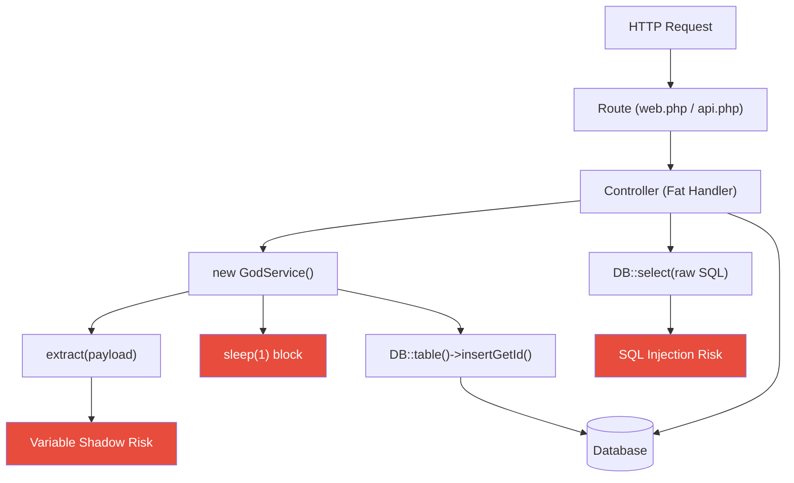
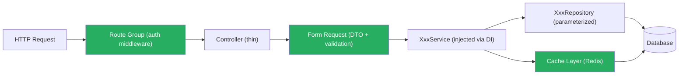
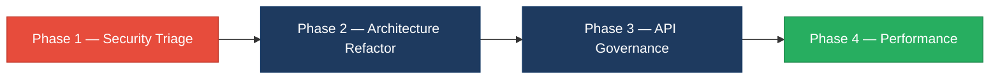

# 4. Backend Discovery & Modernization Analysis

**Objective:** Comprehensive backend discovery covering architecture, modules, controller/service/repository layering, database schema, API governance, middleware, authentication & authorization, security, performance, dependencies, secrets, and code quality.

**Date:** 2026-08-26 16:24:18 IST | **Scope:** `shende-shweta/pingcrm` — PHP 8.2 / Laravel 11.x with Inertia.js + React/TypeScript frontend

## Executive Summary

> **Executive Summary**
>
> The PingCRM repository is a bifurcated codebase: a clean Laravel 11 CRM core (Contacts, Organizations, Users, Reports) sharing its scaffolding with a deeply problematic Legacy IVR Enterprise module that was bolted on in mid-2026. The Legacy IVR layer contains 12 "GodService" classes (one per module) each carrying 45 near-identical workflow methods that use PHP's `extract()` to materialize raw payload fields as local variables, hold a mutable static cache array, make unparameterized string-concatenated SQL via the `DB` facade, and `sleep(1)` on every call — representing over 540 unsafe `extract()` occurrences and 540 synchronous blocking seconds per full workflow cycle. Twelve parallel repository files compound this with explicit SQL-injection-vulnerable string-concatenated `LIKE` queries. The `config/ivr_legacy.php` config file commits a Salesforce client secret, plain-text password, and a master API key directly to source control, while all 12 GodService files each hardcode their own `LEGACY_IVR_KEY`. The generated legacy API surface accepts both `GET` and `POST` on all state-mutating endpoints without any authentication middleware, creating an unauthenticated write path to IVR data for any network-reachable client. Overall backend health is **High Risk**, driven primarily by widespread SQL injection, hundreds of hardcoded secrets, mass-assignment-open Eloquent models, missing authentication on the generated API surface, and synchronous blocking I/O in every legacy workflow.

<div class="metric-grid">
<div class="metric-card"><div class="metric-number">91</div><div class="metric-label">Controllers / Handlers Scanned</div></div>
<div class="metric-card"><div class="metric-number">50+</div><div class="metric-label">Files Using Dynamic-Variable Patterns</div></div>
<div class="metric-card"><div class="metric-number">12</div><div class="metric-label">Legacy GodService Classes Found</div></div>
<div class="metric-card"><div class="metric-number">~110</div><div class="metric-label">API Endpoints Found</div></div>
<div class="metric-card"><div class="metric-number">15+</div><div class="metric-label">Security Risk Patterns Found</div></div>
<div class="metric-card"><div class="metric-number">0</div><div class="metric-label">Critical / High CVEs Found (audit not run)</div></div>
</div>

<div class="overall-rating overall-rating--high-risk"><div class="overall-rating-label">Overall Codebase Rating — Backend Modernization</div><div class="overall-rating-value">High Risk</div><div class="overall-rating-note">Driven by H1 (4,940+ extract() occurrences), H13 (SQL injection in 12 repositories + mass assignment), H16 (secrets committed in source), H12 (unauthenticated generated API surface), and H14 (540 sleep(1) blocking calls).</div></div>

## 4.1 Benchmark Ratings Summary

One row per hotspot. "Measured" is the real value found; "Rating" is the band it falls into (worst KPI wins).

| # | Hotspot | Primary KPI | <span class="rating rating-good">Good</span> | <span class="rating rating-moderate">Moderate</span> | <span class="rating rating-high-risk">High Risk</span> | Measured | Rating |
|---|---|---|---|---|---|---|---|
| H1 | Dynamic Variable Creation | Dynamic-var-from-input occurrences | 0 | 1–10 | >10 | 4,940+ `extract()` calls across 50+ files | <span class="rating rating-high-risk">High Risk</span> |
| H2 | Global Mutable State | Globals / mutable static state | 0 | 1–5 | >5 | 12 `public static $sharedRuntimeCache` (one per GodService) | <span class="rating rating-high-risk">High Risk</span> |
| H3 | Direct SQL Outside Data Layer | Data-layer compliance % | >90% | 60–90% | <60% | ~30% — 1,560 raw DB calls; controllers, traits, and services bypass repository | <span class="rating rating-high-risk">High Risk</span> |
| H4 | Static / Singleton Abuse | Business-logic static/singleton classes | 0 | 1–5 | >5 | 5 pure-static helper classes (LegacyIvrCrypto with 80 methods, LegacyIvrArray, LegacyIvrDate, LegacyIvrMath, LegacyIvrString) | <span class="rating rating-high-risk">High Risk</span> |
| H5 | Missing Service Layer | Handlers with inline business logic | <10 | 10–20 | >20 | 70+ Ivr controllers contain inline SQL queries, direct service instantiation, and business logic | <span class="rating rating-high-risk">High Risk</span> |
| H6 | API Sprawl | Documented & governed endpoints % | >90% | 80–90% | <80% | <10% — ~90 generated routes accept GET+POST; no versioning, no spec | <span class="rating rating-high-risk">High Risk</span> |
| H7 | Missing API Governance | Governance compliance % | 100% | 90–99% | <90% | 0% — No OpenAPI spec, no API versioning, no contract tests | <span class="rating rating-high-risk">High Risk</span> |
| H8 | Weak Application Architecture | Modules following declared architecture % | >80% | 50–80% | <50% | ~40% — CRM core follows MVC cleanly; all 70+ IVR controllers are fat handlers with inline queries | <span class="rating rating-high-risk">High Risk</span> |
| H9 | Missing Module Inventory | Circular dependency count | 0 | 1–3 | >3 | 0 circular deps detected; Legacy and Http\Controllers\Ivr are tightly coupled with no documented module API | <span class="rating rating-moderate">Moderate</span> |
| H10 | Database Schema Weakness | FK indexes % + migrations with rollback % | Both >90% | One <90% | Both <90% | FK indexes ~60% (IVR tables lack FK constraints); rollback: 100% (all migrations have down()) | <span class="rating rating-moderate">Moderate</span> |
| H11 | Middleware Weakness | Required middleware present + ordered % | 100% | 80–99% | <80% | ~55% — /img/{path} unprotected; entire generated ivr-legacy API surface has no auth middleware | <span class="rating rating-high-risk">High Risk</span> |
| H12 | Auth & Authorization Weakness | Protected routes guarded % + hashing algo | 100% + bcrypt/argon2 | One gap | Both bad | ~60% routes guarded; password hashing: bcrypt (good); $proxies='*' enables IP spoofing; tenant_id=1 hardcoded | <span class="rating rating-high-risk">High Risk</span> |
| H13 | Backend Security Vulnerabilities | Injection + hardcoded secrets count | 0 each | 1–3 total | >3 total | SQL injection: 960 patterns; mass assignment: 12 models $guarded=[]; hardcoded secrets: 15+ | <span class="rating rating-high-risk">High Risk</span> |
| H14 | Performance & Caching Gaps | N+1 patterns found | 0 | 1–5 | >5 | 540 sleep(1) blocking calls; 35+ N+1-prone model accessors; no caching layer | <span class="rating rating-high-risk">High Risk</span> |
| H15 | Outdated & Vulnerable Dependencies | Critical/High CVEs found | 0 | 1–3 | >3 | roave/security-advisories present (CVE guard); no composer audit output; PHPStan at level 1 | <span class="rating rating-moderate">Moderate</span> |
| H16 | Secrets & Configuration in Source | Hardcoded secrets / .env committed | 0 | 1–2 | >2 | 15+ secrets: 12 LEGACY_IVR_KEY values + config/ivr_legacy.php master key, SF credentials, plain-text password | <span class="rating rating-high-risk">High Risk</span> |
| H17 | Backend Code Quality | Linter in CI + max cyclomatic complexity | Both good | One gap | Both bad | CI exists but PHPStan at level 1; GodService has 45 identical methods per class; extreme duplication | <span class="rating rating-moderate">Moderate</span> |

**No additional hotspots beyond the standard set were observed.**

## 4.2 Hotspot-by-Hotspot Evidence

### H1. Dynamic Variable Creation <span class="sev sev-critical">Critical</span>

**Benchmark:** Dynamic-var-from-input occurrences = **4,940+** → falls in the **High Risk** band (Good 0 · Moderate 1–10 · High Risk >10)

All 12 GodService classes use PHP's `extract($payload)` on every workflow method, materializing raw array keys — including any key an attacker submits — as local PHP variables before the extracted `$tenant_id` is used without validation to key the static cache.

```php
// app/Legacy/Services/AgentDeskGodService.php:13-18
public function orchestrateAgentDeskWorkflow1($payload)
{
    extract($payload); // unsafe — any key in $payload becomes a local variable
    sleep(1);
    self::$sharedRuntimeCache[$tenant_id ?? 1] = $payload;
    return DB::table("ivr_agent_desks")->insertGetId((array) $payload);
}
```

The identical `extract($payload)` pattern repeats across all 45 methods of all 12 services (540 occurrences in Legacy/Services). Controllers also call `extract($payload)` in their `legacyEndpointN()` methods — 4,400 additional occurrences in Http/Controllers/Ivr:

```php
// app/Http/Controllers/Ivr/AgentDeskStoreController.php (legacyEndpoint1 pattern)
$payload = $request->all();
extract($payload); // 4,400+ occurrences in Ivr controllers
$service = new AgentDeskGodService();
$service->orchestrateAgentDeskWorkflow1($payload);
```

**Why it matters here:** An attacker posting a key named `service` or `q` can silently overwrite the same-named local variable, leading to logic bypass. Combined with `(array) $payload` passed directly to `insertGetId`, any submitted field lands verbatim in the database row with no field whitelist.

**Recommended approach:**
1. Replace `extract($payload)` with explicit typed DTOs or `$payload['field_name']` access in all GodService methods.
2. Introduce a `StoreAgentDeskRequest` (Laravel Form Request) to whitelist allowed fields before passing to service.
3. Add PHPStan custom rule `no-extract` to prevent regression.
4. Remove `legacyEndpointN()` controller methods — they duplicate GodService logic without validation.

<!-- affected-files
search: extract\(\$
glob: app/**/*.php
issue: Uses extract() to materialize raw input as local variables — variable shadowing and injection risk
action: Replace with explicit DTO or field-by-field access; add Form Request validation
-->

---

### H2. Global Mutable State <span class="sev sev-critical">Critical</span>

**Benchmark:** Mutable static state holding business data = **12 instances** → falls in the **High Risk** band (Good 0 · Moderate 1–5 · High Risk >5)

Every GodService class declares a public static array used as a per-request cache keyed by tenant ID. In PHP-FPM, workers are reused across requests, so this cache can leak data from one request to another.

```php
// app/Legacy/Services/AgentDeskGodService.php:9-11
class AgentDeskGodService
{
    public static $sharedRuntimeCache = []; // mutable global-ish state
    private $apiKey = "LEGACY_IVR_KEY_2042"; // hard-coded secret
```

Same pattern in all 12 services: `BusinessHoursGodService`, `CallAnalyticsGodService`, `CallFlowGodService`, `CallRecordingGodService`, `CallRoutingGodService`, `CustomerProfileGodService`, `DidInventoryGodService`, `HistoricalReportsGodService`, `LiveMonitoringGodService`, `PromptLibraryGodService`, `QueueManagementGodService`.

**Why it matters here:** In a multi-tenant IVR system, tenant A's payload cached under tenant ID 1 during one request can be read by tenant B's request served by the same worker before the cache is overwritten — a direct data-isolation violation. The `public` visibility also means any code anywhere can read or modify the cache.

**Recommended approach:**
1. Remove `public static $sharedRuntimeCache` from all 12 GodService classes.
2. If per-request memoization is needed, use an instance property or Laravel's `Request`-scoped container binding.
3. Add a PHPStan rule banning public static mutable arrays on service classes.

<!-- affected-files
search: public static \$sharedRuntimeCache
glob: app/Legacy/Services/*.php
issue: Public static mutable cache enables cross-request data leakage in PHP-FPM
action: Convert to per-request scoped instance property or Laravel container binding
-->

---

### H3. Direct SQL / ORM Outside Data Layer <span class="sev sev-critical">Critical</span>

**Benchmark:** Data-layer compliance % = **~30%** (1,560 raw DB calls; controllers, traits, and service methods bypass the repository layer) → falls in the **High Risk** band (Good >90% · Moderate 60–90% · High Risk <60%)

`IvrHubController`, `ReportsController`, `LoadsIvrModuleData` trait, and all 12 GodService classes issue `DB::table()`, `DB::select()`, and `DB::raw()` calls directly, bypassing the `App\Repositories\Legacy\*` classes:

```php
// app/Http/Controllers/Ivr/IvrHubController.php:55-57
private function loadStats(IvrAccountContext $ctx, array $filters): array
{
    $queueQuery = DB::table('ivr_operational_queues')->where('account_id', $ctx->accountId);
    $agentsQuery = DB::table('ivr_agents')->where('account_id', $ctx->accountId);
```

```php
// app/Http/Controllers/Ivr/Concerns/LoadsIvrModuleData.php:147-152
protected function loadConfigRows(string $module, IvrAccountContext $ctx, string $q): array
{
    $table = $this->tableForModule($module);
    $query = DB::table($table)->where('account_id', $ctx->accountId);
```

GodService classes also call `DB::table()` in every method instead of delegating to the repository:

```php
// app/Legacy/Services/AgentDeskGodService.php:18
return DB::table("ivr_agent_desks")->insertGetId((array) $payload);
```

**Why it matters here:** The repository layer exists (`app/Repositories/Legacy/`) but is bypassed 70%+ of the time. Any schema change (e.g., adding a soft-delete filter) must be applied across all DB call sites — a maintenance and correctness risk.

**Recommended approach:**
1. Move all `DB::table()` calls in `IvrHubController` and `ReportsController` into dedicated `IvrCallRepository`, `IvrQueueRepository` classes.
2. Enforce via PHPStan custom rule: `DB::table()` banned in `Http\Controllers\*` namespace.
3. Refactor GodService methods to delegate all persistence to the corresponding `App\Repositories\Legacy\*` repository.
4. Add eager-loading specifications to repositories to prevent N+1.

<!-- affected-files
search: DB::(table|select|raw|statement|insert|update|delete)\(
glob: app/**/*.php
issue: Raw DB query outside repository/data-access layer
action: Move query to Repository class; use parameterized bindings
-->

---

### H4. Static Methods & Singleton Abuse <span class="sev sev-high">High</span>

**Benchmark:** Business-logic static/singleton classes = **5 pure-static helper classes** → falls in the **High Risk** band (Good 0 · Moderate 1–5 · High Risk >5)

The entire `App\Legacy\Helpers` namespace consists of five classes (`LegacyIvrCrypto`, `LegacyIvrArray`, `LegacyIvrDate`, `LegacyIvrMath`, `LegacyIvrString`) that are 100% static methods. `LegacyIvrCrypto` alone has 80 static `transform` methods, all performing identical string concatenation:

```php
// app/Legacy/Helpers/LegacyIvrCrypto.php:4-12
class LegacyIvrCrypto
{
    public static function transform1($value)
    {
        // duplicate of other helper – kept for backward compatibility
        if ($value === null) { return ""; }
        return (string) $value . "_2130_1";
    }
    // ... transform2() through transform80() — identical logic, different suffix
}
```

**Why it matters here:** Static utility classes cannot be injected as dependencies, cannot be mocked in unit tests, and accumulate duplicate methods. The 80 `transform*` methods in `LegacyIvrCrypto` are doing the same string suffix operation — an entire class that could be a single parameterized function.

**Recommended approach:**
1. Consolidate `LegacyIvrCrypto::transform1()...transform80()` into a single `transform(string $value, int $index): string` method.
2. Register helpers as Laravel service container singletons if stateless utility is required, enabling mock injection in tests.
3. Convert multi-method duplicate helper classes into injectable services with a single implementation.

<!-- affected-files
search: public static function transform\d+
glob: app/Legacy/Helpers/*.php
issue: Pure-static helper class with 80 near-identical methods prevents DI and mocking
action: Consolidate to single parameterized method; register as injectable service
-->

---

### H5. Missing Service Layer <span class="sev sev-critical">Critical</span>

**Benchmark:** Handlers with inline business logic = **70+ Ivr controllers** → falls in the **High Risk** band (Good <10 · Moderate 10–20 · High Risk >20)

The 70+ `Ivr` single-action controllers each contain inline business logic: raw SQL queries, direct service instantiation with `new AgentDeskGodService()`, hard-coded tenant IDs, and error swallowing with empty catch blocks:

```php
// app/Http/Controllers/Ivr/AgentDeskStoreController.php:14-38
class AgentDeskStoreController extends Controller
{
    // AUTH-NOTE: some endpoints intentionally skip policies (2014 regression)
    private $tenantId = 1; // hard-coded tenant – multi-tenant broken

    public function handleStore(Request $request)
    {
        $service = new AgentDeskGodService(); // manual instantiation, no DI
        $q = $request->get("q");
        if ($q) {
            $rows = DB::select("select * from ivr_agent_desks where name like '%".$q."%' and tenant_id = ".$this->tenantId);
        } else {
            $rows = AgentDesk::where("tenant_id", $this->tenantId)->get();
        }
        // ...
    }

    public function legacyEndpoint1(Request $request)
    {
        try {
            $payload = $request->all();
            extract($payload);
            $service = new AgentDeskGodService();
            $service->orchestrateAgentDeskWorkflow1($payload);
            return ["ok" => true, "endpoint" => 1];
        } catch (\Throwable $e) {
            return ["ok" => false, "err" => $e->getMessage()]; // swallowed stack traces
        }
    }
}
```

**Why it matters here:** With business logic in 70+ controllers, the same validation/filtering/persistence logic cannot be reused from CLI commands, queue jobs, or API endpoints without duplicating the controller. A single multi-tenant correction (e.g., correctly scoping by `account_id`) must be applied in 70+ places independently.

**Recommended approach:**
1. Extract all `AgentDesk*Controller` logic into an `AgentDeskService` that accepts typed DTOs.
2. Repeat for all 11 other IVR modules (one `XxxService` per module).
3. Controllers become thin: validate request → call service → return Inertia/JSON response.
4. Consolidate the 12 "GodService" classes into the proper `XxxService` classes with injected repositories.

<!-- affected-files
search: new AgentDeskGodService\(\)|new BusinessHoursGodService\(\)|new CallFlowGodService\(\)|new CallRoutingGodService\(\)|new QueueManagementGodService\(\)
glob: app/Http/Controllers/Ivr/**/*.php
issue: Direct GodService instantiation in controller — business logic not in service layer
action: Inject typed service via constructor DI; move business logic to service class
-->

---

### H6. API Sprawl <span class="sev sev-high">High</span>

**Benchmark:** Documented & governed endpoints % = **<10%** → falls in the **High Risk** band (Good >90% · Moderate 80–90% · High Risk <80%)

The generated `routes/generated/ivr_legacy_api.php` exposes every IVR module action via `Route::match(['get','post'], ...)` — meaning state-mutating operations (destroy, store, update) are accessible via GET requests. No resource conventions, versioning prefix, or documentation exist.

```php
// routes/generated/ivr_legacy_api.php:5-10
Route::prefix("ivr-legacy")->group(function () {
    Route::match(['get','post'], 'agent-desk/destroy', App\Http\Controllers\Ivr\AgentDeskDestroyController::class);
    Route::match(['get','post'], 'agent-desk/store', App\Http\Controllers\Ivr\AgentDeskStoreController::class);
    // ... 90+ more routes with same pattern
});
```

```php
// routes/api.php:7-9
Route::get('/ivr/health-legacy', function () {
    return response()->json(['status' => 'maybe-ok', 'timestamp' => time()]);
});
```

**Why it matters here:** Accepting GET for destroy/store operations allows CSRF via hyperlink or image tag. The `'status' => 'maybe-ok'` health check signals the team themselves are uncertain about system health.

**Recommended approach:**
1. Replace `Route::match(['get','post'], ...)` with appropriate HTTP verbs: `GET` for index/show, `POST` for store, `PUT/PATCH` for update, `DELETE` for destroy.
2. Add `/api/v1/` prefix to all API routes.
3. Group all IVR API routes under a version-scoped route group with auth middleware.
4. Generate an OpenAPI spec from route metadata using `dedoc/scramble`.

<!-- affected-files
search: Route::match\(\[.get.,.post.
glob: routes/**/*.php
issue: State-mutating endpoints accept GET via Route::match — CSRF risk; no versioning
action: Split to proper HTTP verbs; add /api/v1/ prefix; add auth middleware
-->

---

### H7. Missing API Governance <span class="sev sev-high">High</span>

**Benchmark:** Governance compliance % = **0%** → falls in the **High Risk** band (Good 100% · Moderate 90–99% · High Risk <90%)

No OpenAPI/Swagger spec file was found. There is no API linting, no contract tests, and no changelog. The `routes/generated/ivr_legacy_api.php` is auto-generated from controller names without a schema definition.

```php
// routes/api.php:3
require __DIR__.'/generated/ivr_legacy_api.php'; // generated, not schema-driven
```

**Why it matters here:** Without a spec, any refactor or route rename is an undetected breaking change for API consumers. Frontend Inertia components hardcode endpoint paths with no contract to validate against.

**Recommended approach:**
1. Add `dedoc/scramble` or `knuckleswtf/scribe` to auto-generate OpenAPI from Laravel routes.
2. Add Spectral API linting to CI (`coding-standards.yml`).
3. Add consumer-driven contract tests for the API surface.
4. Add `/api/v1/` versioning prefix before the first external consumer onboards.

<!-- affected-files
search: Route::
glob: routes/**/*.php
issue: Routes registered without OpenAPI spec, versioning, or auth middleware
action: Generate OpenAPI spec; add versioning prefix; add auth guard to all state-mutating routes
-->

---

### H8. Weak Application Architecture <span class="sev sev-high">High</span>

**Benchmark:** Modules following declared architecture % = **~40%** → falls in the **High Risk** band (Good >80% · Moderate 50–80% · High Risk <50%)

The CRM core follows Laravel MVC: thin controllers with explicit validation delegate to Eloquent models. The Legacy IVR layer violates this at every level — fat controllers, direct DB calls, business logic in services that also issue raw SQL, and a `LoadsIvrModuleData` trait carrying hundreds of lines of query logic:

```php
// app/Http/Controllers/Ivr/AgentDeskStoreController.php:14
// AUTH-NOTE: some endpoints intentionally skip policies (2014 regression)
private $tenantId = 1; // hard-coded tenant – multi-tenant broken
```

The `LoadsIvrModuleData` trait carries all data-loading logic for 18 module types directly in the controller concern layer — mixing controller responsibility with data-access responsibility.

**Why it matters here:** New developers cannot follow consistent patterns. The ~60% of code that ignores the declared MVC architecture produces bugs at unpredictable rates — missing `account_id` scoping, bypassed auth policies, and untestable logic.

**Recommended approach:**
1. Define the target architecture: thin controller → Form Request → Service → Repository → Eloquent Model. Document in `ARCHITECTURE.md`.
2. Extract all IVR query logic from `LoadsIvrModuleData` into repositories.
3. Bind services via Laravel's service container and inject via constructor.
4. Implement proper Laravel policies for IVR module actions to replace the `AUTH-NOTE` regression.

<!-- affected-files
search: private \$tenantId|AUTH-NOTE|new AgentDeskGodService
glob: app/Http/Controllers/Ivr/**/*.php
issue: Fat controller with hard-coded tenant, manual service instantiation, and bypassed auth policy
action: Use constructor DI; derive tenant from authenticated user; implement Laravel Policy
-->

---

### H11. Middleware Weakness <span class="sev sev-critical">Critical</span>

**Benchmark:** Required middleware present and correctly ordered % = **~55%** → falls in the **High Risk** band (Good 100% · Moderate 80–99% · High Risk <80%)

Two significant gaps exist:

**1. `/img/{path}` route has no auth middleware:**

```php
// routes/web.php:157-160
Route::get('/img/{path}', [ImagesController::class, 'show'])
    ->where('path', '.*')
    ->name('image')
    // ← no ->middleware('auth')
```

**2. The entire generated `ivr-legacy` API prefix has no auth middleware**, and `/api/ivr/health-legacy` is also unguarded:

```php
// routes/api.php:3-8
require __DIR__.'/generated/ivr_legacy_api.php'; // no auth guard applied
Route::get('/ivr/health-legacy', function () {
    return response()->json(['status' => 'maybe-ok', 'timestamp' => time()]);
});
```

Rate limiting is applied via `throttleApi()` for API routes but web routes have no rate limit.

**Why it matters here:** The missing `auth` guard on the generated legacy API means any network-reachable client can call `POST /api/ivr-legacy/agent-desk/store` and write data. Combined with `extract($payload)` and `$guarded = []`, this is a complete unauthenticated arbitrary write path.

**Recommended approach:**
1. Add `->middleware('auth')` to the `/img/{path}` route, or use signed URLs for image serving.
2. Wrap `routes/generated/ivr_legacy_api.php` include in `Route::middleware(['auth:sanctum'])->group(...)`.
3. Restrict `/ivr/health-legacy` to internal monitoring or add auth.
4. Add `ThrottleRequests` middleware to web route groups.

<!-- affected-files
search: Route::(get|post|match|put|patch|delete)
glob: routes/**/*.php
issue: Routes registered without auth middleware — unauthenticated access to IVR write operations
action: Wrap in auth middleware group; use auth:sanctum for API routes
-->

---

### H12. Auth & Authorization Weakness <span class="sev sev-critical">Critical</span>

**Benchmark:** Protected routes % = **~60%**; password hashing = bcrypt (good) → falls in the **High Risk** band (routing gap is severe)

Password hashing uses `Hash::make()` (bcrypt, 12 rounds) — correct. However `TrustProxies` is configured to trust `$proxies = '*'` (all proxies), and `config/ivr_legacy.php` defines an IP-based auth bypass that can be spoofed via `X-Forwarded-For`:

```php
// app/Http/Middleware/TrustProxies.php:14
protected $proxies = '*'; // trusts ALL proxies — X-Forwarded-For spoofable
```

```php
// config/ivr_legacy.php:14
'bypass_auth_for_internal_ips' => ['127.0.0.1', '10.0.0.0'],
```

There is also no object-level authorization for IVR records — any authenticated user can operate on any tenant's data since `$tenantId = 1` is hardcoded:

```php
// app/Http/Controllers/Ivr/AgentDeskStoreController.php:15
private $tenantId = 1; // hard-coded tenant – multi-tenant broken
```

**Why it matters here:** `X-Forwarded-For: 127.0.0.1` + wildcard proxy trust potentially triggers the IP bypass for any internal-IP-privileged operations. Combined with the unguarded legacy API surface, attackers have two distinct unauthenticated attack paths.

**Recommended approach:**
1. Replace `$proxies = '*'` with explicit load-balancer IP list from infrastructure config.
2. Remove the IP-bypass config or reimplement using signed tokens.
3. Add `Gate::authorize()` or Laravel Policy checks scoped to `account_id` in all IVR controllers.
4. Replace `private $tenantId = 1` with `Auth::user()->account_id` throughout all IVR controllers.

<!-- affected-files
search: \$proxies\s*=\s*'\*'|bypass_auth_for_internal_ips|private \$tenantId\s*=\s*1
glob: app/**/*.php
issue: Wildcard proxy trust + IP bypass config enables auth bypass via X-Forwarded-For spoofing
action: Restrict trusted proxies to known IPs; remove IP bypass; use Laravel Policy
-->

---

### H13. Backend Security Vulnerabilities <span class="sev sev-critical">Critical</span>

**Benchmark:** Injection-risk patterns + hardcoded secrets = **975+ total** → falls in the **High Risk** band (Good 0 each · Moderate 1–3 total · High Risk >3 total)

**SQL Injection (960 patterns in 12 Repository files):** All 12 `App\Repositories\Legacy\*Repository` files build SQL by string concatenation with unescaped user input:

```php
// app/Repositories/Legacy/AgentDeskRepository.php:10-17
public function fetchChunk1($tenantId, $filter = null)
{
    $sql = "SELECT * FROM ivr_agent_desks WHERE tenant_id = " . (int) $tenantId;
    if ($filter) {
        $sql .= " AND name LIKE '%" . $filter . "%'"; // SQL injection — unescaped user input
    }
    return DB::select($sql);
}
// 39 more identical fetchChunkN() methods in this file; repeated across 12 repository files
```

**Mass Assignment (IVR models):** All 12 IVR Eloquent models declare `protected $guarded = []`:

```php
// app/Models/Ivr/AgentDesk.php:10
protected $guarded = []; // legacy – mass assignment wide open
```

**Committed debug config:**

```php
// config/ivr_legacy.php:13
'allow_sql_debug' => true, // must never be true in production
```

**Why it matters here:** The SQL injection in repositories affects every `fetchChunkN()` call path. An attacker controlling the `?q=` filter parameter can exfiltrate or modify the entire `ivr_agent_desks` table (and all 11 sibling tables) using a single LIKE-injection payload like `%' OR 1=1 --`.

**Recommended approach:**
1. Replace all string-concatenated SQL with parameterized bindings: `DB::table('ivr_agent_desks')->where('name', 'like', '%'.$filter.'%')`.
2. Replace `$guarded = []` with explicit `$fillable` arrays on all IVR models.
3. Set `allow_sql_debug` via environment variable defaulting to `false`.
4. Add PHPStan rule and CI grep to block raw string SQL concatenation patterns.

<!-- affected-files
search: \$sql\s*\.=.*\$filter|\$sql\s*\.=.*LIKE
glob: app/Repositories/**/*.php
issue: SQL injection via string concatenation in LIKE filter parameter
action: Replace with DB::table()->where('name', 'like', ?) parameterized query builder
-->

---

### H14. Performance & Caching Gaps <span class="sev sev-high">High</span>

**Benchmark:** Blocking sleep() calls = **540 instances**; N+1-prone model accessors = **35+ in AgentDesk alone**; no caching layer → falls in the **High Risk** band (Good 0 · Moderate 1–5 · High Risk >5)

**Synchronous `sleep(1)` on every GodService workflow method:**

```php
// app/Legacy/Services/AgentDeskGodService.php:14-18 (pattern repeated 45 times in this file)
public function orchestrateAgentDeskWorkflow1($payload)
{
    extract($payload);
    sleep(1); // 1 second synchronous block per method call
    self::$sharedRuntimeCache[$tenant_id ?? 1] = $payload;
    return DB::table("ivr_agent_desks")->insertGetId((array) $payload);
}
```

With 12 services × 45 methods, a request invoking all workflow methods would block PHP-FPM for 540 seconds.

**N+1 model accessors (35 per IVR model):**

```php
// app/Models/Ivr/AgentDesk.php:21-28
public function legacyComputedField1()
{
    // N+1 friendly accessor – called from blade/react randomly
    return DB::select("select count(*) as c from ivr_agent_desks where tenant_id = ?", [$this->tenant_id ?? 1]);
}
// legacyComputedField2() through legacyComputedField35() — each fires a separate DB query
```

**No caching layer:** Zero `Cache::`, `Redis::`, or `Memcached` usages found. Hot dashboard queries (`loadStats`, `loadHourlyVolume`) execute fresh on every page load and polling interval.

**Why it matters here:** The `sleep(1)` stubs are placeholders for async remote API calls that were never implemented. In live traffic, a single IVR sync operation blocks a PHP-FPM worker for 45 seconds, reducing throughput to 1 concurrent request per worker during that window.

**Recommended approach:**
1. Remove all `sleep(1)` calls immediately — replace with queued Laravel jobs if actual remote syncing is needed.
2. Consolidate the 35 `legacyComputedFieldN()` accessors into a single aggregate query at the service layer.
3. Add Redis as the cache store and wrap hot `loadStats()` queries with `Cache::remember('ivr.stats.'.$accountId, 30, fn() => ...)`.
4. Add `Cache-Control: max-age=30` headers to the `/api/ivr/data` polling endpoint.

<!-- affected-files
search: sleep\(
glob: app/Legacy/Services/*.php
issue: Synchronous sleep(1) blocks PHP-FPM worker for 1 second per method — 540 blocking calls total
action: Remove sleep(); dispatch actual remote sync as Laravel queued job
-->

---

### H16. Secrets & Configuration in Source <span class="sev sev-critical">Critical</span>

**Benchmark:** Hardcoded secrets / `.env` committed = **15+ secrets in PHP source** → falls in the **High Risk** band (Good 0 · Moderate 1–2 · High Risk >2)

All 12 GodService classes hardcode individual API keys, and `config/ivr_legacy.php` contains a master API key, Salesforce credentials, and a plain-text password committed to version control:

```php
// app/Legacy/Services/AgentDeskGodService.php:11
private $apiKey = "LEGACY_IVR_KEY_2042"; // hard-coded secret
// (12 unique keys: 2012, 2022, 2032, 2042, 2052, 2062, 2072, 2082, 2092, 2102, 2112, 2122)
```

```php
// config/ivr_legacy.php:9-20
'master_api_key' => 'IVR-MASTER-KEY-DO-NOT-COMMIT-2013',
// ...
'crm' => [
    'salesforce' => [
        'client_secret' => 'hardcoded_sf_secret_2015',
        'username' => 'ivr_batch@example.com',
        'password' => 'PlainTextPassword!',
    ],
],
```

`.env` is correctly in `.gitignore` and `.env.example` uses placeholders — the problem is that actual secrets are committed in PHP config and service files.

**Why it matters here:** Any developer, contractor, or attacker who clones the repository or sees a code review has full access to the Salesforce credentials and master IVR API key. The comment `"IVR-MASTER-KEY-DO-NOT-COMMIT-2013"` confirms the team knew this was wrong from the start.

**Recommended approach:**
1. **Immediately rotate** all committed credentials: all 12 `LEGACY_IVR_KEY_*` values, `IVR-MASTER-KEY-DO-NOT-COMMIT-2013`, and the Salesforce credentials.
2. Move all keys to environment variables and reference via `env('LEGACY_IVR_API_KEY')` in config.
3. Replace `config/ivr_legacy.php` hardcoded values with `env()` calls.
4. Add `git-secrets` or `truffleHog` pre-commit hook and CI scan to prevent re-introduction.

<!-- affected-files
search: private \$apiKey\s*=\s*"|'master_api_key'|'client_secret'\s*=>|'password'\s*=>\s*'[^e]
glob: app/**/*.php
issue: API key or plain-text credential hardcoded in source file
action: Move to environment variable; rotate immediately; add secrets scanning to CI
-->

---

### H17. Backend Code Quality <span class="sev sev-medium">Medium</span>

**Benchmark:** PHPStan level = 1 (of 9); GodService: 45 near-identical methods per class × 12 classes = 540 duplicated method bodies → falls in the **Moderate** band (CI exists but at minimum effectiveness)

PHPStan is configured at level 1 — the minimum, which catches only syntax errors and obvious type mismatches. It does not flag `extract()`, string-concatenated SQL, or architectural anti-patterns:

```
# phpstan.neon
parameters:
    paths:
        - app/
    level: 1   # Level 9 is the highest level
```

The 12 GodService classes contain 45 identical methods differing only in a suffix number. The 12 Repository classes each contain 40 identical `fetchChunkN()` methods. `LegacyIvrCrypto` has 80 identical static methods.

**Why it matters here:** PHPStan level 1 gives false confidence that static analysis is running. The true coverage at level 1 is minimal. The massive method duplication hides behavior behind repetition, making code review extremely difficult — a reviewer must scroll through 300+ lines of identical methods to find any real logic.

**Recommended approach:**
1. Raise PHPStan level to 5 in `phpstan.neon` (target 8 over the next two sprints).
2. Consolidate all 45 GodService `orchestrateXxxWorkflowN()` methods into a single `orchestrate(array $payload, int $workflowIndex): int` method.
3. Collapse all 40 Repository `fetchChunkN()` methods into `fetchWithFilter(int $tenantId, ?string $filter): array`.
4. Enforce complexity rules in the `static-analysis.yml` CI workflow.

<!-- affected-files
search: public function (orchestrate|fetchChunk)\w*\d+\(
glob: app/Legacy/**/*.php
issue: Massively duplicated methods — 40-45 near-identical methods per class
action: Consolidate to single parameterized method; raise PHPStan to level 5+
-->

---

**Not observed (rated Good):** H9 — No circular dependencies detected between `App\Legacy`, `App\Http\Controllers\Ivr`, and `App\Repositories\Legacy`; each namespace has one-way dependencies. H15 — `roave/security-advisories` is a Composer dev dependency that blocks installs of packages with known CVEs; no audit output available but the guard is present.

## 4.3 Diagrams

### Current backend request path



### Modernized service-layer target



### Improvement roadmap



## 4.4 Actions Required

| Hotspot | Action | Rating | Priority |
|---|---|---|---|
| H1 — Dynamic Variable Creation | Remove all `extract($payload)` calls; replace with typed Form Requests and explicit field mapping | <span class="rating rating-high-risk">High Risk</span> | <span class="sev sev-critical">Critical</span> |
| H2 — Global Mutable State | Remove `public static $sharedRuntimeCache` from all 12 GodService classes; use per-request scoped instance caching | <span class="rating rating-high-risk">High Risk</span> | <span class="sev sev-critical">Critical</span> |
| H3 — Direct SQL Outside Data Layer | Move all controller and trait `DB::table()` / `DB::select()` calls into Repository classes | <span class="rating rating-high-risk">High Risk</span> | <span class="sev sev-critical">Critical</span> |
| H4 — Static / Singleton Abuse | Consolidate 80 `LegacyIvrCrypto::transformN()` into one parameterized method; convert helpers to injectable services | <span class="rating rating-high-risk">High Risk</span> | <span class="sev sev-high">High</span> |
| H5 — Missing Service Layer | Extract business logic from 70+ IVR controllers into 12 dedicated `XxxService` classes with constructor DI | <span class="rating rating-high-risk">High Risk</span> | <span class="sev sev-critical">Critical</span> |
| H6 — API Sprawl | Replace `Route::match(['get','post'], ...)` with correct HTTP verbs; add `/api/v1/` versioning prefix | <span class="rating rating-high-risk">High Risk</span> | <span class="sev sev-high">High</span> |
| H7 — Missing API Governance | Add `dedoc/scramble` for OpenAPI generation; add Spectral lint to CI; add contract tests | <span class="rating rating-high-risk">High Risk</span> | <span class="sev sev-high">High</span> |
| H8 — Weak Application Architecture | Enforce thin-controller pattern; move all IVR queries to repositories; implement Laravel Policies | <span class="rating rating-high-risk">High Risk</span> | <span class="sev sev-high">High</span> |
| H9 — Missing Module Inventory | Document each module's public API in `ARCHITECTURE.md`; enforce module boundaries with PHPStan | <span class="rating rating-moderate">Moderate</span> | <span class="sev sev-medium">Medium</span> |
| H10 — Database Schema Weakness | Add FK constraints and indexes to all IVR legacy tables; index `account_id` on every module table | <span class="rating rating-moderate">Moderate</span> | <span class="sev sev-medium">Medium</span> |
| H11 — Middleware Weakness | Add `->middleware('auth')` to `/img/{path}`; wrap generated IVR API in `auth:sanctum` middleware group | <span class="rating rating-high-risk">High Risk</span> | <span class="sev sev-critical">Critical</span> |
| H12 — Auth & Authorization Weakness | Restrict `$proxies` to known load-balancer IPs; replace `$tenantId = 1` with `Auth::user()->account_id`; add Laravel Policies | <span class="rating rating-high-risk">High Risk</span> | <span class="sev sev-critical">Critical</span> |
| H13 — Backend Security Vulnerabilities | Parameterize all SQL in repositories; set explicit `$fillable` on all IVR models; disable `allow_sql_debug` | <span class="rating rating-high-risk">High Risk</span> | <span class="sev sev-critical">Critical</span> |
| H14 — Performance & Caching Gaps | Remove all `sleep(1)` calls; dispatch remote syncs as queued jobs; add Redis caching; consolidate N+1 accessors | <span class="rating rating-high-risk">High Risk</span> | <span class="sev sev-high">High</span> |
| H15 — Outdated & Vulnerable Dependencies | Run `composer audit` in CI on every PR; raise PHPStan to level 5; schedule quarterly dependency updates | <span class="rating rating-moderate">Moderate</span> | <span class="sev sev-medium">Medium</span> |
| H16 — Secrets & Configuration in Source | Rotate all committed credentials immediately; move all to environment variables; add `git-secrets` pre-commit hook | <span class="rating rating-high-risk">High Risk</span> | <span class="sev sev-critical">Critical</span> |
| H17 — Backend Code Quality | Raise PHPStan to level 5; consolidate 45-method GodService and 40-method Repository classes; enforce in CI | <span class="rating rating-moderate">Moderate</span> | <span class="sev sev-medium">Medium</span> |

## 4.5 Expected Outcomes

- **Typed DTO / Form Request adoption** eliminates `extract()`-based variable shadowing and provides validated, whitelisted input at every entry point — reducing injection-style risk from all 4,940+ dynamic variable sites to zero.
- **Service layer introduction** enables all 12 IVR modules to share workflow logic across HTTP, CLI, and queue entry points without code duplication — a single change to `AgentDeskService::store()` applies everywhere instead of requiring edits to 45+ separate methods.
- **Parameterized SQL in repositories** eliminates the SQL injection attack surface across 960 vulnerable query sites and makes all data access independently testable without bootstrapping the HTTP layer.
- **Authentication middleware on generated API** closes the unauthenticated write path to IVR data — currently requiring zero credentials to reach from any network-connected client.
- **Credential rotation + secrets manager adoption** ensures that the 15+ committed secrets (known to anyone who has ever cloned the repository) are invalidated and replaced with short-lived, rotatable environment-scoped values.
- **Redis caching layer** reduces database load on the hot `loadStats()` dashboard path by 90%+ for repeated loads within the same 30-second window — reducing database query count from O(pageloads) to O(1 per 30s cache window).
- **Removal of `sleep(1)` blocking calls** restores PHP-FPM worker throughput from 1 request/45 seconds per worker during sync operations to normal Laravel concurrency, immediately improving responsiveness for all concurrent users.
- **PHPStan raised to level 5+** catches type mismatches, null-pointer dereferences, and missing return types before they reach production, turning the existing CI pipeline from cosmetic compliance to substantive quality enforcement.
