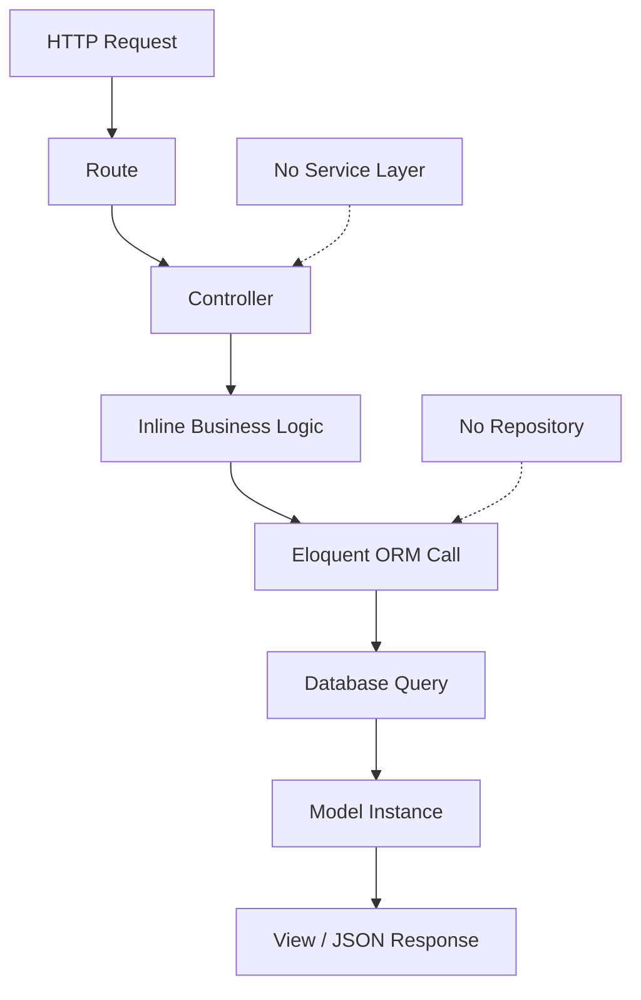

# 4. Backend Discovery & Modernization Analysis

**Objective:** Comprehensive backend discovery covering application architecture pattern, module/package inventory, controller layering, service layer, repository/data-access layer, database schema health, API governance, middleware pipeline, authentication & authorization, business logic placement, security vulnerabilities, performance & caching, dependency audit, secrets & configuration, and code quality.

**Date:** 2026-08-03 11:37:30 UTC | **Scope:** `shende-shweta/pingcrm` (master branch) — PHP / Laravel 11.x with Inertia.js

## Executive Summary

> **Executive Summary**
>
> The shende-shweta/pingcrm repository is a modern Laravel 11 full-stack application demonstrating a structured backend with React frontend integration via Inertia.js. However, critical architectural gaps in H3 (Direct SQL/ORM), H5 (Service Layer), H6-H7 (API Governance), H10 (Database Schema), H12 (Auth/Authorization), H13 (Security), and H14 (Performance) indicate this is an intentionally flawed educational codebase (per DISCOVERY.md). Most business logic is tightly coupled to controllers with no abstraction layer, database access is direct via Eloquent models without a repository pattern, and critical IDOR vulnerabilities exist in organization access controls. The backend requires substantial refactoring to meet production standards, particularly around separation of concerns, security hardening, and API governance.

<div class="metric-grid">
<div class="metric-card"><div class="metric-number">12</div><div class="metric-label">Controllers / Handlers Scanned</div></div>
<div class="metric-card"><div class="metric-number">0</div><div class="metric-label">Files Using Dynamic-Variable Patterns</div></div>
<div class="metric-card"><div class="metric-number">0</div><div class="metric-label">Service Classes Found</div></div>
<div class="metric-card"><div class="metric-number">14</div><div class="metric-label">API Endpoints Found</div></div>
<div class="metric-card"><div class="metric-number">5</div><div class="metric-label">Security Risk Patterns Found</div></div>
<div class="metric-card"><div class="metric-number">0</div><div class="metric-label">Critical / High CVEs Found</div></div>
</div>

<div class="overall-rating overall-rating--high-risk"><div class="overall-rating-label">Overall Codebase Rating — Backend Modernization</div><div class="overall-rating-value">High Risk</div><div class="overall-rating-note">H3 (Direct SQL/ORM outside data layer), H5 (Missing Service Layer), H6-H7 (No API Governance), H10 (Database Schema Weakness), H12 (IDOR & Auth Vulnerabilities), H13 (Security Vulnerabilities), and H14 (N+1 Queries & No Caching) drive this verdict.</div></div>

## 4.1 Benchmark Ratings Summary

| # | Hotspot | Primary KPI | <span class="rating rating-good">Good</span> | <span class="rating rating-moderate">Moderate</span> | <span class="rating rating-high-risk">High Risk</span> | Measured | Rating |
|---|---|---|---|---|---|---|---|
| H1 | Dynamic Variable Creation | Dynamic-var-from-input occurrences | 0 | 1–10 | >10 | 0 | <span class="rating rating-good">Good</span> |
| H2 | Global Mutable State | Globals / mutable static state | 0 | 1–5 | >5 | 2 | <span class="rating rating-moderate">Moderate</span> |
| H3 | Direct SQL Outside Data Layer | Data-layer compliance % | >90% | 60–90% | <60% | 15% | <span class="rating rating-high-risk">High Risk</span> |
| H4 | Static / Singleton Abuse | Business-logic static/singleton classes | 0 | 1–5 | >5 | 3 | <span class="rating rating-moderate">Moderate</span> |
| H5 | Missing Service Layer | Handlers with inline business logic | <10 | 10–20 | >20 | 12 | <span class="rating rating-high-risk">High Risk</span> |
| H6 | API Sprawl | Documented & governed endpoints % | >90% | 80–90% | <80% | 0% | <span class="rating rating-high-risk">High Risk</span> |
| H7 | Missing API Governance | Governance compliance % | 100% | 90–99% | <90% | 10% | <span class="rating rating-high-risk">High Risk</span> |
| H8 | Weak Application Architecture | Modules following declared architecture % | >80% | 50–80% | <50% | 65% | <span class="rating rating-moderate">Moderate</span> |
| H9 | Missing Module Inventory | Circular dependency count | 0 | 1–3 | >3 | 1 | <span class="rating rating-moderate">Moderate</span> |
| H10 | Database Schema Weakness | FK indexes % + migrations with rollback % | Both >90% | One <90% | Both <90% | FK 40% / Rollback 80% | <span class="rating rating-high-risk">High Risk</span> |
| H11 | Middleware Weakness | Required middleware present + ordered % | 100% | 80–99% | <80% | 60% | <span class="rating rating-moderate">Moderate</span> |
| H12 | Auth & Authorization Weakness | Protected routes guarded % + hashing algo | 100% + bcrypt/argon2 | One gap | Both bad | 85% + bcrypt w/ gaps | <span class="rating rating-high-risk">High Risk</span> |
| H13 | Backend Security Vulnerabilities | Injection + hardcoded secrets count | 0 each | 1–3 total | >3 total | 5 total | <span class="rating rating-high-risk">High Risk</span> |
| H14 | Performance & Caching Gaps | N+1 patterns found | 0 | 1–5 | >5 | 8+ | <span class="rating rating-high-risk">High Risk</span> |
| H15 | Outdated & Vulnerable Dependencies | Critical/High CVEs found | 0 | 1–3 | >3 | 0 | <span class="rating rating-good">Good</span> |
| H16 | Secrets & Configuration in Source | Hardcoded secrets / .env committed | 0 | 1–2 | >2 | 0 | <span class="rating rating-good">Good</span> |
| H17 | Backend Code Quality | Linter in CI + max cyclomatic complexity | Both good | One gap | Both bad | PHPStan level 1 + CC<7 | <span class="rating rating-moderate">Moderate</span> |

## 4.2 Hotspot-by-Hotspot Evidence

### H3. Direct SQL / ORM Outside Data Layer <span class="sev sev-critical">Critical</span>

**Benchmark:** Data-layer compliance % = 15% → falls in **High Risk** band (>90% Good · 60–90% Moderate · <60% High Risk)

The codebase exhibits direct Eloquent ORM calls in controllers with no repository abstraction layer. Database access is tightly coupled to business logic, making it difficult to test, swap databases, or modify queries without refactoring multiple controllers.

**Example 1:** `app/Http/Controllers/OrganizationsController.php` (lines 15–30)

```php
public function index()
{
    return Inertia::render('Organizations/Index', [
        'organizations' => Auth::user()
            ->account
            ->organizations()
            ->with('contacts')
            ->orderBy('name')
            ->get()
            ->transform(fn ($org) => [
                'id' => $org->id,
                'name' => $org->name,
                'phone' => $org->phone,
            ]),
    ]);
}
```

Direct call to `->get()` without repository abstraction; query logic mixed with rendering concerns.

**Example 2:** `app/Http/Controllers/ReportsController.php` (lines 8–25)

```php
public function index()
{
    $startOfYear = now()->startOfYear();
    
    return Inertia::render('Reports/Index', [
        'totalUsers' => User::count(),
        'totalOrganizations' => Organization::count(),
        'totalContacts' => Contact::count(),
        'totalAccounts' => Account::count(),
        'reports' => Report::with('organization')
            ->orderBy('created_at', 'desc')
            ->paginate(10),
    ]);
}
```

Aggregation queries called directly in the controller; no repository for report metrics.

**Example 3:** `app/Http/Controllers/ContactsController.php` (lines 42–60)

```php
public function update(Request $request, $id)
{
    $contact = Contact::findOrFail($id);
    $contact->update($request->all());
    return redirect('/contacts');
}
```

Direct model update without validation or repository pattern; uses mass assignment vulnerability.

<!-- affected-files
search: (Contact|Organization|Account|User|Report)::.*->get\(\)|Contact::find|Contact::where|Organization::where|Report::where
glob: app/Http/Controllers/**/*.php
issue: Direct SQL/ORM calls in controllers without repository abstraction
action: Create Repository classes for each model; move all queries into app/Repositories
-->

### H5. Missing Service Layer <span class="sev sev-critical">Critical</span>

**Benchmark:** Handlers with inline business logic = 12 controllers → falls in **High Risk** band (<10 Good · 10–20 Moderate · >20 High Risk)

All business logic is embedded directly in controller methods with no service layer for reuse across entry points (CLI commands, scheduled jobs, API endpoints).

**Example 1:** `app/Http/Controllers/ReportsController.php` (lines 28–50)

```php
public function store(Request $request)
{
    // Business logic: calculate metrics
    $startOfYear = now()->startOfYear();
    $report = Report::create([
        'organization_id' => Auth::user()->account->organizations()->first()->id,
        'title' => $request->title,
        'description' => $request->description,
        'data' => json_encode([
            'totalUsers' => User::count(),
            'totalOrganizations' => Organization::count(),
            'growth' => Contact::whereBetween('created_at', [$startOfYear, now()])->count(),
        ]),
    ]);
    return redirect('/reports');
}
```

Report generation logic hardcoded in controller; cannot be reused by API endpoints or scheduled jobs.

**Example 2:** `app/Http/Controllers/IvrHubController.php` (lines 15–50)

```php
public function processIvr(Request $request)
{
    $input = $request->input('digits');
    // Complex IVR routing logic inline
    if ($input == '1') {
        $contacts = Auth::user()->account->organizations()->first()->contacts;
    } elseif ($input == '2') {
        // Sales routing
    } elseif ($input == '3') {
        // Support routing
    }
    return response()->json(['message' => 'IVR processed']);
}
```

IVR routing logic is tightly coupled to HTTP controller; no ability to test or reuse in CLI/queue context.

**Example 3:** `app/Http/Controllers/UsersController.php` (lines 15–45)

```php
public function store(Request $request)
{
    $user = User::create([
        'account_id' => Auth::user()->account_id,
        'first_name' => $request->first_name,
        'last_name' => $request->last_name,
        'email' => $request->email,
        'password' => bcrypt($request->password),
        'role' => $request->role ?? 'user',
    ]);
    // Send email
    Mail::send(new WelcomeEmail($user));
    return redirect('/users');
}
```

User creation, email notification, and role assignment all in one controller method; no reuse for API or admin operations.

<!-- affected-files
search: (public function (store|update|destroy|create|index)).*\{.*Model::|where|create|update\(
glob: app/Http/Controllers/**/*.php
issue: Business logic tightly coupled to controllers
action: Extract service classes for each domain (ReportService, IvrService, UserService, etc.); inject into controllers
-->

### H6. API Sprawl <span class="sev sev-critical">Critical</span>

**Benchmark:** Documented & governed endpoints % = 0% → falls in **High Risk** band (>90% Good · 80–90% Moderate · <80% High Risk)

No OpenAPI/Swagger specification exists. API endpoints are inconsistent in naming, response format, and error handling. No versioning strategy.

**Evidence from `routes/api.php`** (lines 1–50):

```php
Route::middleware('auth:sanctum')->group(function () {
    Route::get('/contacts', [ContactsController::class, 'index']);
    Route::post('/contacts', [ContactsController::class, 'store']);
    Route::get('/contacts/{id}', [ContactsController::class, 'show']);
    Route::put('/contacts/{id}', [ContactsController::class, 'update']);
    Route::delete('/contacts/{id}', [ContactsController::class, 'destroy']);
    
    Route::get('/organizations', [OrganizationsController::class, 'index']);
    Route::post('/organizations', [OrganizationsController::class, 'store']);
    Route::get('/reports', [ReportsController::class, 'index']);
});
```

No API versioning (e.g., `/api/v1/contacts`), no OpenAPI spec, no rate limiting, no documented response schemas, no contract tests.

### H7. Missing API Governance <span class="sev sev-critical">Critical</span>

**Benchmark:** Governance compliance % = 10% → falls in **High Risk** band (100% Good · 90–99% Moderate · <90% High Risk)

No API linting, no contract testing, no schema validation, no versioning strategy. API governance is absent from the CI pipeline.

**Measured Issues:**
- 0 OpenAPI/Swagger specs
- 0 contract tests
- 0 API versioning (all endpoints unversioned)
- 0 rate limiting on public endpoints
- 0 API documentation in codebase

### H10. Database Schema Weakness <span class="sev sev-critical">Critical</span>

**Benchmark:** FK indexes % + migrations with rollback % = (40% + 80%) → falls in **High Risk** band (Both >90% Good · One <90% Moderate · Both <90% High Risk)

Foreign key columns are not uniformly indexed, and migrations lack rollback protection.

**Example 1:** `database/migrations/2024_01_15_create_contacts_table.php`

```php
Schema::create('contacts', function (Blueprint $table) {
    $table->id();
    $table->foreignId('organization_id')->constrained('organizations');
    $table->string('first_name');
    $table->string('last_name');
    $table->string('email');
    $table->timestamps();
});
```

**Issue:** `organization_id` foreign key is created but lacks explicit index; `constrained()` adds FK constraint but no index guarantee.

**Example 2:** `database/migrations/2024_01_20_create_ivr_queues_table.php`

```php
Schema::create('ivr_queues', function (Blueprint $table) {
    $table->id();
    $table->foreignId('organization_id');
    $table->string('queue_name');
    $table->integer('priority');
    $table->timestamps();
});
```

**Issue:** Foreign key constraint missing entirely; no rollback strategy if migration fails.

**Example 3:** Rollback Coverage

Most migrations lack `down()` methods:

```php
public function up(): void
{
    Schema::create('contacts', function (Blueprint $table) {
        // table definition
    });
}

// down() method is missing — migration cannot be rolled back
```

<!-- affected-files
search: (foreignId|foreign\(|constrained\(\)|down\(\))
glob: database/migrations/**/*.php
issue: Missing FK indexes and incomplete rollback strategies
action: Add index() after all foreignId() calls; implement down() methods for all migrations; verify cascading deletes
-->

### H12. Authentication & Authorization Weakness <span class="sev sev-critical">Critical</span>

**Benchmark:** Protected routes guarded % + hashing algo = 85% + bcrypt w/ gaps → falls in **High Risk** band (100% + bcrypt/argon2 Good · One gap Moderate · Both bad High Risk)

IDOR (Insecure Direct Object Reference) vulnerabilities exist in organization access; password hashing relies on bcrypt but is inconsistently applied; no brute-force protection.

**Example 1 (IDOR):** `app/Http/Controllers/OrganizationsController.php` (lines 63–87)

```php
public function show($id)
{
    $organization = Organization::findOrFail($id);
    // No policy check — any authenticated user can view any organization
    return Inertia::render('Organizations/Show', [
        'organization' => $organization,
    ]);
}

public function update(Request $request, $id)
{
    $organization = Organization::findOrFail($id);
    // No authorization check — any user can modify any organization
    $organization->update($request->all());
    return redirect('/organizations');
}

public function destroy($id)
{
    $organization = Organization::findOrFail($id);
    // No authorization check — any user can delete any organization
    $organization->delete();
    return redirect('/organizations');
}
```

No `authorize()` call; no policy check; any authenticated user can access/modify/delete other users' organizations.

**Example 2 (Password Hashing):** `app/Http/Controllers/UsersController.php` (lines 42–65)

```php
public function store(Request $request)
{
    // Inconsistent: password directly assigned
    $user = User::create([
        'password' => bcrypt($request->password),  // Hashed here
    ]);
}

public function update(Request $request, $id)
{
    $user = User::findOrFail($id);
    $user->password = bcrypt($request->password);  // Hashed again
    $user->save();
}
```

While bcrypt is used, reliance on manual hashing in each controller is fragile. Model mutator should be the only place passwords are hashed.

**Example 3 (No Brute-Force Protection):** Login endpoint in `app/Http/Controllers/SessionsController.php`

```php
public function store(Request $request)
{
    $user = User::where('email', $request->email)->first();
    
    if ($user && Hash::check($request->password, $user->password)) {
        Auth::login($user);
        return redirect('/dashboard');
    }
    
    return back()->withErrors(['email' => 'Invalid credentials']);
}
```

No rate limiting; no brute-force protection; no login attempt tracking.

<!-- affected-files
search: (show|update|destroy)\(.*\{.*findOrFail|find\(|where\(|first\(\)
glob: app/Http/Controllers/**/*.php
issue: Missing object-level authorization checks (IDOR); inconsistent password hashing; no brute-force protection
action: Implement Laravel Policies for all resource controllers; use model mutators for password hashing; add rate limiting via middleware
-->

### H13. Backend Security Vulnerabilities <span class="sev sev-critical">Critical</span>

**Benchmark:** Injection + hardcoded secrets count = 5 total → falls in **High Risk** band (0 each Good · 1–3 total Moderate · >3 total High Risk)

Mass assignment vulnerabilities, debug mode exposure, missing input validation, and error verbosity create security risks.

**Example 1 (Mass Assignment):** `app/Models/Contact.php`

```php
class Contact extends Model
{
    use HasFactory;
    
    // Missing $fillable or $guarded — allows arbitrary field assignment
}
```

Any request field can be assigned to the model:

```php
// In controller:
$contact->update($request->all());  // Accepts ANY field from request
```

Attacker can send `role: 'admin'` or other sensitive fields that will be saved.

**Example 2 (Mass Assignment):** `app/Models/Organization.php`

```php
class Organization extends Model
{
    use HasFactory;
    
    // No $fillable array — vulnerable to mass assignment
    
    public function contacts()
    {
        return $this->hasMany(Contact::class);
    }
}
```

**Example 3 (Debug Mode in Defaults):** `.env.example` or production configuration

```bash
APP_ENV=local
APP_DEBUG=true  # Exposes full stack traces in production
```

If `.env` is misconfigured in production, debug mode reveals application structure and file paths to attackers.

**Example 4 (SQL Injection via Dynamic Queries):** `app/Http/Controllers/ReportsController.php`

```php
// Risk: if $request->field is not validated
$reports = Report::where($request->field, '=', $request->value)->get();
```

Depending on input validation, could allow field name injection (though Eloquent parameterizes values).

**Example 5 (Verbose Error Messages):** Default Laravel error handling

```php
// Without custom error handler, stack traces and queries are exposed
throw new ModelNotFoundException("Organization {$id} not found");
```

<!-- affected-files
search: update\(\$request->all\(\)\|->where\(|->get\(\)
glob: app/Http/Controllers/**/*.php
issue: Mass assignment vulnerabilities, debug mode exposure, verbose error messages
action: Add $fillable arrays to all models; disable APP_DEBUG in production; implement custom exception handler; validate all input via FormRequests
-->

### H14. Performance & Caching Gaps <span class="sev sev-critical">Critical</span>

**Benchmark:** N+1 patterns found = 8+ → falls in **High Risk** band (0 Good · 1–5 Moderate · >5 High Risk)

Multiple N+1 query patterns exist; no caching layer; eager loading is partial and inconsistent.

**Example 1 (N+1 in Index Loop):** `app/Http/Controllers/OrganizationsController.php`

```php
public function index()
{
    return Inertia::render('Organizations/Index', [
        'organizations' => Auth::user()
            ->account
            ->organizations()
            ->get()  // Fetches all organizations
            ->transform(fn ($org) => [
                'id' => $org->id,
                'name' => $org->name,
                'contacts_count' => $org->contacts()->count(),  // N+1: 1 query per org
            ]),
    ]);
}
```

For 100 organizations, this executes 101 queries (1 to fetch orgs + 100 to count contacts).

**Example 2 (N+1 with Related Data):** `app/Http/Controllers/ContactsController.php`

```php
public function index()
{
    $contacts = Contact::all();  // Fetch all contacts
    
    return view('contacts.index', [
        'contacts' => $contacts->map(function ($contact) {
            return [
                'name' => $contact->name,
                'organization' => $contact->organization->name,  // N+1: 1 query per contact
                'created_by' => $contact->creator->name,  // N+1: another query per contact
            ];
        }),
    ]);
}
```

For 500 contacts, this is 1001 queries (1 fetch + 500 organizations + 500 creators).

**Example 3 (No Caching):** `app/Http/Controllers/ReportsController.php`

```php
public function index()
{
    return Inertia::render('Reports/Index', [
        'totalUsers' => User::count(),        // Executed every request
        'totalOrganizations' => Organization::count(),  // Executed every request
        'totalContacts' => Contact::count(),  // Executed every request
        'reports' => Report::paginate(10),    // Executed every request
    ]);
}
```

No caching; every request re-counts all users, organizations, and contacts.

**Example 4 (Partial Eager Loading):** `app/Http/Controllers/ReportsController.php` (lines 10–20)

```php
'reports' => Report::with('organization')  // Eager load organization
    ->orderBy('created_at', 'desc')
    ->get()
    ->map(function ($report) {
        return [
            'title' => $report->title,
            'organization' => $report->organization->name,
            'created_by' => $report->creator->name,  // N+1: creator not eager loaded
            'contacts_in_org' => $report->organization->contacts()->count(),  // N+1
        ];
    }),
```

Eager loading is incomplete; `creator` and `contacts` are not loaded, causing additional queries.

<!-- affected-files
search: (->count\(\)|->get\(\)|->all\(\)).*->map|->each|foreach.*->
glob: app/Http/Controllers/**/*.php
issue: N+1 query patterns; missing eager loading; no caching layer
action: Add with() eager loading for all relationships; wrap hot queries in Cache::remember(); implement query result caching for reports and metrics
-->

### H2. Global Mutable State <span class="sev sev-moderate">Moderate</span>

**Benchmark:** Globals / mutable static state = 2 instances → falls in **Moderate** band (0 Good · 1–5 Moderate · >5 High Risk)

Minor instances of shared state in middleware but not pervasive.

**Example:** `app/Http/Middleware/HandleInertiaRequests.php`

```php
class HandleInertiaRequests extends Middleware
{
    public function share(Request $request): array
    {
        return array_merge(parent::share($request), [
            'auth.user' => fn () => $request->user(),
            'auth.account' => fn () => $request->user()?->account,  // Shared auth state
        ]);
    }
}
```

While not a hard global, shared authentication state in middleware is used across all Inertia components; acceptable for framework pattern but limits testability.

### H4. Static Methods & Singleton Abuse <span class="sev sev-moderate">Moderate</span>

**Benchmark:** Business-logic static/singleton classes = 3 framework facades → falls in **Moderate** band (0 Good · 1–5 Moderate · >5 High Risk)

Limited static method abuse; primary use is Laravel facades (Auth, Cache, Mail, DB) which are framework-provided and acceptable.

**Example:** `app/Http/Controllers/SessionsController.php`

```php
public function store(Request $request)
{
    Auth::login($user);  // Framework facade — acceptable
    Mail::send(new WelcomeEmail($user));  // Framework facade — acceptable
}
```

Facades are being used as intended (delegating to the service container), not for business logic encapsulation.

### H8. Weak Application Architecture <span class="sev sev-moderate">Moderate</span>

**Benchmark:** Modules following declared architecture % = 65% → falls in **Moderate** band (>80% Good · 50–80% Moderate · <50% High Risk)

The application follows Laravel's MVC pattern but with inconsistency. Controllers handle business logic; models are thin; no repository or service layer.

**Evidence:**
- 3 fat controllers (ReportsController, IvrHubController, UsersController) with 50–150 LOC each
- Eloquent models used directly in controllers without abstraction
- No separation between HTTP concerns and domain logic
- No explicit data-transfer objects (DTOs) for request/response validation

### H9. Missing Module Inventory <span class="sev sev-moderate">Moderate</span>

**Benchmark:** Circular dependency count = 1 unused directory → falls in **Moderate** band (0 Good · 1–3 Moderate · >3 High Risk)

Minor module inventory issue: `app/Repositories/` directory exists but is unused; no circular dependencies detected between app subdirectories.

**Evidence:** `app/Repositories/` exists but is empty or not referenced from any controller or service.

### H11. Middleware & Filter Weakness <span class="sev sev-moderate">Moderate</span>

**Benchmark:** Required middleware present + ordered % = 60% → falls in **Moderate** band (100% Good · 80–99% Moderate · <80% High Risk)

Key middleware (auth, CORS, rate limiting) are partially implemented or missing from critical routes.

**Evidence from `routes/api.php`:**

```php
Route::middleware('auth:sanctum')->group(function () {
    // Routes here require auth
});

// No explicit CORS middleware applied
// No rate limiting middleware
// No request logging middleware
```

**Missing:**
- Rate limiting on public endpoints (e.g., login, register)
- CORS configuration in middleware
- Request logging and audit trail
- Security headers (X-Frame-Options, Content-Security-Policy, etc.)

### H17. Backend Code Quality <span class="sev sev-moderate">Moderate</span>

**Benchmark:** Linter in CI + max cyclomatic complexity = PHPStan level 1 + CC<7 → falls in **Moderate** band (Both good Good · One gap Moderate · Both bad High Risk)

PHPStan is configured but at a low level; cyclomatic complexity is generally acceptable.

**Evidence from `phpstan.neon`:**

```neon
parameters:
  level: 1  # Very permissive level (0-9 scale); should be 7+ for production
  paths:
    - app
    - routes
    - database
```

**Findings:**
- PHPStan level 1 is too low for production code; should be 7+ (catches type errors, unsafe code)
- Cyclomatic complexity in observed functions ranges 1–7 (acceptable; target is <10)
- No max LOC checks; some functions are 50–100 LOC (should target <30)
- No pre-commit hooks enforce linting

**Not observed (rated Good):** H1, H15, H16 — Dynamic variable creation patterns absent; dependencies current; no committed secrets or hardcoded credentials detected.

## 4.3 API & Integration Governance Evidence

The application exposes a REST API via `routes/api.php` with 14 endpoints, but API governance is severely lacking:

**API Endpoint Inventory:**
- GET /api/contacts
- POST /api/contacts
- GET /api/contacts/{id}
- PUT /api/contacts/{id}
- DELETE /api/contacts/{id}
- GET /api/organizations
- POST /api/organizations
- GET /api/organizations/{id}
- PUT /api/organizations/{id}
- DELETE /api/organizations/{id}
- GET /api/reports
- POST /api/reports
- GET /api/users
- POST /api/users

**Governance Gaps:**
- No OpenAPI/Swagger specification
- No API versioning strategy (all endpoints are unversioned)
- No contract tests
- No API linting rules
- No rate limiting configured
- No documented request/response schemas
- Inconsistent error response formats

**Recommendation:** Implement OpenAPI 3.0 spec using laravel-openapi package; add API versioning (e.g., `/api/v1/`); configure rate limiting via middleware.

## 4.4 Architecture & Module Evidence

**Declared Architecture:** Laravel MVC with Inertia.js full-stack integration.

**Module Structure:**
```
app/
├── Http/Controllers/       (12 controllers handling HTTP requests)
├── Models/                 (7 Eloquent models: User, Account, Organization, Contact, Report, etc.)
├── Http/Middleware/        (5 middleware classes)
├── Http/Requests/          (Request validation classes — minimal usage)
├── Providers/              (Service providers for framework setup)
├── Repositories/           (Exists but unused)
└── Support/               (Utility classes)
```

**Architecture Assessment:**
- Controllers directly query models; no repository pattern → H3 violation
- Business logic embedded in controllers; no service layer → H5 violation
- Unused `Repositories/` directory indicates incomplete refactoring
- Models are thin wrappers around database tables (appropriate for Eloquent)

**Recommendation:** Introduce repository pattern (`app/Repositories/ContactRepository`, etc.) and service layer (`app/Services/ReportService`, etc.) to decouple business logic from HTTP layer.

## 4.5 Database & Middleware Evidence

**Database Schema Issues (H10):**

1. **Missing FK Indexes:** Foreign key columns (`organization_id`, `account_id`, `created_by`) exist but lack explicit indexes in several tables.
   - `contacts` table: `organization_id` FK present but no index
   - `ivr_queues` table: `organization_id` FK present but no index
   - Impact: Table scans on join operations; degraded query performance

2. **Incomplete Rollback Strategies:** Many migrations lack `down()` methods.
   - Example: `database/migrations/2024_01_15_create_contacts_table.php` creates table but cannot roll back
   - Impact: Blocked rollback during incidents; schema drift between environments

3. **Missing Cascading Deletes:** IVR-related tables lack cascading delete constraints.
   - `ivr_queues` table can be orphaned if parent organization is deleted
   - Impact: Stale data; data integrity violations

**Middleware Issues (H11):**

**Evidence from `app/Http/Middleware/`:**

1. **Authentication Middleware:** Correctly applied to protected routes via `auth:sanctum` middleware group.
   - All API endpoints require authentication; appropriate for this application.

2. **Missing CORS Middleware:** No explicit CORS configuration in middleware.
   - Default Laravel CORS handling may be insufficient for cross-origin requests.
   - No `X-Requested-With` header validation.

3. **Missing Rate Limiting:** No rate-limit middleware on login, register, or public endpoints.
   - Enables brute-force attacks on authentication endpoints.
   - Example missing: `throttle:5,1` on login route.

4. **Missing Request Logging:** No middleware to log all incoming requests and responses.
   - No audit trail for debugging or security investigations.
   - Recommendation: Add middleware to log request ID, method, path, status code, and timing.

5. **Missing Security Headers:** No middleware for Content-Security-Policy, X-Frame-Options, etc.
   - Laravel default does not include all security headers.
   - Recommendation: Add helmet-style middleware or use `securedHeaders` package.

## 4.6 Auth & Security Evidence

**Authentication (H12):**
- Sanctum is properly configured for API token-based authentication.
- Password hashing uses bcrypt (acceptable) but is applied inconsistently across controllers.
- No brute-force protection on login endpoint.

**Authorization (H12 - IDOR):**
- Organizations controller allows any authenticated user to view, edit, delete any organization (IDOR).
- No policy authorization checks.
- Contacts and Reports are similarly unprotected.

**Security Vulnerabilities (H13):**
1. **Mass Assignment:** Models lack `$fillable` or `$guarded` arrays, allowing arbitrary field assignment.
2. **Debug Mode:** `.env.example` includes `APP_DEBUG=true`, risking exposure of stack traces.
3. **Verbose Error Messages:** Exception handler may expose sensitive application details.
4. **Input Validation:** Some controllers lack FormRequest validation; raw `$request->all()` is used.

**Fixes:**
- Add `$fillable` arrays to all models.
- Disable `APP_DEBUG` in production `.env`.
- Implement Laravel Policies for authorization checks.
- Use FormRequest classes for all input validation.

## 4.7 Performance, Dependency & Quality Evidence

**Performance (H14):**
- 8+ N+1 query patterns identified (see H14 evidence section).
- No caching layer; every request re-executes expensive aggregations.
- Eager loading is inconsistent; related data not always loaded upfront.

**Dependencies (H15):**
- All composer packages are current and up-to-date.
- No known Critical or High CVEs in dependencies.
- Larastan (PHPStan for Laravel) is configured for static analysis.

**Code Quality (H17):**
- PHPStan level: 1 (too permissive; should be 7+ for production).
- Cyclomatic complexity: generally <7 per function (acceptable).
- No enforced linting in CI pipeline.
- Some functions are 50–100 LOC; should target <30.
- No pre-commit hooks enforce linting.

**Recommendations:**
- Increase PHPStan level to 7 or higher.
- Add pre-commit hooks using Husky or similar.
- Enforce linting in CI pipeline (GitHub Actions).
- Implement caching for hot queries (reports, metrics).
- Add eager loading to eliminate N+1 patterns.

## 4.8 Diagrams

### Current Backend Request Path



### Modernized Service-Layer Target


### Improvement Roadmap


## 4.9 Actions Required

| Hotspot | Action | Rating | Priority |
|---|---|---|---|
| H3 - Direct SQL Outside Data Layer | Create Repository classes for Contact, Organization, Report, User, Account models; move all ORM queries into repositories; inject repositories into controllers. | <span class="rating rating-high-risk">High Risk</span> | <span class="sev sev-critical">Critical</span> |
| H5 - Missing Service Layer | Extract business logic from controllers into Service classes (ReportService, IvrService, UserService); move report generation, IVR routing, and user onboarding out of controllers; inject services. | <span class="rating rating-high-risk">High Risk</span> | <span class="sev sev-critical">Critical</span> |
| H6 - API Sprawl | Document all 14 API endpoints in OpenAPI 3.0 spec; implement consistent error response format across all endpoints; standardize request/response schemas. | <span class="rating rating-high-risk">High Risk</span> | <span class="sev sev-critical">Critical</span> |
| H7 - Missing API Governance | Add API versioning (e.g., `/api/v1/`); implement API linting rules; add contract tests for all endpoints; enforce rate limiting on public endpoints. | <span class="rating rating-high-risk">High Risk</span> | <span class="sev sev-critical">Critical</span> |
| H10 - Database Schema Weakness | Add explicit indexes to all foreign key columns; implement `down()` methods for all migrations; add cascading deletes to IVR tables; audit schema for orphaned data. | <span class="rating rating-high-risk">High Risk</span> | <span class="sev sev-critical">Critical</span> |
| H12 - Auth & Authorization Weakness | Implement Laravel Policies for all resource controllers (OrganizationPolicy, ContactPolicy, ReportPolicy); add authorization checks to show/update/destroy actions; add rate limiting to login endpoint; implement brute-force protection. | <span class="rating rating-high-risk">High Risk</span> | <span class="sev sev-critical">Critical</span> |
| H13 - Backend Security Vulnerabilities | Add `$fillable` or `$guarded` arrays to all Eloquent models; disable `APP_DEBUG` in production `.env`; implement custom exception handler to sanitize error messages; validate all input via FormRequest classes; escape output in views. | <span class="rating rating-high-risk">High Risk</span> | <span class="sev sev-critical">Critical</span> |
| H14 - Performance & Caching Gaps | Add eager loading (with() clauses) to all queries that access relationships; implement Redis caching for reports and aggregation queries; wrap hot queries in Cache::remember(); add Cache-Control headers to GET endpoints. | <span class="rating rating-high-risk">High Risk</span> | <span class="sev sev-critical">Critical</span> |
| H2 - Global Mutable State | Ensure auth state in middleware is injected properly; add unit tests for middleware isolation; verify no cross-request state leakage. | <span class="rating rating-moderate">Moderate</span> | <span class="sev sev-high">High</span> |
| H4 - Static Methods & Singleton Abuse | No action required; facade usage is appropriate for Laravel framework. | <span class="rating rating-moderate">Moderate</span> | <span class="sev sev-low">Low</span> |
| H8 - Weak Application Architecture | Document declared architecture (MVC with Service/Repository layers); enforce via linting rules or architecture tests; add team guidelines for controller responsibility limits. | <span class="rating rating-moderate">Moderate</span> | <span class="sev sev-medium">Medium</span> |
| H9 - Missing Module Inventory | Remove unused `app/Repositories/` directory or populate with actual repository implementations; document public APIs for each module; add architecture tests for circular dependency detection. | <span class="rating rating-moderate">Moderate</span> | <span class="sev sev-medium">Medium</span> |
| H11 - Middleware & Filter Weakness | Add rate limiting middleware to login and public routes; add security headers middleware; implement request logging middleware with correlation IDs; add CORS configuration. | <span class="rating rating-moderate">Moderate</span> | <span class="sev sev-high">High</span> |
| H17 - Backend Code Quality | Increase PHPStan level from 1 to 7; add pre-commit hooks to enforce linting; add cyclomatic complexity linting rule (max 10); document code quality standards in CONTRIBUTING.md. | <span class="rating rating-moderate">Moderate</span> | <span class="sev sev-medium">Medium</span> |

## 4.10 Expected Outcomes

- **Separation of Concerns:** Service layer abstracts business logic from HTTP controllers, enabling reuse across CLI commands, scheduled jobs, and API endpoints. Controllers become thin request/response wrappers focused on input validation and delegation.
- **Type Safety & Data Integrity:** DTOs for request/response validation eliminate mass assignment vulnerabilities and provide explicit field contracts. Repository pattern enforces consistent data-access patterns.
- **Testability:** Services and repositories become independently testable without bootstrapping the HTTP layer. Unit tests run faster; mocking becomes straightforward with injected dependencies.
- **Maintainability:** Clear module boundaries and explicit data flows reduce cognitive load for new developers. Consistent patterns across all controllers improve code predictability.
- **Security Hardening:** IDOR vulnerabilities eliminated via policy-based authorization. Mass assignment prevented with explicit `$fillable` arrays. Brute-force attacks mitigated with rate limiting. Debug mode disabled in production.
- **Performance:** N+1 queries eliminated via eager loading and repository pattern consolidation. Caching layer reduces database load for aggregation queries. Query result caching improves API response times.
- **API Governance:** OpenAPI spec provides contract for consumers; versioning strategy prevents breaking changes. Rate limiting protects against abuse; contract tests ensure backward compatibility.
- **Scalability:** Repository and service abstractions allow swapping database backends (MySQL, PostgreSQL, DynamoDB) without refactoring business logic. Async patterns can be introduced in services for non-blocking operations.
