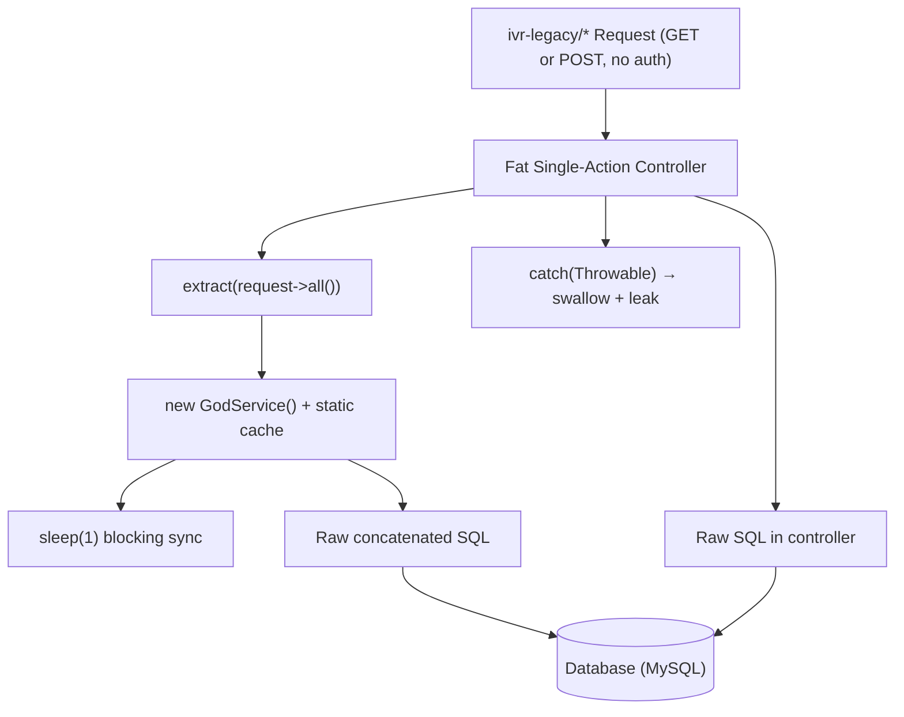
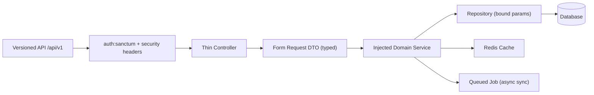

# 4. Backend Discovery & Modernization Analysis

**Objective:** Comprehensive backend discovery covering architecture, modules, controller/service/repository layering, database schema, API governance, middleware, authentication & authorization, security, performance, dependencies, secrets, and code quality.

**Date:** 2026-08-07 12:10:49 UTC | **Scope:** `shende-shweta/pingcrm` (master) — PHP 8.2 / Laravel 11 + Inertia.js + React, Sanctum 4 auth

## Executive Summary

> **Executive Summary**
>
> The repository is a Laravel 11 PingCRM base whose original CRM surface (Contacts, Users, Organizations, Reports) remains clean and idiomatic, but a large synthetic "IVR Enterprise" legacy subsystem has been grafted on top and it concentrates almost every backend anti-pattern in the catalogue. The IVR layer ships 82 fat single-action controllers, 12 ~373-line "God" services holding mutable `public static` state and hard-coded API keys, and 12 unused repository classes that build SQL by string concatenation. Untyped request data is materialised with `extract()` in 92 files, raw SQL is concatenated directly in controllers and repositories (SQL-injection signature), Eloquent models use `$guarded = []` (mass-assignment wide open), and a `config/ivr_legacy.php` file commits a master API key, a Salesforce client secret and a plaintext password. An 80-route `ivr-legacy` API is exposed with **no authentication middleware, no OpenAPI spec, no versioning and no contract tests**, while a hard-coded `tenant_id = 1` breaks multi-tenant isolation (IDOR). Performance is degraded by ~540 synchronous `sleep(1)` calls on the request path, 420 N+1 accessor methods and zero caching. Database schema and migrations are the one bright spot (indexed FKs, reversible `down()` methods). The overall backend rating is **High Risk**, driven by broken access control, injection/secret exposure and the absence of a real service/data layer.

<div class="metric-grid">
<div class="metric-card"><div class="metric-number">91</div><div class="metric-label">Controllers / Handlers Scanned</div></div>
<div class="metric-card"><div class="metric-number">92</div><div class="metric-label">Files Using Dynamic-Variable Patterns</div></div>
<div class="metric-card"><div class="metric-number">12</div><div class="metric-label">Service Classes Found (all "God")</div></div>
<div class="metric-card"><div class="metric-number">81</div><div class="metric-label">API Endpoints Found</div></div>
<div class="metric-card"><div class="metric-number">116</div><div class="metric-label">Injection / Mass-Assignment Files</div></div>
<div class="metric-card"><div class="metric-number">N/A*</div><div class="metric-label">Critical / High CVEs (audit not run offline)</div></div>
</div>

<div class="overall-rating overall-rating--high-risk"><div class="overall-rating-label">Overall Codebase Rating — Backend Modernization</div><div class="overall-rating-value">High Risk</div><div class="overall-rating-note">Driven by H12 broken access control (80 unauthenticated endpoints + IDOR), H13 injection/secret exposure, H16 committed secrets, and H1–H5 absence of a real service/data layer.</div></div>

## 4.1 Benchmark Ratings Summary

One row per hotspot. "Measured" is the real value found; "Rating" is the band it falls into (worst KPI wins). This table is the source for the Overall Codebase Rating banner above.

| # | Hotspot | Primary KPI | <span class="rating rating-good">Good</span> | <span class="rating rating-moderate">Moderate</span> | <span class="rating rating-high-risk">High Risk</span> | Measured | Rating |
|---|---|---|---|---|---|---|---|
| H1 | Dynamic Variable Creation | Dynamic-var-from-input occurrences | 0 | 1–10 | >10 | `extract()` in 92 files (12 services × 45, 82 controllers × ≤55) | <span class="rating rating-high-risk">High Risk</span> |
| H2 | Global Mutable State | Globals / mutable static state | 0 | 1–5 | >5 | 12 `public static $sharedRuntimeCache` in God services | <span class="rating rating-high-risk">High Risk</span> |
| H3 | Direct SQL Outside Data Layer | Data-layer compliance % | >90% | 60–90% | <60% | ~0% — 83 controllers call `DB::` directly; repositories unused | <span class="rating rating-high-risk">High Risk</span> |
| H4 | Static / Singleton Abuse | Business-logic static/singleton classes | 0 | 1–5 | >5 | 12 God services `new`-instantiated ~4,400× + 5 static helper classes | <span class="rating rating-high-risk">High Risk</span> |
| H5 | Missing Service Layer | Handlers with inline business logic | <10 | 10–20 | >20 | 82 IVR controllers with inline rules/SQL | <span class="rating rating-high-risk">High Risk</span> |
| H6 | API Sprawl | Documented & governed endpoints % | >90% | 80–90% | <80% | 0% — 80 duplicative `ivr-legacy` routes, GET+POST on each | <span class="rating rating-high-risk">High Risk</span> |
| H7 | Missing API Governance | Governance compliance % | 100% | 90–99% | <90% | 0% — no OpenAPI, no versioning, no contract tests | <span class="rating rating-high-risk">High Risk</span> |
| H8 | Weak Application Architecture | Modules following declared architecture % | >80% | 50–80% | <50% | <20% — IVR breaks MVC; logic in controllers/models | <span class="rating rating-high-risk">High Risk</span> |
| H9 | Missing Module Inventory | Circular dependency count | 0 | 1–3 | >3 | 0 circular deps, but 17 dead files (helpers + repos) unreferenced | <span class="rating rating-moderate">Moderate</span> |
| H10 | Database Schema Weakness | FK indexes % + migrations with rollback % | Both >90% | One <90% | Both <90% | FKs indexed & constrained; all migrations have `down()` | <span class="rating rating-good">Good</span> |
| H11 | Middleware Weakness | Required middleware present + ordered % | 100% | 80–99% | <80% | No security headers, no request-ID logging, no explicit CORS | <span class="rating rating-moderate">Moderate</span> |
| H12 | Auth & Authorization Weakness | Protected routes guarded % + hashing algo | 100% + bcrypt/argon2 | One gap | Both bad | ~26% guarded (80 public API routes) + IDOR; hash = bcrypt | <span class="rating rating-high-risk">High Risk</span> |
| H13 | Backend Security Vulnerabilities | Injection + hardcoded secrets count | 0 each | 1–3 total | >3 total | SQLi + mass-assignment + `APP_DEBUG=true` + hardcoded secrets (>3) | <span class="rating rating-high-risk">High Risk</span> |
| H14 | Performance & Caching Gaps | N+1 patterns found | 0 | 1–5 | >5 | 420 N+1 accessors + 540 `sleep(1)` + 0 caching | <span class="rating rating-high-risk">High Risk</span> |
| H15 | Outdated & Vulnerable Dependencies | Critical/High CVEs found | 0 | 1–3 | >3 | 0 observed (audit not run offline); `roave/security-advisories` present | <span class="rating rating-good">Good</span> |
| H16 | Secrets & Configuration in Source | Hardcoded secrets / .env committed | 0 | 1–2 | >2 | 15+ hardcoded secrets (config/ivr_legacy.php + 12 service keys) | <span class="rating rating-high-risk">High Risk</span> |
| H17 | Backend Code Quality | Linter in CI + max cyclomatic complexity | Both good | One gap | Both bad | Linter + PHPStan in CI, but level 1 only + massive duplication/dead code | <span class="rating rating-moderate">Moderate</span> |
| H18 | Swallowed Exceptions (additional) | Empty/silent `catch` blocks (target 0) | 0 | 1–20 | >20 | ~4,400 `catch (\Throwable)` blocks returning `err` and continuing | <span class="rating rating-high-risk">High Risk</span> |

**H18 (additional)** — *Swallowed Exceptions & Silent Failure.* KPI = count of `catch` blocks that suppress the error and return a success-shaped or leaked-message payload; **Good 0 · Moderate 1–20 · High Risk >20**. Chosen because ~4,400 identical `catch (\Throwable $e) { return ["ok"=>false,"err"=>$e->getMessage()]; }` blocks both hide failures from monitoring and leak internal messages to callers — a distinct defect from the injection (H13) and error-config (H13) hotspots.

## 4.2 Hotspot-by-Hotspot Evidence

### H1. Dynamic Variable Creation <span class="sev sev-critical">Critical</span>

**Benchmark:** dynamic-var-from-input occurrences = `extract()` used in **92 files** → falls in the **High Risk** band (Good 0 · Moderate 1–10 · High Risk >10).

Every legacy controller and God service materialises raw request/payload keys into local variables via `extract()`, so any request field silently creates or shadows a variable.

```php
// app/Http/Controllers/Ivr/CallAnalyticsStoreController.php:47-49
$payload = $request->all();
extract($payload);                 // any request key becomes a local variable
$service = new CallAnalyticsGodService();
```

```php
// app/Legacy/Services/CallAnalyticsGodService.php:15-17
public function orchestrateCallAnalyticsWorkflow1($payload)
{
    extract($payload);             // unsafe – untyped, untraceable
    self::$sharedRuntimeCache[$tenant_id ?? 1] = $payload;
```

**Why it matters here:** Because `extract()` runs on `$request->all()`, a caller can inject arbitrary variable names (e.g. `$tenantId`, `$apiKey`) and shadow values the method later trusts, and data flow becomes impossible to type-check with PHPStan. The pattern repeats identically across 12 services × 45 methods and 82 controllers, so there is no single place to add validation.

**Recommended approach:**
1. Introduce Form Request DTOs (extend `App\Http\Requests`) per module action with `rules()` and typed accessors.
2. Delete every `extract($payload)` / `extract($request->all())` and reference validated fields explicitly (`$request->validated()['tenant_id']`).
3. Enable PHPStan `checkExplicitMixed` once dynamic vars are gone; raise `phpstan.neon` level past 1.

<!-- affected-files
search: extract\(
glob: app/**/*.php
issue: Dynamic variables materialised from raw request/payload via extract()
action: Replace with typed Form Request DTO and explicit field access
-->

### H2. Global Mutable State <span class="sev sev-high">High</span>

**Benchmark:** mutable static state holding business data = **12 God services** with `public static $sharedRuntimeCache` → falls in the **High Risk** band (Good 0 · Moderate 1–5 · High Risk >5).

```php
// app/Legacy/Services/CallAnalyticsGodService.php:10-11
public static $sharedRuntimeCache = []; // mutable global-ish state
private $apiKey = "LEGACY_IVR_KEY_2082"; // hard-coded secret
```

```php
// app/Legacy/Services/CallAnalyticsGodService.php:16-18
extract($payload);
self::$sharedRuntimeCache[$tenant_id ?? 1] = $payload;   // cross-request leakage
```

**Why it matters here:** `public static` arrays persist for the life of the worker process (Octane/queue workers especially), so payloads from one tenant's request remain readable by the next request handled by the same worker — a cross-request data-leakage and correctness hazard. It also makes the services impossible to unit-test in isolation because state carries between test cases.

**Recommended approach:**
1. Remove `public static $sharedRuntimeCache`; if caching is needed, inject Laravel's `CacheRepository` with tenant-scoped keys.
2. Register each service in the container and resolve per-request (`scoped()` binding) instead of `new`.
3. Add a regression test asserting no static state survives between two service invocations.

<!-- affected-files
search: public static \$sharedRuntimeCache
glob: app/Legacy/Services/**/*.php
issue: Mutable static state holds per-request business data (cross-request leakage)
action: Replace with injected scoped cache/service; remove static property
-->

### H3. Direct SQL / ORM Outside a Data Layer <span class="sev sev-critical">Critical</span>

**Benchmark:** data-layer compliance = **~0%** — 83 controllers issue `DB::` calls directly while the 12 `Repositories/Legacy` classes are never referenced → **High Risk** band (Good >90% · Moderate 60–90% · High Risk <60%).

```php
// app/Http/Controllers/Ivr/CallAnalyticsStoreController.php:28
$rows = DB::select("select * from ivr_call_analyticss where name like '%".$q."%' and tenant_id = ".$this->tenantId);
```

```php
// app/Repositories/Legacy/CallAnalyticsRepository.php:11-16  (exists but unused)
$sql = "SELECT * FROM ivr_call_analyticss WHERE tenant_id = " . (int) $tenantId;
if ($filter) {
    $sql .= " AND name LIKE '%" . $filter . "%'"; // SQLi pattern
}
return DB::select($sql);
```

**Why it matters here:** Persistence logic is scattered across 83 controller files, so changing a table or adding tenant scoping means editing dozens of handlers; and because the queries are built by concatenation they are simultaneously the SQL-injection surface (see H13). A repository layer already exists (`app/Repositories/Legacy`) but is dead code — the intended data layer was never wired in.

**Recommended approach:**
1. Move all `DB::` access behind the existing `Repositories/Legacy/*Repository` classes, rewritten with parameter binding / query builder.
2. Inject repositories into services (not controllers); controllers call services only.
3. Add an architecture test (e.g. Pest arch or a PHPStan rule) forbidding `DB::` and `\Illuminate\Support\Facades\DB` inside `App\Http\Controllers`.

<!-- affected-files
search: DB::(select|table|statement|insert|update|raw)
glob: app/Http/Controllers/**/*.php
issue: Raw DB access issued directly from controller (no data layer)
action: Move query into a Repository with bound parameters; call via service
-->

### H4. Static Methods & Singleton Abuse <span class="sev sev-high">High</span>

**Benchmark:** business-logic static/singleton classes = **12 God services instantiated ~4,400×** plus **5 static-only helper classes** → **High Risk** band (Good 0 · Moderate 1–5 · High Risk >5).

```php
// app/Http/Controllers/Ivr/CallAnalyticsStoreController.php:48-49  (×55 methods × 82 controllers)
$service = new CallAnalyticsGodService();
$service->orchestrateCallAnalyticsWorkflow1($payload);
```

```php
// app/Legacy/Helpers/LegacyIvrCrypto.php:7-12  (all-static, 5 files × ~113 methods)
public static function transform1($value)
{
    if ($value === null) { return ""; }
    return (string) $value . "_2130_1";
}
```

**Why it matters here:** Services are created with `new` at ~4,400 call sites rather than resolved from the container, so they cannot be mocked, decorated, or swapped, and constructor dependencies (config, cache, logger) cannot be injected. The `LegacyIvr*` helper classes are pure static and — as H9 shows — entirely unreferenced dead weight.

**Recommended approach:**
1. Bind the 12 services in `AppServiceProvider` and type-hint them in controller `__invoke` signatures for auto-injection.
2. Collapse the 5 static helper classes into a small set of injectable, tested utility services (or delete the unused ones — see H9).
3. Forbid `new *GodService()` via a lint/arch rule after DI migration.

<!-- affected-files
search: new [A-Za-z]+GodService\(\)
glob: app/Http/Controllers/**/*.php
issue: Business service instantiated with new instead of dependency injection
action: Bind service in container and inject via constructor/__invoke
-->

### H5. Missing Service Layer <span class="sev sev-critical">Critical</span>

**Benchmark:** handlers with inline business logic = **82 IVR controllers** → **High Risk** band (Good <10 · Moderate 10–20 · High Risk >20).

```php
// app/Http/Controllers/Ivr/CallAnalyticsStoreController.php:22-30
public function handleStore(Request $request)
{
    // Fat controller – business rules live here
    $q = $request->get("q");
    if ($q) {
        $rows = DB::select("select * from ivr_call_analyticss where name like '%".$q."%' and tenant_id = ".$this->tenantId);
    } else {
        $rows = CallAnalytics::where("tenant_id", $this->tenantId)->get();
    }
```

**Why it matters here:** Filtering, querying, response shaping and tenant handling all live inside the controller, so the same logic cannot be reused from CLI commands, queued jobs or the `ivr-legacy` API without duplication. The "God services" that exist are workflow dumps (`orchestrateXWorkflow1..55`), not a cohesive domain layer, so business intent is spread between fat controllers and fat services.

**Recommended approach:**
1. Extract one cohesive `CallAnalyticsService` (etc.) per module with intention-revealing methods (`listForTenant`, `record`), replacing the 55 numbered workflow stubs.
2. Reduce each controller to: resolve DTO → call service → return `Inertia::render`/`response()->json`.
3. Cover the extracted services with unit tests before deleting controller logic.

<!-- affected-files
search: class [A-Za-z]+Controller extends Controller
glob: app/Http/Controllers/Ivr/**/*.php
issue: Business logic and raw SQL inline in controller (no service tier)
action: Move workflow logic into a dedicated Service; keep controller thin
-->

### H6. API Sprawl <span class="sev sev-high">High</span>

**Benchmark:** documented & governed endpoints = **0% of 80 `ivr-legacy` routes** → **High Risk** band (Good >90% · Moderate 80–90% · High Risk <80%).

```php
// routes/generated/ivr_legacy_api.php:5-13
Route::prefix("ivr-legacy")->group(function () {
    Route::match(['get','post'], 'agent-desk/destroy', App\Http\Controllers\Ivr\AgentDeskDestroyController::class);
    Route::match(['get','post'], 'agent-desk/export',  App\Http\Controllers\Ivr\AgentDeskExportController::class);
    // ...80 routes, each accepting BOTH GET and POST
```

```php
// routes/api.php:5-9
require __DIR__.'/generated/ivr_legacy_api.php';
Route::get('/ivr/health-legacy', function () {
    return response()->json(['status' => 'maybe-ok', 'timestamp' => time()]);
});
```

**Why it matters here:** The same resource is reachable through the Inertia web route (`/ivr/{moduleSlug}`) *and* through 80 machine-generated `ivr-legacy/*` routes that each accept GET **and** POST, so mutating actions (`destroy`, `store`, `update`, `sync`, `import`) can be triggered by a simple GET. Consumers have no canonical contract and must special-case each verb/route.

**Recommended approach:**
1. Collapse the 7 per-module actions into RESTful resource routes with correct HTTP verbs (no GET-mutates).
2. Deduplicate the web vs `ivr-legacy` surface behind one versioned API (`/api/v1/...`).
3. Generate the route table from a single source of truth reviewed in PRs, not an auto-synced file.

<!-- affected-files
search: Route::match\(\['get','post'\]
glob: routes/**/*.php
issue: Duplicative endpoint accepting GET+POST for mutating actions
action: Replace with versioned RESTful resource routes using correct verbs
-->

### H7. Missing API Governance <span class="sev sev-high">High</span>

**Benchmark:** governance compliance = **0%** — no OpenAPI/Swagger spec, no API versioning, no contract tests anywhere in the repo → **High Risk** band (Good 100% · Moderate 90–99% · High Risk <90%).

The `ivr-legacy` API returns ad-hoc arrays with no schema:

```php
// app/Http/Controllers/Ivr/CallAnalyticsStoreController.php:32-33
if ($request->wantsJson()) {
    return response()->json(["data" => $rows, "module" => "CallAnalytics", "action" => "Store"]);
}
```

**Why it matters here:** With 81 endpoints and zero specification, breaking changes ship undetected and integrators reverse-engineer behaviour from responses. There is no `openapi`/`swagger` file, no `/v1` prefix, and no contract test suite to catch drift.

**Recommended approach:**
1. Author an OpenAPI 3 spec for the consolidated API and publish it (e.g. Scramble or L5-Swagger).
2. Add Spectral API linting and a contract-test job to `.github/workflows`.
3. Version the API (`/api/v1`) and gate merges on spec + contract checks.

<!-- affected-files
search: response\(\)->json\(
glob: app/Http/Controllers/Ivr/**/*.php
issue: Undocumented JSON contract with no OpenAPI spec or versioning
action: Define OpenAPI schema, version the route, add contract tests
-->

### H8. Weak Application Architecture Pattern <span class="sev sev-high">High</span>

**Benchmark:** modules following declared MVC/layered architecture = **<20%** (core CRM compliant; entire IVR subsystem non-compliant) → **High Risk** band (Good >80% · Moderate 50–80% · High Risk <50%).

```php
// app/Models/Ivr/CallAnalytics.php:22-24
protected $guarded = []; // legacy – mass assignment wide open
// ...domain logic + raw SQL living inside the model:
public function legacyComputedField1()
{
    return DB::select("select count(*) as c from ivr_call_analyticss where tenant_id = ?", [$this->tenant_id ?? 1]);
}
```

**Why it matters here:** The declared MVC separation is honoured by the CRM controllers but abandoned in IVR: HTTP handling, business rules and raw SQL sit in controllers, while models carry 35 query-executing accessor methods. A change to one IVR module's storage cascades into controller, model and service edits, and new developers cannot predict where logic lives.

**Recommended approach:**
1. Enforce layer boundaries: HTTP (controllers) → domain (services) → data (repositories); models hold relations/casts only.
2. Move `legacyComputedField*` query methods out of `App\Models\Ivr\*` into repositories.
3. Add architecture tests (Pest arch) asserting models contain no `DB::` and controllers contain no business rules.

<!-- affected-files
search: DB::select|DB::table
glob: app/Models/Ivr/**/*.php
issue: Domain queries and logic embedded in Eloquent model (layer violation)
action: Move query methods to repository; keep model to relations/casts
-->

### H9. Missing Module / Package Inventory <span class="sev sev-medium">Medium</span>

**Benchmark:** circular dependency count = **0**, but **17 dead files** (5 `LegacyIvr*` helpers + 12 `Repositories/Legacy`) are never referenced from any entry point → **Moderate** band (Good 0 · Moderate 1–3 · High Risk >3 for circular deps; rated Moderate on dead-module evidence).

```bash
# grep for references outside their own folder returns nothing:
grep -r "LegacyIvr"  app --include=*.php | grep -v app/Legacy/Helpers   → (empty)
grep -r "Repository" app --include=*.php | grep -v app/Repositories      → (empty)
```

**Why it matters here:** ~5,600 lines across 17 files (2,835 lines of static helpers + 12 repositories) are unreachable dead code that still ships, is scanned by tools, and misleads developers into thinking a data layer is in use. No circular dependencies were detected, so the risk is maintenance drag and duplicate-logic confusion rather than initialization order.

**Recommended approach:**
1. Confirm zero runtime references (static analysis) and delete or archive the unused `LegacyIvr*` helpers.
2. Either wire the `Repositories/Legacy` classes into the data layer (see H3) or remove them.
3. Document each surviving module's public API in a short `MODULES.md`.

<!-- affected-files
search: class LegacyIvr
glob: app/Legacy/Helpers/**/*.php
issue: Unreferenced dead helper class (no call sites in the codebase)
action: Delete/archive after confirming zero references
-->

### H11. Middleware & Filter Weakness <span class="sev sev-high">High</span>

**Benchmark:** required middleware present & correctly ordered = **partial** — auth+throttle present, but no security-headers, no request-ID/audit logging, no explicit CORS policy → **Moderate** band (Good 100% · Moderate 80–99% · High Risk <80%).

```php
// bootstrap/app.php:17-25
->withMiddleware(function (Middleware $middleware) {
    $middleware->redirectGuestsTo(fn () => route('login'));
    $middleware->web(\App\Http\Middleware\HandleInertiaRequests::class);
    $middleware->throttleApi();               // throttle present…
    // …no security headers, no correlation-id logging, no CORS config
});
```

```php
// config/ivr_legacy.php:14  — auth-bypass switch consumed by legacy code
'bypass_auth_for_internal_ips' => ['127.0.0.1', '10.0.0.0'],
```

**Why it matters here:** There is no `helmet`-equivalent security-headers middleware, no structured request logging with correlation IDs (making the swallowed-exception problem in H18 impossible to trace), and no `config/cors.php` so CORS falls to framework defaults. Combined with an IP-based auth-bypass flag, the pipeline cannot enforce a consistent security posture.

**Recommended approach:**
1. Add a security-headers middleware (CSP, X-Frame-Options, HSTS) to the web/api groups.
2. Add a correlation-ID + structured request-logging middleware early in the stack.
3. Publish an explicit `config/cors.php` with an allow-list; remove `bypass_auth_for_internal_ips`.

<!-- affected-files
search: withMiddleware|bypass_auth_for_internal_ips
glob: bootstrap/**/*.php
issue: Missing security-headers / request-logging middleware; IP auth-bypass
action: Add security-headers + correlation-id logging; remove auth bypass
-->

### H12. Authentication & Authorization Weakness <span class="sev sev-critical">Critical</span>

**Benchmark:** protected routes guarded ≈ **26%** (CRM web routes guarded; **80 `ivr-legacy` API routes have zero `auth` middleware**) + object-level IDOR; password hashing = **bcrypt (strong)** → **High Risk** band (broken access control drives the verdict despite strong hashing).

```php
// routes/generated/ivr_legacy_api.php — no ->middleware('auth') anywhere (grep count = 0)
Route::prefix("ivr-legacy")->group(function () {
    Route::match(['get','post'], 'call-recording/export', App\Http\Controllers\Ivr\CallRecordingExportController::class);
```

```php
// app/Http/Controllers/Ivr/CallAnalyticsStoreController.php:14-15
// AUTH-NOTE: some endpoints intentionally skip policies (2014 regression)
private $tenantId = 1; // hard-coded tenant – multi-tenant broken
```

**Why it matters here:** 80 state-changing endpoints (`store`, `update`, `destroy`, `import`, `sync`, `export`) are reachable **unauthenticated**, and every IVR query is scoped by a hard-coded `tenant_id = 1` instead of the caller's tenant — so any user can read/mutate any tenant's data (classic IDOR / OWASP #1 Broken Access Control). Password hashing itself is sound (`Hash::make`, bcrypt in `User::setPasswordAttribute`).

**Recommended approach:**
1. Wrap `routes/generated/ivr_legacy_api.php` in `Route::middleware(['auth:sanctum'])` (or remove the surface entirely).
2. Replace hard-coded `$tenantId = 1` with the authenticated user's account/tenant via `IvrAccountContext::fromRequest`, and add Policy object-level checks in services.
3. Delete the `bypass_auth_for_internal_ips` and "skip policies" behaviour; add tests asserting cross-tenant access is denied.

<!-- affected-files
search: private \$tenantId = 1
glob: app/Http/Controllers/Ivr/**/*.php
issue: Hard-coded tenant id breaks multi-tenant isolation (IDOR)
action: Derive tenant from authenticated user; add object-level authorization
-->

### H13. Backend Security Vulnerabilities <span class="sev sev-critical">Critical</span>

**Benchmark:** injection + hardcoded-secret patterns = **>3** (SQLi + mass-assignment + debug-on + committed secrets) → **High Risk** band (Good 0 each · Moderate 1–3 total · High Risk >3).

```php
// app/Repositories/Legacy/CallAnalyticsRepository.php:14  — SQL injection
$sql .= " AND name LIKE '%" . $filter . "%'"; // unbound user input
```

```php
// app/Models/Ivr/CallAnalytics.php:23  — mass assignment wide open
protected $guarded = [];
```

```ini
# .env.example:  ships debug-on defaults
APP_ENV=local
APP_DEBUG=true
```

**Why it matters here:** User-controlled `$q`/`$filter` values are concatenated straight into `DB::select(...)` in controllers and repositories (injectable), `$guarded = []` lets any request field write any column, and `APP_DEBUG=true` (plus H18 leaking `$e->getMessage()`) exposes stack traces. Together these cover three of the top OWASP categories in one subsystem.

**Recommended approach:**
1. Replace all string-concatenated SQL with bound parameters / query-builder `where(...)` (ties to H3).
2. Replace `$guarded = []` with explicit `$fillable` allow-lists on every `App\Models\Ivr\*` model.
3. Ship `APP_DEBUG=false` for non-local envs and stop returning exception messages to clients (H18).

<!-- affected-files
search: guarded = \[\]
glob: app/Models/**/*.php
issue: Mass assignment fully open (guarded = []) enabling column injection
action: Replace with explicit $fillable allow-list per model
-->

### H14. Performance & Caching Gaps <span class="sev sev-high">High</span>

**Benchmark:** N+1 / blocking patterns = **420 N+1 accessor methods + 540 synchronous `sleep(1)` + 0 caching** → **High Risk** band (Good 0 · Moderate 1–5 · High Risk >5).

```php
// app/Models/Ivr/CallAnalytics.php:26-30  — 35 such accessors × 12 models = 420
public function legacyComputedField1()
{
    // N+1 friendly accessor – called from blade/react randomly
    return DB::select("select count(*) as c from ivr_call_analyticss where tenant_id = ?", [$this->tenant_id ?? 1]);
}
```

```php
// app/Legacy/Services/CallAnalyticsGodService.php:16-18  — 45 methods × 12 services = 540
extract($payload);
sleep(1); // blocking synchronous remote sync
self::$sharedRuntimeCache[$tenant_id ?? 1] = DB::table("ivr_call_analyticss")->insertGetId((array) $payload);
```

**Why it matters here:** Each God-service workflow blocks the PHP-FPM worker for a full second (`sleep(1)`), so a handful of concurrent calls exhaust the worker pool; the 420 per-model count accessors run one query each when iterated; and `Cache::`/`cache()` appears **0 times** in `app/`, so identical hot queries hit the database on every request with no `Cache-Control` headers on read endpoints.

**Recommended approach:**
1. Remove `sleep(1)`; move any real remote sync to a queued job (`ShouldQueue`).
2. Replace `legacyComputedField*` per-row queries with a single aggregated query / eager load.
3. Introduce Redis caching for hot read queries and add `Cache-Control` headers to GET endpoints.

<!-- affected-files
search: sleep\(1\)
glob: app/Legacy/Services/**/*.php
issue: Synchronous blocking sleep on the request path (worker starvation)
action: Remove sleep; offload remote sync to a queued job
-->

### H16. Secrets & Configuration in Source <span class="sev sev-critical">Critical</span>

**Benchmark:** hardcoded secrets / committed `.env` = **15+** (`.env` is correctly git-ignored, but secrets are hardcoded in tracked source) → **High Risk** band (Good 0 · Moderate 1–2 · High Risk >2).

```php
// config/ivr_legacy.php:11-24
'master_api_key' => 'IVR-MASTER-KEY-DO-NOT-COMMIT-2013',
'crm' => ['salesforce' => [
    'client_secret' => 'hardcoded_sf_secret_2015',
    'password'      => 'PlainTextPassword!',
]],
```

```php
// app/Legacy/Services/CallAnalyticsGodService.php:11  (×12 services, distinct keys)
private $apiKey = "LEGACY_IVR_KEY_2082"; // hard-coded secret
```

**Why it matters here:** A tracked config file commits a master API key, a Salesforce client secret and a plaintext integration password, and 12 services each embed their own API key — anyone with repository read access obtains production credentials and can move laterally into Salesforce. `.gitignore` does exclude `.env`, which limits blast radius but does not help these hardcoded values.

**Recommended approach:**
1. Move every literal in `config/ivr_legacy.php` and the 12 service `$apiKey` values to `env()`-backed config or a secrets manager (Vault/AWS Secrets Manager).
2. Rotate all exposed keys/passwords immediately — they must be treated as compromised.
3. Add a secret-scanning step (gitleaks/trufflehog) to CI to block future commits.

<!-- affected-files
search: (apiKey|client_secret|master_api_key|password)\s*=?>?\s*["']
glob: app/Legacy/**/*.php
issue: Credential/API key hardcoded in tracked source
action: Move to env/secrets manager and rotate the exposed value
-->

### H17. Backend Code Quality Issues <span class="sev sev-medium">Medium</span>

**Benchmark:** linter in CI = **Yes** (coding-standards + PHPStan), but PHPStan pinned to **level 1** with pervasive duplication/dead code → **Moderate** band (Good both · Moderate one gap · High Risk both bad).

```yaml
# .github/workflows/static-analysis.yml  — runs, but…
# phpstan.neon:9  →  level: 1   (of a possible 9)
```

```php
// app/Legacy/Services/CallAnalyticsGodService.php — 55 near-identical numbered methods
public function orchestrateCallAnalyticsWorkflow2($payload) { extract($payload); sleep(1); /* …identical… */ }
public function orchestrateCallAnalyticsWorkflow3($payload) { extract($payload); sleep(1); /* …identical… */ }
```

**Why it matters here:** CI does run PHPStan and a code-style workflow (a real strength), but level 1 catches almost nothing, so the ~4,400 copy-pasted workflow/endpoint methods, 2,835 lines of dead static helpers and the models' 420 duplicated accessors all pass unchallenged. Individual functions are short (low per-function cyclomatic complexity), so the quality problem is duplication and scale, not branching depth. TODO/FIXME density is 0.

**Recommended approach:**
1. Raise `phpstan.neon` level incrementally (target ≥5) after the DTO work removes dynamic vars.
2. Add a duplication/complexity gate (e.g. PHPMD, `phpcpd`) to CI and fail on cloned blocks.
3. Delete generated duplication by collapsing numbered methods into single parameterised methods.

<!-- affected-files
search: orchestrate[A-Za-z]+Workflow[0-9]+
glob: app/Legacy/Services/**/*.php
issue: Massive copy-paste duplication (numbered near-identical methods)
action: Collapse into a single parameterised method; raise PHPStan level
-->

### H18. Swallowed Exceptions & Silent Failure (additional) <span class="sev sev-high">High</span>

**Benchmark:** silent/leaky `catch` blocks = **~4,400** → **High Risk** band (Good 0 · Moderate 1–20 · High Risk >20).

```php
// app/Http/Controllers/Ivr/CallAnalyticsStoreController.php:50-54  (repeated ~4,400×)
} catch (\Throwable $e) {
    return ["ok" => false, "err" => $e->getMessage()]; // swallowed stack traces
}
```

**Why it matters here:** Every `legacyEndpoint*` wraps its work in a blanket `catch (\Throwable)` that returns a normal HTTP 200 payload — failures never surface to logs, metrics or the client's error handling, so data-loss bugs are invisible in production. Simultaneously it leaks the raw exception message (DB errors, file paths) to the caller, compounding H13.

**Recommended approach:**
1. Remove blanket catches; let the framework exception handler log and return sanitized responses.
2. Where a catch is legitimately needed, log with a correlation ID (H11) and rethrow or return a proper error status — never a success shape.
3. Add a lint rule forbidding empty/`getMessage()`-returning `catch (\Throwable)` blocks.

<!-- affected-files
search: catch \(\\Throwable
glob: app/Http/Controllers/Ivr/**/*.php
issue: Blanket catch swallows failures and leaks exception messages
action: Remove catch or log+rethrow; never return a success-shaped payload
-->

**Not observed (rated Good):** H10 (schema — FK columns indexed via `->index()`/`->constrained()`, every migration has a reversible `down()`, no drift in tracked migrations); H15 (dependencies — Laravel 11 / Sanctum 4 are current, `roave/security-advisories` dev-dependency blocks installing known-vulnerable packages; a live `composer audit` could not run in the offline snapshot, so 0 CVEs is "not measured, none observed").

**Not applicable — no API surface issues suppressed:** an API surface *does* exist (`routes/api.php` + `ivr-legacy`), so H6–H7 are assessed above rather than marked N/A.

## 4.3 Diagrams

### Current backend request path


### Modernized service-layer target


### Improvement roadmap


## 4.4 Actions Required

| Hotspot | Action | Rating | Priority |
|---|---|---|---|
| H12 Auth & Authorization | Apply `auth:sanctum` to all 80 `ivr-legacy` routes; replace hard-coded `tenant_id=1` with authenticated tenant + object-level policies | <span class="rating rating-high-risk">High Risk</span> | <span class="sev sev-critical">Critical</span> |
| H13 Security Vulnerabilities | Bind all SQL parameters; replace `$guarded=[]` with `$fillable`; ship `APP_DEBUG=false`; stop returning exception messages | <span class="rating rating-high-risk">High Risk</span> | <span class="sev sev-critical">Critical</span> |
| H16 Secrets in Source | Move `config/ivr_legacy.php` + 12 service keys to secrets manager and rotate; add secret-scanning to CI | <span class="rating rating-high-risk">High Risk</span> | <span class="sev sev-critical">Critical</span> |
| H1 Dynamic Variable Creation | Replace `extract()` in 92 files with typed Form Request DTOs and explicit field access | <span class="rating rating-high-risk">High Risk</span> | <span class="sev sev-critical">Critical</span> |
| H3 Direct SQL Outside Data Layer | Route all `DB::` access through repositories with bound params; add arch rule banning `DB::` in controllers | <span class="rating rating-high-risk">High Risk</span> | <span class="sev sev-high">High</span> |
| H5 Missing Service Layer | Extract cohesive domain services; thin the 82 controllers to DTO→service→response | <span class="rating rating-high-risk">High Risk</span> | <span class="sev sev-high">High</span> |
| H4 Static / Singleton Abuse | Bind services in container; inject instead of `new`; collapse static helpers | <span class="rating rating-high-risk">High Risk</span> | <span class="sev sev-high">High</span> |
| H2 Global Mutable State | Remove `public static $sharedRuntimeCache`; use scoped cache | <span class="rating rating-high-risk">High Risk</span> | <span class="sev sev-high">High</span> |
| H14 Performance & Caching | Delete `sleep(1)` (queue it); eliminate N+1 accessors; add Redis + `Cache-Control` | <span class="rating rating-high-risk">High Risk</span> | <span class="sev sev-high">High</span> |
| H18 Swallowed Exceptions | Remove blanket `catch(\Throwable)` that swallows/leaks; log+rethrow with correlation IDs | <span class="rating rating-high-risk">High Risk</span> | <span class="sev sev-high">High</span> |
| H6 API Sprawl | Collapse GET+POST duplicate routes into versioned RESTful resources | <span class="rating rating-high-risk">High Risk</span> | <span class="sev sev-high">High</span> |
| H7 API Governance | Add OpenAPI spec, Spectral linting, contract tests and `/v1` versioning in CI | <span class="rating rating-high-risk">High Risk</span> | <span class="sev sev-high">High</span> |
| H8 Weak Architecture | Enforce HTTP→domain→data layering; move model queries to repositories; add arch tests | <span class="rating rating-high-risk">High Risk</span> | <span class="sev sev-high">High</span> |
| H11 Middleware Weakness | Add security-headers + correlation-id logging; explicit CORS; remove IP auth-bypass | <span class="rating rating-moderate">Moderate</span> | <span class="sev sev-medium">Medium</span> |
| H9 Module Inventory | Delete/archive 17 unreferenced dead files; document module public APIs | <span class="rating rating-moderate">Moderate</span> | <span class="sev sev-medium">Medium</span> |
| H17 Code Quality | Raise PHPStan past level 1; add duplication/complexity gates; collapse cloned methods | <span class="rating rating-moderate">Moderate</span> | <span class="sev sev-medium">Medium</span> |

## 4.5 Expected Outcomes

- **Access control restored:** guarding the 80 `ivr-legacy` routes and deriving tenant from the authenticated user eliminates the unauthenticated-mutation and IDOR exposure that currently lets any caller read/write any tenant's data.
- **Injection eliminated:** parameter binding across controllers and repositories, plus `$fillable` allow-lists, removes the SQL-injection and mass-assignment surface (OWASP A03/A08).
- **Credentials secured:** moving 15+ hardcoded secrets to a vault and rotating them prevents lateral movement into Salesforce and blocks future leakage via CI secret scanning.
- **Typed, traceable data flow:** replacing `extract()` with Form Request DTOs makes request handling type-checkable and lets PHPStan rise above level 1.
- **Reusable domain layer:** a real service + repository layer lets IVR logic be shared across HTTP, CLI and queued jobs, and shrinks the 82 fat controllers to thin delegators.
- **Performance headroom:** removing 540 blocking `sleep(1)` calls, eliminating 420 N+1 accessors and adding Redis caching frees the worker pool and cuts database load under concurrency.
- **Observable failures:** removing blanket `catch(\Throwable)` swallowing and adding correlation-ID logging surfaces production errors to monitoring instead of hiding them behind HTTP 200s.
- **Contract stability:** an OpenAPI spec, versioned routes, API linting and contract tests in CI stop breaking changes from reaching integrators undetected.
