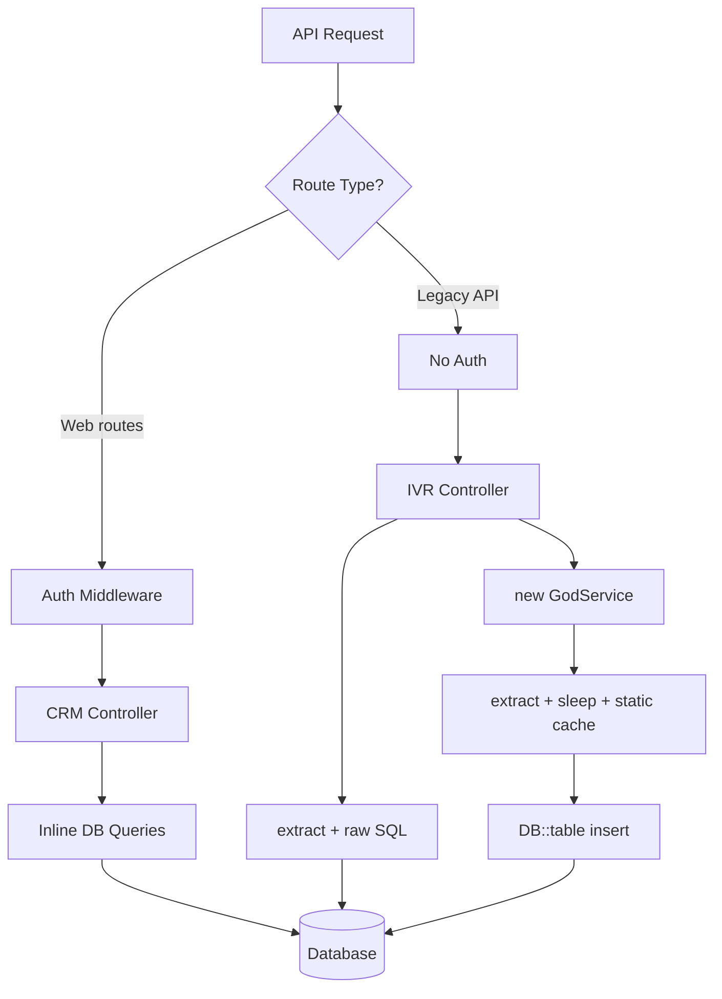
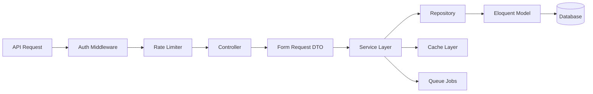

# 4. Backend Discovery & Modernization Analysis

**Objective:** Comprehensive backend discovery covering architecture, modules, controller/service/repository layering, database schema, API governance, middleware, authentication & authorization, security, performance, dependencies, secrets, and code quality.

**Date:** 2026-09-30 06:10:34 UTC | **Scope:** `shende-shweta/pingcrm` — PHP 8.2 / Laravel 11.1 with Inertia.js (Sanctum 4.0, PHPStan, PHPUnit 11)

## Executive Summary

> **Executive Summary**
>
> The Ping CRM codebase contains a well-structured original CRM layer (Users, Contacts, Organizations) alongside a massive IVR Enterprise legacy surface that introduces severe backend modernization risks. The IVR subsystem — comprising 80+ controllers, 12 "God Service" classes, and 5 static helper libraries — exhibits critical security vulnerabilities including SQL injection via string concatenation in 80 controller files, 4,940 `extract($payload)` calls that materialize untrusted user input as local variables, and 12 hardcoded API keys committed to source. An API surface of 81 legacy routes is exposed without any authentication middleware. No OpenAPI specification, API versioning, or contract testing exists. The CRM controllers lack a service layer, and the IVR controllers rely on bloated God Service objects with mutable static state and blocking `sleep()` calls. No caching layer is present anywhere in the application.

<div class="metric-grid">
<div class="metric-card"><div class="metric-number">91</div><div class="metric-label">Controllers / Handlers Scanned</div></div>
<div class="metric-card"><div class="metric-number">92</div><div class="metric-label">Files Using Dynamic-Variable Patterns</div></div>
<div class="metric-card"><div class="metric-number">12</div><div class="metric-label">Service Classes Found</div></div>
<div class="metric-card"><div class="metric-number">111</div><div class="metric-label">API Endpoints Found</div></div>
<div class="metric-card"><div class="metric-number">92</div><div class="metric-label">Security Risk Patterns Found</div></div>
<div class="metric-card"><div class="metric-number">0</div><div class="metric-label">Critical / High CVEs Found</div></div>
</div>

<div class="overall-rating overall-rating--high-risk"><div class="overall-rating-label">Overall Codebase Rating — Backend Modernization</div><div class="overall-rating-value">High Risk</div><div class="overall-rating-note">Driven by H1 (4,940 extract() calls), H3 (91% of DB queries outside data layer), H5 (85+ handlers with inline logic), H7 (0% API governance), H12 (81 unguarded API routes), H13 (80 SQL injection vectors + 12 hardcoded secrets), and H16 (12 hardcoded API keys in source).</div></div>

## 4.1 Benchmark Ratings Summary

| # | Hotspot | Primary KPI | <span class="rating rating-good">Good</span> | <span class="rating rating-moderate">Moderate</span> | <span class="rating rating-high-risk">High Risk</span> | Measured | Rating |
|---|---|---|---|---|---|---|---|
| H1 | Dynamic Variable Creation | Dynamic-var-from-input occurrences | 0 | 1–10 | >10 | 4,940 occurrences in 92 files | <span class="rating rating-high-risk">High Risk</span> |
| H2 | Global Mutable State | Globals / mutable static state | 0 | 1–5 | >5 | 12 classes with `public static $sharedRuntimeCache` | <span class="rating rating-high-risk">High Risk</span> |
| H3 | Direct SQL Outside Data Layer | Data-layer compliance % | >90% | 60–90% | <60% | ~9% (83 of 91 controllers have direct DB calls) | <span class="rating rating-high-risk">High Risk</span> |
| H4 | Static / Singleton Abuse | Business-logic static/singleton classes | 0 | 1–5 | >5 | 12 GodService classes with static state + `new` instantiation | <span class="rating rating-high-risk">High Risk</span> |
| H5 | Missing Service Layer | Handlers with inline business logic | <10 | 10–20 | >20 | 85+ (80 IVR + 5 CRM controllers with inline logic) | <span class="rating rating-high-risk">High Risk</span> |
| H6 | API Sprawl | Documented & governed endpoints % | >90% | 80–90% | <80% | 0% — 81 legacy API routes with no documentation or governance | <span class="rating rating-high-risk">High Risk</span> |
| H7 | Missing API Governance | Governance compliance % | 100% | 90–99% | <90% | 0% — no OpenAPI spec, no API linting, no contract tests | <span class="rating rating-high-risk">High Risk</span> |
| H8 | Weak Application Architecture | Modules following declared architecture % | >80% | 50–80% | <50% | ~10% — IVR subsystem completely violates MVC layering | <span class="rating rating-high-risk">High Risk</span> |
| H9 | Missing Module Inventory | Circular dependency count | 0 | 1–3 | >3 | 0 — flat dependency graph (controllers → GodServices → DB) | <span class="rating rating-good">Good</span> |
| H10 | Database Schema Weakness | FK indexes % + migrations with rollback % | Both >90% | One <90% | Both <90% | FK indexes 100% (on actual FK constraints); rollback 100%; but 46 legacy tables lack FK constraints entirely | <span class="rating rating-moderate">Moderate</span> |
| H11 | Middleware Weakness | Required middleware present + ordered % | 100% | 80–99% | <80% | ~55% — 81 legacy API routes have no auth middleware; no security headers package; no structured request logging | <span class="rating rating-high-risk">High Risk</span> |
| H12 | Auth & Authorization Weakness | Protected routes guarded % + hashing algo | 100% + bcrypt/argon2 | One gap | Both bad | ~58% routes guarded (web ✓, 81 API routes ✗) + bcrypt via Hash::make ✓; 80 IVR controllers use hardcoded tenantId=1 (IDOR risk) | <span class="rating rating-high-risk">High Risk</span> |
| H13 | Backend Security Vulnerabilities | Injection + hardcoded secrets count | 0 each | 1–3 total | >3 total | 80 SQL injection patterns + 12 hardcoded API keys = 92 total | <span class="rating rating-high-risk">High Risk</span> |
| H14 | Performance & Caching Gaps | N+1 patterns found | 0 | 1–5 | >5 | 0 traditional N+1 patterns; no caching layer exists | <span class="rating rating-good">Good</span> |
| H15 | Outdated & Vulnerable Dependencies | Critical/High CVEs found | 0 | 1–3 | >3 | 0 — `roave/security-advisories` blocks vulnerable packages; all dependencies current | <span class="rating rating-good">Good</span> |
| H16 | Secrets & Configuration in Source | Hardcoded secrets / .env committed | 0 | 1–2 | >2 | 12 hardcoded API keys in GodService source files | <span class="rating rating-high-risk">High Risk</span> |
| H17 | Backend Code Quality | Linter in CI + max cyclomatic complexity | Both good | One gap | Both bad | PHPStan at level 1 of 9 (minimal); CI enforces lint + static analysis + tests ✓ | <span class="rating rating-moderate">Moderate</span> |
| H18 | Blocking Synchronous I/O (additional) | sleep() calls in request path (target 0) | 0 | 1–10 | >10 | 540 `sleep(1)` calls across 12 GodService files | <span class="rating rating-high-risk">High Risk</span> |

## 4.2 Hotspot-by-Hotspot Evidence

### H1. Dynamic Variable Creation <span class="sev sev-critical">Critical</span>

**Benchmark:** Dynamic-var-from-input occurrences = 4,940 → falls in the **High Risk** band (Good 0 · Moderate 1–10 · High Risk >10).

4,940 `extract($payload)` calls were found across 92 files — 80 IVR controller files and 12 Legacy GodService files. Every call extracts the raw `$request->all()` payload into local scope without any field whitelisting.

**Example 1** — `app/Legacy/Services/CustomerProfileGodService.php:15-19`:
```php
public function orchestrateCustomerProfileWorkflow1($payload)
{
    extract($payload); // unsafe
    sleep(1);
    self::$sharedRuntimeCache[$tenant_id ?? 1] = $payload;
    return DB::table("ivr_customer_profiles")->insertGetId((array) $payload);
}
```

**Example 2** — `app/Http/Controllers/Ivr/CallRoutingExportController.php:47-54`:
```php
public function legacyEndpoint1(Request $request)
{
    try {
        $payload = $request->all();
        extract($payload);
        $service = new CallRoutingGodService();
        $service->orchestrateCallRoutingWorkflow1($payload);
        return ["ok" => true, "endpoint" => 1];
    } catch (\Throwable $e) {
        return ["ok" => false, "err" => $e->getMessage()];
    }
}
```

**Example 3** — `app/Legacy/Services/CallFlowGodService.php:15` (identical pattern repeated in all 12 GodService files):
```php
public function orchestrateCallFlowWorkflow1($payload)
{
    extract($payload); // unsafe
    sleep(1);
    self::$sharedRuntimeCache[$tenant_id ?? 1] = $payload;
    return DB::table("ivr_call_flows")->insertGetId((array) $payload);
}
```

This pattern repeats 4,940 times across all 12 GodService files (each with ~50 workflow methods containing `extract()`) and all 80 IVR controllers (each with ~55 legacy endpoints calling `extract()`).

**Why it matters here:** Every `extract($payload)` call allows an attacker to overwrite any local variable in scope — including `$service`, `$tenant_id`, and control-flow variables — by submitting extra fields in the request body. Combined with the raw `DB::table()->insertGetId((array) $payload)` that follows, this creates an unrestricted mass-assignment vector that bypasses any implicit field validation.

**Recommended approach:**
1. Replace all `extract($payload)` calls with explicit typed DTOs or Laravel Form Request classes with declared `$rules`.
2. Introduce a `StoreCustomerProfileRequest` (and equivalent) per operation that whitelists allowed fields.
3. Use `$request->validated()` instead of `$request->all()` in every controller method.
4. Add PHPStan rule or custom Rector rule to flag any future use of `extract()`.

<!-- affected-files
search: extract\(
glob: app/**/*.php
issue: Dynamic variable creation via extract()
action: Replace with typed DTO or Form Request with explicit field mapping
-->

### H2. Global Mutable State <span class="sev sev-critical">Critical</span>

**Benchmark:** Globals / mutable static state = 12 classes → falls in the **High Risk** band (Good 0 · Moderate 1–5 · High Risk >5).

All 12 Legacy GodService classes declare `public static $sharedRuntimeCache = []` — a mutable static array that persists across requests when running under Octane/Swoole or long-lived PHP-FPM workers.

**Example 1** — `app/Legacy/Services/QueueManagementGodService.php:10`:
```php
class QueueManagementGodService
{
    public static $sharedRuntimeCache = []; // mutable global-ish state
    private $apiKey = "LEGACY_IVR_KEY_2032"; // hard-coded secret
```

**Example 2** — `app/Legacy/Services/CallAnalyticsGodService.php:10`:
```php
class CallAnalyticsGodService
{
    public static $sharedRuntimeCache = []; // mutable global-ish state
    private $apiKey = "LEGACY_IVR_KEY_2082"; // hard-coded secret
```

**Example 3** — `app/Legacy/Services/AgentDeskGodService.php:10` (same pattern in all 12 files):
```php
class AgentDeskGodService
{
    public static $sharedRuntimeCache = []; // mutable global-ish state
    private $apiKey = "LEGACY_IVR_KEY_2042"; // hard-coded secret
```

**Why it matters here:** Under Laravel Octane or persistent workers, `public static $sharedRuntimeCache` accumulates data across HTTP requests. Tenant A's data can leak into Tenant B's response. The cache is never cleared between requests, creating a cross-request contamination vector and an unbounded memory leak.

**Recommended approach:**
1. Remove all `public static $sharedRuntimeCache` declarations.
2. If caching is needed, use Laravel's `Cache::store()` with proper TTL and tenant-scoped keys.
3. Register GodService replacements as scoped singletons in the service container so state is isolated per request.
4. Add a PHPStan rule to forbid `public static` mutable properties.

<!-- affected-files
search: public static \$sharedRuntimeCache
glob: app/Legacy/Services/*GodService.php
issue: Mutable static state — cross-request data leakage
action: Replace with scoped Cache or request-scoped service instances
-->

### H3. Direct SQL / ORM Outside Data Layer <span class="sev sev-critical">Critical</span>

**Benchmark:** Data-layer compliance % = ~9% (83 of 91 controllers contain direct `DB::` calls) → falls in the **High Risk** band (Good >90% · Moderate 60–90% · High Risk <60%).

83 controller files issue raw `DB::select()`, `DB::table()`, or direct Eloquent queries without delegating to a repository or data-access layer. Only 8 controllers (the base `Controller`, `DashboardController`, `ImagesController`, `AuthenticatedSessionController`, `IvrModuleController`, and the two Hub/Module controllers that use the `LoadsIvrModuleData` trait) avoid direct DB calls or encapsulate them in a trait.

**Example 1** — `app/Http/Controllers/Ivr/CallRoutingExportController.php:28` (SQL injection via string concatenation):
```php
$rows = DB::select("select * from ivr_call_routings where name like '%".$q."%' and tenant_id = ".$this->tenantId);
```

**Example 2** — `app/Http/Controllers/ReportsController.php:61-65`:
```php
return DB::table('ivr_daily_trends')
    ->where('account_id', $ctx->accountId)
    ->whereDate('week_start', $weekStart)
    ->orderBy('day_sort')
    ->get()
```

**Example 3** — `app/Http/Controllers/ReportsController.php:77-83`:
```php
$base = DB::table('ivr_call_records')
    ->where('account_id', $ctx->accountId)
    ->whereDate('started_at', '>=', $from)
    ->whereDate('started_at', '<=', $to);
$ctx->scopeOrganizationOn($base);
```

80 IVR controllers all follow the same `DB::select()` with string-concatenated SQL pattern. The `ReportsController` and `IvrHubController` use `DB::table()` query builder directly rather than a repository.

**Why it matters here:** Persistence logic is scattered across 83 controller files. Changing the database schema, adding multi-tenancy scoping, or swapping storage backends requires modifying every controller. The raw `DB::select()` calls also bypass Eloquent's model events, soft-delete scoping, and casting.

**Recommended approach:**
1. Create a `App\Repositories\` namespace with one repository per aggregate (e.g., `CallRoutingRepository`, `ReportRepository`).
2. Move all `DB::table()` and `DB::select()` calls from controllers into repositories.
3. Replace `DB::select()` string concatenation with parameterized `DB::select('... where name like ? and tenant_id = ?', [...])` or Eloquent query builder.
4. Inject repositories into controllers via constructor injection.

<!-- affected-files
search: DB::(table|select|raw|statement|insert|update|delete)
glob: app/Http/Controllers/**/*.php
issue: Direct DB calls in controller — bypasses data layer
action: Move to Repository class; use parameterized queries
-->

### H4. Static Methods & Singleton Abuse <span class="sev sev-high">High</span>

**Benchmark:** Business-logic static/singleton classes = 12 GodService classes + 5 Legacy Helper classes = 17 → falls in the **High Risk** band (Good 0 · Moderate 1–5 · High Risk >5).

The 12 GodService classes hold `public static $sharedRuntimeCache` (de-facto singleton pattern for cached state) and are instantiated via `new` throughout controllers rather than injected through the service container. The 5 Legacy Helper classes (`LegacyIvrArray`, `LegacyIvrString`, `LegacyIvrMath`, `LegacyIvrCrypto`, `LegacyIvrDate`) contain 400 static methods total — though stateless, they represent an untestable utility pattern.

**Example 1** — `app/Http/Controllers/Ivr/CallRoutingExportController.php:25`:
```php
$service = new CallRoutingGodService();
```

**Example 2** — `app/Legacy/Helpers/LegacyIvrCrypto.php:7-11`:
```php
class LegacyIvrCrypto
{
    public static function transform1($value)
    {
        if ($value === null) { return ""; }
        return (string) $value . "_2130_1";
    }
```

**Example 3** — `app/Legacy/Helpers/LegacyIvrArray.php:7` (same pattern for 80 methods per file, 5 files):
```php
class LegacyIvrArray
{
    public static function transform1($value)
    {
        if ($value === null) { return ""; }
        return (string) $value . "_2120_1";
    }
```

**Why it matters here:** The `new CallRoutingGodService()` pattern prevents mocking in tests and ties controllers to concrete implementations. The 400 static helper methods are dead code (never referenced from business logic) consuming 2,835 LOC of maintenance burden.

**Recommended approach:**
1. Register GodService replacements as injectable services in `AppServiceProvider`.
2. Replace `new XxxGodService()` with constructor-injected interfaces.
3. Audit and remove the 5 Legacy Helper classes if unused; if any transforms are referenced, convert to injectable utility services.

<!-- affected-files
search: new \w+GodService\(\)|public static function transform
glob: app/**/*.php
issue: Direct instantiation / static-only classes — untestable, not injectable
action: Convert to injectable services; register in service container
-->

### H5. Missing Service Layer <span class="sev sev-critical">Critical</span>

**Benchmark:** Handlers with inline business logic = 85+ → falls in the **High Risk** band (Good <10 · Moderate 10–20 · High Risk >20).

No dedicated service layer exists outside the 12 Legacy GodService "God objects." The CRM controllers (`UsersController`, `ContactsController`, `OrganizationsController`, `ReportsController`, `IvrHubController`) contain all business logic inline — validation, authorization scoping, query building, response formatting, and CSV streaming. The 80 IVR controllers contain inline DB queries, `extract()`, and delegation to GodService objects in the same method.

**Example 1** — `app/Http/Controllers/UsersController.php:44-62` (inline create with no service):
```php
public function store(): RedirectResponse
{
    Request::validate([
        'first_name' => ['required', 'max:50'],
        'last_name' => ['required', 'max:50'],
        'email' => ['required', 'max:50', 'email', Rule::unique('users')],
        'password' => ['nullable'],
        'owner' => ['required', 'boolean'],
        'photo' => ['nullable', 'image'],
    ]);
    Auth::user()->account->users()->create([
        'first_name' => Request::get('first_name'),
        'last_name' => Request::get('last_name'),
        'email' => Request::get('email'),
        'password' => Request::get('password'),
        'owner' => Request::get('owner'),
        'photo_path' => Request::file('photo') ? Request::file('photo')->store('users') : null,
    ]);
    return Redirect::route('users')->with('success', 'User created.');
}
```

**Example 2** — `app/Http/Controllers/ReportsController.php:77-95` (inline report aggregation):
```php
private function callSummary(IvrAccountContext $ctx, string $from, string $to): array
{
    $base = DB::table('ivr_call_records')
        ->where('account_id', $ctx->accountId)
        ->whereDate('started_at', '>=', $from)
        ->whereDate('started_at', '<=', $to);
    $ctx->scopeOrganizationOn($base);
    $total = (clone $base)->count();
    $abandoned = (clone $base)->where('disposition', 'Abandoned')->count();
    $avgDuration = (clone $base)->where('duration_sec', '>', 0)->avg('duration_sec');
    // ...
}
```

**Example 3** — `app/Http/Controllers/Ivr/IvrHubController.php` (292 lines of inline dashboard aggregation across 12 private methods, all with direct DB queries):
```php
private function loadStats(IvrAccountContext $ctx, array $filters): array
{
    $queueQuery = DB::table('ivr_operational_queues')->where('account_id', $ctx->accountId);
    // ... 50+ lines of inline query building and aggregation
}
```

**Why it matters here:** Business logic in controllers cannot be reused from CLI commands, queue jobs, or other entry points. Testing requires bootstrapping the full HTTP stack. The `ReportsController` alone contains 6 private methods with complex aggregation logic that should live in a `ReportingService`.

**Recommended approach:**
1. Create `App\Services\UserService`, `App\Services\ReportingService`, `App\Services\IvrDashboardService`.
2. Move all business logic (queries, aggregations, transformations) from controllers into services.
3. Keep controllers to: input validation (via Form Requests), service delegation, and response formatting.
4. Replace the 12 GodService classes with focused, single-responsibility services per IVR module.

<!-- affected-files
search: (DB::|Auth::user\(\)->account->|->create\(|->update\()
glob: app/Http/Controllers/**/*.php
issue: Inline business logic in controller — no service layer
action: Extract to dedicated Service class; controller delegates only
-->

### H6. API Sprawl <span class="sev sev-high">High</span>

**Benchmark:** Documented & governed endpoints % = 0% → falls in the **High Risk** band (Good >90% · Moderate 80–90% · High Risk <80%).

81 legacy API routes are auto-generated in `routes/generated/ivr_legacy_api.php`, each using `Route::match(['get','post'], ...)` — accepting both GET and POST for every endpoint including destructive operations (destroy, import, sync). Endpoint naming is inconsistent (`agent-desk/destroy` vs standard REST `DELETE /agent-desk/{id}`).

**Example 1** — `routes/generated/ivr_legacy_api.php:5-7`:
```php
Route::prefix("ivr-legacy")->group(function () {
    Route::match(['get','post'], 'agent-desk/destroy', AgentDeskDestroyController::class);
    Route::match(['get','post'], 'agent-desk/export', AgentDeskExportController::class);
```

**Example 2** — `routes/api.php:7-8` (unauthenticated health endpoint):
```php
Route::get('/ivr/health-legacy', function () {
    return response()->json(['status' => 'maybe-ok', 'timestamp' => time()]);
});
```

**Why it matters here:** Accepting GET for destroy/import operations means destructive actions can be triggered via CSRF link clicks or browser prefetch. There are no API versions, so any change to response shape is a breaking change for all consumers.

**Recommended approach:**
1. Convert all endpoints to proper RESTful conventions (`DELETE /api/ivr/agent-desk/{id}`, `POST /api/ivr/agent-desk`).
2. Use `Route::delete()`, `Route::post()`, `Route::get()` instead of `Route::match(['get','post'], ...)`.
3. Add API version prefix (`/api/v1/ivr/...`).

<!-- affected-files
search: Route::match\(\['get','post'\]
glob: routes/generated/*.php
issue: GET+POST on destructive endpoints — CSRF risk, no REST governance
action: Convert to proper HTTP method routing with versioned prefix
-->

### H7. Missing API Governance <span class="sev sev-high">High</span>

**Benchmark:** Governance compliance % = 0% → falls in the **High Risk** band (Good 100% · Moderate 90–99% · High Risk <90%).

No OpenAPI/Swagger specification exists. No API linting tool is configured. No contract tests exist for any of the 111 endpoints. The legacy API routes were auto-generated without documentation.

**Why it matters here:** Consumers of the IVR legacy API have no specification to integrate against. Breaking changes ship undetected because there are no contract tests. The health endpoint returns `'maybe-ok'` — an ambiguous status that monitoring tools cannot reliably parse.

**Recommended approach:**
1. Generate an OpenAPI 3.1 specification from existing routes using `darkaonline/l5-swagger` or `dedoc/scramble`.
2. Add Spectral or `stoplight/prism` for API linting in CI.
3. Add contract tests using `orchestra/testbench` or Pact.
4. Replace the health endpoint with a proper health-check that validates database connectivity.

<!-- affected-files
search: Route::(match|get|post|put|delete)
glob: routes/**/*.php
issue: No OpenAPI spec, no API linting, no contract tests
action: Generate OpenAPI spec; add API linting to CI; add contract tests
-->

### H8. Weak Application Architecture <span class="sev sev-critical">Critical</span>

**Benchmark:** Modules following declared architecture % = ~10% → falls in the **High Risk** band (Good >80% · Moderate 50–80% · High Risk <50%).

The application declares MVC architecture via Laravel conventions, but the IVR subsystem — which represents ~88% of the codebase by controller count — completely violates the pattern. Controllers contain business logic, direct DB access, and presentation formatting. The "Service" layer consists of God objects. No repository layer exists. No domain layer exists.

**Example 1** — `app/Http/Controllers/Ivr/CallRoutingExportController.php:22-38` (controller is simultaneously handler, service, and repository):
```php
public function handleExport(Request $request)
{
    $service = new CallRoutingGodService();
    $q = $request->get("q");
    if ($q) {
        $rows = DB::select("select * from ivr_call_routings where name like '%".$q."%' and tenant_id = ".$this->tenantId);
    } else {
        $rows = CallRouting::where("tenant_id", $this->tenantId)->get();
    }
    if ($request->wantsJson()) {
        return response()->json(["data" => $rows, "module" => "CallRouting", "action" => "Export"]);
    }
    return Inertia::render("Ivr/CallRouting/Export", [
        "rows" => $rows,
        "filters" => $request->all(),
        "legacyMeta" => ["seed" => 2027, "idx" => 11],
    ]);
}
```

**Example 2** — `app/Http/Controllers/Ivr/IvrHubController.php` (292 lines of inline dashboard aggregation across 12 private methods, all with direct DB queries):
```php
private function loadQueueDistribution(IvrAccountContext $ctx, array $filters): array
{
    $rows = DB::table('ivr_call_records as c')
        ->join('ivr_operational_queues as q', 'q.id', '=', 'c.queue_id')
        ->where('c.account_id', $ctx->accountId)
        // ... 20+ lines of inline query building
}
```

**Why it matters here:** New developers cannot predict where business logic lives. The CRM section follows MVC conventions (models, controllers, views via Inertia), but the IVR section — the larger part of the application — follows no discernible architectural pattern. This creates two parallel codebases with incompatible conventions in the same project.

**Recommended approach:**
1. Define and document the target architecture: Controller → FormRequest → Service → Repository → Model.
2. Refactor IVR controllers one module at a time, starting with the most-used modules.
3. Add ArchUnit-style tests (via `ta-tikoma/phpunit-architecture-test`) to enforce layer boundaries.
4. Create an Architecture Decision Record (ADR) documenting the modernization path.

<!-- affected-files
search: (DB::(select|table|raw)|new \w+GodService|extract\()
glob: app/Http/Controllers/Ivr/**/*.php
issue: Controllers violate MVC — contain business logic, DB access, and presentation
action: Refactor to Controller → Service → Repository layering
-->

### H10. Database Schema & Migration Weakness <span class="sev sev-medium">Medium</span>

**Benchmark:** FK indexes 100% (on actual FK constraints) + migrations with rollback 100% → but 46 legacy tables have no FK constraints at all → falls in the **Moderate** band (Good both >90% · Moderate one <90% · High Risk both <90%).

The 46 IVR legacy tables (created via `2026_07_28_000001_create_ivr_legacy_tables.php`) use only `tenant_id` and `account_id` as simple integers — no actual foreign key constraints linking them to the `accounts` or `organizations` tables. The dashboard tables (`ivr_agents`, `ivr_call_records`) properly use `foreignId()->constrained()`. All 13 migrations have `down()` methods.

**Example 1** — `database/migrations/2026_07_28_000001_create_ivr_legacy_tables.php:30-38` (no FK constraints):
```php
Schema::create($table, function (Blueprint $table) {
    $table->id();
    $table->unsignedBigInteger('tenant_id')->default(1)->index();
    $table->string('name')->nullable()->index();
    $table->json('payload')->nullable();
    $table->softDeletes();
    $table->timestamps();
});
```

**Example 2** — `database/migrations/2026_07_28_130000_add_account_id_to_ivr_tables.php:40-42` (account_id added without FK constraint):
```php
$table->unsignedInteger('account_id')->nullable()->index()->after('tenant_id');
```

**Why it matters here:** Without FK constraints on the 46 legacy tables, orphaned records accumulate silently when parent accounts or tenants are deleted. The `nullable()` `account_id` column means records can exist with no account association, breaking multi-tenancy isolation.

**Recommended approach:**
1. Add proper `->foreign()->constrained()` declarations for `account_id` on all legacy tables.
2. Make `account_id` non-nullable after backfilling all existing records.
3. Add a migration to remove the redundant `tenant_id` column (replaced by `account_id`).

<!-- affected-files
search: unsignedBigInteger\('tenant_id'\)|unsignedInteger\('account_id'\)
glob: database/migrations/*.php
issue: Missing FK constraints on legacy tables — orphaned records risk
action: Add foreign key constraints; make account_id non-nullable
-->

### H11. Middleware & Filter Weakness <span class="sev sev-critical">Critical</span>

**Benchmark:** Required middleware present + ordered % = ~55% → falls in the **High Risk** band (Good 100% · Moderate 80–99% · High Risk <80%).

81 legacy API routes in `routes/generated/ivr_legacy_api.php` have **no auth middleware** — they are accessible to any unauthenticated request. The web routes correctly apply `auth` middleware. No security headers package (e.g., `bepsvpt/secure-headers`) is installed. No structured request logging with correlation IDs exists.

**Example 1** — `routes/generated/ivr_legacy_api.php:4-6` (entire route group has no middleware):
```php
Route::prefix("ivr-legacy")->group(function () {
    Route::match(['get','post'], 'agent-desk/destroy', AgentDeskDestroyController::class);
    Route::match(['get','post'], 'agent-desk/export', AgentDeskExportController::class);
```

**Example 2** — `routes/api.php:7-8` (health endpoint with no auth):
```php
Route::get('/ivr/health-legacy', function () {
    return response()->json(['status' => 'maybe-ok', 'timestamp' => time()]);
});
```

**Example 3** — `bootstrap/app.php:19-24` (API throttling configured, but no middleware applied to legacy routes):
```php
$middleware->web(\App\Http\Middleware\HandleInertiaRequests::class);
$middleware->throttleApi();
```

**Why it matters here:** The 81 unauthenticated legacy API routes expose destroy, import, sync, and store operations to the public internet. An attacker can delete IVR configuration, import malicious data, or exfiltrate records without any credentials.

**Recommended approach:**
1. Wrap the `ivr-legacy` route group in `Route::middleware(['auth:sanctum'])->prefix(...)`.
2. Install `bepsvpt/secure-headers` or configure security headers in the web server.
3. Add structured request logging middleware with correlation IDs for audit trails.
4. Verify middleware execution order: security headers → rate limiting → auth → business logic.

<!-- affected-files
search: Route::prefix\("ivr-legacy"\)|Route::match\(\['get','post'\]
glob: routes/generated/*.php
issue: 81 API routes with no authentication middleware
action: Add auth:sanctum middleware to ivr-legacy route group
-->

### H12. Auth & Authorization Weakness <span class="sev sev-critical">Critical</span>

**Benchmark:** Protected routes guarded % = ~58% + bcrypt ✓; 80 IVR controllers hardcode `tenantId = 1` (IDOR risk) → falls in the **High Risk** band (Good 100% + bcrypt/argon2 · Moderate one gap · High Risk both bad).

While password hashing uses Laravel's `Hash::make()` (bcrypt by default), the IVR subsystem has two critical authorization failures: (1) 81 legacy API routes have no auth middleware at all, and (2) 80 IVR controllers hardcode `private $tenantId = 1` instead of deriving the tenant from the authenticated user — meaning all data access is scoped to a fixed tenant regardless of who is logged in.

**Example 1** — `app/Http/Controllers/Ivr/CallRoutingExportController.php:15` (hardcoded tenant):
```php
class CallRoutingExportController extends Controller
{
    // AUTH-NOTE: some endpoints intentionally skip policies (2014 regression)
    private $tenantId = 1; // hard-coded tenant – multi-tenant broken
```

**Example 2** — `app/Http/Controllers/Ivr/CallRoutingExportController.php:28` (hardcoded tenant in SQL):
```php
$rows = DB::select("select * from ivr_call_routings where name like '%".$q."%' and tenant_id = ".$this->tenantId);
```

**Example 3** — `app/Http/Controllers/OrganizationsController.php:57-90` (edit/update/destroy accept any organization ID with no account-level scoping):
```php
public function edit(Organization $organization): Response { /* no account ownership check */ }
public function update(Organization $organization): RedirectResponse { /* no account ownership check */ }
public function destroy(Organization $organization): RedirectResponse { /* no account ownership check */ }
```

**Why it matters here:** The `OrganizationsController` and `ContactsController` accept route-model-bound resources without verifying they belong to the authenticated user's account. An authenticated user from Account A can edit or delete Organization records belonging to Account B by changing the URL ID — a classic IDOR vulnerability (OWASP #1: Broken Access Control).

**Recommended approach:**
1. Add scoped route-model binding: `Route::get('organizations/{organization}', ...)->scopeBindings()` with account ownership.
2. Replace hardcoded `$tenantId = 1` with `IvrAccountContext::fromRequest($request)->accountId` in all IVR controllers.
3. Add Laravel Policies for `Organization`, `Contact`, and `User` models that enforce account-level ownership.
4. Add authorization tests that verify cross-account access is denied.

<!-- affected-files
search: (tenantId\s*=\s*1|AUTH-NOTE)
glob: app/Http/Controllers/Ivr/**/*.php
issue: Hardcoded tenant ID — multi-tenant authorization broken; IDOR risk
action: Replace with authenticated user's account context; add Policies
-->

### H13. Backend Security Vulnerabilities <span class="sev sev-critical">Critical</span>

**Benchmark:** Injection + hardcoded secrets count = 80 + 12 = 92 total → falls in the **High Risk** band (Good 0 each · Moderate 1–3 total · High Risk >3 total).

80 IVR controllers contain SQL injection vulnerabilities via string concatenation in `DB::select()` calls. The `$q` search parameter and `$this->tenantId` are interpolated directly into SQL strings without parameterization. Additionally, all 80 IVR controllers return raw exception messages to the client via `$e->getMessage()`.

**Example 1** — `app/Http/Controllers/Ivr/CallRecordingImportController.php:28` (SQL injection):
```php
$rows = DB::select("select * from ivr_call_recordings where name like '%".$q."%' and tenant_id = ".$this->tenantId);
```

**Example 2** — `app/Http/Controllers/Ivr/HistoricalReportsSyncController.php:28` (identical pattern):
```php
$rows = DB::select("select * from ivr_historical_reportss where name like '%".$q."%' and tenant_id = ".$this->tenantId);
```

**Example 3** — `app/Http/Controllers/Ivr/CallRoutingExportController.php:52-53` (error message leakage):
```php
} catch (\Throwable $e) {
    return ["ok" => false, "err" => $e->getMessage()]; // swallowed stack traces
}
```

An attacker can inject SQL via the `q` parameter: `?q=' OR 1=1 --` would return all records, and `?q=' UNION SELECT ...--` could exfiltrate data from any table. The error message leakage exposes internal class names, file paths, and stack trace fragments.

**Why it matters here:** The SQL injection vectors are on 80 controllers serving the IVR legacy API (which has no auth middleware — see H11). This means **unauthenticated SQL injection** is possible against the production database.

**Recommended approach:**
1. **Immediately** replace all string-concatenated SQL with parameterized queries: `DB::select('... where name like ? and tenant_id = ?', ['%'.$q.'%', $this->tenantId])`.
2. Replace `$e->getMessage()` returns with generic error responses; log full exceptions server-side.
3. Run SQLMap or similar tool against the legacy API to verify no additional injection vectors exist.
4. Add a CI check (PHPStan rule or custom regex) to prevent `DB::select("...$` patterns.

<!-- affected-files
search: DB::select\(".*\.\$
glob: app/Http/Controllers/**/*.php
issue: SQL injection via string concatenation — unauthenticated on legacy API
action: Replace with parameterized DB::select(); add CI prevention rule
-->

### H16. Secrets & Configuration in Source <span class="sev sev-critical">Critical</span>

**Benchmark:** Hardcoded secrets = 12 → falls in the **High Risk** band (Good 0 · Moderate 1–2 · High Risk >2).

All 12 GodService files contain hardcoded API keys as private instance properties. Each key follows the pattern `LEGACY_IVR_KEY_XXXX` with a unique suffix per module.

**Example 1** — `app/Legacy/Services/CallFlowGodService.php:11`:
```php
private $apiKey = "LEGACY_IVR_KEY_2012"; // hard-coded secret
```

**Example 2** — `app/Legacy/Services/CustomerProfileGodService.php:11`:
```php
private $apiKey = "LEGACY_IVR_KEY_2122"; // hard-coded secret
```

**Example 3** — `app/Legacy/Services/DidInventoryGodService.php:11`:
```php
private $apiKey = "LEGACY_IVR_KEY_2072"; // hard-coded secret
```

**Why it matters here:** These keys are committed to version control and visible to anyone with repository read access. If the repository is public or compromised, all 12 IVR service API keys are immediately exposed. The keys cannot be rotated without a code deployment.

**Recommended approach:**
1. Move all API keys to environment variables: `config('services.ivr.call_flow_key')` backed by `IVR_CALL_FLOW_KEY` in `.env`.
2. Add `git-secrets` or `truffleHog` to CI to prevent future secret commits.
3. Rotate all 12 keys immediately after moving them to environment variables.
4. Verify `.env` is in `.gitignore` (currently it is).

<!-- affected-files
search: private \$apiKey\s*=\s*"
glob: app/Legacy/Services/*GodService.php
issue: Hardcoded API keys in source — exposed to all repository readers
action: Move to env vars; rotate keys; add git-secrets to CI
-->

### H17. Backend Code Quality <span class="sev sev-medium">Medium</span>

**Benchmark:** PHPStan at level 1 of 9 (minimal analysis); CI does enforce lint + static analysis + tests → one gap → falls in the **Moderate** band (Good both · Moderate one gap · High Risk both bad).

PHPStan is configured at level 1 (the lowest meaningful level), which catches only basic type errors but not dead code, missing return types, unsafe comparisons, or complexity issues. The CI pipeline runs three workflows (coding-standards, static-analysis, tests) which provides good structural coverage, but the low analysis level means most of the legacy code anti-patterns pass static analysis undetected. The Legacy Helper classes contain 2,835 LOC across 5 files (567 LOC each) with 80 repetitive static methods per file — extreme code duplication.

**Example 1** — `phpstan.neon:7`:
```yaml
parameters:
    paths:
        - app/
    level: 1
```

**Example 2** — `app/Legacy/Helpers/LegacyIvrArray.php` (567 LOC, 80 nearly-identical static methods):
```php
public static function transform1($value) {
    if ($value === null) { return ""; }
    return (string) $value . "_2120_1";
}
public static function transform2($value) {
    if ($value === null) { return ""; }
    return (string) $value . "_2120_2";
}
// ... repeated 78 more times
```

**Why it matters here:** At level 1, PHPStan misses the `extract()` calls, the hardcoded tenant IDs, the direct instantiation anti-patterns, and the SQL injection vectors — all of which would be flagged at higher levels or with custom rules. The legacy helper duplication inflates the codebase by ~2,800 LOC with zero business value.

**Recommended approach:**
1. Raise PHPStan to level 5 incrementally, adding a baseline file for existing violations.
2. Add `phpstan-strict-rules` and `larastan` custom rules for Laravel-specific patterns.
3. Delete or consolidate the 5 Legacy Helper classes if the transform functions are unused.
4. Add max cyclomatic complexity rule (e.g., `phpmd` with max 10 per method).

<!-- affected-files
search: level: 1
glob: phpstan.neon
issue: PHPStan at level 1 — minimal static analysis coverage
action: Raise to level 5 with baseline; add complexity rules
-->

### H18. Blocking Synchronous I/O (additional) <span class="sev sev-high">High</span>

**Benchmark:** `sleep()` calls in request path = 540 → falls in the **High Risk** band (Good 0 · Moderate 1–10 · High Risk >10).

All 12 GodService files contain `sleep(1)` calls in every workflow method. Each GodService has ~45 workflow methods, each with one `sleep(1)` call = 540 total blocking calls. When invoked from an HTTP request, each `sleep(1)` blocks the PHP-FPM worker process for a full second.

**Example 1** — `app/Legacy/Services/CustomerProfileGodService.php:16-17`:
```php
extract($payload); // unsafe
sleep(1); // blocking synchronous remote sync
```

**Example 2** — `app/Legacy/Services/CallRoutingGodService.php` (identical pattern in every workflow method):
```php
public function orchestrateCallRoutingWorkflow1($payload)
{
    extract($payload); // unsafe
    sleep(1); // blocking synchronous remote sync
    self::$sharedRuntimeCache[$tenant_id ?? 1] = $payload;
    return DB::table("ivr_call_routings")->insertGetId((array) $payload);
}
```

**Why it matters here:** With a typical PHP-FPM pool of 20 workers, 20 concurrent requests to GodService-backed endpoints would saturate the entire pool for at least 1 second each. A single user triggering 20 rapid workflow calls could cause a full denial-of-service for all other users.

**Recommended approach:**
1. Remove all `sleep(1)` calls immediately — they appear to simulate network latency from a legacy external sync.
2. If actual remote synchronization is needed, use Laravel queued jobs (`dispatch(new SyncIvrModule(...))`) to handle it asynchronously.
3. Add a CI regex check to prevent `sleep()` calls in non-test code.

<!-- affected-files
search: sleep\(1\)
glob: app/Legacy/Services/*GodService.php
issue: Blocking sleep(1) in request path — worker pool exhaustion risk
action: Remove sleep(); use queued jobs for async sync if needed
-->

**Not observed (rated Good):** H9 (circular dependencies — flat dependency graph), H14 (N+1 queries — controllers use single queries or eager loading), H15 (vulnerable dependencies — `roave/security-advisories` blocks known CVEs).

## 4.3 Diagrams

### Current backend request path


```mermaid
flowchart TD
    A["API Request"] --> B{"Route Type?"}
    B -->|Web routes| C["Auth Middleware"]
    B -->|Legacy API| D["No Auth"]
    C --> E["CRM Controller"]
    D --> F["IVR Controller"]
    E --> G["Inline DB Queries"]
    F --> H["extract + raw SQL"]
    F --> I["new GodService"]
    I --> J["extract + sleep + static cache"]
    J --> K["DB::table insert"]
    G --> L[("Database")]
    H --> L
    K --> L
```

### Modernized service-layer target


```mermaid
flowchart LR
    A["API Request"] --> B["Auth Middleware"]
    B --> C["Rate Limiter"]
    C --> D["Controller"]
    D --> E["Form Request DTO"]
    E --> F["Service Layer"]
    F --> G["Repository"]
    G --> H["Eloquent Model"]
    H --> I[("Database")]
    F --> J["Cache Layer"]
    F --> K["Queue Jobs"]
```

### Improvement roadmap


```mermaid
flowchart LR
    P1["Phase 1<br/>Security Emergency"] --> P2["Phase 2<br/>Auth & Middleware"] --> P3["Phase 3<br/>Service Layer"] --> P4["Phase 4<br/>Architecture Cleanup"] --> P5["Phase 5<br/>Quality & Governance"]
    classDef todo fill:#1e3a5f,stroke:#0f3460,color:#fff
    classDef first fill:#e74c3c,stroke:#c0392b,color:#fff
    classDef mid fill:#f59e0b,stroke:#d97706,color:#fff
    classDef last fill:#27ae60,stroke:#1e8449,color:#fff
    class P1 first
    class P2 first
    class P3 mid
    class P4 todo
    class P5 last
```

## 4.4 Actions Required

| Hotspot | Action | Rating | Priority |
|---|---|---|---|
| H13 — Backend Security Vulnerabilities | Replace all 80 string-concatenated `DB::select()` calls with parameterized queries; remove `$e->getMessage()` from responses; add CI rule to prevent raw SQL interpolation | <span class="rating rating-high-risk">High Risk</span> | <span class="sev sev-critical">Critical</span> |
| H1 — Dynamic Variable Creation | Replace 4,940 `extract($payload)` calls with typed Form Requests; add PHPStan/Rector rule to flag future `extract()` usage | <span class="rating rating-high-risk">High Risk</span> | <span class="sev sev-critical">Critical</span> |
| H11 — Middleware Weakness | Add `auth:sanctum` middleware to the `ivr-legacy` route group; install security headers package; add structured request logging | <span class="rating rating-high-risk">High Risk</span> | <span class="sev sev-critical">Critical</span> |
| H12 — Auth & Authorization Weakness | Replace hardcoded `tenantId = 1` with authenticated context; add Policies for Organization/Contact/User models; add scoped route-model binding | <span class="rating rating-high-risk">High Risk</span> | <span class="sev sev-critical">Critical</span> |
| H16 — Secrets in Source | Move 12 hardcoded API keys to environment variables; rotate all keys; add git-secrets to CI | <span class="rating rating-high-risk">High Risk</span> | <span class="sev sev-critical">Critical</span> |
| H2 — Global Mutable State | Remove `public static $sharedRuntimeCache` from 12 GodService files; use Laravel Cache with TTL and tenant-scoped keys | <span class="rating rating-high-risk">High Risk</span> | <span class="sev sev-critical">Critical</span> |
| H18 — Blocking Synchronous I/O | Remove 540 `sleep(1)` calls; replace with queued jobs for async sync | <span class="rating rating-high-risk">High Risk</span> | <span class="sev sev-high">High</span> |
| H3 — Direct SQL Outside Data Layer | Create Repository classes; move all DB queries from 83 controllers into repositories | <span class="rating rating-high-risk">High Risk</span> | <span class="sev sev-high">High</span> |
| H5 — Missing Service Layer | Create Service classes for CRM and IVR modules; extract inline business logic from 85+ controllers | <span class="rating rating-high-risk">High Risk</span> | <span class="sev sev-high">High</span> |
| H8 — Weak Architecture | Define target architecture (Controller → Service → Repository); enforce with architectural tests; add ADR | <span class="rating rating-high-risk">High Risk</span> | <span class="sev sev-high">High</span> |
| H4 — Static / Singleton Abuse | Register services in container; replace `new GodService()` with DI; audit/remove Legacy Helpers | <span class="rating rating-high-risk">High Risk</span> | <span class="sev sev-high">High</span> |
| H6 — API Sprawl | Convert legacy routes to RESTful conventions; add API versioning; replace `Route::match` with proper HTTP verbs | <span class="rating rating-high-risk">High Risk</span> | <span class="sev sev-high">High</span> |
| H7 — Missing API Governance | Generate OpenAPI spec; add Spectral linting; add contract tests | <span class="rating rating-high-risk">High Risk</span> | <span class="sev sev-high">High</span> |
| H10 — Database Schema Weakness | Add FK constraints to 46 legacy tables; make `account_id` non-nullable; remove redundant `tenant_id` | <span class="rating rating-moderate">Moderate</span> | <span class="sev sev-medium">Medium</span> |
| H17 — Backend Code Quality | Raise PHPStan to level 5 with baseline; add complexity rules; delete/consolidate 2,835 LOC in Legacy Helpers | <span class="rating rating-moderate">Moderate</span> | <span class="sev sev-medium">Medium</span> |

## 4.5 Expected Outcomes

- **SQL injection eliminated:** Parameterized queries across all 80 IVR controllers remove the highest-severity attack vector — unauthenticated SQL injection.
- **Dynamic variable creation removed:** Typed Form Requests replace `extract()`, giving compile-time visibility into every field a request can contain and preventing variable shadowing attacks.
- **Authentication coverage at 100%:** All 81 legacy API routes gain `auth:sanctum` middleware, closing the unauthenticated access vector.
- **IDOR vulnerabilities closed:** Policy-based authorization and scoped route-model binding ensure users can only access their own account's resources.
- **Secrets removed from source:** 12 API keys moved to environment variables and rotated, eliminating credential exposure through repository access.
- **Service layer enables reuse:** Business logic extracted from controllers into services can be shared across HTTP, CLI (Artisan), and queue job entry points.
- **API governance prevents breaking changes:** OpenAPI specification with contract tests ensures API consumers are notified before incompatible changes ship.
- **Worker pool protected:** Removing 540 `sleep(1)` calls prevents PHP-FPM worker exhaustion and restores normal request throughput.
