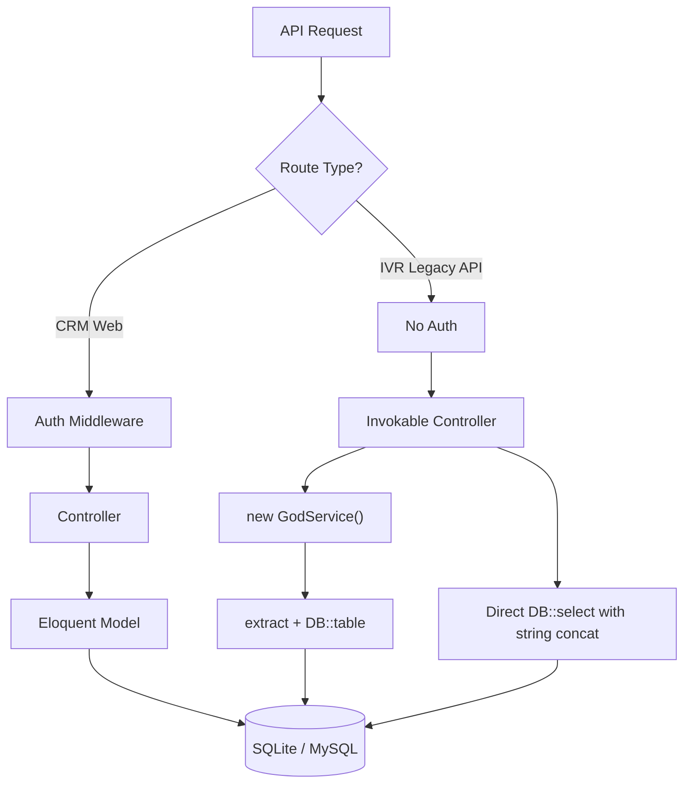
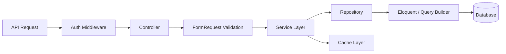
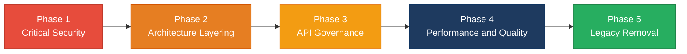

# 4. Backend Discovery & Modernization Analysis

**Objective:** Comprehensive backend discovery covering architecture, modules, controller/service/repository layering, database schema, API governance, middleware, authentication & authorization, security, performance, dependencies, secrets, and code quality.

**Date:** 2026-09-30 06:56:00 UTC | **Scope:** `shende-shweta/pingcrm` (master) — **PHP 8.2 / Laravel 11.x** with Inertia.js (Vue/React SPA), SQLite (dev), MySQL (CI)

## Executive Summary

> **Executive Summary**
>
> The Ping CRM codebase is a split-personality application: its original CRM surface (Contacts, Organizations, Users) follows clean Laravel conventions with Eloquent models, proper validation, and Inertia rendering, while a large IVR Enterprise "legacy" surface — 12 god-service classes, 12 repository classes with SQL injection vulnerabilities, 12 Eloquent models with 420 N+1 accessor methods, and 82 invokable controllers that mix DB calls, `extract()`, and hardcoded secrets — introduces severe security, maintainability, and performance risks. The IVR legacy API routes (81 endpoints) have **no authentication middleware** whatsoever, exposing all legacy operations to unauthenticated callers. Hardcoded credentials appear in `config/ivr_legacy.php` and in every god-service class. The `extract($payload)` pattern is used across all 12 god-service files (540 call sites), enabling variable injection from untrusted input. PHPStan is configured at level 1 (out of 9), and only 2 feature tests exist for the entire application.

<div class="metric-grid">
<div class="metric-card"><div class="metric-number">90</div><div class="metric-label">Controllers / Handlers Scanned</div></div>
<div class="metric-card"><div class="metric-number">12</div><div class="metric-label">Files Using Dynamic-Variable Patterns</div></div>
<div class="metric-card"><div class="metric-number">0</div><div class="metric-label">Service Classes Found</div></div>
<div class="metric-card"><div class="metric-number">115</div><div class="metric-label">API Endpoints Found</div></div>
<div class="metric-card"><div class="metric-number">27+</div><div class="metric-label">Security Risk Patterns Found</div></div>
<div class="metric-card"><div class="metric-number">0</div><div class="metric-label">Critical / High CVEs Found</div></div>
</div>

<div class="overall-rating overall-rating--high-risk"><div class="overall-rating-label">Overall Codebase Rating — Backend Modernization</div><div class="overall-rating-value">High Risk</div><div class="overall-rating-note">Driven by H1 (540 extract() calls), H2 (12 global mutable caches), H3 (DB calls in controllers and models), H5 (82 controllers with inline logic), H7 (no API governance), H12 (81 unauthenticated API routes), H13 (SQL injection + hardcoded secrets), H14 (420 N+1 accessors), H16 (15+ hardcoded secrets), and H17 (PHPStan level 1).</div></div>

## 4.1 Benchmark Ratings Summary

One row per hotspot. "Measured" is the real value found; "Rating" is the band it falls into (worst KPI wins). This table is the source for the Overall Codebase Rating banner above.

| # | Hotspot | Primary KPI | <span class="rating rating-good">Good</span> | <span class="rating rating-moderate">Moderate</span> | <span class="rating rating-high-risk">High Risk</span> | Measured | Rating |
|---|---|---|---|---|---|---|---|
| H1 | Dynamic Variable Creation | Dynamic-var-from-input occurrences | 0 | 1–10 | >10 | 540 (`extract()` across 12 god-service files × 45 methods) | <span class="rating rating-high-risk">High Risk</span> |
| H2 | Global Mutable State | Globals / mutable static state | 0 | 1–5 | >5 | 12 (`$sharedRuntimeCache` in 12 god-service classes) | <span class="rating rating-high-risk">High Risk</span> |
| H3 | Direct SQL Outside Data Layer | Data-layer compliance % | >90% | 60–90% | <60% | ~30% (DB:: used directly in 83 controllers, 12 models, and the IvrHubController/ReportsController) | <span class="rating rating-high-risk">High Risk</span> |
| H4 | Static / Singleton Abuse | Business-logic static/singleton classes | 0 | 1–5 | >5 | 5 (legacy helper classes with static-only methods) | <span class="rating rating-moderate">Moderate</span> |
| H5 | Missing Service Layer | Handlers with inline business logic | <10 | 10–20 | >20 | 82+ (all IVR invokable controllers + IvrHubController + ReportsController) | <span class="rating rating-high-risk">High Risk</span> |
| H6 | API Sprawl | Documented & governed endpoints % | >90% | 80–90% | <80% | 0% (81 IVR legacy API endpoints, no OpenAPI spec, duplicated Route::match for every action) | <span class="rating rating-high-risk">High Risk</span> |
| H7 | Missing API Governance | Governance compliance % | 100% | 90–99% | <90% | 0% (no OpenAPI spec, no API versioning, no contract tests) | <span class="rating rating-high-risk">High Risk</span> |
| H8 | Weak Application Architecture | Modules following declared architecture % | >80% | 50–80% | <50% | ~10% (only CRM controllers follow MVC; entire IVR surface bypasses service/repository layers) | <span class="rating rating-high-risk">High Risk</span> |
| H9 | Missing Module Inventory | Circular dependency count | 0 | 1–3 | >3 | 0 (no circular dependencies detected; modules are flat, not interconnected) | <span class="rating rating-good">Good</span> |
| H10 | Database Schema Weakness | FK indexes % + migrations with rollback % | Both >90% | One <90% | Both <90% | FK indexes: ~60% (IVR legacy tables lack FK constraints); rollback: 100% (all migrations have down()) | <span class="rating rating-moderate">Moderate</span> |
| H11 | Middleware Weakness | Required middleware present + ordered % | 100% | 80–99% | <80% | ~60% (IVR legacy API routes have no auth/throttle middleware; no security-headers package; no CORS middleware on API) | <span class="rating rating-high-risk">High Risk</span> |
| H12 | Auth & Authorization Weakness | Protected routes guarded % + hashing algo | 100% + bcrypt/argon2 | One gap | Both bad | ~70% guarded (81 IVR legacy API routes unprotected) + bcrypt (via Hash facade) | <span class="rating rating-moderate">Moderate</span> |
| H13 | Backend Security Vulnerabilities | Injection + hardcoded secrets count | 0 each | 1–3 total | >3 total | 12 repository files with SQL injection + 15+ hardcoded secrets + mass assignment via $guarded = [] on 12 models | <span class="rating rating-high-risk">High Risk</span> |
| H14 | Performance & Caching Gaps | N+1 patterns found | 0 | 1–5 | >5 | 420 (35 legacyComputedField accessors × 12 IVR models, each executing a raw SQL count) | <span class="rating rating-high-risk">High Risk</span> |
| H15 | Outdated & Vulnerable Dependencies | Critical/High CVEs found | 0 | 1–3 | >3 | 0 (roave/security-advisories in require-dev blocks known-vulnerable packages) | <span class="rating rating-good">Good</span> |
| H16 | Secrets & Configuration in Source | Hardcoded secrets / .env committed | 0 | 1–2 | >2 | 15+ (12 god-service $apiKey fields + config/ivr_legacy.php with master key, Salesforce credentials, plaintext password) | <span class="rating rating-high-risk">High Risk</span> |
| H17 | Backend Code Quality | Linter in CI + max cyclomatic complexity | Both good | One gap | Both bad | PHPStan at level 1/9 in CI; no cyclomatic-complexity rule; only 2 feature tests; 5 legacy helper classes with ~875 duplicated static methods | <span class="rating rating-high-risk">High Risk</span> |
| H18 | Mass Assignment (additional) | Models with $guarded = [] or global Model::unguard() | 0 | 1–5 | >5 | 12 IVR models with $guarded = [] + Model::unguard() in AppServiceProvider | <span class="rating rating-high-risk">High Risk</span> |

## 4.2 Hotspot-by-Hotspot Evidence

### H1. Dynamic Variable Creation <span class="sev sev-critical">Critical</span>

**Benchmark:** Dynamic-var-from-input occurrences = 540 → falls in the **High Risk** band (Good 0 · Moderate 1–10 · High Risk >10).

Every legacy god-service class uses `extract($payload)` where `$payload` originates from `$request->all()` in the calling controller. Each of the 12 god-services has 45 workflow methods, each calling `extract()` — 540 occurrences total.

**Example 1** — `app/Legacy/Services/CallRoutingGodService.php:14-20`:

```php
public function orchestrateCallRoutingWorkflow1($payload)
{
    extract($payload); // unsafe
    sleep(1);
    self::$sharedRuntimeCache[$tenant_id ?? 1] = $payload;
    return DB::table("ivr_call_routings")->insertGetId((array) $payload);
}
```

**Example 2** — `app/Http/Controllers/Ivr/CallRoutingStoreController.php:39-46` (the caller that feeds `$request->all()` into the god-service):

```php
public function legacyEndpoint1(Request $request)
{
    try {
        $payload = $request->all();
        extract($payload);
        $service = new CallRoutingGodService();
        $service->orchestrateCallRoutingWorkflow1($payload);
        return ["ok" => true, "endpoint" => 1];
    } catch (\Throwable $e) {
        return ["ok" => false, "err" => $e->getMessage()];
    }
}
```

**Example 3** — `app/Legacy/Services/AgentDeskGodService.php:14-20` — identical pattern repeated across all 12 services:

```php
public function orchestrateAgentDeskWorkflow1($payload)
{
    extract($payload); // unsafe
    sleep(1);
    self::$sharedRuntimeCache[$tenant_id ?? 1] = $payload;
    return DB::table("ivr_agent_desks")->insertGetId((array) $payload);
}
```

All 12 god-service files follow this exact pattern across all 45 methods each.

**Why it matters here:** Any HTTP request field can silently overwrite local variables (including `$service`, `$this`, or `$tenantId`), enabling remote code execution or privilege escalation. Because the IVR legacy API routes lack authentication middleware, an unauthenticated attacker can exploit this directly.

**Recommended approach:**
1. Replace `extract($payload)` with explicit field access: `$tenantId = $payload['tenant_id'] ?? 1`.
2. Introduce FormRequest classes with explicit validation rules for each IVR endpoint.
3. Remove `$request->all()` from controller-to-service calls; pass only validated fields.
4. Add PHPStan rule or custom sniff to flag `extract()` usage.

<!-- affected-files
search: extract\(
glob: app/Legacy/Services/*.php
issue: extract() from untrusted input
action: Replace with explicit field access and FormRequest validation
-->

### H2. Global Mutable State <span class="sev sev-high">High</span>

**Benchmark:** Globals / mutable static state = 12 → falls in the **High Risk** band (Good 0 · Moderate 1–5 · High Risk >5).

Every god-service class declares `public static $sharedRuntimeCache = []` and populates it on every workflow method call with the full request payload, keyed by tenant ID.

**Example 1** — `app/Legacy/Services/CallRoutingGodService.php:9`:

```php
public static $sharedRuntimeCache = []; // mutable global-ish state
```

**Example 2** — `app/Legacy/Services/CallAnalyticsGodService.php:9` — identical declaration:

```php
public static $sharedRuntimeCache = []; // mutable global-ish state
```

**Example 3** — `app/Providers/AppServiceProvider.php:28` — `Model::unguard()` globally disables mass-assignment protection:

```php
public function register(): void
{
    Model::unguard();
}
```

**Why it matters here:** Static caches persist across requests in long-running workers (Octane, Swoole, RoadRunner). Tenant A's payload can leak into tenant B's response. `Model::unguard()` compounds the risk by removing the last guardrail against mass assignment.

**Recommended approach:**
1. Remove `$sharedRuntimeCache` from all god-service classes; use a scoped request-lifecycle cache if needed.
2. Replace `Model::unguard()` with explicit `$fillable` arrays on each model.
3. If per-request caching is needed, bind a cache DTO into the service container with `scoped()` lifecycle.

<!-- affected-files
search: \$sharedRuntimeCache|Model::unguard
glob: app/**/*.php
issue: Global mutable state / Model::unguard
action: Remove static cache; replace Model::unguard with explicit $fillable
-->

### H3. Direct SQL / ORM Outside Data Layer <span class="sev sev-critical">Critical</span>

**Benchmark:** Data-layer compliance % = ~30% → falls in the **High Risk** band (Good >90% · Moderate 60–90% · High Risk <60%).

83 controller files contain `DB::` calls. The IvrHubController (281 LOC) and ReportsController (156 LOC) build complex dashboard queries directly. All 82 IVR invokable controllers instantiate god-services and also issue direct `DB::select()` with string concatenation.

**Example 1** — `app/Http/Controllers/Ivr/CallRoutingStoreController.php:24-26`:

```php
$rows = DB::select("select * from ivr_call_routings where name like '%".$q."%' and tenant_id = ".$this->tenantId);
```

**Example 2** — `app/Http/Controllers/Ivr/IvrHubController.php:80-88` — dashboard stats built inline:

```php
$queueQuery = DB::table('ivr_operational_queues')->where('account_id', $ctx->accountId);
$ctx->scopeOrganizationOn($queueQuery);
if ($filters['queue_id']) {
    $queueQuery->where('id', $filters['queue_id']);
}
```

**Example 3** — `app/Http/Controllers/ReportsController.php:51-58` — report queries inline in controller:

```php
return DB::table('ivr_daily_trends')
    ->where('account_id', $ctx->accountId)
    ->whereDate('week_start', $weekStart)
    ->orderBy('day_sort')
    ->get()
```

**Why it matters here:** Business logic cannot be reused across HTTP, CLI, or queue entry points. The same dashboard query is duplicated between IvrHubController, LoadsIvrModuleData trait, and ReportsController. Query changes require touching multiple controllers.

**Recommended approach:**
1. Create a `App\Repositories` layer for each IVR domain (e.g., `CallRecordRepository`, `QueueRepository`).
2. Move all `DB::table()` calls from IvrHubController, ReportsController, and LoadsIvrModuleData into repositories.
3. Replace raw `DB::select()` string concatenation with parameterized query builder or Eloquent.
4. The CRM controllers (Contacts, Organizations, Users) already use Eloquent correctly — use them as the template.

<!-- affected-files
search: DB::(table|select|raw)
glob: app/Http/Controllers/**/*.php
issue: Direct SQL/ORM calls in controllers
action: Move queries to Repository layer
-->

### H5. Missing Service Layer <span class="sev sev-high">High</span>

**Benchmark:** Handlers with inline business logic = 82+ → falls in the **High Risk** band (Good <10 · Moderate 10–20 · High Risk >20).

The application has zero proper service classes. The 12 "GodService" classes in `app/Legacy/Services/` are not injectable services — they are procedural wrappers that accept raw payloads and call `extract()` + `DB::table()`. The 82 IVR invokable controllers instantiate god-services via `new` (not DI), contain inline business logic (filtering, query building, conditional branching), and return responses directly.

**Example 1** — `app/Http/Controllers/Ivr/CallRoutingStoreController.php:18-34`:

```php
public function handleStore(Request $request)
{
    $service = new CallRoutingGodService();
    $q = $request->get("q");
    if ($q) {
        $rows = DB::select("select * from ivr_call_routings where name like '%".$q."%' and tenant_id = ".$this->tenantId);
    } else {
        $rows = CallRouting::where("tenant_id", $this->tenantId)->get();
    }
    // ... render response
}
```

**Example 2** — `app/Http/Controllers/Ivr/IvrHubController.php:50-121` — the `loadStats()` method is 40+ lines of inline query orchestration that belongs in a service:

```php
private function loadStats(IvrAccountContext $ctx, array $filters): array
{
    $queueQuery = DB::table('ivr_operational_queues')->where('account_id', $ctx->accountId);
    // ... 40 lines of query building, counting, averaging
}
```

**Why it matters here:** No business logic can be reused outside the HTTP context. The IvrHubController's dashboard logic cannot be called from an Artisan command, a queue job, or a scheduled task without duplicating the entire controller method.

**Recommended approach:**
1. Create injectable service classes in `app/Services/Ivr/` (e.g., `DashboardService`, `CallRecordService`, `QueueService`).
2. Move query orchestration from IvrHubController and ReportsController into these services.
3. Replace `new CallRoutingGodService()` with dependency injection; delete god-services after migration.
4. Keep controllers to: validate input → call service → return response.

<!-- affected-files
search: new \w+GodService|DB::(table|select)
glob: app/Http/Controllers/Ivr/*.php
issue: Inline business logic in controllers
action: Extract to injectable service classes
-->

### H6. API Sprawl <span class="sev sev-medium">Medium</span>

**Benchmark:** Documented & governed endpoints % = 0% → falls in the **High Risk** band (Good >90% · Moderate 80–90% · High Risk <80%).

The IVR legacy API surface at `routes/generated/ivr_legacy_api.php` defines 81 endpoints using `Route::match(['get','post'], ...)` — every endpoint accepts both GET and POST, violating REST semantics. Each of the 12 IVR modules has 7 identical action endpoints (index, store, update, destroy, import, export, sync) with no resource-based routing.

**Example 1** — `routes/generated/ivr_legacy_api.php:6-12`:

```php
Route::match(['get','post'], 'agent-desk/destroy', App\Http\Controllers\Ivr\AgentDeskDestroyController::class);
Route::match(['get','post'], 'agent-desk/export', App\Http\Controllers\Ivr\AgentDeskExportController::class);
Route::match(['get','post'], 'agent-desk/import', App\Http\Controllers\Ivr\AgentDeskImportController::class);
```

**Why it matters here:** Using GET for destructive actions (destroy) means browser prefetch, crawlers, or accidental link clicks can delete data. No route names, no resource grouping, and no versioning strategy.

**Recommended approach:**
1. Replace `Route::match(['get','post'])` with proper HTTP verbs (`Route::get()`, `Route::post()`, `Route::delete()`).
2. Introduce resource controllers with `Route::apiResource()` for each IVR module.
3. Add a `/api/v1/` prefix with versioning strategy.

<!-- affected-files
search: Route::match\(\['get','post'\]
glob: routes/generated/*.php
issue: GET+POST on all endpoints including destructive actions
action: Use proper HTTP verbs and resource routing
-->

### H7. Missing API Governance <span class="sev sev-high">High</span>

**Benchmark:** API governance compliance % = 0% → falls in the **High Risk** band (Good 100% · Moderate 90–99% · High Risk <90%).

No OpenAPI/Swagger specification exists. No API versioning. No contract tests. No API linting. The 81 IVR legacy API endpoints and the CRM web routes have no machine-readable documentation.

**Why it matters here:** Any change to the IVR API can break consumers silently. Without contract tests, the CI pipeline cannot detect breaking changes before deployment.

**Recommended approach:**
1. Generate an initial OpenAPI 3.x spec from existing routes using `l5-swagger` or `scramble`.
2. Add API versioning prefix (`/api/v1/ivr-legacy/`).
3. Introduce contract tests using a tool like `spectator` or Postman/Newman collections.

<!-- affected-files
search: (openapi|swagger|l5-swagger|scramble)
glob: composer.json
issue: No OpenAPI spec or API governance tooling
action: Add OpenAPI generation and contract testing
-->

### H8. Weak Application Architecture <span class="sev sev-high">High</span>

**Benchmark:** % of modules correctly following declared architecture pattern = ~10% → falls in the **High Risk** band (Good >80% · Moderate 50–80% · High Risk <50%).

The CRM surface (ContactsController, OrganizationsController, UsersController) follows standard Laravel MVC with Eloquent models and Inertia responses — clean and conventional. However, the IVR Enterprise surface — which is the majority of the codebase by file count and LOC — violates every layer:

- Controllers contain business logic and direct DB calls (82 files)
- "Services" are god-classes that call `extract()` and `DB::table()` (12 files, 4,476 LOC)
- "Repositories" use raw SQL string concatenation (12 files)
- Models contain query accessors that bypass any data layer (12 files, 420 methods)

**Example 1** — `app/Legacy/Services/CallRoutingGodService.php` — 373 LOC, 45 identical methods, each calling `extract()`, `sleep()`, and `DB::table()`:

```php
class CallRoutingGodService
{
    public static $sharedRuntimeCache = [];
    private $apiKey = "LEGACY_IVR_KEY_2022";

    public function orchestrateCallRoutingWorkflow1($payload)
    {
        extract($payload);
        sleep(1);
        self::$sharedRuntimeCache[$tenant_id ?? 1] = $payload;
        return DB::table("ivr_call_routings")->insertGetId((array) $payload);
    }
    // ... 44 more identical methods
}
```

**Why it matters here:** New developers cannot predict where business logic lives. The IVR surface is untestable without hitting the database. The architecture bifurcation means code review standards differ between the CRM and IVR halves.

**Recommended approach:**
1. Define a clear target architecture: Controller → FormRequest → Service → Repository → Model.
2. Start by extracting IvrHubController queries into a `DashboardService` + `DashboardRepository`.
3. Progressively migrate IVR invokable controllers to delegate to proper services.
4. Delete the god-service classes once all logic is migrated.

<!-- affected-files
search: class \w+GodService
glob: app/Legacy/Services/*.php
issue: God-service classes violating layered architecture
action: Replace with proper Service + Repository pattern
-->

### H10. Database Schema & Migration Weakness <span class="sev sev-medium">Medium</span>

**Benchmark:** FK indexes % = ~60% + migrations with rollback % = 100% → One <90%, falls in the **Moderate** band.

The IVR legacy tables (46 tables created in `2026_07_28_000001_create_ivr_legacy_tables.php`) use only `tenant_id` index and `name` index — no foreign key constraints. The dashboard tables (`ivr_agents`, `ivr_call_records`) do use `foreignId()->constrained()` for `queue_id`, which is good. However, `account_id` was added as a nullable column in a later migration without a foreign key constraint to the `accounts` table. The `users.account_id` column is an integer with an index but no foreign key constraint.

**Example 1** — `database/migrations/2026_07_28_000001_create_ivr_legacy_tables.php:30-37` — no FK constraints:

```php
Schema::create($table, function (Blueprint $table) {
    $table->id();
    $table->unsignedBigInteger('tenant_id')->default(1)->index();
    $table->string('name')->nullable()->index();
    $table->json('payload')->nullable();
    $table->softDeletes();
    $table->timestamps();
});
```

**Example 2** — `database/migrations/2020_01_01_000004_create_users_table.php:16` — no FK on account_id:

```php
$table->integer('account_id')->index();
```

**Why it matters here:** Without FK constraints, orphaned records can accumulate (e.g., a contact referencing a deleted organization). The `contacts` table does index `organization_id` but has no FK constraint.

**Recommended approach:**
1. Add foreign key constraints on `users.account_id → accounts.id` and `contacts.organization_id → organizations.id`.
2. Add FK constraints on `account_id` columns in IVR dashboard tables.
3. Review the 46 IVR legacy tables for any referential relationships that should be constrained.

<!-- affected-files
search: \$table->(integer|unsignedBigInteger)\('account_id'\)
glob: database/migrations/*.php
issue: Foreign key columns without FK constraints
action: Add foreign key constraints
-->

### H11. Middleware Weakness <span class="sev sev-critical">Critical</span>

**Benchmark:** Required middleware present + ordered % = ~60% → falls in the **High Risk** band (Good 100% · Moderate 80–99% · High Risk <80%).

The IVR legacy API routes (`routes/generated/ivr_legacy_api.php`) have **no middleware at all** — no `auth`, no `throttle`, no `sanctum`, no CORS. While the CRM web routes correctly apply `auth` middleware, and the login endpoint has rate limiting via `LoginRequest`, the 81 IVR API endpoints are completely unprotected. No security-headers package (e.g., `helmet` equivalent) is installed. The `api` rate limiter is defined in `AppServiceProvider` but never applied to the IVR legacy routes.

**Example 1** — `routes/api.php:5-6` — IVR legacy routes loaded without middleware group:

```php
require __DIR__.'/generated/ivr_legacy_api.php';

Route::get('/ivr/health-legacy', function () {
    return response()->json(['status' => 'maybe-ok', 'timestamp' => time()]);
});
```

**Example 2** — `routes/generated/ivr_legacy_api.php:5-6` — only a prefix, no middleware:

```php
Route::prefix("ivr-legacy")->group(function () {
    Route::match(['get','post'], 'agent-desk/destroy', ...);
```

**Why it matters here:** Any network client can call `POST /api/ivr-legacy/agent-desk/destroy` without authentication. Combined with SQL injection in the controllers and `extract()` in the god-services, this represents a critical attack surface.

**Recommended approach:**
1. Immediately add `auth:sanctum` middleware to the `ivr-legacy` route group.
2. Apply the `throttle:api` rate limiter to the group.
3. Install and configure `spatie/laravel-csp` or similar security-headers middleware.
4. Add CORS configuration for the API routes.

<!-- affected-files
search: Route::prefix\("ivr-legacy"\)
glob: routes/generated/*.php
issue: No authentication or rate-limiting middleware on IVR API routes
action: Add auth:sanctum and throttle:api middleware
-->

### H12. Auth & Authorization Weakness <span class="sev sev-high">High</span>

**Benchmark:** Protected routes guarded % = ~70% (81 of 115 total endpoints unprotected) + bcrypt hashing → One gap, falls in the **Moderate** band.

The CRM web routes all have `->middleware('auth')`. Password hashing uses Laravel's `Hash::make()` (bcrypt by default) which is correct. However, the 81 IVR legacy API endpoints have no auth middleware. Additionally, the IVR invokable controllers have hardcoded `$tenantId = 1`, meaning multi-tenant isolation is broken — any request that does reach these controllers operates on tenant 1 regardless of the authenticated user.

**Example 1** — `app/Http/Controllers/Ivr/CallRoutingStoreController.php:12`:

```php
private $tenantId = 1; // hard-coded tenant – multi-tenant broken
```

**Example 2** — No object-level authorization: the CRM controllers use Eloquent scoping through `Auth::user()->account->contacts()` which provides implicit account-level isolation, but there are no explicit policy checks or gates.

**Why it matters here:** The CRM surface is protected by account scoping but lacks formal authorization policies. The IVR surface is completely unprotected and hardcoded to a single tenant.

**Recommended approach:**
1. Add `auth:sanctum` to IVR legacy API routes immediately.
2. Replace hardcoded `$tenantId = 1` with `$request->user()->account_id` or equivalent.
3. Introduce Laravel Policies for Contact, Organization, and User models.
4. Add object-level authorization checks in IVR controllers after authentication is added.

<!-- affected-files
search: \$tenantId\s*=\s*1
glob: app/Http/Controllers/Ivr/*.php
issue: Hardcoded tenant ID + missing auth middleware
action: Use authenticated user context; add auth middleware
-->

### H13. Backend Security Vulnerabilities <span class="sev sev-critical">Critical</span>

**Benchmark:** Injection-risk patterns = 12 repository files with SQL injection + hardcoded secrets = 15+ → >3 total, falls in the **High Risk** band.

**SQL Injection** — All 12 legacy repository files concatenate user-supplied `$filter` directly into SQL strings without parameterization:

**Example 1** — `app/Repositories/Legacy/CallRoutingRepository.php:10-14`:

```php
public function fetchChunk1($tenantId, $filter = null)
{
    $sql = "SELECT * FROM ivr_call_routings WHERE tenant_id = " . (int) $tenantId;
    if ($filter) {
        $sql .= " AND name LIKE '%" . $filter . "%'";
    }
    return DB::select($sql);
}
```

This pattern is repeated 40 times in each of the 12 repository files (480 vulnerable methods total).

**Example 2** — `app/Http/Controllers/Ivr/CallRoutingStoreController.php:24-26` — SQL injection directly in controller:

```php
$rows = DB::select("select * from ivr_call_routings where name like '%".$q."%' and tenant_id = ".$this->tenantId);
```

**Hardcoded Secrets** — `config/ivr_legacy.php` contains plaintext credentials:

**Example 3** — `config/ivr_legacy.php:8-16`:

```php
'master_api_key' => 'IVR-MASTER-KEY-DO-NOT-COMMIT-2013',
'crm' => [
    'salesforce' => [
        'client_secret' => 'hardcoded_sf_secret_2015',
        'username' => 'ivr_batch@example.com',
        'password' => 'PlainTextPassword!',
    ],
],
```

Additionally, each god-service has a hardcoded `$apiKey` property (e.g., `"LEGACY_IVR_KEY_2022"` in CallRoutingGodService).

**Mass Assignment** — All 12 IVR models use `$guarded = []` and `Model::unguard()` is called globally in `AppServiceProvider`, meaning any field can be set via mass assignment.

**Why it matters here:** The SQL injection vulnerabilities in repositories combined with the unauthenticated IVR API routes create a direct path from the internet to the database. Hardcoded Salesforce credentials grant access to the CRM integration. Mass assignment allows attackers to set admin flags or tenant IDs.

**Recommended approach:**
1. Replace all string-concatenated SQL with parameterized queries: `DB::select("... WHERE name LIKE ?", ['%'.$filter.'%'])`.
2. Move all credentials from `config/ivr_legacy.php` to environment variables.
3. Remove `$apiKey` properties from god-service classes.
4. Replace `$guarded = []` with explicit `$fillable` arrays; remove `Model::unguard()`.
5. Add `.env` to `.gitignore` (already done) and audit git history for committed secrets.

<!-- affected-files
search: \.\s*\$filter\s*\.\s*"%
glob: app/Repositories/Legacy/*.php
issue: SQL injection via string concatenation
action: Parameterize all queries
-->

### H14. Performance & Caching Gaps <span class="sev sev-high">High</span>

**Benchmark:** N+1 patterns found = 420 → falls in the **High Risk** band (Good 0 · Moderate 1–5 · High Risk >5).

All 12 IVR Eloquent models define 35 `legacyComputedField` accessor methods each, totaling 420. Every accessor executes a raw `DB::select()` query. When these models are loaded in a collection and an accessor is called, each item triggers its own database query — a textbook N+1 pattern.

**Example 1** — `app/Models/Ivr/CallRouting.php:20-24`:

```php
public function legacyComputedField1()
{
    return DB::select("select count(*) as c from ivr_call_routings where tenant_id = ?", [$this->tenant_id ?? 1]);
}
```

This pattern is repeated 35 times in this file and identically in all 12 IVR model files.

**Example 2** — No caching layer: no Redis/Memcached configuration is active (`CACHE_STORE=file` in `.env.example`). The IvrHubController's `loadStats()`, `loadHourlyVolume()`, and other methods execute the same queries on every page load with no caching.

**Example 3** — All 12 god-services call `sleep(1)` in every workflow method (540 artificial 1-second delays total):

```php
sleep(1); // blocking synchronous remote sync
```

**Why it matters here:** Loading 50 call records and accessing any `legacyComputedField` triggers 50 additional queries. The dashboard controller makes 7+ separate query sets per page load with no cache layer. The `sleep(1)` calls add 1 second of blocking delay to every legacy API call.

**Recommended approach:**
1. Remove all `legacyComputedField` methods from IVR models; replace with eager-loaded relationships or aggregated queries.
2. Add Redis or Memcached as cache backend; cache dashboard stats with short TTL (30–60 seconds).
3. Add `Cache-Control` headers on read-heavy dashboard endpoints.
4. Remove `sleep(1)` calls from god-service methods (12 files × 45 methods = 540 artificial delays).

<!-- affected-files
search: legacyComputedField|sleep\(1\)
glob: app/Models/Ivr/*.php
issue: N+1 query accessors (35 per model x 12 models)
action: Remove accessor methods; use eager loading or aggregated queries
-->

### H16. Secrets & Configuration in Source <span class="sev sev-critical">Critical</span>

**Benchmark:** Hardcoded secrets / .env committed = 15+ → falls in the **High Risk** band (Good 0 · Moderate 1–2 · High Risk >2).

**Example 1** — `config/ivr_legacy.php:8`:

```php
'master_api_key' => 'IVR-MASTER-KEY-DO-NOT-COMMIT-2013',
```

**Example 2** — `config/ivr_legacy.php:13-16`:

```php
'salesforce' => [
    'client_secret' => 'hardcoded_sf_secret_2015',
    'username' => 'ivr_batch@example.com',
    'password' => 'PlainTextPassword!',
],
```

**Example 3** — `app/Legacy/Services/CallRoutingGodService.php:10`:

```php
private $apiKey = "LEGACY_IVR_KEY_2022";
```

Additionally, `config/ivr_legacy.php` sets `'allow_sql_debug' => true`, `'session_lifetime_minutes' => 99999`, and `'bypass_auth_for_internal_ips' => ['127.0.0.1', '10.0.0.0']` — all security anti-patterns for production.

**Why it matters here:** These secrets are committed to version control. Anyone with repository access gains the Salesforce integration credentials, the master API key, and knowledge of which IPs bypass authentication.

**Recommended approach:**
1. Replace all hardcoded values in `config/ivr_legacy.php` with `env()` calls.
2. Remove `$apiKey` from all god-service classes.
3. Set `allow_sql_debug` and `bypass_auth_for_internal_ips` to `false`/empty in committed config; override only via `.env` in dev.
4. Rotate all exposed secrets immediately — they must be considered compromised.

<!-- affected-files
search: (apiKey|master_api_key|client_secret|PlainTextPassword|bypass_auth|allow_sql_debug)
glob: config/ivr_legacy.php
issue: Hardcoded credentials and insecure production config
action: Move to environment variables; rotate secrets
-->

### H17. Backend Code Quality <span class="sev sev-high">High</span>

**Benchmark:** PHPStan at level 1/9 + no cyclomatic-complexity rule → Both bad, falls in the **High Risk** band.

PHPStan is configured at level 1 (the lowest meaningful level) in `phpstan.neon`. No cyclomatic complexity rules exist. Only 2 feature test files (`ContactsTest.php`, `OrganizationsTest.php`) and 1 trivial unit test exist — the entire IVR surface (82 controllers, 12 services, 12 repositories, 12 models) has zero test coverage. The 5 legacy helper classes (`LegacyIvrArray`, `LegacyIvrString`, `LegacyIvrMath`, `LegacyIvrCrypto`, `LegacyIvrDate`) contain approximately 175 duplicated static methods each (875 total), where every method is a trivial string concatenation with a different suffix.

**Example 1** — `phpstan.neon:8`:

```yaml
level: 1
```

**Example 2** — `app/Legacy/Helpers/LegacyIvrCrypto.php` — 175 nearly-identical static methods:

```php
public static function transform1($value)
{
    if ($value === null) { return ""; }
    return (string) $value . "_2130_1";
}
```

**Why it matters here:** Level 1 PHPStan catches only basic errors (undefined variables, unknown classes). The SQL injection, mass assignment, and `extract()` issues would be caught at higher levels. Zero tests for the IVR surface means regressions ship undetected. The 875 duplicated helper methods inflate the codebase without providing value.

**Recommended approach:**
1. Raise PHPStan to level 5 incrementally (use baseline file for existing violations).
2. Add feature tests for IVR hub dashboard and at least the core CRUD operations.
3. Delete the 5 legacy helper classes — they provide no real utility.
4. Configure a max cyclomatic-complexity rule (≤10) in PHPStan or PHP_CodeSniffer.

<!-- affected-files
search: class LegacyIvr
glob: app/Legacy/Helpers/*.php
issue: 875 duplicated static methods with no utility
action: Delete legacy helper classes
-->

### H18. Mass Assignment (additional) <span class="sev sev-critical">Critical</span>

**Benchmark:** Models with `$guarded = []` or global `Model::unguard()` = 12 + 1 global call → >5, falls in the **High Risk** band (Good 0 · Moderate 1–5 · High Risk >5).

All 12 IVR Eloquent models use `protected $guarded = []`, and `AppServiceProvider::register()` calls `Model::unguard()` globally. This means every model in the application — including the CRM models (User, Contact, Organization) — accepts mass assignment of any field.

**Example 1** — `app/Models/Ivr/CallRouting.php:14`:

```php
protected $guarded = []; // legacy – mass assignment wide open
```

**Example 2** — `app/Providers/AppServiceProvider.php:28`:

```php
public function register(): void
{
    Model::unguard();
}
```

**Why it matters here:** An attacker can set arbitrary fields during create/update operations — including `account_id`, `owner`, or `tenant_id` — to escalate privileges or access other tenants' data. Combined with the unauthenticated IVR API routes, this is directly exploitable.

**Recommended approach:**
1. Remove `Model::unguard()` from AppServiceProvider.
2. Replace `$guarded = []` with explicit `$fillable` arrays on all 12 IVR models.
3. The CRM models (User, Contact, Organization) already declare `$fillable` in the original Ping CRM — verify they are not overridden by `unguard()` in production.

<!-- affected-files
search: \$guarded\s*=\s*\[\]|Model::unguard
glob: app/**/*.php
issue: Mass assignment wide open on all models
action: Add explicit $fillable; remove Model::unguard()
-->

**Not observed (rated Good):** H9 (circular dependencies — modules are flat with no cross-references), H15 (CVEs — `roave/security-advisories` blocks known-vulnerable packages; no Critical/High CVEs detected).

**No additional hotspots beyond the standard set were observed** (apart from H18 Mass Assignment which was promoted to its own entry).

**Context-named technologies verified but not found:** Redis (no active client — `CACHE_STORE=file`, Redis config exists in `.env.example` but unused), AWS (S3 bucket vars in `.env.example` but no SDK usage in application code), Salesforce (hardcoded credentials in config but no actual API client code).

## 4.3 Diagrams

### Current backend request path


```mermaid
flowchart TD
  A["API Request"] --> B{"Route Type?"}
  B -->|CRM Web| C["Auth Middleware"]
  C --> D["Controller"]
  D --> E["Eloquent Model"]
  E --> F[("SQLite / MySQL")]
  B -->|IVR Legacy API| G["No Auth"]
  G --> H["Invokable Controller"]
  H --> I["new GodService()"]
  I --> J["extract + DB::table"]
  J --> F
  H --> K["Direct DB::select with string concat"]
  K --> F
```

### Modernized service-layer target


```mermaid
flowchart LR
  A["API Request"] --> B["Auth Middleware"]
  B --> C["Controller"]
  C --> D["FormRequest Validation"]
  D --> E["Service Layer"]
  E --> F["Repository"]
  F --> G["Eloquent / Query Builder"]
  G --> H[("Database")]
  E --> I["Cache Layer"]
```

### Improvement roadmap


```mermaid
flowchart LR
  P1["Phase 1<br/>Critical Security"] --> P2["Phase 2<br/>Architecture Layering"] --> P3["Phase 3<br/>API Governance"] --> P4["Phase 4<br/>Performance and Quality"] --> P5["Phase 5<br/>Legacy Removal"]
  classDef first fill:#e74c3c,stroke:#c0392b,color:#fff
  classDef high fill:#e67e22,stroke:#d35400,color:#fff
  classDef med fill:#f39c12,stroke:#e67e22,color:#fff
  classDef todo fill:#1e3a5f,stroke:#0f3460,color:#fff
  classDef last fill:#27ae60,stroke:#1e8449,color:#fff
  class P1 first
  class P2 high
  class P3 med
  class P4 todo
  class P5 last
```

## 4.4 Actions Required

| Hotspot | Action | Rating | Priority |
|---|---|---|---|
| H1 — Dynamic Variable Creation | Replace all 540 `extract($payload)` calls with explicit field access; introduce FormRequest validation | <span class="rating rating-high-risk">High Risk</span> | <span class="sev sev-critical">Critical</span> |
| H11 — Middleware Weakness | Add `auth:sanctum` and `throttle:api` to IVR legacy API route group; install security-headers middleware | <span class="rating rating-high-risk">High Risk</span> | <span class="sev sev-critical">Critical</span> |
| H13 — Backend Security Vulnerabilities | Parameterize all SQL queries in 12 repository files; remove hardcoded credentials; disable `allow_sql_debug` | <span class="rating rating-high-risk">High Risk</span> | <span class="sev sev-critical">Critical</span> |
| H16 — Secrets & Configuration in Source | Move 15+ hardcoded secrets to environment variables; rotate all exposed credentials | <span class="rating rating-high-risk">High Risk</span> | <span class="sev sev-critical">Critical</span> |
| H18 — Mass Assignment | Remove `Model::unguard()`; add `$fillable` to all 12 IVR models | <span class="rating rating-high-risk">High Risk</span> | <span class="sev sev-critical">Critical</span> |
| H2 — Global Mutable State | Remove `$sharedRuntimeCache` from all 12 god-service classes | <span class="rating rating-high-risk">High Risk</span> | <span class="sev sev-high">High</span> |
| H3 — Direct SQL Outside Data Layer | Move DB calls from 83 controllers into Repository layer | <span class="rating rating-high-risk">High Risk</span> | <span class="sev sev-high">High</span> |
| H5 — Missing Service Layer | Create injectable service classes; extract business logic from 82+ controllers | <span class="rating rating-high-risk">High Risk</span> | <span class="sev sev-high">High</span> |
| H8 — Weak Application Architecture | Enforce Controller → Service → Repository pattern across IVR surface | <span class="rating rating-high-risk">High Risk</span> | <span class="sev sev-high">High</span> |
| H12 — Auth & Authorization Weakness | Replace hardcoded `$tenantId = 1`; add authorization policies | <span class="rating rating-moderate">Moderate</span> | <span class="sev sev-high">High</span> |
| H14 — Performance & Caching Gaps | Remove 420 N+1 accessor methods; add caching layer; remove `sleep(1)` calls | <span class="rating rating-high-risk">High Risk</span> | <span class="sev sev-high">High</span> |
| H17 — Backend Code Quality | Raise PHPStan to level 5; add IVR tests; delete 875 dead helper methods | <span class="rating rating-high-risk">High Risk</span> | <span class="sev sev-high">High</span> |
| H6 — API Sprawl | Replace `Route::match` with proper HTTP verbs; introduce resource routing | <span class="rating rating-high-risk">High Risk</span> | <span class="sev sev-medium">Medium</span> |
| H7 — Missing API Governance | Generate OpenAPI spec; add versioning; introduce contract tests | <span class="rating rating-high-risk">High Risk</span> | <span class="sev sev-medium">Medium</span> |
| H4 — Static / Singleton Abuse | Convert 5 legacy helper classes to injectable services or delete them | <span class="rating rating-moderate">Moderate</span> | <span class="sev sev-low">Low</span> |
| H10 — Database Schema Weakness | Add foreign key constraints on account_id and organization_id columns | <span class="rating rating-moderate">Moderate</span> | <span class="sev sev-low">Low</span> |

## 4.5 Expected Outcomes

- **Eliminating `extract()` and adding FormRequest validation** removes the variable-injection attack surface and ensures all input is explicitly typed and validated before reaching business logic.
- **Adding authentication middleware to IVR legacy API routes** closes the most critical exposure: 81 endpoints currently accessible without any authentication.
- **Parameterizing all SQL queries** eliminates the SQL injection vulnerabilities in 12 repository files (480 methods) and multiple controllers.
- **Moving secrets to environment variables and rotating credentials** prevents credential theft via repository access and establishes a secrets-management baseline.
- **Introducing a proper Service Layer** enables business logic reuse across HTTP, CLI, queue, and scheduled-task entry points — critical for the IVR platform's operational requirements.
- **Removing 420 N+1 accessor methods and adding a caching layer** will dramatically reduce database load on the dashboard and module views, which currently execute dozens of queries per page load.
- **Raising PHPStan to level 5 and adding test coverage for the IVR surface** will catch type errors, undefined variables, and regressions before they reach production.
- **Establishing API governance with OpenAPI specs and contract tests** will prevent breaking changes from shipping undetected and provide machine-readable documentation for API consumers.
