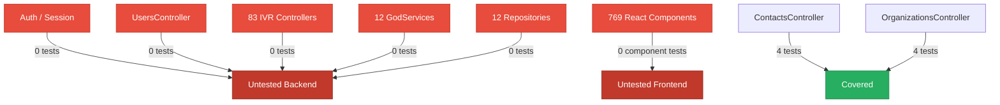
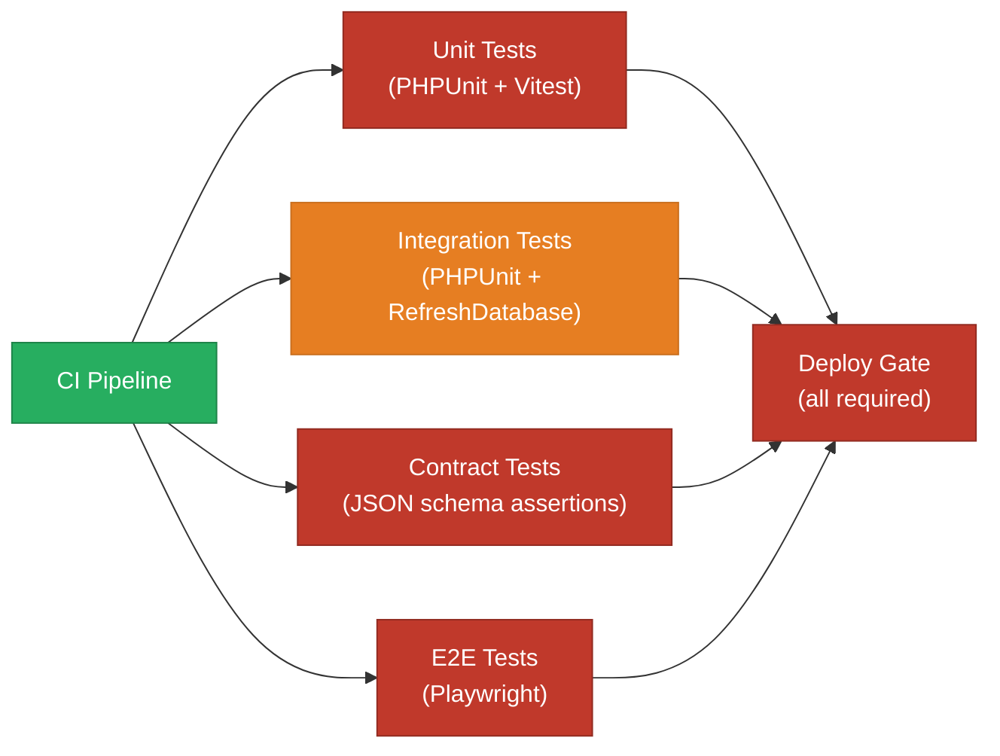
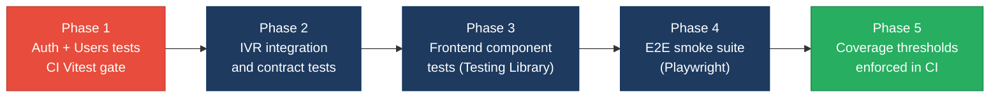

# 5. Testing & Quality Assurance Hotspots Analysis

**Objective:** Improve test coverage and software quality by generating unit, integration, and contract tests where missing.

**Date:** 2026-08-04 12:13:13 UTC | **Scope:** `shende-shweta/pingcrm` — PHPUnit 11 (Laravel Feature/Unit suites) + Vitest (frontend)

## Executive Summary

> **Executive Summary**
>
> The pingcrm codebase carries an extreme test deficit: only 4 test files exist for 1,044 source files (~141 PHP backend + ~903 TypeScript/React frontend), yielding an estimated line coverage well below 5% on both layers. The backend PHPUnit suite covers only the Contacts and Organizations list/search/trash flows; the entire authentication system, user management, image serving, reporting, and 83 IVR controllers are completely untested. The single frontend test (`resources/js/test/smoke.test.ts`) asserts `expect(true).toBe(true)` and provides no functional coverage of any of the 769 React components. Vitest is not wired into CI, so frontend tests are never enforced on pull requests. The overall test posture is **High Risk** and any refactoring or extraction of the IVR legacy layer without first building a safety net risks undetected regressions shipping directly to production.

<div class="metric-grid">
<div class="metric-card"><div class="metric-number">4</div><div class="metric-label">Test Files Found</div></div>
<div class="metric-card"><div class="metric-number">~1,040</div><div class="metric-label">Source Files With No Matching Test</div></div>
<div class="metric-card"><div class="metric-number">&lt;5% (est.)</div><div class="metric-label">Measured/Estimated Coverage</div></div>
<div class="metric-card"><div class="metric-number">0</div><div class="metric-label">Skipped/Disabled Tests</div></div>
</div>

<div class="overall-rating overall-rating--high-risk"><div class="overall-rating-label">Overall Codebase Rating — Testing &amp; Quality Assurance</div><div class="overall-rating-value">High Risk</div><div class="overall-rating-note">H1, H2, H3, and H4 all fall in the High Risk band; H7 (trivial frontend smoke test) adds a further driver — no functional test coverage exists on either layer.</div></div>

## 5.1 Benchmark Ratings Summary

One row per hotspot. "Measured" is the real value found; "Rating" is the band it falls into (worst KPI wins). This table is the source for the Overall Codebase Rating banner above.

| # | Hotspot | Primary KPI | <span class="rating rating-good">Good</span> | <span class="rating rating-moderate">Moderate</span> | <span class="rating rating-high-risk">High Risk</span> | Measured | Rating |
|---|---|---|---|---|---|---|---|
| H1 | Untested Critical Logic | Critical modules with zero tests | 0 | 1–3 | >3 | >10 modules | <span class="rating rating-high-risk">High Risk</span> |
| H2 | Low Test Coverage | Overall coverage % | >80% | 50–80% | <50% | ~2% (est.) | <span class="rating rating-high-risk">High Risk</span> |
| H3 | Missing Integration Tests | Boundaries covered % | >70% | 30–70% | <30% | ~13% (2 of 15+) | <span class="rating rating-high-risk">High Risk</span> |
| H4 | Missing Contract Tests | APIs with contract tests % | >80% | 40–80% | <40% | 0% | <span class="rating rating-high-risk">High Risk</span> |
| H5 | Flaky / Skipped Tests | Skipped/flaky test count | 0 | 1–5 | >5 | 0 | <span class="rating rating-good">Good</span> |
| H6 | No CI Test Gate | Tests enforced in CI | Required gate | Runs, not required | No CI test run | PHP: required; Vitest: not wired | <span class="rating rating-moderate">Moderate</span> |
| H7 | Assertion-Free Smoke Test (additional) | Frontend tests with real assertions | All tests meaningful | Any trivial test | All tests trivial | 1 trivial / 1 total | <span class="rating rating-high-risk">High Risk</span> |

## 5.2 Hotspot-by-Hotspot Evidence

### H1. Untested Critical Logic <span class="sev sev-critical">Critical</span>

**Benchmark:** `Critical modules with zero tests = >10` → falls in the **High Risk** band (Good: 0 · Moderate: 1–3 · High Risk: >3).

**Evidence — backend:**

1. **`app/Http/Controllers/Auth/AuthenticatedSessionController.php` + `app/Http/Requests/Auth/LoginRequest.php`** — carries the rate-limiting lockout logic (`ensureIsNotRateLimited`), credential validation, session regeneration, and CSRF token rotation on logout. Zero tests exist for any of these paths. A regression in rate-limiter key generation or session invalidation silently bypasses the lockout or leaks a stale session.

2. **`app/Http/Controllers/UsersController.php`** — governs user creation, password hashing via `setPasswordAttribute`, soft-delete, restore, and the demo-user guard (`isDemoUser`). Zero tests exist. The owner-privilege escalation path (any authenticated user can set `owner = true` on `store`) is unverifiable without a test.

3. **`app/Legacy/Services/AgentDeskGodService.php` (and all 11 peer `*GodService.php` files)** — orchestrate IVR workflow writes directly via `DB::table()`, use `extract($payload)` for variable injection, and hold a hard-coded API key. All 12 service classes across the 12 IVR modules (AgentDesk, BusinessHours, CallAnalytics, CallFlow, CallRecording, CallRouting, CustomerProfile, DidInventory, HistoricalReports, LiveMonitoring, PromptLibrary, QueueManagement) have zero test coverage.

4. **`app/Repositories/Legacy/AgentDeskRepository.php` (and all 11 peer repository files)** — contain raw `DB::select` concatenation with user-controlled `$filter` input. All 12 repository classes have zero tests. Any change to filtering logic is completely unverifiable.

5. **`app/Http/Controllers/ReportsController.php` and `app/Http/Controllers/ImagesController.php`** — the reports download endpoint and image-serving path (with Glide query parameter passthrough) have zero tests.

Additional backend modules with zero tests: 83 IVR controllers under `app/Http/Controllers/Ivr/`, 5 Legacy Helpers (`LegacyIvrArray`, `LegacyIvrCrypto`, `LegacyIvrDate`, `LegacyIvrMath`, `LegacyIvrString`), `DashboardController`, `HandleInertiaRequests` middleware.

**Why it matters here:** Authentication and user-management regressions ship to all tenants simultaneously in this SaaS CRM. The IVR legacy services govern telephony workflows for enterprise customers; a broken import/export or a corrupted sync goes undetected until a customer reports call-routing failures. With zero unit coverage, the only feedback loop is production.

**Recommended approach:**
1. Start with `LoginRequest` — write PHPUnit unit tests for `ensureIsNotRateLimited` (under-threshold, over-threshold, available-in seconds) and `authenticate` (valid credentials, invalid credentials, rate-limited path).
2. Add a `UsersTest.php` Feature test covering store, update, destroy, restore, and the owner-guard path.
3. For the 12 `*GodService` classes, write unit tests using SQLite in-memory to assert the return value of each `orchestrateWorkflow*` method with a known payload.
4. For the 12 `*Repository` classes, write integration tests that assert parameterized `fetchChunk*` calls do not interpolate the filter string.

<!-- affected-files
glob: app/Http/Controllers/**/*.php
issue: Controller has zero corresponding test file
action: Add Feature test covering all HTTP verbs and guard paths
-->

<!-- affected-files
glob: app/Legacy/Services/*.php
issue: GodService class has zero unit tests
action: Add unit tests for each orchestrateWorkflow method using in-memory SQLite
-->

<!-- affected-files
glob: app/Repositories/Legacy/*.php
issue: Repository has zero tests; filter parameter is interpolated (SQL injection risk)
action: Add integration tests asserting parameterized queries and filter sanitisation
-->

### H2. Low Test Coverage <span class="sev sev-critical">Critical</span>

**Benchmark:** `Overall coverage % = ~2% estimated` → falls in the **High Risk** band (Good: >80% · Moderate: 50–80% · High Risk: <50%). Estimate basis: test-file-to-source-file ratio; no `coverage/` directory or `clover.xml` was found.

**Evidence:**

- **Backend (PHP):** 3 meaningful test files for 141 source files in `app/`. Of those, `tests/Unit/ExampleTest.php` asserts `$this->assertTrue(true)` — a placeholder with zero business logic coverage. The two Feature test files (`ContactsTest.php`, `OrganizationsTest.php`) together contain 8 real test cases covering only list/search/trash for Contacts and Organizations.
- **Frontend (TypeScript/React):** 1 test file (`resources/js/test/smoke.test.ts`) for 903 source files. That test asserts `expect(true).toBe(true)` — no component is imported, rendered, or exercised.
- No coverage report was found; PHPUnit's `<coverage>` element is absent from `phpunit.xml`. The ratio estimate is conservative.

**Why it matters here:** At ~2% estimated coverage, any refactoring of the IVR legacy layer is flying blind. Without a coverage threshold enforced in CI, this number can only decrease over time.

**Recommended approach:**
1. Enable PHPUnit coverage in CI (`coverage: xdebug` in `setup-php`) and set a minimum threshold (50% line coverage) in `phpunit.xml`'s `<coverage>` enforce block.
2. Enable Vitest coverage (`vitest run --coverage`) and add a `coverageThreshold` to `vitest.config.ts` starting at 20% lines.
3. Prioritize: Auth → Users → Reports → IVR controllers → Legacy Services → Repositories.
4. Remove `tests/Unit/ExampleTest.php` to avoid inflating test counts.

<!-- affected-files
glob: app/**/*.php
issue: PHP source file with no corresponding test
action: Add unit or feature test to bring overall coverage toward 75%
-->

<!-- affected-files
glob: resources/js/**/*.tsx
issue: React component with no corresponding Vitest test
action: Add Testing Library component test
-->

### H3. Missing Integration Tests <span class="sev sev-high">High</span>

**Benchmark:** `Service/data boundaries covered = ~13% (2 of 15+)` → falls in the **High Risk** band (Good: >70% · Moderate: 30–70% · High Risk: <30%).

**Evidence:**

The two Feature test suites use `RefreshDatabase` and exercise real MySQL I/O — these are genuine integration tests at the Contacts and Organizations data boundaries. All other boundaries are uncovered:

1. **IVR Legacy boundary** — 12 IVR modules each with Index, Store, Update, Destroy, Import, Export, and Sync controllers writing through a `*GodService` to `DB::table("ivr_*")`. Zero integration tests.
2. **IvrHub data aggregation boundary** — `IvrHubController@data` aggregates live metrics from multiple legacy tables. No integration test verifies the aggregated response shape with known seed data.
3. **Inertia middleware boundary** — `HandleInertiaRequests.php` shares global props (user, flash) with all server-side renders. No integration test covers the shared-data contract.
4. **Auth session boundary** — login/logout session lifecycle (rate limiter, CSRF regeneration) is untested as an HTTP integration flow.

**Why it matters here:** Services that pass individually can still fail when wired to a real database or HTTP stack. The IVR sync paths write legacy API payloads in a transactional sequence; breaking the wiring is invisible without an integration test that exercises the full controller → service → DB → response path.

**Recommended approach:**
1. Add `IvrModuleTest.php` Feature test class verifying store and index HTTP flows for at least one IVR module using `RefreshDatabase`.
2. Add `IvrHubTest.php` asserting the `/ivr/data` JSON response shape when IVR tables contain known seed data.
3. Add `AuthTest.php` Feature test for login (success, bad credentials, rate limit exceeded) and logout.

<!-- affected-files
glob: app/Http/Controllers/Ivr/*.php
issue: IVR controller has no integration test covering the full HTTP-to-DB flow
action: Add Feature test with RefreshDatabase for each IVR module store/index/destroy flow
-->

### H4. Missing Contract Tests <span class="sev sev-high">High</span>

**Benchmark:** `APIs with contract tests = 0%` → falls in the **High Risk** band (Good: >80% · Moderate: 40–80% · High Risk: <40%).

**Evidence:**

The codebase exposes 87 legacy IVR API endpoints (generated in `routes/generated/ivr_legacy_api.php`) plus 33 web routes and the `/ivr/health-legacy` JSON endpoint. No test validates:

1. The schema of any response from the 87 `ivr-legacy/*` endpoints — endpoints accept both GET and POST; any controller response shape change goes undetected.
2. The IVR hub data structure returned by `IvrHubController@data` — consumed by `resources/js/components/ivr/IvrHubCharts.tsx`; a structural mismatch produces a silent frontend rendering failure.
3. The `IvrModuleController@show` response shape used by each IVR module page.

No Pact, schema-validation, or OpenAPI-based contract tests exist anywhere.

**Why it matters here:** 87 auto-generated routes form the integration surface with the legacy IVR system. A field rename in any GodService payload breaks the frontend silently; without a contract test, detection requires a user reporting a broken IVR management page.

**Recommended approach:**
1. Add `assertJsonStructure` assertions in an `IvrApiContractTest.php` for the index and store responses of each IVR module.
2. Add a JSON shape assertion on `/ivr/data` for the expected top-level keys.
3. Extend the existing `AssertableInertia` pattern in `ContactsTest` to assert prop shapes on all CRUD page responses.

<!-- affected-files
glob: routes/generated/ivr_legacy_api.php
issue: All 87 auto-generated IVR API routes have no contract or schema test
action: Add JSON schema assertions in IvrApiContractTest for each module endpoint
-->

### H6. No CI Test Gate <span class="sev sev-medium">Medium</span>

**Benchmark:** `Tests enforced in CI: PHP = Required gate; Vitest = not wired` → falls in the **Moderate** band.

**Evidence:**

`.github/workflows/tests.yml` runs `php artisan test` on every push and pull request — the backend PHPUnit gate is properly wired. However, `npm run test` (which invokes `vitest run`) is **never called** in any CI workflow. The CI job runs `npm run build` (which catches TypeScript compilation errors) but Vitest is absent. The `vitest.config.ts` and the `"test": "vitest run"` script in `package.json` exist but are orphaned from CI.

**Why it matters here:** Any contributor can break existing frontend tests without CI catching it. Frontend test coverage expansion is wasted effort until the gate is wired.

**Recommended approach:**
1. Add `npm run test` as a step in `.github/workflows/tests.yml` after `npm run build`.
2. Once Vitest coverage is enabled, add `npm run test -- --coverage` with a threshold flag.

<!-- affected-files
glob: .github/workflows/tests.yml
issue: Frontend Vitest tests are never invoked in CI
action: Add "npm run test" step after "npm run build" in the test job
-->

### H7. Assertion-Free Smoke Test <span class="sev sev-high">High</span> (additional)

**Benchmark:** `Frontend tests with real assertions = 0 of 1 (0%)` → falls in the **High Risk** band; KPI thresholds: all tests meaningful = Good · any trivial test = Moderate · all tests trivial = High Risk.

**Evidence:**

`resources/js/test/smoke.test.ts` is the entire frontend test suite:

```ts
describe('frontend toolchain', () => {
    it('runs vitest', () => {
        expect(true).toBe(true)
    })
})
```

No React component is imported, rendered, or asserted against. This test only verifies the Vitest binary resolves. With 769 `.tsx` component files, effective component test coverage is 0%. No Cypress or Playwright configuration was found — E2E tests are entirely absent.

**Why it matters here:** All 769 React components (IVR module pages, shared form inputs, contact/organization edit flows) ship without any automated functional verification. A broken `SearchFilter`, a mis-wired `SelectInput`, or a regression in the IVR Charts component reaches production with no signal.

**Recommended approach:**
1. Replace `smoke.test.ts` with a real component test — render `Shared/SearchFilter.tsx` with `@testing-library/react`, simulate a search event, assert the `onChange` callback fires with the correct value.
2. Add component tests for `TextInput`, `SelectInput`, and `FileInput` — used across all CRUD pages, highest leverage.
3. Add a Playwright config and at least one E2E smoke test covering login → dashboard → IVR hub navigation.

<!-- affected-files
glob: resources/js/**/*.tsx
issue: No real assertions exist for any React component
action: Add Testing Library component tests starting with resources/js/Shared/ components
-->

**Not observed (rated Good):** H5 — grep for `markTestSkipped`, `@skip`, `xtest`, `xit`, `xdescribe`, `->skip()` found zero matches; no skipped or disabled tests are present.

## 5.3 Diagrams

### Current test coverage gaps



### Target test pyramid / CI gate



### Improvement roadmap



## 5.4 Actions Required

| Hotspot | Action | Rating | Priority |
|---|---|---|---|
| H1 — Untested Critical Logic | Add PHPUnit Feature tests for Auth, Users, Reports, and IVR module controllers; add unit tests for all 12 GodService and 12 Repository classes | <span class="rating rating-high-risk">High Risk</span> | <span class="sev sev-critical">Critical</span> |
| H2 — Low Test Coverage | Enable PHPUnit + Vitest coverage reporting in CI; enforce minimum thresholds (50% PHP, 20% TS); remove placeholder ExampleTest | <span class="rating rating-high-risk">High Risk</span> | <span class="sev sev-critical">Critical</span> |
| H3 — Missing Integration Tests | Add Feature tests for IVR CRUD flows with RefreshDatabase, IvrHub data endpoint shape, and Auth session lifecycle | <span class="rating rating-high-risk">High Risk</span> | <span class="sev sev-high">High</span> |
| H4 — Missing Contract Tests | Add JSON schema assertions for all 87 IVR-legacy API endpoints and the `/ivr/data` aggregation response | <span class="rating rating-high-risk">High Risk</span> | <span class="sev sev-high">High</span> |
| H7 — Assertion-Free Smoke Test | Replace trivial smoke test with real Testing Library component tests for Shared/* components; add Playwright E2E config | <span class="rating rating-high-risk">High Risk</span> | <span class="sev sev-high">High</span> |
| H6 — No CI Test Gate (frontend) | Add `npm run test` step to `.github/workflows/tests.yml` after `npm run build` | <span class="rating rating-moderate">Moderate</span> | <span class="sev sev-medium">Medium</span> |

## 5.5 Expected Outcomes

- Critical business paths (authentication, user management, IVR workflow writes) are protected by automated tests before any refactoring of the legacy IVR layer begins.
- CI enforces both PHPUnit and Vitest on every pull request, ensuring regressions in the PHP backend or React frontend are caught within minutes of introduction.
- Contract tests for the 87 auto-generated IVR API endpoints ensure that field renames or response shape changes in any GodService are caught before they silently break the frontend.
- Coverage thresholds enforced in CI provide an objective quality floor that prevents the ratio from declining as new IVR modules are added.
- End-to-end smoke tests provide a final safety net verifying the login → IVR hub flow in a real browser environment on every deployment candidate.
