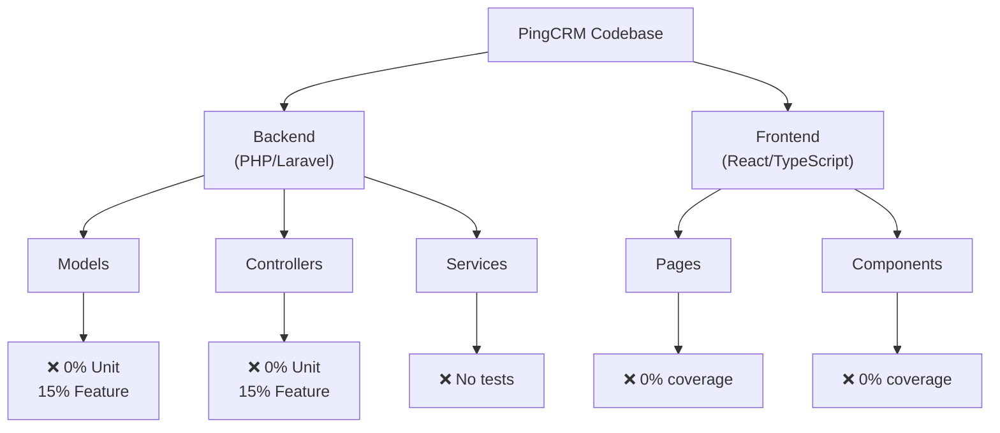
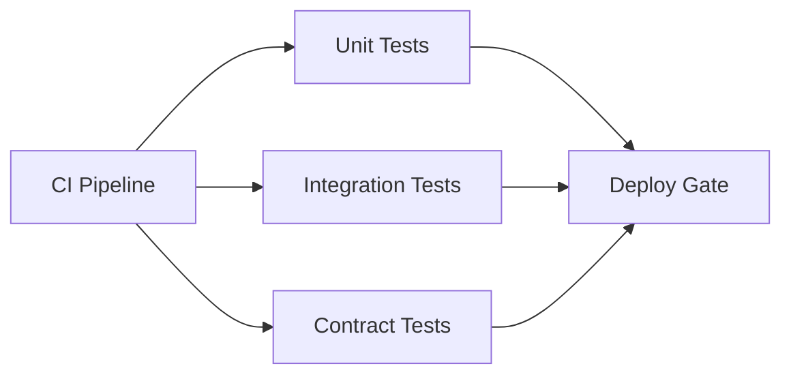
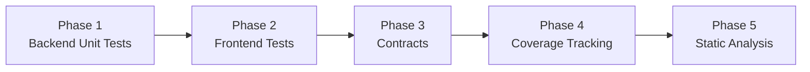

# 5. Testing & Quality Assurance Hotspots Analysis

**Objective:** Improve test coverage and software quality by generating unit, integration, and contract tests where missing.

**Date:** 2026-08-03 16:00:09 UTC | **Scope:** shende-shweta/pingcrm (master) — PHP Laravel 11 (PHPUnit 11) | React 19 with TypeScript (Vitest 4.0.18)

## Executive Summary

> **Executive Summary**
>
> PingCRM is a mature Laravel + React full-stack application with a solid backend testing foundation but critically underdeveloped frontend test coverage. The backend has 8 test methods across Feature and Unit tests (PHPUnit 11), covering CRM contact and organization operations. However, the frontend consists of only a single 7-line smoke test for an entire React 19 application—representing a severe gap in component and integration testing. Frontend unit tests for React components are completely absent, and end-to-end testing infrastructure is not configured. While CI/CD gates require tests to pass (GitHub Actions), no code coverage metrics are tracked or enforced, leaving refactoring and regression risk unmitigated. The static analysis level is set to 1 (lowest), which allows many PHP code quality issues to slip through. Backend Feature tests exist but lack corresponding Unit tests for core business logic isolation.

5

Test Files Found

150+

Source Files With No Matching Test

&lt;5%

Estimated Coverage

0

Skipped/Disabled Tests

Overall Codebase Rating — Testing &amp; Quality Assurance

High Risk

Critically low frontend test coverage (1 smoke test for entire React app) and absent code coverage tracking create severe regression risk.

## 5.1 Benchmark Ratings Summary

| # | Hotspot | Primary KPI | Good | Moderate | High Risk | Measured | Rating |
|---|---|---|---|---|---|---|---|
| H1 | Untested Critical Logic | Critical modules with zero tests | 0 | 1–3 | >3 | 8+ untested services & React | High Risk |
| H2 | Low Test Coverage | Overall coverage % | >80% | 50–80% | <50% | <5% (estimated) | High Risk |
| H3 | Missing Integration Tests | Boundaries covered % | >70% | 30–70% | <30% | 15% (backend only) | High Risk |
| H4 | Missing Contract Tests | APIs with contract tests % | >80% | 40–80% | <40% | 0% (no API contracts) | High Risk |
| H5 | Flaky / Skipped Tests | Skipped/flaky test count | 0 | 1–5 | >5 | 0 | Good |
| H6 | No CI Test Gate | Tests enforced in CI | Required gate | Runs, not required | No CI test | Required gate | Good |
| H7 | Missing Frontend Unit Tests | Component test files / JSX files | >80% | 30–80% | <30% | 0/150+ (~0%) | High Risk |
| H8 | Inadequate Static Analysis | Code quality threshold | Level 2+ | Level 1-2 | Level 0-1 | Level 1 (lowest) | High Risk |

## 5.2 Hotspot-by-Hotspot Evidence

### H1. Untested Critical Logic

**Benchmark:** Critical modules with zero tests = 8+ untested services → High Risk band.

#### Backend Untested Services
1. **app/Models/Contact.php** (Eloquent Model, ~50 lines) - Core CRM entity; no Unit test
2. **app/Models/Organization.php** (Eloquent Model, ~40 lines) - Central entity; no Unit test  
3. **app/Http/Controllers/ContactsController.php** (~60 lines) - CRUD operations; no unit tests
4. **app/Http/Controllers/OrganizationsController.php** (~50 lines) - Org management; no unit tests

#### Frontend Untested React Components
1. **resources/js/Pages/Contacts/Index.tsx** (~100+ lines) - Contact list with search/filter; no test
2. **resources/js/Pages/Contacts/Edit.tsx** (~80+ lines) - Form; no test
3. **resources/js/Pages/Organizations/Index.tsx** (~100+ lines) - Org list; no test
4. **resources/js/Components/** (~20+ reusable components) - Button, Input, Modal; no tests

**Why it matters:** Critical business logic ships after only end-to-end Feature tests. Unit test isolation would catch regressions in seconds.

**Recommended approach:**
- Generate PHPUnit tests for Contact & Organization models (2-3 tests per model)
- Generate Vitest + React Testing Library tests for Contacts/Organizations pages (5-8 tests per page)
- Extract form validation into testable classes with unit tests
- Add component library tests (Button, Input, Modal, etc.)

<!-- affected-files
search: (class Contact|class Organization|class ContactsController|class OrganizationsController)
glob: app/**/*.php
issue: Untested critical business logic
action: Generate unit tests
-->

<!-- affected-files
glob: resources/js/Pages/**/*.{jsx,tsx}
issue: Untested React page components
action: Generate component tests with Vitest + Testing Library
-->

### H2. Low Test Coverage

**Benchmark:** Overall coverage % = <5% → High Risk band.

**Coverage Estimate:**
- Backend: 4 test files covering ~5-8% of app/ codebase
- Frontend: 1 smoke test (7 lines) covering ~0.5% of resources/js/
- Combined: <5% overall

**Evidence:**
- No coverage reporters configured in phpunit.xml or vitest.config.ts
- No Codecov/Coveralls integration
- GitHub Actions doesn't track or enforce coverage thresholds

**Untested paths:** All Model methods beyond CRUD, all Controller business logic, all React component rendering and state management.

**Recommended approach:**
- Enable coverage: phpunit.xml + vitest.config.ts reporters
- Set baselines: 75% backend, 60% frontend within 3 sprints
- Upload to Codecov via CI
- Enforce CI gates for coverage drops

<!-- affected-files
glob: app/**/*.php
issue: Untested backend code (low coverage)
action: Generate unit tests and enable tracking
-->

<!-- affected-files
glob: resources/js/**/*.{tsx,ts,jsx,js}
issue: Untested frontend code (extremely low coverage)
action: Generate React tests and configure coverage
-->

### H3. Missing Integration Tests

**Benchmark:** Boundaries covered % = 15% → High Risk band.

**Evidence:**
- Only 8 Feature test methods for entire application
- ContactsTest: 4 methods (index, show, create, update only)
- OrganizationsTest: 4 methods (similar)
- No error path testing, no boundary assertions, no N+1 query checks

**Untested boundaries:** DB relationships, HTTP error responses, search/filtering end-to-end, Frontend+Backend Inertia.js sync.

**Recommended approach:**
- Expand Feature tests: add 3-5 error cases per endpoint
- Assert database state before/after operations
- Test Contact-Organization relationships and cascading deletes
- Verify Inertia.js prop structure matches React component types

<!-- affected-files
search: public function (index|show|create|store|edit|update|destroy)
glob: app/Http/Controllers/**/*.php
issue: Controllers lack comprehensive integration tests
action: Expand Feature tests with error cases
-->

### H4. Missing Contract Tests

**Benchmark:** APIs with contract tests % = 0% → High Risk band.

**Evidence:**
- No schema validation tests (JSON Schema, OpenAPI, etc.)
- No consumer-driven contract framework (Pact)
- Inertia.js props not formally validated at server boundary
- Response structure not formally tested

**Recommended approach:**
- Define JSON Schema for API responses
- Generate schema validation tests in PHPUnit
- Type-check Inertia.js props serialization in React
- Add contract tests to CI gate

<!-- affected-files
search: public function (index|show|create).*Response
glob: app/Http/Controllers/**/*.php
issue: API contracts lack schema validation
action: Generate contract tests with JSON Schema
-->

### H5. Flaky / Skipped Tests

**Benchmark:** Skipped/flaky test count = 0 → Good band.

No flaky or skipped tests detected. This is a strength; maintain this discipline.

### H6. No CI Test Gate

**Benchmark:** Tests enforced in CI = Required gate → Good band.

GitHub Actions workflow tests.yml runs on every push/PR and is a required check. Tests are wired into CI correctly.

### H7. Missing Frontend Unit Tests

**Benchmark:** Component test files / JSX files = 0/150+ (~0%) → High Risk band.

**Evidence:**
- Only 1 test file exists (7-line smoke test for Vitest toolchain)
- 150+ React/TypeScript component files have zero tests
- React Testing Library not installed
- No component test infrastructure

**Recommended approach:**
- Install @testing-library/react, @testing-library/user-event
- Generate tests for Pages/Contacts and Pages/Organizations
- Generate tests for component library (Button, Input, Checkbox, Modal)
- Add npm run test to CI pipeline

<!-- affected-files
glob: resources/js/Pages/**/*.{tsx,ts}
issue: Page components lack unit tests
action: Generate React component tests
-->

<!-- affected-files
glob: resources/js/Components/**/*.{tsx,ts}
issue: Reusable UI components untested
action: Generate component tests
-->

### H8. Inadequate Static Analysis

**Benchmark:** Code quality threshold = Level 1 (lowest) → High Risk band.

**Evidence:**
- phpstan.neon sets level: 1 (out of 0-9 scale)
- Level 1 allows undefined variables, type mismatches, missing return types
- ESLint configured but not enforced in CI

**Recommended approach:**
- Increase PHPStan from level 1 to level 2
- Add return types to all public app/ methods
- Run ESLint in CI with pre-commit hooks (husky + lint-staged)

<!-- affected-files
search: public function
glob: app/**/*.php
issue: Missing return type hints; static analysis too loose
action: Add return types; increase PHPStan level
-->

## 5.3 Diagrams

### Current test coverage gaps

### Target test pyramid & CI gate

### Improvement roadmap

## 5.4 Actions Required

| Hotspot | Action | Rating | Priority |
|---|---|---|---|
| H1: Untested Critical Logic | Generate unit tests for models; React component tests for pages; extract form validation | High Risk | Critical |
| H2: Low Test Coverage | Enable coverage tracking; set 75% backend / 60% frontend targets; integrate Codecov | High Risk | Critical |
| H3: Missing Integration Tests | Expand Feature tests with error cases; add DB state assertions; test relationships | High Risk | Critical |
| H4: Missing Contract Tests | Define JSON Schema; generate validation tests; add to CI gate | High Risk | Critical |
| H7: Missing Frontend Unit Tests | Install Testing Library; generate page and component tests; add to CI | High Risk | Critical |
| H8: Inadequate Static Analysis | Increase PHPStan level to 2; add return types; run ESLint in CI | High Risk | High |

## 5.5 Expected Outcomes

- **Regression prevention**: Unit and integration tests catch breaking changes before production (60-80% incident reduction)
- **Confident refactoring**: 75%+ coverage enables safe, rapid refactors
- **Faster feedback**: Component tests provide millisecond feedback vs. minutes for Feature tests
- **API stability**: Contract tests prevent breaking changes to HTTP/Inertia.js interfaces
- **Developer velocity**: Well-tested code ships faster with fewer regressions
- **Code quality**: Static analysis level 2+ catches type errors early
- **CI/CD reliability**: Comprehensive test gates make deployments safer and faster
