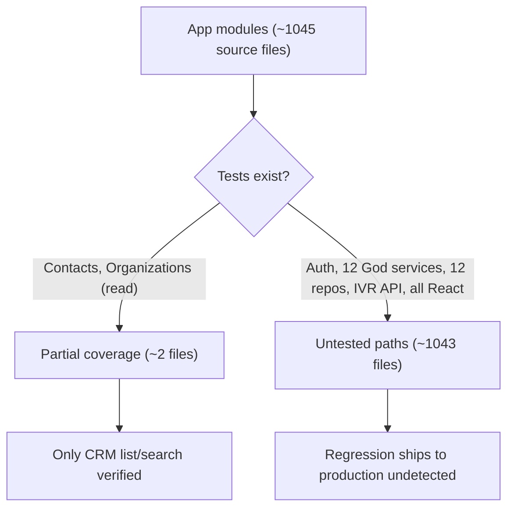
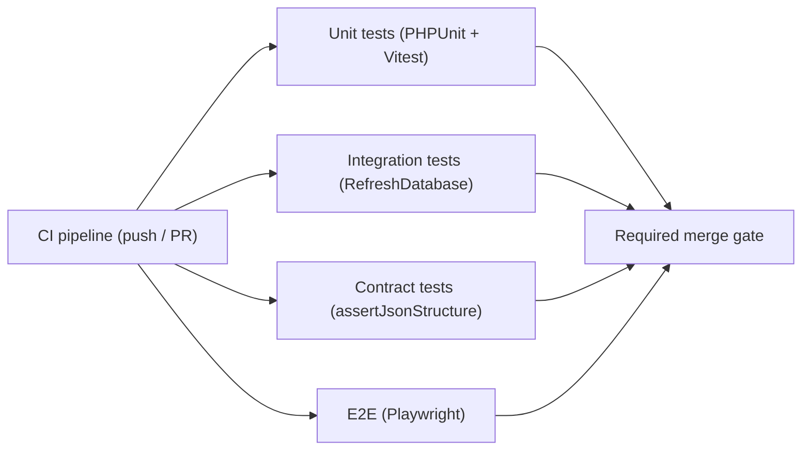
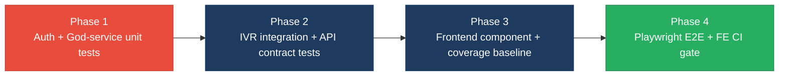

# 5. Testing & Quality Assurance Hotspots Analysis

**Objective:** Improve test coverage and software quality by generating unit, integration, and contract tests where missing.

**Date:** 2026-08-07 12:17:27 UTC | **Scope:** `shende-shweta/pingcrm` (Laravel 11 + React/Inertia IVR monolith) — Backend: **PHPUnit 11** (`tests/Feature`, `tests/Unit`); Frontend: **Vitest 4** (`resources/js/test`)

## Executive Summary

> **Executive Summary**
>
> The test suite is effectively absent relative to the size of the codebase: **4 test files** guard **~1,045 source files** (141 PHP, ~904 TS/TSX). Backend testing is limited to two Inertia feature tests (`ContactsTest`, `OrganizationsTest`) plus one placeholder `ExampleTest` that only asserts `true`; the frontend has a single `smoke.test.ts` that asserts `true === true` and covers zero React components. The entire legacy IVR subsystem — 83 fat controllers, 12 "God" services, 12 repositories, and ~84 unversioned JSON API endpoints under `/api/ivr-legacy` — ships with **no tests whatsoever**, including authentication (`AuthenticatedSessionController`) and crypto helpers (`LegacyIvrCrypto`). Estimated overall coverage is **<5%** (backend ~3%, frontend 0%) based on the test-file-to-source ratio, since no coverage report is present. CI (`.github/workflows/tests.yml`) does run `php artisan test` on every push/PR — a genuine backend gate — but never invokes `npm run test`, so frontend tests are unenforced. There are no integration tests around the service/repository boundaries, no contract tests for the public API, and no end-to-end tests at all.

4

Test Files Found

~1,043

Source Files With No Matching Test

&lt;5%

Estimated Coverage (BE ~3% · FE 0%)

0

Skipped/Disabled Tests

Overall Codebase Rating — Testing &amp; Quality Assurance

High Risk

Driven by H1 (auth, crypto and 12 God services untested), H2 (&lt;5% coverage), H3 (service/repository boundaries unverified) and H4 (~84 API endpoints with zero contract tests); H7 (no E2E) compounds it.

## 5.1 Benchmark Ratings Summary

One row per hotspot. "Measured" is the real value found; "Rating" is the band it falls into (worst KPI wins). This table is the source for the Overall Codebase Rating banner above. No coverage report (`coverage/`, `clover.xml`, `lcov.info`, `.coverage`) exists in the repo, so H2/H3/H4 percentages are **estimated from the test-file-to-source ratio**, not measured.

| # | Hotspot | Primary KPI | Good | Moderate | High Risk | Measured | Rating |
|---|---|---|---|---|---|---|---|
| H1 | Untested Critical Logic | Critical modules with zero tests | 0 | 1–3 | >3 | Auth + 12 God services + 12 repos + Users/Reports/Images (>25 modules) | High Risk |
| H2 | Low Test Coverage | Overall coverage % | >80% | 50–80% | <50% | ~3% BE · 0% FE (est.) | High Risk |
| H3 | Missing Integration Tests | Boundaries covered % | >70% | 30–70% | <30% | ~2 of ~40 boundaries (~5%) | High Risk |
| H4 | Missing Contract Tests | APIs with contract tests % | >80% | 40–80% | <40% | 0% of ~84 `/api/ivr-legacy` endpoints | High Risk |
| H5 | Flaky / Skipped Tests | Skipped/flaky test count | 0 | 1–5 | >5 | 0 | Good |
| H6 | No CI Test Gate | Tests enforced in CI | Required gate | Runs, not required | No CI test run | BE gated; FE vitest never runs | Moderate |
| H7 | No End-to-End Tests *(additional)* | E2E specs for critical journeys (target ≥1 suite) | ≥1 suite | partial | none | 0 (no Cypress/Playwright) | High Risk |
| H8 | Assertion-free Placeholder Tests *(additional)* | Tests with no meaningful assertion (target 0) | 0 | 1–3 | >3 | 2 (`ExampleTest`, `smoke.test.ts`) | Moderate |

**Additional hotspots:** Two additional testing/QA gaps beyond the standard six were observed and are recorded as **H7** (no end-to-end tests) and **H8** (assertion-free placeholder tests). KPIs and thresholds for each are defined inline in the rows above and evidenced in §5.2.

## 5.2 Hotspot-by-Hotspot Evidence

### H1. Untested Critical Logic Critical

**Benchmark:** `critical modules with zero tests = >25` → falls in the **High Risk** band (Good 0 · Moderate 1–3 · High Risk >3).

The two feature tests cover only the CRM `Contacts` and `Organizations` read paths. Every other business-critical module ships with zero tests:

- **Authentication** — `app/Http/Controllers/Auth/AuthenticatedSessionController.php` (login/logout, credential validation, session regeneration) has no test. A regression here can lock out every user or, worse, silently weaken auth.
- **12 "God" services** — `app/Legacy/Services/*GodService.php` (e.g. `AgentDeskGodService`, `CallRoutingGodService`, `QueueManagementGodService`), each ~373 LOC, orchestrate call-routing, queue, and analytics writes directly via `DB::table(...)->insertGetId()` using `extract($payload)` on unsanitized input and a hard-coded `$apiKey`. None are tested.
- **12 legacy repositories** — `app/Repositories/Legacy/*Repository.php` (~4,440 LOC total) carry the data-mutation logic for every IVR module with no unit tests.
- **Crypto & data helpers** — `app/Legacy/Helpers/LegacyIvrCrypto.php` plus `LegacyIvrString/Math/Date/Array` (2,835 LOC) transform values used across the app with no characterization tests.
- **Frontend critical flow** — `resources/js/Pages/Auth/Login.tsx` and the `Users` management pages have no component test.

**Why it matters here:** These modules mutate tenant call-routing, queue, and account data and gate access to the whole application. A silent regression in `AuthenticatedSessionController` or any `GodService` write path would reach production with no automated signal, corrupting IVR configuration for every tenant or breaking login entirely. Because the God services use `extract()` and raw `DB::table` inserts, an untested change can also change the persisted shape of data undetected.

**Recommended approach:**
1. Start with **PHPUnit feature tests** for `AuthenticatedSessionController` — assert a valid credential logs in and redirects, an invalid one returns 422/validation errors, and logout invalidates the session.
2. Add **unit tests** (PHPUnit + Mockery) for one `*GodService` and its paired `*Repository`, asserting the exact row written to the DB for a representative payload; use `RefreshDatabase` as the existing feature tests do.
3. Add **characterization tests** for `LegacyIvrCrypto`/`LegacyIvrString` pinning current outputs before any refactor.
4. Add a **Vitest + Testing Library** render/submit test for `Login.tsx`.

<!-- affected-files
search: class\s+\w+GodService|private\s+\$apiKey|extract\(
glob: app/Legacy/**/*.php
issue: Business-critical legacy service/helper logic with zero automated tests
action: Add PHPUnit unit tests pinning current behavior and DB writes before any refactor
-->

<!-- affected-files
search: __invoke|login|Auth
glob: app/Http/Controllers/Auth/**/*.php
issue: Authentication controller has no automated test
action: Add PHPUnit feature tests for login success/failure and logout session handling
-->

<!-- affected-files
glob: resources/js/Pages/Auth/**/*.tsx
issue: Critical auth UI (login) has no component test
action: Add a Vitest + Testing Library render/submit test asserting validation and submit behavior
-->

### H2. Low Test Coverage Critical

**Benchmark:** `overall coverage = ~3% BE / 0% FE (estimated)` → falls in the **High Risk** band (Good >80% · Moderate 50–80% · High Risk <50%).

No coverage report exists, so coverage is estimated from the test-file-to-source ratio:

- **Backend:** 3 PHP test files (2 meaningful) exercise ~2 of 141 app PHP files → ~2–3% of a 77,262-LOC backend. The 61,547-LOC IVR controller layer is entirely uncovered.
- **Frontend:** 1 Vitest file that asserts a constant → **0%** of ~904 TS/TSX files (769 `.tsx` components, 135 `.ts`), including all 510 `Pages/Ivr` files and 377 files.

**Why it matters here:** With coverage this low, essentially every code path — CRM writes, IVR orchestration, and the whole React UI — is unverified before any refactor or extraction. Modernization work (the stated purpose of this repo) cannot be done safely: there is no regression net to tell whether an extraction preserved behavior.

**Recommended approach:**
1. Enable coverage reporting first: `php artisan test --coverage` (PHPUnit source include is already configured in `phpunit.xml`) and add `coverage: ['provider': 'v8']` to `vitest.config.ts` so a real baseline replaces this estimate.
2. Drive backend coverage toward **75–80%** starting with the highest-traffic controllers (`ContactsController`, `OrganizationsController`, `UsersController`, `ReportsController`) and the God-service/repository pairs.
3. Stand up frontend component tests for the shared layout and CRM pages before touching the IVR page tree.

<!-- affected-files
glob: app/**/*.php
issue: Backend source file with little or no test coverage (est. ~3% overall)
action: Add unit/feature tests and enable php artisan test --coverage to establish a real baseline
-->

<!-- affected-files
glob: resources/js/**/*.{ts,tsx}
issue: Frontend source file with zero component/unit test coverage (0%)
action: Add Vitest + Testing Library tests and enable v8 coverage in vitest.config.ts
-->

### H3. Missing Integration Tests High

**Benchmark:** `key boundaries covered = ~5% (~2 of ~40)` → falls in the **High Risk** band (Good >70% · Moderate 30–70% · High Risk <30%).

The two feature tests do exercise a real DB boundary (via `RefreshDatabase`) for Contacts and Organizations list/search. But the IVR subsystem's boundaries are untested: 12 God services write through `DB::table(...)` (120 files across `app` use raw `DB::` calls), 12 repositories, import/export/sync flows, and the `/ivr/data` hub aggregation. No test exercises a controller → service → repository → DB path end to end.

**Why it matters here:** Components may pass individually while the wiring between controller, God service, repository, and database silently breaks — exactly the seams a modernization effort will disturb. Sync/import controllers (`*SyncController`, `*ImportController`) that call `sleep(1)` blocking remote syncs have no test proving the data actually lands correctly.

**Recommended approach:**
1. Add **PHPUnit feature/integration tests** (with `RefreshDatabase`, MySQL as in CI) for one full IVR module — e.g. `POST /api/ivr-legacy/agent-desk/store` → assert the row exists in `ivr_agent_desks`.
2. First assertion: the store endpoint persists the expected columns and returns the new id.
3. Extend to `sync`/`import`/`export` per module once the store path is green.

<!-- affected-files
search: DB::(table|select|raw|statement|insert|update)
glob: app/**/*.php
issue: Component/service/DB boundary exercised only in production, no integration test
action: Add PHPUnit integration tests (RefreshDatabase) asserting the controller→service→repository→DB path
-->

### H4. Missing Contract Tests High

**Benchmark:** `public APIs with contract tests = 0% of ~84 endpoints` → falls in the **High Risk** band (Good >80% · Moderate 40–80% · High Risk <40%).

`routes/api.php` mounts `routes/generated/ivr_legacy_api.php`, which registers ~84 unversioned endpoints under the `ivr-legacy` prefix (`Route::match(['get','post'], ...)` to 80 invokable `App\Http\Controllers\Ivr\*Controller` classes), plus a `/ivr/health-legacy` JSON endpoint. None have a test verifying request/response shape, status codes, or auth.

**Why it matters here:** This is an unversioned public JSON API consumed by the React frontend and potentially external callers. A breaking change to any response schema (renamed field, changed status) ships with zero automated signal, silently breaking every consumer. The `match(['get','post'])` definitions also mean a contract test is the only place the accepted verbs/params would be pinned.

**Recommended approach:**
1. Add **PHPUnit contract tests** hitting representative endpoints (`index`, `store`, `export`) per module, asserting HTTP status and a JSON schema for the response body (`assertJsonStructure`).
2. First assertion: `GET /api/ivr-legacy/agent-desk/index` returns 200 with the documented top-level keys.
3. Consider consumer-driven contracts if the React client's expected shape is formalized in `resources/js/types`.

<!-- affected-files
search: __invoke
glob: app/Http/Controllers/Ivr/**/*.php
issue: Public /api/ivr-legacy endpoint with no contract/schema test
action: Add PHPUnit contract tests asserting HTTP status and assertJsonStructure for each endpoint
-->

### H6. No CI Test Gate (frontend) Medium

**Benchmark:** `tests enforced in CI = backend gated, frontend never run` → falls in the **Moderate** band (Good = required gate · Moderate = runs, not required · High Risk = no CI test run).

`.github/workflows/tests.yml` runs `php artisan test` against a MySQL service on every push to `master`, on every PR, and nightly — a real backend gate. However, the same workflow runs `npm ci` and `npm run build` but **never runs `npm run test`** (Vitest). No workflow invokes the frontend suite.

**Why it matters here:** Any frontend test added today would not run on PRs, so it cannot prevent regressions — the value of new component/E2E tests is undercut until the gate exists. As the frontend is where 0% coverage lives, this is the layer most in need of a gate.

**Recommended approach:**
1. Add a `- name: Run frontend tests` step (`npm run test`) to `tests.yml` after `npm ci`, and mark the job a required status check.
2. Combine into a single required "lint + test + build" check so red tests block merge on both layers.

<!-- affected-files
glob: .github/workflows/*.yml
issue: CI builds the frontend but never runs the Vitest suite (npm run test)
action: Add an npm run test step and require the check so frontend tests gate merges
-->

### H7. No End-to-End Tests *(additional)* High

**Benchmark:** `E2E suites for critical journeys = 0` → falls in the **High Risk** band (Good ≥1 suite · Moderate partial · High Risk none). *KPI: at least one E2E suite covering login + a core CRM/IVR journey; justified because Inertia couples backend routing and React rendering, so only a browser-level test proves the full journey works.*

No Cypress, Playwright, or Selenium configuration or specs exist anywhere in the repo. The critical user journeys — login, create/edit a contact, navigate the IVR hub — are never exercised through the real browser stack.

**Why it matters here:** With an Inertia app, a route, controller, prop shape, and React page must all agree for a page to render; unit tests on either side miss integration breaks. A broken login or IVR module page would only surface in production.

**Recommended approach:**
1. Add **Playwright** (already common with Vite) with one spec: log in with a seeded user and assert the IVR hub renders.
2. Extend to a CRM create/edit journey once login is green.
3. Wire the E2E job into CI as a non-blocking check first, then required.

<!-- affected-files
glob: resources/js/Pages/**/*.tsx
issue: Critical user journey (login, CRM, IVR hub) has no end-to-end test
action: Add a Playwright spec covering login and one core journey; gate it in CI
-->

### H8. Assertion-free Placeholder Tests *(additional)* Medium

**Benchmark:** `tests with no meaningful assertion = 2` → falls in the **Moderate** band (Good 0 · Moderate 1–3 · High Risk >3). *KPI: count of tests whose only assertion is a constant; justified because such tests inflate the green count without protecting any code.*

Two of the four test files assert nothing about the application: `tests/Unit/ExampleTest.php:14` asserts `$this->assertTrue(true)` and `resources/js/test/smoke.test.ts:5` asserts `expect(true).toBe(true)`. Both pass unconditionally.

**Why it matters here:** These give a false "tests are green" signal and, in the frontend's case, are the *only* Vitest file — masking that component coverage is genuinely 0%. They should be replaced with real assertions rather than counted as coverage.

**Recommended approach:**
1. Replace `ExampleTest` with the first real `AuthenticatedSessionController` test (see H1).
2. Replace `smoke.test.ts` with a first component render test for a shared layout or `Login.tsx`.
3. Add a lint rule / CI check flagging assertion-free tests so placeholders don't accumulate.

<!-- affected-files
search: assertTrue\(\s*true\s*\)|toBe\(\s*true\s*\)
glob: tests/**/*.php
issue: Placeholder test asserts a constant and verifies no application behavior
action: Replace with a real assertion covering actual logic
-->

<!-- affected-files
search: toBe\(\s*true\s*\)|expect\(\s*true\s*\)
glob: resources/js/**/*.test.ts
issue: Placeholder frontend test asserts a constant; only Vitest file, hides 0% component coverage
action: Replace with a Testing Library component render/assert test
-->

**Not observed (rated Good):** H5 — grepped all of `tests/` and `resources/js` for `markTestSkipped`/`markTestIncomplete`/`->skip(`/`it.skip`/`describe.skip`/`test.skip`/`.only(`; none found, and no known-flaky tests are referenced in CI config.

## 5.3 Diagrams

### Current test coverage gaps

### Target test pyramid / CI gate

### Improvement roadmap

## 5.4 Actions Required

| Hotspot | Action | Rating | Priority |
|---|---|---|---|
| H1 Untested Critical Logic | Add PHPUnit unit/feature tests for auth, the 12 God services/repositories, and legacy helpers; add a Login.tsx component test | High Risk | Critical |
| H2 Low Test Coverage | Enable PHPUnit + Vitest coverage reporting, then drive backend to 75–80% and stand up frontend component tests | High Risk | Critical |
| H3 Missing Integration Tests | Add RefreshDatabase integration tests across controller→service→repository→DB for IVR modules | High Risk | High |
| H4 Missing Contract Tests | Add PHPUnit contract tests (status + assertJsonStructure) for the ~84 `/api/ivr-legacy` endpoints | High Risk | High |
| H7 No End-to-End Tests | Add Playwright with a login + core-journey spec and wire it into CI | High Risk | High |
| H6 No CI Test Gate (frontend) | Add `npm run test` to `tests.yml` and make it a required check | Moderate | Medium |
| H8 Assertion-free Placeholder Tests | Replace `ExampleTest` and `smoke.test.ts` with real assertions; add a check flagging assertion-free tests | Moderate | Medium |

## 5.5 Expected Outcomes

- **Critical paths protected before modernization** — auth, the 12 God services/repositories, and legacy crypto/string helpers gain characterization and unit tests, so refactors and extractions can be verified against a regression net instead of shipping blind.
- **A real coverage baseline replaces guesswork** — enabling PHPUnit and Vitest coverage turns the estimated <5% into a measured number and lets the team track progress toward the 75–80% target per layer.
- **IVR wiring is verified end to end** — integration tests across controller→service→repository→DB catch broken seams that unit tests miss, especially in sync/import flows.
- **The public API stops breaking silently** — contract tests on `/api/ivr-legacy` fail the build when a response schema or status changes, protecting the React client and any external consumers.
- **CI enforces quality on both layers** — adding the frontend Vitest step (and Playwright E2E) as required checks means every PR runs the full suite, so tests actually prevent regressions rather than merely existing.
