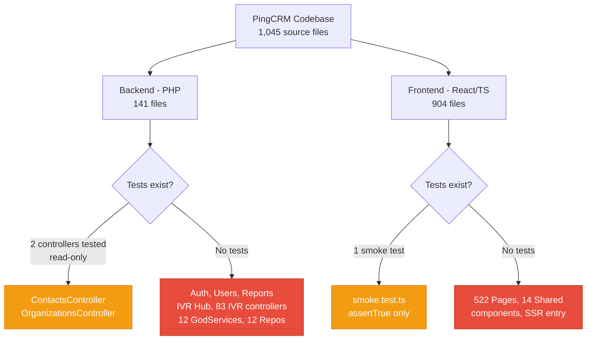
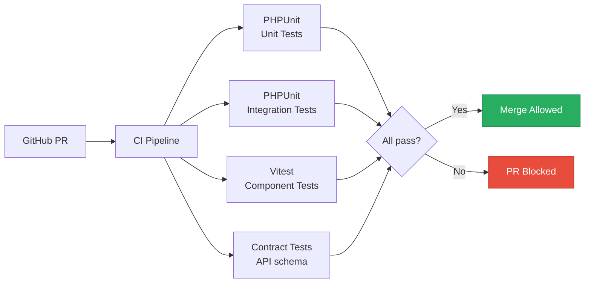
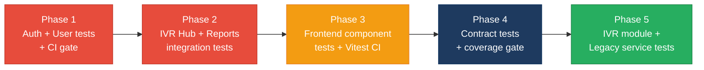

# 5. Testing & Quality Assurance Hotspots Analysis

**Objective:** Improve test coverage and software quality by generating unit, integration, and contract tests where missing.

**Date:** 2026-08-05 10:38:04 UTC | **Scope:** `shende-shweta/pingcrm` (master) — PHPUnit 11 (backend), Vitest (frontend)

## Executive Summary

> **Executive Summary**
>
> The PingCRM codebase has critically low test coverage across both its Laravel backend and React/TypeScript frontend. Only 3 PHP test files (9 test methods) exist against 141 backend source files, covering only the Contacts and Organizations index/search/filter flows. The entire authentication system, user management, IVR enterprise module (83 controllers, 12 "GodService" classes, 12 repositories), reports with complex DB aggregation queries, and multi-tenant scoping logic ship with zero tests. On the frontend, 904 TypeScript/React source files have exactly one test file — a trivial smoke test asserting `expect(true).toBe(true)` with no component, integration, or E2E tests. CI runs PHPUnit on push/PR via GitHub Actions but does not run Vitest, and the test workflow is not configured as a required check for merging. Estimated overall line coverage is below 10%.

4

Test Files Found

~1,035

Source Files With No Matching Test

&lt;10%

Estimated Coverage (both layers)

0

Skipped/Disabled Tests

Overall Codebase Rating — Testing &amp; Quality Assurance

High Risk

Five of six standard hotspots (H1, H2, H3, H4, H6) rated High Risk; the entire IVR enterprise module, authentication, user management, reports, and all 904 frontend components ship untested.

## 5.1 Benchmark Ratings Summary

Coverage estimates are based on test-file-to-source-file ratio and manual inspection of test content — no coverage tooling report (`lcov.info`, `clover.xml`) was found in the repository.

| # | Hotspot | Primary KPI | Good | Moderate | High Risk | Measured | Rating |
|---|---|---|---|---|---|---|---|
| H1 | Untested Critical Logic | Critical modules with zero tests | 0 | 1–3 | >3 | 7+ modules | High Risk |
| H2 | Low Test Coverage | Overall coverage % | >80% | 50–80% | <50% | ~8% (estimated) | High Risk |
| H3 | Missing Integration Tests | Boundaries covered % | >70% | 30–70% | <30% | ~5% (estimated) | High Risk |
| H4 | Missing Contract Tests | APIs with contract tests % | >80% | 40–80% | <40% | 0% | High Risk |
| H5 | Flaky / Skipped Tests | Skipped/flaky test count | 0 | 1–5 | >5 | 0 | Good |
| H6 | No CI Test Gate | Tests enforced in CI | Required gate | Runs, not required | No CI test run | Runs (backend only), not required; frontend not run | High Risk |
| H7 | Assertion-Free Tests (additional) | Placeholder tests with no real assertions | 0 | 1–2 | >2 | 2 | Moderate |

## 5.2 Hotspot-by-Hotspot Evidence

### H1. Untested Critical Logic Critical

**Benchmark:** `Critical modules with zero tests = 7+` → falls in the **High Risk** band (Good 0 · Moderate 1–3 · High Risk >3).

The following business-critical modules have zero corresponding test files:

**1. Authentication (backend)** — `AuthenticatedSessionController` handles login, logout, and session management. `LoginRequest` implements rate-limited credential verification with lockout events. A regression in authentication logic (e.g. broken rate limiting, session fixation) would allow unauthorized access or lock out legitimate users. No test file exists for either class.

**2. User Management (backend)** — `UsersController` handles full CRUD for user accounts including file upload (photo), password changes, soft-delete/restore, and a demo-user guard. Validation logic (email uniqueness, owner flag) and the demo-user protection are untested — a regression could allow duplicate accounts, privilege escalation via the `owner` flag, or demo-user deletion.

**3. Reports & IVR Dashboard (backend)** — `ReportsController` contains 5 complex DB aggregation methods (`dailyTrend`, `callSummary`, `queueSummary`, `recentCallsForReport`, CSV streaming). `IvrHubController` (380 lines) builds a dashboard payload from 7 separate DB queries with multi-tenant scoping, date filtering, and queue/disposition filtering. `IvrAccountContext` implements tenant isolation via `scopeOrganizationOn()` and `scopeAccount()`. A regression in tenant scoping would leak data across accounts — all untested.

**4. IVR Enterprise Module (backend)** — 83 invokable controllers across 12 module domains (AgentDesk, BusinessHours, CallFlow, CallRouting, etc.) each handling CRUD + import/export/sync operations. 12 "GodService" classes (e.g. `AgentDeskGodService` at 373 lines) contain workflow orchestration with unsafe `extract()` calls and hardcoded secrets. 12 Legacy Repository classes. Zero tests for any of these.

**5. Frontend — all 522 page components and 14 shared components** — Login form, user/contact/organization CRUD forms, IVR hub dashboard, reports with charts, all IVR module UIs. Not a single React component test or interaction test exists. The sole frontend test (`smoke.test.ts`) asserts `expect(true).toBe(true)`.

**Why it matters here:** Authentication, multi-tenant data isolation, and user management are the highest-risk surfaces in any SaaS application. The IVR module handles telephony operations (call routing, queue management, agent desk) where data corruption has direct business impact. With zero tests, any refactoring or bug fix to these modules risks shipping regressions straight to production.

**Recommended approach:**
1. Start with `AuthenticatedSessionController` — write PHPUnit feature tests for login success, login failure, rate limiting/lockout, and logout using `RefreshDatabase` (framework already configured).
2. Add `UsersController` feature tests covering CRUD, validation, photo upload, demo-user guard, and soft-delete/restore.
3. Add `IvrAccountContext` unit tests to verify tenant scoping isolation — these are pure query-builder tests.
4. For the frontend, install `@testing-library/react` and `jsdom` for Vitest, then write component tests for the Login page and shared form components (`TextInput`, `SelectInput`, `SearchFilter`).

<!-- affected-files
glob: app/Http/Controllers/**/*.php
issue: Controller has zero test coverage
action: Generate PHPUnit feature tests
-->

<!-- affected-files
glob: resources/js/Pages/**/*.tsx
issue: React component has zero test coverage
action: Generate Vitest component tests with React Testing Library
-->

### H2. Low Test Coverage Critical

**Benchmark:** `Overall coverage % = ~8% (estimated from test-file-to-source ratio)` → falls in the **High Risk** band (Good >80% · Moderate 50–80% · High Risk <50%).

**Backend coverage (estimated ~10%):** 3 test files with 9 test methods cover 141 PHP source files. The only tested modules are `ContactsController` (index, search, soft-delete filter — 4 tests) and `OrganizationsController` (index, search, soft-delete filter — 4 tests), plus 1 trivial `ExampleTest` asserting `assertTrue(true)`. No tests exist for store, update, delete, or restore actions even on the tested controllers. The remaining 6 controllers, 83 IVR controllers, 12 GodServices, 12 repositories, 5 legacy helpers, 16 models, 1 form request, 2 middleware, and 1 service provider are completely untested.

**Frontend coverage (estimated 0%):** 1 test file (`resources/js/test/smoke.test.ts`) with 1 trivial assertion against 904 TypeScript/React source files (522 pages, 14 shared components, `app.tsx`, `ssr.tsx`). No `@testing-library/react`, no `jsdom` environment configured, no component rendering tests.

**Why it matters here:** At ~8% estimated coverage, the vast majority of code paths — including all write operations, all validation logic, all error handling, and all frontend interaction flows — are unverified. Any refactoring, dependency upgrade, or feature addition has no safety net.

**Recommended approach:**
1. Enable PHPUnit coverage reporting (`--coverage-text` or `--coverage-clover`) by adding `pcov` or `xdebug` coverage driver to CI — the current CI config explicitly sets `coverage: none`.
2. Target 50% backend coverage as a first milestone by testing all controller CRUD actions for Users, Contacts, and Organizations.
3. Configure Vitest with `jsdom` environment and add `@testing-library/react` as a dev dependency to enable component testing.
4. Target 30% frontend coverage by testing all shared components and the Login page first.

<!-- affected-files
glob: app/**/*.php
issue: Source file has no corresponding test
action: Generate unit or feature test to increase coverage
-->

<!-- affected-files
glob: resources/js/Shared/*.tsx
issue: Shared React component has no test
action: Generate Vitest component test with React Testing Library
-->

### H3. Missing Integration Tests High

**Benchmark:** `Boundaries covered % = ~5% (estimated)` → falls in the **High Risk** band (Good >70% · Moderate 30–70% · High Risk <30%).

The existing `ContactsTest` and `OrganizationsTest` use `RefreshDatabase` and hit real Eloquent/DB boundaries, qualifying as integration tests for those two read paths. However, the following critical service/data boundaries have zero integration test coverage:

**1. IvrHubController → DB (7 query methods)** — `loadStats`, `loadHourlyVolume`, `loadDailyTrend`, `loadQueueDistribution`, `loadQueueMetrics`, `loadRecentCalls`, `loadAgents` each construct complex multi-table joins (`ivr_call_records`, `ivr_operational_queues`, `ivr_agents`, `organizations`) with conditional filters. These are the core data pipeline for the IVR dashboard.

**2. ReportsController → DB (5 query methods + CSV streaming)** — `dailyTrend`, `callSummary`, `queueSummary`, `recentCallsForReport` run aggregate queries. The `download` action streams CSV — an untested boundary between the controller and `php://output`.

**3. GodService → DB (12 services)** — Each GodService uses `DB::table()->insertGetId()` with raw payload casting. The `extract($payload)` calls create implicit variable bindings that could silently break with schema changes.

**4. IVR Legacy API routes** — 80+ routes in `routes/generated/ivr_legacy_api.php` invoke single-action controllers that delegate to GodServices and repositories. No integration test verifies the HTTP → Controller → Service → DB chain for any of these.

**Why it matters here:** The existing unit-test-only approach (which itself is minimal) cannot catch regressions in DB query construction, join conditions, or multi-tenant scoping. A broken `WHERE` clause in `IvrAccountContext::scopeOrganizationOn()` would leak data across tenants — only an integration test hitting a real database would catch this.

**Recommended approach:**
1. Create a `tests/Feature/IvrHubTest.php` that seeds IVR tables and verifies dashboard payload structure and tenant isolation.
2. Create a `tests/Feature/ReportsTest.php` that seeds call records and verifies aggregation math and CSV output.
3. Add at least one integration test per GodService domain verifying the insert → read round-trip.
4. Use Laravel's existing `RefreshDatabase` trait (already used by ContactsTest) with SQLite `:memory:` for fast execution.

<!-- affected-files
search: DB::(table|select|raw|statement)
glob: app/**/*.php
issue: DB boundary has no integration test
action: Generate integration test with RefreshDatabase
-->

### H4. Missing Contract Tests High

**Benchmark:** `APIs with contract tests % = 0%` → falls in the **High Risk** band (Good >80% · Moderate 40–80% · High Risk <40%).

The application exposes multiple API surfaces with no contract or schema tests:

**1. IVR Hub JSON API** — `IvrHubController::data()` returns a JSON response with a complex nested structure (`stats`, `callVolumeByHour`, `callTrend`, `queueDistribution`, `queueMetrics`, `recentCalls`, `agentSnapshot`, `refreshedAt`). No test validates the response schema. The frontend relies on this exact shape — a field rename or type change would break the dashboard silently.

**2. IVR Legacy API** — 80+ endpoints under `/api/ivr-legacy/` accept `GET` and `POST` with no request validation or response schema tests. These routes use `Route::match(['get','post'], ...)` which accepts any HTTP method — a contract test should verify expected methods and response formats.

**3. Inertia Page Props** — While not a traditional REST API, each Inertia `render()` call passes a specific prop shape to the frontend. The existing tests validate some Inertia props for Contacts and Organizations but nothing for Users, Reports, IVR Hub, or IVR Modules.

**4. Reports CSV Download** — `ReportsController::download()` streams CSV with specific column headers. No test verifies the CSV schema matches what the frontend/users expect.

**Why it matters here:** Without contract tests, breaking changes to API response shapes ship without any automated signal. The IVR Hub JSON endpoint is consumed by the React frontend for real-time dashboard updates — a broken contract causes silent data display failures in production.

**Recommended approach:**
1. Add a PHPUnit test for `IvrHubController::data()` that asserts the JSON structure using `assertJsonStructure()`.
2. Add contract tests for the CSV download verifying column headers and data types.
3. Consider adding TypeScript type assertions on the frontend side using Vitest to verify Inertia page prop shapes match expected interfaces.
4. For the legacy API, add at least one contract test per module domain verifying HTTP method, status code, and response shape.

<!-- affected-files
search: response\(\)->json\(|->json\(|StreamedResponse
glob: app/Http/Controllers/**/*.php
issue: API endpoint has no contract/schema test
action: Generate contract test verifying response structure
-->

### H6. No CI Test Gate High

**Benchmark:** `Tests enforced in CI = Runs (backend only), not required; frontend not run` → falls in the **High Risk** band (Good = Required gate · Moderate = Runs, not required · High Risk = No CI test run).

**Backend CI:** The `tests.yml` workflow runs `php artisan test` on push to `master`, on pull requests, and on a daily cron schedule. It sets up MySQL 8.0 as a service, installs Composer and npm dependencies, and builds assets. However:
- Coverage is explicitly disabled (`coverage: none` in the PHP setup step).
- There is no evidence of branch protection rules requiring this check to pass before merging (no `.github/branch-protection.yml` or ruleset file found).

**Frontend CI:** The workflow installs Node dependencies and runs `npm run build` but does **not** run `npm run test` (Vitest). Frontend tests are completely absent from CI. Even if Vitest tests were added, they would not run automatically.

**Why it matters here:** Tests that do not run on every change do not prevent regressions. The backend tests run but are not enforced as a merge gate, meaning a failing test can be ignored. The frontend has no CI test step at all — adding frontend tests without also adding them to CI would provide local-only confidence.

**Recommended approach:**
1. Add `npm run test` as a step in `tests.yml` after the build step to run Vitest in CI.
2. Enable PHPUnit coverage reporting by changing `coverage: none` to `coverage: pcov` (or `xdebug`) and adding `--coverage-text --coverage-clover=coverage.xml` to the test command.
3. Configure branch protection on `master` to require the `test` workflow to pass before merging.
4. Consider adding a coverage threshold gate (e.g. fail CI if coverage drops below a minimum).

<!-- affected-files
glob: .github/workflows/tests.yml
issue: CI does not run frontend tests and is not a required merge gate
action: Add Vitest step and configure as required check
-->

### H7. Assertion-Free Tests (additional) Medium

**Benchmark:** `Placeholder tests with no real assertions = 2` → falls in the **Moderate** band (Good 0 · Moderate 1–2 · High Risk >2).

Two test files contain only trivial assertions that test the test framework, not application code:

**1. `tests/Unit/ExampleTest.php`** — Contains a single test `test_example()` that asserts `$this->assertTrue(true)`. This is the default Laravel scaffold test and verifies nothing about the application. It inflates the test count without providing coverage.

**2. `resources/js/test/smoke.test.ts`** — Contains a single test `'runs vitest'` that asserts `expect(true).toBe(true)`. This verifies only that Vitest is configured correctly, not that any application code works.

**Why it matters here:** These placeholder tests give a false sense of test infrastructure health. A CI dashboard showing "9 tests passing" masks the reality that only 8 of those tests verify real application behavior, and all of those are concentrated in two modules.

**Recommended approach:**
1. Replace `ExampleTest.php` with a real unit test — e.g. test `User::name` accessor or model factory behavior.
2. Replace `smoke.test.ts` with a real component render test — e.g. verify the `<Logo />` component renders without errors.

<!-- affected-files
glob: tests/Unit/ExampleTest.php
issue: Assertion-free placeholder test
action: Replace with meaningful unit test
-->

**Not observed (rated Good):** H5 (Flaky / Skipped Tests) — grep for `@skip`, `markTestSkipped`, `markTestIncomplete`, `it.skip`, `describe.skip`, `xit(`, `xdescribe(` found zero matches across all test files.

## 5.3 Diagrams

### Current test coverage gaps

### Target test pyramid / CI gate

### Improvement roadmap

## 5.4 Actions Required

| Hotspot | Action | Rating | Priority |
|---|---|---|---|
| H1 — Untested Critical Logic | Generate PHPUnit feature tests for Auth, Users, Reports, IVR Hub, and IvrAccountContext; add Vitest component tests for Login page and shared form components | High Risk | Critical |
| H2 — Low Test Coverage | Enable coverage tooling (pcov), set 50% backend / 30% frontend coverage milestones, test all controller CRUD actions | High Risk | Critical |
| H3 — Missing Integration Tests | Add integration tests for IvrHubController (7 DB queries), ReportsController (5 queries + CSV), GodService round-trips, and IVR legacy API chain | High Risk | High |
| H4 — Missing Contract Tests | Add JSON structure assertions for IVR Hub data API, CSV schema tests for reports download, and Inertia prop shape tests | High Risk | High |
| H6 — No CI Test Gate | Add `npm run test` step to tests.yml, enable coverage reporting, configure branch protection requiring test workflow to pass | High Risk | High |
| H7 — Assertion-Free Tests | Replace ExampleTest.php and smoke.test.ts placeholder assertions with real application tests | Moderate | Medium |

## 5.5 Expected Outcomes

- **Critical authentication and user management paths are protected** before any refactoring or feature development, preventing unauthorized access or privilege escalation regressions.
- **Multi-tenant data isolation (IvrAccountContext) is verified** by integration tests, ensuring tenant scoping logic cannot silently leak data across accounts.
- **CI catches regressions automatically on every PR** for both backend (PHPUnit) and frontend (Vitest), with branch protection enforcing the gate before merge.
- **API contract tests prevent silent breaking changes** to the IVR Hub JSON endpoint and report CSV downloads, protecting the frontend dashboard from data-shape regressions.
- **Coverage visibility enables informed decisions** about refactoring safety — teams can see which modules remain at risk before starting extraction or modernization work.
