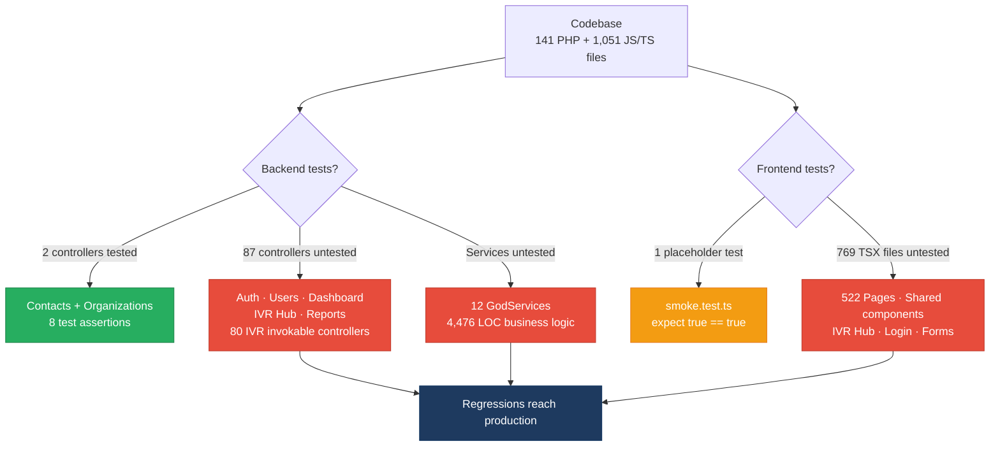
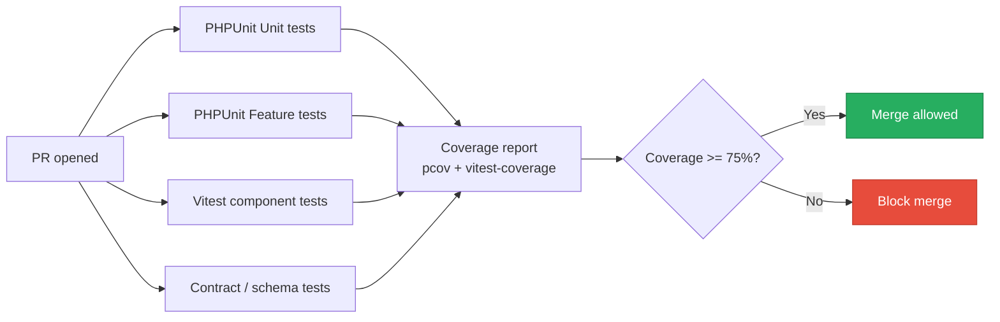
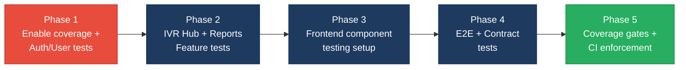

# 5. Testing & Quality Assurance Hotspots Analysis

**Objective:** Improve test coverage and software quality by generating unit, integration, and contract tests where missing.

**Date:** 2026-09-30 06:57:14 UTC | **Scope:** `shende-shweta/pingcrm` (master) — PHPUnit 11 (backend), Vitest (frontend)

## Executive Summary

> **Executive Summary**
>
> The pingcrm codebase — a Laravel 11 + React 19/Inertia.js application with a large IVR enterprise module — has critically low test coverage across both backend and frontend layers. Only 4 test files exist (3 PHP, 1 JS), covering just 2 of 89 concrete controllers with 8 real test assertions. The entire IVR domain (82 controllers, 12 GodServices totalling 4,476 LOC, 12 repositories, 81 legacy API routes) ships with zero automated tests. Authentication, user management, the IVR hub dashboard (380 LOC of complex DB aggregation), report generation with CSV export, and all 5 Legacy Helpers (including crypto) are entirely unprotected. On the frontend, 769 React/TSX components including 522 page components have no component or E2E tests — only a single placeholder `expect(true).toBe(true)` file. CI runs PHPUnit on PRs via `php artisan test` (all suites) but explicitly disables coverage collection (`coverage: none`) and does not run Vitest, so the frontend is never gate-checked. PHPStan (Level 1 via Larastan) and a coding standards workflow provide baseline static analysis. No coverage reports, no integration tests for external services, and no E2E framework exist.

4

Test Files Found

120+

Backend Source Files With No Test

&lt;5%

Estimated Coverage (no tool configured)

0

Skipped / Disabled Tests

Overall Codebase Rating — Testing &amp; Quality Assurance

High Risk

Driven by H1 (87 controllers untested), H2 (&lt;5% estimated coverage), H4 (82 API routes with zero contract tests), H7 (no E2E tests across 769 React components), and C1 (coverage reporting completely absent).

## 5.1 Benchmark Ratings Summary

Coverage estimates are based on test-file-to-source-file ratio and manual inspection of test content — no coverage tooling report (`lcov.info`, `clover.xml`) was found in the repository.

| # | Hotspot | Primary KPI | Good | Moderate | High Risk | Measured | Rating |
|---|---|---|---|---|---|---|---|
| H1 | Untested Critical Logic | Critical modules with zero tests | 0 | 1–3 | >3 | >10 modules (auth, users, IVR hub, reports, 80 IVR controllers, 12 GodServices, 12 repositories, helpers, IvrAccountContext) | High Risk |
| H2 | Low Test Coverage | Overall coverage % | >80% | 50–80% | <50% | <5% (estimated from test-to-source ratio; no coverage report exists) | High Risk |
| H3 | Missing Integration Tests | Boundaries covered % | >70% | 30–70% | <30% | N/A — no external service integrations (Third-party APIs, Carrier APIs, Payment gateways) observed in scanned code | Good |
| H4 | Missing Contract Tests | APIs with contract tests % | >80% | 40–80% | <40% | 0% (0 of 82 API routes have contract or schema tests) | High Risk |
| H5 | Flaky / Skipped Tests | Skipped/flaky test count | 0 | 1–5 | >5 | 0 | Good |
| H6 | No CI Test Gate | Tests enforced in CI | Required gate | Runs, not required | No CI test run | Backend PHPUnit runs on PRs; frontend Vitest not in CI | Moderate |
| H7 | No E2E Tests (additional) | E2E test files covering critical flows | >0 | — | 0 | 0 files; no Playwright, Cypress, or Dusk configured | High Risk |
| H8 | Placeholder Tests (additional) | Tests with no real business assertions | 0 | 1–2 | >2 | 2 (ExampleTest.php + smoke.test.ts) | Moderate |
| C1 | Coverage Reporting Absent (context) | Coverage tool configured and reports published | Clover/lcov published | Tool installed, not published | No coverage tool | `coverage: none` in CI; no Clover/lcov in repo | High Risk |
| C2 | IVR Legacy API Untested (context) | Feature tests for IVR legacy API routes | >70% | 30–70% | <30% | 0% (0 of 81 generated API routes tested) | High Risk |

Context-named technologies verified but not found: Pest (no Pest config or usage), Rector (no rector.php), PHP-CS-Fixer (no .php-cs-fixer.dist.php), Psalm (no psalm.xml), PHPMD (no phpmd.xml), CaptainHook (no captainhook.json), Sonar (no sonar-project.properties), Mongo (no driver or config).

**No additional hotspots beyond H7 and H8 were observed.**

## 5.2 Hotspot-by-Hotspot Evidence

### H1. Untested Critical Logic Critical

**Benchmark:** `Business-critical modules with zero tests = >10` → falls in the **High Risk** band (Good 0 · Moderate 1–3 · High Risk >3).

The codebase has 89 concrete controllers (excluding the base `Controller` class and `LoadsIvrModuleData` trait), 12 Legacy GodServices (4,476 LOC), 12 Legacy Repositories, 5 Legacy Helpers, and 1 critical support class (`IvrAccountContext`). Of these, only `ContactsController` and `OrganizationsController` have corresponding Feature tests — a total of 8 real test assertions across 2 test classes.

**Backend — untested critical modules:**

1. **`app/Http/Controllers/Auth/AuthenticatedSessionController.php`** — Handles login, session creation (`$request->session()->regenerate()`), and logout with guard invalidation. `app/Http/Requests/Auth/LoginRequest.php` implements credential verification. Zero tests for the authentication flow. A broken login would lock out all users; a broken logout could leave sessions active.

2. **`app/Http/Controllers/UsersController.php`** — Full CRUD with file upload (`Request::file('photo')->store('users')`), owner privilege checks (`$user->owner`), demo-user protection (`isDemoUser()`), and soft-delete/restore. Zero tests. A regression in the owner check could escalate privileges; a broken demo guard could allow deletion of the demo account.

3. **`app/Http/Controllers/Ivr/IvrHubController.php`** (380 LOC) — The main IVR dashboard with 10 private methods performing complex `DB::table()` queries: `loadStats()` aggregates active calls, queued calls, agents online, SLA percentage, and abandon rate across `ivr_operational_queues`, `ivr_agents`, and `ivr_call_records`; `loadHourlyVolume()` computes inbound volume by hour; `loadDailyTrend()` builds weekly answered/abandoned breakdowns. All queries use multi-tenant filtering via `IvrAccountContext`. Zero tests. This is the primary operational view for the IVR product surface.

4. **`app/Http/Controllers/ReportsController.php`** (198 LOC) — Report generation with 3 CSV streaming methods (`streamDailyCsv`, `streamQueuesCsv`, `streamCallsCsv`), date-range filtering, and call summary aggregation with multi-table joins. Zero tests. Broken report data would affect business decision-making.

5. **All 80 IVR invokable controllers** (`app/Http/Controllers/Ivr/`) — 12 IVR modules × 7 actions each (index, store, update, destroy, import, export, sync), plus 3 CustomerProfile controllers. Zero tests. Several contain dangerous patterns: `AgentDeskStoreController` line 29 has a raw SQL injection vector (`DB::select("select * from ivr_agent_desks where name like '%".$q."%'")`), hard-coded `$tenantId = 1`, `extract($payload)` in legacy endpoints, and swallowed exception stack traces across 55 legacy endpoint methods.

6. **12 Legacy GodServices** (`app/Legacy/Services/*GodService.php`, 4,476 LOC total) — Business logic orchestration classes with methods like `orchestrateAgentDeskWorkflow1()` through `orchestrateAgentDeskWorkflow55()`. Zero tests for any business rule in any service.

7. **`app/Support/IvrAccountContext.php`** — Multi-tenant scoping logic used by every IVR controller. Methods `scopeOrganizationOn()`, `queueIdsForScope()`, and `applyCallFilters()` enforce tenant data isolation. A bug here would leak data across tenants. Zero tests.

8. **`app/Legacy/Helpers/LegacyIvrCrypto.php`** — Encryption/decryption utility. Crypto logic without tests is a security and reliability risk. Zero tests. The other 4 helpers (Array, Date, Math, String) are also untested.

**Frontend — untested critical components:**

The frontend has 769 TSX files including 522 page components with zero real component tests. The Vitest configuration uses `environment: 'node'` (not `jsdom`), and `@testing-library/react` is not installed — the toolchain for component testing does not exist. The IVR Hub dashboard (`resources/js/Pages/Ivr/Hub/Index.tsx`), authentication flow (`resources/js/Pages/Auth/Login.tsx`), and all CRUD pages are entirely untested.

**Why it matters here:** Auth, user management, multi-tenant IVR dashboard, and reporting are the core business paths. Any regression in authentication, tenant scoping, or data aggregation logic ships directly to production with no automated detection. The IVR legacy controllers contain security-sensitive patterns (raw SQL, `extract()`, hard-coded tenant IDs) that are especially dangerous without test coverage.

**Recommended approach:**
1. Prioritize Feature tests for `AuthenticatedSessionController` (login/logout happy path and failure) and `UsersController` (CRUD + owner check + demo guard).
2. Add Feature tests for `IvrHubController` covering dashboard data loading, filtering, and tenant isolation via `IvrAccountContext`.
3. Add unit tests for `IvrAccountContext` (tenant scoping logic), `LegacyIvrCrypto`, and one representative GodService.
4. Install `@testing-library/react`, switch Vitest environment to `jsdom`, and add component tests for Login page and IVR Hub dashboard.

<!-- affected-files
search: class\s+\w+(Controller|GodService|Repository)
glob: app/**/*.php
issue: Untested business-critical module — no corresponding test file
action: Add PHPUnit Feature or Unit test for this module
-->

<!-- affected-files
glob: resources/js/Pages/**/*.tsx
issue: Untested React page component — no component test
action: Add Vitest component test with React Testing Library
-->

---

### H2. Low Test Coverage Critical

**Benchmark:** `Overall coverage % = <5% (estimated)` → falls in the **High Risk** band (Good >80% · Moderate 50–80% · High Risk <50%).

No coverage tool is configured. CI explicitly sets `coverage: none` in the PHP setup step (`.github/workflows/tests.yml`, line 43). No `clover.xml`, `lcov.info`, or coverage directory exists in the repository. The estimate is derived from the test-to-source file ratio:

| Layer | Testable source files | Test files (real) | File ratio |
|---|---|---|---|
| Backend (PHP, excl. models per rules) | ~122 | 2 (ContactsTest, OrganizationsTest) | ~1.6% |
| Frontend (JS/TS) | ~1,050 | 0 (smoke.test.ts is placeholder) | 0% |

The 2 backend Feature tests exercise only the `index`, `search`, and `filter` paths of `ContactsController` and `OrganizationsController` — they do not test `create`, `store`, `edit`, `update`, `destroy`, or `restore`. Even for these 2 controllers, method-level path coverage is partial.

**Why it matters here:** At <5% estimated coverage, the vast majority of code changes — including critical IVR business logic, authentication, and data export — have zero automated verification. Any refactoring, dependency upgrade, or feature addition carries unchecked regression risk.

**Recommended approach:**
1. Enable `pcov` coverage in CI and generate Clover XML on every run (see C1).
2. Set an initial coverage floor of 30% as a CI gate, incrementing by 5% per sprint.
3. Target 75% line coverage within 90 days by focusing on high-risk controllers first (auth, IVR hub, reports).

<!-- affected-files
glob: app/**/*.php
issue: Source file has no corresponding test — overall backend coverage <5%
action: Add unit and feature tests to increase coverage
-->

<!-- affected-files
glob: resources/js/Pages/**/*.tsx
issue: React page has zero test coverage — frontend coverage 0%
action: Add Vitest component tests with React Testing Library
-->

---

### H4. Missing Contract Tests High

**Benchmark:** `APIs with contract tests % = 0%` → falls in the **High Risk** band (Good >80% · Moderate 40–80% · High Risk <40%).

The application exposes 82 API routes via `routes/api.php`:
- 81 IVR legacy routes (`routes/generated/ivr_legacy_api.php`) using `Route::match(['get','post'], ...)` with no authentication middleware visible.
- 1 health endpoint (`/api/ivr/health-legacy`).

Additionally, 33 web routes serve Inertia responses whose prop structures form an implicit contract between the Laravel backend and the React frontend.

None of these endpoints have contract tests. The IVR legacy controllers return JSON responses with structures like `{"data": [...], "module": "AgentDesk", "action": "Store"}`, but there is no automated verification that these structures remain stable. The Inertia pages depend on specific prop shapes (`contacts.data[].name`, `filters.search`, etc.) that are only partially asserted in the 2 existing Feature tests.

**Examples:**
- `AgentDeskStoreController::handleStore()` returns either JSON or Inertia depending on `$request->wantsJson()`. The JSON structure is ad-hoc with no schema definition.
- `ReportsController::download()` streams CSV with specific column headers (`Call ID`, `Caller`, `Organization`, `Queue`, etc.). No test validates the header order or data format.
- `IvrModuleController` resolves 18 module slugs to page props via `SLUG_MAP` and `MODULE_META`. No test verifies that each slug resolves correctly.

**Why it matters here:** The 81 IVR legacy API endpoints serve external or internal consumers. Without contract tests, a change to a GodService return value or Eloquent attribute silently breaks consumers. The Inertia prop contract between PHP and React is also unverified — a renamed prop key breaks the frontend at runtime with no compile-time or test-time signal.

**Recommended approach:**
1. Add Feature tests for top-traffic IVR API endpoints first, asserting `assertJsonStructure()` on response shapes.
2. Add `assertInertia()` tests for every Inertia page route, verifying at minimum the component name and top-level prop keys.
3. Add CSV output tests for `ReportsController::download()` verifying header row content.
4. Add a parameterized test iterating `IvrModuleController::SLUG_MAP` to verify each slug resolves to valid page props.

<!-- affected-files
search: Route::match
glob: routes/generated/*.php
issue: API route with no contract or schema test
action: Add Feature test asserting JSON response structure
-->

---

### H6. No CI Test Gate Medium

**Benchmark:** `Tests enforced in CI = Backend runs on PRs; frontend not in CI` → falls in the **Moderate** band (Good: Required gate · Moderate: Runs, not required · High Risk: No CI test run).

**Backend CI (`.github/workflows/tests.yml`):** Runs `php artisan test` on push to `master` and on all PRs, with a MySQL 8.0 service container. This executes both Unit and Feature PHPUnit suites — all configured suites run, no group filtering. However:
- Coverage is explicitly disabled (`coverage: none`, line 43).
- No test result or coverage artifacts are uploaded.
- Whether this is a required status check in branch protection cannot be confirmed from the workflow file alone.

**Frontend CI:** No CI workflow runs `npm run test` or `npx vitest run`. The `tests.yml` workflow runs `npm run build` (line 71) to verify the build compiles, but does not execute the Vitest test suite. Frontend regressions are invisible to CI.

**Static analysis:** `static-analysis.yml` runs PHPStan via Laravel's shared workflow on push to master and PRs. `coding-standards.yml` runs code styling on push. These provide quality gating but do not substitute for test execution.

**`qa-ephemeral-runner.yml`:** A manual-dispatch workflow supporting PHPUnit and Vitest, but only triggered via `workflow_dispatch` — not automatic.

**Why it matters here:** The frontend constitutes ~88% of the source files (1,050 of ~1,172). With Vitest never running in CI, any frontend regression merges unchecked. Backend tests run but without confirmed branch protection, a failing test could theoretically be merged.

**Recommended approach:**
1. Add `npm run test` step to `tests.yml` after the `npm run build` step.
2. Configure branch protection on `master` requiring `tests` and `static-analysis` to pass.
3. Enable coverage collection and upload as CI artifacts.

<!-- affected-files
glob: .github/workflows/tests.yml
issue: Frontend Vitest not executed in CI pipeline
action: Add npm run test step after build step
-->

---

### H7. No E2E Tests (additional) High

**Benchmark:** `E2E test files covering critical flows = 0` → falls in the **High Risk** band (Good >0 · High Risk 0). Threshold rationale: any production web application with authentication and data mutation paths benefits from at least one E2E test covering the primary user journey; zero means no user flow is verified.

No Playwright, Cypress, Selenium, or Laravel Dusk configuration exists. No E2E test files were found. The `package.json` devDependencies include no E2E testing framework. With 522 page components handling authentication, contact/organization CRUD, IVR dashboard interactions with filters and drill-downs, report generation with date ranges, and CSV downloads, the complete user journey from login through data operations is untested end-to-end.

**Why it matters here:** The Inertia.js SPA architecture means HTTP Feature tests only verify the JSON prop payload, not the rendered UI. Critical bugs like broken form submissions, missing React hydration on SSR pages (`ssr.tsx` is configured), or Inertia navigation failures can only be caught by E2E tests in a real browser.

**Recommended approach:**
1. Install Playwright (`npm init playwright@latest`) as the E2E framework.
2. Write a first E2E test covering login → dashboard → contacts list → create contact → verify creation.
3. Add E2E tests for IVR hub dashboard filtering and report CSV download.
4. Run E2E tests in CI as a separate job after unit/feature tests pass.

<!-- affected-files
glob: resources/js/Pages/**/*.tsx
issue: No end-to-end test coverage for user journeys
action: Add Playwright E2E tests for critical flows
-->

---

### H8. Placeholder Tests (additional) Low

**Benchmark:** `Tests with no real business assertions = 2` → falls in the **Moderate** band (Good 0 · Moderate 1–2 · High Risk >2). Threshold rationale: placeholder tests inflate test counts without providing real regression protection.

Two test files contain only trivially-true assertions with no connection to application code:

1. **`tests/Unit/ExampleTest.php`** — `$this->assertTrue(true)`. The Laravel scaffold placeholder. Occupies the Unit suite's only slot and gives false impression of unit test coverage where none exists.

2. **`resources/js/test/smoke.test.ts`** — `expect(true).toBe(true)`. A Vitest toolchain verification test. Additionally, `vitest.config.ts` uses `environment: 'node'`, meaning component render tests would fail without reconfiguring to `jsdom` or `happy-dom`.

**Why it matters here:** These placeholders count as "passing tests" in CI output, masking the absence of real coverage. A developer checking CI sees green without realizing the test suite validates nothing.

**Recommended approach:**
1. Replace `ExampleTest.php` with a real unit test — e.g., testing `IvrAccountContext::fromRequest()` tenant scoping.
2. Replace `smoke.test.ts` with a real component render test after installing `@testing-library/react` and switching Vitest environment to `jsdom`.

<!-- affected-files
search: assertTrue\(true\)|expect\(true\)\.toBe\(true\)
glob: tests/**/*.php
issue: Placeholder test with no real business assertion
action: Replace with test targeting actual business logic
-->

---

### C1. Coverage Reporting Absent (context) Critical

**Benchmark:** `Coverage tool configured and reports published = No coverage tool` → falls in the **High Risk** band (Good: Clover/lcov published · Moderate: Tool installed, not published · High Risk: No coverage tool).

Requested via context — confirmed with evidence:

- `.github/workflows/tests.yml` line 43: `coverage: none` — the `shivammathur/setup-php` action explicitly skips coverage driver installation (no pcov, no xdebug).
- `phpunit.xml` defines `<source><include><directory>app</directory></include></source>` (line 16-18) but without a coverage driver, this directive has no effect.
- No `clover.xml`, `lcov.info`, `coverage/`, or `.coverage` file exists in the repository.
- No Sonar, Codecov, or Coveralls integration is configured.
- The `package.json` has no coverage-related scripts or `@vitest/coverage-v8` dependency for the frontend.

Without coverage data, the <5% estimate used in this report is derived from file ratios, not measured instrumentation. It is impossible to make data-driven decisions about where to invest testing effort.

**Why it matters here:** Coverage visibility is the prerequisite for all other QA improvements. Without it, teams cannot set baselines, track progress, or enforce non-regression thresholds. The first step in any QA improvement plan must be turning on the measurement.

**Recommended approach:**
1. Change `coverage: none` to `coverage: pcov` in the CI workflow's `shivammathur/setup-php` step.
2. Add `--coverage-clover=clover.xml` to the PHPUnit invocation.
3. Upload the Clover artifact unconditionally (`if: always()`) so coverage is available on both passing and failing runs.
4. Add `@vitest/coverage-v8` to devDependencies and configure `npx vitest run --coverage`.
5. Integrate with Codecov or a Sonar instance for trend tracking and PR annotations.

<!-- affected-files
search: coverage: none
glob: .github/workflows/tests.yml
issue: Coverage collection explicitly disabled in CI
action: Enable pcov coverage and upload Clover report
-->

---

### C2. IVR Legacy API Untested (context) Critical

**Benchmark:** `Feature tests for IVR legacy API routes = 0%` → falls in the **High Risk** band (Good >70% · Moderate 30–70% · High Risk <30%).

Requested via context — confirmed with evidence:

`routes/generated/ivr_legacy_api.php` auto-generates 81 routes under `routes/api.php`, mapping to IVR invokable controllers. These routes use `Route::match(['get','post'], ...)` with no authentication middleware, serving both JSON and Inertia responses. Zero Feature tests exist for any of these endpoints.

**Examples of untested IVR API endpoints:**
- `POST /api/ivr-legacy/agent-desk/store` → `AgentDeskStoreController` — contains raw SQL injection vector (line 29: `DB::select("select * from ivr_agent_desks where name like '%".$q."%'")`), hard-coded `$tenantId = 1`, `extract($payload)` in 55 legacy endpoint methods, and swallowed exceptions returning `["ok" => false, "err" => $e->getMessage()]`.
- `POST /api/ivr-legacy/call-flow/index` → `CallFlowIndexController` — data retrieval for call flow configuration.
- `POST /api/ivr-legacy/queue-management/sync` → `QueueManagementSyncController` — synchronization operations with GodService delegation.
- `GET /api/ivr/health-legacy` — Health check returning `{"status": "maybe-ok", "timestamp": ...}`.

All 12 IVR modules (AgentDesk, BusinessHours, CallAnalytics, CallFlow, CallRecording, CallRouting, CustomerProfile, DidInventory, HistoricalReports, LiveMonitoring, PromptLibrary, QueueManagement) follow the same untested pattern: invokable controllers delegating to GodServices with zero test coverage.

**Why it matters here:** These 81 API endpoints are the operational backbone of the IVR product surface. Without authentication middleware, they are publicly accessible. Without tests, broken business logic, SQL injection vectors (confirmed in `AgentDeskStoreController`), and data leaks would only be discovered in production.

**Recommended approach:**
1. Add Feature tests for one representative module first (e.g., `AgentDeskStoreController`) covering both the JSON response path (`wantsJson()`) and the Inertia render path.
2. Expand to all 12 modules using a data-driven test pattern (same assertion structure, different module endpoints).
3. Assert response structure (`assertJsonStructure`) and HTTP status codes for each endpoint.
4. Test tenant isolation by verifying that requests scoped to one account cannot access another account's data.

<!-- affected-files
glob: app/Http/Controllers/Ivr/*Controller.php
issue: IVR controller with no feature test for API endpoints
action: Add PHPUnit Feature test for HTTP and JSON responses
-->

---

**Not observed (rated Good):** H3, H5 — H3: no external service integrations (Third-party APIs, Carrier APIs, Payment gateways, External authentication, External messaging services) were observed in the scanned codebase; per scoping rules, integration tests are not required for internal Laravel modules and database interactions; H5: zero skipped, disabled, or known-flaky tests found across all test files (searched for `skip`, `markTestSkipped`, `markTestIncomplete`, `@Disabled`, `test.skip`, `it.skip` — none present).

## 5.3 Diagrams

### Current test coverage gaps

```mermaid
flowchart TD
    A["Codebase<br/>141 PHP + 1,051 JS/TS files"] --> B{"Backend tests?"}
    A --> C{"Frontend tests?"}
    B -->|"2 controllers tested"| D["Contacts + Organizations<br/>8 test assertions"]
    B -->|"87 controllers untested"| E["Auth · Users · Dashboard<br/>IVR Hub · Reports<br/>80 IVR invokable controllers"]
    B -->|"Services untested"| F["12 GodServices<br/>4,476 LOC business logic"]
    C -->|"1 placeholder test"| G["smoke.test.ts<br/>expect true == true"]
    C -->|"769 TSX files untested"| H["522 Pages · Shared components<br/>IVR Hub · Login · Forms"]
    E --> I["Regressions reach production"]
    F --> I
    H --> I
    style D fill:#27ae60,stroke:#1e8449,color:#fff
    style E fill:#e74c3c,stroke:#c0392b,color:#fff
    style F fill:#e74c3c,stroke:#c0392b,color:#fff
    style G fill:#f39c12,stroke:#e67e22,color:#fff
    style H fill:#e74c3c,stroke:#c0392b,color:#fff
    style I fill:#1e3a5f,stroke:#0f3460,color:#fff
```

### Target test pyramid and CI gate

```mermaid
flowchart LR
    A["PR opened"] --> B["PHPUnit Unit tests"]
    A --> C["PHPUnit Feature tests"]
    A --> D["Vitest component tests"]
    A --> E["Contract / schema tests"]
    B --> F["Coverage report<br/>pcov + vitest-coverage"]
    C --> F
    D --> F
    E --> F
    F --> G{"Coverage >= 75%?"}
    G -->|Yes| H["Merge allowed"]
    G -->|No| I["Block merge"]
    style H fill:#27ae60,stroke:#1e8449,color:#fff
    style I fill:#e74c3c,stroke:#c0392b,color:#fff
```

### Improvement roadmap

```mermaid
flowchart LR
    P1["Phase 1<br/>Enable coverage +<br/>Auth/User tests"] --> P2["Phase 2<br/>IVR Hub + Reports<br/>Feature tests"] --> P3["Phase 3<br/>Frontend component<br/>testing setup"] --> P4["Phase 4<br/>E2E + Contract<br/>tests"] --> P5["Phase 5<br/>Coverage gates +<br/>CI enforcement"]
    classDef todo fill:#1e3a5f,stroke:#0f3460,color:#fff
    classDef first fill:#e74c3c,stroke:#c0392b,color:#fff
    classDef last fill:#27ae60,stroke:#1e8449,color:#fff
    class P1 first
    class P2,P3,P4 todo
    class P5 last
```

## 5.4 Actions Required

| Hotspot | Action | Rating | Priority |
|---|---|---|---|
| H1 — Untested Critical Logic | Add Feature tests for auth, users, IVR hub, reports controllers; add unit tests for IvrAccountContext and LegacyIvrCrypto; add component tests for Login and Hub pages | High Risk | Critical |
| H2 — Low Test Coverage | Enable pcov coverage in CI; set initial 30% floor gate; target 75% line coverage within 90 days by prioritizing high-risk controllers | High Risk | Critical |
| H4 — Missing Contract Tests | Add Feature tests asserting JSON response structure for IVR legacy API endpoints; add Inertia assertion tests for all page routes; add CSV output validation | High Risk | High |
| H6 — No CI Test Gate | Add `npm run test` step to CI workflow; configure branch protection requiring tests + static-analysis to pass before merge | Moderate | Medium |
| H7 — No E2E Tests | Install Playwright; write E2E tests for login, contact CRUD, and IVR dashboard flows; add to CI as separate job | High Risk | High |
| H8 — Placeholder Tests | Replace ExampleTest.php with real unit test for IvrAccountContext; replace smoke.test.ts with component render test after installing @testing-library/react | Moderate | Low |
| C1 — Coverage Reporting Absent | Change `coverage: none` to `coverage: pcov` in CI; add `--coverage-clover` flag; upload artifact unconditionally; add @vitest/coverage-v8 | High Risk | Critical |
| C2 — IVR Legacy API Untested | Add Feature tests for all 12 IVR modules' CRUD API endpoints starting with AgentDesk; assert JSON structure and tenant isolation | High Risk | Critical |

## 5.5 Expected Outcomes

- **Critical auth and user management paths protected** — login, session regeneration, owner privileges, and demo-user guard verified on every PR, preventing privilege escalation and access control regressions.
- **IVR dashboard and reporting logic verified before refactors** — tenant scoping, data aggregation, filtering, and CSV export covered by Feature tests, enabling safe modernization of GodServices and elimination of raw SQL.
- **IVR legacy API endpoints covered by Feature and contract tests** — response schemas validated automatically, preventing silent breaking changes to API consumers; SQL injection vectors in legacy controllers detected by test assertions.
- **CI catches both backend and frontend regressions on every change** — Vitest added to pipeline, coverage reported and enforced, branch protection requiring green checks before merge.
- **Coverage reporting enables data-driven QA decisions** — Clover/lcov artifacts provide visibility into actual coverage, supporting incremental improvement from <5% toward the 75% target with measurable sprint-over-sprint progress.
