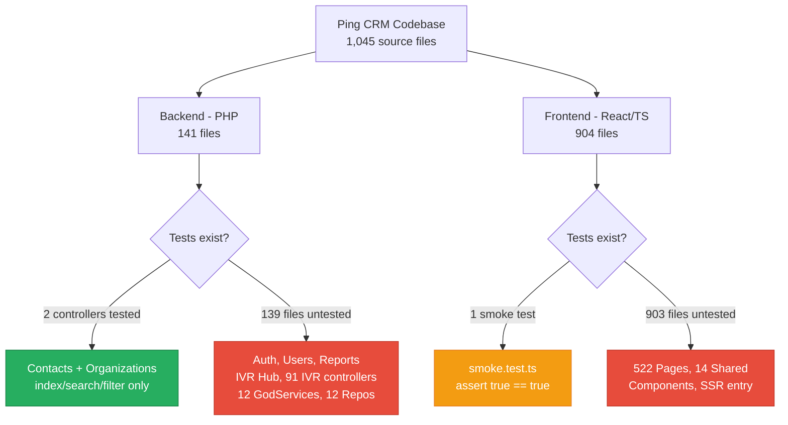
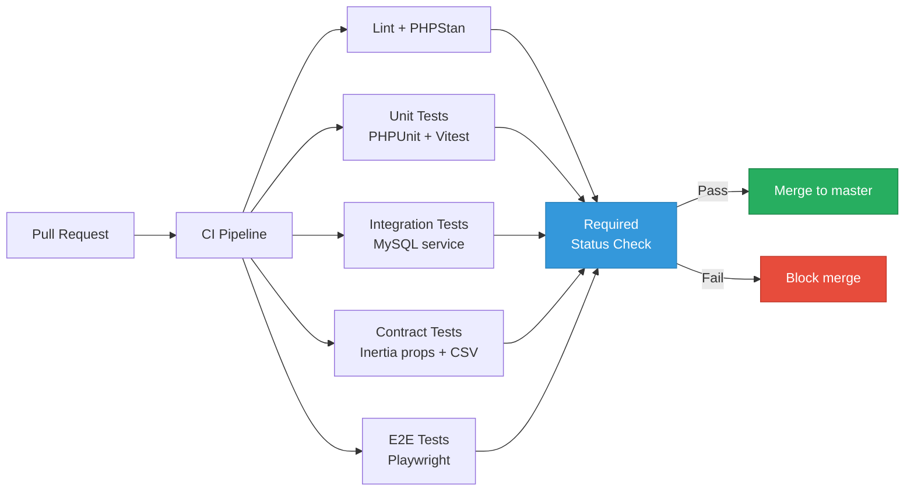
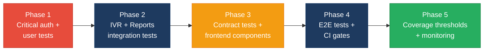

# 5. Testing & Quality Assurance Hotspots Analysis

**Objective:** Improve test coverage and software quality by generating unit, integration, and contract tests where missing.

**Date:** 2026-09-30 06:00:22 UTC | **Scope:** `shende-shweta/pingcrm` (master) — PHPUnit 11 (backend), Vitest 4 (frontend)

## Executive Summary

> **Executive Summary**
>
> Ping CRM is a Laravel 11 + React 19 (Inertia.js) application with a large IVR enterprise module surface. The test suite is critically thin: only 3 meaningful PHPUnit test files cover 2 of 141 backend source files (2.1% file coverage), and the frontend has a single assertion-less smoke test for 904 TypeScript/React source files (0.1%). Authentication, user management, the entire IVR enterprise module (91 controllers, 12 legacy "GodService" classes, 12 repositories), reports, and all 14 shared UI components ship with zero automated test coverage. The CI pipeline (`tests.yml`) runs PHPUnit on push/PR but does not run Vitest, so the frontend is never gate-checked. No integration tests exercise real database boundaries beyond the two existing feature tests, no contract tests exist for the IVR module's dynamic routing, and no end-to-end tests verify user journeys.

4

Test Files Found

~1,031

Source Files With No Matching Test

~2% (BE) / ~0% (FE)

Estimated Coverage

0

Skipped/Disabled Tests

Overall Codebase Rating — Testing &amp; Quality Assurance

High Risk

Driven by H1 (Untested Critical Logic), H2 (Low Test Coverage), H3 (Missing Integration Tests), H4 (Missing Contract Tests), H6 (No CI Test Gate for frontend), and H7 (No End-to-End Tests).

## 5.1 Benchmark Ratings Summary

Coverage estimates are based on test-file-to-source-file ratio and manual inspection of test content — no coverage tooling report (`lcov.info`, `clover.xml`) was found in the repository.

| # | Hotspot | Primary KPI | Good | Moderate | High Risk | Measured | Rating |
|---|---|---|---|---|---|---|---|
| H1 | Untested Critical Logic | Critical modules with zero tests | 0 | 1–3 | >3 | 7 critical modules (auth, users, reports, IVR hub, IVR module controllers, legacy services, repositories) | High Risk |
| H2 | Low Test Coverage | Overall coverage % | >80% | 50–80% | <50% | ~2% backend / ~0% frontend (estimated from test-file-to-source ratio; no coverage report exists) | High Risk |
| H3 | Missing Integration Tests | Boundaries covered % | >70% | 30–70% | <30% | ~5% — only ContactsTest and OrganizationsTest exercise DB via RefreshDatabase; 0 for IVR, auth, users, reports | High Risk |
| H4 | Missing Contract Tests | APIs with contract tests % | >80% | 40–80% | <40% | 0% — no contract or schema validation tests exist for any route or IVR module endpoint | High Risk |
| H5 | Flaky / Skipped Tests | Skipped/flaky test count | 0 | 1–5 | >5 | 0 | Good |
| H6 | No CI Test Gate | Tests enforced in CI | Required gate | Runs, not required | No CI test run | PHPUnit runs on push/PR (not confirmed as required status check); Vitest never runs in CI | High Risk |
| H7 | No End-to-End Tests (additional) | E2E test suites present | ≥1 suite | Partial/smoke only | None | 0 — no Cypress, Playwright, or browser-based test runner configured | High Risk |
| H8 | Assertion-Free Tests (additional) | Tests with no meaningful assertions | 0 | 1–2 | >2 | 2 — `ExampleTest.php` asserts `assertTrue(true)`, `smoke.test.ts` asserts `expect(true).toBe(true)` | Moderate |

## 5.2 Hotspot-by-Hotspot Evidence

### H1. Untested Critical Logic Critical

**Benchmark:** `Critical modules with zero tests = 7` → falls in the **High Risk** band (Good 0 · Moderate 1–3 · High Risk >3).

The following business-critical modules have zero corresponding test files:

**1. Authentication (backend)** — `AuthenticatedSessionController` handles login, logout, and session management. `LoginRequest` implements rate-limited credential verification with lockout events. A regression in authentication logic (e.g. broken rate limiting, session fixation) would allow unauthorized access or lock out legitimate users. No test file exists for either class.

**2. User Management (backend)** — `UsersController` handles full CRUD for user accounts including file upload (photo), password changes, soft-delete/restore, and a demo-user guard. Validation logic (email uniqueness, owner flag) and the demo-user protection are untested — a regression could allow duplicate accounts, privilege escalation via the `owner` flag, or demo-user deletion.

**3. Reports & CSV Export (backend)** — `ReportsController` contains 5 complex DB aggregation methods (`dailyTrend`, `callSummary`, `queueSummary`, `recentCallsForReport`) plus CSV streaming via `streamDownload()`. These execute raw `DB::table()` queries with multi-table joins across `ivr_call_records`, `ivr_operational_queues`, and `organizations`. A broken join or tenant-scoping regression silently produces wrong operational data. Zero tests.

**4. IVR Hub & Module Controllers (backend)** — `IvrHubController` builds the main dashboard from multiple DB queries. `IvrModuleController` resolves 18 module slugs via `SLUG_MAP` to dynamic page props. 80+ single-action IVR controllers handle Store/Update/Destroy/Import/Export/Sync for 12 IVR sub-modules. Zero tests for any IVR controller.

**5. Legacy GodServices (backend)** — 12 files (e.g. `CallFlowGodService` at 373 lines) contain workflow orchestration with unsafe `extract($payload)`, raw `DB::table()->insertGetId()`, global mutable `$sharedRuntimeCache`, and hardcoded secrets. These services handle core IVR data mutations. Zero tests.

**6. Legacy Repositories (backend)** — 12 repository files providing data access for all IVR modules. Zero tests.

**7. Frontend — all 522 pages and 14 shared components** — Login form, user/contact/organization CRUD forms, IVR hub dashboard, reports with charts, all IVR module UIs. Not a single React component or interaction test exists. The sole frontend test (`smoke.test.ts`) asserts `expect(true).toBe(true)`.

**Why it matters here:** Authentication, multi-tenant data isolation, and user management are the highest-risk surfaces in any SaaS application. The IVR module handles telephony operations (call routing, queue management, agent desk) where data corruption has direct business impact. With 7 critical module categories completely untested, any refactoring or bug fix risks shipping regressions straight to production.

**Recommended approach:**
1. Start with `AuthenticatedSessionController` — write PHPUnit feature tests for login success, login failure, rate limiting/lockout, and logout using `RefreshDatabase`.
2. Add `UsersController` feature tests covering CRUD, validation, photo upload, demo-user guard, and soft-delete/restore.
3. Generate unit tests for each Legacy GodService method, mocking DB to verify input handling (and flag `extract()` for removal).
4. For the frontend, install `@testing-library/react` and configure Vitest with `jsdom` environment, then write component tests for Login page and shared form components.

<!-- affected-files
search: class\s+\w+(Controller|GodService|Repository)
glob: app/**/*.php
issue: No test coverage for business-critical module
action: Generate unit and feature tests
-->

<!-- affected-files
glob: resources/js/Shared/*.tsx
issue: Shared React component has zero test coverage
action: Generate Vitest component tests with React Testing Library
-->

### H2. Low Test Coverage Critical

**Benchmark:** `Overall coverage = ~2% (backend) / ~0% (frontend)` → falls in the **High Risk** band (Good >80% · Moderate 50–80% · High Risk <50%).

Coverage was estimated from test-file-to-source-file ratio because no coverage report (`clover.xml`, `lcov.info`) exists in the repository:

- **Backend:** 3 test files (ContactsTest, OrganizationsTest, ExampleTest) with 9 test methods cover 141 PHP source files = 2.1%. The 2 feature tests cover Contacts and Organizations index/search/filter only — no create, update, or delete paths are tested. The remaining 6 controllers, 83 IVR controllers, 12 GodServices, 12 repositories, 5 legacy helpers, 16 models, 1 form request, 2 middleware, and 1 service provider are completely untested.
- **Frontend:** 1 test file (`resources/js/test/smoke.test.ts`) with 1 trivial assertion against 904 TypeScript/React files (522 pages, 14 shared components, `app.tsx`, `ssr.tsx`) = 0.1%. No `@testing-library/react`, no `jsdom` environment configured in Vitest.
- **Combined:** ~4 test files out of ~1,045 source files ≈ 0.4% file coverage.

**Why it matters here:** At sub-5% coverage, the test suite provides virtually no regression protection. Any code change — a dependency upgrade, a Laravel version bump, a React state refactor — ships to production with no automated verification of correctness.

**Recommended approach:**
1. Enable PHPUnit coverage reporting (`coverage: pcov` in CI, `--coverage-clover` flag) and Vitest coverage (`--coverage`) to establish a baseline.
2. Target 50% backend coverage within the first sprint by adding tests for all controller actions (auth, users, contacts CRUD, organizations CRUD, reports).
3. Add Vitest component tests for each shared component in `resources/js/Shared/` using React Testing Library.
4. Set a CI coverage threshold (50% initially, ramping to 75%) to prevent regression.

<!-- affected-files
glob: app/**/*.php
issue: Source file has no corresponding test — overall backend coverage ~2%
action: Generate unit/feature tests to increase coverage
-->

<!-- affected-files
glob: resources/js/Pages/**/*.tsx
issue: React page component has zero test coverage — frontend coverage ~0%
action: Generate Vitest component tests with React Testing Library
-->

### H3. Missing Integration Tests High

**Benchmark:** `Service/data boundaries covered = ~5%` → falls in the **High Risk** band (Good >70% · Moderate 30–70% · High Risk <30%).

The only integration-level tests are `ContactsTest.php` and `OrganizationsTest.php`, which use `RefreshDatabase` to exercise real Eloquent queries against a MySQL test database. These cover 2 of ~40 significant service/data boundaries:

**Not covered (examples):**

1. **Auth login/logout** — session + DB interaction (session regeneration, rate limiter state in cache).
2. **User CRUD** — file storage (`Request::file('photo')->store('users')`) + DB write, with validation against unique email constraint.
3. **ReportsController** — 5 raw `DB::table()` queries with multi-table joins across `ivr_call_records`, `ivr_daily_trends`, `ivr_operational_queues`, and `organizations`. The `callSummary()` method computes aggregate counts and averages that depend on correct join conditions.
4. **IVR GodServices** — raw `DB::table('ivr_call_flows')->insertGetId()` with `extract($payload)` — bypasses Eloquent entirely. No test verifies data round-trip or that the mutable `$sharedRuntimeCache` doesn't leak between requests.
5. **IVR CRUD controllers** — 80+ controllers delegating to GodServices and repositories. The HTTP → Controller → Service → DB chain is completely unverified.

**Why it matters here:** The ReportsController alone has 5 raw DB queries with multi-table joins. The IVR GodServices bypass Eloquent entirely. Without integration tests, a migration change or column rename silently breaks these queries — unit tests with mocked DB would not catch this.

**Recommended approach:**
1. Add integration tests for `ReportsController` that seed `ivr_call_records`, `ivr_daily_trends`, and `ivr_operational_queues` and verify query output against known data.
2. Add integration tests for at least one IVR Store + Update + Destroy cycle per sub-module, verifying DB state after each operation.
3. Test the auth flow end-to-end: login → session → protected route → logout → session invalidation.
4. Use Laravel's `RefreshDatabase` or `DatabaseTransactions` trait consistently.

<!-- affected-files
search: DB::(table|select|raw|statement|insert)
glob: app/**/*.php
issue: Raw DB queries with no integration test verifying correctness
action: Add integration tests with real database assertions
-->

### H4. Missing Contract Tests High

**Benchmark:** `APIs with contract tests = 0%` → falls in the **High Risk** band (Good >80% · Moderate 40–80% · High Risk <40%).

The application exposes ~30 web routes (auth, users, organizations, contacts, reports, IVR hub, IVR modules) plus dynamic IVR sub-module endpoints. None have contract tests verifying:

1. **Inertia response structure** — the Inertia props shape (`component`, `props.filters`, `props.contacts.data[].name`, etc.) is verified only for Contacts and Organizations index views. All other pages (Users, Reports, IVR Hub, IVR Modules, Dashboard, Login) return Inertia responses with no schema assertion.
2. **CSV export format** — `ReportsController::download()` streams CSV with specific column headers (`Call ID`, `Caller`, `Organization`, `Queue`, `Agent`, `Duration (sec)`, `Disposition`, `Started at`). No test verifies column order or data format.
3. **IVR module dynamic routing** — `IvrModuleController` resolves 18 module slugs to page props via `SLUG_MAP` and `MODULE_META`. No test verifies that each slug resolves correctly or that the returned `viewType`/`columns`/`rows` structure is consistent.

**Why it matters here:** Inertia.js bridges backend and frontend via a prop contract. When the backend changes a prop name or nests data differently, the frontend breaks silently at runtime — no type check catches this across the PHP/TypeScript boundary. Contract tests are the only automated guard for this seam.

**Recommended approach:**
1. Add Inertia assertion tests (`assertInertia`) for every page route, verifying at minimum the component name and top-level prop keys.
2. Add CSV output tests for `ReportsController::download()` verifying header row and data format.
3. Add a parameterized test that iterates `IvrModuleController::SLUG_MAP` and verifies each slug returns a valid page with expected `viewType`.
4. Consider adopting a schema validation approach (e.g. JSON Schema or TypeScript-generated prop types) for the Inertia contract.

<!-- affected-files
search: Inertia::render|response\(\)->streamDownload
glob: app/Http/Controllers/**/*.php
issue: No contract/schema test for Inertia response or CSV export format
action: Add contract tests verifying response structure per route
-->

### H6. No CI Test Gate High

**Benchmark:** `Tests enforced in CI = partial (backend only, not confirmed required)` → falls in the **High Risk** band (Good = Required gate · Moderate = Runs, not required · High Risk = No CI test run).

**CI analysis:**

- **`tests.yml`** — runs `php artisan test` (PHPUnit) on push to `master`, on PRs, and on a daily cron. Uses a real MySQL service container. However, it does **not** run `npm run test` (Vitest), so the frontend test suite is never executed in CI.
- **`coding-standards.yml`** — runs Laravel coding standards (Pint) on push only, not a test gate.
- **`static-analysis.yml`** — runs PHPStan on push to `master` and PRs. Useful for type safety but not a test gate.
- **`qa-ephemeral-runner.yml`** — `workflow_dispatch` only, not triggered automatically. Supports both PHPUnit and Vitest but must be invoked manually.
- **No branch protection rules** are visible in the repository configuration, so none of these checks are confirmed as required status checks for merging.

**Why it matters here:** The frontend constitutes 86% of the source files (904 of 1,045). With Vitest never running in CI, any frontend regression merges unchecked. Even the backend PHPUnit run is not confirmed as a required check, meaning a failing test could be merged.

**Recommended approach:**
1. Add `npm run test` (Vitest) as a step in `tests.yml` after the build step.
2. Configure branch protection on `master` to require both `tests` and `static-analysis` jobs to pass before merging.
3. Add Vitest coverage reporting to CI output.
4. Consider making `qa-ephemeral-runner.yml` a reusable workflow called from `tests.yml` to avoid maintaining two test configurations.

<!-- affected-files
glob: .github/workflows/tests.yml
issue: Vitest not executed in CI; no required status checks confirmed
action: Add Vitest to CI pipeline and enable branch protection
-->

### H7. No End-to-End Tests (additional) High

**Benchmark:** `E2E test suites present = 0` → falls in the **High Risk** band (Good ≥1 suite · Moderate partial/smoke · High Risk none).

No end-to-end testing framework (Cypress, Playwright, Selenium, Laravel Dusk) is installed or configured. The application has complex multi-step user journeys that are only verifiable through browser-based testing:

- **Login → Dashboard → IVR Hub → Module selection → CRUD operations** — the primary user flow spanning auth, Inertia navigation, and dynamic module rendering.
- **Report generation → CSV download** — requires verifying the download trigger and file content in a browser context.
- **Contact/Organization CRUD with soft-delete and restore** — the trash filter and restore flow involve multiple page navigations.

With 522 frontend pages (510 IVR + 12 CRM) and no E2E coverage, user-facing regressions are invisible until manual QA or production reports.

**Why it matters here:** The Inertia.js SPA architecture means traditional HTTP tests only verify the JSON prop payload, not the rendered UI. Critical bugs like broken form submissions, missing React hydration, or navigation failures can only be caught by E2E tests that exercise the real browser.

**Recommended approach:**
1. Install Playwright or Laravel Dusk as the E2E framework.
2. Write smoke E2E tests for the 3 critical journeys: login flow, IVR module navigation, and contact CRUD.
3. Add E2E tests to CI as a separate job (runs after unit/integration tests pass).
4. Target 5–10 critical-path E2E scenarios initially, expanding as the test pyramid matures.

### H8. Assertion-Free Tests (additional) Medium

**Benchmark:** `Tests with no meaningful assertions = 2` → falls in the **Moderate** band (Good 0 · Moderate 1–2 · High Risk >2).

Two test files contain only trivially-true assertions that verify nothing about the application:

1. **`tests/Unit/ExampleTest.php`** — Contains `$this->assertTrue(true)`. This is the default Laravel scaffold placeholder. Verifies nothing.
2. **`resources/js/test/smoke.test.ts`** — Contains `expect(true).toBe(true)`. Verifies only that Vitest is configured, not that any application code works.

These tests pass regardless of application state, giving a false signal that "tests are green" when in reality no application behavior is verified.

**Why it matters here:** In a codebase with only 4 test files, 2 of them being assertion-free means 50% of the test file count is misleading. Developers and CI see "all tests pass" without realizing the suite is nearly empty.

**Recommended approach:**
1. Replace `ExampleTest.php` with a real unit test — e.g., test the `User::name` accessor or `Account` relationship.
2. Replace `smoke.test.ts` with a real component render test — e.g., verify `<Logo />` renders the expected SVG or `<TextInput />` accepts and displays a value.

<!-- affected-files
glob: tests/Unit/ExampleTest.php
issue: Assertion-free placeholder test
action: Replace with meaningful unit test
-->

**Not observed (rated Good):** H5 (Flaky/Skipped Tests) — searched for `skip`, `markTestSkipped`, `markTestIncomplete`, `@Disabled`, `xfail`, `test.skip`, `it.skip`, `describe.skip`, and `xit` across all test files; none found.

## 5.3 Diagrams

### Current test coverage gaps

```mermaid
flowchart TD
    A["Ping CRM Codebase<br/>1,045 source files"] --> B["Backend - PHP<br/>141 files"]
    A --> C["Frontend - React/TS<br/>904 files"]
    B --> D{Tests exist?}
    C --> E{Tests exist?}
    D -->|"2 controllers tested"| F["Contacts + Organizations<br/>index/search/filter only"]
    D -->|"139 files untested"| G["Auth, Users, Reports<br/>IVR Hub, 91 IVR controllers<br/>12 GodServices, 12 Repos"]
    E -->|"1 smoke test"| H["smoke.test.ts<br/>assert true == true"]
    E -->|"903 files untested"| I["522 Pages, 14 Shared<br/>Components, SSR entry"]
    style G fill:#e74c3c,stroke:#c0392b,color:#fff
    style I fill:#e74c3c,stroke:#c0392b,color:#fff
    style H fill:#f39c12,stroke:#e67e22,color:#fff
    style F fill:#27ae60,stroke:#1e8449,color:#fff
```

### Target test pyramid and CI gate

```mermaid
flowchart LR
    PR["Pull Request"] --> CI["CI Pipeline"]
    CI --> LINT["Lint + PHPStan"]
    CI --> UNIT["Unit Tests<br/>PHPUnit + Vitest"]
    CI --> INT["Integration Tests<br/>MySQL service"]
    CI --> CONTRACT["Contract Tests<br/>Inertia props + CSV"]
    CI --> E2E["E2E Tests<br/>Playwright"]
    LINT --> GATE["Required<br/>Status Check"]
    UNIT --> GATE
    INT --> GATE
    CONTRACT --> GATE
    E2E --> GATE
    GATE -->|Pass| MERGE["Merge to master"]
    GATE -->|Fail| BLOCK["Block merge"]
    style BLOCK fill:#e74c3c,stroke:#c0392b,color:#fff
    style MERGE fill:#27ae60,stroke:#1e8449,color:#fff
    style GATE fill:#3498db,stroke:#2980b9,color:#fff
```

### Improvement roadmap

```mermaid
flowchart LR
    P1["Phase 1<br/>Critical auth +<br/>user tests"] --> P2["Phase 2<br/>IVR + Reports<br/>integration tests"]
    P2 --> P3["Phase 3<br/>Contract tests +<br/>frontend components"]
    P3 --> P4["Phase 4<br/>E2E tests +<br/>CI gates"]
    P4 --> P5["Phase 5<br/>Coverage thresholds<br/>+ monitoring"]
    classDef todo fill:#1e3a5f,stroke:#0f3460,color:#fff
    classDef first fill:#e74c3c,stroke:#c0392b,color:#fff
    classDef mid fill:#f39c12,stroke:#e67e22,color:#fff
    classDef last fill:#27ae60,stroke:#1e8449,color:#fff
    class P1 first
    class P2 todo
    class P3 mid
    class P4 todo
    class P5 last
```

## 5.4 Actions Required

| Hotspot | Action | Rating | Priority |
|---|---|---|---|
| H1 — Untested Critical Logic | Generate unit and feature tests for auth, users, reports, IVR controllers, legacy services, and repositories | High Risk | Critical |
| H2 — Low Test Coverage | Enable coverage reporting; target 50% backend and 30% frontend coverage in first sprint; set CI thresholds | High Risk | Critical |
| H3 — Missing Integration Tests | Add integration tests for ReportsController raw queries, IVR Store/Update/Destroy cycles, and auth session flow | High Risk | High |
| H4 — Missing Contract Tests | Add Inertia assertInertia tests for all routes; add CSV output format tests; parameterized test for IVR SLUG_MAP | High Risk | High |
| H6 — No CI Test Gate | Add Vitest to CI pipeline; configure branch protection requiring tests + static-analysis to pass | High Risk | High |
| H7 — No End-to-End Tests | Install Playwright or Dusk; write smoke E2E for login, IVR navigation, and CRUD flows; add to CI | High Risk | High |
| H8 — Assertion-Free Tests | Replace ExampleTest.php and smoke.test.ts with real application assertions | Moderate | Medium |

## 5.5 Expected Outcomes

- **Critical auth and user-management paths protected** — login, logout, rate limiting, user CRUD, and demo-user guards verified automatically before every merge, preventing security regressions.
- **IVR enterprise module regression-safe** — the 91 IVR controllers and 12 legacy services gain integration test coverage, catching broken DB queries and data corruption before production.
- **CI catches regressions on both layers** — with Vitest added to the pipeline and branch protection enabled, no code (backend or frontend) merges without passing tests.
- **Contract tests prevent silent Inertia breaks** — every route's prop structure is validated, eliminating the class of bugs where PHP changes break React rendering at runtime.
- **E2E tests verify real user journeys** — the login-to-IVR-module flow and CRUD operations are tested in a real browser, catching hydration failures and navigation bugs that unit tests cannot detect.
