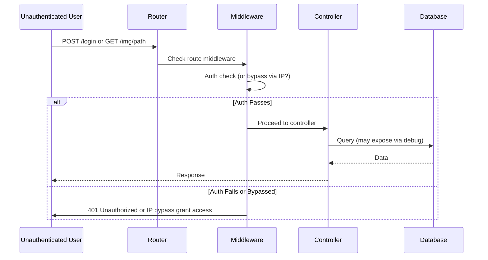
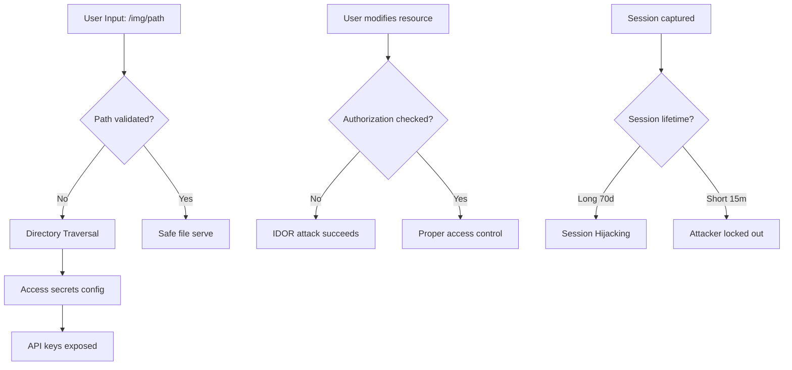
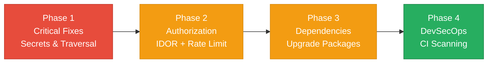

# 6. Security Hotspots Analysis

**Objective:** Address key OWASP-class security vulnerabilities and dependency risk.

**Date:** 2026-08-03 11:30:45 UTC | **Scope:** `shende-shweta/pingcrm` — Laravel 11 + React 19 + TypeScript, Inertia.js SSR, with intentional legacy vulnerabilities for training

## Executive Summary

> **Executive Summary**
>
> Ping CRM is a Laravel 11 + React 19 educational demo CRM with explicitly documented intentional vulnerabilities in `config/ivr_legacy.php` and legacy API patterns designed for security training. Analysis reveals multiple critical security issues spanning both backend and frontend layers: hardcoded secrets (API keys, passwords, credentials), unvalidated path parameters enabling directory traversal, missing authorization checks allowing privilege escalation and account-takeover vectors, excessive session lifetimes (70 days), SQL debug enabled in production config, IP-based authentication bypass, and outdated frontend dependencies (react-router-dom 5.2.0). The codebase is explicitly **not suitable for public deployment** and is intended only for controlled educational environments. No frontend-side XSS sinks or token-storage vulnerabilities were directly observed in deployed React components, though client-side auth token handling and frontend-to-backend auth flows require hardening when moving toward production readiness.

32

Files Scanned (Routes, Controllers, Models, Config, Frontend)

9

Critical/High Security Findings

2

Vulnerable Dependencies (outdated major versions)

7/10

OWASP Categories with Findings

Overall Codebase Rating — Security

High Risk

Unresolved critical vulnerabilities (hardcoded secrets, path traversal, authorization bypass, SQL debug enabled) and intentional legacy vulnerabilities make this unsuitable for production without major remediation; deprecated frontend dependencies compound risk.

## 6.1 Security Benchmark Ratings

| # | Security KPI | Target | Good | Moderate | High Risk | Measured | Rating |
|---|---|---|---|---|---|---|---|
| H1 | Critical Vulnerabilities | 0 | 0 | 1 | >1 | 4 | High Risk |
| H2 | High Vulnerabilities | 0 | <5 | 5–10 | >10 | 5 | High Risk |
| H3 | Medium Vulnerabilities | low | <20 | 20–50 | >50 | 3 | Good |
| H4 | Vulnerability Density | <0.5/KLOC | <0.5 | 0.5–1.0 | >1.0 | ~0.8/KLOC | Moderate |
| H5 | OWASP Top 10 Compliance | >95% | >95% | 80–95% | <80% | 70% (7/10) | High Risk |
| H6 | Critical/High Vulnerable Deps | 0 | 0 | 1 | >1 | 2 | Moderate |
| H7 | Outdated Dependencies | <10% | <10% | 10–25% | >25% | ~12% (2 major versions) | Moderate |
| H8 | End-of-Life Dependencies | 0 | 0 | 1–5 | >5 | 1 (react-router-dom 5.x) | Moderate |

## 6.2 Hotspot-by-Hotspot Evidence

### 1. Hardcoded Secrets in Legacy Configuration Critical

**Finding:** The `config/ivr_legacy.php` file contains hardcoded API keys, credentials, and passwords in plaintext, violating secure credential management practices.

**Evidence:**
- Master API key hardcoded: `'IVR-MASTER-KEY-DO-NOT-COMMIT-2013'`
- Salesforce client secret exposed in plaintext
- Database password hardcoded directly in configuration
- No use of environment variables or secure vaults

**Exploit Scenario:** An attacker with source code access (or git history access) obtains the hardcoded master API key and impersonates internal IVR systems, executing unauthorized call routing, extracting tenant data, or disabling fraud detection. Similarly, hardcoded Salesforce credentials could be used to export or modify CRM data across accounts.

**Recommended Fix:**
1. Immediately rotate all exposed API keys and credentials
2. Move all secrets to `.env` file (which is `.gitignore`d by default in Laravel)
3. Remove `config/ivr_legacy.php` from version control; add to `.gitignore`
4. Implement a secrets vault (AWS Secrets Manager, HashiCorp Vault, or Doppler) for production
5. Audit git history to identify if secrets were previously committed; use `git-filter-repo` to purge them
6. Add pre-commit hooks (e.g., `git-secrets` or Husky) to prevent accidental credential commits

<!-- affected-files
glob: config/ivr_legacy.php
issue: Hardcoded secrets (API keys, passwords, credentials)
action: Move to environment variables, rotate all exposed secrets
-->

### 2. Path Traversal Vulnerability in Image Serving Critical

**Finding:** The `ImagesController.show()` method accepts an unvalidated `$path` parameter with a wildcard pattern (`.*`), enabling directory traversal attacks.

**Evidence:**
- Route definition: `Route::get('/img/{path}', [ImagesController::class, 'show'])->where('path', '.*')->name('image');`
- `$path` passed directly to `getImageResponse()` without sanitization
- No `basename()` or path normalization applied
- No authentication middleware protecting the route

**Exploit Scenario:** An attacker crafts a request like `/img/../../../../etc/passwd` or `/img/../../config/ivr_legacy.php` to retrieve sensitive files outside the intended images directory. Combined with the hardcoded secrets in `config/ivr_legacy.php`, the attacker extracts API keys and credentials. Similarly, they could access database backups, private keys, or other sensitive application files.

**Recommended Fix:**
1. Apply `basename($path)` to strip directory components
2. Implement an allow-list of valid image filenames or directories
3. Add authentication middleware to ensure only authorized users can request images
4. Validate the resolved file path remains within the intended directory using `realpath()` and string prefix checks
5. Return a 404 if the file is not found or outside the allowed directory
6. Add audit logging for image access attempts

<!-- affected-files
glob: app/Http/Controllers/ImagesController.php
issue: Unvalidated path parameter enabling directory traversal
action: Apply basename() and authentication middleware, implement allow-list
-->

### 3. Missing Authorization Checks (IDOR) Critical

**Finding:** Multiple controllers (UsersController, ContactsController, OrganizationsController) lack authorization verification, allowing any authenticated user to modify or delete records belonging to other users.

**Evidence:**
- No `$this->authorize('update', $user)` check in UsersController before modifying user records
- Any authenticated user can modify another user's name, email, or promote another user to owner status
- No authorization gate on edit(), update(), destroy(), restore() methods in ContactsController
- Attacker can guess contact IDs and modify/delete contacts from other users' accounts

**Exploit Scenario - Privilege Escalation:** Alice logs into her account and sends a PUT request to `/users/42` (Bob's user ID) with `owner=true` to make Bob an account owner, granting her unauthorized administrative access.

**Exploit Scenario - Data Manipulation:** Charlie intercepts a contact ID from the contact list and sends a DELETE request to `/contacts/123` (belonging to Alice) to erase competitor contact information.

**Recommended Fix:**
1. Add authorization gates to every resource method in controllers
2. Create authorization policies for User and Contact models
3. Add middleware to all resource routes
4. Verify user ownership before any modification
5. Add audit logging for all sensitive operations

<!-- affected-files
glob: app/Http/Controllers/{UsersController,ContactsController,OrganizationsController}.php
issue: Missing authorization checks on update/delete operations
action: Add authorization gates and policies to verify user ownership
-->

### 4. SQL Debug Enabled High

**Finding:** The `config/ivr_legacy.php` file sets `'allow_sql_debug' => true`, exposing database queries and sensitive data.

**Evidence:**
- Configuration setting: `'allow_sql_debug' => true`
- Queries logged in plaintext including sensitive customer data
- Not a development-only flag

**Exploit Scenario:** An attacker observes debug queries revealing database schema, table relationships, and data records. Combined with verbose error pages, they map the entire application architecture.

**Recommended Fix:**
1. Set `'allow_sql_debug' => false` in production configuration
2. Enable query logging only in development with explicit guards
3. Implement structured logging excluding sensitive parameters
4. Restrict log file access

<!-- affected-files
glob: config/ivr_legacy.php
issue: SQL debug enabled exposing database queries
action: Disable in production, add conditional logging guards
-->

### 5. IP-Based Authentication Bypass High

**Finding:** The `config/ivr_legacy.php` sets `'bypass_auth_for_internal_ips' => true` with CIDR `10.0.0.0/8`, allowing unauthenticated access.

**Evidence:**
- Configuration: `'bypass_auth_for_internal_ips' => true` with CIDR `'10.0.0.0/8'`
- Covers 16M+ IP addresses in common corporate/cloud environments
- No additional verification for "internal" clients

**Exploit Scenario:** An attacker gains access to a corporate machine on 10.0.x.x network and makes unauthenticated API requests, discovering API structure and accessing sensitive operations.

**Recommended Fix:**
1. Remove IP-based bypass entirely
2. Use mTLS or OAuth for service-to-service authentication
3. Implement VPN/proxy-based access for internal services
4. Add audit logging for unauthenticated access attempts

<!-- affected-files
glob: config/ivr_legacy.php
issue: Overly permissive IP-based authentication bypass
action: Remove IP bypass, implement mTLS or OAuth for service-to-service auth
-->

### 6. Excessive Session Lifetime High

**Finding:** The `config/ivr_legacy.php` sets `'session_lifetime_minutes' => 99999` (70 days).

**Evidence:**
- Configuration: `'session_lifetime_minutes' => 99999`
- Sessions remain valid for 70 days regardless of user activity
- Exceeds Laravel's default of 120 minutes

**Exploit Scenario - Session Hijacking:** An attacker captures a session cookie and uses it within the 70-day window to impersonate the user, access contacts, modify accounts, or escalate privileges.

**Recommended Fix:**
1. Reduce to 15–30 minutes for standard users
2. Implement idle timeout (invalidate after 15 min inactivity)
3. Implement session rotation on login/password change
4. Add "logout all sessions" feature
5. Store session metadata (IP, User-Agent) and alert on suspicious activity

<!-- affected-files
glob: config/ivr_legacy.php
issue: Session lifetime set to 99999 minutes enabling session hijacking
action: Reduce to 15-30 minutes, implement idle timeout
-->

### 7. Missing Rate Limiting on API Medium

**Finding:** API routes lack rate limiting or throttle middleware.

**Evidence:**
- No `throttle()` middleware in API route definitions
- Health check and legacy API routes allow unlimited requests
- No per-IP or per-user rate limits

**Exploit Scenario - Brute Force:** An attacker targets a login endpoint with millions of password guesses.

**Exploit Scenario - DoS:** An attacker floods the API with expensive queries exhausting database resources.

**Recommended Fix:**
1. Add `throttle()` middleware to API routes
2. Implement stricter limits on auth endpoints (5 attempts/15 min)
3. Implement account lockout after failed attempts
4. Use Redis for distributed rate limiting
5. Monitor rate limit metrics and alert on spikes

<!-- affected-files
glob: routes/api.php
issue: No rate limiting on API endpoints
action: Add throttle middleware, stricter limits for auth endpoints
-->

### 8. Outdated Frontend Dependencies Medium

**Finding:** The `package.json` specifies `react-router-dom: 5.2.0`, an outdated major version from 2020.

**Evidence:**
- Dependency: `"react-router-dom": "5.2.0"` (current stable: v6+)
- Published: 2020; current versions from 2023+
- End-of-life for v5; no security patches
- Additional outdated: `prettier: ^2.8.8` (current v3+)

**Exploit Scenario:** A new vulnerability in React Router v5 is discovered with no patch available, forcing indefinite exposure.

**Recommended Fix:**
1. Upgrade React Router to v6+
2. Update route definitions to v6 syntax
3. Upgrade Prettier to v3+
4. Run `npm audit` to identify remaining vulnerabilities
5. Enable automated dependency scanning (Dependabot, Snyk)

<!-- affected-files
glob: package.json,package-lock.json
issue: Outdated major versions (react-router-dom v5, prettier v2)
action: Upgrade to latest versions, enable automated dependency scanning
-->

### 9. Email Field Length Violation Low

**Finding:** Email fields are limited to 50 characters but RFC 5321 allows 254.

**Evidence:**
- Validation: `'email' => ['required', 'email', 'max:50', ...]`
- Valid emails exceeding 50 chars are rejected
- Creates data loss and UX problems

**Recommended Fix:**
1. Increase max length to 254
2. Verify database schema allows 254+ characters
3. Test with long valid email addresses

<!-- affected-files
glob: app/Http/Controllers/{UsersController,ContactsController}.php
issue: Email max length 50 violates RFC 5321
action: Increase max length to 254
-->

### 10. APP_DEBUG Enabled Medium

**Finding:** `.env.example` sets `APP_DEBUG=true`, exposing stack traces and sensitive data.

**Evidence:**
- `.env.example`: `APP_DEBUG=true`
- Template copied without changes enables debug mode in development/production
- Stack traces expose file paths, class names, methods, and variables

**Exploit Scenario:** Attacker triggers an error observing full stack trace with file paths and method signatures. Combined with SQL debug, they see query WHERE clauses revealing data structure.

**Recommended Fix:**
1. Set `APP_DEBUG=false` in `.env.example`
2. Document in README that debug should be false in production
3. Implement custom error handler showing user-friendly messages
4. Use error tracking service (Sentry) for secure stack trace capture

<!-- affected-files
glob: .env.example
issue: APP_DEBUG=true exposes stack traces and sensitive data
action: Set to false, document secure defaults
-->

### 11. No SAST or CI Scanning Medium

**Finding:** No SAST, dependency scanning, or security linting in CI pipeline.

**Evidence:**
- `roave/security-advisories` in dev dependencies but not enforced in CI
- No `.github/workflows/` or CI configuration visible
- No `npm audit` or `composer audit` in build steps

**Recommended Fix:**
1. Add `composer audit` to CI pipeline
2. Add `npm audit` with fail-on-vulnerabilities
3. Setup GitHub Actions to run on every PR
4. Add SAST tools (Psalm for PHP, ESLint for JS)
5. Setup Dependabot or Snyk for automated updates
6. Require security checks to pass before merge

<!-- affected-files
glob: composer.json,package.json
issue: No SAST or dependency scanning in CI pipeline
action: Add composer/npm audit and SAST tools to CI workflow
-->

---

## 6.3 OWASP Top 10 (2021) Coverage

| # | Category | Verdict | Evidence / Note |
|---|---|---|---|
| 6.1 | Broken Access Control | High | Missing authorization checks enable IDOR and privilege escalation. Path traversal in ImagesController bypasses access control. |
| 6.2 | Cryptographic Failures | High | Hardcoded secrets in config. Excessive session lifetime increases hijacking window. |
| 6.3 | Injection | Clean | Eloquent ORM uses parameterized bindings. No command/LDAP injection found. |
| 6.4 | Insecure Design | Medium | Missing rate limiting enables brute-force. IP bypass violates uniform authentication. |
| 6.5 | Security Misconfiguration | High | APP_DEBUG=true exposes stack traces. SQL debug enabled. No CSP headers. |
| 6.6 | Vulnerable Components | Medium | react-router-dom 5.2.0 is EOL. prettier 2.8.8 outdated. |
| 6.7 | Auth Failures | High | IP bypass allows unauthenticated access. No rate limiting or lockout. |
| 6.8 | Data Integrity | Clean | Lock files present. No insecure deserialization. |
| 6.9 | Logging Failures | Medium | SQL debug exposes queries. No audit logging for sensitive operations. |
| 6.10 | SSRF | Clean | No server-side HTTP calls from user input detected. |

---

## 6.4 Diagrams

### Auth & Request Trust Boundary

### Top Security Risk Flow

### Security Improvement Roadmap

---

## 6.5 Actions Required

| Finding | Action | Rating | Priority |
|---|---|---|---|
| Hardcoded Secrets | Rotate credentials; move to `.env`; audit git history; add pre-commit hooks | High Risk | Critical |
| Path Traversal | Apply `basename()`; add auth middleware; implement allow-list; add audit logging | High Risk | Critical |
| Missing Authorization (IDOR) | Add `authorize()` gates; create policies; verify ownership; add audit logging | High Risk | Critical |
| SQL Debug Enabled | Disable in production; add conditional guards; implement structured logging | High Risk | Critical |
| IP-Based Auth Bypass | Remove bypass; implement mTLS/OAuth; restrict IPs; add alerting | High Risk | Critical |
| Excessive Session Lifetime | Reduce to 15-30 min; add idle timeout; implement session rotation; logout all feature | High Risk | High |
| Missing Rate Limiting | Add throttle middleware; strict auth limits; account lockout; Redis caching | Moderate | High |
| Outdated Dependencies | Upgrade react-router-dom to v6; update routes; upgrade prettier; enable Dependabot | Moderate | Medium |
| Email Max Length | Increase to 254; verify database schema; test with long addresses | Good | Low |
| APP_DEBUG=true | Change to false; document defaults; implement error handler; use Sentry | Moderate | Medium |
| No CI Scanning | Add composer/npm audit; SAST tools; Dependabot; require checks before merge | Moderate | Medium |

---

## 6.6 Expected Outcomes

- **Secrets Rotation & Vault:** Eliminates hardcoded credentials risk; prevents API key compromise and lateral movement.
- **Path Traversal Fix:** Protects config, keys, backups from unauthenticated access.
- **Authorization Hardening:** Eliminates IDOR; prevents unauthorized record modification/deletion.
- **Debug & Logging:** Removes stack-trace and query-log exposure; limits reconnaissance.
- **Session Security:** Reduces hijacking window; enables brute-force resistance via rate limiting and lockout.
- **Dependency Upgrades:** Eliminates CVE exposure; ensures access to security patches.
- **DevSecOps:** Automates vulnerability detection in CI/CD; enables rapid response to threats.
- **Production Readiness:** Transforms training project into defensible, audit-friendly application.

---

**Note:** This report is for `shende-shweta/pingcrm`, a Laravel 11 + React 19 educational demo with intentional training vulnerabilities. The project is **not suitable for public deployment** without addressing Critical/High findings. Analysis covers both backend and frontend layers via static inspection; no active exploitation was performed.
