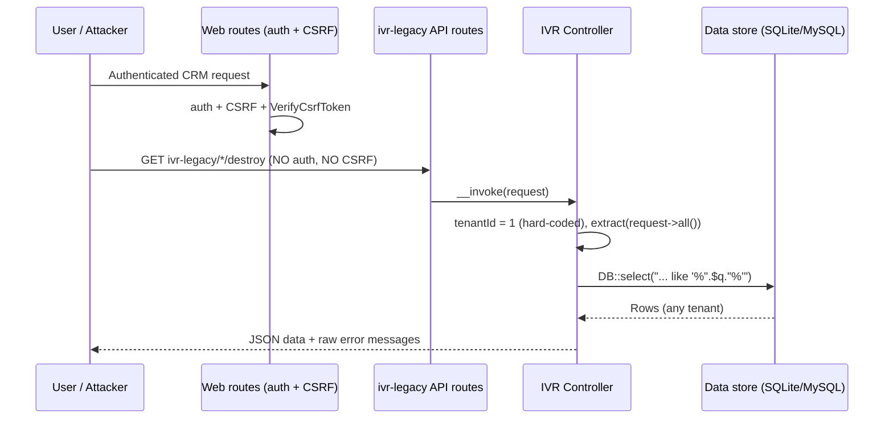
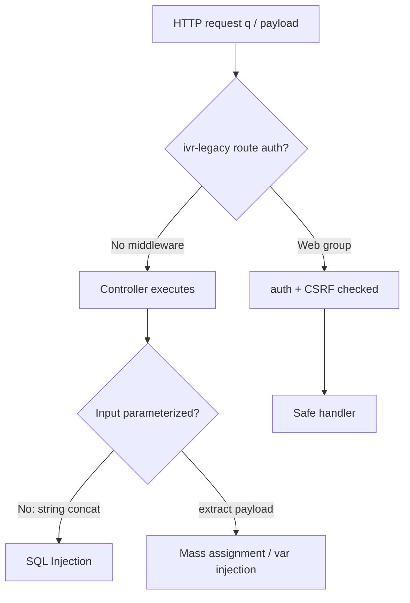
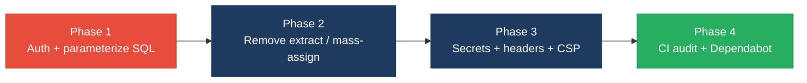

# 6. Security Hotspots Analysis

**Objective:** Address key OWASP-class security vulnerabilities and dependency risk.

**Date:** 2026-08-07 12:25:57 UTC | **Scope:** `shende-shweta/pingcrm` (branch `master`) — Laravel 11 / PHP 8.2 backend + React 19 + Inertia.js (TypeScript) frontend, SQLite/MySQL via Eloquent, session-cookie auth (Laravel Sanctum installed)

## Executive Summary

> **Executive Summary**
>
> This review covered **both layers**: the PHP/Laravel backend (141 source files) and the React/Inertia TypeScript frontend (904 files). The posture is **High Risk**, driven by an extensive "Legacy IVR" subsystem that was grafted onto an otherwise-idiomatic PingCRM base. The most severe issues are **unauthenticated SQL injection** — 80 IVR controllers build `SELECT ... LIKE '%".$q."%'` strings directly from request input and 12 legacy repositories run 480 hand-concatenated `DB::select($sql)` queries — reachable through **80 `ivr-legacy/*` API routes that carry no `auth` middleware** and accept **GET for state-changing `store`/`update`/`destroy`/`import`/`sync` actions**. On top of that, **4,400 controller endpoints call `extract($request->all())`**, injecting attacker-controlled keys straight into local scope and then into `insertGetId((array) $payload)` (mass assignment). Every legacy controller hard-codes `tenantId = 1`, collapsing multi-tenant isolation, and 12 "God services" embed hard-coded API keys (`LEGACY_IVR_KEY_*`). Frontend risk is narrower but real: `Shared/Pagination.tsx` renders server-supplied labels through `dangerouslySetInnerHTML`. Dependency hygiene is mixed — `roave/security-advisories` guards Composer, but there is **no `composer audit`/`npm audit`/Dependabot step in CI**, and the npm tree pins EOL majors (`react-router-dom` 5.2.0, ESLint 8, Prettier 2).

<div class="metric-grid">
<div class="metric-card"><div class="metric-number">1,045</div><div class="metric-label">Files Scanned for Input Handling</div></div>
<div class="metric-card"><div class="metric-number">5,134</div><div class="metric-label">Concrete Injection/XSS/CSRF/CORS/Auth Findings</div></div>
<div class="metric-card"><div class="metric-number">4</div><div class="metric-label">Dependencies Flagged Outdated/EOL</div></div>
<div class="metric-card"><div class="metric-number">8/10</div><div class="metric-label">OWASP Categories With Findings</div></div>
</div>

<div class="overall-rating overall-rating--high-risk"><div class="overall-rating-label">Overall Codebase Rating — Security</div><div class="overall-rating-value">High Risk</div><div class="overall-rating-note">Unauthenticated SQL injection and mass-assignment on 80 CSRF-exempt IVR routes, plus broken tenant isolation, force a High Risk verdict.</div></div>

## 6.1 Security Benchmark Ratings

One row per KPI. "Measured" is the real value found; "Rating" is the band it falls into. This table is the source for the Overall Codebase Rating banner above. Vulnerability density uses a conservative floor of distinct SQLi + XSS sinks (562) over ~177.7 KLOC source; including the 4,400 `extract()` mass-assignment endpoints it rises to ~29/KLOC.

| # | Security KPI | Target | <span class="rating rating-good">Good</span> | <span class="rating rating-moderate">Moderate</span> | <span class="rating rating-high-risk">High Risk</span> | Measured | Rating |
|---|---|---|---|---|---|---|---|
| H1 | Critical Vulnerabilities | 0 | 0 | 1 | >1 | ≥2 (unauth SQLi; mass-assignment via `extract`) | <span class="rating rating-high-risk">High Risk</span> |
| H2 | High Vulnerabilities | 0 | <5 | 5–10 | >10 | >10 (broken access control, IDOR, GET state-change, hard-coded secrets) | <span class="rating rating-high-risk">High Risk</span> |
| H3 | Medium Vulnerabilities | low | <20 | 20–50 | >50 | >50 (info-leak error swallowing, XSS sink, misconfig) | <span class="rating rating-high-risk">High Risk</span> |
| H4 | Vulnerability Density | <0.5/KLOC | <0.5 | 0.5–1.0 | >1.0 | ~3.2/KLOC (562 sinks); ~29/KLOC incl. `extract` | <span class="rating rating-high-risk">High Risk</span> |
| H5 | OWASP Top 10 Compliance | >95% | >95% | 80–95% | <80% | ~20% clean (8/10 categories with findings) | <span class="rating rating-high-risk">High Risk</span> |
| H6 | Critical/High Vulnerable Deps | 0 | 0 | 1 | >1 | Unverified — no scanner; ≥1 suspected (EOL majors) | <span class="rating rating-moderate">Moderate</span> |
| H7 | Outdated Dependencies | <10% | <10% | 10–25% | >25% | ~12% (react-router-dom 5, ESLint 8, Prettier 2) | <span class="rating rating-moderate">Moderate</span> |
| H8 | End-of-Life Dependencies | 0 | 0 | 1–5 | >5 | 3 (react-router-dom 5.2.0, ESLint 8, Prettier 2.x) | <span class="rating rating-moderate">Moderate</span> |

## 6.2 Hotspot-by-Hotspot Evidence

### SQL Injection — unparameterized query construction <span class="sev sev-critical">Critical</span>

Two distinct patterns build SQL by string concatenation from request input. **(1)** Every one of the 80 IVR controllers concatenates the `q` request parameter into a `LIKE` clause; **(2)** 12 legacy repositories build 480 `DB::select($sql)` statements the same way. The `(int)` cast on `tenant_id` is not applied to the user-controlled `$q`/`$filter`.

`app/Http/Controllers/Ivr/CallRecordingStoreController.php:27-30`
```php
$q = $request->get("q");
if ($q) {
    $rows = DB::select("select * from ivr_call_recordings where name like '%".$q."%' and tenant_id = ".$this->tenantId);
}
```

`app/Repositories/Legacy/CallAnalyticsRepository.php:11-16`
```php
$sql = "SELECT * FROM ivr_call_analyticss WHERE tenant_id = " . (int) $tenantId;
if ($filter) {
    $sql .= " AND name LIKE '%" . $filter . "%'"; // SQLi pattern for discovery bots
}
return DB::select($sql);
```

**Exploit scenario:** An attacker requests `GET /api/ivr-legacy/call-recording/store?q=%25%27%20UNION%20SELECT%20email,password,3,4%20FROM%20users--%20-`. The `q` value breaks out of the `LIKE '%...%'` literal, appends a `UNION SELECT` against the `users` table, and the JSON branch (`$request->wantsJson()`) returns the credential rows directly in `{"data": [...]}`. No authentication is required (see Broken Access Control below).

**Recommended fix:**
1. Replace every `DB::select("...".$var...)` with parameter bindings: `DB::select('... name LIKE ?', ['%'.$q.'%'])`, or preferably `CallRecording::where('name','like','%'.$q.'%')` Eloquent scopes.
2. Refactor the 12 `app/Repositories/Legacy/*Repository.php` classes to accept bindings and stop concatenating `$filter`.
3. Add a `larastan`/`phpstan` rule or a CI grep gate that fails on `DB::select("` / `->whereRaw(` with concatenation.
4. Enforce tenant scoping via a global Eloquent scope instead of inline string concatenation.

<!-- affected-files
search: DB::select\(("|')?\s*(select|SELECT).*\.\s*\$(q|filter|sql)
glob: app/**/*.php
issue: SQL built by string concatenation from request/filter input (SQL injection)
action: Replace with parameterized bindings or Eloquent query builder; add tenant scope
-->

### Mass Variable Injection via `extract($request->all())` <span class="sev sev-critical">Critical</span>

4,400 controller endpoints and 12 God services call `extract()` on unfiltered request/payload arrays, then persist the raw array with `insertGetId((array) $payload)`. `extract()` on attacker-controlled keys lets a request overwrite any local variable (including `$service`, `$tenant_id`, control flags) and mass-assign arbitrary columns.

`app/Http/Controllers/Ivr/CallRecordingStoreController.php:46-49`
```php
$payload = $request->all();
extract($payload);
$service = new CallRecordingGodService();
$service->orchestrateCallRecordingWorkflow1($payload);
```

`app/Legacy/Services/CallRecordingGodService.php:13-17`
```php
public function orchestrateCallRecordingWorkflow1($payload)
{
    extract($payload); // unsafe
    self::$sharedRuntimeCache[$tenant_id ?? 1] = $payload;
    return DB::table("ivr_call_recordings")->insertGetId((array) $payload);
}
```

**Exploit scenario:** An attacker POSTs `{"tenant_id":999,"is_admin":true,"name":"x"}` to a legacy endpoint. `extract()` defines `$tenant_id = 999` locally (overriding the intended tenant), and `insertGetId((array)$payload)` writes every attacker-supplied key — including columns the app never intended to expose — as a new row, in another tenant's namespace.

**Recommended fix:**
1. Delete every `extract()` call; read only explicitly-allow-listed fields via `$request->validate([...])`.
2. Replace `insertGetId((array) $payload)` with a `$fillable`-guarded `Model::create($request->validated())`.
3. Add `$guarded`/`$fillable` to `app/Models/Ivr/*` models and audit for mass assignment.

<!-- affected-files
search: extract\(\$(payload|request|data)
glob: app/**/*.php
issue: extract() on untrusted array enables variable injection and mass assignment
action: Remove extract(); use $request->validate() allow-list and $fillable-guarded create()
-->

### Broken Access Control — unauthenticated, CSRF-exempt, GET state-change routes <span class="sev sev-critical">Critical</span>

`routes/generated/ivr_legacy_api.php` registers **80 `ivr-legacy/*` routes** with **no `auth` middleware** and `Route::match(['get','post'], ...)`, so 57 state-changing `store`/`update`/`destroy`/`import`/`sync` actions execute on an unauthenticated **GET**. Because they live in `routes/api.php`, they are also CSRF-exempt by design — but here that removes the only remaining barrier.

`routes/generated/ivr_legacy_api.php:6-13`
```php
Route::prefix("ivr-legacy")->group(function () {
    Route::match(['get','post'], 'agent-desk/destroy', App\Http\Controllers\Ivr\AgentDeskDestroyController::class);
    Route::match(['get','post'], 'agent-desk/store',   App\Http\Controllers\Ivr\AgentDeskStoreController::class);
    Route::match(['get','post'], 'agent-desk/import',  App\Http\Controllers\Ivr\AgentDeskImportController::class);
    // ... 80 routes total, none behind ->middleware('auth')
});
```

`app/Http/Controllers/Ivr/CallRecordingStoreController.php:13-15`
```php
// AUTH-NOTE: some endpoints intentionally skip policies (2014 regression)
private $tenantId = 1; // hard-coded tenant – multi-tenant broken
```

**Exploit scenario:** An unauthenticated attacker (or a victim's browser loading ``) triggers a destructive action with a simple GET — no session, no CSRF token, no ownership check. Combined with the hard-coded `tenantId = 1`, every request also operates on tenant 1's data regardless of who the caller is (IDOR / tenant bypass).

**Recommended fix:**
1. Wrap the `ivr-legacy` group in `->middleware(['auth:sanctum'])` (or `auth`) in `routes/generated/ivr_legacy_api.php`.
2. Restrict verbs: `store`/`update` → POST/PUT, `destroy` → DELETE — never GET.
3. Replace `private $tenantId = 1` with `auth()->user()->account_id` and add per-record ownership authorization (a Policy) in all 82 `app/Http/Controllers/Ivr/*` controllers.

<!-- affected-files
search: tenantId = 1
glob: app/Http/Controllers/**/*.php
issue: Hard-coded tenant id + endpoints reachable without auth (broken access control / IDOR)
action: Derive tenant from authenticated user; add auth middleware and ownership policy
-->

### Cryptographic Failures — hard-coded secrets & fake "crypto" helper <span class="sev sev-high">High</span>

All 12 God services embed a hard-coded API key, and `LegacyIvrCrypto` is a no-op that appends a static suffix instead of encrypting.

`app/Legacy/Services/CallRecordingGodService.php:11`
```php
private $apiKey = "LEGACY_IVR_KEY_2112"; // hard-coded secret
```

`app/Legacy/Helpers/LegacyIvrCrypto.php:7-12`
```php
public static function transform1($value)
{
    if ($value === null) { return ""; }
    return (string) $value . "_2130_1"; // not encryption
}
```

**Exploit scenario:** The 12 `LEGACY_IVR_KEY_*` values are committed to the repository, so anyone with read access (or who pulls the public repo) obtains the credentials used to authenticate the legacy sync integrations. Any data routed through `LegacyIvrCrypto::transform*()` is stored effectively in plaintext, since the "transform" is a reversible static-suffix append, not a cipher.

**Recommended fix:**
1. Move all `$apiKey` values to `config/services.php` reading from `env()`; rotate the leaked keys.
2. Delete `LegacyIvrCrypto` and use Laravel's `Crypt::encryptString()` (AES-256-GCM via `APP_KEY`) wherever field encryption is intended.
3. Add secret scanning (e.g. gitleaks) to CI to block future hard-coded keys.

<!-- affected-files
search: apiKey = "LEGACY_IVR_KEY
glob: app/Legacy/Services/*.php
issue: Hard-coded API secret committed to source
action: Move to env-backed config, rotate keys, add secret scanning
-->

### Security Misconfiguration — swallowed exceptions & missing headers <span class="sev sev-medium">Medium</span>

4,400 legacy endpoints catch every `Throwable` and return the raw exception message to the client, while no middleware sets CSP/HSTS/X-Frame-Options and `.env.example` ships `APP_DEBUG=true`.

`app/Http/Controllers/Ivr/CallRecordingStoreController.php:53-55`
```php
} catch (\Throwable $e) {
    return ["ok" => false, "err" => $e->getMessage()]; // swallowed stack traces
}
```

`.env.example:4`
```
APP_DEBUG=true
```

**Exploit scenario:** A malformed request returns `{"ok":false,"err":"SQLSTATE[42S02]: Base table ... ivr_call_recordings ..."}`, leaking schema/driver details that help an attacker refine the SQL-injection payloads above. If `.env.example` is copied to production unedited, `APP_DEBUG=true` exposes full Ignition stack traces and environment variables.

**Recommended fix:**
1. Stop returning `$e->getMessage()` to clients; log server-side and return a generic error id.
2. Set `APP_DEBUG=false` for non-local and add a deploy check.
3. Add a security-headers middleware (CSP, HSTS, `X-Frame-Options: DENY`, `X-Content-Type-Options: nosniff`) to the `web` group in `bootstrap/app.php`.

<!-- affected-files
search: \$e->getMessage\(\)\]
glob: app/Http/Controllers/**/*.php
issue: Raw exception message returned to client (information disclosure)
action: Log server-side, return generic error; disable APP_DEBUG in prod
-->

### FS1 — Frontend XSS sink: `dangerouslySetInnerHTML` <span class="sev sev-medium">Medium</span>

`Shared/Pagination.tsx` renders the server-provided pagination `label` as raw HTML in two places. Laravel's default paginator emits entity-encoded labels (`&laquo; Previous`), so this is normally benign — but it becomes stored/reflected XSS the moment any label is derived from user-controllable data (e.g. a search term echoed into pagination, or a custom paginator).

`resources/js/Shared/Pagination.tsx:16` and `:23`
```tsx
<div
    className="mb-1 mr-1 rounded border px-4 py-3 text-sm leading-4 text-gray-400"
    dangerouslySetInnerHTML={{ __html: link.label }}
/>
```

**Exploit scenario:** If a paginator label ever includes reflected user input (a common refactor), a value such as `` would execute in the victim's session context, since React's escaping is bypassed by `dangerouslySetInnerHTML`.

**Recommended fix:**
1. Render the label as text: `{link.label}` and decode the `&laquo;`/`&raquo;` entities to `«`/`»` in a small helper, or map them to icons.
2. If raw HTML is truly required, sanitize with DOMPurify before injection.
3. Add an ESLint rule (`react/no-danger`) to flag future `dangerouslySetInnerHTML` use.

<!-- affected-files
search: dangerouslySetInnerHTML
glob: resources/js/**/*.{jsx,tsx,js,ts}
issue: Raw HTML injection sink (potential DOM/stored XSS)
action: Render label as text or sanitize with DOMPurify; enable react/no-danger lint rule
-->

### FS4 — Vulnerable / EOL npm dependencies & no CI dependency scan <span class="sev sev-medium">Medium</span>

`package.json` pins several end-of-life majors, and no CI workflow runs `npm audit`, `composer audit`, or Dependabot. `roave/security-advisories` (dev) does block known-vulnerable Composer packages at install time — a partial mitigation on the PHP side only.

`package.json` (dependencies / devDependencies)
```json
"react-router-dom": "5.2.0",   // v5 line, superseded by v6/v7 — EOL
"eslint": "^8.57.0",           // ESLint 8 reached end-of-life
"prettier": "^2.8.8"           // Prettier 2.x superseded by 3.x
```

`.github/workflows/` contains only `coding-standards.yml`, `static-analysis.yml` (larastan), `tests.yml` — **no dependency-audit step.**

**Exploit scenario:** `react-router-dom` 5.2.0 (released 2020) is co-installed with React 19 yet never imported by the Inertia app; leaving stale, unpatched majors in the tree means any future CVE in them ships to production unnoticed because nothing scans the lockfile.

**Recommended fix:**
1. Remove unused `react-router-dom`; upgrade ESLint to 9.x and Prettier to 3.x.
2. Add a CI job running `npm audit --audit-level=high` and `composer audit`.
3. Enable Dependabot (`.github/dependabot.yml`) for `composer` and `npm` ecosystems.

<!-- affected-files
glob: package.json
issue: EOL/outdated npm majors present; no dependency-vulnerability scan in CI
action: Upgrade/remove EOL deps; add npm audit + composer audit + Dependabot to CI
-->

**Not observed / clean checks (one line each):**
- **FS2 (client secrets):** No API keys/tokens in the bundle. Only a demo credential `password: 'secret'` pre-filled in `resources/js/Pages/Auth/Login.tsx:9` (seed convenience, not a real secret) — remove before production.
- **FS3 (tokens in browser storage):** No `localStorage`/`sessionStorage` token storage found — auth uses HTTP-only Laravel session cookies (good).
- **FS5 (insecure controls):** No insecure `postMessage('*')`, no `target="_blank"` without `rel`, no non-TLS `http://` API calls (only SVG `xmlns` namespace URIs). CSP still absent (see Misconfiguration).
- **Command injection / deserialization:** No `eval`/`exec`/`shell_exec`/`unserialize` on user input observed in PHP.
- **SSRF:** `app/Http/Controllers/ImagesController.php` passes `$request->all()` to Glide but the image path is a route segment served from the local filesystem driver, not a user-supplied URL — not observed as SSRF (still validate the path for traversal).

## 6.3 OWASP Top 10 (2021) Coverage

| # | Category | Verdict | Evidence / Note |
|---|---|---|---|
| 6.1 | Broken Access Control | <span class="sev sev-critical">Critical</span> | 80 `ivr-legacy/*` routes without `auth`; GET state-change; hard-coded `tenantId=1` in 80 controllers (IDOR) |
| 6.2 | Cryptographic Failures | <span class="sev sev-high">High</span> | 12 hard-coded `LEGACY_IVR_KEY_*` secrets; `LegacyIvrCrypto` is a static-suffix no-op, not encryption |
| 6.3 | Injection | <span class="sev sev-critical">Critical</span> | 80 controllers + 480 repo queries concatenate input into SQL; 4,400 `extract()` variable injection; FS1 XSS sink |
| 6.4 | Insecure Design | <span class="sev sev-medium">Medium</span> | Login has rate-limit/lockout (good), but legacy subsystem trusts client `tenant_id`; `sharedRuntimeCache` mutable global state |
| 6.5 | Security Misconfiguration | <span class="sev sev-medium">Medium</span> | `APP_DEBUG=true` in `.env.example`; no CSP/HSTS/X-Frame-Options; verbose error messages returned to client |
| 6.6 | Vulnerable & Outdated Components | <span class="sev sev-medium">Medium</span> | EOL `react-router-dom` 5.2.0, ESLint 8, Prettier 2; no `npm/composer audit` in CI (Composer partially guarded by roave) |
| 6.7 | Identification & Authentication Failures | <span class="sev sev-medium">Medium</span> | Core login rate-limits 5 attempts (good); but legacy endpoints bypass auth entirely; no MFA; session cookie flags not enforced in config |
| 6.8 | Software & Data Integrity Failures | <span class="sev sev-medium">Medium</span> | `minimum-stability: dev` + `roave/security-advisories: dev-latest` unpinned; generated route file auto-syncs controllers without review |
| 6.9 | Security Logging & Monitoring Failures | <span class="sev sev-medium">Medium</span> | 4,400 endpoints swallow exceptions with no logging; no audit trail on unauthenticated state-changing actions |
| 6.10 | Server-Side Request Forgery (SSRF) | <span class="sev sev-low">Clean</span> | No server-side HTTP calls built from user-supplied URLs observed |
| 6.11 | Other Security Reviews | <span class="sev sev-medium">Medium</span> | Mass assignment via `insertGetId((array)$payload)`; validate Glide image `$path` for traversal; import endpoints lack file-type validation |
| 6.12 | DevSecOps Security Assessment | <span class="sev sev-medium">Medium</span> | No SAST/secret-scan/dependency-audit in CI; secrets committed in source; static-analysis job is type-only (larastan) |

## 6.4 Diagrams

### Auth / request trust boundary


### Top security risk flow


### Improvement roadmap


## 6.5 Actions Required

| Finding | Action | Rating | Priority |
|---|---|---|---|
| SQL injection (80 controllers + 480 repo queries) | Parameterize all queries / use Eloquent; add CI grep gate on raw concatenation | <span class="rating rating-high-risk">High Risk</span> | <span class="sev sev-critical">Critical</span> |
| `extract($request->all())` variable injection & mass assignment (4,400) | Remove `extract`; use `$request->validate()` allow-list + `$fillable` create() | <span class="rating rating-high-risk">High Risk</span> | <span class="sev sev-critical">Critical</span> |
| Broken access control — 80 unauth GET state-change routes; hard-coded tenant | Add `auth` middleware, restrict verbs, derive tenant from user, add ownership policies | <span class="rating rating-high-risk">High Risk</span> | <span class="sev sev-critical">Critical</span> |
| Hard-coded secrets & fake `LegacyIvrCrypto` | Move keys to env, rotate, replace with `Crypt::encryptString`; add secret scanning | <span class="rating rating-high-risk">High Risk</span> | <span class="sev sev-high">High</span> |
| Security misconfiguration — verbose errors, `APP_DEBUG=true`, no headers | Log errors server-side, disable debug in prod, add CSP/HSTS/X-Frame-Options middleware | <span class="rating rating-moderate">Moderate</span> | <span class="sev sev-medium">Medium</span> |
| Frontend XSS sink (FS1) `dangerouslySetInnerHTML` | Render labels as text / DOMPurify; enable `react/no-danger` | <span class="rating rating-moderate">Moderate</span> | <span class="sev sev-medium">Medium</span> |
| Vulnerable/EOL npm deps & no dependency scan (FS4) | Upgrade/remove EOL deps; add `npm audit` + `composer audit` + Dependabot | <span class="rating rating-moderate">Moderate</span> | <span class="sev sev-medium">Medium</span> |
| Logging/monitoring gap on state-changing endpoints | Add audit logging + alerting for auth/access events; stop swallowing exceptions | <span class="rating rating-moderate">Moderate</span> | <span class="sev sev-medium">Medium</span> |
| Data-integrity — unpinned dev-stability deps, auto-synced routes | Pin stable versions; review generated route file in PRs | <span class="rating rating-moderate">Moderate</span> | <span class="sev sev-medium">Medium</span> |

## 6.6 Expected Outcomes

- Parameterizing all SQL and removing `extract()` eliminates the two Critical injection classes, closing the primary data-theft and mass-assignment vectors across 82 IVR controllers and 12 repositories.
- Adding `auth` middleware, correct HTTP verbs, and user-derived tenant scoping closes the unauthenticated / IDOR access-control holes and restores multi-tenant isolation.
- Moving the 12 hard-coded keys to env-backed config (rotated) and adopting real `Crypt` encryption removes committed-secret exposure and makes stored sensitive data actually confidential.
- Wiring `npm audit`, `composer audit`, secret scanning, and Dependabot into CI catches future CVEs and leaked credentials automatically instead of relying on manual review.
- Server-side security headers (CSP/HSTS/X-Frame-Options), disabled debug output, and sanitized frontend rendering shrink the XSS and information-disclosure surface for end users.
