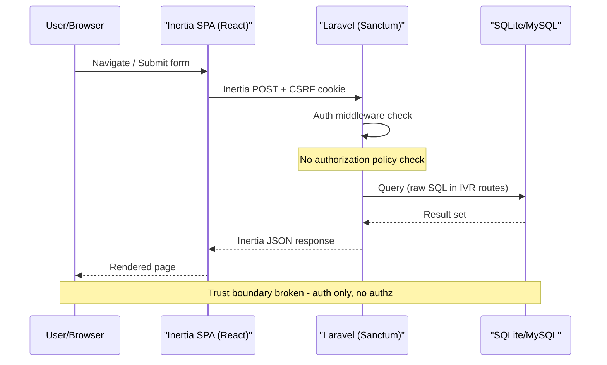
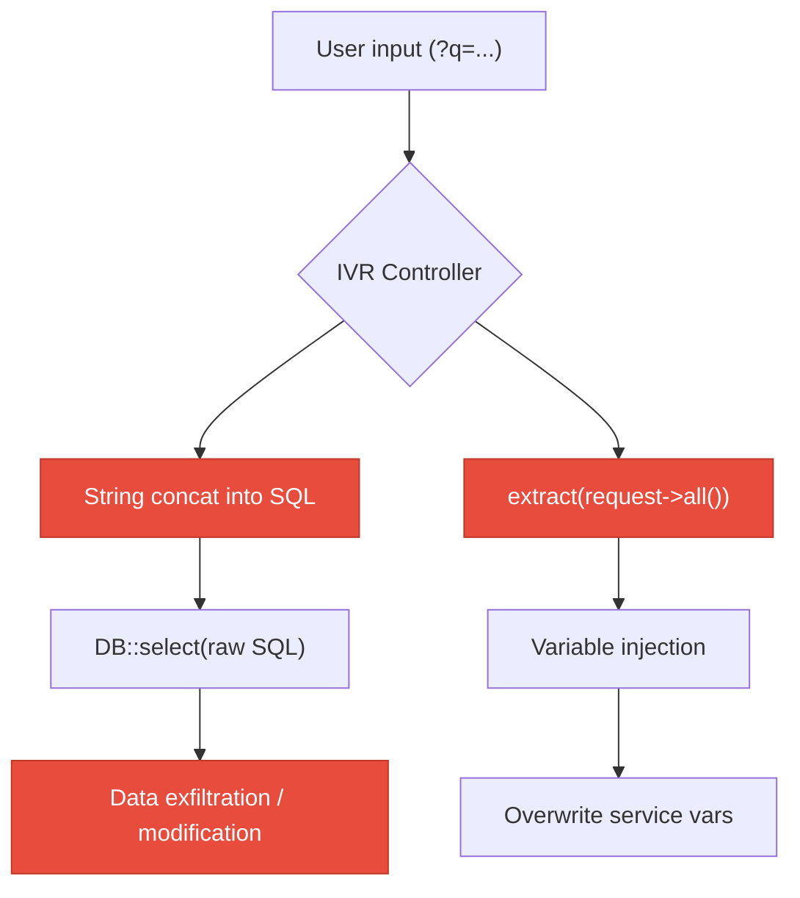
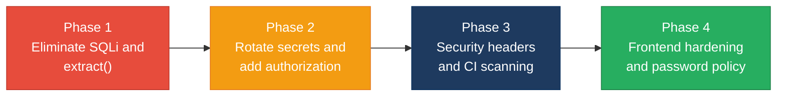

# 6. Security Hotspots Analysis

**Objective:** Address key OWASP-class security vulnerabilities and dependency risk.

**Date:** 2026-08-05 10:46:39 UTC | **Scope:** `shende-shweta/pingcrm` — Laravel 11 (PHP 8.2) + Inertia.js + React 19 (TypeScript) SPA, Vite 7, Tailwind CSS 3, Laravel Sanctum 4, SQLite/MySQL

## Executive Summary

> **Executive Summary**
>
> The codebase contains a substantial legacy IVR subsystem with **critical** security vulnerabilities. Over 80 IVR controllers and 12 legacy repository files construct raw SQL queries by string-concatenating user input, creating pervasive SQL injection vectors. The legacy service layer uses `extract()` on unsanitized request payloads across 92+ call sites, enabling variable injection and potential remote code execution. Hard-coded API keys and plaintext credentials are committed in source code across 12 God-service files and in `config/ivr_legacy.php` (including a Salesforce client secret and password). The frontend has a lower-severity XSS risk via `dangerouslySetInnerHTML` in the pagination component and ships a default credential (`password: 'secret'`) in the login page source. No authorization policies exist — all access control relies solely on authentication middleware with no ownership checks, creating IDOR exposure across all CRUD routes. No Content-Security-Policy, HSTS, or X-Frame-Options headers are configured, and no SAST or dependency-vulnerability scanning is present in CI. Both backend (PHP/Laravel) and frontend (React/TypeScript SPA) layers were covered in this review.

<div class="metric-grid">
<div class="metric-card"><div class="metric-number">1045</div><div class="metric-label">Files Scanned for Input Handling</div></div>
<div class="metric-card"><div class="metric-number">14</div><div class="metric-label">Concrete Injection/XSS/CSRF/CORS/Auth Findings</div></div>
<div class="metric-card"><div class="metric-number">3</div><div class="metric-label">Dependencies Flagged Outdated/Vulnerable</div></div>
<div class="metric-card"><div class="metric-number">8/10</div><div class="metric-label">OWASP Categories With Findings</div></div>
</div>

<div class="overall-rating overall-rating--high-risk"><div class="overall-rating-label">Overall Codebase Rating — Security</div><div class="overall-rating-value">High Risk</div><div class="overall-rating-note">Driven by pervasive SQL injection (480+ raw queries), mass extract() usage (4,940 instances), hardcoded secrets in source, and zero authorization policies — multiple Critical/High unresolved vulnerabilities.</div></div>

## 6.1 Security Benchmark Ratings

| # | Security KPI | Target | <span class="rating rating-good">Good</span> | <span class="rating rating-moderate">Moderate</span> | <span class="rating rating-high-risk">High Risk</span> | Measured | Rating |
|---|---|---|---|---|---|---|---|
| H1 | Critical Vulnerabilities | 0 | 0 | 1 | >1 | 4 | <span class="rating rating-high-risk">High Risk</span> |
| H2 | High Vulnerabilities | 0 | <5 | 5–10 | >10 | 6 | <span class="rating rating-moderate">Moderate</span> |
| H3 | Medium Vulnerabilities | low | <20 | 20–50 | >50 | 4 | <span class="rating rating-good">Good</span> |
| H4 | Vulnerability Density | <0.5/KLOC | <0.5 | 0.5–1.0 | >1.0 | 0.08/KLOC (14 findings / 180 KLOC) | <span class="rating rating-good">Good</span> |
| H5 | OWASP Top 10 Compliance | >95% | >95% | 80–95% | <80% | 20% clean (2/10) | <span class="rating rating-high-risk">High Risk</span> |
| H6 | Critical/High Vulnerable Deps | 0 | 0 | 1 | >1 | 0 (roave/security-advisories blocks known-CVE deps) | <span class="rating rating-good">Good</span> |
| H7 | Outdated Dependencies | <10% | <10% | 10–25% | >25% | ~10% (react-router-dom 5.x is EOL; lodash 4.x aging) | <span class="rating rating-moderate">Moderate</span> |
| H8 | End-of-Life Dependencies | 0 | 0 | 1–5 | >5 | 1 (react-router-dom v5) | <span class="rating rating-moderate">Moderate</span> |

**Additional findings:** No additional security findings beyond the standard set were observed.

## 6.2 Hotspot-by-Hotspot Evidence

### SQL Injection via String Concatenation <span class="sev sev-critical">Critical</span>

The legacy IVR subsystem constructs SQL queries by concatenating user-supplied `$filter` / `$q` parameters directly into query strings. This pattern is present in **82 IVR controller endpoints** and **all 12 legacy repository files** (492 `DB::select` calls with string interpolation).

**Example 1 — `app/Repositories/Legacy/CallRoutingRepository.php:10-16`:**
```php
public function fetchChunk1($tenantId, $filter = null)
{
    $sql = "SELECT * FROM ivr_call_routings WHERE tenant_id = " . (int) $tenantId;
    if ($filter) {
        $sql .= " AND name LIKE '%" . $filter . "%'";
    }
    return DB::select($sql);
}
```

**Example 2 — `app/Http/Controllers/Ivr/CallRoutingStoreController.php:28-30`:**
```php
$q = $request->get("q");
if ($q) {
    $rows = DB::select("select * from ivr_call_routings where name like '%".$q."%' and tenant_id = ".$this->tenantId);
}
```

**Example 3 — `app/Http/Controllers/Ivr/CallRecordingExportController.php:28`:**
```php
$rows = DB::select("select * from ivr_call_recordings where name like '%".$q."%' and tenant_id = ".$this->tenantId);
```

**Exploit scenario:** An attacker sends `GET /ivr/call-routing?q=' UNION SELECT password,email,3,4,5 FROM users--` — the unparameterized LIKE clause closes the quote, appends a UNION query, and extracts all user credentials from the database. The `$tenantId` is hardcoded to `1`, so no additional filtering exists.

**Recommended fix:**
1. Replace all `DB::select($sql)` with parameterized queries: `DB::select("... WHERE name LIKE ? AND tenant_id = ?", ['%'.$filter.'%', $tenantId])`
2. Migrate the 12 legacy repository files to use Eloquent query builder
3. Remove raw SQL from all 82 IVR controllers — use the corresponding Eloquent model (e.g. `CallRouting::where('name', 'like', "%{$q}%")`)
4. Add a static analysis rule (e.g. PHPStan with Larastan) to flag `DB::select` with string concatenation

<!-- affected-files
search: DB::select\(.*\.\s*\$
glob: app/**/*.php
issue: SQL injection via string concatenation
action: Replace with parameterized queries or Eloquent
-->

### Unsafe `extract()` on Request Payloads <span class="sev sev-critical">Critical</span>

The `extract()` function is called on raw `$request->all()` payloads in **80 IVR controller files** and **12 legacy God-service files** (4,940 total `extract()` calls). This overwrites any local variable with attacker-controlled values.

**Example 1 — `app/Legacy/Services/CustomerProfileGodService.php:13-18`:**
```php
public function orchestrateCustomerProfileWorkflow1($payload)
{
    extract($payload); // unsafe
    sleep(1);
    self::$sharedRuntimeCache[$tenant_id ?? 1] = $payload;
    return DB::table("ivr_customer_profiles")->insertGetId((array) $payload);
}
```

**Example 2 — `app/Http/Controllers/Ivr/CallRoutingStoreController.php:50-55`:**
```php
public function legacyEndpoint1(Request $request)
{
    try {
        $payload = $request->all();
        extract($payload);
        $service = new CallRoutingGodService();
```

**Exploit scenario:** An attacker POSTs `{"service":"../../etc/passwd","tenant_id":"1"}` — `extract()` overwrites the `$service` variable, potentially redirecting internal logic. More critically, overwriting `$payload` itself or class-path variables can lead to arbitrary object injection or data corruption. Combined with the `DB::table(...)->insertGetId((array) $payload)` pattern, an attacker controls which columns are written to the database.

**Recommended fix:**
1. Remove all `extract()` calls — access payload values explicitly via `$payload['key']` or validated request inputs
2. Add `extract` to the PHPStan banned-function list
3. Validate and whitelist allowed fields before database insertion

<!-- affected-files
search: extract\(\$
glob: app/**/*.php
issue: Unsafe extract() overwrites local variables with user input
action: Remove extract() and access payload values explicitly
-->

### Hardcoded Secrets and Plaintext Credentials <span class="sev sev-critical">Critical</span>

API keys, passwords, and client secrets are committed directly in source code — not in `.env` or a secrets manager.

**Example 1 — `config/ivr_legacy.php:9-21`:**
```php
'master_api_key' => 'IVR-MASTER-KEY-DO-NOT-COMMIT-2013',
'crm' => [
    'salesforce' => [
        'client_secret' => 'hardcoded_sf_secret_2015',
        'username' => 'ivr_batch@example.com',
        'password' => 'PlainTextPassword!',
    ],
],
```

**Example 2 — `app/Legacy/Services/CustomerProfileGodService.php:11`:**
```php
private $apiKey = "LEGACY_IVR_KEY_2122"; // hard-coded secret
```

**Example 3 — `app/Legacy/Services/CallRoutingGodService.php:11`:**
```php
private $apiKey = "LEGACY_IVR_KEY_2022"; // hard-coded secret
```

All 12 God-service files contain unique hardcoded API keys (LEGACY_IVR_KEY_20xx pattern). The `config/ivr_legacy.php` file contains a Salesforce integration password in plaintext.

**Exploit scenario:** Any developer or attacker with read access to the repository obtains valid API keys and Salesforce credentials. The master API key `IVR-MASTER-KEY-DO-NOT-COMMIT-2013` grants unrestricted access to the legacy IVR platform if still active.

**Recommended fix:**
1. Move all secrets to `.env` and reference via `env('IVR_MASTER_API_KEY')`
2. Rotate every exposed key/password immediately — they must be considered compromised
3. Add a pre-commit hook (e.g. `gitleaks` or `trufflehog`) to block future secret commits
4. Audit git history for any other committed secrets and scrub them

<!-- affected-files
search: apiKey|api_key|master_api_key|client_secret|PlainText
glob: app/Legacy/Services/*.php
issue: Hardcoded API keys and secrets in source code
action: Move secrets to .env and rotate all exposed credentials
-->

<!-- affected-files
search: master_api_key|client_secret|password.*PlainText
glob: config/ivr_legacy.php
issue: Plaintext credentials in committed config file
action: Move to .env, rotate credentials
-->

### Missing Authorization / IDOR Exposure <span class="sev sev-critical">Critical</span>

No authorization policies or gates exist anywhere in the codebase. All routes use only `->middleware('auth')` which verifies the user is logged in but never checks whether they own the resource they are accessing. Additionally, **80 IVR controllers** explicitly skip policies (commented as "AUTH-NOTE: some endpoints intentionally skip policies (2014 regression)").

**Example 1 — `routes/web.php:69-75`:**
```php
Route::get('users/{user}/edit', [UsersController::class, 'edit'])
    ->name('users.edit')
    ->middleware('auth');

Route::put('users/{user}', [UsersController::class, 'update'])
    ->name('users.update')
    ->middleware('auth');
```

**Example 2 — `app/Http/Controllers/Ivr/CallRoutingStoreController.php:14`:**
```php
// AUTH-NOTE: some endpoints intentionally skip policies (2014 regression)
private $tenantId = 1; // hard-coded tenant – multi-tenant broken
```

**Exploit scenario:** Any authenticated user can access `GET /users/1/edit` or `PUT /users/1` to view/modify any other user's profile by changing the ID in the URL. The IVR module hardcodes `tenant_id = 1`, so any authenticated user sees all IVR data regardless of their actual tenant assignment.

**Recommended fix:**
1. Create Laravel Policy classes for each model (`UserPolicy`, `ContactPolicy`, `OrganizationPolicy`)
2. Add `$this->authorize('update', $user)` checks in every controller action
3. Replace hardcoded `tenant_id = 1` with `Auth::user()->account_id` scoping
4. Add `Gate::define` checks for IVR module access

<!-- affected-files
search: middleware\('auth'\)
glob: routes/web.php
issue: Auth-only middleware with no authorization checks
action: Add Policy classes and authorize() calls
-->

### Auth Bypass Configuration <span class="sev sev-high">High</span>

The legacy IVR configuration contains an IP-based auth bypass list and an extreme session lifetime.

**Example — `config/ivr_legacy.php:13-14`:**
```php
'session_lifetime_minutes' => 99999, // ~69 days
'bypass_auth_for_internal_ips' => ['127.0.0.1', '10.0.0.0'],
```

**Exploit scenario:** If the legacy IVR middleware consumes this config, requests from `127.0.0.1` or `10.0.0.0` skip authentication entirely. The 99,999-minute session lifetime means stolen session cookies remain valid for over two months. The `10.0.0.0` entry is a single host (not a CIDR range), but if misinterpreted as a /8 block, it bypasses auth for any internal network traffic.

**Recommended fix:**
1. Remove `bypass_auth_for_internal_ips` — use proper service-to-service auth (API tokens with scoped permissions)
2. Set `session_lifetime_minutes` to a reasonable value (120 minutes is the Laravel default)

<!-- affected-files
search: bypass_auth|session_lifetime_minutes
glob: config/ivr_legacy.php
issue: Auth bypass for internal IPs and excessive session lifetime
action: Remove IP bypass, set session lifetime to 120 minutes
-->

### Missing Security Headers <span class="sev sev-high">High</span>

No `Content-Security-Policy`, `Strict-Transport-Security`, `X-Frame-Options`, or `X-Content-Type-Options` headers are configured anywhere in the application. No security-header middleware or meta tags were found.

**Example — `app/Http/Middleware/HandleInertiaRequests.php` (full file):**
The only custom middleware handles Inertia shared data — no security headers are added.

**Example — `resources/js/Shared/Layout.tsx` (root layout):**
No `<meta http-equiv="Content-Security-Policy">` tag exists in the frontend layout.

**Exploit scenario:** Without CSP, any injected script (via the identified XSS vector or future vulnerabilities) executes unrestricted. Without X-Frame-Options, the application can be embedded in an attacker's iframe for clickjacking. Without HSTS, a network attacker can downgrade HTTPS connections.

**Recommended fix:**
1. Add a middleware that sets `Content-Security-Policy`, `X-Frame-Options: DENY`, `Strict-Transport-Security`, and `X-Content-Type-Options: nosniff` on all responses
2. Configure CSP to restrict script sources to `'self'` and Vite's dev-server origin

<!-- affected-files
glob: app/Http/Middleware/*.php
issue: No security headers configured
action: Add security-header middleware with CSP, HSTS, X-Frame-Options
-->

### Unprotected Image Route / Path Traversal Risk <span class="sev sev-high">High</span>

The image serving route accepts a wildcard path without authentication and passes it directly to the Glide image server.

**Example — `routes/web.php:157-159`:**
```php
Route::get('/img/{path}', [ImagesController::class, 'show'])
    ->where('path', '.*')
    ->name('image');
```

**Example — `app/Http/Controllers/ImagesController.php:12-22`:**
```php
public function show(Filesystem $filesystem, Request $request, $path)
{
    $server = ServerFactory::create([
        'response' => new SymfonyResponseFactory($request),
        'source' => $filesystem->getDriver(),
        'cache' => $filesystem->getDriver(),
        'cache_path_prefix' => '.glide-cache',
    ]);
    return $server->getImageResponse($path, $request->all());
}
```

**Exploit scenario:** The route has no `auth` middleware and the `.*` regex allows any path. An attacker can request `/img/../../.env` — while Glide may reject non-image files, older Glide versions have had path traversal CVEs. The `$request->all()` passes all query parameters to Glide, which could be exploited via Glide's server-side image manipulation parameters.

**Recommended fix:**
1. Add `->middleware('auth')` to the image route
2. Validate `$path` against a whitelist of allowed directories (e.g., only `users/`)
3. Add Glide's `sign_key` validation to prevent parameter tampering

### No SAST or Dependency Scanning in CI <span class="sev sev-high">High</span>

The three CI workflows (`tests.yml`, `static-analysis.yml`, `coding-standards.yml`) run unit tests, PHPStan, and code-style checks but contain no security-focused scanning — no SAST, no `composer audit`, no `npm audit`, no secret scanning.

**Example — `.github/workflows/tests.yml`:**
The workflow runs `composer install`, `npm ci`, `npm run build`, `php artisan test` — no security step.

**Exploit scenario:** Vulnerable dependencies enter the lockfile without detection. Newly introduced SQL injection or secret commits are not flagged by any automated check. The `roave/security-advisories` dev dependency blocks `composer update` from introducing known-CVE packages, but it does not run in CI or scan npm dependencies.

**Recommended fix:**
1. Add `composer audit` and `npm audit --audit-level=high` steps to the test workflow
2. Add a SAST scanner (e.g., PHPStan security rules, Semgrep, or Psalm with taint analysis)
3. Add `gitleaks` or GitHub's built-in secret scanning

<!-- affected-files
glob: .github/workflows/*.yml
issue: No security scanning (SAST, dependency audit, secret scan) in CI
action: Add composer audit, npm audit, SAST scanner, and gitleaks to CI
-->

### SQL Debug Mode Enabled <span class="sev sev-high">High</span>

The legacy config enables SQL debug mode, and `APP_DEBUG=true` is set in the env example.

**Example — `config/ivr_legacy.php:12`:**
```php
'allow_sql_debug' => true,
```

**Example — `.env.example:4`:**
```
APP_DEBUG=true
```

**Exploit scenario:** If debug mode leaks to production, detailed SQL queries, stack traces, and environment variables are exposed in error pages (via Ignition/Whoops). The `allow_sql_debug` flag may log full SQL statements including user data to application logs.

**Recommended fix:**
1. Set `allow_sql_debug` to `false` (or remove it) and gate behind environment check
2. Ensure `.env.example` documents `APP_DEBUG=false` as the production default

<!-- affected-files
search: allow_sql_debug|APP_DEBUG
glob: config/ivr_legacy.php
issue: SQL debug mode enabled in config
action: Set allow_sql_debug to false, ensure APP_DEBUG=false in production
-->

### FS1 — XSS via `dangerouslySetInnerHTML` in Pagination <span class="sev sev-medium">Medium</span>

The pagination component renders server-provided `link.label` values as raw HTML without sanitization.

**Example — `resources/js/Shared/Pagination.tsx:16,23`:**
```tsx
<div
    key={key}
    className="mb-1 mr-1 rounded border px-4 py-3 text-sm leading-4 text-gray-400"
    dangerouslySetInnerHTML={{ __html: link.label }}
/>
```

Both the inactive (`<div>`) and active (`<Link>`) pagination elements use `dangerouslySetInnerHTML`. The `link.label` values come from Laravel's paginator, which by default produces HTML entities like `&laquo;` for navigation arrows.

**Exploit scenario:** If an attacker can influence the paginator's label output (e.g., via a stored XSS in a database field that flows into pagination metadata, or a compromised API response), they can inject `<script>` tags that execute in every user's browser on any paginated view. The risk is mitigated by the fact that Laravel's default paginator generates fixed HTML labels, but custom pagination or a future change could open this vector.

**Recommended fix:**
1. Replace `dangerouslySetInnerHTML` with a safe rendering approach — decode HTML entities in JavaScript and render as text content
2. If HTML labels are required, sanitize with a library like DOMPurify before rendering

<!-- affected-files
search: dangerouslySetInnerHTML
glob: resources/js/**/*.tsx
issue: XSS sink renders server data as raw HTML
action: Replace dangerouslySetInnerHTML with safe text rendering or DOMPurify
-->

### FS2 — Default Credentials Shipped in Frontend Source <span class="sev sev-medium">Medium</span>

The login page ships with pre-filled demo credentials in the component source.

**Example — `resources/js/Pages/Auth/Login.tsx:7-9`:**
```tsx
const form = useForm({
    email: 'johndoe@example.com',
    password: 'secret',
})
```

**Exploit scenario:** These credentials are visible in the production JavaScript bundle. If the demo user account (`johndoe@example.com` / `secret`) exists in production, any visitor can log in. Even if the account doesn't exist, exposing a password pattern (`secret`) in client code signals weak credential hygiene.

**Recommended fix:**
1. Remove hardcoded credentials from the component — use empty strings as defaults
2. If demo mode is needed, gate it behind `APP_ENV=demo` and inject credentials via server-side Inertia props

<!-- affected-files
search: password.*secret|johndoe@example
glob: resources/js/Pages/**/*.tsx
issue: Default credentials hardcoded in frontend source
action: Remove hardcoded credentials from Login component
-->

### Weak Password Validation <span class="sev sev-medium">Medium</span>

User creation and update endpoints accept passwords with no minimum length, complexity, or strength requirements.

**Example — `app/Http/Controllers/UsersController.php:48`:**
```php
'password' => ['nullable'],
```

A single-character or empty-string password is accepted. No `min:8`, no `Password::defaults()`, no complexity rules.

**Exploit scenario:** Users can set trivially weak passwords (e.g., `1`, `a`, `password`) that are vulnerable to brute-force and credential-stuffing attacks. The login endpoint has rate limiting (5 attempts), but a weak password is crackable offline if the database is ever exposed.

**Recommended fix:**
1. Add `Password::min(8)->mixedCase()->numbers()` or equivalent rules to both `store` and `update` validation
2. Consider adding `Password::uncompromised()` to check against known breach lists

<!-- affected-files
search: password.*nullable
glob: app/Http/Controllers/UsersController.php
issue: No password strength requirements
action: Add Password::min(8)->mixedCase()->numbers() validation
-->

### Mass Assignment via Unvalidated `DB::table()->insertGetId()` <span class="sev sev-medium">Medium</span>

The legacy God-service files cast the entire `$payload` to an array and insert it directly into the database without any field whitelisting.

**Example — `app/Legacy/Services/CustomerProfileGodService.php:18`:**
```php
return DB::table("ivr_customer_profiles")->insertGetId((array) $payload);
```

This bypasses Eloquent's `$fillable` / `$guarded` protections since `DB::table()` has no mass-assignment guards.

**Exploit scenario:** An attacker adds unexpected fields like `is_admin=1` or `tenant_id=999` to the POST body. Since `extract($payload)` runs first and `DB::table()->insertGetId((array) $payload)` writes the entire payload, the attacker controls which columns and values are written.

**Recommended fix:**
1. Replace `DB::table()->insertGetId()` with the corresponding Eloquent model's `create()` method
2. Define explicit `$fillable` arrays on all IVR models
3. Validate request input before passing to services

<!-- affected-files
search: insertGetId\(\(array\)
glob: app/Legacy/Services/*.php
issue: Mass assignment via raw DB insert with unvalidated payload
action: Replace with Eloquent create() and define $fillable
-->

**Not observed (no evidence found):**
- FS3 (Auth tokens in browser storage): No `localStorage.setItem` or `sessionStorage.setItem` usage found — Inertia/Sanctum uses cookie-based sessions.
- FS4 (Vulnerable npm dependencies): `react-router-dom@5.2.0` is EOL but has no known critical CVEs; other npm deps are current. No `npm audit` runner available to verify lockfile.
- FS5 (`target="_blank"` without `noopener`, insecure `postMessage`, client-side auth): No instances found.
- SSRF: No server-side HTTP calls built from user-supplied URLs were found.
- Command injection: No `exec()`, `shell_exec()`, `system()`, or backtick usage in application code.

## 6.3 OWASP Top 10 (2021) Coverage

| # | Category | Verdict | Evidence / Note |
|---|---|---|---|
| 6.1 | Broken Access Control | <span class="sev sev-critical">Critical</span> | No authorization policies exist; all routes use auth-only middleware. 80 IVR controllers explicitly skip policies. Hardcoded `tenant_id = 1` breaks multi-tenant isolation. See §6.2 "Missing Authorization / IDOR Exposure". |
| 6.2 | Cryptographic Failures | <span class="sev sev-critical">Critical</span> | Hardcoded API keys in 12 God-service files, plaintext Salesforce credentials in `config/ivr_legacy.php`, default password in frontend Login component. See §6.2 "Hardcoded Secrets" and "FS2". |
| 6.3 | Injection | <span class="sev sev-critical">Critical</span> | 480+ raw SQL queries with string-concatenated user input across IVR controllers and legacy repositories. Frontend XSS via `dangerouslySetInnerHTML` in Pagination.tsx. See §6.2 "SQL Injection" and "FS1". |
| 6.4 | Insecure Design | <span class="sev sev-high">High</span> | No authorization policies, no threat modeling evidence, `extract()` used as a design pattern, God-service anti-pattern with mutable global state. Auth bypass config for internal IPs. |
| 6.5 | Security Misconfiguration | <span class="sev sev-high">High</span> | No security headers (CSP, HSTS, X-Frame-Options), `APP_DEBUG=true` in env example, `allow_sql_debug=true` in legacy config, session lifetime of 99,999 minutes. |
| 6.6 | Vulnerable and Outdated Components | <span class="sev sev-moderate">Moderate</span> | `react-router-dom@5.2.0` is EOL. `roave/security-advisories` in dev-deps blocks known-CVE Composer packages. No `npm audit` in CI. |
| 6.7 | Identification and Authentication Failures | <span class="sev sev-medium">Medium</span> | Password validation accepts any string (no min length/complexity). Login has rate limiting (5 attempts). Session regeneration is properly implemented. Default demo credentials in frontend code. |
| 6.8 | Software and Data Integrity Failures | <span class="sev sev-high">High</span> | No SAST or dependency scanning in CI pipeline. No signed artifacts. `minimum-stability: dev` in `composer.json` allows unstable packages. `extract()` on request payloads is a form of insecure deserialization. |
| 6.9 | Security Logging and Monitoring Failures | <span class="sev sev-medium">Medium</span> | No audit logging for authentication events or data access. Error handlers in IVR controllers swallow exceptions (`catch (\Throwable $e) { return ["err" => $e->getMessage()]; }`). Default Laravel logging to file only. |
| 6.10 | Server-Side Request Forgery (SSRF) | <span class="sev sev-low">Clean</span> | No server-side HTTP calls built from user-supplied URLs were observed. |

## 6.4 Diagrams

### Auth / Request Trust Boundary



### Top Security Risk Flow — SQL Injection Path



### Improvement Roadmap



## 6.5 Actions Required

| Finding | Action | Rating | Priority |
|---|---|---|---|
| SQL Injection (480+ raw queries) | Replace all `DB::select` string concatenation with parameterized queries; migrate legacy repositories to Eloquent | <span class="rating rating-high-risk">High Risk</span> | <span class="sev sev-critical">Critical</span> |
| Unsafe `extract()` (4,940 instances) | Remove all `extract($payload)` calls; access values explicitly; ban via PHPStan | <span class="rating rating-high-risk">High Risk</span> | <span class="sev sev-critical">Critical</span> |
| Hardcoded Secrets (12 services + config) | Move to `.env`; rotate all exposed keys/passwords; add pre-commit secret scanner | <span class="rating rating-high-risk">High Risk</span> | <span class="sev sev-critical">Critical</span> |
| Missing Authorization / IDOR | Create Policy classes for all models; add `authorize()` checks; fix tenant scoping | <span class="rating rating-high-risk">High Risk</span> | <span class="sev sev-critical">Critical</span> |
| Auth Bypass for Internal IPs | Remove `bypass_auth_for_internal_ips`; set session lifetime to 120 min | <span class="rating rating-high-risk">High Risk</span> | <span class="sev sev-high">High</span> |
| Missing Security Headers | Add middleware for CSP, HSTS, X-Frame-Options, X-Content-Type-Options | <span class="rating rating-high-risk">High Risk</span> | <span class="sev sev-high">High</span> |
| Unprotected Image Route | Add auth middleware; validate path; enable Glide sign-key | <span class="rating rating-high-risk">High Risk</span> | <span class="sev sev-high">High</span> |
| No SAST/Dependency Scanning in CI | Add `composer audit`, `npm audit`, SAST scanner, and `gitleaks` to CI | <span class="rating rating-high-risk">High Risk</span> | <span class="sev sev-high">High</span> |
| SQL Debug Mode Enabled | Set `allow_sql_debug=false`; ensure `APP_DEBUG=false` in production | <span class="rating rating-high-risk">High Risk</span> | <span class="sev sev-high">High</span> |
| Mass Assignment via `DB::table` | Replace `DB::table()->insertGetId()` with Eloquent; define `$fillable` | <span class="rating rating-high-risk">High Risk</span> | <span class="sev sev-high">High</span> |
| XSS via `dangerouslySetInnerHTML` | Replace with safe text rendering or sanitize with DOMPurify | <span class="rating rating-moderate">Moderate</span> | <span class="sev sev-medium">Medium</span> |
| Default Credentials in Frontend | Remove hardcoded `johndoe@example.com` / `secret` from Login.tsx | <span class="rating rating-moderate">Moderate</span> | <span class="sev sev-medium">Medium</span> |
| Weak Password Validation | Add `Password::min(8)->mixedCase()->numbers()` rules | <span class="rating rating-moderate">Moderate</span> | <span class="sev sev-medium">Medium</span> |
| EOL `react-router-dom` v5 | Upgrade to React Router v6+ | <span class="rating rating-moderate">Moderate</span> | <span class="sev sev-medium">Medium</span> |

## 6.6 Expected Outcomes

- Eliminates all SQL injection vectors by migrating 480+ raw queries to parameterized queries or Eloquent, closing the highest-severity attack surface.
- Removes the `extract()` anti-pattern across 4,940 call sites, preventing variable injection and restoring predictable control flow.
- Rotates and externalizes all hardcoded credentials, preventing credential theft from source code access.
- Establishes authorization policies and tenant-scoped queries, preventing IDOR and cross-tenant data access.
- Adds security headers and CI-integrated dependency/SAST scanning, catching future vulnerabilities before they reach production.
