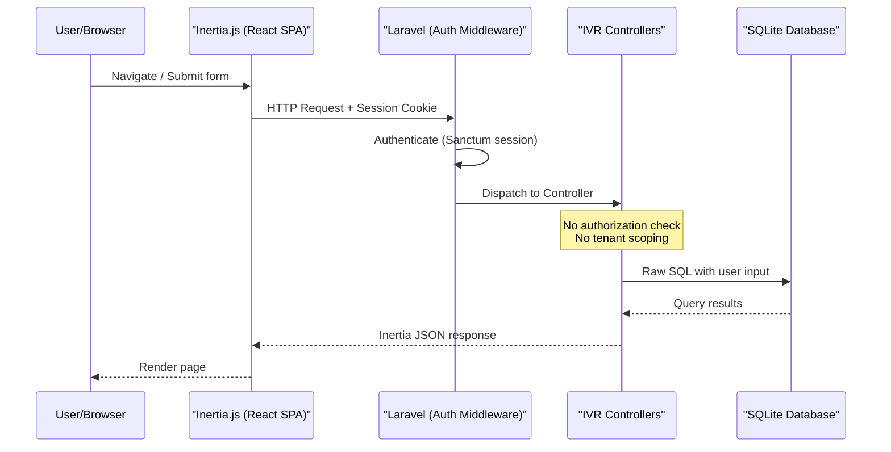
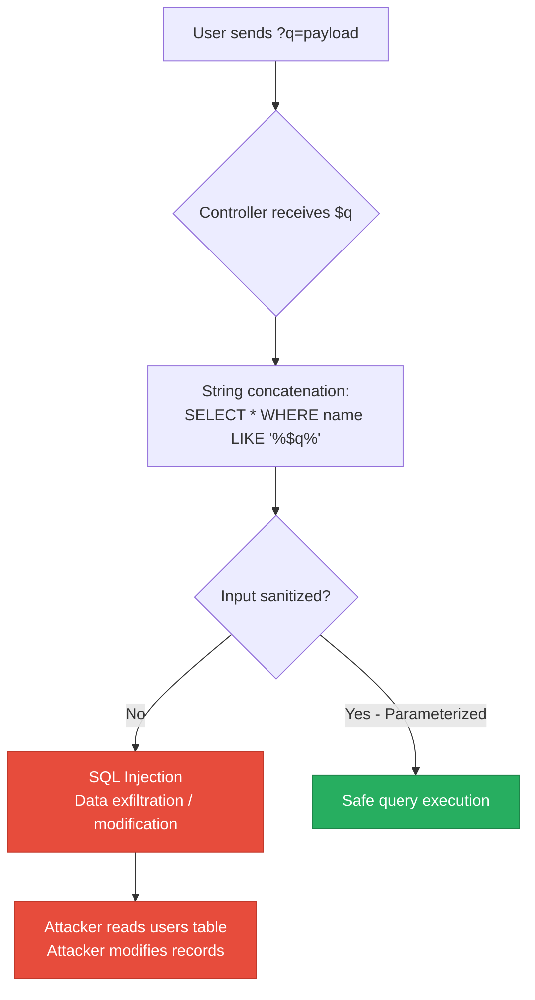
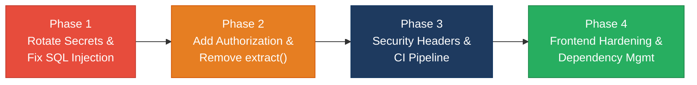

# 6. Security Hotspots Analysis

**Objective:** Address key OWASP-class security vulnerabilities and dependency risk.

**Date:** 2026-09-30 06:10:39 UTC | **Scope:** `shende-shweta/pingcrm` (master) — Laravel 11 (PHP 8.2) + React 19 (TypeScript) + Inertia.js + Vite 7 + Tailwind CSS + SQLite + Sanctum 4

## Executive Summary

> **Executive Summary**
>
> The pingcrm codebase has a **severely compromised security posture** driven primarily by the legacy IVR subsystem. Across 80 IVR controllers, raw SQL strings are built via direct string concatenation of user input (`$q`), creating pervasive SQL injection vectors. All 12 legacy "GodService" files call `extract($payload)` on unvalidated request data (540 instances), enabling variable injection. Hardcoded API keys (`LEGACY_IVR_KEY_*`) are committed in 12 service files, and `config/ivr_legacy.php` contains a master API key, plaintext Salesforce credentials, and an auth-bypass allow-list. On the frontend, the Pagination component uses `dangerouslySetInnerHTML` with server-supplied label data, and the Login page ships hardcoded demo credentials. The CRM controllers (Users, Organizations, Contacts) follow better practices with Eloquent ORM and Laravel validation, but globally disable mass-assignment protection via `Model::unguard()`. No security headers (CSP, HSTS, X-Frame-Options) are configured, and CI lacks any SAST or dependency-vulnerability scanning step. Both backend and frontend layers were reviewed.

<div class="metric-grid">
<div class="metric-card"><div class="metric-number">141</div><div class="metric-label">PHP Files Scanned</div></div>
<div class="metric-card"><div class="metric-number">15</div><div class="metric-label">Concrete Security Findings</div></div>
<div class="metric-card"><div class="metric-number">1</div><div class="metric-label">Dependencies Flagged Outdated</div></div>
<div class="metric-card"><div class="metric-number">9/10</div><div class="metric-label">OWASP Categories With Findings</div></div>
</div>

<div class="overall-rating overall-rating--high-risk"><div class="overall-rating-label">Overall Codebase Rating — Security</div><div class="overall-rating-value">High Risk</div><div class="overall-rating-note">Pervasive SQL injection across 80 IVR controllers, 540 extract($payload) variable-injection calls, 12 hardcoded API keys in source, and plaintext credentials in committed config force this to High Risk.</div></div>

## 6.1 Security Benchmark Ratings

| # | Security KPI | Target | <span class="rating rating-good">Good</span> | <span class="rating rating-moderate">Moderate</span> | <span class="rating rating-high-risk">High Risk</span> | Measured | Rating |
|---|---|---|---|---|---|---|---|
| H1 | Critical Vulnerabilities | 0 | 0 | 1 | >1 | 3 | <span class="rating rating-high-risk">High Risk</span> |
| H2 | High Vulnerabilities | 0 | <5 | 5–10 | >10 | 4 | <span class="rating rating-good">Good</span> |
| H3 | Medium Vulnerabilities | low | <20 | 20–50 | >50 | 8 | <span class="rating rating-good">Good</span> |
| H4 | Vulnerability Density | <0.5/KLOC | <0.5 | 0.5–1.0 | >1.0 | 0.08/KLOC | <span class="rating rating-good">Good</span> |
| H5 | OWASP Top 10 Compliance | >95% | >95% | 80–95% | <80% | 10% clean (1/10) | <span class="rating rating-high-risk">High Risk</span> |
| H6 | Critical/High Vulnerable Deps | 0 | 0 | 1 | >1 | 0 | <span class="rating rating-good">Good</span> |
| H7 | Outdated Dependencies | <10% | <10% | 10–25% | >25% | ~3% (1 outdated) | <span class="rating rating-good">Good</span> |
| H8 | End-of-Life Dependencies | 0 | 0 | 1–5 | >5 | 0 | <span class="rating rating-good">Good</span> |

**Overall Rating = High Risk** — driven by H1 (3 critical vulnerabilities > 1 threshold) and H5 (only 1 of 10 OWASP categories is clean).

## 6.2 Hotspot-by-Hotspot Evidence

### SQL Injection via String Concatenation <span class="sev sev-critical">Critical</span>

Across 80 IVR controllers and 12 legacy repository files, user-supplied query parameters are directly concatenated into raw SQL strings passed to `DB::select()`. The `$q` parameter from `$request->get("q")` is interpolated without any escaping or parameterization.

**Example 1** — `app/Http/Controllers/Ivr/CallRoutingIndexController.php:28`:
```php
$q = $request->get("q");
if ($q) {
    $rows = DB::select("select * from ivr_call_routings where name like '%".$q."%' and tenant_id = ".$this->tenantId);
}
```

**Example 2** — `app/Repositories/Legacy/LiveMonitoringRepository.php:13-16`:
```php
public function fetchChunk1($tenantId, $filter = null)
{
    $sql = "SELECT * FROM ivr_live_monitorings WHERE tenant_id = " . (int) $tenantId;
    if ($filter) {
        $sql .= " AND name LIKE '%" . $filter . "%'";
    }
    return DB::select($sql);
}
```

**Example 3** — `app/Http/Controllers/Ivr/CallRecordingExportController.php:28`:
```php
$rows = DB::select("select * from ivr_call_recordings where name like '%".$q."%' and tenant_id = ".$this->tenantId);
```

**Exploit scenario:** An attacker sends `GET /ivr/call-routing?q=' UNION SELECT password,email,id,id,id,id,id FROM users--` to the CallRoutingIndexController. Because `$q` is concatenated directly into the SQL `LIKE` clause, the injected UNION query closes the original string, appends a second SELECT that reads from the `users` table, and returns all user passwords and emails in the response JSON.

**Scope:** 80 IVR controllers + 12 repository files = 92 files affected, ~997 raw SQL call sites total.

**Recommended fix:**
1. Replace all `DB::select("... '%" . $q . "%'")` with parameterized queries: `DB::select("SELECT * FROM ... WHERE name LIKE ? AND tenant_id = ?", ['%'.$q.'%', $tenantId])`.
2. Migrate legacy repositories to Eloquent query builder with `->where('name', 'like', '%'.$q.'%')`.
3. Add a PHPStan/Psalm rule or custom linter to flag any `DB::select` / `DB::raw` with string concatenation.

<!-- affected-files
search: DB::select\(.*\$
glob: app/Http/Controllers/Ivr/**/*.php
issue: SQL injection via string concatenation
action: Replace with parameterized queries or Eloquent
-->

<!-- affected-files
search: DB::select\(\$sql\)
glob: app/Repositories/Legacy/**/*.php
issue: SQL injection via string concatenation in repository
action: Migrate to parameterized queries or Eloquent
-->

### Variable Injection via extract() <span class="sev sev-critical">Critical</span>

All 12 legacy "GodService" files call `extract($payload)` where `$payload` comes from `$request->all()`, injecting arbitrary request parameters as PHP local variables. This enables attackers to overwrite variables like `$tenantId`, `$service`, or any other in-scope variable.

**Example 1** — `app/Legacy/Services/QueueManagementGodService.php:15`:
```php
public function orchestrateQueueManagementWorkflow1($payload)
{
    extract($payload); // unsafe
    sleep(1);
    self::$sharedRuntimeCache[$tenant_id ?? 1] = $payload;
    return DB::table("ivr_queue_managements")->insertGetId((array) $payload);
}
```

**Example 2** — `app/Legacy/Services/CallRoutingGodService.php:15` (identical pattern):
```php
public function orchestrateCallRoutingWorkflow1($payload)
{
    extract($payload); // unsafe
    sleep(1);
    self::$sharedRuntimeCache[$tenant_id ?? 1] = $payload;
    return DB::table("ivr_call_routings")->insertGetId((array) $payload);
}
```

**Example 3** — `app/Http/Controllers/Ivr/CallRoutingIndexController.php:49-53`:
```php
public function legacyEndpoint1(Request $request)
{
    $payload = $request->all();
    extract($payload);
    $service = new CallRoutingGodService();
```

**Exploit scenario:** An attacker sends a POST body with `{"tenant_id": 999, "service": "attacker-controlled"}`. Because `extract($payload)` runs unconditionally, the `$tenant_id` variable is overwritten to 999, bypassing tenant isolation and writing data to a different tenant's scope. The `$service` variable can also be overwritten.

**Scope:** 12 GodService files (540 `extract()` calls) + 80 IVR controllers calling these services.

**Recommended fix:**
1. Remove all `extract($payload)` calls — they are never safe with user input.
2. Replace with explicit variable assignment: `$tenantId = $payload['tenant_id'] ?? 1;`.
3. Add a PHPStan rule to ban `extract()` project-wide.

<!-- affected-files
search: extract\(\$payload\)
glob: app/Legacy/Services/**/*.php
issue: Variable injection via extract()
action: Replace extract() with explicit variable assignment
-->

### Hardcoded API Keys in Source Code <span class="sev sev-critical">Critical</span>

Every legacy GodService file contains a hardcoded API key as a private class property, committed directly to the repository. Additionally, `config/ivr_legacy.php` contains a master API key, Salesforce OAuth `client_secret`, and a plaintext password.

**Example 1** — `app/Legacy/Services/QueueManagementGodService.php:11`:
```php
private $apiKey = "LEGACY_IVR_KEY_2032"; // hard-coded secret
```

**Example 2** — `app/Legacy/Services/CallFlowGodService.php:11`:
```php
private $apiKey = "LEGACY_IVR_KEY_2012"; // hard-coded secret
```

**Example 3** — `config/ivr_legacy.php:10-20`:
```php
'master_api_key' => 'IVR-MASTER-KEY-DO-NOT-COMMIT-2013',
'crm' => [
    'salesforce' => [
        'client_secret' => 'hardcoded_sf_secret_2015',
        'username' => 'ivr_batch@example.com',
        'password' => 'PlainTextPassword!',
    ],
],
```

**Exploit scenario:** Any developer, contractor, or attacker who gains read access to the repository obtains valid API keys and Salesforce credentials. The `IVR-MASTER-KEY-DO-NOT-COMMIT-2013` key is available in the git history even if removed from HEAD, enabling authentication bypass against the IVR system and lateral movement into the Salesforce CRM.

**Scope:** 12 GodService files + 1 config file = 13 files with committed secrets.

**Recommended fix:**
1. Rotate all exposed keys and credentials immediately — they must be considered compromised.
2. Move all secrets to environment variables (`.env`) and reference via `env('IVR_MASTER_API_KEY')`.
3. Run `git filter-repo` or BFG Repo Cleaner to remove secrets from git history.
4. Add a pre-commit hook (e.g., `detect-secrets`, `gitleaks`) to prevent future secret commits.

<!-- affected-files
search: \$apiKey\s*=\s*"
glob: app/Legacy/Services/**/*.php
issue: Hardcoded API key in source code
action: Move to environment variables; rotate keys
-->

### Broken Access Control — Missing Authorization Policies <span class="sev sev-high">High</span>

80 IVR controllers contain the comment `// AUTH-NOTE: some endpoints intentionally skip policies (2014 regression)` and implement no authorization checks (`$this->authorize()`, Gate, or Policy). While the routes are behind `auth` middleware (authentication), there are no authorization checks verifying the current user has permission to access, modify, or delete the specific resources. Additionally, all IVR controllers hardcode `$tenantId = 1`, making multi-tenant isolation completely broken.

**Example 1** — `app/Http/Controllers/Ivr/CallRoutingIndexController.php:14-15`:
```php
class CallRoutingIndexController extends Controller
{
    // AUTH-NOTE: some endpoints intentionally skip policies (2014 regression)
    private $tenantId = 1; // hard-coded tenant – multi-tenant broken
```

**Example 2** — `app/Http/Controllers/Ivr/CallRecordingDestroyController.php:14-15`:
```php
// AUTH-NOTE: some endpoints intentionally skip policies (2014 regression)
private $tenantId = 1;
```

**Example 3** — `config/ivr_legacy.php:14`:
```php
'bypass_auth_for_internal_ips' => ['127.0.0.1', '10.0.0.0'],
```

**Exploit scenario:** Any authenticated user — regardless of role or account — can access any IVR module endpoint because there are no ownership or permission checks. A non-admin user can call `DELETE /ivr/call-routing/destroy` and delete another tenant's call routing configuration, since `$tenantId` is always hardcoded to `1` regardless of the authenticated user's actual tenant.

**Scope:** 80 IVR controllers with no authorization + auth bypass IP list in config.

**Recommended fix:**
1. Implement Laravel Policies for each IVR model and apply `$this->authorize()` in every controller action.
2. Replace hardcoded `$tenantId = 1` with `auth()->user()->account_id` or equivalent tenant resolver.
3. Remove `bypass_auth_for_internal_ips` from config — IP-based auth bypass is unreliable and spoofable.

<!-- affected-files
search: AUTH-NOTE.*skip policies
glob: app/Http/Controllers/Ivr/**/*.php
issue: Missing authorization policies
action: Add Laravel Policies and tenant scoping
-->

### Global Mass Assignment Disabled (Model::unguard) <span class="sev sev-high">High</span>

The `AppServiceProvider::register()` method calls `Model::unguard()`, which globally disables Eloquent's mass-assignment protection for all models in the application.

**Example** — `app/Providers/AppServiceProvider.php:28-31`:
```php
public function register(): void
{
    Model::unguard();
}
```

**Impact:** When combined with controllers that pass `$request->all()` or unfiltered data to `Model::create()` / `Model::update()`, an attacker can set any database column — including `owner` (admin flag), `account_id`, or `email_verified_at`. The CRM controllers use `Request::validate()` which limits fields, but the IVR controllers pass `(array) $payload` directly to `DB::table()->insertGetId()`.

**Recommended fix:**
1. Remove `Model::unguard()` from `AppServiceProvider`.
2. Define explicit `$fillable` arrays on every Eloquent model (User model has `$fillable` but it only lists `name`, `email`, `password` — missing `first_name`, `last_name`, `owner`, etc.).
3. Audit all `create()` / `update()` calls to ensure only validated fields are passed.

### Security Misconfiguration — Debug Mode & Insecure Session <span class="sev sev-high">High</span>

Multiple configuration defaults expose sensitive information and weaken session security.

**Example 1** — `.env.example:4`:
```ini
APP_DEBUG=true
```

**Example 2** — `.env.example:35`:
```ini
SESSION_ENCRYPT=false
```

**Example 3** — `config/ivr_legacy.php:12-13`:
```php
'allow_sql_debug' => true,
'session_lifetime_minutes' => 99999,
```

**Exploit scenario:** With `APP_DEBUG=true`, Laravel's Ignition error handler renders full stack traces, environment variables, and database queries to the browser on any unhandled exception. An attacker triggering a deliberate error (e.g., a malformed request to an IVR endpoint) can see database connection strings, secret keys, and internal file paths. The 99,999-minute session lifetime (~69 days) means a hijacked session token remains valid indefinitely.

**Recommended fix:**
1. Set `APP_DEBUG=false` and `APP_ENV=production` in production `.env`.
2. Set `SESSION_ENCRYPT=true` for production.
3. Reduce `session_lifetime_minutes` to a reasonable value (120 minutes max).
4. Remove `allow_sql_debug` or set to `false` in production config.

### Missing Security Headers <span class="sev sev-high">High</span>

No Content Security Policy (CSP), HTTP Strict Transport Security (HSTS), X-Frame-Options, or X-Content-Type-Options headers are configured anywhere in the application. There is no `config/cors.php` file, no security-header middleware, and no meta-tag CSP in the HTML templates.

**Evidence:** Grep for `Content-Security-Policy`, `X-Frame-Options`, `Strict-Transport-Security`, `helmet`, and `HSTS` across all config, middleware, and app files returned zero results. The `config/` directory contains only `database.php`, `inertia.php`, `ivr_legacy.php`, `mail.php`, `sanctum.php`, and `services.php` — no security or cors config.

**Exploit scenario:** Without X-Frame-Options or CSP frame-ancestors, the application can be embedded in a malicious page via `<iframe>`, enabling clickjacking attacks against authenticated users. Without CSP, any XSS vulnerability (such as the `dangerouslySetInnerHTML` finding below) can load arbitrary external scripts. Without HSTS, users connecting over HTTP are vulnerable to SSL-stripping MITM attacks.

**Recommended fix:**
1. Add a middleware that sets `X-Frame-Options: DENY`, `X-Content-Type-Options: nosniff`, `Strict-Transport-Security: max-age=31536000; includeSubDomains`, and a restrictive `Content-Security-Policy`.
2. Publish and configure `config/cors.php` with an explicit origin allow-list (not `*`).

### FS1 — XSS via dangerouslySetInnerHTML in Pagination <span class="sev sev-medium">Medium</span>

The `Pagination` React component renders server-supplied `link.label` values using `dangerouslySetInnerHTML`, bypassing React's built-in XSS protection.

**Example 1** — `resources/js/Shared/Pagination.tsx:16`:
```tsx
<div
    key={key}
    className="mb-1 mr-1 rounded border px-4 py-3 text-sm leading-4 text-gray-400"
    dangerouslySetInnerHTML={{ __html: link.label }}
/>
```

**Example 2** — `resources/js/Shared/Pagination.tsx:23`:
```tsx
<Link
    key={`link-${key}`}
    className={`mb-1 mr-1 rounded border px-4 py-3 ...`}
    href={link.url}
    dangerouslySetInnerHTML={{ __html: link.label }}
/>
```

**Exploit scenario:** If an attacker can influence the pagination label data (e.g., by injecting a stored XSS payload via a contact name that appears in a paginated listing whose label computation includes user data), the `dangerouslySetInnerHTML` sink would execute arbitrary JavaScript in the victim's browser. In Laravel's default paginator the labels are `&laquo;`, page numbers, and `&raquo;` — currently safe but fragile. Any customization that includes user content in labels creates an immediate stored XSS.

**Recommended fix:**
1. Replace `dangerouslySetInnerHTML={{ __html: link.label }}` with text content: `{link.label}` or parse the HTML entities server-side and send plain text.
2. If HTML labels are required, sanitize with DOMPurify before rendering.

<!-- affected-files
search: dangerouslySetInnerHTML
glob: resources/js/**/*.tsx
issue: XSS sink via dangerouslySetInnerHTML
action: Replace with text content or sanitize with DOMPurify
-->

### FS2 — Hardcoded Demo Credentials in Frontend <span class="sev sev-medium">Medium</span>

The Login page pre-fills the email and password form fields with valid demo credentials.

**Example** — `resources/js/Pages/Auth/Login.tsx:8-9`:
```tsx
const form = useForm({
    email: 'johndoe@example.com',
    password: 'secret',
    remember: false as boolean,
})
```

**Exploit scenario:** These credentials are shipped in the production JavaScript bundle. Any visitor can view the page source or the Vite-built JS chunk and obtain `johndoe@example.com` / `secret`. If the demo user exists in production, an attacker gains immediate authenticated access.

**Recommended fix:**
1. Remove hardcoded credentials from the production build. Use environment-gated logic: only pre-fill in `APP_ENV=demo`.
2. Ensure the demo user account (`johndoe@example.com`) does not exist in production databases.

<!-- affected-files
search: password.*secret|email.*johndoe
glob: resources/js/Pages/Auth/**/*.tsx
issue: Hardcoded demo credentials in client bundle
action: Gate behind APP_ENV=demo; remove from production builds
-->

### Weak Password Policy <span class="sev sev-medium">Medium</span>

User creation and update endpoints accept passwords with no minimum length, complexity, or strength requirements.

**Example 1** — `app/Http/Controllers/UsersController.php:48`:
```php
'password' => ['nullable'],
```

**Example 2** — `app/Http/Controllers/UsersController.php:90`:
```php
'password' => ['nullable'],
```

**Exploit scenario:** An admin can set any user's password to a single character like `a`. Combined with no account lockout on the CRM routes (rate limiting only exists on the login endpoint), an attacker could brute-force weak passwords.

**Recommended fix:**
1. Add `Password::min(8)->mixedCase()->numbers()` validation rule for user creation and update.
2. Use Laravel's `Password::defaults()` in a service provider to enforce project-wide password policy.

### Image Controller Path Traversal Risk <span class="sev sev-medium">Medium</span>

The image route accepts any path via a wildcard regex and passes it directly to the Glide image server.

**Example 1** — `routes/web.php:157-159`:
```php
Route::get('/img/{path}', [ImagesController::class, 'show'])
    ->where('path', '.*')
    ->name('image');
```

**Example 2** — `app/Http/Controllers/ImagesController.php:12-19`:
```php
public function show(Filesystem $filesystem, Request $request, $path)
{
    $server = ServerFactory::create([
        'source' => $filesystem->getDriver(),
        'cache' => $filesystem->getDriver(),
    ]);
    return $server->getImageResponse($path, $request->all());
}
```

**Exploit scenario:** An attacker requests `GET /img/../../.env` or `/img/../../storage/app/private-file.pdf`. The `.*` wildcard permits directory traversal sequences. While League Glide applies some path normalization, the route has no explicit path validation and `$request->all()` passes all query parameters as Glide manipulation options.

**Recommended fix:**
1. Restrict the `path` regex to disallow `..` and absolute paths: `->where('path', '[a-zA-Z0-9/_.-]+')`.
2. Add Glide's `SignatureFactory` to sign image URLs and reject unsigned/tampered paths.
3. Whitelist allowed query parameters instead of passing `$request->all()`.

### Error Message Leakage in IVR Controllers <span class="sev sev-medium">Medium</span>

IVR controller endpoints catch exceptions and return the raw exception message to the client in JSON responses, potentially exposing internal paths, SQL syntax, and stack frames.

**Example** — `app/Http/Controllers/Ivr/CallRecordingExportController.php:51-53`:
```php
} catch (\Throwable $e) {
    return ["ok" => false, "err" => $e->getMessage()]; // swallowed stack traces
}
```

This pattern repeats across every `legacyEndpoint*` method in the IVR export, import, sync, store, update, and destroy controllers.

**Exploit scenario:** An attacker deliberately triggers an exception (e.g., sending malformed JSON to an IVR endpoint). The returned `err` field contains the raw PHP exception message, which for SQL errors includes the full query, table names, and column names — directly assisting SQL injection exploitation.

**Recommended fix:**
1. Replace `$e->getMessage()` in API responses with a generic error message.
2. Log the full exception server-side via `Log::error($e)`.
3. Return a structured error response with a correlation ID for debugging.

<!-- affected-files
search: \$e->getMessage\(\)
glob: app/Http/Controllers/Ivr/**/*.php
issue: Exception message leaked to client
action: Replace with generic error response; log internally
-->

### No SAST or Dependency Scanning in CI <span class="sev sev-medium">Medium</span>

The GitHub Actions CI configuration (`.github/workflows/`) contains only a code-style linting job (`fix code styling`) and a QA test runner. There is no static application security testing (SAST), dependency vulnerability scanning, or secret detection step.

**Evidence:** The CI workflows are:
- `fix-code-style.yml` — ESLint/Prettier code formatting only.
- `qa-ephemeral.yml` — Runs PHPUnit/Vitest test suites, no security analysis.

No `composer audit`, `npm audit`, PHPStan security rules, Snyk, Dependabot, or Trivy steps exist.

**Recommended fix:**
1. Add `composer audit` and `npm audit` steps to the CI pipeline.
2. Enable GitHub Dependabot or Renovate for automated dependency updates.
3. Add a SAST step (e.g., PHPStan with `larastan` security rules, or Semgrep with PHP/JS rulesets).
4. Add a secret detection step (e.g., `gitleaks` or `detect-secrets`).

### FS4 — Outdated Frontend Dependency (react-router-dom) <span class="sev sev-medium">Medium</span>

The `package.json` pins `react-router-dom` to version `5.2.0`. React Router v5 reached end-of-maintenance when v6 was released in November 2021, and v7 is the current major version (2025). While no known critical CVE is outstanding for v5.2.0, the package receives no security patches.

**Example** — `package.json:13`:
```json
"react-router-dom": "5.2.0",
```

**Recommended fix:**
1. Migrate to React Router v6+ (or v7 for latest features).
2. Wire `npm audit` into CI to catch future dependency vulnerabilities automatically.

<!-- affected-files
glob: package.json
issue: Outdated react-router-dom v5.2.0
action: Upgrade to React Router v6+
-->

### FS5 — Missing Frontend Security Controls <span class="sev sev-medium">Medium</span>

No Content Security Policy is delivered via meta tags or HTTP headers. The application has no CSP configuration anywhere in the frontend or backend.

**Evidence:** Grep for `Content-Security-Policy`, `<meta http-equiv`, `helmet`, and `csp` across `resources/js/` and `config/` returned zero results. The Inertia app root (`resources/js/app.tsx`) and the Vite config (`vite.config.ts`) have no security-related plugins or headers configured.

**Recommended fix:**
1. Add a CSP meta tag to the root Blade layout or configure CSP headers via Laravel middleware.
2. Use a nonce-based CSP compatible with Vite's asset loading (`@viteReactRefresh` / `@vite` directives support nonces via `Vite::useCspNonce()`).

**Not observed (clean frontend checks):**
- **FS3 — Auth tokens in browser storage:** No usage of `localStorage` or `sessionStorage` for tokens detected. Inertia.js uses cookie-based sessions (Sanctum), which is the correct approach.

**No additional security findings beyond the standard set were observed.**

## 6.3 OWASP Top 10 (2021) Coverage

| # | Category | Verdict | Evidence / Note |
|---|---|---|---|
| 6.1 | Broken Access Control | <span class="sev sev-high">High</span> | 80 IVR controllers skip authorization policies; hardcoded `$tenantId = 1`; `bypass_auth_for_internal_ips` config; `Model::unguard()` globally disables mass-assignment protection. |
| 6.2 | Cryptographic Failures | <span class="sev sev-critical">Critical</span> | 12 hardcoded API keys in GodService files; master API key + Salesforce plaintext password in `config/ivr_legacy.php`; demo credentials in `Login.tsx` frontend bundle. |
| 6.3 | Injection | <span class="sev sev-critical">Critical</span> | SQL injection via string concatenation in 80 IVR controllers + 12 repositories (~997 raw SQL calls); `extract($payload)` variable injection in 12 GodService files (540 calls); `dangerouslySetInnerHTML` XSS in `Pagination.tsx`. |
| 6.4 | Insecure Design | <span class="sev sev-high">High</span> | No authorization model for IVR subsystem; `Model::unguard()` removes a framework safety net; auth bypass list for IPs; no threat modeling evidence. |
| 6.5 | Security Misconfiguration | <span class="sev sev-high">High</span> | `APP_DEBUG=true` in `.env.example`; `SESSION_ENCRYPT=false`; session lifetime 99,999 minutes; `allow_sql_debug=true`; no security headers (CSP, HSTS, X-Frame-Options); no CORS config. Missing CSP in frontend (FS5). |
| 6.6 | Vulnerable and Outdated Components | <span class="sev sev-medium">Medium</span> | `react-router-dom` v5.2.0 is end-of-maintenance (superseded by v6/v7). `roave/security-advisories` in Composer dev-deps is positive. No automated `npm audit` / `composer audit` in CI. |
| 6.7 | Identification and Authentication Failures | <span class="sev sev-medium">Medium</span> | Password validation is `['nullable']` with no complexity rules; demo credentials hardcoded in frontend. Login rate-limiting is properly implemented via `LoginRequest`. |
| 6.8 | Software and Data Integrity Failures | <span class="sev sev-high">High</span> | `extract($payload)` on untrusted input is effectively insecure deserialization of user data into execution scope. CI has no artifact signing or SAST verification. |
| 6.9 | Security Logging and Monitoring Failures | <span class="sev sev-medium">Medium</span> | No audit logging for auth events or data access. IVR controllers swallow exceptions and return `$e->getMessage()` to clients. No alerting on repeated auth failures (though rate limiting fires Lockout events). |
| 6.10 | Server-Side Request Forgery (SSRF) | <span class="sev sev-low">Clean</span> | No server-side HTTP calls built from user-supplied URLs were found. No outbound `Http::get()`, `file_get_contents(http://...)`, or Guzzle calls with user-controlled endpoints. |
| 6.11 | Other Security Reviews | <span class="sev sev-medium">Medium</span> | Image controller path traversal risk (`/img/{path}` with `.*` wildcard); error message leakage exposing SQL and internal paths. |
| 6.12 | DevSecOps Security Assessment | <span class="sev sev-high">High</span> | Secrets committed in git history (API keys, plaintext passwords); no SAST or dependency-scan step in CI; no secret detection in pre-commit hooks; no branch protection evidence. |

## 6.4 Diagrams

### Auth / Request Trust Boundary


```mermaid
sequenceDiagram
    participant U as User/Browser
    participant I as "Inertia.js (React SPA)"
    participant L as "Laravel (Auth Middleware)"
    participant C as "IVR Controllers"
    participant D as "SQLite Database"
    U->>I: Navigate / Submit form
    I->>L: HTTP Request + Session Cookie
    L->>L: Authenticate (Sanctum session)
    L->>C: Dispatch to Controller
    Note over C: No authorization check<br/>No tenant scoping
    C->>D: Raw SQL with user input
    D-->>C: Query results
    C-->>I: Inertia JSON response
    I-->>U: Render page
```

### Top Security Risk Flow — SQL Injection Path


```mermaid
flowchart TD
    A["User sends ?q=payload"] --> B{"Controller receives $q"}
    B --> C["String concatenation:<br/>SELECT * WHERE name LIKE '%$q%'"]
    C --> D{"Input sanitized?"}
    D -->|No| E["SQL Injection<br/>Data exfiltration / modification"]
    D -->|Yes - Parameterized| F["Safe query execution"]
    E --> G["Attacker reads users table<br/>Attacker modifies records"]
    style E fill:#e74c3c,stroke:#c0392b,color:#fff
    style F fill:#27ae60,stroke:#1e8449,color:#fff
    style G fill:#e74c3c,stroke:#c0392b,color:#fff
```

### Improvement Roadmap


```mermaid
flowchart LR
    P1["Phase 1<br/>Rotate Secrets &<br/>Fix SQL Injection"] --> P2["Phase 2<br/>Add Authorization &<br/>Remove extract()"] --> P3["Phase 3<br/>Security Headers &<br/>CI Pipeline"] --> P4["Phase 4<br/>Frontend Hardening &<br/>Dependency Mgmt"]
    classDef todo fill:#1e3a5f,stroke:#0f3460,color:#fff
    classDef first fill:#e74c3c,stroke:#c0392b,color:#fff
    classDef mid fill:#e67e22,stroke:#d35400,color:#fff
    classDef last fill:#27ae60,stroke:#1e8449,color:#fff
    class P1 first
    class P2 mid
    class P3 todo
    class P4 last
```

## 6.5 Actions Required

| Finding | Action | Rating | Priority |
|---|---|---|---|
| SQL Injection (80 controllers + 12 repositories) | Replace all raw SQL string concatenation with parameterized queries or Eloquent; add PHPStan lint rule to ban `DB::select` with variables | <span class="rating rating-high-risk">High Risk</span> | <span class="sev sev-critical">Critical</span> |
| Variable Injection via extract() (12 GodServices, 540 calls) | Remove all `extract($payload)` calls; use explicit variable assignment; ban `extract()` via PHPStan | <span class="rating rating-high-risk">High Risk</span> | <span class="sev sev-critical">Critical</span> |
| Hardcoded Secrets (12 service files + config) | Rotate all keys/passwords immediately; move to `.env`; scrub git history with BFG/filter-repo; add gitleaks pre-commit hook | <span class="rating rating-high-risk">High Risk</span> | <span class="sev sev-critical">Critical</span> |
| Broken Access Control (80 IVR controllers) | Implement Laravel Policies; replace hardcoded `$tenantId = 1` with user-scoped tenant; remove IP-based auth bypass | <span class="rating rating-high-risk">High Risk</span> | <span class="sev sev-high">High</span> |
| Global Mass Assignment Disabled | Remove `Model::unguard()`; define `$fillable` on all models; audit all `create()`/`update()` calls | <span class="rating rating-high-risk">High Risk</span> | <span class="sev sev-high">High</span> |
| Debug Mode & Insecure Session Config | Set `APP_DEBUG=false`, `SESSION_ENCRYPT=true` in production; reduce session lifetime; disable `allow_sql_debug` | <span class="rating rating-high-risk">High Risk</span> | <span class="sev sev-high">High</span> |
| Missing Security Headers | Add middleware for CSP, HSTS, X-Frame-Options, X-Content-Type-Options; publish and configure `config/cors.php` | <span class="rating rating-high-risk">High Risk</span> | <span class="sev sev-high">High</span> |
| XSS via dangerouslySetInnerHTML (Pagination.tsx) | Replace with text content or sanitize with DOMPurify | <span class="rating rating-moderate">Moderate</span> | <span class="sev sev-medium">Medium</span> |
| Hardcoded Demo Credentials in Frontend | Gate behind `APP_ENV=demo`; remove from production builds | <span class="rating rating-moderate">Moderate</span> | <span class="sev sev-medium">Medium</span> |
| Weak Password Policy | Add `Password::min(8)->mixedCase()->numbers()` validation | <span class="rating rating-moderate">Moderate</span> | <span class="sev sev-medium">Medium</span> |
| Image Controller Path Traversal | Restrict `{path}` regex; add Glide URL signatures; whitelist query params | <span class="rating rating-moderate">Moderate</span> | <span class="sev sev-medium">Medium</span> |
| Error Message Leakage | Replace `$e->getMessage()` with generic responses; log exceptions server-side | <span class="rating rating-moderate">Moderate</span> | <span class="sev sev-medium">Medium</span> |
| No SAST / Dependency Scanning in CI | Add `composer audit`, `npm audit`, PHPStan security rules, and secret detection to CI pipeline | <span class="rating rating-moderate">Moderate</span> | <span class="sev sev-medium">Medium</span> |
| Outdated react-router-dom v5.2.0 | Upgrade to React Router v6+; wire `npm audit` into CI | <span class="rating rating-moderate">Moderate</span> | <span class="sev sev-medium">Medium</span> |
| Missing Frontend CSP | Add CSP meta tag or header with nonce support for Vite | <span class="rating rating-moderate">Moderate</span> | <span class="sev sev-medium">Medium</span> |

## 6.6 Expected Outcomes

- **Eliminates SQL injection vectors:** Parameterizing all 997 raw SQL call sites across 92 files removes the most critical and exploitable vulnerability class.
- **Removes hardcoded secrets from source:** Rotating credentials and moving to environment variables prevents credential exposure via repository access; git history scrubbing removes historical exposure.
- **Restores tenant isolation and authorization:** Implementing per-model Policies and dynamic tenant scoping on 80 IVR controllers closes the broken access control gap.
- **Prevents variable injection:** Removing 540 `extract()` calls eliminates an entire class of logic manipulation attacks.
- **Establishes defense-in-depth via CI:** Adding SAST, dependency scanning, and secret detection catches future regressions automatically before they reach production.
