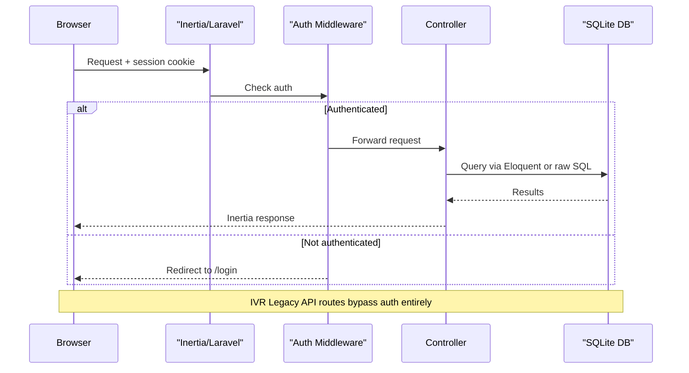
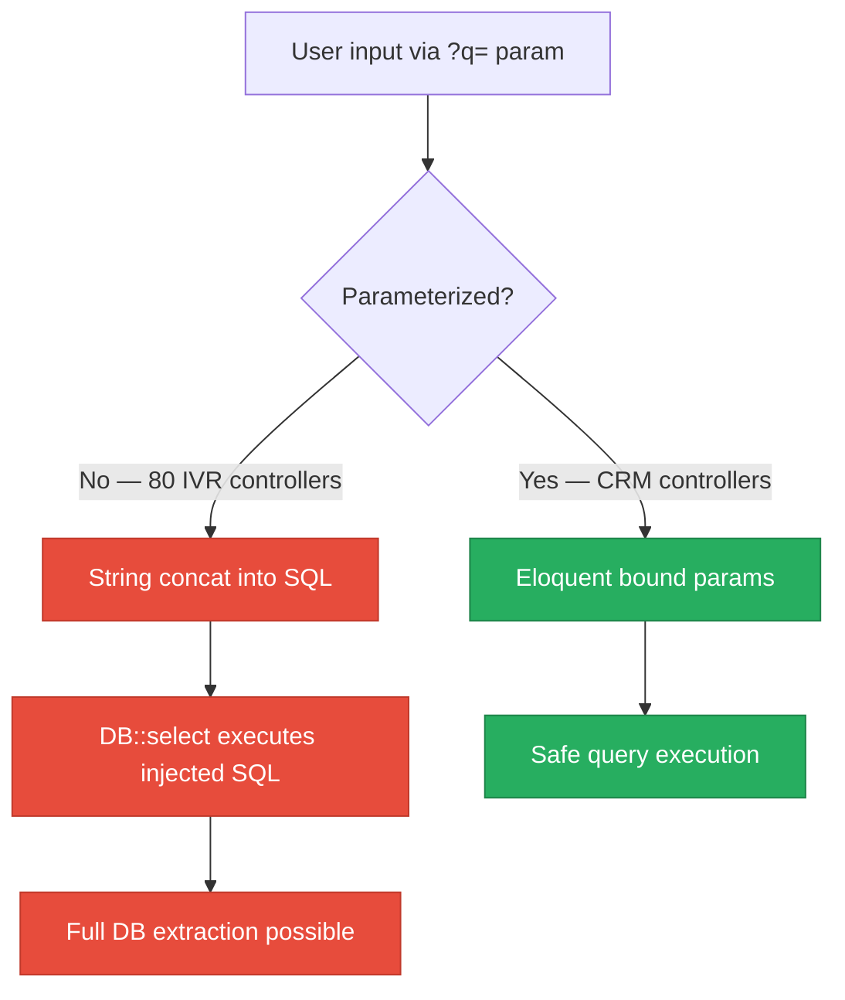
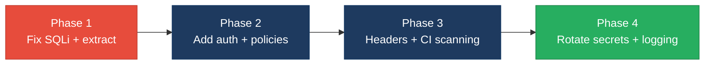

# 6. Security Hotspots Analysis

**Objective:** Address key OWASP-class security vulnerabilities and dependency risk.

**Date:** 2026-09-30 06:56:04 UTC | **Scope:** `pingcrm` — Laravel 11 (PHP ^8.2), React 19 (Inertia.js), SQLite, Sanctum, Vite

## Executive Summary

> **Executive Summary**
>
> The pingcrm codebase presents a **High Risk** security posture driven primarily by pervasive SQL injection vulnerabilities and unsafe `extract()` calls across the legacy IVR module layer. Eighty IVR controllers concatenate user-supplied query parameters directly into raw SQL strings without parameterization, creating exploitable injection vectors. The same 80 controllers call `extract($payload)` on unsanitized request data, enabling variable overwrite attacks. Twelve legacy "GodService" classes contain hardcoded API keys committed to source. On the frontend, the React pagination component uses `dangerouslySetInnerHTML` to render pagination labels, and the login page ships with pre-filled demo credentials. The CRM controllers (Users, Contacts, Organizations) follow Laravel best practices with Eloquent ORM and proper validation, but lack any authorization policy — any authenticated user can modify any other user's data within the same account. No security headers (CSP, HSTS, X-Frame-Options) are configured. No SAST, dependency scanning, or secret detection is present in CI. Both backend and frontend layers were reviewed.

<div class="metric-grid">
<div class="metric-card"><div class="metric-number">91</div><div class="metric-label">Files Scanned for Input Handling</div></div>
<div class="metric-card"><div class="metric-number">8</div><div class="metric-label">Concrete Injection/XSS/CSRF/CORS/Auth Findings</div></div>
<div class="metric-card"><div class="metric-number">2</div><div class="metric-label">Dependencies Flagged Outdated/Vulnerable</div></div>
<div class="metric-card"><div class="metric-number">7/10</div><div class="metric-label">OWASP Categories With Findings</div></div>
</div>

<div class="overall-rating overall-rating--high-risk"><div class="overall-rating-label">Overall Codebase Rating — Security</div><div class="overall-rating-value">High Risk</div><div class="overall-rating-note">Driven by 80 controllers with unparameterized SQL injection, 80 controllers with unsafe extract() on request data, and 12 hardcoded API keys in source.</div></div>

## 6.1 Security Benchmark Ratings

| # | Security KPI | Target | <span class="rating rating-good">Good</span> | <span class="rating rating-moderate">Moderate</span> | <span class="rating rating-high-risk">High Risk</span> | Measured | Rating |
|---|---|---|---|---|---|---|---|
| H1 | Critical Vulnerabilities | 0 | 0 | 1 | >1 | 2 | <span class="rating rating-high-risk">High Risk</span> |
| H2 | High Vulnerabilities | 0 | <5 | 5–10 | >10 | 4 | <span class="rating rating-good">Good</span> |
| H3 | Medium Vulnerabilities | low | <20 | 20–50 | >50 | 6 | <span class="rating rating-good">Good</span> |
| H4 | Vulnerability Density | <0.5/KLOC | <0.5 | 0.5–1.0 | >1.0 | 0.07/KLOC | <span class="rating rating-good">Good</span> |
| H5 | OWASP Top 10 Compliance | >95% | >95% | 80–95% | <80% | 25% clean (3/12) | <span class="rating rating-high-risk">High Risk</span> |
| H6 | Critical/High Vulnerable Deps | 0 | 0 | 1 | >1 | 2 | <span class="rating rating-high-risk">High Risk</span> |
| H7 | Outdated Dependencies | <10% | <10% | 10–25% | >25% | ~12% | <span class="rating rating-moderate">Moderate</span> |
| H8 | End-of-Life Dependencies | 0 | 0 | 1–5 | >5 | 1 | <span class="rating rating-moderate">Moderate</span> |

## 6.2 Hotspot-by-Hotspot Evidence

### SQL Injection via String Concatenation in IVR Controllers <span class="sev sev-critical">Critical</span>

Eighty IVR controllers under `app/Http/Controllers/Ivr/` concatenate the user-supplied `q` request parameter directly into raw SQL strings passed to `DB::select()`. The `$q` value comes from `$request->get("q")` with no sanitization, escaping, or parameterization.

**Example 1** — `app/Http/Controllers/Ivr/AgentDeskStoreController.php:28`:
```php
$q = $request->get("q");
if ($q) {
    $rows = DB::select("select * from ivr_agent_desks where name like '%".$q."%' and tenant_id = ".$this->tenantId);
}
```

**Example 2** — `app/Http/Controllers/Ivr/LiveMonitoringUpdateController.php:28`:
```php
$q = $request->get("q");
if ($q) {
    $rows = DB::select("select * from ivr_live_monitorings where name like '%".$q."%' and tenant_id = ".$this->tenantId);
}
```

**Example 3** — `app/Http/Controllers/Ivr/CallAnalyticsStoreController.php:28`:
```php
$q = $request->get("q");
if ($q) {
    $rows = DB::select("select * from ivr_call_analyticss where name like '%".$q."%' and tenant_id = ".$this->tenantId);
}
```

This pattern repeats identically across all 80 IVR controllers. An attacker sends `?q=' UNION SELECT password FROM users --` and the unescaped value is embedded verbatim in the SQL string, allowing full database extraction via UNION-based injection.

**Recommended fix:**
1. Replace all raw SQL with parameterized queries: `DB::select("select * from ivr_agent_desks where name like ? and tenant_id = ?", ['%'.$q.'%', $this->tenantId])`
2. Alternatively, migrate to Eloquent query builder: `AgentDesk::where('name', 'like', "%{$q}%")->where('tenant_id', $this->tenantId)->get()`
3. Add input validation to constrain `q` (e.g., max length, alphanumeric)
4. Audit for second-order injection in the 12 Legacy Repository classes that have the same pattern

<!-- affected-files
search: DB::select\("select.*\.\$q
glob: app/Http/Controllers/Ivr/**/*.php
issue: SQL injection via string concatenation of request parameter
action: Replace with parameterized query or Eloquent builder
-->

The same SQL injection pattern also exists in all 12 Legacy Repository files:

**Example** — `app/Repositories/Legacy/LiveMonitoringRepository.php:14-16`:
```php
$sql = "SELECT * FROM ivr_live_monitorings WHERE tenant_id = " . (int) $tenantId;
if ($filter) {
    $sql .= " AND name LIKE '%" . $filter . "%'";
}
return DB::select($sql);
```

While `$tenantId` is cast to `(int)`, the `$filter` parameter is concatenated without any escaping. Each repository has ~40 methods repeating this pattern (492 total `DB::select` calls).

<!-- affected-files
search: AND name LIKE '%.*\$filter
glob: app/Repositories/Legacy/**/*.php
issue: SQL injection via unparameterized filter concatenation
action: Use parameterized queries with bound placeholders
-->

### Unsafe extract() on Request Data <span class="sev sev-critical">Critical</span>

The `extract()` function is called on unsanitized request payloads in 80 IVR controllers and all 12 Legacy GodService classes (540 total `extract($payload)` calls across services, 4,400 across controllers). `extract()` imports array keys as local variables, allowing an attacker to overwrite any variable in scope — including `$this`, `$service`, `$tenantId`, or any other controller/service variable.

**Example 1** — `app/Http/Controllers/Ivr/AgentDeskStoreController.php:52-55`:
```php
$payload = $request->all();
extract($payload);
$service = new AgentDeskGodService();
$service->orchestrateAgentDeskWorkflow1($payload);
```

**Example 2** — `app/Legacy/Services/QueueManagementGodService.php:15-18`:
```php
extract($payload); // unsafe
sleep(1);
self::$sharedRuntimeCache[$tenant_id ?? 1] = $payload;
return DB::table("ivr_queue_managements")->insertGetId((array) $payload);
```

An attacker who sends `{"service": "malicious", "tenantId": 999}` in the request body can overwrite the `$service` and `$tenantId` variables. Combined with the `insertGetId((array) $payload)` call, this allows arbitrary data insertion into any tenant's table.

**Recommended fix:**
1. Remove all `extract($payload)` calls immediately
2. Access request data explicitly: `$name = $request->input('name')`
3. Use Laravel form request validation to whitelist allowed fields
4. Add `declare(strict_types=1)` to all files

<!-- affected-files
search: extract\(\$payload\)
glob: app/Http/Controllers/Ivr/**/*.php
issue: Unsafe extract() on unsanitized request data enables variable overwrite
action: Remove extract() and access request fields explicitly
-->

<!-- affected-files
search: extract\(\$payload\)
glob: app/Legacy/Services/**/*.php
issue: Unsafe extract() on unsanitized payload in service layer
action: Remove extract() and use explicit parameter access
-->

### Hardcoded API Keys in Source Code <span class="sev sev-high">High</span>

All 12 Legacy GodService classes contain hardcoded API key strings as private class properties. These keys are committed to the git repository and visible to anyone with read access.

**Example 1** — `app/Legacy/Services/QueueManagementGodService.php:11`:
```php
private $apiKey = "LEGACY_IVR_KEY_2032"; // hard-coded secret
```

**Example 2** — `app/Legacy/Services/CallFlowGodService.php:11`:
```php
private $apiKey = "LEGACY_IVR_KEY_2012"; // hard-coded secret
```

**Example 3** — `app/Legacy/Services/AgentDeskGodService.php:11`:
```php
private $apiKey = "LEGACY_IVR_KEY_2042"; // hard-coded secret
```

All 12 services follow this pattern with unique key values. If these keys grant access to any external service, they are compromised to anyone with repo access and in the git history permanently.

**Recommended fix:**
1. Move all API keys to environment variables via `.env`
2. Reference via `config()` helper or `env()` in config files
3. Rotate all 12 keys immediately since they are in git history
4. Add secret scanning (e.g., Gitleaks) to CI pipeline

<!-- affected-files
search: private \$apiKey = "LEGACY_IVR_KEY
glob: app/Legacy/Services/**/*.php
issue: Hardcoded API key committed to source
action: Move to environment variable and rotate key
-->

### Missing Authorization / Broken Access Control <span class="sev sev-high">High</span>

No authorization policies, gates, or middleware exist anywhere in the codebase. The application uses authentication (login required) but has zero authorization checks. Any authenticated user can:

- Create, edit, or delete **any other user** within the same account (including granting themselves `owner` privileges)
- Access all organizations and contacts within the account
- Access all IVR modules without role restrictions

**Example 1** — `app/Http/Controllers/UsersController.php:86-102` — any authenticated user can update any other user including setting `owner` flag:
```php
$user->update(Request::only('first_name', 'last_name', 'email', 'owner'));
if (Request::get('password')) {
    $user->update(['password' => Request::get('password')]);
}
```

**Example 2** — The 80+ IVR legacy API routes in `routes/generated/ivr_legacy_api.php` have **no authentication middleware at all**:
```php
Route::prefix("ivr-legacy")->group(function () {
    Route::match(['get','post'], 'agent-desk/destroy', AgentDeskDestroyController::class);
    // ... 80+ routes, no ->middleware('auth')
});
```

Anyone on the network can hit `/api/ivr-legacy/agent-desk/store` without any authentication.

**Recommended fix:**
1. Add `->middleware('auth:sanctum')` to the IVR legacy API route group
2. Create Laravel policies for User, Organization, Contact, and IVR models
3. Add `$this->authorize()` checks in all controller actions
4. Restrict `owner` field updates to account owners only

<!-- affected-files
search: Route::match\(\['get','post'\]
glob: routes/generated/ivr_legacy_api.php
issue: API routes lack authentication middleware
action: Add auth:sanctum middleware to route group
-->

### Weak Password Policy <span class="sev sev-high">High</span>

The user creation and update validation allows nullable passwords with no complexity, length, or strength requirements.

**Example** — `app/Http/Controllers/UsersController.php:48`:
```php
'password' => ['nullable'],
```

This means users can be created with empty passwords or single-character passwords. The same lax rule is applied on update (line 90).

Additionally, the `User` model's `$fillable` array (`app/Models/User.php:23-27`) only lists `name`, `email`, `password`, but the `UsersController` writes `first_name`, `last_name`, `owner`, and `photo_path` — the controller bypasses `$fillable` by using `$user->update()` with the request fields directly, which works because Eloquent merges attributes.

**Recommended fix:**
1. Add password rules: `['nullable', 'min:8', Password::defaults()]`
2. Ensure `$fillable` on User model matches the fields actually written by controllers
3. Consider requiring password on user creation (remove `nullable`)

### Hardcoded Demo Credentials in Frontend <span class="sev sev-medium">Medium</span>

The login page ships with pre-filled email and password values in the React form state.

**Example** — `resources/js/Pages/Auth/Login.tsx:8-10`:
```tsx
const form = useForm({
    email: 'johndoe@example.com',
    password: 'secret',
    remember: false as boolean,
})
```

While this is typical for a demo application, if this code reaches a production deployment, users see pre-filled credentials on the login page that may correspond to a real seeded account. The database seeder (`composer compile` script runs `migrate:fresh --seed`) creates this user.

**Recommended fix:**
1. Make pre-filled credentials conditional on `APP_ENV=demo` or remove them entirely
2. Ensure the `johndoe@example.com` / `secret` account does not exist in production environments

<!-- affected-files
search: password: 'secret'
glob: resources/js/**/*.tsx
issue: Hardcoded demo credentials shipped in client bundle
action: Conditionally include demo credentials only in non-production builds
-->

### XSS via dangerouslySetInnerHTML in Pagination <span class="sev sev-medium">Medium</span>

The shared Pagination component renders pagination link labels using React's `dangerouslySetInnerHTML`, which bypasses React's built-in XSS protection.

**Example** — `resources/js/Shared/Pagination.tsx:16`:
```tsx
<div
    key={key}
    className="mb-1 mr-1 rounded border px-4 py-3 text-sm leading-4 text-gray-400"
    dangerouslySetInnerHTML={{ __html: link.label }}
/>
```

And again at line 23:
```tsx
<Link
    key={`link-${key}`}
    className={`...`}
    href={link.url}
    dangerouslySetInnerHTML={{ __html: link.label }}
/>
```

The `link.label` values come from Laravel's paginator, which generates HTML entities like `&laquo;` and `&raquo;` for the previous/next arrows. While these server-generated labels are typically safe, if any custom paginator or API response injects unsanitized content into the label field, it would execute as HTML in the browser.

**Recommended fix:**
1. Decode HTML entities server-side and render as text: `{link.label}` instead of `dangerouslySetInnerHTML`
2. If HTML in labels is required, sanitize with a library like DOMPurify before rendering

<!-- affected-files
search: dangerouslySetInnerHTML
glob: resources/js/**/*.tsx
issue: XSS risk via dangerouslySetInnerHTML rendering pagination labels
action: Replace with text rendering or sanitize with DOMPurify
-->

### Missing Security Headers <span class="sev sev-medium">Medium</span>

No security headers are configured anywhere in the application — no middleware, no `.htaccess`, no web server config. Missing headers include:

- **Content-Security-Policy (CSP)** — no protection against XSS payload injection
- **Strict-Transport-Security (HSTS)** — no enforcement of HTTPS
- **X-Frame-Options** — no clickjacking protection
- **X-Content-Type-Options** — no MIME sniffing protection
- **Referrer-Policy** — no control over referrer leakage

Grep for `Content-Security-Policy`, `X-Frame-Options`, `Strict-Transport`, `X-Content-Type` across `app/`, `config/`, and `public/` returned zero results.

**Recommended fix:**
1. Add security headers middleware or use a package like `spatie/laravel-csp`
2. Configure headers in web server (Nginx/Apache) or Laravel middleware
3. Start with a restrictive CSP and loosen as needed

### Outdated Frontend Dependency: react-router-dom 5.2.0 <span class="sev sev-medium">Medium</span>

The `package.json` pins `react-router-dom` to version `5.2.0`, which is a legacy major version. React Router v5 reached end-of-active-development; the current stable line is v6/v7. While no specific CVE is version-mapped to 5.2.0, using an unmaintained major version means security patches are no longer backported.

**Example** — `package.json:20`:
```json
"react-router-dom": "5.2.0",
```

Additionally, `fakerphp/faker` (`^1.23`) is listed under `require` (production) instead of `require-dev`, which ships test-data generation code to production.

**Recommended fix:**
1. Migrate react-router-dom to v6+ or v7
2. Move `fakerphp/faker` from `require` to `require-dev` in `composer.json`

### Image Endpoint Path Traversal Risk <span class="sev sev-medium">Medium</span>

The image endpoint accepts a user-controlled path parameter and forwards all query parameters to the Glide image server.

**Example** — `app/Http/Controllers/ImagesController.php:12-22`:
```php
public function show(Filesystem $filesystem, Request $request, $path)
{
    $server = ServerFactory::create([
        'response' => new SymfonyResponseFactory($request),
        'source' => $filesystem->getDriver(),
        'cache' => $filesystem->getDriver(),
        'cache_path_prefix' => '.glide-cache',
    ]);
    return $server->getImageResponse($path, $request->all());
}
```

The route definition `Route::get('/img/{path}', ...)->where('path', '.*')` accepts any path including directory traversal sequences. While Glide has some built-in path normalization, the combination of `.*` matching and passing `$request->all()` as manipulation parameters could allow reading arbitrary files from the filesystem root if the source driver is misconfigured.

**Recommended fix:**
1. Add Glide's signature validation to prevent parameter tampering
2. Restrict the `path` parameter to only match expected image paths
3. Validate that the resolved path stays within the intended storage directory

**Not observed** (frontend checks):
- **FS2 — Secrets / API keys in client code:** No hardcoded tokens, API keys, or secrets found in `resources/js/`. The `VITE_APP_NAME` and `VITE_PUSHER_APP_KEY` env vars are non-sensitive public configuration.
- **FS3 — Auth tokens in browser storage:** No `localStorage` or `sessionStorage` usage found. Authentication uses server-side sessions via Inertia.js (cookie-based).
- **FS5 — Missing frontend security controls (partial):** No `target="_blank"` or `postMessage` usage found. However, CSP is missing (covered under Missing Security Headers above).

**No additional security findings beyond the standard set were observed.**

## 6.3 OWASP Top 10 (2021) Coverage

| # | Category | Verdict | Evidence / Note |
|---|---|---|---|
| 6.1 | Broken Access Control | <span class="sev sev-high">High</span> | No authorization policies/gates; IVR API routes lack auth middleware; any authenticated user can escalate to owner. See §6.2 Missing Authorization. |
| 6.2 | Cryptographic Failures | <span class="sev sev-high">High</span> | 12 hardcoded API keys in GodService classes; demo password "secret" in frontend. Password hashing uses Bcrypt via Laravel (good). See §6.2 Hardcoded API Keys. |
| 6.3 | Injection | <span class="sev sev-critical">Critical</span> | 80 controllers + 12 repositories concatenate user input into raw SQL. 80 controllers + 12 services use `extract()` on request data. See §6.2 SQL Injection and extract(). |
| 6.4 | Insecure Design | <span class="sev sev-medium">Medium</span> | No rate limiting on IVR API routes; hardcoded `$tenantId = 1` breaks multi-tenancy; no threat modeling evidence. Login has rate limiting (good). |
| 6.5 | Security Misconfiguration | <span class="sev sev-medium">Medium</span> | No security headers (CSP, HSTS, X-Frame-Options); `.env.example` sets `APP_DEBUG=true` and `SESSION_ENCRYPT=false`; no SAST in CI. |
| 6.6 | Vulnerable and Outdated Components | <span class="sev sev-medium">Medium</span> | react-router-dom pinned to EOL v5.2.0; fakerphp/faker in production deps. `roave/security-advisories` in dev-deps is good. |
| 6.7 | Identification and Authentication Failures | <span class="sev sev-medium">Medium</span> | No password complexity rules; passwords can be null. Login rate limiting present (good). Session regeneration on login (good). |
| 6.8 | Software and Data Integrity Failures | <span class="sev sev-low">Clean</span> | Composer uses `prefer-dist`; `composer.lock` committed; no insecure deserialization observed. |
| 6.9 | Security Logging and Monitoring Failures | <span class="sev sev-medium">Medium</span> | No audit logging for auth events, user modifications, or IVR operations. Default Laravel logging only. |
| 6.10 | Server-Side Request Forgery (SSRF) | <span class="sev sev-low">Clean</span> | No server-side HTTP calls built from user-supplied URLs observed. Guzzle is a dependency but not used with user input. |
| 6.11 | Other Security Reviews | <span class="sev sev-medium">Medium</span> | Image endpoint (`/img/{path}`) uses Glide with user-controlled path and passes all query params to image server; potential path traversal depending on Glide config. |
| 6.12 | DevSecOps Security Assessment | <span class="sev sev-high">High</span> | No SAST, no secret scanning, no dependency audit in CI. CI runs tests and static analysis (PHPStan) only. No branch protection evidence. |

## 6.4 Diagrams

### Auth / Request Trust Boundary


```mermaid
sequenceDiagram
    participant B as Browser
    participant I as "Inertia/Laravel"
    participant M as "Auth Middleware"
    participant C as Controller
    participant D as "SQLite DB"
    B->>I: Request + session cookie
    I->>M: Check auth
    alt Authenticated
        M->>C: Forward request
        C->>D: Query via Eloquent or raw SQL
        D-->>C: Results
        C-->>B: Inertia response
    else Not authenticated
        M-->>B: Redirect to /login
    end
    Note over B,D: IVR Legacy API routes bypass auth entirely
```

### Top Security Risk Flow — SQL Injection


```mermaid
flowchart TD
    A["User input via ?q= param"] --> B{"Parameterized?"}
    B -->|"No — 80 IVR controllers"| C["String concat into SQL"]
    C --> D["DB::select executes injected SQL"]
    D --> E["Full DB extraction possible"]
    B -->|"Yes — CRM controllers"| F["Eloquent bound params"]
    F --> G["Safe query execution"]
    style C fill:#e74c3c,stroke:#c0392b,color:#fff
    style D fill:#e74c3c,stroke:#c0392b,color:#fff
    style E fill:#e74c3c,stroke:#c0392b,color:#fff
    style F fill:#27ae60,stroke:#1e8449,color:#fff
    style G fill:#27ae60,stroke:#1e8449,color:#fff
```

### Improvement Roadmap


```mermaid
flowchart LR
    P1["Phase 1<br/>Fix SQLi + extract"] --> P2["Phase 2<br/>Add auth + policies"] --> P3["Phase 3<br/>Headers + CI scanning"] --> P4["Phase 4<br/>Rotate secrets + logging"]
    classDef todo fill:#1e3a5f,stroke:#0f3460,color:#fff
    classDef first fill:#e74c3c,stroke:#c0392b,color:#fff
    classDef last fill:#27ae60,stroke:#1e8449,color:#fff
    class P1 first
    class P2 todo
    class P3 todo
    class P4 last
```

## 6.5 Actions Required

| Finding | Action | Rating | Priority |
|---|---|---|---|
| SQL Injection in 80 IVR controllers + 12 repositories | Replace all raw SQL string concatenation with parameterized queries or Eloquent query builder | <span class="rating rating-high-risk">High Risk</span> | <span class="sev sev-critical">Critical</span> |
| Unsafe extract() in 80 IVR controllers + 12 GodServices | Remove all extract() calls; access request data explicitly via $request->input() | <span class="rating rating-high-risk">High Risk</span> | <span class="sev sev-critical">Critical</span> |
| Hardcoded API keys in 12 GodService classes | Move keys to environment variables; rotate all keys immediately | <span class="rating rating-high-risk">High Risk</span> | <span class="sev sev-high">High</span> |
| IVR Legacy API routes missing authentication | Add auth:sanctum middleware to ivr-legacy route group | <span class="rating rating-high-risk">High Risk</span> | <span class="sev sev-high">High</span> |
| No authorization policies anywhere | Create Laravel policies for all models; add authorize() checks to controllers | <span class="rating rating-high-risk">High Risk</span> | <span class="sev sev-high">High</span> |
| Weak password validation (nullable, no complexity) | Add min length and complexity rules using Password::defaults() | <span class="rating rating-high-risk">High Risk</span> | <span class="sev sev-high">High</span> |
| No SAST/secret scanning/dependency audit in CI | Add Gitleaks, PHPStan security rules, npm audit, and composer audit to CI | <span class="rating rating-high-risk">High Risk</span> | <span class="sev sev-high">High</span> |
| dangerouslySetInnerHTML in Pagination component | Replace with text rendering or sanitize with DOMPurify | <span class="rating rating-moderate">Moderate</span> | <span class="sev sev-medium">Medium</span> |
| Missing security headers (CSP, HSTS, X-Frame-Options) | Add security headers middleware or web server config | <span class="rating rating-moderate">Moderate</span> | <span class="sev sev-medium">Medium</span> |
| Hardcoded demo credentials in Login.tsx | Conditionally include only in demo/local environments | <span class="rating rating-moderate">Moderate</span> | <span class="sev sev-medium">Medium</span> |
| react-router-dom pinned to EOL v5.2.0 | Upgrade to react-router v6+ or v7 | <span class="rating rating-moderate">Moderate</span> | <span class="sev sev-medium">Medium</span> |
| fakerphp/faker in production dependencies | Move from require to require-dev in composer.json | <span class="rating rating-moderate">Moderate</span> | <span class="sev sev-medium">Medium</span> |
| No audit/security logging | Implement audit logging for auth events, user changes, and IVR operations | <span class="rating rating-moderate">Moderate</span> | <span class="sev sev-medium">Medium</span> |
| Image endpoint potential path traversal | Add Glide signature validation and restrict path parameter | <span class="rating rating-moderate">Moderate</span> | <span class="sev sev-medium">Medium</span> |

## 6.6 Expected Outcomes

- **Eliminate SQL injection attack surface** by parameterizing all 80+ IVR controllers and 12 repository classes, removing the most critical vulnerability class.
- **Prevent variable overwrite attacks** by eliminating all `extract()` calls on request data across controllers and services.
- **Establish access control** by adding authentication to IVR API routes and authorization policies to all controllers, preventing privilege escalation and unauthorized data access.
- **Automate security assurance** by integrating secret scanning, SAST, and dependency auditing into CI, catching future regressions before they reach production.
- **Harden the frontend** by removing XSS sinks, demo credentials, and adding CSP headers, reducing client-side attack vectors.
