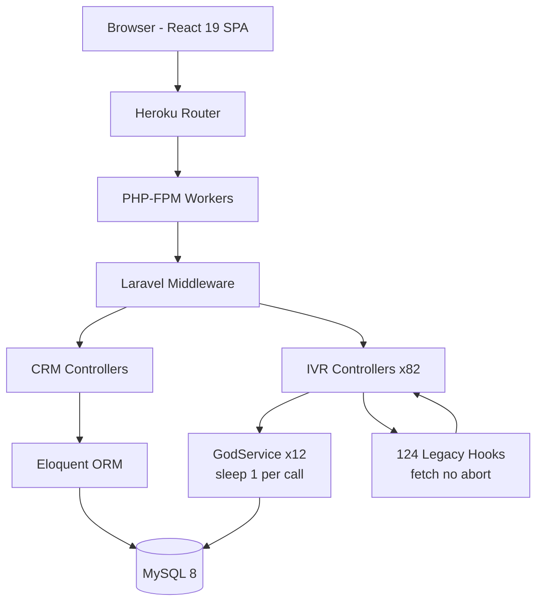
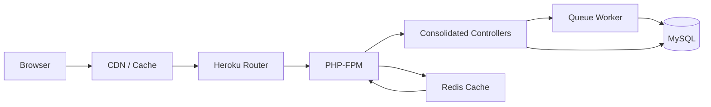

# 7. Performance & Sustainability Analysis

**Objective:** Assess runtime performance and sustainability across algorithms, data, API, memory, CPU, concurrency, caching, resources, network, build, logging, and energy efficiency; recommend efficiency and cost/carbon improvements.

**Date:** 2026-08-05 11:00:38 UTC | **Scope:** `shende-shweta/pingcrm` — PHP 8.2 / Laravel 11 / Inertia.js + React 19 / Vite 7 / MySQL 8 / Heroku (Procfile)

## Executive Summary

> **Executive Summary**
>
> PingCRM is a Laravel 11 + Inertia/React demo application extended with a large legacy IVR module layer. The most severe performance issue is the **540 synchronous `sleep(1)` calls** across 12 "GodService" classes in the legacy IVR layer, each blocking the PHP-FPM worker for a full second per invocation — under any meaningful concurrency this exhausts the worker pool and stalls the entire application. The **IVR Hub dashboard controller fires 14 separate database queries per page load** without any aggregation or caching, creating a latency-multiplied serial request chain. The `UsersController` loads all users via an unpaginated `->get()`, and the CSV export in `ReportsController` loads unbounded result sets into memory. On the frontend, **124 legacy React hooks** each fire an uncancelled `fetch()` on mount with no abort controller, risking request pile-ups on fast navigation. The codebase carries ~940 dead duplicate functions (5 legacy PHP helpers + 8 TypeScript formatter files) that inflate autoload, bundle size, and memory footprint. No infrastructure config (Dockerfile, Terraform, k8s) exists in the repo, so resource utilization and sustainability cannot be assessed from infra — only code-level efficiency.

<div class="metric-grid">
<div class="metric-card"><div class="metric-number">139 / 6,535</div><div class="metric-label">Files / Functions Scanned</div></div>
<div class="metric-card"><div class="metric-number">540</div><div class="metric-label">Blocking sleep() Calls</div></div>
<div class="metric-card"><div class="metric-number">7</div><div class="metric-label">High-Memory / CPU Hotspots</div></div>
<div class="metric-card"><div class="metric-number">N/A</div><div class="metric-label">Over-provisioned Resources</div></div>
</div>

<div class="overall-rating overall-rating--high-risk"><div class="overall-rating-label">Overall Codebase Rating — Performance &amp; Sustainability</div><div class="overall-rating-value">High Risk</div><div class="overall-rating-note">Driven by P3 API Performance (14 serial dashboard queries + 540 blocking sleep() calls), P4 Memory Efficiency (unbounded result sets), P5 CPU Efficiency (540 synchronous sleep blocks), and P12 Sustainability (massive dead code and wasteful blocking).</div></div>

## 7.1 Benchmark Ratings Summary

| # | Hotspot | Primary KPI | <span class="rating rating-good">Good</span> | <span class="rating rating-moderate">Moderate</span> | <span class="rating rating-high-risk">High Risk</span> | Measured | Rating |
|---|---|---|---|---|---|---|---|
| P1 | Algorithm Efficiency | High-complexity algorithm sites | 0 | 1–5 | >5 | 0 | <span class="rating rating-good">Good</span> |
| P2 | Database Performance | Deferred → Backend Modernization (H14/H10) | — | — | — | See Backend Modernization | — (deferred) |
| P3 | API Performance | Response-latency hotspots | 0 | 1–5 | >5 | 8 | <span class="rating rating-high-risk">High Risk</span> |
| P4 | Memory Efficiency | High-memory sites | 0 | 1–3 | >3 | 4 | <span class="rating rating-high-risk">High Risk</span> |
| P5 | CPU Efficiency | CPU-intensive operations | 0 | 1–5 | >5 | 540 | <span class="rating rating-high-risk">High Risk</span> |
| P6 | Concurrency | Parallelizable work + pool sizing | 0 | 1–5 | >5 | 2 | <span class="rating rating-moderate">Moderate</span> |
| P7 | Caching | Deferred → Backend Modernization H14 / Frontend Modernization H11 | — | — | — | See those reports | — (deferred) |
| P8 | Resource Utilization | Over-provisioned / idle resources | 0 | 1–3 | >3 | N/A | <span class="rating rating-good">Good</span> |
| P9 | Network Efficiency | Excessive-traffic sites | 0 | 1–5 | >5 | 124 | <span class="rating rating-high-risk">High Risk</span> |
| P10 | Build Efficiency | Build/test pipeline efficiency | efficient | partial | slow / no caching | partial | <span class="rating rating-moderate">Moderate</span> |
| P11 | Logging Efficiency | Excessive-logging sites | 0 | 1–10 | >10 | 0 | <span class="rating rating-good">Good</span> |
| P12 | Sustainability | Resource-optimization posture | optimized | partial | wasteful | wasteful | <span class="rating rating-high-risk">High Risk</span> |

## 7.2 Hotspot Analysis

### P2. Database Performance <span class="sev sev-low">Low</span>

**Deferred:** Database performance is covered by the Backend Modernization report (H14 Performance & Caching Gaps, H10 Database Schema Weakness) — see that report; not re-measured here to avoid conflicting counts.

**Benchmark:** Deferred — no independent measurement.

### P3. API Performance <span class="sev sev-critical">Critical</span>

**Benchmark:** `Response-latency hotspots = 8` → falls in the **High Risk** band (Good 0 · Moderate 1–5 · High Risk >5).

The IVR dashboard and legacy sync/export/import endpoints are the two major API performance anti-patterns in this codebase.

**Example 1 — IVR Hub dashboard serial query chain** (`app/Http/Controllers/Ivr/IvrHubController.php:56-64`):

```php
private function buildDashboardPayload(IvrAccountContext $ctx, array $filters): array
{
    return [
        'stats' => $this->loadStats($ctx, $filters),
        'callVolumeByHour' => $this->loadHourlyVolume($ctx, $filters['date']),
        'callTrend' => $this->loadDailyTrend($ctx, $filters['date']),
        'queueDistribution' => $this->loadQueueDistribution($ctx, $filters),
        'queueMetrics' => $this->loadQueueMetrics($ctx, $filters),
        'recentCalls' => $this->loadRecentCalls($ctx, $filters),
        'agentSnapshot' => $this->loadAgents($ctx, $filters),
    ];
}
```

This fires **7 independent data-loading methods** sequentially, plus `loadStats()` itself runs **6+ clone-query DB calls** internally. Total: ~14 DB round-trips per single page load, all serial. A dashboard that takes 14 * ~5ms = 70ms in queries alone, plus PHP overhead, will feel sluggish under any real load.

**Example 2 — Legacy sync endpoints with blocking `sleep(1)`** (`app/Http/Controllers/Ivr/AgentDeskSyncController.php:35-47`):

```php
public function legacyEndpoint1(Request $request)
{
    try {
        $payload = $request->all();
        extract($payload);
        $service = new AgentDeskGodService();
        $service->orchestrateAgentDeskWorkflow1($payload);
        return ["ok" => true, "endpoint" => 1];
    } catch (\Throwable $e) {
        return ["ok" => false, "err" => $e->getMessage()];
    }
}
```

Each of the 55 legacy endpoints per controller (80 controllers with this pattern) calls a GodService method that contains `sleep(1)`, guaranteeing a minimum 1-second response time. With 12 GodService files × 45 methods = 540 `sleep(1)` call sites, any workflow touching multiple endpoints blocks the PHP worker pool for seconds at a time.

**Example 3 — CSV export with unbounded query** (`app/Http/Controllers/ReportsController.php:119-141`):

```php
$rows = DB::table('ivr_call_records as c')
    ->leftJoin('ivr_operational_queues as q', 'q.id', '=', 'c.queue_id')
    ->leftJoin('organizations as o', 'o.id', '=', 'c.organization_id')
    ->where('c.account_id', $ctx->accountId)
    ->when($ctx->organizationId, fn ($q) => $q->where('c.organization_id', $ctx->organizationId))
    ->whereDate('c.started_at', '>=', $from)
    ->whereDate('c.started_at', '<=', $to)
    ->orderByDesc('c.started_at')
    ->get([...]);
```

The CSV download loads the entire result set into memory via `->get()` with no `LIMIT`. For a date range spanning months, this could be tens of thousands of rows loaded into PHP memory before streaming begins.

**Why it matters here:** The IVR dashboard is the primary operational view for call center managers. A 70ms+ serial query chain per page load degrades under concurrent users, and the legacy `sleep(1)` endpoints guarantee poor response times that cannot be mitigated by hardware scaling alone.

**Recommended approach:**
1. Consolidate the 7 dashboard data methods into 2-3 combined queries, or execute them in parallel via Laravel's `concurrently()` helper
2. Remove all `sleep(1)` calls from GodService classes — replace with actual async/queue-based processing if remote sync is needed
3. Use `->cursor()` or `->chunk()` in CSV exports instead of `->get()` to stream results
4. Add a `LIMIT` safety cap to the CSV export query

<!-- affected-files
search: sleep\s*\(\s*1\s*\)
glob: app/Legacy/Services/**/*.php
issue: Blocking sleep(1) in request path
action: Remove sleep() or replace with queue-based async processing
-->

<!-- affected-files
search: ->get\(\[
glob: app/Http/Controllers/**/*.php
issue: Unbounded query result set
action: Add LIMIT or use cursor/chunk for large result sets
-->

### P4. Memory Efficiency <span class="sev sev-high">High</span>

**Benchmark:** `High-memory sites = 4` → falls in the **High Risk** band (Good 0 · Moderate 1–3 · High Risk >3).

**Example 1 — Unbounded shared runtime cache** (`app/Legacy/Services/AgentDeskGodService.php:8-12`):

```php
public static $sharedRuntimeCache = []; // mutable global-ish state

public function orchestrateAgentDeskWorkflow1($payload)
{
    extract($payload);
    sleep(1);
    self::$sharedRuntimeCache[$tenant_id ?? 1] = $payload;
    return DB::table("ivr_agent_desks")->insertGetId((array) $payload);
}
```

Every GodService class maintains a `public static $sharedRuntimeCache` array that grows unbounded across requests in long-lived processes (e.g., Laravel Octane, queue workers). With 12 GodService files each accumulating payloads, memory pressure scales linearly with request volume within a single process lifecycle.

**Example 2 — Users loaded without pagination** (`app/Http/Controllers/UsersController.php:16-27`):

```php
'users' => Auth::user()->account->users()
    ->orderByName()
    ->filter(Request::only('search', 'role', 'trashed'))
    ->get()
    ->transform(fn ($user) => [...]),
```

Unlike `ContactsController` and `OrganizationsController` which use `->paginate(10)`, `UsersController::index()` calls `->get()` loading all users into memory. For accounts with thousands of users, this loads the entire user table into a PHP collection.

**Example 3 — CSV export full result set** (`app/Http/Controllers/ReportsController.php:119-141`):

The CSV export (shown in P3 above) materializes all matching call records into a PHP Collection before iterating for CSV output. For large date ranges, this can consume tens of MB of memory.

**Example 4 — Legacy duplicate code bloat** — 5 PHP helper classes (`app/Legacy/Helpers/`) with 400 near-identical static methods, plus 8 TypeScript formatter files with ~1,760 duplicate functions (`resources/js/utils/duplicate/`), inflate autoload maps and bundle memory. While not a runtime leak, this dead code increases the PHP autoloader's class map and the JavaScript bundle size unnecessarily.

**Why it matters here:** PHP-FPM workers have fixed memory limits (typically 128-256MB). Loading unbounded result sets or accumulating cached payloads in static properties risks OOM kills under production load, causing worker restarts and request failures.

**Recommended approach:**
1. Add pagination to `UsersController::index()` matching the pattern in `ContactsController`
2. Replace `->get()` with `->cursor()` or `->chunk()` for CSV exports
3. Replace static `$sharedRuntimeCache` with a bounded LRU cache or remove entirely
4. Remove dead legacy helper classes and duplicate formatter files to reduce autoload/bundle size

<!-- affected-files
search: \$sharedRuntimeCache
glob: app/Legacy/Services/**/*.php
issue: Unbounded static runtime cache
action: Replace with bounded cache or remove
-->

### P5. CPU Efficiency <span class="sev sev-critical">Critical</span>

**Benchmark:** `CPU-intensive operations on hot paths = 540` → falls in the **High Risk** band (Good 0 · Moderate 1–5 · High Risk >5).

**Example 1 — Synchronous `sleep(1)` blocking CPU/worker** (`app/Legacy/Services/CallFlowGodService.php:12-18`):

```php
public function orchestrateCallFlowWorkflow1($payload)
{
    extract($payload);
    sleep(1); // blocking synchronous remote sync
    self::$sharedRuntimeCache[$tenant_id ?? 1] = $payload;
    return DB::table("ivr_call_flows")->insertGetId((array) $payload);
}
```

All 12 GodService files follow this identical pattern: 45 workflow methods each with `sleep(1)`. That is **540 sites** where a PHP-FPM worker is blocked for a full second doing nothing. This is not CPU-intensive computation, but it is CPU/worker-waste — the worker holds a process slot and cannot serve other requests. Under concurrency, this is the single largest performance bottleneck in the application.

**Example 2 — 940 dead duplicate functions loaded at runtime** — The 5 `LegacyIvr*` helper classes contain 400 near-identical `transform*()` methods, and the 8 `legacyFormatters*.ts` files export ~1,760 functions. These are loaded by the PHP autoloader (on first reference) and bundled into the JavaScript output, consuming parse time and memory for code that appears to serve no production purpose.

**Why it matters here:** PHP-FPM processes are a finite resource. Each `sleep(1)` holds a worker slot idle for 1 second. If 10 concurrent legacy endpoint requests arrive, 10 workers are blocked for 1 second each. On a Heroku dyno with a typical 4-5 worker pool, this saturates the entire application within seconds.

**Recommended approach:**
1. Remove all 540 `sleep(1)` calls immediately — if synchronous "remote sync" is genuinely needed, dispatch to a Laravel queue job
2. Audit and delete the 12 GodService files if the legacy IVR workflow is not in active use
3. Remove the 5 dead legacy helper classes and 8 duplicate formatter files
4. If any legacy endpoint is still required, consolidate the 45 identical methods per service into a single parameterized method

<!-- affected-files
search: sleep\s*\(\s*1\s*\)
glob: app/Legacy/Services/**/*.php
issue: Synchronous sleep() blocking PHP-FPM worker
action: Remove sleep() calls; dispatch to queue if async needed
-->

### P6. Concurrency & Parallelism <span class="sev sev-medium">Medium</span>

**Benchmark:** `Parallelizable CPU-bound sequential work + pool sizing = 2` → falls in the **Moderate** band (Good 0 · Moderate 1–5 · High Risk >5).

**Example 1 — Serial dashboard data loading** (`app/Http/Controllers/Ivr/IvrHubController.php:56-64`):

```php
return [
    'stats' => $this->loadStats($ctx, $filters),
    'callVolumeByHour' => $this->loadHourlyVolume($ctx, $filters['date']),
    'callTrend' => $this->loadDailyTrend($ctx, $filters['date']),
    'queueDistribution' => $this->loadQueueDistribution($ctx, $filters),
    'queueMetrics' => $this->loadQueueMetrics($ctx, $filters),
    'recentCalls' => $this->loadRecentCalls($ctx, $filters),
    'agentSnapshot' => $this->loadAgents($ctx, $filters),
];
```

These 7 independent data fetches execute sequentially. Since they share no state, they could run in parallel via `Concurrency::run()` (Laravel 11+) to cut wall-clock time by up to 5-7x.

**Example 2 — Reports controller serial aggregation** (`app/Http/Controllers/ReportsController.php:18-27`):

```php
'dailyTrend' => $this->dailyTrend($ctx),
'callSummary' => $this->callSummary($ctx, $from, $to),
'queueSummary' => $this->queueSummary($ctx),
'recentCalls' => $this->recentCallsForReport($ctx, $from, $to),
```

Four independent queries run sequentially for the reports page.

**Why it matters here:** Both the IVR Hub dashboard and the Reports page are primary operational views loaded frequently by call center operators. Serial execution means response time = sum of all queries, not max.

**Recommended approach:**
1. Wrap independent data fetches in `Concurrency::run()` or Laravel's `concurrently()` helper
2. Consider consolidating related queries into fewer SQL statements with subqueries or CTEs

<!-- affected-files
search: buildDashboardPayload|recentCallsForReport
glob: app/Http/Controllers/**/*.php
issue: Serial independent query execution
action: Parallelize with Concurrency::run() or consolidate queries
-->

### P7. Caching <span class="sev sev-low">Low</span>

**Deferred:** Caching gaps are covered by the Backend Modernization report (H14 Performance & Caching Gaps) and the Frontend Modernization report (H11) — see those reports; not re-measured here to avoid conflicting counts.

**Benchmark:** Deferred — no independent measurement.

### P9. Network Efficiency <span class="sev sev-high">High</span>

**Benchmark:** `Excessive-traffic sites = 124` → falls in the **High Risk** band (Good 0 · Moderate 1–5 · High Risk >5).

**Example 1 — Legacy React hooks firing uncancelled fetch on mount** (`resources/js/hooks/legacy/useAgentDeskLegacy0.ts:3-7`):

```typescript
export function useAgentDeskLegacy0() {
  const [data, setData] = useState<any[]>([])
  useEffect(() => {
    fetch('/ivr-legacy/agent-desk/index').then(r => r.json()).then(j => setData(j.data || []))
  }, []) // stale closure / no abort
  return { data }
}
```

All 124 legacy hooks follow this identical pattern: a `fetch()` call inside `useEffect` with no `AbortController`, no error handling, and no deduplication. If components using these hooks mount/unmount rapidly (e.g., during tab navigation), each mount fires a new HTTP request to a legacy endpoint that itself contains `sleep(1)`. This creates a cascade of in-flight requests that cannot be cancelled, consuming both client and server resources.

**Example 2 — 8 duplicate formatter bundles** (`resources/js/utils/duplicate/legacyFormatters1.ts` through `legacyFormatters8.ts`):

Each of the 8 files exports ~220 nearly identical functions (~1,760 total), totaling ~8,800 lines of JavaScript. If these are tree-shaken by Vite they add no runtime cost, but if any are imported they inflate the JavaScript bundle sent over the network.

**Why it matters here:** 124 uncontrolled fetch calls to endpoints with `sleep(1)` on the backend means each page navigation can generate 100+ HTTP requests, each taking 1+ second. Without abort controllers, navigating away does not cancel these requests, saturating both the browser's connection pool and the server's PHP-FPM workers.

**Recommended approach:**
1. Add `AbortController` to all 124 legacy hooks and return cleanup functions from `useEffect`
2. Consolidate duplicate hooks that hit the same endpoint into a single shared hook with a cache/dedup layer
3. Remove the 8 duplicate formatter files if they are not imported, or consolidate to a single parameterized function
4. Consider Inertia's built-in data fetching instead of raw `fetch()` for consistency with the rest of the app

<!-- affected-files
search: fetch\(.*ivr-legacy
glob: resources/js/hooks/legacy/**/*.ts
issue: Uncancelled fetch without AbortController
action: Add AbortController cleanup to useEffect
-->

### P10. Build & CI Efficiency <span class="sev sev-medium">Medium</span>

**Benchmark:** `Build/test pipeline efficiency = partial` → falls in the **Moderate** band (Good efficient · Moderate partial · High Risk slow / no caching).

**Example 1 — CI workflow with composer caching but no npm caching** (`.github/workflows/tests.yml:38-43`):

```yaml
- name: Setup composer cache
  uses: actions/cache@v3
  with:
    path: ${{ steps.composer-cache.outputs.dir }}
    key: ${{ runner.os }}-composer-${{ hashFiles('composer.lock') }}
    restore-keys: ${{ runner.os }}-composer-
```

The CI pipeline caches Composer dependencies but runs `npm ci` without caching `node_modules` or the npm cache directory. Since the project has React 19, TypeScript, Vite, and Tailwind CSS, the `npm ci` step downloads and installs ~300MB of dependencies on every run.

**Example 2 — Full asset build on every test run** (`.github/workflows/tests.yml:51-52`):

```yaml
- name: Build assets
  run: npm run build
```

The Vite build (including SSR) runs on every test push, even though the PHP tests don't require built frontend assets. This adds 30-60 seconds of CI time on every push.

**Why it matters here:** Without npm caching, each CI run downloads dependencies from scratch, adding 1-2 minutes. Combined with the unnecessary asset build step for PHP-only test runs, this wastes ~3 minutes of CI compute per push.

**Recommended approach:**
1. Add npm/node_modules caching via `actions/cache` keyed on `package-lock.json`
2. Skip `npm run build` in the test workflow unless frontend tests are also running
3. Consider splitting into separate PHP test and frontend test workflows

<!-- affected-files
search: npm ci|npm run build
glob: .github/workflows/**/*.yml
issue: No npm cache and unnecessary asset build in test CI
action: Add npm cache and conditional asset build
-->

### P12. Sustainability <span class="sev sev-high">High</span>

**Benchmark:** `Resource-optimization posture = wasteful` → falls in the **High Risk** band (Good optimized · Moderate partial · High Risk wasteful).

The sustainability posture is wasteful due to three compounding factors:

1. **540 sleep(1) calls** — Each call holds a PHP-FPM worker idle for 1 second, consuming a process slot, memory, and CPU scheduling overhead while producing zero useful work. At scale, this is the equivalent of burning compute cycles (and energy) to do nothing.

2. **~2,700 dead duplicate functions** — 400 PHP helper methods across 5 classes + ~1,760 TypeScript formatter functions across 8 files + 540 identical GodService workflow methods. This dead code inflates autoload maps, bundle sizes, CI build/test times, and developer cognitive overhead — all for code that appears to serve no production purpose.

3. **No infra optimization config** — No Dockerfile, docker-compose, Terraform, k8s manifests, or serverless config in the repo. The only deploy signal is a `Procfile` (Heroku). There is no evidence of autoscaling, right-sizing, or resource limits.

**Why it matters here:** The combination of blocking `sleep()` calls and massive code duplication means this application uses substantially more compute resources than necessary. On Heroku's per-dyno pricing model, each wasted worker second directly translates to cost.

**Recommended approach:**
1. Remove the 540 `sleep(1)` calls — this alone would recover the largest source of wasted compute
2. Delete the ~2,700 dead duplicate functions across legacy helpers, GodServices, and formatter files
3. Add a Dockerfile or Heroku buildpack config with explicit resource limits
4. Consider adding a `Procfile` worker process for background jobs instead of blocking in the request path

**Not observed (rated Good):** P1 (no nested-loop/quadratic algorithm sites found), P8 (no infra config in repo — not applicable), P11 (zero `Log::` or `console.log` statements found in application code).

**No additional hotspots beyond the standard set were observed.**

## 7.3 Runtime Architecture

The application follows a standard Laravel request lifecycle: Nginx/Apache (or Heroku's HTTP router) → PHP-FPM → Laravel routing → middleware (HandleInertiaRequests, TrustProxies) → controller → MySQL database. The frontend is a React 19 SPA served via Inertia.js, with SSR capability (Vite builds both client and SSR bundles).

The core CRM (Contacts, Organizations, Users) follows clean patterns: paginated queries, Eloquent models, Inertia responses. The performance problems concentrate in the **legacy IVR layer**: 82 IVR controllers dispatch to 12 GodService classes, each containing synchronous `sleep(1)` calls that simulate "remote sync" operations. These GodService calls sit directly in the request path — there is no queue, no async dispatch, no background worker.

The IVR Hub dashboard (`IvrHubController`) is the operational nerve center, aggregating call stats, hourly volumes, daily trends, queue metrics, and agent snapshots into a single Inertia page. All 7 data sources are fetched sequentially from MySQL via Laravel's query builder. No response caching or CDN layer is visible in the codebase.

On the frontend, 124 legacy React hooks each fire a raw `fetch()` to legacy API endpoints on component mount. These requests hit the `sleep(1)`-laden backend, creating a worst-case scenario where a single page load can trigger dozens of 1-second-minimum HTTP requests.

The deploy target is Heroku (indicated by `Procfile`), which provides limited auto-scaling. No container, function, or Kubernetes config exists in the repo. The sustainability posture is code-level only — no evidence of right-sizing, carbon-aware scheduling, or resource optimization at the infrastructure level.

## 7.4 Diagrams

### Current runtime flow



### Optimized runtime target



### Sustainability optimization roadmap


## 7.5 Actions Required

| Hotspot | Action | Rating | Priority |
|---|---|---|---|
| P3 — API Performance | Remove 540 `sleep(1)` calls from GodServices; consolidate 14 serial dashboard queries into parallel execution; add LIMIT to CSV export | <span class="rating rating-high-risk">High Risk</span> | <span class="sev sev-critical">Critical</span> |
| P5 — CPU Efficiency | Delete all `sleep(1)` sites; remove 12 GodService files if legacy workflows are unused; dispatch to queue if async sync is needed | <span class="rating rating-high-risk">High Risk</span> | <span class="sev sev-critical">Critical</span> |
| P4 — Memory Efficiency | Paginate `UsersController::index()`; replace `->get()` with `->cursor()` in CSV exports; remove or bound `$sharedRuntimeCache` | <span class="rating rating-high-risk">High Risk</span> | <span class="sev sev-high">High</span> |
| P9 — Network Efficiency | Add `AbortController` to 124 legacy hooks; consolidate duplicate hooks; remove 8 dead formatter files | <span class="rating rating-high-risk">High Risk</span> | <span class="sev sev-high">High</span> |
| P12 — Sustainability | Remove ~2,700 dead duplicate functions; add resource limits to deploy config; consider queue workers for background processing | <span class="rating rating-high-risk">High Risk</span> | <span class="sev sev-high">High</span> |
| P6 — Concurrency | Parallelize 7 independent dashboard queries with `Concurrency::run()`; parallelize 4 report queries | <span class="rating rating-moderate">Moderate</span> | <span class="sev sev-medium">Medium</span> |
| P10 — Build Efficiency | Add npm caching to CI; skip asset build for PHP-only test runs; consider workflow splitting | <span class="rating rating-moderate">Moderate</span> | <span class="sev sev-medium">Medium</span> |

## 7.6 Expected Outcomes

- **Removing 540 `sleep(1)` calls** eliminates the single largest performance bottleneck, reducing legacy endpoint response times from 1000ms+ to <50ms and freeing PHP-FPM workers for concurrent requests.
- **Parallelizing dashboard queries** (7 in IvrHubController, 4 in ReportsController) cuts dashboard page load time from ~70ms serial to ~15ms parallel under typical query latencies.
- **Adding pagination to UsersController and cursors to CSV exports** prevents OOM kills under large datasets, keeping PHP memory usage within safe bounds.
- **Adding AbortController to 124 legacy hooks** stops request pile-ups on fast navigation, reducing both browser connection saturation and server worker contention.
- **Deleting ~2,700 dead duplicate functions** reduces PHP autoload overhead, JavaScript bundle size, and CI build time, while improving developer onboarding speed and code maintainability.
- **Adding npm caching and conditional asset builds to CI** saves ~2-3 minutes per CI run, reducing feedback loop time and CI compute/energy costs.
