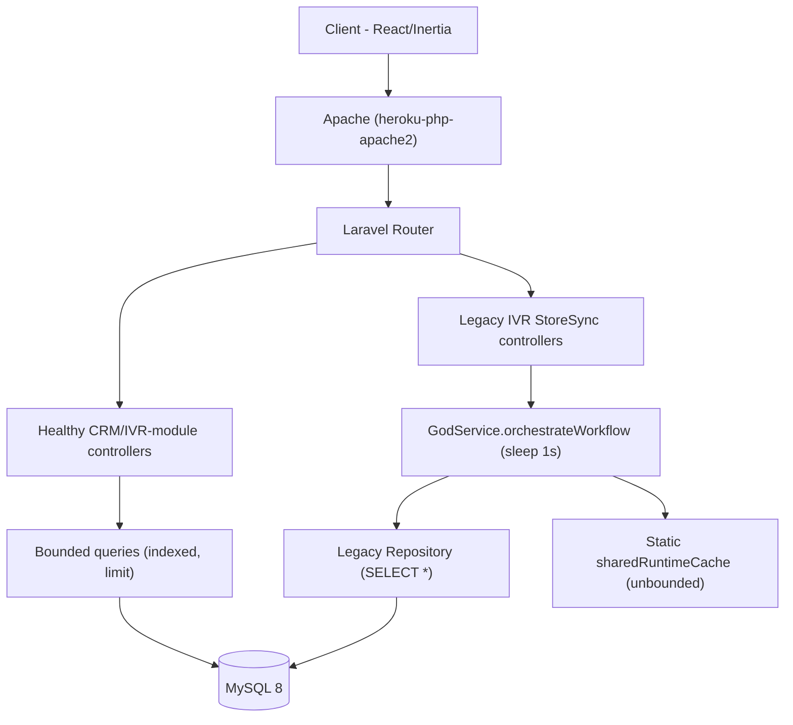
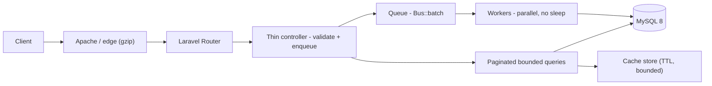

# 7. Performance & Sustainability Analysis

**Objective:** Assess runtime performance and sustainability across algorithms, data, API, memory, CPU, concurrency, caching, resources, network, build, logging, and energy efficiency; recommend efficiency and cost/carbon improvements.

**Date:** 2026-08-07 12:32:53 UTC | **Scope:** `shende-shweta/pingcrm` (`app/`, `routes/`, `.github/`) — PHP 8.2 / Laravel 11 + Inertia + React 19 (Vite), deployed via Heroku `Procfile` (`heroku-php-apache2`, MySQL 8).

## Executive Summary

> **Executive Summary**
>
> PingCRM's core CRM surface (Contacts, Organizations, Reports, IVR module views) is written well — the live read paths in `ReportsController` and the `LoadsIvrModuleData` trait use indexed, joined, `limit()`-bounded queries. The runtime-performance risk is concentrated entirely in a bolted-on "legacy IVR monolith" surface: twelve `*GodService` classes expose 540 workflow methods that each call `sleep(1)` as a synthetic "blocking synchronous remote sync", and each is wired to a live HTTP route through 4,400 thin `legacyEndpoint*` methods. Those blocking calls hold PHP-FPM/Apache workers for the full request, starving the worker pool, while an unbounded static `$sharedRuntimeCache` and 480 `SELECT *` repository methods plus 94 unbounded `->get()` calls load whole tenant tables into memory and Inertia payloads. The dominant hotspots are API latency (P3), memory retention (P4), and worker-pool concurrency (P6) — all High Risk. Sustainability posture is partial: an always-on Apache web process with no autoscaling wastes worker-seconds and energy on artificial sleeps, and the CI pipeline caches Composer but not npm and rebuilds all assets on every push.

<div class="metric-grid">
<div class="metric-card"><div class="metric-number">141</div><div class="metric-label">PHP Files Scanned (~77k LOC)</div></div>
<div class="metric-card"><div class="metric-number">0</div><div class="metric-label">High-Complexity (quadratic) Functions</div></div>
<div class="metric-card"><div class="metric-number">552</div><div class="metric-label">High-Memory / Latency Hotspots</div></div>
<div class="metric-card"><div class="metric-number">N/A</div><div class="metric-label">Over-provisioned Resources (no infra config)</div></div>
</div>

<div class="overall-rating overall-rating--high-risk"><div class="overall-rating-label">Overall Codebase Rating — Performance &amp; Sustainability</div><div class="overall-rating-value">High Risk</div><div class="overall-rating-note">Driven by P3 API latency (540 blocking <code>sleep(1)</code> sites), P4 memory (unbounded static cache + full-table loads), and P6 worker-pool starvation.</div></div>

## 7.1 Benchmark Ratings Summary

One row per hotspot. "Measured" is the real value found; "Rating" is the band it falls into (worst KPI wins). This table is the source for the Overall Codebase Rating banner above.

| # | Hotspot | Primary KPI | <span class="rating rating-good">Good</span> | <span class="rating rating-moderate">Moderate</span> | <span class="rating rating-high-risk">High Risk</span> | Measured | Rating |
|---|---|---|---|---|---|---|---|
| P1 | Algorithm Efficiency | High-complexity algorithm sites | 0 | 1–5 | >5 | 0 nested-loop/quadratic sites | <span class="rating rating-good">Good</span> |
| P2 | Database Performance | Deferred → Backend Modernization (H14/H10) | — | — | — | See Backend Modernization | — (deferred) |
| P3 | API Performance | Response-latency hotspots | 0 | 1–5 | >5 | 540 blocking `sleep(1)` + 174 unbounded reads | <span class="rating rating-high-risk">High Risk</span> |
| P4 | Memory Efficiency | High-memory sites | 0 | 1–3 | >3 | 12 static caches + 480 `SELECT *` + 94 `->get()` | <span class="rating rating-high-risk">High Risk</span> |
| P5 | CPU Efficiency | CPU-intensive operations | 0 | 1–5 | >5 | 0 (helpers are string appends, no real crypto/hashing) | <span class="rating rating-good">Good</span> |
| P6 | Concurrency | Parallelizable work + pool sizing (blocking-I/O → Backend Modernization H14) | 0 | 1–5 | >5 | 540 worker-blocking sites, no queue offload, no pool config | <span class="rating rating-high-risk">High Risk</span> |
| P7 | Caching | Deferred → Backend Modernization H14 / Frontend Modernization H11 | — | — | — | See those reports | — (deferred) |
| P8 | Resource Utilization | Over-provisioned / idle resources | 0 | 1–3 | >3 | N/A — no container/k8s/Terraform/serverless config (Procfile only) | <span class="rating rating-good">Good</span> |
| P9 | Network Efficiency | Excessive-traffic sites | 0 | 1–5 | >5 | 12 modules split into ~45 sequential endpoint calls each + oversized Inertia payloads | <span class="rating rating-moderate">Moderate</span> |
| P10 | Build Efficiency | Build/test pipeline efficiency | efficient | partial | slow / no caching | Composer cached; npm/node_modules **not** cached; full `vite build` + `--ssr` every push | <span class="rating rating-moderate">Moderate</span> |
| P11 | Logging Efficiency | Excessive-logging sites | 0 | 1–10 | >10 | 1 `Log::` call total; none in hot loops | <span class="rating rating-good">Good</span> |
| P12 | Sustainability | Resource-optimization posture | optimized | partial | wasteful | Always-on Apache dyno, no autoscaling, 540 artificial `sleep(1)` waste worker-seconds | <span class="rating rating-moderate">Moderate</span> |

**No additional hotspots beyond the standard set were observed.**

## 7.2 Hotspot Analysis

### P3. API Performance <span class="sev sev-critical">Critical</span>

**Benchmark:** `Response-latency hotspots = 540 blocking sleep(1) methods + 80 raw SELECT * handlers + 94 unbounded ->get()` → falls in the **High Risk** band (Good 0 · Moderate 1–5 · High Risk >5).

Every workflow method in the twelve `*GodService` classes performs a synchronous 1-second `sleep()` inside the request thread, then a single insert. Each method is exposed as a live route via `legacyEndpoint*` thin wrappers (4,400 of them across the Store/Sync controllers, routed in `routes/generated/ivr_legacy_api.php`).

```php
// app/Legacy/Services/CallAnalyticsGodService.php:13-19
public function orchestrateCallAnalyticsWorkflow1($payload)
{
    extract($payload); // unsafe
    sleep(1); // blocking synchronous remote sync
    self::$sharedRuntimeCache[$tenant_id ?? 1] = $payload;
    return DB::table("ivr_call_analyticss")->insertGetId((array) $payload);
}
```

```php
// app/Http/Controllers/Ivr/CallAnalyticsStoreController.php:44-56
public function legacyEndpoint1(Request $request)
{
    $payload = $request->all();
    extract($payload);
    $service = new CallAnalyticsGodService();
    $service->orchestrateCallAnalyticsWorkflow1($payload); // ≥1s wall-clock, blocking
    return ["ok" => true, "endpoint" => 1];
}
```

The same controllers' `handleStore`/`handleSync` render entire tenant tables with no pagination:

```php
// app/Http/Controllers/Ivr/CallAnalyticsSyncController.php:26-30
$rows = DB::select("select * from ivr_call_analyticss where name like '%".$q."%' and tenant_id = ".$this->tenantId);
// ... else:
$rows = CallAnalytics::where("tenant_id", $this->tenantId)->get(); // unbounded full-table load into Inertia prop
```

**Why it matters here.** Every legacy IVR endpoint has a hard 1-second floor regardless of load — a synthetic latency tax the healthy CRM paths never pay. Because `sleep()` blocks the PHP worker (not an event loop), P95 latency is bounded below by 1s and rises linearly as concurrent traffic exhausts the worker pool. The unbounded `->get()`/`SELECT *` handlers additionally serialize the whole tenant table into each Inertia response, so payload and latency grow with data volume rather than page size.

**Recommended approach.** (1) Delete the artificial `sleep(1)` from all 540 `orchestrate*Workflow*` methods, or if they model a real remote sync, move it to a queued `ShouldQueue` job dispatched from the controller and return `202` immediately. (2) Replace `CallAnalytics::where(...)->get()` in every `handle{Store,Sync}` with `->paginate()`. (3) Replace the raw `DB::select("select * ...")` handlers with bounded, column-projected query-builder calls mirroring `ReportsController::recentCallsForReport`.

<!-- affected-files
search: sleep\(1\)
glob: app/Legacy/Services/**/*.php
issue: Blocking synchronous sleep(1) on the request thread imposes a hard 1s latency floor per endpoint
action: Remove the artificial delay or offload the remote sync to a queued job; return before blocking
-->

<!-- affected-files
search: DB::select\("select \* from
glob: app/Http/Controllers/Ivr/**/*.php
issue: Raw unbounded SELECT * in the request handler loads whole tenant tables into the response
action: Replace with a bounded, column-projected, paginated query builder call
-->

### P4. Memory Efficiency <span class="sev sev-high">High</span>

**Benchmark:** `High-memory sites = 12 unbounded static caches + 480 SELECT * repo methods + 94 unbounded ->get()` → falls in the **High Risk** band (Good 0 · Moderate 1–3 · High Risk >3).

Each God service keeps a **static** array keyed by tenant that is written on every workflow call and never evicted. Static properties survive the whole PHP process, so under a long-running worker (Octane/persistent FPM) this grows unbounded across requests.

```php
// app/Legacy/Services/CallAnalyticsGodService.php:10, 17
public static $sharedRuntimeCache = []; // mutable global-ish state
// ...
self::$sharedRuntimeCache[$tenant_id ?? 1] = $payload; // retains full payload per tenant, forever
```

The Legacy repositories compound this with `SELECT *` and no `LIMIT` — 480 methods across twelve `*Repository` classes read every matching row into memory:

```php
// app/Repositories/Legacy/CallAnalyticsRepository.php:10-17
public function fetchChunk1($tenantId, $filter = null)
{
    $sql = "SELECT * FROM ivr_call_analyticss WHERE tenant_id = " . (int) $tenantId;
    if ($filter) { $sql .= " AND name LIKE '%" . $filter . "%'"; }
    return DB::select($sql); // no LIMIT, no column projection — whole table into an array
}
```

**Why it matters here.** The static cache retains the entire request payload per tenant with no cap or TTL, so a multi-tenant deployment leaks one payload-sized object per distinct tenant per worker lifetime — steadily raising heap pressure and GC cost until the worker is recycled. The `SELECT *` repositories and 94 unbounded `->get()` calls mean peak memory scales with table size, not page size, inviting OOM as IVR data grows.

**Recommended approach.** (1) Remove `static` from `$sharedRuntimeCache` (make it request-scoped) or replace it with Laravel's cache store with an explicit TTL and size bound. (2) Add `LIMIT`/pagination and explicit column lists to every `fetchChunk*` in `app/Repositories/Legacy/*`. (3) Audit the 94 `->get()` sites in `app/Http/Controllers/Ivr/**` and convert list endpoints to `paginate()`.

<!-- affected-files
search: sharedRuntimeCache
glob: app/Legacy/Services/**/*.php
issue: Unbounded static per-tenant cache retains payloads for the worker lifetime (memory leak under persistent workers)
action: Make request-scoped or move to a bounded cache store with TTL and size limit
-->

<!-- affected-files
search: SELECT \* FROM
glob: app/Repositories/Legacy/**/*.php
issue: Unbounded SELECT * with no LIMIT or column projection loads whole tables into memory
action: Add pagination/LIMIT and explicit column lists
-->

### P6. Concurrency & Parallelism <span class="sev sev-high">High</span>

**Benchmark:** `Worker-pool-starving blocking sites = 540; queue/async offload = none; pool-sizing config = none in repo` → falls in the **High Risk** band (Good 0 · Moderate 1–5 · High Risk >5).

This codebase runs on synchronous PHP (`heroku-php-apache2`), so the concern here is **worker/connection-pool starvation and sizing**, not async-framework blocking I/O. Each `sleep(1)` holds an Apache/PHP worker for the full second while doing no useful work; the twelve Sync controllers additionally call `orchestrate*Workflow1..45` — 45 sequential, independent, 1-second calls — so a full module sync serializes to ~45s of held-worker time.

```php
// app/Http/Controllers/Ivr/CallAnalyticsSyncController.php:50-102 (45 independent, sequential calls)
$service->orchestrateCallAnalyticsWorkflow1($payload);
$service->orchestrateCallAnalyticsWorkflow2($payload);
$service->orchestrateCallAnalyticsWorkflow3($payload);
// ... through Workflow45 — each blocks 1s, none depend on the previous
```

**Why it matters here.** A fixed worker pool (single Apache web process in the `Procfile`) that spends whole seconds sleeping serves far fewer concurrent requests than its CPU could — throughput collapses under even modest concurrency because workers are blocked, not busy. The 45 independent workflow calls are embarrassingly parallel yet run strictly sequentially. *(Converting the sleeps to non-blocking async I/O — e.g. queued jobs — is Backend Modernization's H14 lane; here the finding is the wasted worker capacity and the un-parallelized sequential fan-out.)*

**Recommended approach.** (1) Dispatch the 45 independent workflows as queued jobs (`Bus::batch`) so one HTTP request enqueues and returns instead of holding a worker for ~45s. (2) Right-size the worker/DB-connection pool for the real (non-sleeping) service time once the artificial delays are removed. (3) If any legacy sync must stay in-request, batch the independent inserts into a single `insert()` call rather than 45 round-trips.

<!-- affected-files
search: orchestrate\w+Workflow\d+
glob: app/Http/Controllers/Ivr/**/*.php
issue: 45 independent, blocking workflow calls run strictly sequentially, holding a worker for ~45s
action: Dispatch as a queued Bus::batch; parallelize independent work off the request thread
-->

### P9. Network Efficiency <span class="sev sev-medium">Medium</span>

**Benchmark:** `Excessive-traffic sites = 12 modules each split into ~45 sequential endpoint calls + oversized unbounded Inertia payloads` → falls in the **Moderate** band (Good 0 · Moderate 1–5 · High Risk >5; rated Moderate because payload-size overlaps P4 and gzip/brotli config is server-level and not present in the repo).

The legacy IVR surface decomposes one logical "sync" into 45 separate HTTP endpoints (`legacyEndpoint1..45` per Store/Sync controller, routed under `ivr-legacy/...`). A client completing a module sync must issue ~45 round-trips instead of one.

```php
// routes/generated/ivr_legacy_api.php — one route per action; sync work is fanned across many endpoints
Route::match(['get','post'], 'call-analytics/store', App\Http\Controllers\Ivr\CallAnalyticsStoreController::class);
Route::match(['get','post'], 'call-analytics/sync',  App\Http\Controllers\Ivr\CallAnalyticsSyncController::class);
```

Combined with the unbounded `->get()` payloads from P3/P4, each of those calls can also ship an entire tenant table over the wire.

**Why it matters here.** Chatty many-small-call designs multiply TCP/TLS setup, request overhead, and tail latency; 45 round-trips per sync is dominated by per-request overhead rather than useful work. Oversized uncompressed JSON payloads add bytes-on-the-wire cost that scales with data volume.

**Recommended approach.** (1) Coalesce the 45 per-module endpoints into one batch endpoint that accepts an array and processes it server-side (ideally on a queue, per P6). (2) Bound and paginate the list payloads (per P4) so responses are page-sized. (3) Enable gzip/brotli at the Apache/edge layer (outside the repo) once payloads are trimmed.

<!-- affected-files
search: legacyEndpoint\d+
glob: app/Http/Controllers/Ivr/**/*.php
issue: Chatty design — one logical sync fanned across dozens of tiny endpoints multiplies round-trips
action: Coalesce into a single batch endpoint accepting an array; paginate list payloads
-->

### P10. Build & CI Efficiency <span class="sev sev-medium">Medium</span>

**Benchmark:** `Composer cache present; npm/node_modules cache absent; full vite build + --ssr on every push` → falls in the **partial** band (Good efficient · Moderate partial · High Risk slow/no caching).

`tests.yml` caches the Composer directory but has no `actions/cache` (or `actions/setup-node` cache) for npm — `npm ci` re-downloads the full dependency tree every run — and it runs the complete `npm run build` (which is `vite build && vite build --ssr`) on every push with no incremental/asset caching.

```yaml
# .github/workflows/tests.yml:52-65,71 — Composer cached, npm not
- name: Setup composer cache
  uses: actions/cache@v3
  with:
    path: ${{ steps.composer-cache.outputs.dir }}
    key: ${{ runner.os }}-composer-${{ hashFiles('composer.lock') }}
# ...
- name: Install node dependencies
  run: npm ci                 # no node cache configured
- name: Build assets
  run: npm run build          # full client + SSR build every push
```

**Why it matters here.** Uncached `npm ci` plus a full double (`client` + `--ssr`) Vite build adds avoidable minutes and CI compute/energy to every push and PR, lengthening the feedback loop for a two-workflow (tests + static-analysis) pipeline.

**Recommended approach.** (1) Add `actions/setup-node@v4` with `cache: npm` (or an explicit `actions/cache` on `~/.npm` keyed by `package-lock.json`). (2) Cache the Vite build output / `node_modules/.vite` between runs. (3) Skip the asset build in the pure PHP test job if tests don't require built assets.

<!-- affected-files
glob: .github/workflows/tests.yml
issue: CI caches Composer but not npm, and rebuilds all assets (client + SSR) on every push
action: Add node dependency caching and cache/skip the Vite build; make builds incremental
-->

### P12. Sustainability <span class="sev sev-medium">Medium</span>

**Benchmark:** `Always-on Apache web process (Procfile), no autoscaling/carbon config, 540 artificial sleep(1) waste worker-seconds` → falls in the **partial** band (Good optimized · Moderate partial · High Risk wasteful).

The only deploy descriptor is a Heroku `Procfile` (`web: vendor/bin/heroku-php-apache2 public/`) — a single always-on web process with no autoscaling, no queue worker, and no spot/serverless or carbon-aware scheduling. The 540 `sleep(1)` calls burn wall-clock worker-seconds (and the energy behind them) doing nothing.

```
# Procfile
web: vendor/bin/heroku-php-apache2 public/
```

**Why it matters here.** Every artificial second of sleep is paid for in dyno/worker time and the energy to keep an always-on process warm while it blocks. Without autoscaling or off-peak/queue scheduling, the app consumes steady capacity regardless of demand, and the sleep tax converts directly into wasted cost and carbon.

**Recommended approach.** (1) Remove the artificial sleeps (P3) so worker-seconds map to real work. (2) Add a queue worker process and move sync work off the web dyno so the web tier can scale to zero/low at off-peak. (3) Adopt autoscaling and, where the platform supports it, carbon-aware / off-peak scheduling for the batch sync jobs.

<!-- affected-files
glob: Procfile
issue: Single always-on web process, no autoscaling or queue worker; artificial sleeps waste worker-seconds and energy
action: Add a queue worker, enable autoscaling, and remove artificial delays so capacity maps to real demand
-->

**Not observed (rated Good):** P1 Algorithm Efficiency — no nested-loop/quadratic sites over collections (helpers are flat string appends); P5 CPU Efficiency — no real hashing/encryption/compression on hot paths (the `LegacyIvrCrypto` "crypto" helpers just concatenate strings); P8 Resource Utilization — Not applicable, no container/k8s/Terraform/serverless config in repo (Procfile only); P11 Logging Efficiency — a single `Log::` call in the codebase and none inside hot loops.

## 7.3 Runtime Architecture

Today a browser request enters through Apache (`heroku-php-apache2`) into Laravel 11's front controller, routes through `routes/web.php` (the healthy CRM/IVR-module surface) or `routes/api.php` → `routes/generated/ivr_legacy_api.php` (the legacy IVR surface). The healthy path — `DashboardController`, `ReportsController`, and `IvrModuleController` via the `LoadsIvrModuleData` trait — issues indexed, joined, `limit()`-bounded MySQL queries and renders through Inertia to the React 19 client; these are efficient and sit off the risk path. The risk path is the legacy IVR surface: `*StoreController`/`*SyncController` (fat controllers with a hard-coded `tenantId`) instantiate a `*GodService`, whose `orchestrate*Workflow*` methods each `sleep(1)` and insert, backed by `*Repository` classes running `SELECT *`. The measured hotspots — 540 blocking sleeps (P3/P6), the unbounded static `$sharedRuntimeCache` and `SELECT *`/`->get()` loads (P4), and the 45-way sequential fan-out (P6/P9) — all live on this legacy path.

On sustainability/cost: the app is **always-on** (single Apache web process in the `Procfile`) with **no autoscaling**, **no queue worker**, and no container/k8s/Terraform/serverless sizing config in the repo, so P8 (right-sizing) can only be assessed from that Procfile and is marked Not applicable. The energy-relevant choice that *is* visible in code is the 540 artificial `sleep(1)` calls, which convert directly into wasted worker-seconds and carbon (P12).

## 7.4 Diagrams

### Current runtime flow


### Optimized runtime target


### Sustainability optimization roadmap

Derived from the Actions Required priorities below (Critical first).


## 7.5 Actions Required

| Hotspot | Action | Rating | Priority |
|---|---|---|---|
| P3 API Performance | Remove artificial `sleep(1)` from all 540 workflow methods; paginate/column-project the `handleStore`/`handleSync` reads | <span class="rating rating-high-risk">High Risk</span> | <span class="sev sev-critical">Critical</span> |
| P4 Memory Efficiency | Make `$sharedRuntimeCache` request-scoped or bounded-TTL cache; add LIMIT + column lists to 480 `fetchChunk*`; paginate 94 `->get()` sites | <span class="rating rating-high-risk">High Risk</span> | <span class="sev sev-high">High</span> |
| P6 Concurrency | Dispatch the 45 independent workflows as a queued `Bus::batch`; right-size worker/DB pools after sleeps are removed | <span class="rating rating-high-risk">High Risk</span> | <span class="sev sev-high">High</span> |
| P9 Network Efficiency | Coalesce the ~45 per-module endpoints into one batch endpoint; paginate list payloads; enable gzip/brotli at the edge | <span class="rating rating-moderate">Moderate</span> | <span class="sev sev-medium">Medium</span> |
| P10 Build Efficiency | Add npm/node caching to `tests.yml`; cache or skip the Vite build in the PHP test job | <span class="rating rating-moderate">Moderate</span> | <span class="sev sev-medium">Medium</span> |
| P12 Sustainability | Add a queue worker + autoscaling; remove artificial sleeps so capacity maps to demand; adopt off-peak/carbon-aware scheduling | <span class="rating rating-moderate">Moderate</span> | <span class="sev sev-medium">Medium</span> |

## 7.6 Expected Outcomes

- **Removing the 540 `sleep(1)` calls** eliminates a hard 1s-per-endpoint latency floor and frees the worker pool, cutting P95 latency and multiplying achievable concurrency on the same hardware.
- **Bounding the static cache and adding LIMIT/pagination** (480 `SELECT *` + 94 `->get()`) makes peak memory scale with page size instead of table size, removing OOM risk and GC pressure as IVR data grows.
- **Queuing the 45-way sequential fan-out as a `Bus::batch`** turns a ~45s blocking request into an immediate enqueue-and-return, restoring throughput under concurrency and letting independent work run in parallel.
- **Coalescing the chatty per-module endpoints and enabling compression** cuts round-trips and bytes-on-the-wire, lowering tail latency, bandwidth cost, and energy.
- **Caching npm/build in CI, adding autoscaling and a queue worker, and removing the artificial sleeps** shortens the feedback loop and lets the always-on web tier scale down at off-peak — reducing cloud cost and carbon footprint.
